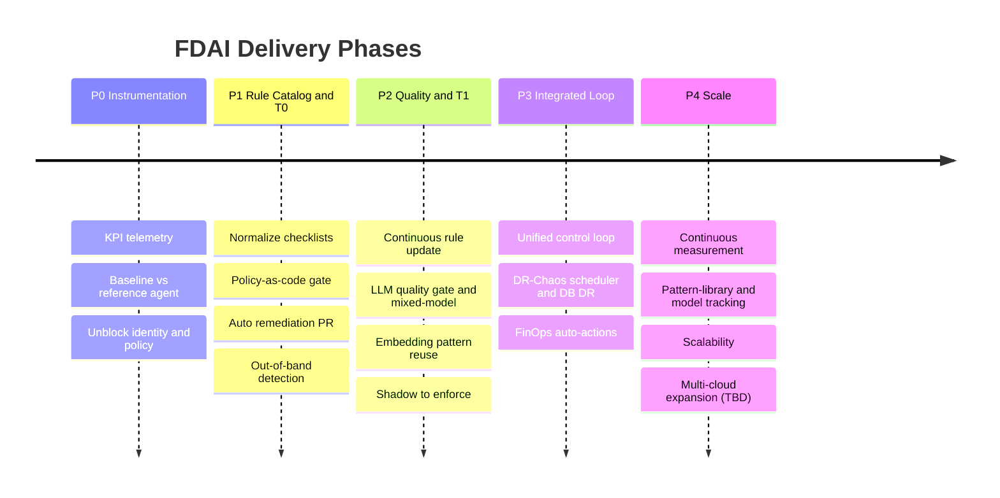

# FDAI 로드맵

FDAI 뒤편의 엔지니어링 계획. 이 폴더는
[copilot-instructions.md](../../.github/copilot-instructions.md)의 요약 원칙과
[architecture.instructions.md](../../.github/instructions/architecture.instructions.md)의
컨트롤 루프를, 목표·구조·배포·스케일-아웃을 아우르는 단계별 로드맵으로 확장합니다.

> **온라인으로 읽기:** [dotnetpower.github.io/fdai](https://dotnetpower.github.io/fdai/).
> 여기의 Markdown이 canonical 소스이며, 사이트는 이 파일들을 사이드바 · 우측 TOC ·
> 전문 검색 · 한/영 스위처와 함께 읽기 전용으로 마운트합니다. 마운트와 배포 방식은
> [site/](../../site/README.md) 참조.

> **범위:**이 저장소는 범용이며 고객-비종속입니다. 고객별 값은 포크에 있습니다
> ([generic-scope.instructions.md](../../.github/instructions/generic-scope.instructions.md)).
>
> **구현 초점:** Azure가 유일한 구현 대상입니다. 비-Azure 프로바이더와 Phase 4의
> 멀티 클라우드 확장은 TBD입니다. 이 문서들의 CSP-중립 추상화는 향후 어댑터가
> 추가적으로 붙을 수 있게 보존된 seam이지 납품 약속이 아닙니다
> ([Implementation Focus](../../.github/copilot-instructions.md#implementation-focus-must)).

## 한눈에 보는 설계

결정론 우선, 이벤트 기반, 위험 게이트. 3-tier 신뢰 라우터가 반복 가능한 이벤트를
규칙과 정책(T0)과 lightweight 유사도 재사용(T1)으로 해결하고, frontier 모델
추론(T2)은 모호한 잔여에만 할당합니다. 모든 자율 액션은 shadow 모드로 먼저 배포되며,
개별적으로 명시 승격됩니다. 커버리지 비중과 자율성 배수는 측정된 베이스라인 위에서만
주장 가능한 설계 목표입니다 ([goals-and-metrics-ko.md](architecture/goals-and-metrics-ko.md)).

## 이 폴더 읽는 법

레퍼런스 문서(1-18)는 시스템을 기술하고, 페이즈 문서(P0-P4)는 구축 순서를 시퀀싱합니다.
레퍼런스 먼저, 그 다음 페이즈 순서대로 읽습니다.

### Core 레퍼런스 (시스템 형태)

| # | 문서 | 다루는 내용 |
|---|------|-------------|
| 1 | [goals-and-metrics-ko.md](architecture/goals-and-metrics-ko.md) | 성공 기준, KPI, measurement-first 규칙 |
| 2 | [project-structure-ko.md](architecture/project-structure-ko.md) | 저장소 레이아웃, 모듈 경계, 컨트롤 루프 배선 |
| 3 | [tech-stack-ko.md](architecture/tech-stack-ko.md) | 언어, 프레임워크, 데이터 스토어, 이벤트 버스 |
| 4 | [csp-neutrality-ko.md](architecture/csp-neutrality-ko.md) | 코어를 CSP-neutral로 유지하는 wire-level 계약 |
| 5 | [llm-strategy-ko.md](architecture/llm-strategy-ko.md) | tier별 모델 선택, mixed-model 게이트, 추상화 |
| 6 | [security-and-identity-ko.md](architecture/security-and-identity-ko.md) | 최소 권한 identity, secrets, 안전 불변식 |
| 7 | [deployment-ko.md](deployment/deployment-ko.md) | IaC, CI/CD, 환경, 릴리스 / 롤백 |

### 규칙, 탐지, 운영

| # | 문서 | 다루는 내용 |
|---|------|-------------|
| 8 | [rule-catalog-collection-ko.md](rules-and-detection/rule-catalog-collection-ko.md) | 규칙 / 체크리스트 / 베이스라인의 출처와 YAML 형태 |
| 9 | [rule-governance-ko.md](rules-and-detection/rule-governance-ko.md) | 어드민이 규칙을 저작 / 스코핑 / 활성화 / 예외 처리하는 방식 (Azure Policy 유사) |
| 10 | [observability-and-detection-ko.md](rules-and-detection/observability-and-detection-ko.md) | 이벤트 상관, 이상 탐지, 예측, 근본 원인 분석 |
| 11 | [deploy-and-onboard-ko.md](deployment/deploy-and-onboard-ko.md) | 구체적인 Azure 리소스 인벤토리, 부트스트랩 순서, fork vs core 분리 |
| 11b | [hyperscale-cell-architecture-ko.md](architecture/hyperscale-cell-architecture-ko.md) | 구독 300개용 scale-out 청사진: 셀 기반 스트리밍, 정책-기반 fan-in, 2-평면 로깅, ADX 위의 CQRS 감사 인덱싱, 비용 엔벨로프, standard/sovereign 프로파일, Container Apps 기본(AKS 연기) |
| 12 | [startup-and-lifecycle-ko.md](operations/startup-and-lifecycle-ko.md) | 콜드 스타트, day-zero 카탈로그, shadow-first 롤아웃, discovery-loop 킥오프 |
| 13 | [operating-and-verification-ko.md](operations/operating-and-verification-ko.md) | 자체 헬스 신호, canary 이벤트, 스모크 테스트, 알림 라우팅, 런북 |
| 20 | [deployment-preflight-ko.md](deployment/deployment-preflight-ko.md) | 배포 전 가능성 및 blocker 수집: 프로브 분류법, readiness 리포트, blocker-테라폼-토글 매핑 |
| 20a | [preflight-active-reassembly-ko.md](deployment/preflight-active-reassembly-ko.md) | 능동 플랜 재조립: policy blocker를 capability-mode 토글로 재렌더된 terraform 플랜으로 바꿔 executor를 통해 remediation PR로 전달 (수렴 루프, stop-condition, 한계) |
| 21 | [assurance-twin-ko.md](operations/assurance-twin-ko.md) | 아키텍처 리뷰 / Q&A / assessment를 위한 질의가능 온톨로지 트윈: text-to-query, 선제 리뷰, 그래프 전체 what-if, shadow 제안 |
| 22 | [operational-readiness-ko.md](operations/operational-readiness-ko.md) | dev-to-ops 핸드오프 게이트: ownership-transfer 트리거, 전체 scope RBAC / 정책 / 신뢰성 리뷰, ReadinessReport, environment-promotion 게이트 |

### 비용, 사용자, 채널, 위험, 패리티

| # | 문서 | 다루는 내용 |
|---|------|-------------|
| 14 | [cost-model-ko.md](interfaces/cost-model-ko.md) | 최소 인벤토리의 월간 비용 봉투, T2 LLM 비용 분할, 트래픽 트리거 |
| 15 | [user-rbac-and-identity-ko.md](interfaces/user-rbac-and-identity-ko.md) | 사람 역할(Reader / Contributor / Approver / Owner + Break-Glass), Entra ID 아티팩트, console-to-PR identity 흐름 |
| 15b | [agent-stewardship-and-handover-ko.md](interfaces/agent-stewardship-and-handover-ko.md) | 사람 <-> 15-에이전트 인수인계 맵: steward(accountable / informed), maintainer(최소 1, 권장 2), 에스컬레이션 체인, 커버리지 + bus-factor |
| 16 | [channels-and-notifications-ko.md](interfaces/channels-and-notifications-ko.md) | 비-웹UI 채널(Teams / Slack / email / webhook / pager / SMS), 카테고리와 trust-tier 매트릭스 |
| 17 | [risk-classification-ko.md](decisioning/risk-classification-ko.md) | auto vs HIL vs deny 분류: 차원, 초기 규칙 표, 환경 감지 |
| 17b | [escalation-and-standing-authority-ko.md](decisioning/escalation-and-standing-authority-ko.md) | `hil` verdict 후 아무도 응답하지 않을 때 무슨 일이 벌어지는가: 감독형 OODA 루프, 영향도 tier 별 시간 감쇠 에스컬레이션 사다리(채널 fallback 과 구별), 상시 권한(사전 승인·envelope 경계·가역 전용 조건부 자동 조치를 결정론적 risk-gate 입력으로) |
| 18 | [dev-and-deploy-parity-ko.md](deployment/dev-and-deploy-parity-ko.md) | dev-mode local-fake vs deploy-mode Azure-first 패리티 계약, 배포자 스코프 LLM 프로비저닝 게이트 |
| 19 | [operator-console-ko.md](interfaces/operator-console-ko.md) | 대화형 surface (CLI / Teams / Slack / web), 3-layer 아키텍처, tool 별 RBAC 매트릭스, LLM tier 모델, 세션 지속성 |
| 20 | [action-ontology-ko.md](decisioning/action-ontology-ko.md) | ActionType 스키마 (remediation + ops + governance), trigger 축, tier / role / prod / live-probe 상한, fork override seam |
| 21 | [execution-model-ko.md](decisioning/execution-model-ko.md) | 통합 RiskGate, 5-axis authority 매트릭스, 3개 executor 경로 (PR-native / direct API / PR-manual), live-blast probe combinator, resolved_ceiling audit 블록 |

### 에이전트 조직

| # | 문서 | 다루는 내용 |
|---|------|-------------|
| 22 | [agent-pantheon-ko.md](agents/agent-pantheon-ko.md) | 온톨로지 first-class citizen 으로 고정된 15개 판테온 (Odin / Thor / Forseti / ...): 조직도, single-writer topic, two-port 모델 (typed pub/sub + conversational NL), fingerprint dedup 이 붙은 NL query 오케스트레이션, 사용자별 컨텍스트, 확장된 ActionType 역할 (initiator / judge / approver / executor / auditor), lifecycle 상태 머신, Heimdall 기반 권한 초과 감시 |
| 23 | [agent-workflows-ko.md](agents/agent-workflows-ko.md) | 판테온이 제품 capability 로 조합하는 10개 cross-agent 워크플로우: cost-aware remediation, predictive scale, DR drill orchestration, override -> discovery, security escalation, handoff -> capability, agent health degradation, judgment coherence audit, rollback rehearsal, retrospective what-if. 각 워크플로우는 trigger + sequence diagram + exit criteria + promotion gate 보유 |
| 23b | [process-automation-ko.md](decisioning/process-automation-ko.md) | agent-workflows.md 의 머신-리더블 대응물: Workflow 카탈로그 스키마 (`rule-catalog/workflows/` 아래 catalog-as-code), `Process` ObjectType + `targets` / `advances` LinkType, compile-to-Runbook 컨트롤 루프 배선, saga 보상, shadow-first 거버넌스. 비즈니스 프로세스는 trust-router 가 한 번에 하나씩 dispatch 하는 `ActionType` 스텝의 순서 리스트다 |

### 프롬프트 서브시스템

| # | 문서 | 다루는 내용 |
|---|------|-------------|
| 24 | [prompt-composition-ko.md](decisioning/prompt-composition-ko.md) | 진화하는 시스템 프롬프트: role x layer 매트릭스, 툴 / 웹 검색, debate orchestrator, 인식 측정 |
| 24b | [hallucination-rubric-gate-ko.md](decisioning/hallucination-rubric-gate-ko.md) | T2용 빼기 전용 루브릭 환각 필터: 기준별 judge 채점을 `min()` 으로 confidence에 반영, self-consistency 샘플러, shadow-before-enforce 승격 |

### 리포팅 서브시스템

| # | 문서 | 다루는 내용 |
|---|------|-------------|
| 24b | [reporting-subsystem-ko.md](interfaces/reporting-subsystem-ko.md) | 선언적 시각화 파이프라인: YAML 리포트 카탈로그, 4개 레지스트리(datasource / widget / format / catalog), 16개 기본 위젯 빌더(Datadog-inspired), 기존 seam 위 5개 datasource 어댑터, JSON / Markdown / CSV encoder, 4개의 `GET /reports/*` 라우트, 포크 확장 레시피 (report / datasource / widget / format / prefix 추가). BE-only, read-only, 추가되어도 FE 계약이 안정적으로 유지. |

### 순서 확정 (문서 통합 플랜)

| # | 문서 | 다루는 내용 |
|---|------|-------------|
| 25 | [implementation-plan-ko.md](fork-and-sequencing/implementation-plan-ko.md) | 2026-07-06 트랜치 문서 전반에 걸친 순서 확정. 여섯 개의 표준 세트 설계 결정(R1 축 파생, R2 ConsoleTool = ActionType 프로젝션, R3 통합 LlmBinding, R4 공유 projection 프리미티브, R6 operator_memory = 감사 로그 view, R7 pr_manual = 플래그)과 웨이브 플랜 (F -> D1 -> W1 -> W2 -> M1, Twin과 Preflight 병렬 트랙 포함) |
| 26 | [agent-pantheon-implementation-ko.md](agents/agent-pantheon-implementation-ko.md) | 판테온 롤아웃 웨이브 계획 (W0 docs -> W1 scaffolding -> W2 governance -> W3 pipeline -> W4 interface -> W5 specialists -> W6 handoff / security -> W7 workflows -> W8 KPI + promotion + degradation drill); 모든 웨이브는 측정 가능한 exit gate 를 가지며 판테온 invariant (single-writer topic, judge != executor, Saga / Vidar hard dependency) 를 유지 |

## 페이즈 타임라인

페이즈는 엄격히 순차(P0 -> P1 -> P2 -> P3 -> P4)이며 각 페이즈 문서는 선행 조건을
*Dependencies* 섹션에 명시합니다. 버티컬 커버리지는 점진적으로 랜딩됩니다: P1에서
Change Safety, P3에서 Resilience와 Cost Governance. 멀티 클라우드는 P4에서 TBD로
남습니다 (Azure-only 구현,
[Implementation Focus](../../.github/copilot-instructions.md#implementation-focus-must)).

## 페이즈 요약

Exit 컬럼은 각 페이즈의 primary gate입니다. 각 페이즈 문서는 완전한 exit 기준과
의존성을 나열합니다.

| Phase | 목표 | 주요 산출물 | Primary exit gate |
|-------|------|-------------|-------------------|
| **[P0](phases/phase-0-instrumentation-ko.md)** | 계기화와 언블록 | KPI 대시보드, 베이스라인 리포트, identity / policy 블로커 해소 | 재현 가능한 베이스라인 존재 |
| **[P1](phases/phase-1-rule-catalog-t0-ko.md)** | 결정론 코어 | 규칙 카탈로그, T0 엔진, 정책 게이트, remediation PR | Change gate가 shadow로 동작 |
| **[P2](phases/phase-2-quality-and-t1-ko.md)** | 품질과 lightweight tier | 규칙 갱신 파이프라인, LLM quality gate (T2 방어), T1 유사도 재사용 | P0 베이스라인 대비 자동 해결 비율 검증 |
| **[P3](phases/phase-3-integrated-loop-ko.md)** | 통합 자율성 | 통합 루프, DR / chaos 스케줄러, cost 자동 액션 | 3개 버티컬 전반 자율 MVP |
| **[P4](phases/phase-4-scale-ko.md)** | 스케일 아웃 (Azure) | 지속 측정, 패턴 라이브러리와 모델 추적, 확장성. 멀티 클라우드 어댑터는 TBD | Azure 베이스라인 위에서 guard 지표 안정 |

## 전반에 적용되는 가드레일

- **Measurement first**: 텔레메트리 없이는 자율성 없음. 측정된 베이스라인 없이는
  배수 / 커버리지 주장 없음.
- **Shadow before enforce**: 모든 신규 액션은 판정 전용으로 배포된 뒤, 개별적으로
  명시 승격. 리그레션은 자동 강등.
- **Choose the safer default when the outcome is uncertain**: 낮은 confidence, verification 실패, budget / rate 초과는
  HIL로 강등되며, 게이트 없는 자동 액션으로는 절대 강등되지 않음.
- **모든 액션의 안전 불변식**: 정지 조건, 롤백 경로, blast-radius 한계, 감사 로그
  엔트리 ([security-and-identity-ko.md](architecture/security-and-identity-ko.md)).
- **멱등 액션**: 재전달된 이벤트와 재시도된 액션은 이중 적용되지 않음.
- **직무 분리**: 승인과 실행은 서로 다른 주체.
  콘솔은 읽기 전용 ([security-and-identity-ko.md](architecture/security-and-identity-ko.md)).
- **영어 전용, 고객-비종속 아티팩트**
  ([generic-scope.instructions.md](../../.github/instructions/generic-scope.instructions.md)).
  한국어는 유지 관리자 채팅에서만.

## 다음 단계

| 목적 | 시작 지점 |
|------|-----------|
| 3-tier 컨트롤 루프 이해 | [architecture.instructions.md](../../.github/instructions/architecture.instructions.md) |
| 서브시스템의 소스, 테스트, 설계 문서 찾기 | [architecture/code-map-ko.md](architecture/code-map-ko.md) |
| 구체적인 Azure 리소스 인벤토리 확인 | [deploy-and-onboard-ko.md](deployment/deploy-and-onboard-ko.md) |
| P0 베이스라인 계기화 따라 하기 | [phases/phase-0-instrumentation-ko.md](phases/phase-0-instrumentation-ko.md) |
| 모든 자율 액션의 안전 규칙 읽기 | [../../.github/instructions/coding-conventions.instructions.md](../../.github/instructions/coding-conventions.instructions.md) |
| 카탈로그에 새 규칙 기여 | [../../rule-catalog/RULE_AUTHORING_GUIDE.md](../../rule-catalog/RULE_AUTHORING_GUIDE.md) |

## 캐노니컬 다이어그램

설계 문서 간 drift를 막기 위해 소수 다이어그램을 **캐노니컬**로 지정한다.
하위 문서는 같은 형태를 다시 그리지 말고 아래 위치로 링크해야 한다.

| 다이어그램 | 캐노니컬 위치 |
|-----------|--------------|
| 컨트롤 루프 (event -> tier -> gate -> action -> audit) | [architecture.instructions.md § Control Loop](../../.github/instructions/architecture.instructions.md#control-loop) |
| 에이전트 판테온 (15명 조직도) | [agents/agent-pantheon.md](agents/agent-pantheon.md) |
| 모노레포 레이아웃 | [architecture/project-structure-ko.md § 모노레포 레이아웃](architecture/project-structure-ko.md#모노레포-레이아웃) |
| 서브시스템 인덱스 (소스 -> 테스트 -> 문서) | [architecture/code-map-ko.md](architecture/code-map-ko.md) |

같은 개념의 다른 시각이 필요한 문서는 캐노니컬 형태를 바꿔 그리지 말고
도메인 특화된 mermaid를 사용해야 한다. 캐노니컬 다이어그램 자체를 바꿔야
할 때는 캐노니컬 위치를 한 번 편집하면 로드맵 리뷰가 변경 사항을 파급한다.
