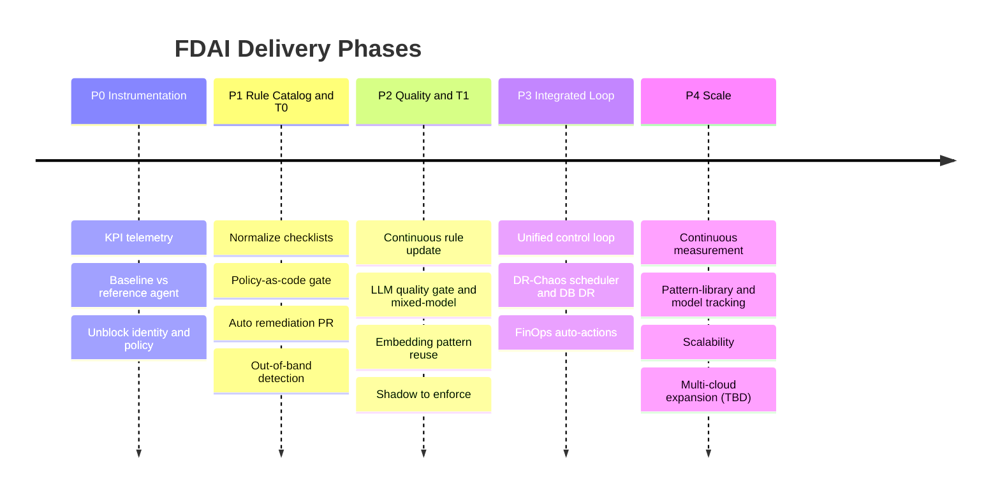

# FDAI 로드맵

FDAI의 엔지니어링 계획입니다. [FDAI 헌법](architecture/fdai-constitution-ko.md)이 최상위
설계 권위를 정의합니다. 이 폴더는
[copilot-instructions.md](../../.github/copilot-instructions.md)의 요약 원칙과
[architecture.instructions.md](../../.github/instructions/architecture.instructions.md)의 컨트롤
루프를 실행 가능한 단계별 로드맵으로 확장하며, 목표와 구조에서 배포 및 확장까지 다룹니다.

> **온라인으로 읽기:** [dotnetpower.github.io/fdai](https://dotnetpower.github.io/fdai/).
> 여기의 Markdown이 기준 원본입니다. 사이트는 이 파일들을 사이드바, 우측 목차,
> 전문 검색, 한/영 전환 기능과 함께 읽기 전용으로 제공합니다. 구성과 배포 방식은
> [site/](../../site/README.md)을 참조하세요.

> **범위:** 이 저장소는 범용이며 특정 고객에 종속되지 않습니다. 배포 값은 환경 구성 또는
> 비밀 저장소에서 관리하고, 선택적 다운스트림 배포판은 지원되는 확장 지점을 통해 기능을
> 제한하거나 확장합니다.
> ([generic-scope.instructions.md](../../.github/instructions/generic-scope.instructions.md)).
>
> **구현 초점:** 현재 구현 대상은 Azure뿐입니다. 비-Azure 공급자와 P4의 멀티 클라우드
> 확장은 추후 검토 대상입니다. 이 문서의 CSP 중립 추상화는 향후 어댑터를 추가할 수 있도록
> 보존한 확장 지점이며, 제공 시점을 약속하는 것은 아닙니다
> ([구현 Focus](../../.github/copilot-instructions.md#implementation-focus-must)).

## 한눈에 보는 설계

FDAI는 결정론 우선, 이벤트 기반, 위험 통제 방식으로 작동합니다. 3-tier 신뢰 라우터는
반복 가능한 이벤트를 규칙과 정책(T0), 경량 유사 사례 재사용(T1)으로 해결하고, frontier
모델 추론(T2)은 남은 모호한 사례에만 사용합니다. 모든 자율 액션은 관찰 모드에서 먼저
검증한 뒤 개별적으로 승격합니다. 처리 비중과 자율성 배수는 측정된 기준선이 있을
때만 주장할 수 있습니다 ([goals-and-metrics-ko.md](architecture/goals-and-metrics-ko.md)).

## 이 폴더 읽는 법

참조 문서는 시스템을 설명하고, 단계 문서(P0-P4)는 구축 순서를 제시합니다.
참조 문서를 먼저 읽은 다음 단계 문서를 순서대로 읽으세요.

### 핵심 참조 문서 (시스템 구조)

| # | 문서 | 다루는 내용 |
|---|------|-------------|
| 0 | [fdai-constitution-ko.md](architecture/fdai-constitution-ko.md) | 목적, 보장, 권한 우선순위, 도메인, 자율성 및 개정 규칙 |
| 1 | [goals-and-metrics-ko.md](architecture/goals-and-metrics-ko.md) | 성공 기준, KPI, measurement-first 규칙 |
| 2 | [project-structure-ko.md](architecture/project-structure-ko.md) | 저장소 레이아웃, 모듈 경계, 컨트롤 루프 배선 |
| 3 | [tech-stack-ko.md](architecture/tech-stack-ko.md) | 언어, 프레임워크, 데이터 스토어, 이벤트 버스 |
| 4 | [csp-neutrality-ko.md](architecture/csp-neutrality-ko.md) | 코어를 CSP-neutral로 유지하는 wire-level 계약 |
| 5 | [llm-strategy-ko.md](architecture/llm-strategy-ko.md) | 계층별 모델 선택, mixed-model 게이트, 추상화 |
| 5a | [operating-ontology-ko.md](architecture/operating-ontology-ko.md) | 서비스, 워크로드, 목표, 결정, 효과, 에이전트 소유권, 통제된 확장을 위한 공유 cloud-operations 의미 |
| 5b | [outcome-assurance-ko.md](architecture/outcome-assurance-ko.md) | FDAI의 세 버티컬을 대상으로 하는 운영 준비도, 목표 정렬, 통제 보증 변환 결과 |
| 5c | [operating-ontology-platform-ko.md](architecture/operating-ontology-platform-ko.md) | Agent-supporting 온톨로지 안전성 infrastructure: exact release, 범위가 제한된 객체 집합, 변경 계획, 타입이 지정된 함수, 조정, SDK |
| 5d | [operating-ontology-metamodel-ko.md](architecture/operating-ontology-metamodel-ko.md) | Operational 관점, 정본 선언 종류, 상태/맥락 경계, 권한, 시간, 소유권 및 가산 이행 |
| 6 | [security-and-identity-ko.md](architecture/security-and-identity-ko.md) | 최소 권한 신원, secrets, 안전 불변식 |
| 7 | [deployment-ko.md](deployment/deployment-ko.md) | IaC, CI/CD, 환경, 릴리스 / 롤백 |
| 7a | [architecture-review-board-ko.md](architecture/architecture-review-board-ko.md) | 정본 ARB 패킷: 결정 경계, 근거 계약, 소유자, 의존성, 운영 종료 게이트 |
| 7b | [data-governance-ko.md](architecture/data-governance-ko.md) | 데이터 인벤토리, 분류, 수명 주기, privacy 평가, model-provider/compliance 근거 |
| 7c | [아키텍처 결정 기록](architecture/decisions/README-ko.md) | ADR register와 승인된 Azure day-zero platform 기준선 |
| 7d | [mscp-operational-profile-ko.md](architecture/mscp-operational-profile-ko.md) | 전체 conformance 주장 없이 선택적으로 차용한 MSCP 효과, cycle 및 runtime-integrity 정책 |
| 7e | [service-graduation-and-ownership-ko.md](architecture/service-graduation-and-ownership-ko.md) | 측정된 서비스 분리 게이트, single-writer 데이터 소유권, 계약, 신원, 롤백, 경계 docstring |
| 7f | [service-decomposition-execution-plan-ko.md](architecture/service-decomposition-execution-plan-ko.md) | 5개 서비스 목표, 의존성 순서 작업 패키지, 병렬 레인, 진행 상태, 차단 요인, 근거 증적 |

### 규칙, 탐지, 운영

| # | 문서 | 다루는 내용 |
|---|------|-------------|
| 8 | [rule-catalog-collection-ko.md](rules-and-detection/rule-catalog-collection-ko.md) | 규칙, 체크리스트, 기준선의 출처와 YAML 형식 |
| 9 | [rule-governance-ko.md](rules-and-detection/rule-governance-ko.md) | 관리자가 규칙을 작성하고 범위를 지정하며 활성화하거나 예외 처리하는 방식 (Azure Policy 유사) |
| 10 | [observability-and-detection-ko.md](rules-and-detection/observability-and-detection-ko.md) | 이벤트 상관, 이상 탐지, 예측, 근본 원인 분석 |
| 10a | [manual-distillation-ko.md](rules-and-detection/manual-distillation-ko.md) | 도입 회사의 운영 / 배포 매뉴얼을 결정론적 규칙 / 워크플로우 / 정책으로 컴파일(런타임 RAG 대비)하고 증류를 검증 |
| 10b | [operational-learning-ontology-ko.md](rules-and-detection/operational-learning-ontology-ko.md) | 벤치마크 및 실제 운영 인시던트 결과를 변경할 수 없는 사례, 결정론적 실패 지문, 통제된 룰 후보, 재사용 가능한 promoted operating pattern으로 전환 |
| 10c | [causal-incident-graph-ko.md](rules-and-detection/causal-incident-graph-ko.md) | 온톨로지 기반 causal 가설, support/refutation 근거, 근거 grade, 결과 종결 |
| 10d | [document-ontology-distillation-ko.md](rules-and-detection/document-ontology-distillation-ko.md) | 승인된 운영 문서를 결정론적으로 검증되는 근거에 기반한 review-only 온톨로지 객체/링크 제안으로 compile |
| 10e | [policy-abstraction-and-control-objectives-ko.md](rules-and-detection/policy-abstraction-and-control-objectives-ko.md) | 공급자 중립 통제 목표, 근거 포함 Rule 바인딩, 권한 경계, 코퍼스 규모 세대, 이행 및 구현 범위 |
| 11 | [deploy-and-onboard-ko.md](deployment/deploy-and-onboard-ko.md) | 구체적인 Azure 리소스 인벤토리, 부트스트랩 순서, 포크 vs 코어 분리 |
| 11a | [deployment-resource-conventions-ko.md](deployment/deployment-resource-conventions-ko.md) | 결정론적 CAF 리소스 이름, 소유권 태그, 배포 공급 태그 규칙 |
| 11b | [hyperscale-cell-architecture-ko.md](architecture/hyperscale-cell-architecture-ko.md) | 구독 300개를 위한 확장 청사진: 셀 기반 스트리밍, 정책 기반 fan-in, 2-평면 로깅, ADX 기반 CQRS 감사 인덱싱, 비용 범위, standard/sovereign 프로파일, Container Apps 기본(AKS 연기) |
| 11c | [control-plane-disaster-recovery-ko.md](deployment/control-plane-disaster-recovery-ko.md) | Active-passive regional 복구 프로파일, fencing, 상태 및 이벤트 복구, failback, 근거 게이트 |
| 12 | [startup-and-lifecycle-ko.md](operations/startup-and-lifecycle-ko.md) | 콜드 스타트, day-zero 카탈로그, shadow-first 롤아웃, discovery-loop 킥오프 |
| 13 | [operating-and-verification-ko.md](operations/operating-and-verification-ko.md) | 자체 헬스 신호, canary 이벤트, 스모크 테스트, 알림 라우팅, 런북 |
| 13a | [observation-campaign-ko.md](operations/observation-campaign-ko.md) | 등록된 인벤토리, 활동, 상태, 메트릭, 로그, 네트워크, 비용 및 복구 출처의 권한 인식 주기 수집과 로컬/배포 동등성 |
| 20 | [deployment-preflight-ko.md](deployment/deployment-preflight-ko.md) | 배포 가능성과 선행 장애 요인 점검: 프로브 분류, 준비 상태 보고서, 장애 요인과 Terraform 설정의 매핑 |
| 20a | [preflight-active-reassembly-ko.md](deployment/preflight-active-reassembly-ko.md) | 능동 플랜 재조립: 정책 차단 요인을 capability-mode 토글로 재렌더된 terraform 플랜으로 바꿔 실행기를 통해 교정 PR로 전달 (수렴 루프, stop-condition, 한계) |
| 20b | [installable-deployment-cli-ko.md](deployment/installable-deployment-cli-ko.md) | 설치형 `fdaictl` 파사드: 격리된 `uv` 설치, 읽기 전용 preflight, 서명된 배포 번들, 비공개 실행기로 exact-plan 제출 |
| 20c | [provisioning-execution-profiles-ko.md](deployment/provisioning-execution-profiles-ko.md) | 프로비저닝 프로파일 선택: online/offline 전달, 기존 또는 managed 실행 호스트, 접근 선호 설정, 워크로드 신원, exact-plan 승인 |
| 20d | [disconnected-deployment-ko.md](deployment/disconnected-deployment-ko.md) | 공용 egress 없는 네트워크 배포: 네트워크 프로파일, 내부 mirror, 서명된 offline 키트, 저하된 증거 대체 경로, 남은 air-gap 공백 |
| 20e | [network-connectivity-matrix-ko.md](deployment/network-connectivity-matrix-ko.md) | 시나리오별 DNS, IP, 프로토콜, 포트, 비공개 영역, PTU, APIM 및 차단 경로 동작 |
| 21 | [assurance-twin-ko.md](operations/assurance-twin-ko.md) | 아키텍처 리뷰 / Q&A / 평가를 위한 질의가능 온톨로지 트윈: text-to-query, 선제 리뷰, 그래프 전체 what-if, shadow 제안 |
| 22 | [operational-readiness-ko.md](operations/operational-readiness-ko.md) | dev-to-ops 핸드오프 게이트: ownership-transfer 트리거, 전체 범위 RBAC / 정책 / 신뢰성 리뷰, ReadinessReport, environment-promotion 게이트 |
| 22a | [operator-initiated-sre-and-arb-ko.md](operations/operator-initiated-sre-and-arb-ko.md) | 비인시던트 신원, 오퍼레이터 시작 SRE 응답, 실제 운영 단계 진행 상황, ARB 상태/수동 시작, 작업 흐름 강제 적용, 로컬/deployed 동등성 |

### 비용, 사용자, 채널, 위험, 패리티

| # | 문서 | 다루는 내용 |
|---|------|-------------|
| 14 | [cost-model-ko.md](interfaces/cost-model-ko.md) | 최소 인벤토리의 월간 비용 봉투, T2 LLM 비용 분할, 트래픽 트리거 |
| 15 | [user-rbac-and-identity-ko.md](interfaces/user-rbac-and-identity-ko.md) | 사람 역할(읽기 담당 / 기여자 / Approver / Owner + Break-Glass), Entra ID 아티팩트, console-to-PR 신원 흐름 |
| 15b | [agent-stewardship-and-handover-ko.md](interfaces/agent-stewardship-and-handover-ko.md) | 사람 <-> 15-에이전트 인수인계 맵: 담당자(accountable / informed), 관리자(최소 1, 권장 2), 에스컬레이션 체인, 커버리지 + bus-factor |
| 15c | [agent-stewardship-operations-ko.md](interfaces/agent-stewardship-operations-ko.md) | 운영 연결, stale 신원 상태, 인계 초안 PR, signed 병합 알림/감사, 복구 및 검증 |
| 15d | [human-agent-assignment-and-knowledge-handover-ko.md](interfaces/human-agent-assignment-and-knowledge-handover-ko.md) | 관리자 ID 검색, 통제된 IAM 등록, 기본 및 백업 에이전트 임무, 승인 무응답 에스컬레이션, 피로도 제한 인수인계 목표, 에이전트 소유 지식 처리 |
| 15e | [human-agent-assignment-implementation-plan-ko.md](interfaces/human-agent-assignment-implementation-plan-ko.md) | 담당 체계 v2, 할당 케이스, 콘솔 프로젝션, 담당 체계 조정, Entra 적용, 에스컬레이션 감독, 인수인계 목표, 지식 처리, 프로덕션 롤아웃을 위한 `main`의 종속성 순서 작업 묶음 9개 |
| 16 | [channels-and-notifications-ko.md](interfaces/channels-and-notifications-ko.md) | 비-웹UI 채널(Teams / Slack / 이메일 / 웹훅 / pager / SMS), 카테고리와 trust-tier 매트릭스 |
| 17 | [risk-classification-ko.md](decisioning/risk-classification-ko.md) | auto vs HIL vs 거부 분류: 차원, 초기 규칙 표, 환경 감지 |
| 17b | [escalation-and-standing-authority-ko.md](decisioning/escalation-and-standing-authority-ko.md) | `hil` 판정 후 아무도 응답하지 않을 때 무슨 일이 벌어지는가: 감독형 OODA 루프, 영향도 계층 별 시간 감쇠 에스컬레이션 사다리(채널 대체 경로 과 구별), 상시 권한(사전 승인·묶음 경계·가역 전용 조건부 자동 조치를 결정론적 risk-gate 입력으로) |
| 18 | [dev-and-deploy-parity-ko.md](deployment/dev-and-deploy-parity-ko.md) | 권위 있는 interactive 로컬/deployed 동등성, 명시적 고정본 프로파일, deployer-scoped LLM 게이트 |
| 19 | [operator-console-ko.md](interfaces/operator-console-ko.md) | CLI, Teams, Slack, web의 FDAI Console 대화, 도구별 RBAC, LLM 계층, 세션 영속성 |
| 19k | [operator-console-module-map-ko.md](interfaces/operator-console-module-map-ko.md) | 대화 모듈 소유권, CLI/API 경로 지도, 채널 어댑터 및 코어/전달 경계 |
| 19l | [operator-console-progressive-conversations-ko.md](interfaces/operator-console-progressive-conversations-ko.md) | 범위가 제한된 읽기 가지, ordered reduction, 검증된 개정 번호, 취소, 재생 및 진행 상황 메트릭 |
| 19m | [narrator-routing-and-latency-ko.md](interfaces/narrator-routing-and-latency-ko.md) | T1 서술기 배포 라우팅, 멀티모달 탐색, 운영자 선호 설정, TTFT, 웹 검색 풀 및 런타임 전달 결정 |
| 19n | [hierarchical-conversation-planning-ko.md](interfaces/hierarchical-conversation-planning-ko.md) | Non-keyword 의미 decomposition, structural 온톨로지 조회 커버리지, 검증된 의도 그래프, 근거 결합 및 답변 경계 |
| 19o | [ontology-query-coverage-implementation-plan-ko.md](interfaces/ontology-query-coverage-implementation-plan-ko.md) | 매니페스트, 조회 계획, 의미 세대, 토폴로지 이력, causal 근거 및 이전 방식 전환을 위한 감사된 구현 공백과 의존성 순서 작업 패키지 |
| 19j | [console-operations-ko.md](interfaces/console-operations-ko.md) | 기존 Operations 탐색, 출처별 작업 변환 결과와 스키마, 운영 요청, pantheon 소유권, 실행 분리 |
| 19f | [console-evidence-and-resilience-ko.md](interfaces/console-evidence-and-resilience-ko.md) | 콘솔 근거 출처 이력, localization, 영속 재생, 스트림 복구 및 아키텍처 지도 복원력 |
| 19a | [document-ingestion-ko.md](interfaces/document-ingestion-ko.md) | Drop-zone UX, 대용량 및 보호 문서 처리, format 추출, 비공개 저장소, 공유 가시성, 보존, deletion 계약 |
| 19g | [conversation-attachments-ko.md](interfaces/conversation-attachments-ko.md) | protected Slack/Teams fetch, 명시적 인계 용도, web 채팅 문서 참조, 이미지 OCR, 운영 연결 및 security 한도 |
| 19h | [document-ingestion-agent-ownership-ko.md](interfaces/document-ingestion-agent-ownership-ko.md) | 단계별 에이전트 소유권, 타입이 지정된 파이프라인 객체, advisory-first 승격, 감사, 충돌 및 롤백 경계 |
| 19b | [scheduled-result-continuations-ko.md](interfaces/scheduled-result-continuations-ko.md) | 정확한 예약 실행을 위한 범위 제한 대화 앵커, 근거 출처 이력, 채널 스레드, 접근, 만료, 전달 정렬 |
| 19c | [skill-source-management-ko.md](interfaces/skill-source-management-ko.md) | 영속 approved 출처, 격리 구역, ETag 새로 고침, disabled-first 승인, provenance-preserving 철회 |
| 19d | [durable-conversation-delivery-ko.md](interfaces/durable-conversation-delivery-ko.md) | 검증된 cross-channel 연결, 영속 회신 원장, process-loss 복구, 어댑터 컨트롤 및 읽기 전용 reliability 메트릭 |
| 19e | [governed-trajectory-datasets-ko.md](interfaces/governed-trajectory-datasets-ko.md) | Authorization-first observable trajectory, 결정론적 JSONL/체크섬, 격리 구역, offline 재생 검증, 보존/legal 보류, reviewed-only Norns intake |
| 19i | [benchmark-adapters-ko.md](interfaces/benchmark-adapters-ko.md) | 브랜드 중립 외부 실행 장치 계약, installed-plugin 주입, 프로바이더 연결, 범위가 제한된 수명 주기 및 벤치마크 권한 경계 |
| 20 | [action-ontology-ko.md](decisioning/action-ontology-ko.md) | ActionType 스키마 (교정 + ops + 거버넌스), 트리거 축, 계층 / 역할 / prod / live-probe 상한, 포크 재정의 경계 |
| 21 | [execution-model-ko.md](decisioning/execution-model-ko.md) | 통합 RiskGate, 6-axis 권한 매트릭스, 3개 실행기 경로 (PR-native / direct API / PR-manual), live-blast 탐색 combinator, resolved_ceiling 감사 블록 |
| 21a | [recovery-and-chaos-enforcement-ko.md](decisioning/recovery-and-chaos-enforcement-ko.md) | 타입이 지정된 계획, 영향 묶음, pre-authorized 롤백, continuous chaos 가드로 제한되는 agent-executed 복구 |

### 에이전트 조직

| # | 문서 | 다루는 내용 |
|---|------|-------------|
| 22 | [agent-pantheon-ko.md](agents/agent-pantheon-ko.md) | 고정된 15-agent control-plane 조직: closed-loop 소유권, ontology-constrained accuracy, single-writer 토픽, 타입이 지정된 pub/sub, conversational 포트, ActionType 역할, 범위가 제한된 human 에스컬레이션 |
| 22a | [bounded-task-workers-ko.md](agents/bounded-task-workers-ko.md) | 고정 Pantheon 밖의 격리된 depth-one 읽기 전용 조사: 기능 축소, 제한된 수명 주기, 영구 가지 기록, 신뢰되지 않은 상위 종합, GET-only 변환 결과 |
| 22b | [background-task-sessions-ko.md](interfaces/background-task-sessions-ko.md) | 영구 detached 운영자 조사: 즉시 생성, 임차 기간/CAS 소유권, 제한된 진행 상황, process-loss 조정, 대화 인계, 전달 경계 |
| 22c | [busy-input-modes-ko.md](interfaces/busy-input-modes-ko.md) | 활성 web, Slack, Teams 대화를 위한 채널 중립적인 영구 큐, interrupt, safe-boundary steer 모드 |
| 22d | [azure-read-investigations-ko.md](interfaces/azure-read-investigations-ko.md) | Exact 리소스 해석, 타입이 지정된 Azure 읽기 근거, 측정 기반 direct/streamed/detached 실행, dedicated 읽기 담당 신원, 할당량, 영속 완료 전달 |
| 22e | [azure-resource-discovery-commands-ko.md](interfaces/azure-resource-discovery-commands-ko.md) | Ontology-aligned Azure 리소스 검색, ARG 및 CLI 대체 경로 커버리지, 정제된 reproduction 명령, 계획 비평 및 측정 기반 롤아웃 |
| 23 | [agent-workflows-ko.md](agents/agent-workflows-ko.md) | 판테온이 제품 기능으로 조합하는 13개 cross-agent 작업 흐름입니다. Cost-aware 교정, predictive 규모, operational 준비 상태 인계, scheduled 통제된 Python 작업, detection 준비 상태 assurance 등을 포함하며 각 작업 흐름은 트리거, 순서 diagram, exit criteria, 승격 게이트를 가집니다. |
| 23f | [agent-workflow-rollout-ko.md](agents/agent-workflow-rollout-ko.md) | 독립 shadow 롤아웃 순서, 작업 흐름별 exit 게이트, 의존성 및 no-enforcement 경계 |
| 23b | [process-automation-ko.md](decisioning/process-automation-ko.md) | agent-workflows.md 의 머신-리더블 대응물: 작업 흐름 카탈로그 스키마 (`rule-catalog/workflows/` 아래 catalog-as-code), `Process` ObjectType + `targets` / `advances` LinkType, compile-to-Runbook 컨트롤 루프 배선, saga 보상, shadow-first 거버넌스. 비즈니스 프로세스는 trust-router 가 한 번에 하나씩 전달 하는 `ActionType` 스텝의 순서 리스트다 |
| 23c | [customer-workflow-automation-plan-ko.md](decisioning/customer-workflow-automation-plan-ko.md) | 도입 조직용 제공 계획: 준비도 기준선, 6개 롤아웃 wave, 고객 어댑터 경계, 승인 및 복구 작업, 동작 시뮬레이션, 승격 근거, 검증 매트릭스 및 운영 완료 기준 |
| 23d | [operational-planning-ko.md](decisioning/operational-planning-ko.md) | 변경할 수 없는 맥락, versioned logic asset, 범위가 제한된 샌드박스 및 twin 시뮬레이션, hard 제약, 중재, 통제된 실행, 효과 종결, 계획 수립 Room 변환 결과를 사용하는 event-driven 전문가 계획 수립 |
| 23e | [operational-planning-hardening-ko.md](decisioning/operational-planning-hardening-ko.md) | 운영 계획의 구현 근거, 12개 적대적 강화 라운드, 실제 운영 shadow 증명, 잔여 Low release 위험, merge-boundary 검증 |
| 23g | [operational-hypothesis-loop-ko.md](rules-and-detection/operational-hypothesis-loop-ko.md) | 사전 액션 가설, no-action baseline, 독립 outcome 종결, causal refutation, active/challenger 분리 및 병렬 worker ownership |

### 프롬프트 서브시스템

| # | 문서 | 다루는 내용 |
|---|------|-------------|
| 24 | [prompt-composition-ko.md](decisioning/prompt-composition-ko.md) | 진화하는 시스템 프롬프트: 역할 x 계층 매트릭스, 툴 / 웹 검색, 토론 오케스트레이터, 인식 측정 |
| 24b | [hallucination-rubric-gate-ko.md](decisioning/hallucination-rubric-gate-ko.md) | T2용 빼기 전용 루브릭 환각 필터: 기준별 판정자 채점을 `min()` 으로 확신도에 반영, self-consistency 샘플러, shadow-before-enforce 승격 |

### 리포팅 서브시스템

| # | 문서 | 다루는 내용 |
|---|------|-------------|
| 24b | [reporting-subsystem-ko.md](interfaces/reporting-subsystem-ko.md) | 선언적 시각화 파이프라인: YAML 리포트 카탈로그, 데이터 원본 / 위젯 / format 레지스트리, 기존 경계 위에 등록되는 위젯 빌더와 데이터 원본 어댑터, 확장 가능한 encoder, 읽기 전용 `GET /reports/*` 경로, 포크 확장 recipe. 레지스트리가 늘어나도 backend-only 계약은 안정적으로 유지. |

### 순서 확정 (문서 통합 플랜)

| # | 문서 | 다루는 내용 |
|---|------|-------------|
| 25 | [implementation-plan-ko.md](fork-and-sequencing/implementation-plan-ko.md) | 2026-07-06 트랜치 문서 전반에 걸친 순서 확정. 여섯 개의 표준 세트 설계 결정(R1 축 파생, R2 ConsoleTool = ActionType 프로젝션, R3 통합 LlmBinding, R4 공유 변환 결과 프리미티브, R6 operator_memory = 감사 로그 화면, R7 pr_manual = 플래그)과 웨이브 플랜 (F -> D1 -> W1 -> W2 -> M1, Twin과 Preflight 병렬 트랙 포함) |
| 26 | [agent-pantheon-implementation-ko.md](agents/agent-pantheon-implementation-ko.md) | 판테온 롤아웃 웨이브 계획 (W0 docs -> W1 scaffolding -> W2 거버넌스 -> W3 파이프라인 -> W4 인터페이스 -> W5 specialists -> W6 인계 / security -> W7 workflows -> W8 KPI + 승격 + 성능 저하 훈련); 모든 웨이브는 측정 가능한 exit 게이트 를 가지며 판테온 불변식 (single-writer 토픽, 판정자 != 실행기, Saga / Vidar 필수 의존성) 를 유지 |
| 27 | [productization-and-extensibility-ko.md](fork-and-sequencing/productization-and-extensibility-ko.md) | Install 및 진단, bidirectional 채널, trusted 확장 및 MCP, 모델 및 스케줄러 복원력, security 감사, 타입이 지정된 API와 FDAI 앱 형태 밖에 의도적으로 유지하는 기능의 prioritized P0/P1/P2 상태 매트릭스 |
| 28 | [capability-licensing-ko.md](fork-and-sequencing/capability-licensing-ko.md) | 이미지로 전달되는 분포를 위한 서명된 기능 권한: 이미지 안의 공개 키, 배포 설정의 서명된 토큰, available 축 전용 권한, 안전 저하, 정직한 tamper-evidence 한계 |

## 단계별 일정

```mermaid
timeline
    title FDAI Delivery Phases
    P0 Instrumentation : KPI telemetry : Baseline vs reference agent : Unblock identity and policy
    P1 Rule Catalog and T0 : Normalize checklists : Policy-as-code gate : Auto remediation PR : Out-of-band detection
    P2 Quality and T1 : Continuous rule update : LLM quality gate and mixed-model : Embedding pattern reuse : Shadow to enforce
    P3 Integrated Loop : Unified control loop : DR-Chaos scheduler and DB DR : FinOps auto-actions
    P4 Scale : Continuous measurement : Pattern-library and model tracking : Scalability : Multi-cloud expansion (TBD)
```

단계는 P0 -> P1 -> P2 -> P3 -> P4 순서로 진행하며, 각 단계 문서는 *의존성* 절에
선행 조건을 명시합니다. 지원 영역은 점진적으로 확장됩니다. P1에서 변경 안전성을,
P3에서 복원력과 비용 거버넌스를 제공합니다. 멀티 클라우드는 P4의 추후 검토
항목으로 남습니다 (Azure-only 구현,
[구현 Focus](../../.github/copilot-instructions.md#implementation-focus-must)).

## 단계 요약

종료 조건 열은 각 단계의 주요 통과 기준입니다. 각 단계 문서에는 전체 종료 기준과
의존성이 정리되어 있습니다.

| 단계 | 목표 | 주요 산출물 | 기본 exit 게이트 |
|-------|------|-------------|-------------------|
| **[P0](phases/phase-0-instrumentation-ko.md)** | 측정 기반 마련과 선행 장애 요인 해소 | KPI 대시보드, 기준선 보고서, 신원 및 정책 장애 요인 해소 | 재현 가능한 기준선 확보 |
| **[P1](phases/phase-1-rule-catalog-t0-ko.md)** | 결정론 코어 | 규칙 카탈로그, T0 엔진, 정책 게이트, 교정 PR | 변경 게이트가 shadow로 동작 |
| **[P2](phases/phase-2-quality-and-t1-ko.md)** | 품질과 경량 계층 | 규칙 갱신 파이프라인, LLM quality 게이트 (T2 보호), T1 유사 사례 재사용 | P0 기준선 대비 자동 해결 비율 검증 |
| **[P3](phases/phase-3-integrated-loop-ko.md)** | 통합 자율성 | 통합 루프, DR / chaos 스케줄러, 비용 자동 액션 | 3개 버티컬 전반 자율 MVP |
| **[P4](phases/phase-4-scale-ko.md)** | Azure 확장 | 지속 측정, 패턴 라이브러리, 모델 추적, 확장성. 멀티 클라우드 어댑터는 추후 검토 | Azure 기준선에서 보호 지표 안정 |

## 모든 단계에 적용되는 안전 원칙

- **측정 first**: 텔레메트리 없이는 자율성을 허용하지 않습니다. 측정된 기준선
  없이는 향상 배수나 처리 비중을 주장하지 않습니다.
- **Shadow before 강제 적용**: 모든 신규 액션은 관찰 모드에서 판정과 기록만 수행한 뒤
  개별적으로 승격합니다. 회귀가 발생하면 자동으로 관찰 모드로 돌아갑니다.
- **Choose the safer 기본값 when the 결과 is uncertain**: 낮은 확신도, 검증 실패, 예산 / 비율 초과는
  HIL로 강등되며, 게이트 없는 자동 액션으로는 절대 강등되지 않음.
- **모든 자율 작업의 7개 안전조건**: 중단 조건, 롤백, 장애 반경 제한, 예행 실행, 리소스별
  잠금, 멱등성 및 감사 레코드
  ([security-and-identity-ko.md](architecture/security-and-identity-ko.md)).
- **직무 분리**: 승인과 실행은 서로 다른 주체.
  콘솔은 비특권 표면이며 실행기 신원을 받지 않습니다
  ([security-and-identity-ko.md](architecture/security-and-identity-ko.md)).
- **Bilingual, customer-agnostic 산출물**: English와 Korean은 일급 산문 언어이며
  식별자와 머신 기록은 언어 계약에 따라 고정된 상태를 유지합니다.
  ([language.instructions.md](../../.github/instructions/language.instructions.md)).

## 다음 단계

| 목적 | 시작 지점 |
|------|-----------|
| FDAI의 최상위 설계 권위 검토 | [fdai-constitution-ko.md](architecture/fdai-constitution-ko.md) |
| 3-tier 컨트롤 루프 이해 | [architecture.instructions.md](../../.github/instructions/architecture.instructions.md) |
| 서브시스템의 소스, 테스트, 설계 문서 찾기 | [architecture/code-map-ko.md](architecture/code-map-ko.md) |
| 구체적인 Azure 리소스 인벤토리 확인 | [deploy-and-onboard-ko.md](deployment/deploy-and-onboard-ko.md) |
| P0 측정 기준선 마련하기 | [phases/phase-0-instrumentation-ko.md](phases/phase-0-instrumentation-ko.md) |
| 모든 자율 액션의 안전 규칙 읽기 | [../../.github/instructions/coding-conventions.instructions.md](../../.github/instructions/coding-conventions.instructions.md) |
| 카탈로그에 새 규칙 기여 | [../../rule-catalog/RULE_AUTHORING_GUIDE.md](../../rule-catalog/RULE_AUTHORING_GUIDE.md) |

## 기준 다이어그램

설계 문서 간 불일치를 막기 위해 일부 다이어그램을 **기준 다이어그램**으로 지정합니다.
하위 문서는 같은 형태를 다시 그리지 말고 아래 위치를 링크해야 합니다.

| 다이어그램 | 기준 위치 |
|-----------|--------------|
| 컨트롤 루프 (이벤트 -> 계층 -> 게이트 -> 액션 -> 감사) | [architecture.instructions.md § 컨트롤 루프](../../.github/instructions/architecture.instructions.md#control-loop) |
| 에이전트 판테온 (15명 조직도) | [agents/agent-pantheon-ko.md](agents/agent-pantheon-ko.md) |
| 모노레포 레이아웃 | [architecture/project-structure-ko.md § 모노레포 레이아웃](architecture/project-structure-ko.md#모노레포-레이아웃) |
| 서브시스템 인덱스 (소스 -> 테스트 -> 문서) | [architecture/code-map-ko.md](architecture/code-map-ko.md) |

같은 개념의 다른 시각이 필요한 문서는 캐노니컬 형태를 바꿔 그리지 말고
도메인 특화된 mermaid를 사용해야 한다. 캐노니컬 다이어그램 자체를 바꿔야
할 때는 캐노니컬 위치를 한 번 편집하면 로드맵 리뷰가 변경 사항을 파급한다.
