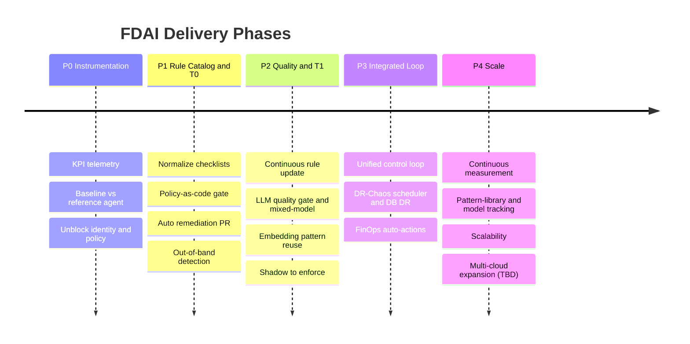

# FDAI Roadmap

The engineering plan behind FDAI. This folder expands the short-form
principles in [copilot-instructions.md](../../.github/copilot-instructions.md)
and the control loop in
[architecture.instructions.md](../../.github/instructions/architecture.instructions.md)
into an actionable, phased roadmap: from goals and structure through deployment
and scale-out.

> **Read online:** [dotnetpower.github.io/fdai](https://dotnetpower.github.io/fdai/).
> The markdown here is the canonical source; the site mounts these files
> read-only with sidebar navigation, right-column TOC, full-text search, and a
> Korean / English switcher. See [site/](../../site/README.md) for how the mount
> and deploy work.

> **Scope:** the repo is generic and customer-agnostic. Deployment values stay in environment
> configuration or secret stores; optional downstream distributions limit or extend capabilities
> through supported seams
> ([generic-scope.instructions.md](../../.github/instructions/generic-scope.instructions.md)).
>
> **Implementation focus:** Azure is the only implemented target. Non-Azure
> providers and Phase 4 multi-cloud expansion are TBD. The CSP-neutral
> abstractions in these docs exist so a future adapter is additive, not a
> delivery commitment
> ([Implementation Focus](../../.github/copilot-instructions.md#implementation-focus-must)).

## Design at a glance

Deterministic-first, event-driven, risk-gated. A 3-tier trust router resolves
repeatable events with rules and policies (T0) and lightweight similarity reuse
(T1), reserving frontier-model reasoning (T2) for the ambiguous residual. Every
autonomous action ships in shadow mode first and is promoted per-action
explicitly. Coverage shares and autonomy multipliers are design targets that
require a measured baseline before they can be claimed
([goals-and-metrics.md](architecture/goals-and-metrics.md)).

## How to read this folder

Reference docs describe the system; phase docs (P0-P4) sequence the build.
Read the reference docs first, then the phases in order.

### Core reference (system shape)

| # | Document | What it covers |
|---|----------|----------------|
| 1 | [goals-and-metrics.md](architecture/goals-and-metrics.md) | success criteria, KPIs, measurement-first rule |
| 2 | [project-structure.md](architecture/project-structure.md) | repo layout, module boundaries, control-loop wiring |
| 3 | [tech-stack.md](architecture/tech-stack.md) | languages, frameworks, data stores, event bus |
| 4 | [csp-neutrality.md](architecture/csp-neutrality.md) | wire-level contracts that keep the core CSP-neutral |
| 5 | [llm-strategy.md](architecture/llm-strategy.md) | per-tier model choices, mixed-model gate, abstraction |
| 6 | [security-and-identity.md](architecture/security-and-identity.md) | least-privilege identity, secrets, safety invariants |
| 7 | [deployment.md](deployment/deployment.md) | IaC, CI/CD, environments, release / rollback |
| 7a | [architecture-review-board.md](architecture/architecture-review-board.md) | canonical ARB packet: decision boundary, evidence contract, owners, dependencies, production exit gate |
| 7b | [data-governance.md](architecture/data-governance.md) | data inventory, classification, lifecycle, privacy assessment, model-provider and compliance evidence |
| 7c | [Architecture Decision Records](architecture/decisions/README.md) | ADR register and accepted Azure day-zero platform baseline |
| 7d | [mscp-operational-profile.md](architecture/mscp-operational-profile.md) | selective MSCP-derived effect, cycle, and runtime-integrity policies without a full conformance claim |

### Rules, detection, and operations

| # | Document | What it covers |
|---|----------|----------------|
| 8 | [rule-catalog-collection.md](rules-and-detection/rule-catalog-collection.md) | where rules / checklists / baselines come from and their YAML shape |
| 9 | [rule-governance.md](rules-and-detection/rule-governance.md) | how admins author, scope, enable, and exempt rules (Azure Policy-like) |
| 10 | [observability-and-detection.md](rules-and-detection/observability-and-detection.md) | event correlation, anomaly detection, forecasting, root-cause analysis |
| 10a | [manual-distillation.md](rules-and-detection/manual-distillation.md) | compiling an adopting company's operational / deployment manuals into deterministic rules / workflows / policies (vs runtime RAG), and verifying the distillation |
| 11 | [deploy-and-onboard.md](deployment/deploy-and-onboard.md) | concrete Azure resource inventory, bootstrap sequence, fork vs core split |
| 11b | [hyperscale-cell-architecture.md](architecture/hyperscale-cell-architecture.md) | scale-out blueprint for 300 subscriptions: cell-based streaming, policy-driven fan-in, two-plane logging, CQRS audit indexing over ADX, cost envelope, standard/sovereign profiles, Container Apps default (AKS deferred) |
| 12 | [startup-and-lifecycle.md](operations/startup-and-lifecycle.md) | cold start, day-zero catalog, shadow-first rollout, discovery-loop kickoff |
| 13 | [operating-and-verification.md](operations/operating-and-verification.md) | self-health signals, canary event, smoke tests, alert routing, runbooks |
| 20 | [deployment-preflight.md](deployment/deployment-preflight.md) | pre-deployment feasibility and blocker collection: probe taxonomy, readiness report, blocker-to-terraform-toggle mapping |
| 20a | [preflight-active-reassembly.md](deployment/preflight-active-reassembly.md) | active plan reassembly: turn a policy blocker into a re-rendered terraform plan via capability-mode toggles, delivered as a remediation PR through the executor (convergence loop, stop-conditions, limits) |
| 20b | [installable-deployment-cli.md](deployment/installable-deployment-cli.md) | installable `fdaictl` facade: isolated `uv` installation, read-only preflight, signed deployment bundles, and exact-plan submission to the private runner |
| 21 | [assurance-twin.md](operations/assurance-twin.md) | queryable ontology twin for architecture review / Q&A / assessment: text-to-query, proactive review, whole-graph what-if, shadow proposals |
| 22 | [operational-readiness.md](operations/operational-readiness.md) | dev-to-ops handoff gate: ownership-transfer trigger, whole-scope RBAC / policy / reliability review, ReadinessReport, environment-promotion gate |
| 22a | [operator-initiated-sre-and-arb.md](operations/operator-initiated-sre-and-arb.md) | non-incident identity, operator-initiated SRE response, live stage progress, ARB health/manual start, workflow enforce, and local/deployed parity |

### Cost, users, channels, risk, parity

| # | Document | What it covers |
|---|----------|----------------|
| 14 | [cost-model.md](interfaces/cost-model.md) | monthly cost envelope for the minimum resource inventory, T2 LLM cost split, traffic triggers |
| 15 | [user-rbac-and-identity.md](interfaces/user-rbac-and-identity.md) | human roles (Reader / Contributor / Approver / Owner + Break-Glass), Entra ID artifacts, console-to-PR identity flow |
| 15b | [agent-stewardship-and-handover.md](interfaces/agent-stewardship-and-handover.md) | human <-> 15-agent handover map: stewards (accountable / informed), maintainers (min 1, rec 2), escalation chain, coverage + bus-factor |
| 16 | [channels-and-notifications.md](interfaces/channels-and-notifications.md) | non-web-UI channels (Teams / Slack / email / webhook / pager / SMS), category and trust-tier matrix |
| 17 | [risk-classification.md](decisioning/risk-classification.md) | auto vs HIL vs deny classification: dimensions, initial rule table, environment detection |
| 17b | [escalation-and-standing-authority.md](decisioning/escalation-and-standing-authority.md) | what happens after a `hil` verdict when nobody answers: the supervised OODA loop, the impact-tiered time-decaying escalation ladder (distinct from channel fallback), and standing authorization (pre-authorized, envelope-bounded, reversible-only conditional auto-action as a deterministic risk-gate input) |
| 18 | [dev-and-deploy-parity.md](deployment/dev-and-deploy-parity.md) | authoritative interactive local/deployed parity, explicit fixture profile, and deployer-scoped LLM gates |
| 19 | [operator-console.md](interfaces/operator-console.md) | conversational surface (CLI / Teams / Slack / web), three-layer architecture, per-tool RBAC matrix, LLM tier model, session persistence |
| 19f | [console-evidence-and-resilience.md](interfaces/console-evidence-and-resilience.md) | console evidence provenance, localization, durable replay, stream recovery, and Architecture-map resilience |
| 19a | [document-ingestion.md](interfaces/document-ingestion.md) | drop-zone UX, large and protected document handling, format extraction, private storage, shared visibility, retention, and deletion contracts |
| 19b | [scheduled-result-continuations.md](interfaces/scheduled-result-continuations.md) | scoped conversation anchors for exact scheduled runs, evidence provenance, channel threads, access, expiry, and delivery ordering |
| 19c | [skill-source-management.md](interfaces/skill-source-management.md) | durable approved sources, quarantine, ETag refresh, disabled-first approval, and provenance-preserving revocation |
| 19d | [durable-conversation-delivery.md](interfaces/durable-conversation-delivery.md) | verified cross-channel bindings, durable reply ledger, process-loss recovery, adapter controls, and read-only reliability metrics |
| 19e | [governed-trajectory-datasets.md](interfaces/governed-trajectory-datasets.md) | authorization-first observable trajectories, deterministic JSONL/checksums, quarantine, offline replay validation, retention/legal hold, and reviewed-only Norns intake |
| 20 | [action-ontology.md](decisioning/action-ontology.md) | ActionType schema (remediation + ops + governance), trigger axis, tier / role / prod / live-probe ceilings, fork override seams |
| 21 | [execution-model.md](decisioning/execution-model.md) | Unified RiskGate, six-axis authority matrix, three executor paths (PR-native / direct API / PR-manual), live-blast probe combinator, resolved_ceiling audit block |

### Agent organization

| # | Document | What it covers |
|---|----------|----------------|
| 22 | [agent-pantheon.md](agents/agent-pantheon.md) | fixed 15-agent pantheon (Odin / Thor / Forseti / ...) as ontology first-class citizens: org chart, single-writer topics, two-port model (typed pub/sub + conversational NL), NL query orchestration with fingerprint dedup, per-user context, extended ActionType roles (initiator / judge / approver / executor / auditor), lifecycle state machine, Heimdall-driven privilege-escalation monitoring |
| 22a | [bounded-task-workers.md](agents/bounded-task-workers.md) | isolated depth-one read-only investigations outside the fixed Pantheon: capability attenuation, bounded lifecycle, durable branch records, untrusted parent synthesis, and GET-only projections |
| 22b | [background-task-sessions.md](interfaces/background-task-sessions.md) | durable detached operator investigations: immediate creation, lease/CAS ownership, bounded progress, process-loss reconciliation, conversation handoff, and delivery boundary |
| 22c | [busy-input-modes.md](interfaces/busy-input-modes.md) | channel-neutral durable queue, interrupt, and safe-boundary steer modes for active web, Slack, and Teams conversations |
| 23 | [agent-workflows.md](agents/agent-workflows.md) | the 12 cross-agent workflows the pantheon composes into product capabilities: cost-aware remediation, predictive scale, DR drill orchestration, override -> discovery, security escalation, handoff -> capability, agent health degradation, judgment coherence audit, rollback rehearsal, retrospective what-if, operational readiness handoff, and scheduled governed Python task. Each has trigger + sequence diagram + exit criteria + promotion gate |
| 23b | [process-automation.md](decisioning/process-automation.md) | machine-readable counterpart to agent-workflows.md: the Workflow catalog schema (catalog-as-code under `rule-catalog/workflows/`), the `Process` ObjectType + `targets` / `advances` LinkTypes, the compile-to-Runbook control-loop wiring, saga compensation, and shadow-first governance. A business process is an ordered list of `ActionType` steps the trust-router dispatches one at a time |
| 23c | [customer-workflow-automation-plan.md](decisioning/customer-workflow-automation-plan.md) | delivery plan for adopting organizations: readiness baseline, six rollout waves, customer adapter boundaries, approval and recovery work, behavior simulation, promotion evidence, verification matrix, and production completion criteria |

### Prompt subsystem

| # | Document | What it covers |
|---|----------|----------------|
| 24 | [prompt-composition.md](decisioning/prompt-composition.md) | evolving system prompt: role x layer matrix, tools / web search, debate orchestrator, recognition measurement |
| 24b | [hallucination-rubric-gate.md](decisioning/hallucination-rubric-gate.md) | subtractive rubric hallucination filter for T2: per-criterion judge scoring folded into confidence via `min()`, self-consistency sampler, shadow-before-enforce promotion |

### Reporting subsystem

| # | Document | What it covers |
|---|----------|----------------|
| 24b | [reporting-subsystem.md](interfaces/reporting-subsystem.md) | declarative visualization pipeline: YAML report catalog, datasource / widget / format registries, registered widget builders and datasource adapters over existing seams, pluggable encoders, read-only `GET /reports/*` routes, and fork extension recipes. The backend-only contract remains stable as registries grow. |

### Sequencing (cross-doc plan)

| # | Document | What it covers |
|---|----------|----------------|
| 25 | [implementation-plan.md](fork-and-sequencing/implementation-plan.md) | authoritative sequencing across all the 2026-07-06 tranche docs: the six standard-set design decisions (R1 axis derivation, R2 ConsoleTool as ActionType projection, R3 unified LlmBinding, R4 shared projection primitive, R6 operator_memory as materialized view, R7 pr_manual as a flag) and the wave plan (F -> D1 -> W1 -> W2 -> M1, plus Twin and Preflight tracks) |
| 26 | [agent-pantheon-implementation.md](agents/agent-pantheon-implementation.md) | pantheon rollout wave plan (W0 docs -> W1 scaffolding -> W2 governance -> W3 pipeline -> W4 interface -> W5 specialists -> W6 handoff / security -> W7 workflows -> W8 KPI + promotion + degradation drills); every wave has a measurable exit gate and preserves the pantheon invariants (single-writer topics, judge != executor, Saga / Vidar hard dependency) |
| 27 | [productization-and-extensibility.md](fork-and-sequencing/productization-and-extensibility.md) | prioritized P0/P1/P2 status matrix for install and diagnostics, bidirectional channels, trusted extensions and MCP, model and scheduler resilience, security audit, typed APIs, and the capabilities intentionally kept outside the FDAI app shape |

## Phase timeline

Phases are strictly sequential (P0 -> P1 -> P2 -> P3 -> P4) and each phase doc
names its predecessor in a *Dependencies* section. Vertical coverage lands
incrementally: Change Safety in P1; Resilience and Cost Governance in P3.
Multi-cloud stays TBD in P4 (Azure-only implementation, see
[Implementation Focus](../../.github/copilot-instructions.md#implementation-focus-must)).

## Phase summary

The exit column is each phase's primary gate; every phase doc lists the complete
exit criteria and its dependencies.

| Phase | Goal | Key deliverables | Primary exit gate |
|-------|------|------------------|-------------------|
| **[P0](phases/phase-0-instrumentation.md)** | Instrument and unblock | KPI dashboard, baseline report, identity / policy blockers resolved | reproducible baseline exists |
| **[P1](phases/phase-1-rule-catalog-t0.md)** | Deterministic core | rule catalog, T0 engine, policy gate, remediation PRs | Change gate runs in shadow |
| **[P2](phases/phase-2-quality-and-t1.md)** | Quality and lightweight tier | rule-update pipeline, LLM quality gate (guards T2), T1 similarity reuse | auto-resolution rate validated vs P0 baseline |
| **[P3](phases/phase-3-integrated-loop.md)** | Integrated autonomy | unified loop, DR / chaos scheduler, cost auto-actions | autonomous MVP across all 3 verticals |
| **[P4](phases/phase-4-scale.md)** | Scale out (Azure) | continuous measurement, pattern-library and model tracking, scalability; multi-cloud adapters TBD | guard metrics stable on the Azure baseline |

## Guardrails applied throughout

- **Measurement first**: no autonomy without telemetry; no multiplier or
  coverage claim without a measured baseline.
- **Shadow before enforce**: every new action ships judge-only, then is promoted
  per-action explicitly; regressions demote automatically.
- **Choose the safer default when the outcome is uncertain**: low confidence, verification failure, or budget /
  rate overflow degrades to HIL, never to an ungated auto-action.
- **Safety invariants on every action**: stop-condition, rollback path,
  blast-radius limit, and audit-log entry
  ([security-and-identity.md](architecture/security-and-identity.md)).
- **Idempotent actions**: re-delivered events and retried actions never
  double-apply.
- **Separation of duties**: approval and execution are distinct principals; the
  console is read-only ([security-and-identity.md](architecture/security-and-identity.md)).
- **Bilingual, customer-agnostic artifacts**: English and Korean are first-class prose languages;
  identifiers and machine records remain stable as defined by the language contract
  ([language.instructions.md](../../.github/instructions/language.instructions.md)).

## Next steps

| To do this | Start here |
|-----------|-----------|
| Understand the 3-tier control loop | [architecture.instructions.md](../../.github/instructions/architecture.instructions.md) |
| Find a subsystem's source, tests, and design doc | [architecture/code-map.md](architecture/code-map.md) |
| See the concrete Azure resource inventory | [deploy-and-onboard.md](deployment/deploy-and-onboard.md) |
| Follow the P0 baseline instrumentation | [phases/phase-0-instrumentation.md](phases/phase-0-instrumentation.md) |
| Read the safety rules on every autonomous action | [../../.github/instructions/coding-conventions.instructions.md](../../.github/instructions/coding-conventions.instructions.md) |
| Contribute a new rule to the catalog | [../../rule-catalog/RULE_AUTHORING_GUIDE.md](../../rule-catalog/RULE_AUTHORING_GUIDE.md) |

## Canonical diagrams

To keep design docs from drifting, a small number of diagrams are named as
canonical. Downstream docs MUST link to them instead of redrawing the
same shape.

| Diagram | Canonical location |
|---------|--------------------|
| Control loop (event -> tier -> gate -> action -> audit) | [architecture.instructions.md § Control Loop](../../.github/instructions/architecture.instructions.md#control-loop) |
| Agent pantheon (15-agent org chart) | [agents/agent-pantheon.md](agents/agent-pantheon.md) |
| Monorepo layout | [architecture/project-structure.md § Monorepo Layout](architecture/project-structure.md#monorepo-layout) |
| Subsystem index (source -> tests -> docs) | [architecture/code-map.md](architecture/code-map.md) |

A doc that needs a different view of these concepts SHOULD use a
domain-specific mermaid rather than paraphrase the canonical shape. If
the canonical diagram itself needs to change, edit it once at the
canonical location; the roadmap review picks up the change from there.
