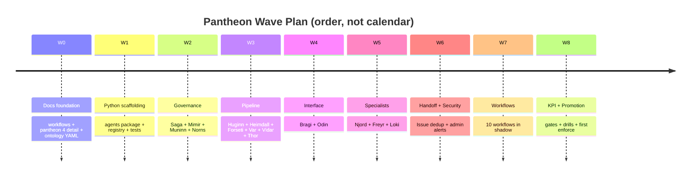

# 에이전트 판테온 구현 계획

[agent-pantheon.md](agent-pantheon-ko.md) 에서 정의한 15개 에이전트 판테온을
착지시키기 위한 웨이브 계획. 각 웨이브는 스코프된 산출물 세트, exit gate,
이전 웨이브 의존성을 가진다; 웨이브는 자기 gate 가 통과할 때까지 merge 되지
않는다. 이 문서는 조정 기록이다 - 개별 PR 은 여전히 자기 exit gate 와
[coding-conventions.instructions.md](../../.github/instructions/coding-conventions.instructions.md#safety)
의 안전 invariant 로 측정된다.

> **범위:** 계획은 고객-무관이다. 아래의 모든 모듈 경로와 topic 은 generic;
> fork 는 [project-structure.md](project-structure-ko.md) 의 seam 을 통해
> 바인딩을 설정하지만 판테온 자체는 편집하지 않는다
> ([generic-scope.instructions.md](../../.github/instructions/generic-scope.instructions.md)).
>
> **구현 초점:** Azure only. Kafka wire 는 Event Hubs `:9093`, ChatOps 는
> Teams Adaptive Card; ChatOps admin 채널과 delivery adapter 는
> [app-shape.instructions.md](../../.github/instructions/app-shape.instructions.md)
> 의 배치를 따른다.

## 1. 이 문서가 존재하는 이유

판테온 문서 ([agent-pantheon.md](agent-pantheon-ko.md)) 는 15개 에이전트 계약을
정의한다. 이를 코드베이스와 룰 카탈로그에 착지시키려면 아래가 필요:

- **문서**: 3개 로드맵 문서가 상세 섹션을 획득 (per-agent tasks,
  workflows, degradation).
- **온톨로지**: 새 `Agent` object type + 5개 지원 object type
  (`Conversation`, `Turn`, `UserPreference`, `SecurityEvent`, `Issue`) 이
  `rule-catalog/vocabulary/object-types/` 아래 기존 카탈로그에 합류.
- **ActionType 카탈로그**: 4개 새 action type
  (`escalate_to_github_issue`, `notify_admin_privilege_violation`,
  `arbitrate_domain_conflict`, 각 에이전트의 `question_domains` 핸들러
  pseudo-action) 이 `rule-catalog/action-types/` 에 합류.
- **Python core**: 새 패키지 `src/fdai/agents/` 에 base class, 15개
  에이전트 stub, topic registry, two-port 스캐폴딩.
- **테스트**: registry 무결성, single-writer topic 강제, ActionType 역할
  바인딩, pantheon 서브그래프 ontology 조회.
- **Wave 6-9**: 증분 per-agent 동작 + cross-agent 워크플로우, 전체에 걸쳐
  shadow-mode 게이팅.

아래 웨이브들은 이 작업을 순차화하여 각 웨이브가 측정 가능한 exit 기준으로
게이트된 동작 서브셋을 제공한다.

## 2. 가이드 invariant (어느 웨이브에서도 위반 금지)

- **Docs-first, docs-after.** 모든 웨이브는 코드 / 카탈로그 변경과 같은 PR
  에 doc 업데이트를 착지시킨다. 문서는 절대 drift 하지 않는다.
- **Shadow before enforce.** 모든 새 에이전트 동작은 judge-only 로 배포.
  Enforce 승격은 per-behavior 이며 별도 review.
- **Single-writer topics.** owner agent 만 `object.<type>` 에 publish. 스키마
  registry 가 merge 시점에 강제.
- **판사는 executor 가 아니다.** Forseti 는 verdict 를 발행; Thor 는
  dispatch. 어떤 웨이브도 이 역할을 collapse 하지 않는다.
- **Hard-dependency 존중.** Saga 와 Vidar 는 mutation 의 hard dependency;
  둘 중 하나가 저하되면 mutation 은 shadow 로 강등.
- **LLM 은 Bragi (translator), Forseti (T2 abstain), Norns (off-path batch)
  에서만.** 다른 모든 에이전트는 hot-path 에서 LLM-free 유지.
- **Fork 경계.** Pantheon 세트 / 역할 바인딩은 upstream-locked; fork 는
  설정만 하고 pantheon 을 확장하지 않는다.

## 3. 웨이브 개요

9개 웨이브. 각 웨이브는 하나의 exit gate 와 bounded scope 를 가진다. Gate 는
측정 가능; 웨이브는 산문으로 닫히지 않는다.

| Wave | 산출물 세트 | Exit gate |
|------|-------------|-----------|
| **W0** | Docs foundation: workflows doc, pantheon §4 detail, ontology YAML 추가 | translation-pair CI + schema lint green; 새 object type 이 `/ontology/graph` (dev) 로 해석됨 |
| **W1** | Python 스캐폴딩: `agents/` 패키지, base class, 15 stub, topic registry, two-port skeleton | registry + topic-owner 강제 테스트로 `pytest tests/agents/` 통과 |
| **W2** | Governance staff: Saga (audit + issue), Mimir (rule steward), Muninn (memory / RAG), Norns (learner) shadow 로 완전 배선 | 종단간 audit trail: 합성 이벤트가 walk-through, Saga 가 `AuditEntry` 를 write, replay 가 재구성, Norns 가 pattern 포착 |
| **W3** | Sensing + judgment + risk: Huginn, Heimdall, Forseti, Var, Vidar, Thor 가 typed port 로 연결; verdict-to-execute-to-audit 루프 shadow 로 live | 100개 합성 이벤트가 ingress -> verdict -> HIL 또는 auto -> execute (shadow) -> audit 로 정책 위반 zero 로 흐름 |
| **W4** | Bragi + Odin: routing, per-user context, arbitration 이 있는 conversational port | 오퍼레이터 NL query 하나가 routing -> primary + contributors -> aggregated response 로 walk-through; Odin 이 합성 domain_conflict 를 arbitrate |
| **W5** | Domain specialists: Njord, Freyr, Loki 가 Forseti 에 advisory 바인딩 | cost / capacity / chaos advice 가 합성 verdict 에 attach; Loki 실험이 blast-radius 존중하며 shadow 로 실행 |
| **W6** | Handoff + security escalation: Issue dedup, fingerprint index, admin-channel notification | (a) 합성 unhandled request 가 정확히 1개 GitHub issue + repeat 시 comment 생성; (b) RBAC-insufficient proposal 이 정확히 1개 admin card + repeat 시 dedup 생성 |
| **W7** | Cross-agent workflows: [agent-workflows.md](agent-workflows-ko.md) 의 10개 워크플로우가 shadow 로, 한 번에 하나씩 | 각 워크플로우: shadow trace 종단간 + KPI baseline 캡처; 아직 어떤 워크플로우도 enforce 로 승격 안 됨 |
| **W8** | Promotion gates + measurement: per-agent KPI collector, promotion_gate 배선, degradation drill | (a) 각 에이전트가 선언된 KPI 를 리포트; (b) 각 degradation policy 가 주입 실패로 검증; (c) 임의 단일 워크플로우가 gate 통과 후 별도 PR 로 enforce 모드 승격 가능 |

## 4. Wave 0 - Docs foundation

**Scope**

- **`docs/roadmap/agent-workflows.md` (+ ko)** - sequence diagram 과 exit
  criteria 가 있는 10개 cross-agent 워크플로우. 워크플로우 인벤토리는 이
  문서 §5 참고.
- **`docs/roadmap/agent-pantheon.md` §4 detail** - 15개 에이전트 각각이
  네 개의 서브섹션 (Recurring / Event / Meta / Cross-agent tasks) + KPI
  테이블 + Degradation policy 문단을 얻음. 현재 §4 의 compact 테이블은
  인덱스가 되고, 상세는 inline 으로.
- **`rule-catalog/vocabulary/object-types/` 온톨로지 추가**:
  - `agent.yaml` (pantheon object type, `question_domains`,
    `owns_code_paths`, `llm_bindings`, `rate_limits` 포함)
  - `conversation.yaml`, `turn.yaml`, `user-preference.yaml`
  - `security-event.yaml`, `issue.yaml`
  - `rule-candidate.yaml`, `handoff-escalation.yaml`
- **`rule-catalog/action-types/` 4개 신규 entry** (Saga / Mimir / Var
  executor 가 구현되는 W2 로 연기; 기존 `test_action_type_catalog.py`
  invariant 를 유지하기 위해 - 기존 test suite 는 카탈로그 entry 가
  executor, promotion_gate, PR-native 또는 documented category 와 함께
  ship 되기를 요구):
  - `governance.escalate-to-github-issue.yaml`
  - `governance.notify-admin-privilege-violation.yaml`
  - `governance.arbitrate-domain-conflict.yaml`
  - `governance.propose-rule-candidate.yaml`

**Exit gate**

- 3개 CI translation gate 모두 green (`scripts/check-translations.sh`).
- Ontology YAML lint 통과 (기존 `scripts/validate-catalog-full.py` 가 오늘
  이를 커버).
- `docs/roadmap/README.md` (+`-ko.md`) 가 새 workflows 문서 참조;
  renumbering 은 pantheon-doc PR 에서 이미 완료.

**Dependencies**

- 판테온 문서 merge 필요 (이전 PR 에서 이미 착지).

**Anti-scope (W0)**

- Python 코드 없음.
- 기존 에이전트 동작 변경 없음 (아직 하나도 없음).

## 5. Wave 1 - Python 스캐폴딩

**Scope**

- 새 패키지 `src/fdai/agents/`:
  - `base.py` - 추상 `Agent` 클래스: 필드 (`name`, `layer`, `owns`,
    `executes`, `subscribes`, `publishes`, `question_domains`,
    `owns_code_paths`, `llm_bindings`, `rate_limits`), 메서드
    (`on_typed_message`, `on_conversation_turn`, `health`), 강제된
    single-writer publish helper.
  - `registry.py` - `Agent` object type YAML 로드, pantheon registry
    빌드, `get(name)`, `all()`, `owner_of(topic)`,
    `owner_of(object_type)` 노출.
  - `topics.py` - typed topic 계약: naming (`object.<type>`), partition
    key 전략 (mutation 은 per-resource, judgment/audit 는
    per-correlation), idempotency, back-pressure default.
  - `pipe.py` - 기존 event bus provider protocol
    ([project-structure.md](project-structure-ko.md#customization-via-dependency-injection))
    을 감싸는 thin adapter 로 `producer_principal == owner_agent` 강제.
  - `stubs/` - 에이전트당 파일 하나 (`odin.py`, `thor.py`, ...) 로
    `Agent` 의 no-op 서브클래스. 각 stub 은 registry 가 import 시 완전
    하도록 소유 type 과 구독 topic 을 선언.
- `src/fdai/agents/__init__.py` 가 registry entry point 를 export.

**테스트 (`tests/agents/`)**

- `test_registry.py`: 15개 에이전트 존재, 중복 없음, layer 값 유효,
  `owns` 세트가 pairwise disjoint (single-writer invariant).
- `test_topics.py`: caller 가 owner 가 아닌 topic 에 publish 시 raise;
  선언된 모든 topic 이 정확히 하나의 owner 를 가짐; partition-key 전략
  해석됨.
- `test_action_role_binding.py`: `rule-catalog/action-types/` 의 모든
  ActionType 이 5개 역할 (`initiators`, `judge`, `approver`,
  `executor`, `auditor`) 을 registry 의 실제 `Agent` 로 해석함.
- `test_owns_code_paths.py`: 각 에이전트의 선언된 코드 경로가 존재하며
  write 작업에 대해 다른 에이전트의 소유 경로와 겹치지 않음.

**Exit gate**

- `pytest tests/agents/` green.
- `scripts/check-core-imports.sh` 여전히 green (`agents/` 외부에 새
  cross-layer import 없음).
- 새 패키지에 `mypy` (또는 repo 의 현재 타입-체크 bar) clean.

**Dependencies**

- W0 완료 (registry 가 로드하려면 Agent object type YAML 이 존재해야 함).

**Anti-scope**

- `pass` 이상의 핸들러 body 없음.
- 새 HTTP 또는 Kafka client 없음 (기존 adapter 계약 재사용).
- Conversational port 아직 없음 (W4 에서 착지).

## 6. Wave 2 - Governance staff

Governance 에이전트가 가장 먼저 오는 이유: Saga 는 누구든 실행하기 전에
기록해야 하고; Mimir 는 Forseti 가 판단하기 전에 rule 참조를 해석해야 하고;
Muninn 은 Forseti 가 reason 하기 전에 context 를 서브해야 하고; Norns 는
discovery loop 를 닫는다.

**Scope**

- **Saga (`src/fdai/agents/saga.py`)** - 모든 terminal-state topic 을 구독한
  `append_audit` 핸들러 구현. 기존 audit store 에 persist
  ([security-and-identity.md](security-and-identity-ko.md) 참고).
  `escalate_to_github_issue` executor 구현: fingerprint 계산, Muninn 을
  통한 dedup 인덱스 read, GitHub App adapter 를 통한 issue 생성 또는
  comment append (실제 네트워크는 fork 로 미룸; 테스트에서 in-memory
  adapter 사용). 과거 audit-entry 를 chronological order 로 소비하며
  republish 없이 replay 구현.
- **Mimir (`src/fdai/agents/mimir.py`)** - `object.rule-candidate` 구독.
  기존 룰 카탈로그 store 에 대한 sync 작업으로 `promote_rule` 과
  `revoke_rule` 구현. Freshness monitor 추가 (recurring): rule 별 발화
  카운트를 audit-log 에서 read, 비활성 임계값에서 `RuleStalenessSignal`
  emit.
- **Muninn (`src/fdai/agents/muninn.py`)** - 다른 에이전트를 위한 state /
  context store reader. 기존 state store provider 로 backed
  ([project-structure.md](project-structure-ko.md#customization-via-dependency-injection)).
  Bitemporal snapshot rotation 과 cache eviction 구현. Saga 가 사용하는
  Issue fingerprint 인덱스 소유.
- **Norns (`src/fdai/agents/norns.py`)** - 두 entry point: batch (기존
  scheduler 를 통한 hourly cron) 과 stream (`object.audit-entry` 구독).
  Pattern extraction 을 T1 clustering 우선으로 구현; T2 LLM summary hook
  은 W7 에 남겨둠. `RuleCandidate` 와 `close_issue` action 발행.

**테스트**

- `test_saga_audit_chain.py`: 순차 append 가 monotonic chain 생성; 합성
  변조 (out-of-order 또는 missing hash) 는 integrity check 로 감지.
- `test_saga_issue_dedup.py`: 같은 fingerprint escalation 두 번은 1개
  issue + 1개 comment 결과; Muninn 의 index 일치.
- `test_mimir_promotion.py`: candidate -> shadow -> promotion 경로가 새
  `Rule` object 를 write; Forseti stub 이 cache-invalidation event 를
  봄.
- `test_norns_pattern.py`: 반복 fingerprint 를 가진 10개 합성 audit-entry
  가 정확히 1개 `RuleCandidate` 생성.

**Exit gate**

- 종단간 합성 trace: 합성 event -> Saga 기록 -> Norns 포착 ->
  RuleCandidate 제안 -> Mimir 승격 -> audit-log 가 전체 chain 을 표시.

**Dependencies**

- W1 완료.

**Anti-scope**

- 실제 GitHub App call 없음 (in-memory adapter 만; 실제 통합은
  fork-configured seam 뒤에).
- Norns 에 LLM 없음 (이번 웨이브는 T1 clustering 만).

## 7. Wave 3 - Sensing, judgment, execution loop

**Scope**

- **Huginn (`src/fdai/agents/huginn.py`)** - 기존 event ingest adapter
  구독 (Kafka 로 forward 된 Azure Activity Log stream). `Event` 로
  정규화, stable key 로 dedup, `object.event` 로 publish.
- **Heimdall (`src/fdai/agents/heimdall.py`)** - anomaly detector
  (statistical threshold, T0/T1 을 통한 adaptive baseline), drift
  detector (Muninn snapshot 비교를 통한 declared vs actual state),
  forecast (statistical time-series; ARIMA 또는 exponential smoothing).
  `Anomaly`, `Drift`, `Forecast` 발행. `SecurityEvent` 구독은 W6 로
  예약.
- **Forseti (`src/fdai/agents/forseti.py`)** - `object.anomaly`,
  `object.drift`, `object.event` 구독. 3-tier trust router 를 로컬 구현:
  Mimir 를 통한 T0 rule match; Muninn 을 통한 T1 similarity; T2 는 W7
  까지 `abstain` 반환하는 stub 유지. Verdict 는 결정론 `risk-classification.yaml`
  테이블 + ActionType ceiling 에서 계산된 `risk_verdict` 를 포함.
  `auto | hil | deny` 로 `Verdict` emit. `domain_conflict: true` 시
  `arbitrate` signal emit (Odin 은 W4 에서 착지).
- **Thor (`src/fdai/agents/thor.py`)** - `object.verdict` 구독.
  Dispatch: `auto` -> 기존 executor provider 에 대해 shadow execute;
  `hil` -> `object.hil-request` publish (Var 도 여기서 착지); `deny` ->
  Saga 를 위한 drop record publish. `resource_id` partition 에서
  per-resource mutex 강제. 실패 시 rollback trigger.
- **Var (`src/fdai/agents/var.py`)** - `object.hil-request` 구독. 기존
  ChatOps adapter 를 통해 present (W3 에서는 stub, W5 에서 real
  adapter). Timeout / expire tracking. `object.hil-response` publish.
- **Vidar (`src/fdai/agents/vidar.py`)** - Thor 실패 signal 구독.
  ActionType `rollback_contract` 별 rollback invoke. `object.rollback`
  publish.

**테스트**

- `test_verdict_loop_shadow.py`: 100개 합성 anomaly event; 모든 event
  가 `succeeded` (shadow) 또는 `dropped` entry 로 Saga 에 도달; 정책
  위반 escape zero.
- `test_thor_mutex.py`: 같은 `resource_id` 에 대한 두 개 동시 proposal
  serialize; 두 번째는 첫 번째 대기.
- `test_forseti_verdict_stable.py`: 동일 input event 는 동일 verdict
  생성; verdict `risk_verdict` 가 `risk-classification.yaml` lookup 과
  정확히 일치.
- `test_vidar_rollback.py`: 주입된 failure 가 정확히 하나의 rollback
  trigger; audit chain 이 compensating entry 표시.

**Exit gate**

- 종단간 shadow 루프: 100개 합성 event, per-resource mutex 관찰, 정책
  escape zero, Saga audit trail 완료.

**Dependencies**

- W2 완료.

**Anti-scope**

- 실제 ChatOps 카드 없음 (Var 는 테스트에서 in-memory approval).
- Forseti 에 LLM 없음 (T2 는 stub abstain 유지).
- Cross-vertical arbitration 없음 (Odin 은 W4 에서 착지).

## 8. Wave 4 - Bragi + Odin

**Scope**

- **Bragi (`src/fdai/agents/bragi.py`)** - conversational port entry
  point. 기존 operator-console adapter
  ([operator-console.md](operator-console-ko.md)) 재사용. 구현:
  - Intent 분류: `Agent.question_domains` 대비 T0 keyword match;
    Muninn 의 context index 를 통한 T1 embedding similarity; fallback
    으로 T2 LLM classifier (fork config 에서 binding).
  - 승자 선택 scoring (판테온 문서 §6.3).
  - Multi-agent aggregation: primary + contributors 에 typed query
    보냄, 응답을 aggregate, NL response 로 render.
  - Conversation 상태: session, turn, per-user partitioning, retention.
- **Odin (`src/fdai/agents/odin.py`)** - Forseti 가 발행한
  `object.arbitration-request` 구독. rule 카탈로그에서 fork-configured
  priority policy (default: SLO > cost > architecture) read.
  `object.arbitration-response` publish. Recurring: 선언된 우선순위에서
  실제 결과가 벗어날 때 policy weight 를 조정하는 portfolio-outcome
  monitor (여전히 결정론 - policy update proposal 은 `RuleCandidate` 로
  Mimir 를 통과).

**테스트**

- `test_bragi_routing.py`: 각 `question_domain` 에 대한 sample NL query
  가 올바른 primary agent 로 라우팅; 승자 선택 tie-break 순서 검증.
- `test_bragi_multi_turn.py`: 같은 세션의 follow-up query 가
  `prior_turns_ref` 대비 anaphora ("그 사람 또 뭐 바꿨어") 해결.
- `test_bragi_rbac.py`: cross-user 세션 read 시도가 empty 반환하고
  Saga 가 시도 기록.
- `test_odin_arbitration.py`: 주입된 `domain_conflict` verdict 가
  정확히 하나의 `ArbitrationDecision` 결과; Forseti 가 수신하고
  finalize.

**Exit gate**

- 오퍼레이터가 합성 Heimdall change-index 에 "누가 stgdemo123 public
  network 변경했어" 를 질문; Bragi 가 payload 에 `primary`,
  `contributors`, `trace_ref` 를 포함한 Heimdall + Saga + Muninn 의
  aggregated response 반환.

**Dependencies**

- W3 완료.

**Anti-scope**

- 프로덕션급 LLM cost tracking 없음 (LLM strategy 문서에 있으며 별도로
  착지).
- 아직 proactive briefing 없음 (recurring conversation seeding 은 W7 의
  "Judgment coherence audit" 워크플로우와 함께 착지).

## 9. Wave 5 - Domain specialists

**Scope**

- **Njord (`src/fdai/agents/njord.py`)** - cost-signal ingestion 구독
  (Azure Cost Management adapter; 테스트에서 in-memory). spend 가
  forecast 에서 threshold 만큼 편차 시 `CostAnomaly` emit. cost-impact
  attribution 을 위한 Forseti verdict advisory hook 제공.
- **Freyr (`src/fdai/agents/freyr.py`)** - utilization metric 구독.
  `CapacityForecast`, `SizingRecommendation` emit. Forseti verdict
  advisory hook.
- **Loki (`src/fdai/agents/loki.py`)** - chaos 스케줄러. 모든 실험은
  `blast_radius` 가 bounded 되고 `default_mode: shadow` 인 `ActionRun`
  으로 propose. Loki 는 절대 실험을 auto-execute 하지 않는다:
  ActionType 은 판테온 §7.6 별 Forseti + Var 를 통과.

**테스트**

- `test_njord_cost_advice.py`: `remediate.resize_vm_up` action 의
  verdict 가 `njord_cost_delta` annotation 획득.
- `test_freyr_forecast.py`: 100개 합성 utilization sample 이 stable
  forecast 생성; input variance 가 threshold 를 넘으면 degradation
  policy 활성화.
- `test_loki_blast_radius.py`: 10개 target 에 대한 propose 된 실험이
  동시 propose storm 하에서도 선언된 `blast_radius=3` 에서 중단.

**Exit gate**

- 모든 domain specialist 가 shadow 의 최소 하나의 워크플로우 verdict 에
  advisory annotation 을 attach; Loki 가 `blast_radius` 존중하며
  shadow-mode chaos 실험 완료.

**Dependencies**

- W4 완료 (cost-vs-SRE 충돌에 arbitration 필요).

**Anti-scope**

- 실제 Azure Cost Management pull 없음 (fork seam 뒤에 adapter).
- Adversarial 시나리오 생성 없음 (W7 워크플로우).

## 10. Wave 6 - Handoff + security escalation

**Scope**

- 완전한 `escalate_to_github_issue` 경로: fork seam 뒤의 실제 GitHub
  App adapter; Saga fingerprint dedup; repeat 시 comment append; Mimir
  가 매칭 rule 을 승격하고 24시간 regression-clean 후 auto-close.
- 완전한 `notify_admin_privilege_violation` 경로: Heimdall 이
  `object.security-event` 구독; 판테온 §9.2 별 severity 분류; §9.4 별
  alert dedup 과 rate-limit; admin ChatOps 채널 adapter.

**테스트**

- `test_issue_dedup.py`: 3개 동일 handoff 가 1개 issue + 2개 comment
  생성; 3개 다른 fingerprint handoff 가 3개 issue 생성.
- `test_issue_auto_close.py`: 승격 후 주입된 regression-clean signal 이
  승격 PR 을 링크하는 comment 와 함께 fingerprint 된 issue 를 close.
- `test_security_severity.py`: 한 번의 RBAC-denied `delete_storage`
  proposal 이 정확히 하나의 `high`-severity 카드 생성; 같은 user 5분
  내 5회 denial 이 counter 와 함께 1개 카드로 합침.
- `test_security_rate_limit.py`: 같은 user 시간당 >5개 카드가 digest 로
  합침.

**Exit gate**

- (a) Handoff: 1개 issue, repeat 시 1개 comment, 승격 후 1개 auto-close.
  (b) Security: `high` 에 1개 카드, dedup 관찰, rate-limit 관찰.

**Dependencies**

- W2 (Saga), W3 (Heimdall + Forseti), W5 (Loki 필수 아니지만 W6 은 전체
  파이프라인이 서 있어야 함).

**Anti-scope**

- Permission-upgrade HIL flow 없음 (판테온 §9.5 언급; 별도 PR).

## 11. Wave 7 - Shadow 로 cross-agent workflows

[agent-workflows.md](agent-workflows-ko.md) 의 10개 워크플로우 각각이 자기
shadow-mode gate 를 가진 자기 PR 로 착지. 대략적 순서:

1. Cost-aware remediation (Njord + Forseti + Thor)
2. Predictive scale (Freyr + Heimdall + Njord)
3. DR drill orchestration (Loki + Vidar + Heimdall + Norns)
4. Override -> Discovery (Var + Saga + Norns + Mimir)
5. Security escalation (W6 이후 워크플로우 object 로 formalize)
6. Handoff -> Capability (Saga + Norns + Mimir)
7. Agent health degradation (Heimdall + Odin + Bragi)
8. Judgment coherence audit (Forseti + Norns + Mimir)
9. Rollback rehearsal (Loki + Vidar + Heimdall + Saga)
10. Retrospective what-if (Saga + Forseti + Norns + Mimir)

**Per-workflow exit gate**

- 참여 에이전트 전부와 shadow 로 종단간 trace.
- KPI baseline 캡처 (KPI collector 는 W8 참고).
- Shadow 에서 정책 위반 escape zero.

**Dependencies**

- W6 완료.

**Anti-scope**

- 이 웨이브에서 enforce 로 승격되는 워크플로우 없음. 승격은 W8 이후
  per-workflow, KPI threshold gated.

## 12. Wave 8 - Promotion gates, KPIs, degradation drills

**Scope**

- **KPI collectors** - 각 에이전트가 선언된 KPI 를 기존 measurement
  파이프라인 ([goals-and-metrics.md](goals-and-metrics-ko.md)) 로 emit
  (W0 에서 온 판테온 문서 §4 detail 참고).
- **Promotion gates** - 각 ActionType 의 `promotion_gate` 블록이 판테온
  KPI 테이블에 매칭되는 machine-readable exit criteria 획득. 표준
  shape:

  ```yaml
  promotion_gate:
    shadow_days_min: 14
    kpi_thresholds:
      - metric: agent.forseti.verdict_accuracy
        min: 0.95
      - metric: agent.forseti.t2_escalation_rate
        max: 0.10
    regression_scenarios: [scenario-set-forseti-baseline]
  ```

- **Degradation drills** - 에이전트당 합성 failure 주입, 선언된
  degradation policy 활성화 검증:
  - Saga down -> 새 mutation 거부
  - Vidar down -> 새 mutation shadow 로 강등
  - Forseti down -> queue 증가, alert 발화
  - Var down -> timeout 확장 + admin alert
  - 나머지는 판테온 §11 별 (anti-pattern 은 이미 doc 에 codified; test
    파일이 활성화)

**테스트**

- `test_promotion_gate_forseti.py`: scenario set + KPI threshold 로
  14일 shadow; 통과 = 승격 허용.
- `test_degradation_saga.py`: Saga kill, mutation 시도, 거부 + admin
  alert 검증.
- `test_degradation_vidar.py`: Vidar kill, mutation 시도, shadow 강등
  검증.
- `test_degradation_forseti.py`: Forseti kill, Huginn / Heimdall queue
  가 event loss 없이 증가 검증 (Kafka retention).

**Exit gate**

- 15개 에이전트 모두 KPI 를 measurement 파이프라인으로 emit.
- 모든 degradation drill 통과.
- W7 의 최소 하나의 워크플로우가 promotion_gate 통과 후 enforce 로
  승격 (별도 PR).

**Dependencies**

- W7 완료.

**Anti-scope**

- Multi-cloud 없음 (Azure only;
  [Implementation Focus](../../.github/copilot-instructions.md#implementation-focus-must)
  참고).

## 13. Cross-wave 관심사

### 13.1 문서는 항상 같은 PR 에 업데이트

모든 웨이브가 doc delta 를 코드와 나란히 착지. Reviewer 는 문서가 stale
한 채로 남는 merge 를 block. 구체적으로:

- W0 은 workflows 문서와 판테온 §4 detail 착지.
- W1 - W6 은 에이전트가 online 됨에 따라 판테온 §5 (agent catalog) 행을
  업데이트 (`llm_bindings`, `rate_limits` default 반영).
- W7 은 workflows 문서 entry 를 실제 shadow trace ref 로 업데이트.
- W8 은 판테온 §4 KPI 블록을 실제 baseline 숫자로 업데이트.

### 13.2 Bilingual pair 규율

모든 doc 변경은 같은 PR 에서 `foo.md` + `foo-ko.md` 를 touch 하고 ko 파일의
`translation_source_sha` 를 업데이트
([language.instructions.md](../../.github/instructions/language.instructions.md#user-facing-doc-translations-ko)).

### 13.3 모든 웨이브에서 fork 경계

웨이브는 절대 customer 구성을 upstream 코드로 pull 하지 않는다. 웨이브가
실제 통합 (GitHub App, ChatOps, Azure Cost Management) 이 필요할 때, 코드는
기존 provider protocol 뒤에 가고 in-memory adapter 가 테스트를 위해 같은
PR 에서 ship
([project-structure.md](project-structure-ko.md#customization-via-dependency-injection)).

### 13.4 웨이브에 대한 rollback

각 웨이브 PR 은 self-revertable: PR 을 revert 하면 데이터 마이그레이션
없이 이전 동작 복구 (새 파이프라인 stage 의 feature flag 는 default off;
기존 테스트는 flag off 로 계속 통과해야 함).

### 13.5 Composition-root 배선 (라이브 프로세스)

웨이브 W1 - W8 은 에이전트 동작을 구현하고 테스트로 검증하지만,
에이전트들은 프로세스가 실제 이벤트 버스에 그들을 배선한 뒤에야 서로
통신한다. 그 seam 이 `src/fdai/agents/runtime.py`(`PantheonRuntime`)
이며, headless 엔트리포인트 `src/fdai/__main__.py` 에서 구동된다:

- `PantheonRuntime.build(provider, raw_event_topic)` 은 15 개 에이전트를
  전부 인스턴스화하고, 발행(publish)하는 각 에이전트를 주입된 `EventBus`
  provider 위의 단일 `EventBusBridge` 에 bind 하며, 각 에이전트가 선언한
  `AgentSpec.subscribes` 토픽을 bridge 구독으로 등록한다. 따라서
  `object.<type>` 로의 발행은 모든 구독자에게 즉시 fan-out 되고, 각자
  자기 Kafka consumer group(`fdai-pantheon.<agent>`)을 쓴다.
- 원시 ingress 이벤트(P1 컨트롤 루프가 소비하는 것과 동일한
  `kafka.topic_events`)는 Event Collector 인 Huginn 으로 라우팅되어
  정규화된 뒤 `object.event` 로 재발행된다. 판테온은 별도 consumer group
  을 쓰므로 P1 파이프라인의 레코드를 가로채지 않고 그 옆에서 병렬 shadow
  로 동작한다.
- `PantheonRuntime.run()` 이 영속 컨슈머다: 실제 브로커에서는 영원히
  블록(구독마다 태스크 하나)하며, `__main__` 이 이를 P1 컨슈머 옆의
  **blast-radius 격리된** 백그라운드 태스크로 실행한다. 컨슈머들은
  `return_exceptions=True` 로 gather 되고, 죽은 컨슈머는 카운트·로깅 후
  삼켜져 형제 컨슈머는 계속 돈다; 판테온 전체 실패는
  `pantheon_runtime_failed` 로 로깅되지만 P1 wait 세트를 절대 취소하지
  않는다(shadow 오버레이는 주 파이프라인의 의존성이 아니다). 종료 시
  차례로 취소된다.

이 런타임은 **opt-in 이며 기본 shadow** 다. `FDAI_START_PANTHEON`(truthy)
로 게이트되고 `FDAI_START_CONSUMER` 를 요구한다(판테온은 컨슈머가
구성하는 동일한 Kafka 버스에 bind 하므로, 컨슈머 없이 요청되면
`__main__` 이 `pantheon_requested_without_consumer` 를 로깅하고 배선을
건너뛴다).

shadow 는 **가정이 아니라 강제된다**: `PantheonRuntime.build` 가 Thor 를
shadow 모드로 강제(`enforce=False`, 기본)하므로 판테온 Thor 는
judge-and-log 만 하고 P1 루프와 이중 실행하지 않는다. enforce 로의 승격은
명시적이고 별도 리뷰되는 opt-in(`FDAI_PANTHEON_ENFORCE` /
`build(enforce=True)`)이며 절대 기본이 아니다. 에이전트는
`src/fdai/agents/adapters.py` 의 in-memory audit / issue / admin 어댑터를
쓴다; fork 는 `build(saga=...)` 로 durable(StateStore 기반) `Saga` 를
주입하고 나머지 어댑터도 durable 백엔드로 교체한다(§13.3 참조).

구성 가능 + 관측 가능 seam:

- `build(consumer_group_prefix=...)` 로 환경별 consumer group 격리(기본
  `fdai-pantheon`).
- **부분 판테온.** `build(disabled_agents=...)` /
  `FDAI_PANTHEON_DISABLED_AGENTS` 로 fork 가 부분집합을 구동할 수 있다
  (agent-pantheon.md 10): disabled 에이전트는 bind 도 구독 도 되지 않는다.
  알 수 없는 이름과 하드디폼덗시 에이전트(Saga / Vidar)는 거부된다 -
  audit / rollback 비활성화는 mutation 안전 invariant 를 깨밌다; Huginn
  비활성화는 ingress 를 idle 시킨다(경고).
- **cross-vertical 중재 (라이브 루프).** 이벤트가 상충하는 `domain_advice`
  (`{domain: recommendation}`)를 실으면 Forseti -
  `object.arbitration-request` 의 단일 라이터 - 가 충돌을 제기하고,
  Odin 이 결정적 우선순위(`resilience > security > change_safety > cost >
  capacity`, fork 오버라이드 가능)로 해결해 `object.arbitration-decision`
  을 발행하며, Forseti 가 이를 기록한다. Forseti 는 *별개* 도메인 신호로
  도착한 조언도 누적한다 - 같은 리소스에 대한 Njord `object.cost-anomaly`
  (`scale_down`)와 Freyr `object.capacity-forecast`(`scale_up`) - 이라
  실제 도메인 간 충돌이 인라인 힌트 없이도 arbitration 을 트리거한다.
  런타임이 이미 양쪽을 구독하므로 루프는 끝에서 끝까지 닫혀 있다.
- **conversational 포트 (라이브, LLM-free 계층).** two-port 모델의 인간
  절반이 배선된다: 런타임이 모든 활성 에이전트의 `on_conversation_turn`
  을 Bragi responder 로 등록하고, `PantheonRuntime.ask(session_id, user_id,
  question)` 이 운영자 NL 질의를 알맞은 primary 에이전트로 라우팅한다
  (`question_domains` 기반 결정적 키워드 / 유사도 스코어링), per-user 세션
  추적, Bragi 의 no-cross-user invariant 강제. Bragi 비활성화 시 포트가
  꺼진다(`health()["conversational_port"]` 가 `False`, `ask` 는 `None`).
  two-port 계약상, 액션을 원하는 conversational 요청은 typed 파이프라인으로
  재진입해야 한다 - 포트가 이를 우회하지 않는다. narrator LLM(T2 intent +
  풍부한 에이전트별 답변)은 추후 이 seam 위에 얹진다.
- **자가치유 컨슈머.** 죽은 컨슈머는 지수 백오프
  (`max_consumer_restarts`, `restart_backoff_base`,
  `restart_backoff_max`)로 재시작하고, cap 초과 시에만 포기(카운트+로깅)
  하며 형제를 끌어내리지 않는다. 재시작은 committed offset 에서 재개된다.
  `stop()` 은 `shutdown_timeout` 으로 bounded 되어 wedged 컨슈머가 종료를
  막지 못한다.
- `EventBusBridge` 는 `BridgeMetrics`(delivered / handler_errors /
  dead_lettered / dead_letter_errors / consumers_crashed /
  consumers_restarted / empty_partition_keys)를 `snapshot()` 으로 노출하고,
  `PantheonRuntime.health()` 가 Heimdall 프로브와 KPI collector 용으로
  이를 표면화한다. `health()` 는 per-agent `agent_health` 맵(활성
  ActionRun, dedup 압박, forced-shadow 플래그)도 담아 개별 에이전트
  상태까지 보이게 한다 - bridge 집계 지표만이 아니라.
- **enforce 는 durable audit 을 요구한다.** 주입된 `Saga` 없이
  `build(enforce=True)` 하면 `pantheon_enforce_without_durable_saga` 를
  로깅한다: append-only audit 은 모든 자율 액션의 hard invariant 이므로,
  in-memory(재시작 시 유실) audit chain 위에서 enforce 하는 것을 크게
  경고한다.
- **durable ActionRun (fork seam).** `build(thor_state_store=...)` 이
  진행 중인 ActionRun 을 `ActionRunStore` Protocol 로 영속화한다
  (`StateStoreActionRunStore` 가 `StateStore` 위에서 백업); `PantheonRuntime.run()`
  이 시작 시 이를 rehydrate 하므로 enforce 모드 재시작이 진행 중 mutation
  추적이나 per-resource 락을 잃지 않는다. terminal 상태는 삭제되어
  진행 중인 작업만 복원된다. upstream 기본은 in-memory(shadow); fork 는
  durable `Saga` 와 함께 durable store 를 주입한다.
- **shadow 관측.** 전용 observer consumer group 이 판테온이 내릴 결정
  (verdict risk 분포 + ActionRun terminal state)을 `shadow_decisions` 로
  집계하고 `health()` 가 표면화한다 - "shadow before enforce" 에 필요한
  측정 가능한 baseline. 별도 group 이라 실제 구독자의 레코드를 가로채지
  않는다.
- **divergence 측정.** `ShadowDivergenceLedger` 가 판테온의 shadow verdict 와
  authoritative P1 결정을 `correlation_id` 로 조인해 agreement rate 와
  방향성 있는 `authoritative->pantheon` divergence breakdown 을 보고한다 -
  shadow 능력을 enforce 로 올리는 실제 promotion gate. 이 ledger 는
  core-agnostic(순수 결정 문자열, `core` 미import)이다: 판테온 observer 가
  shadow 쪽을, P1 consumer(`_authoritative_decision`)가 authoritative 쪽을
  먹이며, `ControlLoop` 을 건들지 않고 composition root 에서 조인된다.
  매칭은 증분적이고 LRU-bounded 다.
- **heartbeat.** `run(heartbeat_interval=...)` /
  `FDAI_PANTHEON_HEARTBEAT_SECONDS` 가 companion 태스크를 띄워 고정 주기로
  `pantheon_heartbeat`(`health()` 스냅샷)를 로깅한다 - Heimdall 의
  per-minute agent-health 프로브의 최소 형태.
- DLQ 쓰기는 격리된다(`_safe_dead_letter`): DLQ 경로의 브로커 hiccup 은
  카운트되지 컨슈머를 죽이지 않는다.
- Huginn 의 dedup 메모리는 bounded(LRU, `dedup_capacity`)라 장수 프로세스
  가 leak 하지 않는다; 안정 키 없는 원시 ingress 이벤트는 DLQ 폭주 대신
  경고(`pantheon_ingress_unkeyed_event`)와 함께 drop 된다(P1 루프가 같은
  레코드를 여전히 처리하므로).

에이전트의 `bus` seam 은 `PantheonBus` Protocol(`src/fdai/agents/bus.py`)로
타입되며, in-memory `InMemoryBus`(테스트)와 Kafka 기반
`EventBusBridge`(프로덕션) 둘 다 이를 만족한다; base 클래스의
`Agent.bind_bus` 로 composition root 가 모든 에이전트를 균일하게 bind 한다.

**실제 브로커 전제조건:** 에이전트가 발행/구독하는 `object.<type>`
토픽은 `FDAI_START_PANTHEON` 을 켜기 전에 Event Hubs 에 존재해야 한다;
그 hub 프로비저닝은 infra 관심사(`infra/modules/event-bus/`)이며 플래그
자체의 범위 밖이다.

## 14. 타임라인 shape (commitment 아님)

웨이브는 strictly sequential (W0 -> W8). W7 이 가장 넓은 웨이브 (워크플로우당
sub-PR 10개) 이고 W8 과 overlap (KPI collector 는 워크플로우와 병렬로
착지 가능).



## 15. Scope 밖

- **2세대 에이전트.** 판테온은 15에서 고정. 새 에이전트 추가 (예:
  Heimdall 과 별개의 "Security Officer") 는 판테온 문서를 먼저 revise 하는
  향후 upstream PR.
- **Multi-cloud adapter.** AWS 와 GCP 는 TBD 유지
  ([Implementation Focus](../../.github/copilot-instructions.md#implementation-focus-must)).
- **UI redesign.** 콘솔은 read-only 유지; 판테온은 콘솔 shape 를 바꾸지
  않음 ([app-shape.instructions.md](../../.github/instructions/app-shape.instructions.md)).
- **모델 fine-tuning.** LLM 전략과 fine-tuning 은
  [llm-strategy.md](llm-strategy-ko.md) 관할; 판테온은 fork 가 구성한
  binding 을 사용.

## Next steps

| 학습 주제 | 읽기 |
|----------|------|
| 판테온 설계 (역할, ontology, 계약) | [agent-pantheon.md](agent-pantheon-ko.md) |
| W7 에서 착지하는 10개 워크플로우 | [agent-workflows.md](agent-workflows-ko.md) (W0) |
| W0 이 참조하는 ActionType 스키마 | [action-ontology.md](action-ontology-ko.md) |
| W8 이 참조하는 KPI measurement 파이프라인 | [goals-and-metrics.md](goals-and-metrics-ko.md) |
| W2, W5, W6 이 참조하는 fork seam | [project-structure.md](project-structure-ko.md#customization-via-dependency-injection), [downstream-fork-guide.md](downstream-fork-guide-ko.md) |
| 기존 standard-set 웨이브 계획 (스타일 참고용) | [implementation-plan.md](implementation-plan-ko.md) |
