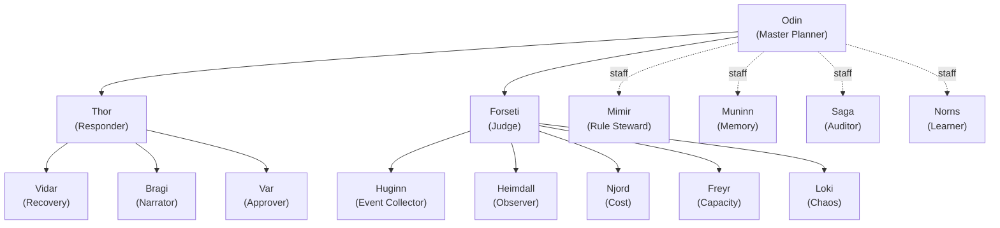
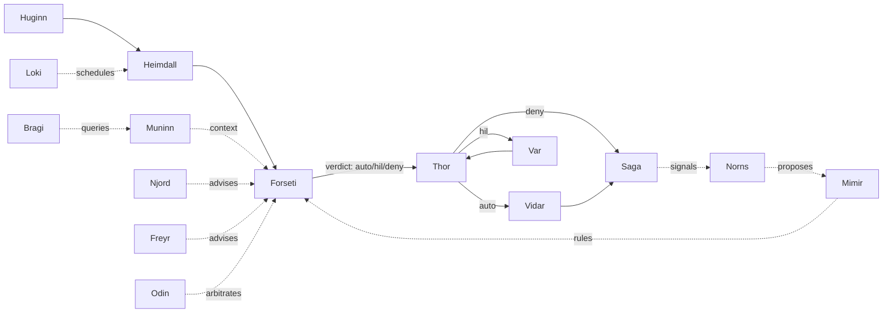

# Agent Pantheon

FDAI's organization-level agents. A fixed pantheon of 15 named agents that
own the runtime pipeline as ontology first-class citizens: each agent has a
mandate, owns a set of object types and action types, publishes and
subscribes on a schema-checked event bus, and can answer natural-language
questions on a separate conversational port. The pantheon is the org chart
of the control plane, and it is defined once upstream - forks configure it
but never add or rename agents.

> **Scope:** the pantheon is customer-agnostic. Every agent name, object
> type, and action referenced below is generic. Per-customer bindings live
> in a fork ([generic-scope.instructions.md](../../.github/instructions/generic-scope.instructions.md)).
>
> **Implementation focus:** Azure is the only implemented target; the pantheon
> talks to the Kafka wire (Event Hubs on `:9093`) already declared in
> [app-shape.instructions.md](../../.github/instructions/app-shape.instructions.md)
> ([Implementation Focus](../../.github/copilot-instructions.md#implementation-focus-must)).

Consumers of this document:

- The event-driven core reads the topic and object-type ownership tables in
  §5 and §7 to wire schema-validated pub/sub.
- The Operator Console ([operator-console.md](operator-console.md)) reads §7.3
  and §7.5 to route natural-language questions to the correct primary agent
  with per-user context.
- The rule-catalog and executor ([action-ontology.md](action-ontology.md),
  [execution-model.md](execution-model.md)) read §8 to bind each ActionType
  to its initiator, judge, approver, executor, and auditor.
- Forks read §11 to see which seams are open (topic subscriptions, config
  overrides) and which are locked (no new agents, no rename).

## 1. Design principles

The pantheon is a thin re-framing of the existing FDAI control loop into
named organizational roles. It does not change the safety envelope in
[architecture.instructions.md](../../.github/instructions/architecture.instructions.md);
it makes the roles legible and auditable.

- **Deterministic-first, LLM-capable.** Every agent CAN call an LLM through
  its own bindings, but the runtime hot-path routes almost everything at T0
  (rule / table lookup) or T1 (similarity). LLM calls are reserved for
  narrow, declared uses (§9). LLM use is a capability, not a default.
- **Two-port model.** Every agent exposes a typed pub/sub port for machine
  traffic and a conversational port for humans and other agents (§7).
- **Single-writer, multi-reader topics.** Each object type has exactly one
  owner agent that publishes; anyone may subscribe (§7.1).
- **Judge is not the executor.** Forseti issues a verdict; Thor dispatches
  the verdict; Var carries the human approval. No agent both judges and
  executes.
- **Pantheon fixed upstream.** The 15-agent set, the org chart, and the
  role assignments are locked. Forks customize behaviour through configured
  seams (§11) - not by adding, removing, or renaming agents.

## 2. Organization chart

Two lines report to Odin: Thor (operations) and Forseti (judgment). Four
governance staff report as staff (dotted) to Odin, independent from the
operations line. Domain specialists and sensing agents sit under Forseti so
that data flows into judgment, not directly into execution.



## 3. Runtime relationship diagram

The org chart is reporting lines. The relationship diagram is data flow.
Sensing and specialists feed Forseti; Forseti's verdict feeds Thor; Thor
dispatches to Vidar (recovery), Var (human approval), or executes directly;
Saga audits every terminal state; Norns learns from Saga; Norns proposes to
Mimir; Odin arbitrates cross-vertical conflicts before Forseti finalizes.



### 3.1 Multi-objective arbitration

When domain specialists disagree on the same resource (Njord recommends
`scale_down` for cost while Freyr recommends `scale_up` for capacity),
Forseti - the sole writer of `object.arbitration-request` - forwards the
conflict to Odin with each domain's measured **impact magnitude** in
`[0, 1]` (a cost signal's overspend ratio, a capacity forecast's projected
utilization). Odin resolves it with a deterministic **multi-objective**
arbiter (`fdai.agents.arbitration.MultiObjectiveArbiter`) rather than a
blunt priority table:

- Each domain has a configured **weight** (derived from the priority order
  `resilience > security > change_safety > cost > capacity` by default;
  fork config overrides). The score is `weight * impact`.
- The winner is the highest score. With equal impacts this reproduces the
  legacy priority winner exactly, so the arbiter is a strict superset of
  the old table - no behavior regresses.
- A high-impact lower-priority domain can outrank a low-impact
  higher-priority one, which is the point: the arbiter weighs *magnitude*,
  not just rank (it will not save one dollar of on-call time by spending
  ten dollars of compute).
- When the top-two **margin** is within a configured HIL band (default
  `0.10`), or a domain has no known weight, the call is too close to
  auto-resolve and the decision is flagged `escalate_hil` - close calls go
  to a human, never a silent auto-pick (fail toward safety).
- Every decision records per-domain `objective_scores` and the `margin`
  on `object.arbitration-decision`, so the outcome is grounded and
  auditable.

The arbiter takes no LLM call and no I/O; it is pure and deterministic
given its config and inputs.

### 3.2 Discovery-loop learners (Norns)

Norns closes the learning loop shown as `Saga -. signals .-> Norns` in
the relationship diagram. It never mutates the catalog or any threshold
directly - every output is an inert `RuleCandidate` proposal that must
pass the quality gate. Three deterministic (T0) learners run:

- **Fingerprint aggregator** - a repeated handoff fingerprint proposes a
  *new* rule (Wave 2 baseline).
- **Outcome-threshold learner** - when an action's measured rollback
  rate over a minimum sample exceeds the alarm rate, Norns proposes a
  *threshold_adjustment* that **raises** the action's confidence bar so
  it escalates to HIL more often. Learning only ever moves the threshold
  in the safer direction; a relaxation is never auto-proposed.
- **Override learner** - recurring operator overrides on the same rule
  propose a *revision* (or a *retirement* when the overrides `disabled`
  it), realizing the "recurring overrides signal a revise/retire" rule
  from `architecture.instructions.md`. The proposal carries the override
  count and latest mode as grounding.

Every proposal records numeric evidence (sample size, rollback rate,
override count) so Mimir and the quality gate can judge it on measured
data, not assertion.

## 4. Agent catalog

Layer: `1` = domain specialist, `2` = pipeline (sensing / judgment /
operations / interface), `3` = governance staff.

| Name | Role | Layer | Owns object types | Executes action types | LLM in hot-path? |
|------|------|-------|-------------------|-----------------------|-------------------|
| Odin | Master Planner | 3 | ArbitrationDecision | arbitrate_domain_conflict | no |
| Thor | Responder | 2 | ActionRun, ActionAttempt | (dispatches; owns none directly - see §8.1) | no |
| Forseti | Judge | 2 | Verdict, RCA | (produces verdicts; no executor role) | yes (T2 abstain only) |
| Huginn | Event Collector | 2 | Event | ingest_event | no |
| Heimdall | Observer | 2 | Anomaly, Drift, Forecast, SecurityEvent | detect_anomaly, detect_drift, forecast, notify_admin_privilege_violation | no |
| Vidar | Recovery | 2 | Rollback | perform_rollback, dr_failover | no |
| Var | Approver | 2 | Approval | approve_action, reject_action | no |
| Bragi | Narrator | 2 | Conversation, Turn, UserPreference | translate_intent | yes (translator only) |
| Saga | Auditor | 3 | AuditEntry, Issue | append_audit, escalate_to_github_issue | no |
| Mimir | Rule Steward | 3 | Rule, Policy | promote_rule, revoke_rule | no |
| Muninn | Memory | 3 | StateSnapshot, ContextIndex | index_state, snapshot_state | no |
| Norns | Learner | 3 | RuleCandidate, PatternObservation | propose_rule_candidate, close_issue | yes (off-path batch only) |
| Njord | Cost | 1 | CostAnomaly, Budget | propose_cost_action | no |
| Freyr | Capacity | 1 | CapacityForecast, SizingRecommendation | propose_capacity_action | no |
| Loki | Chaos | 1 | ChaosExperiment, ResilienceScore | schedule_experiment | no |

The 15 agents are jointly sufficient to cover SRE, ARB (change safety), and
FinOps workflows through composition; see §7 for the topic contract and
§8.6 for how handoff (unhandled requests) integrates with the same pipeline.

### 4.1 Per-agent task inventory

Every agent performs four task categories. **R**ecurring runs on a schedule.
**E**vent handles typed-port messages. **M**eta is the agent's own health
and self-improvement. **X**-agent participates in the workflows named in
[agent-workflows.md](agent-workflows.md).

| Agent | R (recurring) | E (event) | M (meta) | X-agent |
|-------|---------------|-----------|----------|---------|
| Odin | weekly portfolio review, priority-policy tuning | arbitrate_domain_conflict on Forseti signal | portfolio outcome score self-audit | 7 (Agent health), tie-break for 2 (Predictive scale) |
| Thor | execution-path health check, retry-strategy cache warmup | verdict dispatch, rollback trigger, rate-limit enforce | pre-flight simulation for high-risk actions | 1 (Cost-aware remediation), 2 (Predictive scale) |
| Forseti | rule-cache refresh, retrospective what-if batch, verdict coherence self-test | judge event (T0/T1/T2), emit domain_conflict, emit SecurityEvent | novelty drift detection (T0 vs T2 mix) | 1, 2, 5 (Security escalation), 8 (Judgment coherence) |
| Huginn | source health check, dedup window maintenance, backpressure signal | normalize + dedup + correlate + publish | adaptive schema learning (T1 clustering, off-path) | feeds every workflow |
| Heimdall | anomaly baseline update, forecast refresh, external-actor list refresh, agent-health probe | anomaly detect, drift detect, SecurityEvent correlate, notify_admin | multi-signal cross-correlation | 1, 2, 3 (DR drill), 5, 7 (Agent health), 9 (Rollback rehearsal) |
| Vidar | rollback-path validation, DR readiness score, recovery-time SLI | perform_rollback, dr_failover | rollback rehearsal (shadow) | 3, 9 |
| Var | approval SLA monitor, approver availability tracking | present HIL card, enforce quorum, timeout / escalation | approval provenance record | 4 (Override -> Discovery), 5 |
| Bragi | expired-session cleanup, UserPreference index refresh | NL routing, multi-agent aggregation, NL rendering | intent classifier retraining (T1, off-path) | 7, 10 (Retrospective what-if) |
| Saga | audit-chain integrity self-check, issue-close scan, fingerprint index compaction | append AuditEntry, escalate_to_github_issue, replay for reconstruction | audit chain tamper detection | every workflow (audit) |
| Mimir | rule-source polling, regression suite, deprecation cycle | promote / revoke rule, cache-invalidation broadcast | freshness-score, stale-rule detection | 4, 6 (Handoff -> Capability), 8 |
| Muninn | snapshot rotation, RAG index rebuild, cache eviction | context fetch for Forseti, state query for Bragi | trending-query pre-warm, ontology cross-check | supports every judgment-touching workflow |
| Norns | hourly batch audit analysis, streaming pattern extraction | pattern signal, RuleCandidate publish, close_issue signal | model performance drift detection | 4, 6, 8 (Judgment coherence), 10 |
| Njord | cost ingestion (daily), budget monitor, cost forecasting | cost anomaly, budget breach alert, cost-advisor query | RI / SP optimization proposals | 1, 2 |
| Freyr | utilization sampling, capacity forecasting, sizing analysis | scale proposal, capacity advisor query | multi-dimensional capacity (CPU + IOPS + net + mem) | 2, 3 |
| Loki | chaos-experiment scheduling, resilience-score refresh | experiment execution proposal (always HIL), blast-radius calc | adversarial scenario generation (T2, off-path) | 3, 9 |

### 4.2 Per-agent KPI (success and degradation signals)

Every agent MUST emit these metrics into the measurement pipeline
([goals-and-metrics.md](goals-and-metrics.md)) so shadow -> enforce
promotion gates can evaluate deterministically.

| Agent | Success KPI | Degradation KPI (early warning) |
|-------|-------------|--------------------------------|
| Odin | cross-vertical conflict resolution time, portfolio target attainment | tie-break recurrence rate |
| Thor | execution success rate, execution latency p99 | rollback trigger rate, race failures |
| Forseti | verdict accuracy vs post-hoc override, T2 escalation rate (target < 10%) | mixed-model disagreement rate, grounding-missing rate |
| Huginn | event processing latency p99, dedup accuracy | schema-match failure rate |
| Heimdall | anomaly precision + recall, forecast MAPE | false-positive rate, missed critical |
| Vidar | rollback success rate, MTTR | rollback-path validation failure |
| Var | HIL SLA compliance, quorum compliance | expiry rate, repeated escalations |
| Bragi | routing accuracy (post-audit), session satisfaction | handoff rate (target < 5%) |
| Saga | audit chain integrity, replay success | audit-gap detection |
| Mimir | rule freshness score, promotion pass rate | shadow-fail rate, stale-rule ratio |
| Muninn | context fetch p99, cache hit rate | cache-miss recomputation time |
| Norns | rule candidate adoption rate, pattern validity | false-pattern rate |
| Njord | cost forecast MAPE, savings realized | budget-breach miss |
| Freyr | capacity forecast error, over / under provisioning | scale race, throttle events |
| Loki | experiment blast-radius adherence, resilience improvement delta | unplanned side-effects, experiment failure |

**System-level KPI** (Odin portfolio report):

- **Autonomy ratio** - auto vs HIL vs deny distribution (goal: auto up,
  deny down).
- **Handoff conversion rate** - issue -> RuleCandidate -> promoted.
- **Cross-vertical action ratio** - single vs multi-vertical actions.
- **Discovery velocity** - new rule / capability promotion rate (weekly).

### 4.3 Per-agent degradation policy

When an agent itself fails or degrades, these are the declared safe
behaviors. Anti-pattern §11 forbids collapsing these to nothing.

| Agent failed | Impact | Safe degradation |
|--------------|--------|------------------|
| **Saga** | audit unavailable | **HARD FAIL**: no new mutation permitted; whole system demoted to shadow |
| **Vidar** | rollback unavailable | Thor refuses new auto executions; all new actions demoted to shadow |
| **Forseti** | judgment stopped | Huginn / Heimdall keep publishing (Kafka retains); no verdict fallback (judgment cannot proceed without judge); operator alert |
| **Odin** | cross-vertical arbitration missing | Forseti auto-promotes conflict verdicts to HIL (human arbitrates) |
| **Thor** | execution stopped | verdicts queued; verdict TTL expiry drops stale ones (re-judge on republish) |
| **Huginn** | ingestion stopped | Kafka retention preserves events; Huginn resumes from checkpoint on recovery (idempotent) |
| **Heimdall** | detection stopped | rule-only judgments continue via Huginn -> Forseti; security correlation delayed but RBAC deny still audited |
| **Var** | HIL blocked | HIL queue preserved; timeout auto-extended; admin alert; auto actions continue |
| **Bragi** | conversation blocked | operator falls back to console read-only view + direct audit query |
| **Mimir** | rule updates stopped | cached rules continue; Forseti raises stale-rule warning; new rule updates deferred |
| **Muninn** | context unavailable | Forseti judges without context (T2 escalation rate rises expected); "context unavailable" logged |
| **Norns** | learning stopped | no immediate impact (off-path); long-term discovery velocity drops - warning raised |
| **Njord / Freyr / Loki** | domain advice missing | Forseti demotes that domain's actions to HIL |

Common rules:

- **Saga and Vidar are hard dependencies** for any mutation. Their
  degradation is fail-safe closed: no execution proceeds without them.
- **Any judge / executor / auditor triad missing** demotes new mutation to
  shadow.
- **Sensing degradation (Heimdall / Var / Vidar failure)** allows the
  pipeline to keep running with reduced autonomy.
- Every degradation surfaces in Odin's portfolio report (workflow 7).

### 4.4 Task tier classification (LLM policy per task)

Not every "predictive" or "adaptive" task needs an LLM. The table below
maps every task from §4.1 to its tier so implementation cannot silently
promote to T2.

| Task | Correct tier | Why |
|------|--------------|-----|
| Heimdall forecast | T1 (ARIMA / smoothing) | statistical is enough, reproducible |
| Norns streaming pattern | T1 (clustering) | live signal needs deterministic ranking |
| Norns batch summary | T2 (off-path only) | LLM ok for weekly report, never hot-path |
| Bragi intent classify | T0 keyword + T1 embedding, T2 fallback | hot-path dialog cannot afford T2 latency |
| Mimir rule draft | T2 (off-path, human-reviewed) | novel rule OK to LLM; sign-off is human |
| Forseti verdict coherence | T0 (SQL) + T1 (embedding) | past verdicts are structured audit log |
| Var assisted decision | T0 (linked similar cases) + T2 (summary, off-path) | card carries summary; humans decide |
| Huginn schema learning | T1 (batch clustering) + T2 for promotion | real-time normalization stays T0 |
| Loki adversarial | T2 (off-path) | scenario generation ok LLM; execution deterministic |

Hot-path LLM invocation is restricted to three places: Bragi translator,
Forseti T2 abstain, Norns off-path batch. Any implementation adding LLM
to another hot path is a defect.

## 5. Ontology integration

`Agent` is a first-class object type in the ontology. It shows up in
`/ontology/graph` alongside every other object type, so the org chart and
data ownership are queryable, not documented separately.

```yaml
object_type: Agent
properties:
  name: string                     # "Odin", "Thor", ...
  layer: enum                      # domain | pipeline | governance
  reports_to: Agent?               # org chart edge
  owns: [ObjectType]               # write-authority (single-writer)
  executes: [ActionType]           # references action-ontology.md
  initiates: [ActionType]          # can propose (see §8.1)
  subscribes: [Topic]              # typed-port subscriptions
  publishes: [Topic]               # typed-port publications
  question_domains: [string]       # NL query categories (§7.3)
  owns_code_paths: [glob]          # RAG scope for self-introspection (§9)
  llm_bindings: [ModelId]          # models this agent may invoke
  rate_limits:
    proposals_per_minute: int
    proposals_per_hour: int
```

Every `object_type` declaration in the wider ontology gains an
`owner_agent` field pointing back at exactly one `Agent`. The producer
principal is checked by the schema registry: only the owner may publish.

## 6. Communication contract

The pantheon reuses the existing wire in
[app-shape.instructions.md](../../.github/instructions/app-shape.instructions.md):
Kafka protocol on Event Hubs `:9093`. No new infrastructure.

### 6.1 Typed port

One topic per object type, named `object.<type>`. Every message carries
`correlation_id`, `idempotency_key`, and `producer_principal`.

| Topic | Publisher | Primary subscribers |
|-------|-----------|---------------------|
| object.event | Huginn | Heimdall |
| object.anomaly, object.drift | Heimdall | Forseti |
| object.security-event | Forseti | Heimdall (correlation), Saga |
| object.verdict | Forseti | Thor, Saga, Odin |
| object.arbitration-request | Forseti | Odin |
| object.arbitration-decision | Odin | Forseti |
| object.action-run | Thor | Vidar, Var, Saga |
| object.approval | Var | Thor, Saga |
| object.rollback | Vidar | Saga |
| object.audit-entry | Saga | Norns |
| object.issue | Saga | Norns, Mimir |
| object.rule-candidate | Norns | Mimir |
| object.rule | Mimir | Forseti (cache reload) |
| object.conversation | Bragi | (session index) |
| object.turn | Bragi | Muninn |
| object.user-preference | Bragi | Muninn |
| object.cost-anomaly | Njord | Forseti |
| object.capacity-forecast | Freyr | Forseti |
| object.chaos-experiment | Loki | Heimdall |

Partitioning:

- Mutation topics (`object.action-run`, `object.rollback`) partition by
  `resource_id` so concurrent writes to the same resource serialize.
- Judgment and audit topics partition by `correlation_id` so a single
  incident stays on one consumer.

### 6.2 Conversational port

Every agent exposes a request-response NL interface reachable through
Bragi. Requests carry the operator's `user_id` and `session_id`. Responses
carry `primary_agent`, `contributors`, `answer`, and `trace_ref`. The
conversational port is where agent-to-agent NL introspection also happens
(e.g., Bragi asks Heimdall in NL when the typed schema isn't a fit).

The two ports share nothing except the correlation trace: a conversational
request that asks for an action MUST re-enter the typed pipeline (7.7).

Concretely, each agent overrides ``Agent.introspect`` to ground its answer
in the state it owns (cost samples, audit chain, action runs, ...) and
falls back to a spec-derived capability description; the response also
carries a structured ``facts`` map so an A2A caller consumes the evidence
without parsing prose. The MUST-NOT-bypass guard (7.7) is enforced by
``is_action_intent``: a request phrased as a command abstains with
``requires_typed_pipeline`` instead of being answered. A2A introspection
is reached through ``PantheonRuntime.introspect(agent, question,
requester=...)`` (delegating to ``Bragi.introspect_agent``), which records
the requesting agent and threads the shared correlation trace.

### 6.3 NL query orchestration

Bragi is the router, not the answerer. Routing runs deterministic-first:

1. **T0 keyword / regex match.** Compare intent tokens against
   `Agent.question_domains`. Score by domain specificity, ownership of the
   referenced object type, and recency of interaction.
2. **T1 embedding similarity.** If T0 abstains, similarity match against
   past resolved queries; still deterministic ranking, no LLM.
3. **T2 intent classification.** If T0/T1 both abstain, LLM classifies
   intent, and Bragi re-runs the scoring with the classified intent.
4. **Handoff.** If scoring margin is still below threshold, emit
   `HandoffEscalation` (§7.4). The system files a GitHub issue rather than
   guess.

Winner selection is scored, not first-match, when several agents match:

```
score = w1 * domain_specificity
      + w2 * ownership_bonus
      + w3 * recency_bonus
      + w4 * confidence_bid
```

Tie-break order (deterministic): specificity > ownership > recency >
pantheon precedence (governance > pipeline > domain). The winner is
`primary_agent`; the runners-up become `contributors`. Every routing
decision is written to `Turn.score_breakdown` for later inspection.

### 6.4 Handoff escalation protocol

When an agent cannot resolve a request through its owned data, T0, T1, or
T2 (per its LLM policy in §9), it publishes a `HandoffEscalation` object.
Saga materializes the escalation into a GitHub issue via the
`escalate_to_github_issue` action.

Deduplication uses a `problem_fingerprint`:

```
fingerprint = sha1(
    intent_category + resource_type + normalized_selector
  + primary_agent + failure_reason_code
)
```

Saga keeps a local `fingerprint -> github_issue_number` index in Muninn.

- **First occurrence** creates the issue with label `fdai:fp:<hash>`.
- **Repeat occurrence** appends a comment on the same issue with the new
  `correlation_id` and context. The issue body carries `first_seen`,
  `last_seen`, and `occurrence_count`; comments record each recurrence.
- **Auto-close** happens when Mimir promotes a rule or capability that
  would resolve the fingerprint, and 24 hours of regression tests pass
  clean. The closing comment links the promoting PR. Manual close is
  always allowed.

The fingerprint hash never carries customer identifiers (labels are hashes
only); detailed values live only in the fork's issue tracker.

### 6.5 Conversation state and per-user context

Bragi owns `Conversation`, `Turn`, and `UserPreference`. State is
partitioned by `user_id`:

- **Session.** A `Conversation` starts on first turn and ends after 30
  minutes of inactivity; every turn is appended immutably as a `Turn`.
- **Multi-turn context.** Bragi passes the last N turns to the primary
  agent as `prior_turns_ref`, scoped to the requesting `user_id`.
- **RBAC.** Muninn refuses cross-user reads; a primary agent that tries to
  read another user's conversation gets an empty result and Saga records
  the attempt.
- **Learner boundary.** Norns is limited to metadata by default
  (`share_with_learner: false` per `UserPreference`). Opt-in surfaces the
  turn body for pattern extraction; opt-out is the shipping default.
- **Retention.** Active conversation: 30 days. Cold storage: 60 additional
  days. Total: 90 days, then delete. Aggregated anonymized metrics survive
  in Saga's own audit stream.

## 7. Ontology actions

Every action a pantheon agent can take is one `ActionType` entry (existing
schema in [action-ontology.md](action-ontology.md), extended below).
Nothing in the pantheon runs code outside this table.

### 7.1 Extended ActionType schema

Each `ActionType` MUST bind the five roles below. All are references to
`Agent`; a role that is not applicable (e.g., no HIL) uses `null`.

```yaml
initiators: [Agent]     # who may propose this action
judge: Agent            # who issues the verdict (always Forseti today)
approver: Agent?        # who signs off on HIL (Var when HIL applies)
executor: Agent         # the sole principal that mutates
auditor: Agent          # who appends the audit trail (Saga)
compensating_action: ActionType?   # required unless irreversible: true
```

The registry rejects an ActionType whose `producer_principal` on any
lifecycle event does not match the declared role.

### 7.2 Lifecycle state machine

An `ActionRun` walks the following states. Each transition is one pub/sub
event; the state's owner agent is the only publisher.

```
proposed  (initiator agent)
  -> verdicted    (Forseti: auto | hil | deny)
    -> deny_dropped     (terminal; Saga records)
    -> hil              (Var: approved | rejected | expired)
      -> rejected       (terminal; Saga records)
      -> expired        (terminal; Saga records)
      -> approved
    -> auto             (Thor)
  -> paused             (external hold: maintenance window)
  -> executing          (Thor)
    -> succeeded        (terminal after audit)
    -> failed
      -> rolled_back    (Vidar; terminal after audit)
      -> compensated    (Thor + compensating action; terminal after audit)
```

Every terminal state writes an `AuditEntry` before closing. Replay from
the audit log is judge-only: Saga can reconstruct any past decision but
never re-executes.

### 7.3 Parameter validation and idempotency

Three validation checks, all deterministic:

1. **At propose.** Initiator asserts the params conform to
   `argument_schema`; the schema registry rejects malformed proposals.
2. **At verdict.** Forseti re-runs schema + policy + what-if / dry-run;
   any failure downgrades the verdict to `deny` or `hil`.
3. **At execute.** Thor validates once more just before mutation, to
   catch races on target state.

Idempotency keys are per-action (`action_run_id`) and per-attempt
(`attempt_id`). A retried publish with the same key is a no-op at the
executor; the audit records the duplicate.

### 7.4 Blast-radius and batch semantics

An ActionType with `blast_radius > 1` fans out to one `ActionAttempt` per
target resource. Attempts are partitioned by `resource_id` and executed
independently. Failure isolation:

- A failing attempt rolls back only its own target.
- Sibling successes are not undone; the rollup `ActionRun` records the
  mix.
- Saga writes both the per-attempt entries and the rollup entry.

Per-resource ordering is preserved by the partition key; cross-resource
ordering is not implied.

### 7.5 Compensating actions and irreversibility

Every mutation ActionType MUST reference a `compensating_action` unless it
declares `irreversible: true`. Examples:

| ActionType | compensating_action | irreversible |
|------------|---------------------|--------------|
| restart_vm | (self; restart returns to running state) | false |
| resize_vm_up | resize_vm_down | false |
| disable_public_access | enable_public_access | false |
| delete_storage | (n/a) | true |

`irreversible: true` action MUST route through HIL + quorum: at least two
distinct approvers, no self-approval. Forseti attaches `quorum_required:
2` to the verdict; Var enforces it.

### 7.6 Handoff as an ActionType

Escalation to GitHub issues (§7.4) is itself an `ActionType`, so it
inherits the same lifecycle, audit, and override machinery:

```yaml
id: escalate_to_github_issue
category: governance
initiators: [Bragi, Forseti, Heimdall, Norns, Saga]
judge: Forseti
approver: null                 # auto-approved for informational escalations
executor: Saga
auditor: Saga
side_effect_class: external
rollback_contract: state_forward_only
default_mode: enforce
irreversible: false
```

### 7.7 Conversational port MUST-NOT-Bypass rule

The conversational port CAN start an action but MUST NOT execute one on
its own. When an operator says "restart vm-1" to Bragi, Bragi translates
the intent into an `ActionProposal` whose `initiator_principal` is the
operator (not Bragi) and hands it to the typed pipeline. Forseti, Var,
and Thor run their normal steps. Bragi only renders progress back to the
operator. Any implementation that lets Bragi call an executor directly is
a defect.

**Implementation.** Bragi holds a `proposal_sink` DI seam wired at the
composition root to `Huginn.ingest` (the sole writer of `object.event`), so
Bragi never publishes a mutation topic itself. `Bragi.submit_action_proposal`
maps the leading command verb to an ActionType, builds the proposal with
`initiator_principal = operator` and `operator_initiated = true`, and submits
it through the sink; it returns a `correlation_id` the operator can track and
renders pipeline progress from `object.verdict` / `object.action-run`, never
executing. Forseti propagates `initiator_principal` onto the verdict, Thor onto
the ActionRun, and Var enforces no-self-approval (the initiator can never
approve their own action). An operator-initiated proposal whose initiator is
unknown to the RBAC seam fails closed to `deny` with a `SecurityEvent`. When
the console passes the operator's Entra role, an entry RBAC gate refuses an
action request below the execute floor (`Contributor`) before it enters the
pipeline, so a `Reader` cannot submit any action (defense-in-depth with the
principal-level deny above).

### 7.8 Fork override boundaries

Forks may override the following ActionType fields:

- `preconditions`, `stop_conditions`
- `default_mode` (only in the strict-to-lenient-not-allowed direction:
  fork cannot silently move enforce -> shadow, but shadow -> enforce is
  fine when the promotion gate passes)
- `params.schema` (additions only, never removals)
- `promotion_gate` (may only strengthen, never weaken)

Forks may NOT override:

- `executor`, `judge`, `approver`, `auditor`, `initiators`
- `compensating_action`, `irreversible`, `rollback_contract`

These are pantheon safety boundaries. The override lint runs in CI on
`rule-catalog/action-types-overrides/` and fails the merge when a locked
field appears.

### 7.9 Rate limits per agent

Each agent declares `rate_limits`. Defaults ship as `20 proposals/minute`
and `100 proposals/hour`. Excess proposals are queued to a bounded buffer;
overflow drops with a `RateLimitExceeded` audit entry, and Norns picks up
the spike as a learning signal ("why did this agent burst?"). Forks may
override the numbers through config.

## 8. LLM policy per agent

LLM invocation is a capability, not a default. Every agent CAN use its
LLM bindings; only a few do so in the hot-path.

| Agent | Hot-path LLM? | Off-path LLM? | Conversational port |
|-------|--------------|---------------|---------------------|
| Odin | no | no | yes (introspection) |
| Thor | no | no | yes (introspection) |
| Forseti | yes (T2 abstain only) | no | yes |
| Huginn | no | no | yes |
| Heimdall | no | no | yes |
| Vidar | no | no | yes |
| Var | no | no | yes |
| Bragi | yes (translator only) | no | yes |
| Saga | no | no | yes |
| Mimir | no | no | yes |
| Muninn | no | no | yes |
| Norns | no | yes (batch discovery) | yes |
| Njord | no | no | yes |
| Freyr | no | no | yes |
| Loki | no | no | yes |

Every agent's conversational port uses an LLM to render natural-language
responses over its owned data plus the code it owns via `owns_code_paths`
(RAG). This is the only path by which an agent introspects itself.

## 9. Security and privilege-escalation monitoring

FDAI treats unauthorized action attempts as first-class security signals.
The pantheon extends Heimdall (already the "all-seeing" observer) to
detect them; it does not add a new agent.

### 9.1 Detection

When an operator (via Bragi) or a fork-registered initiator proposes an
action whose `initiator_principal` lacks the RBAC role required by the
ActionType:

1. Forseti issues verdict `deny` with `reason: rbac_insufficient`.
2. Forseti simultaneously publishes a `SecurityEvent` with
   `type: privilege_escalation_attempt`, the initiator id, the attempted
   ActionType, the target resource, a severity score, and the correlation
   id.
3. Saga records both events.

### 9.2 Correlation and severity

Heimdall subscribes to `object.security-event` and classifies:

| Severity | Trigger | Response |
|----------|---------|----------|
| low | single attempt on a low-impact action | audit only |
| medium | 3+ attempts by same user within 5 minutes, or single medium-impact | daily digest to admin group |
| high | single attempt on a critical / irreversible action, or 5+ attempts in 5 minutes | immediate ChatOps card to admin group |
| critical | multi-action pattern, unusual hours, deliberate escalation pattern | immediate + separate on-call security channel |

Severity is deterministic (table + counters), not LLM-scored.

### 9.3 Notification action

Heimdall proposes `notify_admin_privilege_violation` (see §7.6 for the
ActionType shape). Forseti fast-approves governance notifications (no HIL
loop for informational alerts). The delivery adapter posts to the
configured ChatOps admin channel using the same infra as HIL cards, with
a distinct template.

### 9.4 Alert deduplication and rate limits

Same-user, same-action alerts within a 1-hour window collapse into one
card with an incremented counter. Per-user limit is 5 cards per hour;
excess collapses into a digest to prevent alert storms. The fingerprint
scheme reuses the §7.4 dedup pattern.

### 9.5 Legitimate escalation

A denied user sees a response with a "request permission upgrade" link.
Permission upgrades themselves are a normal HIL flow (admin approves via
Var); the upgrade path is out of scope for this document but is on the
Phase roadmap.

## 10. Fork customization

Forks customize the pantheon through configured seams. They do not
subclass agents, add agents, or rename agents.

| What forks may do | How |
|-------------------|-----|
| Bind LLM models to agents | `agents.<name>.llm_bindings` config |
| Disable a domain agent (e.g., no chaos) | `agents.<name>.enabled: false` |
| Add rules or policies | `rule-catalog/catalog/**` overlay |
| Add or override ActionTypes | `rule-catalog/action-types-custom/**` and `-overrides/**` within §7.8 boundaries |
| Change ChatOps channel targets | delivery-adapter config |
| Change conversation retention or opt-in defaults | Bragi config |
| Change rate-limit defaults | `agents.<name>.rate_limits` config |

Forks may NOT:

- Add a new agent name to the pantheon
- Rename or reassign an agent's role
- Repoint an ActionType's `executor`, `judge`, `approver`, `auditor`, or
  `initiators`
- Publish to a topic owned by another agent

A missing capability that requires a new agent is a signal to open an
upstream PR that extends the pantheon under the same rules everyone else
follows.

## 11. Anti-patterns

- **Direct agent-to-agent RPC.** All hot-path communication is
  pub/sub on the schema-checked bus. HTTP calls between agents defeat
  audit and replay.
- **Conversational port bypasses the typed pipeline.** Bragi that calls
  an executor directly is a defect (§7.7).
- **Judge under executor in the org chart.** Forseti reports to Odin,
  not Thor, so verdicts stay independent of execution.
- **LLM in a sensing hot-path.** Huginn, Heimdall, and the domain
  specialists MUST NOT invoke an LLM synchronously. Their patterns must
  compile to deterministic rules (T0) or lightweight similarity (T1).
- **Alerts without dedup.** Every notification path (issue, security
  card, HIL ticket) MUST use the fingerprint scheme.
- **Fork adds an agent.** The pantheon is fixed upstream. Adding a new
  agent is an upstream change, not a fork change.
- **Action without a compensating action.** Every mutation ships with
  `compensating_action` or `irreversible: true` + HIL quorum. There is
  no third option.

## Next steps

| To learn about | Read |
|----------------|------|
| The ActionType schema and existing action inventory | [action-ontology.md](action-ontology.md) |
| The unified RiskGate, executor paths, and audit block | [execution-model.md](execution-model.md) |
| The conversational surface that hosts Bragi | [operator-console.md](operator-console.md) |
| RBAC roles referenced by §9 | [user-rbac-and-identity.md](user-rbac-and-identity.md) |
| ChatOps channel routing referenced by §9.3 | [channels-and-notifications.md](channels-and-notifications.md) |
| How rules and policies feed Forseti | [rule-catalog-collection.md](rule-catalog-collection.md), [rule-governance.md](rule-governance.md) |
| Fork boundaries and DI seams | [downstream-fork-guide.md](downstream-fork-guide.md) |
