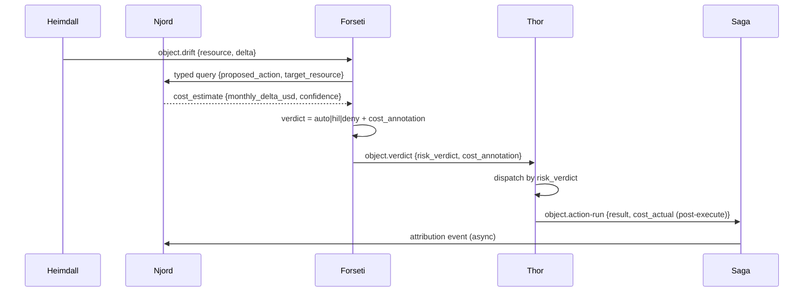
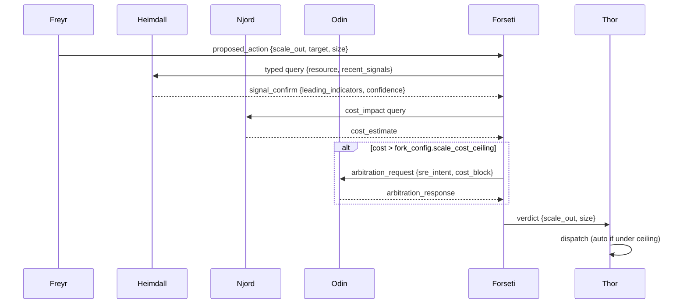
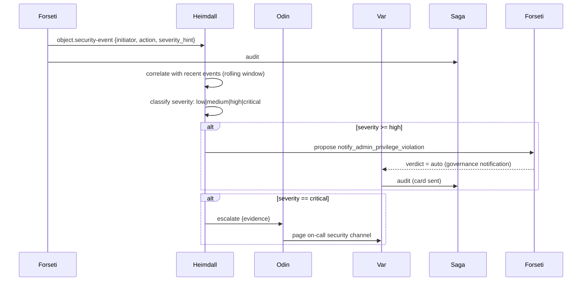
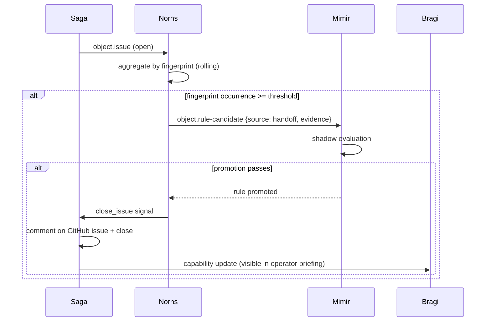
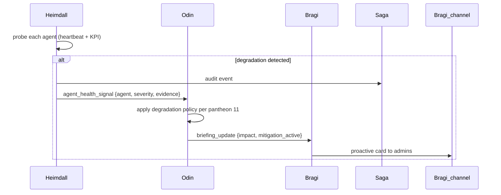
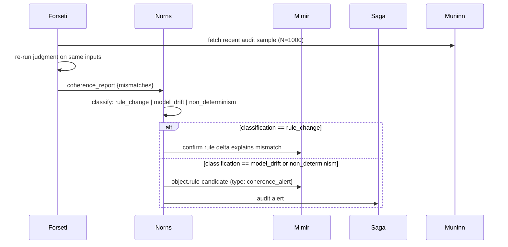
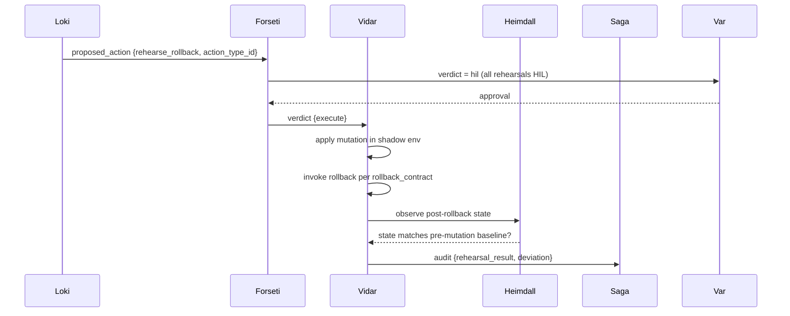
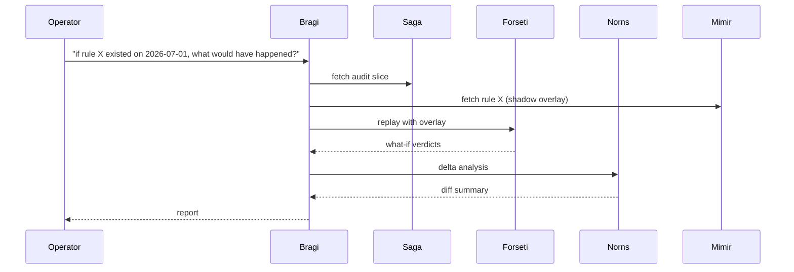
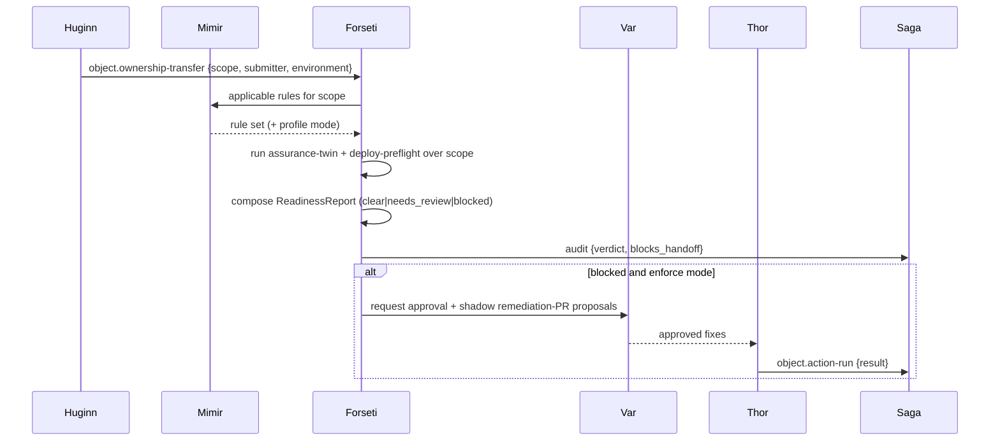

# Agent Workflows

The eleven cross-agent workflows that the pantheon composes into product-level
capabilities. Each workflow names its participating agents, its trigger,
its end-to-end sequence, and its exit criteria. Every workflow ships in
shadow mode first ([agent-pantheon-implementation.md § Wave 7](agent-pantheon-implementation.md#11-wave-7---cross-agent-workflows-in-shadow))
and is promoted per-workflow after Wave 8 measures its KPIs.

> **Scope:** the workflows are customer-agnostic. Concrete resource names
> in examples are placeholders
> ([generic-scope.instructions.md](../../.github/instructions/generic-scope.instructions.md)).
>
> **Contract:** every step is a pub/sub event on a schema-checked topic
> (see [agent-pantheon.md § 6.1](agent-pantheon.md#61-typed-port)). No
> workflow uses direct RPC between agents. HIL steps go through Var; audit
> goes through Saga. There are no shortcuts.

## 0. Workflow shape

Every workflow declaration follows the same structure:

- **Purpose** - what business capability the workflow delivers.
- **Trigger** - the event or schedule that starts the flow.
- **Agents** - primary and supporting, with role labels.
- **Sequence** - a mermaid diagram showing typed-port messages.
- **Exit criteria** - measurable conditions for shadow trace success.
- **Promotion gate** - the KPI thresholds required for enforce mode.
- **Anti-scope** - what the workflow deliberately does not do.

Workflows do not add new ontology types or ActionTypes; they consume the
existing catalog under `rule-catalog/action-types/` and the object types
under `rule-catalog/vocabulary/object-types/`. A workflow that needs new
types is a signal to open an upstream doc PR first.

## 1. Cost-aware remediation

**Purpose.** Every SRE remediation carries an attached cost impact so the
verdict reflects both reliability and finance. Prevents automation from
saving one dollar of on-call time by spending ten dollars of compute.

**Trigger.** Heimdall publishes `object.drift` (declared vs actual state
mismatch) or `object.anomaly` on a resource with an existing rule match.

**Agents.** Heimdall (initiator), Njord (cost advisor), Forseti (judge),
Thor (executor), Saga (auditor).



**Exit criteria.**

- Verdict emits with `cost_annotation.monthly_delta_usd` and
  `cost_annotation.confidence`.
- Post-execute audit records `cost_actual` when settlement data available
  (T+24h).
- No auto verdict issued when `cost_annotation.monthly_delta_usd >
  fork_config.cost_ceiling` without HIL.

**Promotion gate.** 14 days shadow; Njord cost forecast MAPE < 20% on
this workflow's audit sample; zero missing cost_annotation on remediations.

**Anti-scope.** Not a budget enforcement (Njord already emits
`CostAnomaly` for that separately); this only annotates SRE actions with
cost.

## 2. Predictive scale

**Purpose.** Scale proactively before Freyr's forecast trips a threshold
instead of reactively after Heimdall detects saturation.

**Trigger.** Freyr recurring forecast run (hourly). When the forecast
predicts threshold breach within `fork_config.predictive_horizon`
(default 2 hours).

**Agents.** Freyr (initiator), Heimdall (early-signal cross-check), Njord
(cost check), Odin (arbitration if cost blocks scale), Forseti, Thor.



**Exit criteria.**

- Scale action lands >30 min before Heimdall reactive detection would
  have fired (measured against a paired reactive baseline).
- Odin arbitration invoked when cost blocks: exactly once per conflict.
- Zero false-positive scale (verified by post-hoc reactive baseline
  showing no threshold breach).

**Promotion gate.** 30 days shadow; Freyr forecast MAPE < 15% on this
workflow's samples; false-positive scale rate < 5%.

**Anti-scope.** Not autoscale rules (existing platform autoscale keeps
running); this triggers *deliberate* scale actions attributable to
Freyr's forecast.

## 3. DR drill orchestration

**Purpose.** Regular disaster-recovery rehearsal without waiting for a
real incident. Verifies Vidar's rollback paths, DR failover mechanics,
and observability all still work.

**Trigger.** Loki schedule (weekly by default, fork-configurable).

**Agents.** Loki (planner), Vidar (execution), Heimdall (observation),
Norns (learning), Saga.

```mermaid
sequenceDiagram
    participant L as Loki
    participant F as Forseti
    participant V as Vidar
    participant H as Heimdall
    participant N as Norns
    participant S as Saga
    L->>F: proposed_action {dr_drill, scope, blast_radius}
    F->>Var: verdict = hil (drills are always HIL)
    Var-->>F: approval
    F->>V: verdict {execute_drill}
    V->>V: execute rollback / failover in shadow env
    V->>H: observe_request
    H-->>V: observations
    V->>S: object.rollback {result, observations, recovery_time}
    S->>N: audit signal
    N->>N: compare to baseline; emit drift signal if MTTR degraded
```

**Exit criteria.**

- Drill completes within Loki's declared blast_radius.
- Post-drill MTTR reported; comparison to previous drill baseline saved.
- Any MTTR degradation > 20% raises `RuleCandidate` for capacity or
  path change.

**Promotion gate.** 3 successful drills in shadow; drill duration <
declared budget; zero unplanned production side-effects (measured by
Heimdall's blast-radius audit).

**Anti-scope.** Not real DR - this is rehearsal only. Real DR
failover uses the same Vidar action type but with a different trigger
(incident-classified emergency).

## 4. Override -> Discovery

**Purpose.** Every human override of a rule verdict becomes a signal
for rule refinement. Frequent overrides on the same rule mean the rule
is either wrong, over-scoped, or missing a critical exception.

**Trigger.** Var records `Approval` where the operator's decision differs
from Forseti's proposed verdict (approve on deny, reject on auto, etc.).

**Agents.** Var (initiator), Saga (aggregator), Norns (learner), Mimir
(rule steward).

```mermaid
sequenceDiagram
    participant Va as Var
    participant S as Saga
    participant N as Norns
    participant M as Mimir
    Va->>S: object.approval {rule_id, override_signal}
    S->>N: signal (batched)
    N->>N: rolling count per rule_id; threshold check
    alt count > threshold
        N->>M: object.rule-candidate {rule_id, override_pattern, proposed_revision}
        M->>M: shadow evaluation on override cases
    end
```

**Exit criteria.**

- Every override recorded with structured `override_signal`.
- Rule with override rate > threshold produces exactly one
  `RuleCandidate` per rolling window (dedup).
- Candidate references specific overrides so Mimir can review context.

**Promotion gate.** 60 days shadow; override-to-candidate conversion
rate matches expected pattern (i.e., not every override becomes a
candidate); false-candidate rate < 10% (Mimir reject rate).

**Anti-scope.** Does not auto-modify rules. Every candidate goes through
Mimir's normal promotion pipeline.

## 5. Security escalation

**Purpose.** Formalizes the privilege-escalation monitoring flow from
[agent-pantheon.md § 9](agent-pantheon.md#9-security-and-privilege-escalation-monitoring)
as a first-class workflow with promotion gate.

**Trigger.** Forseti emits `object.security-event` with
`type: privilege_escalation_attempt`.

**Agents.** Forseti (initiator), Heimdall (correlator), Odin (critical
severity path), Var (admin notification delivery via ChatOps), Saga.



**Exit criteria.**

- Every RBAC-deny produces exactly one `SecurityEvent`.
- Severity classification is deterministic (counter + table only).
- Alert dedup: same-user same-action within 1h collapse to one card.
- Per-user rate limit: >5 cards/hour digest.

**Promotion gate.** 30 days shadow; zero false negatives on injected
critical patterns; false-positive rate on high < 5%.

**Anti-scope.** Does not implement permission-upgrade flow (that is
future work, see pantheon § 9.5).

## 6. Handoff -> Capability

**Purpose.** Every unhandled request (Handoff) is a capability gap.
Repeated handoffs of the same fingerprint should convert into new
rules or new agent capabilities.

**Trigger.** Saga writes `object.issue` (via `escalate_to_github_issue`
action). Norns aggregates by fingerprint.

**Agents.** Saga (initiator), Norns (aggregator), Mimir (rule steward),
Bragi (updated on capability delivery).



**Exit criteria.**

- Handoff fingerprint occurrence count monotonically tracked.
- RuleCandidate emitted when threshold exceeded (dedup: one candidate
  per fingerprint per rolling window).
- Auto-close after promotion + 24h regression clean.
- Closing comment links promoting PR.

**Promotion gate.** 90 days shadow; conversion rate (handoff ->
promoted rule) baseline captured; false-close rate < 2%.

**Anti-scope.** Does not auto-write rule text. Candidates carry
evidence and a proposed shape; Mimir + humans review and refine.

## 7. Agent health degradation

**Purpose.** When an agent itself is failing, the system detects it,
adjusts portfolio priority, and briefs operators - not silently
degrading and only surfacing when a workflow breaks.

**Trigger.** Heimdall recurring agent-health probe (per-minute
heartbeat + KPI compare vs baseline). Detects heartbeat gap, high
error rate, or KPI drift.

**Agents.** Heimdall (detector), Odin (portfolio re-planner), Bragi
(operator briefing), Saga.



**Exit criteria.**

- Every agent probed at declared frequency.
- Degradation policy activation matches [pantheon anti-patterns table](agent-pantheon.md#11-anti-patterns)
  (e.g., Saga down -> mutations refused).
- Bragi briefing delivered within 60 seconds of detection.

**Promotion gate.** 30 days shadow; every declared degradation policy
tested by injected failure at least once; briefing latency p99 < 60s.

**Anti-scope.** Not self-heal - Heimdall does not restart failing
agents. Recovery is a separate operator action (ideally through Vidar
if a rollback path exists).

## 8. Judgment coherence audit

**Purpose.** Verifies that Forseti's verdicts remain consistent over
time - the same input should produce the same verdict, absent rule
change. Catches model drift, rule catalog corruption, and
non-determinism bugs.

**Trigger.** Forseti recurring self-test (daily). Samples recent
verdicts, re-runs them, compares.

**Agents.** Forseti (self-tester), Norns (drift analyzer), Mimir
(reviews if drift is caused by rule change), Saga.



**Exit criteria.**

- Daily coherence run completes within budget (< 15 min).
- Mismatch classification is deterministic.
- Any unexplained mismatch produces exactly one candidate + one audit
  alert.

**Promotion gate.** 60 days shadow; mismatch rate baseline captured;
false-drift-alert rate < 5%.

**Anti-scope.** Does not roll back rule changes automatically. Any
alert is investigatory.

## 9. Rollback rehearsal

**Purpose.** Proactively test that rollback paths declared in
ActionType `rollback_contract` actually work. Prevents finding out at
incident time that rollback is broken.

**Trigger.** Loki schedule (monthly). Picks a subset of ActionTypes
based on `fork_config.rollback_rehearsal_scope`.

**Agents.** Loki (planner), Vidar (rehearser), Heimdall (observer),
Saga.



**Exit criteria.**

- Rollback path executes without error.
- Post-rollback state matches pre-mutation baseline (deviation report
  attached).
- Any deviation raises `RuleCandidate` (rollback_contract needs
  update).

**Promotion gate.** 3 successful rehearsals per ActionType before that
type is eligible for enforce mode outside shadow. Rehearsal cadence
enforced by Loki schedule.

**Anti-scope.** Not production rollback (that uses the real path when
Vidar responds to a real failure).

## 10. Retrospective what-if

**Purpose.** Given a past incident (in audit log), re-play judgment
under different rule configurations to answer "if we had had this
rule at the time, would the incident have been prevented?" - crucial
for Mimir's rule promotion decisions.

**Trigger.** Manual (operator via Bragi) or scheduled (post-incident).

**Agents.** Saga (data source), Forseti (re-judge), Norns (delta
analysis), Mimir (rule evaluation), Bragi (report).



**Exit criteria.**

- Replay is judge-only (never re-executes).
- Overlay is scoped (only replay events + only the added rule).
- Result reproducible (same input + same overlay = same output).

**Promotion gate.** Not applicable (this workflow is inherently
shadow - it never executes changes).

**Anti-scope.** Does not modify Saga audit log. Overlay is a
read-time projection.

## 11. Operational readiness handoff

**Purpose.** Gate the dev-to-ops boundary: before a dev-owned scope becomes
the operations team's responsibility, review its accumulated governance,
security, RBAC, and reliability posture and return one verdict
(`clear` / `needs_review` / `blocked`). Catches gaps a per-change review
misses - an over-privileged workload identity, a guest holding Owner, missing
backup - that no single diff introduced. Full design:
[operational-readiness.md](operational-readiness.md).

**Trigger.** Huginn normalizes an `ownership_transfer` signal (a handoff PR
label, a `lifecycle-stage: handoff` tag, or an operator `request_ops_handoff`)
carrying the target scope, submitter, and target environment.

**Agents.** Huginn (collector), Mimir (applicable rule set), Forseti (judge /
ReadinessReport), Var (HIL approver on blocked handoff + proposed fixes), Thor
(executor of approved fixes), Saga (auditor).



**Exit criteria.**

- Every `ownership_transfer` signal produces exactly one `ReadinessReport`.
- The verdict is truthful; `blocks_handoff` is true only in enforce mode.
- A promotion into `prod` treats any `critical` finding as blocking.
- Every finding cites a rule; an ungroundable finding abstains.
- A stale inventory refuses to certify rather than certify on stale state.

**Promotion gate.** 30 days shadow per environment; zero false negatives on
injected critical identity patterns; false-positive rate on blocking findings
< 5%.

**Anti-scope.** Does not execute fixes itself (proposes only; RBAC fixes route
to HIL via `remediate.right-size-role`). Does not define the environment model
(consumes [scope-expansion.md](scope-expansion.md)). Not a per-deploy check
(that is [deployment-preflight.md](deployment-preflight.md)).

## 12. Workflow catalog summary

| # | Name | Trigger | Primary agent | Enforce prerequisite |
|---|------|---------|---------------|----------------------|
| 1 | Cost-aware remediation | Drift / anomaly | Heimdall + Njord | Cost forecast MAPE < 20% |
| 2 | Predictive scale | Freyr forecast (hourly) | Freyr | Forecast MAPE < 15%, FP < 5% |
| 3 | DR drill orchestration | Loki schedule (weekly) | Loki | 3 shadow drills clean |
| 4 | Override -> Discovery | Var override event | Var | Conversion rate baseline |
| 5 | Security escalation | Forseti RBAC deny | Forseti | Zero critical FN, FP < 5% |
| 6 | Handoff -> Capability | Saga issue creation | Saga | Conversion baseline, FC < 2% |
| 7 | Agent health degradation | Heimdall probe | Heimdall | Every degradation tested |
| 8 | Judgment coherence audit | Forseti self-test | Forseti | Drift-alert FP < 5% |
| 9 | Rollback rehearsal | Loki schedule (monthly) | Loki | 3 rehearsals per ActionType |
| 10 | Retrospective what-if | Operator or post-incident | Bragi | (inherently shadow) |
| 11 | Operational readiness handoff | `ownership_transfer` signal | Forseti | 30d shadow/env, zero critical FN, FP < 5% |

## Next steps

| To learn about | Read |
|----------------|------|
| The pantheon roles referenced above | [agent-pantheon.md](agent-pantheon.md) |
| The wave plan that lands each workflow | [agent-pantheon-implementation.md § Wave 7](agent-pantheon-implementation.md#11-wave-7---cross-agent-workflows-in-shadow) |
| ActionType schema each workflow consumes | [action-ontology.md](action-ontology.md) |
| Risk classification each verdict resolves against | [risk-classification.md](risk-classification.md) |
