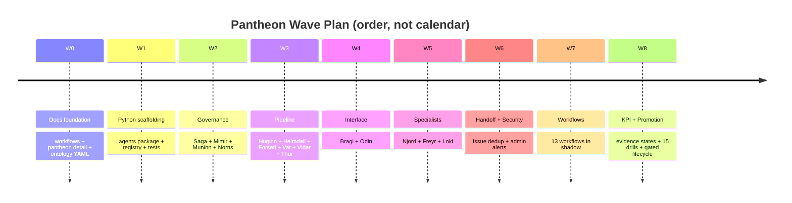

# 에이전트 판테온 지원 부록

이 지원 인덱스는 상세 가드레일과 구현 계획 부록을 정식 소유 문서에서 분리해 관리합니다.
아래 절 참조는 [에이전트 판테온](agent-pantheon-ko.md) 또는
[에이전트 판테온 구현 계획](agent-pantheon-implementation-ko.md)을 가리킵니다.

> **상태 경계:** 이 인덱스는 현재 소유 문서 원장을 요약합니다. 각 기능의 근거와 남은 작업은
> 링크된 소유 문서가 계속 정본입니다.

## 구현 상태

### 구현 범위

| 영역 | 상태 | 근거 | 참고 |
|------|------|------|------|
| 보안 에스컬레이션 및 범위가 제한된 관리자 전달 | implemented | [`test_wave6_handoff_security.py`](../../../services/core-control-plane/tests/agents/test_wave6_handoff_security.py) | 집중 테스트는 RBAC 거부 보안 이벤트, 결정론적 심각도, 중복 제거, 이동 시간 창 비율 제한 및 대기 가능한 전달 어댑터를 다룹니다. 실제 채널 전달을 증명하지는 않습니다. |
| 고정 판테온 및 W0-W8 런타임 메커니즘 | implemented | [에이전트 판테온 구현 상태](agent-pantheon-implementation-ko.md#구현-상태) | 프레임워크, 거버넌스, 파이프라인, shadow 작업 흐름, KPI 및 성능 저하 메커니즘에 집중 테스트 근거가 있습니다. 운영 검증은 별도입니다. |
| 에이전트 간 작업 흐름 카탈로그 및 롤아웃 | in-progress | [에이전트 작업 흐름 구현 상태](agent-workflows-ko.md#구현-상태), [shadow 롤아웃 구현 상태](agent-workflow-rollout-ko.md#구현-상태) | 13개 작업 흐름 레지스트리와 shadow 추적은 구현됐습니다. 카탈로그 투영, 보존된 런타임 추적, 측정된 게이트 및 독립적인 승격은 아직 완료되지 않았습니다. |
| 제한된 작업 워커 | in-progress | [제한된 작업 워커 구현 상태](bounded-task-workers-ko.md#구현-상태) | 워커 코어와 영속 저장소는 구현됐습니다. 운영 구성, 저장소 기반 변환 결과, 콘솔 표시 및 통제된 런타임 근거는 아직 완료되지 않았습니다. |
| 대화형 숙의 | in-progress | [판테온 대화형 숙의 구현 상태](conversational-deliberation-ko.md#구현-상태) | T1 숙의와 보호된 T2 접점은 구현됐습니다. 구체적인 업스트림 T2 종합기, 운영자 경로 또는 통제된 런타임 증적 근거는 없습니다. |
| 실제 KPI 검증 및 enforce 승격 | not-started | [에이전트 판테온 구현 상태](agent-pantheon-ko.md#구현-상태) | 이 문서 집합에는 보존된 실제 shadow 코호트 또는 권위 있는 판테온 승격 증적 근거가 없습니다. |

### 구현 이력

| 날짜 | 상태 | 변경 | 근거 | 남은 작업 |
|------|------|------|------|-----------|
| 2026-08-14 | in-progress | 이전 제공 이력을 재구성하거나 소유 문서 원장을 대체하지 않고 근거 범위가 명확한 상태 인덱스를 추가했습니다. | `current change`; 링크된 소유 원장 및 집중 보안 테스트 | 운영 검증 또는 enforce 사용을 보고하기 전에 아래의 관측 가능한 소유 원장 작업을 완료합니다. |

### 남은 작업

- [ ] 작업 흐름 카탈로그 투영을 완료하고 작업 흐름 소유 문서에서 요구하는 작업 흐름별
  shadow 추적 및 측정된 승격 게이트 결과를 보존합니다.
- [ ] 제한된 작업 워커와 대화형 숙의를 선언된 운영 경계에 바인딩한 다음 성공 및 실패
  경로에 대한 통제된 런타임 증적을 보존합니다.
- [ ] 판테온 enforce 운영을 보고하기 전에 독립적인 승격 검토를 완료하고 권위 있는 승격
  증적을 보존합니다.

## 보안 및 권한 초과 감시

FDAI는 권한 없는 작업 시도를 일급 보안 신호로 취급합니다. 판테온은 이미 모든 것을 보는
관찰자인 Heimdall이 이를 감지하도록 확장하며 새 에이전트를 추가하지 않습니다.

### 감지

운영자가 Bragi를 통하거나 포크에 등록된 개시자가 ActionType에 필요한 RBAC 역할이 없는
`initiator_principal`로 작업을 제안하면 다음 순서로 처리합니다.

1. Forseti가 `reason: rbac_insufficient`와 함께 `deny` 판정을 발행합니다.
2. Forseti가 `type: privilege_escalation_attempt`, 개시자 ID, 시도한 ActionType, 대상 리소스,
   심각도 점수 및 상관관계 ID를 포함한 `SecurityEvent`를 동시에 게시합니다.
3. Saga가 두 이벤트를 모두 기록합니다.

### 상관관계와 심각도

Heimdall은 `object.security-event`를 구독하고 다음과 같이 분류합니다.

| 심각도 | 트리거 | 대응 |
|--------|--------|------|
| low | 영향이 낮은 작업에 대한 단일 시도 | 감사만 수행 |
| medium | 같은 사용자가 5분 안에 3회 이상 시도하거나 영향이 중간인 작업을 한 번 시도 | 관리자 그룹에 일일 요약 전송 |
| high | 중요하거나 되돌릴 수 없는 작업을 한 번 시도하거나 5분 안에 5회 이상 시도 | 관리자 그룹에 즉시 ChatOps 카드 전송 |
| critical | 여러 작업에 걸친 패턴, 비정상 시간대 또는 의도적인 권한 상승 패턴 | 즉시 알림과 별도 보안 당직 채널 사용 |

심각도는 표와 카운터로 결정하며 모델로 점수를 산정하지 않습니다.

### 알림 전달

Heimdall은 `object.security-event`를 분류하고 medium 이상 경보에 범위가 제한된 관리자 알림
어댑터를 호출합니다. 이 정보 전달은 `governance.*` ActionType이 아니며 Thor의 변경 경로에
진입하지 않습니다. Saga는 이미 권위 있는 `SecurityEvent`를 감사합니다. 어댑터는 별도
템플릿, 지문 중복 제거 및 비율 제한을 적용해 구성된 ChatOps 관리자 채널에 게시합니다.

### 알림 중복 제거와 비율 한도

한 시간 안에 발생한 같은 사용자와 같은 작업의 경보는 카운터를 늘린 카드 하나로 합칩니다.
사용자별 한도는 시간당 카드 5개이며 초과 경보는 알림 폭주를 막기 위해 요약으로 합칩니다.
지문 방식은 에이전트 판테온 §6.4의 인계 중복 제거 패턴을 재사용합니다.

### 정당한 에스컬레이션

거부된 사용자는 응답에서 권한 업그레이드 요청 링크를 확인합니다. 권한 업그레이드는 관리자가
Var를 통해 승인하는 일반 HIL 흐름입니다. 업그레이드 경로는 판테온 설계 범위 밖이며 단계
로드맵에서 관리합니다.

## 포크 커스터마이제이션

포크는 구성된 경계를 통해 판테온을 커스터마이즈합니다. 에이전트를 상속하거나 추가하거나 이름을
바꾸지 않습니다.

| 포크가 할 수 있는 작업 | 방법 |
|-------------------------|------|
| 에이전트에 모델 바인딩 | `agents.<name>.llm_bindings` 구성 |
| chaos와 같은 도메인 에이전트 비활성화 | `agents.<name>.enabled: false` |
| 규칙 또는 정책 추가 | `rule-catalog/catalog/**` 오버레이 |
| ActionType 추가 또는 재정의 | 에이전트 판테온 §7.8 경계 안에서 `rule-catalog/action-types-custom/**`와 `-overrides/**` 사용 |
| ChatOps 채널 대상 변경 | 전달 어댑터 구성 |
| 대화 보존 또는 명시적 선택 기본값 변경 | Bragi 구성 |
| 비율 제한 기본값 변경 | `agents.<name>.rate_limits` 구성 |

포크는 다음 작업을 할 수 없습니다.

- 판테온에 새 에이전트 이름을 추가합니다.
- 에이전트 역할 이름을 바꾸거나 역할을 재배정합니다.
- ActionType의 `executor`, `judge`, `approver`, `auditor` 또는 `initiators`를 변경합니다.
- 다른 에이전트가 소유한 토픽에 게시합니다.

새 에이전트가 필요한 누락 기능은 모든 사용자가 따르는 같은 규칙 아래 판테온을 확장하는 업스트림
끌어오기 요청을 열어야 한다는 신호입니다.

## Anti-patterns

- **직접 agent-to-agent RPC.** 모든 hot-path 통신은 스키마를 검사하는 버스의 pub/sub를
  사용합니다. 에이전트 사이의 HTTP 호출은 감사와 재생을 무력화합니다.
- **대화 포트가 타입이 지정된 파이프라인을 우회.** Bragi가 실행기를 직접 호출하면 에이전트
  판테온 §7.7을 위반합니다.
- **조직도에서 판정자가 실행기 아래에 배치.** Forseti는 Thor가 아니라 Odin에 보고하므로 판정이
  실행과 독립적으로 유지됩니다.
- **감지 hot-path에서 모델 호출.** Huginn, Heimdall 및 도메인 전문가는 모델을 동기 호출하면
  안 됩니다. 패턴은 T0 결정론적 규칙 또는 T1 경량 유사도로 컴파일해야 합니다.
- **중복 제거 없는 경보.** 이슈, 보안 카드 및 HIL 티켓을 포함한 모든 알림 경로는 지문 방식을
  사용해야 합니다.
- **포크에서 에이전트 추가.** 판테온은 업스트림에서 고정됩니다. 에이전트 추가는 포크 변경이 아니라
  업스트림 변경입니다.
- **롤백 계약 없는 작업.** 모든 ActionType은 유효한 `rollback_contract`와 함께 제공하며 되돌릴
  수 없는 작업에는 HIL 정족수도 필요합니다.

## 웨이브 전반의 LLM 호출 표면

판테온은 deterministic-first입니다. hot-path는 거의 모든 이벤트를 T0 규칙 또는 표 조회나 T1
유사도로 라우팅합니다. 모델 사용은 선언된 기능이며 기본값이 아닙니다. hot-path에서 모델을
호출하는 지점은 정확히 세 곳이며 네 번째 지점을 추가하는 웨이브는 결함입니다.

| 위치 | 에이전트 | 웨이브 | 모델의 역할 |
|------|----------|--------|-------------|
| Translator | Bragi | W4 | 자연어 턴을 의도 또는 ActionType으로 매핑하며 판단하거나 실행하지 않음 |
| T2 abstain | Forseti | W3 stub 이후 | T0과 T1이 abstain한 뒤 새로운 사례를 추론하며 출력은 신뢰 대상이 아니라 판정 대상임 |
| Off-path 배치 | Norns | W2의 T1 이후 W7의 T2 | 감사 패턴에서 `RuleCandidate`를 제안하며 품질 게이트가 승격하기 전까지 출력은 비활성 상태임 |

나머지 모든 에이전트는 hot-path에서 모델을 사용하지 않습니다.

### 조립 루트 바인딩

모델 경계는 에이전트 내부가 아니라 조립 루트에서 한 번만 해석합니다. 컨테이너는 T1 임베딩 모델과
T2 교차 검증 모델을 제공하는 `LlmBindings`를 가지며 `llm.mode`로 선택합니다.

- `local-fake`는 업스트림 기본값이며 Azure 자격 증명이 필요 없는 결정론적 메모리 내 가짜를
  사용하므로 판테온 전체를 오프라인에서 실행하고 검사할 수 있습니다.
- `azure`는 `Container.llm_bindings`가 `None`인 상태에서 시작합니다. 진입점이
  `bind_azure_llm_bindings`를 호출해 기능별 Azure OpenAI 어댑터를 연결합니다. 포크는
  `agents.<name>.llm_bindings`로 구체적인 모델을 선택하며 판테온 코드는 동일하게 유지됩니다.

### T2 품질 게이트

T2 판정을 실행으로 곧바로 라우팅하지 않습니다. 모델은 생성하고 결정론적 검증이 다음 세 검사로
실행 자격을 부여합니다.

1. **혼합 모델 교차 검증.** 서로 다른 모델 두 개 이상이 같은 사례를 판정합니다. 일치하면 진행하고
   불일치하면 HIL로 에스컬레이션하며 자동으로 해결하지 않습니다.
2. **검증기.** policy-as-code와 what-if 또는 예행 실행으로 제안된 작업을 실행 전에 다시
   검증합니다.
3. **근거 제시.** 판정은 이를 정당화하는 규칙 또는 정책을 인용합니다. 근거가 없는 출력은 HIL로
   abstain합니다.

Wave 3 Forseti는 결정론적 T0 규칙 일치와 위험 표를 제공하고 T2에는 stub abstain을 반환합니다.
혼합 모델 교차 검증과 근거 제시가 `LlmBindings` 뒤에 구현될 때까지 새로운 사례는 모델 판정이
아니라 HIL로 라우팅됩니다.

### 대화 포트 숙의

모든 에이전트는 변경할 수 없는 `AgentSpec`과 소유 사실에서 답합니다. 명시적 토론 경로는 T1에서
참여자를 선택한 다음 기본 입장 하나와 범위가 제한된 동료 비평을 실행합니다. 선택적
`T2ConversationSynthesizer`가 소유자가 표시된 주장을 렌더할 수 있습니다. T2 실패는 T1을
보존하고 모든 결과는 표시 전용이며 타입이 지정된 판정, 승인, 실행, 롤백, 감사 및 승격 소유자는
변경되지 않습니다.

### 측정

측정 대상 T1, T2 및 서술기 호출은 공급자가 측정한 `usage`를 `MeteringSink`로 기록합니다.
서술기는 `operator_chat`을 사용하고 나머지 호출은 `control_plane`을 사용합니다. Operator API
`LlmCostPanel`은 `GET /kpi/llm-cost`를 호환 경로로 유지하고 범위, 모델, 호출, 대화, 일 및 월별
토큰 전용 집계를 노출합니다. 단일 프로세스 개발 실행 장치는 하나의 메모리 내 싱크를 공유하고
운영은 영속 Postgres `llm_invocation` 저장소를 통해 headless 코어와 Operator API에서 같은
측정 스트림을 사용합니다.

## 타임라인 형태, commitment 아님

웨이브는 W0부터 W8까지 순차로 진행합니다. W7은 작업 흐름별 끌어오기 요청 13개로 가장 넓은
웨이브이며 KPI 수집기는 작업 흐름과 병렬로 구현할 수 있으므로 W8과 겹칠 수 있습니다.

## 범위 밖

- **2세대 에이전트.** 판테온은 15개로 고정됩니다. 새 에이전트는 먼저 판테온 설계를 개정하는 향후
  업스트림 끌어오기 요청이 필요합니다.
- **다중 클라우드 어댑터.** AWS와 GCP는 구현 초점에 따라 추후 결정합니다.
- **UI 재설계.** 콘솔은 읽기 전용으로 유지하며 판테온은 콘솔 형태를 바꾸지 않습니다.
- **모델 미세 조정.** [LLM 전략](../architecture/llm-strategy-ko.md)이 미세 조정을 관할하며 판테온은
  포크가 구성한 바인딩을 사용합니다.
