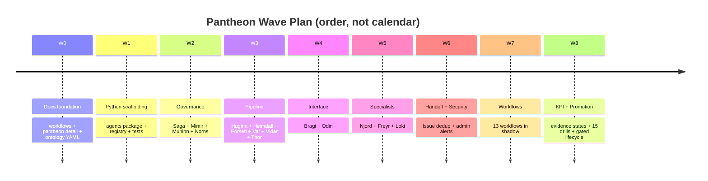

# Agent Pantheon Supporting Appendices

This supporting index keeps detailed guardrails and implementation-planning appendices out of the
canonical owner documents. Section references below point to
[Agent Pantheon](agent-pantheon.md) or the
[Agent Pantheon implementation plan](agent-pantheon-implementation.md).

> **Status boundary:** this index summarizes the current owner-document ledgers. The linked owner
> document remains authoritative for each capability's evidence and remaining work.

## Implementation status

### Implementation scope

| Area | State | Evidence | Notes |
|------|-------|----------|-------|
| Security escalation and bounded admin delivery | implemented | [`test_wave6_handoff_security.py`](../../../services/core-control-plane/tests/agents/test_wave6_handoff_security.py) | Focused tests cover RBAC-denial security events, deterministic severity, deduplication, rolling rate limits, and awaited delivery adapters. They do not prove live channel delivery. |
| Fixed pantheon and W0-W8 runtime mechanics | implemented | [Agent Pantheon implementation status](agent-pantheon-implementation.md#implementation-status) | Framework, governance, pipeline, shadow workflow, KPI, and degradation mechanics have focused test evidence. Operational validation remains separate. |
| Cross-agent workflow catalog and rollout | in-progress | [Agent Workflows implementation status](agent-workflows.md#implementation-status), [shadow rollout implementation status](agent-workflow-rollout.md#implementation-status) | The 13-workflow registry and shadow traces are implemented. Catalog projection, retained runtime traces, measured gates, and independent promotions remain incomplete. |
| Bounded task workers | in-progress | [Bounded Task Workers implementation status](bounded-task-workers.md#implementation-status) | The worker core and durable store are implemented. Production composition, store-backed projections, console presentation, and governed runtime evidence remain incomplete. |
| Conversational deliberation | in-progress | [Pantheon Conversational Deliberation implementation status](conversational-deliberation.md#implementation-status) | T1 deliberation and the guarded T2 seam are implemented. No concrete upstream T2 synthesizer, operator route, or governed runtime receipt is evidenced. |
| Live KPI validation and enforce promotion | not-started | [Agent Pantheon implementation status](agent-pantheon.md#implementation-status) | No retained live-shadow cohort or authoritative pantheon promotion receipt is evidenced by this document set. |

### Implementation history

| Date | State | Change | Evidence | Remaining |
|------|-------|--------|----------|-----------|
| 2026-08-14 | in-progress | Added an evidence-bounded status index without reconstructing earlier delivery history or replacing the owner-document ledgers. | `current change`; linked owner ledgers and focused security tests | Complete the observable owner-ledger work below before reporting operational validation or enforce use. |

### Remaining work

- [ ] Complete the workflow catalog projection and retain per-workflow shadow traces and measured
  promotion-gate results required by the workflow owner documents.
- [ ] Bind bounded task workers and conversational deliberation through their declared production
  boundaries, then retain governed runtime receipts for success and failure paths.
- [ ] Complete independent promotion review and retain the authoritative promotion receipt before
  reporting pantheon enforce operation.

## Security and privilege-escalation monitoring

FDAI treats unauthorized action attempts as first-class security signals. The pantheon extends
Heimdall, already the all-seeing observer, to detect them; it does not add a new agent.

### Detection

When an operator through Bragi or a fork-registered initiator proposes an action whose
`initiator_principal` lacks the RBAC role required by the ActionType:

1. Forseti issues verdict `deny` with `reason: rbac_insufficient`.
2. Forseti simultaneously publishes a `SecurityEvent` with
   `type: privilege_escalation_attempt`, the initiator ID, attempted ActionType, target resource,
   severity score, and correlation ID.
3. Saga records both events.

### Correlation and severity

Heimdall subscribes to `object.security-event` and classifies:

| Severity | Trigger | Response |
|----------|---------|----------|
| low | Single attempt on a low-impact action | Audit only |
| medium | Three or more attempts by the same user within five minutes, or one medium-impact attempt | Daily digest to the admin group |
| high | One critical or irreversible attempt, or five or more attempts in five minutes | Immediate ChatOps card to the admin group |
| critical | Multi-action pattern, unusual hours, or deliberate escalation pattern | Immediate notification plus a separate on-call security channel |

Severity is deterministic through the table and counters, not model-scored.

### Notification delivery

Heimdall classifies `object.security-event` and invokes the bounded admin notification adapter for
medium-or-higher alerts. This informational delivery is not a `governance.*` ActionType and does not
enter Thor's mutation path. Saga already audits the authoritative `SecurityEvent`; the adapter posts
to the configured ChatOps admin channel with a distinct template, fingerprint deduplication, and
rate limits.

### Alert deduplication and rate limits

Same-user, same-action alerts within a one-hour window collapse into one card with an incremented
counter. The per-user limit is five cards per hour; excess alerts collapse into a digest to prevent
alert storms. The fingerprint scheme reuses the handoff deduplication pattern in Agent Pantheon
section 6.4.

### Legitimate escalation

A denied user sees a response with a request-permission-upgrade link. Permission upgrades are a
normal HIL flow that an administrator approves through Var. The upgrade path is outside the
pantheon design scope and remains on the phase roadmap.

## Fork customization

Forks customize the pantheon through configured seams. They do not subclass agents, add agents, or
rename agents.

| What forks may do | How |
|-------------------|-----|
| Bind models to agents | `agents.<name>.llm_bindings` configuration |
| Disable a domain agent, such as chaos | `agents.<name>.enabled: false` |
| Add rules or policies | `rule-catalog/catalog/**` overlay |
| Add or override ActionTypes | `rule-catalog/action-types-custom/**` and `-overrides/**` within Agent Pantheon section 7.8 |
| Change ChatOps channel targets | Delivery-adapter configuration |
| Change conversation retention or opt-in defaults | Bragi configuration |
| Change rate-limit defaults | `agents.<name>.rate_limits` configuration |

Forks may not:

- Add a new agent name to the pantheon.
- Rename or reassign an agent's role.
- Repoint an ActionType's `executor`, `judge`, `approver`, `auditor`, or `initiators`.
- Publish to a topic owned by another agent.

A missing capability that requires a new agent is a signal to open an upstream pull request that
extends the pantheon under the same rules everyone else follows.

## Anti-patterns

- **Direct agent-to-agent RPC.** All hot-path communication is pub/sub on the schema-checked bus.
  HTTP calls between agents defeat audit and replay.
- **Conversational port bypasses the typed pipeline.** Bragi calling an executor directly is a
  defect under Agent Pantheon section 7.7.
- **Judge under executor in the organization chart.** Forseti reports to Odin, not Thor, so verdicts
  stay independent of execution.
- **Model invocation in a sensing hot-path.** Huginn, Heimdall, and the domain specialists must not
  invoke a model synchronously. Their patterns compile to deterministic rules at T0 or lightweight
  similarity at T1.
- **Alerts without deduplication.** Every notification path, including issues, security cards, and
  HIL tickets, must use the fingerprint scheme.
- **Fork adds an agent.** The pantheon is fixed upstream. Adding an agent is an upstream change, not
  a fork change.
- **Action without a rollback contract.** Every ActionType ships with a live `rollback_contract`;
  irreversible actions additionally require HIL quorum.

## LLM invocation surface across waves

The pantheon is deterministic-first: the hot-path routes almost every event through T0 rule or
table lookup, or T1 similarity. Model use is a declared capability, never a default. The hot-path
invokes one in exactly three places; any wave that adds a fourth is a defect:

| Site | Agent | Wave | Role of the model |
|------|-------|------|-------------------|
| Translator | Bragi | W4 | Maps a natural-language turn to an intent or ActionType; never judges or executes |
| T2 abstain | Forseti | W3 stub, then later | Reasons over a novel case only after T0 and T1 abstain; output is judged, never trusted |
| Off-path batch | Norns | W2 at T1, then W7 at T2 | Proposes `RuleCandidate` records from audit patterns; output is inert until the quality gate promotes it |

Every other agent stays model-free in the hot-path.

### Composition-root binding

The model seam is resolved once at the composition root, never inside an agent. The container
carries `LlmBindings` for the T1 embedding model and T2 cross-check models, selected by `llm.mode`:

- `local-fake` is the upstream default and uses deterministic in-memory fakes without Azure
  credentials, so the whole pantheon runs and tests offline.
- `azure` starts `Container.llm_bindings` as `None`; the entry point calls
  `bind_azure_llm_bindings` to wire per-capability Azure OpenAI adapters. A fork selects concrete
  models through `agents.<name>.llm_bindings`; the pantheon code remains identical.

### T2 quality gate

A T2 verdict is never routed straight to execution. The model generates; deterministic
verification grants execution eligibility through three checks:

1. **Mixed-model cross-check.** Two or more distinct models judge the same case. Agreement proceeds;
   disagreement escalates to HIL and is never auto-resolved.
2. **Verifier.** Policy-as-code and what-if or dry-run validation recheck the proposed action before
   execution.
3. **Grounding.** The judgment cites the rules or policies that justify it. Unsupported output
   abstains to HIL.

Wave 3 Forseti ships deterministic T0 rule matching and the risk table, and returns a stub abstain
for T2. Until mixed-model cross-check and grounding land behind `LlmBindings`, novel cases route to
HIL rather than to a model verdict.

### Conversational-port deliberation

Every agent answers from its immutable `AgentSpec` and owned facts. The explicit discussion path
selects participants at T1, then runs one primary position plus bounded peer critiques. An optional
`T2ConversationSynthesizer` can render owner-attributed claims. T2 failure preserves T1, every
result is presentation-only, and typed verdict, approval, execution, rollback, audit, and promotion
owners remain unchanged.

### Metering

Every metered T1, T2, and narrator call records provider-measured `usage` through `MeteringSink`.
The narrator uses `operator_chat`; other calls use `control_plane`. The Operator API `LlmCostPanel`
keeps `GET /kpi/llm-cost` as a compatibility path and exposes token-only rollups by scope, model,
call, conversation, day, and month. The single-process development harness shares one in-memory
sink; production uses the durable Postgres `llm_invocation` store across the headless core and
Operator API.

## Timeline shape, not commitments

Waves are strictly sequential from W0 through W8. W7 is the widest wave with 13 workflow pull
requests and can overlap with W8 because KPI collectors can land in parallel with workflows.

## Not in scope

- **Second-generation agents.** The pantheon is fixed at 15. A new agent requires a future upstream
  pull request that revises the pantheon design first.
- **Multi-cloud adapters.** AWS and GCP remain to be determined under the implementation focus.
- **UI redesign.** The console stays read-only; the pantheon does not change the console shape.
- **Model fine-tuning.** [LLM strategy](../architecture/llm-strategy.md) governs fine-tuning; the
  pantheon uses the bindings configured by the fork.
