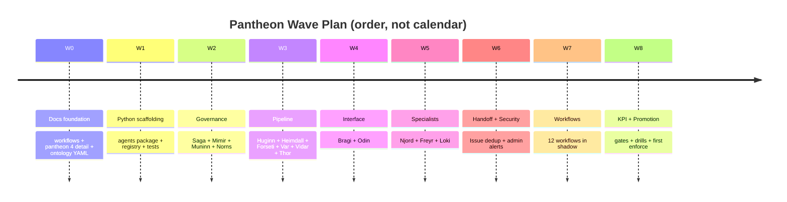

# Agent Pantheon Implementation Plan

Wave-plan for landing the 15-agent pantheon defined in
[agent-pantheon.md](agent-pantheon.md). Each wave has a scoped deliverable
set, exit gate, and dependency on earlier waves; a wave never merges until
its gate passes. This document is the coordinating record - individual PRs
are still measured against their own exit gates and the safety invariants
in [coding-conventions.instructions.md](../../../.github/instructions/coding-conventions.instructions.md#safety).

> **Scope:** the plan is customer-agnostic. Every module path and topic
> below is generic; a fork configures bindings via the seams in
> [project-structure.md](../architecture/project-structure.md) but never edits the pantheon
> itself
> ([generic-scope.instructions.md](../../../.github/instructions/generic-scope.instructions.md)).
>
> **Implementation focus:** Azure only. Kafka wire is Event Hubs `:9093`;
> ChatOps is Teams Adaptive Card; ChatOps admin channel and delivery
> adapters follow the layout in
> [app-shape.instructions.md](../../../.github/instructions/app-shape.instructions.md).

> **Implementation status (2026-07-20):** W0-W8 are implemented. The sections
> below preserve the rollout order and acceptance intent. Current shared agent
> machinery lives under `src/fdai/agents/_framework/`; current wave coverage
> lives in `tests/agents/test_wave2_governance.py` through
> `test_wave8_kpi_degradation.py`.

## 1. Why this doc exists

The pantheon doc ([agent-pantheon.md](agent-pantheon.md)) defines the
15-agent contract. Landing it in the codebase and rule catalog touches:

- **Documentation**: three roadmap docs must gain detail sections
  (per-agent tasks, workflows, degradation).
- **Ontology**: a new `Agent` object type plus 5 supporting object types
  (`Conversation`, `Turn`, `UserPreference`, `SecurityEvent`, `Issue`)
  join the existing catalog under `rule-catalog/vocabulary/object-types/`.
- **ActionType catalog**: four new action types
  (`escalate_to_github_issue`, `notify_admin_privilege_violation`,
  `arbitrate_domain_conflict`, plus each agent's `question_domains`
  handler pseudo-action) join `rule-catalog/action-types/`.
- **Python core**: `src/fdai/agents/` with 15 flat specialist modules and
  shared base, registry, topic, bus, runtime, and two-port machinery under
  `_framework/`.
- **Tests**: registry integrity, single-writer topic enforcement, ActionType
  role binding, ontology graph query for the pantheon subgraph.
- **Waves W0-W8**: incremental per-agent behavior + cross-agent workflows,
  with shadow-mode gating throughout.

The waves below sequence this work so that each wave delivers a working
subset gated by measurable exit criteria.

## 2. Guiding invariants (do not violate in any wave)

- **Docs-first, docs-after.** Every wave lands a doc update in the same PR
  as the code / catalog change. Docs never drift.
- **Shadow before enforce.** Every new agent behavior ships judge-only.
  Promotion to enforce is per-behavior and separately reviewed.
- **Single-writer topics.** Only the owner agent publishes to
  `object.<type>`. The schema registry enforces this at merge time.
- **Judge is not executor.** Forseti issues verdicts; Thor dispatches. No
  wave collapses those roles.
- **Hard-dependency respected.** Saga and Vidar are hard dependencies for
  mutation; degrading either forces mutations to shadow.
- **LLM only in Bragi (translator), Forseti (T2 abstain), Norns
  (off-path batch).** Every other agent stays LLM-free in the hot-path.
- **Fork boundary.** Pantheon set / role binding is upstream-locked; forks
  configure but do not extend the pantheon.

## 3. Wave overview

Nine waves. Each wave has one exit gate and a bounded scope. The gate is
measurable; a wave does not close on prose.

| Wave | Deliverable set | Exit gate |
|------|-----------------|-----------|
| **W0** | Docs foundation: workflows doc, pantheon §4 detail, ontology YAML additions | translation-pair CI + schema lint green; new object types resolve via `/ontology/graph` (dev) |
| **W1** | Python scaffolding: `agents/` package, base class, 15 stubs, topic registry, two-port skeleton | `pytest tests/agents/` passes with registry + topic-owner enforcement tests |
| **W2** | Governance staff: Saga (audit + issue), Mimir (rule steward), Muninn (memory / RAG), Norns (learner) fully wired in shadow | end-to-end audit trail: a synthetic event walks through, Saga writes an `AuditEntry`, replay reconstructs it, Norns picks up a pattern |
| **W3** | Sensing + judgment + risk: Huginn, Heimdall, Forseti, Var, Vidar, Thor connected via typed port; verdict-to-execute-to-audit loop live in shadow | 100 synthetic events flow ingress -> verdict -> HIL or auto -> execute (shadow) -> audit with zero policy violations |
| **W4** | Bragi + Odin: conversational port with routing, per-user context, arbitration | one operator NL query walks routing -> primary + contributors -> aggregated response; Odin arbitrates a synthetic domain_conflict |
| **W5** | Domain specialists: Njord, Freyr, Loki with advisory bindings to Forseti | cost / capacity / chaos advice attaches to a synthetic verdict; Loki experiment runs in shadow with blast-radius respected |
| **W6** | Handoff + security escalation: Issue dedup, fingerprint index, admin-channel notification | (a) synthetic unhandled request produces exactly one GitHub issue + comment on repeat; (b) RBAC-insufficient proposal produces exactly one admin card + dedup on repeat |
| **W7** | Cross-agent workflows: the 12 workflows from [agent-workflows.md](agent-workflows.md) in shadow, one at a time | each workflow: shadow trace end-to-end + KPI baseline captured; no workflow promoted to enforce yet |
| **W8** | Promotion gates + measurement: per-agent KPI collectors, promotion_gate wiring, degradation drills | (a) each agent reports its declared KPI; (b) each degradation policy verified by injected failure; (c) any single workflow may be promoted enforce-mode on separate PR after its gate passes |

## 4. Wave 0 - Docs foundation

**Scope**

- **`docs/roadmap/agents/agent-workflows.md` (+ ko)** - the 12 cross-agent
  workflows with sequence diagrams and exit criteria. See §5 of this doc
  for the workflow inventory.
- **`docs/roadmap/agents/agent-pantheon.md` §4 detail** - each of the 15 agents
  gains four subsections: Recurring / Event / Meta / Cross-agent tasks,
  plus a KPI table and a Degradation policy paragraph. The compact table
  in the current §4 becomes an index; details live inline.
- **Ontology additions in `rule-catalog/vocabulary/object-types/`**:
  - `agent.yaml` (the pantheon object type, with `question_domains`,
    `owns_code_paths`, `llm_bindings`, `rate_limits`)
  - `conversation.yaml`, `turn.yaml`, `user-preference.yaml`
  - `security-event.yaml`, `issue.yaml`
  - `rule-candidate.yaml`, `handoff-escalation.yaml`
- **Four new `rule-catalog/action-types/` entries** (deferred to W2
  when Saga / Mimir / Var executors are implemented, to keep the
  strict `test_action_type_catalog.py` invariants intact - the
  existing test suite requires every catalog entry ships with its
  executor, promotion_gate, and PR-native or documented category):
  - `governance.escalate-to-github-issue.yaml`
  - `governance.notify-admin-privilege-violation.yaml`
  - `governance.arbitrate-domain-conflict.yaml`
  - `governance.propose-rule-candidate.yaml`

**Exit gate**

- All three CI translation gates green (`scripts/quality/localization/check-translations.sh`).
- Ontology YAML lint passes (existing `scripts/catalog/validate-catalog-full.py`
  covers this today).
- `docs/roadmap/README.md` (and `-ko.md`) references the new workflows
  doc; renumbering already done in the pantheon-doc PR.

**Dependencies**

- Requires the pantheon doc merged (already landed in the previous PR).

**Anti-scope for W0**

- No Python code.
- No behavior changes to existing agents (there are none yet).

## 5. Wave 1 - Python scaffolding

**Scope**

- Package `src/fdai/agents/` with:
  - `_framework/base.py` - abstract `Agent` class: fields (`name`, `layer`,
    `owns`, `executes`, `subscribes`, `publishes`, `question_domains`,
    `owns_code_paths`, `llm_bindings`, `rate_limits`), methods
    (`on_typed_message`, `on_conversation_turn`, `health`), and enforced
    single-writer publish helper.
  - `_framework/registry.py` - loads the pantheon specifications and builds the
    registry, exposes `get(name)`, `all()`, `owner_of(topic)`,
    `owner_of(object_type)`.
  - `_framework/topics.py` - typed topic contract: naming (`object.<type>`),
    partition key strategy (per-resource for mutations, per-correlation
    for judgment/audit), idempotency, back-pressure defaults.
  - `_framework/bus.py` and `_framework/bus_bridge.py` - the in-memory contract
    and EventBus bridge that enforce `producer_principal == owner_agent`.
  - Flat specialist modules (`odin.py`, `thor.py`, ...) - one implementation
    per fixed pantheon agent.
- `src/fdai/agents/__init__.py` exports the registry entry point.

**Tests (`tests/agents/`)**

- `test_framework_layout.py`, `test_registry.py`, and `test_topics.py` cover
  package shape, the fixed 15-agent registry, single-writer ownership, and
  partition-key behavior.
- `test_ontology_alignment.py` and `test_action_intent_parity.py` cover ontology
  and ActionType alignment with the pantheon specifications.

**Exit gate**

- `pytest tests/agents/` green.
- `scripts/quality/architecture/check-core-imports.sh` still green (no new cross-layer
  imports outside `agents/`).
- `mypy` (or the repo's current type-check bar) clean on the new
  package.

**Dependencies**

- W0 complete (Agent object type YAML must exist for registry to load).

**Anti-scope**

- No handler bodies beyond `pass`.
- No new HTTP or Kafka clients (reuse existing adapter contract).
- No conversational port yet (that lands in W4).

## 6. Wave 2 - Governance staff

Governance agents come first because everyone else depends on them:
Saga must record before anyone can execute; Mimir must resolve rule
references before Forseti can judge; Muninn must serve context before
Forseti reasons; Norns closes the discovery loop.

**Scope**

- **Saga (`src/fdai/agents/saga.py`)** - implement `append_audit`
  handler subscribed to every terminal-state topic. Persist to the
  existing audit store (see
  [security-and-identity.md](../architecture/security-and-identity.md)). Implement
  `escalate_to_github_issue` executor: fingerprint compute, dedup index
  read via Muninn, create issue or append comment via the GitHub App
  adapter (defer real network to fork; use an in-memory adapter in
  tests). Implement replay by consuming past audit-entries in
  chronological order without republishing.
- **Mimir (`src/fdai/agents/mimir.py`)** - subscribe to
  `object.rule-candidate`. Implement `promote_rule` and `revoke_rule`
  as sync operations on the existing rule catalog store. Add a
  freshness monitor (recurring): read audit-log firing counts per rule,
  emit `RuleStalenessSignal` on inactivity threshold.
- **Muninn (`src/fdai/agents/muninn.py`)** - state / context store
  reader for other agents. Backed by the existing state store provider
  ([project-structure.md](../architecture/project-structure.md#customization-via-dependency-injection)).
  Implement bitemporal snapshot rotation and cache eviction. Own the
  Issue fingerprint index used by Saga.
- **Norns (`src/fdai/agents/norns.py`)** - two entry points: batch
  (hourly cron via existing scheduler) and stream (subscribe to
  `object.audit-entry`). Implement pattern extraction as T1 clustering
  first; leave T2 LLM summary hook for W7. Publish `RuleCandidate` and
  `close_issue` actions. Before publication, require `3/3` agreement from
  the internal Urd (past evidence), Verdandi (current contract), and Skuld
  (future safety) perspectives. They are not agents or principals; Norns
  emits one aggregate consensus result and retains disagreements as bounded
  hold records.

**Tests**

- `test_wave2_governance.py` covers Saga audit/issue behavior, Mimir rule
  governance, Muninn state, and Norns candidate flow.
- `test_candidate_guard.py` and `test_norns_coverage.py` cover inert candidate
  safety and bounded learning behavior.
- `test_norns_consensus.py` covers unanimous publication and disagreement
  hold behavior at the Norns single-writer boundary.

**Exit gate**

- End-to-end synthetic trace: a synthetic event -> Saga records ->
  Norns picks up -> RuleCandidate proposed -> Mimir promotes ->
  audit-log shows the full chain.

**Dependencies**

- W1 complete.

**Anti-scope**

- No real GitHub App calls (in-memory adapter only; real integration
  behind a fork-configured seam).
- No LLM in Norns (T1 clustering only for this wave).

## 7. Wave 3 - Sensing, judgment, and execution loop

**Scope**

- **Huginn (`src/fdai/agents/huginn.py`)** - own the real-time resource
  discovery ingress. Subscription-scoped Azure write/delete events arrive on
  the raw Event Hub through managed-identity Event Grid delivery, a runtime
  normalizer republishes canonical Events, and Huginn deduplicates, invokes the
  injected durable inventory projector, then publishes `object.event`. The
  six-hour Inventory sync job remains the full ARG/ARM reconciliation path.
- **Heimdall (`src/fdai/agents/heimdall.py`)** - discovery freshness/coverage
  assurance plus anomaly detector
  (statistical threshold, adaptive baseline via T0/T1), drift detector
  (declared vs actual state via Muninn snapshot compare), forecast
  (statistical time-series; ARIMA or exponential smoothing). Publish
  `Anomaly`, `Drift`, `Forecast`. Reserve `SecurityEvent` subscription
  for W6.
- **Forseti (`src/fdai/agents/forseti.py`)** - subscribe to
  `object.anomaly`, `object.drift`, `object.event`. Implement the
  three-tier trust router locally: T0 rule match via Mimir; T1
  similarity via Muninn; T2 stays a stub returning `abstain` until
  W7. Verdict includes `risk_verdict` computed from the deterministic
  `risk-classification.yaml` table plus ActionType ceiling. Emit
  `Verdict` with `auto | hil | deny`. Emit `arbitrate` signal when
  `domain_conflict: true` (Odin lands in W4).
- **Thor (`src/fdai/agents/thor.py`)** - subscribe to `object.verdict` and
  `object.rollback`.
  Dispatch: `auto` -> shadow execute against the existing executor
  provider; `hil` -> publish `object.hil-request` (Var lands here too);
  `deny` -> publish drop record for Saga. Enforce per-resource mutex on
  `resource_id` partition. Trigger rollback on failure.
- **Var (`src/fdai/agents/var.py`)** - subscribe to
  `object.hil-request`. Present via existing ChatOps adapter (stub in
  W3, real adapter in W5). Timeout / expire tracking. Publish
  `object.hil-response`.
- **Vidar (`src/fdai/agents/vidar.py`)** - subscribe to Thor failure
  signal. Invoke the injected rollback executor selected by the ActionType
  `rollback_contract`, and publish the provider receipt on `object.rollback`.
  Thor keeps the failed ActionRun and resource lock until that receipt arrives;
  missing executors, provider errors, and empty receipts close as
  `rollback_failed`, never as a fabricated success.

Enforce-mode runtime assembly requires an explicit Thor executor, durable
ActionRun store, StateStore-backed Saga audit chain, and rollback executor
registry. Missing any binding blocks startup. Shadow mode retains the in-memory
defaults and never invokes the privileged executor.

**Tests**

- `test_wave3_pipeline.py` covers the shadow verdict, dispatch, approval, and
  rollback path.
- `test_runtime_chain.py` and `test_thor_durable.py` cover end-to-end routing,
  durable ActionRuns, resource locks, and restart recovery.

**Exit gate**

- End-to-end shadow loop: 100 synthetic events, per-resource mutex
  observed, zero policy escapes, Saga audit trail complete.

**Dependencies**

- W2 complete.

**Anti-scope**

- No real ChatOps card (Var uses in-memory approvals in tests).
- No LLM in Forseti (T2 stays stub abstain).
- No cross-vertical arbitration (Odin lands in W4).

## 8. Wave 4 - Bragi + Odin

**Scope**

- **Bragi (`src/fdai/agents/bragi.py`)** - conversational port entry
  point. Existing operator-console adapter
  ([operator-console.md](../interfaces/operator-console.md)) reused. Implement:
  - Intent classification: T0 keyword match against
    `Agent.question_domains`; T1 embedding similarity via Muninn's
    context index; T2 LLM classifier as fallback (bindings from
    fork config).
  - Winner selection scoring (§6.3 of pantheon doc).
  - Multi-agent aggregation: send typed queries to primary +
    contributors, aggregate their responses, render NL response.
  - Conversation state: session, turn, per-user partitioning,
    retention.
- **Odin (`src/fdai/agents/odin.py`)** - subscribe to
  `object.arbitration-request` emitted by Forseti. Read the
  fork-configured priority policy (default: SLO > cost > architecture)
  from the rule catalog. Publish `object.arbitration-response`.
  Recurring: portfolio-outcome monitor that adjusts policy weights
  when actual outcomes deviate from the declared priority (still
  deterministic - policy update proposals go through Mimir as
  `RuleCandidate`).

**Tests**

- `test_wave4_interface.py` and `test_conversational_port.py` cover routing,
  session isolation, contributor aggregation, and the read-only question path.
- `test_arbitration.py` covers deterministic conflict resolution and the
  Forseti/Odin round trip.

**Exit gate**

- Operator asks "who changed the example resource's public network" against a
  synthetic Heimdall change-index; Bragi returns aggregated response
  from Heimdall + Saga + Muninn with `primary`, `contributors`,
  `trace_ref` in the payload.

**Dependencies**

- W3 complete.

**Anti-scope**

- No production-grade LLM cost tracking (that lives in the LLM
  strategy doc and lands separately).
- No proactive briefing yet (recurring conversation seeding lands
  W7 with workflow "Judgment coherence audit").

## 9. Wave 5 - Domain specialists

**Scope**

- **Njord (`src/fdai/agents/njord.py`)** - subscribe to cost-signal
  ingestion (Azure Cost Management adapter; in-memory in tests).
  Emit `CostAnomaly` when spend deviates from forecast by threshold.
  Provide advisory hook on Forseti verdict for cost-impact
  attribution.
- **Freyr (`src/fdai/agents/freyr.py`)** - subscribe to utilization
  metrics. Emit `CapacityForecast`, `SizingRecommendation`. Advisory
  hook on Forseti verdict.
- **Loki (`src/fdai/agents/loki.py`)** - chaos scheduler. Every
  experiment is proposed as an `ActionRun` with `blast_radius`
  bounded and `default_mode: shadow`. Loki NEVER auto-executes an
  experiment: the ActionType routes through Forseti + Var per §7.6
  of pantheon.

**Tests**

- `test_wave5_specialists.py` covers Njord cost advice, Freyr forecasting, and
  Loki blast-radius enforcement.

**Exit gate**

- Every domain specialist attaches an advisory annotation to at
  least one workflow verdict in shadow; Loki completes a
  shadow-mode chaos experiment with `blast_radius` respected.

**Dependencies**

- W4 complete (arbitration needed for cost-vs-SRE conflicts).

**Anti-scope**

- No real Azure Cost Management pull (adapter behind fork seam).
- No adversarial scenario generation (that is W7 workflow).

## 10. Wave 6 - Handoff + security escalation

**Scope**

- Full `escalate_to_github_issue` path: real GitHub App adapter
  behind fork seam; Saga fingerprint dedup; comment append on
  repeat; auto-close after Mimir promotes a matching rule and 24
  hours regression-clean.
- Full `notify_admin_privilege_violation` path: Heimdall subscribes
  to `object.security-event`; severity classification per §9.2 of
  pantheon; alert dedup and rate-limit per §9.4; admin ChatOps
  channel adapter.

**Tests**

- `test_wave6_handoff_security.py` covers issue deduplication, repeat comments,
  closure, severity, and admin notification behavior.
- `test_rate_limiter.py` covers bounded notification and escalation rates.

**Exit gate**

- (a) Handoff: one issue, one comment on repeat, one auto-close
  after promotion. (b) Security: one card for `high`, dedup
  observed, rate-limit observed.

**Dependencies**

- W2 (Saga), W3 (Heimdall + Forseti), W5 (Loki not required but
  W6 needs the full pipeline standing).

**Anti-scope**

- No permission-upgrade HIL flow (mentioned in pantheon §9.5;
  separate PR).

## 11. Wave 7 - Cross-agent workflows in shadow

Each of the 12 workflows in [agent-workflows.md](agent-workflows.md)
lands as its own PR with its own shadow-mode gate. Rough sequence:

1. Cost-aware remediation (Njord + Forseti + Thor)
2. Predictive scale (Freyr + Heimdall + Njord)
3. DR drill orchestration (Loki + Vidar + Heimdall + Norns)
4. Override -> Discovery (Var + Saga + Norns + Mimir)
5. Security escalation (formalized after W6 into a workflow object)
6. Handoff -> Capability (Saga + Norns + Mimir)
7. Agent health degradation (Heimdall + Odin + Bragi)
8. Judgment coherence audit (Forseti + Norns + Mimir)
9. Rollback rehearsal (Loki + Vidar + Heimdall + Saga)
10. Retrospective what-if (Saga + Forseti + Norns + Mimir); 11. Operational readiness handoff (Forseti); 12. Scheduled governed Python task (Forseti + Thor)

**Per-workflow exit gate**

- End-to-end trace in shadow with all participating agents.
- KPI baseline captured (see W8 for KPI collectors).
- Zero policy-violation escapes in shadow.

**Dependencies**

- W6 complete.

**Anti-scope**

- No workflow promoted to enforce in this wave. Promotion happens
  after W8 per-workflow, gated on KPI thresholds.

## 12. Wave 8 - Promotion gates, KPIs, degradation drills

**Scope**

- **KPI collectors** - each agent emits its declared KPIs (see
  pantheon doc §4 detail from W0) to the existing measurement
  pipeline ([goals-and-metrics.md](../architecture/goals-and-metrics.md)).
- **Promotion gates** - each ActionType's `promotion_gate` block
  gains machine-readable exit criteria matching the pantheon KPI
  table. Standard shape:

  ```yaml
  promotion_gate:
    shadow_days_min: 14
    kpi_thresholds:
      - metric: agent.forseti.verdict_accuracy
        min: 0.95
      - metric: agent.forseti.t2_escalation_rate
        max: 0.10
    regression_scenarios: [scenario-set-forseti-baseline]
  ```

- **Degradation drills** - inject synthetic failure per agent,
  verify the declared degradation policy activates:
  - Saga down -> new mutations refused
  - Vidar down -> new mutations demoted to shadow
  - Forseti down -> queue grows, alert fires
  - Var down -> timeout expansion + admin alert
  - Others per pantheon §11 (anti-patterns already codified in
    doc; test file activates them)

**Tests**

- `test_wave8_kpi_degradation.py` covers KPI emission, promotion checks, and
  injected degradation behavior for the fixed pantheon.

**Exit gate**

- All 15 agents emit their KPIs into the measurement pipeline.
- All degradation drills pass.
- At least one workflow from W7 promoted to enforce after passing
  its promotion_gate (separate PR).

**Dependencies**

- W7 complete.

**Anti-scope**

- No multi-cloud (Azure only; see
  [Implementation Focus](../../../.github/copilot-instructions.md#implementation-focus-must)).

## 13. Cross-wave concerns

### 13.1 Docs are always updated in the same PR

Every wave lands its doc delta alongside code. Reviewers block a
merge that leaves docs stale. Specifically:

- W0 lands the workflows doc and the pantheon §4 detail.
- W1 - W6 update pantheon §5 (agent catalog) rows as agents come
  online (`llm_bindings`, `rate_limits` defaults reflected).
- W7 updates workflows doc entries with actual shadow trace refs.
- W8 updates pantheon §4 KPI blocks with real baseline numbers.

### 13.2 Bilingual pair discipline

Every doc change touches `foo.md` + `foo-ko.md` in the same PR and
updates the `translation_source_sha` in the ko file
([language.instructions.md](../../../.github/instructions/language.instructions.md#user-facing-doc-translations-ko)).

### 13.3 Fork boundary at every wave

Waves NEVER pull customer configuration into upstream code. Where
a wave needs a real integration (GitHub App, ChatOps, Azure Cost
Management), the code goes behind an existing provider protocol and
an in-memory adapter ships in the same PR for tests
([project-structure.md](../architecture/project-structure.md#customization-via-dependency-injection)).

### 13.4 Rollback for a wave

Each wave PR is self-revertable: reverting the PR restores the
previous behavior with no data-migration required (feature flags for
new pipeline stages default off; existing tests must keep passing
with flags off).

### 13.5 Composition-root wiring (live process)

Waves W1 - W8 land agent behavior and exercise it through tests, but
the agents only communicate once the process wires them to a real
event bus. That seam is `src/fdai/agents/_framework/runtime.py`
(`PantheonRuntime`), assembled by `src/fdai/runtime/bootstrap.py`; the headless
`src/fdai/__main__.py` delegates to that bootstrap:

- `PantheonRuntime.build(provider, raw_event_topic)` instantiates all
  15 agents, binds every publishing agent to one
  `EventBusBridge` over the injected `EventBus` provider, and
  registers each agent's declared `AgentSpec.subscribes` topics as
  bridge subscriptions. Publishing to `object.<type>` therefore fans
  out to every subscriber immediately, each under its own Kafka
  consumer group (`fdai-pantheon.<agent>`).
- Raw ingress events (the same `kafka.topic_events` the P1 control
  loop consumes) are routed into Huginn, the Event Collector, which
  normalizes and republishes them as `object.event`. The pantheon
  uses a distinct consumer group, so it runs as a parallel shadow of
  the P1 pipeline rather than stealing its records.
- `PantheonRuntime.run()` is the perpetual consumer: against a real
  broker it blocks forever (one task per subscription); `__main__`
  runs it as a **blast-radius-isolated** background task beside the P1
  consumer. Consumers are gathered with `return_exceptions=True` and a
  crashed consumer is counted, logged, and swallowed so its siblings
  keep running; a total pantheon failure logs `pantheon_runtime_failed`
  but never cancels the P1 wait set (the shadow overlay is never a
  dependency of the primary pipeline). Shutdown cancels it in turn.

The runtime is **enabled and shadow by default**. `FDAI_START_PANTHEON=0`
(also `false`, `no`, or `off`) disables it. It requires
`FDAI_START_CONSUMER`; without the consumer bus, bootstrap logs
`pantheon_requested_without_consumer` and skips wiring.

Shadow is **enforced, not assumed**: `PantheonRuntime.build` forces
Thor into shadow mode (`enforce=False`, the default) so the pantheon
Thor judges-and-logs only and never double-executes alongside the P1
loop. Promotion to enforce is an explicit, separately reviewed opt-in
(`FDAI_PANTHEON_ENFORCE` / `build(enforce=True)`) - never the default.
Agents use the in-memory audit / issue / admin adapters from
`src/fdai/agents/_framework/adapters.py`; a fork injects a durable, StateStore-backed
`Saga` via `build(saga=...)` and swaps the other adapters for durable
backends (see §13.3).

Configurable + observable seams:

- `build(consumer_group_prefix=...)` isolates consumer groups per
  environment (default `fdai-pantheon`).
- **Partial pantheon.** `build(disabled_agents=...)` /
  `FDAI_PANTHEON_DISABLED_AGENTS` lets a fork run a subset
  (agent-pantheon.md 10): disabled agents are neither bound nor
  subscribed. Unknown names and the hard-dependency agents (Saga /
  Vidar) are rejected - disabling audit or rollback would break the
  mutation safety invariants; disabling Huginn idles ingress (warned).
- **Cross-vertical arbitration (live loop).** When an event carries
  conflicting `domain_advice` (`{domain: recommendation}`), Forseti -
  the sole writer of `object.arbitration-request` - raises the conflict;
  Odin resolves it by the deterministic priority order
  (`resilience > security > change_safety > cost > capacity`, fork-
  overridable) and publishes `object.arbitration-decision`, which
  Forseti records. Forseti also aggregates advice arriving on *separate*
  domain signals - a Njord `object.cost-anomaly` (`scale_down`) and a
  Freyr `object.capacity-forecast` (`scale_up`) on the same resource - so
  a real cross-domain conflict triggers arbitration without any inline
  hint. The runtime already subscribes both sides, so the loop is closed
  end to end.
- **Conversational port (live, LLM-free layer).** The two-port model's
  human half is wired: the runtime registers every active agent's
  `on_conversation_turn` as a Bragi responder, and `PantheonRuntime.ask(
  session_id, user_id, question)` routes an operator NL query to the
  right primary agent (deterministic keyword / similarity scoring on
  `question_domains`), tracks a per-user session, and enforces Bragi's
  no-cross-user invariant. Disabling Bragi turns the port off
  (`health()["conversational_port"]` is `False`, `ask` returns `None`).
  An explicit canonical agent name takes precedence over domain scoring.
  Bragi calls up to three matched contributors concurrently with bounded
  timeouts, isolates contributor failures, and returns both combined prose and
  structured contributor evidence. The web adapter namespaces client session
  ids by the authenticated principal and disables action proposal plus Saga
  handoff side effects on the read-only question route.
  Per the two-port contract, a conversational request that wants an
  action must re-enter the typed pipeline - the port never bypasses it.
  The narrator LLM (T2 intent + richer per-agent answers) layers on top
  of this seam later.
- **Self-healing consumers.** A crashed consumer restarts with
  exponential backoff (`max_consumer_restarts`, `restart_backoff_base`,
  `restart_backoff_max`) and gives up (counted + logged) only after the
  cap - never dragging siblings down. Restarts resume from the committed
  offset. `stop()` is bounded by `shutdown_timeout` so a wedged consumer
  cannot hang shutdown.
- `EventBusBridge` exposes `BridgeMetrics` (delivered / handler_errors /
  handler_retries / dead_lettered / dead_letter_errors / consumers_crashed /
  consumers_restarted / empty_partition_keys / published / publish_errors /
  missing_correlation_id / missing_idempotency_key /
  producer_principal_mismatch / ordered_poison_halts / schema_violations)
  via `snapshot()`, surfaced by `PantheonRuntime.health()` for Heimdall's
  probe and the KPI collectors. `health()` also carries a per-agent
  `agent_health` map (active ActionRuns, dedup pressure, forced-shadow
  flag) so individual agent state is visible, not just bridge-level
  counters.
- **Pub/sub hardening (bus contract).** The bridge and the `InMemoryBus`
  test double share one contract so a test cannot silently diverge from
  production:
  - **Single source of truth for partition keys.** Both buses use
    `topics.partition_key_for` (mutation -> `resource_id`, judgment/audit
    -> `correlation_id`); the bridge no longer keeps a private copy.
  - **Envelope stamping + enforcement.** Every publish stamps
    `producer_principal` and `schema_version` (`ENVELOPE_SCHEMA_VERSION`,
    caller override wins) and counts a missing `correlation_id` (any
    topic) or `idempotency_key` (mutation topics) - the wire contract's
    required fields (6.1) - without blocking.
  - **Fail-closed on empty mutation key.** A mutation-topic publish whose
    partition key resolves to empty is refused
    (`fail_closed_on_empty_mutation_key`, default on) so an unserialized
    mutation - one that would round-robin across partitions and drop the
    per-resource mutex - is never emitted.
  - **Consumer-side single-writer check.** Before delivery the bridge
    verifies `producer_principal == owner_of_topic`; an impostor record is
    dead-lettered, never handed to a subscriber (`verify_producer_principal`,
    default on). Closes the "publish-side only" gap.
  - **Bounded handler retry + timeout.** `_deliver` retries a transient
    handler failure `handler_max_retries` times (default 0) with backoff
    and bounds each attempt by `handler_timeout` (default none) so a stuck
    handler cannot wedge its consumer; the final failure routes to the DLQ.
  - **Ordered-topic poison halt.** With `halt_ordered_topic_on_poison` a
    dead-lettered mutation record halts that consumer so a later mutation
    on the same resource cannot jump ahead of it (ordering preservation);
    siblings keep running. Default off (DLQ-and-continue).
  - **Operator DLQ redrive.** `EventBusBridge.redrive(topic, handler)`
    reprocesses `<topic>.dlq` after a fix, unwrapping each record and
    re-parking any that still fails - a deliberate admin action, never
    part of the perpetual loop.
  - **Publish-side validator seam.** `payload_validator` optionally rejects
    a malformed record at the publish boundary (fail closed), wiring the
    `ContractValidator` seam without coupling the bus to it.
  - **Subscribe guards.** Both buses warn on an `object.*` subscription to
    an unregistered topic (a silent dead seam) and skip a duplicate
    `(topic, agent, handler)` registration (double delivery).
  - **Test-double parity.** `InMemoryBus` now injects the same envelope,
    computes the same partition key, isolates a raising subscriber (captured
    in `dead_letters`, mirroring the DLQ), and bounds a stuck handler by
    `handler_timeout`.
- **Enforce requires durable audit.** `build(enforce=True)` without an
  injected `Saga` logs `pantheon_enforce_without_durable_saga`: an
  append-only audit is a hard invariant for any autonomous action, so
  enforcing on the in-memory (restart-lossy) audit chain is flagged
  loudly.
- **Durable ActionRun (fork seam).** `build(thor_state_store=...)`
  persists in-flight ActionRuns through the `ActionRunStore` Protocol
  (`StateStoreActionRunStore` backs it on the `StateStore`);
  `PantheonRuntime.run()` rehydrates them on startup so an enforce-mode
  restart cannot lose track of an in-progress mutation or drop a
  per-resource lock. Terminal runs are deleted, so only in-flight work
  is restored. Upstream default is in-memory (shadow); a fork injects
  the durable store alongside the durable `Saga`.
- **Shadow observation.** A dedicated observer consumer group tallies
  the pantheon's would-be decisions (verdict risk split + ActionRun
  terminal states) into `shadow_decisions`, surfaced by `health()` -
  the measurable baseline "shadow before enforce" needs. It uses a
  distinct group so it never steals records from the real subscribers.
- **Divergence measurement.** A `ShadowDivergenceLedger` joins the
  pantheon's shadow verdict and the authoritative P1 decision by
  `correlation_id` and reports the agreement rate plus a directional
  `authoritative->pantheon` divergence breakdown - the actual promotion
  gate for taking a shadow capability to enforce. The ledger is
  core-agnostic (plain decision strings, never imports `core`): the
  pantheon observer feeds the shadow side, the P1 consumer
  (`_authoritative_decision`) feeds the authoritative side, joined at
  the composition root without touching `ControlLoop`. Matching is
  incremental and LRU-bounded.
- **Heartbeat.** `run(heartbeat_interval=...)` /
  `FDAI_PANTHEON_HEARTBEAT_SECONDS` starts a companion task that logs
  `pantheon_heartbeat` (the `health()` snapshot) on a fixed cadence -
  the minimal form of Heimdall's per-minute agent-health probe.
- DLQ writes are isolated (`_safe_dead_letter`): a broker hiccup on the
  DLQ path is counted, not fatal to the consumer.
- Huginn's dedup memory is bounded (LRU, `dedup_capacity`) so a
  long-lived process cannot leak; a raw ingress event with no stable key
  is dropped with a warning (`pantheon_ingress_unkeyed_event`) rather
  than flooding the DLQ, since the P1 loop still processes the record.

The agent `bus` seam is typed against the `PantheonBus` Protocol
(`src/fdai/agents/_framework/bus.py`), which both the in-memory `InMemoryBus`
(tests) and the Kafka-backed `EventBusBridge` (production) satisfy;
`Agent.bind_bus` on the base class lets the composition root bind every
agent uniformly.

**Prerequisite for the real broker:** the `object.<type>` topics the
agents publish and subscribe on must exist on Event Hubs whenever the pantheon
runtime is not explicitly disabled; provisioning those hubs is an infra
concern (`infra/modules/event-bus/`), out of scope for the flag itself.

### 13.6 LLM invocation surface (across waves)

The pantheon is deterministic-first: the hot-path routes almost every event
through T0 (rule / table lookup) or T1 (similarity). An LLM is a declared
capability, never a default, and the hot-path invokes one in exactly three
places (agent-pantheon.md §8) - any wave that adds a fourth is a defect:

| Site | Agent | Wave | Role of the model |
|------|-------|------|-------------------|
| Translator | Bragi | W4 | maps a natural-language turn to an intent / ActionType; never judges or executes (§7.7) |
| T2 abstain | Forseti | W3 stub -> later | reasons over a novel case only after T0 and T1 abstain; output is judged, never trusted |
| Off-path batch | Norns | W2 (T1) -> W7 (T2) | proposes `RuleCandidate`s from audit patterns; runs off the hot-path, output is inert until the quality gate promotes it |

Every other agent - Huginn, Heimdall, Vidar, Var, Thor, Odin, Saga, Mimir,
Muninn, and the domain specialists - stays LLM-free in the hot-path.

**Composition-root binding (`LlmBindings`).** The model seam is resolved once
at the composition root (`src/fdai/composition/`), never inside an agent. The
container carries an `LlmBindings` that provides the T1 embedding model and the
T2 cross-check models, selected by `llm.mode`:

- `local-fake` (upstream default) - deterministic in-memory fakes, no Azure
  credentials, so the whole pantheon runs and tests offline.
- `azure` - `Container.llm_bindings` starts `None`; the entry point calls
  `bind_azure_llm_bindings` to wire the per-capability Azure OpenAI adapters
  (embedding + T2 cross-check + optional tool-call). A fork picks the concrete
  models through `agents.<name>.llm_bindings` config (agent-pantheon.md §10);
  the pantheon code is identical either way.

**T2 quality gate (Forseti).** A T2 verdict is never routed straight to
execution. The model *generates*; deterministic verification *grants* execution
eligibility. The gate is three checks (architecture.instructions.md):

1. **Mixed-model cross-check** - two or more distinct models judge the same
   case; agreement proceeds, disagreement escalates to HIL (never auto-resolve).
2. **Verifier** - the proposed action is re-validated against policy-as-code and
   what-if / dry-run before it can execute.
3. **Grounding (RAG)** - the judgment must cite the rules / policies that
   justify it; an unsupported answer abstains to HIL.

Wave 3 Forseti ships the deterministic tiers (T0 rule-match + risk table) and
returns a **stub abstain** for T2; the mixed-model cross-check and grounding
land in a later wave behind the `LlmBindings` seam. Until then a novel case
routes to HIL rather than to a model verdict - fail toward safety.

**Conversational-port narrator.** The two-port model's human half ships with a
**deterministic, LLM-free renderer** upstream: every agent answers an
introspection turn from its immutable `AgentSpec` and owned data (the shared
`facts` in `src/fdai/agents/_framework/introspection.py`). A fork - or the later
narrator wave - swaps an LLM-backed narrator over the *same* `facts` (RAG over
owned data plus `owns_code_paths`) without changing the contract; the narrator
renders in the operator's locale (L3) while the intent, verdict, and audit
underneath stay L0 English (language.instructions.md).

**Metering (measured, never estimated).** Every metered T1, T2, and narrator call
records the provider's measured `usage` through a `MeteringSink`. The narrator
uses `operator_chat`; other calls use `control_plane`. The read-API
`LlmCostPanel` retains `GET /kpi/llm-cost` as a compatibility path and exposes
token-only rollups by scope, model, call, conversation, day, and month. The
single-process dev harness shares one in-memory sink; production uses the
durable Postgres `llm_invocation` store across the headless core and read API.

## 14. Timeline shape (not commitments)

Waves are strictly sequential (W0 -> W8). W7 is the widest wave (12
sub-PRs, one per workflow) and will overlap with W8 (KPI collectors
can land in parallel with workflows).



## 15. Not in scope

- **Second-generation agents.** The pantheon is fixed at 15. Adding
  a new agent (e.g. a "Security Officer" separate from Heimdall) is
  a future upstream PR that revises the pantheon doc first.
- **Multi-cloud adapters.** AWS and GCP stay TBD
  ([Implementation Focus](../../../.github/copilot-instructions.md#implementation-focus-must)).
- **UI redesign.** The console stays read-only; the pantheon does
  not change the console shape
  ([app-shape.instructions.md](../../../.github/instructions/app-shape.instructions.md)).
- **Model fine-tuning.** LLM strategy and fine-tuning are governed
  by [llm-strategy.md](../architecture/llm-strategy.md); the pantheon uses whatever
  bindings the fork configures.

## Next steps

| To learn about | Read |
|----------------|------|
| The pantheon design (roles, ontology, contract) | [agent-pantheon.md](agent-pantheon.md) |
| The 12 workflows landed in W7 | [agent-workflows.md](agent-workflows.md) (W0) |
| ActionType schema referenced by W0 | [action-ontology.md](../decisioning/action-ontology.md) |
| KPI measurement pipeline referenced by W8 | [goals-and-metrics.md](../architecture/goals-and-metrics.md) |
| Fork seams referenced by W2, W5, W6 | [project-structure.md](../architecture/project-structure.md#customization-via-dependency-injection), [downstream-fork-guide.md](../fork-and-sequencing/downstream-fork-guide.md) |
| Existing standard-set wave plan (for style reference) | [implementation-plan.md](../fork-and-sequencing/implementation-plan.md) |
