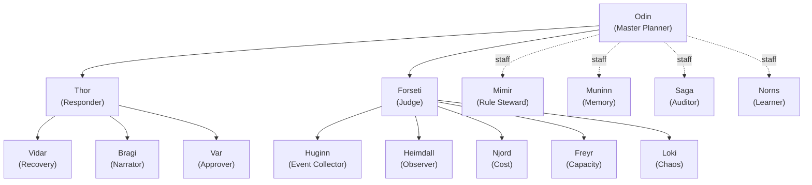
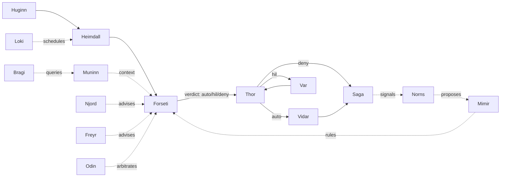

# 에이전트 판테온

FDAI 의 조직 수준 에이전트. 15개 명명된 에이전트가 온톨로지의 first-class
citizen 으로 런타임 파이프라인을 소유한다: 각 에이전트는 mandate 를 가지고,
object types 와 action types 를 소유하며, schema-checked event bus 로
publish/subscribe 하고, 별도의 conversational port 로 자연어 질문에도 답한다.
판테온은 컨트롤 플레인의 조직도이며 upstream 에서 한 번 정의된다 - 포크는
설정만 하고 에이전트를 추가하거나 이름을 바꾸지 않는다.

> **범위:** 판테온은 고객-무관이다. 아래에 언급된 모든 에이전트 이름, object
> type, action 은 generic 이다. 고객별 바인딩은 fork 에서 관리
> ([generic-scope.instructions.md](../../../.github/instructions/generic-scope.instructions.md)).
>
> **구현 초점:** Azure 가 유일한 구현 타깃이다; 판테온은
> [app-shape.instructions.md](../../../.github/instructions/app-shape.instructions.md)
> 에 이미 선언된 Kafka wire (Event Hubs `:9093`) 를 사용한다
> ([Implementation Focus](../../../.github/copilot-instructions.md#implementation-focus-must)).

이 문서의 소비자:

- 이벤트 기반 코어는 §4 와 §6 의 agent / topic ownership 테이블을 읽고
  schema-validated pub/sub 를 wire 한다.
- 오퍼레이터 콘솔 ([operator-console.md](../interfaces/operator-console-ko.md)) 은 §6.3 과
  §6.5 를 읽고 자연어 질문을 per-user context 로 primary agent 에 라우팅한다.
- 룰-카탈로그와 executor ([action-ontology.md](../decisioning/action-ontology-ko.md),
  [execution-model.md](../decisioning/execution-model-ko.md)) 는 §7 을 읽고 각 ActionType 을
  initiator / judge / approver / executor / auditor 에 바인딩한다.
- 포크는 §10 을 읽고 어느 seam 이 열려 있고 (topic subscription, config
  override) 어느 것이 잠겨 있는지 (에이전트 추가 금지, rename 금지) 확인한다.

## 1. 설계 원칙

판테온은 기존 FDAI 컨트롤 루프를 명명된 조직 역할로 얇게 재구성한 것이다.
[architecture.instructions.md](../../../.github/instructions/architecture.instructions.md)
의 안전 봉투는 바꾸지 않고, 역할을 legible + auditable 하게 만든다.

- **Deterministic-first, LLM-capable.** 모든 에이전트는 자기 bindings 로
  LLM 을 호출할 수 있지만, 런타임 hot-path 는 거의 모두 T0 (룰 / 테이블
  lookup) 또는 T1 (similarity) 로 라우팅된다. LLM 호출은 좁고 선언된
  용도로만 예약된다 (§8). LLM 사용은 capability 이지 default 가 아니다.
- **Two-port 모델.** 모든 에이전트는 machine 트래픽용 typed pub/sub port 와
  사람 / 다른 에이전트용 conversational port 를 노출한다 (§6).
- **Single-writer, multi-reader topics.** 각 object type 은 정확히 하나의
  owner agent 만 publish 하고, 누구나 subscribe 할 수 있다 (§6.1).
- **판사는 executor 가 아니다.** Forseti 는 verdict 를 발행하고, Thor 는
  verdict 를 dispatch 하며, Var 는 사람 승인을 담당한다. 어떤 에이전트도
  판단과 실행을 함께 하지 않는다.
- **판테온은 upstream 에서 고정.** 15개 에이전트 세트, 조직도, 역할 배정은
  잠겨 있다. 포크는 config seam (§10) 을 통해 동작을 커스터마이즈한다 -
  에이전트를 추가 / 제거 / rename 하지 않는다.
- **저장소 구조가 두 계층을 반영.** 15개 명명 에이전트는
  [`src/fdai/agents/`](../../../src/fdai/agents) 최상위에 flat 하게 위치하고,
  지원 프레임워크 (bus, runtime, registry, base, pantheon spec,
  arbitration, introspection, kpi, adapters, provider adapters, factory,
  workflows, topics, candidate guard, divergence, bus bridge) 는
  [`src/fdai/agents/_framework/`](../../../src/fdai/agents/_framework)
  하위에 있다. 앞의 언더스코어는 "외부 소비용 아님" 을 뜻하며 -
  `agents/` 밖의 호출자는 `fdai.agents` (파사드) 에서 import 해야 하며
  `_framework` 서브모듈에서 직접 import 하지 **않는다**. 레이아웃은
  [`tests/agents/test_framework_layout.py`](../../../tests/agents/test_framework_layout.py)
  로 강제된다 (트래커 #14, 이슈 #21).

## 2. 조직도

Odin 에 두 라인이 보고한다: Thor (operations) 와 Forseti (judgment). 4개의
governance staff 가 staff 라인 (점선) 으로 Odin 에 보고하며, operations 라인과
독립적이다. Domain specialist 와 sensing 에이전트는 Forseti 아래에 위치해
데이터가 실행이 아니라 판단으로 흐르도록 한다.



## 3. 런타임 관계도

조직도는 보고 라인이다. 관계도는 데이터 흐름이다. Sensing 과 specialist 는
Forseti 를 feed 하고, Forseti 의 verdict 는 Thor 를 feed 하며, Thor 는
Vidar (recovery), Var (사람 승인) 로 dispatch 하거나 직접 실행한다. Saga 는
모든 terminal 상태를 감사하고, Norns 는 Saga 로부터 학습하고, Norns 는
Mimir 에 제안하며, Odin 은 Forseti 가 최종 결정을 내리기 전 vertical 간 충돌을
조정한다.



### 3.1 다목적 중재 (multi-objective arbitration)

같은 리소스에 대해 도메인 전문가들이 상충하는 조언을 낼 때(Njord는 비용을 위해
`scale_down`, Freyr는 용량을 위해 `scale_up`), `object.arbitration-request`의
유일한 작성자인 Forseti가 각 도메인의 측정된 **영향 크기**(impact magnitude,
`[0, 1]`)를 실어 Odin에게 충돌을 전달한다. 각 전문가가 자신의 원(raw) 메트릭에
대한 정규화를 소유하고, 발행하는 payload에 명시적 `impact` 필드를 붙인다. 그래야
Forseti가 도메인별 메트릭을 알 필요가 없고, 크기가 도메인들 사이에서 비교
가능해진다:

- **Njord (비용)** - `object.cost-anomaly`에 `impact = clamp(ratio - 1.0, 0, 1)`.
  2배 초과지출은 `1.0`으로 포화되고, 1.1배는 약한 `0.1`. 근거를 위해 원 `ratio`도
  함께 실린다.
- **Freyr (용량)** - `object.capacity-forecast`에
  `impact = clamp(forecast_util, 0, 1)`. 평활화된 forecast는 이미 정규화되어
  있으며, 전문가가 이를 붙여 중재기는 원 메트릭이 아니라 하나의 필드를 읽는다.

Odin은 무딘 우선순위 테이블 대신
`src/fdai/agents/_framework/arbitration.py`의 결정론적 **다목적** 중재기
`MultiObjectiveArbiter`로 해소한다:

- 각 도메인은 설정된 **가중치**를 가진다(기본은 우선순위 순서
  `resilience > security > change_safety > cost > capacity`에서 도출;
  fork config가 재정의). 점수는 `weight * impact`. 가중치는 정적 dict일 수도 있고,
  fork가 공급하는 `weight_fn(priority) -> dict`일 수도 있다(예:
  `weights_from_priority_curved(curve="convex")`로 최상위 우선순위를 강조하거나,
  `curve="concave"`로 분포를 완만하게). 커브 헬퍼는 최상위 가중치를 `1.0`, 최하위를
  `0.4`에 고정하므로 커브를 바꿔도 HIL 밴드와 마진 산술이 그대로 보정된다.
- 승자는 최고 점수다. 영향 크기가 같으면 기존 우선순위 승자를 정확히 재현하므로,
  중재기는 옛 테이블의 엄격한 상위집합이다 - 어떤 동작도 퇴행하지 않는다.
- 영향이 큰 낮은-우선순위 도메인이 영향이 작은 높은-우선순위 도메인을 이길 수
  있고, 그것이 핵심이다: 중재기는 순위가 아니라 *크기*를 저울질한다(온콜 1달러를
  아끼려고 컴퓨트 10달러를 쓰지 않는다).
- 상위 2개의 **마진**이 설정된 HIL 밴드(기본 `0.10`) 이내이거나, 도메인에 알려진
  가중치가 없으면, 자동 해소하기엔 너무 접전이라 결정에 `escalate_hil` 플래그가
  붙는다 - 접전은 사람에게 넘기고 절대 조용히 자동 선택하지 않는다(안전 쪽으로
  실패).
- 모든 결정은 도메인별 `objective_scores`와 `margin`을
  `object.arbitration-decision`에 기록하므로 결과는 근거가 있고 감사 가능하다.

중재기는 LLM 호출도 I/O도 없다; 설정과 입력이 주어지면 순수하고 결정론적이다.

**시간적 공정성(temporal fairness, 옵트인)** - fork는 append-only 감사 로그를
백엔드로 하는 `DecisionHistory` seam과 `TemporalPolicy`를 Odin에 배선해서
반복 충돌에서 나타나는 두 가지 실패 모드를 막을 수 있다:

- `AlternatingFairnessPolicy` - 어떤 도메인이 같은 충돌에서 `streak_threshold`
  번 연속 이겼다면, 계속 지고 있던 쪽에 유계된 가중치 부스트를 주어 다음 라운드에
  이길 기회를 준다. 반대편이 한 번이라도 이기면 streak가 리셋된다.
- `HysteresisPolicy` - 최근 `window` 라운드 동안 두 도메인 사이에서 승자가
  뒤집혀 왔다면(플래핑), 가장 최근 승자에게 보너스를 주어 진동을 감쇠시킨다.
  안정적인 일방적 연승은 플래핑이 아니므로 보너스가 붙지 않는다.

두 정책 모두 `(base_weights, domains, history)`의 순수 함수라서 중재기는 여전히
결정론적이고 재현 가능하다(같은 감사 로그 + 같은 요청 => 같은 결정). HIL 안전망도
약화되지 않는다: 접전 마진, 알려지지 않은 도메인, 비유한(non-finite) 영향은
부스트 이후에도 여전히 상향된다. 업스트림 기본값은 빈 윈도우를 반환하는
`NoopDecisionHistory`로 바인딩되어 있어 오늘의 stateless 동작을 그대로 재현한다.

### 3.2 발견 루프 학습기 (Norns)

Norns는 관계도의 `Saga -. signals .-> Norns` 학습 루프를 닫지만 카탈로그나 임계값을
직접 변경하지 않습니다. 모든 출력은 품질게이트를 통과해야 하는 비활성 `RuleCandidate`입니다.

Publish 전에 결정론적 내부 관점 3개가 합의해야 합니다:

| 관점 | 제한된 확인 항목 |
|------|------------------|
| Urd (과거) | 과거 근거가 grounding되어 있습니다. |
| Verdandi (현재) | 현재 `RuleCandidate` 계약과 Norns 소유권이 유효합니다. |
| Skuld (미래) | 제안이 자율성을 직접 높이거나 적용 모드로 진입하지 않습니다. |

이들은 agent, identity 또는 bus principal이 아니며 Norns가 유일한 writer입니다. `3/3` 합의는
bounded `norns_consensus` 하나를 내보내고, 불일치는 자유 형식 추론 없이 aggregate hold로 보관합니다.
결정론적 후보 source는 반복 fingerprint (`new`), rollback rate (`threshold_adjustment`), override나
승인 거절 (`revision` / `retirement`), 선택적 scenario gap (`new-scenario`)이며 모두 같은 합의 경계를 거칩니다.

모든 제안은 수치 근거를 기록합니다. 별도 trajectory intake는 review receipt, manifest checksum,
aggregate count가 있는 `ReviewedTrajectoryDataset`만 받고 자동 candidate/training/promotion은 하지 않습니다.

> **머신 판독용 원본 (single source of truth)**: `PANTHEON_SPECS`
> ([`src/fdai/agents/_framework/pantheon.py`](../../../src/fdai/agents/_framework/pantheon.py)).
> 아래 표는 그 `AgentSpec` 항목들을 사람이 읽기 좋게 재구성한 것이다.
> 표와 코드가 다르면 **코드가 이긴다**.
> [`tests/agents/test_pantheon_doc_parity.py`](../../../tests/agents/test_pantheon_doc_parity.py)
> 가 이 문서에 15개 에이전트 이름이 모두 나타나는지 CI에서 검증해 drift를
> 잡는다.

Layer: `1` = domain specialist, `2` = pipeline (sensing / judgment /
operations / interface), `3` = governance staff.

| 이름 | 역할 | Layer | 소유 object types | 실행 action types | Hot-path LLM? |
|------|------|-------|-------------------|-------------------|---------------|
| Odin | Master Planner | 3 | ArbitrationDecision | arbitrate_domain_conflict | no |
| Thor | Responder | 2 | ActionRun, ActionAttempt | (dispatch 만; 직접 소유 없음 - §7.1) | no |
| Forseti | Judge | 2 | Verdict, RCA | (verdict 생성; executor 역할 없음) | yes (T2 abstain 시만) |
| Huginn | Event Collector / 실시간 Resource Discovery | 2 | Event | ingest_event | no |
| Heimdall | Observer | 2 | Anomaly, Drift, Forecast, SecurityEvent | detect_anomaly, detect_drift, forecast, notify_admin_privilege_violation | no |
| Vidar | Recovery | 2 | Rollback | perform_rollback, dr_failover | no |
| Var | Approver | 2 | Approval | approve_action, reject_action | no |
| Bragi | Narrator | 2 | Conversation, Turn, UserPreference | translate_intent | yes (translator 만) |
| Saga | Auditor | 3 | AuditEntry, Issue | append_audit, escalate_to_github_issue | no |
| Mimir | Rule Steward | 3 | Rule, Policy | promote_rule, revoke_rule | no |
| Muninn | Memory | 3 | StateSnapshot, ContextIndex | index_state, snapshot_state | no |
| Norns | Learner | 3 | RuleCandidate, PatternObservation | propose_rule_candidate, close_issue | yes (off-path batch 만) |
| Njord | Cost | 1 | CostAnomaly, Budget | propose_cost_action | no |
| Freyr | Capacity | 1 | CapacityForecast, SizingRecommendation | propose_capacity_action | no |
| Loki | Chaos | 1 | ChaosExperiment, ResilienceScore | schedule_experiment | no |

Heimdall의 repeated-event detector는 authoritative anomaly를 emit한 뒤 optional
`incident_candidate_hook`을 호출할 수 있습니다. 이 hook은 정규화된 resource,
event type, correlation, severity, reason code, evidence key를 composition 소유
`IncidentLifecycleWorkflow`에 전달합니다. Heimdall은 Incident를 직접 쓰거나 새
object type을 publish하지 않습니다. Configured rate window 안에서 반복된 event만
anomaly를 형성하며 sparse monitoring sample은 window를 넘어 누적되지 않습니다.
Routine heartbeat, healthy probe, within-threshold observation은 finding이나 Incident를
생성하지 않습니다.
Workflow는 `IncidentRegistry`가 audited
record를 쓰기 전에 agent allowlist와 event evidence를 다시 확인합니다. Hook
실패는 agent behavior counter에 기록되며 anomaly path는 계속 유지됩니다.
Production control-plane composition은 durable registry를 먼저 rehydrate하고
pantheon이 enabled일 때 이 hook을 bind합니다. Read API는 Heimdall을 impersonate하지
않습니다.

Huginn은 실시간 resource discovery의 논리적 소유자입니다. Azure resource create,
update, delete signal은 canonical Event Hubs Kafka ingress로 들어오며 Huginn이 이를
정규화하고 dedup 및 correlate한 뒤 `Event`로 publish합니다. Azure 전용 parsing,
point enrichment, durable inventory projection은 주입된 delivery 책임으로 유지합니다.
Huginn은 Azure SDK를 import하거나 inventory database를 직접 쓰지 않습니다. Scheduled
Inventory sync job은 누락된 signal을 완전한 ARG/ARM snapshot으로 복구하는 주기적
reconciliation backstop으로 남습니다. Heimdall은 discovery health, freshness, cursor
lag, coverage anomaly를 관찰하며 resource를 직접 acquire하지 않습니다.

15개 에이전트는 조합을 통해 SRE, ARB (change safety), FinOps 워크플로우를
공동으로 커버한다. Topic 계약은 §6, 처리 불가 요청(handoff)이 동일 파이프라인에
편입되는 방식은 §6.4와 §7.6을 참고한다.

### 4.1 Per-agent task 인벤토리

모든 에이전트는 4개 task 카테고리를 수행. **R**ecurring 은 스케줄 실행.
**E**vent 는 typed-port 메시지 처리. **M**eta 는 에이전트 자기 health 와
self-improvement. **X**-agent 는 [agent-workflows.md](agent-workflows-ko.md)
에 명명된 워크플로우에 참여.

| Agent | R (recurring) | E (event) | M (meta) | X-agent |
|-------|---------------|-----------|----------|---------|
| Odin | 주간 portfolio 리뷰, priority-policy 튜닝 | Forseti signal 에 arbitrate_domain_conflict | portfolio outcome score self-audit | 7 (Agent health), 2 (Predictive scale) tie-break |
| Thor | execution-path health check, retry-strategy 캐시 warmup | verdict dispatch, rollback trigger, rate-limit 강제 | high-risk action pre-flight simulation | 1 (Cost-aware remediation), 2 (Predictive scale), 11 (Readiness), 12 (Scheduled Python) |
| Forseti | rule-cache 리프레시, retrospective what-if batch, verdict coherence self-test | 이벤트 판단 (T0/T1/T2), domain_conflict emit, SecurityEvent emit | novelty drift 감지 (T0 vs T2 mix) | 1, 2, 5 (Security escalation), 8 (Judgment coherence), 11, 12 |
| Huginn | source health check, discovery cursor/backpressure check, dedup window 유지 | resource create/update/delete Event 정규화 + dedup + correlate + publish | 적응형 스키마 학습 (T1 clustering, off-path) | 모든 워크플로우에 feed |
| Heimdall | anomaly baseline 업데이트, forecast 리프레시, discovery freshness/coverage probe, external-actor 리스트 리프레시, agent-health probe | anomaly detect, drift detect, discovery degradation correlate, SecurityEvent correlate, notify_admin | multi-signal 다신호 상관 | 1, 2, 3 (DR drill), 5, 7 (Agent health), 9 (Rollback rehearsal) |
| Vidar | rollback-path 검증, DR readiness score, recovery-time SLI | perform_rollback, dr_failover | rollback rehearsal (shadow) | 3, 9 |
| Var | approval SLA 모니터, approver 가용성 tracking | HIL 카드 제시, quorum 강제, timeout / escalation | approval provenance 기록 | 4 (Override -> Discovery), 5, 11, 12 |
| Bragi | 만료 세션 정리, UserPreference index 리프레시 | NL routing, multi-agent aggregation, NL 렌더링 | intent classifier 재학습 (T1, off-path) | 7, 10 (Retrospective what-if), 12 |
| Saga | audit-chain 무결성 self-check, issue-close scan, fingerprint index compaction | append AuditEntry, escalate_to_github_issue, replay for reconstruction | audit chain tamper 감지 | 모든 워크플로우 (audit) |
| Mimir | rule-source 폴링, regression suite, deprecation cycle | rule promote / revoke, cache-invalidation broadcast | freshness-score, stale-rule 감지 | 4, 6 (Handoff -> Capability), 8, 11 |
| Muninn | 스냅샷 rotation, RAG index rebuild, cache eviction | Forseti 를 위한 context fetch, Bragi 를 위한 state query | trending-query pre-warm, ontology cross-check | 판단을 touch 하는 모든 워크플로우 지원 |
| Norns | 시간당 배치 audit 분석, 스트리밍 pattern extraction | pattern signal, RuleCandidate publish, close_issue signal | 모델 성능 drift 감지 | 4, 6, 8 (Judgment coherence), 10 |
| Njord | cost ingestion (daily), budget 모니터, cost forecasting | cost anomaly, budget breach alert, cost-advisor query | RI / SP 최적화 proposal | 1, 2 |
| Freyr | utilization 샘플링, capacity forecasting, sizing 분석 | scale proposal, capacity advisor query | 다차원 capacity (CPU + IOPS + net + mem) | 2, 3 |
| Loki | chaos-experiment 스케줄, resilience-score 리프레시 | 실험 실행 proposal (항상 HIL), blast-radius 계산 | adversarial 시나리오 생성 (T2, off-path) | 3, 9 |

### 4.2 Per-agent KPI (성공과 degradation signal)

모든 에이전트는 measurement 파이프라인
([goals-and-metrics.md](../architecture/goals-and-metrics-ko.md)) 에 이 metric 을 emit
해야 shadow -> enforce promotion gate 가 deterministic 하게 평가 가능.

| Agent | 성공 KPI | Degradation KPI (조기 경고) |
|-------|----------|----------------------------|
| Odin | cross-vertical 충돌 해결 시간, portfolio 목표 달성 | tie-break 재발률 |
| Thor | 실행 성공률, 실행 지연 p99 | rollback trigger 율, race 실패 |
| Forseti | post-hoc override 대비 verdict 정확도, T2 escalation rate (목표 < 10%) | mixed-model 불일치율, grounding 누락률 |
| Huginn | 이벤트 처리 지연 p99, discovery delivery 지연 p99, dedup 정확도 | 스키마 매칭 실패율, discovery cursor lag |
| Heimdall | anomaly precision + recall, forecast MAPE, discovery coverage 감지 | false-positive rate, missed critical, stale inventory 감지 지연 |
| Vidar | rollback 성공률, MTTR | rollback-path 검증 실패 |
| Var | HIL SLA 준수율, quorum 준수 | 만료율, 반복 escalation |
| Bragi | 라우팅 정확도 (post-audit), 세션 만족도 | handoff 비율 (목표 < 5%) |
| Saga | audit chain 무결성, replay 성공 | audit-gap 감지 |
| Mimir | rule freshness score, promotion pass rate | shadow-fail 율, stale-rule 비율 |
| Muninn | context fetch p99, cache hit rate | cache-miss 재계산 시간 |
| Norns | rule candidate 채택률, pattern 유효성 | false-pattern rate |
| Njord | cost forecast MAPE, saving 실현 | budget-breach 미검출 |
| Freyr | capacity forecast 오차, over / under provisioning | scale race, throttle event |
| Loki | 실험 blast-radius 준수, resilience 향상 델타 | unplanned side-effect, 실험 실패 |

**시스템 수준 KPI** (Odin portfolio 리포트):

- **Autonomy ratio** - auto vs HIL vs deny 분포 (목표: auto 상승, deny
  감소).
- **Handoff conversion rate** - issue -> RuleCandidate -> promoted.
- **Cross-vertical action ratio** - single vs multi-vertical action.
- **Discovery velocity** - 새 rule / capability 승격 속도 (weekly).

### 4.3 Per-agent degradation policy

에이전트 자체가 실패하거나 저하될 때 선언된 안전 동작. Anti-pattern §11 은
이것들을 nothing 으로 collapse 하는 것을 금지.

| 실패한 에이전트 | 영향 | 안전 degradation |
|---------------|------|-----------------|
| **Saga** | audit 불가 | **HARD FAIL**: 새 mutation 허용 안 됨; 전체 시스템 shadow 로 강등 |
| **Vidar** | rollback 불가 | Thor 가 새 auto 실행 거부; 모든 새 action shadow 로 강등 |
| **Forseti** | 판단 정지 | Huginn / Heimdall 은 계속 publish (Kafka retain); verdict fallback 없음 (판사 없이 판단 불가); operator alert |
| **Odin** | cross-vertical arbitration 누락 | Forseti 가 conflict verdict 를 자동으로 HIL 로 승격 (사람이 arbitrate) |
| **Thor** | 실행 정지 | verdict 큐잉; verdict TTL 만료 시 stale drop (republish 시 재판단) |
| **Huginn** | ingestion 정지 | Kafka retention 이 이벤트 보존; Huginn 복구 시 checkpoint 부터 재개 (idempotent) |
| **Heimdall** | 감지 정지 | Huginn -> Forseti 로 rule-only 판단 계속; 보안 correlation 지연되지만 RBAC deny 는 여전히 audit |
| **Var** | HIL 차단 | HIL 큐 보존; timeout 자동 확장; admin alert; auto action 계속 |
| **Bragi** | 대화 차단 | operator 는 console read-only view + 직접 audit query 로 fallback |
| **Mimir** | rule 업데이트 정지 | 캐시된 rule 계속; Forseti 가 stale-rule 경고; 새 rule 업데이트 지연 |
| **Muninn** | context 불가 | Forseti 가 context 없이 판단 (T2 escalation rate 상승 예상); "context unavailable" 로그 |
| **Norns** | 학습 정지 | 즉시 영향 없음 (off-path); 장기 미가동 시 discovery velocity 저하 경고 |
| **Njord / Freyr / Loki** | 도메인 자문 누락 | Forseti 가 해당 도메인 action 을 HIL 로 강등 |

공통 규칙:

- **Saga 와 Vidar 는 어떤 mutation 에서도 hard dependency**. 이들의
  degradation 은 fail-safe closed: 이들 없이는 실행 진행 안 됨.
- **판단자 / 실행자 / 감사자 triad 중 하나라도 누락** 시 새 mutation 을
  shadow 로 강등.
- **Sensing degradation (Heimdall / Var / Vidar 실패)** 는 파이프라인이
  축소된 autonomy 로 계속 실행되도록 허용.
- 모든 degradation 은 Odin 의 portfolio 리포트에 surfacing (워크플로우 7).

### 4.4 Task tier 분류 (per-task LLM 정책)

모든 "예측" 또는 "적응" task 가 LLM 을 필요로 하지는 않는다. 아래 테이블은
§4.1 의 모든 task 를 tier 로 매핑해서 구현이 조용히 T2 로 승격하지 못하도록
한다.

| Task | 올바른 tier | 이유 |
|------|-------------|------|
| Heimdall forecast | T1 (ARIMA / smoothing) | 통계로 충분, 재현 가능 |
| Norns streaming pattern | T1 (clustering) | live signal 은 deterministic ranking 필요 |
| Norns batch summary | T2 (off-path only) | 주간 리포트에 LLM OK, hot-path 절대 안 됨 |
| Bragi intent classify | T0 keyword + T1 embedding, T2 fallback | hot-path 대화가 T2 지연 못 감당 |
| Mimir rule 초안 | T2 (off-path, human-reviewed) | novel rule 은 LLM OK; sign-off 는 사람 |
| Forseti verdict coherence | T0 (SQL) + T1 (embedding) | 과거 verdict 는 구조화된 audit log |
| Var assisted decision | T0 (link 유사 case) + T2 (요약, off-path) | 카드는 요약 carry; 사람이 결정 |
| Huginn 스키마 학습 | T1 (batch clustering) + T2 for promotion | 실시간 정규화는 T0 유지 |
| Loki adversarial | T2 (off-path) | 시나리오 생성 LLM OK; 실행은 deterministic |

Hot-path LLM 호출은 세 곳에 제한됨: Bragi translator, Forseti T2 abstain,
Norns off-path batch. 다른 hot path 에 LLM 추가 구현은 defect.

## 5. 온톨로지 통합

`Agent` 는 온톨로지의 first-class object type 이다. 다른 object type 과 함께
`/ontology/graph` 에 노출되어 조직도와 데이터 소유권이 문서와 별개로
queryable 하다.

```yaml
object_type: Agent
properties:
  name: string                     # "Odin", "Thor", ...
  layer: enum                      # domain | pipeline | governance
  reports_to: Agent?               # 조직도 edge
  owns: [ObjectType]               # write 권한 (single-writer)
  executes: [ActionType]           # action-ontology.md 참조
  initiates: [ActionType]          # propose 가능 (§7.1)
  subscribes: [Topic]              # typed-port 구독
  publishes: [Topic]               # typed-port 발행
  question_domains: [string]       # NL query 카테고리 (§6.3)
  owns_code_paths: [glob]          # self-introspection 용 RAG 범위 (§8)
  llm_bindings: [ModelId]          # 이 에이전트가 호출 가능한 모델
  rate_limits:
    proposals_per_minute: int
    proposals_per_hour: int
```

더 넓은 온톨로지의 모든 `object_type` 선언은 정확히 하나의 `Agent` 를
가리키는 `owner_agent` 필드를 얻는다. Producer principal 은 schema registry
가 검증한다: owner 만 publish 가능하다.

## 6. 통신 계약

판테온은 기존 `EventBus` wire를 사용합니다. Event Hubs `:9093`의 Kafka 또는 in-process
local adapter를 사용합니다. Best-effort `AgentHandlerObserver`는 delivery, judgment 또는
execution을 변경하지 않고 실제 handler lifecycle을 보고합니다.

### 6.1 Typed port

Object type 당 topic 하나, `object.<type>` 로 명명. 모든 메시지는 `correlation_id`, `idempotency_key`,
`producer_principal` 을 carry하며 Thor는 `correlation_id:state`로 재시도를 deduplicate하고 후속 transition을 유지합니다.

| Topic | Publisher | Primary subscribers |
|-------|-----------|---------------------|
| object.event | Huginn | Heimdall |
| object.anomaly, object.drift | Heimdall | Forseti |
| object.security-event | Forseti | Heimdall (correlation), Saga |
| object.verdict | Forseti | Thor, Saga, Odin |
| object.arbitration-request | Forseti | Odin |
| object.arbitration-decision | Odin | Forseti |
| object.action-run | Thor | Vidar, Var, Saga |
| object.approval | Var | Thor, Saga |
| object.rollback | Vidar | Thor (ActionRun projection), Saga |
| object.audit-entry | Saga | Norns |
| object.issue | Saga | Norns, Mimir |
| object.rule-candidate | Norns | Mimir |
| object.rule | Mimir | Forseti (cache reload) |
| object.conversation | Bragi | (session index) |
| object.turn | Bragi | Muninn, Norns(동의가 확인된 post-turn 검토만) |
| object.user-preference | Bragi | Muninn |
| object.cost-anomaly | Njord | Forseti |
| object.capacity-forecast | Freyr | Forseti |
| object.chaos-experiment | Loki | Heimdall |

Partitioning:

- Mutation topic (`object.action-run`, `object.rollback`) 은 `resource_id`
  로 partition 되어 같은 리소스에 대한 동시 write 가 serialize.
- Judgment 와 audit topic 은 `correlation_id` 로 partition 되어 단일
  incident 가 한 consumer 에 머묾.

### 6.2 Conversational port

모든 에이전트는 Bragi 를 통해 도달 가능한 request-response NL 인터페이스를
노출한다. 요청은 오퍼레이터의 `user_id` 와 `session_id` 를 carry. 응답은
`primary_agent`, `contributors`, `answer`, `trace_ref` 를 carry.
Conversational port 는 에이전트 간 NL introspection 이 일어나는 곳이기도
하다 (예: typed 스키마가 맞지 않을 때 Bragi 가 Heimdall 에게 NL 로 질문).

두 port 는 correlation trace 외에는 아무것도 공유하지 않는다:
conversational request 가 action 을 요청하면 반드시 typed 파이프라인에 다시
진입해야 한다 (7.7).

구체적으로, 각 에이전트는 ``Agent.introspect`` 를 override 하여 자신이
소유한 상태(cost 샘플, audit chain, action run, ...)에 근거해 답하고,
spec 에서 파생한 capability 설명으로 fallback 한다. 응답은 구조화된
``facts`` 맵도 carry 하므로 A2A 호출자가 산문을 파싱하지 않고 evidence 를
소비할 수 있다. MUST-NOT-bypass 가드(7.7)는 ``is_action_intent`` 로
강제된다: command 형태의 요청은 답하지 않고 ``requires_typed_pipeline`` 로
abstain 한다. A2A introspection 은 ``PantheonRuntime.introspect(agent,
question, requester=...)`` (``Bragi.introspect_agent`` 로 위임)로 도달하며,
요청한 에이전트를 기록하고 공유 correlation trace 를 이어준다.

### 6.3 NL query 오케스트레이션

Bragi는 router이지 answerer가 아닙니다. 영어 및 한국어 Azure read intent는 generic domain scoring 전에 Heimdall로 routing되며 topic, agent identity, execution authority를 추가하지 않습니다.

1. **Canonical glossary lookup.** 공유 ontology 또는 control-loop 용어의 직접
  정의 질문은 agent scoring 전에 grounded glossary evidence로 답변. 예를 들어
  `ActionType` 또는 한국어 조사가 붙은 `ActionType이`는 단순히 같은 어간을 가진
  agent domain으로 delegate하지 않음.
2. **T0 keyword / regex 매칭.** Intent 토큰을 `Agent.question_domains` 와
   비교. Domain specificity, 참조된 object type 의 ownership, 상호작용
  recency 로 점수화. Prefix 기반 stemming은 짧은 활용 차이만 허용하며,
  `actiontype` 같은 복합 token은 일반 `action` domain과 매칭하지 않음.
3. **T1 embedding similarity.** T0 가 abstain 하면 과거 해결된 query 와
   similarity 매칭; 여전히 deterministic ranking, LLM 없음.
4. **T2 intent classification.** T0/T1 모두 abstain 하면 LLM 이 intent 를
   분류하고, Bragi 는 분류된 intent 로 scoring 을 재실행.
5. **Handoff.** Scoring margin 이 여전히 임계값 미만이면
  `HandoffEscalation` 발행 (§6.4). 시스템은 추측 대신 GitHub issue 를
   생성한다.

여러 에이전트가 매칭될 때 승자 선택은 first-match 가 아니라 점수제:

```
score = w1 * domain_specificity
      + w2 * ownership_bonus
      + w3 * recency_bonus
      + w4 * confidence_bid
```

Tie-break 순서 (deterministic): specificity > ownership > recency > 판테온
precedence (governance > pipeline > domain). 승자는 `primary_agent`, 나머지는
`contributors`. 모든 라우팅 결정은 사후 검토를 위해 `Turn.score_breakdown` 에
기록된다.

#### 6.3.1 Shadow answer planning

Command Deck은 동일한 deterministic score를 사용해 presentation 전용
`AnswerPlanningRound`의 read-only contributor를 최대 2명 선택할 수 있습니다. 이
round는 Bragi의 기존 terminal multi-agent aggregation 및 Quality Gate Debate와
분리됩니다. Phase C에서는 typed contribution을 측정하지만 narrator context 또는
terminal answer에 주입하지 않습니다.

- **Bragi**는 최종 answer plan을 소유하고 표시되는 narrator로 유지됩니다.
- **Contributor**는 소유 상태의 fact와 evidence reference를 제공합니다. Tool 호출,
  다른 round 재귀 호출, judgment, approval 또는 execution은 허용되지 않습니다.
- **Norns**는 synchronous하게 참여하지 않습니다. Turn 이후 opt-in aggregate
  metadata를 off-path로 분석할 수 있습니다.
- **Odin**은 routine collection에서 제외됩니다. 이후 Phase E에서 진짜 cross-domain
  conflict에만 참여할 수 있으며 execution authority는 없습니다.
- **Saga**는 audit, history, issue 또는 handoff 질문에만 선택됩니다. Universal answer
  reviewer 또는 verifier로 사용하지 않습니다.
- **Forseti, Var, Thor**는 각각 judgment, approval, execution 경계를 유지합니다.
  Answer style은 이 권한을 바꾸지 않습니다.

Shipping limit은 contributor 2명, round 1회, `1200 ms`, estimated added token
`800`입니다. Nested round는 비활성화합니다. Contributor failure는 primary-only
answer와 bounded metadata로 degrade하며 지원 가능한 read-only answer를 HIL로 보내지
않습니다.

### 6.4 Handoff 에스컬레이션 프로토콜

에이전트가 소유 데이터, T0, T1, T2 (§8 의 LLM policy 에 따라) 로 요청을
해결할 수 없을 때 `HandoffEscalation` object 를 발행. Saga 는
`escalate_to_github_issue` action 을 통해 GitHub issue 로 materialize.

중복 제거는 `problem_fingerprint` 사용:

```
fingerprint = sha1(
    intent_category + resource_type + normalized_selector
  + primary_agent + failure_reason_code
)
```

Saga 는 `fingerprint -> github_issue_number` local 인덱스를 Muninn 에 유지.

- **최초 발생** 은 label `fdai:fp:<hash>` 로 issue 생성.
- **반복 발생** 은 같은 issue 에 comment 를 append 하고 새 `correlation_id`
  와 context 를 기록. Issue body 는 `first_seen`, `last_seen`,
  `occurrence_count` 를 carry; comment 는 각 재발을 기록.
- **Auto-close** 는 Mimir 가 fingerprint 를 해결할 rule 또는 capability 를
  promote 하고 24시간 regression test 가 clean 통과할 때 발생. 닫는 comment
  는 promoting PR 을 링크. 수동 close 는 항상 허용.

Fingerprint hash 는 customer identifier 를 절대 carry 하지 않는다 (label 은
hash 만); 상세 값은 fork 의 issue tracker 에만 존재.

### 6.5 Conversation 상태와 사용자별 컨텍스트

Bragi 는 `Conversation`, `Turn`, `UserPreference` 를 소유. 상태는 `user_id`
로 partition:

- **Session.** `Conversation` 은 첫 turn 에 시작하고 30분 유휴 후 종료; 매
  turn 은 `Turn` 으로 immutable 하게 append.
- **Multi-turn context.** Bragi 는 요청 `user_id` 로 스코프된 최근 N 개
  turn 을 `prior_turns_ref` 로 primary agent 에 전달.
- **RBAC.** Muninn 은 cross-user read 를 거부; primary agent 가 다른 사용자
  대화 읽기 시도하면 empty 결과를 받고 Saga 가 시도를 기록.
- **Learner 경계.** Norns 는 기본적으로 metadata 만
  (`UserPreference.share_with_learner: false`). Opt-in 하면 pattern
  extraction 을 위해 turn body 노출; opt-out 이 기본입니다. Batch trajectory intake는 reviewed
  aggregate만 허용하고 raw turn 또는 trajectory body는 허용하지 않습니다.
- **Retention.** Active conversation: 30일. Cold storage: 60일 추가. 총
  90일 후 삭제. Aggregated anonymized metric 은 Saga 의 자체 audit stream 에
  살아남음.

## 7. 온톨로지 액션

판테온 에이전트가 취할 수 있는 모든 action 은 하나의 `ActionType` entry
(기존 스키마는 [action-ontology.md](../decisioning/action-ontology-ko.md), 아래 확장). 판테온의
어떤 것도 이 테이블 밖에서 실행되지 않는다.

### 7.1 확장된 ActionType 스키마

각 `ActionType` 은 아래 5개 역할을 반드시 바인딩한다. 모두 `Agent` 참조;
적용되지 않는 역할 (예: HIL 없음) 은 `null`.

```yaml
initiators: [Agent]     # 누가 이 action 을 propose 할 수 있는가
judge: Agent            # verdict 발행자 (오늘은 항상 Forseti)
approver: Agent?        # HIL 승인자 (HIL 적용 시 Var)
executor: Agent         # 유일한 mutation principal
auditor: Agent          # audit trail 을 append 하는 자 (Saga)
rollback_contract: RollbackKind    # 모든 ActionType에서 필수
```

Registry 는 lifecycle 이벤트의 `producer_principal` 이 선언된 역할과
일치하지 않는 ActionType 을 거부.

### 7.2 Lifecycle 상태 머신

`ActionRun` 은 아래 상태를 밟는다. 각 전이는 하나의 pub/sub 이벤트; 상태의
owner agent 만 유일한 publisher.

```
proposed  (initiator agent)
  -> verdicted    (Forseti: auto | hil | deny)
    -> deny_dropped     (terminal; Saga 기록)
    -> hil              (Var: approved | rejected | expired)
      -> rejected       (terminal; Saga 기록)
      -> expired        (terminal; Saga 기록)
      -> approved
    -> auto             (Thor)
  -> paused             (외부 hold: 유지보수 창)
  -> executing          (Thor)
    -> succeeded        (audit 후 terminal)
    -> failed
      -> rolled_back    (Vidar; audit 후 terminal)
      -> compensated    (Thor + compensating action; audit 후 terminal)
```

모든 terminal 상태는 닫히기 전에 `AuditEntry` 를 write. Audit log 로부터의
replay 는 judge-only: Saga 는 과거 결정을 재구성할 수 있지만 절대 재실행하지
않는다.

### 7.3 파라미터 검증과 idempotency

세 개의 검증 지점, 모두 deterministic:

1. **Propose 시.** Initiator 가 params 가 `argument_schema` 를 만족한다고
   assert; schema registry 는 malformed proposal 을 거부.
2. **Verdict 시.** Forseti 는 schema + policy + what-if / dry-run 을 재실행;
   실패 시 verdict 를 `deny` 또는 `hil` 로 downgrade.
3. **Execute 시.** Thor 가 mutation 직전에 한 번 더 검증, 타깃 상태에
   대한 race 를 잡기 위해.

Idempotency key 는 action 당 (`action_run_id`) 과 attempt 당
(`attempt_id`) 존재. 같은 key 로 재전송된 publish 는 executor 에서 no-op;
audit 는 중복을 기록.

### 7.4 영향 범위 와 batch 시맨틱

`blast_radius > 1` 인 ActionType 은 target 리소스당 하나의
`ActionAttempt` 로 fan-out. Attempt 는 `resource_id` 로 partition 되어
독립적으로 실행. 실패 격리:

- 실패한 attempt 는 자기 타깃만 rollback.
- 형제 성공은 undo 되지 않음; rollup `ActionRun` 이 mix 를 기록.
- Saga 는 per-attempt entry 와 rollup entry 를 모두 write.

Per-resource 순서는 partition key 로 보존; cross-resource 순서는 함의되지
않음.

### 7.5 Rollback contract와 irreversibility

모든 ActionType은 irreversible 여부와 관계없이 유효한 `rollback_contract`를
선언합니다. 현재 값은 `pr_revert`, `scripted`, `pitr`, `snapshot_restore`,
`state_forward_only`입니다. 예:

| ActionType | rollback_contract | irreversible |
|------------|-------------------|--------------|
| `remediate.tag-add` | `pr_revert` | false |
| `remediate.rotate-secret` | `snapshot_restore` | false |
| `tool.run-chaos-experiment` | `scripted` | false |

`irreversible: true` action 은 반드시 HIL + quorum 을 통과: 최소 두 명의
서로 다른 approver, self-approval 금지. Forseti 는 verdict 에
`quorum_required: 2` 를 부착; Var 가 강제.

### 7.6 ActionType 으로서의 Handoff

GitHub issue 로의 escalation (§6.4) 은 그 자체가 `ActionType` 이므로 동일
lifecycle, audit, override 메커니즘을 상속:

```yaml
name: governance.escalate-to-github-issue
category: governance
initiators: [Bragi, Forseti, Heimdall, Norns, Saga]
judge: Forseti
approver: null                 # informational escalation 은 auto-approve
executor: Saga
auditor: Saga
side_effect_class: external
rollback_contract: state_forward_only
default_mode: shadow
promotion_gate: {min_shadow_days: 7, min_samples: 50, min_accuracy: 0.99, max_policy_escapes: 0}
irreversible: false
```

### 7.7 Conversational port MUST-NOT-Bypass 규칙

Conversational port 는 action 을 시작할 수 있지만 스스로 실행할 수는 없다.
오퍼레이터가 Bragi 에게 "vm-1 재시작해줘" 라고 말하면, Bragi 는 intent 를
`initiator_principal` 이 오퍼레이터 (Bragi 아님) 인 `ActionProposal` 로
번역하여 typed 파이프라인에 넘긴다. Forseti, Var, Thor 는 정상 단계를 실행.
Bragi 는 오퍼레이터에게 진행 상황만 render. Bragi 가 executor 를 직접
호출하도록 하는 어떤 구현도 defect.

**구현.** Bragi 는 composition root 에서 `Huginn.ingest`(`object.event` 의
단독 writer)에 연결되는 `proposal_sink` DI seam 을 가지며, Bragi 자신은
mutation 토픽을 절대 publish 하지 않는다. `Bragi.submit_action_proposal` 은
선행 명령 동사를 ActionType 으로 매핑하고, `initiator_principal = operator`
와 `operator_initiated = true` 로 proposal 을 만들어 sink 로 제출한다;
오퍼레이터가 추적할 `correlation_id` 를 반환하고 `object.verdict` /
`object.action-run` 에서 파이프라인 진행을 render 할 뿐, 실행하지 않는다.
Forseti 는 `initiator_principal` 을 verdict 에, Thor 는 ActionRun 에 전파하고,
Var 는 no-self-approval 을 강제한다(initiator 는 자기 action 을 승인 불가).
RBAC seam 이 모르는 initiator 의 operator-initiated proposal 은 `SecurityEvent`
와 함께 `deny` 로 fail-closed. 콘솔이 오퍼레이터의 Entra role 을 전달하면,
entry RBAC 게이트가 execute floor(`Contributor`) 미만의 action 요청을
파이프라인 진입 전에 거부한다 - 즉 `Reader` 는 어떤 action 도 제출할 수
없다(위의 principal 레벨 deny 와 defense-in-depth). Spoofing 방어로, Huginn 은
operator-proposal 필드(`initiator_principal` / `action_type` /
`operator_initiated`)를 명시적 `event_type == "operator_request"` 에 대해서만
honor 하고 `operator_initiated` 를 strict bool 로 coerce 한다 - 공유 ingress
토픽의 위조/외부 신호가 operator action 을 spoof 할 수 없으며, Forseti 는
strict `True` 만 operator-initiated 로 취급한다.

### 7.8 Fork override 경계

File, Rego, config, runtime overlay는 기존 ActionType을 강화할 수만 있습니다.
Autonomy ceiling을 낮추거나, 더 엄격한 precondition/stop condition을 추가하거나,
blast radius를 줄이거나, promotion gate를 강화할 수 있습니다. 모든 overlay는
downgrade-only이며 audit됩니다. Shadow에서 enforce로의 promotion은 gate 통과 후
별도 governed ActionType과 reviewed PR로 수행합니다.

Role binding(`executor`, `judge`, `approver`, `auditor`, `initiators`)과
rollback contract는 고정된 pantheon 안전 경계입니다. 새 ActionType은 overlay가
아니며 `rule-catalog/action-types-custom/` 아래에 둡니다. Authoritative precedence와
허용 channel은 [action-ontology.md § 7](../decisioning/action-ontology-ko.md#7-fork-override-seam)을
참조하세요.

### 7.9 Agent 별 rate limit

각 에이전트는 `rate_limits` 를 선언. Default 는 `20 proposals/minute` 와
`100 proposals/hour` 로 배포. 초과 proposal 은 bounded buffer 로 queue;
overflow 는 `RateLimitExceeded` audit entry 와 함께 drop 되고, Norns 가 spike
를 학습 신호로 포착 ("이 에이전트가 왜 burst 했나?"). Fork 는 config 로
숫자를 override 가능.

## 8. Agent 별 LLM 정책

LLM 호출은 capability 이지 default 가 아니다. 모든 에이전트는 자기 LLM
bindings 를 사용할 수 있지만, 소수만 hot-path 에서 그렇게 한다.

| Agent | Hot-path LLM? | Off-path LLM? | Conversational port |
|-------|--------------|---------------|---------------------|
| Odin | no | no | yes (introspection) |
| Thor | no | no | yes (introspection) |
| Forseti | yes (T2 abstain 시만) | no | yes |
| Huginn | no | no | yes |
| Heimdall | no | no | yes |
| Vidar | no | no | yes |
| Var | no | no | yes |
| Bragi | yes (translator 만) | no | yes |
| Saga | no | no | yes |
| Mimir | no | no | yes |
| Muninn | no | no | yes |
| Norns | no | yes (batch discovery) | yes |
| Njord | no | no | yes |
| Freyr | no | no | yes |
| Loki | no | no | yes |

모든 에이전트의 conversational port는 immutable `AgentSpec`과 소유 fact에서
결정론적 introspection을 render할 수 있습니다. Optional narrator는 같은 fact를
LLM과 `owns_code_paths` RAG로 표현할 수 있지만 typed decision이나 execution
path를 바꾸지 않습니다.

## 9. 보안 및 권한 초과 감시

FDAI 는 권한 없는 action 시도를 first-class 보안 신호로 취급한다. 판테온은
이를 감지하도록 Heimdall (이미 "all-seeing" observer) 을 확장한다; 새
에이전트를 추가하지 않는다.

### 9.1 감지

오퍼레이터 (Bragi 통해) 또는 fork-registered initiator 가 ActionType 이
요구하는 RBAC 역할이 없는 `initiator_principal` 로 action 을 propose 할 때:

1. Forseti 는 verdict `deny` 를 `reason: rbac_insufficient` 로 발행.
2. Forseti 는 동시에 `SecurityEvent` 를
   `type: privilege_escalation_attempt`, initiator id, 시도된 ActionType,
   target 리소스, severity 점수, correlation id 와 함께 publish.
3. Saga 는 두 이벤트를 모두 기록.

### 9.2 상관관계와 심각도

Heimdall 은 `object.security-event` 를 구독하고 분류:

| Severity | Trigger | 대응 |
|----------|---------|------|
| low | low-impact action 에 단일 시도 | audit 만 |
| medium | 같은 user 가 5분 내 3+ 시도, 또는 단일 medium-impact | admin group 에 일 1회 digest |
| high | critical / irreversible action 에 단일 시도, 또는 5분 내 5+ 시도 | admin group 에 즉시 ChatOps 카드 |
| critical | 다중 action 패턴, 이례 시간, 의도적 escalation 패턴 | 즉시 + 별도 on-call security 채널 |

심각도는 deterministic (테이블 + counter), LLM-scored 아님.

### 9.3 알림 action

Heimdall 은 `notify_admin_privilege_violation` 을 propose (ActionType
shape 는 §7.6 참고). Forseti 는 governance notification 을 fast-approve
(informational alert 에는 HIL loop 없음). Delivery adapter 는 HIL 카드와
동일 인프라를 사용해 구성된 ChatOps admin 채널에 posting 하되, 별도
템플릿 사용.

### 9.4 알림 중복 제거와 rate limit

1시간 창 내 same-user, same-action alert 는 count 를 증가시키며 한 카드로
합침. Per-user 한도는 시간당 5장; 초과분은 alert storm 방지를 위해 digest 로
병합. Fingerprint 스킴은 §6.4 dedup 패턴을 재사용.

### 9.5 정당한 escalation

거부된 user 는 응답에 "권한 upgrade 요청" 링크를 본다. 권한 upgrade 자체는
정상 HIL 플로우 (admin 이 Var 통해 승인); upgrade 경로는 이 문서 범위 밖이나
Phase 로드맵에 있음.

## 10. Fork 커스터마이제이션

Fork 는 구성된 seam 을 통해 판테온을 커스터마이즈. Agent 를 subclass 하거나
추가하거나 rename 하지 않는다.

| Fork 가 할 수 있는 것 | 방법 |
|----------------------|------|
| Agent 에 LLM 모델 바인딩 | `agents.<name>.llm_bindings` config |
| Domain agent disable (예: chaos 없음) | `agents.<name>.enabled: false` |
| Rule 또는 policy 추가 | `rule-catalog/catalog/**` overlay |
| ActionType 추가/override | §7.8 경계 내에서 `rule-catalog/action-types-custom/**` 와 `-overrides/**` |
| ChatOps 채널 타깃 변경 | delivery-adapter config |
| Conversation retention 또는 opt-in default 변경 | Bragi config |
| Rate-limit default 변경 | `agents.<name>.rate_limits` config |

Fork 가 할 수 **없는** 것:

- 판테온에 새 agent 이름 추가
- Agent 의 역할 rename 또는 재배정
- ActionType 의 `executor`, `judge`, `approver`, `auditor`, `initiators`
  재지정
- 다른 agent 가 소유한 topic 에 publish

새 agent 를 요구하는 missing capability 는 다른 모든 사람이 따르는 동일 규칙
아래 판테온을 확장하는 upstream PR 을 열라는 신호이다.

## 11. Anti-patterns

- **직접 agent-to-agent RPC.** 모든 hot-path 통신은 schema-checked bus 의
  pub/sub. Agent 간 HTTP 호출은 audit 와 replay 를 무력화.
- **Conversational port 가 typed 파이프라인 우회.** Executor 를 직접 호출하는
  Bragi 는 defect (§7.7).
- **조직도에서 판사가 executor 밑.** Forseti 는 Thor 가 아니라 Odin 에
  보고, verdict 가 실행과 독립적으로 유지.
- **Sensing hot-path 에 LLM.** Huginn, Heimdall, domain specialist 는 절대
  LLM 을 동기 호출하지 않는다. 패턴은 deterministic 규칙 (T0) 또는 경량
  similarity (T1) 로 컴파일되어야 한다.
- **Dedup 없는 alert.** 모든 알림 경로 (issue, security 카드, HIL ticket) 는
  fingerprint 스킴을 사용해야 한다.
- **Fork 가 agent 추가.** 판테온은 upstream 에서 고정. 새 agent 추가는
  upstream 변경, fork 변경 아님.
- **Rollback contract 없는 action.** 모든 ActionType은 유효한
  `rollback_contract`와 함께 배포합니다. Irreversible action은 HIL quorum도
  추가로 필요합니다.

## Next steps

| 학습 주제 | 읽기 |
|----------|------|
| ActionType 스키마와 기존 action 인벤토리 | [action-ontology.md](../decisioning/action-ontology-ko.md) |
| 통합 RiskGate, executor path, audit block | [execution-model.md](../decisioning/execution-model-ko.md) |
| Bragi 를 호스팅하는 conversational 표면 | [operator-console.md](../interfaces/operator-console-ko.md) |
| §9 가 참조하는 RBAC 역할 | [user-rbac-and-identity.md](../interfaces/user-rbac-and-identity-ko.md) |
| §9.3 이 참조하는 ChatOps 채널 라우팅 | [channels-and-notifications.md](../interfaces/channels-and-notifications-ko.md) |
| Rule 과 policy 가 Forseti 를 feed 하는 방식 | [rule-catalog-collection.md](../rules-and-detection/rule-catalog-collection-ko.md), [rule-governance.md](../rules-and-detection/rule-governance-ko.md) |
| Fork 경계와 DI seam | [downstream-fork-guide.md](../fork-and-sequencing/downstream-fork-guide-ko.md) |
