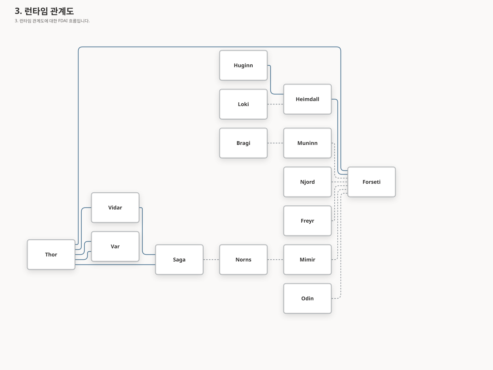

# 에이전트 판테온
FDAI의 고정된 15개 명명 에이전트 조직이 cloud-operations 런타임을 소유합니다. 에이전트는 schema-checked 이벤트로 관측, 판단, 계획, 승인, 실행, 검증, 복구, 감사, 학습합니다. 운영 온톨로지는 타입이 지정된 meaning과 범위가 제한된 맥락을 제공하며 행위자, 권한 또는 실행기가 아닙니다. 판테온은 업스트림에서 정의되고 포크는 에이전트를 추가하거나 이름을 바꾸지 않습니다.

> **범위:** 판테온은 고객-무관이다. 아래에 언급된 모든 에이전트 이름, 객체 타입, 액션 은 범용 이다. 고객별 바인딩은 포크 에서 관리 ([generic-scope.instructions.md](../../../.github/instructions/generic-scope.instructions.md)).
>
> **구현 초점:** Azure 가 유일한 구현 타깃이다; 판테온은 [app-shape.instructions.md](../../../.github/instructions/app-shape.instructions.md) 에 이미 선언된 Kafka wire (Event Hubs `:9093`) 를 사용한다 ([구현 Focus](../../../.github/copilot-instructions.md#implementation-focus-must)).

이 문서의 소비자:

- 이벤트 기반 코어는 §4 와 §6 의 에이전트 / 토픽 소유권 테이블을 읽고 스키마로 검증한 pub/sub 를 wire 한다.
- 오퍼레이터 콘솔 ([operator-console.md](../interfaces/operator-console-ko.md)) 은 §6.3 과 §6.5 를 읽고 자연어 질문을 per-user 맥락 로 기본 에이전트 에 라우팅한다.
- 룰-카탈로그와 실행기 ([action-ontology.md](../decisioning/action-ontology-ko.md), [execution-model.md](../decisioning/execution-model-ko.md)) 는 §7 을 읽고 각 ActionType 을 initiator / 판정자 / 승인자 / 실행기 / auditor 에 바인딩한다.
- 포크는 §10 을 읽고 어느 경계 이 열려 있고 (토픽 구독, 구성 재정의) 어느 것이 잠겨 있는지 (에이전트 추가 금지, 이름 변경 금지) 확인한다.
## 1. 설계 원칙

판테온은 기존 FDAI 컨트롤 루프를 이름이 있는 조직 역할로 구성합니다. [architecture.instructions.md](../../../.github/instructions/architecture.instructions.md)의 안전 경계는 바꾸지 않고 역할을 이해하고 감사하기 쉽게 만듭니다.

- **결정론 우선, LLM 사용 가능.** 모든 에이전트는 자체 연결로 LLM을 호출할 수 있지만 주요 실행 경로는 거의 모두 T0(규칙/테이블 조회) 또는 T1(유사도)을 사용합니다.
  LLM은 기본값이 아닌 기능이며 명시한 좁은 용도로만 사용합니다 (§8).
- **에이전트 주도, 온톨로지 제약.** 모든 상태 전이는 에이전트가 소유합니다. 온톨로지는 대상 신원, 관계, 근거 최신성, 허용 작업, 예상 효과를 검증하지만 그래프 결과는 판단, 승인, 실행 또는 권한 상승을 수행하지 않습니다.
- **Closed-loop 연산.** 수락된 신호는 observe, understand, decide, 계획, authorize, execute, verify, recover, learn 전 과정에서 accountable 소유자를 가집니다. 브로커 acceptance나 API 성공은 운영 결과가 아니며 독립적인 관측이 루프를 종료합니다.
  운영 귀속은 실행 권한을 부여하지 않습니다. 감사 및 활동 레코드는 기계적인 `actor`를 보존하고, 책임지는 Pantheon 역할을 `owner_agent`에 기록하며, 인증된 이벤트 버스 게시자에만 `producer_principal`을 사용합니다. 투영 계층은 이 신원을 표시할 수 있지만 서비스 이름에서 소유권, 작성 주체 또는 권한을 추론할 수 없으며, 귀속 변경은 ActionRun 식별자나 멱등성을 바꾸지 않습니다.
- **에스컬레이션 전에 자율적으로 해결.** 근거가 부족하면 사람 검토 전에 범위가 제한된 재수집, 대체 출처 확인, 결정론적 재평가, 더 작은 안전한 계획, no-op 또는 롤백을 수행합니다.
  Var는 잔여 모호성, 정책상 필수 승인 또는 상시 권한 밖의 위험에만 사람 검토를 요청합니다.
- **두 포트 모델.** 모든 에이전트는 권한이 있는 기계 트래픽용 타입 지정 pub/sub와 운영자 및 범위가 제한된 동료 숙의용 읽기 전용 대화 표현 포트를 제공합니다 (§6).
- **단일 게시자, 여러 구독자.** 각 객체 타입은 정확히 하나의 소유 에이전트만 게시하며 누구나 구독할 수 있습니다 (§6.1).
- **판단자는 실행기가 아님.** Forseti가 판단하고 Var가 권한이 있으며 만료되지 않은 승인을 전달합니다. Thor는 권한 상한, Saga 증적, 안정적인 멱등성 예약, 소유자 경계가 적용된 분산 리소스 점유를 다시 확인한 뒤 실행하며 재시작 모호성은 `execution_unknown`으로 유지합니다.
- **판테온은 업스트림에서 고정.** 15개 에이전트, 조직도, 역할 배정은 고정됩니다. 포크는 설정 가능한 경계 (§10)만 변경하며 에이전트를 추가, 제거하거나 이름을 바꾸지 않습니다.
- **저장소 구조가 경계를 보존.** 이름이 있는 에이전트는 [`services/core-control-plane/src/fdai/agents/`](../../../services/core-control-plane/src/fdai/agents)에, 공통 런타임은 비공개 `_framework`에 둡니다. 외부 호출자는 `fdai.agents`만 가져오며 구조 테스트가 이 경계를 강제합니다.
## 2. 조직도

Thor(운영)와 Forseti(판단)가 Odin에게 보고합니다. 거버넌스 담당 4명은 독립적인 점선 보고 체계를 가집니다.
영역 전문가와 관측 에이전트는 Forseti 아래에서 실행이 아닌 판단에 근거를 제공합니다.


## 3. 런타임 관계도

조직도는 보고 체계를, 이 관계도는 데이터 흐름을 나타냅니다. 관측과 전문가 근거는 Forseti로, 작업 판정은 Var, Vidar 또는 실행 처리를 위해 Thor로 전달합니다. Thor는 문서 수집, 배정 검토, 관찰 전용 아키텍처 검토 판정을 실행하지 않습니다. Odin은 이를 작업 포트폴리오에서 제외하고 Saga는 감사 근거를 보존합니다.
Var와 Saga는 문서 HIL의 안정적인 멱등성을 보존하며 Saga는 게이트 및 최종 감사를 영속화합니다. 클라우드 참조 패키지도 유효한 서명과 별개로 독립 Var 승인을 요구합니다. [클라우드 리소스 지식](../interfaces/cloud-resource-knowledge-lifecycle-ko.md)을 참조하세요.
워크플로 요청은 양의 시도 번호를 포함한 범위가 제한된 `workflow_action` 계보를 Huginn, Forseti, Thor를 거쳐 보존합니다. Thor는 Verdict가 제공한 작업 식별자만 보존하고 상관관계에서 만들어 내지 않으며 권한이 없는 `_framework` 도우미로 범위가 제한된 ActionRun 계보를 검증합니다.
전달 계층의 생성기는 하나의 완전한 운영 계획에 대한 선택적인 인자 결속 실행 제안을 저장합니다. Forseti는 주입된 원본으로 이를 해석하고 엄격한 검증 뒤 같은 Verdict-to-ActionRun 경로를 유지합니다. 계보와 제안은 귀속 및 근거만 제공하며 정족수, 모드, 판단, 승인, 실행 권한을 바꾸지 않습니다. Norns는 Mimir에 제안하고 Odin은 판단 전에 충돌을 조정합니다.
Var 승인, Vidar 복구, Saga 인계, Norns 학습도 [에이전트 판테온 구현 계획](agent-pantheon-implementation-ko.md#영속-권한과-재생)에 따라 영속 멱등성과 재시작 상태를 보존합니다.

Var의 승인 대기 데이터는 비공개 `var_decisions`에서 영속 결정 레코드와 함께 관리합니다.
공개 `PendingHilTicket`과 `PendingShadowReview`는 Var에서 계속 가져올 수 있으며 필드,
기본값, 변경 가능성은 그대로입니다. 승인 정책이나 게시 소유권은 이동하지 않습니다.

- **배정 검토:** [배정 명령](../interfaces/human-agent-assignment-implementation-plan-ko.md#명령-이벤트-작업)은 기존 토픽에서 Huginn 유입, Forseti 검증, 독립 Var 검토, Saga 봉인, Muninn 사례 반영을 거칩니다. Operator 조회 결과는 권한이 아닙니다. 이전 IAM 알림은 shadow 전용이며 새 제거 검토와 독립 IAM 제거 근거가 있어야 검토 전용 이전 임무 PR을 만듭니다. Forseti의 증적 처리는 비공개 배정 믹스인에 유지합니다.
- **멤버십 실행:** 별도로 타입이 지정된 경로는 Var가 원래 사람 승인 슬롯을 만들기 전에 전체 원래 Action과 정확한 사례, 역할 맵, 승격 원본을 보존합니다. Muninn 준비는 CAS `r -> r+1`이며 승인된 `expected_revision=r`을 수정하지 않습니다. Core는 변경 신원을 만들지 않습니다. Thor는 격리된 전용 신원, 정확한 현재 원본/허용 목록 확인, 7개 안전장치, 연산과 무관한 멤버십 잠금을 통해 전달합니다. 현재 비상 정지/상태와 principal별 ActionType 승인 정책을 다시 확인합니다. 시도 전에 영속 의도를 기록하고 응답 뒤 확인 기록을 남기며 결과를 모르는 시도는 자동 재시도하지 않습니다.
- **효과와 복구:** 독립 Heimdall 관측, Forseti 판단, Saga 봉인, 공유 잠금 해제 종결이 Muninn의 효과 기록보다 먼저입니다. Vidar는 새로 별도 승인받는 역방향 작업을 제안하고 마무리합니다. Thor는 원래 직접 수행한 변경의 근거, 현재 수요, 같은 대상 세대가 있을 때만 전달합니다. 사례는 degraded 상태로 남아 별도 대체가 가능하며 이전 승인이나 역할 권한을 복사하지 않습니다. 새 ActionType은 계속 shadow가 기본이고 로컬 권한 전환은 허용하지 않습니다.
- **지식:** Huginn -> Forseti -> Saga -> Muninn StateSnapshot -> Saga -> Norns -> Mimir -> Saga 담당 경로를 유지합니다. 현재 Core 목표/검토자/원본 허용/검색 연결은 독립 원본 확인과 소유자별 CAS에 사용됩니다. Norns는 합의/게시 게이트를 유지하면서 비공개 Rule/온톨로지 후보를 컴파일합니다. Mimir는 내용보다 원본을 먼저 확인하고 모델 없이 재컴파일하며 되돌릴 수 없는 사용 종료와 정확한 현재 `legal_hold: false` 조건의 내용 제거를 담당합니다. 알 수 없는 정책이나 장애에서는 삭제하지 않습니다. 명시적인 다이제스트 충돌은 Odin에게 전달하며 패키지, 검토, 스케줄러 출처 이름, 병합은 IAM, 카탈로그, 그래프, 실행 권한을 부여하지 않습니다.
- **영속 권한과 재생:** 구현된 담당 계약은 실제 T0/T1/T2 권한, 정확한 T2 대상/규칙/인용 결속, 서로 다른 정본 교차 검사 모델 신원을 보존합니다. Var는 감사된 불변 principal 결정 CAS와 최종 발신함 복구를 유지합니다. Vidar는 다시 생성된 전달 메타데이터를 제외한 하나의 효과 관련 필드 허용 목록을 실행기 입력과 다이제스트에 함께 사용하고 소유자 토큰 임대, 개정 경계, 검증된 최종 증적을 유지합니다. 유효한 점유는 재시도 가능한 실패로 남고 검증된 임대 만료는 `execution_unknown`이 되며, 성공에는 Thor의 점유 해제 전에 범위가 제한된 비어 있지 않은 `rollback_ref`가 필요합니다.
  Saga는 변경 -> 감사 -> 필수 게시 -> 완료 단계를 유지합니다. Norns는 대기 작업 -> 영속 지문 횟수 -> 후보 게시 또는 결정론적 보류를 유지하며 대기 항목만 제한된 범위에서 복구하고 막힌 선두 항목을 처리한 뒤 다음 후보를 이어서 복구합니다. Enforce에는 명시적인 `thor_state_store`, `vidar_state_store`, `var_state_store`가 필요하며 담당 저장소 연결이 없으면 프로세스 로컬 권한으로 대체할 수 없습니다. Saga의 체크포인트 및 이슈 작업 신원에 관한 Low 심각도 한계 2개는 별도 구현 계획에서 미해결로 유지합니다.
- **소스 완료와 전달 경계:** 인수인계 소스는 구현되었으며 실행 경로 강화 20회(EX-01부터 EX-20), [최종 통합 소스 검토 12회(FI-01부터 FI-12)](../../internals/handover-lifecycle-hardening-20260914.md#final-integrated-critique-after-remaining-source-implementation), [추가 병합 전용 검토 10회(MI-01부터 MI-10)](../../internals/handover-lifecycle-hardening-20260914.md#final-merge-specific-integrated-critique)가 기록되어 있습니다. 이들은 서로 다른 이전 체크포인트이며 두 번째 병합의 새 근거가 아닙니다. 미해결로 확인된 Medium/High 문제가 없다는 결론도 검토한 소스에만 적용됩니다. 두 번째 로컬 main 병합은 성공했고 [PR #1014](https://github.com/dotnetpower/fdai/pull/1014)에 `c8edd2769`로 게시되었지만 [CI 실행 34921323157의 1차 시도](https://github.com/dotnetpower/fdai/actions/runs/34921323157/attempts/1)는 실패했습니다. Huginn의 로컬 수정은 타입이 지정된 알림 두 개의 변수 이름을 분리하여 mypy 오류를 해결하며 역할이나 토픽은 바꾸지 않습니다. 집중 소스 수정은 로컬에서 구현되었고 전달 복구는 [#946](https://github.com/dotnetpower/fdai/issues/946)에서 진행 중이며 최신 게시 헤드는 여전히 `c8edd2769`입니다. [구현 원장](../../roadmap-implementation/agents/agent-pantheon.md)은 검토 후 번역 갱신, 정본 생성, 수정본 훅/PR 갱신, 정확한 헤드의 보호된 CI/병합, UI/보조 기술/실제 운영/배포/승격 근거를 별도의 미완료 요건으로 유지합니다.



### 3.1 다목적 중재 (multi-objective 중재)

**헌법 적격성을 먼저 확인합니다.** Forseti는 중재 요청을 소유하고 Odin은 헌법 제약을
통과한 soft-objective tradeoff만 순위합니다. 정규화, precedence, weighted 채점, 사람 승인
margin, 계획 수립 증적 및 temporal 정책은
[Operational 계획 수립](../decisioning/operational-planning-ko.md#다목적-중재)이 소유합니다. 충돌은 표현이 아니라 목표에 관한 사실입니다. 영역 전문가가 자신의 결정적 실행이 산출한 ActionType과 예상되는 부호 있는 목표 효과, 그리고 두 값을 읽어 온 계보를 함께 첨부하면, Forseti는 두 영역이 동일한 통제 목표에서 서로 반대 부호의 효용을 가질 때만 중재를 제기하며, 기여한 각 재생의 표준 계보는 의사결정 사례와 종결 판정까지 이어집니다.
Forseti가 중재를 제기한 뒤에는 같은 이벤트에 일반 판단을 추가로 실행하지 않습니다. 중재
결정 또는 범위가 제한된 소유자 부재 종결만 해당 이벤트의 종결 판정이 됩니다.
초기 세 버티컬에서는 Loki, Heimdall, Njord가 `object.resilience-score`, `object.drift`,
`object.cost-anomaly` 토픽에서 서로 다른 후보 아이덴티티를 유지합니다. Forseti는 같은
리소스와 기준 시점에 대해 소유자가 인증된 버티컬별 후보를 하나씩 결합합니다. Odin은 각
후보의 `win`, `defer`, `hil` 처리 결과를 포함한 결정을 하나만 게시하고 Saga가 이를
감사하며, 승리한 판정을 `ActionRun`으로 전환할 수 있는 에이전트는 Thor뿐입니다.
후보의 상관관계, 멱등성, 리소스 및 ActionType 식별자는 유입 경계에서 범위가 제한되고 비어
있지 않으며 앞뒤 공백을 허용하지 않습니다. 공유 관측 기준 시점에는 시간대가 포함되어야 합니다.

### 3.2 발견 루프 학습기 (Norns)

Norns는 inert `RuleCandidate` 제안의 sole 쓰기 담당으로 유지됩니다. Three-perspective 합의, balanced 집단 한도, pending 큐, Mimir 검토 및 카탈로그 activation 경계는
[Operational Learning 온톨로지](../rules-and-detection/operational-learning-ontology-ko.md#norns-consensus-및-catalog-boundary)가 소유합니다. 비공개 `norns_deployment_learning.py` 보조 로직은 범위가 제한된 scenario-gap 및 preflight-blocker 집계 상태만 보유합니다. 모든 후보 생성과 publish는 계속 Norns가 합의 및 rate-limit 경계를 통해 수행합니다. Caller-supplied recurring preflight 수동 차단 요인은 scope-deduplicate된 inert `preflight-toggle-gap` 후보가 되며 토글을 만들거나 배포 권한을 변경하지 않습니다. 재현된 Rule 수집 실패는 Huginn-owned 이벤트로 들어옵니다. Heimdall은 exact 실패를 독립적으로 validate하고 `object.retrieval-validation`을 publish하며, Saga는 해당 근거를 감사하고 Muninn은 `object.context-index`로 materialize합니다. Norns는 raw 텍스트, 검증되지 않은 실패, 수집 외 원인 및 exact Rule 버전이 없는 대상을 strict하게 거부합니다. 남은 challenger를 영속하게 기록한 뒤 동일한 합의 및 `object.rule-candidate` 경로를 사용합니다. 적응형 인과 조사에서는 Muninn이 `object.context-index`로 범위가 제한된 전송 안전 활성 및 도전 선택기 비교를 제공하며, Norns가 생산자와 균형 잡힌 개선 및 대조 근거를 검증하고 실행 중인 선택기를 바꾸지 않는 비활성 shadow 전용 `revision`을 같은 Mimir 대기열로 보냅니다. 영속 싱크가 없으면 이벤트를 폐기하지 않고 backpressure합니다. 운영 런타임은 이 최종 게시 경계에 기본적으로 닫힌 상한도 주입합니다. 닫힌 게이트는 범위가 제한된 대기 큐와 합의 근거를 보존하고, 열린 게이트도 카탈로그, 승격, 승인 또는 실행 권한을 부여하지 않으며 Mimir와 검토된 catalog-as-code pull request를 다음 경계로 유지합니다.

운영 사례 집단은 고정된 release, 완전하고 최신이며 충돌과 중복이 없는 사례의
[검토 계약](../rules-and-detection/operational-learning-ontology-ko.md)을 따르며 Mimir가 독립적으로 다시 확인합니다.
Muninn은 접근 범위, 용도, 메커니즘, `ActionType`, release, 시나리오, 출처로 집단을 분리하고
삭제와 쓰기를 함께 보호하는 원자적 비교 후 갱신으로 스냅샷을 고정하며 사례 본문의 프로세스 로컬 캐시는 두지 않습니다.
Norns는 합의와 발행 한도를 거쳐 비활성 `Pattern`을 발행하며 대기 중인 범위별 입력은 브로커 재시도나 보존된 재전달이 필요합니다.
Muninn은 본문과 묶음 버전을 검증하고 현재 범위별 사례와 산출물로 다시 계산해 Saga 스냅샷을 남깁니다. 조회는 변조와 삭제를 차단합니다.
승격이나 실행 권한은 늘어나지 않습니다. 승격에는 승인된 재현이 필요하며 런타임에 연결된 테스트 맥락 조회기는 Forseti의 상한을 낮출 수만 있습니다.

Shadow dwell은 루프의 마지막 비활성 장벽입니다. Norns는 shadow 모드 감사 결과를 대상별 dwell 관측으로 보존하며(shadow 결과는 여전히 실제 rollback 비율 학습기에 섞이지 않습니다) 산출된 자기 검증 근거를 게시하는 후보에 첨부합니다. Mimir는 그 이벤트 근거에서 판정을 다시 유도하고, 근거가 없거나 일관되지 않거나 대상이 다르거나 임계 미달인 후보의 승격을 거부합니다. 정책 위반 탈출 0건 기준은 설정 항목이 아닙니다. 이는 두 에이전트 어느 쪽에도 권한을 부여하지 않으며, 카탈로그는 여전히 머지된 catalog-as-code PR로만 바뀐니다. [자율 규칙 발견](../rules-and-detection/rule-catalog-autonomous-discovery-ko.md#shadow-dwell-근거상류-구현)을 참고하세요.

Saga는 이제 종료된 각 shadow 감사 항목에 안정적인 관측 ID와 정책 위반 탈출 표시를
기록합니다. Var는 해당 레코드를 별도 사람 검토자의 대기열에 넣고 기존
`object.approval` 토픽으로 결과를 게시합니다. Saga는 검토된 감사 항목을 다시 게시하고,
Norns는 ID로 보존된 표본의 검토 상태를 갱신합니다. 재생과 반복 검토는 표본 수를 늘리지
않으며, 검토 경로는 최초 정책 위반 탈출 사실을 변경할 수 없습니다.
## 4. 에이전트 카탈로그
> **머신 판독용 원본 (single 정본)**: `PANTHEON_SPECS`
> ([`services/core-control-plane/src/fdai/agents/_framework/pantheon.py`](../../../services/core-control-plane/src/fdai/agents/_framework/pantheon.py)).
> 아래 표는 그 `AgentSpec` 항목들을 사람이 읽기 좋게 재구성한 것이다.
> 표와 코드가 다르면 **코드가 이긴다**.
> [`services/core-control-plane/tests/agents/test_pantheon_doc_parity.py`](../../../services/core-control-plane/tests/agents/test_pantheon_doc_parity.py)
> 는 영어/한국어 문서의 15개 이름, 카탈로그 계층, 소유권을 `PANTHEON_SPECS`와
> exact 비교하여 CI에서 표류를 감지합니다.
> 소유 객체 타입은 canonical machine token이므로 두 언어 표에서 번역하지 않습니다.

계층: `1` = 도메인 전문가, `2` = 파이프라인 (sensing / judgment /
operations / 인터페이스), `3` = 거버넌스 staff.

| 이름 | 역할 | 계층 | 소유 객체 types | 주요 동작 | Hot-path LLM? |
|------|------|-------|-------------------|-------------------|---------------|
| Odin | Master 플래너 | 3 | ArbitrationDecision | arbitrate_domain_conflict | no |
| Thor | 응답자 | 2 | ActionRun, ActionAttempt | (전달 만; 직접 소유 없음 - §7.1) | no |
| Forseti | Judge | 2 | Verdict, RCA, SecurityEvent, ArbitrationRequest, ProspectiveLineage | 판정과 정확한 실행 전 prospective lineage를 생성합니다. 선택적 planned-change graph 맥락은 자율성을 낮출 수만 있습니다. 실행기 역할은 없습니다. | yes (T2 abstain 시만) |
| Huginn | Event Collector / 실시간 Resource 발견 | 2 | Event, Change | ingest_event, normalize_change | no |
| Heimdall | Observer | 2 | Anomaly, Drift, Forecast, ForecastOutcome, RetrievalValidation, EvidenceConflict, RecoveryEffectObservation | detect_anomaly, detect_drift, 예측, close_forecast_outcome, publish_evidence_conflict_revision, observe_terminal_action_effect, relay_recovery_effect_observation, validate_retrieval_failure, validate_rule_generation, notify_admin_privilege_violation | no |
| Vidar | 복구 | 2 | Rollback | perform_rollback, dr_failover | no |
| Var | Approver | 2 | Approval | approve_action, reject_action | no |
| Bragi | Narrator | 2 | Conversation, Turn, UserPreference, HandoffEscalation, PostTurnReview | translate_intent | yes (translator 만) |
| Saga | Auditor | 3 | AuditEntry, Issue | append_audit (누락 추적 정규화), escalate_to_github_issue | no |
| Mimir | Rule 담당자 | 3 | Rule, Policy, RuleGenerationBuildRequest, RuleGenerationBuildResult | promote_rule, revoke_rule, build_rule_generation | no |
| Muninn | Memory | 3 | StateSnapshot, ContextIndex | index_state, snapshot_state, seal_case_history | no |
| Norns | Learner | 3 | RuleCandidate, Pattern | propose_rule_candidate, analyze_case_history, close_issue | yes (off-path 배치 만) |
| Njord | 비용 | 1 | CostAnomaly, Budget | propose_cost_action | no |
| Freyr | 용량 | 1 | CapacityForecast, SizingRecommendation, CapacityGraduationRecommendation | 용량 예측 및 shadow-only 전환 권고 | no |
| Loki | Chaos | 1 | ChaosExperiment, ResilienceScore | schedule_experiment | no |

Heimdall은 결정론적 예측 에피소드 평가와 종결의 책임자이며 비공개 `heimdall_forecast.py`와 `heimdall_alert_window.py`가 계산과 범위가 제한된 에피소드/경고 구간 기록을 소유합니다.
반복 이벤트의 권위 있는 이상 징후를 게시한 뒤 선택적 `incident_candidate_hook`이 정규화된 리소스, 이벤트 타입, 상관관계, 최대 심각도, 사유 코드, 모든 급증 근거 키를 조립 소유 `IncidentLifecycleWorkflow`로 보냅니다.
임계값 이상 징후를 게시하기 전에는 주입된 읽기 전용 `operational_evidence_hook`으로 보류 전용 Kubernetes 용량 점검 결과 같은 공급자 근거를 범위 안에서 첨부할 수 있지만 판단, 승인, 실행은 하지 않습니다. 공급자 실패는 구조화된 사용 불가 근거가 되며 이상 징후를 억제하지 않습니다.
비율 제한 구간의 상관관계 에피소드 하나는 최대 심각도의 이상 징후 하나를 만듭니다. 전체/리소스별 상한은 다른 리소스의 기록 제거를 방지합니다. 정기 하트비트, 정상 탐색, 임계값 이내 관측은 점검 결과나 Incident를 만들지 않습니다.
분산 추적 불연속에서는 Huginn이 범위가 제한된 감지기, 토폴로지, 홉, 추적 조각, 근거 참조, 구간 필드만 정규화합니다. Heimdall은 등록된 연속성 사유를 수락하고 이상 징후에 근거를 보존하며 Incident 후보에는 일반 반복 사유가 아닌 관측된 사유를 사용합니다.
작업처럼 보이는 입력을 포함한 알 수 없는 필드는 버립니다. 이 인계는 ActionType을 선택하거나 판단, 승인, 실행 권한을 부여하지 않습니다. Heimdall은 Incident를 쓰거나 새 객체 타입을 게시하지 않습니다.
명시적 `incident_correlation=correlate`, 상관관계, 근거, 활성 자동 열기, 충분한 심각도를 갖춘 후보만 워크플로로 전달하고 나머지는 이상 징후로 유지합니다. 워크플로는 `IncidentRegistry`가 감사된 기록을 쓰기 전에 근거를 다시 확인합니다.
훅 실패는 동작 횟수를 늘리고 재시도할 제한 구간을 보존하며 수락과 정책상 보류는 별도로 계수합니다. 운영 조립은 레지스트리를 복원하고 활성화된 훅을 연결하며 Operator는 Heimdall을 가장하지 않습니다.

Huginn은 실시간 리소스 발견과 정규화된 `Change` 기록을 소유합니다. Azure 생성/갱신/삭제 신호는 정본 Event Hubs Kafka 유입에서 정규화, 중복 제거, 상관관계 처리를 거쳐 `Event`가 됩니다. 권위 있는 이벤트 시각을 가진 IaC 계획, 릴리스 요청, 공급자 활동은 `object.change`도 만들며 Muninn이 결정 맥락용 불변 내용 기반 개정을 보존합니다.
원인이 된 `object.event`에 같은 정규화 Change 근거를 담아 토픽 간 도착 순서에 의존하지 않습니다. Forseti는 일반 규칙 판단 전에 계획된 변경의 영향을 제한된 범위에서 분석하고 Verdict 및 DecisionCase 근거에 보존합니다. 평가가 없거나 오래되었거나 실패했거나 검토가 필요하면 사람 승인을 요구합니다.
관측된 변경은 맥락일 뿐이며 런타임은 그래프 최신성으로 계획된 변경을 자동 허용할 권한을 제공하지 않습니다. 최신성에는 명시적인 문자열 출처, 시각, 정수 최대 유효 기간이 필요하며 불리언 기간을 포함한 잘못된 값은 실패 시 차단하여 사람 승인으로 낮춥니다.
일반 Verdict와 중재 DecisionCase는 같은 타입 지정 최신성 근거를 사용하므로 중재는 맥락 상한이 제거한 권한을 복구할 수 없습니다. 이 변환 결과는 작업 권한을 부여하지 않습니다.
Azure 파싱, 개별 보강, 영속 인벤토리 변환은 주입된 전달 책임으로 유지하며 Huginn은 Azure SDK를 가져오거나 인벤토리 데이터베이스를 쓰지 않습니다. 정기 인벤토리 동기화는 완전한 ARG/ARM 스냅샷으로 누락 신호를 복구합니다. 오래되거나 저하된 인벤토리는 사용 불가이며 Heimdall은 점검 결과만 게시하고 리소스를 확보하거나 조정을 시작하지 않습니다.

15개 에이전트는 조립을 통해 SRE, ARB, FinOps를 담당합니다. 에이전트가 아닌 관찰 소비자는 소유 토픽의 재생/상태 근거를 보존할 수 있지만 판테온에 참여하거나 소유 객체를 게시하거나 판단, 승인, 실행하지 않습니다 (§6, §6.4, §7.6).
Forseti의 관찰 모드 ARB 실패 기록은 맥락/근거 수집 실패에도 전체 Change 다이제스트를 보존합니다. 보류는 재생 가능하며 알 수 없는 의존성에서 승인이나 실행 권한을 얻지 않습니다.

### 4.1 Per-agent 작업 인벤토리

모든 에이전트는 **R**ecurring(예약 실행), **E**vent(타입 지정 포트 메시지), **M**eta(자체 상태와 개선), **X**-agent([명명된 워크플로](agent-workflows-ko.md))의 네 작업 범주를 수행합니다.

| 에이전트 | R (recurring) | E (이벤트) | M (meta) | X-agent |
|-------|---------------|-----------|----------|---------|
| Odin | 주간 portfolio 리뷰, priority-policy 튜닝 | Forseti 신호 에 arbitrate_domain_conflict | portfolio 결과 점수 self-audit | 7 (에이전트 상태), 2 (Predictive 규모) tie-break |
| Thor | execution-path 상태 검사, retry-strategy 캐시 예열 | 판정 전달, 롤백 트리거, rate-limit 강제 | high-risk 액션 pre-flight 시뮬레이션 | 1 (Cost-aware 교정), 2 (Predictive 규모), 11 (준비 상태), 12 (Scheduled Python) |
| Forseti | rule-cache 리프레시, retrospective what-if 배치, 판정 coherence self-test | 이벤트 판단 (T0/T1/T2), domain_conflict 발행, SecurityEvent 발행 | novelty 표류 감지 (T0 vs T2 mix) | 1, 2, 5 (Security 에스컬레이션), 8 (Judgment coherence), 11, 12 |
| Huginn | 출처 상태 검사, 발견 커서/backpressure 검사, dedup 구간 유지 | Event 및 정규화된 변경 정규화 + dedup + correlate + publish | 적응형 스키마 학습 (T1 clustering, off-path) | 모든 워크플로우에 피드 |
| Heimdall | anomaly 기준선 업데이트, 예측 리프레시, 발견 최신성/커버리지 탐색, T2 제안자 상태 증적 reduction, external-actor 리스트 리프레시, agent-health 탐색 | anomaly detect, 표류 detect, 최종 제안자 exhaustion correlate, 발견 성능 저하 correlate, SecurityEvent correlate, notify_admin | multi-signal 다신호 상관 | 1, 2, 3 (DR 훈련), 5, 7 (에이전트 상태), 9 (Rollback 예행 연습) |
| Vidar | rollback-path 검증, DR 준비 상태 점수, recovery-time SLI | perform_rollback, dr_failover | 롤백 예행 연습 (shadow) | 3, 9 |
| Var | 승인 SLA 모니터, 승인자 가용성 tracking | HIL 카드 제시, 정족수 강제, 시간 초과 / 에스컬레이션 | 승인 출처 이력 기록 | 4 (재정의 -> 발견), 5, 11, 12 |
| Bragi | 만료 세션 정리, UserPreference 인덱스 리프레시 | NL 라우팅, multi-agent 집계, NL 렌더링 | 의도 classifier 재학습 (T1, off-path) | 7, 10 (Retrospective what-if), 12 |
| Saga | audit-chain 무결성 self-check, issue-close 검사, 지문 인덱스 compaction | 덧붙이기 AuditEntry, escalate_to_github_issue, 재생 for reconstruction | 감사 체인 tamper 감지 | 모든 워크플로우 (감사) |
| Mimir | rule-source 폴링, 회귀 모음, deprecation cycle | 룰 promote / 철회, cache-invalidation broadcast | freshness-score, stale-rule 감지 | 4, 6 (인계 -> 기능), 8, 11 |
| Muninn | 스냅샷 교대, RAG 인덱스 재구축, 캐시 제거, case-history 보존 | Forseti 를 위한 맥락 fetch, 변경할 수 없는 변경 개정 번호 저장, Bragi 를 위한 상태 조회, 보존 틱 적용 | trending-query pre-warm, 온톨로지 교차 검증 | 판단을 touch 하는 모든 워크플로우 지원 |
| Norns | 시간당 배치 감사 분석, 스트리밍 pattern 추출 | pattern 신호, RuleCandidate publish, close_issue 신호 | 모델 성능 표류 감지 | 4, 6, 8 (Judgment coherence), 10 |
| Njord | 비용 인제스트 (daily), 예산 모니터, 비용 forecasting | 범위가 제한된 비용 샘플 -> anomaly, 시작할 때 수락된 보존 완료 USD 기준선을 복원하되 과거 finding은 다시 게시하지 않음, 예산 breach 경보, cost-advisor 조회 | RI / SP 최적화 제안 | 1, 2 |
| Freyr | 사용률 샘플링, 용량 forecasting, sizing 분석 | 범위가 제한된 사용률 샘플 -> 예측, 규모 제안, 용량 advisor 조회 | 다차원 용량 (CPU + IOPS + net + mem) | 2, 3 |
| Loki | chaos-experiment 스케줄, resilience-score 리프레시 | 범위가 제한된 예약 트리거 -> 항상-HIL 실험 제안, blast-radius 계산 | adversarial 시나리오 생성 (T2, off-path) | 3, 9 |

### 4.2 Per-agent KPI (성공과 성능 저하 신호)

모든 에이전트는 상태 스냅샷마다 [측정 파이프라인](../architecture/goals-and-metrics-ko.md)에 이 지표를 보고하여 shadow -> enforce 승격을 결정론적으로 평가하도록 합니다.
결과 근거가 부족하면 `value: null`과 명시적 근거 상태를 사용하며 승격 게이트는 이를 0이 아닌 실패로 처리합니다.

| 에이전트 | 성공 KPI | 성능 저하 KPI (조기 경고) |
|-------|----------|----------------------------|
| Odin | cross-vertical 충돌 해결 시간, portfolio 목표 달성 | tie-break 재발률 |
| Thor | 실행 성공률, 실행 지연 p99 | 롤백 트리거 율, race 실패 |
| Forseti | post-hoc 재정의 대비 판정 정확도, T2 에스컬레이션 비율 (목표 < 10%) | mixed-model 불일치율, grounding 누락률 |
| Huginn | 이벤트 처리 지연 p99, 발견 전달 지연 p99, dedup 정확도 | 스키마 매칭 실패율, 발견 커서 lag |
| Heimdall | anomaly 정밀도 + 재현율, 예측 MAPE, 발견 커버리지 감지, T2 제안자 복구 감지 | false-positive 비율, missed critical, stale 인벤토리 감지 지연, 제안자 exhaustion-to-HIL 지연 |
| Vidar | 롤백 성공률, MTTR | rollback-path 검증 실패 |
| Var | HIL SLA 준수율, 정족수 준수 | 만료율, 반복 에스컬레이션 |
| Bragi | 라우팅 정확도 (post-audit), 세션 만족도 | 인계 비율 (목표 < 5%) |
| Saga | 감사 체인 무결성, 재생 성공 | audit-gap 감지 |
| Mimir | 룰 최신성 점수, 승격 통과 비율 | shadow-fail 율, stale-rule 비율 |
| Muninn | 맥락 fetch p99, 캐시 적중 비율 | cache-miss 재계산 시간 |
| Norns | 룰 후보 채택률, pattern 유효성 | false-pattern 비율 |
| Njord | 비용 예측 MAPE, saving 실현 | budget-breach 미검출 |
| Freyr | 용량 예측 오차, over / under 프로비저닝 | 규모 race, 제한 이벤트 |
| Loki | 실험 blast-radius 준수, 복원력 향상 델타 | unplanned side-effect, 실험 실패 |

**시스템 수준 KPI** (Odin portfolio 리포트):

- **자율성 ratio** - auto vs HIL vs 거부 분포 (목표: auto 상승, 거부
  감소).
- **인계 conversion 비율** - issue -> RuleCandidate -> promoted.
- **Cross-vertical 액션 ratio** - single vs multi-vertical 액션.
- **발견 velocity** - 새 룰 / 기능 승격 속도 (weekly).

### 4.3 Per-agent 성능 저하 정책

에이전트 자체가 실패하거나 저하될 때 선언된 안전 동작. Anti-pattern §11 은
이것들을 nothing 으로 collapse 하는 것을 금지.

| 실패한 에이전트 | 영향 | 안전 성능 저하 |
|---------------|------|-----------------|
| **Saga** | 감사 불가 | **HARD FAIL**: 새 변경 허용 안 됨; 전체 시스템 shadow 로 강등 |
| **Vidar** | 롤백 불가 | Thor 가 새 auto 실행 거부; 모든 새 액션 shadow 로 강등 |
| **Forseti** | 판단 정지 | Huginn / Heimdall 은 계속 publish (Kafka retain); 판정 대체 경로 없음 (판사 없이 판단 불가); 운영자 경보 |
| **Odin** | cross-vertical 중재 누락 | Forseti가 Odin의 출시된 성능 저하 정책을 적용하고 자신이 제기한 중재를 ActionType도 개시자도 승리 영역도 조치 권한도 없는 종결 HIL 판정으로 닫으므로, 소유자 없는 중재가 열린 채로 남지 않고 두 번째 arbiter도 세우지 않음 (사람이 arbitrate) |
| **Thor** | 실행 정지 | 판정 큐잉; 판정 TTL 만료 시 stale 폐기 (republish 시 재판단) |
| **Huginn** | 인제스트 정지 | Kafka 보존 이 이벤트 보존; Huginn 복구 시 체크포인트 부터 재개 (멱등적) |
| **Heimdall** | 감지/효과 관측 정지 | 읽기, 거부, shadow judgment는 계속; Heimdall 관측이 필요한 새 상태 변경은 차단되고 기존 결과는 pending, RBAC 거부는 감사 |
| **Var** | HIL 차단 | HIL 큐 보존; 시간 초과 자동 확장; admin 경보; 승인 없이 이미 A1/A2 조건을 충족한인 액션만 계속하며 HIL과 A3-E는 실행 불가 |
| **Bragi** | 대화 차단 | 운영자 는 콘솔 읽기 전용 화면 + 직접 감사 조회 로 대체 경로 |
| **Mimir** | 룰 업데이트 정지 | 캐시된 룰 계속; Forseti 가 stale-rule 경고; 새 룰 업데이트 지연 |
| **Muninn** | 맥락 불가 | 읽기, 거부, shadow judgment는 계속; context-dependent 상태 변경은 알 수 없음으로 차단하고 "맥락 사용 불가" 감사 |
| **Norns** | 학습 정지 | 즉시 영향 없음 (off-path); 장기 미가동 시 발견 velocity 저하 경고 |
| **Njord / Freyr / Loki** | 도메인 자문 누락 | Forseti 가 해당 도메인 액션 을 HIL 로 강등 |

공통 규칙:

- **Saga와 Vidar는 변경의 필수 의존성**입니다. 최종 소비자/상태 실패는 재시작 전까지 sticky shadow를 강제합니다. Noncritical 최종 소비자는 해당 에이전트만 degrade하고 형제는 계속 실행하며 상태는 false 하트비트 대신 exact 에이전트/토픽 상태를 기록합니다. Unified 동시성 테스트는 15개 소비자 신원과 same-topic non-stealing 동시 확산을 pin합니다.
- **판단자 / 실행자 / 감사자 triad 중 하나라도 누락** 시 새 변경 을
  shadow 로 강등.
- **Noncritical sensing 성능 저하**은 읽기, 거부, 큐 및 shadow 경로만 보존할 수 있습니다.
  Vidar는 변경 필수 의존성이고 Var는 HIL 및 A3-E 충족 여부를 별도로 통제합니다.
- 모든 성능 저하 은 Odin 의 portfolio 리포트에 surfacing (워크플로우 7).

### 4.4 작업 계층 분류 (per-task LLM 정책)

예측이나 적응 작업에 항상 LLM이 필요한 것은 아닙니다. 아래 §4.1 작업별 계층은 임의의 T2 승격을 방지합니다.

| 작업 | 올바른 계층 | 이유 |
|------|-------------|------|
| Heimdall 예측 | T1 (ARIMA / smoothing) | 통계로 충분, 재현 가능 |
| Norns 스트리밍 pattern | T1 (clustering) | 실제 운영 신호 은 결정론적 순위 필요 |
| Norns 배치 요약 | T2 (off-path only) | 주간 리포트에 LLM OK, hot-path 절대 안 됨 |
| Bragi 의미 변환 | 범위가 제한된 T1 구조화 판단, 선택적 T2 재시도 후 인계 | 스키마 검증과 정확한 capability projection이 authoritative함 |
| Mimir 룰 초안 | T2 (off-path, human-reviewed) | novel 룰 은 LLM OK; sign-off 는 사람 |
| Forseti 판정 coherence | T0 (SQL) + T1 (임베딩) | 과거 판정 는 구조화된 감사 로그 |
| Var assisted 결정 | T0 (링크 유사 사례) + T2 (요약, off-path) | 카드는 요약 carry; 사람이 결정 |
| Huginn 스키마 학습 | T1 (배치 clustering) + T2 for 승격 | 실시간 정규화는 T0 유지 |
| Loki adversarial | T2 (off-path) | 시나리오 생성 LLM OK; 실행은 결정론적 |

명시된 LLM 호출 경계는 Bragi 변환, Forseti T2 판단 보류, Norns의 응답 경로 밖 배치입니다. 다른 주요 실행 경로에 LLM 호출을 추가하면 이 정책을 위반합니다.

## 5. 온톨로지 통합

`Agent`는 `/ontology/graph`의 일급 온톨로지 타입이므로 조직도와 데이터 소유권을 다른 타입과 함께 조회할 수 있습니다.

```yaml
object_type: Agent
properties:
  name: string                     # "Odin", "Thor", ...
  layer: enum                      # domain | pipeline | governance
  reports_to: Agent?               # 조직도 edge
  owns: [ObjectType]               # 버스 single-writer; publishes가 여기서 파생
  executes: [ActionType]           # action-ontology.md 참조
  initiates: [ActionType]          # propose 가능 (§7.1)
  subscribes: [Topic]              # typed-port 구독
  publishes: [Topic]               # typed-port 발행
  question_domains: [string]       # NL query 카테고리 (§6.3)
  owns_code_paths: [glob]          # self-introspection 용 RAG 범위 (§8)
  llm_bindings: [ModelId]          # 이 에이전트가 호출 가능한 모델
  rate_limits:
    proposals_per_minute: int
    proposals_per_hour: int
```

`object_type`은 그래프 인스턴스를 생성/종료할 정확히 하나의 `Agent`를 `owner`로 지정하는 선택적 `lifecycle` 블록을 선언할 수 있습니다. 이 의미 쓰기 레지스트리는 `object.<type>` 게시자를 정하는 §4의 이벤트 버스 `owns` 레지스트리와 별개입니다.
타입은 한쪽, 양쪽 또는 어느 쪽에도 속하지 않을 수 있으며 `lifecycle`이 없으면 두 번째 쓰기 권한도 추가되지 않습니다. 현재 목록과 해석 규칙은 [운영 온톨로지 - 에이전트 소유권](../architecture/operating-ontology-ko.md#에이전트-소유권)을 참조하세요.

## 6. 통신 계약

판테온은 Event Hubs `:9093`의 Kafka 또는 프로세스 내 로컬 어댑터인 기존 `EventBus` wire를 사용합니다. Heimdall은 한 준비 상태 검사의 여섯 차원이 모두 도착한 뒤 Drift를 게시하며 Muninn은 엄격히 더 새로운 스냅샷만 수락합니다. [알림 과다 수신 관리](../operations/alert-noise-governance-ko.md)는 Huginn에서 중복 제거 전에 요청을 인증합니다. 인스턴스별 framework mixin은 Heimdall/Forseti의 `object.event`/`object.drift`와 Thor의 `object.action-run` 콜백을 보존하며 역할, 토픽, 독립 증명 및 권한 경계를 바꾸지 않습니다.
Huginn은 자체 표준 시간대 UTC 시계로 수집 시각을 기록하며 이 경계에 생산자 시각을 신뢰하지 않습니다. 반복 Event 에피소드에서는 비어 있지 않은 각 Event `idempotency_key`를 한 번만 계산하고 신뢰하는 수집 시각보다 늦지 않은 유효한 출처 Event 시각이 있으면 이를 사용합니다. 따라서 at-least-once 전달, 지연된 재생 또는 미래 시각으로 Heimdall 임계값을 조작할 수 없습니다. 중복 Event는 횟수를 늘리지 않으면서 완료되지 않은 게시나 수명 주기 인계를 다시 시도할 수 있습니다. 각 anomaly 게시는 에피소드와 심각도별로 범위가 제한된 키 하나를 사용하므로 downstream 재시도도 멱등성을 유지합니다. 수락된 에피소드는 조용한 반복 구간이 지난 뒤에만 같은 심각도의 후보를 다시 만들며, 다음 에피소드에는 별도의 불투명 신원을 부여하므로 종료된 Incident가 재발을 흡수하지 않습니다.
최선 노력 `AgentHandlerObserver`는 전달, judgment, 실행을 변경하지 않고 핸들러 수명 주기를 보고합니다. 로컬 조립은 SSE로, deployed 조립은 shared 단계 토픽으로 게시해 Operator API가 중계합니다. 관측 대상은 등록된 15개 에이전트뿐이며, 같은 브리지로 구독하는 내부 프레임워크 principal은 에이전트 활동을 투영하지 않고 전달도 영향을 받지 않습니다. `recovery-effect-observer`가 그런 principal 중 하나로, 버전이 지정된 `workflow.recovery.effect_observed.v1` 관측을 Workflow 복구 수집 지점으로 전달하는 전용 소비자 그룹입니다. 이 주체는 어떤 객체 타입도 소유하지 않고 아무것도 발행하지 않습니다. 외부 관측은 스스로 도달하지 못합니다. Huginn이 원시 신호를 `object.event`로 정규화하면, 최종 효과 관측자인 Heimdall이 Huginn이 생산했음을 입증하고 선언된 필드만 범위를 제한해 자신이 소유한 `object.recovery-effect-observation` 토픽으로 중계하며, 이 소비자 그룹은 그 토픽만 읽습니다. 이 중계는 유일한 특권 실행기가 결코 발행할 수 없는 관측자 소유 경로에 근거를 붙잡아 두고, 수집 지점은 영구 저장 전에 버스가 찍은 `producer_principal`을 다시 인증합니다. Heimdall의 중계는 출처와 형태만 입증하며, 효과를 검증하지 않고 어떤 권한도 부여하지 않습니다.
### 6.1 타입이 지정된 포트

객체 타입마다 `object.<type>` 토픽 하나를 사용합니다. 모든 메시지는 `correlation_id`, `idempotency_key`, `producer_principal`을 carry하며 Thor는 `correlation_id:state`로 retry-safe 전이를 유지합니다.
버스는 인증된 `producer_principal`과 정수 `envelope_schema_version`을 기록하고 페이로드의 `schema_version`은 보존합니다. 변경은 비어 있지 않은 `correlation_id`, `resource_id`, `idempotency_key`가 필요합니다. 이 인증된 버스 경로 밖에서 기록하는 운영 감사 행은 기계 실행자 `actor`를 보존하고 책임 Pantheon 구성원을 `owner_agent`로 별도 기록하며 `producer_principal`을 만들어내지 않습니다. Saga의 영속 감사 체인 복사본은 `actor: Saga`를 기록하고, 감사 대상 페이로드나 다이제스트를 바꾸지 않은 채 인증된 원본 발행자를 `principal`에 보존합니다.
Owned-topic 생산자 검사는 끌 수 없고 알 수 없는 `object.*` 구독은 등록에 실패합니다. Ordered 변경 소비자는 poison 기록을 보관한 뒤 중지해 후속 변경의 추월을 막습니다.
Dead-letter 쓰기는 제한된 재시도 대기 후 소비자를 재시작합니다. 오퍼레이터 redrive도 소유자, 묶음, 스키마를 다시 검사하고 실패하면 원본 페이로드만 다시 보관합니다. 각 소비자는 자기 task 안에서 구독을 닫으므로, broker adapter는 인터프리터 종료 처리 시점이 아니라 종료 절차 중에 소비자 그룹을 반납합니다.
| 토픽 | 발행기 | 기본 subscribers |
|-------|-----------|---------------------|
| object.event | Huginn | Heimdall, Muninn(보존 틱), Var/Mimir(테스트 맥락 명령), Njord/Freyr/Loki(범위가 제한된 전문가 신호) |
| object.change | Huginn | Muninn (변경할 수 없는 변경 개정 번호), Forseti (관찰 모드 ARB 결합) |
| object.anomaly, object.drift, object.forecast | Heimdall | Forseti; Muninn은 감지 준비도 표류만 읽음 |
| object.forecast-outcome | Heimdall | Saga, Muninn |
| object.retrieval-validation | Heimdall | Saga, Muninn, Mimir는 정확한 Rule 세대 근거만 읽음 |
| object.rule-generation-build-request, object.rule-generation-build-result | Mimir | Mimir는 빌드 요청을 소비하고 Heimdall은 범위가 제한된 빌드 결과를 소비함 |
| object.security-event | Forseti | Heimdall (상관관계), Saga |
| object.verdict | Forseti | Thor, Saga, Odin |
| object.arbitration-request | Forseti | Odin |
| object.arbitration-decision | Odin | Forseti, Saga |
| object.action-run | Thor | Heimdall(최종 효과 관측), Vidar, Var, Saga |
| object.approval | Var | Thor(액션 승인만), Saga, Mimir(테스트 맥락 검토), Norns(학습 검토) |
| object.rollback | Vidar | Thor (ActionRun 변환 결과), Saga |
| object.audit-entry | Saga | Norns, Muninn (문서 인덱스 게이트), Var (문서 HIL) |
| object.issue | Saga | Norns, Mimir |
| object.rule-candidate | Norns | Mimir |
| object.pattern | Norns | Muninn (비활성 기록 보존 및 조회 시 현재 사례 검증) |
| object.rule, object.policy | Mimir | Forseti(Rule 캐시 갱신), Saga(Rule 및 Policy 감사) |
| object.context-index, object.state-snapshot | Muninn | Norns (봉인된 case-history intake), Saga (스냅샷 감사) |
| object.conversation | Bragi | (세션 인덱스) |
| object.turn | Bragi | Muninn |
| object.post-turn-review | Bragi | Norns(동의가 확인된 off-path 검토만) |
| object.user-preference | Bragi | Muninn |
| object.cost-anomaly | Njord | Forseti |
| object.resilience-score | Loki | Forseti |
| object.capacity-forecast | Freyr | Forseti |
| object.capacity-graduation-recommendation | Freyr | Forseti |
| object.evidence-conflict | Heimdall | Muninn, Saga |
| object.recovery-effect-observation | Heimdall | `recovery-effect-observer`(독립적인 복구 사후 효과 관측 수신구) |
| object.prospective-lineage | Forseti | Muninn, Saga |
| object.chaos-experiment | Loki | Heimdall |
Partitioning:

- 변경 토픽 (`object.action-run`, `object.rollback`) 은 `resource_id`
  로 파티션 되어 같은 리소스에 대한 동시 쓰기 가 serialize.
- Judgment 와 감사 토픽 은 `correlation_id` 로 파티션 되어 단일
  인시던트 가 한 소비자 에 머묾.
### 6.2 Conversational 포트

Bragi를 포함한 15개 에이전트 모두 정본 이름 또는 도메인 라우팅으로 도달할 수 있습니다.
질문은 2,000자로 제한하고 세션마다 단조 증가 턴 100개를 보존합니다. 알 수 없음 A2A 요청자 또는 대상 이름은 거부합니다. 포트 간에는 상관관계 추적만 전달하며 기본 응답과 contributor 응답은 검증된 동일 운영자 로케일, 범위가 제한된 시간 초과 및 같은 소유자·크기·민감도 정규화를 사용합니다.

각 `AgentSpec`은 고유하고 변경할 수 없으며 versioned된 `ConversationCharter`를 요구합니다. Charter는 role-specific prohibition이 있는 범위가 제한된 서버가 소유한 system instruction, reporting/소유권/토픽/액션 연결/모델 정책/hard-dependency/제안 예산을 정확히 생성한 역할 계약, 해당 에이전트 결정의 mechanics를 명시하는 역할 directive, 영어/한국어 조회 예시, 용도 및 owned-fact 범위가 있는 읽기 도구를 가집니다. 의미 동등성 테스트는 15개 역할 경계를 모두 pin합니다. 런타임은 호출자 정책을 덮어쓰고 각 도구를 고유한 사실 범위로 변환 결과하며 instruction을 노출하지 않고 버전과 별도의 프롬프트 및 full-charter SHA-256 다이제스트를 귀속합니다. 답변은 owned 상태에 근거하며 타입이 지정된 정책이 권위를 유지합니다. 결정론적 공용 표현 도우미는 각 에이전트의 정규화된 자체 사실과 정확한 근거 참조만 받아 기존 상태 용어를 보존하며 소유권이나 권한을 부여하지 않습니다. Charter 프롬프트는 프롬프트 전체가 아니라 조립의 바닥면입니다. 모든 턴은 그 기준선에 해당 턴이 선택한 situational 계층(peer 대 운영자 대상, 숙의 단계와 계층, 도구 범위, 운영자 로케일, 근거 공백, 명령 의도)를 더해 실제 프롬프트를 조립합니다. 조립은 가산적이고 결정론적하므로 situation은 charter를 조일 수는 있어도 느슨하게 만들 수 없고, 기록된 턴은 정확히 재생됩니다. Turn 맥락은 계층을 선택만 하고 프롬프트 텍스트를 공급하지 않으므로 위조된 맥락이 instruction을 주입할 수 없습니다. 응답은 계층 매니페스트, situation 키, 조립된 프롬프트 다이제스트를 전달하며 텍스트 자체는 전달하지 않습니다. [conversational-deliberation-ko.md](conversational-deliberation-ko.md)를 참조하세요.

Bragi는 범위가 제한된 턴마다 스키마로 검증된 의미 판단 하나를 얻습니다. `draft_only` 작업은 운영자를 시작 주체로 유지한 채 타입 지정 파이프라인에 다시 들어가며 채팅은 실행하지 않습니다.
읽기 도구는 모델 기반 의미 계획과 정확한 정본 도구 ID 소유권 검사를 사용합니다. 연결되지 않았거나 실패한 모델은 사용 불가를 반환하고 구문 사전으로 대체하지 않습니다. 소유 상태의 범위를 좁힐 때는 질문 안에서 내부 `.`, `_`, `-`를 포함한 완전한 정본 식별자만 매칭하며 더 긴 식별자의 접두사는 허용하지 않습니다.
단 하나의 정확한 `question_domains` 식별자는 여러 기여자에게 요청을 보내지 않고 스키마로 검증된 의미 경로를 해당 소유자로 확정합니다. 여러 식별자 또는 접두사만 일치하는 식별자는 의미 채점에 남깁니다.
`PantheonRuntime.introspect`는 귀속되는 읽기 전용 peer 변환 결과와 digest-only Bragi Turn을 제공하며 제한된 표현 discussion은 [conversational-deliberation-ko.md](conversational-deliberation-ko.md)에 정의합니다.

`AgentConversationToolRegistry`는 모든 declared id를 단일 소유자에 연결하고 잘못된 호출을 거부하며 시간과
데이터를 제한합니다. 도구 결과는 `agent`, `evidence_refs`, declared 사실 키만 노출하며 undeclared `_ref` 예외가 없습니다. Direct 및 tool-routed 결과는 영속 참조가 없으면 정규화된 사실 기반 내용 기반 주소를 가진 `agent-state` 참조를 사용하며 `agent-spec`을 런타임 점유로 표시하지 않습니다.
오류와 민감한 출력은 값 없이 보류하고, unbound 변환 결과는 unrelated 사실 대신 사용 불가를 명시합니다. Health는 가용성과 counter를 보고합니다. Conversational 포트만 사용하므로 액션은 실행기 또는 cloud SDK에 도달하지 않습니다. 완료된 각 Bragi turn은 프롬프트, 라우팅, 근거, 검증 및 T1/T2 다이제스트가 있는 콘텐츠 없는 진단 조각도 생성하며, 응답 경로 밖의 평가기는 캠페인 기대값과 독립적인 의미 검토를 연결한 뒤 점수를 생성합니다.

### 6.3 NL 조회 오케스트레이션

Bragi는 라우터이지 answerer가 아닙니다. 영어, 한국어, 혼합 언어 턴은 같은 구조화된 의미 판단
경계를 사용하며 토픽, 에이전트 신원, 실행 권한을 추가하지 않습니다.

1. **현재 화면의 근거.** 화면이 사실/기록을 제공하는 데이터 질문은 Bragi T0에 유지하고 전문가 위임과 의미 기반 웹 분류는 끕니다. 요청 필드가 없으면 모델 기억으로 대체하지 않고 부재를 명시합니다.
2. **정본 용어집 조회.** `ActionType`이나 한국어 조사가 붙은 `ActionType이` 같은 공유 온톨로지/컨트롤 루프 용어의 정의는 에이전트 채점 전에 근거 있는 용어집으로 답합니다. 같은 어간만으로 위임하지 않습니다.
3. **구조화된 의미 판단.** 범위가 제한된 T1은 정본 의도, 대상, 요청 항목, 확신도, 모호성, 담화 모드, 작업 처리 방식을 반환합니다. Core는 원본 구간, 기능 신원, 확신도, 무권한 필드를 검증하고 정확한 `question_domains`, 소유 ObjectType, 에이전트 이름, 도구 ID만 변환합니다.
4. **범위가 제한된 T2 재시도.** 사용 불가, 잘못된 형식, 모호성, 낮은 확신도의 T1 출력은 설정된 T2로 한 번 재시도할 수 있습니다. 최종 실패는 명확화 질문 하나 또는 사용 불가를 반환하며 어휘 매칭을 사용하지 않습니다.
5. **인계.** 두 계층이 판단을 보류하거나 정확한 기능이 남지 않으면 `HandoffEscalation` (§6.4)을 게시하고 추측 대신 GitHub 이슈를 만듭니다.

명시적 숙의는 참여자 선택 뒤 범위가 제한된 T1 입장/비판 라운드 하나를 추가합니다. Bragi는 같은 신원의 고정된 핵심 사실만 비교하며 충돌이 없거나 비교할 수 없는 주장은 T1에서 끝냅니다. 검증된 구조적 충돌만 예산 내 T2 종합 한 번을 허용하고 종합기 가용성이나 산문 차이는 허용 근거가 아닙니다.
현재 턴의 스키마로 검증된 경로는 임베딩 기반 재해석 대신 기본 에이전트와 기여자를 재사용합니다. 숙의는 기여자에서 기본 에이전트와 중복 동료를 제외하고 빈 동료 집합을 보충하되 검증된 기본 에이전트나 담당, 판단, 승인, 실행 권한을 바꾸지 않습니다.
고정 T2 보증 전수 조사는 설치된 계약과 비교할 수 있도록 선언된 `t1_semantic` 선택 경로를 유지합니다. 모든 T2 종합은 계측 키와 별도로 정확한 모델 신원과 계열을 기록합니다.

여러 에이전트가 매칭될 때 승자 선택은 first-match 가 아니라 점수제:

```
score = domain_specificity + ownership_bonus
```

결정론적 동점 처리 순서는 총점 > 판테온 우선순위(거버넌스 > 파이프라인 > 도메인) > 정본 이름입니다. 승자는 `primary_agent`, 후순위는 `contributors`이며 모든 결정을 `Turn.score_breakdown`에 기록합니다.

#### 6.3.1 Shadow 답변 계획 수립

Command Deck은 같은 결정론적 점수로 표현 전용 `AnswerPlanningRound`의 읽기 전용 기여자를 최대 2명 선택할 수 있습니다. Bragi의 최종 다중 에이전트 집계 및 품질 게이트 토론과는 별개입니다.
단계 C에서는 타입 지정 기여를 측정하되 서술기 맥락이나 최종 답변에 주입하지 않습니다.

- **Bragi**는 최종 답변 계획을 소유하고 표시되는 서술기로 유지됩니다.
- **기여자**는 소유자, JSON, 크기, 민감도 검사를 거친 owned 사실과 근거 참조를 제공합니다.
  같은 신원의 상태/상태/판정/모드/상태/결과 충돌은 abstain 및 인계하며 기여자는 재귀, judgment, 승인, 실행을 하지 않습니다.
- **Norns**는 동기 참여하지 않으며 턴 이후 명시적으로 동의한 집계 메타데이터를 응답 경로 밖에서 분석할 수 있습니다.
- **Odin**은 정기 수집에서 제외하며 이후 단계 E에서도 실제 영역 간 충돌에만 참여하고 실행 권한은 없습니다.
- **Saga**는 감사, 이력, 이슈, 인계 질문만 담당하며 모든 답변의 검토자나 검증기가 아닙니다.
- **Forseti, Var, Thor**는 판단, 승인, 실행 경계를 유지하며 답변 방식이 권한을 바꾸지 않습니다.

한도는 기여자 2명, 라운드 1회, `1200 ms`, 예상 추가 토큰 `800`이며 중첩하지 않습니다. 기여자 실패는 기본 답변과 제한된 메타데이터만 남기고 지원 가능한 읽기 전용 답변을 HIL로 보내지 않습니다.
Command Deck은 공개 `PantheonRuntime` 대화 메서드를 사용합니다. 전달 어댑터는 런타임 에이전트 맵을 검사하거나 대화 핸들러를 직접 호출하지 않으며 Bragi가 모든 기여를 라우팅합니다.

### 6.4 인계 에스컬레이션 프로토콜

소유 데이터, T0, T1으로 답할 수 없는 에이전트는 T2로 추측하지 않고 Bragi에 판단 보류를 반환합니다. Bragi만 `HandoffEscalation`을 게시하며 Saga가 `escalate_to_github_issue`로 GitHub 이슈를 만듭니다.
EventBus가 없으면 Bragi는 `handoff_status: transport_unavailable`을 기록하고 해당 동작 횟수를 늘리며 생성되지 않은 에스컬레이션을 성공으로 보고하지 않습니다.

중복 제거는 `problem_fingerprint` 사용:

```
fingerprint = sha1(
    intent_category + resource_type + normalized_selector
  + primary_agent + failure_reason_code
)
```

Saga 는 `fingerprint -> github_issue_number` 로컬 인덱스를 Muninn 에 유지.

- **최초 발생** 은 라벨 `fdai:fp:<hash>` 로 issue 생성.
- **반복 발생**은 같은 이슈에 새 `correlation_id`와 맥락으로 댓글을 남깁니다. 본문은 `first_seen`, `last_seen`, `occurrence_count`를 유지하고 댓글은 각 재발을 기록합니다.
- **자동 종료**에는 지문을 해결하는 규칙/기능의 Mimir 승격과 24시간 회귀 테스트 통과가 필요하며 종료 댓글은 승격 PR을 연결합니다. 수동 종료도 허용합니다.

지문 레이블은 해시만 담고 고객 식별자를 포함하지 않으며 상세 값은 포크의 이슈 추적기에 둡니다.

### 6.5 대화 상태와 사용자별 컨텍스트

Bragi는 `Conversation`, `Turn`, `UserPreference`, `PostTurnReview`를
소유합니다. 상태는 `user_id`로 파티션합니다.

- **세션.** `Conversation`은 첫 턴에 시작하고 30분 유휴 후 끝납니다. 각 턴은 불변 `Turn`으로 덧붙이며 `object.turn`은 본문 참조, SHA-256 다이제스트, 라우팅 메타데이터, 상관관계 추적만 담고 원시 질문/답변은 담지 않습니다.
- **다중 턴 맥락.** Bragi는 요청한 `user_id` 범위의 최근 N개 턴을 `prior_turns_ref`로 기본 에이전트에 전달합니다.
- **RBAC.** Muninn은 사용자 간 읽기에 빈 결과를 반환하며 Saga는 다른 사용자의 대화를 읽으려는 시도를 기록합니다.
- **학습기 경계.** Norns는 기본적으로 메타데이터만 받습니다 (`UserPreference.share_with_learner: false`). 명시적 동의가 있으면 턴 본문으로 패턴을 추출할 수 있습니다. 배치 실행 이력 수집은 검토된 집계만 허용하며 원시 턴/실행 이력 본문은 받지 않습니다. 완료되고 동의가 확인된 대화는 `object.post-turn-review`를 사용하며 별도 `object.turn` 형태를 만들지 않습니다.
- **보존.** 활성 대화는 30일, 저빈도 저장소는 추가 60일이며 총 90일 뒤 삭제합니다. 집계된 익명 지표는 Saga 감사 스트림에 남습니다.

## 7. 온톨로지 액션

모든 기반 변경이나 도구 호출은 [카탈로그에 등록된 ActionType](../decisioning/action-ontology-ko.md) 하나를 사용합니다. 타입 지정 게시(중재, 점검 결과, 후보, 감사 항목, 인계, 알림)는 단일 작성자 토픽 계약을 따르며 카탈로그 작업으로 가장하지 않습니다.

### 7.1 전역 액션 역할 연결

작업 수명 주기 역할은 `ActionType`마다 반복하는 필드가 아니라 전역 단일 작성자 연결입니다:

```yaml
judge: Forseti
approver: Var
executor: Thor
auditor: Saga
rollback_owner: Vidar
```

`PANTHEON_SPECS`, 토픽 소유권, 런타임 생성기 검사가 모든 작업의 역할을 강제합니다. ActionType은 역할을 다시 선언하지 못하며 알 수 없는 역할 필드는 스키마 검증에 실패합니다.
시작 주체의 적격성은 `trigger_kind`, 시나리오 제한과 AgentSpec 기능 또는 서버 소유 운영자 유입을 함께 평가합니다. 역할은 하나의 정본을 유지하며 ActionType은 연산, 안전성, 실행 경로 의미를 소유합니다.

### 7.2 수명 주기 상태 머신

아래의 각 `ActionRun` 전이는 상태 소유 에이전트만 게시하는 하나의 pub/sub 이벤트입니다.

```
proposed  (initiator agent)
  -> verdicted    (Forseti: auto | hil | deny)
    -> deny_dropped     (terminal; Saga 기록)
    -> hil              (Var: approved | rejected | expired)
      -> rejected       (terminal; Saga 기록)
      -> expired        (terminal; Saga 기록)
      -> approved
    -> auto             (Thor)
  -> paused             (외부 hold: 유지보수 창)
  -> executing          (Thor)
    -> succeeded        (audit 후 terminal)
    -> failed
      -> rolled_back    (Vidar; audit 후 terminal)
      -> compensated    (Thor + compensating action; audit 후 terminal)
```

모든 최종 상태는 종결 전에 `AuditEntry`를 씁니다. 감사 재생은 판단 전용이며 Saga는 과거 결정을 재구성할 뿐 다시 실행하지 않습니다.

### 7.3 파라미터 검증과 멱등성

세 개의 검증 지점, 모두 결정론적:

1. **제안 시.** 시작 주체가 `argument_schema` 준수를 확인하며 레지스트리는 잘못된 제안을 거부합니다.
2. **판정 시.** Forseti가 스키마, 정책, what-if/예행 실행을 다시 확인하고 실패하면 `deny` 또는 `hil`로 낮춥니다.
3. **실행 시.** Verdict, `ActionRun`, Approval, 감사에서 매개 변수를 바꾸지 않으며 Thor가 변경 전에 재검증하여 대상 상태 경합을 확인합니다.

작업별 `action_run_id`와 시도별 `attempt_id`가 멱등성 키입니다. 같은 키로 다시 게시하면 실행기는 no-op 처리하고 중복을 감사합니다.

### 7.4 영향 범위 와 배치 시맨틱

`blast_radius > 1`인 ActionType은 대상마다 독립적인 `ActionAttempt`를 만들고 `resource_id`로 분할합니다. 실패는 다음과 같이 격리합니다:

- 실패한 시도 는 자기 타깃만 롤백.
- 형제 성공은 undo 되지 않음; rollup `ActionRun` 이 mix 를 기록.
- Saga 는 per-attempt 항목 와 rollup 항목 를 모두 쓰기.

파티션 키는 리소스별 순서만 보존하며 리소스 간 순서는 보장하지 않습니다.

### 7.5 Rollback 계약과 irreversibility

모든 ActionType은 되돌릴 수 없는 작업을 포함하여 유효한 `rollback_contract`를 선언합니다. 값은 `pr_revert`, `scripted`, `pitr`, `snapshot_restore`, `state_forward_only`입니다. 예:

| ActionType | rollback_contract | irreversible |
|------------|-------------------|--------------|
| `remediate.tag-add` | `pr_revert` | false |
| `remediate.rotate-secret` | `snapshot_restore` | false |
| `tool.run-chaos-experiment` | `scripted` | false |

`irreversible: true` 작업은 HIL, 서로 다른 승인자 2명 이상, 자기 승인 금지를 요구합니다. Forseti가 `quorum_required: 2`를 첨부하고 Var가 강제합니다.

### 7.6 타입이 지정된 전달로서의 인계

인계는 `governance.*` ActionType이 아니며 이 범주는 `pr_native`를 사용하는 검토된 catalog-as-code 변경 전용입니다. Bragi만 범위가 제한된 `object.handoff-escalation`을 게시하고 Saga는 이를 소비하여 지문 중복을 제거하며 `object.issue`를 생성하고 감사 근거를 덧붙입니다.
런타임은 [에이전트 판테온 구현 계획](agent-pantheon-implementation-ko.md#영속-권한과-재생)의 영속 계약에 따라 외부 이슈 변경, 완료 전 게시, Norns 학습 재생을 보존합니다.
실제 이슈 추적기는 주입된 전달 어댑터로 유지하여 로컬과 배포 런타임의 타입 지정 소유권 및 감사 경계를 보존합니다.

### 7.7 Conversational 포트 MUST-NOT-Bypass 규칙

Conversational 포트 는 액션 을 시작할 수 있지만 스스로 실행할 수는 없다.
오퍼레이터가 Bragi 에게 "vm-1 재시작해줘" 라고 말하면, Bragi 는 의도 를
`initiator_principal` 이 오퍼레이터 (Bragi 아님) 인 `ActionProposal` 로
번역하여 타입이 지정된 파이프라인에 넘긴다. Forseti, Var, Thor 는 정상 단계를 실행.
Bragi 는 오퍼레이터에게 진행 상황만 렌더링. Bragi 가 실행기 를 직접
호출하도록 하는 어떤 구현도 defect.

정확한 제안 싱크, 운영자 RBAC, 위조 방어 및 계보 전달은
[에이전트 판테온 구현 계획](agent-pantheon-implementation-ko.md#대화형-액션-재진입)을 따릅니다.

### 7.8 포크 재정의 경계

파일, Rego, 구성, 런타임 오버레이는 기존 ActionType의 자율성을 낮추거나 사전 조건/정지 조건 및 승격 게이트를 강화하거나 영향 범위를 줄일 수만 있습니다. 모든 오버레이는 권한을 낮추기만 하며 감사됩니다.
Shadow에서 enforce로 승격하려면 승격 게이트를 통과한 뒤 별도 통제된 ActionType과 검토된 PR을 사용합니다.

역할 연결(`executor`, `judge`, `approver`, `auditor`, `initiators`)과 롤백 계약은 고정됩니다. 새 ActionType은 오버레이가 아닌 `rule-catalog/action-types-custom/`에 둡니다. 권위 있는 우선순위와 채널은 [action-ontology.md § 7](../decisioning/action-ontology-ko.md#7-fork-override-seam)을 참조하세요.

### 7.9 에이전트 별 비율 한도

각 에이전트는 기본값 `20 proposals/minute`, `100 proposals/hour`인 `rate_limits`를 선언합니다. 초과 제안은 제한된 큐에 넣고 큐가 넘치면 `RateLimitExceeded` 감사와 함께 폐기하여 Norns가 급증 원인을 학습하도록 합니다. 포크는 이 수치를 설정할 수 있습니다.

## 8. 에이전트 별 LLM 정책

LLM 호출은 기본값이 아닌 기능입니다. 모든 에이전트가 자체 연결을 사용할 수 있지만 주요 실행 경로에서 사용하는 에이전트는 소수입니다.

| 에이전트 | Hot-path LLM? | Off-path LLM? | Conversational 포트 |
|-------|--------------|---------------|---------------------|
| Odin | no | no | yes (현지화되고 다이제스트로 검증된 introspection은 정책과 관측 상태를 구분하고 작업을 타입이 지정된 파이프라인에 유지하며 프롬프트를 비공개로 유지) |
| Thor | no | no | yes (현지화되고 다이제스트로 검증해 인용한 run 상태와 유일한 실행기 경계) |
| Forseti | yes (T2 abstain 시만) | no | yes (현지화되고 다이제스트로 검증해 인용한 judge 상태와 실행 금지 경계) |
| Huginn | no | no | yes (현지화되고 다이제스트로 검증해 인용한 유입 상태와 결정론적 LLM 금지 경계) |
| Heimdall | no | no | yes (현지화되고 다이제스트로 검증해 인용한 observer 상태와 결정론적 LLM 금지 경계) |
| Vidar | no | no | yes (현지화되고 다이제스트로 검증해 인용한 복구 상태와 hard-dependency fail-closed 경계) |
| Var | no | no | yes (현지화되고 다이제스트로 검증해 인용한 HIL 상태와 현재 사람·no-self-approval 경계) |
| Bragi | yes (번역 및 진단 표시 전용) | no | yes (현지화되고 다이제스트로 검증해 인용한 translator-only 라우팅 상태) |
| Saga | no | no | yes (현지화되고 다이제스트로 검증해 인용한 감사 상태와 추가 전용 hard-dependency 경계) |
| Mimir | no | no | yes (현지화되고 다이제스트로 검증해 인용한 rule 상태와 품질·shadow·검토 PR 경계) |
| Muninn | no | no | yes (현지화되고 다이제스트로 검증해 인용한 시간 인식 memory 상태와 신선도·권한 경계) |
| Norns | no | yes (배치 발견) | yes (현지화되고 다이제스트로 검증해 인용한 pattern 상태와 off-path·비활성 승격 경계) |
| Njord | no | no | yes (현지화되고 다이제스트로 검증해 인용한 scope-safe 자문 상태와 실행 금지 경계) |
| Freyr | no | no | yes (현지화되고 다이제스트로 검증해 인용한 resource-safe 자문 상태와 실행 금지 경계) |
| Loki | no | no | yes (현지화되고 다이제스트로 검증해 인용한 target-safe chaos 상태와 HIL·복구 경계) |

모든 대화 포트는 불변 `AgentSpec`과 소유 사실로 결정론적인 자체 상태 설명을 표시할 수 있습니다.
운영자 대화 진입점은 검증된 로캘을 `PantheonRuntime`과 Bragi를 거쳐 각 턴의 프롬프트 상황에 전달하며, 로캘이 없거나 유효하지 않으면 영어로 대체합니다.
로캘은 표현에만 영향을 주며 에이전트 역할, 타입이 지정된 결정 또는 권한을 바꾸지 않습니다. 선택적 LLM 서술기는 `owns_code_paths` RAG로 같은 사실을 표현할 수 있지만 타입 지정 결정이나 실행 경로는 바꾸지 않습니다.

## 9. 보안 및 권한 초과 감시

상세 보안 감시 계약은
[판테온 지원 부록](README-ko.md#보안-및-권한-초과-감시)에서 관리합니다.

### 9.1 감지

[감지](README-ko.md#감지)를 참조하세요.

### 9.2 상관관계와 심각도

[상관관계와 심각도](README-ko.md#상관관계와-심각도)를 참조하세요.

### 9.3 알림 전달

[알림 전달](README-ko.md#알림-전달)을 참조하세요.

### 9.4 알림 중복 제거와 비율 한도

[알림 중복 제거와 비율 한도](README-ko.md#알림-중복-제거와-비율-한도)를 참조하세요.

### 9.5 정당한 에스컬레이션

[정당한 에스컬레이션](README-ko.md#정당한-에스컬레이션)을 참조하세요.

## 10. 포크 커스터마이제이션

허용된 경계와 잠긴 역할 바인딩은
[포크 커스터마이제이션](README-ko.md#포크-커스터마이제이션)에서 관리합니다.

## 11. Anti-patterns

금지된 우회 방식은 [Anti-patterns](README-ko.md#anti-patterns)에서 관리합니다.

## Next 단계

| 학습 주제 | 읽기 |
|----------|------|
| ActionType 스키마와 기존 액션 인벤토리 | [action-ontology.md](../decisioning/action-ontology-ko.md) |
| 통합 RiskGate, 실행기 경로, 감사 블록 | [execution-model.md](../decisioning/execution-model-ko.md) |
| Bragi 를 호스팅하는 conversational 표면 | [operator-console.md](../interfaces/operator-console-ko.md) |
| §9 가 참조하는 RBAC 역할 | [user-rbac-and-identity.md](../interfaces/user-rbac-and-identity-ko.md) |
| §9.3 이 참조하는 ChatOps 채널 라우팅 | [channels-and-notifications.md](../interfaces/channels-and-notifications-ko.md) |
| Rule 과 정책 가 Forseti 를 피드 하는 방식 | [rule-catalog-collection.md](../rules-and-detection/rule-catalog-collection-ko.md), [rule-governance.md](../rules-and-detection/rule-governance-ko.md) |
| 포크 경계와 DI 경계 | [downstream-fork-guide.md](../fork-and-sequencing/downstream-fork-guide-ko.md) |
| 구현 상태 및 남은 작업 | [구현 원장](../../roadmap-implementation/agents/agent-pantheon.md) |
