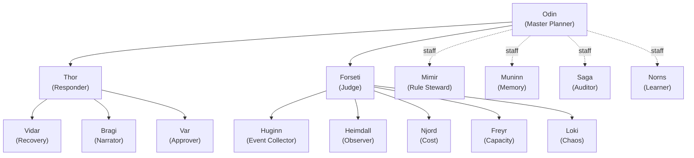
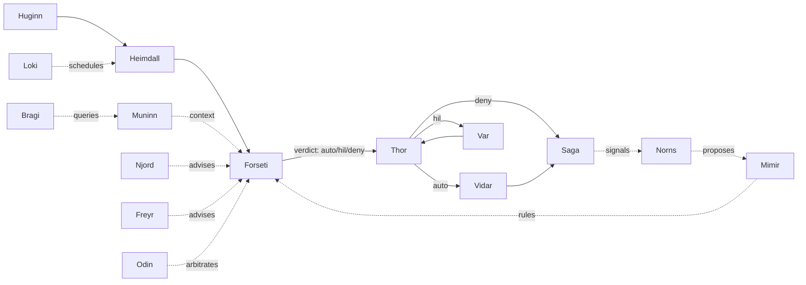

# 에이전트 판테온

FDAI의 고정된 15개 명명 에이전트 조직이 cloud-operations 런타임을 소유합니다. 에이전트는 schema-checked 이벤트로 관측, 판단, 계획, 승인, 실행, 검증, 복구, 감사, 학습합니다. 운영 온톨로지는 타입이 지정된 meaning과 범위가 제한된 맥락을 제공하며 행위자, 권한 또는 실행기가 아닙니다. 판테온은 업스트림에서 정의되고 포크는 에이전트를 추가하거나 이름을 바꾸지 않습니다.

> **범위:** 판테온은 고객-무관이다. 아래에 언급된 모든 에이전트 이름, 객체 타입, 액션 은 범용 이다. 고객별 바인딩은 포크 에서 관리 ([generic-scope.instructions.md](../../../.github/instructions/generic-scope.instructions.md)).
>
> **구현 초점:** Azure 가 유일한 구현 타깃이다; 판테온은 [app-shape.instructions.md](../../../.github/instructions/app-shape.instructions.md)
> 에 이미 선언된 Kafka wire (Event Hubs `:9093`) 를 사용한다
> ([구현 Focus](../../../.github/copilot-instructions.md#implementation-focus-must)).

이 문서의 소비자:

- 이벤트 기반 코어는 §4 와 §6 의 에이전트 / 토픽 소유권 테이블을 읽고 스키마로 검증한 pub/sub 를 wire 한다.
- 오퍼레이터 콘솔 ([operator-console.md](../interfaces/operator-console-ko.md)) 은 §6.3 과
  §6.5 를 읽고 자연어 질문을 per-user 맥락 로 기본 에이전트 에 라우팅한다.
- 룰-카탈로그와 실행기 ([action-ontology.md](../decisioning/action-ontology-ko.md),
  [execution-model.md](../decisioning/execution-model-ko.md)) 는 §7 을 읽고 각 ActionType 을
  initiator / 판정자 / 승인자 / 실행기 / auditor 에 바인딩한다.
- 포크는 §10 을 읽고 어느 경계 이 열려 있고 (토픽 구독, 구성
  재정의) 어느 것이 잠겨 있는지 (에이전트 추가 금지, 이름 변경 금지) 확인한다.

## 구현 상태

### 구현 범위
| 영역 | 상태 | 근거 | 참고 |
|------|------|------|------|
| 고정 레지스트리, 역할 및 패키지 경계 | implemented | [`pantheon.py`](../../../services/core-control-plane/src/fdai/agents/_framework/pantheon.py), [`test_framework_layout.py`](../../../services/core-control-plane/tests/agents/test_framework_layout.py), [`test_pantheon_doc_parity.py`](../../../services/core-control-plane/tests/agents/test_pantheon_doc_parity.py) | 고정된 15개 이름, 카탈로그 계층, 소유권 및 공개 패키지 경계를 기계적으로 검사합니다. |
| 타입이 지정된 pub/sub 소유권 및 동시 실행 런타임 | implemented | [`topics.py`](../../../services/core-control-plane/src/fdai/agents/_framework/topics.py), [`runtime.py`](../../../services/core-control-plane/src/fdai/agents/_framework/runtime.py), [`runtime_subscriptions.py`](../../../services/core-control-plane/src/fdai/agents/_framework/runtime_subscriptions.py), [`test_topics.py`](../../../services/core-control-plane/tests/agents/test_topics.py), [`test_pantheon_concurrency_proof.py`](../../../services/core-control-plane/tests/agents/test_pantheon_concurrency_proof.py) | 집중 검사는 토픽 소유권, 파티셔닝, 15개 소비자 신원 및 작업을 가로채지 않는 팬아웃을 다룹니다. |
| Mimir Rule 세대 책임 | implemented | [`mimir.py`](../../../services/core-control-plane/src/fdai/agents/mimir.py), [`runtime.py`](../../../services/core-control-plane/src/fdai/agents/_framework/runtime.py), [`runtime_subscriptions.py`](../../../services/core-control-plane/src/fdai/agents/_framework/runtime_subscriptions.py), [`test_wave2_governance.py`](../../../services/core-control-plane/tests/agents/test_wave2_governance.py), [`test_runtime.py`](../../../services/core-control-plane/tests/agents/test_runtime.py) | Mimir만 활성화 명령과 최종 결과를 수신합니다. Exact 활성화를 주입된 binder에 위임하고 인덱스, 정책, 승인, 변경 또는 실행 권한 없이 변환 전용 증적을 저장합니다. |
| Rule 세대 빌드, 검증 및 활성화 체인 | implemented | `mimir.py`; `heimdall.py`; `runtime.py`; `runtime/rule_generation_documents.py`; 집중 worker, 런타임, 활성화 및 bootstrap 검사 | 운영 시작 시 엄격하게 검증한 승격 표면 문서를 고정하고 replay가 동일한 reconciliation 요청을 영속화한 뒤 Mimir와 Heimdall을 통해 전달합니다. Mimir는 정책 또는 실행 권한을 얻지 않고 활성화 명령을 발행하기 전에 정확한 독립 증적을 연결합니다. 통제된 실제 근거는 남아 있습니다. |
| 판단, 승인, 실행, 감사 및 복구 분리 | implemented | [`test_runtime_chain.py`](../../../services/core-control-plane/tests/agents/test_runtime_chain.py), [`test_thor_durable.py`](../../../services/core-control-plane/tests/agents/test_thor_durable.py) | 합성 검사는 분리된 권한, 영속 `ActionRun` 동작 및 exact optional kinetic-proposal 보존을 실행하지만 실제 운영 결과를 증명하지는 않습니다. |
| 대화 및 인계 메커니즘 | implemented | [`test_conversational_port.py`](../../../services/core-control-plane/tests/agents/test_conversational_port.py), [`test_wave7_workflows.py`](../../../services/core-control-plane/tests/agents/test_wave7_workflows.py) | 범위가 제한된 읽기 전용 대화 경로와 shadow 작업 흐름 추적을 집중 검사에서 실행할 수 있습니다. |
| KPI 근거 상태, 승격 검사 및 성능 저하 훈련 | implemented | [`test_wave8_kpi_degradation.py`](../../../services/core-control-plane/tests/agents/test_wave8_kpi_degradation.py) | KPI 근거가 없거나 측정되지 않으면 승격을 차단하고, 주입된 장애로 선언된 성능 저하 동작을 실행합니다. |
| 실제 운영 KPI 검증 및 enforce 승격 | not-started | [목표와 메트릭](../architecture/goals-and-metrics-ko.md) | 보존된 실제 shadow 코호트, 운영 KPI 증적 집합, 독립적인 승격 검토 또는 실제 판테온 enforce 승격 근거가 아직 없습니다. |

### 구현 이력
| 날짜 | 상태 | 변경 | 근거 | 남은 작업 |
|------|------|------|------|-----------|
| 2026-08-13 | in-progress | 이전 제공 이력을 재구성하지 않고 근거 범위를 명시한 구현 원장을 도입했습니다. | 현재 변경 | 검증 완료 또는 enforce 사용을 주장하기 전에 실제 운영 근거를 수집하고 독립적으로 검토된 승격을 완료합니다. |
| 2026-08-13 | implemented | Mimir의 권한을 넓히지 않고 검증된 Rule 세대 명령 유입과 최종 결과 책임을 Mimir에 연결했습니다. | `current change`, 집중 Mimir, 런타임, bootstrap, 활성화 및 발행 검사 32개 통과 | 운영 검증을 주장하기 전에 통제된 실제 활성화 결과 증적을 보존합니다. |
| 2026-08-13 | implemented | 토픽, 소유권 또는 권한을 변경하지 않고 런타임 모듈의 프레임워크 레이아웃 경계를 복구하도록 비공개 Rule 세대 구독 연결을 추출했습니다. | [`runtime_subscriptions.py`](../../../services/core-control-plane/src/fdai/agents/_framework/runtime_subscriptions.py), 프레임워크 레이아웃, 런타임 및 판테온 동등성 검사 통과 | 구현 범위에서 요구하는 동일한 통제된 실제 근거를 보존합니다. |
| 2026-08-13 | in-progress | 활성화 전 빌드 체인을 Mimir에 할당하고 독립 세대 검증을 Heimdall에 할당했으며 두 agent 모두에 활성화 또는 실행 권한을 부여하지 않았습니다. | `current change`; 집중 소유권, handler, 동등성 및 런타임 연결 검사 221개와 exact chain 및 위조/미연결 검사가 통과했습니다. | 운영 카탈로그 reconciliation trigger와 Mimir 소유의 활성화 명령 발행을 추가합니다. |
| 2026-08-13 | implemented | 권한 있는 임베딩 식별자, 엄격한 시작 문서 스냅샷, replay가 동일한 reconciliation 요청, 정확한 준비 상태 증적 연결 및 Heimdall 검증 뒤의 Mimir 소유 활성화 명령 발행으로 운영 Rule 세대 체인을 완료했습니다. | `current change`; `rule_generation_documents.py`, `mimir.py`, `activation.py`, 의미 인덱스 어댑터 및 집중 worker, 런타임, 활성화, bootstrap 검사 | 운영 검증을 주장하기 전에 통제된 실제 빌드, 검증, 활성화 및 변환 결과 증적을 보존합니다. |
| 2026-08-14 | implemented | Topic 또는 action authority를 바꾸지 않고 Thor가 optional argument-bound kinetic proposal을 검증하고 durable하게 보존하도록 했습니다. | `current change`, focused contract, Thor, durable replay, layout 및 role 검사 | End-to-end kinetic handoff를 주장하기 전에 Forseti producer와 Core pre-dispatch consumer를 연결합니다. |

### 남은 작업

- [ ] 하나의 고정된 리비전에서 에이전트별 및 시스템 KPI, 표본 수, 신뢰 구간, 보호 메트릭과 권위 있는 결과 증적을 측정한 실제 shadow 코호트를 보존합니다.
- [ ] 에이전트 권한을 넓히지 않고 주입된 장애만이 아닌 운영 의존성에 대해 선언된 성능 저하 동작을 입증합니다.
- [ ] 기존 Verdict 및 ActionRun topic을 통해 argument-bound kinetic proposal producer와 pre-dispatch consumer를 연결한 뒤 governed live evidence를 보존합니다.
- [x] 운영 trigger, 정확한 Heimdall 증적 연결 및 Mimir 소유 활성화 발행으로 Rule 세대
  체인을 완료했으며, 집중 검사는 권한 추가 없이 `activated` 결과에 도달합니다.
- [ ] 적격 기능마다 독립적인 승격 검토를 완료하고, enforce 운영을 보고하기 전에 권위 있는 승격 증적을 보존합니다.

## 1. 설계 원칙

판테온은 기존 FDAI 컨트롤 루프를 명명된 조직 역할로 얇게 재구성한 것이다.
[architecture.instructions.md](../../../.github/instructions/architecture.instructions.md)
의 안전 봉투는 바꾸지 않고, 역할을 legible + auditable 하게 만든다.

- **Deterministic-first, LLM-capable.** 모든 에이전트는 자기 bindings 로
  LLM 을 호출할 수 있지만, 런타임 hot-path 는 거의 모두 T0 (룰 / 테이블
  조회) 또는 T1 (유사도) 로 라우팅된다. LLM 호출은 좁고 선언된
  용도로만 예약된다 (§8). LLM 사용은 기능 이지 기본값 가 아니다.
- **Agent-driven, ontology-constrained.** 모든 상태 전이는 에이전트가 소유합니다. 온톨로지는
  대상 신원, 관계, 근거 최신성, 허용 액션, 예상 효과를 검증하지만 그래프
  결과는 판단, 승인, 실행 또는 권한 상승을 수행하지 않습니다.
- **Closed-loop 연산.** 수락된 신호는 observe, understand, decide, 계획, authorize,
  execute, verify, recover, learn 전 과정에서 accountable 소유자를 가집니다. 브로커 acceptance나
  API 성공은 운영 결과가 아니며 독립적인 관측이 루프를 종료합니다.
- **자율성 before 에스컬레이션.** 근거가 부족하면 사람에게 넘기기 전에 범위가 제한된 reacquisition,
  alternate-source 검사, 결정론적 reevaluation, 더 작은 safe 계획, no-op 또는 롤백을
  수행합니다. Var는 잔여 모호함, policy-mandated 승인 또는 standing 권한 밖의
  risk에만 사람 검토를 요청합니다.
- **Two-port 모델.** 모든 에이전트는 권한이 있는 머신 트래픽용 타입이 지정된 pub/sub와
  운영자 및 제한된 peer 숙의용 읽기 전용 conversational 표현 포트를 제공합니다 (§6).
- **Single-writer, multi-reader topics.** 각 객체 타입 은 정확히 하나의
  소유자 에이전트 만 publish 하고, 누구나 구독 할 수 있다 (§6.1).
- **판사는 실행기 가 아니다.** Forseti 는 판정 를 발행하고, Thor 는
  판정 를 전달 하며, Var 는 사람 승인을 담당한다. 어떤 에이전트도
  판단과 실행을 함께 하지 않는다.
- **판테온은 업스트림 에서 고정.** 15개 에이전트 세트, 조직도, 역할 배정은
  잠겨 있다. 포크는 구성 경계 (§10) 을 통해 동작을 커스터마이즈한다 -
  에이전트를 추가 / 제거 / 이름 변경 하지 않는다.
- **저장소 구조가 경계를 보존.** 명명 에이전트는
  [`services/core-control-plane/src/fdai/agents/`](../../../services/core-control-plane/src/fdai/agents)에 있고 공통 런타임 machinery는 비공개
  `_framework`에 둡니다. 외부 호출자는 `fdai.agents`만 가져오기하며 배치 테스트가 이를 강제합니다.
## 2. 조직도

Odin 에 두 라인이 보고한다: Thor (operations) 와 Forseti (judgment). 4개의
거버넌스 staff 가 staff 라인 (점선) 으로 Odin 에 보고하며, operations 라인과
독립적이다. 도메인 전문가 와 sensing 에이전트는 Forseti 아래에 위치해
데이터가 실행이 아니라 판단으로 흐르도록 한다.


```mermaid
graph TD
    Odin["Odin<br/>(Master Planner)"]

    Odin --> Thor["Thor<br/>(Responder)"]
    Odin --> Forseti["Forseti<br/>(Judge)"]
    Odin -. staff .-> Mimir["Mimir<br/>(Rule Steward)"]
    Odin -. staff .-> Muninn["Muninn<br/>(Memory)"]
    Odin -. staff .-> Saga["Saga<br/>(Auditor)"]
    Odin -. staff .-> Norns["Norns<br/>(Learner)"]

    Thor --> Vidar["Vidar<br/>(Recovery)"]
    Thor --> Bragi["Bragi<br/>(Narrator)"]
    Thor --> Var["Var<br/>(Approver)"]

    Forseti --> Huginn["Huginn<br/>(Event Collector)"]
    Forseti --> Heimdall["Heimdall<br/>(Observer)"]
    Forseti --> Njord["Njord<br/>(Cost)"]
    Forseti --> Freyr["Freyr<br/>(Capacity)"]
    Forseti --> Loki["Loki<br/>(Chaos)"]
```

## 3. 런타임 관계도

조직도는 보고 라인이고 관계도는 데이터 흐름입니다. Sensing과 전문가는 Forseti에 신호를
전달합니다. Action verdict는 Thor가 Vidar, Var 또는 실행으로 전달하며 Thor는 document-ingestion
verdict를 무시합니다. Var와 Saga는 document HIL의 stable idempotency를 보존하고 Saga는 gated 및
terminal audit을 영속화합니다. Workflow request는 Huginn, Forseti, Thor를 통해 bounded
`workflow_action` lineage를 보존합니다. Optional argument-bound kinetic proposal도 strict validation
뒤 같은 Verdict-to-ActionRun path를 따릅니다. 둘 다 attribution 및 evidence 전용이며 quorum, mode,
judgment, approval 또는 execution authority를 바꾸지 않습니다.
Norns는 Mimir에 제안하고 Odin은 판단 전에 충돌을 조정합니다.


```mermaid
graph LR
    Huginn["Huginn"] --> Heimdall["Heimdall"]
    Heimdall --> Forseti["Forseti"]
    Mimir["Mimir"] -. rules .-> Forseti
    Muninn["Muninn"] -. context .-> Forseti
    Njord["Njord"] -. advises .-> Forseti
    Freyr["Freyr"] -. advises .-> Forseti
    Loki["Loki"] -. schedules .-> Heimdall
    Forseti -->|verdict: auto/hil/deny| Thor["Thor"]
    Thor -->|auto| Vidar["Vidar"]
    Thor -->|hil| Var["Var"]
    Var --> Thor
    Thor -->|deny| Saga["Saga"]
    Vidar --> Saga
    Bragi["Bragi"] -. queries .-> Muninn
    Odin["Odin"] -. arbitrates .-> Forseti
    Saga -. signals .-> Norns["Norns"]
    Norns -. proposes .-> Mimir
```

### 3.1 다목적 중재 (multi-objective 중재)

**헌법 적격성을 먼저 확인합니다.** Forseti는 중재 요청을 소유하고 Odin은 헌법 제약을
통과한 soft-objective tradeoff만 순위합니다. 정규화, precedence, weighted 채점, 사람 승인
margin, 계획 수립 증적 및 temporal 정책은
[Operational 계획 수립](../decisioning/operational-planning-ko.md#다목적-중재)이 소유합니다.

### 3.2 발견 루프 학습기 (Norns)

Norns는 inert `RuleCandidate` 제안의 sole 쓰기 담당으로 유지됩니다. Three-perspective 합의, balanced 집단 한도, pending 큐, Mimir 검토 및 카탈로그 activation 경계는
[Operational Learning 온톨로지](../rules-and-detection/operational-learning-ontology-ko.md#norns-consensus-및-catalog-boundary)가 소유합니다. 비공개 `norns_deployment_learning.py` 보조 로직은 범위가 제한된 scenario-gap 및 preflight-blocker 집계 상태만 보유합니다. 모든 후보 생성과 publish는 계속 Norns가 합의 및 rate-limit 경계를 통해 수행합니다. Caller-supplied recurring preflight 수동 차단 요인은 scope-deduplicate된 inert `preflight-toggle-gap` 후보가 되며 토글을 만들거나 배포 권한을 변경하지 않습니다. 재현된 Rule 수집 실패는 Huginn-owned 이벤트로 들어옵니다. Heimdall은 exact 실패를 독립적으로 validate하고 `object.retrieval-validation`을 publish하며, Saga는 해당 근거를 감사하고 Muninn은 `object.context-index`로 materialize합니다. Norns는 raw 텍스트, 검증되지 않은 실패, 수집 외 원인 및 exact Rule 버전이 없는 대상을 strict하게 거부합니다. 남은 challenger를 영속하게 기록한 뒤 동일한 합의 및 `object.rule-candidate` 경로를 사용합니다. 영속 싱크가 없으면 이벤트를 폐기하지 않고 backpressure합니다.
## 4. 에이전트 카탈로그
> **머신 판독용 원본 (single 정본)**: `PANTHEON_SPECS`
> ([`services/core-control-plane/src/fdai/agents/_framework/pantheon.py`](../../../services/core-control-plane/src/fdai/agents/_framework/pantheon.py)).
> 아래 표는 그 `AgentSpec` 항목들을 사람이 읽기 좋게 재구성한 것이다.
> 표와 코드가 다르면 **코드가 이긴다**.
> [`services/core-control-plane/tests/agents/test_pantheon_doc_parity.py`](../../../services/core-control-plane/tests/agents/test_pantheon_doc_parity.py)
> 는 영어/한국어 문서의 15개 이름, 카탈로그 계층, 소유권을 `PANTHEON_SPECS`와
> exact 비교하여 CI에서 표류를 감지합니다.
> 소유 객체 타입은 canonical machine token이므로 두 언어 표에서 번역하지 않습니다.

계층: `1` = 도메인 전문가, `2` = 파이프라인 (sensing / judgment /
operations / 인터페이스), `3` = 거버넌스 staff.

| 이름 | 역할 | 계층 | 소유 객체 types | 주요 동작 | Hot-path LLM? |
|------|------|-------|-------------------|-------------------|---------------|
| Odin | Master 플래너 | 3 | ArbitrationDecision | arbitrate_domain_conflict | no |
| Thor | 응답자 | 2 | ActionRun, ActionAttempt | (전달 만; 직접 소유 없음 - §7.1) | no |
| Forseti | Judge | 2 | Verdict, RCA, SecurityEvent, ArbitrationRequest | 판정 생성; 선택적 맥락은 자율성을 낮출 수만 있음; 실행기 역할 없음 | yes (T2 abstain 시만) |
| Huginn | Event Collector / 실시간 Resource 발견 | 2 | Event, Change | ingest_event, normalize_change | no |
| Heimdall | Observer | 2 | Anomaly, Drift, Forecast, ForecastOutcome, RetrievalValidation | detect_anomaly, detect_drift, 예측, close_forecast_outcome, validate_retrieval_failure, validate_rule_generation, notify_admin_privilege_violation | no |
| Vidar | 복구 | 2 | Rollback | perform_rollback, dr_failover | no |
| Var | Approver | 2 | Approval | approve_action, reject_action | no |
| Bragi | Narrator | 2 | Conversation, Turn, UserPreference, HandoffEscalation, PostTurnReview | translate_intent | yes (translator 만) |
| Saga | Auditor | 3 | AuditEntry, Issue | append_audit (누락 추적 정규화), escalate_to_github_issue | no |
| Mimir | Rule 담당자 | 3 | Rule, Policy, RuleGenerationBuildRequest, RuleGenerationBuildResult | promote_rule, revoke_rule, build_rule_generation | no |
| Muninn | Memory | 3 | StateSnapshot, ContextIndex | index_state, snapshot_state, seal_case_history | no |
| Norns | Learner | 3 | RuleCandidate, PatternObservation | propose_rule_candidate, analyze_case_history, close_issue | yes (off-path 배치 만) |
| Njord | 비용 | 1 | CostAnomaly, Budget | propose_cost_action | no |
| Freyr | 용량 | 1 | CapacityForecast, SizingRecommendation | propose_capacity_action | no |
| Loki | Chaos | 1 | ChaosExperiment, ResilienceScore | schedule_experiment | no |

Heimdall은 결정론적 예측 에피소드 평가와 종결의 accountable 소유자이며 비공개 `heimdall_forecast.py` 보조 로직이 해당 계산을 소유합니다. Repeated-event detector는 권위 있는 anomaly를 발행한 뒤 선택적
`incident_candidate_hook`을 호출할 수 있습니다. 이 훅은 정규화된 리소스,
이벤트 타입, 상관관계, worst 심각도, 사유 코드, 모든 burst 근거 키를 조립 소유
`IncidentLifecycleWorkflow`에 전달합니다. Heimdall은 인시던트를 직접 쓰거나 새
임계값 anomaly를 publish하기 전에 Heimdall은 주입된 범위가 제한된 읽기 전용
`operational_evidence_hook`을 호출할 수 있습니다. 이 훅은 hold-only Kubernetes 용량
발견 사항 같은 프로바이더 근거를 첨부할 수 있지만 판단, 승인 또는 실행하지 않습니다. 프로바이더
실패는 구조화된 사용 불가 근거로 첨부되며 권위 있는 anomaly를 억제하지 않습니다.
Heimdall은 인시던트를 직접 쓰거나 새
객체 타입을 publish하지 않습니다. 한 에피소드의 반복 Event는 worst 심각도 anomaly 하나를 형성합니다.
Global/리소스 상한은 cross-resource 제거를 방지합니다.
Routine 하트비트, healthy 탐색, within-threshold 관측은 발견 사항이나 인시던트를
생성하지 않습니다.
명시적 `incident_correlation=correlate`, 상관관계와 근거, 활성 auto-open 및 충분한 심각도를
갖춘 후보만 작업 흐름에 도달하며 나머지는 anomaly로 남습니다. 작업 흐름은 근거를 다시 확인한
후 `IncidentRegistry`에 audited 기록을 씁니다. 훅 실패는 구간을 유지하고 accepted와 held는 별도로 기록합니다.
운영 control-plane 조립은 영속 레지스트리를 먼저 rehydrate하고
pantheon이 활성화된일 때 이 훅을 연결합니다. Operator API는 Heimdall을 impersonate하지
않습니다.

Huginn은 실시간 리소스 발견과 정규화된 `Change` 기록의 논리적 소유자입니다. Azure 리소스 생성,
갱신, 삭제 신호는 정본 Event Hubs Kafka 유입으로 들어오며 Huginn이 이를
정규화하고 dedup 및 correlate한 뒤 `Event`로 publish합니다. Azure 전용 파싱,
권위 있는 이벤트 시간이 있는 IaC 계획, release 요청, 프로바이더 활동은
`object.change`도 생성하며 Muninn은 결정 맥락을 위해 변경할 수 없는 내용 기반 주소를 가진
개정 번호를 보존합니다. Huginn은 동일한 정규화된 변경 근거를 causal `object.event`에도
포함하므로 Forseti는 cross-topic 도착 순서에 의존하지 않습니다. Forseti는 ordinary 룰 judgment
전에 planned 변경을 범위가 제한된 영향 analysis로 평가하고 평가를 Verdict와 DecisionCase
근거에 보존합니다. 평가가 없거나 stale, 실패한, review-required이면 사람 승인을
요구합니다. 관찰된 변경은 맥락로만 유지되며 현재 런타임에는 planned 변경을 auto-clear할 graph-freshness 권한이 없습니다. Operational-context 최신성 항목에는 명시적인 문자열 출처,
시각, 정수 최대 age가 필요합니다. Boolean age를 포함한 malformed 값은 실패 시 차단되어 판정을 사람 승인으로 낮춥니다. Ordinary 판정과 중재 DecisionCase는 같은 타입이 지정된 최신성
근거에서 materialize되므로 cross-domain 중재는 맥락 상한이 제거한 권한을 복구할 수 없습니다. 이 변환 결과는 액션 권한을 제공하지 않습니다. Azure 전용 파싱,
지점 enrichment, 영속 인벤토리 변환 결과는 주입된 전달 책임으로 유지합니다. Huginn은 Azure SDK를 가져오기하거나 인벤토리 데이터베이스를 직접 쓰지 않습니다. Scheduled
인벤토리 sync 작업은 누락된 신호를 완전한 ARG/ARM 스냅샷으로 복구하는 주기적
조정 backstop입니다. Stale/degraded 인벤토리는 사용 불가이며 Heimdall은 발견 사항만
publish하고 리소스를 acquire하거나 조정을 시작하지 않습니다.

15개 에이전트는 조합을 통해 SRE, ARB (변경 안전성), FinOps 워크플로우를
공동으로 커버한다. 토픽 계약은 §6, 처리 불가 요청(인계)이 동일 파이프라인에
편입되는 방식은 §6.4와 §7.6을 참고한다.

### 4.1 Per-agent 작업 인벤토리

모든 에이전트는 4개 작업 카테고리를 수행. **R**ecurring 은 스케줄 실행.
**E**vent 는 typed-port 메시지 처리. **M**eta 는 에이전트 자기 상태 와
self-improvement. **X**-agent 는 [agent-workflows.md](agent-workflows-ko.md)
에 명명된 워크플로우에 참여.

| 에이전트 | R (recurring) | E (이벤트) | M (meta) | X-agent |
|-------|---------------|-----------|----------|---------|
| Odin | 주간 portfolio 리뷰, priority-policy 튜닝 | Forseti 신호 에 arbitrate_domain_conflict | portfolio 결과 점수 self-audit | 7 (에이전트 상태), 2 (Predictive 규모) tie-break |
| Thor | execution-path 상태 검사, retry-strategy 캐시 예열 | 판정 전달, 롤백 트리거, rate-limit 강제 | high-risk 액션 pre-flight 시뮬레이션 | 1 (Cost-aware 교정), 2 (Predictive 규모), 11 (준비 상태), 12 (Scheduled Python) |
| Forseti | rule-cache 리프레시, retrospective what-if 배치, 판정 coherence self-test | 이벤트 판단 (T0/T1/T2), domain_conflict 발행, SecurityEvent 발행 | novelty 표류 감지 (T0 vs T2 mix) | 1, 2, 5 (Security 에스컬레이션), 8 (Judgment coherence), 11, 12 |
| Huginn | 출처 상태 검사, 발견 커서/backpressure 검사, dedup 구간 유지 | Event 및 정규화된 변경 정규화 + dedup + correlate + publish | 적응형 스키마 학습 (T1 clustering, off-path) | 모든 워크플로우에 피드 |
| Heimdall | anomaly 기준선 업데이트, 예측 리프레시, 발견 최신성/커버리지 탐색, T2 제안자 상태 증적 reduction, external-actor 리스트 리프레시, agent-health 탐색 | anomaly detect, 표류 detect, 최종 제안자 exhaustion correlate, 발견 성능 저하 correlate, SecurityEvent correlate, notify_admin | multi-signal 다신호 상관 | 1, 2, 3 (DR 훈련), 5, 7 (에이전트 상태), 9 (Rollback 예행 연습) |
| Vidar | rollback-path 검증, DR 준비 상태 점수, recovery-time SLI | perform_rollback, dr_failover | 롤백 예행 연습 (shadow) | 3, 9 |
| Var | 승인 SLA 모니터, 승인자 가용성 tracking | HIL 카드 제시, 정족수 강제, 시간 초과 / 에스컬레이션 | 승인 출처 이력 기록 | 4 (재정의 -> 발견), 5, 11, 12 |
| Bragi | 만료 세션 정리, UserPreference 인덱스 리프레시 | NL 라우팅, multi-agent 집계, NL 렌더링 | 의도 classifier 재학습 (T1, off-path) | 7, 10 (Retrospective what-if), 12 |
| Saga | audit-chain 무결성 self-check, issue-close 검사, 지문 인덱스 compaction | 덧붙이기 AuditEntry, escalate_to_github_issue, 재생 for reconstruction | 감사 체인 tamper 감지 | 모든 워크플로우 (감사) |
| Mimir | rule-source 폴링, 회귀 모음, deprecation cycle | 룰 promote / 철회, cache-invalidation broadcast | freshness-score, stale-rule 감지 | 4, 6 (인계 -> 기능), 8, 11 |
| Muninn | 스냅샷 교대, RAG 인덱스 재구축, 캐시 제거, case-history 보존 | Forseti 를 위한 맥락 fetch, 변경할 수 없는 변경 개정 번호 저장, Bragi 를 위한 상태 조회, 보존 틱 적용 | trending-query pre-warm, 온톨로지 교차 검증 | 판단을 touch 하는 모든 워크플로우 지원 |
| Norns | 시간당 배치 감사 분석, 스트리밍 pattern 추출 | pattern 신호, RuleCandidate publish, close_issue 신호 | 모델 성능 표류 감지 | 4, 6, 8 (Judgment coherence), 10 |
| Njord | 비용 인제스트 (daily), 예산 모니터, 비용 forecasting | 범위가 제한된 비용 샘플 -> anomaly, 예산 breach 경보, cost-advisor 조회 | RI / SP 최적화 제안 | 1, 2 |
| Freyr | 사용률 샘플링, 용량 forecasting, sizing 분석 | 범위가 제한된 사용률 샘플 -> 예측, 규모 제안, 용량 advisor 조회 | 다차원 용량 (CPU + IOPS + net + mem) | 2, 3 |
| Loki | chaos-experiment 스케줄, resilience-score 리프레시 | 범위가 제한된 예약 트리거 -> 항상-HIL 실험 제안, blast-radius 계산 | adversarial 시나리오 생성 (T2, off-path) | 3, 9 |

### 4.2 Per-agent KPI (성공과 성능 저하 신호)

모든 에이전트는 측정 파이프라인
([goals-and-metrics.md](../architecture/goals-and-metrics-ko.md)) 에 이 메트릭 을 발행
해야 shadow -> 강제 적용 승격 게이트가 결정론적하게 평가할 수 있습니다. 런타임은
상태 스냅샷마다 모든 declared 메트릭을 보고합니다. 결과 근거가 충분하지
않은 메트릭은 `value: null`과 명시적 근거 상태를 사용하며 승격 게이트는
absence를 zero로 해석하지 않고 실패로 처리합니다.

| 에이전트 | 성공 KPI | 성능 저하 KPI (조기 경고) |
|-------|----------|----------------------------|
| Odin | cross-vertical 충돌 해결 시간, portfolio 목표 달성 | tie-break 재발률 |
| Thor | 실행 성공률, 실행 지연 p99 | 롤백 트리거 율, race 실패 |
| Forseti | post-hoc 재정의 대비 판정 정확도, T2 에스컬레이션 비율 (목표 < 10%) | mixed-model 불일치율, grounding 누락률 |
| Huginn | 이벤트 처리 지연 p99, 발견 전달 지연 p99, dedup 정확도 | 스키마 매칭 실패율, 발견 커서 lag |
| Heimdall | anomaly 정밀도 + 재현율, 예측 MAPE, 발견 커버리지 감지, T2 제안자 복구 감지 | false-positive 비율, missed critical, stale 인벤토리 감지 지연, 제안자 exhaustion-to-HIL 지연 |
| Vidar | 롤백 성공률, MTTR | rollback-path 검증 실패 |
| Var | HIL SLA 준수율, 정족수 준수 | 만료율, 반복 에스컬레이션 |
| Bragi | 라우팅 정확도 (post-audit), 세션 만족도 | 인계 비율 (목표 < 5%) |
| Saga | 감사 체인 무결성, 재생 성공 | audit-gap 감지 |
| Mimir | 룰 최신성 점수, 승격 통과 비율 | shadow-fail 율, stale-rule 비율 |
| Muninn | 맥락 fetch p99, 캐시 적중 비율 | cache-miss 재계산 시간 |
| Norns | 룰 후보 채택률, pattern 유효성 | false-pattern 비율 |
| Njord | 비용 예측 MAPE, saving 실현 | budget-breach 미검출 |
| Freyr | 용량 예측 오차, over / under 프로비저닝 | 규모 race, 제한 이벤트 |
| Loki | 실험 blast-radius 준수, 복원력 향상 델타 | unplanned side-effect, 실험 실패 |

**시스템 수준 KPI** (Odin portfolio 리포트):

- **자율성 ratio** - auto vs HIL vs 거부 분포 (목표: auto 상승, 거부
  감소).
- **인계 conversion 비율** - issue -> RuleCandidate -> promoted.
- **Cross-vertical 액션 ratio** - single vs multi-vertical 액션.
- **발견 velocity** - 새 룰 / 기능 승격 속도 (weekly).

### 4.3 Per-agent 성능 저하 정책

에이전트 자체가 실패하거나 저하될 때 선언된 안전 동작. Anti-pattern §11 은
이것들을 nothing 으로 collapse 하는 것을 금지.

| 실패한 에이전트 | 영향 | 안전 성능 저하 |
|---------------|------|-----------------|
| **Saga** | 감사 불가 | **HARD FAIL**: 새 변경 허용 안 됨; 전체 시스템 shadow 로 강등 |
| **Vidar** | 롤백 불가 | Thor 가 새 auto 실행 거부; 모든 새 액션 shadow 로 강등 |
| **Forseti** | 판단 정지 | Huginn / Heimdall 은 계속 publish (Kafka retain); 판정 대체 경로 없음 (판사 없이 판단 불가); 운영자 경보 |
| **Odin** | cross-vertical 중재 누락 | Forseti가 충돌 판정을 HIL로 낮춤 (사람이 arbitrate) |
| **Thor** | 실행 정지 | 판정 큐잉; 판정 TTL 만료 시 stale 폐기 (republish 시 재판단) |
| **Huginn** | 인제스트 정지 | Kafka 보존 이 이벤트 보존; Huginn 복구 시 체크포인트 부터 재개 (멱등적) |
| **Heimdall** | 감지/효과 관측 정지 | 읽기, 거부, shadow judgment는 계속; Heimdall 관측이 필요한 새 상태 변경은 차단되고 기존 결과는 pending, RBAC 거부는 감사 |
| **Var** | HIL 차단 | HIL 큐 보존; 시간 초과 자동 확장; admin 경보; 승인 없이 이미 A1/A2 조건을 충족한인 액션만 계속하며 HIL과 A3-E는 실행 불가 |
| **Bragi** | 대화 차단 | 운영자 는 콘솔 읽기 전용 화면 + 직접 감사 조회 로 대체 경로 |
| **Mimir** | 룰 업데이트 정지 | 캐시된 룰 계속; Forseti 가 stale-rule 경고; 새 룰 업데이트 지연 |
| **Muninn** | 맥락 불가 | 읽기, 거부, shadow judgment는 계속; context-dependent 상태 변경은 알 수 없음으로 차단하고 "맥락 사용 불가" 감사 |
| **Norns** | 학습 정지 | 즉시 영향 없음 (off-path); 장기 미가동 시 발견 velocity 저하 경고 |
| **Njord / Freyr / Loki** | 도메인 자문 누락 | Forseti 가 해당 도메인 액션 을 HIL 로 강등 |

공통 규칙:

- **Saga와 Vidar는 변경의 필수 의존성**입니다. 최종 소비자/상태 실패는 재시작 전까지 sticky shadow를 강제합니다. Noncritical 최종 소비자는 해당 에이전트만 degrade하고 형제는 계속 실행하며 상태는 false 하트비트 대신 exact 에이전트/토픽 상태를 기록합니다. Unified 동시성 테스트는 15개 소비자 신원과 same-topic non-stealing 동시 확산을 pin합니다.
- **판단자 / 실행자 / 감사자 triad 중 하나라도 누락** 시 새 변경 을
  shadow 로 강등.
- **Noncritical sensing 성능 저하**은 읽기, 거부, 큐 및 shadow 경로만 보존할 수 있습니다.
  Vidar는 변경 필수 의존성이고 Var는 HIL 및 A3-E 충족 여부를 별도로 통제합니다.
- 모든 성능 저하 은 Odin 의 portfolio 리포트에 surfacing (워크플로우 7).

### 4.4 작업 계층 분류 (per-task LLM 정책)

모든 "예측" 또는 "적응" 작업 가 LLM 을 필요로 하지는 않는다. 아래 테이블은
§4.1 의 모든 작업 를 계층 로 매핑해서 구현이 조용히 T2 로 승격하지 못하도록
한다.

| 작업 | 올바른 계층 | 이유 |
|------|-------------|------|
| Heimdall 예측 | T1 (ARIMA / smoothing) | 통계로 충분, 재현 가능 |
| Norns 스트리밍 pattern | T1 (clustering) | 실제 운영 신호 은 결정론적 순위 필요 |
| Norns 배치 요약 | T2 (off-path only) | 주간 리포트에 LLM OK, hot-path 절대 안 됨 |
| Bragi 의도 classify | T0 키워드 + T1 임베딩 후 인계 | hot-path 대화는 T2로 추측하지 않음 |
| Mimir 룰 초안 | T2 (off-path, human-reviewed) | novel 룰 은 LLM OK; sign-off 는 사람 |
| Forseti 판정 coherence | T0 (SQL) + T1 (임베딩) | 과거 판정 는 구조화된 감사 로그 |
| Var assisted 결정 | T0 (링크 유사 사례) + T2 (요약, off-path) | 카드는 요약 carry; 사람이 결정 |
| Huginn 스키마 학습 | T1 (배치 clustering) + T2 for 승격 | 실시간 정규화는 T0 유지 |
| Loki adversarial | T2 (off-path) | 시나리오 생성 LLM OK; 실행은 결정론적 |

Hot-path LLM 호출은 세 곳에 제한됨: Bragi translator, Forseti T2 abstain,
Norns off-path 배치. 다른 hot 경로 에 LLM 추가 구현은 defect.

## 5. 온톨로지 통합

`Agent` 는 온톨로지의 일급 객체 타입 이다. 다른 객체 타입 과 함께
`/ontology/graph` 에 노출되어 조직도와 데이터 소유권이 문서와 별개로
queryable 하다.

```yaml
object_type: Agent
properties:
  name: string                     # "Odin", "Thor", ...
  layer: enum                      # domain | pipeline | governance
  reports_to: Agent?               # 조직도 edge
  owns: [ObjectType]               # write 권한 (single-writer)
  executes: [ActionType]           # action-ontology.md 참조
  initiates: [ActionType]          # propose 가능 (§7.1)
  subscribes: [Topic]              # typed-port 구독
  publishes: [Topic]               # typed-port 발행
  question_domains: [string]       # NL query 카테고리 (§6.3)
  owns_code_paths: [glob]          # self-introspection 용 RAG 범위 (§8)
  llm_bindings: [ModelId]          # 이 에이전트가 호출 가능한 모델
  rate_limits:
    proposals_per_minute: int
    proposals_per_hour: int
```

더 넓은 온톨로지의 모든 `object_type` 선언은 정확히 하나의 `Agent` 를
가리키는 `owner_agent` 필드를 얻는다. 생산자 principal 은 스키마 레지스트리
가 검증한다: 소유자 만 publish 가능하다.

## 6. 통신 계약

판테온은 Event Hubs `:9093`의 Kafka 또는 프로세스 내 로컬 어댑터인 기존 `EventBus` wire를 사용합니다. Heimdall은 한 준비 상태 통과의 6개 dimension이 모두 도착한 뒤 표류를 게시하며 Muninn은 엄격히 더 새로운 스냅샷만 수락합니다.
최선 노력 `AgentHandlerObserver`는 전달, judgment, 실행을 변경하지 않고 핸들러 수명 주기를 보고합니다. 로컬 조립은 SSE로, deployed 조립은 shared 단계 토픽으로 게시해 Operator API가 중계합니다.

### 6.1 타입이 지정된 포트

객체 타입마다 `object.<type>` 토픽 하나를 사용합니다. 모든 메시지는 `correlation_id`, `idempotency_key`, `producer_principal`을 carry하며 Thor는 `correlation_id:state`로 retry-safe 전이를 유지합니다.
버스는 인증된 `producer_principal`과 정수 `envelope_schema_version`을 기록하고 페이로드의 `schema_version`은 보존합니다. 변경은 비어 있지 않은 `correlation_id`, `resource_id`, `idempotency_key`가 필요합니다.
Owned-topic 생산자 검사는 끌 수 없고 알 수 없는 `object.*` 구독은 등록에 실패합니다. Ordered 변경 소비자는 poison 기록을 보관한 뒤 중지해 후속 변경의 추월을 막습니다.
Dead-letter 쓰기는 제한된 재시도 대기 후 소비자를 재시작합니다. 오퍼레이터 redrive도 소유자, 묶음, 스키마를 다시 검사하고 실패하면 원본 페이로드만 다시 보관합니다.

| 토픽 | 발행기 | 기본 subscribers |
|-------|-----------|---------------------|
| 객체.이벤트 | Huginn | Heimdall, Muninn(보존 틱), Njord/Freyr/Loki(범위가 제한된 전문가 신호) |
| 객체.변경 | Huginn | Muninn (변경할 수 없는 변경 개정 번호) |
| 객체.anomaly, 객체.표류, 객체.예측 | Heimdall | Forseti; Muninn은 감지 준비도 표류만 읽음 |
| 객체.forecast-outcome | Heimdall | Saga, Muninn |
| 객체.retrieval-validation | Heimdall | Saga, Muninn, Mimir는 정확한 Rule 세대 근거만 읽음 |
| 객체.rule-generation-build-request, 객체.rule-generation-build-result | Mimir | Mimir는 빌드 요청을 소비하고 Heimdall은 범위가 제한된 빌드 결과를 소비함 |
| 객체.security-event | Forseti | Heimdall (상관관계), Saga |
| 객체.판정 | Forseti | Thor, Saga, Odin |
| 객체.arbitration-request | Forseti | Odin |
| 객체.arbitration-decision | Odin | Forseti |
| 객체.action-run | Thor | Vidar, Var, Saga |
| 객체.승인 | Var | Thor, Saga |
| 객체.롤백 | Vidar | Thor (ActionRun 변환 결과), Saga |
| 객체.audit-entry | Saga | Norns, Muninn (문서 인덱스 게이트), Var (문서 HIL) |
| 객체.issue | Saga | Norns, Mimir |
| 객체.rule-candidate | Norns | Mimir |
| 객체.룰 | Mimir | Forseti (캐시 reload), Saga (catalog-review 감사) |
| 객체.context-index, 객체.state-snapshot | Muninn | Norns (봉인된 case-history intake), Saga (스냅샷 감사) |
| 객체.대화 | Bragi | (세션 인덱스) |
| 객체.턴 | Bragi | Muninn |
| 객체.post-turn-review | Bragi | Norns(동의가 확인된 off-path 검토만) |
| 객체.user-preference | Bragi | Muninn |
| 객체.cost-anomaly | Njord | Forseti |
| 객체.capacity-forecast | Freyr | Forseti |
| 객체.chaos-experiment | Loki | Heimdall |
Partitioning:

- 변경 토픽 (`object.action-run`, `object.rollback`) 은 `resource_id`
  로 파티션 되어 같은 리소스에 대한 동시 쓰기 가 serialize.
- Judgment 와 감사 토픽 은 `correlation_id` 로 파티션 되어 단일
  인시던트 가 한 소비자 에 머묾.
### 6.2 Conversational 포트

Bragi를 포함한 15개 에이전트 모두 정본 이름 또는 도메인 라우팅으로 도달할 수 있습니다.
질문은 2,000자로 제한하고 세션마다 단조 증가 턴 100개를 보존합니다. 알 수 없음 A2A 요청자 또는 대상 이름은 거부합니다. 포트 간에는 상관관계 추적만 전달하며 기본 응답은 범위가 제한된 시간 초과와 기여자 답변과 같은 소유자, 크기, 민감도 정규화를 거칩니다.

각 `AgentSpec`은 고유하고 변경할 수 없으며 versioned된 `ConversationCharter`를 요구합니다. Charter는 role-specific prohibition이 있는 범위가 제한된 서버가 소유한 system instruction, reporting/소유권/토픽/액션 연결/모델 정책/hard-dependency/제안 예산을 정확히 생성한 역할 계약, 해당 에이전트 결정의 mechanics를 명시하는 역할 directive, 영어/한국어 조회 예시, 용도 및 owned-fact 범위가 있는 읽기 도구를 가집니다. 의미 동등성 테스트는 15개 역할 경계를 모두 pin합니다. 런타임은 호출자 정책을 덮어쓰고 각 도구를 고유한 사실 범위로 변환 결과하며 instruction을 노출하지 않고 버전과 별도의 프롬프트 및 full-charter SHA-256 다이제스트를 귀속합니다. 답변은 owned 상태에 근거하며 타입이 지정된 정책이 권위를 유지합니다. Charter 프롬프트는 프롬프트 전체가 아니라 조립의 바닥면입니다. 모든 턴은 그 기준선에 해당 턴이 선택한 situational 계층(peer 대 운영자 대상, 숙의 단계와 계층, 도구 범위, 운영자 로케일, 근거 공백, 명령 의도)를 더해 실제 프롬프트를 조립합니다. 조립은 가산적이고 결정론적하므로 situation은 charter를 조일 수는 있어도 느슨하게 만들 수 없고, 기록된 턴은 정확히 재생됩니다. Turn 맥락은 계층을 선택만 하고 프롬프트 텍스트를 공급하지 않으므로 위조된 맥락이 instruction을 주입할 수 없습니다. 응답은 계층 매니페스트, situation 키, 조립된 프롬프트 다이제스트를 전달하며 텍스트 자체는 전달하지 않습니다. [conversational-deliberation-ko.md](conversational-deliberation-ko.md)를 참조하세요.

`is_action_intent`는 명령을 `requires_typed_pipeline`으로 abstain시켜 채팅 실행을 막습니다.
Framework tool planner는 각 declared tool example에서 bilingual operator vocabulary를 파생하고
ontology-backed capability와 매칭합니다. 별도 번역 map을 유지하지 않으며 Bragi의
translator-only 권한도 바꾸지 않습니다.
Owned-state 범위 좁히기는 범위가 제한된 질문 안에서 내부 `.`, `_`, `-`를 가진 완전한 정본
식별자만 매칭하며, 더 긴 식별자의 접두사일 뿐인 짧은 후보는 허용하지 않습니다.
`PantheonRuntime.introspect`는 귀속되는 읽기 전용 peer 변환 결과와 digest-only Bragi Turn을 제공하며 제한된 표현 discussion은 [conversational-deliberation-ko.md](conversational-deliberation-ko.md)에 정의합니다.

`AgentConversationToolRegistry`는 모든 declared id를 단일 소유자에 연결하고 잘못된 호출을 거부하며 시간과
데이터를 제한합니다. 도구 결과는 `agent`, `evidence_refs`, declared 사실 키만 노출하며 undeclared `_ref` 예외가 없습니다. Direct 및 tool-routed 결과는 영속 참조가 없으면 정규화된 사실 기반 내용 기반 주소를 가진 `agent-state` 참조를 사용하며 `agent-spec`을 런타임 점유로 표시하지 않습니다.
오류와 민감한 출력은 값 없이 보류하고, unbound 변환 결과는 unrelated 사실 대신 사용 불가를 명시합니다. Health는 가용성과 counter를 보고합니다. Conversational 포트만 사용하므로 액션은 실행기 또는 cloud SDK에 도달하지 않습니다.

### 6.3 NL 조회 오케스트레이션

Bragi는 라우터이지 answerer가 아닙니다. 영어 및 한국어 Azure 읽기 의도는 범용 도메인 채점 전에 Heimdall로 라우팅되며 토픽, 에이전트 신원, 실행 권한을 추가하지 않습니다.

1. **Current-screen 권한.** 활성 화면이 사실 또는 기록을 제공하는 데이터
  질문은 Bragi T0 범위에 유지합니다. 전문가 위임과 의미 web
  분류는 실행하지 않습니다. 요청한 필드가 없으면 모델 기억으로
  채우지 않고 명시적인 absence 답변을 반환합니다.
2. **정본 glossary 조회.** 공유 온톨로지 또는 control-loop 용어의 직접
  정의 질문은 에이전트 채점 전에 근거에 기반한 glossary 근거로 답변. 예를 들어
  `ActionType` 또는 한국어 조사가 붙은 `ActionType이`는 단순히 같은 어간을 가진
  에이전트 도메인으로 delegate하지 않음.
3. **T0 키워드 / 정규식 매칭.** 의도 토큰을 `Agent.question_domains` 와
  owned ObjectType 토큰과 비교합니다. 완전한 multi-token 도메인은 부분 일치보다 우선하며,
  일반적인 `status`, `history`, `health` 토큰만으로는 경로하지 않습니다. 접두사 matching은
  high-signal word로 제한하며 `actiontype`은 `action`과 매칭하지 않습니다.
4. **T1 임베딩 유사도.** T0 abstention/동점은 한 번의 질문 임베딩을 cached 영/한
  charter 예시와 비교합니다. 명시적/읽기/single-winner T0는 zero-call이며 임계값, margin,
  프로바이더 실패는 추측 없이 결정론적 결과를 유지합니다.
5. **인계.** T0와 T1이 모두 임계값 미만이면
  `HandoffEscalation` 발행 (§6.4). 시스템은 추측 대신 GitHub issue 를
   생성한다.

여러 에이전트가 매칭될 때 승자 선택은 first-match 가 아니라 점수제:

```
score = domain_specificity + ownership_bonus
```

Tie-break 순서 (결정론적): 합계 점수 > 판테온 precedence
(거버넌스 > 파이프라인 > 도메인) > 정본 에이전트 이름. 승자는 `primary_agent`, 나머지는
`contributors`. 모든 라우팅 결정은 사후 검토를 위해 `Turn.score_breakdown` 에
기록된다.

#### 6.3.1 Shadow 답변 계획 수립

Command Deck은 동일한 결정론적 점수를 사용해 표현 전용
`AnswerPlanningRound`의 읽기 전용 기여자를 최대 2명 선택할 수 있습니다. 이
라운드는 Bragi의 기존 최종 multi-agent 집계 및 Quality 게이트 토론과
분리됩니다. 단계 C에서는 타입이 지정된 contribution을 측정하지만 서술기 맥락 또는
최종 답변에 주입하지 않습니다.

- **Bragi**는 최종 답변 계획을 소유하고 표시되는 서술기로 유지됩니다.
- **기여자**는 소유자, JSON, 크기, 민감도 검사를 거친 owned 사실과 근거 참조를 제공합니다.
  같은 신원의 상태/상태/판정/모드/상태/결과 충돌은 abstain 및 인계하며 기여자는 재귀, judgment, 승인, 실행을 하지 않습니다.
- **Norns**는 synchronous하게 참여하지 않습니다. Turn 이후 명시적 선택 집계
  메타데이터를 off-path로 분석할 수 있습니다.
- **Odin**은 routine 수집에서 제외됩니다. 이후 단계 E에서 진짜 cross-domain
  충돌에만 참여할 수 있으며 실행 권한은 없습니다.
- **Saga**는 감사, 이력, issue 또는 인계 질문에만 선택됩니다. Universal 답변
  검토자 또는 검증기로 사용하지 않습니다.
- **Forseti, Var, Thor**는 각각 judgment, 승인, 실행 경계를 유지합니다.
  답변 style은 이 권한을 바꾸지 않습니다.

Shipping 한도는 기여자 2명, 라운드 1회, `1200 ms`, estimated added 토큰
`800`입니다. 중첩된 라운드는 비활성화합니다. 기여자 실패는 primary-only
답변과 범위가 제한된 메타데이터로 degrade하며 지원 가능한 읽기 전용 답변을 HIL로 보내지
않습니다.

Command Deck은 공개 `PantheonRuntime` 대화 메서드를 통해 이 라운드에
접근합니다. 전달 어댑터는 런타임 에이전트 지도를 검사하거나 에이전트의 conversational
핸들러를 직접 호출하지 않습니다. 모든 contribution은 계속 Bragi 라우팅 경계를
통과합니다.

### 6.4 인계 에스컬레이션 프로토콜

에이전트가 owned 데이터, T0 또는 T1으로 대화 요청을 해결하지 못하면 T2로 추측하지 않고 Bragi에 abstention을 반환합니다.
Bragi만 `HandoffEscalation`을 발행하고 Saga가 `escalate_to_github_issue`를 통해 GitHub issue로 materialize합니다.
EventBus가 연결되지 않으면 Bragi는 턴에 `handoff_status: transport_unavailable`과 해당 행동 counter를 기록하며,
materialize되지 않은 에스컬레이션을 성공으로 표시하지 않습니다.

중복 제거는 `problem_fingerprint` 사용:

```
fingerprint = sha1(
    intent_category + resource_type + normalized_selector
  + primary_agent + failure_reason_code
)
```

Saga 는 `fingerprint -> github_issue_number` 로컬 인덱스를 Muninn 에 유지.

- **최초 발생** 은 라벨 `fdai:fp:<hash>` 로 issue 생성.
- **반복 발생** 은 같은 issue 에 comment 를 덧붙이기 하고 새 `correlation_id`
  와 맥락 를 기록. Issue 본문 는 `first_seen`, `last_seen`,
  `occurrence_count` 를 carry; comment 는 각 재발을 기록.
- **Auto-close** 는 Mimir 가 지문 를 해결할 룰 또는 기능 를
  promote 하고 24시간 회귀 테스트 가 clean 통과할 때 발생. 닫는 comment
  는 promoting PR 을 링크. 수동 close 는 항상 허용.

지문 해시 는 customer 식별자 를 절대 carry 하지 않는다 (라벨 은
해시 만); 상세 값은 포크 의 issue tracker 에만 존재.

### 6.5 대화 상태와 사용자별 컨텍스트

Bragi는 `Conversation`, `Turn`, `UserPreference`, `PostTurnReview`를
소유합니다. 상태는 `user_id`로 파티션합니다.

- **세션.** `Conversation` 은 첫 턴 에 시작하고 30분 유휴 후 종료; 매
  턴 은 `Turn` 으로 변경할 수 없는 하게 덧붙이기합니다. `object.turn`에는 본문
  참조, SHA-256 다이제스트, 라우팅 메타데이터, 상관관계 추적만 포함하며 raw
  질문 또는 답변은 포함하지 않습니다.
- **Multi-turn 맥락.** Bragi 는 요청 `user_id` 로 스코프된 최근 N 개
  턴 을 `prior_turns_ref` 로 기본 에이전트 에 전달.
- **RBAC.** Muninn 은 cross-user 읽기 를 거부; 기본 에이전트 가 다른 사용자
  대화 읽기 시도하면 빈 결과를 받고 Saga 가 시도를 기록.
- **Learner 경계.** Norns 는 기본적으로 메타데이터 만
  (`UserPreference.share_with_learner: false`). 명시적 선택 하면 pattern
  추출 을 위해 턴 본문 노출; opt-out 이 기본입니다. 배치 trajectory intake는 검토된
  집계만 허용하고 raw 턴 또는 trajectory 본문은 허용하지 않습니다.
  완료된 consent-filtered exchange는 `object.post-turn-review`를 통해 Norns에
  전달하며 `object.turn`의 두 번째 형태로 인코딩하지 않습니다.
- **보존.** 활성 대화: 30일. Cold 저장소: 60일 추가. 총
  90일 후 삭제. Aggregated anonymized 메트릭 은 Saga 의 자체 감사 스트림 에
  살아남음.

## 7. 온톨로지 액션

모든 기반 변경 또는 도구 호출은 카탈로그에 등록된 하나의
`ActionType`을 사용합니다
([action-ontology.md](../decisioning/action-ontology-ko.md)). 타입이 지정된 객체 게시는
별도입니다. 중재, 발견 사항, 후보, 감사 항목, 인계, 알림은 각
single-writer 토픽 계약을 따르며 카탈로그 액션으로 가장하지 않습니다.

### 7.1 전역 액션 역할 연결

액션 수명 주기 역할은 각 `ActionType`에 반복하는 필드가 아니라 global single-writer
연결입니다:

```yaml
judge: Forseti
approver: Var
executor: Thor
auditor: Saga
rollback_owner: Vidar
```

`PANTHEON_SPECS`, 토픽 소유권, 런타임 생산자 검사가 모든 액션에서 이 역할을
강제합니다. ActionType 항목은 이를 다시 선언할 수 없으며 스키마는 알 수 없는 역할 필드를
거부합니다. Initiator 충족 여부는 ActionType의 `trigger_kind` 및 시나리오 restriction과
AgentSpec 기능 또는 서버가 소유한 운영자 유입을 함께 평가합니다. 따라서 역할
소유권은 하나의 정본에 유지되고 ActionType은 연산, 안전성, execution-path
의미 규칙의 정본으로 남습니다.

### 7.2 수명 주기 상태 머신

`ActionRun` 은 아래 상태를 밟는다. 각 전이는 하나의 pub/sub 이벤트; 상태의
소유자 에이전트 만 유일한 발행기.

```
proposed  (initiator agent)
  -> verdicted    (Forseti: auto | hil | deny)
    -> deny_dropped     (terminal; Saga 기록)
    -> hil              (Var: approved | rejected | expired)
      -> rejected       (terminal; Saga 기록)
      -> expired        (terminal; Saga 기록)
      -> approved
    -> auto             (Thor)
  -> paused             (외부 hold: 유지보수 창)
  -> executing          (Thor)
    -> succeeded        (audit 후 terminal)
    -> failed
      -> rolled_back    (Vidar; audit 후 terminal)
      -> compensated    (Thor + compensating action; audit 후 terminal)
```

모든 최종 상태는 닫히기 전에 `AuditEntry` 를 쓰기. 감사 로그 로부터의
재생 는 judge-only: Saga 는 과거 결정을 재구성할 수 있지만 절대 재실행하지
않는다.

### 7.3 파라미터 검증과 멱등성

세 개의 검증 지점, 모두 결정론적:

1. **Propose 시.** Initiator 가 params 가 `argument_schema` 를 만족한다고
   assert; 스키마 레지스트리 는 malformed 제안 을 거부.
2. **Verdict 시.** Forseti 는 스키마 + 정책 + what-if / 예행 실행 을 재실행;
   실패 시 판정 를 `deny` 또는 `hil` 로 downgrade.
3. **Execute 시.** Params 는 Verdict, `ActionRun`, Approval, 감사에서 그대로
  유지되며 Thor가 변경 전에 다시 검증해 target-state race를 잡습니다.

멱등성 키 는 액션 당 (`action_run_id`) 과 시도 당
(`attempt_id`) 존재. 같은 키 로 재전송된 publish 는 실행기 에서 no-op;
감사 는 중복을 기록.

### 7.4 영향 범위 와 배치 시맨틱

`blast_radius > 1` 인 ActionType 은 대상 리소스당 하나의
`ActionAttempt` 로 동시 확산. 시도 는 `resource_id` 로 파티션 되어
독립적으로 실행. 실패 격리:

- 실패한 시도 는 자기 타깃만 롤백.
- 형제 성공은 undo 되지 않음; rollup `ActionRun` 이 mix 를 기록.
- Saga 는 per-attempt 항목 와 rollup 항목 를 모두 쓰기.

Per-resource 순서는 파티션 키 로 보존; cross-resource 순서는 함의되지
않음.

### 7.5 Rollback 계약과 irreversibility

모든 ActionType은 irreversible 여부와 관계없이 유효한 `rollback_contract`를
선언합니다. 현재 값은 `pr_revert`, `scripted`, `pitr`, `snapshot_restore`,
`state_forward_only`입니다. 예:

| ActionType | rollback_contract | irreversible |
|------------|-------------------|--------------|
| `remediate.tag-add` | `pr_revert` | false |
| `remediate.rotate-secret` | `snapshot_restore` | false |
| `tool.run-chaos-experiment` | `scripted` | false |

`irreversible: true` 액션 은 반드시 HIL + 정족수 을 통과: 최소 두 명의
서로 다른 승인자, 자기 승인 금지. Forseti 는 판정 에
`quorum_required: 2` 를 부착; Var 가 강제.

### 7.6 타입이 지정된 전달로서의 인계

인계 에스컬레이션은 `governance.*` ActionType이 아닙니다. 이 category는
`pr_native`를 사용하는 검토된 catalog-as-code 변경에만 사용합니다. Bragi는
`object.handoff-escalation`의 single 쓰기 담당로서 범위가 제한된 요청을 publish합니다.
Saga는 이를 consume하고 지문 deduplication을 적용한 뒤 `object.issue`를
materialize하고 감사 근거를 덧붙이기합니다. 실제 운영 issue tracker는 injected 전달
어댑터로 유지되므로 로컬과 deployed 런타임이 동일한 타입이 지정된 소유권과 감사
경계를 지킵니다.

### 7.7 Conversational 포트 MUST-NOT-Bypass 규칙

Conversational 포트 는 액션 을 시작할 수 있지만 스스로 실행할 수는 없다.
오퍼레이터가 Bragi 에게 "vm-1 재시작해줘" 라고 말하면, Bragi 는 의도 를
`initiator_principal` 이 오퍼레이터 (Bragi 아님) 인 `ActionProposal` 로
번역하여 타입이 지정된 파이프라인에 넘긴다. Forseti, Var, Thor 는 정상 단계를 실행.
Bragi 는 오퍼레이터에게 진행 상황만 렌더링. Bragi 가 실행기 를 직접
호출하도록 하는 어떤 구현도 defect.

**구현.** Bragi 는 조립 루트 에서 `Huginn.ingest`(`object.event` 의
단독 쓰기 담당)에 연결되는 `proposal_sink` DI 경계 을 가지며, Bragi 자신은
변경 토픽을 절대 publish 하지 않는다. `Bragi.submit_action_proposal` 은
결정론적 영어 또는 한국어 명령 구문을 ActionType 으로 매핑하고, `initiator_principal = operator`
와 `operator_initiated = true` 로 제안 을 만들어 범위가 제한된 싱크 호출로 제출한다. 시간 초과 또는 실패는 오류 상세 없이 `submitted=false`를 반환하며 모든 명령은 제안 상관관계에 digest-only `object.turn`을 발행한다.
오퍼레이터가 추적할 `correlation_id` 를 반환하고 `object.verdict` /
`object.action-run` 에서 파이프라인 진행을 렌더링 할 뿐, 실행하지 않는다.
Forseti 는 `initiator_principal` 을 판정 에, Thor 는 ActionRun 에 전파하고,
Var 는 no-self-approval 을 강제한다(initiator 는 자기 액션 을 승인 불가).
RBAC 경계 이 모르는 initiator 의 operator-initiated 제안 은 `SecurityEvent`
와 함께 `deny` 로 실패 시 차단. 콘솔이 오퍼레이터의 Entra 역할 을 전달하면,
항목 RBAC 게이트가 execute 하한(`Contributor`) 미만의 액션 요청을
파이프라인 진입 전에 거부한다 - 즉 `Reader` 는 어떤 액션 도 제출할 수
없다(위의 principal 레벨 거부 와 defense-in-depth). Spoofing 방어로, Huginn 은
operator-proposal 필드(`initiator_principal` / `action_type` /
`operator_initiated`)를 명시적 `event_type == "operator_request"` 에 대해서만
honor 하고 `operator_initiated` 를 strict bool 로 coerce 한다 - 공유 유입
토픽의 위조/외부 신호가 운영자 액션 을 spoof 할 수 없으며, Forseti 는
strict `True` 만 operator-initiated 로 취급한다.

### 7.8 포크 재정의 경계

파일, Rego, 구성, 런타임 오버레이는 기존 ActionType을 강화할 수만 있습니다.
자율성 상한을 낮추거나, 더 엄격한 precondition/stop 조건을 추가하거나,
영향 범위를 줄이거나, 승격 게이트를 강화할 수 있습니다. 모든 오버레이는
downgrade-only이며 감사됩니다. Shadow에서 강제 적용로의 승격은 게이트 통과 후
별도 통제된 ActionType과 검토된 PR로 수행합니다.

역할 연결(`executor`, `judge`, `approver`, `auditor`, `initiators`)과
롤백 계약은 고정된 pantheon 안전 경계입니다. 새 ActionType은 오버레이가
아니며 `rule-catalog/action-types-custom/` 아래에 둡니다. 권위 있는 precedence와
허용 채널은 [action-ontology.md § 7](../decisioning/action-ontology-ko.md#7-fork-override-seam)을
참조하세요.

### 7.9 에이전트 별 비율 한도

각 에이전트는 `rate_limits` 를 선언. 기본값 는 `20 proposals/minute` 와
`100 proposals/hour` 로 배포. 초과 제안 은 범위가 제한된 버퍼 로 큐;
초과분 는 `RateLimitExceeded` 감사 항목 와 함께 폐기 되고, Norns 가 spike
를 학습 신호로 포착 ("이 에이전트가 왜 burst 했나?"). 포크 는 구성 로
숫자를 재정의 가능.

## 8. 에이전트 별 LLM 정책

LLM 호출은 기능 이지 기본값 가 아니다. 모든 에이전트는 자기 LLM
bindings 를 사용할 수 있지만, 소수만 hot-path 에서 그렇게 한다.

| 에이전트 | Hot-path LLM? | Off-path LLM? | Conversational 포트 |
|-------|--------------|---------------|---------------------|
| Odin | no | no | yes (introspection) |
| Thor | no | no | yes (introspection) |
| Forseti | yes (T2 abstain 시만) | no | yes |
| Huginn | no | no | yes |
| Heimdall | no | no | yes |
| Vidar | no | no | yes |
| Var | no | no | yes |
| Bragi | yes (translator 만) | no | yes |
| Saga | no | no | yes |
| Mimir | no | no | yes |
| Muninn | no | no | yes |
| Norns | no | yes (배치 발견) | yes |
| Njord | no | no | yes |
| Freyr | no | no | yes |
| Loki | no | no | yes |

모든 에이전트의 conversational 포트는 변경할 수 없는 `AgentSpec`과 소유 사실에서
결정론적 introspection을 렌더링할 수 있습니다. 선택적 서술기는 같은 사실을
LLM과 `owns_code_paths` RAG로 표현할 수 있지만 타입이 지정된 결정이나 실행
경로를 바꾸지 않습니다.

## 9. 보안 및 권한 초과 감시

상세 보안 감시 계약은
[판테온 지원 부록](README-ko.md#보안-및-권한-초과-감시)에서 관리합니다.

### 9.1 감지

[감지](README-ko.md#감지)를 참조하세요.

### 9.2 상관관계와 심각도

[상관관계와 심각도](README-ko.md#상관관계와-심각도)를 참조하세요.

### 9.3 알림 전달

[알림 전달](README-ko.md#알림-전달)을 참조하세요.

### 9.4 알림 중복 제거와 비율 한도

[알림 중복 제거와 비율 한도](README-ko.md#알림-중복-제거와-비율-한도)를 참조하세요.

### 9.5 정당한 에스컬레이션

[정당한 에스컬레이션](README-ko.md#정당한-에스컬레이션)을 참조하세요.

## 10. 포크 커스터마이제이션

허용된 경계와 잠긴 역할 바인딩은
[포크 커스터마이제이션](README-ko.md#포크-커스터마이제이션)에서 관리합니다.

## 11. Anti-patterns

금지된 우회 방식은 [Anti-patterns](README-ko.md#anti-patterns)에서 관리합니다.

## Next 단계

| 학습 주제 | 읽기 |
|----------|------|
| ActionType 스키마와 기존 액션 인벤토리 | [action-ontology.md](../decisioning/action-ontology-ko.md) |
| 통합 RiskGate, 실행기 경로, 감사 블록 | [execution-model.md](../decisioning/execution-model-ko.md) |
| Bragi 를 호스팅하는 conversational 표면 | [operator-console.md](../interfaces/operator-console-ko.md) |
| §9 가 참조하는 RBAC 역할 | [user-rbac-and-identity.md](../interfaces/user-rbac-and-identity-ko.md) |
| §9.3 이 참조하는 ChatOps 채널 라우팅 | [channels-and-notifications.md](../interfaces/channels-and-notifications-ko.md) |
| Rule 과 정책 가 Forseti 를 피드 하는 방식 | [rule-catalog-collection.md](../rules-and-detection/rule-catalog-collection-ko.md), [rule-governance.md](../rules-and-detection/rule-governance-ko.md) |
| 포크 경계와 DI 경계 | [downstream-fork-guide.md](../fork-and-sequencing/downstream-fork-guide-ko.md) |
