# Agent Pantheon
FDAI's fixed organization of 15 named agents owns the cloud-operations runtime. Agents observe, judge, plan, approve, execute, verify, recover, audit, and learn through schema-checked events. The operating ontology supports them with typed meaning and bounded context; it is not the runtime actor, decision authority, or executor. The pantheon is defined once upstream - forks configure it but never add or rename agents.

> **Scope:** the pantheon is customer-agnostic. Every agent name, object type, and action referenced below is generic. Per-customer bindings live in a fork ([generic-scope.instructions.md](../../../.github/instructions/generic-scope.instructions.md)).
>
> **Implementation focus:** Azure is the only implemented target; the pantheon talks to the Kafka wire (Event Hubs on `:9093`) already declared in [app-shape.instructions.md](../../../.github/instructions/app-shape.instructions.md) ([Implementation Focus](../../../.github/copilot-instructions.md#implementation-focus-must)).

Consumers of this document:

- The event-driven core reads the agent and topic ownership tables in §4 and §6 to wire schema-validated pub/sub.
- The Operator Console ([operator-console.md](../interfaces/operator-console.md)) reads §6.3 and §6.5 to route natural-language questions to the correct primary agent with per-user context.
- The rule-catalog and executor ([action-ontology.md](../decisioning/action-ontology.md), [execution-model.md](../decisioning/execution-model.md)) read §7 to bind each ActionType to its initiator, judge, approver, executor, and auditor.
- Forks read §10 to see which seams are open (topic subscriptions, config
  overrides) and which are locked (no new agents, no rename).
## 1. Design principles

The pantheon is a thin re-framing of the existing FDAI control loop into named organizational roles. It does not change the safety envelope in [architecture.instructions.md](../../../.github/instructions/architecture.instructions.md); it makes the roles legible and auditable.

- **Deterministic-first, LLM-capable.** Every agent can call an LLM through its own bindings, but the hot path routes almost everything at T0 (rule/table lookup) or T1 (similarity).
  LLM calls are a capability, not a default, and remain reserved for narrow, declared uses (§8).
- **Agent-driven, ontology-constrained.** Agents own every state transition. The ontology validates target identity, relationships, evidence freshness, allowed actions, and expected effects; graph results never judge, approve, execute, or raise authority.
- **Closed-loop operation.** Every accepted signal follows accountable ownership through observe, understand, decide, plan, authorize, execute, verify, recover, and learn. Broker acceptance or an API success is not an operational outcome; independent observation closes the loop.
  Operational attribution grants no execution authority: audit and activity records preserve the mechanical `actor`, name the accountable Pantheon role in `owner_agent`, and use `producer_principal` only for an authenticated event-bus publisher. A projection can expose those identities but cannot infer ownership, authorship, or authority from a service name, and attribution changes do not alter ActionRun identity or idempotency.
- **Autonomy before escalation.** Missing evidence triggers bounded reacquisition, alternate-source checks, deterministic reevaluation, smaller safe plans, no-op, or rollback before human review.
  Var requests a person only for residual ambiguity, policy-mandated approval, or risk outside standing authority.
- **Two-port model.** Every agent exposes typed pub/sub for authority-bearing machine traffic and a read-only conversational presentation port for operators and bounded peer deliberation (§6).
- **Single-writer, multi-reader topics.** Each object type has exactly one publishing owner agent; anyone may subscribe (§6.1).
- **Judge is not the executor.** Forseti judges and Var carries authorized non-expired approval. Thor rechecks the authority ceiling, Saga receipt, stable idempotency reservation, and owner-fenced distributed resource claim before execution; restart ambiguity stays `execution_unknown`.
- **Pantheon fixed upstream.** The 15-agent set, org chart, and role assignments are locked. Forks customize configured seams (§10), never add, remove, or rename agents.
- **Repository layout preserves the boundary.** Named agents live in [`services/core-control-plane/src/fdai/agents/`](../../../services/core-control-plane/src/fdai/agents); shared runtime machinery stays in private `_framework`. External callers import only `fdai.agents`, as the layout test enforces.
## 2. Organization chart

Thor (operations) and Forseti (judgment) report to Odin. Four governance staff have independent dotted reporting lines to Odin.
Domain specialists and sensing agents sit under Forseti, so evidence feeds judgment rather than execution.


## 3. Runtime relationship diagram

The org chart shows reporting lines; this diagram shows data flow. Sensing and specialists feed Forseti; action Verdicts feed Thor for Var, Vidar, or execution handling. Thor ignores document-ingestion, assignment-review, and observation-only architecture-review Verdicts; Odin excludes them from action portfolios, and Saga retains their audit evidence.
Var and Saga preserve stable document HIL idempotency, and Saga persists gated and terminal audit. Cloud-reference packages require independent Var approval even with a valid signature; see [Cloud resource knowledge](../interfaces/cloud-resource-knowledge-lifecycle.md).
Workflow requests preserve bounded `workflow_action` lineage, including a positive attempt number, through Huginn, Forseti, and Thor. Thor preserves an action identifier only when the Verdict supplies one, never invents it from correlation, and uses an authority-free `_framework` helper for bounded ActionRun lineage validation.
A delivery-owned producer stores an optional argument-bound kinetic proposal for one complete operational plan. Forseti resolves it through an injected source and preserves the same Verdict-to-ActionRun path after strict validation. Lineage and proposals provide attribution and evidence only, never change quorum, mode, judgment, approval, or execution authority. Norns proposes to Mimir; Odin arbitrates conflicts before judgment.
Var approval, Vidar recovery, Saga handoff, and Norns learning also preserve durable idempotency and restart state through the [Agent Pantheon implementation plan](agent-pantheon-implementation.md#durable-authority-and-replay).

Var's pending ticket data lives beside its durable decision records in private `var_decisions`.
The public `PendingHilTicket` and `PendingShadowReview` imports remain available from Var with
unchanged fields, defaults, and mutability; no approval policy or publishing owner moves.

- **Assignment review:** [Assignment commands](../interfaces/human-agent-assignment-implementation-plan.md#commands-events-and-actions) use Huginn ingress, Forseti validation, independent Var review, Saga seals, and Muninn case materialization on existing topics. Operator projections are not authority. Legacy IAM notices remain shadow-only; fresh removal review and independent IAM removal still precede a review-only old-duty PR. Forseti's receipt handling remains in its private assignment mixin.
- **Membership execution:** The separately typed path now retains the full original Action and exact case, role-map, and promotion sources before Var parks the original human-approval slots. Muninn preparation is CAS `r -> r+1`, never an edit to approved `expected_revision=r`. Core constructs no mutation identity; Thor dispatches through the isolated dedicated identity, current exact source/allowlist checks, seven safeguards, and operation-independent membership lock. Current kill/health and principal-to-ActionType approval policy are rechecked. One durable intent precedes the attempt and acknowledgement follows; unknown attempts are not automatically retried.
- **Effect and recovery:** Independent Heimdall observation, Forseti judgment, Saga sealing, and shared release closure precede Muninn effect recording. Vidar proposes and finishes a fresh, separately approved inverse; Thor dispatches it only with original owned-mutation evidence, current demand, and the same target generation. The case remains degraded/supersedable; old approval or role authority is never copied. New ActionTypes still default to shadow, and local authority cutover is prohibited.
- **Knowledge:** Huginn -> Forseti -> Saga -> Muninn StateSnapshot -> Saga -> Norns -> Mimir -> Saga remains the owner chain. Current Core goal/reviewer/admission/retrieval bindings feed independent source checks and owner-local CAS; Norns retains consensus/publication gates while compiling private Rule/ontology candidates. Mimir admits sources before content and recompiles without a model, retires monotonically, and scrubs only under exact current `legal_hold: false`. Unknown policy or outage never erases. Explicit digest conflicts still go to Odin; packages, reviews, scheduler labels, and merges grant no IAM, catalog, graph, or execution authority.
- **Durable authority and replay:** The implemented owner contracts preserve actual T0/T1/T2 authority, exact T2 target/rule/citation binding, and distinct canonical cross-check model identities. Var retains audited immutable-principal decision CAS and final outbox recovery. Vidar uses one stable effect-bearing field allowlist for executor input and digest, excluding regenerated delivery metadata, with owner-token leases, revision fencing, and validated terminal receipts; live claims fail retryably, verified lease expiry yields `execution_unknown`, and success requires a bounded non-empty `rollback_ref` before Thor releases its claim.
  Saga retains mutation -> audit -> required publication -> completion checkpoints. Norns retains pending operation -> durable fingerprint count -> candidate publication or deterministic hold, with bounded pending-only recovery and continuation after a blocked head. Enforce requires explicit `thor_state_store`, `vidar_state_store`, and `var_state_store`; a missing owned binding cannot fall back to process-local authority. Saga's two documented Low-severity checkpoint and issue-operation identity limitations remain open in the focused implementation plan.
- **Source completion and delivery boundary:** Handover source is implemented, with 20 recorded execution-hardening rounds (EX-01 through EX-20), [12 final integrated source rounds (FI-01 through FI-12)](../../internals/handover-lifecycle-hardening-20260914.md#final-integrated-critique-after-remaining-source-implementation), and [10 additional merge-specific rounds (MI-01 through MI-10)](../../internals/handover-lifecycle-hardening-20260914.md#final-merge-specific-integrated-critique). These are distinct earlier checkpoints, not new evidence for the second merge; their no-unresolved-confirmed-Medium/High conclusion is bounded to the reviewed source. The second local main merge succeeded and was published as `c8edd2769` in [PR #1014](https://github.com/dotnetpower/fdai/pull/1014), but [CI run 34921323157, attempt 1](https://github.com/dotnetpower/fdai/actions/runs/34921323157/attempts/1) failed. Huginn's local repair separates variable names for two typed notices to fix mypy without changing roles or topics. Focused source repairs are implemented locally; delivery repair remains in progress under [#946](https://github.com/dotnetpower/fdai/issues/946), and the latest published head remains `c8edd2769`. The [ledger](../../roadmap-implementation/agents/agent-pantheon.md) keeps reviewed translation refresh, generation, repair hooks/PR update, exact-head protected CI/merge, and UI/assistive/live/deployment/promotion evidence separate and pending.



### 3.1 Multi-objective arbitration

**Constitutional eligibility comes first.** Forseti owns the arbitration request and Odin ranks
only constitutionally eligible soft-objective tradeoffs. Normalization, precedence, weighted
scoring, human-approval margins, planning receipts, and temporal policy are owned by
[Operational Planning](../decisioning/operational-planning.md#multi-objective-arbitration). A conflict is a fact about objectives, not about wording: when a domain specialist attaches the ActionType its own deterministic runtime produced together with the signed objective effects it expects and the lineage both were read from, Forseti raises an arbitration only when two domains hold opposite-signed utilities on one and the same governed objective, and the canonical lineage of each contributing replay travels into the decision case and the terminal verdict.
Once Forseti raises that arbitration, it doesn't also run generic judgment for the same event. The
arbitration decision or the bounded unavailable-owner closure is the event's only terminal verdict.
For the initial three verticals, Loki, Heimdall, and Njord retain distinct candidate identities on
`object.resilience-score`, `object.drift`, and `object.cost-anomaly`. Forseti joins one
owner-authenticated candidate from each vertical for the same resource and cutoff. Odin emits one
decision with a `win`, `defer`, or `hil` disposition per candidate, Saga audits that decision, and
only Thor can turn the winning verdict into an `ActionRun`.
Candidate correlation, idempotency, resource, and ActionType identifiers are bounded, nonblank, and
free of surrounding whitespace at ingress. The shared observation cutoff must include a timezone.

### 3.2 Discovery-loop learners (Norns)

Norns remains the sole writer of inert `RuleCandidate` proposals. Its three-perspective consensus, balanced cohort limits, pending queue, Mimir review, and catalog activation boundary are owned by
[Operational Learning Ontology](../rules-and-detection/operational-learning-ontology.md#norns-consensus-and-catalog-boundary). The private `norns_deployment_learning.py` helper holds only bounded scenario-gap and preflight-blocker aggregation state; Norns still creates and publishes every candidate through its consensus and rate-limit boundary. Caller-supplied recurring preflight manual blockers become scope-deduplicated inert `preflight-toggle-gap` candidates and never create a toggle or change deployment authority. Reproduced Rule-retrieval failures enter as Huginn-owned events. Heimdall independently validates the exact failure and publishes `object.retrieval-validation`; Saga audits that evidence and Muninn materializes it as `object.context-index`. Norns strictly rejects raw text, unverified failures, non-retrieval causes, and targets without an exact Rule version; it durably records the remaining challenger before using the same consensus and `object.rule-candidate` path. For adaptive causal investigation, Muninn supplies bounded transport-safe active/challenger comparisons through `object.context-index`; Norns validates the producer and balanced improvement/control evidence, compiles an inert shadow-only `revision`, and sends it to the same Mimir queue without changing a running selector. A missing durable sink backpressures the event instead of dropping it. Production runtime also injects a default-off ceiling at this final publication boundary: a closed gate preserves the bounded pending queue and consensus evidence, while an open gate grants no catalog, promotion, approval, or execution authority and still leads to Mimir plus a reviewed catalog-as-code pull request.

Operational cohorts follow the pinned-release, complete, fresh, conflict-free and nonduplicate case
[review contract](../rules-and-detection/operational-learning-ontology.md); Mimir rechecks it independently.
Muninn partitions scope, purpose, mechanism, ActionType, release, scenario, and source, uses bounded
CAS and frozen snapshots in a deletion-fenced projection store, with no process-local case-body cache.
Norns publishes inert `Pattern` through consensus/rate limits; queued scoped input requires broker retry or retained replay.
Muninn validates body/envelope versions, recompiles current scoped cases and artifacts, and retains Saga snapshots; reads reject tampering/deletion.
Neither agent gains promotion/execution authority. Reviewed replay alone promotes; the runtime-bound test-context reader can only lower Forseti's ceiling.

Shadow dwell is the loop's last inert bar. Norns retains shadow-mode audit outcomes as per-target dwell observations - shadow results still never dilute its real rollback-rate learner - and attaches the resulting self-verifying evidence to the candidate it publishes. Mimir re-derives the verdict from that wire evidence and refuses promotion for a candidate with missing, inconsistent, target-mismatched, or under-threshold dwell; the zero policy-escape allowance is not configurable. This grants no authority to either agent: the catalog still changes only through a merged catalog-as-code pull request. See [Autonomous Rule Discovery](../rules-and-detection/rule-catalog-autonomous-discovery.md#shadow-dwell-evidence-upstream-implementation).

Saga now stamps each terminal shadow audit with a stable observation id and policy-escape flag. Var
queues that exact record for a distinct human reviewer and publishes the result on its existing
`object.approval` topic. Saga republishes the reviewed audit entry, and Norns upgrades the retained
sample by id. Replays and repeated reviews do not increase sample counts, and the review path cannot
change the original policy-escape fact.

## 4. Agent catalog

> **Machine-readable source of truth**: `PANTHEON_SPECS` in
> [`services/core-control-plane/src/fdai/agents/_framework/pantheon.py`](../../../services/core-control-plane/src/fdai/agents/_framework/pantheon.py).
> The table below paraphrases those `AgentSpec` entries for humans. If
> they disagree, the code wins - and
> [`services/core-control-plane/tests/agents/test_pantheon_doc_parity.py`](../../../services/core-control-plane/tests/agents/test_pantheon_doc_parity.py)
> pins all 15 names plus catalog layer and ownership against `PANTHEON_SPECS`
> in both English and Korean so drift is caught in CI.
> Ownership object types are canonical machine tokens and remain untranslated in both locale tables.

Layer: `1` = domain specialist, `2` = pipeline (sensing / judgment /
operations / interface), `3` = governance staff.

| Name | Role | Layer | Owns object types | Primary behavior | LLM in hot-path? |
|------|------|-------|-------------------|-----------------------|-------------------|
| Odin | Master Planner | 3 | ArbitrationDecision | arbitrate_domain_conflict | no |
| Thor | Responder | 2 | ActionRun, ActionAttempt | (dispatches; owns none directly - see §7.1) | no |
| Forseti | Judge | 2 | Verdict, RCA, SecurityEvent, ArbitrationRequest, ProspectiveLineage | produces verdicts and exact pre-execution prospective lineage; optional planned-change graph context can only lower autonomy; no executor role | yes (T2 abstain only) |
| Huginn | Event Collector / Real-time Resource Discovery | 2 | Event, Change | ingest_event, normalize_change | no |
| Heimdall | Observer | 2 | Anomaly, Drift, Forecast, ForecastOutcome, RetrievalValidation, EvidenceConflict, RecoveryEffectObservation | detect_anomaly, detect_drift, forecast, close_forecast_outcome, publish_evidence_conflict_revision, observe_terminal_action_effect, relay_recovery_effect_observation, validate_retrieval_failure, validate_rule_generation, notify_admin_privilege_violation | no |
| Vidar | Recovery | 2 | Rollback | perform_rollback, dr_failover | no |
| Var | Approver | 2 | Approval | approve_action, reject_action | no |
| Bragi | Narrator | 2 | Conversation, Turn, UserPreference, HandoffEscalation, PostTurnReview | translate_intent | yes (translator only) |
| Saga | Auditor | 3 | AuditEntry, Issue | append_audit (normalize missing trace), escalate_to_github_issue | no |
| Mimir | Rule Steward | 3 | Rule, Policy, RuleGenerationBuildRequest, RuleGenerationBuildResult | promote_rule, revoke_rule, build_rule_generation | no |
| Muninn | Memory | 3 | StateSnapshot, ContextIndex | index_state, snapshot_state, seal_case_history | no |
| Norns | Learner | 3 | RuleCandidate, Pattern | propose_rule_candidate, analyze_case_history, close_issue | yes (off-path batch only) |
| Njord | Cost | 1 | CostAnomaly, Budget | propose_cost_action | no |
| Freyr | Capacity | 1 | CapacityForecast, SizingRecommendation, CapacityGraduationRecommendation | forecast capacity and propose shadow-only graduation | no |
| Loki | Chaos | 1 | ChaosExperiment, ResilienceScore | schedule_experiment | no |

Heimdall remains accountable for deterministic forecast episode evaluation and closure; private `heimdall_forecast.py` and `heimdall_alert_window.py` own calculation and bounded episode/alert-window bookkeeping.
After an authoritative repeated-event anomaly, the optional `incident_candidate_hook` sends normalized resource, event type, correlation, worst severity, reason code, and all burst evidence keys to composition-owned `IncidentLifecycleWorkflow`.
Before a threshold anomaly, an injected bounded read-only `operational_evidence_hook` may attach provider evidence, such as a hold-only Kubernetes capacity finding, but cannot decide, approve, or execute. Provider failure becomes structured unavailable evidence and never suppresses the anomaly.
One correlation episode inside the rate window produces one anomaly at its worst severity. Global/per-resource caps prevent cross-resource eviction; routine heartbeats, healthy probes, and within-threshold observations create neither findings nor Incidents.
For distributed-trace discontinuities, Huginn normalizes only bounded detector, topology, hop, trace-fragment, evidence-reference, and window fields. Heimdall accepts registered continuity reasons, retains the evidence on the anomaly, and uses the observed reason rather than a generic repeat reason on the Incident candidate.
Unknown fields, including action-like input, are dropped; this handoff selects no ActionType and grants no judgment, approval, or execution authority. Heimdall writes no Incident and publishes no new object type.
Only explicit `incident_correlation=correlate` candidates with correlation, evidence, enabled auto-open, and sufficient severity reach the workflow; others remain anomalies. The workflow rechecks evidence before `IncidentRegistry` writes the audited record.
Hook failure increments a behavior counter and retains the bounded window for retry; accepted and policy-held outcomes have separate counters. Production composition rehydrates the registry and binds the enabled hook; Operator never impersonates Heimdall.

Huginn owns real-time resource discovery and normalized `Change` records. Azure create/update/delete signals enter canonical Event Hubs Kafka ingress and become normalized, deduplicated, correlated `Event` records. IaC plans, release requests, and provider activity with authoritative event time also produce `object.change`; Muninn retains immutable content-addressed revisions for decision context.
The causal `object.event` carries the same normalized Change evidence, avoiding cross-topic arrival-order dependencies. Before ordinary rule judgment, Forseti performs bounded planned-change impact analysis and retains the assessment in Verdict and DecisionCase evidence. Missing, stale, failed, or review-required assessment forces human approval.
Observed changes remain context only; runtime supplies no graph-freshness authority to auto-clear planned changes. Freshness requires an explicit string source, timestamp, and integer maximum age; malformed values, including boolean ages, fail closed to human approval.
Ordinary Verdicts and arbitration DecisionCases use the same typed freshness evidence, so arbitration cannot recover authority removed by the context ceiling. This projection grants no action authority.
Azure parsing, point enrichment, and durable inventory projection stay injected delivery responsibilities; Huginn imports no Azure SDK and writes no inventory database. Scheduled Inventory sync repairs missed signals with complete ARG/ARM snapshots. Stale/degraded inventory remains unavailable; Heimdall publishes findings, never acquires resources or starts reconciliation.

The 15 agents cover SRE, ARB, and FinOps through composition. Non-agent observation consumers may retain replay/health evidence from owned topics, but never join the pantheon, publish owned objects, judge, approve, or execute (§6, §6.4, §7.6).
Forseti's observation-mode ARB failure record preserves the complete Change digest even when context/evidence collection fails. The hold stays replayable and gains no approval or execution authority from unknown dependencies.

### 4.1 Per-agent task inventory

Every agent performs four task categories: **R**ecurring (scheduled), **E**vent (typed-port messages), **M**eta (own health and improvement), and **X**-agent ([named workflows](agent-workflows.md)).

| Agent | R (recurring) | E (event) | M (meta) | X-agent |
|-------|---------------|-----------|----------|---------|
| Odin | weekly portfolio review, priority-policy tuning | arbitrate_domain_conflict on Forseti signal | portfolio outcome score self-audit | 7 (Agent health), tie-break for 2 (Predictive scale) |
| Thor | execution-path health check, retry-strategy cache warmup | verdict dispatch, rollback trigger, rate-limit enforce | pre-flight simulation for high-risk actions | 1 (Cost-aware remediation), 2 (Predictive scale), 11 (Readiness), 12 (Scheduled Python) |
| Forseti | rule-cache refresh, retrospective what-if batch, verdict coherence self-test | judge event (T0/T1/T2), emit domain_conflict, emit SecurityEvent | novelty drift detection (T0 vs T2 mix) | 1, 2, 5 (Security escalation), 8 (Judgment coherence), 11, 12 |
| Huginn | source health check, discovery cursor/backpressure check, dedup window maintenance | normalize + dedup + correlate + publish Events and normalized Changes | adaptive schema learning (T1 clustering, off-path) | feeds every workflow |
| Heimdall | anomaly baseline update, forecast refresh, discovery freshness/coverage probe, T2 proposer health receipt reduction, external-actor list refresh, agent-health probe | anomaly detect, drift detect, terminal proposer exhaustion correlate, discovery degradation correlate, SecurityEvent correlate, notify_admin | multi-signal cross-correlation | 1, 2, 3 (DR drill), 5, 7 (Agent health), 9 (Rollback rehearsal) |
| Vidar | rollback-path validation, DR readiness score, recovery-time SLI | perform_rollback, dr_failover | rollback rehearsal (shadow) | 3, 9 |
| Var | approval SLA monitor, approver availability tracking | present HIL card, enforce quorum, timeout / escalation | approval provenance record | 4 (Override -> Discovery), 5, 11, 12 |
| Bragi | expired-session cleanup, UserPreference index refresh | NL routing, multi-agent aggregation, NL rendering | intent classifier retraining (T1, off-path) | 7, 10 (Retrospective what-if), 12 |
| Saga | audit-chain integrity self-check, issue-close scan, fingerprint index compaction | append AuditEntry, escalate_to_github_issue, replay for reconstruction | audit chain tamper detection | every workflow (audit) |
| Mimir | rule-source polling, regression suite, deprecation cycle | promote / revoke rule, cache-invalidation broadcast | freshness-score, stale-rule detection | 4, 6 (Handoff -> Capability), 8, 11 |
| Muninn | snapshot rotation, RAG index rebuild, cache eviction, case-history retention | context fetch for Forseti, immutable Change revision storage, state query for Bragi, retention tick apply | trending-query pre-warm, ontology cross-check | supports every judgment-touching workflow |
| Norns | hourly batch audit analysis, streaming pattern extraction | pattern signal, RuleCandidate publish, close_issue signal | model performance drift detection | 4, 6, 8 (Judgment coherence), 10 |
| Njord | cost ingestion (daily), budget monitor, cost forecasting | bounded cost sample -> anomaly; restore accepted retained complete USD baselines at startup without republishing historical findings; budget breach alert; cost-advisor query | RI / SP optimization proposals | 1, 2 |
| Freyr | utilization sampling, capacity forecasting, sizing analysis | bounded utilization sample -> forecast; scale proposal; capacity advisor query | multi-dimensional capacity (CPU + IOPS + net + mem) | 2, 3 |
| Loki | chaos-experiment scheduling, resilience-score refresh | bounded schedule trigger -> always-HIL experiment proposal; blast-radius calc | adversarial scenario generation (T2, off-path) | 3, 9 |

### 4.2 Per-agent KPI (success and degradation signals)

Every agent reports these metrics to the [measurement pipeline](../architecture/goals-and-metrics.md) on every health snapshot for deterministic shadow -> enforce promotion evaluation.
Insufficient outcome evidence produces `value: null` plus an explicit evidence state; promotion gates treat it as failure, never zero.

| Agent | Success KPI | Degradation KPI (early warning) |
|-------|-------------|--------------------------------|
| Odin | cross-vertical conflict resolution time, portfolio target attainment | tie-break recurrence rate |
| Thor | execution success rate, execution latency p99 | rollback trigger rate, race failures |
| Forseti | verdict accuracy vs post-hoc override, T2 escalation rate (target < 10%) | mixed-model disagreement rate, grounding-missing rate |
| Huginn | event processing latency p99, discovery delivery latency p99, dedup accuracy | schema-match failure rate, discovery cursor lag |
| Heimdall | anomaly precision + recall, forecast MAPE, discovery coverage detection, T2 proposer recovery detection | false-positive rate, missed critical, stale inventory detection delay, proposer exhaustion-to-HIL delay |
| Vidar | rollback success rate, MTTR | rollback-path validation failure |
| Var | HIL SLA compliance, quorum compliance | expiry rate, repeated escalations |
| Bragi | routing accuracy (post-audit), session satisfaction | handoff rate (target < 5%) |
| Saga | audit chain integrity, replay success | audit-gap detection |
| Mimir | rule freshness score, promotion pass rate | shadow-fail rate, stale-rule ratio |
| Muninn | context fetch p99, cache hit rate | cache-miss recomputation time |
| Norns | rule candidate adoption rate, pattern validity | false-pattern rate |
| Njord | cost forecast MAPE, savings realized | budget-breach miss |
| Freyr | capacity forecast error, over / under provisioning | scale race, throttle events |
| Loki | experiment blast-radius adherence, resilience improvement delta | unplanned side-effects, experiment failure |

**System-level KPI** (Odin portfolio report):

- **Autonomy ratio** - auto vs HIL vs deny distribution (goal: auto up,
  deny down).
- **Handoff conversion rate** - issue -> RuleCandidate -> promoted.
- **Cross-vertical action ratio** - single vs multi-vertical actions.
- **Discovery velocity** - new rule / capability promotion rate (weekly).

### 4.3 Per-agent degradation policy

When an agent itself fails or degrades, these are the declared safe
behaviors. Anti-pattern §11 forbids collapsing these to nothing.

| Agent failed | Impact | Safe degradation |
|--------------|--------|------------------|
| **Saga** | audit unavailable | **HARD FAIL**: no new mutation permitted; whole system demoted to shadow |
| **Vidar** | rollback unavailable | Thor refuses new auto executions; all new actions demoted to shadow |
| **Forseti** | judgment stopped | Huginn / Heimdall keep publishing (Kafka retains); no verdict fallback (judgment cannot proceed without judge); operator alert |
| **Odin** | cross-vertical arbitration missing | Forseti applies Odin's shipped degradation policy and closes the arbitration it raised as a terminal HIL verdict with no ActionType, no initiator, no winning domain, and no action authority, so an unowned arbitration never hangs open and no second arbiter is appointed (human arbitrates) |
| **Thor** | execution stopped | verdicts queued; verdict TTL expiry drops stale ones (re-judge on republish) |
| **Huginn** | ingestion stopped | Kafka retention preserves events; Huginn resumes from checkpoint on recovery (idempotent) |
| **Heimdall** | detection/effect observation stopped | reads, deny, and shadow judgment continue; new state changes needing Heimdall observation are blocked, existing outcomes remain pending, RBAC deny stays audited |
| **Var** | HIL blocked | HIL queue preserved; timeout auto-extended; admin alert; only actions already eligible as A1/A2 without approval continue; HIL and A3-E cannot execute |
| **Bragi** | conversation blocked | operator falls back to console read-only view + direct audit query |
| **Mimir** | rule updates stopped | cached rules continue; Forseti raises stale-rule warning; new rule updates deferred |
| **Muninn** | context unavailable | reads, deny, and shadow judgment continue; context-dependent state changes are blocked as unknown and "context unavailable" is audited |
| **Norns** | learning stopped | no immediate impact (off-path); long-term discovery velocity drops - warning raised |
| **Njord / Freyr / Loki** | domain advice missing | Forseti demotes that domain's actions to HIL |

Common rules:

- **Saga and Vidar are hard dependencies** for mutation: terminal consumer or health failure forces sticky shadow until restart. Noncritical terminal consumers degrade only their agent; siblings continue and health records exact agent/topic state instead of a false live heartbeat. The unified concurrency test pins all 15 consumer identities and non-stealing same-topic fan-out.
- **Any judge / executor / auditor triad missing** demotes new mutation to
  shadow.
- **Noncritical sensing degradation** may preserve read, deny, queue, and shadow paths only.
  Vidar remains a mutation hard dependency; Var independently controls HIL and A3-E eligibility.
- Every degradation surfaces in Odin's portfolio report (workflow 7).

### 4.4 Task tier classification (LLM policy per task)

Not every predictive or adaptive task needs an LLM. These §4.1 task tiers prevent silent promotion to T2.

| Task | Correct tier | Why |
|------|--------------|-----|
| Heimdall forecast | T1 (ARIMA / smoothing) | statistical is enough, reproducible |
| Norns streaming pattern | T1 (clustering) | live signal needs deterministic ranking |
| Norns batch summary | T2 (off-path only) | LLM ok for weekly report, never hot-path |
| Bragi semantic translation | bounded T1 structured judgment, optional T2 retry, then handoff | schema validation and exact capability projection remain authoritative |
| Mimir rule draft | T2 (off-path, human-reviewed) | novel rule OK to LLM; sign-off is human |
| Forseti verdict coherence | T0 (SQL) + T1 (embedding) | past verdicts are structured audit log |
| Var assisted decision | T0 (linked similar cases) + T2 (summary, off-path) | card carries summary; humans decide |
| Huginn schema learning | T1 (batch clustering) + T2 for promotion | real-time normalization stays T0 |
| Loki adversarial | T2 (off-path) | scenario generation ok LLM; execution deterministic |

The declared LLM invocation boundaries remain Bragi translation, Forseti T2 abstention, and Norns off-path batches; adding another hot-path LLM invocation violates this policy.

## 5. Ontology integration

`Agent` is a first-class ontology type in `/ontology/graph`, making the org chart and data ownership queryable alongside other types.

```yaml
object_type: Agent
properties:
  name: string                     # "Odin", "Thor", ...
  layer: enum                      # domain | pipeline | governance
  reports_to: Agent?               # org chart edge
  owns: [ObjectType]               # bus single-writer; publishes derives from it
  executes: [ActionType]           # references action-ontology.md
  initiates: [ActionType]          # can propose (see §7.1)
  subscribes: [Topic]              # typed-port subscriptions
  publishes: [Topic]               # typed-port publications
  question_domains: [string]       # NL query categories (§6.3)
  owns_code_paths: [glob]          # RAG scope for self-introspection (§8)
  llm_bindings: [ModelId]          # models this agent may invoke
  rate_limits:
    proposals_per_minute: int
    proposals_per_hour: int
```

An `object_type` may declare a `lifecycle` block whose `owner` names exactly one `Agent` allowed to create/close its graph instances. This semantic-write registry is separate from §4's event-bus `owns` registry for publishing `object.<type>`.
A type may belong to either, both, or neither registry; absent `lifecycle` adds no second write authority. See [Operating ontology - Agent ownership](../architecture/operating-ontology.md#agent-ownership) for the current list and interpretation rules.

## 6. Communication contract

The pantheon uses the existing `EventBus` wire: Kafka on Event Hubs `:9093`, or the in-process local adapter. Heimdall emits Drift only after one readiness pass has all six dimensions; Muninn accepts only a strictly newer snapshot.
Huginn stamps ingestion time from its own timezone-aware UTC clock and never trusts a producer timestamp for that boundary. A repeated-event episode counts each non-empty Event `idempotency_key` at most once and uses a validated source event time no later than trusted ingestion when present, so at-least-once delivery, delayed replay, or a future timestamp cannot manipulate Heimdall's threshold. A duplicate may retry a threshold whose publication or lifecycle handoff has not completed, without adding another count. Each anomaly publication has one bounded key per episode and severity, so that retry remains idempotent downstream. One accepted episode emits no same-severity candidate until a quiet repeat window resets it; the next episode receives a distinct opaque identity so a closed Incident does not absorb a recurrence.
A best-effort `AgentHandlerObserver` reports handler lifecycle without changing delivery, judgment, or execution. Local composition publishes to SSE; deployed composition publishes `started`, `completed`, and `failed` onto the shared stage topic for Operator API relay. Observation covers only the 15 registered agents; internal framework principals that subscribe through the same bridge project no agent activity and their delivery is unaffected. One such principal is `recovery-effect-observer`, a dedicated consumer group that carries the versioned `workflow.recovery.effect_observed.v1` observation to the workflow recovery intake. It owns no object type and publishes nothing. An external observation is not self-delivering: Huginn normalizes the raw signal onto `object.event`, and Heimdall - the terminal effect observer - proves Huginn produced it, relays the bounded declared fields onto the `object.recovery-effect-observation` topic it owns, and lets this consumer group read only that topic. The relay keeps the evidence on an observer-owned path the sole privileged executor can never publish to, and the intake re-authenticates the `producer_principal` the bus stamped before persisting anything. Heimdall's relay proves provenance and shape only; it verifies no effect and grants no authority.
### 6.1 Typed port

One topic per object type, named `object.<type>`. Every message carries `correlation_id`, `idempotency_key`, and `producer_principal`; Thor uses `correlation_id:state` for retry-safe transitions.
The bus stamps authenticated `producer_principal` and integer `envelope_schema_version` while preserving a payload's `schema_version`; mutations require non-empty `correlation_id`, `resource_id`, and `idempotency_key`. Operational audit rows written outside that authenticated bus path preserve the mechanical `actor` and record the accountable Pantheon member separately as `owner_agent`; they never synthesize `producer_principal`. Saga's durable chain mirror records `actor: Saga` and keeps the authenticated source publisher in `principal` without changing the audited payload or its digest.
Owned-topic producer checks cannot be disabled, and unknown `object.*` subscriptions fail registration. Ordered mutation consumers stop after parking poison so later mutations cannot pass it.
Dead-letter writes retry with bounded backoff before consumer restart. Operator redrive repeats owner, envelope, and schema checks and re-parks only the original payload.
Each consumer closes its subscription inside its own task, so the broker adapter releases the consumer group during shutdown rather than during interpreter finalization.

| Topic | Publisher | Primary subscribers |
|-------|-----------|---------------------|
| object.event | Huginn | Heimdall, Muninn (retention ticks), Var/Mimir (test-context commands), Njord/Freyr/Loki (bounded specialist signals) |
| object.change | Huginn | Muninn (immutable change revisions), Forseti (observation-mode ARB join) |
| object.anomaly, object.drift, object.forecast | Heimdall | Forseti; Muninn reads detection-readiness drift only |
| object.forecast-outcome | Heimdall | Saga, Muninn |
| object.retrieval-validation | Heimdall | Saga, Muninn; Mimir reads exact Rule generation evidence only |
| object.rule-generation-build-request, object.rule-generation-build-result | Mimir | Mimir consumes build requests; Heimdall consumes bounded build results |
| object.security-event | Forseti | Heimdall (correlation), Saga |
| object.verdict | Forseti | Thor, Saga, Odin |
| object.arbitration-request | Forseti | Odin |
| object.arbitration-decision | Odin | Forseti, Saga |
| object.action-run | Thor | Heimdall (terminal effect observation), Vidar, Var, Saga |
| object.approval | Var | Thor (action approvals only), Saga, Mimir (test-context reviews), Norns (learning reviews) |
| object.rollback | Vidar | Thor (ActionRun projection), Saga |
| object.audit-entry | Saga | Norns, Muninn (document index gate), Var (document HIL) |
| object.issue | Saga | Norns, Mimir |
| object.rule-candidate | Norns | Mimir |
| object.pattern | Norns | Muninn (inert retention and current-case read validation) |
| object.rule, object.policy | Mimir | Forseti (Rule cache reload), Saga (Rule and Policy audit) |
| object.context-index, object.state-snapshot | Muninn | Norns (sealed case-history intake), Saga (snapshot audit) |
| object.conversation | Bragi | (session index) |
| object.turn | Bragi | Muninn |
| object.post-turn-review | Bragi | Norns (consent-filtered off-path review only) |
| object.user-preference | Bragi | Muninn |
| object.cost-anomaly | Njord | Forseti |
| object.resilience-score | Loki | Forseti |
| object.capacity-forecast | Freyr | Forseti |
| object.capacity-graduation-recommendation | Freyr | Forseti |
| object.evidence-conflict | Heimdall | Muninn, Saga |
| object.recovery-effect-observation | Heimdall | `recovery-effect-observer` (independent recovery post-effect observation intake) |
| object.prospective-lineage | Forseti | Muninn, Saga |
| object.chaos-experiment | Loki | Heimdall |
Partitioning:

- Mutation topics (`object.action-run`, `object.rollback`) partition by
  `resource_id` so concurrent writes to the same resource serialize.
- Judgment and audit topics partition by `correlation_id` so a single
  incident stays on one consumer.
### 6.2 Conversational port

All 15 agents, including Bragi, expose a request-response interface by canonical name or domain
routing. Questions cap at 2,000 characters and each session retains 100 monotonic turns. Unknown A2A requester or target names are rejected; only the correlation trace crosses ports, and primary and contributor responses receive the same validated operator locale while using bounded timeouts plus the same owner, size, and sensitivity normalization.

Each `AgentSpec` requires a unique immutable, versioned `ConversationCharter`: bounded server-owned system instructions with role-specific prohibitions, an exact generated role contract for reporting, ownership, topics, action bindings, model policy, hard-dependency status, and proposal budgets, a role directive that states the mechanics of the agent's own decision, English/Korean query examples, and read tools with purpose and owned-fact scopes. Semantic parity tests pin all 15 role boundaries. The runtime overwrites caller policy, projects each tool onto its distinct fact scope, and attributes the version plus separate prompt and full-charter SHA-256 digests without exposing instructions. Each agent grounds answers in owned state; typed policy remains the authority. Deterministic shared renderers receive only each agent's normalized owned facts and exact evidence reference, preserve established status vocabulary, and grant no ownership or authority. The charter prompt is the composition floor, not the whole prompt. Every turn composes its effective prompt from that baseline plus the situational layers the turn selects (peer versus operator audience, deliberation phase and tier, tool scope, operator locale, evidence gap, command intent). Composition is additive and deterministic, so a situation can tighten the charter but never loosen it, and a recorded turn replays exactly. The turn context selects layers only; it never supplies prompt text, so a forged context cannot inject instructions. Responses carry the layer manifest, situation key, and composed prompt digest - never the text. See [conversational-deliberation.md](conversational-deliberation.md).

Bragi obtains one schema-validated semantic judgment per bounded turn. `draft_only` actions re-enter the typed pipeline with the operator as initiator; chat never executes.
Read tools use model-backed semantic planning and exact canonical tool-id ownership checks. Unbound/failed models return unavailable, never a phrase-dictionary fallback. Owned-state narrowing matches complete canonical identifiers, including internal `.`, `_`, or `-`, never a shorter prefix of an identifier in the bounded question.
A single exact `question_domains` identifier also disambiguates the schema-validated semantic route to its owner without contributor fan-out; multiple or prefix-only identifiers remain with semantic scoring.
`PantheonRuntime.introspect` supports attributed read-only peer projections and digest-only Bragi Turns; bounded presentation discussion is specified in [conversational-deliberation.md](conversational-deliberation.md).

`AgentConversationToolRegistry` binds every declared id to one owner, rejects invalid calls, bounds time
and data, and holds errors or sensitive output without values. Tool results expose only `agent`, `evidence_refs`, and declared fact keys, with no undeclared `_ref` exception. Direct and tool-routed results without durable refs receive the same content-addressed `agent-state` ref over normalized facts, never an `agent-spec` runtime claim. Unbound projections state unavailable instead of exposing unrelated facts. Health reports tool availability and counters. Calls use only the conversational port, so actions cannot reach an executor or cloud SDK. Each completed Bragi turn also emits a content-free diagnostic fragment with prompt, route, evidence, verification, and T1/T2 digests; the off-path evaluator binds campaign expectations and independent semantic reviews before scoring it.

### 6.3 NL query orchestration

Bragi is the router, not the answerer. English, Korean, and mixed-language turns use the same
structured judgment boundary without adding a topic, agent identity, or execution authority:

1. **Current-screen authority.** Screen-supplied facts/records keep data questions at Bragi T0, with specialist delegation and semantic web classification off. Missing requested fields produce explicit absence, never model-memory fallback.
2. **Canonical glossary lookup.** Direct shared ontology/control-loop definitions, including `ActionType` with a Korean particle (`ActionType이`), use grounded glossary evidence before agent scoring, never delegation based merely on a shared word stem.
3. **Structured semantic judgment.** Bounded T1 returns canonical intent, targets, requested facets, confidence, ambiguity, discourse mode, and action posture. Core validates source spans, capability identities, confidence, and no-authority fields; only exact `question_domains`, owned ObjectTypes, agent names, and tool ids are projected.
4. **Bounded T2 retry.** Unavailable, malformed, ambiguous, or low-confidence T1 output may retry once through configured T2. Terminal failure asks one clarification or reports unavailable, never lexical matching.
5. **Handoff.** If both tiers abstain or no exact capability remains, emit `HandoffEscalation` (§6.4) and file a GitHub issue rather than guess.

After participant selection, explicit deliberation adds one bounded T1 position/critique round. Bragi compares fixed high-signal facts for the same identity; conflict-free or uncomparable claims finish at T1. Only verified structured conflict permits one budgeted T2 synthesis, never synthesizer availability or prose differences.
The current turn's schema-validated route reuses its primary and contributors instead of embedding-based reinterpretation. Deliberation removes the primary and duplicate peers from contributors and supplements an empty peer set without replacing the verified primary or changing ownership, judgment, approval, or execution authority.
The fixed T2 assurance census retains its declared `t1_semantic` selection path for comparability with the installed census contract. Every T2 synthesis names exact model identity and family separately from its metering key.

Winner selection is scored, not first-match, when several agents match:

```
score = domain_specificity + ownership_bonus
```

Deterministic tie-break: total score > pantheon precedence (governance > pipeline > domain) > canonical name. The winner is `primary_agent`, runners-up are `contributors`, and every decision is recorded in `Turn.score_breakdown`.

#### 6.3.1 Shadow answer planning

Command Deck can use the same deterministic scores for up to two read-only contributors in a presentation-only `AnswerPlanningRound`, separate from Bragi's terminal multi-agent aggregation and Quality Gate Debate.
Phase C measures typed contributions without injecting them into narrator context or terminal answers.

- **Bragi** owns the final answer plan and remains the displayed narrator.
- **Contributors** expose owned facts and evidence refs after owner, JSON, size, and sensitivity checks.
  Same-identity state/status/verdict/mode/health/outcome conflicts abstain and hand off; contributors never recurse, judge, approve, or execute.
- **Norns** never participates synchronously; after the turn it may analyze opted-in aggregate metadata off-path.
- **Odin** is excluded from routine collection; later Phase E may consult it only for genuine cross-domain conflict, without execution authority.
- **Saga** handles only audit, history, issue, or handoff questions, not universal answer review or verification.
- **Forseti, Var, and Thor** retain judgment, approval, and execution boundaries; answer style never changes authority.

Limits are two contributors, one round, `1200 ms`, and `800` estimated added tokens, with no nesting. Contributor failure leaves a primary-only answer plus bounded metadata, never sends a supported read-only answer to HIL.
Command Deck uses public `PantheonRuntime` conversation methods. Delivery adapters neither inspect the runtime agent map nor call conversational handlers directly; Bragi routes every contribution.

### 6.4 Handoff escalation protocol

An agent unable to answer through owned data, T0, or T1 abstains to Bragi rather than guessing through T2. Bragi alone publishes `HandoffEscalation`; Saga creates the GitHub issue through `escalate_to_github_issue`.
Without EventBus, Bragi records `handoff_status: transport_unavailable` and increments its behavior counter, never reports an unmaterialized escalation as successful.

Deduplication uses a `problem_fingerprint`:

```
fingerprint = sha1(
    intent_category + resource_type + normalized_selector
  + primary_agent + failure_reason_code
)
```

Saga keeps a local `fingerprint -> github_issue_number` index in Muninn.

- **First occurrence** creates the issue with label `fdai:fp:<hash>`.
- **Repeat occurrence** comments on the same issue with new `correlation_id` and context; the body retains `first_seen`, `last_seen`, and `occurrence_count`, and comments record each recurrence.
- **Auto-close** requires Mimir promotion of a rule/capability resolving the fingerprint plus 24 hours of clean regression tests; the closing comment links the promotion PR. Manual close remains allowed.

Fingerprint labels are hashes only, never customer identifiers; detailed values stay in the fork's issue tracker.

### 6.5 Conversation state and per-user context

Bragi owns `Conversation`, `Turn`, `UserPreference`, and `PostTurnReview`.
State is partitioned by `user_id`:

- **Session.** `Conversation` starts at the first turn and ends after 30 inactive minutes. Each turn is appended immutably as a `Turn`; `object.turn` carries only body references, SHA-256 digests, routing metadata, and correlation trace, never raw questions/answers.
- **Multi-turn context.** Bragi gives the primary agent the last N turns as `prior_turns_ref`, scoped to the requesting `user_id`.
- **RBAC.** Muninn refuses cross-user reads with an empty result; Saga records attempts to read another user's conversation.
- **Learner boundary.** Norns receives metadata by default (`UserPreference.share_with_learner: false`); opt-in permits turn-body pattern extraction. Batch trajectory intake accepts reviewed aggregates only, never raw turn/trajectory bodies. Completed consent-filtered exchanges use `object.post-turn-review`, never a second `object.turn` shape.
- **Retention.** Active conversations: 30 days, then 60 days cold storage, then deletion at 90 days. Aggregated anonymized metrics survive in Saga's audit stream.

## 7. Ontology actions

Every substrate mutation or tool invocation uses one [cataloged ActionType](../decisioning/action-ontology.md). Typed publications (arbitration, findings, candidates, audit entries, handoffs, notifications) retain single-writer topic contracts and never masquerade as catalog actions.

### 7.1 Global action role binding

Action lifecycle roles are global single-writer bindings, not repeated `ActionType` fields:

```yaml
judge: Forseti
approver: Var
executor: Thor
auditor: Saga
rollback_owner: Vidar
```

`PANTHEON_SPECS`, topic ownership, and runtime producer checks enforce every action's roles; ActionTypes cannot redeclare them, and unknown role fields fail schema validation.
Initiator eligibility combines `trigger_kind` and scenario restrictions with AgentSpec capabilities or server-owned operator ingress. Roles keep one source of truth; ActionType owns operation, safety, and execution-path semantics.

### 7.2 Lifecycle state machine

Each `ActionRun` transition below is one pub/sub event published only by its state-owner agent.

```
proposed  (initiator agent)
  -> verdicted    (Forseti: auto | hil | deny)
    -> deny_dropped     (terminal; Saga records)
    -> hil              (Var: approved | rejected | expired)
      -> rejected       (terminal; Saga records)
      -> expired        (terminal; Saga records)
      -> approved
    -> auto             (Thor)
  -> paused             (external hold: maintenance window)
  -> executing          (Thor)
    -> succeeded        (terminal after audit)
    -> failed
      -> rolled_back    (Vidar; terminal after audit)
      -> compensated    (Thor + compensating action; terminal after audit)
```

Every terminal state writes an `AuditEntry` before closure. Audit replay is judge-only: Saga reconstructs past decisions, never re-executes.

### 7.3 Parameter validation and idempotency

Three validation checks, all deterministic:

1. **At propose.** Initiator asserts `argument_schema` conformance; the registry rejects malformed proposals.
2. **At verdict.** Forseti repeats schema, policy, and what-if/dry-run checks; failure lowers the verdict to `deny` or `hil`.
3. **At execute.** Verdict, `ActionRun`, Approval, and audit preserve unchanged parameters; Thor revalidates before mutation to catch target-state races.

Per-action `action_run_id` and per-attempt `attempt_id` are idempotency keys. Same-key republishing is an executor no-op, with the duplicate audited.

### 7.4 Impact scope and batch semantics

An ActionType with `blast_radius > 1` creates one independent `ActionAttempt` per target, partitioned by `resource_id`. Failure isolation:

- A failing attempt rolls back only its own target.
- Sibling successes remain intact; the rollup `ActionRun` records the mix.
- Saga writes both the per-attempt entries and the rollup entry.

Partition keys preserve per-resource, not cross-resource, ordering.

### 7.5 Rollback contracts and irreversibility

Every ActionType, including irreversible actions, declares a live `rollback_contract`: `pr_revert`, `scripted`, `pitr`, `snapshot_restore`, or `state_forward_only`. Examples:

| ActionType | rollback_contract | irreversible |
|------------|-------------------|--------------|
| `remediate.tag-add` | `pr_revert` | false |
| `remediate.rotate-secret` | `snapshot_restore` | false |
| `tool.run-chaos-experiment` | `scripted` | false |

An `irreversible: true` action requires HIL, at least two distinct approvers, and no self-approval. Forseti attaches `quorum_required: 2`; Var enforces it.

### 7.6 Handoff as typed delivery

Handoff is not a `governance.*` ActionType; that category is reserved for reviewed catalog-as-code changes using `pr_native`. Bragi alone publishes bounded `object.handoff-escalation`; Saga consumes it, deduplicates fingerprints, materializes `object.issue`, and appends audit evidence.
The runtime preserves external issue mutation, publication-before-completion, and Norns learning replay through the durable contracts in the [Agent Pantheon implementation plan](agent-pantheon-implementation.md#durable-authority-and-replay).
The live issue tracker remains an injected delivery adapter, preserving typed ownership and audit boundaries in local and deployed runtimes.

### 7.7 Conversational port MUST-NOT-Bypass rule

The conversational port CAN start an action but MUST NOT execute one on its own. When an operator says "restart vm-1" or the Korean
equivalent to Bragi, Bragi translates the intent into an `ActionProposal` whose `initiator_principal` is the operator (not Bragi) and hands
it to the typed pipeline. Forseti, Var, and Thor run their normal steps. Bragi only renders progress back to the operator. Any
implementation that lets Bragi call an executor directly is a defect.

The exact proposal sink, operator RBAC, spoofing defense, and lineage propagation are specified in
the [Agent Pantheon implementation plan](agent-pantheon-implementation.md#conversational-action-re-entry).

### 7.8 Fork override boundaries

A file, Rego, config, or runtime overlay may only tighten an existing ActionType: lower autonomy, strengthen preconditions/stop conditions or promotion gates, or reduce blast radius. Every overlay is downgrade-only and audited.
Shadow-to-enforce promotion requires a separate governed ActionType and reviewed PR after its promotion gate passes.

Role bindings (`executor`, `judge`, `approver`, `auditor`, `initiators`) and rollback contracts stay fixed. New ActionTypes belong under `rule-catalog/action-types-custom/`, not overlays. See [action-ontology.md § 7](../decisioning/action-ontology.md#7-fork-override-seams) for authoritative precedence and channels.

### 7.9 Rate limits per agent

Each agent declares `rate_limits`, defaulting to `20 proposals/minute` and `100 proposals/hour`. Excess proposals enter a bounded queue; overflow is dropped with a `RateLimitExceeded` audit for Norns to learn why the agent burst. Forks may configure the numbers.

## 8. LLM policy per agent

LLM invocation is a capability, not a default: all agents can use their bindings, but few do so on the hot path.

| Agent | Hot-path LLM? | Off-path LLM? | Conversational port |
|-------|--------------|---------------|---------------------|
| Odin | no | no | yes (localized, digest-verified introspection separates policy from observed state, keeps actions on the typed pipeline, and keeps prompts private) |
| Thor | no | no | yes (localized, digest-verified and cited run state plus sole-executor boundaries) |
| Forseti | yes (T2 abstain only) | no | yes (localized, digest-verified and cited judge state plus non-execution boundaries) |
| Huginn | no | no | yes (localized, digest-verified and cited ingress state plus deterministic no-LLM boundaries) |
| Heimdall | no | no | yes (localized, digest-verified and cited observer state plus deterministic no-LLM boundaries) |
| Vidar | no | no | yes (localized, digest-verified and cited recovery state plus hard-dependency fail-closed boundaries) |
| Var | no | no | yes (localized, digest-verified and cited HIL state plus current-human and no-self-approval boundaries) |
| Bragi | yes (translator and diagnostic presenter only) | no | yes (localized, digest-verified and cited translator-only routing state) |
| Saga | no | no | yes (localized, digest-verified and cited audit state plus append-only hard-dependency boundaries) |
| Mimir | no | no | yes (localized, digest-verified and cited rule state plus quality/shadow/reviewed-PR boundaries) |
| Muninn | no | no | yes (localized, digest-verified and cited temporal memory state plus freshness/authority boundaries) |
| Norns | no | yes (batch discovery) | yes (localized, digest-verified and cited pattern state plus off-path/inert-promotion boundaries) |
| Njord | no | no | yes (localized, digest-verified and cited scope-safe advisory state plus non-execution boundaries) |
| Freyr | no | no | yes (localized, digest-verified and cited resource-safe advisory state plus non-execution boundaries) |
| Loki | no | no | yes (localized, digest-verified and cited target-safe chaos state plus HIL/recovery boundaries) |

Every conversational port can render deterministic introspection from immutable `AgentSpec` and owned facts.
Operator conversation entry points carry the validated locale through `PantheonRuntime` and Bragi into each turn's prompt situation, falling back to English when absent or invalid.
Locale changes presentation only and cannot change an agent role, typed decision, or authority. An optional LLM narrator with RAG over `owns_code_paths` may present the same facts, never change typed decisions or the execution path.

## 9. Security and privilege-escalation monitoring

The detailed security-monitoring contract is maintained in the
[pantheon supporting appendices](README.md#security-and-privilege-escalation-monitoring).

### 9.1 Detection

See [Detection](README.md#detection).

### 9.2 Correlation and severity

See [Correlation and severity](README.md#correlation-and-severity).

### 9.3 Notification delivery

See [Notification delivery](README.md#notification-delivery).

### 9.4 Alert deduplication and rate limits

See [Alert deduplication and rate limits](README.md#alert-deduplication-and-rate-limits).

### 9.5 Legitimate escalation

See [Legitimate escalation](README.md#legitimate-escalation).

## 10. Fork customization

The allowed seams and locked role bindings are maintained in
[Fork customization](README.md#fork-customization).

## 11. Anti-patterns

The prohibited shortcuts are maintained in
[Anti-patterns](README.md#anti-patterns).

## Next steps

| To learn about | Read |
|----------------|------|
| The ActionType schema and existing action inventory | [action-ontology.md](../decisioning/action-ontology.md) |
| The unified RiskGate, executor paths, and audit block | [execution-model.md](../decisioning/execution-model.md) |
| The conversational surface that hosts Bragi | [operator-console.md](../interfaces/operator-console.md) |
| RBAC roles referenced by §9 | [user-rbac-and-identity.md](../interfaces/user-rbac-and-identity.md) |
| ChatOps channel routing referenced by §9.3 | [channels-and-notifications.md](../interfaces/channels-and-notifications.md) |
| How rules and policies feed Forseti | [rule-catalog-collection.md](../rules-and-detection/rule-catalog-collection.md), [rule-governance.md](../rules-and-detection/rule-governance.md) |
| Fork boundaries and DI seams | [downstream-fork-guide.md](../fork-and-sequencing/downstream-fork-guide.md) |
| Delivery status and remaining work | [Implementation ledger](../../roadmap-implementation/agents/agent-pantheon.md) |
