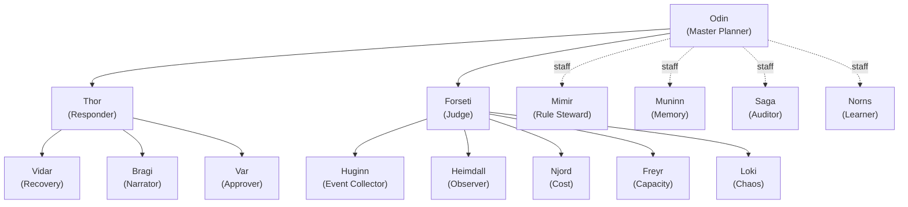
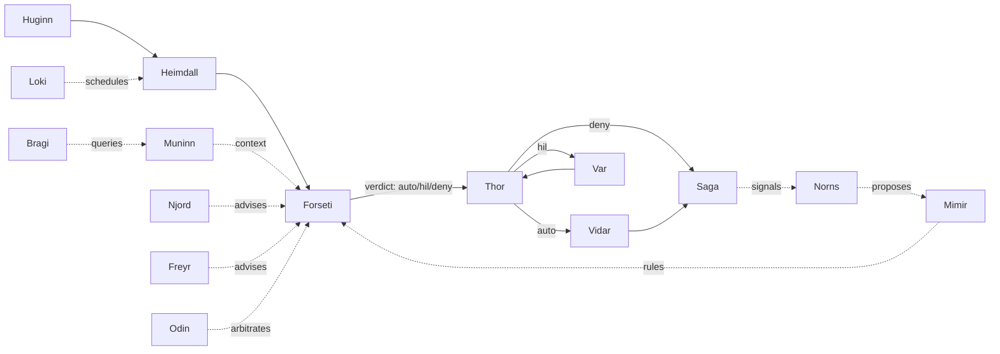

# Agent Pantheon

FDAI's fixed organization of 15 named agents owns the cloud-operations runtime. Agents observe, judge,
plan, approve, execute, verify, recover, audit, and learn through schema-checked events. The operating ontology supports them with typed meaning and bounded context; it is not the runtime actor, decision authority, or executor. The pantheon is defined once upstream - forks configure it but never add or rename agents.

> **Scope:** the pantheon is customer-agnostic. Every agent name, object type, and action referenced below is generic. Per-customer bindings live
> in a fork ([generic-scope.instructions.md](../../../.github/instructions/generic-scope.instructions.md)).
>
> **Implementation focus:** Azure is the only implemented target; the pantheon talks to the Kafka wire (Event Hubs on `:9093`) already declared in
> [app-shape.instructions.md](../../../.github/instructions/app-shape.instructions.md)
> ([Implementation Focus](../../../.github/copilot-instructions.md#implementation-focus-must)).

Consumers of this document:

- The event-driven core reads the agent and topic ownership tables in §4 and §6 to wire schema-validated pub/sub.
- The Operator Console ([operator-console.md](../interfaces/operator-console.md)) reads §6.3
  and §6.5 to route natural-language questions to the correct primary agent
  with per-user context.
- The rule-catalog and executor ([action-ontology.md](../decisioning/action-ontology.md),
  [execution-model.md](../decisioning/execution-model.md)) read §7 to bind each ActionType
  to its initiator, judge, approver, executor, and auditor.
- Forks read §10 to see which seams are open (topic subscriptions, config
  overrides) and which are locked (no new agents, no rename).
## 1. Design principles

The pantheon is a thin re-framing of the existing FDAI control loop into
named organizational roles. It does not change the safety envelope in
[architecture.instructions.md](../../../.github/instructions/architecture.instructions.md);
it makes the roles legible and auditable.

- **Deterministic-first, LLM-capable.** Every agent CAN call an LLM through
  its own bindings, but the runtime hot-path routes almost everything at T0
  (rule / table lookup) or T1 (similarity). LLM calls are reserved for
  narrow, declared uses (§8). LLM use is a capability, not a default.
- **Agent-driven, ontology-constrained.** Agents own every state transition. The ontology validates
  target identity, relationships, evidence freshness, allowed actions, and expected effects, but a
  graph result never judges, approves, executes, or raises authority.
- **Closed-loop operation.** Every accepted signal follows accountable ownership through observe,
  understand, decide, plan, authorize, execute, verify, recover, and learn. Broker acceptance or an
  API success is not an operational outcome; independent observation closes the loop.
- **Autonomy before escalation.** Missing evidence triggers bounded reacquisition, alternate-source
  checks, deterministic reevaluation, smaller safe plans, no-op, or rollback before human review.
  Var requests a person only for residual ambiguity, policy-mandated approval, or risk outside
  standing authority.
- **Two-port model.** Every agent exposes typed pub/sub for authority-bearing machine traffic and a
  read-only conversational presentation port for operators and bounded peer deliberation (§6).
- **Single-writer, multi-reader topics.** Each object type has exactly one
  owner agent that publishes; anyone may subscribe (§6.1).
- **Judge is not the executor.** Forseti issues a verdict; Thor dispatches
  the verdict; Var carries the human approval. No agent both judges and
  executes.
- **Pantheon fixed upstream.** The 15-agent set, the org chart, and the
  role assignments are locked. Forks customize behaviour through configured
  seams (§10) - not by adding, removing, or renaming agents.
- **Repository layout preserves the boundary.** Named agents live in
  [`services/core-control-plane/src/fdai/agents/`](../../../services/core-control-plane/src/fdai/agents), while shared runtime machinery stays in its private
  `_framework`. External callers import only `fdai.agents`; the layout test enforces the boundary.
## 2. Organization chart

Two lines report to Odin: Thor (operations) and Forseti (judgment). Four
governance staff report as staff (dotted) to Odin, independent from the
operations line. Domain specialists and sensing agents sit under Forseti so
that data flows into judgment, not directly into execution.



## 3. Runtime relationship diagram

The org chart is reporting lines. The relationship diagram is data flow.
Sensing and specialists feed Forseti. Action verdicts feed Thor for dispatch to
Vidar (recovery), Var (human approval), or execution; document-ingestion verdicts
return to the ingestion plane and Thor ignores them. Var and Saga preserve the stable idempotency key through document HIL; production binds Saga to the durable StateStore for gated decisions and terminal states. Saga's document audit event and Muninn's index command carry the additive `1.0.0` worker contract, after which the ingestion worker uses a separate durable stage claim that grants neither agent new authority.
Forseti also preserves each action's stable idempotency key on its Verdict, while Thor stores it on the durable `ActionRun` separately from the per-state event key.
For workflow-originated operator requests, Huginn also preserves the bounded `workflow_action`
lineage, Forseti carries it unchanged on the Verdict, and Thor stores it on the durable
`ActionRun`. The lineage is attribution only and does not change quorum or execution authority.
Norns proposes to Mimir, and Odin arbitrates conflicts before judgment.



### 3.1 Multi-objective arbitration

**Constitutional eligibility comes first.** Forseti owns the arbitration request and Odin ranks
only constitutionally eligible soft-objective tradeoffs. Normalization, precedence, weighted
scoring, human-approval margins, planning receipts, and temporal policy are owned by
[Operational Planning](../decisioning/operational-planning.md#multi-objective-arbitration).

### 3.2 Discovery-loop learners (Norns)

Norns remains the sole writer of inert `RuleCandidate` proposals. Its three-perspective consensus, balanced cohort limits, pending queue, Mimir review, and catalog activation boundary are owned by
[Operational Learning Ontology](../rules-and-detection/operational-learning-ontology.md#norns-consensus-and-catalog-boundary). The private `norns_deployment_learning.py` helper holds only bounded scenario-gap and preflight-blocker aggregation state; Norns still creates and publishes every candidate through its consensus and rate-limit boundary. Caller-supplied recurring preflight manual blockers become scope-deduplicated inert `preflight-toggle-gap` candidates and never create a toggle or change deployment authority. Reproduced Rule-retrieval failures enter as Huginn-owned events. Heimdall independently validates the exact failure and publishes `object.retrieval-validation`; Saga audits that evidence and Muninn materializes it as `object.context-index`. Norns strictly rejects raw text, unverified failures, non-retrieval causes, and targets without an exact Rule version; it durably records the remaining challenger before using the same consensus and `object.rule-candidate` path. A missing durable sink backpressures the event instead of dropping it.

## 4. Agent catalog

> **Machine-readable source of truth**: `PANTHEON_SPECS` in
> [`services/core-control-plane/src/fdai/agents/_framework/pantheon.py`](../../../services/core-control-plane/src/fdai/agents/_framework/pantheon.py).
> The table below paraphrases those `AgentSpec` entries for humans. If
> they disagree, the code wins - and
> [`services/core-control-plane/tests/agents/test_pantheon_doc_parity.py`](../../../services/core-control-plane/tests/agents/test_pantheon_doc_parity.py)
> pins all 15 names plus catalog layer and ownership against `PANTHEON_SPECS`
> in both English and Korean so drift is caught in CI.
> Ownership object types are canonical machine tokens and remain untranslated in both locale tables.

Layer: `1` = domain specialist, `2` = pipeline (sensing / judgment /
operations / interface), `3` = governance staff.

| Name | Role | Layer | Owns object types | Primary behavior | LLM in hot-path? |
|------|------|-------|-------------------|-----------------------|-------------------|
| Odin | Master Planner | 3 | ArbitrationDecision | arbitrate_domain_conflict | no |
| Thor | Responder | 2 | ActionRun, ActionAttempt | (dispatches; owns none directly - see §7.1) | no |
| Forseti | Judge | 2 | Verdict, RCA, SecurityEvent, ArbitrationRequest | produces verdicts; optional context can only lower autonomy; no executor role | yes (T2 abstain only) |
| Huginn | Event Collector / Real-time Resource Discovery | 2 | Event, Change | ingest_event, normalize_change | no |
| Heimdall | Observer | 2 | Anomaly, Drift, Forecast, ForecastOutcome, RetrievalValidation | detect_anomaly, detect_drift, forecast, close_forecast_outcome, validate_retrieval_failure, notify_admin_privilege_violation | no |
| Vidar | Recovery | 2 | Rollback | perform_rollback, dr_failover | no |
| Var | Approver | 2 | Approval | approve_action, reject_action | no |
| Bragi | Narrator | 2 | Conversation, Turn, UserPreference, HandoffEscalation, PostTurnReview | translate_intent | yes (translator only) |
| Saga | Auditor | 3 | AuditEntry, Issue | append_audit (normalize missing trace), escalate_to_github_issue | no |
| Mimir | Rule Steward | 3 | Rule, Policy | promote_rule, revoke_rule | no |
| Muninn | Memory | 3 | StateSnapshot, ContextIndex | index_state, snapshot_state, seal_case_history | no |
| Norns | Learner | 3 | RuleCandidate, PatternObservation | propose_rule_candidate, analyze_case_history, close_issue | yes (off-path batch only) |
| Njord | Cost | 1 | CostAnomaly, Budget | propose_cost_action | no |
| Freyr | Capacity | 1 | CapacityForecast, SizingRecommendation | propose_capacity_action | no |
| Loki | Chaos | 1 | ChaosExperiment, ResilienceScore | schedule_experiment | no |

Heimdall remains accountable for deterministic forecast episode evaluation and closure while the private `heimdall_forecast.py` helper owns that calculation. Its repeated-event detector can call an optional
`incident_candidate_hook` after it emits the authoritative anomaly. The hook
carries the normalized resource, event type, correlation, worst severity, reason
code, and all burst evidence keys to the composition-owned `IncidentLifecycleWorkflow`.
Before publishing a threshold anomaly, Heimdall may call an injected bounded read-only
`operational_evidence_hook`. The hook can attach provider evidence such as a hold-only Kubernetes
capacity finding, but it cannot decide, approve, or execute. A provider failure is attached as
structured unavailable evidence and never suppresses the authoritative anomaly.
One correlation episode repeated inside the rate window forms one anomaly at its worst severity.
Global/per-resource caps prevent cross-resource eviction. A routine heartbeat,
healthy probe, or within-threshold observation creates neither a finding nor an
Incident.
Heimdall does not write the Incident or publish a new object type. Only candidates with explicit
`incident_correlation=correlate`, correlation and evidence, enabled auto-open, and sufficient
severity reach the workflow; all others remain anomalies. The workflow rechecks evidence before
`IncidentRegistry` writes the audited record. Hook failure records a behavior counter and leaves
the bounded window for retry; accepted and policy-held outcomes use separate counters. Production composition rehydrates the registry and binds the hook when
enabled; the Operator API does not impersonate Heimdall.

Huginn is the logical owner of real-time resource discovery and normalized `Change` records. Azure resource
create, update, and delete signals enter through the canonical Event Hubs Kafka
ingress and Huginn normalizes, deduplicates, correlates, and publishes them as
`Event`. IaC plans, release requests, and provider activity with authoritative event time also
produce `object.change`; Muninn retains immutable content-addressed revisions for decision context.
Huginn places the same normalized Change evidence on the causal `object.event`, so Forseti does not
depend on cross-topic arrival order. Forseti evaluates planned changes with bounded impact analysis
before its ordinary rule judgment and carries the assessment into Verdict and DecisionCase evidence.
Missing, stale, failed, or review-required assessment forces human approval. Observed changes remain context only, and the current runtime supplies no graph-freshness authority that could auto-clear a
planned change. Operational-context freshness entries require an explicit string source, timestamp, and integer maximum age; malformed values, including boolean ages, fail closed and lower the verdict
to human approval. Ordinary verdicts and arbitration DecisionCases materialize from the same typed freshness evidence, so cross-domain arbitration cannot recover authority that the context ceiling
removed. This projection grants no action authority. Azure-specific parsing, point enrichment, and durable inventory projection remain injected delivery responsibilities; Huginn never imports an
Azure SDK or writes the inventory database directly. The scheduled Inventory
sync job remains the periodic reconciliation backstop that repairs missed
signals with a complete ARG/ARM snapshot. Stale or degraded inventory remains unavailable;
Heimdall publishes the finding and never acquires resources or starts reconciliation.

The 15 agents are jointly sufficient to cover SRE, ARB (change safety), and
FinOps workflows through composition; see §6 for the topic contract and
§6.4 plus §7.6 for how handoff integrates with the same pipeline.

### 4.1 Per-agent task inventory

Every agent performs four task categories. **R**ecurring runs on a schedule.
**E**vent handles typed-port messages. **M**eta is the agent's own health
and self-improvement. **X**-agent participates in the workflows named in
[agent-workflows.md](agent-workflows.md).

| Agent | R (recurring) | E (event) | M (meta) | X-agent |
|-------|---------------|-----------|----------|---------|
| Odin | weekly portfolio review, priority-policy tuning | arbitrate_domain_conflict on Forseti signal | portfolio outcome score self-audit | 7 (Agent health), tie-break for 2 (Predictive scale) |
| Thor | execution-path health check, retry-strategy cache warmup | verdict dispatch, rollback trigger, rate-limit enforce | pre-flight simulation for high-risk actions | 1 (Cost-aware remediation), 2 (Predictive scale), 11 (Readiness), 12 (Scheduled Python) |
| Forseti | rule-cache refresh, retrospective what-if batch, verdict coherence self-test | judge event (T0/T1/T2), emit domain_conflict, emit SecurityEvent | novelty drift detection (T0 vs T2 mix) | 1, 2, 5 (Security escalation), 8 (Judgment coherence), 11, 12 |
| Huginn | source health check, discovery cursor/backpressure check, dedup window maintenance | normalize + dedup + correlate + publish Events and normalized Changes | adaptive schema learning (T1 clustering, off-path) | feeds every workflow |
| Heimdall | anomaly baseline update, forecast refresh, discovery freshness/coverage probe, T2 proposer health receipt reduction, external-actor list refresh, agent-health probe | anomaly detect, drift detect, terminal proposer exhaustion correlate, discovery degradation correlate, SecurityEvent correlate, notify_admin | multi-signal cross-correlation | 1, 2, 3 (DR drill), 5, 7 (Agent health), 9 (Rollback rehearsal) |
| Vidar | rollback-path validation, DR readiness score, recovery-time SLI | perform_rollback, dr_failover | rollback rehearsal (shadow) | 3, 9 |
| Var | approval SLA monitor, approver availability tracking | present HIL card, enforce quorum, timeout / escalation | approval provenance record | 4 (Override -> Discovery), 5, 11, 12 |
| Bragi | expired-session cleanup, UserPreference index refresh | NL routing, multi-agent aggregation, NL rendering | intent classifier retraining (T1, off-path) | 7, 10 (Retrospective what-if), 12 |
| Saga | audit-chain integrity self-check, issue-close scan, fingerprint index compaction | append AuditEntry, escalate_to_github_issue, replay for reconstruction | audit chain tamper detection | every workflow (audit) |
| Mimir | rule-source polling, regression suite, deprecation cycle | promote / revoke rule, cache-invalidation broadcast | freshness-score, stale-rule detection | 4, 6 (Handoff -> Capability), 8, 11 |
| Muninn | snapshot rotation, RAG index rebuild, cache eviction, case-history retention | context fetch for Forseti, immutable Change revision storage, state query for Bragi, retention tick apply | trending-query pre-warm, ontology cross-check | supports every judgment-touching workflow |
| Norns | hourly batch audit analysis, streaming pattern extraction | pattern signal, RuleCandidate publish, close_issue signal | model performance drift detection | 4, 6, 8 (Judgment coherence), 10 |
| Njord | cost ingestion (daily), budget monitor, cost forecasting | bounded cost sample -> anomaly; budget breach alert; cost-advisor query | RI / SP optimization proposals | 1, 2 |
| Freyr | utilization sampling, capacity forecasting, sizing analysis | bounded utilization sample -> forecast; scale proposal; capacity advisor query | multi-dimensional capacity (CPU + IOPS + net + mem) | 2, 3 |
| Loki | chaos-experiment scheduling, resilience-score refresh | bounded schedule trigger -> always-HIL experiment proposal; blast-radius calc | adversarial scenario generation (T2, off-path) | 3, 9 |

### 4.2 Per-agent KPI (success and degradation signals)

Every agent MUST emit these metrics into the measurement pipeline
([goals-and-metrics.md](../architecture/goals-and-metrics.md)) so shadow -> enforce
promotion gates can evaluate deterministically. The runtime reports every
declared metric on each health snapshot. A metric without sufficient outcome
evidence carries `value: null` and an explicit evidence state; promotion gates
treat it as a failure rather than interpreting absence as zero.

| Agent | Success KPI | Degradation KPI (early warning) |
|-------|-------------|--------------------------------|
| Odin | cross-vertical conflict resolution time, portfolio target attainment | tie-break recurrence rate |
| Thor | execution success rate, execution latency p99 | rollback trigger rate, race failures |
| Forseti | verdict accuracy vs post-hoc override, T2 escalation rate (target < 10%) | mixed-model disagreement rate, grounding-missing rate |
| Huginn | event processing latency p99, discovery delivery latency p99, dedup accuracy | schema-match failure rate, discovery cursor lag |
| Heimdall | anomaly precision + recall, forecast MAPE, discovery coverage detection, T2 proposer recovery detection | false-positive rate, missed critical, stale inventory detection delay, proposer exhaustion-to-HIL delay |
| Vidar | rollback success rate, MTTR | rollback-path validation failure |
| Var | HIL SLA compliance, quorum compliance | expiry rate, repeated escalations |
| Bragi | routing accuracy (post-audit), session satisfaction | handoff rate (target < 5%) |
| Saga | audit chain integrity, replay success | audit-gap detection |
| Mimir | rule freshness score, promotion pass rate | shadow-fail rate, stale-rule ratio |
| Muninn | context fetch p99, cache hit rate | cache-miss recomputation time |
| Norns | rule candidate adoption rate, pattern validity | false-pattern rate |
| Njord | cost forecast MAPE, savings realized | budget-breach miss |
| Freyr | capacity forecast error, over / under provisioning | scale race, throttle events |
| Loki | experiment blast-radius adherence, resilience improvement delta | unplanned side-effects, experiment failure |

**System-level KPI** (Odin portfolio report):

- **Autonomy ratio** - auto vs HIL vs deny distribution (goal: auto up,
  deny down).
- **Handoff conversion rate** - issue -> RuleCandidate -> promoted.
- **Cross-vertical action ratio** - single vs multi-vertical actions.
- **Discovery velocity** - new rule / capability promotion rate (weekly).

### 4.3 Per-agent degradation policy

When an agent itself fails or degrades, these are the declared safe
behaviors. Anti-pattern §11 forbids collapsing these to nothing.

| Agent failed | Impact | Safe degradation |
|--------------|--------|------------------|
| **Saga** | audit unavailable | **HARD FAIL**: no new mutation permitted; whole system demoted to shadow |
| **Vidar** | rollback unavailable | Thor refuses new auto executions; all new actions demoted to shadow |
| **Forseti** | judgment stopped | Huginn / Heimdall keep publishing (Kafka retains); no verdict fallback (judgment cannot proceed without judge); operator alert |
| **Odin** | cross-vertical arbitration missing | Forseti lowers conflict verdicts to HIL (human arbitrates) |
| **Thor** | execution stopped | verdicts queued; verdict TTL expiry drops stale ones (re-judge on republish) |
| **Huginn** | ingestion stopped | Kafka retention preserves events; Huginn resumes from checkpoint on recovery (idempotent) |
| **Heimdall** | detection/effect observation stopped | reads, deny, and shadow judgment continue; new state changes needing Heimdall observation are blocked, existing outcomes remain pending, RBAC deny stays audited |
| **Var** | HIL blocked | HIL queue preserved; timeout auto-extended; admin alert; only actions already eligible as A1/A2 without approval continue; HIL and A3-E cannot execute |
| **Bragi** | conversation blocked | operator falls back to console read-only view + direct audit query |
| **Mimir** | rule updates stopped | cached rules continue; Forseti raises stale-rule warning; new rule updates deferred |
| **Muninn** | context unavailable | reads, deny, and shadow judgment continue; context-dependent state changes are blocked as unknown and "context unavailable" is audited |
| **Norns** | learning stopped | no immediate impact (off-path); long-term discovery velocity drops - warning raised |
| **Njord / Freyr / Loki** | domain advice missing | Forseti demotes that domain's actions to HIL |

Common rules:

- **Saga and Vidar are hard dependencies** for mutation: terminal consumer or health failure forces sticky shadow until restart. Noncritical terminal consumers degrade only their agent; siblings continue and health records exact agent/topic state instead of a false live heartbeat. The unified concurrency test pins all 15 consumer identities and non-stealing same-topic fan-out.
- **Any judge / executor / auditor triad missing** demotes new mutation to
  shadow.
- **Noncritical sensing degradation** may preserve read, deny, queue, and shadow paths only.
  Vidar remains a mutation hard dependency; Var independently controls HIL and A3-E eligibility.
- Every degradation surfaces in Odin's portfolio report (workflow 7).

### 4.4 Task tier classification (LLM policy per task)

Not every "predictive" or "adaptive" task needs an LLM. The table below
maps every task from §4.1 to its tier so implementation cannot silently
promote to T2.

| Task | Correct tier | Why |
|------|--------------|-----|
| Heimdall forecast | T1 (ARIMA / smoothing) | statistical is enough, reproducible |
| Norns streaming pattern | T1 (clustering) | live signal needs deterministic ranking |
| Norns batch summary | T2 (off-path only) | LLM ok for weekly report, never hot-path |
| Bragi intent classify | T0 keyword + T1 embedding, then handoff | hot-path dialog does not guess through T2 |
| Mimir rule draft | T2 (off-path, human-reviewed) | novel rule OK to LLM; sign-off is human |
| Forseti verdict coherence | T0 (SQL) + T1 (embedding) | past verdicts are structured audit log |
| Var assisted decision | T0 (linked similar cases) + T2 (summary, off-path) | card carries summary; humans decide |
| Huginn schema learning | T1 (batch clustering) + T2 for promotion | real-time normalization stays T0 |
| Loki adversarial | T2 (off-path) | scenario generation ok LLM; execution deterministic |

Hot-path LLM invocation is restricted to three places: Bragi translator,
Forseti T2 abstain, Norns off-path batch. Any implementation adding LLM
to another hot path is a defect.

## 5. Ontology integration

`Agent` is a first-class object type in the ontology. It shows up in
`/ontology/graph` alongside every other object type, so the org chart and
data ownership are queryable, not documented separately.

```yaml
object_type: Agent
properties:
  name: string                     # "Odin", "Thor", ...
  layer: enum                      # domain | pipeline | governance
  reports_to: Agent?               # org chart edge
  owns: [ObjectType]               # write-authority (single-writer)
  executes: [ActionType]           # references action-ontology.md
  initiates: [ActionType]          # can propose (see §7.1)
  subscribes: [Topic]              # typed-port subscriptions
  publishes: [Topic]               # typed-port publications
  question_domains: [string]       # NL query categories (§6.3)
  owns_code_paths: [glob]          # RAG scope for self-introspection (§8)
  llm_bindings: [ModelId]          # models this agent may invoke
  rate_limits:
    proposals_per_minute: int
    proposals_per_hour: int
```

Every `object_type` declaration in the wider ontology gains an
`owner_agent` field pointing back at exactly one `Agent`. The producer
principal is checked by the schema registry: only the owner may publish.

## 6. Communication contract

The pantheon uses the existing `EventBus` wire: Kafka on Event Hubs `:9093`, or the in-process local adapter. Heimdall emits Drift only after one readiness pass has all six dimensions; Muninn accepts only a strictly newer snapshot.
A best-effort `AgentHandlerObserver` reports handler lifecycle without changing delivery, judgment, or execution. Local composition publishes to SSE; deployed composition publishes `started`, `completed`, and `failed` onto the shared stage topic for Operator API relay.

### 6.1 Typed port

One topic per object type, named `object.<type>`. Every message carries `correlation_id`, `idempotency_key`, and `producer_principal`; Thor uses `correlation_id:state` for retry-safe transitions.
The bus stamps authenticated `producer_principal` and integer `envelope_schema_version` while preserving a payload's `schema_version`; mutations require non-empty `correlation_id`, `resource_id`, and `idempotency_key`.
Owned-topic producer checks cannot be disabled, and unknown `object.*` subscriptions fail registration. Ordered mutation consumers stop after parking poison so later mutations cannot pass it.
Dead-letter writes retry with bounded backoff before consumer restart. Operator redrive repeats owner, envelope, and schema checks and re-parks only the original payload.

| Topic | Publisher | Primary subscribers |
|-------|-----------|---------------------|
| object.event | Huginn | Heimdall, Muninn (retention ticks), Njord/Freyr/Loki (bounded specialist signals) |
| object.change | Huginn | Muninn (immutable change revisions) |
| object.anomaly, object.drift, object.forecast | Heimdall | Forseti; Muninn reads detection-readiness drift only |
| object.forecast-outcome | Heimdall | Saga, Muninn |
| object.retrieval-validation | Heimdall | Saga, Muninn |
| object.security-event | Forseti | Heimdall (correlation), Saga |
| object.verdict | Forseti | Thor, Saga, Odin |
| object.arbitration-request | Forseti | Odin |
| object.arbitration-decision | Odin | Forseti |
| object.action-run | Thor | Vidar, Var, Saga |
| object.approval | Var | Thor, Saga |
| object.rollback | Vidar | Thor (ActionRun projection), Saga |
| object.audit-entry | Saga | Norns, Muninn (document index gate), Var (document HIL) |
| object.issue | Saga | Norns, Mimir |
| object.rule-candidate | Norns | Mimir |
| object.rule | Mimir | Forseti (cache reload), Saga (catalog-review audit) |
| object.context-index, object.state-snapshot | Muninn | Norns (sealed case-history intake), Saga (snapshot audit) |
| object.conversation | Bragi | (session index) |
| object.turn | Bragi | Muninn |
| object.post-turn-review | Bragi | Norns (consent-filtered off-path review only) |
| object.user-preference | Bragi | Muninn |
| object.cost-anomaly | Njord | Forseti |
| object.capacity-forecast | Freyr | Forseti |
| object.chaos-experiment | Loki | Heimdall |
Partitioning:

- Mutation topics (`object.action-run`, `object.rollback`) partition by
  `resource_id` so concurrent writes to the same resource serialize.
- Judgment and audit topics partition by `correlation_id` so a single
  incident stays on one consumer.
### 6.2 Conversational port

All 15 agents, including Bragi, expose a request-response interface by canonical name or domain
routing. Questions cap at 2,000 characters and each session retains 100 monotonic turns. Unknown A2A requester or target names are rejected; only the correlation trace crosses ports, and primary responses use a bounded timeout plus the same owner, size, and sensitivity normalization as contributor answers.

Each `AgentSpec` requires a unique immutable, versioned `ConversationCharter`: bounded server-owned system instructions with role-specific prohibitions, an exact generated role contract for reporting, ownership, topics, action bindings, model policy, hard-dependency status, and proposal budgets, a role directive that states the mechanics of the agent's own decision, English/Korean query examples, and read tools with purpose and owned-fact scopes. Semantic parity tests pin all 15 role boundaries. The runtime overwrites caller policy, projects each tool onto its distinct fact scope, and attributes the version plus separate prompt and full-charter SHA-256 digests without exposing instructions. Each agent grounds answers in owned state; typed policy remains the authority. The charter prompt is the composition floor, not the whole prompt. Every turn composes its effective prompt from that baseline plus the situational layers the turn selects (peer versus operator audience, deliberation phase and tier, tool scope, operator locale, evidence gap, command intent). Composition is additive and deterministic, so a situation can tighten the charter but never loosen it, and a recorded turn replays exactly. The turn context selects layers only; it never supplies prompt text, so a forged context cannot inject instructions. Responses carry the layer manifest, situation key, and composed prompt digest - never the text. See [conversational-deliberation.md](conversational-deliberation.md).

`is_action_intent` makes commands abstain with `requires_typed_pipeline`; chat never executes.
The framework tool planner derives bilingual operator vocabulary from each declared tool example
and matches it to ontology-backed capabilities. It does not maintain a separate translation map or
change Bragi's translator-only authority.
Owned-state scope narrowing matches complete canonical identifiers with internal `.`, `_`, or `-`
inside the bounded question and never accepts a shorter candidate that is only an identifier prefix.
`PantheonRuntime.introspect` supports attributed read-only peer projections and digest-only Bragi Turns; bounded presentation discussion is specified in [conversational-deliberation.md](conversational-deliberation.md).

`AgentConversationToolRegistry` binds every declared id to one owner, rejects invalid calls, bounds time
and data, and holds errors or sensitive output without values. Tool results expose only `agent`, `evidence_refs`, and declared fact keys, with no undeclared `_ref` exception. Direct and tool-routed results without durable refs receive the same content-addressed `agent-state` ref over normalized facts, never an `agent-spec` runtime claim. Unbound projections state unavailable instead of exposing unrelated facts. Health reports tool availability and counters. Calls use only the conversational port, so actions cannot reach an executor or cloud SDK.

### 6.3 NL query orchestration

Bragi is the router, not the answerer. English and Korean Azure read intents route to Heimdall before generic domain scoring without adding a topic, agent identity, or execution authority:

1. **Current-screen authority.** A data question stays with Bragi T0 when the
  active screen supplies facts or records. Specialist delegation and semantic
  web classification remain off. A missing requested field produces an
  explicit absence answer instead of a model-memory fallback.
2. **Canonical glossary lookup.** A direct definition question for a shared
  ontology or control-loop term (for example `ActionType`, including a Korean
  particle such as `ActionType이`) is answered from grounded glossary evidence
  before agent scoring. It is not delegated to an agent whose domain merely
  shares a word stem.
3. **T0 keyword / regex match.** Compare intent tokens against
  `Agent.question_domains` and owned ObjectType tokens. Complete multi-token domains outrank
  partial matches, while generic `status`, `history`, or `health` tokens cannot route alone.
  Prefix matching is limited to high-signal words; `actiontype` does not match `action`.
4. **T1 embedding similarity.** T0 abstention or ties compare one question embedding with cached
  English/Korean charter examples. Explicit/read/single-winner T0 makes zero calls; threshold,
  margin, or provider failure preserves the deterministic result instead of guessing.
5. **Handoff.** If T0 and T1 remain below threshold, emit
  `HandoffEscalation` (§6.4). The system files a GitHub issue rather than
   guess.

Winner selection is scored, not first-match, when several agents match:

```
score = domain_specificity + ownership_bonus
```

Tie-break order (deterministic): total score > pantheon precedence
(governance > pipeline > domain) > canonical agent name. The winner is
`primary_agent`; the runners-up become `contributors`. Every routing
decision is written to `Turn.score_breakdown` for later inspection.

#### 6.3.1 Shadow answer planning

The Command Deck can use the same deterministic scores to select up to two
read-only contributors for a presentation-only `AnswerPlanningRound`. This
round is separate from Bragi's existing terminal multi-agent aggregation and
from the Quality Gate Debate. In Phase C, typed contributions are measured but
never injected into the narrator context or terminal answer.

- **Bragi** owns the final answer plan and remains the displayed narrator.
- **Contributors** expose owned facts and evidence refs after owner, JSON, size, and sensitivity checks.
  Same-identity state/status/verdict/mode/health/outcome conflicts abstain and hand off; contributors never recurse, judge, approve, or execute.
- **Norns** never participates synchronously. It can analyze opted-in aggregate
  metadata off-path after the turn.
- **Odin** is excluded from routine collection. A later Phase E can consult it
  only for genuine cross-domain conflict, without execution authority.
- **Saga** is selected only for audit, history, issue, or handoff questions. It
  is not a universal answer reviewer or verifier.
- **Forseti, Var, and Thor** retain their judgment, approval, and execution
  boundaries. Answer style never changes their authority.

Shipping limits are two contributors, one round, `1200 ms`, and `800` estimated
added tokens. Nested rounds are disabled. Contributor failure degrades to the
primary-only answer and bounded metadata; it never routes a supported read-only
answer to HIL.

The Command Deck reaches this round through the public `PantheonRuntime`
conversation methods. Delivery adapters do not inspect the runtime agent map or
invoke an agent's conversational handler directly. Bragi remains the routing
boundary for every contribution.

### 6.4 Handoff escalation protocol

An agent that cannot resolve a conversational request through owned data, T0, or T1 abstains to
Bragi instead of guessing through T2. Bragi alone publishes `HandoffEscalation`, and Saga turns it
into a GitHub issue through `escalate_to_github_issue`. With no EventBus, Bragi records
`handoff_status: transport_unavailable` on the turn and increments the matching behavior counter;
it never presents an unmaterialized escalation as successful.

Deduplication uses a `problem_fingerprint`:

```
fingerprint = sha1(
    intent_category + resource_type + normalized_selector
  + primary_agent + failure_reason_code
)
```

Saga keeps a local `fingerprint -> github_issue_number` index in Muninn.

- **First occurrence** creates the issue with label `fdai:fp:<hash>`.
- **Repeat occurrence** appends a comment on the same issue with the new
  `correlation_id` and context. The issue body carries `first_seen`,
  `last_seen`, and `occurrence_count`; comments record each recurrence.
- **Auto-close** happens when Mimir promotes a rule or capability that
  would resolve the fingerprint, and 24 hours of regression tests pass
  clean. The closing comment links the promoting PR. Manual close is
  always allowed.

The fingerprint hash never carries customer identifiers (labels are hashes
only); detailed values live only in the fork's issue tracker.

### 6.5 Conversation state and per-user context

Bragi owns `Conversation`, `Turn`, `UserPreference`, and `PostTurnReview`.
State is partitioned by `user_id`:

- **Session.** A `Conversation` starts on first turn and ends after 30
  minutes of inactivity; every turn is appended immutably as a `Turn`.
  `object.turn` carries body references, SHA-256 digests, routing metadata,
  and the correlation trace. It never carries the raw question or answer.
- **Multi-turn context.** Bragi passes the last N turns to the primary
  agent as `prior_turns_ref`, scoped to the requesting `user_id`.
- **RBAC.** Muninn refuses cross-user reads; a primary agent that tries to
  read another user's conversation gets an empty result and Saga records
  the attempt.
- **Learner boundary.** Norns is limited to metadata by default
  (`share_with_learner: false` per `UserPreference`). Opt-in surfaces the
  turn body for pattern extraction; opt-out is the default. Batch trajectory intake accepts only
  reviewed aggregates, never raw turn or trajectory bodies. A completed,
  consent-filtered exchange enters Norns on `object.post-turn-review`; it is
  not encoded as a second shape on `object.turn`.
- **Retention.** Active conversation: 30 days. Cold storage: 60 additional
  days. Total: 90 days, then delete. Aggregated anonymized metrics survive
  in Saga's own audit stream.

## 7. Ontology actions

Every substrate mutation or tool invocation uses one cataloged `ActionType`
([action-ontology.md](../decisioning/action-ontology.md)). Typed object
publication is different: arbitration, findings, candidates, audit entries,
handoffs, and notifications stay under their single-writer topic contracts and
do not masquerade as catalog actions.

### 7.1 Global action role binding

Action lifecycle roles are global single-writer bindings, not fields repeated
on every `ActionType`:

```yaml
judge: Forseti
approver: Var
executor: Thor
auditor: Saga
rollback_owner: Vidar
```

`PANTHEON_SPECS`, topic ownership, and runtime producer checks enforce these
roles for every action. ActionType entries cannot redeclare them, and the
schema rejects unknown role fields. Initiator eligibility is evaluated from
the ActionType's `trigger_kind` and scenario restrictions together with
AgentSpec capabilities or server-owned operator ingress. This keeps role
ownership in one source of truth while the ActionType remains the source of
truth for operation, safety, and execution-path semantics.

### 7.2 Lifecycle state machine

An `ActionRun` walks the following states. Each transition is one pub/sub
event; the state's owner agent is the only publisher.

```
proposed  (initiator agent)
  -> verdicted    (Forseti: auto | hil | deny)
    -> deny_dropped     (terminal; Saga records)
    -> hil              (Var: approved | rejected | expired)
      -> rejected       (terminal; Saga records)
      -> expired        (terminal; Saga records)
      -> approved
    -> auto             (Thor)
  -> paused             (external hold: maintenance window)
  -> executing          (Thor)
    -> succeeded        (terminal after audit)
    -> failed
      -> rolled_back    (Vidar; terminal after audit)
      -> compensated    (Thor + compensating action; terminal after audit)
```

Every terminal state writes an `AuditEntry` before closing. Replay from
the audit log is judge-only: Saga can reconstruct any past decision but
never re-executes.

### 7.3 Parameter validation and idempotency

Three validation checks, all deterministic:

1. **At propose.** Initiator asserts the params conform to
   `argument_schema`; the schema registry rejects malformed proposals.
2. **At verdict.** Forseti re-runs schema + policy + what-if / dry-run;
   any failure downgrades the verdict to `deny` or `hil`.
3. **At execute.** Params remain unchanged on Verdict, `ActionRun`, Approval,
  and audit; Thor validates them again before mutation to catch target-state races.

Idempotency keys are per-action (`action_run_id`) and per-attempt
(`attempt_id`). A retried publish with the same key is a no-op at the
executor; the audit records the duplicate.

### 7.4 Impact scope and batch semantics

An ActionType with `blast_radius > 1` fans out to one `ActionAttempt` per
target resource. Attempts are partitioned by `resource_id` and executed
independently. Failure isolation:

- A failing attempt rolls back only its own target.
- Sibling successes are not undone; the rollup `ActionRun` records the
  mix.
- Saga writes both the per-attempt entries and the rollup entry.

Per-resource ordering is preserved by the partition key; cross-resource
ordering is not implied.

### 7.5 Rollback contracts and irreversibility

Every ActionType declares a live `rollback_contract`, including an irreversible
action. Current values are `pr_revert`, `scripted`, `pitr`, `snapshot_restore`,
and `state_forward_only`. Examples:

| ActionType | rollback_contract | irreversible |
|------------|-------------------|--------------|
| `remediate.tag-add` | `pr_revert` | false |
| `remediate.rotate-secret` | `snapshot_restore` | false |
| `tool.run-chaos-experiment` | `scripted` | false |

`irreversible: true` action MUST route through HIL + quorum: at least two
distinct approvers, no self-approval. Forseti attaches `quorum_required:
2` to the verdict; Var enforces it.

### 7.6 Handoff as typed delivery

Handoff escalation is not a `governance.*` ActionType. That category is
reserved for reviewed catalog-as-code changes using `pr_native`. Bragi, the
single writer of `object.handoff-escalation`, publishes the bounded request;
Saga consumes it, applies fingerprint deduplication, materializes `object.issue`,
and appends the audit evidence. A live issue tracker remains an injected
delivery adapter, so the typed ownership and audit boundary stay the same in
local and deployed runtimes.

### 7.7 Conversational port MUST-NOT-Bypass rule

The conversational port CAN start an action but MUST NOT execute one on
its own. When an operator says "restart vm-1" or the Korean equivalent to Bragi, Bragi translates
the intent into an `ActionProposal` whose `initiator_principal` is the
operator (not Bragi) and hands it to the typed pipeline. Forseti, Var,
and Thor run their normal steps. Bragi only renders progress back to the
operator. Any implementation that lets Bragi call an executor directly is
a defect.

**Implementation.** Bragi holds a `proposal_sink` DI seam wired at the
composition root to `Huginn.ingest` (the sole writer of `object.event`), so
Bragi never publishes a mutation topic itself. `Bragi.submit_action_proposal`
maps a deterministic English or Korean command phrase to an ActionType, builds the proposal with
`initiator_principal = operator` and `operator_initiated = true`, and submits
it through a bounded sink call; timeout or failure returns `submitted=false` without error detail. Every command emits a digest-only `object.turn` on that proposal correlation. It returns a `correlation_id` the operator can track and
renders pipeline progress from `object.verdict` / `object.action-run`, never
executing. Forseti propagates `initiator_principal` onto the verdict, Thor onto
the ActionRun, and Var enforces no-self-approval (the initiator can never
approve their own action). An operator-initiated proposal whose initiator is
unknown to the RBAC seam fails closed to `deny` with a `SecurityEvent`. When
the console passes the operator's Entra role, an entry RBAC gate refuses an
action request below the execute floor (`Contributor`) before it enters the
pipeline, so a `Reader` cannot submit any action (defense-in-depth with the
principal-level deny above). As a spoofing defense, Huginn honors the
operator-proposal fields (`initiator_principal` / `action_type` /
`operator_initiated`) ONLY for an explicit `event_type == "operator_request"`
and coerces `operator_initiated` to a strict bool - so a forged or external
signal on the shared ingress topic cannot spoof an operator action, and Forseti
treats only a strict `True` as operator-initiated.

### 7.8 Fork override boundaries

A file, Rego, config, or runtime overlay may only tighten an existing
ActionType. It can lower an autonomy ceiling, add stricter preconditions or
stop conditions, reduce blast radius, or strengthen a promotion gate. Every
overlay is downgrade-only and audited. Promotion from shadow to enforce is a
separate governed ActionType and reviewed PR after the promotion gate passes.

Role bindings (`executor`, `judge`, `approver`, `auditor`, `initiators`) and
the rollback contract remain fixed pantheon safety boundaries. A new
ActionType belongs under `rule-catalog/action-types-custom/`; it is not an
overlay. See [action-ontology.md § 7](../decisioning/action-ontology.md#7-fork-override-seams)
for the authoritative precedence and allowed channels.

### 7.9 Rate limits per agent

Each agent declares `rate_limits`. Defaults ship as `20 proposals/minute`
and `100 proposals/hour`. Excess proposals are queued to a bounded buffer;
overflow drops with a `RateLimitExceeded` audit entry, and Norns picks up
the spike as a learning signal ("why did this agent burst?"). Forks may
override the numbers through config.

## 8. LLM policy per agent

LLM invocation is a capability, not a default. Every agent CAN use its
LLM bindings; only a few do so in the hot-path.

| Agent | Hot-path LLM? | Off-path LLM? | Conversational port |
|-------|--------------|---------------|---------------------|
| Odin | no | no | yes (introspection) |
| Thor | no | no | yes (introspection) |
| Forseti | yes (T2 abstain only) | no | yes |
| Huginn | no | no | yes |
| Heimdall | no | no | yes |
| Vidar | no | no | yes |
| Var | no | no | yes |
| Bragi | yes (translator only) | no | yes |
| Saga | no | no | yes |
| Mimir | no | no | yes |
| Muninn | no | no | yes |
| Norns | no | yes (batch discovery) | yes |
| Njord | no | no | yes |
| Freyr | no | no | yes |
| Loki | no | no | yes |

Every agent's conversational port can render deterministic introspection from
its immutable `AgentSpec` and owned facts. An optional narrator may render the
same facts with an LLM and RAG over `owns_code_paths`; that presentation layer
does not change the typed decision or execution path.

## 9. Security and privilege-escalation monitoring

FDAI treats unauthorized action attempts as first-class security signals.
The pantheon extends Heimdall (already the "all-seeing" observer) to
detect them; it does not add a new agent.

### 9.1 Detection

When an operator (via Bragi) or a fork-registered initiator proposes an
action whose `initiator_principal` lacks the RBAC role required by the
ActionType:

1. Forseti issues verdict `deny` with `reason: rbac_insufficient`.
2. Forseti simultaneously publishes a `SecurityEvent` with
   `type: privilege_escalation_attempt`, the initiator id, the attempted
   ActionType, the target resource, a severity score, and the correlation
   id.
3. Saga records both events.

### 9.2 Correlation and severity

Heimdall subscribes to `object.security-event` and classifies:

| Severity | Trigger | Response |
|----------|---------|----------|
| low | single attempt on a low-impact action | audit only |
| medium | 3+ attempts by same user within 5 minutes, or single medium-impact | daily digest to admin group |
| high | single attempt on a critical / irreversible action, or 5+ attempts in 5 minutes | immediate ChatOps card to admin group |
| critical | multi-action pattern, unusual hours, deliberate escalation pattern | immediate + separate on-call security channel |

Severity is deterministic (table + counters), not LLM-scored.

### 9.3 Notification delivery

Heimdall classifies `object.security-event` and invokes the bounded admin
notification adapter for medium-or-higher alerts. This informational delivery
is not a `governance.*` ActionType and does not enter Thor's mutation path. Saga
already audits the authoritative `SecurityEvent`; the adapter posts to the
configured ChatOps admin channel with a distinct template, fingerprint dedup,
and rate limits.

### 9.4 Alert deduplication and rate limits

Same-user, same-action alerts within a 1-hour window collapse into one
card with an incremented counter. Per-user limit is 5 cards per hour;
excess collapses into a digest to prevent alert storms. The fingerprint
scheme reuses the §6.4 dedup pattern.

### 9.5 Legitimate escalation

A denied user sees a response with a "request permission upgrade" link.
Permission upgrades themselves are a normal HIL flow (admin approves via
Var); the upgrade path is out of scope for this document but is on the
Phase roadmap.

## 10. Fork customization

Forks customize the pantheon through configured seams. They do not
subclass agents, add agents, or rename agents.

| What forks may do | How |
|-------------------|-----|
| Bind LLM models to agents | `agents.<name>.llm_bindings` config |
| Disable a domain agent (e.g., no chaos) | `agents.<name>.enabled: false` |
| Add rules or policies | `rule-catalog/catalog/**` overlay |
| Add or override ActionTypes | `rule-catalog/action-types-custom/**` and `-overrides/**` within §7.8 boundaries |
| Change ChatOps channel targets | delivery-adapter config |
| Change conversation retention or opt-in defaults | Bragi config |
| Change rate-limit defaults | `agents.<name>.rate_limits` config |

Forks may NOT:

- Add a new agent name to the pantheon
- Rename or reassign an agent's role
- Repoint an ActionType's `executor`, `judge`, `approver`, `auditor`, or
  `initiators`
- Publish to a topic owned by another agent

A missing capability that requires a new agent is a signal to open an
upstream PR that extends the pantheon under the same rules everyone else
follows.

## 11. Anti-patterns

- **Direct agent-to-agent RPC.** All hot-path communication is
  pub/sub on the schema-checked bus. HTTP calls between agents defeat
  audit and replay.
- **Conversational port bypasses the typed pipeline.** Bragi that calls
  an executor directly is a defect (§7.7).
- **Judge under executor in the org chart.** Forseti reports to Odin,
  not Thor, so verdicts stay independent of execution.
- **LLM in a sensing hot-path.** Huginn, Heimdall, and the domain
  specialists MUST NOT invoke an LLM synchronously. Their patterns must
  compile to deterministic rules (T0) or lightweight similarity (T1).
- **Alerts without dedup.** Every notification path (issue, security
  card, HIL ticket) MUST use the fingerprint scheme.
- **Fork adds an agent.** The pantheon is fixed upstream. Adding a new
  agent is an upstream change, not a fork change.
- **Action without a rollback contract.** Every ActionType ships with a live
  `rollback_contract`; irreversible actions additionally require HIL quorum.

## Next steps

| To learn about | Read |
|----------------|------|
| The ActionType schema and existing action inventory | [action-ontology.md](../decisioning/action-ontology.md) |
| The unified RiskGate, executor paths, and audit block | [execution-model.md](../decisioning/execution-model.md) |
| The conversational surface that hosts Bragi | [operator-console.md](../interfaces/operator-console.md) |
| RBAC roles referenced by §9 | [user-rbac-and-identity.md](../interfaces/user-rbac-and-identity.md) |
| ChatOps channel routing referenced by §9.3 | [channels-and-notifications.md](../interfaces/channels-and-notifications.md) |
| How rules and policies feed Forseti | [rule-catalog-collection.md](../rules-and-detection/rule-catalog-collection.md), [rule-governance.md](../rules-and-detection/rule-governance.md) |
| Fork boundaries and DI seams | [downstream-fork-guide.md](../fork-and-sequencing/downstream-fork-guide.md) |
