# 에이전트 워크플로우

판테온이 제품 수준 capability 로 조합하는 12개 cross-agent 워크플로우. 각
워크플로우는 참여 에이전트, 트리거, 종단간 sequence, exit criteria 를
명명한다. 모든 워크플로우는 shadow 모드로 먼저 배포
([agent-pantheon-implementation.md § Wave 7](agent-pantheon-implementation-ko.md#11-wave-7---shadow-로-cross-agent-workflows))
되고 Wave 8 이 KPI 를 측정한 후 per-workflow 로 승격된다.

> **범위:** 워크플로우는 고객-무관이다. 예시의 구체적 리소스 이름은
> placeholder
> ([generic-scope.instructions.md](../../../.github/instructions/generic-scope.instructions.md)).
>
> **계약:** 모든 스텝은 schema-checked topic 위 pub/sub 이벤트
> ([agent-pantheon.md § 6.1](agent-pantheon-ko.md#61-typed-port) 참고).
> 어떤 워크플로우도 에이전트 간 직접 RPC 를 사용하지 않는다. HIL 스텝은
> Var 를 통과; audit 는 Saga 를 통과. 지름길 없음.
>
> **머신-리더블 형태.** Shipped executable workflow는
> [`rule-catalog/workflows/`](../../../rule-catalog/workflows) 아래에 있습니다.
> 이 design inventory는 현재 catalog보다 넓으며 section마다 파일 하나가 있다는
> 의미가 아닙니다. Schema, `Process` ObjectType, compile-to-Runbook 배선은
> [process-automation.md](../decisioning/process-automation-ko.md)에 정의됩니다.

## 0. 워크플로우 shape

모든 워크플로우 선언은 같은 구조를 따른다:

- **Purpose** - 워크플로우가 전달하는 비즈니스 capability.
- **Trigger** - 흐름을 시작하는 이벤트 또는 스케줄.
- **Agents** - 역할 label 이 붙은 primary + supporting.
- **Sequence** - typed-port 메시지를 보여주는 mermaid diagram.
- **Exit criteria** - shadow trace 성공 조건의 측정 가능한 조건.
- **Promotion gate** - enforce 모드에 필요한 KPI 임계값.
- **Anti-scope** - 워크플로우가 의도적으로 하지 않는 것.

워크플로우는 새 온톨로지 type 이나 ActionType 을 추가하지 않는다;
`rule-catalog/action-types/` 의 기존 카탈로그와
`rule-catalog/vocabulary/object-types/` 의 object type 을 소비한다. 새
type 이 필요한 워크플로우는 upstream doc PR 을 먼저 열라는 신호이다.

## 1. Cost-aware 수정

**Purpose.** 모든 SRE remediation 이 cost impact 를 attach 해서 verdict 가
reliability 와 finance 를 모두 반영. 자동화가 1달러 on-call 시간을 아끼려고
10달러 compute 를 쓰는 것 방지.

**Trigger.** Heimdall 이 기존 rule 매칭이 있는 리소스에서 `object.drift`
(declared vs actual 불일치) 또는 `object.anomaly` publish.

**Agents.** Heimdall (initiator), Njord (cost advisor), Forseti (judge),
Thor (executor), Saga (auditor).

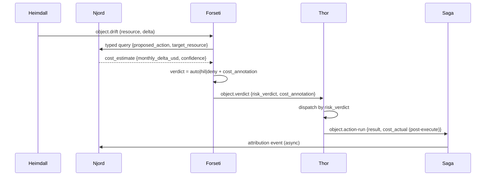

**Exit criteria.**

- Verdict 가 `cost_annotation.monthly_delta_usd` 와
  `cost_annotation.confidence` 와 함께 emit.
- Post-execute audit 가 settlement 데이터 가용 시 `cost_actual` 기록 (T+24h).
- `cost_annotation.monthly_delta_usd > fork_config.cost_ceiling` 인 경우
  HIL 없이 auto verdict 발행 안 됨.

**Promotion gate.** 14일 shadow; 이 워크플로우 audit sample 에서 Njord
cost forecast MAPE < 20%; remediation 에서 cost_annotation 누락 zero.

**Anti-scope.** 예산 강제 아님 (Njord 는 그것을 위해 `CostAnomaly` 를
별도로 emit); SRE action 에 cost 를 annotate 만.

## 2. Predictive scale

**Purpose.** Heimdall 이 saturation 을 감지한 후 반응적으로 scale 하기 전에
Freyr forecast 가 threshold 를 trip 하기 전에 사전에 scale.

**Trigger.** Freyr recurring forecast run (hourly). Forecast 가
`fork_config.predictive_horizon` (default 2시간) 이내 threshold breach 를
예측할 때.

**Agents.** Freyr (initiator), Heimdall (early-signal cross-check), Njord
(cost check), Odin (cost 가 scale block 시 arbitration), Forseti, Thor.

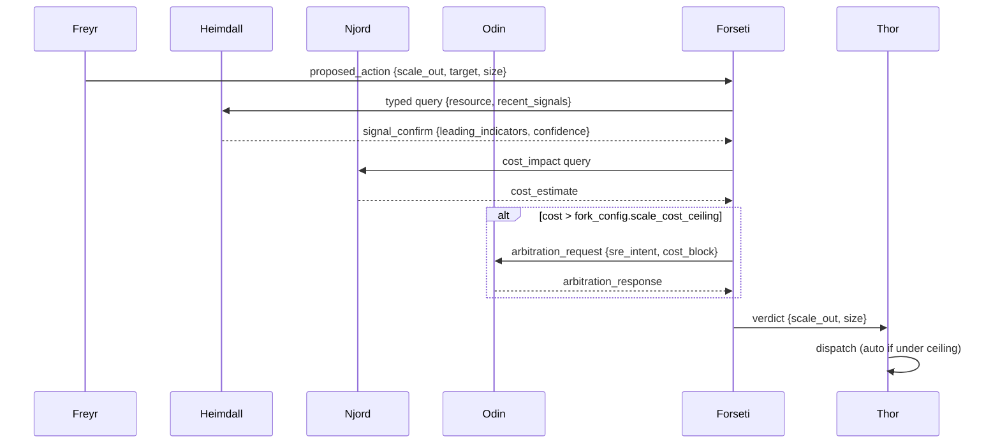

**Exit criteria.**

- Scale action 이 Heimdall 반응적 감지가 발화했을 시점보다 >30분 앞서
  착지 (paired 반응적 baseline 대비 측정).
- Cost 가 block 시 Odin arbitration invoke: 충돌당 정확히 한 번.
- False-positive scale zero (post-hoc 반응적 baseline 이 threshold breach
  없음 표시로 검증).

**Promotion gate.** 30일 shadow; 이 워크플로우 sample 에서 Freyr forecast
MAPE < 15%; false-positive scale rate < 5%.

**Anti-scope.** Autoscale rule 아님 (기존 플랫폼 autoscale 은 계속 실행);
이는 Freyr forecast 에 attributable 한 *의도적* scale action 을 트리거.

## 3. DR drill orchestration

**Purpose.** 실제 incident 을 기다리지 않고 정기적인 재해복구 rehearsal.
Vidar 의 rollback path, DR failover 메커니즘, observability 가 모두
여전히 작동함을 검증.

**Trigger.** Loki 스케줄 (default weekly, fork-configurable).

**Agents.** Loki (planner), Forseti (judge), Var (approver), Vidar (execution),
Heimdall (observation), Norns (learning), Saga.

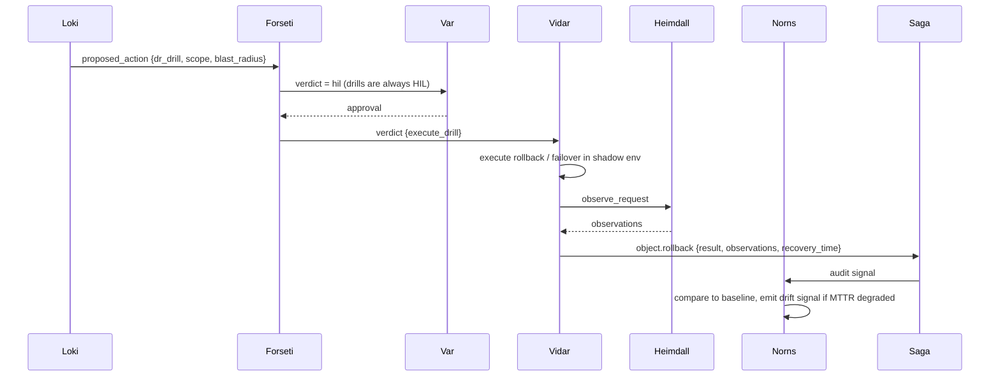

**Exit criteria.**

- Drill 이 Loki 선언 blast_radius 안에서 완료.
- Post-drill MTTR 리포트; 이전 drill baseline 과 비교 저장.
- MTTR degradation > 20% 시 capacity 또는 path 변경을 위한
  `RuleCandidate` 발생.

**Promotion gate.** Shadow 에서 3회 성공적 drill; drill duration < 선언된
budget; unplanned 프로덕션 side-effect zero (Heimdall 의 blast-radius
audit 로 측정).

**Anti-scope.** 실제 DR 아님 - 이는 rehearsal only. 실제 DR failover 는
동일 Vidar action type 을 사용하지만 다른 trigger (incident-classified
emergency).

## 4. Override -> Discovery

**Purpose.** 모든 rule verdict 의 사람 override 는 rule refinement 를
위한 signal. 같은 rule 에 대한 잦은 override 는 rule 이 틀렸거나,
over-scoped 되었거나, critical exception 이 누락됨을 의미.

**Trigger.** Var 가 operator 결정이 Forseti 의 propose 된 verdict 와 다른
`Approval` 을 기록 (deny 에 approve, auto 에 reject 등).

**Agents.** Var (initiator), Saga (aggregator), Norns (learner), Mimir
(rule steward).

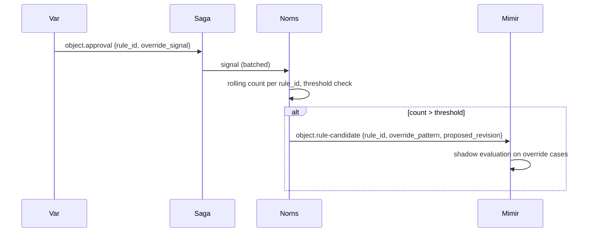

**Exit criteria.**

- 모든 override 가 structured `override_signal` 로 기록.
- Override rate > threshold 인 rule 이 rolling window 당 정확히 하나의
  `RuleCandidate` 생성 (dedup).
- Candidate 가 특정 override 를 참조해서 Mimir 가 context 리뷰 가능.

**Promotion gate.** 60일 shadow; override-to-candidate 전환율이 예상
패턴과 일치 (즉, 모든 override 가 candidate 가 되지는 않음); false-candidate
rate < 10% (Mimir reject rate).

**Anti-scope.** Rule 을 auto-modify 하지 않음. 모든 candidate 는 Mimir 의
정상 promotion 파이프라인을 통과.

## 5. Security escalation

**Purpose.**
[agent-pantheon.md § 9](agent-pantheon-ko.md#9-보안-및-권한-초과-감시)
의 권한 초과 감시 흐름을 promotion gate 가 있는 first-class 워크플로우로
formalize.

**Trigger.** Forseti 가 `type: privilege_escalation_attempt` 로
`object.security-event` emit.

**Agents.** Forseti (initiator), Heimdall (correlator), Odin (critical
severity 경로), Var (ChatOps 를 통한 admin 알림 배송), Saga.

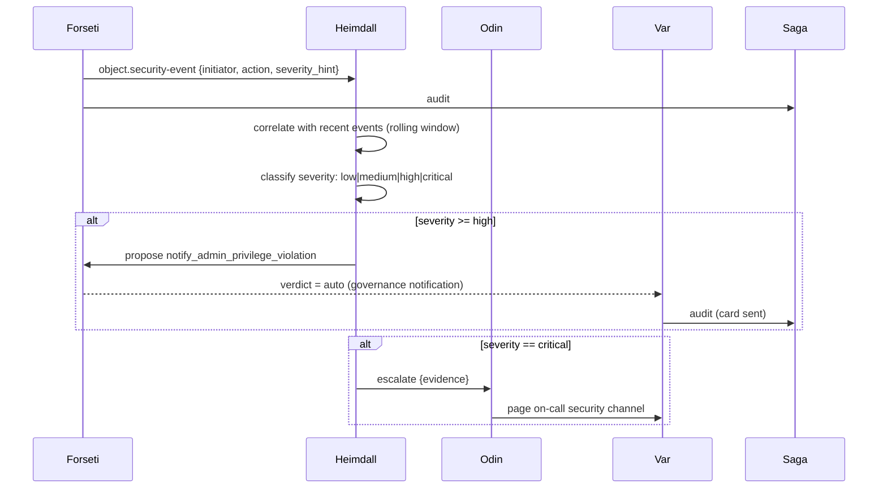

**Exit criteria.**

- 모든 RBAC-deny 가 정확히 하나의 `SecurityEvent` 생성.
- Severity 분류가 deterministic (counter + table only).
- Alert dedup: 1h 이내 same-user same-action 이 하나의 card 로 합침.
- Per-user rate limit: >5 card/hour digest.

**Promotion gate.** 30일 shadow; 주입된 critical 패턴에서 false negative
zero; high 에서 false-positive rate < 5%.

**Anti-scope.** Permission-upgrade flow 를 구현하지 않음 (future work,
pantheon § 9.5 참고).

## 6. Handoff -> Capability

**Purpose.** 모든 unhandled request (Handoff) 는 capability gap. 같은
fingerprint 의 반복 handoff 는 새 rule 또는 새 agent capability 로
전환되어야 함.

**Trigger.** Saga 가 (`escalate_to_github_issue` action 을 통해)
`object.issue` write. Norns 가 fingerprint 로 aggregate.

**Agents.** Saga (initiator), Norns (aggregator), Mimir (rule steward),
Bragi (capability 전달 시 업데이트).

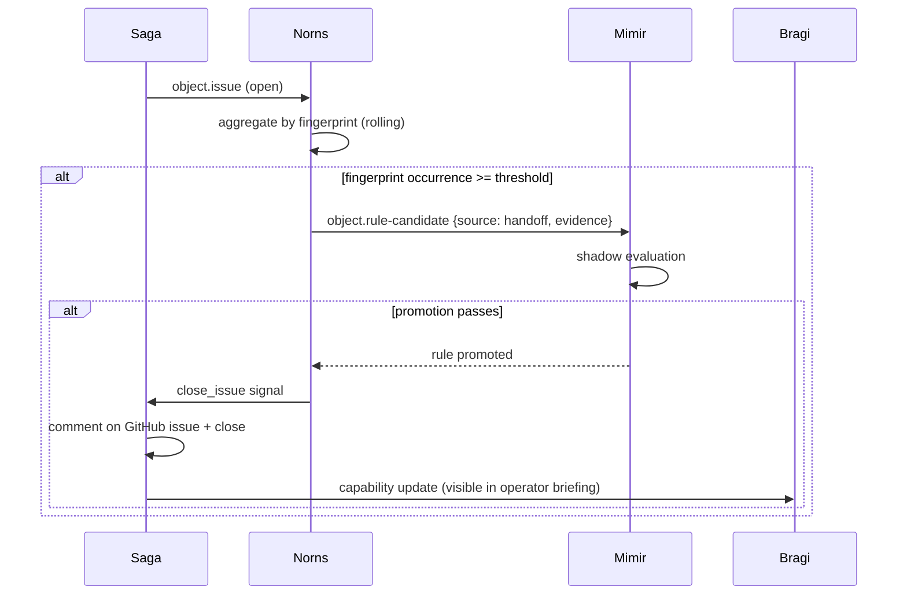

**Exit criteria.**

- Handoff fingerprint 발생 count 를 monotonically tracking.
- Threshold 초과 시 RuleCandidate emit (dedup: rolling window 당
  fingerprint 당 하나의 candidate).
- 승격 + 24h regression clean 후 auto-close.
- 닫는 comment 가 promoting PR 을 link.

**Promotion gate.** 90일 shadow; 전환율 (handoff -> promoted rule)
baseline 캡처; false-close rate < 2%.

**Anti-scope.** Rule 텍스트를 auto-write 하지 않음. Candidate 는 evidence
와 propose 된 shape 를 carry; Mimir + 사람이 리뷰하고 refine.

## 7. Agent health degradation

**Purpose.** 에이전트 자체가 실패 중일 때 시스템이 감지하고, portfolio
priority 를 조정하고, operator 에게 브리핑 - 조용히 저하되어 워크플로우가
깨질 때만 surfacing 되지 않음.

**Trigger.** Heimdall recurring agent-health probe (per-minute heartbeat +
KPI 비교 vs baseline). Heartbeat gap, high error rate, 또는 KPI drift
감지.

**Agents.** Heimdall (detector), Odin (portfolio re-planner), Bragi
(operator briefing), Saga.

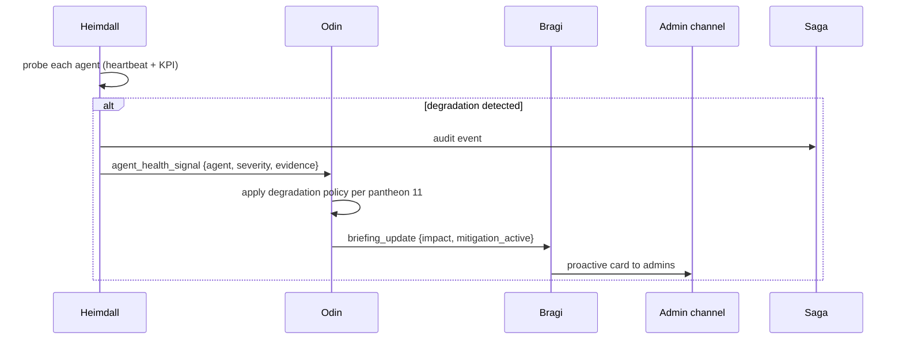

**Exit criteria.**

- 모든 agent 가 선언된 빈도로 probe.
- Degradation policy 활성화가 [pantheon anti-patterns 테이블](agent-pantheon-ko.md#11-anti-patterns)
  과 일치 (예: Saga down -> mutation 거부).
- 감지 후 60초 이내 Bragi 브리핑 배송.

**Promotion gate.** 30일 shadow; 선언된 모든 degradation policy 가 주입된
failure 로 최소 한 번 테스트; briefing latency p99 < 60s.

**Anti-scope.** Self-heal 아님 - Heimdall 은 실패한 agent 를 restart 하지
않음. 복구는 별도 operator action (rollback path 존재 시 Vidar 를 통해).

## 8. Judgment coherence audit

**Purpose.** Forseti 의 verdict 가 시간에 걸쳐 일관되게 유지되는지 검증 -
rule 변경 없이 같은 input 은 같은 verdict 를 생성해야 함. Model drift,
rule 카탈로그 corruption, non-determinism 버그를 잡음.

**Trigger.** Forseti recurring self-test (daily). 최근 verdict 를
sample, 재실행, 비교.

**Agents.** Forseti (self-tester), Muninn (audit sample), Norns (drift analyzer),
Mimir (drift가 rule 변경으로 인한 것인 경우 리뷰), Saga.

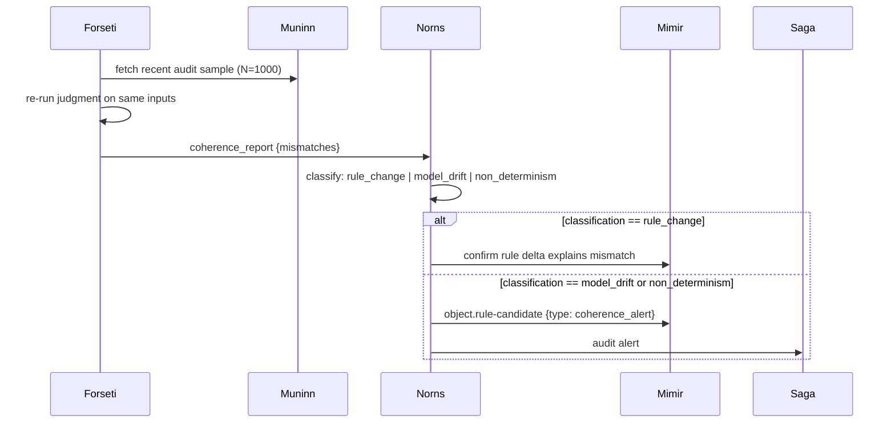

**Exit criteria.**

- Daily coherence run 이 budget 내 완료 (< 15분).
- Mismatch 분류가 deterministic.
- 설명되지 않은 mismatch 가 정확히 하나의 candidate + 하나의 audit alert
  생성.

**Promotion gate.** 60일 shadow; mismatch rate baseline 캡처;
false-drift-alert rate < 5%.

**Anti-scope.** Rule 변경을 자동 롤백하지 않음. 모든 alert 는
investigatory.

## 9. Rollback rehearsal

**Purpose.** ActionType `rollback_contract` 에 선언된 rollback path 가
실제로 작동함을 사전 테스트. Incident 시점에 rollback 이 깨졌음을 발견하는
것 방지.

**Trigger.** Loki 스케줄 (monthly). `fork_config.rollback_rehearsal_scope`
에 기반한 ActionType 서브셋 선택.

**Agents.** Loki (planner), Forseti (judge), Var (approver), Vidar (rehearser),
Heimdall (observer), Saga.

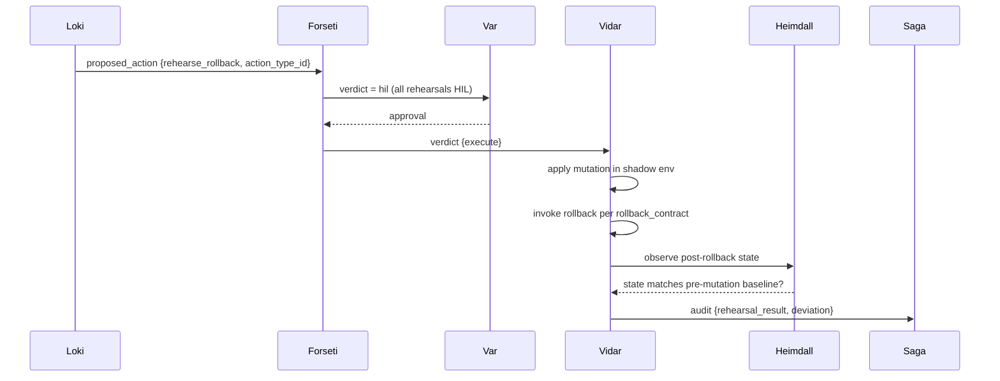

**Exit criteria.**

- Rollback path 가 error 없이 실행.
- Post-rollback state 가 pre-mutation baseline 과 일치 (deviation 리포트
  attach).
- Deviation 시 `RuleCandidate` 발생 (rollback_contract 업데이트 필요).

**Promotion gate.** 각 ActionType 별 3회 성공적 rehearsal 후 shadow
밖에서 enforce 모드 자격. Rehearsal cadence 는 Loki 스케줄로 강제.

**Anti-scope.** 프로덕션 rollback 아님 (Vidar 가 실제 failure 에 반응할 때
실제 path 사용).

## 10. Retrospective what-if

**Purpose.** 과거 incident 이 (audit log 에) 주어졌을 때, 다른 rule
구성 아래 판단을 re-play 하여 "당시에 이 rule 이 있었다면 incident 을
예방했을까?" 답변 - Mimir 의 rule promotion 결정에 중요.

**Trigger.** Manual (Bragi 를 통해 operator) 또는 scheduled
(post-incident).

**Agents.** Saga (data source), Forseti (re-judge), Norns (delta
분석), Mimir (rule 평가), Bragi (리포트).

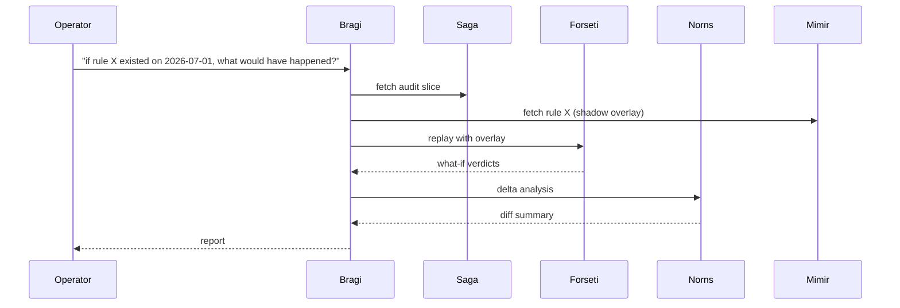

**Exit criteria.**

- Replay 는 judge-only (절대 재실행 안 함).
- Overlay 는 scoped (replay 이벤트만 + 추가된 rule 만).
- 결과 재현 가능 (같은 input + 같은 overlay = 같은 output).

**Promotion gate.** 적용 안 됨 (이 워크플로우는 본질적으로 shadow - 절대
변경을 실행하지 않음).

**Anti-scope.** Saga audit log 를 수정하지 않음. Overlay 는 read-time
projection.

## 11. Operational readiness handoff

**Purpose.** dev-to-ops 경계를 gate: dev 소유 scope 가 운영팀 책임이 되기
전에, 누적된 governance, security, RBAC, reliability posture 를 리뷰하고 하나의
verdict (`clear` / `needs_review` / `blocked`) 를 반환. per-change 리뷰가
놓치는 gap - over-privileged 워크로드 아이덴티티, Owner 를 가진 guest, 누락된
backup - 을 잡음(어떤 단일 diff 도 그 전체 gap 을 만들지 않았음). 전체 설계:
[operational-readiness-ko.md](../operations/operational-readiness-ko.md).

**Trigger.** Huginn 이 `ownership_transfer` signal (handoff PR 라벨,
`lifecycle-stage: handoff` 태그, 또는 operator `request_ops_handoff`) 을
정규화 - 대상 scope, submitter, 대상 environment 를 실음.

**Agents.** Huginn (collector), Mimir (적용 rule set), Forseti (judge /
ReadinessReport), Var (blocked handoff + 제안된 fix 에 대한 HIL approver),
Thor (승인된 fix 의 executor), Saga (auditor).

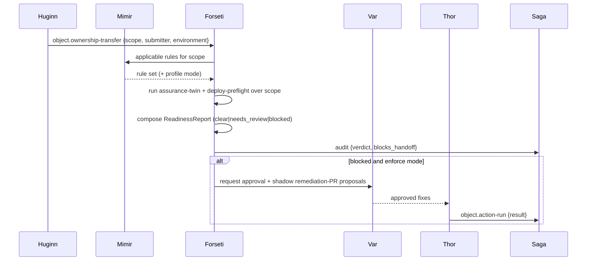

**Exit criteria.**

- 모든 `ownership_transfer` signal 은 정확히 하나의 `ReadinessReport` 를 생성.
- verdict 는 truthful; `blocks_handoff` 는 enforce 모드에서만 true.
- `prod` 로의 promotion 은 어떤 `critical` finding 도 blocking 으로 취급.
- 모든 finding 은 rule 을 인용; ungroundable finding 은 abstain.
- stale inventory 는 stale 상태로 certify 하기보다 certify 를 거부.

**Promotion gate.** environment 당 30일 shadow; 주입된 critical 아이덴티티
패턴에 대해 false negative zero; blocking finding 의 false-positive rate
< 5%.

**Anti-scope.** fix 를 직접 실행하지 않음 (제안만; RBAC fix 는
`remediate.right-size-role` 로 HIL 라우팅). environment 모델을 정의하지 않음
([scope-expansion-ko.md](../fork-and-sequencing/scope-expansion-ko.md) 를 consume). per-deploy 체크가
아님 (그것은 [deployment-preflight-ko.md](../deployment/deployment-preflight-ko.md)).

## 12. Scheduled governed Python task

**Purpose.** Authoring surface 에 VM identity 를 주거나 shell text 를 받지 않고,
immutable generated Python artifact 를 inventory 에서 선택한 GPU VM 하나에서
실행합니다.

**Trigger.** Target Resource 및 `PythonTask` artifact binding 과 함께 scheduler 가
materialize 한 strict five-field cron schedule 입니다.

**Agents.** Bragi 는 authoring translation, Forseti 는 risk verdict, Var 는 Owner HIL
approval, Thor 는 Managed Run Command execution, Saga 는 audit record 를 담당합니다.
Current runtime 은 이러한 책임을 authoring API, scheduler 와 `EventIngest`, unified
risk gate, HIL resume coordinator, tool executor 에 매핑합니다. Optional Pantheon
consumer 는 shadow observer 로 유지되며 proposal 을 실행하지 않습니다.

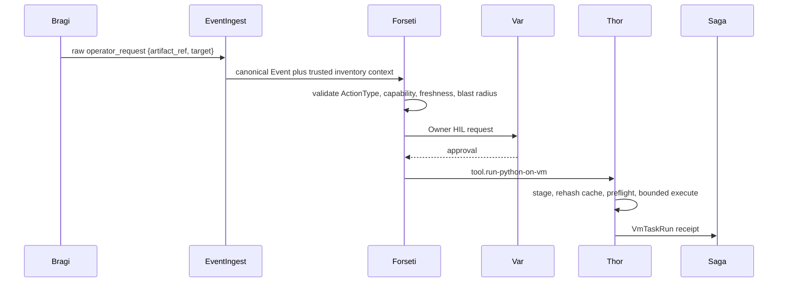

**Exit criteria.** 모든 guest invocation 에서 artifact file 을 다시 검사하고 target 이
active inventory `compute.vm` 이며 GPU task 는 GPU-capable target 에서만 실행됩니다.
Retry 는 같은 Managed Run Command 를 재사용하고 polling failure 시 remote cancel 을
시도하며 모든 terminal result 는 audit 됩니다.

**Promotion gate.** 14일 및 shadow plan 30개, accuracy >= 99%, policy escape zero,
`FDAI_VM_TASK_ENFORCE=1` 전에 explicit Owner review 가 필요합니다.

**Anti-scope.** VM 을 provision 하거나 package 또는 driver 를 설치하거나 shell
command 를 받거나 source 를 event bus 로 전달하거나 risk gate 를 우회하지 않습니다.

## 13. 워크플로우 카탈로그 요약

| # | 이름 | Trigger | Primary agent | Enforce 전제조건 |
|---|------|---------|---------------|-----------------|
| 1 | Cost-aware remediation | Drift / anomaly | Heimdall + Njord | Cost forecast MAPE < 20% |
| 2 | Predictive scale | Freyr forecast (hourly) | Freyr | Forecast MAPE < 15%, FP < 5% |
| 3 | DR drill orchestration | Loki 스케줄 (weekly) | Loki | 3회 shadow drill clean |
| 4 | Override -> Discovery | Var override 이벤트 | Var | 전환율 baseline |
| 5 | Security escalation | Forseti RBAC deny | Forseti | Critical FN zero, FP < 5% |
| 6 | Handoff -> Capability | Saga issue 생성 | Saga | 전환 baseline, FC < 2% |
| 7 | Agent health degradation | Heimdall probe | Heimdall | 모든 degradation 테스트 |
| 8 | Judgment coherence audit | Forseti self-test | Forseti | Drift-alert FP < 5% |
| 9 | Rollback rehearsal | Loki 스케줄 (monthly) | Loki | ActionType 당 3회 rehearsal |
| 10 | Retrospective what-if | Operator 또는 post-incident | Bragi | (본질적으로 shadow) |
| 11 | Operational readiness handoff | `ownership_transfer` signal | Forseti | env당 30일 shadow, critical FN zero, FP < 5% |
| 12 | Scheduled governed Python task | Strict cron schedule | Forseti + Thor | plan 30개, accuracy >= 99%, escape zero, Owner HIL |

## Next steps

| 학습 주제 | 읽기 |
|----------|------|
| 위에서 참조된 판테온 역할 | [agent-pantheon.md](agent-pantheon-ko.md) |
| 각 워크플로우를 착지시키는 웨이브 계획 | [agent-pantheon-implementation.md § Wave 7](agent-pantheon-implementation-ko.md#11-wave-7---shadow-로-cross-agent-workflows) |
| 각 워크플로우가 소비하는 ActionType 스키마 | [action-ontology.md](../decisioning/action-ontology-ko.md) |
| 각 verdict 가 대응하는 risk classification | [risk-classification.md](../decisioning/risk-classification-ko.md) |
