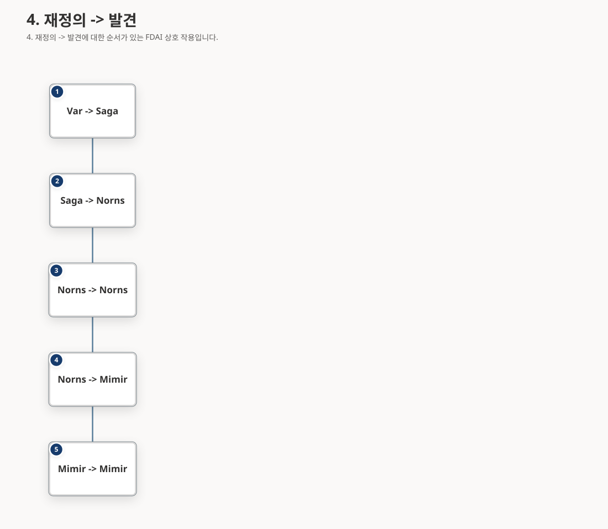
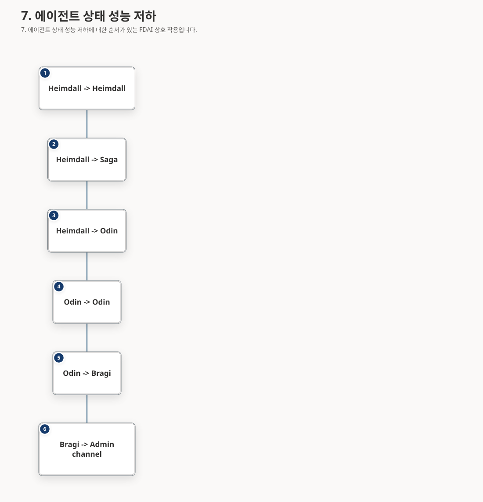
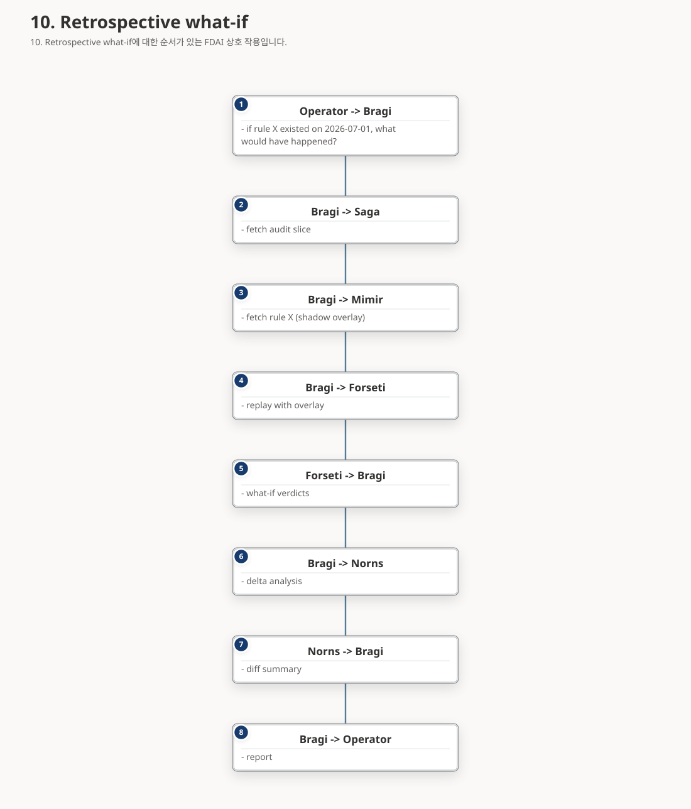

# 에이전트 워크플로우

판테온이 제품 수준 기능 로 조합하는 13개 cross-agent 워크플로우. 각
워크플로우는 참여 에이전트, 트리거, 종단간 순서, exit criteria 를
명명한다. 모든 워크플로우는 shadow 모드로 먼저 배포
([agent-pantheon-implementation.md § Wave 7](agent-pantheon-implementation-ko.md#11-wave-7---shadow-로-cross-agent-workflows))
되고 Wave 8 이 KPI 를 측정한 후 per-workflow 로 승격된다.

> **범위:** 워크플로우는 고객-무관이다. 예시의 구체적 리소스 이름은
> 자리 표시자
> ([generic-scope.instructions.md](../../../.github/instructions/generic-scope.instructions.md)).
>
> **계약:** 모든 스텝은 schema-checked 토픽 위 pub/sub 이벤트
> ([agent-pantheon.md § 6.1](agent-pantheon-ko.md#61-typed-port) 참고).
> 어떤 워크플로우도 에이전트 간 직접 RPC 를 사용하지 않는다. HIL 스텝은
> Var 를 통과; 감사 는 Saga 를 통과. 지름길 없음.
>
> **머신-리더블 형태.** Shipped executable 작업 흐름은
> [`rule-catalog/workflows/`](../../../rule-catalog/workflows) 아래에 있습니다.
> 이 design 인벤토리는 현재 카탈로그보다 넓으며 섹션마다 파일 하나가 있다는
> 의미가 아닙니다. 스키마, `Process` ObjectType, compile-to-Runbook 배선은
> [process-automation.md](../decisioning/process-automation-ko.md)에 정의됩니다.

## 구현 상태

### 구현 범위

| 영역 | 상태 | 근거 | 참고 |
|------|------|------|------|
| 13개 작업 흐름 메타데이터 레지스트리 | implemented | `services/core-control-plane/src/fdai/agents/_framework/workflows.py`; `services/core-control-plane/tests/agents/test_wave7_workflows.py` | 등록된 모든 작업 흐름은 `shadow`가 기본값입니다. 레지스트리는 메타데이터이므로 그 자체로 배포된 종단 간 작업 흐름을 증명하지 않습니다. |
| 실행 가능한 shadow 추적 참조 | implemented | `services/core-control-plane/tests/agents/test_wave7_workflows.py`; `services/core-control-plane/tests/composition/test_readiness_service.py`; `services/core-control-plane/tests/core/test_control_loop_operator_request.py`; `services/core-control-plane/tests/agents/test_detection_readiness.py` | 집중 테스트가 등록된 추적 경로를 다룹니다. 이는 구현 근거이며 보존된 운영 추적은 아닙니다. |
| 게시된 작업 흐름 순서도 | validated | `docs/diagrams/fdai-agent-workflows-*.diagram.yaml`, `tools/architecture-diagrams/test/agent-workflows.test.ts`, 정확한 SHA의 CI 및 Pages 실행, 실제 이중 언어 geometry 검사 | 게시된 다이어그램 12개는 중앙에 배치된 이중 언어 카드에서 완전한 송신자와 수신자 이름 및 타입이 지정된 메시지를 표시합니다. 이 표현은 직접 호출, 작업 흐름 상태, 권한 또는 승격 근거를 추가하지 않습니다. |
| 기계 판독형 작업 흐름 카탈로그 | in-progress | `rule-catalog/workflows/`; `docs/roadmap/decisioning/process-automation.md` | 실행 카탈로그는 의도적으로 이 설계 인벤토리보다 좁으며, 섹션마다 파일 하나를 투영하지 않습니다. |
| 측정된 승격 게이트 | not-started | 이 문서와 `services/core-control-plane/src/fdai/agents/_framework/workflows.py`의 승격 임계값 | 필요한 shadow 기간, KPI 기준선, 작업 흐름별 게이트 결과를 증명하는 보존 근거가 없습니다. |
| 적용 모드 승격 | not-started | `services/core-control-plane/src/fdai/agents/_framework/workflows.py`의 `default_mode="shadow"` | 승격은 작업 흐름별로 독립적입니다. 회고적 가정 분석은 본질적으로 shadow이며 적용 대상이 아닙니다. |

### 구현 이력

| 날짜 | 상태 | 변경 | 근거 | 남은 작업 |
|------|------|------|------|-----------|
| 2026-08-20 | validated | 수정한 작업 흐름 다이어그램에 대해 정확한 소스의 CI, Pages 배포 및 실제 이중 언어 geometry 근거를 보존했습니다. 배포된 SVG 24개는 모든 노드에 메시지 본문을 표시하고 순서를 오차 없이 중앙에 배치하며 text overflow와 node overlap이 모두 0건입니다. 영어 및 한국어 route도 desktop, constrained desktop 및 mobile 너비에서 page 또는 diagram host overflow가 없습니다. | 커밋 `c22ea624b`, [CI 실행 32336843459](https://github.com/dotnetpower/fdai/actions/runs/32336843459), [Pages 실행 32336843527](https://github.com/dotnetpower/fdai/actions/runs/32336843527), 실제 `1440x900`, `993x641`, `390x844` 검사 | 게시된 순서도 회귀에 남은 작업은 없습니다. 런타임 승격 근거는 별도 열린 작업으로 유지합니다. |
| 2026-08-20 | implemented | 실제 화면 검토에서 모든 작업 흐름이 왼쪽에 치우친 좁은 에이전트 연결로 축소되고 타입이 지정된 메시지는 카드에서 보이지 않으며 Njord 같은 반환 화살표 송신자가 잘리는 문제를 확인한 뒤 게시된 순서도 표현을 수정했습니다. 이제 순서 카드는 범위가 제한된 메시지 본문을 표시하고 정렬된 연결을 중앙에 배치하며 완전한 참여자 별칭을 보존합니다. | `current change`, 이중 언어 작업 흐름 spec 12개와 미러 자산, diagram compiler 테스트 95개, typecheck, 자산 최신성, public migration pair 35개, 집중 site 계약 10개 및 EN/KO 직접 geometry 검사에서 text overflow와 node overlap 0건 | 시각적 회귀를 닫기 전에 정확한 소스의 Pages 배포 근거를 보존합니다. 런타임 승격 근거는 별도 열린 작업으로 유지합니다. |
| 2026-08-13 | implemented | 구현 원장을 도입하고 작업 흐름 인벤토리를 메타데이터 레지스트리 및 집중 shadow 테스트와 대조했습니다. 이전 구현 이력은 재구성하지 않았습니다. | 현재 변경; 집중 작업 흐름 테스트 | 필요한 카탈로그 투영을 완료하고 운영 shadow 근거를 보존하며 승격 게이트를 독립적으로 평가합니다. |

### 남은 작업

- [ ] 설계 인벤토리의 어떤 작업 흐름에 기계 판독형 카탈로그 항목이 필요한지 결정하고, 문서화된 비일대일 경계를 유지합니다.
- [ ] 운영 환경에서 작업 흐름별 shadow 기간, KPI 기준선, 정책 위반 탈출, 추적 근거를 보존합니다.
- [ ] 승격 대상 작업 흐름의 결과를 각각 평가하고 기록합니다. 회고적 가정 분석은 승격하지 않습니다.

## 0. 워크플로우 형태

모든 워크플로우 선언은 같은 구조를 따른다:

- **용도** - 워크플로우가 전달하는 비즈니스 기능.
- **트리거** - 흐름을 시작하는 이벤트 또는 스케줄.
- **에이전트** - 역할 라벨 이 붙은 기본 + supporting.
- **순서** - typed-port 메시지를 보여주는 mermaid diagram.
- **Exit criteria** - shadow 추적 성공 조건의 측정 가능한 조건.
- **승격 게이트** - 강제 적용 모드에 필요한 KPI 임계값.
- **Anti-scope** - 워크플로우가 의도적으로 하지 않는 것.

워크플로우는 새 온톨로지 타입 이나 ActionType 을 추가하지 않는다;
`rule-catalog/action-types/` 의 기존 카탈로그와
`rule-catalog/vocabulary/object-types/` 의 객체 타입 을 소비한다. 새
타입 이 필요한 워크플로우는 업스트림 doc PR 을 먼저 열라는 신호이다.

## 1. Cost-aware 수정

**용도.** 모든 SRE 교정 이 비용 영향 를 첨부 해서 판정 가
reliability 와 finance 를 모두 반영. 자동화가 1달러 on-call 시간을 아끼려고
10달러 compute 를 쓰는 것 방지.

**트리거.** Heimdall 이 기존 룰 매칭이 있는 리소스에서 `object.drift`
(declared vs actual 불일치) 또는 `object.anomaly` publish.

**에이전트.** Heimdall (initiator), Njord (비용 advisor), Forseti (판정자),
Thor (실행기), Saga (auditor).

**Exit criteria.**

- Verdict 가 `cost_annotation.monthly_delta_usd` 와
  `cost_annotation.confidence` 와 함께 발행.
- Post-execute 감사 가 settlement 데이터 가용 시 `cost_actual` 기록 (T+24h).
- `cost_annotation.monthly_delta_usd > fork_config.cost_ceiling` 인 경우
  HIL 없이 auto 판정 발행 안 됨.

**승격 게이트.** 14일 shadow; 이 워크플로우 감사 샘플 에서 Njord
비용 예측 MAPE < 20%; 교정 에서 cost_annotation 누락 zero.

**Anti-scope.** 예산 강제 아님 (Njord 는 그것을 위해 `CostAnomaly` 를
별도로 발행); SRE 액션 에 비용 를 annotate 만.

## 2. Predictive 규모

**용도.** Heimdall 이 포화 을 감지한 후 반응적으로 규모 하기 전에
Freyr 예측 가 임계값 를 trip 하기 전에 사전에 규모.

**트리거.** Freyr recurring 예측 실행 (hourly). 예측 가
`fork_config.predictive_horizon` (기본값 2시간) 이내 임계값 breach 를
예측할 때.

**에이전트.** Freyr (initiator), Heimdall (early-signal 교차 검증), Njord
(비용 검사), Odin (비용 가 규모 블록 시 중재), Forseti, Thor.

**Exit criteria.**

- 규모 액션 이 Heimdall 반응적 감지가 발화했을 시점보다 >30분 앞서
  착지 (paired 반응적 기준선 대비 측정).
- 비용 가 블록 시 Odin 중재 invoke: 충돌당 정확히 한 번.
- False-positive 규모 zero (post-hoc 반응적 기준선 이 임계값 breach
  없음 표시로 검증).

**승격 게이트.** 30일 shadow; 이 워크플로우 샘플 에서 Freyr 예측
MAPE < 15%; false-positive 규모 비율 < 5%.

**Anti-scope.** Autoscale 룰 아님 (기존 플랫폼 autoscale 은 계속 실행);
이는 Freyr 예측 에 attributable 한 *의도적* 규모 액션 을 트리거.

## 3. DR 훈련 orchestration

**용도.** 실제 인시던트 을 기다리지 않고 정기적인 재해복구 예행 연습.
Vidar 의 롤백 경로, DR 장애 조치 메커니즘, observability 가 모두
여전히 작동함을 검증.

**트리거.** Loki 스케줄 (기본값 weekly, fork-configurable).

**에이전트.** Loki (플래너), Forseti (판정자), Var (승인자), Vidar (실행),
Heimdall (관측), Norns (learning), Saga.

**Exit criteria.**

- 훈련 이 Loki 선언 blast_radius 안에서 완료.
- Post-drill MTTR 리포트; 이전 훈련 기준선 과 비교 저장.
- MTTR 성능 저하 > 20% 시 용량 또는 경로 변경을 위한
  `RuleCandidate` 발생.

**승격 게이트.** Shadow 에서 3회 성공적 훈련; 훈련 소요 시간 < 선언된
예산; unplanned 프로덕션 side-effect zero (Heimdall 의 blast-radius
감사 로 측정).

**Anti-scope.** 실제 DR 아님 - 이는 예행 연습 only. 실제 DR 장애 조치 는
동일 Vidar 액션 타입 을 사용하지만 다른 트리거 (incident-classified
emergency).

## 4. 재정의 -> 발견

**용도.** 모든 룰 판정 의 사람 재정의 는 룰 구체화 를
위한 신호. 같은 룰 에 대한 잦은 재정의 는 룰 이 틀렸거나,
over-scoped 되었거나, critical exception 이 누락됨을 의미.

**트리거.** Var 가 운영자 결정이 Forseti 의 propose 된 판정 와 다른
`Approval` 을 기록 (거부 에 approve, auto 에 거부 등).

**에이전트.** Var (initiator), Saga (aggregator), Norns (learner), Mimir
(룰 담당자).

**Exit criteria.**

- 모든 재정의 가 구조화된 `override_signal` 로 기록.
- 재정의 비율 > 임계값 인 룰 이 rolling 구간 당 정확히 하나의
  `RuleCandidate` 생성 (dedup).
- 후보 가 특정 재정의 를 참조해서 Mimir 가 맥락 리뷰 가능.

**승격 게이트.** 60일 shadow; override-to-candidate 전환율이 예상
패턴과 일치 (즉, 모든 재정의 가 후보 가 되지는 않음); false-candidate
비율 < 10% (Mimir 거부 비율).

**Anti-scope.** Rule 을 auto-modify 하지 않음. 모든 후보 는 Mimir 의
정상 승격 파이프라인을 통과.

## 5. Security 에스컬레이션

**용도.**
[agent-pantheon.md § 9](agent-pantheon-ko.md#9-보안-및-권한-초과-감시)
의 권한 초과 감시 흐름을 승격 게이트 가 있는 일급 워크플로우로
formalize.

**트리거.** Forseti 가 `type: privilege_escalation_attempt` 로
`object.security-event` 발행.

**에이전트.** Forseti (initiator), Heimdall (correlator), Odin (critical
심각도 경로), Var (ChatOps 를 통한 admin 알림 배송), Saga.

**Exit criteria.**

- 모든 RBAC-deny 가 정확히 하나의 `SecurityEvent` 생성.
- 심각도 분류가 결정론적 (counter + 표 only).
- 경보 dedup: 1h 이내 same-user same-action 이 하나의 카드 로 합침.
- Per-user 비율 한도: >5 카드/시간 다이제스트.

**승격 게이트.** 30일 shadow; 주입된 critical 패턴에서 false 부정
zero; high 에서 false-positive 비율 < 5%.

**Anti-scope.** Permission-upgrade 흐름 를 구현하지 않음 (future 작업,
pantheon § 9.5 참고).

## 6. 인계 -> 기능

**용도.** 모든 unhandled 요청 (인계) 는 기능 공백. 같은
지문 의 반복 인계 는 새 룰 또는 새 에이전트 기능 로
전환되어야 함.

**트리거.** Saga 가 (`escalate_to_github_issue` 액션 을 통해)
`object.issue` 쓰기. Norns 가 지문 로 집계.

**에이전트.** Saga (initiator), Norns (aggregator), Mimir (룰 담당자),
Bragi (기능 전달 시 업데이트).

**Exit criteria.**

- 인계 지문 발생 개수 를 monotonically tracking.
- 임계값 초과 시 RuleCandidate 발행 (dedup: rolling 구간 당
  지문 당 하나의 후보).
- 승격 + 24h 회귀 clean 후 auto-close.
- 닫는 comment 가 promoting PR 을 링크.

**승격 게이트.** 90일 shadow; 전환율 (인계 -> promoted 룰)
기준선 캡처; false-close 비율 < 2%.

**Anti-scope.** Rule 텍스트를 auto-write 하지 않음. 후보 는 근거
와 propose 된 형태 를 carry; Mimir + 사람이 리뷰하고 refine.

## 7. 에이전트 상태 성능 저하

**용도.** 에이전트 자체가 실패 중일 때 시스템이 감지하고, portfolio
priority 를 조정하고, 운영자 에게 브리핑 - 조용히 저하되어 워크플로우가
깨질 때만 surfacing 되지 않음.

**트리거.** Heimdall recurring agent-health 탐색 (per-minute 하트비트 +
KPI 비교 vs 기준선). 하트비트 공백, high 오류 비율, 또는 KPI 표류
감지.

**에이전트.** Heimdall (detector), Odin (portfolio re-planner), Bragi
(운영자 briefing), Saga.

**Exit criteria.**

- 모든 에이전트 가 선언된 빈도로 탐색.
- 성능 저하 정책 활성화가 [pantheon anti-patterns 테이블](agent-pantheon-ko.md#11-anti-patterns)
  과 일치 (예: Saga down -> 변경 거부).
- 감지 후 60초 이내 Bragi 브리핑 배송.

**승격 게이트.** 30일 shadow; 선언된 모든 성능 저하 정책 가 주입된
실패 로 최소 한 번 테스트; briefing 지연 시간 p99 < 60s.

**Anti-scope.** Self-heal 아님 - Heimdall 은 실패한 에이전트 를 재시작 하지
않음. 복구는 별도 운영자 액션 (롤백 경로 존재 시 Vidar 를 통해).

## 8. Judgment coherence 감사

**용도.** Forseti 의 판정 가 시간에 걸쳐 일관되게 유지되는지 검증 -
룰 변경 없이 같은 입력 은 같은 판정 를 생성해야 함. 모델 표류,
룰 카탈로그 corruption, non-determinism 버그를 잡음.

**트리거.** Forseti recurring self-test (daily). 최근 판정 를
샘플, 재실행, 비교.

**에이전트.** Forseti (self-tester), Muninn (감사 샘플), Norns (표류 analyzer),
Mimir (표류가 룰 변경으로 인한 것인 경우 리뷰), Saga.

**Exit criteria.**

- Daily coherence 실행 이 예산 내 완료 (< 15분).
- Mismatch 분류가 결정론적.
- 설명되지 않은 mismatch 가 정확히 하나의 후보 + 하나의 감사 경보
  생성.

**승격 게이트.** 60일 shadow; mismatch 비율 기준선 캡처;
false-drift-alert 비율 < 5%.

**Anti-scope.** Rule 변경을 자동 롤백하지 않음. 모든 경보 는
investigatory.

## 9. Rollback 예행 연습

**용도.** ActionType `rollback_contract` 에 선언된 롤백 경로 가
실제로 작동함을 사전 테스트. 인시던트 시점에 롤백 이 깨졌음을 발견하는
것 방지.

**트리거.** Loki 스케줄 (monthly). `fork_config.rollback_rehearsal_scope`
에 기반한 ActionType 서브셋 선택.

**에이전트.** Loki (플래너), Forseti (판정자), Var (승인자), Vidar (rehearser),
Heimdall (관찰기), Saga.

**Exit criteria.**

- Rollback 경로 가 오류 없이 실행.
- Post-rollback 상태 가 pre-mutation 기준선 과 일치 (deviation 리포트
  첨부).
- Deviation 시 `RuleCandidate` 발생 (rollback_contract 업데이트 필요).

**승격 게이트.** 각 ActionType 별 3회 성공적 예행 연습 후 shadow
밖에서 강제 적용 모드 자격. 예행 연습 cadence 는 Loki 스케줄로 강제.

**Anti-scope.** 프로덕션 롤백 아님 (Vidar 가 실제 실패 에 반응할 때
실제 경로 사용).

## 10. Retrospective what-if

**용도.** 과거 인시던트 이 (감사 로그 에) 주어졌을 때, 다른 룰
구성 아래 판단을 re-play 하여 "당시에 이 룰 이 있었다면 인시던트 을
예방했을까?" 답변 - Mimir 의 룰 승격 결정에 중요.

**트리거.** 수동 (Bragi 를 통해 운영자) 또는 scheduled
(post-incident).

**에이전트.** Saga (데이터 출처), Forseti (re-judge), Norns (delta
분석), Mimir (룰 평가), Bragi (리포트).

**Exit criteria.**

- 재생 는 judge-only (절대 재실행 안 함).
- 오버레이 는 scoped (재생 이벤트만 + 추가된 룰 만).
- 결과 재현 가능 (같은 입력 + 같은 오버레이 = 같은 출력).

**승격 게이트.** 적용 안 됨 (이 워크플로우는 본질적으로 shadow - 절대
변경을 실행하지 않음).

**Anti-scope.** Saga 감사 로그 를 수정하지 않음. 오버레이 는 read-time
변환 결과.

## 11. Operational 준비 상태 인계

**용도.** dev-to-ops 경계를 게이트: dev 소유 범위 가 운영팀 책임이 되기
전에, 누적된 거버넌스, security, RBAC, reliability 자세 를 리뷰하고 하나의
판정 (`clear` / `needs_review` / `blocked`) 를 반환. per-change 리뷰가
놓치는 공백 - over-privileged 워크로드 아이덴티티, Owner 를 가진 게스트, 누락된
백업 - 을 잡음(어떤 단일 차이 도 그 전체 공백 을 만들지 않았음). 전체 설계:
[operational-readiness-ko.md](../operations/operational-readiness-ko.md).

**트리거.** Huginn 이 `ownership_transfer` 신호 (인계 PR 라벨,
`lifecycle-stage: handoff` 태그, 또는 운영자 `request_ops_handoff`) 을
정규화 - 대상 범위, submitter, 대상 환경 를 실음.

**에이전트.** Huginn (수집기), Mimir (적용 룰 집합), Forseti (판정자 /
ReadinessReport), Var (차단된 인계 + 제안된 fix 에 대한 HIL 승인자),
Thor (승인된 fix 의 실행기), Saga (auditor).

**Exit criteria.**

- 모든 `ownership_transfer` 신호 은 정확히 하나의 `ReadinessReport` 를 생성.
- 판정 는 truthful; `blocks_handoff` 는 강제 적용 모드에서만 true.
- `prod` 로의 승격 은 어떤 `critical` 발견 사항 도 차단 으로 취급.
- 모든 발견 사항 은 룰 을 인용; ungroundable 발견 사항 은 abstain.
- stale 인벤토리 는 stale 상태로 certify 하기보다 certify 를 거부.

**승격 게이트.** 환경 당 30일 shadow; 주입된 critical 아이덴티티
패턴에 대해 false 부정 zero; 차단 발견 사항 의 false-positive 비율
< 5%.

**Anti-scope.** fix 를 직접 실행하지 않음 (제안만; RBAC fix 는
`remediate.right-size-role` 로 HIL 라우팅). 환경 모델을 정의하지 않음
([scope-expansion-ko.md](../fork-and-sequencing/scope-expansion-ko.md) 를 consume). per-deploy 체크가
아님 (그것은 [deployment-preflight-ko.md](../deployment/deployment-preflight-ko.md)).

## 12. Scheduled 통제된 Python 작업

**용도.** Authoring 표면 에 VM 신원 를 주거나 셸 텍스트 를 받지 않고,
변경할 수 없는 생성된 Python 산출물 를 인벤토리 에서 선택한 GPU VM 하나에서
실행합니다.

**트리거.** 대상 Resource 및 `PythonTask` 산출물 연결 과 함께 스케줄러 가
materialize 한 strict five-field cron 예약 입니다.

**에이전트.** Bragi 는 authoring translation, Forseti 는 risk 판정, Var 는 Owner HIL
승인, Thor 는 Managed Run Command 실행, Saga 는 감사 기록 를 담당합니다.
현재 런타임 은 이러한 책임을 authoring API, 스케줄러 와 `EventIngest`, unified
risk 게이트, HIL 재개 조정기, 도구 실행기 에 매핑합니다. 선택적 Pantheon
소비자 는 shadow 관찰기 로 유지되며 제안 을 실행하지 않습니다.

**Exit criteria.** 모든 게스트 호출 에서 산출물 파일 을 다시 검사하고 대상 이
활성 인벤토리 `compute.vm` 이며 GPU 작업 는 GPU-capable 대상 에서만 실행됩니다.
재시도 는 같은 Managed Run Command 를 재사용하고 polling 실패 시 원격 취소 을
시도하며 모든 최종 결과 는 감사 됩니다.

**승격 게이트.** 14일 및 shadow 계획 30개, accuracy >= 99%, 정책 escape zero,
`FDAI_VM_TASK_ENFORCE=1` 전에 명시적 Owner 검토 가 필요합니다.

**Anti-scope.** VM 을 provision 하거나 패키지 또는 driver 를 설치하거나 셸
명령 를 받거나 출처 를 이벤트 버스 로 전달하거나 risk 게이트 를 우회하지 않습니다.

## 13. 워크플로우 카탈로그 요약

| # | 이름 | 트리거 | 기본 에이전트 | 강제 적용 전제조건 |
|---|------|---------|---------------|-----------------|
| 1 | Cost-aware 교정 | 표류 / anomaly | Heimdall + Njord | 비용 예측 MAPE < 20% |
| 2 | Predictive 규모 | Freyr 예측 (hourly) | Freyr | 예측 MAPE < 15%, FP < 5% |
| 3 | DR 훈련 orchestration | Loki 스케줄 (weekly) | Loki | 3회 shadow 훈련 clean |
| 4 | 재정의 -> 발견 | Var 재정의 이벤트 | Var | 전환율 기준선 |
| 5 | Security 에스컬레이션 | Forseti RBAC 거부 | Forseti | Critical FN zero, FP < 5% |
| 6 | 인계 -> 기능 | Saga issue 생성 | Saga | 전환 기준선, FC < 2% |
| 7 | 에이전트 상태 성능 저하 | Heimdall 탐색 | Heimdall | 모든 성능 저하 테스트 |
| 8 | Judgment coherence 감사 | Forseti self-test | Forseti | Drift-alert FP < 5% |
| 9 | Rollback 예행 연습 | Loki 스케줄 (monthly) | Loki | ActionType 당 3회 예행 연습 |
| 10 | Retrospective what-if | Operator 또는 post-incident | Bragi | (본질적으로 shadow) |
| 11 | Operational 준비 상태 인계 | `ownership_transfer` 신호 | Forseti | env당 30일 shadow, critical FN zero, FP < 5% |
| 12 | Scheduled 통제된 Python 작업 | Strict cron 예약 | Forseti + Thor | 계획 30개, accuracy >= 99%, escape zero, Owner HIL |
| 13 | Detection 준비 상태 assurance | `detection.readiness.observed` | Heimdall | 대상별 30일 shadow, false-ready zero, stale p99 < 15분 |
## Next 단계

| 학습 주제 | 읽기 |
|----------|------|
| 위에서 참조된 판테온 역할 | [agent-pantheon.md](agent-pantheon-ko.md) |
| 각 워크플로우를 착지시키는 웨이브 계획 | [agent-pantheon-implementation.md § Wave 7](agent-pantheon-implementation-ko.md#11-wave-7---shadow-로-cross-agent-workflows) |
| 각 워크플로우가 소비하는 ActionType 스키마 | [action-ontology.md](../decisioning/action-ontology-ko.md) |
| 각 판정 가 대응하는 risk 분류 | [risk-classification.md](../decisioning/risk-classification-ko.md) |
