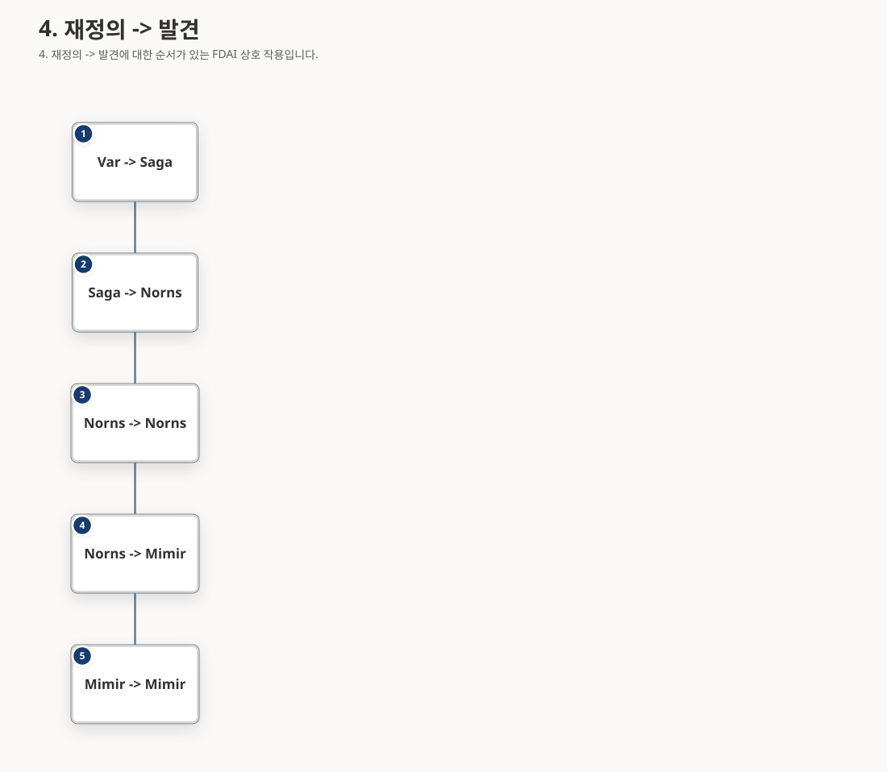
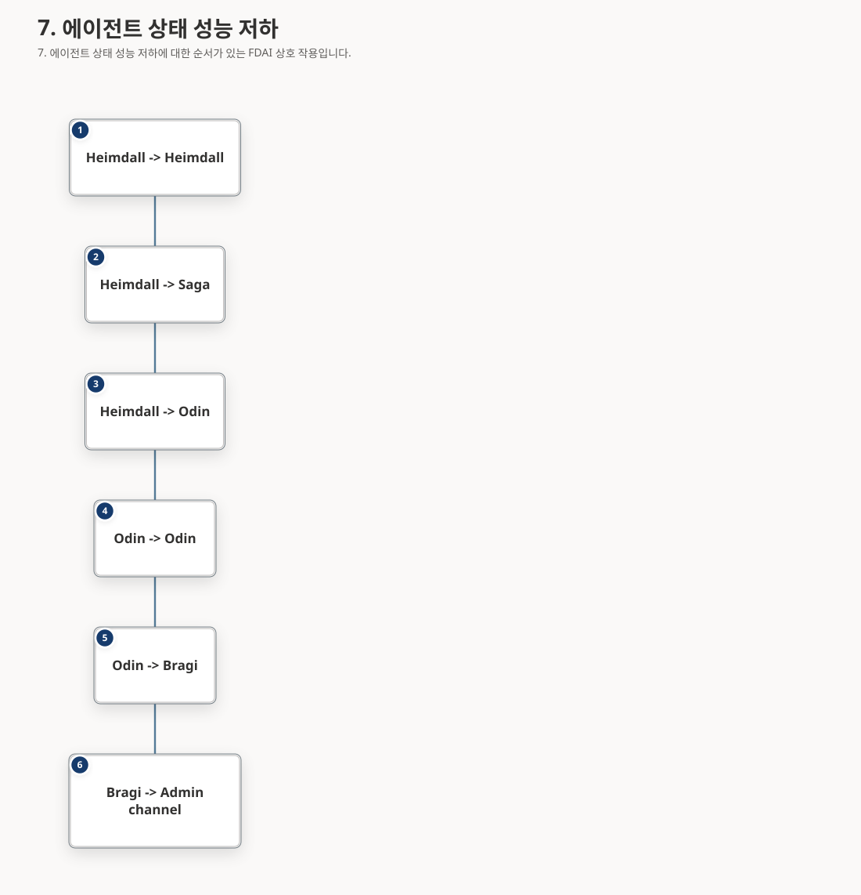
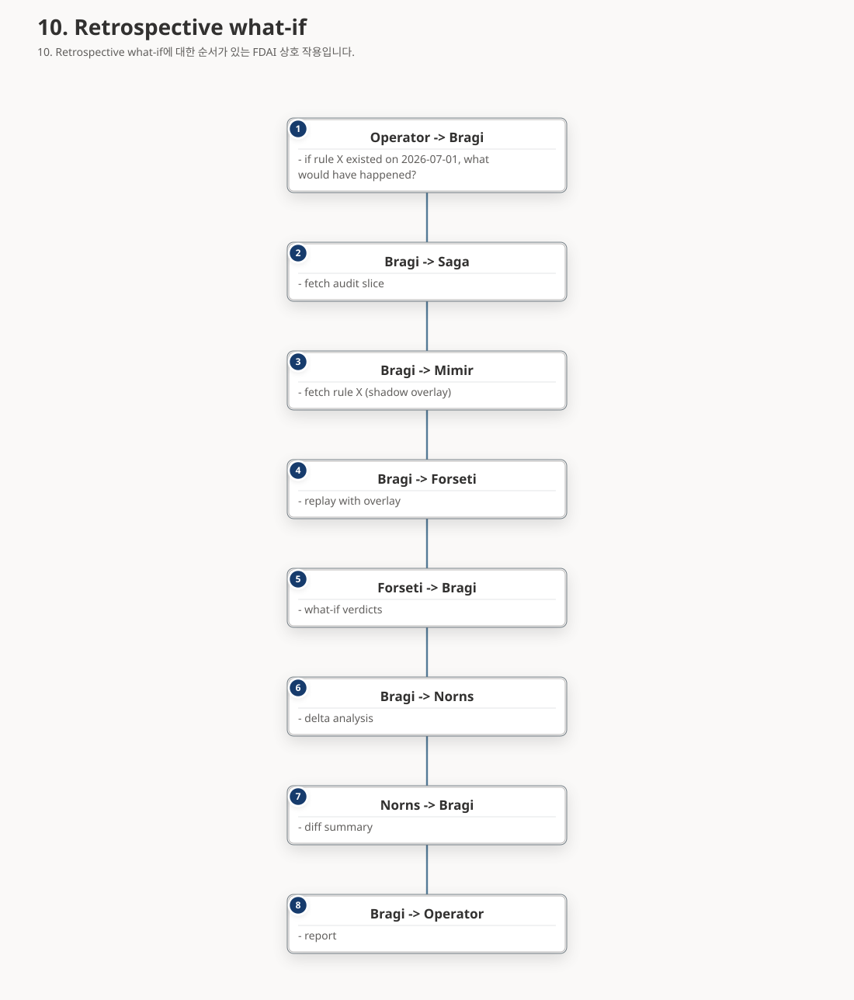

# 에이전트 워크플로우

판테온이 제품 수준 기능으로 조합하는 13개 cross-agent 워크플로우. 각
워크플로우는 참여 에이전트, 트리거, 종단간 순서, exit criteria를
명명한다. 모든 워크플로우는 shadow 모드로 먼저 배포
([agent-pantheon-implementation.md § Wave 7](agent-pantheon-implementation-ko.md#11-wave-7---shadow-로-cross-agent-workflows))
되고 Wave 8이 KPI를 측정한 후 per-workflow로 승격된다.

> **범위:** 워크플로우는 고객-무관이다. 예시의 구체적 리소스 이름은
> 자리 표시자
> ([generic-scope.instructions.md](../../../.github/instructions/generic-scope.instructions.md)).
>
> **계약:** 모든 스텝은 schema-checked 토픽 위 pub/sub 이벤트
> ([agent-pantheon.md § 6.1](agent-pantheon-ko.md#61-타입이-지정된-포트) 참고).
> 어떤 워크플로우도 에이전트 간 직접 RPC를 사용하지 않는다. HIL 스텝은
> Var를 통과; 감사는 Saga를 통과. 지름길 없음.
>
> **머신-리더블 형태.** Shipped executable 작업 흐름은
> [`rule-catalog/workflows/`](../../../rule-catalog/workflows) 아래에 있습니다.
> 이 design 인벤토리는 현재 카탈로그보다 넓으며 섹션마다 파일 하나가 있다는
> 의미가 아닙니다. 스키마, `Process` ObjectType, compile-to-Runbook 배선은
> [process-automation.md](../decisioning/process-automation-ko.md)에 정의됩니다.

## 구현 상태

### 구현 범위

| 영역 | 상태 | 근거 | 참고 |
|------|------|------|------|
| 13개 작업 흐름 메타데이터 레지스트리 | implemented | `services/core-control-plane/src/fdai/agents/_framework/workflows.py`; `services/core-control-plane/tests/agents/test_wave7_workflows.py` | 등록된 모든 작업 흐름은 `shadow`가 기본값입니다. 레지스트리는 메타데이터이므로 그 자체로 배포된 종단 간 작업 흐름을 증명하지 않습니다. |
| 실행 가능한 shadow 추적 참조 | implemented | `services/core-control-plane/tests/agents/test_wave7_workflows.py`; `services/core-control-plane/tests/composition/test_readiness_service.py`; `services/core-control-plane/tests/core/test_control_loop_operator_request.py`; `services/core-control-plane/tests/agents/test_detection_readiness.py` | 집중 테스트가 등록된 추적 경로를 다룹니다. 이는 구현 근거이며 보존된 운영 추적은 아닙니다. |
| 게시된 작업 흐름 순서도 | validated | `docs/diagrams/fdai-agent-workflows-*.diagram.yaml`, `tools/architecture-diagrams/test/agent-workflows.test.ts`, 정확한 SHA의 CI 및 Pages 실행, 실제 이중 언어 geometry 검사 | 게시된 다이어그램 12개는 중앙에 배치된 이중 언어 카드에서 완전한 송신자와 수신자 이름 및 타입이 지정된 메시지를 표시합니다. 이 표현은 직접 호출, 작업 흐름 상태, 권한 또는 승격 근거를 추가하지 않습니다. |
| 기계 판독형 작업 흐름 카탈로그 | in-progress | `rule-catalog/workflows/`; `docs/roadmap/decisioning/process-automation.md` | 실행 카탈로그는 의도적으로 이 설계 인벤토리보다 좁으며, 섹션마다 파일 하나를 투영하지 않습니다. |
| 측정된 승격 게이트 | not-started | 이 문서와 `services/core-control-plane/src/fdai/agents/_framework/workflows.py`의 승격 임계값 | 필요한 shadow 기간, KPI 기준선, 작업 흐름별 게이트 결과를 증명하는 보존 근거가 없습니다. |
| 작업 흐름별 승격 판정 인벤토리 | implemented | `config/workflow-promotion-verdicts.json`; `scripts/quality/architecture/check-workflow-promotion-verdicts.py`; 집중 검사기 테스트 | 메타데이터 작업 흐름 13개 모두 정확한 정의에 연결된 판정을 갖습니다. 12개는 이름이 명시된 운영 근거의 부재로 보류되며, 회고적 가정 분석은 영구적으로 shadow에 남습니다. 인벤토리는 운영 근거를 기록하지 않으며 모드나 권한을 변경하지 않습니다. |
| 적용 모드 승격 | not-started | `services/core-control-plane/src/fdai/agents/_framework/workflows.py`의 `default_mode="shadow"` | 승격은 작업 흐름별로 독립적입니다. 회고적 가정 분석은 본질적으로 shadow이며 적용 대상이 아닙니다. |

### 구현 이력

| 날짜 | 상태 | 변경 | 근거 | 남은 작업 |
|------|------|------|------|-----------|
| 2026-10-01 | implemented | I12 일괄 작업에서 구현된 작업 흐름 단계를 작업 흐름 레지스트리, 추적 assertion, 계획된 에이전트 종료 조건, 문서 parity 테스트에 기록했으며 작업 흐름 모드는 변경하지 않았습니다. | `current change`; `services/core-control-plane/src/fdai/agents/_framework/workflows.py`; `services/core-control-plane/tests/agents/test_wave7_workflows.py`; `docs/roadmap/agents/agent-workflows.md`; `docs/roadmap/agents/agent-workflows-ko.md`; focused Wave 7, Pantheon doc parity, localization, roadmap, link, punctuation, readable-Hangul, core-import 검사 | 어떤 적용 모드 변경 전에도 운영 shadow 기간, KPI 기준선, 정책 위반 탈출, 승격 근거를 보존합니다. |
| 2026-09-16 | implemented | 구현 추적을 운영 측정값으로 취급하지 않고 모든 메타데이터 작업 흐름에 실패 폐쇄형 판정을 하나씩 기록했습니다. 정확한 카탈로그 및 정의 다이제스트를 사용하므로 새 작업 흐름이나 변경된 작업 흐름은 판정을 다시 검토할 때까지 인벤토리 게이트를 통과하지 못합니다. | `current change`; `config/workflow-promotion-verdicts{,.schema}.json`; `scripts/quality/architecture/check-workflow-promotion-verdicts.py`; 집중 검사기 테스트 7개 통과 | 보류 판정을 교체하기 전에 이름이 명시된 런타임 기간, KPI 기준선, 가드 회귀, 정책 위반 탈출 근거를 보존합니다. 작업 흐름 모드는 변경하지 않았습니다. |
| 2026-08-20 | validated | 수정한 작업 흐름 다이어그램에 대해 정확한 소스의 CI, Pages 배포 및 실제 이중 언어 geometry 근거를 보존했습니다. 배포된 SVG 24개는 모든 노드에 메시지 본문을 표시하고 순서를 오차 없이 중앙에 배치하며 text overflow와 node overlap이 모두 0건입니다. 영어 및 한국어 route도 desktop, constrained desktop 및 mobile 너비에서 page 또는 diagram host overflow가 없습니다. | 커밋 `c22ea624b`, [CI 실행 32336843459](https://github.com/dotnetpower/fdai/actions/runs/32336843459), [Pages 실행 32336843527](https://github.com/dotnetpower/fdai/actions/runs/32336843527), 실제 `1440x900`, `993x641`, `390x844` 검사 | 게시된 순서도 회귀에 남은 작업은 없습니다. 런타임 승격 근거는 별도 열린 작업으로 유지합니다. |
| 2026-08-20 | implemented | 실제 화면 검토에서 모든 작업 흐름이 왼쪽에 치우친 좁은 에이전트 연결로 축소되고 타입이 지정된 메시지는 카드에서 보이지 않으며 Njord 같은 반환 화살표 송신자가 잘리는 문제를 확인한 뒤 게시된 순서도 표현을 수정했습니다. 이제 순서 카드는 범위가 제한된 메시지 본문을 표시하고 정렬된 연결을 중앙에 배치하며 완전한 참여자 별칭을 보존합니다. | `current change`, 이중 언어 작업 흐름 spec 12개와 미러 자산, diagram compiler 테스트 95개, typecheck, 자산 최신성, public migration pair 35개, 집중 site 계약 10개 및 EN/KO 직접 geometry 검사에서 text overflow와 node overlap 0건 | 시각적 회귀를 닫기 전에 정확한 소스의 Pages 배포 근거를 보존합니다. 런타임 승격 근거는 별도 열린 작업으로 유지합니다. |
| 2026-08-13 | implemented | 구현 원장을 도입하고 작업 흐름 인벤토리를 메타데이터 레지스트리 및 집중 shadow 테스트와 대조했습니다. 이전 구현 이력은 재구성하지 않았습니다. | 현재 변경; 집중 작업 흐름 테스트 | 필요한 카탈로그 투영을 완료하고 운영 shadow 근거를 보존하며 승격 게이트를 독립적으로 평가합니다. |

### 남은 작업

- [ ] 설계 인벤토리의 어떤 작업 흐름에 기계 판독형 카탈로그 항목이 필요한지 결정하고, 문서화된 비일대일 경계를 유지합니다.
- [ ] 운영 환경에서 작업 흐름별 shadow 기간, KPI 기준선, 정책 위반 탈출, 추적 근거를 보존합니다.
- [x] 모든 메타데이터 작업 흐름에 정확한 정의와 연결된 승격 판정을 하나씩 기록합니다. 현재 인벤토리는 이름이 명시된 근거가 없어 작업 흐름 12개를 보류하고 회고적 가정 분석을 영구적으로 shadow에 유지하며, 어떤 권한도 부여하지 않습니다.

## 0. 워크플로우 형태

모든 워크플로우 선언은 같은 구조를 따른다:

- **용도** - 워크플로우가 전달하는 비즈니스 기능.
- **트리거** - 흐름을 시작하는 이벤트 또는 스케줄.
- **에이전트** - 역할 라벨이 붙은 기본 + supporting.
- **순서** - typed-port 메시지를 보여주는 static SVG diagram.
- **Exit criteria** - shadow 추적 성공 조건의 측정 가능한 조건.
- **승격 게이트** - 강제 적용 모드에 필요한 KPI 임계값.
- **Anti-scope** - 워크플로우가 의도적으로 하지 않는 것.

워크플로우는 새 온톨로지 타입 이나 ActionType을 추가하지 않는다;
`rule-catalog/action-types/`의 기존 카탈로그와
`rule-catalog/vocabulary/object-types/`의 객체 타입을 소비한다. 새
타입이 필요한 워크플로우는 업스트림 doc PR을 먼저 열라는 신호이다.

## 1. 비용을 고려한 수정

**용도.** 모든 SRE 교정은 비용 영향을 첨부하여 판정이
reliability와 finance를 모두 반영하도록 한다. 자동화가 1달러의 on-call 시간을 아끼려고
10달러의 compute를 쓰는 것을 방지한다.

**트리거.** Heimdall이 기존 룰 매칭이 있는 리소스에서 `object.drift`
(declared vs actual 불일치) 또는 `object.anomaly`를 발행한다.

**에이전트.** Heimdall (initiator), Njord (비용 advisor), Forseti (판정자),
Thor (실행기), Saga (auditor).

**현재 실행 가능한 추적 에이전트.** Njord, Forseti, Thor, Saga.
**계획된 워크플로우 에이전트.** Heimdall.

**Exit criteria.**

- 현재 추적 assertion `cost_advisory_measured`: Njord가 제안된 액션에
  대해 측정된 서명 추정값을 반환합니다.
- 현재 추적 assertion `cost_ceiling_blocks_auto`: 집중 추적은 비용 영향이
  ceiling을 넘으면 HIL로 보내는 ceiling 규칙을 검증합니다.
- 현재 추적 assertion `cost_annotation_attached_to_verdict`: Forseti가
  범위가 제한된 Njord 비용 근거를 `object.verdict` payload에 첨부합니다.
- 현재 추적 assertion `terminal_action_run_audited`: 수락된 auto 판정이
  Thor에 도달하고 Saga가 terminal `object.action-run`을 기록합니다.
- 계획된 종료 조건: Heimdall은 이 워크플로우가 initiator coverage를
  주장하기 전에 `object.drift` 또는 `object.anomaly`를 workflow initiator로
  현재 Njord -> Forseti -> Thor -> Saga 추적에 feed해야 합니다.

**승격 게이트.** 14일 shadow; 이 워크플로우 감사 샘플에서 Njord
비용 예측 MAPE < 20%; 교정에서 cost_annotation 누락 zero.

**Anti-scope.** 예산 강제 아님 (Njord는 그것을 위해 `CostAnomaly`를
별도로 발행); SRE 액션에 비용을 annotate만.

## 2. Predictive 규모

**용도.** Heimdall이 포화를 감지한 후 반응적으로 규모 하기 전에
Freyr 예측이 임계값을 trip 하기 전에 사전에 규모.

**트리거.** Freyr recurring 예측 실행 (hourly). 예측이
`fork_config.predictive_horizon` (기본값 2시간) 이내 임계값 breach를
예측할 때.

**에이전트.** Freyr (initiator), Heimdall (early-signal 교차 검증), Njord
(비용 검사), Odin (비용이 규모 블록 시 중재), Forseti, Thor.

**현재 실행 가능한 추적 에이전트.** Freyr, Heimdall, Njord, Odin, Forseti.
**계획된 워크플로우 에이전트.** Thor.

**Exit criteria.**

- 현재 추적 assertion `forecast_leads_reactive_baseline`: 용량 예측이
  paired 반응적 기준선보다 30분 이상 먼저 scale 임계값을 넘습니다.
- 현재 추적 assertion `false_positive_baseline_checked`: paired
  below-threshold 계열은 scale-up을 권장하지 않습니다.
- 현재 추적 assertion `arbitration_request_on_cost_conflict`: 같은
  리소스에 대한 Njord 비용 차단 신호는 capacity/cost 충돌에 대해 정확히
  하나의 Forseti 중재 요청을 만듭니다.
- 현재 추적 assertion `recurring_sample_maps_to_shadow_scale_verdict`:
  Freyr recurring sampling이 capacity forecast를 발행하면 Forseti가
  이를 `ops.scale-out` 또는 `ops.scale-in` shadow/HIL 판정으로 매핑합니다.
- 계획된 종료 조건: Thor는 워크플로우가 executable scale coverage를 주장하기
  전에 통제된 scale ActionType을 dispatch하고 독립적인 effect observation을
  보존해야 합니다.

**승격 게이트.** 30일 shadow; 이 워크플로우 샘플에서 Freyr 예측
MAPE < 15%; false-positive 규모 비율 < 5%.

**Anti-scope.** Autoscale 룰 아님 (기존 플랫폼 autoscale은 계속 실행);
이는 Freyr 예측에 attributable 한 *의도적* 규모 액션을 트리거.

## 3. DR 훈련 orchestration

**용도.** 실제 인시던트를 기다리지 않고 정기적인 재해복구 예행 연습.
Vidar의 롤백 경로, DR 장애 조치 메커니즘, observability가 모두
여전히 작동함을 검증.

**트리거.** Loki 스케줄 (기본값 weekly, fork-configurable).

**에이전트.** Loki (플래너), Forseti (판정자), Var (승인자), Vidar (실행),
Heimdall (관측), Norns (learning), Saga.

**현재 실행 가능한 추적 에이전트.** Loki, Thor, Vidar, Saga.
**계획된 워크플로우 에이전트.** Forseti, Var, Heimdall, Norns.

**Exit criteria.**

- 현재 추적 assertion `blast_radius_capped`: Loki가 요청된 실험을 설정된
  blast radius로 제한하고 사람 승인이 필요하다고 표시합니다.
- 현재 추적 assertion `recurring_scheduler_publishes_hil_drill_window`:
  Loki의 결정론적 scheduler가 due window마다 complete always-HIL drill
  proposal 하나를 발행합니다.
- 현재 추적 assertion `proposal_audited`: Saga가 Loki
  `object.chaos-experiment` 제안을 감사합니다.
- 현재 추적 assertion `vidar_dr_contract_gates_failover_recovery_time`:
  Vidar가 타입이 지정된 DR 장애 조치 계약을 수락하고, Thor가 executor I/O
  전에 그 계약을 기다리며, Vidar가 recovery time이 포함된 DR outcome을
  발행합니다.
- 계획된 종료 조건: Forseti와 Var는 훈련을 통제된 판정 및 사람 승인으로
  route해야 하고, Heimdall은 독립적인 observation을 발행해야 하며, Norns는
  이전 훈련 기준선과 비교하고 20%를 넘는 MTTR 성능 저하에 대해 후보 하나를
  발생시켜야 합니다.

**승격 게이트.** Shadow에서 3회 성공적 훈련; 훈련 소요 시간 < 선언된
예산; unplanned 프로덕션 side-effect zero (Heimdall의 blast-radius
감사로 측정).

**Anti-scope.** 실제 DR 아님 - 이는 예행 연습 only. 실제 DR 장애 조치는
동일 Vidar 액션 타입을 사용하지만 다른 트리거 (incident-classified
emergency).

## 4. 재정의 -> 발견

**용도.** 모든 룰 판정의 사람 재정의는 룰 구체화를
위한 신호가 된다. 같은 룰에 대한 잦은 재정의는 룰이 틀렸거나,
over-scoped 되었거나, critical exception이 누락됨을 의미한다.

**트리거.** Var가 운영자 결정이 Forseti의 propose된 판정과 다른
`Approval`을 기록한다 (거부에 approve, auto에 거부 등).

**에이전트.** Var (initiator), Saga (aggregator), Norns (learner), Mimir
(룰 담당자).

**현재 실행 가능한 추적 에이전트.** Var, Saga, Norns, Mimir.
**계획된 워크플로우 에이전트.** 없음.

**Exit criteria.**

- 현재 추적 assertion `approval_override_source`: Norns는 override 신호를
  포함하는 Var 소유 `object.approval` 거부에서 학습합니다.
- 현재 추적 assertion `deduped_rule_candidate`: 같은 액션에 대한 반복
  결정은 정확히 하나의 inert `RuleCandidate`를 생성합니다.

**승격 게이트.** 60일 shadow; override-to-candidate 전환율이 예상
패턴과 일치 (즉, 모든 재정의가 후보가 되지는 않음); false-candidate
비율 < 10% (Mimir 거부 비율).

**Anti-scope.** Rule을 auto-modify 하지 않음. 모든 후보는 Mimir의
정상 승격 파이프라인을 통과한다.

## 5. Security 에스컬레이션

**용도.**
[agent-pantheon.md § 9](agent-pantheon-ko.md#9-보안-및-권한-초과-감시)
의 권한 초과 감시 흐름을 승격 게이트가 있는 일급 워크플로우로
공식화한다.

**트리거.** Forseti가 `type: privilege_escalation_attempt`로
`object.security-event`를 발행한다.

**에이전트.** Forseti (initiator), Heimdall (correlator), Odin (critical
심각도 경로), Var (ChatOps를 통한 admin 알림 배송), Saga.

**현재 실행 가능한 추적 에이전트.** Forseti, Heimdall, Var.
**계획된 워크플로우 에이전트.** Odin, Saga.

**Exit criteria.**

- 모든 RBAC-deny가 정확히 하나의 `SecurityEvent`를 생성한다.
- 심각도 분류가 결정론적이다 (counter + 표 only).
- 현재 추적 assertion `duplicate_same_user_action_upserts_one_card`:
  same-user same-action 경보는 카운터가 증가하는 카드 하나로 합쳐집니다.
- 현재 추적 assertion `per_user_rate_limit_blocks_sixth_card`: rolling
  hour에서 같은 사용자에 대한 여섯 번째 high-severity 카드는 보류됩니다.
- 현재 추적 assertion `critical_pattern_pages_admin`: critical
  multi-action 패턴은 admin 카드를 발행합니다.
- 계획된 종료 조건: zero-false-negative 게이트를 평가하기 전에 Odin은
  critical escalation 경로를 publish해야 하고 Saga는 replay 가능한 audit
  근거를 retain해야 합니다.

**승격 게이트.** 30일 shadow; 주입된 critical 패턴에서 false 부정
zero; high에서 false-positive 비율 < 5%.

**Anti-scope.** Permission-upgrade 흐름을 구현하지 않음 (future 작업,
pantheon § 9.5 참고).

## 6. 인계 -> 기능

**용도.** 모든 unhandled 요청(인계)은 기능 공백이다. 같은
지문의 반복 인계는 새 룰 또는 새 에이전트 기능으로
전환되어야 함.

**트리거.** Saga가 (`escalate_to_github_issue` 액션을 통해)
`object.issue`를 쓴다. Norns가 지문으로 집계한다.

**에이전트.** Saga (initiator), Norns (aggregator), Mimir (룰 담당자),
Bragi (기능 전달 시 업데이트).

**현재 실행 가능한 추적 에이전트.** Saga, Norns, Mimir.
**계획된 워크플로우 에이전트.** Bragi.

**Exit criteria.**

- 인계 지문 발생 개수를 단조적으로 추적한다.
- 현재 추적 assertion `candidate_deduped`: 임계값 초과 시
  RuleCandidate를 발행합니다 (dedup: rolling 구간 당
  지문 당 하나의 후보).
- 현재 추적 assertion `failed_promotion_keeps_issue_open`: Mimir 승격이
  거부되면 Saga 이슈가 열린 상태로 남습니다.
- 현재 추적 assertion `norns_quiet_window_signal_is_inert`: Norns는 quiet
  window 이후에만 inert issue-close eligibility signal을 발행하며 Saga 이슈를
  절대 변경하지 않습니다.
- 현재 추적 assertion `promotion_evidence_closes_after_clean_window`: Mimir
  승격 근거와 24시간 clean regression interval이 있으면 Saga가 promoting PR
  reference와 함께 이슈를 close합니다.
- 계획된 종료 조건: Bragi는 Saga가 이슈를 close한 뒤 operator briefing에서
  닫힌 기능을 deliver해야 워크플로우가 표시됩니다.

**승격 게이트.** 90일 shadow; 전환율 (인계 -> promoted 룰)
기준선 캡처; false-close 비율 < 2%.

**Anti-scope.** Rule 텍스트를 auto-write 하지 않음. 후보는 근거와
propose된 형태를 carry한다; Mimir + 사람이 리뷰하고 정교화한다.

## 7. 에이전트 상태 성능 저하

**용도.** 에이전트 자체가 실패 중일 때 시스템이 감지하고, portfolio
priority를 조정하고, 운영자에게 브리핑 - 조용히 저하되어 워크플로우가
깨질 때만 surfacing 되지 않음.

**트리거.** Heimdall recurring agent-health 탐색 (per-minute 하트비트 +
KPI 비교 vs 기준선). 하트비트 공백, high 오류 비율, 또는 KPI 표류를
감지한다.

**에이전트.** Heimdall (detector), Odin (portfolio re-planner), Bragi
(운영자 briefing), Saga.

**현재 실행 가능한 추적 에이전트.** Heimdall, Odin.
**계획된 워크플로우 에이전트.** Bragi, Saga.

**Exit criteria.**

- 현재 추적 assertion `odin_arbitrates_degradation_priority`: Odin은 상태
  성능 저하 우선순위 충돌을 결정론적으로 중재할 수 있습니다.
- 계획된 종료 조건: Bragi는 60초 안에 operator briefing을 deliver해야 하고
  Saga는 degradation audit를 retain해야 하며, Heimdall은 선언된 빈도로 모든
  에이전트를 탐색하고 성능 저하 정책은
  [pantheon anti-patterns 테이블](agent-pantheon-ko.md#11-anti-patterns)
  과 일치해야 합니다.

**승격 게이트.** 30일 shadow; 선언된 모든 성능 저하 정책이 주입된
실패로 최소 한 번 테스트; briefing 지연 시간 p99 < 60s.

**Anti-scope.** Self-heal 아님 - Heimdall은 실패한 에이전트를 재시작 하지
않음. 복구는 별도 운영자 액션 (롤백 경로 존재 시 Vidar를 통해).

## 8. Judgment coherence 감사

**용도.** Forseti의 판정이 시간에 걸쳐 일관되게 유지되는지 검증 -
룰 변경 없이 같은 입력은 같은 판정을 생성해야 함. 모델 표류,
룰 카탈로그 corruption, non-determinism 버그를 잡음.

**트리거.** Forseti recurring self-test (daily). 최근 판정을
샘플, 재실행, 비교.

**에이전트.** Forseti (self-tester), Muninn (감사 샘플), Norns (표류 analyzer),
Mimir (표류가 룰 변경으로 인한 것인 경우 리뷰), Saga.

**현재 실행 가능한 추적 에이전트.** Forseti, Saga, Norns.
**계획된 워크플로우 에이전트.** Mimir.

**Exit criteria.**

- 현재 추적 assertion `audit_sample_replayed`: Saga가 비교에 사용할 replay
  감사 샘플을 제공합니다.
- 현재 추적 assertion `forced_mismatch_creates_one_candidate`: 강제로 만든
  mismatch는 집중 추적 harness에서 정확히 하나의 후보와 하나의 alert
  record로 분류됩니다.
- 계획된 종료 조건: 15분 예산과 false-drift-alert 승격 메트릭을 평가하기
  전에 daily job, Muninn 샘플 fetch, Mimir rule-change 리뷰가 존재해야 합니다.

**승격 게이트.** 60일 shadow; mismatch 비율 기준선 캡처;
false-drift-alert 비율 < 5%.

**Anti-scope.** Rule 변경을 자동 롤백하지 않음. 모든 경보는
investigatory.

## 9. Rollback 예행 연습

**용도.** ActionType `rollback_contract`에 선언된 롤백 경로가
실제로 작동함을 사전에 테스트한다. 인시던트 시점에 롤백이 깨졌음을 발견하는
것을 방지한다.

**트리거.** Loki 스케줄 (monthly). `fork_config.rollback_rehearsal_scope`
에 기반한 ActionType 서브셋 선택.

**에이전트.** Loki (플래너), Forseti (판정자), Var (승인자), Vidar (rehearser),
Heimdall (관찰기), Saga.

**현재 실행 가능한 추적 에이전트.** Loki, Vidar, Saga.
**계획된 워크플로우 에이전트.** Forseti, Var, Heimdall.

**Exit criteria.**

- 현재 추적 assertion `blast_radius_full_blocks_overlap`: Loki는 예행 연습
  blast-radius reservation이 가득 찬 경우 두 번째 제안을 거부합니다.
- 현재 추적 assertion `proposal_audited`: Saga가 수락된 Loki 예행 연습
  제안을 감사합니다.
- 현재 추적 assertion `vidar_records_non_mutating_rehearsal_receipt`:
  Vidar는 바인딩된 rollback contract에 대해 범위가 제한된 non-mutating
  rehearsal receipt를 기록합니다.
- 계획된 종료 조건: Forseti와 Var는 예행 연습을 통제된 판정 및 사람 승인으로
  route해야 하고, Heimdall은 post-rollback 상태를 pre-mutation 기준선과
  비교하여 deviation에 대해 후보를 발생시켜야 합니다.

**승격 게이트.** 각 ActionType 별 3회 성공적 예행 연습 후 shadow
밖에서 강제 적용 모드 자격. 예행 연습 cadence는 Loki 스케줄로 강제된다.

**Anti-scope.** 프로덕션 롤백 아님 (Vidar가 실제 실패에 반응할 때
실제 경로 사용).

## 10. 회고적 가정 분석

**용도.** 과거 인시던트가 (감사 로그에) 주어졌을 때, 다른 룰
구성 아래 판단을 re-play하여 "당시에 이 룰이 있었다면 인시던트를
예방했을까?"에 답변한다 - Mimir의 룰 승격 결정에 중요하다.

**트리거.** 수동 (Bragi를 통해 운영자) 또는 scheduled
(post-incident).

**에이전트.** Saga (데이터 출처), Forseti (re-judge), Norns (delta
분석), Mimir (룰 평가), Bragi (리포트).

**현재 실행 가능한 추적 에이전트.** Saga, Forseti.
**계획된 워크플로우 에이전트.** Bragi, Norns, Mimir.

**Exit criteria.**

- 재생은 judge-only (절대 재실행 안 함).
- 현재 추적 assertion `overlay_rejudgment_reproducible`: 같은 감사 slice를
  같은 scoped judgment overlay 아래 재생하면 같은 what-if 판정을 생성합니다.
- 현재 추적 assertion `no_action_run_published`: 재생은
  `object.action-run`을 발행하지 않습니다.
- 현재 추적 assertion `versioned_what_if_disagreement_evidence_inert`:
  Forseti는 범위가 제한된 disagreement reason과 `shadow_only` ceiling이 있는
  versioned retrospective what-if evidence를 발행합니다.
- 계획된 종료 조건: Bragi report 생성, Norns delta 분석, Mimir rule 평가가
  재생 결과를 consume해야 judge-only what-if 추적을 넘어섭니다.

**승격 게이트.** 적용 안 됨 (이 워크플로우는 본질적으로 shadow - 절대
변경을 실행하지 않음).

**Anti-scope.** Saga 감사 로그를 수정하지 않음. 오버레이는 read-time
변환 결과이다.

## 11. Operational 준비 상태 인계

**용도.** dev-to-ops 경계를 게이트: dev 소유 범위가 운영팀 책임이 되기
전에, 누적된 거버넌스, security, RBAC, reliability 자세를 리뷰하고 하나의
판정 (`clear` / `needs_review` / `blocked`) 를 반환. per-change 리뷰가
놓치는 공백 - over-privileged 워크로드 아이덴티티, Owner를 가진 게스트, 누락된
백업 - 을 잡음(어떤 단일 차이도 그 전체 공백을 만들지 않았음). 전체 설계:
[operational-readiness-ko.md](../operations/operational-readiness-ko.md).

**트리거.** Huginn이 `ownership_transfer` 신호 (인계 PR 라벨,
`lifecycle-stage: handoff` 태그, 또는 운영자 `request_ops_handoff`) 을
정규화 - 대상 범위, submitter, 대상 환경을 실음.

**에이전트.** Huginn (수집기), Mimir (적용 룰 집합), Forseti (판정자 /
ReadinessReport), Var (차단된 인계 + 제안된 fix에 대한 HIL 승인자),
Thor (승인된 fix의 실행기), Saga (auditor).

**현재 실행 가능한 추적 에이전트.** Forseti, Var, Thor, Saga.
**계획된 워크플로우 에이전트.** Huginn, Mimir.

**Exit criteria.**

- 현재 추적 assertion `composition_handoff_blocks_on_critical_finding`: 구성
  readiness 서비스는 critical 발견 사항에서 인계를 차단하고 승인된 fix를
  통제된 경로로 라우팅합니다.
- 계획된 종료 조건: 워크플로우가 transfer 신호당 하나의
  `ReadinessReport`를 주장하기 전에 Huginn 소유 `ownership_transfer`
  ingress와 Mimir 소유 적용 룰 선택이 Pantheon 추적에 공급되어야 합니다.

**승격 게이트.** 환경 당 30일 shadow; 주입된 critical 아이덴티티
패턴에 대해 false 부정 zero; 차단 발견 사항의 false-positive 비율
< 5%.

**Anti-scope.** fix를 직접 실행하지 않음 (제안만; RBAC fix는
`remediate.right-size-role`로 HIL 라우팅). 환경 모델을 정의하지 않음
([scope-expansion-ko.md](../fork-and-sequencing/scope-expansion-ko.md) 를 consume). per-deploy 체크가
아님 (그것은 [deployment-preflight-ko.md](../deployment/deployment-preflight-ko.md)).

## 12. Scheduled 통제된 Python 작업

**용도.** Authoring 표면에 VM 신원을 주거나 셸 텍스트를 받지 않고,
변경할 수 없는 생성된 Python 산출물을 인벤토리에서 선택한 GPU VM 하나에서
실행합니다.

**트리거.** 대상 Resource 및 `PythonTask` 산출물 연결과 함께 스케줄러가
materialize 한 strict five-field cron 예약 입니다.

**에이전트.** Bragi는 authoring translation, Forseti는 risk 판정, Var는 Owner HIL
승인, Thor는 Managed Run Command 실행, Saga는 감사 기록을 담당합니다.
현재 런타임은 이러한 책임을 authoring API, 스케줄러와 `EventIngest`, unified
risk 게이트, HIL 재개 조정기, 도구 실행기에 매핑합니다. 선택적 Pantheon
소비자는 shadow 관찰기로 유지되며 제안을 실행하지 않습니다.

**현재 실행 가능한 추적 에이전트.** Forseti, Var, Thor, Saga.
**계획된 워크플로우 에이전트.** Bragi.

**Exit criteria.** 현재 추적 assertion
`control_loop_owner_approval_reaches_runner`: raw control-loop 제안은 Owner
승인 후 VM runner에 도달합니다. 계획된 종료 조건: Bragi는 authoring
translation을 scheduled proposal로 route해야 하며, 스케줄러 소유 cron
materialization, 모든 게스트 호출의 산출물 재검사, 활성 `compute.vm` 대상
바인딩, GPU capability 검사, retry idempotency, 원격 취소 경로, terminal
audit가 모두 존재해야 scheduled workflow 게이트를 평가할 수 있습니다.

**승격 게이트.** 14일 및 shadow 계획 30개, accuracy >= 99%, 정책 escape zero,
`FDAI_VM_TASK_ENFORCE=1` 전에 명시적 Owner 검토가 필요합니다.

**Anti-scope.** VM을 provision 하거나 패키지 또는 driver를 설치하거나 셸
명령을 받거나 출처를 이벤트 버스로 전달하거나 risk 게이트를 우회하지 않습니다.

## 13. Detection 준비 상태 assurance

**용도.** 하나의 대상에 대한 탐지 파이프라인 신호를 6개 차원(발견,
collector 구성, 텔레메트리, detector 바인딩, 파이프라인 커버리지, 액션
governance)에 걸쳐 하나의 권위 있는 준비 상태 판정으로 reduce하여, 불완전
하거나 malformed 하거나 stale 한 탐지 커버리지가 해당 대상의 auto 실행
판정을 `shadow` 이상으로 절대 올리지 못하게 한다.

**트리거.** raw ingress 토픽에 도착하는 `detection.readiness.observed`
이벤트 - 대상 및 pass 당 준비 상태 차원 하나씩.

**에이전트.** Huginn이 raw observation을 ingest하고 idempotency 키로
중복을 제거한다. Heimdall은 완료된 pass의 6개 차원 observation을 하나의
리소스에 대한 판정(`ready`, `partial`, `blocked`, `stale`, `unauthorized`,
`unknown`)으로 reduce하여 `object.drift`를 발행한다. 아직 진행 중인
pass는 완료되기 전까지 overlapping 되거나 이후의 pass로 대체되지 않으며,
완료된 drift는 같은 리소스의 새 pass에 대해 다시 발행되지 않는다.
Muninn은 리소스당 정확히 하나의 durable 스냅샷을 보존하며 `generated_at`
기준 중복 또는 순서가 어긋난 전달을 거부하고, Saga는 그 결과인
state-snapshot 전환을 감사한다. Forseti는 자신의 drift 스트림에 판정을
기록하되 verdict를 생성하지 않으며, 이후 해당 리소스에 대한 auto 실행
verdict를 그 리소스의 준비 상태 ceiling이 필요 수준 미만인 동안 `hil`로
강등한다. Bragi는 운영자 표시를 위해 계획된 에이전트이며 현재 런타임은
아직 탐지 준비 상태 트래픽을 Bragi로 라우팅하지 않는다.

**현재 실행 가능한 추적 에이전트.** Huginn, Heimdall, Muninn, Forseti, Saga.
**계획된 워크플로우 에이전트.** Bragi.

**Exit criteria.** 현재 추적 assertion `readiness_reduced_in_shadow`:
complete raw pass는 하나의 shadow readiness drift로 reduce됩니다. 집중
detection readiness 스위트는 malformed observation, Huginn replay dedup,
overlapping partial pass, Muninn stale-snapshot 거부, Saga audit, 그리고
기록된 준비 상태 판정이 필요 ceiling 미만인 동안 Forseti demotion도 검증합니다.
계획된 종료 조건: Bragi는 이 워크플로우가 operator presentation coverage를
주장하기 전에 detection-readiness presentation을 operator-facing briefing으로
route해야 합니다.

**승격 게이트.** 대상별 30일 shadow; false-ready 스냅샷 zero; stale 탐지
p99 < 15분.

**Anti-scope.** 액션 자체를 실행하거나 검증하지 않으며, risk verdict를
직접 생성하지 않고(일반 이벤트 경로에서 발생한 verdict만 강등), partial
또는 malformed observation 집합을 ready로 취급하지 않으며, 늦거나
중복된 스냅샷에 대한 Muninn의 순서/중복 제거 검사를 우회하지 않는다.

## 14. 워크플로우 카탈로그 요약

| # | 이름 | 트리거 | 기본 에이전트 | 강제 적용 전제조건 |
|---|------|---------|---------------|-----------------|
| 1 | Cost-aware 교정 | 표류 / anomaly | Heimdall + Njord | 비용 예측 MAPE < 20% |
| 2 | Predictive 규모 | Freyr 예측 (hourly) | Freyr | 예측 MAPE < 15%, FP < 5% |
| 3 | DR 훈련 orchestration | Loki 스케줄 (weekly) | Loki | 3회 shadow 훈련 clean |
| 4 | 재정의 -> 발견 | Var 재정의 이벤트 | Var | 전환율 기준선 |
| 5 | Security 에스컬레이션 | Forseti RBAC 거부 | Forseti | Critical FN zero, FP < 5% |
| 6 | 인계 -> 기능 | Saga issue 생성 | Saga | 전환 기준선, FC < 2% |
| 7 | 에이전트 상태 성능 저하 | Heimdall 탐색 | Heimdall | 모든 성능 저하 테스트 |
| 8 | Judgment coherence 감사 | Forseti self-test | Forseti | Drift-alert FP < 5% |
| 9 | Rollback 예행 연습 | Loki 스케줄 (monthly) | Loki | ActionType 당 3회 예행 연습 |
| 10 | 회고적 가정 분석 | Operator 또는 post-incident | Bragi | (본질적으로 shadow) |
| 11 | Operational 준비 상태 인계 | `ownership_transfer` 신호 | Forseti | env당 30일 shadow, critical FN zero, FP < 5% |
| 12 | Scheduled 통제된 Python 작업 | Strict cron 예약 | Forseti + Thor | 계획 30개, accuracy >= 99%, escape zero, Owner HIL |
| 13 | Detection 준비 상태 assurance | `detection.readiness.observed` | Heimdall | 대상별 30일 shadow, false-ready zero, stale p99 < 15분 |
## Next 단계

| 학습 주제 | 읽기 |
|----------|------|
| 위에서 참조된 판테온 역할 | [agent-pantheon.md](agent-pantheon-ko.md) |
| 각 워크플로우를 착지시키는 웨이브 계획 | [agent-pantheon-implementation.md § Wave 7](agent-pantheon-implementation-ko.md#11-wave-7---shadow-로-cross-agent-workflows) |
| 각 워크플로우가 소비하는 ActionType 스키마 | [action-ontology.md](../decisioning/action-ontology-ko.md) |
| 각 판정이 대응하는 risk 분류 | [risk-classification.md](../decisioning/risk-classification-ko.md) |
