# Agent Workflows

The thirteen cross-agent workflows that the pantheon composes into product-level
capabilities. Each workflow names its participating agents, its trigger,
its end-to-end sequence, and its exit criteria. Every workflow ships in
shadow mode first ([agent-pantheon-implementation.md § Wave 7](agent-pantheon-implementation.md#11-wave-7---cross-agent-workflows-in-shadow))
and is promoted per-workflow after Wave 8 measures its KPIs.

> **Scope:** the workflows are customer-agnostic. Concrete resource names
> in examples are placeholders
> ([generic-scope.instructions.md](../../../.github/instructions/generic-scope.instructions.md)).
>
> **Contract:** every step is a pub/sub event on a schema-checked topic
> (see [agent-pantheon.md § 6.1](agent-pantheon.md#61-typed-port)). No
> workflow uses direct RPC between agents. HIL steps go through Var; audit
> goes through Saga. There are no shortcuts.
>
> **Machine-readable form.** Shipped executable workflows live under
> [`rule-catalog/workflows/`](../../../rule-catalog/workflows). This design
> inventory is broader than the current catalog and does not imply one file per
> section. The schema, `Process` ObjectType, and compile-to-Runbook wiring are
> defined in [process-automation.md](../decisioning/process-automation.md).

## Implementation status

### Implementation scope

| Area | State | Evidence | Notes |
|------|-------|----------|-------|
| Thirteen-workflow metadata registry | implemented | `services/core-control-plane/src/fdai/agents/_framework/workflows.py`; `services/core-control-plane/tests/agents/test_wave7_workflows.py` | All registered workflows default to `shadow`; the registry is metadata and does not by itself prove a deployed end-to-end workflow. |
| Executable shadow trace references | implemented | `services/core-control-plane/tests/agents/test_wave7_workflows.py`; `services/core-control-plane/tests/composition/test_readiness_service.py`; `services/core-control-plane/tests/core/test_control_loop_operator_request.py`; `services/core-control-plane/tests/agents/test_detection_readiness.py` | Focused tests cover the registered trace paths. They are implementation evidence, not retained operational traces. |
| Published workflow sequence diagrams | validated | `docs/diagrams/fdai-agent-workflows-*.diagram.yaml`; `tools/architecture-diagrams/test/agent-workflows.test.ts`; exact-SHA CI and Pages runs; live bilingual geometry checks | All twelve published diagrams show complete sender and receiver names plus the typed message in centered bilingual cards. This presentation adds no direct call, workflow state, authority, or promotion evidence. |
| Machine-readable workflow catalog | in-progress | `rule-catalog/workflows/`; `docs/roadmap/decisioning/process-automation.md` | The executable catalog is intentionally narrower than this design inventory and is not a one-file-per-section projection. |
| Measured promotion gates | not-started | Promotion thresholds in this document and `services/core-control-plane/src/fdai/agents/_framework/workflows.py` | No retained evidence demonstrates the required shadow durations, KPI baselines, or per-workflow gate results. |
| Per-workflow promotion verdict inventory | implemented | `config/workflow-promotion-verdicts.json`; `scripts/quality/architecture/check-workflow-promotion-verdicts.py`; focused checker tests | Each of the 13 metadata workflows has an exact-definition verdict: 12 are deferred for named missing operational evidence, and retrospective what-if is permanently shadow. The inventory records no operational evidence and changes no mode or authority. |
| Enforce-mode promotion | not-started | `default_mode="shadow"` in `services/core-control-plane/src/fdai/agents/_framework/workflows.py` | Promotion remains independent per workflow; retrospective what-if is inherently shadow and is not eligible for enforcement. |

### Implementation history

| Date | State | Change | Evidence | Remaining |
|------|-------|--------|----------|-----------|
| 2026-10-01 | implemented | Recorded the implemented workflow steps from the I12 batch in the workflow registry, trace assertions, planned-agent exit conditions, and doc parity tests without changing any workflow mode. | `current change`; `services/core-control-plane/src/fdai/agents/_framework/workflows.py`; `services/core-control-plane/tests/agents/test_wave7_workflows.py`; `docs/roadmap/agents/agent-workflows.md`; `docs/roadmap/agents/agent-workflows-ko.md`; focused Wave 7, Pantheon doc parity, localization, roadmap, link, punctuation, readable-Hangul, and core-import checks. | Retain operational shadow duration, KPI baseline, policy-escape, and promotion evidence before any enforce-mode change. |
| 2026-09-16 | implemented | Recorded one fail-closed verdict for every metadata workflow without treating implementation traces as operational measurements. Exact catalog and definition digests make a new or changed workflow fail the inventory gate until its verdict is reviewed again. | `current change`; `config/workflow-promotion-verdicts{,.schema}.json`; `scripts/quality/architecture/check-workflow-promotion-verdicts.py`; focused checker tests passed 7 cases. | Retain the named runtime duration, KPI baseline, guard-regression, and policy-escape evidence before replacing any deferral. No workflow mode changed. |
| 2026-08-20 | validated | Retained exact-source CI, Pages deployment, and live bilingual geometry evidence for the corrected workflow diagrams. Every one of the 24 deployed SVGs exposes a message body for every node, centers the sequence with zero delta, and has zero text overflow or node overlap; the English and Korean routes also have no page or diagram-host overflow at desktop, constrained-desktop, or mobile widths. | Commit `c22ea624b`; [CI run 32336843459](https://github.com/dotnetpower/fdai/actions/runs/32336843459); [Pages run 32336843527](https://github.com/dotnetpower/fdai/actions/runs/32336843527); live `1440x900`, `993x641`, and `390x844` checks. | None for the published sequence-diagram regression. Runtime promotion evidence remains separately open. |
| 2026-08-20 | implemented | Corrected the published sequence presentation after live review found that every workflow collapsed into a narrow left-aligned actor chain, hid typed messages from the visible cards, and truncated return-arrow senders such as Njord. Sequence cards now expose bounded message bodies, center the ordered chain, and preserve complete participant aliases. | `current change`; twelve bilingual workflow specs and mirrored assets; 95 diagram compiler tests, typecheck, artifact freshness, 35-pair public migration, 10 focused site contracts, and direct EN/KO geometry checks passed with zero text overflow or node overlap. | Retain exact-source Pages deployment evidence before closing the visual regression. Runtime promotion evidence remains separately open. |
| 2026-08-13 | implemented | Adopted the implementation ledger and reconciled the workflow inventory with the metadata registry and focused shadow tests. Earlier implementation provenance was not reconstructed. | current change; focused workflow tests | Complete catalog projection where required, retain operational shadow evidence, and evaluate promotion gates independently. |

### Remaining work

- [ ] Decide which design-inventory workflows require machine-readable catalog entries and preserve the documented non-1:1 boundary.
- [ ] Retain per-workflow shadow-duration, KPI-baseline, policy-escape, and trace evidence from an operating environment.
- [x] Record one exact-definition promotion verdict for every metadata workflow. The current inventory defers 12 workflows for named missing evidence and keeps retrospective what-if permanently shadow; it grants no authority.

## 0. Workflow shape

Every workflow declaration follows the same structure:

- **Purpose** - what business capability the workflow delivers.
- **Trigger** - the event or schedule that starts the flow.
- **Agents** - primary and supporting, with role labels.
- **Sequence** - a static SVG diagram showing typed-port messages.
- **Exit criteria** - measurable conditions for shadow trace success.
- **Promotion gate** - the KPI thresholds required for enforce mode.
- **Anti-scope** - what the workflow deliberately does not do.

Workflows do not add new ontology types or ActionTypes; they consume the
existing catalog under `rule-catalog/action-types/` and the object types
under `rule-catalog/vocabulary/object-types/`. A workflow that needs new
types is a signal to open an upstream doc PR first.

## 1. Cost-aware fix

**Purpose.** Every SRE remediation carries an attached cost impact so the
verdict reflects both reliability and finance. Prevents automation from
saving one dollar of on-call time by spending ten dollars of compute.

**Trigger.** Heimdall publishes `object.drift` (declared vs actual state
mismatch) or `object.anomaly` on a resource with an existing rule match.

**Agents.** Heimdall (initiator), Njord (cost advisor), Forseti (judge),
Thor (executor), Saga (auditor).

**Current executable trace agents.** Njord, Forseti, Thor, Saga.
**Planned workflow agents.** Heimdall.

**Exit criteria.**

- Current trace assertion `cost_advisory_measured`: Njord returns a
  measured signed estimate for the proposed action.
- Current trace assertion `cost_ceiling_blocks_auto`: the focused trace
  verifies the ceiling rule that sends over-ceiling cost impact to HIL.
- Current trace assertion `cost_annotation_attached_to_verdict`: Forseti
  attaches bounded Njord cost evidence to the `object.verdict` payload.
- Current trace assertion `terminal_action_run_audited`: the accepted auto
  verdict reaches Thor and Saga records the terminal `object.action-run`.
- Planned exit condition: Heimdall must feed `object.drift` or
  `object.anomaly` as the workflow initiator into the current Njord ->
  Forseti -> Thor -> Saga trace before this workflow can claim initiator
  coverage.

**Promotion gate.** 14 days shadow; Njord cost forecast MAPE < 20% on
this workflow's audit sample; zero missing cost_annotation on remediations.

**Anti-scope.** Not a budget enforcement (Njord already emits
`CostAnomaly` for that separately); this only annotates SRE actions with
cost.

## 2. Predictive scale

**Purpose.** Scale proactively before Freyr's forecast trips a threshold
instead of reactively after Heimdall detects saturation.

**Trigger.** Freyr recurring forecast run (hourly). When the forecast
predicts threshold breach within `fork_config.predictive_horizon`
(default 2 hours).

**Agents.** Freyr (initiator), Heimdall (early-signal cross-check), Njord
(cost check), Odin (arbitration if cost blocks scale), Forseti, Thor.

**Current executable trace agents.** Freyr, Heimdall, Njord, Odin, Forseti.
**Planned workflow agents.** Thor.

**Exit criteria.**

- Current trace assertion `forecast_leads_reactive_baseline`: the capacity
  forecast crosses the scale threshold more than 30 minutes before the
  paired reactive baseline.
- Current trace assertion `false_positive_baseline_checked`: a paired
  below-threshold series does not recommend scale-up.
- Current trace assertion `arbitration_request_on_cost_conflict`: a Njord
  cost-block signal on the same resource creates exactly one Forseti
  arbitration request for the capacity/cost conflict.
- Current trace assertion `recurring_sample_maps_to_shadow_scale_verdict`:
  Freyr recurring sampling publishes a capacity forecast that Forseti maps
  to an `ops.scale-out` or `ops.scale-in` shadow/HIL verdict.
- Planned exit condition: Thor must dispatch a governed scale ActionType
  and retain independent effect observation before the workflow can claim
  executable scale coverage.

**Promotion gate.** 30 days shadow; Freyr forecast MAPE < 15% on this
workflow's samples; false-positive scale rate < 5%.

**Anti-scope.** Not autoscale rules (existing platform autoscale keeps
running); this triggers *deliberate* scale actions attributable to
Freyr's forecast.

## 3. DR drill orchestration

**Purpose.** Regular disaster-recovery rehearsal without waiting for a
real incident. Verifies Vidar's rollback paths, DR failover mechanics,
and observability all still work.

**Trigger.** Loki schedule (weekly by default, fork-configurable).

**Agents.** Loki (planner), Forseti (judge), Var (approver), Vidar (execution),
Heimdall (observation), Norns (learning), Saga.

**Current executable trace agents.** Loki, Thor, Vidar, Saga.
**Planned workflow agents.** Forseti, Var, Heimdall, Norns.

**Exit criteria.**

- Current trace assertion `blast_radius_capped`: Loki caps a requested
  experiment to the configured blast radius and marks human approval as
  required.
- Current trace assertion `recurring_scheduler_publishes_hil_drill_window`:
  Loki's deterministic scheduler emits one complete always-HIL drill
  proposal for a due window.
- Current trace assertion `proposal_audited`: Saga audits the Loki
  `object.chaos-experiment` proposal.
- Current trace assertion `vidar_dr_contract_gates_failover_recovery_time`:
  Vidar accepts a typed DR failover contract, Thor waits for that contract
  before executor I/O, and Vidar publishes a DR outcome with recovery time.
- Planned exit condition: Forseti and Var must route the drill through a
  governed judgment and human approval, Heimdall must publish the independent
  observation, and Norns must compare the previous drill baseline and raise
  one candidate for any MTTR degradation above 20%.

**Promotion gate.** 3 successful drills in shadow; drill duration <
declared budget; zero unplanned production side-effects (measured by
Heimdall's blast-radius audit).

**Anti-scope.** Not real DR - this is rehearsal only. Real DR
failover uses the same Vidar action type but with a different trigger
(incident-classified emergency).

## 4. Override -> Discovery

**Purpose.** Every human override of a rule verdict becomes a signal
for rule refinement. Frequent overrides on the same rule mean the rule
is either wrong, over-scoped, or missing a critical exception.

**Trigger.** Var records `Approval` where the operator's decision differs
from Forseti's proposed verdict (approve on deny, reject on auto, etc.).

**Agents.** Var (initiator), Saga (aggregator), Norns (learner), Mimir
(rule steward).

**Current executable trace agents.** Var, Saga, Norns, Mimir.
**Planned workflow agents.** None.

**Exit criteria.**

- Current trace assertion `approval_override_source`: Norns learns from
  Var-owned `object.approval` rejections that carry an override signal.
- Current trace assertion `deduped_rule_candidate`: recurring decisions
  for the same action produce exactly one inert `RuleCandidate`.

**Promotion gate.** 60 days shadow; override-to-candidate conversion
rate matches expected pattern (i.e., not every override becomes a
candidate); false-candidate rate < 10% (Mimir reject rate).

**Anti-scope.** Does not auto-modify rules. Every candidate goes through
Mimir's normal promotion pipeline.

## 5. Security escalation

**Purpose.** Formalizes the privilege-escalation monitoring flow from
[agent-pantheon.md § 9](agent-pantheon.md#9-security-and-privilege-escalation-monitoring)
as a first-class workflow with promotion gate.

**Trigger.** Forseti emits `object.security-event` with
`type: privilege_escalation_attempt`.

**Agents.** Forseti (initiator), Heimdall (correlator), Odin (critical
severity path), Var (admin notification delivery via ChatOps), Saga.

**Current executable trace agents.** Forseti, Heimdall, Var.
**Planned workflow agents.** Odin, Saga.

**Exit criteria.**

- Every RBAC-deny produces exactly one `SecurityEvent`.
- Severity classification is deterministic (counter + table only).
- Current trace assertion `duplicate_same_user_action_upserts_one_card`:
  same-user same-action alerts collapse to one card with an incrementing
  counter.
- Current trace assertion `per_user_rate_limit_blocks_sixth_card`: the
  sixth high-severity card for the same user in the rolling hour is held.
- Current trace assertion `critical_pattern_pages_admin`: the critical
  multi-action pattern emits an admin card.
- Planned exit condition: Odin must publish the critical escalation path and
  Saga must retain replayable audit evidence before the zero-false-negative
  gate can be evaluated.

**Promotion gate.** 30 days shadow; zero false negatives on injected
critical patterns; false-positive rate on high < 5%.

**Anti-scope.** Does not implement permission-upgrade flow (that is
future work, see pantheon § 9.5).

## 6. Handoff -> Capability

**Purpose.** Every unhandled request (Handoff) is a capability gap.
Repeated handoffs of the same fingerprint should convert into new
rules or new agent capabilities.

**Trigger.** Saga writes `object.issue` (via `escalate_to_github_issue`
action). Norns aggregates by fingerprint.

**Agents.** Saga (initiator), Norns (aggregator), Mimir (rule steward),
Bragi (updated on capability delivery).

**Current executable trace agents.** Saga, Norns, Mimir.
**Planned workflow agents.** Bragi.

**Exit criteria.**

- Handoff fingerprint occurrence count monotonically tracked.
- Current trace assertion `candidate_deduped`: `RuleCandidate` emits when
  the threshold is exceeded (dedup: one candidate
  per fingerprint per rolling window).
- Current trace assertion `failed_promotion_keeps_issue_open`: a refused
  Mimir promotion leaves the Saga issue open.
- Current trace assertion `norns_quiet_window_signal_is_inert`: Norns emits
  an inert issue-close eligibility signal only after the quiet window and
  never mutates the Saga issue.
- Current trace assertion `promotion_evidence_closes_after_clean_window`:
  Mimir promotion evidence plus a 24-hour clean regression interval lets
  Saga close the issue with the promoting PR reference.
- Planned exit condition: Bragi must deliver the closed capability in the
  operator briefing so the workflow is visible after Saga closes the issue.

**Promotion gate.** 90 days shadow; conversion rate (handoff ->
promoted rule) baseline captured; false-close rate < 2%.

**Anti-scope.** Does not auto-write rule text. Candidates carry
evidence and a proposed shape; Mimir + humans review and refine.

## 7. Agent health degradation

**Purpose.** When an agent itself is failing, the system detects it,
adjusts portfolio priority, and briefs operators - not silently
degrading and only surfacing when a workflow breaks.

**Trigger.** Heimdall recurring agent-health probe (per-minute
heartbeat + KPI compare vs baseline). Detects heartbeat gap, high
error rate, or KPI drift.

**Agents.** Heimdall (detector), Odin (portfolio re-planner), Bragi
(operator briefing), Saga.

**Current executable trace agents.** Heimdall, Odin.
**Planned workflow agents.** Bragi, Saga.

**Exit criteria.**

- Current trace assertion `odin_arbitrates_degradation_priority`: Odin can
  arbitrate a health-degradation priority conflict deterministically.
- Planned exit condition: Bragi must deliver the operator briefing within 60
  seconds and Saga must retain the degradation audit while Heimdall probes
  every agent at the declared frequency and the degradation policy matches
  [pantheon anti-patterns table](agent-pantheon.md#11-anti-patterns).

**Promotion gate.** 30 days shadow; every declared degradation policy
tested by injected failure at least once; briefing latency p99 < 60s.

**Anti-scope.** Not self-heal - Heimdall does not restart failing
agents. Recovery is a separate operator action (ideally through Vidar
if a rollback path exists).

## 8. Judgment coherence audit

**Purpose.** Verifies that Forseti's verdicts remain consistent over
time - the same input should produce the same verdict, absent rule
change. Catches model drift, rule catalog corruption, and
non-determinism bugs.

**Trigger.** Forseti recurring self-test (daily). Samples recent
verdicts, re-runs them, compares.

**Agents.** Forseti (self-tester), Muninn (audit sample), Norns (drift
analyzer), Mimir (reviews if drift is caused by rule change), Saga.

**Current executable trace agents.** Forseti, Saga, Norns.
**Planned workflow agents.** Mimir.

**Exit criteria.**

- Current trace assertion `audit_sample_replayed`: Saga provides the
  replayed audit sample used for the comparison.
- Current trace assertion `forced_mismatch_creates_one_candidate`: a
  forced mismatch is classified into exactly one candidate and one alert
  record by the focused trace harness.
- Planned exit condition: the recurring daily job, Muninn sample fetch,
  and Mimir rule-change review must exist before the 15-minute budget and
  false-drift-alert promotion metrics are evaluated.

**Promotion gate.** 60 days shadow; mismatch rate baseline captured;
false-drift-alert rate < 5%.

**Anti-scope.** Does not roll back rule changes automatically. Any
alert is investigatory.

## 9. Rollback rehearsal

**Purpose.** Proactively test that rollback paths declared in
ActionType `rollback_contract` actually work. Prevents finding out at
incident time that rollback is broken.

**Trigger.** Loki schedule (monthly). Picks a subset of ActionTypes
based on `fork_config.rollback_rehearsal_scope`.

**Agents.** Loki (planner), Forseti (judge), Var (approver), Vidar (rehearser),
Heimdall (observer), Saga.

**Current executable trace agents.** Loki, Vidar, Saga.
**Planned workflow agents.** Forseti, Var, Heimdall.

**Exit criteria.**

- Current trace assertion `blast_radius_full_blocks_overlap`: Loki refuses a
  second proposal when the rehearsal blast-radius reservation is full.
- Current trace assertion `proposal_audited`: Saga audits the accepted
  Loki rehearsal proposal.
- Current trace assertion `vidar_records_non_mutating_rehearsal_receipt`:
  Vidar records a bounded non-mutating rehearsal receipt for the bound
  rollback contract.
- Planned exit condition: Forseti and Var must route the rehearsal through
  governed judgment and human approval, and Heimdall must compare
  post-rollback state with the pre-mutation baseline and raise a candidate
  for any deviation.

**Promotion gate.** 3 successful rehearsals per ActionType before that
type is eligible for enforce mode outside shadow. Rehearsal cadence
enforced by Loki schedule.

**Anti-scope.** Not production rollback (that uses the real path when
Vidar responds to a real failure).

## 10. Retrospective what-if

**Purpose.** Given a past incident (in audit log), re-play judgment
under different rule configurations to answer "if we had had this
rule at the time, would the incident have been prevented?" - crucial
for Mimir's rule promotion decisions.

**Trigger.** Manual (operator via Bragi) or scheduled (post-incident).

**Agents.** Saga (data source), Forseti (re-judge), Norns (delta
analysis), Mimir (rule evaluation), Bragi (report).

**Current executable trace agents.** Saga, Forseti.
**Planned workflow agents.** Bragi, Norns, Mimir.

**Exit criteria.**

- Replay is judge-only (never re-executes).
- Current trace assertion `overlay_rejudgment_reproducible`: replaying the
  same audit slice under the same scoped judgment overlay produces the
  same what-if verdict.
- Current trace assertion `no_action_run_published`: the replay publishes
  no `object.action-run`.
- Current trace assertion `versioned_what_if_disagreement_evidence_inert`:
  Forseti publishes versioned retrospective what-if evidence with bounded
  disagreement reasons and a `shadow_only` ceiling.
- Planned exit condition: Bragi report generation, Norns delta analysis,
  and Mimir rule evaluation must consume the replay result before this is
  more than a judge-only what-if trace.

**Promotion gate.** Not applicable (this workflow is inherently
shadow - it never executes changes).

**Anti-scope.** Does not modify Saga audit log. Overlay is a
read-time projection.

## 11. Operational readiness handoff

**Purpose.** Gate the dev-to-ops boundary: before a dev-owned scope becomes
the operations team's responsibility, review its accumulated governance,
security, RBAC, and reliability posture and return one verdict
(`clear` / `needs_review` / `blocked`). Catches gaps a per-change review
misses - an over-privileged workload identity, a guest holding Owner, missing
backup - that no single diff introduced. Full design:
[operational-readiness.md](../operations/operational-readiness.md).

**Trigger.** Huginn normalizes an `ownership_transfer` signal (a handoff PR
label, a `lifecycle-stage: handoff` tag, or an operator `request_ops_handoff`)
carrying the target scope, submitter, and target environment.

**Agents.** Huginn (collector), Mimir (applicable rule set), Forseti (judge /
ReadinessReport), Var (HIL approver on blocked handoff + proposed fixes), Thor
(executor of approved fixes), Saga (auditor).

**Current executable trace agents.** Forseti, Var, Thor, Saga.
**Planned workflow agents.** Huginn, Mimir.

**Exit criteria.**

- Current trace assertion `composition_handoff_blocks_on_critical_finding`:
  the composition readiness service blocks handoff on a critical finding
  and routes approved fixes through the governed path.
- Planned exit condition: Huginn-owned `ownership_transfer` ingress and
  Mimir-owned applicable rule selection must feed the Pantheon trace before
  the workflow can claim one `ReadinessReport` per transfer signal.

**Promotion gate.** 30 days shadow per environment; zero false negatives on
injected critical identity patterns; false-positive rate on blocking findings
< 5%.

**Anti-scope.** Does not execute fixes itself (proposes only; RBAC fixes route
to HIL via `remediate.right-size-role`). Does not define the environment model
(consumes [scope-expansion.md](../fork-and-sequencing/scope-expansion.md)). Not a per-deploy check
(that is [deployment-preflight.md](../deployment/deployment-preflight.md)).

## 12. Scheduled governed Python task

**Purpose.** Run an immutable generated Python artifact on one inventory-selected
GPU VM without giving the authoring surface a VM identity or accepting shell text.

**Trigger.** Strict five-field cron schedule materialized by the scheduler with a
target Resource and `PythonTask` artifact binding.

**Agents.** Bragi owns authoring translation, Forseti owns the risk verdict,
Var owns Owner HIL approval, Thor owns Managed Run Command execution, and Saga
owns the audit record. The current runtime maps these responsibilities to the
authoring API, scheduler plus `EventIngest`, unified risk gate, HIL resume
coordinator, and tool executor. The optional Pantheon consumer remains a shadow
observer and does not execute the proposal.

**Current executable trace agents.** Forseti, Var, Thor, Saga.
**Planned workflow agents.** Bragi.

**Exit criteria.** Current trace assertion
`control_loop_owner_approval_reaches_runner`: the raw control-loop proposal
reaches the VM runner after Owner approval. Planned exit condition: Bragi must
route the authoring translation into the scheduled proposal, and the
scheduler-owned cron materialization, artifact recheck on every guest
invocation, active `compute.vm` target binding, GPU capability check, retry
idempotency, remote-cancel path, and terminal audit must all be present before
the scheduled workflow gate can be evaluated.

**Promotion gate.** 14 days and 30 shadow plans; accuracy >= 99%; zero policy
escapes; explicit Owner review before `FDAI_VM_TASK_ENFORCE=1`.

**Anti-scope.** Does not provision VMs, install packages or drivers, accept shell
commands, pass source through the event bus, or bypass the risk gate.

## 13. Detection readiness assurance

**Purpose.** Reduce per-target detection-pipeline signals across six dimensions
(discovery, collector configuration, telemetry, detector binding, pipeline
coverage, and action governance) into one authoritative readiness decision, so
that incomplete, malformed, or stale detection coverage never lets an
auto-execution verdict rise above `shadow` for that target.

**Trigger.** `detection.readiness.observed` events arriving on the raw ingress
topic, one per readiness dimension per target and pass.

**Agents.** Huginn ingests and deduplicates raw observations by idempotency
key. Heimdall reduces a completed pass's six dimension observations for a
resource into a decision (`ready`, `partial`, `blocked`, `stale`,
`unauthorized`, or `unknown`) and publishes `object.drift`; a still-in-progress
pass is never replaced by an overlapping or later pass until it completes, and
a completed drift is never re-emitted for a new pass at the same resource.
Muninn persists exactly one durable snapshot per resource, rejecting
duplicate or out-of-order deliveries by `generated_at`, and Saga audits the
resulting state-snapshot transition. Forseti records the decision on its own
drift stream without creating a verdict, then demotes any subsequent
auto-execution verdict for that resource to `hil` while its readiness ceiling
remains below the required level. Bragi is planned for operator presentation;
the current runtime does not yet route detection-readiness traffic through it.

**Current executable trace agents.** Huginn, Heimdall, Muninn, Forseti, Saga.
**Planned workflow agents.** Bragi.

**Exit criteria.** Current trace assertion `readiness_reduced_in_shadow`: a
complete raw pass reduces to one shadow readiness drift. The focused detection
readiness suite also verifies malformed observations, Huginn replay
deduplication, overlapping partial passes, Muninn stale-snapshot rejection,
Saga audit, and Forseti demotion while the recorded readiness decision remains
below the required ceiling.
Planned exit condition: Bragi must route detection-readiness presentation into
the operator-facing briefing before this workflow can claim operator
presentation coverage.

**Promotion gate.** 30 days shadow per target; zero false-ready snapshots;
stale-detection p99 < 15 minutes.

**Anti-scope.** Does not execute or verify any action itself, does not create
a risk verdict directly (only demotes verdicts raised by the normal event
path), does not treat a partial or malformed observation set as ready, and
does not bypass Muninn's ordering/dedup checks for late or duplicate
snapshots.

## 14. Workflow catalog summary

| # | Name | Trigger | Primary agent | Enforce prerequisite |
|---|------|---------|---------------|----------------------|
| 1 | Cost-aware remediation | Drift / anomaly | Heimdall + Njord | Cost forecast MAPE < 20% |
| 2 | Predictive scale | Freyr forecast (hourly) | Freyr | Forecast MAPE < 15%, FP < 5% |
| 3 | DR drill orchestration | Loki schedule (weekly) | Loki | 3 shadow drills clean |
| 4 | Override -> Discovery | Var override event | Var | Conversion rate baseline |
| 5 | Security escalation | Forseti RBAC deny | Forseti | Zero critical FN, FP < 5% |
| 6 | Handoff -> Capability | Saga issue creation | Saga | Conversion baseline, FC < 2% |
| 7 | Agent health degradation | Heimdall probe | Heimdall | Every degradation tested |
| 8 | Judgment coherence audit | Forseti self-test | Forseti | Drift-alert FP < 5% |
| 9 | Rollback rehearsal | Loki schedule (monthly) | Loki | 3 rehearsals per ActionType |
| 10 | Retrospective what-if | Operator or post-incident | Bragi | (inherently shadow) |
| 11 | Operational readiness handoff | `ownership_transfer` signal | Forseti | 30d shadow/env, zero critical FN, FP < 5% |
| 12 | Scheduled governed Python task | Strict cron schedule | Forseti + Thor | 30 plans, >= 99% accuracy, zero escapes, Owner HIL |
| 13 | Detection readiness assurance | `detection.readiness.observed` | Heimdall | 30d shadow/target, zero false-ready, stale p99 < 15m |
## Next steps

| To learn about | Read |
|----------------|------|
| The pantheon roles referenced above | [agent-pantheon.md](agent-pantheon.md) |
| The wave plan that lands each workflow | [agent-pantheon-implementation.md § Wave 7](agent-pantheon-implementation.md#11-wave-7---cross-agent-workflows-in-shadow) |
| ActionType schema each workflow consumes | [action-ontology.md](../decisioning/action-ontology.md) |
| Risk classification each verdict resolves against | [risk-classification.md](../decisioning/risk-classification.md) |
