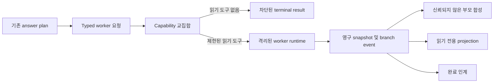

# 제한된 작업 워커

이 설계는 제한된 읽기 전용 조사를 수행하는 수명이 짧고 격리된 워커를 정의합니다. 권한 축소,
컨텍스트 격리, 수명 주기 예산, 영구 상태, 부모 합성, 완료 인계, 읽기 전용 운영을 다룹니다.

> **범위:** 작업 워커는 Pantheon 에이전트가 아닙니다. `AgentSpec`, 역할 바인딩, 소유 object
> type, Pantheon topic, 승인 권한, 실행 identity, 영구 memory가 없습니다.

## 설계 요약

부모는 기존 answer plan에서 typed 요청을 만듭니다. 런타임은 요청된 capability, 부모에게
보이는 도구, 서버 소유 profile의 교집합을 계산한 다음 fresh context로 워커를 실행합니다.
제한되고 신뢰되지 않은 terminal result만 부모 합성으로 돌아갑니다.



## 워커 identity 및 소유권

Pantheon은 정확히 15개의 명명된 에이전트로 유지됩니다. 작업 워커는
`core/task_worker` 아래의 런타임 helper이며 조직 구성원이 아닙니다. 작업 워커는 다음
작업을 수행할 수 없습니다.

- Pantheon topic을 publish하거나 subscribe합니다.
- contract object 또는 single-writer 책임을 소유합니다.
- 판단, 승인, 실행, 감사, rollback, 중재를 수행합니다.
- operator memory, runtime skill, rule, schedule, workflow definition을 작성합니다.
- 다른 워커를 만들거나 operator에게 clarification을 요청합니다.

기존 읽기 전용 answer-planning provider가 제한된 조사를 실행할 수 있습니다. 워커는 해당
provider 에이전트의 identity 또는 권한을 상속하지 않습니다.

## 요청 및 격리된 컨텍스트

`TaskWorkerRequest`에는 다음 항목만 포함됩니다.

- 안정적인 worker ID, parent trace reference, cancellation owner.
- 제한된 goal 하나.
- 선택된 evidence reference.
- 명시적 constraint.
- 요청된 tool name.
- 고정된 wall-clock, token, cost, tool-call, heartbeat budget.
- timezone-aware creation time 및 고정 depth 1.

`isolated_context()`는 goal, evidence reference, constraint, parent trace만 projection합니다.
부모 transcript, hidden reasoning, credential, process environment, mutable memory, 관련 없는
근거, channel state는 전달하지 않습니다.

## Capability 축소

허용되는 tool set은 다음 세 권한의 교집합입니다.

1. 이 워커에 요청된 tool.
2. 부모에게 보이는 tool.
3. 서버 소유 worker profile이 허용한 tool.

최종 dispatcher는 각 tool이 등록되어 있고 side-effect class가 `read`인지 다시 확인합니다.
Clarification, memory, schedule, approval, action proposal, governance, mutation, execution,
delegation, nested-worker capability는 dispatch 전에 항상 차단됩니다. 모델 요청은 이 교집합을
확장할 수 없습니다.

## 수명 주기 및 예산

런타임은 다음 상태를 사용합니다.

```text
pending -> running -> succeeded | abstained | cancelled | timed_out |
                      budget_exhausted | denied | failed
```

- Semaphore가 동시 worker 수를 제한합니다.
- Wall-clock timeout은 worker를 cancel하고 `timed_out`을 기록합니다.
- Token, cost, tool-call limit은 `budget_exhausted`를 생성합니다.
- 변경할 수 없는 cancellation owner만 live worker를 cancel할 수 있습니다.
- Heartbeat는 제한된 interval로 현재 tool usage를 기록합니다.
- 지원되지 않은 evidence 또는 output의 injection marker는 `denied`를 생성합니다.
- Restart는 해결되지 않은 `pending` 또는 `running` record를
  `failed(runtime_restart_interrupted)`로 전환합니다. 모호한 작업을 다시 실행하지 않습니다.

모든 transition은 compare-and-swap 상태 검사를 사용합니다. 중복 worker ID는 전체 요청이
일치할 때만 안전하게 retry할 수 있습니다.

## 영구 record

PostgreSQL은 현재 snapshot 하나와 append-only branch event를 저장합니다. Snapshot에는 요청
metadata, 축소된 tool, status, usage, heartbeat, terminal result가 포함됩니다. Branch event는
생성, 시작, heartbeat, terminal reason, completion-delivery failure를 기록합니다.

선택적 completion sink가 실행되기 전에 terminal snapshot과 event를 기록합니다. Sink failure는
terminal result를 변경하거나 worker를 다시 실행할 수 없습니다. 이슈 #40은 detached
completion을 claim할 수 있고, 이슈 #48은 reply ledger를 통해 이를 전달할 수 있습니다.

## 부모 합성

`TaskWorkerSynthesis`는 기존 `AnswerPlanningResult`를 소비하며 별도 route를 계산하지 않습니다.
Result는 worker ID로 정렬되고 원래 answer-planning object를 보존합니다.

합성에는 다음 제한된 field만 들어갑니다.

- Worker ID 및 terminal status.
- `succeeded` 또는 `abstained` result의 summary만 포함.
- Evidence reference 및 caveat.
- Token, cost, tool-call usage.
- Terminal reason.

모든 contribution은 `trusted: false`를 포함합니다. Failed, denied, cancelled, timed-out,
budget-exhausted worker는 status와 reason만 제공하고 summary는 제공하지 않습니다. 전체 branch
event는 worker store에 유지됩니다.

## 읽기 전용 운영

Production은 PostgreSQL store를 사용하는 GET-only route를 제공합니다.

- `/task-workers`
- `/task-workers/{worker_id}`
- `/task-workers/{worker_id}/events`

인증된 principal은 각 store query 안에서 owner predicate가 됩니다. 다른 principal이 소유한
worker는 없는 worker와 동일한 404 shape를 사용합니다. List row는 goal과 constraint를 제외하고
status, budget, heartbeat, tool, evidence count, usage, terminal reason을 표시합니다. Detail은
제한되고 신뢰되지 않은 result를 포함할 수 있습니다. Read API에는 create, cancel, approve,
execute route가 없습니다.

## 실패 동작

- 빈 attenuation은 executor dispatch 전에 denied result를 생성합니다.
- 알 수 없거나 mutation-class인 tool은 handler가 실행되기 전에 차단됩니다.
- Provider abstention은 abstention으로 유지됩니다.
- Executor exception은 result에 stack trace 없이 제한된 failure reason이 됩니다.
- Completion-sink failure는 영구 completion 뒤에 event를 추가합니다.
- Projection authorization은 넓은 read 뒤가 아니라 storage query에서 수행됩니다.
- PostgreSQL 또는 provider dependency가 없으면 capability를 unavailable로 유지하며 synthetic
  worker evidence로 대체하지 않습니다.

## 검증

검증 범위에는 전체 capability 교집합, context 격리, 금지된 tool, injection, 지원되지 않은
evidence, concurrency, heartbeat, timeout, cancellation ownership, budget, restart recovery,
PostgreSQL compare-and-swap, owner-scoped read, answer-planning provider 재사용, parent synthesis,
completion handoff, GET-only projection이 포함됩니다.

## 관련 문서

| 알아볼 내용 | 문서 |
|-------------|------|
| 고정 에이전트 역할 및 소유권 | [Agent Pantheon](agent-pantheon-ko.md) |
| 제한된 answer planning | [Operator Console](../interfaces/operator-console-ko.md) |
| Detached background session | [이슈 #40](https://github.com/dotnetpower/fdai/issues/40) |
| Reply delivery durability | [이슈 #48](https://github.com/dotnetpower/fdai/issues/48) |
