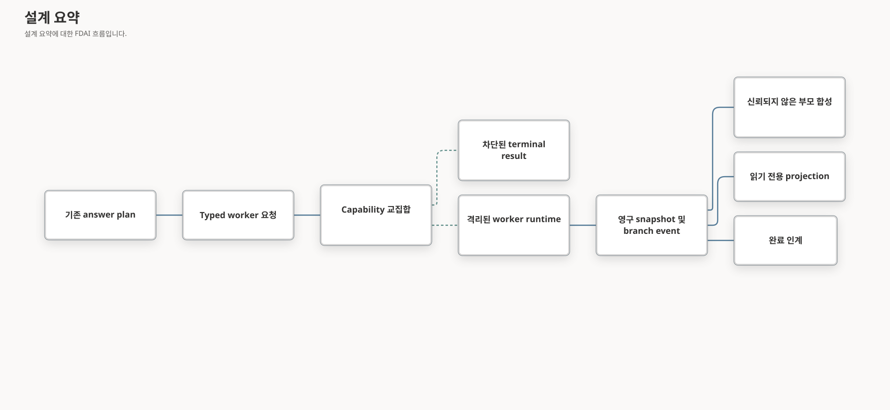

# 제한된 작업 워커

이 설계는 제한된 읽기 전용 조사를 수행하는 수명이 짧고 격리된 워커를 정의합니다. 권한 축소,
컨텍스트 격리, 수명 주기 예산, 영속 상태, 상위 답변 합성, 완료 인계, 읽기 전용 운영을 다룹니다.

> **범위:** 작업 워커는 Pantheon 에이전트가 아닙니다. `AgentSpec`, 역할 바인딩, 소유 객체
> 타입, Pantheon 토픽, 승인 권한, 실행 신원, 영구 기억이 없습니다.

## 설계 요약

상위 처리기는 기존 답변 계획에서 타입이 지정된 요청을 만듭니다. 런타임은 요청된 기능,
상위 처리기에 보이는 도구, 서버 소유 프로파일의 교집합을 계산한 다음 새로운 맥락으로
워커를 실행합니다. 범위가 제한되고 신뢰되지 않은 최종 결과만 상위 답변 합성으로 돌아갑니다.



## 워커 신원 및 소유권

Pantheon은 정확히 15개의 명명된 에이전트로 유지됩니다. 작업 워커는
`core/task_worker` 아래의 런타임 보조 로직이며 조직 구성원이 아닙니다. 작업 워커는 다음
작업을 수행할 수 없습니다.

- Pantheon 토픽을 발행하거나 구독합니다.
- 계약 객체 또는 단일 작성자 책임을 소유합니다.
- 판단, 승인, 실행, 감사, 롤백, 중재를 수행합니다.
- 운영자 기억, 런타임 스킬, 룰, 예약, 작업 흐름 정의를 작성합니다.
- 다른 워커를 만들거나 운영자에게 명확화를 요청합니다.

읽기 전용 답변 계획 프로바이더는 토큰과 비용 한도를 전달받고, 판단 보류를 포함한 측정
사용량을 `TaskWorkerPlanningResponse`로 반환합니다. 기존
`TaskWorkerPlanningProvider.contribute_bounded` 계약은 호환성을 유지합니다. 운영 구성은
`PreparedTaskWorkerPlanningProvider`를 추가로 요구하며, 변경할 수 없는 요청 준비, 영속
예약, 재검증된 단일 호출 순서를 따릅니다. 사용량을 측정하지 않는 `AnswerPlanningProvider`는
실행기 생성 시 차단됩니다. 워커는 프로바이더의 에이전트 신원이나 권한을 상속하지 않습니다.

## 요청 및 격리된 컨텍스트

`TaskWorkerRequest`에는 다음 항목만 포함됩니다.

- 안정적인 워커 ID, 상위 추적 참조, 취소 소유자.
- 제한된 목표 하나.
- 선택된 근거 참조.
- 명시적 제약.
- 요청된 도구 이름.
- 고정된 실행 시간, 토큰, 비용, 도구 호출, 하트비트 예산.
- 시간대가 명시된 생성 시각 및 고정 깊이 1.

`isolated_context()`는 목표, 근거 참조, 제약, 상위 추적만 추출합니다.
상위 대화 기록, 비공개 추론, 자격 증명, 프로세스 환경, 변경 가능한 기억, 관련 없는
근거, 채널 상태는 전달하지 않습니다.

## 기능 축소

허용되는 도구 집합은 다음 세 권한의 교집합입니다.

1. 이 워커에 요청된 도구.
2. 부모에게 보이는 도구.
3. 서버 소유 워커 프로파일이 허용한 도구.

최종 디스패처는 각 도구가 등록되어 있고 부수 효과 등급이 `read`인지 다시 확인합니다.
명확화, 기억, 예약, 승인, 액션 제안, 거버넌스, 변경, 실행,
위임, 중첩 워커 기능은 전달 전에 항상 차단됩니다. 모델 요청은 이 교집합을
확장할 수 없습니다.

분리된 백그라운드 작업의 `background.read-only` 프로파일은 정확히 `resolve_resource`, `get_resource_state`,
`query_resource_activity`, `query_resource_health`, `query_guest_shutdown_events`,
`query_network_security`, `query_network_peerings`를 포함합니다. 레지스트리 항목이 실수로 `read`
라벨을 가져도 셸 및 임의 쿼리 기능은 계속 차단됩니다.

현재 운영 레지스트리는 `resolve_resource`와 `get_resource_state`를 PostgreSQL에 기록된
인벤토리에 연결합니다. 각 호출은 서버 소유 허용 목록의 정확한 리소스 참조 하나를 요구합니다.
하나의 SQL 문이 활성 스냅샷, 리소스, 제한된 상태 필드, 관측 시각과 최신성을 결속합니다.
누락, 만료, 미래 시각, 예상값 전용, 미조정 대상 상태는 사용 불가로 유지합니다.
나머지 다섯 도구는 `source_unbound`를 명시적으로 반환하며 Azure를 조회하지 않습니다.
레지스트리 생성은 도구 선택이나 별도 상위 요청 접수 경로의 구현을 의미하지 않습니다.

## 수명 주기 및 예산

런타임은 다음 상태를 사용합니다.

```text
pending -> running -> succeeded | abstained | cancelled | timed_out |
                      budget_exhausted | denied | failed
```

- 세마포어가 동시 워커 수를 제한합니다.
- 실행 시간 초과는 워커를 취소하고 `timed_out`을 기록합니다. 대기 시간은 별도입니다.
- 토큰, 비용, 도구 호출 한도는 `budget_exhausted`를 생성합니다.
- 변경할 수 없는 취소 소유자만 실행 중인 워커를 취소할 수 있습니다.
- 하트비트는 현재 도구/계획 사용량과 미확인 예약을 직렬화해 기록합니다.
- 지원되지 않은 근거 또는 출력의 주입 표시는 `denied`를 생성합니다.
- 재시작은 해결되지 않은 `pending` 또는 `running` 기록을
  `failed(runtime_restart_interrupted)`로 전환합니다. 모호한 작업을 다시 실행하지 않습니다.

모든 전이는 비교 후 교환(compare-and-swap) 상태 검사를 사용합니다. 중복 워커 ID는
전체 요청과 축소된 권한이 일치할 때만 안전하게 재시도할 수 있습니다. 동시 요청은 기존
작업에 합류하며, 대기 중 취소도 최종 결과를 기록합니다. 복구는 같은 런타임의 실행 중인
작업을 변경하지 않습니다.

구체적인 Azure OpenAI 어댑터는 토큰 발급이나 HTTP 요청 전에 전체 UTF-8 요청 바이트와
메시지 구성 여유분으로 입력을 제한하고 출력 상한을 적용합니다. 먼저 두 예산을 모두
충족해야 합니다. 비용은 설정된 USD 단가와 반환된 입력/출력 토큰 수로 계산하며, 요약
길이나 청구서 증거가 아닙니다. 구조화된 출력 요청은 한 번뿐이며 재시도, 리디렉션,
다른 모델로의 대체 호출은 하지 않습니다.

런타임은 호출 전에 `reserved_tokens`, `reserved_cost_microusd`, `complete: false`를
영속화합니다. 유효한 사용량 묶음을 받으면 이 예약을 측정된 `tokens`와 `cost_microusd`로
교체합니다. 내용이 없거나 잘못된 응답도 사용량은 보존합니다. 사용량 누락, 전송 실패,
취소와 시간 초과는 무료 호출로 보고하지 않고 미확인 예약을 유지합니다. 하트비트와
재시작도 이를 지우지 않습니다. 사용량이 완전하면 기존 세 필드 JSON 형식을 유지하고,
불완전하면 예약 필드와 완전성 상태를 추가합니다. 어느 형식도 추가 시도나 예산 상향을
허용하지 않습니다.

예: 예약 후 사용량 응답 전에 요청이 취소되면 최종 결과는 불완전한 사용량을 가진 취소
상태입니다. 런타임을 다시 열어도 같은 결과를 반환하며 모델을 다시 호출하거나 비용 0의
측정값을 만들지 않습니다.

## 운영 구성

Core 시작 코드는 `runtime/task_workers.py`의 `TaskWorkerRuntimeBinding`을 소유합니다.
실제 PostgreSQL 저장소, 범위가 제한된 기록 조회 레지스트리, 호출을 준비하는 Azure 계획
어댑터를 조립합니다. 시작 과정은 작업을 만들거나 모델을 시험 호출하지 않습니다. 상위 요청
접수, 사용자 설정, 조회 화면과 분리된 작업의 완료 전달은 별도 패키지이므로 이 기반 구성은
명시적으로 활성화해야 합니다.

| 선행 조건 | 동작 |
|-----------|------|
| `FDAI_TASK_WORKERS_ENABLED` | 없거나 false이면 의존성을 불러오지 않고 연결을 만들지 않습니다. 잘못된 값은 시작 실패로 처리합니다. |
| `FDAI_STATE_STORE_DSN` | PostgreSQL 로그인과 현재 역할이 모두 `fdai_core`이고, 소유 워커 테이블과 필요한 읽기/쓰기 권한이 있어야 합니다. 관리자의 `SET ROLE`은 동등하지 않습니다. |
| `FDAI_TASK_WORKER_READ_SCOPE_JSON` | 정확히 `scope_ref`와 1-64개의 고유한 `resource_refs`를 요구합니다. 와일드카드, 프롬프트 기반 범위, 임의 쿼리는 허용하지 않습니다. 실제 값은 소스 관리 밖에 둡니다. |
| 기존 모델 선택과 엔드포인트 | 적격한 구조화 출력 OpenAI `t1.judge` 대상을 Bragi의 표현용 응답에 재사용하며 판단 권한을 주지 않습니다. 현재 모델 보류 상태를 유지합니다. |
| 워크로드 신원, HTTP, 단가 | 모두 주입되어야 합니다. 단가가 없거나 USD가 아니면 시작에 실패합니다. 메모리 저장소, 사용량을 측정하지 않는 프로바이더, 합성 대체 경로는 없습니다. |

PostgreSQL의 배타적 자문 잠금으로 데이터베이스당 활성 워커 런타임 소유자를 하나만
허용합니다. 다른 소유자는 시작에 실패합니다. 30초 시작 기한 안에 스키마를 검사한 뒤
최대 1000개씩 열 묶음의 미해결 행을 복구합니다. 최종 이력이 오래된 작업을 숨길 수 없습니다.
잠금을 잃으면 이후 작업은 실패하며 잠금을 조용히 다시 얻지 않습니다. 이는 HTTP가 정확히
한 번 실행된다는 보장이 아닙니다. 이미 전송된 요청은 사용량을 확인하지 못할 수 있으며
자동으로 다시 실행하지 않습니다.

종료 시 새 요청을 차단하고, 알려진 작업을 취소하고 기다린 뒤, 미해결 행 복구를 시도하고
소유 자원을 해제합니다. 작업 정리 기한은 30초입니다. 실패를 전달하되 공유 자원 정리도
시도합니다. 데이터베이스 장애는 영속 복구 작업을 남기며 성공적인 완료로 보고하지 않습니다.
로컬과 배포 환경은 같은 명시적 활성화 계약을 사용합니다.

## 영구 기록

PostgreSQL은 현재 스냅샷 하나와 추가 전용 분기 이벤트를 저장합니다. 스냅샷에는 요청
메타데이터, 축소된 도구, 상태, 사용량, 하트비트, 최종 결과가 포함됩니다. 분기 이벤트는
생성, 시작, 하트비트, 최종 사유, 완료 전달 실패를 기록합니다.

운영 구성은 선택적 완료 수신기가 실행되기 전에 최종 스냅샷과 이벤트를 한 트랜잭션으로
기록합니다. 이벤트 쓰기가 실패하면 저장된 사용량을 환불하지 않고 최종 전이를 되돌립니다.
추가형 `RecoverableTaskWorkerStore` 계약은 원자적 종료와 미해결 행 전용 조회를 제공합니다.
기존 저장소는 운영 구성 밖에서 계속 사용할 수 있습니다. 완료 수신기 실패는 최종 결과를
변경하거나 워커를 다시 실행할 수 없습니다. 이슈 #40은 분리된 작업의 완료 처리를 맡고,
이슈 #48은 회신 원장을 통해 이를 전달할 수 있습니다.

## 부모 합성

`TaskWorkerSynthesis`는 기존 `AnswerPlanningResult`를 소비하며 별도 경로를 계산하지 않습니다.
결과는 워커 ID로 정렬되고 원래 답변 계획 객체를 보존합니다.

합성에는 다음 제한된 필드만 들어갑니다.

- 워커 ID 및 최종 상태.
- `succeeded` 또는 `abstained` 결과의 요약만 포함.
- 근거 참조 및 주의사항.
- 토큰, 비용, 도구 호출 사용량과 완전성, 미확인 예약.
- 최종 사유.

모든 기여 결과는 `trusted: false`를 포함합니다. 실패, 거부, 취소, 시간 초과,
예산 소진 상태의 워커는 상태와 사유만 제공하고 요약은 제공하지 않습니다. 전체 분기
이벤트는 워커 저장소에 유지됩니다.

## 읽기 전용 운영

Operator API는 다음 GET 전용 경로를 선언합니다. 운영 저장소에 연결한 조회 결과 생성은
별도 패키지의 작업입니다.

- `/task-workers`
- `/task-workers/{worker_id}`
- `/task-workers/{worker_id}/events`

인증된 principal은 각 저장소 조회 안에서 소유자 조건식이 됩니다. 다른 principal이 소유한
워커는 없는 워커와 동일한 404 형태를 사용합니다. 목록 행은 목표와 제약을 제외하고
상태, 예산, 하트비트, 도구, 근거 개수, 사용량, 최종 사유를 표시합니다. 상세는
제한되고 신뢰되지 않은 결과를 포함할 수 있습니다. Operator API에는 생성, 취소, 승인,
실행 경로가 없습니다.

## 실패 동작

- 권한 교집합이 비어 있으면 실행기 전달 전에 거부 결과를 생성합니다.
- 알 수 없거나 변경 기능을 가진 도구는 핸들러 실행 전에 차단됩니다.
- 프로바이더의 판단 보류는 그대로 유지됩니다.
- 실행기 예외는 스택 추적 없이 제한된 실패 사유로 기록됩니다.
- 완료 수신기 실패는 영속 완료 뒤에 이벤트를 추가합니다.
- 변환 결과 권한 확인은 넓은 읽기 뒤가 아니라 저장소 조회에서 수행됩니다.
- PostgreSQL 또는 프로바이더 의존성이 없으면 기능을 사용 불가로 유지하며 합성
  워커 근거로 대체하지 않습니다.

## 검증

검증 범위에는 전체 기능 교집합, 맥락 격리, 금지된 도구, 주입, 지원되지 않은
근거, 동시성, 하트비트, 시간 초과, 취소 소유권, 예산, 재시작 복구,
PostgreSQL 비교 후 교환, 소유자 범위 읽기, 답변 계획 프로바이더 재사용, 상위 답변 합성,
완료 인계, GET 전용 조회가 포함됩니다.
## 관련 문서

| 알아볼 내용 | 문서 |
|-------------|------|
| 구현 상태 및 남은 작업 | [구현 원장](../../roadmap-implementation/agents/bounded-task-workers.md) |
| 고정 에이전트 역할 및 소유권 | [에이전트 Pantheon](agent-pantheon-ko.md) |
| 제한된 답변 계획 수립 | [Operator Console](../interfaces/operator-console-ko.md) |
| 분리된 백그라운드 세션 | [이슈 #40](https://github.com/dotnetpower/fdai/issues/40) |
| 회신 전달 내구성 | [이슈 #48](https://github.com/dotnetpower/fdai/issues/48) |
