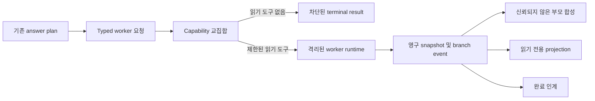

# 제한된 작업 워커

이 설계는 제한된 읽기 전용 조사를 수행하는 수명이 짧고 격리된 워커를 정의합니다. 권한 축소,
컨텍스트 격리, 수명 주기 예산, 영구 상태, 부모 합성, 완료 인계, 읽기 전용 운영을 다룹니다.

> **범위:** 작업 워커는 Pantheon 에이전트가 아닙니다. `AgentSpec`, 역할 바인딩, 소유 객체
> 타입, Pantheon 토픽, 승인 권한, 실행 신원, 영구 기억이 없습니다.

## 설계 요약

부모는 기존 답변 계획에서 타입이 지정된 요청을 만듭니다. 런타임은 요청된 기능, 부모에게
보이는 도구, 서버 소유 프로파일의 교집합을 계산한 다음 fresh 맥락으로 워커를 실행합니다.
제한되고 신뢰되지 않은 최종 결과만 부모 합성으로 돌아갑니다.


```mermaid
flowchart LR
    PLAN[기존 answer plan] --> REQUEST[Typed worker 요청]
    REQUEST --> ATTENUATE[Capability 교집합]
    ATTENUATE -->|읽기 도구 없음| DENY[차단된 terminal result]
    ATTENUATE -->|제한된 읽기 도구| RUN[격리된 worker runtime]
    RUN --> STORE[영구 snapshot 및 branch event]
    STORE --> SYNTHESIS[신뢰되지 않은 부모 합성]
    STORE --> VIEW[읽기 전용 projection]
    STORE --> SINK[완료 인계]
```

## 워커 신원 및 소유권

Pantheon은 정확히 15개의 명명된 에이전트로 유지됩니다. 작업 워커는
`core/task_worker` 아래의 런타임 보조 로직이며 조직 구성원이 아닙니다. 작업 워커는 다음
작업을 수행할 수 없습니다.

- Pantheon 토픽을 publish하거나 구독합니다.
- 계약 객체 또는 single-writer 책임을 소유합니다.
- 판단, 승인, 실행, 감사, 롤백, 중재를 수행합니다.
- 운영자 기억, 런타임 스킬, 룰, 예약, 작업 흐름 정의를 작성합니다.
- 다른 워커를 만들거나 운영자에게 명확화를 요청합니다.

기존 읽기 전용 answer-planning 프로바이더가 제한된 조사를 실행할 수 있습니다. 워커는 해당
프로바이더 에이전트의 신원 또는 권한을 상속하지 않습니다.

## 요청 및 격리된 컨텍스트

`TaskWorkerRequest`에는 다음 항목만 포함됩니다.

- 안정적인 워커 ID, 상위 추적 참조, 취소 소유자.
- 제한된 목표 하나.
- 선택된 근거 참조.
- 명시적 제약.
- 요청된 도구 이름.
- 고정된 wall-clock, 토큰, 비용, tool-call, 하트비트 예산.
- timezone-aware creation 시간 및 고정 깊이 1.

`isolated_context()`는 목표, 근거 참조, 제약, 상위 추적만 변환 결과합니다.
부모 대화 기록, hidden reasoning, 자격 증명, 프로세스 환경, 변경 가능한 기억, 관련 없는
근거, 채널 상태는 전달하지 않습니다.

## 기능 축소

허용되는 도구 집합은 다음 세 권한의 교집합입니다.

1. 이 워커에 요청된 도구.
2. 부모에게 보이는 도구.
3. 서버 소유 워커 프로파일이 허용한 도구.

최종 디스패처는 각 도구가 등록되어 있고 side-effect 등급이 `read`인지 다시 확인합니다.
명확화, 기억, 예약, 승인, 액션 제안, 거버넌스, 변경, 실행,
위임, nested-worker 기능은 전달 전에 항상 차단됩니다. 모델 요청은 이 교집합을
확장할 수 없습니다.

Detached `background.read-only` 프로파일은 정확히 `resolve_resource`, `get_resource_state`,
`query_resource_activity`, `query_resource_health`, `query_guest_shutdown_events`,
`query_network_security`, `query_network_peerings`를 포함합니다. 레지스트리 항목이 실수로 `read`
라벨을 가져도 셸 및 arbitrary-query 기능은 계속 차단됩니다.

## 수명 주기 및 예산

런타임은 다음 상태를 사용합니다.

```text
pending -> running -> succeeded | abstained | cancelled | timed_out |
                      budget_exhausted | denied | failed
```

- Semaphore가 동시 워커 수를 제한합니다.
- Wall-clock 시간 초과는 워커를 취소하고 `timed_out`을 기록합니다.
- 토큰, 비용, tool-call 한도는 `budget_exhausted`를 생성합니다.
- 변경할 수 없는 취소 소유자만 실제 운영 워커를 취소할 수 있습니다.
- 하트비트는 제한된 간격으로 현재 도구 사용량을 기록합니다.
- 지원되지 않은 근거 또는 출력의 주입 표시는 `denied`를 생성합니다.
- 재시작은 해결되지 않은 `pending` 또는 `running` 기록을
  `failed(runtime_restart_interrupted)`로 전환합니다. 모호한 작업을 다시 실행하지 않습니다.

모든 전이는 compare-and-swap 상태 검사를 사용합니다. 중복 워커 ID는 전체 요청이
일치할 때만 안전하게 재시도할 수 있습니다.

## 영구 기록

PostgreSQL은 현재 스냅샷 하나와 추가 전용 가지 이벤트를 저장합니다. 스냅샷에는 요청
메타데이터, 축소된 도구, 상태, 사용량, 하트비트, 최종 결과가 포함됩니다. 가지 이벤트는
생성, 시작, 하트비트, 최종 사유, completion-delivery 실패를 기록합니다.

선택적 완료 싱크가 실행되기 전에 최종 스냅샷과 이벤트를 기록합니다. 싱크 실패는
최종 결과를 변경하거나 워커를 다시 실행할 수 없습니다. 이슈 #40은 detached
완료를 점유할 수 있고, 이슈 #48은 회신 원장을 통해 이를 전달할 수 있습니다.

## 부모 합성

`TaskWorkerSynthesis`는 기존 `AnswerPlanningResult`를 소비하며 별도 경로를 계산하지 않습니다.
결과는 워커 ID로 정렬되고 원래 answer-planning 객체를 보존합니다.

합성에는 다음 제한된 필드만 들어갑니다.

- 워커 ID 및 최종 상태.
- `succeeded` 또는 `abstained` 결과의 요약만 포함.
- 근거 참조 및 caveat.
- 토큰, 비용, tool-call 사용량.
- 최종 사유.

모든 contribution은 `trusted: false`를 포함합니다. 실패한, 거부된, 취소된, 시간이 초과된,
budget-exhausted 워커는 상태와 사유만 제공하고 요약은 제공하지 않습니다. 전체 가지
이벤트는 워커 저장소에 유지됩니다.

## 읽기 전용 운영

운영은 PostgreSQL 저장소를 사용하는 GET-only 경로를 제공합니다.

- `/task-workers`
- `/task-workers/{worker_id}`
- `/task-workers/{worker_id}/events`

인증된 principal은 각 저장소 조회 안에서 소유자 조건식이 됩니다. 다른 principal이 소유한
워커는 없는 워커와 동일한 404 형태를 사용합니다. 목록 행은 목표와 제약을 제외하고
상태, 예산, 하트비트, 도구, 근거 개수, 사용량, 최종 사유를 표시합니다. 상세는
제한되고 신뢰되지 않은 결과를 포함할 수 있습니다. Operator API에는 생성, 취소, approve,
execute 경로가 없습니다.

## 실패 동작

- 빈 attenuation은 실행기 전달 전에 거부된 결과를 생성합니다.
- 알 수 없거나 mutation-class인 도구는 핸들러가 실행되기 전에 차단됩니다.
- 프로바이더 abstention은 abstention으로 유지됩니다.
- 실행기 exception은 결과에 stack 추적 없이 제한된 실패 사유가 됩니다.
- Completion-sink 실패는 영구 완료 뒤에 이벤트를 추가합니다.
- 변환 결과 권한 확인은 넓은 읽기 뒤가 아니라 저장소 조회에서 수행됩니다.
- PostgreSQL 또는 프로바이더 의존성이 없으면 기능을 사용 불가로 유지하며 synthetic
  워커 근거로 대체하지 않습니다.

## 검증

검증 범위에는 전체 기능 교집합, 맥락 격리, 금지된 도구, 주입, 지원되지 않은
근거, 동시성, 하트비트, 시간 초과, 취소 소유권, 예산, 재시작 복구,
PostgreSQL compare-and-swap, owner-scoped 읽기, answer-planning 프로바이더 재사용, 상위 종합,
완료 인계, GET-only 변환 결과가 포함됩니다.

## Implementation status

제한된 워커 코어와 영구 저장소는 구현되어 있으며 집중 테스트로 검증됩니다. Operator API
경로 계약은 존재하지만 운영 워커 구성, 저장소 기반 변환 결과 구체화, 콘솔 표시, 거버넌스된
실환경 근거는 아직 완성되지 않았습니다.

### Implementation scope

| 영역 | 상태 | 근거 | 참고 |
|------|------|------|------|
| 요청 모델, 격리된 컨텍스트, 기능 축소 | implemented | `core/task_worker/models.py`, `attenuation.py`, `profiles.py`; `tests/core/task_worker/test_attenuation.py` | 요청 깊이는 1로 고정되고 컨텍스트 변환 결과는 제한되며, 최종 도구 집합은 세 권한의 결정론적 교집합입니다. |
| 런타임 수명 주기, 계획 실행기, 도구 게이트웨이 | implemented | `core/task_worker/runtime.py`, `planning_executor.py`, `tools.py`; 집중 런타임 및 계획 실행기 테스트 | 상태 전이, 동시성, 시간 초과, 취소 소유권, 예산, 하트비트, 읽기 전용 전달, abstention, 제한된 실패가 구현되어 있지만 운영 런타임 바인딩은 없습니다. |
| 영구 스냅샷, 가지 이벤트, 복구, 소유자 범위 조회 | implemented | `delivery/persistence/postgres_task_worker.py`; Alembic 리비전 `20260720_0039`; `tests/persistence/test_task_worker.py` | PostgreSQL compare-and-swap 영속화와 재시작 복구가 존재합니다. 이 행은 배포된 데이터베이스 검증을 주장하지 않습니다. |
| 부모 합성과 완료 싱크 순서 | implemented | `core/task_worker/synthesis.py`, `runtime.py`; 집중 합성 및 런타임 테스트 | 워커 기여는 신뢰되지 않고 제한된 상태로 유지되며, 최종 영속화가 선택적 싱크 전달보다 먼저 수행됩니다. 운영 완료 싱크 바인딩은 발견되지 않았습니다. |
| GET-only Operator API 변환 결과 | in-progress | `families/conversation/manifest.py`; `test_operator_conversation_family.py` | 인증된 세 GET 경로와 응답 봉투 접점은 존재하지만 작업 워커 저장소에서 소유자 범위 워커 변환 결과를 생성하는 구체화 로직은 발견되지 않았습니다. |
| 운영 구성 및 운영 근거 | not-started | 테스트 외부의 `TaskWorkerRuntime` 생성, 콘솔 작업 워커 화면, 거버넌스된 실환경 증빙은 발견되지 않았습니다. | 운영 도구, 계획 통합, 완료 전달, 변환 결과 조회, 실환경 실패 경로 근거를 연결하고 실행해야 합니다. |

### Implementation history

| 날짜 | 상태 | 변경 | 근거 | 남은 작업 |
|------|------|------|------|-----------|
| 2026-08-13 | in-progress | 구현 원장을 도입하고 구현된 워커 코어와 미완료 운영 및 변환 결과 통합을 구분했습니다. | 현재 작업 워커 소스, 영속성 어댑터와 마이그레이션, 집중 코어 및 영속성 테스트, Operator API 경로 테스트. | 운영 런타임과 변환 결과를 바인딩하고 읽기 전용 운영자 경험을 노출하며 거버넌스된 실환경 근거를 수집해야 합니다. |

### Remaining work

- [ ] `TaskWorkerRuntime`을 운영 읽기 전용 도구 레지스트리 및 답변 계획 프로바이더와 구성하고 synthetic fallback 없이 시작 및 재시작 동작을 입증합니다.
- [ ] PostgreSQL 워커 저장소에서 `workers.list`, `workers.get`, `workers.events`를 구체화하고 각 조회 내부의 소유자 조건식과 다른 소유자에 대한 404를 검증합니다.
- [ ] 영구 완료 전달을 detached-session 회신 경로에 연결하고 싱크 실패가 최종 결과를 변경하거나 재실행하지 않고 이벤트를 추가하는지 입증합니다.
- [ ] 운영자용 읽기 전용 워커 변환 결과를 추가하고 성공, 시간 초과, 예산 소진, 거부, 재시작 복구, 교차 소유자 격리에 대한 거버넌스된 실환경 증빙을 수집합니다.

## 관련 문서

| 알아볼 내용 | 문서 |
|-------------|------|
| 고정 에이전트 역할 및 소유권 | [에이전트 Pantheon](agent-pantheon-ko.md) |
| 제한된 답변 계획 수립 | [Operator Console](../interfaces/operator-console-ko.md) |
| Detached background 세션 | [이슈 #40](https://github.com/dotnetpower/fdai/issues/40) |
| 회신 전달 내구성 | [이슈 #48](https://github.com/dotnetpower/fdai/issues/48) |
