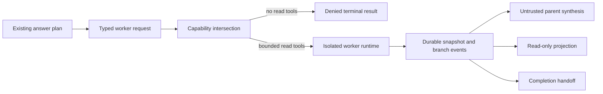

# Bounded Task Workers

This design defines short-lived, isolated workers for bounded read-only investigations. It covers
capability attenuation, context isolation, lifecycle budgets, durable state, parent synthesis,
completion handoff, and read-only operations.

> **Scope:** A task worker is not a Pantheon agent. It has no `AgentSpec`, role binding, owned
> object type, Pantheon topic, approval authority, execution identity, or persistent memory.

## Design at a glance

A parent creates a typed request from an existing answer plan. The runtime intersects requested
capabilities with parent-visible tools and a server-owned profile, then runs the worker with fresh
context. Only a bounded, untrusted terminal result returns to parent synthesis.


```mermaid
flowchart LR
    PLAN[Existing answer plan] --> REQUEST[Typed worker request]
    REQUEST --> ATTENUATE[Capability intersection]
    ATTENUATE -->|no read tools| DENY[Denied terminal result]
    ATTENUATE -->|bounded read tools| RUN[Isolated worker runtime]
    RUN --> STORE[Durable snapshot and branch events]
    STORE --> SYNTHESIS[Untrusted parent synthesis]
    STORE --> VIEW[Read-only projection]
    STORE --> SINK[Completion handoff]
```

## Worker identity and ownership

The Pantheon remains exactly 15 named agents. A task worker is a runtime helper under
`core/task_worker`, not an organization member. It cannot:

- Publish or subscribe to a Pantheon topic.
- Own a contract object or single-writer responsibility.
- Judge, approve, execute, audit, roll back, or arbitrate.
- Write operator memory, runtime skills, rules, schedules, or workflow definitions.
- Create another worker or ask the operator for clarification.

An existing read-only answer-planning provider can execute the bounded investigation. The worker
does not inherit that provider's agent identity or authority.

## Request and isolated context

`TaskWorkerRequest` contains only:

- A stable worker ID, parent trace reference, and cancellation owner.
- One bounded goal.
- Selected evidence references.
- Explicit constraints.
- Requested tool names.
- A fixed wall-clock, token, cost, tool-call, and heartbeat budget.
- A timezone-aware creation time and fixed depth of one.

`isolated_context()` projects the goal, evidence references, constraints, and parent trace. It does
not carry the parent transcript, hidden reasoning, credentials, process environment, mutable
memory, unrelated evidence, or channel state.

## Capability attenuation

The allowed tool set is the intersection of three authorities:

1. Tools requested for this worker.
2. Tools visible to the parent.
3. Tools allowed by the server-owned worker profile.

The final dispatcher also checks that each tool is registered and has side-effect class `read`.
Clarification, memory, schedule, approval, action proposal, governance, mutation, execution,
delegation, and nested-worker capabilities are always denied before dispatch. A model request
cannot widen this intersection.

The detached `background.read-only` profile contains exactly `resolve_resource`,
`get_resource_state`, `query_resource_activity`, `query_resource_health`,
`query_guest_shutdown_events`, `query_network_security`, and `query_network_peerings`. Shell and
arbitrary-query capabilities remain denied even if a registry entry is accidentally labeled
`read`.

## Lifecycle and budgets

The runtime uses these states:

```text
pending -> running -> succeeded | abstained | cancelled | timed_out |
                      budget_exhausted | denied | failed
```

- A semaphore bounds concurrent workers.
- Wall-clock timeout cancels the worker and records `timed_out`.
- Token, cost, and tool-call limits produce `budget_exhausted`.
- Only the immutable cancellation owner can cancel a live worker.
- Heartbeats record current tool usage at a bounded interval.
- Unsupported evidence or injection markers in output produce `denied`.
- A restart converts unresolved `pending` or `running` records to
  `failed(runtime_restart_interrupted)`. It does not rerun ambiguous work.

Every transition uses compare-and-swap state checks. Duplicate worker IDs are safe to retry only
when the complete request matches.

## Durable records

PostgreSQL stores one current snapshot and append-only branch events. The snapshot includes
request metadata, attenuated tools, status, usage, heartbeat, and terminal result. Branch events
record creation, start, heartbeat, terminal reason, and completion-delivery failure.

The terminal snapshot and event are written before the optional completion sink runs. A sink
failure cannot rewrite the terminal result or rerun the worker. Issue #40 can claim detached
completion, and issue #48 can deliver it through the reply ledger.

## Parent synthesis

`TaskWorkerSynthesis` consumes the existing `AnswerPlanningResult`; it does not compute another
route. Results sort by worker ID and preserve the original answer-planning object.

Only these bounded fields enter synthesis:

- Worker ID and terminal status.
- Summary for `succeeded` or `abstained` results only.
- Evidence references and caveats.
- Token, cost, and tool-call usage.
- Terminal reason.

Every contribution carries `trusted: false`. Failed, denied, cancelled, timed-out, and
budget-exhausted workers contribute status and reason but no summary. Full branch events stay in
the worker store.

## Read-only operations

Production exposes GET-only routes backed by the PostgreSQL store:

- `/task-workers`
- `/task-workers/{worker_id}`
- `/task-workers/{worker_id}/events`

The authenticated principal becomes the owner predicate inside each store query. A worker owned
by another principal has the same 404 shape as a missing worker. List rows omit goal and
constraints; they expose status, budget, heartbeat, tools, evidence count, usage, and terminal
reason. Detail can include the bounded untrusted result. No create, cancel, approve, or execute
route is part of the Operator API.

## Failure behavior

- Empty attenuation produces a denied result before executor dispatch.
- Unknown or mutation-class tools are rejected before their handler runs.
- Provider abstention remains abstention.
- Executor exceptions become bounded failure reasons without stack traces in the result.
- Completion-sink failure appends an event after durable completion.
- Projection authorization happens in storage queries, not after broad reads.
- Missing PostgreSQL or provider dependencies leave the capability unavailable; they do not
  substitute synthetic worker evidence.

## Verification

Coverage includes exhaustive capability intersections, context isolation, forbidden tools,
injection, unsupported evidence, concurrency, heartbeats, timeout, cancellation ownership,
budgets, restart recovery, PostgreSQL compare-and-swap, owner-scoped reads, answer-planning
provider reuse, parent synthesis, completion handoff, and GET-only projections.

## Implementation status

The bounded worker core and durable store are implemented and covered by focused tests. The
Operator API route contract is present, but production worker composition, store-backed
projection materialization, console presentation, and governed live evidence remain incomplete.
This ledger separates implementation evidence from operational validation; passing focused tests
does not promote the capability or prove a deployed worker path.

### Implementation scope

| Area | State | Evidence | Notes |
|------|-------|----------|-------|
| Request model, isolated context, and capability attenuation | implemented | `core/task_worker/models.py`, `attenuation.py`, `profiles.py`; `tests/core/task_worker/test_attenuation.py` | The request is depth-one, the context projection is bounded, and the final tool set is the deterministic intersection of the three authorities. |
| Runtime lifecycle, planning executor, and tool gateway | implemented | `core/task_worker/runtime.py`, `planning_executor.py`, `tools.py`; focused runtime and planning-executor tests | State transitions, concurrency, timeouts, cancellation ownership, budgets, heartbeats, read-only dispatch, abstention, and bounded failures are implemented without a production runtime binding. |
| Durable snapshots, branch events, recovery, and owner-scoped queries | implemented | `delivery/persistence/postgres_task_worker.py`; Alembic revision `20260720_0039`; `tests/persistence/test_task_worker.py` | PostgreSQL compare-and-swap persistence and restart recovery exist. This row does not claim a deployed database validation. |
| Parent synthesis and completion-sink ordering | implemented | `core/task_worker/synthesis.py`, `runtime.py`; focused synthesis and runtime tests | Worker contributions remain untrusted and bounded; terminal persistence precedes optional sink delivery. No production completion sink binding was found. |
| GET-only Operator API projection | in-progress | `families/conversation/manifest.py`; `test_operator_conversation_family.py` | The three authenticated GET routes and response-envelope seam exist, but no materializer was found that derives owner-scoped worker projections from the task-worker store. |
| Production composition and operational evidence | not-started | No non-test `TaskWorkerRuntime` construction, console task-worker surface, or governed live receipt was found | Production tools, planning integration, completion delivery, projection reads, and live failure-path evidence remain to be wired and exercised. |

### Implementation history

| Date | State | Change | Evidence | Remaining |
|------|-------|--------|----------|-----------|
| 2026-08-13 | in-progress | Adopted the implementation ledger and separated the implemented worker core from unfinished production and projection integration. | Current task-worker source, persistence adapter and migration, focused core and persistence tests, and Operator API route tests. | Bind the production runtime and projections, expose the read-only operator experience, and capture governed live evidence. |

### Remaining work

- [ ] Compose `TaskWorkerRuntime` with the production read-only tool registry and answer-planning provider, then prove startup and restart behavior without a synthetic fallback.
- [ ] Materialize `workers.list`, `workers.get`, and `workers.events` from the PostgreSQL worker store with owner predicates inside each query and foreign-owner 404 coverage.
- [ ] Wire durable completion delivery into the detached-session reply path and prove that sink failure appends an event without rewriting or rerunning the terminal result.
- [ ] Add the operator-facing read-only worker projection and capture governed live receipts for success, timeout, budget exhaustion, denial, restart recovery, and cross-owner isolation.

## Related docs

| To learn about | Read |
|----------------|------|
| Fixed agent roles and ownership | [Agent Pantheon](agent-pantheon.md) |
| Bounded answer planning | [Operator Console](../interfaces/operator-console.md) |
| Detached background sessions | [Issue #40](https://github.com/dotnetpower/fdai/issues/40) |
| Reply delivery durability | [Issue #48](https://github.com/dotnetpower/fdai/issues/48) |
