# AKS 역방향 커넥터

이 문서는 private 클러스터에서 연결을 시작하는 전송 방식을 AKS 진단 근거 계층에 추가합니다.
새로운 판단 에이전트나 Kubernetes API 터널을 만들지 않고 관측, 승인된 운영 작업,
선택적인 네트워크 분리를 구분합니다.

> **제공 범위:** 이 문서는 목표 설계입니다. 구현 및 검증 상태는 연결된 구현 원장에 기록합니다.
> 문서나 커넥터 등록 자체는 실환경 배포, 정책 적용, 관리 리소스 변경 권한을 부여하지 않습니다.

## 설계 개요

읽기 전용 Observer가 클러스터 내부에서 정확한 Kubernetes 근거를 수집합니다. 외부로 연결하는
HTTPS 통신으로 제한된 근거와 형식이 지정된 작업을 비권한 게이트웨이와 교환합니다.
기존 에이전트가 판단, 승인, 실행, 복구, 감사를 담당합니다. 별도 실행기는 기존 실행 계약을
사용하며, 선택적 네트워크 분리는 설치된 정책 엔진을 사용합니다.
집중 커넥터 테스트는 읽기 probe를 임시로 바꾸기 전에 실제 리소스 사전 점검 하위 클래스를 불러옵니다. 따라서 테스트 순서가 가짜 클러스터 신원 검사를 대체하거나 런타임 동작을 바꿀 수 없습니다.



그림은 실행 권한이 아니라 연결 시작 방향을 나타냅니다. 게이트웨이는 작업 생성, 승인,
실행기 사칭, 클러스터를 대신한 중앙 데이터베이스 접근을 수행하지 않습니다.
관측과 실행은 프로세스, ServiceAccount, 인증 주체, 메시지 범위를 분리합니다.

## 결정과 설계 비평

| 우려 사항 | 비평 후 결정 |
|-----------|--------------|
| 범용 역방향 프록시는 과도한 권한을 노출합니다. | 스키마 검증을 거친 유한한 작업과 근거만 교환합니다. 임의 경로, 셸, kubectl 문자열은 전달하지 않습니다. |
| 노드 에이전트가 기존 CNI 적용 기능과 중복됩니다. | 클러스터 Deployment부터 시작합니다. 기존 Container Network Interface(CNI)를 재사용하고 입증된 근거 공백에만 노드 수집기를 추가합니다. |
| 정상 heartbeat가 오래된 관측을 숨길 수 있습니다. | 연결, 근거의 최신성, 작업 진행, 정책 적용 상태를 별도로 추적합니다. |
| 정책 전달은 적용을 뜻하지 않습니다. | 수락, 전달, 반영, 독립 검증 결과를 구분합니다. |
| 관측한 통신에 악성 연결이 포함될 수 있습니다. | 통신 기록은 근거이며 자동 허용 규칙이나 실행 권한이 아닙니다. |
| 승인 후 라벨이 바뀔 수 있습니다. | 정확한 워크로드, 선택자 버전, 영향 대상 집합의 해시, 정책 버전을 고정하고 변경 시 실행을 보류합니다. |
| 전체 차단 정책과 넓은 허용 정책이 공존할 수 있습니다. | 격리 제안 전에 적용되는 전체 Kubernetes 정책의 합집합과 관리 주체 충돌을 평가합니다. |
| 단절로 이미 반영된 변경을 확인하지 못할 수 있습니다. | 결과를 알 수 없음으로 보존하고 재시도 전에 신뢰할 수 있는 상태를 재확인합니다. |
| 오프라인 정책 캐시가 새 권한을 부여할 수 있습니다. | 마지막 승인 기준 정책을 유지하며 필수 권한 의존성이 없으면 신규 변경을 거부합니다. |
| 네트워크 격리가 복구 경로를 차단할 수 있습니다. | 정확한 관리 의존성을 보호하고 적용 전에 독립적으로 접근 가능한 복구 위치를 확인합니다. |

Illumio의 PCE, Kubelink, C-VEN, 로컬 정책 캐시는 중앙 정책, 클러스터 메타데이터,
분산 적용의 분리에 참고했습니다. FDAI는 호스트 방화벽의 특권 관리를 복제하거나
Illumio의 설정 가능한 fail-open 동작을 그대로 사용하지 않습니다.

## 등록과 전송

등록 정보는 인증된 발급자와 주체를 하나의 배포, 클러스터, 커넥터 역할, namespace 허용 목록,
기능 집합, 등록 버전, 유효 기간에 연결합니다. 신뢰할 수 없는 본문이 테넌트나 클러스터를
선택할 수 없습니다. 정적 자격 증명보다 단기 워크로드 인증을 우선하며, 자격 증명 원문은
저장된 작업, 관측, 로그, 구성 기록에 포함하지 않습니다.

초기 전송은 연결을 재사용하는 제한된 HTTPS 요청이며 클러스터에 수신 포트를 열지 않습니다.
TLS 검증은 필수입니다. 리디렉션, 내장 자격 증명, 임의 콜백 URL, 다른 출처로의 토큰 전달은
지원하지 않습니다. 게이트웨이는 데이터를 수락하기 전에 인증하고 등록 범위별로 할당량,
저장소, 구독, 작업 점유를 분리합니다.

작업은 스키마 버전, 작업 ID, 상관관계 ID, 대상 UID와 버전, 작업 종류, 인자 해시,
만료, 승인과 안전장치 참조, 멱등성 키, 점유 세대를 고정합니다. 수신 확인은 실행 허가가
아닙니다. 폐기된 등록은 새 작업을 받거나 확인할 수 없습니다. 단절 중 권한 철회의 효과는
권한의 최신성 및 만료에 의해 제한되며 즉각적인 오프라인 철회를 보장하지 않습니다.

## 관측과 인벤토리

첫 기능 집합은 기존의 민감한 내용을 제외한 객체 스냅샷과 Event 이력을 수집합니다.
메트릭과 로그 근거에는 별도의 공급자 수집 범위 조건을 유지합니다. Secret 값, ConfigMap 값,
환경 변수 값, 명령 출력, 원문 로그는 전송하지 않습니다.

근거 세대마다 정확한 클러스터 연결 정보, 생성기 버전, 단조 증가 스트림 순서, 관측 기준 시점,
기록 시각, 내용 해시, 완전성, 명시적 수집 공백을 보존합니다. 일부 페이지만 수집했거나
Event 커서가 만료됐거나 순서가 누락되거나 스키마를 지원하지 않으면 부재를 입증하거나
기존 리소스를 지울 수 없습니다. 영속 버퍼의 한도를 넘으면 조용히 버리지 않고 기록합니다.

중앙 인벤토리 기록기가 근거를 검증한 뒤 리소스와 관계를 반영합니다. 커넥터가 온톨로지 상태를
직접 쓰지 않습니다. 직접 수집과 역방향 수집은 클러스터별로 하나의 소스를 선택합니다.
전환에는 최신의 완전한 세대가 필요하며 두 번째 기록기를 만들지 않습니다. 미래 관측,
오래된 세대, 식별 불일치, 같은 키의 다른 내용은 거부합니다. 동일 재시도는 안전하게 처리하고
원래 관측 시각을 새로 갱신하지 않습니다.

## 제약 기반 배포 제안

전체 제약 모델과 제안 계약은 [AKS 아웃바운드 커넥터 배포 제안](aks-outbound-connector-deployment-proposals-ko.md)을 참조하세요.

## 스냅샷 실행 구성

사전 점검 설계 검토에서 매니페스트 생성 전에 수락 여부를 검증할 수 없다는 의존성 순환을
확인했습니다. 따라서 거부되지 않은 후보를 명시적으로 선택하면 부족한 근거를 유지한 채
점검용 초안을 생성할 수 있습니다. 이 초안은 추천이 아닙니다. 확정된 추천은 선택된 방식과
외부 통신 유형을 그대로 유지하며 거부된 후보는 렌더링하지 않습니다. 수락 점검은 관측용
읽기 전용 ServiceAccount가 아니라 별도로 제공한 배포 점검 자격 증명을 사용합니다.
고정된 구성에 `dryRun=All`과 엄격한 검증만 요청하고 전후 클러스터 신원을 확인합니다.
영속 요청으로 전환하거나 재시도하지 않습니다. CronJob 수락만으로 Pod 수락을 입증할 수 없어
Pod 템플릿도 별도로 dry-run합니다. 용량, 실제 마운트된 저장소, 외부 통신이나 설치 성공은 입증하지 않습니다.

설치 미리보기는 적용 명령이 아니라 고정된 관측 전용 워크로드 구성을 만듭니다. 변경 불가능한
이미지 참조, 중복 실행을 막고 시간이 제한된 CronJob, 명시적인 ServiceAccount 투영 토큰,
영속 버퍼와 실제 수집기에서 도출한 읽기 전용 클러스터 RBAC를 사용합니다. 실행기 쓰기 권한,
Secret 읽기, 호스트 네트워크나 특권 컨테이너는 만들지 않습니다. 설치 전에는 기존 GitOps
관리 주체와 정확한 계획 검토가 여전히 필요합니다.

Kubernetes Secret 투영 파일은 root 소유 심볼릭 링크일 수 있어 직접 마운트하면 워커의
개인 파일 계약을 위반할 수 있습니다. 비루트 초기화 단계가 볼륨 안의 단일 해석된 세대에서
지정된 파일 다섯 개만 읽어 소유자 전용 임시 디렉터리에 원자적으로 준비합니다. 볼륨 밖으로
나가는 링크, 쓰기 가능한 소스, 크기 초과와 기존 자료 변경은 거부합니다. 관측 워커는 기존
`0600`/`0700` 검사를 그대로 사용합니다. 저장소에서 자격 증명을 생성하는 기능이 아니라
런타임 자료 처리이며 미리보기에는 참조만 포함합니다. 이미지 출처, 수락 정책, 저장소 지원,
외부 통신, 배포, 철회 또는 제거 준비 상태를 입증하지는 않습니다.

렌더러는 정확한 개인 자료 해시, 현재 유효한 단일 관측 등록, 대상, 관측 namespace,
TLS 키와 인증서의 연결, 고정 볼륨 경로와 API·게이트웨이 포트를 검증합니다. API 원본은
클러스터 내부 주소여야 하며 전체 읽기 프로필은 클러스터 범위 객체 전송을 요구합니다.
리소스 여섯 개를 출력하고 CronJob은 별도로 승인된 활성화 전까지 일시 중지합니다.
Namespace나 Secret은 생성하지 않습니다. 제한된 NetworkPolicy만으로 실제 외부 통신을
입증하지는 않으며 다른 정책, DNS, 주소 변환과 설치된 CNI를 독립적으로 확인해야 합니다.

```bash
python -m fdai.delivery.kubernetes_connector_installation \
  --inputs /private/installation.json --proposal /private/proposal.json \
  --material-directory /private/observer-material
```

입력에는 `target_ref`, `method`, `egress`, `namespace`, `name`, 해시로 고정한 `image`, `material_secret`,
`material_digest`, `storage_class`, `gateway_port`, `api_port`, 제한된 `gateway_cidrs`,
`api_cidrs`, `dns_cidrs`를 명시합니다. 개인 파일 권한은 `0600`이며 자료 디렉터리에는
`config.json`, `registrations.json`, `ca.pem`, `client.pem`, `client.key`가 있습니다.
실행 경로는 `/private/material`, `/api-identity`, `/spool/snapshots`로 고정합니다.
미리보기는 입력·제안·매니페스트 해시를 연결하며 항상 `installation_ready=false`와
`execution_authority=false`를 반환합니다.

`python -m fdai.delivery.kubernetes_connector_proposal_cli collect-admission-preflight --config /private/admission.json`
명령으로 초안을 점검할 수 있습니다. 개인 구성은 읽기 사전 점검 필드에
`installation_inputs_path`, `proposal_path`, `material_directory`를 추가합니다.
`api_token_path`는 별도로 승인된 배포 점검 신원을 가리키며 관측 역할의 권한을 넓히지 않습니다.
등록된 검증기는 `kubernetes_api` 출처의 `admission`을 검증할 수 있어야 합니다.
클러스터 UID를 전후로 확인하며 고정된 생성 요청 일곱 개에 `dryRun=All`,
`fieldValidation=Strict`와 고정 필드 관리자를 사용합니다. 명시한 필드 변경, 목록 항목 추가,
Pod 수락 거부, 리다이렉트와 불완전 응답은 알 수 없음으로 남기고 실패 시 재시도하지 않습니다.
최대 5분 동안 유효한 서명 결과는 `admission`만 포함하며 기존 `retain-preflight`로 보존합니다.
응답 필드 일치와 실제 loopback TLS 테스트는 로컬 동작만 입증하며 실제 Kubernetes 스키마나
webhook 동작을 입증하지 않습니다. 기존 리소스 갱신이나 설치 수명 주기 변경은 지원하지 않습니다.

로컬 스키마 검증은 고정된 선택적 검증기로 기존 설치 테스트를 실행합니다.
`uv run --no-sync --with kubernetes-validate==1.36.0 pytest -q --no-cov services/core-control-plane/tests/delivery/test_kubernetes_connector_installation.py -k strict_kubernetes_schemas`를 사용합니다.
생성한 리소스 형태 일곱 개는 Kubernetes 1.30, 1.34, 1.36의 엄격한 스키마 검사를 통과하며
알 수 없는 필드를 넣은 대조 검사는 거부됩니다. 구조만 검증할 뿐 admission webhook,
실효 RBAC, 네트워크 적용이나 선택한 클러스터 버전을 검증하지 않습니다. 선택적 검사 세 개는
검증 환경이 없으면 명시적으로 건너뛰며 일반 실행 의존성과 lockfile은 바꾸지 않습니다.

초기 실행 가능한 관측 경로는 명시적으로 설정한 상호 TLS(mTLS)를 사용합니다.
양쪽 모두 인증서 체인을 검증합니다. 게이트웨이는 실제 TLS 클라이언트 인증서의 SHA-256
지문에서 주체를 식별하고 수락 시 보호된 등록 파일을 다시 읽습니다. 전달된 인증서 헤더나
bearer 토큰은 이 게이트웨이의 인증 수단이 아닙니다. 송신기는 워크로드 토큰을 가져올 수
있지만 대응하는 Entra 인증 수신 경로는 아직 없습니다. 직접 TLS 리스너를 사용하며,
신뢰할 수 없는 프록시에서 TLS를 종료하는 구성은 지원하지 않습니다.

기존 Core 배포 패키지에서 다음 진입점을 제공합니다.

```bash
python -m fdai.delivery.kubernetes_connector_cli observe-once --config /private/observer.json
python -m fdai.delivery.kubernetes_connector_cli serve --config /private/gateway.json
```

각 구성 파일은 소유자만 접근하는 `0600` 권한이어야 합니다. `role`, `registration_path`,
`tls_ca_path`, `tls_certificate_path`, `tls_key_path`를 지정합니다. 관측 구성에는
`gateway_origin`, `observer_principal_ref`, `stream_id`, `producer_revision`,
`spool_directory`, `api_server`, `api_ca_path`, `api_token_path`도 지정합니다.
주체 참조는 인증서 주체 표시 이름이 아니라 클라이언트 인증서 지문입니다. 등록 파일은
`cluster-connector-registration` 스키마를 따르는 제한된 JSON 배열입니다. 관측 등록에는
정확한 클러스터에서 수집하는 전체 namespace 집합을 적으며 클러스터 참조는 정식 중립
인벤토리 식별자입니다. 클러스터 범위 객체를 전송하려면 생성기와 수신기 모두
`allow_cluster_resources: true`를 명시해야 합니다. 알 수 없는 구성 필드는 거부합니다.

게이트웨이만 `FDAI_STATE_STORE_DSN`을 읽으며 관측 워커에는 중앙 DB 자격 증명을
전달하지 않습니다. `0700` 버퍼 디렉터리는 하나의 등록과 스트림에 연결되고, 검증된
스냅샷을 `0600` SQLite DB에 저장합니다. 정확한 수신 확인 후 가장 오래된 패킷만
제거합니다. 확인 응답이 유실되면 새 수집 전에 원래 바이트와 시각으로 재전송합니다.
용량 초과나 대기 근거 만료는 조용한 데이터 삭제가 아니라 작업 중단으로 처리합니다.
수락되지 않은 스트림이 만료됐다면 명시적으로 등록 버전을 바꾸고 새 버퍼 디렉터리를
사용해야 합니다. 자동 스트림 초기화와 수명 주기 공백 복구는 아직 구현하지 않았습니다.

Inventory Job은 `FDAI_KUBERNETES_CONNECTOR_REGISTRATION_PATH`와
`FDAI_KUBERNETES_CONNECTOR_PRINCIPAL_REF`로 이 소스를 선택합니다.
`FDAI_KUBERNETES_CONNECTOR_CLUSTER_RESOURCES`는 클러스터 범위 읽기를 별도로
허용합니다. 초기 연결은 직접 클러스터 연결 및 구독 자동 발견과 함께 사용할 수 없습니다.
리소스 및 검증된 관계 반영은 기존 인벤토리 기록기가 계속 담당합니다. 게이트웨이는 내용과
순번을 감사와 원자적으로 저장하지만 수신 확인 자체는 그래프 반영을 입증하지 않습니다.

이 경로는 민감한 내용을 제외한 완전한 스냅샷만 전송합니다. Event 이력, 영속 읽기 작업 전달,
Executor 작업, 네트워크 분리, 승인된 설치, 보호된 실환경 검증은 별도 구현 항목입니다.
스케줄러가 제한된 관측 작업을 호출할 수 있지만 시작 프로그램에서 자동으로 활성화하지는
않습니다. 로컬 TLS와 PostgreSQL 테스트는 합성 근거로 동작만 검증합니다.

## 승인된 운영 작업

읽기 작업과 관리 리소스 변경은 스키마와 대기열을 분리합니다. 읽기 작업에도 범위, 기한,
감사, 민감 정보 제거를 적용합니다. 변경에는 중단 조건, 검증된 복구, 영향 범위, 성공한 dry-run,
논리 대상 잠금, 안정적인 멱등성 키, 실행 전후 감사라는 기존 7개 안전장치를 유지합니다.
성공을 보고하려면 독립 관측이 필요합니다.

클러스터 실행기는 Thor가 담당하는 전달 어댑터이며 별도 권한 부여자가 아닙니다.
실행 직전에 신뢰할 수 있는 실행 묶음을 조회하고 재검증합니다. 승인 누락, 철회된 신원,
만료된 작업, 오래된 대상 버전, 감사 또는 복구 부재, 잠금 연속성 불명은 실행을 차단합니다.
새 기능은 별도 승격 전까지 변경을 적용하지 않는 shadow 상태로 유지합니다.

최소 한 번 전달은 부수 효과가 정확히 한 번 발생한다는 보장이 아닙니다. 영속적인 작업 점유로
동시 실행을 방지하고, 진행 중 점유가 만료되면 결과를 알 수 없음으로 기록해 상태를 재확인합니다.
공급자 성공 후 수신 확인이 유실되어도 무조건 재실행하지 않습니다. 로컬 기록만으로 Saga의
공식 감사나 현재 유효한 승인을 대체하지 않습니다.

## 선택적 네트워크 분리

네트워크 분리는 별도로 등록하는 변경 기능이며 private 클러스터 관측의 전제 조건이 아닙니다.
어댑터를 선택하기 전에 기존 CNI, OS, 정책 API 지원, GitOps 관리 주체, 버전 제약을 확인합니다.
Illumio를 이미 사용한다면 기존 정책 관리 주체를 유지하고 같은 호스트 방화벽 규칙을 중복 관리하지 않습니다.

정책 분석은 양방향 Kubernetes NetworkPolicy의 허용 규칙 합집합 의미를 보존합니다.
알 수 없는 선택자, namespace 메타데이터 누락, 호스트 네트워크, NAT 불확실성, 미지원 포트,
불완전한 정책 인벤토리, 오래된 통신 자료는 알 수 없음으로 처리합니다. 관측된 연결이나
사용자가 변경할 수 있는 라벨로 정책 후보의 권한을 넓힐 수 없습니다.

미리 보기는 분석만 수행합니다. 서버 측 dry-run은 승인 처리를 확인하며 실제 연결을 검증하지 않습니다.
정책 적용에는 고정된 영향 대상, 승인된 기능, 기존 관리 주체, 검증된 복구 계획, 독립 Observer의
허용 및 차단 검사가 필요합니다. 정책 수신, Kubernetes 수락, 대상별 적용, 실제 연결은 별도 기록입니다.
DNS, 인증, API, 게이트웨이, 감사, 복구 의존성은 명시적인 허용 목록이며 포트 443 전체 예외가 아닙니다.
초기 적용은 선택된 namespace 하나로 제한합니다.

## 장애와 수명 주기

게이트웨이 연결이 끊기면 저장 한도 내에서 관측을 계속할 수 있지만 신규 변경은 중단합니다.
기존 승인 네트워크 정책은 유지합니다. 정책 만료를 삭제나 전체 통신 허용으로 해석하지 않습니다.
재연결 시 실행 전에 등록과 대기 작업을 재검증하며 만료된 권한으로 작업하지 않습니다.
중단과 복구는 승인된 작업 계약을 따릅니다.

클러스터 전체가 중단되면 내부 관측과 실행도 중단됩니다. Azure 관리 계층 상태, 클러스터 기동,
접근 가능한 외부 복구 위치는 커넥터 밖에 유지합니다. 외부 연결, DNS, 인증 엔드포인트,
이미지 배포, 최초 설치에는 승인된 네트워크 및 배포 경로가 필요합니다.
이 설계가 private 연결의 필요성을 완전히 없애지는 않습니다.

설치와 제거도 통제된 작업입니다. 이미지는 해시로 고정하고 가능한 경우 비루트로 실행하며
최소 Kubernetes RBAC를 사용합니다. 게이트웨이와 워커는 지원 계약 버전을 확인합니다.
순차 업데이트, 중복 복제본, 재시작 복구, 철회, 제거를 집중 검증하며 제거 작업이 애플리케이션의
보호 정책을 묵시적으로 삭제하지 않습니다.

## 구현과 완료 기준

| 단계 | 필수 근거 |
|------|-----------|
| C1 계약 | 범위, 최신성, 재전송, 개인정보 보호, 무권한 검증. |
| C2 관측 | 영속 역방향 수집, 인증된 수신, 인벤토리 반영, 단절 복구. |
| C3 운영 | 기존 안전장치 실행기 연동, 권한 거부, 중복 실행, 결과 불명 검증. |
| C4 정책 분석 | 유효 정책 합집합, 선택자 변경, 기존 관리자 충돌, 미지원 소스 검증. |
| C5 제한 적용 | 등록된 shadow ActionType, 복구, 독립 허용/차단 검사, 승격 근거. |
| C6 운영 준비 | 설치, 갱신, 철회, 복구, 제거, 정확한 private 클러스터 재확인. |

구현 후 최소 10회의 비평을 기록합니다. 각 회차는 범위, 실제 발견 사항, 처리 결과, 집중 검증을
기록하며 문제가 없었던 회차도 사실대로 남깁니다. Medium 이상 미해결 문제는 완료를 차단합니다.
비평 후 직접 검증하고, 결함이 발견되면 수정한 뒤 다시 최소 10회를 수행하고 직접 검증을 반복합니다.
단위 테스트나 합성 근거는 private 클러스터 준비 상태를 대신하지 않습니다.

## 관련 문서

| 알아볼 내용 | 문서 |
|-------------|------|
| 구현과 남은 작업 | [구현 원장](../../roadmap-implementation/architecture/aks-outbound-connector.md) |
| 기존 근거 계약 | [AKS 진단 근거 계층](aks-diagnostic-evidence-plane-ko.md) |
| 권한과 효과 검증 | [FDAI 헌법](fdai-constitution-ko.md) |
| 컨테이너 정책 구조 | [Illumio 컨테이너 가이드](https://product-docs-repo.illumio.com/Tech-Docs/Containers/PDF/Illumio_Core_for_Kubernetes.pdf) |
| 기본 정책 의미 | [Kubernetes NetworkPolicy](https://kubernetes.io/docs/concepts/services-networking/network-policies/) |
| AKS 정책 지원 | [Azure CNI powered by Cilium](https://learn.microsoft.com/en-us/azure/aks/azure-cni-powered-by-cilium) |
