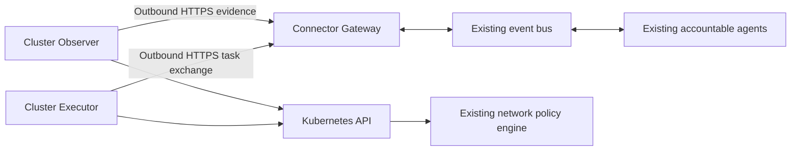

# AKS 역방향 커넥터

이 문서는 private 클러스터에서 연결을 시작하는 전송 방식을 AKS 진단 근거 계층에 추가합니다.
새로운 판단 에이전트나 Kubernetes API 터널을 만들지 않고 관측, 승인된 운영 작업,
선택적인 네트워크 분리를 구분합니다.

> **제공 범위:** 이 문서는 목표 설계입니다. 구현 및 검증 상태는 연결된 구현 원장에 기록합니다.
> 문서나 커넥터 등록 자체는 실환경 배포, 정책 적용, 관리 리소스 변경 권한을 부여하지 않습니다.

## 설계 개요

읽기 전용 Observer가 클러스터 내부에서 정확한 Kubernetes 근거를 수집합니다. 외부로 연결하는
HTTPS 통신으로 제한된 근거와 형식이 지정된 작업을 비권한 게이트웨이와 교환합니다.
기존 에이전트가 판단, 승인, 실행, 복구, 감사를 담당합니다. 별도 실행기는 기존 실행 계약을
사용하며, 선택적 네트워크 분리는 설치된 정책 엔진을 사용합니다.



그림은 실행 권한이 아니라 연결 시작 방향을 나타냅니다. 게이트웨이는 작업 생성, 승인,
실행기 사칭, 클러스터를 대신한 중앙 데이터베이스 접근을 수행하지 않습니다.
관측과 실행은 프로세스, ServiceAccount, 인증 주체, 메시지 범위를 분리합니다.

## 결정과 설계 비평

| 우려 사항 | 비평 후 결정 |
|-----------|--------------|
| 범용 역방향 프록시는 과도한 권한을 노출합니다. | 스키마 검증을 거친 유한한 작업과 근거만 교환합니다. 임의 경로, 셸, kubectl 문자열은 전달하지 않습니다. |
| 노드 에이전트가 기존 CNI 적용 기능과 중복됩니다. | 클러스터 Deployment부터 시작합니다. 기존 Container Network Interface(CNI)를 재사용하고 입증된 근거 공백에만 노드 수집기를 추가합니다. |
| 정상 heartbeat가 오래된 관측을 숨길 수 있습니다. | 연결, 근거의 최신성, 작업 진행, 정책 적용 상태를 별도로 추적합니다. |
| 정책 전달은 적용을 뜻하지 않습니다. | 수락, 전달, 반영, 독립 검증 결과를 구분합니다. |
| 관측한 통신에 악성 연결이 포함될 수 있습니다. | 통신 기록은 근거이며 자동 허용 규칙이나 실행 권한이 아닙니다. |
| 승인 후 라벨이 바뀔 수 있습니다. | 정확한 워크로드, 선택자 버전, 영향 대상 집합의 해시, 정책 버전을 고정하고 변경 시 실행을 보류합니다. |
| 전체 차단 정책과 넓은 허용 정책이 공존할 수 있습니다. | 격리 제안 전에 적용되는 전체 Kubernetes 정책의 합집합과 관리 주체 충돌을 평가합니다. |
| 단절로 이미 반영된 변경을 확인하지 못할 수 있습니다. | 결과를 알 수 없음으로 보존하고 재시도 전에 신뢰할 수 있는 상태를 재확인합니다. |
| 오프라인 정책 캐시가 새 권한을 부여할 수 있습니다. | 마지막 승인 기준 정책을 유지하며 필수 권한 의존성이 없으면 신규 변경을 거부합니다. |
| 네트워크 격리가 복구 경로를 차단할 수 있습니다. | 정확한 관리 의존성을 보호하고 적용 전에 독립적으로 접근 가능한 복구 위치를 확인합니다. |

Illumio의 PCE, Kubelink, C-VEN, 로컬 정책 캐시는 중앙 정책, 클러스터 메타데이터,
분산 적용의 분리에 참고했습니다. FDAI는 호스트 방화벽의 특권 관리를 복제하거나
Illumio의 설정 가능한 fail-open 동작을 그대로 사용하지 않습니다.

## 등록과 전송

등록 정보는 인증된 발급자와 주체를 하나의 배포, 클러스터, 커넥터 역할, namespace 허용 목록,
기능 집합, 등록 버전, 유효 기간에 연결합니다. 신뢰할 수 없는 본문이 테넌트나 클러스터를
선택할 수 없습니다. 정적 자격 증명보다 단기 워크로드 인증을 우선하며, 자격 증명 원문은
저장된 작업, 관측, 로그, 구성 기록에 포함하지 않습니다.

초기 전송은 연결을 재사용하는 제한된 HTTPS 요청이며 클러스터에 수신 포트를 열지 않습니다.
TLS 검증은 필수입니다. 리디렉션, 내장 자격 증명, 임의 콜백 URL, 다른 출처로의 토큰 전달은
지원하지 않습니다. 게이트웨이는 데이터를 수락하기 전에 인증하고 등록 범위별로 할당량,
저장소, 구독, 작업 점유를 분리합니다.

작업은 스키마 버전, 작업 ID, 상관관계 ID, 대상 UID와 버전, 작업 종류, 인자 해시,
만료, 승인과 안전장치 참조, 멱등성 키, 점유 세대를 고정합니다. 수신 확인은 실행 허가가
아닙니다. 폐기된 등록은 새 작업을 받거나 확인할 수 없습니다. 단절 중 권한 철회의 효과는
권한의 최신성 및 만료에 의해 제한되며 즉각적인 오프라인 철회를 보장하지 않습니다.

## 관측과 인벤토리

첫 기능 집합은 기존의 민감한 내용을 제외한 객체 스냅샷과 Event 이력을 수집합니다.
메트릭과 로그 근거에는 별도의 공급자 수집 범위 조건을 유지합니다. Secret 값, ConfigMap 값,
환경 변수 값, 명령 출력, 원문 로그는 전송하지 않습니다.

근거 세대마다 정확한 클러스터 연결 정보, 생성기 버전, 단조 증가 스트림 순서, 관측 기준 시점,
기록 시각, 내용 해시, 완전성, 명시적 수집 공백을 보존합니다. 일부 페이지만 수집했거나
Event 커서가 만료됐거나 순서가 누락되거나 스키마를 지원하지 않으면 부재를 입증하거나
기존 리소스를 지울 수 없습니다. 영속 버퍼의 한도를 넘으면 조용히 버리지 않고 기록합니다.

중앙 인벤토리 기록기가 근거를 검증한 뒤 리소스와 관계를 반영합니다. 커넥터가 온톨로지 상태를
직접 쓰지 않습니다. 직접 수집과 역방향 수집은 클러스터별로 하나의 소스를 선택합니다.
전환에는 최신의 완전한 세대가 필요하며 두 번째 기록기를 만들지 않습니다. 미래 관측,
오래된 세대, 식별 불일치, 같은 키의 다른 내용은 거부합니다. 동일 재시도는 안전하게 처리하고
원래 관측 시각을 새로 갱신하지 않습니다.

## 제약 기반 배포 제안

private 클러스터 감지는 관측과 범위가 제한된 배포 추천을 만들며 설치 명령을 생성하지
않습니다. 인증된 Azure 클러스터 메타데이터의 명시적인 불리언 `enablePrivateCluster`만
private 모드를 입증합니다. 이름, 사설 주소처럼 보이는 엔드포인트, API 접근 실패, 속성 부재로
판단하지 않습니다. 추천에는 정확한 클러스터, 소스 버전, 관측 기준 시점, 제약 근거,
지원 기능 프로필, 만료를 연결합니다.

선택기는 설치 관리 주체, 관리 접근, 런타임 외부 통신, 인증, 이미지 공급, Kubernetes 수락
정책, 용량, 영속 저장을 각각 평가합니다. 차단된 조합을 먼저 제외한 뒤 순위를 정하며,
누락되거나 오래되거나 관측할 수 없는 사실은 알 수 없음으로 유지합니다. 확인된 기존 관리
주체를 보존합니다. 적격 기존 GitOps나 내부 호스트를 새 호스트보다 우선하며, Run Command는
별도로 허용한 일회성 최초 설치 후보이지 런타임 전송 수단이 아닙니다. 선택 가능한 스냅샷 구성은
동시 실행을 막은 CronJob, PVC, 전체 클러스터 읽기 범위, 직접 mTLS 수신을 요구합니다. 이 구성의 배포 렌더러는 아직 없습니다.
PVC 금지, 클러스터 전체 읽기 금지, 중간 TLS 종료 요구 시 미구현 모드로 몰래 대체하지
않습니다. 이후 프로필도 구현과 검증 근거를 갖추기 전에는 선택할 수 없습니다.

추천은 제외한 대안, 부족한 사실, 전제 조건, 변경이 가장 적은 적격 프로필을 보여줍니다.
완전히 지원되는 후보가 없으면 추가 조사나 차단 사유를 반환합니다. 운영자가 설치 방식을
지정할 수 있지만 정책을 우회할 수 없으며, 적용 실패 후 다른 방식으로 자동 전환하지 않습니다.
대상과 근거 내용으로 제안을 중복 제거하여 반복 발견이 중복 승인이나 같은 조건의 반복
알림을 만들지 않게 합니다. Operator 화면은 역할 검사된 읽기 전용 제안을 표시합니다. 관측 활성화가
배포 활성화를 뜻하지 않으며 정확한 대상, 이미지, 계획, 현재 권한, 독립 승인은 기존 배포
절차가 담당합니다. 준비 상태는 Pod나 heartbeat만으로 추정하지 않고 설치, 인증, 관측,
독립 검증을 구분합니다.

### 구현된 제안 범위

사전 점검 신뢰 경계는 배포 구성에 등록된 검증 주체가 서명한, 범위가 제한된 증적만 받습니다.
증적에는 정확한 대상, 생성기 버전, 사실 집합, 설치 관리 주체, 운영자가 지정한 방식,
유효기간을 연결합니다. 서버 소유 등록은 각 검증 키의 대상과 허용된 사실 이름·출처를 제한하며
수락과 조회 때 현재 등록 및 철회를 다시 확인합니다. 유효한 서명은 귀속을 입증할 뿐 진실이나
권한을 보장하지 않습니다. 수집기는 실제 공급자·재확인 근거를 보존해야 하며 구현하지 않았거나
관측할 수 없는 점검은 알 수 없음으로 남깁니다. Kubernetes 읽기 주체가 Azure 정책, 이미지
출처 또는 사람의 설치 승인을 단독으로 입증할 수는 없습니다.

설계 검토에서 서명 없는 입력 기록기와 스스로 등록하는 범용 검증 주체를 제외했습니다.
수정한 경로는 발급 주체 구성과 증적 수신을 분리하고 기존 암호화 및 원자적 상태·감사 저장소를
사용하며 같은 시각의 충돌 근거를 거부합니다. 설치 권한은 부여하지 않습니다. 사실이 없어지거나
철회돼도 기존 관리 주체 고정은 유지합니다. 이 경계를 자동 사전 점검으로 설명하려면 실제
런타임 소스를 먼저 연결해야 합니다.

구독 Kubernetes 자동 발견을 활성화하면 명시적인 private 관측으로 중립 클러스터 식별자별
Core 소유 제안을 하나 생성합니다. 자격 증명 조회에 실패해도 제안은 남습니다. 기존 읽기 신원을
유지하며 입력 근거, 추천, 감사를 원자적으로 저장합니다. 같은 근거를 반복 발견하면 현재 제안을
재사용하고 오래된 관측이 최신 근거를 덮어쓰지 못하게 합니다. 만료, 저장 기록 손상, 사전 점검
제약 변경 시 현재 제안 조회를 거부합니다. 제약 입력이 만료돼도 마지막 관리 주체와 지정 방식은
보존하지만 해당 입력의 사실을 적격 근거로 사용하지는 않습니다.

초기 스키마는 `observer-deployment-context`와 `observer-deployment-proposal`입니다.
서버 소유 사전 점검 근거가 없으면 설치 방식을 추측하지 않고 `needs_evidence`를 반환합니다.
서명된 사전 점검 읽기는 등록된 검증 주체를 인증하고, 대상별 원자적 checkpoint에 최대 16개
발급 주체의 증적을 독립적으로 보존합니다. 사실, 관리 주체 또는 발견 연결이 충돌하면 조회를
차단합니다. 서명 없는 기존 입력은 관리 주체 고정만 유지하고 적격 사실은 제공하지 않습니다.
다음 명령은 저장이나 네트워크 호출 없이 제공한 입력을 평가하지만 해당 파일의 주장을
인증하지는 않습니다.

```bash
python -m fdai.delivery.kubernetes_connector_proposal_cli evaluate --context /private/context.json
python -m fdai.delivery.kubernetes_connector_proposal_cli show --target-ref <neutral-cluster-ref>
```

입력 파일은 소유자만 접근하는 `0600` 권한이어야 합니다. 조회 명령은 기존 Core의
`FDAI_STATE_STORE_DSN`을 사용하고 로컬 실행에서는 loopback PostgreSQL만 허용합니다.
근거가 만료되거나 바뀌면 조회가 실패합니다. 두 명령 모두 승인, 설치, 알림 전송을 하지 않습니다.
Console 표시는 아래에 설명한 대로 구현했습니다. ChatOps 알림, 승인에 따른 설치와 운영 준비
상태 검증은 아직 남아 있습니다.

### 인증된 읽기 사전 점검

`FDAI_OBSERVER_PREFLIGHT_GRANTS_PATH`는 Inventory Job과 Core 조회·저장 명령에서 사용할
검증 주체 등록 파일을 지정합니다. 이 파일은 `0600` 권한의 JSON 배열입니다. 각 등록은
`issuer_ref`, `key_ref`(원시 Ed25519 공개 키의 SHA-256), 16진수 `public_key`,
`target_ref`, `producer_revision`, `allowed_facts`(사실별 허용 출처), `valid_from`,
`expires_at`, `revoked`, `can_select_owner`를 고정합니다. 수신 측이 자신을 등록할 수는
없습니다. 보호된 배포 관리 주체가 등록을 제공하며 추천으로 이를 변경하지 않습니다.

```bash
python -m fdai.delivery.kubernetes_connector_proposal_cli collect-read-preflight --config /private/read-preflight.json
python -m fdai.delivery.kubernetes_connector_proposal_cli retain-preflight --receipt /private/receipt.json
```

수집은 연결된 클러스터 실행 환경에서 명시적으로 명령을 호출할 때만 수행합니다. 비공개 구성은
`target_ref`, `discovery_digest`, `issuer_ref`, `producer_revision`, `api_origin`,
`namespace_uid`(미리 검증한 `kube-system` UID), `api_ca_path`, `api_token_path`,
`signing_key_path`, `grants_path`를 포함합니다. 기존 읽기 신원으로 Namespace 식별을 두 번
확인하고 스냅샷 수집기의 모든 리소스에 대해 저장되지 않는 `SelfSubjectAccessReview`를
수행합니다. 서명된 출력에는 `kubernetes_read` 사실 하나만 들어갑니다. private 모드,
설치 권한, 수락 정책, 용량, 저장소, 이미지, 외부 통신을 입증하지는 않습니다. 발견 연결은
인증된 관리 플레인 발견 결과로 별도 제공해야 합니다.

수집기의 전체 네트워크 제한 시간은 30초이며 압축하지 않은 응답 크기도 제한합니다. TLS를
검증하고 리디렉션은 따르지 않습니다. 누락, 충돌, 크기 초과 또는 요청 실패는 권한 허용이
아니라 알 수 없음입니다. 서명 키는 기존 소유자 전용 PEM 파일에서 읽고 서명된 증적만
출력합니다. 저장 전에 현재 등록을 검증하고 상태와 감사를 원자적으로 기록합니다. 현재 조회도
서명, 범위, 만료, 철회를 다시 검증합니다. 실행 가능한 Kubernetes 읽기 사전 점검이지
자동 예약된 전체 배포 점검은 아닙니다. Azure 정책, 이미지, 용량, 저장소, 네트워크와 설치
관리 주체의 근거 생성기는 아직 남아 있습니다.

### Operator 전달 계약

Core 생성기는 기존 서비스 전송 경로의 전용 논리 이벤트 토픽으로 제안 스냅샷을 발행합니다.
Operator 소비자는 자체 표시용 데이터를 소유하고 Core 저장소를 직접 읽거나 수신 내용을
승인으로 취급하지 않습니다. Core는 발행 전에 현재 제약을 다시 검증합니다. 표시 유효기간은
최대 1분이며 제안 만료를 넘지 않습니다. 갱신이 없으면 준비 상태를 유지하지 않고 사용 불가로
표시합니다. 브로커 수신 확인만으로 Operator 전달을 입증하지는 않습니다.

각 스냅샷은 정확한 대상, 원본 제안 버전, 발행 시각, 만료와 내용 해시를 포함합니다. 중복 전달은
멱등 처리하고 오래된 발행은 무시하며 같은 시각의 다른 내용은 충돌로 처리합니다. 재전송은
Core의 영속 checkpoint를 읽고 설치나 알림 부수 효과를 만들지 않습니다. 역할 검사된 GET
경로가 표시용 데이터를 노출합니다. 이후 계획·승인은 별도의 주체별 상호작용이 필요하며,
만료된 내용은 현재 제안처럼 표시하지 않고 보류합니다.

구현은 `core.observer-deployment.projections`를 사용하고 기존
`FDAI_SEMANTIC_TURN_PHYSICAL_TOPIC` 다중화 설정을 따릅니다. 발견이 성공하면 현재 저장된
대상들의 제안을 발행하지만 브로커 토픽이나 권한은 생성하지 않습니다. Operator 실행 구성은
소비자를 시작·감독하고 출처를 등록하며 인증된 `GET /observer-deployment-proposals`를
제공합니다. 선택적으로 정확한 `target_ref`를 지정할 수 있습니다. PostgreSQL은 같은 대상의
쓰기를 직렬화하고 순서가 바뀐 메시지가 최신 원본 버전을 덮어쓰지 못하게 합니다. 미래 시각의
메시지는 격리하고 같은 시각의 충돌은 더 새로운 근거가 올 때까지 내용을 보류합니다.

설정 > 환경 및 배포 > 클러스터 관측은
`/settings/environment-and-deployment/observers`에서 읽기 전용 목록을 표시합니다.
후보를 펼치면 방식, 외부 통신, 부족하거나 거부된 제약을 볼 수 있습니다. 새로고침은 GET만
수행하고 대기 중에는 공통 skeleton을 표시합니다. 페이지를 열어 둔 상태에서도 만료된 제안의
상세 내용은 숨깁니다. 설치나 승인 동작은 없습니다. 격리된 영어·한국어 브라우저 검사에서
데스크톱, 좁은 데스크톱과 모바일을 확인했습니다. 인증된 표준 스택 검증에는 운영자 로그인이
아직 필요합니다.

## 스냅샷 실행 구성

초기 실행 가능한 관측 경로는 명시적으로 설정한 상호 TLS(mTLS)를 사용합니다.
양쪽 모두 인증서 체인을 검증합니다. 게이트웨이는 실제 TLS 클라이언트 인증서의 SHA-256
지문에서 주체를 식별하고 수락 시 보호된 등록 파일을 다시 읽습니다. 전달된 인증서 헤더나
bearer 토큰은 이 게이트웨이의 인증 수단이 아닙니다. 송신기는 워크로드 토큰을 가져올 수
있지만 대응하는 Entra 인증 수신 경로는 아직 없습니다. 직접 TLS 리스너를 사용하며,
신뢰할 수 없는 프록시에서 TLS를 종료하는 구성은 지원하지 않습니다.

기존 Core 배포 패키지에서 다음 진입점을 제공합니다.

```bash
python -m fdai.delivery.kubernetes_connector_cli observe-once --config /private/observer.json
python -m fdai.delivery.kubernetes_connector_cli serve --config /private/gateway.json
```

각 구성 파일은 소유자만 접근하는 `0600` 권한이어야 합니다. `role`, `registration_path`,
`tls_ca_path`, `tls_certificate_path`, `tls_key_path`를 지정합니다. 관측 구성에는
`gateway_origin`, `observer_principal_ref`, `stream_id`, `producer_revision`,
`spool_directory`, `api_server`, `api_ca_path`, `api_token_path`도 지정합니다.
주체 참조는 인증서 주체 표시 이름이 아니라 클라이언트 인증서 지문입니다. 등록 파일은
`cluster-connector-registration` 스키마를 따르는 제한된 JSON 배열입니다. 관측 등록에는
정확한 클러스터에서 수집하는 전체 namespace 집합을 적으며 클러스터 참조는 정식 중립
인벤토리 식별자입니다. 클러스터 범위 객체를 전송하려면 생성기와 수신기 모두
`allow_cluster_resources: true`를 명시해야 합니다. 알 수 없는 구성 필드는 거부합니다.

게이트웨이만 `FDAI_STATE_STORE_DSN`을 읽으며 관측 워커에는 중앙 DB 자격 증명을
전달하지 않습니다. `0700` 버퍼 디렉터리는 하나의 등록과 스트림에 연결되고, 검증된
스냅샷을 `0600` SQLite DB에 저장합니다. 정확한 수신 확인 후 가장 오래된 패킷만
제거합니다. 확인 응답이 유실되면 새 수집 전에 원래 바이트와 시각으로 재전송합니다.
용량 초과나 대기 근거 만료는 조용한 데이터 삭제가 아니라 작업 중단으로 처리합니다.
수락되지 않은 스트림이 만료됐다면 명시적으로 등록 버전을 바꾸고 새 버퍼 디렉터리를
사용해야 합니다. 자동 스트림 초기화와 수명 주기 공백 복구는 아직 구현하지 않았습니다.

Inventory Job은 `FDAI_KUBERNETES_CONNECTOR_REGISTRATION_PATH`와
`FDAI_KUBERNETES_CONNECTOR_PRINCIPAL_REF`로 이 소스를 선택합니다.
`FDAI_KUBERNETES_CONNECTOR_CLUSTER_RESOURCES`는 클러스터 범위 읽기를 별도로
허용합니다. 초기 연결은 직접 클러스터 연결 및 구독 자동 발견과 함께 사용할 수 없습니다.
리소스 및 검증된 관계 반영은 기존 인벤토리 기록기가 계속 담당합니다. 게이트웨이는 내용과
순번을 감사와 원자적으로 저장하지만 수신 확인 자체는 그래프 반영을 입증하지 않습니다.

이 경로는 민감한 내용을 제외한 완전한 스냅샷만 전송합니다. Event 이력, 영속 읽기 작업 전달,
Executor 작업, 네트워크 분리, 배포 매니페스트, 보호된 실환경 검증은 별도 구현 항목입니다.
스케줄러가 제한된 관측 작업을 호출할 수 있지만 시작 프로그램에서 자동으로 활성화하지는
않습니다. 로컬 TLS와 PostgreSQL 테스트는 합성 근거로 동작만 검증합니다.

## 승인된 운영 작업

읽기 작업과 관리 리소스 변경은 스키마와 대기열을 분리합니다. 읽기 작업에도 범위, 기한,
감사, 민감 정보 제거를 적용합니다. 변경에는 중단 조건, 검증된 복구, 영향 범위, 성공한 dry-run,
논리 대상 잠금, 안정적인 멱등성 키, 실행 전후 감사라는 기존 7개 안전장치를 유지합니다.
성공을 보고하려면 독립 관측이 필요합니다.

클러스터 실행기는 Thor가 담당하는 전달 어댑터이며 별도 권한 부여자가 아닙니다.
실행 직전에 신뢰할 수 있는 실행 묶음을 조회하고 재검증합니다. 승인 누락, 철회된 신원,
만료된 작업, 오래된 대상 버전, 감사 또는 복구 부재, 잠금 연속성 불명은 실행을 차단합니다.
새 기능은 별도 승격 전까지 변경을 적용하지 않는 shadow 상태로 유지합니다.

최소 한 번 전달은 부수 효과가 정확히 한 번 발생한다는 보장이 아닙니다. 영속적인 작업 점유로
동시 실행을 방지하고, 진행 중 점유가 만료되면 결과를 알 수 없음으로 기록해 상태를 재확인합니다.
공급자 성공 후 수신 확인이 유실되어도 무조건 재실행하지 않습니다. 로컬 기록만으로 Saga의
공식 감사나 현재 유효한 승인을 대체하지 않습니다.

## 선택적 네트워크 분리

네트워크 분리는 별도로 등록하는 변경 기능이며 private 클러스터 관측의 전제 조건이 아닙니다.
어댑터를 선택하기 전에 기존 CNI, OS, 정책 API 지원, GitOps 관리 주체, 버전 제약을 확인합니다.
Illumio를 이미 사용한다면 기존 정책 관리 주체를 유지하고 같은 호스트 방화벽 규칙을 중복 관리하지 않습니다.

정책 분석은 양방향 Kubernetes NetworkPolicy의 허용 규칙 합집합 의미를 보존합니다.
알 수 없는 선택자, namespace 메타데이터 누락, 호스트 네트워크, NAT 불확실성, 미지원 포트,
불완전한 정책 인벤토리, 오래된 통신 자료는 알 수 없음으로 처리합니다. 관측된 연결이나
사용자가 변경할 수 있는 라벨로 정책 후보의 권한을 넓힐 수 없습니다.

미리 보기는 분석만 수행합니다. 서버 측 dry-run은 승인 처리를 확인하며 실제 연결을 검증하지 않습니다.
정책 적용에는 고정된 영향 대상, 승인된 기능, 기존 관리 주체, 검증된 복구 계획, 독립 Observer의
허용 및 차단 검사가 필요합니다. 정책 수신, Kubernetes 수락, 대상별 적용, 실제 연결은 별도 기록입니다.
DNS, 인증, API, 게이트웨이, 감사, 복구 의존성은 명시적인 허용 목록이며 포트 443 전체 예외가 아닙니다.
초기 적용은 선택된 namespace 하나로 제한합니다.

## 장애와 수명 주기

게이트웨이 연결이 끊기면 저장 한도 내에서 관측을 계속할 수 있지만 신규 변경은 중단합니다.
기존 승인 네트워크 정책은 유지합니다. 정책 만료를 삭제나 전체 통신 허용으로 해석하지 않습니다.
재연결 시 실행 전에 등록과 대기 작업을 재검증하며 만료된 권한으로 작업하지 않습니다.
중단과 복구는 승인된 작업 계약을 따릅니다.

클러스터 전체가 중단되면 내부 관측과 실행도 중단됩니다. Azure 관리 계층 상태, 클러스터 기동,
접근 가능한 외부 복구 위치는 커넥터 밖에 유지합니다. 외부 연결, DNS, 인증 엔드포인트,
이미지 배포, 최초 설치에는 승인된 네트워크 및 배포 경로가 필요합니다.
이 설계가 private 연결의 필요성을 완전히 없애지는 않습니다.

설치와 제거도 통제된 작업입니다. 이미지는 해시로 고정하고 가능한 경우 비루트로 실행하며
최소 Kubernetes RBAC를 사용합니다. 게이트웨이와 워커는 지원 계약 버전을 확인합니다.
순차 업데이트, 중복 복제본, 재시작 복구, 철회, 제거를 집중 검증하며 제거 작업이 애플리케이션의
보호 정책을 묵시적으로 삭제하지 않습니다.

## 구현과 완료 기준

| 단계 | 필수 근거 |
|------|-----------|
| C1 계약 | 범위, 최신성, 재전송, 개인정보 보호, 무권한 검증. |
| C2 관측 | 영속 역방향 수집, 인증된 수신, 인벤토리 반영, 단절 복구. |
| C3 운영 | 기존 안전장치 실행기 연동, 권한 거부, 중복 실행, 결과 불명 검증. |
| C4 정책 분석 | 유효 정책 합집합, 선택자 변경, 기존 관리자 충돌, 미지원 소스 검증. |
| C5 제한 적용 | 등록된 shadow ActionType, 복구, 독립 허용/차단 검사, 승격 근거. |
| C6 운영 준비 | 설치, 갱신, 철회, 복구, 제거, 정확한 private 클러스터 재확인. |

구현 후 최소 10회의 비평을 기록합니다. 각 회차는 범위, 실제 발견 사항, 처리 결과, 집중 검증을
기록하며 문제가 없었던 회차도 사실대로 남깁니다. Medium 이상 미해결 문제는 완료를 차단합니다.
비평 후 직접 검증하고, 결함이 발견되면 수정한 뒤 다시 최소 10회를 수행하고 직접 검증을 반복합니다.
단위 테스트나 합성 근거는 private 클러스터 준비 상태를 대신하지 않습니다.

## 관련 문서

| 알아볼 내용 | 문서 |
|-------------|------|
| 구현과 남은 작업 | [구현 원장](../../roadmap-implementation/architecture/aks-outbound-connector.md) |
| 기존 근거 계약 | [AKS 진단 근거 계층](aks-diagnostic-evidence-plane-ko.md) |
| 권한과 효과 검증 | [FDAI 헌법](fdai-constitution-ko.md) |
| 컨테이너 정책 구조 | [Illumio 컨테이너 가이드](https://product-docs-repo.illumio.com/Tech-Docs/Containers/PDF/Illumio_Core_for_Kubernetes.pdf) |
| 기본 정책 의미 | [Kubernetes NetworkPolicy](https://kubernetes.io/docs/concepts/services-networking/network-policies/) |
| AKS 정책 지원 | [Azure CNI powered by Cilium](https://learn.microsoft.com/en-us/azure/aks/azure-cni-powered-by-cilium) |
