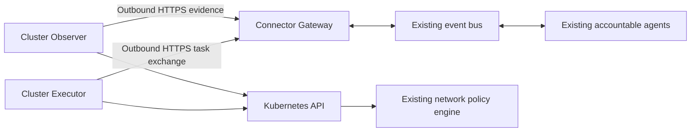

# AKS Outbound Connector

This design extends the AKS diagnostic evidence plane with a cluster-initiated transport for
private clusters. It separates observation, governed operations, and optional network segmentation
without introducing a new decision-making agent or exposing the Kubernetes API through a tunnel.

> **Delivery boundary:** This is the target design. The linked implementation ledger records what
> is implemented and tested. Neither this document nor connector registration authorizes a live
> deployment, policy enforcement, or a managed-resource change.

## Design at a glance

A read-only Observer collects exact Kubernetes evidence inside the cluster. An outbound HTTPS
connection transfers bounded evidence and receives typed work through a non-privileged gateway.
Existing agents retain judgment, approval, execution, recovery, and audit ownership. A separate
Executor uses existing execution contracts; optional segmentation uses the installed policy engine.



The diagram shows connection initiation, not execution authority. The gateway cannot mint work,
approve it, impersonate an executor, or access the central database on behalf of a cluster.
Observation and execution use separate processes, ServiceAccounts, identities, and message scopes.

## Decisions and design critique

| Concern | Decision after critique |
|---------|-------------------------|
| A generic reverse proxy would expose excessive authority. | Exchange finite schema-validated tasks and evidence, never arbitrary paths, shell, or kubectl text. |
| Node agents would duplicate existing CNI enforcement. | Start with a cluster Deployment. Reuse the installed Container Network Interface (CNI); add node collectors only for a demonstrated evidence gap. |
| A valid heartbeat could conceal stale observations. | Track connectivity, evidence freshness, task progress, and policy convergence independently. |
| Policy delivery is not enforcement. | Separate accepted, dispatched, applied, and independently verified outcomes. |
| Captured traffic could include malicious connections. | Observed flows are evidence, never automatic allow rules or execution authority. |
| Labels can change after approval. | Bind an exact workload identity, selector revision, affected-set digest, and policy revision; drift holds execution. |
| A deny-all policy may coexist with broad allow rules. | Evaluate the union of all applicable Kubernetes policies and ownership conflicts before proposing isolation. |
| Disconnection can conceal an already applied change. | Preserve an unknown outcome and reconcile authoritative state before retrying. |
| An offline policy cache could grant new authority. | Keep the last approved baseline; refuse new mutations when required authority dependencies are unavailable. |
| Network isolation can sever its own recovery path. | Protect exact management dependencies and verify an independently reachable recovery venue before enforcement. |

Illumio's PCE, Kubelink, C-VEN, and local policy cache inform the separation of central policy,
cluster metadata, and distributed application. FDAI does not replicate privileged host firewall
management or inherit Illumio's configurable fail-open behavior.

## Enrollment and transport

Registration binds an authenticated issuer and subject to one deployment, cluster, connector role,
namespace allowlist, capability set, enrollment revision, and validity interval. An untrusted body
cannot select its own tenant or cluster. Short-lived workload identity is preferred over static
credentials. Credential bytes never enter stored tasks, observations, logs, or configuration records.

The initial transport uses bounded HTTPS requests with connection reuse and no inbound listener
in the cluster. TLS verification is mandatory. Redirects, embedded credentials, arbitrary callback
URLs, and cross-origin token forwarding are not supported. The gateway authenticates before accepting
data and isolates quotas, storage, subscriptions, and task claims by the registered scope.

Task records pin the schema version, task ID, correlation ID, target UID and revision, operation,
argument digest, expiration, approval and safeguard references, idempotency key, and claim fence.
Transport acknowledgment never creates an execution authorization. A retired enrollment cannot
receive or acknowledge new work. Revocation during a network partition is bounded by authority
freshness and expiration; immediate offline revocation is not claimed.

## Observation and inventory

The first capability set collects the existing content-safe object snapshot and Event history.
Metric and log evidence retain their independent provider coverage requirements. Secret values,
ConfigMap values, environment values, command output, and raw log bodies are not transferred.

Each evidence generation has an exact cluster binding, producer revision, monotonic stream sequence,
observation cutoff, recorded time, content digest, completeness, and explicit coverage gaps. Partial
pages, expired Event cursors, sequence gaps, and unsupported schemas cannot prove absence or erase
prior resources. Bounded persistent buffering records overflow rather than silently dropping evidence.

The central inventory writer validates evidence before promoting resources and relationships. A
connector cannot write ontology state directly. Direct and outbound collection have one configured
source selection per cluster; failover requires a fresh, complete generation, not a second writer.
Future observations, stale generations, mismatched identity, and same-key different-content replay
are rejected. Identical retry remains safe and does not refresh the original observation time.

## Constraint-based deployment proposals

Private-cluster detection creates an observation and a bounded deployment recommendation, never
an installation command. Only an explicit boolean `enablePrivateCluster` from authenticated Azure
cluster metadata establishes private mode. A name, private-looking endpoint, missing API access,
or absent property does not establish it. Each recommendation binds the exact cluster, source
revision, observation cutoff, constraint evidence, supported capability profile, and expiry.

The selector independently evaluates installation ownership, management access, runtime egress,
identity, artifact supply, Kubernetes admission, capacity, and persistent storage. It excludes
denied combinations before ranking; missing, stale or unobservable facts stay unknown. A known
existing owner is preserved. Eligible existing GitOps or internal-host paths precede a new host;
Run Command is a separately permitted one-shot bootstrap candidate, not a runtime transport.
The selectable snapshot recipe requires a serialized CronJob, PVC, complete cluster read scope and
direct mTLS ingress; its deployment renderer remains open. A forbidden PVC, cluster-wide read prohibition or mandatory TLS termination
cannot silently select an unimplemented mode. Future profiles require their own implementation
and verification evidence before selection.

Recommendations list rejected alternatives, missing facts, prerequisites, and the least-change
eligible profile. If no candidate is fully supported, they request inspection or report a blocker.
Operators may pin an allowed installation method; a pin cannot bypass policy and an unsuccessful
apply cannot silently switch methods. A proposal is deduplicated by target and evidence content;
repeated discovery cannot create duplicate approvals or repeatedly notify an unchanged condition.
The future Operator surface must expose only purpose- and role-scoped proposals. Enabling observation does
not enable deployment; exact target, artifact, plan, current authority and independent approval
remain deployment-workflow responsibilities. Readiness distinguishes installed, authenticated,
observing and independently verified rather than inferring health from a Pod or heartbeat.

### Implemented proposal boundary

When subscription Kubernetes discovery is enabled, explicit private observations now create one
Core-owned proposal per neutral cluster identity even if credential discovery fails. The job keeps
its existing read identity and persists the context, recommendation and audit atomically. Repeated
identical evidence reuses the current proposal; older observations cannot replace newer evidence.
Expiry, corrupt records and changed preflight constraints reject current readback. An expired
constraint context retains its last known owner and method pin but cannot supply eligible facts.

The initial schema pair is `observer-deployment-context` and `observer-deployment-proposal`.
Absent server-owned preflight evidence produces `needs_evidence`, not a best-guess installation.
The constraint reader is an injection boundary: an evidence digest proves content integrity, not
source authentication. Automatic constraint collectors and a reviewed constraint writer are not
implemented. Supplied-context evaluation is available without persistence or network calls:

```bash
python -m fdai.delivery.kubernetes_connector_proposal_cli evaluate --context /private/context.json
python -m fdai.delivery.kubernetes_connector_proposal_cli show --target-ref <neutral-cluster-ref>
```

The context file must be owner-only `0600`. The read command uses the existing Core
`FDAI_STATE_STORE_DSN`, permits only loopback PostgreSQL in a local venue, and fails on stale or
changed evidence. Neither command approves, installs or sends a notification. Console/ChatOps
projection, governed installation and operational readiness remain unimplemented boundaries.

## Snapshot runtime

The initial executable observation path uses explicitly configured mutual TLS (mTLS). Both
peers verify the certificate chain. The gateway derives the principal from the actual TLS client
certificate's SHA-256 fingerprint and reloads the protected enrollment file for admission. Forwarded
certificate headers and bearer tokens are not authentication for this gateway. Workload-token
acquisition remains available in the transport, but a corresponding Entra-authenticated ingress is
not implemented. Use a direct TLS listener; TLS termination at an untrusted proxy is unsupported.

The existing Core distribution provides these entry points:

```bash
python -m fdai.delivery.kubernetes_connector_cli observe-once --config /private/observer.json
python -m fdai.delivery.kubernetes_connector_cli serve --config /private/gateway.json
```

Each configuration file is owner-only mode `0600`. It names a `role`, `registration_path`,
`tls_ca_path`, `tls_certificate_path`, and `tls_key_path`. Observer configuration additionally
names `gateway_origin`, `observer_principal_ref`, `stream_id`, `producer_revision`,
`spool_directory`, `api_server`, `api_ca_path`, and `api_token_path`. The principal reference is
the client certificate fingerprint, not its subject display name. The enrollment file is a bounded
JSON array of the registered `cluster-connector-registration` schema. Each observation registration
lists the complete namespace set collected from its exact cluster, whose reference is the canonical
neutral inventory identity. Cluster-scoped object transfer requires explicit
`allow_cluster_resources: true` on both producer and receiver. Unknown configuration fields fail.

The gateway alone reads `FDAI_STATE_STORE_DSN`. The observer receives no central database
credential. Its mode-`0700` spool directory binds to one enrollment and stream and holds validated
snapshots in a mode-`0600` SQLite database. Exact acknowledgment removes only the oldest packet;
lost acknowledgment replays its original bytes and clock before new collection. Capacity exhaustion
and expired pending evidence stop the cycle without silently dropping data. Recovering an expired
unaccepted stream requires an explicitly revised enrollment and a new spool directory; automatic
stream reset and lifecycle-gap recovery are not implemented.

The Inventory Job selects this source with `FDAI_KUBERNETES_CONNECTOR_REGISTRATION_PATH` and
`FDAI_KUBERNETES_CONNECTOR_PRINCIPAL_REF`. The independent
`FDAI_KUBERNETES_CONNECTOR_CLUSTER_RESOURCES` flag controls cluster-scoped read permission. The
initial binding is exclusive with direct cluster bindings and subscription discovery. The ordinary
inventory writer still owns all resource and verified-relationship promotion. The gateway stores
content and sequence atomically with audit, but its acknowledgment does not prove graph promotion.

This path transfers complete content-safe snapshots only. Event history, durable read task dispatch,
Executor work, segmentation, deployment manifests, and protected live validation remain separate
delivery items. A scheduler may invoke the bounded observer cycle; no startup launcher enables it
implicitly. Local TLS and PostgreSQL tests use synthetic evidence and prove mechanics only.

## Governed operations

Read work and managed-resource changes have distinct schemas and queues. Read work has bounded
scope, deadline, audit, and redaction. State changes retain all seven existing safeguards: stop
condition, tested recovery, impact bound, successful dry-run, logical-target lock, stable idempotency,
and audit intent plus terminal closure. Independent observation is required before success.

The cluster Executor is a delivery adapter under Thor, not an independent authorizer. It resolves
and revalidates the authoritative execution bundle immediately before dispatch. Missing approval,
revoked identity, expired work, stale target revision, missing audit or recovery, and unknown lock
continuity block execution. New capabilities remain in shadow until separately promoted.

At-least-once delivery does not promise exactly-once side effects. A durable claim prevents parallel
dispatch, and an expired in-flight claim becomes an unknown outcome requiring reconciliation.
Provider success followed by lost acknowledgment never authorizes blind replay. Local journaling
alone does not replace Saga's authoritative audit or a current authorization.

## Optional segmentation

Segmentation is a separately registered state-changing capability, not a prerequisite for observing
a private cluster. Discover the existing CNI, OS, policy API support, GitOps ownership, and relevant
version constraints before selecting an adapter. Existing Illumio installations remain their policy
owner; FDAI does not concurrently manage the same host firewall rules.

Policy analysis preserves the additive Kubernetes NetworkPolicy semantics in both directions.
Unknown selectors, missing namespace metadata, host networking, NAT ambiguity, unsupported ports,
incomplete policy inventory, and stale flow data produce an explicit unknown result. A policy
candidate cannot obtain broader authority from an observed connection or a user-editable label.

Preview is analysis only. Server-side dry-run checks admission, not real connectivity. Enforcement
requires a frozen affected set, an approved capability, existing policy ownership, a tested recovery
plan, and positive and negative probes from an independent Observer. Policy acknowledgment,
Kubernetes acceptance, per-target convergence, and actual connectivity remain separate records.
DNS, identity, API, gateway, audit, and recovery dependencies are explicit allowlist requirements,
not a blanket port-443 exception. Initial enforcement is limited to one selected namespace.

## Failure and lifecycle behavior

On gateway loss, observation may continue within storage limits while new mutations stop. Existing
approved network policy stays in place; policy expiration does not mean deleting it or allowing all
traffic. Reconnection revalidates enrollment and pending work before any dispatch. Work with expired
authority is not executed. Stop and recovery behavior follow the approved action contract.

Cluster-wide failure also removes in-cluster observation and execution. Azure management-plane
health, cluster start, and an eligible external recovery venue remain outside this connector.
Outbound reachability, DNS, identity endpoints, image distribution, and bootstrap installation still
need an approved network and deployment path. Private connectivity is not eliminated by this design.

Installation and removal are governed operations. Package images are digest-pinned, non-root where
possible, and use minimum Kubernetes RBAC. The gateway and worker negotiate supported contract
versions. Rolling upgrades, duplicate replicas, restart recovery, revocation, and removal receive
focused tests; uninstall never implicitly removes protective application policy.

## Delivery and acceptance

| Stage | Required evidence |
|-------|-------------------|
| C1 contracts | Scope, freshness, replay, privacy, and no-authority tests. |
| C2 observation | Durable outbound collection, authenticated ingress, inventory promotion, and disconnect recovery. |
| C3 operations | Existing guarded Executor integration; negative authorization, duplicate dispatch, and unknown-outcome tests. |
| C4 policy analysis | Effective-policy union, selector drift, existing-owner conflict, and unsupported-source tests. |
| C5 restricted enforcement | Registered shadow ActionType, recovery, independent allow/deny probes, and promotion evidence. |
| C6 operations readiness | Install, update, revoke, recover, remove, and exact private-cluster readback. |

After implementation, perform at least ten documented critique rounds. Each round records its
scope, actual findings, disposition, and focused checks; a no-finding round is recorded honestly.
Any unresolved Medium-or-higher finding blocks completion. Direct verification follows the rounds.
If direct verification finds a defect, repair it and run another set of at least ten rounds before
repeating verification. Unit or synthetic evidence never substitutes for private-cluster readiness.

## Related docs

| To learn about | Read |
|----------------|------|
| Delivery and open work | [Implementation ledger](../../roadmap-implementation/architecture/aks-outbound-connector.md) |
| Existing evidence contracts | [AKS diagnostic evidence plane](aks-diagnostic-evidence-plane.md) |
| Authority and effect verification | [FDAI Constitution](fdai-constitution.md) |
| Container policy architecture | [Illumio container guide](https://product-docs-repo.illumio.com/Tech-Docs/Containers/PDF/Illumio_Core_for_Kubernetes.pdf) |
| Native policy semantics | [Kubernetes NetworkPolicy](https://kubernetes.io/docs/concepts/services-networking/network-policies/) |
| Supported AKS policy features | [Azure CNI powered by Cilium](https://learn.microsoft.com/en-us/azure/aks/azure-cni-powered-by-cilium) |
