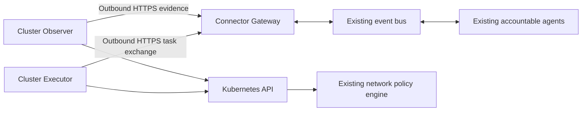

# AKS Outbound Connector

This design extends the AKS diagnostic evidence plane with a cluster-initiated transport for
private clusters. It separates observation, governed operations, and optional network segmentation
without introducing a new decision-making agent or exposing the Kubernetes API through a tunnel.

> **Delivery boundary:** This is the target design. The linked implementation ledger records what
> is implemented and tested. Neither this document nor connector registration authorizes a live
> deployment, policy enforcement, or a managed-resource change.

## Design at a glance

A read-only Observer collects exact Kubernetes evidence inside the cluster. An outbound HTTPS
connection transfers bounded evidence and receives typed work through a non-privileged gateway.
Existing agents retain judgment, approval, execution, recovery, and audit ownership. A separate
Executor uses existing execution contracts; optional segmentation uses the installed policy engine.



The diagram shows connection initiation, not execution authority. The gateway cannot mint work,
approve it, impersonate an executor, or access the central database on behalf of a cluster.
Observation and execution use separate processes, ServiceAccounts, identities, and message scopes.

## Decisions and design critique

| Concern | Decision after critique |
|---------|-------------------------|
| A generic reverse proxy would expose excessive authority. | Exchange finite schema-validated tasks and evidence, never arbitrary paths, shell, or kubectl text. |
| Node agents would duplicate existing CNI enforcement. | Start with a cluster Deployment. Reuse the installed Container Network Interface (CNI); add node collectors only for a demonstrated evidence gap. |
| A valid heartbeat could conceal stale observations. | Track connectivity, evidence freshness, task progress, and policy convergence independently. |
| Policy delivery is not enforcement. | Separate accepted, dispatched, applied, and independently verified outcomes. |
| Captured traffic could include malicious connections. | Observed flows are evidence, never automatic allow rules or execution authority. |
| Labels can change after approval. | Bind an exact workload identity, selector revision, affected-set digest, and policy revision; drift holds execution. |
| A deny-all policy may coexist with broad allow rules. | Evaluate the union of all applicable Kubernetes policies and ownership conflicts before proposing isolation. |
| Disconnection can conceal an already applied change. | Preserve an unknown outcome and reconcile authoritative state before retrying. |
| An offline policy cache could grant new authority. | Keep the last approved baseline; refuse new mutations when required authority dependencies are unavailable. |
| Network isolation can sever its own recovery path. | Protect exact management dependencies and verify an independently reachable recovery venue before enforcement. |

Illumio's PCE, Kubelink, C-VEN, and local policy cache inform the separation of central policy,
cluster metadata, and distributed application. FDAI does not replicate privileged host firewall
management or inherit Illumio's configurable fail-open behavior.

## Enrollment and transport

Registration binds an authenticated issuer and subject to one deployment, cluster, connector role,
namespace allowlist, capability set, enrollment revision, and validity interval. An untrusted body
cannot select its own tenant or cluster. Short-lived workload identity is preferred over static
credentials. Credential bytes never enter stored tasks, observations, logs, or configuration records.

The initial transport uses bounded HTTPS requests with connection reuse and no inbound listener
in the cluster. TLS verification is mandatory. Redirects, embedded credentials, arbitrary callback
URLs, and cross-origin token forwarding are not supported. The gateway authenticates before accepting
data and isolates quotas, storage, subscriptions, and task claims by the registered scope.

Task records pin the schema version, task ID, correlation ID, target UID and revision, operation,
argument digest, expiration, approval and safeguard references, idempotency key, and claim fence.
Transport acknowledgment never creates an execution authorization. A retired enrollment cannot
receive or acknowledge new work. Revocation during a network partition is bounded by authority
freshness and expiration; immediate offline revocation is not claimed.

## Observation and inventory

The first capability set collects the existing content-safe object snapshot and Event history.
Metric and log evidence retain their independent provider coverage requirements. Secret values,
ConfigMap values, environment values, command output, and raw log bodies are not transferred.

Each evidence generation has an exact cluster binding, producer revision, monotonic stream sequence,
observation cutoff, recorded time, content digest, completeness, and explicit coverage gaps. Partial
pages, expired Event cursors, sequence gaps, and unsupported schemas cannot prove absence or erase
prior resources. Bounded persistent buffering records overflow rather than silently dropping evidence.

The central inventory writer validates evidence before promoting resources and relationships. A
connector cannot write ontology state directly. Direct and outbound collection have one configured
source selection per cluster; failover requires a fresh, complete generation, not a second writer.
Future observations, stale generations, mismatched identity, and same-key different-content replay
are rejected. Identical retry remains safe and does not refresh the original observation time.

## Constraint-based deployment proposals

Private-cluster detection creates an observation and a bounded deployment recommendation, never
an installation command. Only an explicit boolean `enablePrivateCluster` from authenticated Azure
cluster metadata establishes private mode. A name, private-looking endpoint, missing API access,
or absent property does not establish it. Each recommendation binds the exact cluster, source
revision, observation cutoff, constraint evidence, supported capability profile, and expiry.

The selector independently evaluates installation ownership, management access, runtime egress,
identity, artifact supply, Kubernetes admission, capacity, and persistent storage. It excludes
denied combinations before ranking; missing, stale or unobservable facts stay unknown. A known
existing owner is preserved. Eligible existing GitOps or internal-host paths precede a new host;
Run Command is a separately permitted one-shot bootstrap candidate, not a runtime transport.
The selectable snapshot recipe requires a serialized CronJob, PVC, complete cluster read scope and
direct mTLS ingress; a suspended installation preview is available, but governed apply remains open. A forbidden PVC, cluster-wide read prohibition or mandatory TLS termination
cannot silently select an unimplemented mode. Future profiles require their own implementation
and verification evidence before selection.

Recommendations list rejected alternatives, missing facts, prerequisites, and the least-change
eligible profile. If no candidate is fully supported, they request inspection or report a blocker.
Operators may pin an allowed installation method; a pin cannot bypass policy and an unsuccessful
apply cannot silently switch methods. A proposal is deduplicated by target and evidence content;
repeated discovery cannot create duplicate approvals or repeatedly notify an unchanged condition.
The Operator surface exposes role-gated read-only proposals. Enabling observation does
not enable deployment; exact target, artifact, plan, current authority and independent approval
remain deployment-workflow responsibilities. Readiness distinguishes installed, authenticated,
observing and independently verified rather than inferring health from a Pod or heartbeat.

### Implemented proposal boundary

The preflight trust boundary admits only signed, bounded receipts from deployment-registered
verifiers. A receipt binds the exact target, producer revision, fact set, installation owner,
operator method pin and validity window. Server-owned grants bind each verifier key to its target
and permitted fact names and sources; admission and readback recheck current grants and revocation.
Signature validity proves attribution, not truth or permission. Collectors must retain actual
provider/readback evidence, and unimplemented or unobservable checks remain unknown. A Kubernetes
reader cannot attest Azure policy, artifact provenance or human installation approval by itself.

Design critique rejected an unsigned context writer and a universal self-enrolling verifier.
The revised path separates issuer configuration from receipt intake, uses existing cryptography
and atomic state/audit providers, denies conflicting same-time evidence, and never grants installation
authority. Existing owner pins survive missing or revoked facts. The runtime source must be wired
before this boundary can be described as automatic preflight coverage.

Expired, revoked or invalid preflight receipts and missing private verifier files cannot keep an
old recommendation usable. A fresh discovery discards their facts, retains prior owner pins and
records `needs_evidence` with `constraint_evidence_unavailable` in its audit. Current reads of the
old fact-bearing proposal remain denied. Storage-service errors and cancellation still propagate;
this bounded recovery never fabricates evidence, repeats collection or grants installation authority.

When subscription Kubernetes discovery is enabled, explicit private observations now create one
Core-owned proposal per neutral cluster identity even if credential discovery fails. The job keeps
its existing read identity and persists the context, recommendation and audit atomically. Repeated
identical evidence reuses the current proposal; older observations cannot replace newer evidence.
Expiry, corrupt records and changed preflight constraints reject current readback. An expired
constraint context retains its last known owner and method pin but cannot supply eligible facts.

Setup suppression uses current accepted snapshot evidence, not Pod presence or enrollment alone.
An optional deployment-owned observer registry binds exact targets to authenticated principals.
Only one matching observer with a currently valid enrollment and a fresh, integrity-checked complete
snapshot suppresses a new setup proposal and withholds an existing recommendation on readback.
Missing, revoked, expired, ambiguous or corrupt evidence cannot suppress inspection. The existing
Operator unavailable projection removes any old recommendation without claiming installed health,
inventory promotion or effect verification. Suppression neither deletes history nor changes authority.
`FDAI_OBSERVER_REGISTRATIONS_PATH` explicitly selects the same owner-only registration format as
the gateway for discovery and Core proposal reads. Without that binding, suppression is unavailable.
The evidence reader accepts snapshots younger than five minutes and rechecks exact enrollment after
storage I/O. Failed evidence reads cannot hide a setup need; storage service failures remain errors.

The initial schema pair is `observer-deployment-context` and `observer-deployment-proposal`.
Absent server-owned preflight evidence produces `needs_evidence`, not a best-guess installation.
The signed preflight reader authenticates registered verifiers and retains up to 16 independent
contributions, keyed by issuer and signed fact-name set, under one atomic target checkpoint.
Disjoint collectors from one verifier coexist; a newer receipt replaces only its exact contribution.
Overlapping differently grouped facts from one issuer are rejected rather than partially rewriting
a signed receipt. Existing aggregate receipts remain readable and require an explicit producer
handoff before changing their fact grouping. Conflicting facts, owners or discovery
bindings block readback. Unsigned legacy context supplies owner pins only, never eligible facts.
Supplied-context evaluation remains available without persistence or network calls; it does not
authenticate that file's assertions:

```bash
python -m fdai.delivery.kubernetes_connector_proposal_cli evaluate --context /private/context.json
python -m fdai.delivery.kubernetes_connector_proposal_cli show --target-ref <neutral-cluster-ref>
```

The context file must be owner-only `0600`. The read command uses the existing Core
`FDAI_STATE_STORE_DSN`, permits only loopback PostgreSQL in a local venue, and fails on stale or
changed evidence. Neither command approves, installs or sends a notification. Console projection is
implemented below; ChatOps notification, governed installation and operational readiness remain open.

### Authenticated read preflight

`FDAI_OBSERVER_PREFLIGHT_GRANTS_PATH` selects a private `0600` JSON array of verifier grants for
both the Inventory Job and Core read/retention commands. Each grant binds `issuer_ref`, `key_ref`
(SHA-256 of the raw Ed25519 public key), hex `public_key`, `target_ref`, `producer_revision`,
`allowed_facts` (fact-to-source allowlists), `valid_from`, `expires_at`, `revoked`, and
`can_select_owner`. No endpoint can enroll itself. The protected deployment owner supplies this
registration; changing it is not an outcome of a recommendation.

```bash
python -m fdai.delivery.kubernetes_connector_proposal_cli collect-read-preflight --config /private/read-preflight.json
python -m fdai.delivery.kubernetes_connector_proposal_cli retain-preflight --receipt /private/receipt.json
```

Collection runs only when explicitly invoked in the bound cluster venue. Its private configuration
contains `target_ref`, `discovery_digest`, `issuer_ref`, `producer_revision`, `api_origin`,
`namespace_uid` (previously verified `kube-system` UID), `api_ca_path`, `api_token_path`,
`signing_key_path`, and `grants_path`. The existing projected reader identity performs only two
Namespace identity reads and non-persistent `SelfSubjectAccessReview` requests for every resource
listed by the snapshot collector. The signed output contains one `kubernetes_read` fact. It does
not prove private mode, installation authority, admission, capacity, storage, artifacts or egress.
The discovery binding remains independently supplied by authenticated management-plane discovery.

The collector has a 30-second total network deadline and bounded uncompressed responses, uses
verified TLS, and follows no redirects. Missing, conflicting, oversized or failed responses produce
unknown rather than authorization. The signing key is read from an existing owner-only PEM file;
only the signed receipt is output. Retention verifies current grants before atomic state/audit
storage and current reads verify signatures, scope, expiry and revocation again. This is an
executable Kubernetes read preflight, not an automatically scheduled complete deployment preflight.
Other implemented producers are described below; Azure policy, route classification and installation-owner producers remain open.

### Capacity and storage preflight

The reusable accounting foundation and explicitly invoked signed capacity/storage collectors are
implemented. `kubernetes_quantity.py` wraps the official Kubernetes Python quantity parser,
locked at `36.0.3` under Apache-2.0, rather than maintaining another suffix conversion engine.
Core owns this dependency; parsing creates no API client and loads no credentials.
`parse_resource_quantity` returns exact `Decimal` cores or bytes. Input is an ASCII quantity string
of at most 96 characters or a JSON integer, with exponent magnitude at most 64 and value at most
`2**63 - 1`. Negative values, booleans, floats, non-finite values, whitespace and unsupported syntax
raise `KubernetesQuantityError`; none become zero. `cpu_millicores` and `storage_bytes` round requests
up to integer units and reject overflow. They are not capacity-floor functions, API admission
validators or Go quantity serializers, and parsing does not round or clamp to Go precision.

`pod_resource_requests` reuses these functions for ordinary CPU/memory requests: take the greater
of app-container sums and each resource's init-container maximum, then add Pod overhead. Missing
requests use limits, then zero; explicit malformed inputs never default. Per-container upward
rounding can overcount fractional bytes. Unsupported resource types, restart/resize declarations
and status, Pod-level resources, malformed arrays and more than 512 total containers raise
`ValueError`, which the collector retains as unknown. The actual suspended observer recipe
is checked as 100 millicores, 128 MiB and a 1 GiB PVC. This proves arithmetic, not placement.

Resource inspection is GET-only under the exact cluster UID binding. Complete paginated Node and
Pod lists establish a point-in-time CPU, memory and Pod-slot fit for the fixed observer recipe.
Unknown quantities, incomplete pages, in-place resize, restartable init containers, Pod-level
resources or unassigned pending work withhold capacity rather than approximating it. Only ready,
schedulable, untainted Linux/amd64 nodes are candidates. The result does not reserve capacity or
prove placement, admission, volume topology or image availability. List versions are consistent
within each collection, not an atomic snapshot across collections.
Available units round down; consumed requests round up. Terminal Pods do not reserve a slot in this
request-based calculation. List collection shares eight pages across Nodes and Pods, with at most
256 items and 1 MiB per page. Duplicate identities, changing list resource versions, repeated
continuation tokens and inconsistent remaining counts produce unknown. The collection has a
30-second total deadline, a three-second request timeout, no redirects and no retries.

Storage inspection requires an explicitly supplied existing PVC UID, exact namespace/name and
StorageClass, Bound PVC/PV state, reciprocal claim identity, filesystem mode and sufficient 1 GiB
capacity. A missing UID, unbound claim or uncertain provider evidence remains unknown; it never
creates storage. This establishes binding only, not mount/write durability or installation ownership.
Both checks retain minimized content digests, recheck cluster identity and original freshness, and
remain independent of policy, route, human approval and execution authority.
The PVC identity is checked before following its volume reference. Both PVC and PV are read twice;
identity, resource-version or relevant content drift withholds the fact. A request larger than the
current claim or volume capacity is unknown even before resize conditions appear. Other object
reads retain the existing 16 KiB response cap. Only minimized resource-field digests are retained,
not container environment, provider messages or CSI credential references.

`collect-capacity-preflight --config /private/capacity.json` and
`collect-storage-preflight --config /private/storage.json` reuse the read-preflight identity and
signer configuration plus `installation_inputs_path`, `proposal_path` and `material_directory`.
The recipe is regenerated from current private material, and its input/manifest digests bind the
fact. Storage also requires `claim_uid`; omission returns unknown and never selects a PVC itself.
Current grants must allow respectively `capacity` or `persistent_storage` from `kubernetes_api`.
Retention uses the existing `retain-preflight` command, with revocation and freshness rechecked.
Collection is not automatically scheduled. Existing-resource adoption, new PVC creation and
independent mount/write evidence remain protected lifecycle work. Real loopback TLS, actual recipe
rendering and signature/retention checks passed locally; no selected AKS observation is claimed.

### Artifact preflight

Artifact inspection reuses the installed deployment CLI's pinned release and bundle trust roots,
complete offline-kit verification, and OCI content checks. It never substitutes a hash-only file
check, downloads a fallback kit, builds an image, imports a registry artifact or deploys a resource.
The selected source commit and Core image digest must match the authenticated runtime release.
The evidence attests that exact signed release image, not target policy or installation readiness.

`collect-artifact-preflight --config /private/artifact-preflight.json` uses the common signer fields
plus `deployment_python_path`, `request_path`, `source_commit` and `image_digest`. The deployment
owner supplies a trusted installed CLI interpreter; Core invokes only its fixed
`fdai_deployment_cli.observer_artifact` module under Python `-I`, without `PYTHONPATH` or `PYTHONHOME`.
The private request contains exactly `offline_kit`, `work_dir`, `source_commit`, `image_digest`.
Paths are absolute, the work directory is private, and existing kit verification owns local copies.
The worker has a 60-second total deadline, an 8 KiB output cap and bounded process-group cleanup.
Only the exact checked result can become `artifact_verified` from `deployment_profile` under a
current registered signer. Exceptions, unavailable tools, source drift or malformed output remain
unknown; cancellation propagates. This adapter is locally tested; no selected release kit or target
artifact-readiness receipt has been supplied for operational verification.

### Gateway admission preflight

Gateway inspection uses a bounded mTLS challenge without writing snapshot or inventory state.
The actual client certificate selects a current server-owned observer registration. The request
binds that registration scope and a fresh nonce; the response echoes both with server time and
false execution authority. Client verification checks exact fields, TLS, scope, nonce and freshness.
The registered preflight signer can emit only `mtls_gateway` from this exchange. An authenticated
gateway response does not prove network-policy allowance, public/private route classification,
future availability, graph promotion or installation authority. Missing or rejected responses stay
unknown, without redirect following or retry. No credential value enters the receipt or audit.

`collect-gateway-preflight --config /private/gateway-preflight.json` on the existing proposal CLI
uses `target_ref`, `discovery_digest`, `issuer_ref`, `producer_revision`, `signing_key_path`,
`grants_path` and `observer_config_path`. All configuration and private keys remain owner-only.
The referenced observer configuration supplies the exact enrollment, gateway origin and client
certificate. Current enrollment is rechecked after the challenge and bounds the signed fact's expiry.
The server uses `POST /v1/connector/preflight`, a 1 KiB request cap, existing concurrency/deadline
limits and a second enrollment read. Client responses are capped at 4 KiB and server clock skew
at five seconds. A verifier grant must explicitly allow `mtls_gateway` from `network_probe`.
Retain the signed result through `retain-preflight`; no automatic schedule or route allowance is implied.

### Operator delivery contract

The Core producer publishes proposal snapshots on a dedicated logical event topic over the existing
service transport. The Operator consumer owns its local projection; it never reads the Core store
or treats received content as an approval. Core revalidates current constraints before publication.
Projection leases last at most one minute and never exceed the proposal expiry. Missing refresh
is unavailable, not continued readiness. Broker acknowledgment alone does not prove Operator delivery.

Each snapshot carries its exact target, source proposal revision, publication time, expiry and
content digest. Duplicate delivery is idempotent, older publication is ignored, and equal-time
different-content delivery is a conflict. Publication retries read the durable Core checkpoint;
they cannot generate an installation or notification side effect. Role-gated GET routes expose
these read models. A separate principal-scoped interaction is required before any later plan or
approval, and expired projection content is withheld rather than displayed as current.

The implementation uses `core.observer-deployment.projections` and honors the existing
`FDAI_SEMANTIC_TURN_PHYSICAL_TOPIC` multiplexing setting. A successful discovery publishes the
current durable targets; no broker topic or permission is created by this code. Operator composition
starts and supervises the consumer, registers its source, and serves authenticated
`GET /observer-deployment-proposals` with an optional exact `target_ref`. PostgreSQL serializes
same-target writes and protects newer source revisions from reordered messages. Future messages
are quarantined; equal-time conflicts withhold content until newer evidence arrives.

Settings > Environment and deployment > Cluster observers renders the read-only list at
`/settings/environment-and-deployment/observers`. Candidate disclosures show method, egress and
missing or denied constraints. Refresh performs GET only; loading uses the shared skeleton and
expired proposals disappear from the usable detail even while the page stays open. The view has
no install or approve operation. Isolated English/Korean browser checks cover desktop, constrained
desktop and mobile; authenticated standard-stack verification still requires operator sign-in.

## Snapshot runtime

Preflight design critique identified a dependency cycle: admission cannot be verified before its
manifest exists. The renderer therefore accepts an explicitly selected, non-blocked candidate
whose missing facts remain visible. Such output is an inspection draft, not a recommendation.
A ready recommendation still pins the selected method and egress; denied candidates never render.
The admission probe uses a separately supplied deployment-preflight credential, not the observer's
read-only ServiceAccount. It sends only the fixed recipe with `dryRun=All` and strict validation,
checks cluster identity before and after, and never falls back to a persisted request or retries.
The probe includes a separate Pod-template dry-run because CronJob acceptance cannot prove Pod
admission. It cannot prove capacity, mounted storage, egress or installation success.

Installation preview renders a fixed observer-only workload recipe, never an apply command.
The recipe uses an immutable image reference, a serialized bounded CronJob, an explicit projected
ServiceAccount token, a persistent spool and read-only cluster RBAC derived from the actual collector.
It does not render executor verbs, Secret reads, host networking or privileged containers. Existing
GitOps ownership and exact-plan review remain mandatory before any installation.

Projected Kubernetes Secret files can be root-owned symlinks, so mounting them directly would
violate the worker's private-file contract. A non-root init step reads only five named files from
one resolved in-volume generation and stages them atomically into an owner-only ephemeral directory.
Escaping symlinks, writable source files, oversized content and changed existing material fail.
The observer then uses its unchanged `0600`/`0700` checks. This is runtime material handling, not
repository credential generation; preview output contains references only. Preview does not prove
image provenance, admission, storage support, egress, rollout, revocation or uninstall readiness.

The renderer verifies the exact private material digest, current single observer enrollment, target,
observer namespace, TLS key/certificate binding, fixed volume paths and API/gateway ports. The API
origin must be the in-cluster endpoint, and the full-read profile requires cluster-resource transfer.
It outputs six resources, with the CronJob suspended until a separate authorized activation.
No Namespace or Secret is created, and the bounded NetworkPolicy does not prove effective egress:
other policies, DNS, address translation and the installed CNI still need independent checks.

```bash
python -m fdai.delivery.kubernetes_connector_installation \
  --inputs /private/installation.json --proposal /private/proposal.json \
  --material-directory /private/observer-material
```

Inputs explicitly name `target_ref`, `method`, `egress`, `namespace`, `name`, digest-pinned `image`, `material_secret`,
`material_digest`, `storage_class`, `gateway_port`, `api_port`, and bounded `gateway_cidrs`,
`api_cidrs`, `dns_cidrs`. Private files are `0600`; the material directory contains `config.json`,
`registrations.json`, `ca.pem`, `client.pem`, and `client.key`. Runtime paths are fixed to
`/private/material`, `/api-identity` and `/spool/snapshots`. The preview binds inputs, proposal and
manifest digests and always reports `installation_ready=false` and `execution_authority=false`.

Use `python -m fdai.delivery.kubernetes_connector_proposal_cli collect-admission-preflight --config /private/admission.json`
to inspect that draft. The private configuration extends the read-preflight fields with
`installation_inputs_path`, `proposal_path` and `material_directory`; `api_token_path` references
the separately authorized deployment-preflight identity, never an expanded observer role.
Its registered verifier must permit `admission` from `kubernetes_api`. Seven fixed create requests
use `dryRun=All`, `fieldValidation=Strict` and a fixed field manager between cluster UID reads.
Changed specified fields, added list entries, rejected Pod admission, redirects and incomplete
responses stay unknown. Failures are not retried. The signed five-minute-or-shorter result contains
only `admission`; retain it with the existing `retain-preflight` command. Matching returned fields
and real loopback TLS tests prove local mechanics, not actual Kubernetes schema or webhook behavior.
Existing-resource updates and installation lifecycle effects are not supported by this probe.

For repeatable local schema validation, run the existing installation tests with a pinned optional
validator: `uv run --no-sync --with kubernetes-validate==1.36.0 pytest -q --no-cov services/core-control-plane/tests/delivery/test_kubernetes_connector_installation.py -k strict_kubernetes_schemas`.
The seven generated resource shapes pass strict Kubernetes 1.30, 1.34 and 1.36 schemas, with an
unknown-field negative control. This validates structure only, not admission webhooks, effective
RBAC, network enforcement or the selected cluster version. The three optional cases explicitly
skip without this validation overlay; ordinary runtime dependencies and the lockfile are unchanged.

The initial executable observation path uses explicitly configured mutual TLS (mTLS). Both
peers verify the certificate chain. The gateway derives the principal from the actual TLS client
certificate's SHA-256 fingerprint and reloads the protected enrollment file for admission. Forwarded
certificate headers and bearer tokens are not authentication for this gateway. Workload-token
acquisition remains available in the transport, but a corresponding Entra-authenticated ingress is
not implemented. Use a direct TLS listener; TLS termination at an untrusted proxy is unsupported.

The existing Core distribution provides these entry points:

```bash
python -m fdai.delivery.kubernetes_connector_cli observe-once --config /private/observer.json
python -m fdai.delivery.kubernetes_connector_cli serve --config /private/gateway.json
```

Each configuration file is owner-only mode `0600`. It names a `role`, `registration_path`,
`tls_ca_path`, `tls_certificate_path`, and `tls_key_path`. Observer configuration additionally
names `gateway_origin`, `observer_principal_ref`, `stream_id`, `producer_revision`,
`spool_directory`, `api_server`, `api_ca_path`, and `api_token_path`. The principal reference is
the client certificate fingerprint, not its subject display name. The enrollment file is a bounded
JSON array of the registered `cluster-connector-registration` schema. Each observation registration
lists the complete namespace set collected from its exact cluster, whose reference is the canonical
neutral inventory identity. Cluster-scoped object transfer requires explicit
`allow_cluster_resources: true` on both producer and receiver. Unknown configuration fields fail.

The gateway alone reads `FDAI_STATE_STORE_DSN`. The observer receives no central database
credential. Its mode-`0700` spool directory binds to one enrollment and stream and holds validated
snapshots in a mode-`0600` SQLite database. Exact acknowledgment removes only the oldest packet;
lost acknowledgment replays its original bytes and clock before new collection. Capacity exhaustion
and expired pending evidence stop the cycle without silently dropping data. Recovering an expired
unaccepted stream requires an explicitly revised enrollment and a new spool directory; automatic
stream reset and lifecycle-gap recovery are not implemented.

The Inventory Job selects this source with `FDAI_KUBERNETES_CONNECTOR_REGISTRATION_PATH` and
`FDAI_KUBERNETES_CONNECTOR_PRINCIPAL_REF`. The independent
`FDAI_KUBERNETES_CONNECTOR_CLUSTER_RESOURCES` flag controls cluster-scoped read permission. The
initial binding is exclusive with direct cluster bindings and subscription discovery. The ordinary
inventory writer still owns all resource and verified-relationship promotion. The gateway stores
content and sequence atomically with audit, but its acknowledgment does not prove graph promotion.

This path transfers complete content-safe snapshots only. Event history, durable read task dispatch,
Executor work, segmentation, approved installation, and protected live validation remain separate
delivery items. A scheduler may invoke the bounded observer cycle; no startup launcher enables it
implicitly. Local TLS and PostgreSQL tests use synthetic evidence and prove mechanics only.

## Governed operations

Read work and managed-resource changes have distinct schemas and queues. Read work has bounded
scope, deadline, audit, and redaction. State changes retain all seven existing safeguards: stop
condition, tested recovery, impact bound, successful dry-run, logical-target lock, stable idempotency,
and audit intent plus terminal closure. Independent observation is required before success.

The cluster Executor is a delivery adapter under Thor, not an independent authorizer. It resolves
and revalidates the authoritative execution bundle immediately before dispatch. Missing approval,
revoked identity, expired work, stale target revision, missing audit or recovery, and unknown lock
continuity block execution. New capabilities remain in shadow until separately promoted.

At-least-once delivery does not promise exactly-once side effects. A durable claim prevents parallel
dispatch, and an expired in-flight claim becomes an unknown outcome requiring reconciliation.
Provider success followed by lost acknowledgment never authorizes blind replay. Local journaling
alone does not replace Saga's authoritative audit or a current authorization.

## Optional segmentation

Segmentation is a separately registered state-changing capability, not a prerequisite for observing
a private cluster. Discover the existing CNI, OS, policy API support, GitOps ownership, and relevant
version constraints before selecting an adapter. Existing Illumio installations remain their policy
owner; FDAI does not concurrently manage the same host firewall rules.

Policy analysis preserves the additive Kubernetes NetworkPolicy semantics in both directions.
Unknown selectors, missing namespace metadata, host networking, NAT ambiguity, unsupported ports,
incomplete policy inventory, and stale flow data produce an explicit unknown result. A policy
candidate cannot obtain broader authority from an observed connection or a user-editable label.

Preview is analysis only. Server-side dry-run checks admission, not real connectivity. Enforcement
requires a frozen affected set, an approved capability, existing policy ownership, a tested recovery
plan, and positive and negative probes from an independent Observer. Policy acknowledgment,
Kubernetes acceptance, per-target convergence, and actual connectivity remain separate records.
DNS, identity, API, gateway, audit, and recovery dependencies are explicit allowlist requirements,
not a blanket port-443 exception. Initial enforcement is limited to one selected namespace.

## Failure and lifecycle behavior

On gateway loss, observation may continue within storage limits while new mutations stop. Existing
approved network policy stays in place; policy expiration does not mean deleting it or allowing all
traffic. Reconnection revalidates enrollment and pending work before any dispatch. Work with expired
authority is not executed. Stop and recovery behavior follow the approved action contract.

Cluster-wide failure also removes in-cluster observation and execution. Azure management-plane
health, cluster start, and an eligible external recovery venue remain outside this connector.
Outbound reachability, DNS, identity endpoints, image distribution, and bootstrap installation still
need an approved network and deployment path. Private connectivity is not eliminated by this design.

Installation and removal are governed operations. Package images are digest-pinned, non-root where
possible, and use minimum Kubernetes RBAC. The gateway and worker negotiate supported contract
versions. Rolling upgrades, duplicate replicas, restart recovery, revocation, and removal receive
focused tests; uninstall never implicitly removes protective application policy.

## Delivery and acceptance

| Stage | Required evidence |
|-------|-------------------|
| C1 contracts | Scope, freshness, replay, privacy, and no-authority tests. |
| C2 observation | Durable outbound collection, authenticated ingress, inventory promotion, and disconnect recovery. |
| C3 operations | Existing guarded Executor integration; negative authorization, duplicate dispatch, and unknown-outcome tests. |
| C4 policy analysis | Effective-policy union, selector drift, existing-owner conflict, and unsupported-source tests. |
| C5 restricted enforcement | Registered shadow ActionType, recovery, independent allow/deny probes, and promotion evidence. |
| C6 operations readiness | Install, update, revoke, recover, remove, and exact private-cluster readback. |

After implementation, perform at least ten documented critique rounds. Each round records its
scope, actual findings, disposition, and focused checks; a no-finding round is recorded honestly.
Any unresolved Medium-or-higher finding blocks completion. Direct verification follows the rounds.
If direct verification finds a defect, repair it and run another set of at least ten rounds before
repeating verification. Unit or synthetic evidence never substitutes for private-cluster readiness.

## Related docs

| To learn about | Read |
|----------------|------|
| Delivery and open work | [Implementation ledger](../../roadmap-implementation/architecture/aks-outbound-connector.md) |
| Existing evidence contracts | [AKS diagnostic evidence plane](aks-diagnostic-evidence-plane.md) |
| Authority and effect verification | [FDAI Constitution](fdai-constitution.md) |
| Container policy architecture | [Illumio container guide](https://product-docs-repo.illumio.com/Tech-Docs/Containers/PDF/Illumio_Core_for_Kubernetes.pdf) |
| Native policy semantics | [Kubernetes NetworkPolicy](https://kubernetes.io/docs/concepts/services-networking/network-policies/) |
| Supported AKS policy features | [Azure CNI powered by Cilium](https://learn.microsoft.com/en-us/azure/aks/azure-cni-powered-by-cilium) |
