# 온톨로지 기반 FinOps 패키지 아키텍처

이 문서는 FDAI가 비용 거버넌스를 독립적으로 빌드하는 `fdai-cost-governance` 배포판으로
패키징하면서 운영 온톨로지와 고정된 15개 에이전트 조직을 자율 운영의 중심에 유지하는 방법을
정의합니다. 패키징은 교체 가능한 도메인 코드와 자산의 소유권을 바꿉니다. 별도 컨트롤 플레인을
만들거나 Core 외부로 권한을 옮기지는 않습니다.

> **범위:** 이 설계는 패키지 경계, 온톨로지 프로필, 에이전트 책임, 원자적 등록, 호환성 및
> 롤백을 소유합니다. 전달 wave와 수락 근거는 [FinOps 패키지 전달
> 계획](../fork-and-sequencing/finops-package-delivery-plan-ko.md)에 있습니다.
> 자세한 온톨로지 탐색, 15개 에이전트 전체의 책임 및 자율 복구는 [FinOps 자율
> 운영](finops-autonomous-operations-ko.md)에 있습니다.
> 구독 분석, 서비스 기능군별 크기 조정 프로필 및 비용 거버넌스 작업 영역은
> [FinOps 리소스 효율 및 SKU 결정](finops-resource-efficiency-ko.md)에서 다룹니다.
>
> **현재 상태:** FDAI에는 이제 독립적인 `fdai-cost-governance` wheel, source distribution,
> 이미지 프로파일, 정확한 온톨로지 프로파일, 원자적인 disabled-first 패키지 수명 주기,
> 패키지 소유 카탈로그 자산, gate가 적용된 Operator 및 Console 변환 결과와 로컬 W0-W7 검증
> 메커니즘이 있습니다. Shared Operator 조립은 관련 없는 이벤트 버스 worker를 감독할 수 있지만
> Cost Governance 자산을 활성화, 구성, 게시하거나 대화 fallback stream을 통해 바꿀 수 없습니다.
> Live-authoritative 수명 주기,
> 관찰 cohort 및 독립 승격 근거는 아직
> 없습니다. 첫 protected exact-revision plan은 Azure context를 검증했지만 Terraform 전에
> model capability quorum이 실패했으므로 패키지와 액션은 운영 검증 또는 승격 완료 상태가 아닙니다.
> 패키지 semantic profile과 parity corpus는 항상 active ontology release를 고정합니다. 가산
> kernel 선언이 바뀌면 profile, manifest 및 fixture identity를 함께 갱신합니다.

## 설계 개요

FDAI는 비용 거버넌스를 하나의 exact-release vertical 프로필로 패키징합니다. 이 프로필은
검토된 코드, 선언적 자산, 온톨로지 참조, 범위가 제한된 쿼리 프로필 및 이미지에 설치되는
프로바이더 요구 사항으로 구성됩니다. 프로필을 사용하면 에이전트가 같은 리소스 식별자, 서비스
토폴로지, 목표, 근거 기준 시점, 후보 대안, 예상 효과 및 결과 정산을 공유할 수 있습니다. 새로운
`VerticalPackageBundle`은 완전한 프로필을 검증한 뒤 변경할 수 없는 런타임 후보를 반환합니다.

온톨로지는 의미를 제한하지만 권한을 부여하지 않습니다. 15개 에이전트는 계속 활성 컨트롤
플레인 역할을 하며 모든 상태 전이는 스키마로 검사하는 이벤트 토픽에서 이루어집니다. 대부분의
사례는 결정론적 근거 복구, 대안 필터링, 실행, 독립 관측 및 학습을 통해 자율적으로 종료하는 것이
좋습니다. 정책상 필수인 작업, 되돌릴 수 없는 효과, 해결되지 않은 모호성 또는 상시 권한 범위를
벗어나는 위험에는 사람 승인을 유지합니다.

## 현재 기준선

| 영역 | 현재 근거 | 패키징 시사점 |
|------|-----------|---------------|
| FinOps 가드레일 | `core/verticals/cost_governance/finops.py`와 11개 집중 테스트 | 순수 도메인 로직은 컨트롤 루프나 에이전트를 가져오지 않고 이동할 수 있습니다. |
| 비용 추정 | `shared/providers/cost_estimator.py`와 컨트롤 루프의 `_resolve_cost_override` 경로 | Protocol은 Core에 남고 패키지는 구체 추정기를 제공할 수 있습니다. |
| 비용 이상 조언 | `agents/njord.py`는 비용 샘플을 수집하고 이동 기준선 이상을 감지해 `object.cost-anomaly`를 발행합니다. | Njord의 고정 역할은 Core에 남고 교체 가능한 탐지 로직은 타입이 지정된 연결 뒤로 이동합니다. |
| 운영 온톨로지 | `CostObjective`, 서비스와 워크로드 토폴로지, 결정 계보 및 exact-release 쿼리 인프라 | 패키지는 별도 FinOps 모델을 만들지 않고 기존 커널 선언과 패키지 소유 프로필을 하나의 온톨로지 release에 연결해야 합니다. |
| 에이전트 조직 | `PANTHEON_SPECS`는 15개 식별자, 소유 객체 및 토픽을 모두 고정합니다. | 패키지는 기존 소유자에게 동작을 제공하며 에이전트를 추가하거나 소유권을 바꾸거나 직접 호출을 만들 수 없습니다. |
| 카탈로그 자산 | `rule-catalog/catalog/`의 비용 범주 규칙과 `cost-aware-remediation.yaml` | 마이그레이션은 안정적인 id를 보존하고 각 일반 자산을 기본 카탈로그에 둘지 패키지로 이동할지 결정해야 합니다. |
| Vertical 등록 | `VerticalRegistry`는 비활성 shadow-first 서술자를 검증합니다. | 등록은 유용한 선행 조건이지만 패키지 로더나 런타임 조정기는 아닙니다. |
| 확장 수명 주기 | `CapabilityBundle`, `ExtensionPackage` 및 `ExtensionManager`는 비활성 우선 기능 활성화를 지원합니다. | 신뢰와 다이제스트 검사는 재사용할 수 있지만 기능 계약은 완전한 운영 vertical을 담기에는 의도적으로 좁습니다. |

## 아키텍처 결정

### 온톨로지 프로필을 패키지 계약으로 취급

패키지는 두 번째 비용 객체 모델을 도입하지 않습니다. 의미 프로필은 활성 온톨로지 release를
참조하고 기존 운영 뼈대를 사용합니다.

- `BusinessService -> Workload -> Resource`는 검토된 링크를 통해 영향 범위를 식별합니다.
- `service_has_cost_objective`, `service_has_service_objective`,
  `service_has_recovery_objective` 및 `service_has_architecture_constraint`는 결정 기준 시점에
  유효한 의도를 대상에 연결합니다.
- `DecisionCase -> ActionOption -> ExpectedEffect -> ActionRun -> ObservedOutcome`은 검토한
  대안, 예측 효과, 선택된 실행 및 독립적으로 관측한 결과를 보존합니다.
- 타입이 지정된 상태 사실은 관측, 파생, 희망 및 실행 lane을 구분합니다. 유효 시간, 최신성,
  완전성, 충돌, 출처 및 출처 권한은 계속 replay 입력으로 사용합니다.

패키지 소유 쿼리 프로필은 범위가 제한된 `ObjectSet`과 근거 함수를 선택합니다. 이 프로필은
exact release, 프로필 버전, principal, 목적 및 기준 시점에 고정된 변경할 수 없는 컨텍스트
스냅샷을 반환합니다. 서비스 매핑 누락, 오래된 토폴로지, 충돌하는 목표, 불완전한 근거 또는
검증되지 않은 링크는 자율성만 낮출 수 있습니다. 그래프는 조정 저장소, 정책 엔진, 승인 기록
또는 실행 표면이 되지 않습니다.

### 에이전트를 활성 상태로 유지하고 소유권 고정

패키지 동작은 기존 타입 지정 choreography에 들어갈 때만 유효합니다. 패키지는 탐지기, 가드,
추정기, 쿼리 프로필 및 카탈로그 자산을 제공할 수 있지만 책임을 맡은 pantheon 에이전트가 모든
소유 이벤트를 만듭니다. 에이전트는 직접 호출이나 공유 변경 가능 Workflow 상태가 아니라 이벤트
버스와 변경할 수 없는 컨텍스트로 통신합니다.

자율 처리는 사람 검토를 요청하기 전에 제한된 복구 순서를 따릅니다. 새로운 온톨로지 컨텍스트를
다시 획득하고, 독립 근거 출처를 확인하고, 안전하지 않은 대안을 제거하고, 대상이나 영향 범위를
줄이고, 안전하게 재시도할 수 있는 결정론적 단계를 재시도하고, 작업을 수행하지 않거나 롤백을
시작합니다. 어떤 단계도 권한 상한을 높일 수 없습니다. 이 경로로 사례를 해결할 수 없거나 정책이
승인을 요구할 때만 Var가 참여합니다.

### 독립적인 이미지 전달 배포판 사용

대상 배포판은 `fdai-cost-governance`, 가져오기 네임스페이스는
`fdai_cost_governance`, 워크스페이스 경로는 `extensions/cost-governance/`입니다.
`fdai-code-assurance`와 같이 자체 wheel과 source distribution으로 빌드합니다.

wheel은 검토된 이미지 빌드나 downstream 조립을 통해 포함합니다. 런타임 활성화는 업로드한
보관 파일에서 임의 코드를 다운로드하거나 가져오지 않습니다. trusted-artifact 기록은 해당
이미지에서 이미 승인된 코드에 출처, 버전, 호환성 및 다이제스트를 연결합니다.

### CapabilityBundle을 좁게 유지

`CapabilityBundle`은 운영자용 메타데이터, reasoning 도구 및 기존 `ActionType` 또는
`Workflow` 대상 참조를 계속 등록합니다. FinOps 결정론적 가드는 T2 reasoning 도구가 아니며
`CostEstimator` 같은 프로바이더 연결은 도구 프로바이더가 아닙니다.

이런 객체를 `CapabilityBundle`에 담으면 탐색과 도메인 조립이 섞이고 기능 활성화가 새 실행
경로처럼 보이게 됩니다. 따라서 vertical 패키지는 별도 계약을 사용하며 일반
`CapabilityBundle` 하나를 자식으로 포함할 수 있습니다.

### Core에 권한 유지

패키지는 근거, 후보, 결정론적 가드 결정 및 비용 추정을 생성합니다. 승인, 발송, 실행, 자체 효과
검증, 자체 promotion 또는 최종 감사를 수행할 수 없습니다. 고정 pantheon은 [FinOps 자율
운영](finops-autonomous-operations-ko.md)에 설명된 모든 전이를 계속 소유합니다. 패키지
활성화는 `AgentSpec`, 토픽 소유자 또는 작업 수명 주기 연결을 바꿀 수 없습니다.

### 하나의 원자적 vertical 후보 등록

조립 루트는 활성 런타임을 바꾸기 전에 완전한 `VerticalPackageBundle`을 검증합니다. 검증
대상은 식별자, 중복 id, 자산 다이제스트, 교차 참조, 프로바이더 요구 사항, 호스트 호환성 및
shadow-first 모드입니다. 실패하면 기존의 변경할 수 없는 런타임을 반환하고 범위가 제한된 시작
또는 활성화 진단을 제공합니다.

부분 상태는 표시되지 않습니다. FDAI는 참조하는 `ActionType` 없이 규칙을 활성화하거나, 대상
없이 기능을 노출하거나, 패키지 서술자 없이 비용 추정기를 연결하지 않습니다.

### 가용성, 활성화 및 권한 분리

비용 거버넌지는 세 개의 독립된 축을 사용합니다.

| 축 | 의미 | 초기 상태 |
|----|------|-----------|
| `available` | 검토된 wheel, 호환되는 매니페스트, 자산 및 필수 프로바이더 연결이 있습니다. | 시작 시 파생합니다. |
| `enabled` | 운영자가 이 배포에서 패키지를 선택했습니다. | 설치 뒤 `false`입니다. |
| `mode` | 개별 규칙과 작업이 관찰 전용인지 적용 후보인지 나타냅니다. | 새 작업은 모두 `shadow`입니다. |

패키지를 활성화해도 작업이 promotion되지 않습니다. promotion은 authoritative promotion
레지스트리를 통해 `ActionType`별로 근거를 기반으로 수행하며 되돌릴 수 있어야 합니다.

## 대상 패키지 레이아웃

| 경로 | 책임 |
|------|------|
| `extensions/cost-governance/pyproject.toml` | 독립 `fdai-cost-governance` 배포판과 Core 의존성입니다. |
| `src/fdai_cost_governance/` | 번들 빌더, 후보, 가드, 이상 로직, 의미 프로필 및 프로바이더 어댑터입니다. |
| `src/fdai_cost_governance/resources/` | 다이제스트에 연결된 매니페스트, 쿼리 프로필, 규칙, ActionType, Workflow 및 정책입니다. |
| `tests/` | 자산, 번들, 온톨로지 호환성, 가드, 후보 및 추정기 계약입니다. |

`resources/manifest.json`은 안정적인 id, 패키지 상대 경로, 콘텐츠 다이제스트 및 스키마
버전을 기록합니다. 패키지 코드는 저장소 상대 경로 대신 패키지 리소스 API를 통해 리소스를
로드하므로 wheel과 소스 checkout이 같은 방식으로 동작합니다.

## 소유권 경계

| Core에 유지 | 패키지로 이동 | 배포에서 소유 |
|--------------|---------------|---------------|
| 고정 에이전트 역할과 이벤트 소유권 | FinOps 후보와 가드 모델 | 패키지 활성 상태 |
| `VerticalRegistry`와 패키지 계약 | 이동 기준선 비용 이상 구현 | 프로바이더 자격 증명과 엔드포인트 |
| `CostEstimator`와 다른 프로바이더 Protocol | 구체 가격 추정기 어댑터 | 테넌트 범위와 리소스 매핑 |
| Rule, Policy, ActionType 및 Workflow 스키마 | 패키지 소유 일반 카탈로그 자산 | 예산 값과 조직 정책 |
| 컨트롤 루프, risk 게이트, 승인, 실행기, 복구, 감사 | 자산 로더와 번들 빌더 | 작업별 promotion 상태 |
| trusted artifact 검증 | 읽기 전용 비용 거버넌스 변환 결과 | 네트워크와 신원 연결 |

선택적 패키지 없이도 유용한 일반 규칙은 기본 카탈로그에 남을 수 있습니다. 패키지 코드나
프로바이더 연결이 필요한 자산은 wheel로 이동합니다. 전달 계획에서는 모든 기존 비용 자산의
명시적 목록과 단일 소유자를 요구합니다. 중복 소유는 허용되지 않습니다.

## 의존성 방향

Core는 `fdai_cost_governance`를 가져오지 않습니다. 검토된 조립 루트가 패키지를 가져와 변경할 수
없는 번들과 타입이 지정된 프로바이더 구현을 Core에 전달합니다. 이 방향은 선택적 패키지가 없어도
기본 FDAI 이미지를 사용할 수 있게 합니다.

공유 서비스 계약 export, Operator 조립 루트 및 Console 메시지 카탈로그는 여러 기능이 사용하는
호스트 연결부로 유지됩니다. 이 연결부에 Azure Monitor 수집 같은 독립 기능을 추가해도 비용
거버넌스 동작으로 등록되지는 않습니다. 비용 거버넌스는 검토된 패키지 매니페스트, 정확한 번들,
프로바이더 요구 사항 및 배포 gate를 통해서만 활성화됩니다.

## 대상 패키지 계약

아래 계약은 승인된 설계 목표이며 아직 소스에 존재하지 않습니다. 전달 계획의 W2가 구현과 집중
검증을 소유합니다. `VerticalDescriptor`는 작은 식별자 및 활성화 기록으로 유지하고 온톨로지와
자산 필드는 별도 패키지 매니페스트에만 둡니다.

### VerticalPackageManifest

매니페스트는 실행 정책을 중복하지 않고 기존 trusted extension 식별자를 확장합니다.

| 필드 | 계약 |
|------|------|
| `extension` | 패키지 id, 버전, 보관 다이제스트, 출처 및 호스트 범위를 포함한 기존 `ExtensionManifest`입니다. |
| `vertical_id` | `VerticalDescriptor`와 일치하는 안정적인 `cost-governance` 식별자입니다. |
| `asset_manifest_sha256` | 정규 패키지 리소스 매니페스트의 다이제스트입니다. |
| `ontology_release_range` | 호환 가능한 호스트 온톨로지 release 범위입니다. 활성화는 하나의 exact release 다이제스트를 확인합니다. |
| `semantic_profile_sha256` | 패키지가 사용하는 쿼리 프로필과 exact 선언 또는 함수 참조의 다이제스트입니다. |
| `required_provider_bindings` | 활성화 전에 제공해야 하는 안정적인 Protocol 연결 이름입니다. |
| `capability_ids` | 중첩된 `CapabilityBundle`의 exact id이며 extension 매니페스트와 일치해야 합니다. |

### VerticalPackageBundle

변경할 수 없는 번들에는 검토되고 시작할 때 검증할 수 있는 객체만 포함합니다.

- shadow-first `VerticalDescriptor` 하나
- `VerticalPackageManifest` 하나
- exact 활성 온톨로지 release에 대해 확인된 의미 프로필 하나
- 파싱하고 스키마를 검증한 Rule, Policy, `ActionType` 기록 및 Workflow
- 결정론적 후보와 가드 프로바이더 등록
- 자격 증명이 아닌 선언된 프로바이더 요구 사항
- 탐색과 기존 대상 참조를 위한 선택적 중첩 `CapabilityBundle`

번들에는 실행기, 승인 구현, 역할 재매핑, 변경 가능한 상태 또는 실제 비밀이 포함되지 않습니다.

### 활성화 파이프라인

1. 이미지 조립이 검토된 패키지 코드를 가져옵니다.
2. trusted-artifact 설치기가 발행자 신뢰, 보관 다이제스트 및 호스트 호환성을 검증합니다.
3. 패키지 로더가 리소스 매니페스트를 검증하고 모든 선언적 자산을 파싱합니다.
4. vertical 런타임이 id, 스키마, 교차 참조, 중복 소유권 및 필수 프로바이더 연결을 검증합니다.
5. 확장은 비활성 상태로 기록됩니다.
6. 권한이 있는 활성화 요청이 변경할 수 없는 base와 활성화된 패키지에서 런타임 후보를 다시 만듭니다.
7. 모든 검증이 성공한 경우에만 후보 런타임을 원자적으로 게시합니다.
8. 규칙과 작업은 별도 promotion 근거가 통과할 때까지 shadow 모드로 유지됩니다.

## 자율 런타임 인계

패키지는 기존 에이전트 choreography에 타입이 지정된 입력만 내보냅니다. 패키지 가드의 허용은
후보가 다음 단계로 진행할 수 있다는 뜻이며 권한이 부여되었다는 뜻이 아닙니다. 규칙에 정적 비용이
선언되어 있으면 이를 우선 사용합니다. 추정기 실패, 오래된 데이터 또는 근거가 없는 SKU는 비용을
알 수 없는 상태로 만들며 권한을 높일 수 없습니다. 전체 온톨로지 탐색, 에이전트 순서, 제한된 복구
순서, 효과 정산 및 학습 루프는 [FinOps 자율 운영](finops-autonomous-operations-ko.md)에
정의되어 있습니다.

## 호환성과 롤백

마이그레이션은 일괄적인 import 변경 대신 중첩 기간을 사용합니다.

- 패키지 소비자가 `fdai_cost_governance`로 이동하는 동안 Core는 기존
  `fdai.core.verticals.cost_governance` facade를 유지합니다.
- 동등성 테스트는 같은 고정 후보를 두 구현에서 평가하고 전환 전에 같은 결정과 이유를 요구합니다.
- Rule, Workflow, Event 및 `ActionType`의 안정적인 id는 파일이 이동해도 바뀌지 않습니다.
- 패키지를 비활성화하면 변경할 수 없는 base 런타임에서 다시 빌드해 패키지 등록을 제거합니다.
- 호환되지 않는 패키지는 설치된 비활성 상태로 유지하며 두 번째 구현을 활성 fallback으로 사용하지 않습니다.
- 롤백은 이전 검토된 패키지 버전을 선택해 런타임을 다시 빌드합니다. 이전 작업을 replay하지 않습니다.

모든 운영 조립이 새 네임스페이스를 사용하고, N-1 호환성 검사가 통과하며, 이전 패키지 버전을
감사나 이벤트 계약 변경 없이 복원할 수 있다는 롤백 근거가 있어야 Core 호환 facade를 제거할 수
있습니다.

## 실패 동작

| 실패 | 필요한 결과 |
|------|-------------|
| wheel 부재 또는 비호환 | 패키지는 unavailable이며 기본 FDAI는 비용 거버넌스 등록 없이 시작합니다. |
| 자산 다이제스트 또는 스키마 불일치 | 활성화를 차단하고 현재 런타임을 바꾸지 않습니다. |
| 필수 프로바이더 연결 누락 | 범위가 제한된 이유와 함께 패키지를 unavailable로 유지하고 일부 규칙만 로드하지 않습니다. |
| 온톨로지 release 또는 의미 프로필 불일치 | 활성화를 차단하고 쿼리 프로필이나 자산을 게시하지 않습니다. |
| Rule, Action, Workflow, Capability 또는 vertical id 중복 | 게시 전에 활성화를 차단합니다. |
| 오래되거나 불완전한 비용 관측 | 탐지기는 결과를 보류하거나 알 수 없음 근거를 명시적으로 내보냅니다. |
| 추정기 시간 초과 또는 지원되지 않는 SKU | 비용을 알 수 없는 상태로 유지하며 권한을 높이지 않습니다. |
| 작업 중 패키지 비활성화 | 새 후보는 중단하고 수락된 작업은 기존의 safe-to-retry 수명 주기를 따라 최종 감사에 도달합니다. |
| 효과를 독립적으로 관측할 수 없음 | 운영 성공은 검증되지 않은 상태로 남고 기존 보류 또는 복구 경로를 따릅니다. |

## 비목표

- 에이전트 추가, 제거 또는 이름 변경
- Forseti, Var, Thor, Heimdall, Vidar, Saga 또는 Odin을 패키지가 대체하도록 허용
- 런타임에 임의 wheel 코드를 다운로드하고 실행
- 테넌트 예산, 자격 증명, 엔드포인트 또는 promotion 상태를 소스 제어로 이동
- 패키지 활성화를 작업 적용 권한으로 취급
- 별도 승인된 범위가 생기기 전에 비 Azure 프로바이더 어댑터 구현

## 관련 문서

| 자세히 알아볼 내용 | 문서 |
|--------------------|------|
| 구독 분석 및 리소스 효율 패키지 동작 | [FinOps 리소스 효율 및 SKU 결정](finops-resource-efficiency-ko.md) |
| 전달 순서와 종료 근거 | [FinOps 패키지 전달 계획](../fork-and-sequencing/finops-package-delivery-plan-ko.md) |
| 온톨로지와 15개 에이전트 자율 운영 | [FinOps 자율 운영](finops-autonomous-operations-ko.md) |
| 이 설계의 구현 상태 | [FinOps Package Architecture implementation ledger](../../roadmap-implementation/architecture/finops-package-architecture.md) |
| 기존 확장 trust와 기능 수명 주기 | [기능 번들 수명 주기](capability-bundle-lifecycle-ko.md) |
| 현재 vertical 온보딩 연결부 | [범위 확장](../fork-and-sequencing/scope-expansion-ko.md#38-vertical-registry-new-domain-onboarding-seam) |
| 비용 권한 입력 | [실행 모델](../decisioning/execution-model-ko.md) |
| 고정 에이전트 소유권 | [에이전트 Pantheon](../agents/agent-pantheon-ko.md) |
