# Ontology-Grounded FinOps Package Architecture

This document defines how FDAI can package Cost Governance as an independently built
`fdai-cost-governance` distribution while keeping the operating ontology and the fixed 15-agent
organization at the center of autonomous operation. Packaging changes ownership of replaceable
domain code and assets. It does not create another control plane or move authority out of Core.

> **Scope:** This design owns package boundaries, the ontology profile, agent responsibility,
> atomic registration, compatibility, and rollback. Delivery waves and acceptance evidence belong
> to the [FinOps Package Delivery Plan](../fork-and-sequencing/finops-package-delivery-plan.md).
> Detailed ontology traversal, all 15 agent responsibilities, and autonomous recovery belong to
> [FinOps Autonomous Operations](finops-autonomous-operations.md).
> Subscription analysis, service-family sizing profiles, and the Cost Governance workspace belong
> to [FinOps Resource Efficiency and SKU Decisions](finops-resource-efficiency.md).
>
> **Current status:** FDAI now has an independent `fdai-cost-governance` wheel, source
> distribution, image profile, exact ontology profile, atomic disabled-first package lifecycle,
> package-owned catalog assets, gated Operator and Console projections, and local W0-W7 validation
> mechanics. Live-authoritative lifecycle, observation cohort, and independent promotion evidence
> remain open. The first protected exact-revision plan verified Azure context but model capability
> quorum failed before Terraform, so the package and its actions remain unvalidated and unpromoted.

## Design at a glance

FDAI packages Cost Governance as one exact-release vertical profile: reviewed code, declarative
assets, ontology references, bounded query profiles, and provider requirements installed into an
image. The profile lets agents share the same resource identity, service topology, objectives,
evidence cutoff, candidate options, expected effects, and outcome settlement. A new
`VerticalPackageBundle` validates that complete profile before returning an immutable runtime
candidate.

The ontology constrains meaning but grants no authority. The 15 agents remain the active control
plane, and every state transition stays on their schema-checked event topics. Most cases should
close autonomously through deterministic evidence recovery, option filtering, execution,
independent observation, and learning. Human approval remains for policy-mandated actions,
irreversible effects, unresolved ambiguity, or risk outside standing authorization.

## Current baseline

| Area | Current evidence | Packaging implication |
|------|------------------|-----------------------|
| FinOps guardrails | `core/verticals/cost_governance/finops.py` and 11 focused tests | Pure domain logic can move without importing the control loop or agents. |
| Cost estimation | `shared/providers/cost_estimator.py` and the control-loop `_resolve_cost_override` path | The Protocol stays in Core; a package can provide a concrete estimator. |
| Cost anomaly advice | `agents/njord.py` ingests cost samples, detects rolling-baseline anomalies, and publishes `object.cost-anomaly` | Njord's fixed role stays in Core, while replaceable detection logic moves behind a typed binding. |
| Operating ontology | `CostObjective`, service and workload topology, decision lineage, and exact-release query infrastructure | The package must bind existing kernel declarations and package-owned profiles to one ontology release instead of creating parallel FinOps models. |
| Agent organization | `PANTHEON_SPECS` fixes all 15 identities, owned objects, and topics | The package supplies behavior to existing owners and cannot add an agent, repoint ownership, or create direct calls. |
| Catalog assets | Cost-category rules under `rule-catalog/catalog/` and `cost-aware-remediation.yaml` | The migration must preserve stable ids and decide whether each generic asset stays in the base catalog or moves into the package. |
| Vertical registration | `VerticalRegistry` validates inert, shadow-first descriptors | Registration is a useful prerequisite, but it is not a package loader or runtime orchestrator. |
| Extension lifecycle | `CapabilityBundle`, `ExtensionPackage`, and `ExtensionManager` support disabled-first capability activation | Trust and digest checks can be reused, but the capability contract is intentionally too narrow for a complete operational vertical. |

## Architecture decisions

### Treat the ontology profile as the package contract

The package does not introduce a second cost object model. Its semantic profile references the
active ontology release and uses the existing operational spine:

- `BusinessService -> Workload -> Resource` identifies impact scope through reviewed links.
- `service_has_cost_objective`, `service_has_service_objective`,
  `service_has_recovery_objective`, and `service_has_architecture_constraint` bind the target to
  intent that is effective at the decision cutoff.
- `DecisionCase -> ActionOption -> ExpectedEffect -> ActionRun -> ObservedOutcome` preserves the
  considered alternatives, predicted effect, selected execution, and independently observed
  result.
- Typed state facts distinguish observed, derived, desired, and execution lanes. Effective time,
  freshness, completeness, conflicts, provenance, and source authority remain replay inputs.

Package-owned query profiles select bounded ObjectSets and evidence functions. They return an
immutable context snapshot pinned to the exact release, profile version, principal, purpose, and
cutoff. Missing service mapping, stale topology, conflicting objectives, incomplete evidence, or
an unverified link can only lower autonomy. The graph never becomes a coordination store, policy
engine, approval record, or execution surface.

### Keep agents active and ownership fixed

The package is useful only when its behavior enters the existing typed choreography. It can provide
detectors, guards, estimators, query profiles, and catalog assets, but the accountable pantheon
agent creates every owned event. Agents communicate through the event bus and immutable context,
not direct calls or shared mutable workflow state.

Autonomous handling follows a bounded recovery order before requesting human review: reacquire a
fresh ontology context, consult an independent evidence source, remove unsafe options, reduce the
target or impact scope, retry a safe-to-retry deterministic step, choose no action, or initiate
rollback. None of these steps may raise the authority ceiling. Var enters only after those paths
cannot resolve the case or when policy requires approval.

### Use an independent image-delivered distribution

The target distribution is `fdai-cost-governance`, with import namespace
`fdai_cost_governance` and workspace path `extensions/cost-governance/`. It is built as its own
wheel and source distribution, like `fdai-code-assurance`.

The wheel is included through a reviewed image build or downstream composition. Runtime activation
does not download or import arbitrary code from an uploaded archive. The trusted-artifact record
binds provenance, version, compatibility, and digest to code already approved for that image.

### Keep CapabilityBundle narrow

`CapabilityBundle` continues to register operator-facing metadata, reasoning tools, and references
to existing `ActionType` or `Workflow` targets. FinOps deterministic guards are not T2 reasoning
tools, and provider bindings such as `CostEstimator` are not tool providers.

Expanding `CapabilityBundle` to carry those objects would mix discovery with domain assembly and
would make a capability activation look like a new execution path. A vertical package therefore
uses a separate contract and may include one ordinary `CapabilityBundle` as a child.

### Keep authority in Core

The package produces evidence, candidates, deterministic guard decisions, and cost estimates. It
cannot approve, dispatch, execute, verify its own effect, promote itself, or write terminal audit.
The fixed pantheon continues to own every transition described in
[FinOps Autonomous Operations](finops-autonomous-operations.md). Package activation cannot alter
an `AgentSpec`, topic owner, or action lifecycle binding.

### Register one atomic vertical candidate

The composition root validates a complete `VerticalPackageBundle` before changing the active
runtime. Validation covers identity, duplicate ids, asset digests, cross-references, provider
requirements, host compatibility, and shadow-first mode. A failure returns the original immutable
runtime and exposes a bounded startup or activation diagnostic.

No partial state is visible. In particular, FDAI does not activate rules without their referenced
`ActionType`, expose a capability without its target, or bind a cost estimator without the package
descriptor that declares it.

### Separate availability, enablement, and authority

Cost Governance uses three independent axes:

| Axis | Meaning | Initial state |
|------|---------|---------------|
| `available` | The reviewed wheel, compatible manifest, assets, and required provider bindings are present. | Derived at startup. |
| `enabled` | An operator selected the package for this deployment. | `false` after installation. |
| `mode` | Individual rules and actions are observation-only or eligible for enforcement. | `shadow` for every new action. |

Enabling the package cannot promote an action. Promotion remains per-`ActionType`, evidence-based,
and reversible through the authoritative promotion registry.

## Target package layout

| Path | Responsibility |
|------|----------------|
| `extensions/cost-governance/pyproject.toml` | Independent `fdai-cost-governance` distribution and Core dependency. |
| `src/fdai_cost_governance/` | Bundle builder, candidates, guards, anomaly logic, semantic profile, and provider adapters. |
| `src/fdai_cost_governance/resources/` | Digest-bound manifest, query profiles, rules, ActionTypes, workflows, and policies. |
| `tests/` | Asset, bundle, ontology compatibility, guard, candidate, and estimator contracts. |

`resources/manifest.json` records stable ids, package-relative paths, content digests, and schema
versions. Package code loads resources through package-resource APIs rather than repository-relative
paths, so the wheel and source checkout behave the same way.

## Ownership boundary

| Stays in Core | Moves to the package | Remains deployment-owned |
|---------------|----------------------|--------------------------|
| Fixed agent roles and event ownership | FinOps candidate and guard models | Package enabled state |
| `VerticalRegistry` and package contracts | Rolling-baseline cost anomaly implementation | Provider credentials and endpoints |
| `CostEstimator` and other provider Protocols | Concrete pricing estimator adapters | Tenant scope and resource mappings |
| Rule, policy, ActionType, and Workflow schemas | Package-owned generic catalog assets | Budget values and organization policy |
| Control loop, risk gate, approval, executor, recovery, audit | Asset loader and bundle builder | Per-action promotion state |
| Trusted artifact verification | Read-only Cost Governance projections | Network and identity bindings |

Generic rules that are useful without the optional package can remain in the base catalog. Assets
that require package code or provider bindings move into the wheel. The delivery plan requires an
explicit inventory and one owner for every existing cost asset; duplicate ownership is not allowed.

## Dependency direction

Core never imports `fdai_cost_governance`. The reviewed composition root imports the package and
passes its immutable bundle and typed provider implementations into Core. This direction keeps the
base FDAI image usable when the optional package is absent.

The shared service-contract export, Operator composition root, and Console message catalogs remain
multi-capability host seams. Adding an independent capability such as Azure Monitor ingestion to
those seams does not register it as Cost Governance behavior. Cost Governance activates only from
its reviewed package manifest, exact bundle, provider requirements, and deployment gate.

## Target package contracts

The contracts below are accepted design targets and do not exist in source yet. W2 in the delivery
plan owns their implementation and focused validation. `VerticalDescriptor` remains the small
identity and enablement record; ontology and asset fields belong only to the separate package
manifest.

### VerticalPackageManifest

The manifest extends trusted extension identity without duplicating execution policy.

| Field | Contract |
|-------|----------|
| `extension` | Existing `ExtensionManifest` with package id, version, archive digest, source, and host range. |
| `vertical_id` | Stable `cost-governance` identity matching the `VerticalDescriptor`. |
| `asset_manifest_sha256` | Digest of the canonical package-resource manifest. |
| `ontology_release_range` | Compatible host ontology release range; activation resolves one exact release digest. |
| `semantic_profile_sha256` | Digest of query profiles and exact declaration or function references used by the package. |
| `required_provider_bindings` | Stable Protocol binding names that must be supplied before activation. |
| `capability_ids` | Exact ids in the nested `CapabilityBundle`; must match the extension manifest. |

### VerticalPackageBundle

The immutable bundle contains only reviewed, startup-validatable objects:

- one shadow-first `VerticalDescriptor`;
- one `VerticalPackageManifest`;
- one semantic profile resolved against an exact active ontology release;
- parsed and schema-validated rules, policies, `ActionType` records, and workflows;
- deterministic candidate and guard provider registrations;
- declared provider requirements, not credentials;
- an optional nested `CapabilityBundle` for discovery and existing target references.

The bundle does not contain an executor, approval implementation, role remapping, mutable state, or
live secrets.

### Activation pipeline

1. The image composition imports the reviewed package code.
2. The trusted-artifact installer verifies publisher trust, archive digest, and host compatibility.
3. The package loader verifies its resource manifest and parses every declarative asset.
4. The vertical runtime validates ids, schemas, cross-references, duplicate ownership, and required
   provider bindings.
5. The extension is recorded as disabled.
6. An authorized enable request rebuilds a candidate runtime from the immutable base and enabled
   packages.
7. The candidate runtime is published atomically only when every validation succeeds.
8. Rules and actions remain in shadow mode until their separate promotion evidence passes.

## Autonomous runtime handoff

The package emits only typed inputs to the existing agent choreography. An allowed package guard
means that a candidate may continue, not that it is authorized. Static rule cost remains
authoritative when declared; estimator failure, stale data, or an ungrounded SKU produces unknown
cost and cannot increase authority. The complete ontology traversal, agent sequence, bounded
recovery order, effect settlement, and learning loop are defined in
[FinOps Autonomous Operations](finops-autonomous-operations.md).

## Compatibility and rollback

The migration uses an overlap period rather than a flag-day import change:

- Core keeps the existing `fdai.core.verticals.cost_governance` facade while package consumers move
  to `fdai_cost_governance`.
- A parity test evaluates the same frozen candidates through both implementations and requires
  identical decisions and reasons before cutover.
- Stable rule, workflow, event, and `ActionType` ids do not change when their files move.
- Disabling the package removes its registrations by rebuilding from the immutable base runtime.
- An incompatible package remains installed but disabled; it does not fall back to a second active
  implementation.
- Rollback selects the previous reviewed package version and rebuilds the runtime. It does not
  replay prior actions.

The Core compatibility facade can be removed only after all production compositions use the new
namespace, N-1 compatibility passes, and rollback evidence proves the previous package version can
be restored without changing audit or event contracts.

## Failure behavior

| Failure | Required result |
|---------|-----------------|
| Wheel absent or incompatible | Package unavailable; base FDAI starts without Cost Governance registrations. |
| Asset digest or schema mismatch | Activation blocked; current runtime unchanged. |
| Missing provider binding | Package unavailable with a bounded reason; no partial rules loaded. |
| Ontology release or semantic-profile mismatch | Activation blocked; no query profile or asset is published. |
| Duplicate rule, action, workflow, capability, or vertical id | Activation blocked before publication. |
| Cost observation stale or incomplete | Detector holds the result or emits explicit unknown evidence. |
| Estimator timeout or unsupported SKU | Cost remains unknown and cannot raise authority. |
| Package disabled during work | New candidates stop; accepted work follows the existing idempotent lifecycle to a terminal audit result. |
| Effect cannot be independently observed | Operational success remains unverified and follows the existing hold or recovery path. |

## Non-goals

- Adding, removing, or renaming an agent.
- Letting a package replace Forseti, Var, Thor, Heimdall, Vidar, Saga, or Odin.
- Downloading and executing arbitrary wheel code at runtime.
- Moving tenant budgets, credentials, endpoints, or promotion state into source control.
- Treating package enablement as permission to enforce actions.
- Implementing non-Azure provider adapters before a separately approved scope exists.

## Related docs

| To learn about | Read |
|----------------|------|
| Subscription analysis and resource-efficiency package behavior | [FinOps Resource Efficiency and SKU Decisions](finops-resource-efficiency.md) |
| Delivery sequence and exit evidence | [FinOps Package Delivery Plan](../fork-and-sequencing/finops-package-delivery-plan.md) |
| Ontology and 15-agent autonomous operation | [FinOps Autonomous Operations](finops-autonomous-operations.md) |
| Implementation state for this design | [FinOps Package Architecture implementation ledger](../../roadmap-implementation/architecture/finops-package-architecture.md) |
| Existing extension trust and capability lifecycle | [Capability Bundle Lifecycle](capability-bundle-lifecycle.md) |
| Current vertical onboarding seam | [Scope Expansion](../fork-and-sequencing/scope-expansion.md#38-vertical-registry-new-domain-onboarding-seam) |
| Cost authority input | [Execution Model](../decisioning/execution-model.md) |
| Fixed agent ownership | [Agent Pantheon](../agents/agent-pantheon.md) |
