# 초대규모 셀 아키텍처 (B안)

**구독 300개, 랜딩존 수십개**를 가진 테넌트를 위한 scale-out 청사진.
deterministic-first 제어 루프는 그대로 두고, **셀 기반 스트리밍 토폴로지**,
**2-평면 로그 모델**(append-only 감사 원장을 대용량 텔레메트리와 분리),
**정책-기반 fan-in**, **CQRS 감사 인덱싱**을 더해서, 어떤 안전 불변식도
깨뜨리지 않고 초대규모로 유입/인덱싱/조회를 처리한다.

> **범위:** 이 문서는 day-zero 배포가 아니라 **향후를 내다본 scale-out
> 설계**다. [deploy-and-onboard-ko.md](../deployment/deploy-and-onboard-ko.md) 의 최소비용
> 토폴로지(Event Hubs Standard 1 TU, modular core Container App 하나,
> 분리된 read API와 ingestion gateway app, bounded Container Apps Job,
> Postgres B1ms)가 기본으로 유지된다. 이 청사진은 테넌트가 아래 초대규모
> 트리거를 넘을 때만 진입하며 Phase 4
> ([phases/phase-4-scale-ko.md](../phases/phase-4-scale-ko.md)) 아래에 놓인다.

> **구현 초점:** Azure 가 유일한 구현 타깃이다. 설계는
> [csp-neutrality-ko.md](csp-neutrality-ko.md) 의 8개 wire-level 계약 뒤에
> 머무르므로 여기 어떤 것도 `core/` 를 포크하지 않는다
> ([Implementation Focus](../../../.github/copilot-instructions.md#implementation-focus-must)).

> **런타임:** Container Apps 가 기본 런타임이다(최소비용 day-zero 와 `standard`
> 초대규모 프로파일). **AKS 는 연기**된다 - `sovereign` 프로파일(self-host
> 관측 + 리전 내 LLM)과 Container Apps 한계를 압박하는 heavy 셀에서만 필요. [런타임](#런타임) 참조.
>
> **프로파일:** B안은 배포 시점에 `standard` 또는 `sovereign`(국방 / 금융용
> 클라우드 소버린티)으로 선택 가능하다 -
> [배포 프로파일](#배포-프로파일-standard-vs-sovereign) 참조.

## 한눈에 보는 설계

구독 300개에서 병목은 결코 단일 결정이 아니다 - **fan-in**(수백 개
구독에서 드리프트 없이 신호를 뽑아내기), **쓰기 처리량**(감사 원장의 해시
체인이 직렬화됨), **조회 / 인덱싱**(텔레메트리 볼륨은 결정 수가 아니라 리소스
수에 비례)이다. B안은 세 가지를 모두 답한다: fan-in 은 Azure Policy 산출물이
되고, 런타임은 수평 샤딩된 셀이 되며, 감사 경로는 락-프리 쓰기 평면과 async
인덱스 평면으로 분리된다. 제어 루프, 티어, 리스크 게이트, 4대 안전 불변식은
건드리지 않는다.

```mermaid
flowchart TB
  subgraph MG["Management group 계층"]
    POL["Azure Policy DeployIfNotExists<br/>(AMBA 패턴) - fan-in as code"]
  end
  subgraph Subs["300 구독 / 수십 랜딩존"]
    S["Activity Log + resource events"]
  end
  POL -.diagnostic settings 자동 배포.-> S
  S -->|Kafka :9093 로 포워딩| EH["셀별 Event Hubs (샤딩)"]
  EH --> CELL["FDAI 셀 (scale unit)<br/>event-ingest -> trust-router -> risk-gate -> executor"]
  CELL --> LED[("감사 원장<br/>append-only, 해시체인, 절대 샘플링 안 함")]
  CELL -.telemetry.-> TEL[("텔레메트리 평면<br/>ADX / Log Analytics - 티어·샘플·롤업")]
  LED -.async projector.-> IDX[("인덱스 평면: ADX + Postgres + pgvector")]
  style LED fill:#522,stroke:#f00
  style TEL fill:#225,stroke:#08f
  style POL fill:#252,stroke:#0a0
```

## 언제 적용되나 (초대규모 트리거)

다음 중 **하나라도** 참이면 B안을 채택한다. 아니면 최소비용 토폴로지에 머문다.

- **구독 수**가 수백 개를 넘는다(레퍼런스 타깃은 300개).
- **랜딩존**이 수십 개이고 하나 이상의 리전에 걸쳐 있다(`sovereign` 프로파일에선
  단일 리전).
- **피크 이벤트율**이 단일 Event Hubs Standard 네임스페이스 천장(약 40k
  events/s: 40 TU x TU당 1k events/s)을 버스트로 넘는다.
- **데이터 주권**이 신호와 감사의 리전별 격리를 요구한다 - 강경한 단일-리전
  소버린티 명령까지.

> 트리거는 기능 스위치가 아니라 **용량과 거버넌스** 임계다. 이를 넘으면 배포
> 토폴로지(셀, 샤딩, ADX)가 바뀌지 제어-루프 코드는 바뀌지 않는다.

## 배포 프로파일 (standard vs sovereign)

B안은 배포 시점에 선택되는 **두 프로파일**로 출하된다(코드 포크가 아니라
config). 둘 다 셀 모델, 두 로그 평면, CQRS 감사 원장, 런타임 계약, 모든 안전
불변식을 공유한다. 데이터 레지던시, 네트워크 자세, 키 보관, 허용 백엔드에서만
다르다.

| 축 | `standard` | `sovereign` |
|----|-----------|-------------|
| 대상 | 일반 엔터프라이즈 초대규모 | 국방 / 금융 / 규제 - 클라우드 소버린티 요구 |
| 리전 | 멀티-리전 셀 허용 | **단일 리전(Korea Central)** Azure Policy `allowedLocations` 로 강제 |
| 셀 키 | `(region, landing-zone-group)` | `landing-zone-group` 만; 단일 리전 내 AZ 분산 |
| 런타임 | **Container Apps** (heavy 셀만 AKS) | **AKS** (self-host + confidential 노드 필요) |
| 관리형 백엔드 | ADX / Log Analytics / Azure OpenAI 허용 | CMK + Private Endpoint 로 리전 내 관리형 OK; **외부 SaaS 금지**(Grafana Cloud 불가) |
| 텔레메트리 저장 | ADX / Log Analytics(관리형) 또는 OSS | **AKS 위 OSS self-host**(LGTM) 또는 CMK 리전 내 관리형 |
| LLM (T2) | 모든 provider([llm-strategy-ko.md](llm-strategy-ko.md) 예산 내) | **리전 내만**: Azure OpenAI KC 또는 AKS GPU 위 self-host 오픈모델 |
| 키 | Microsoft-관리 또는 CMK | **CMK**; 국방 / 금융은 Managed HSM(FIPS 140-2 L3) |
| 네트워크 | public + Private Endpoint 선택 | **모든 곳 Private Endpoint**; public access 차단; 폐쇄 VNet |
| 저장 시 / 사용 중 | 저장 시 암호화 | double encryption + **confidential computing**(SEV-SNP 노드) |
| DR | 크로스-리전 허용 | **리전 내만**(크로스-리전 DR 금지); AZ HA + 리전 내 백업, 수용된 RPO/RTO 트레이드오프 |
| 감사 보존 | 정책 기반 | **WORM immutable** + 장기 보존(금융 5-7년, 국방 더 김) |

- **선택은 config 다.** `deployment.profile` 키(`standard` | `sovereign`)가
  Terraform 모듈 세트와 DI 바인딩을 토글한다. 제어 루프는 둘에서 동일하다.
- **소버린은 더 엄격할 뿐, 다른 로직이 아니다.** 데이터와 컴퓨트가 *어디* 살고
  *어떤* 백엔드가 허용되는지를 좁힐 뿐 - 티어, 리스크 게이트, 감사 계약을 바꾸지
  않는다.
- **deterministic-first 가 소버린티를 돕는다.** T2 가 외부 모델에 덜 기댈수록
  레지던시 표면이 작아진다. 소버린 배포는 T0/T1 커버리지를 더 밀고 T2 provider 를
  리전 내로 고정한다.
- **`sovereign` 의 단일-리전 HA:** 크로스-리전이 금지되므로 HA 는 **Availability
  Zones**(Event Hubs ZRS, zone-redundant Postgres, ZRS storage, multi-AZ AKS)에서
  온다. 전체-리전 장애는 리전 내 백업에서 복구한다 - 명령이 수용하는 의도적
  RPO/RTO 트레이드오프.

## 두 개의 로그 평면

"모든 것을 로깅"은 사실 **서로 반대 규칙을 가진 두 평면**이다. 둘을 뒤섞는 것이
초대규모 설계에서 가장 흔한 오류다.

| 평면 | 무엇 | 볼륨 동인 | 저장 | 샘플 / 드롭? |
|------|------|-----------|------|--------------|
| **감사 원장 (L0)** | terminal 결정마다 1개(`execute` / `hil` / `deny` / `abstain` / `dedupe`) | *결정* 수 (correlation 후 작음) | 해시체인 원장 (Kafka + Postgres/ADLS) | **절대 안 됨.** 안전 불변식: 모든 자율 동작이 감사 1줄 |
| **텔레메트리 (구조화 로그 + trace + metric)** | `event_processed`, stage frame, 티어별 metric, span | *리소스* 수 (큼) | ADX / Log Analytics | **가능.** tail-sampling, 롤업, TTL 허용 |

- **correlation 이 감사 평면을 줄인다.** `EventCorrelator`
  ([observability-and-detection-ko.md § 1](../rules-and-detection/observability-and-detection-ko.md#1-이벤트-상관관계event-correlation))
  가 이벤트 폭풍을 incident 하나로 접으므로, 감사 원장은 raw 알람이 아니라
  *결정*에 비례해 커진다.
- **탄력적인 것은 텔레메트리뿐이다.** 티어링, 샘플링, 롤업은 텔레메트리
  평면에만 적용된다. 감사 원장은 계약상 완전하고 불변이다
  ([security-and-identity-ko.md](security-and-identity-ko.md)).

## Fan-in: 코드가 아니라 정책 기반

구독 300개를 애플리케이션 코드로 하나씩 배선할 수 없다 - 구독이 추가되는 순간
드리프트한다. Fan-in 은 **거버넌스 산출물**이다.

- **management group** 계층에 할당된 **Azure Policy `DeployIfNotExists`** 가
  현재와 미래의 모든 구독에 diagnostic settings 와 이벤트 포워딩을 자동
  배포한다(랜딩존용 Azure Monitor Baseline Alerts / AMBA 패턴).
- FDAI 는 정책 세트를 런타임 루프가 아니라 **catalog-as-code 로 소유**한다.
  새 구독이나 리소스는 FDAI 코드 경로가 아니라 정책 remediation 으로 온보딩된다.
- 포워딩 타깃은 **셀별 Event Hubs Kafka 토픽**(계약 1)이므로, 코어는 여전히
  Kafka 만 소비한다 - `core/` 에 Activity Log SDK 없음.

> **예:** 새 랜딩존 구독이 나타남 -> MG-스코프 정책이 non-compliant 로 평가됨
> -> `DeployIfNotExists` 가 그 diagnostic setting 을 리전 Event Hubs 로 프로비저닝
> -> 셀의 `event-ingest` 가 소비 시작. FDAI 재배포 없음.

## 셀 기반 scale unit

[app-shape.instructions.md](../../../.github/instructions/app-shape.instructions.md)의
runtime environment, 즉 modular core app 하나, 분리된 read API와 ingestion gateway app,
bounded job 집합이 **셀 1개**다. B안은 여러 개를 돌린다.

- **셀 = scale unit 1개**로 셀 키에 바인딩된다: 자기 Event Hubs 네임스페이스,
  자기 런타임 환경, 자기 저장소. 키는 `standard` 에선
  `(region, landing-zone-group)`, `sovereign` 에선 `landing-zone-group` 만(단일
  리전, AZ 분산)이다. 셀은 리전을 넘지 않는다(데이터 주권 + 블라스트 반경).
- **셀 라우팅**은 새 seam(`CellRouter`)으로 인바운드 신호를 셀 키에 매핑한다.
  결정적이고 config-기반(셀 토폴로지 매니페스트)이며, 모델이 추론하지 않는다.
- **블라스트-반경 격리:** 실패하거나 포화된 셀은 자기 랜딩존 그룹만 저하시킨다.
  `DegradationController`
  ([csp-neutrality-ko.md § 이벤트 버스 계약](csp-neutrality-ko.md#1-이벤트버스-계약--kafka-와이어-프로토콜))
  가 다른 셀을 건드리지 않고 그 셀만 shadow 로 캡한다.
- **수평 성장:** 구독이 늘면 더 큰 단일 런타임이 아니라 더 많은 셀이 된다. KEDA
  가 셀의 워크로드를 유휴 시 0으로 스케일한다(Container Apps 는 0까지; AKS 셀은
  대신 작은 노드 floor 유지 - [런타임](#런타임) 참조).

## 이벤트 버스 샤딩

단일 Event Hubs Standard 네임스페이스는 약 **40k events/s**(40 TU x 1k
events/s)에서 천장에 닿는다. 수백 랜딩존은 이를 버스트로 넘는다.

- **셀별 샤딩:** 각 셀이 자기 네임스페이스를 가지며, 파티션 키는 리소스별 키를
  유지해 리소스별 순서(계약 1)를 보존한다.
- **티어 승급 경로:** Standard(auto-inflate) -> 셀 추가 -> 단일 셀의 지속률이
  필요로 하면 **Event Hubs Dedicated**(클러스터 CU 당 파티션 2,000개와 저장
  10 TB, 최대 20 CU).
- **DLQ 는 토픽 컨벤션 유지**(`<topic>.dlq`), 네이티브 리소스가 아님 - 티어
  전반에서 동작이 균일.

## 감사 원장 CQRS (쓰기 평면 / 인덱스 평면)

현재 `PostgresStateStore.append_audit_entry` 는 append 마다 커넥션을 열고
**글로벌 advisory 락** 하나를 잡아 단일 선형 해시 체인을 확장한다 - 직렬 단일-
writer 천장이다. 초대규모에서 이것이 가장 먼저 터진다. B안은 쓰기와 인덱스를
분리한다(CQRS).

**쓰기 평면 (hot append, 락-프리):**

- 감사 엔트리는 `correlation_id` 로 파티셔닝된 **compacted Kafka 토픽
  `fdai.audit` 로 produce** 된다. Kafka 파티션이 자연스러운 샤드이고, 파티션 내
  순서는 브로커가 보장한다.
- **파티션별 해시 체인**이 단일 글로벌 체인을 대체한다. tamper-evidence 는 각
  파티션의 배치를 **Merkle tree** 로 접고 루트를 주기적으로 앵커(모든 파티션
  tip 을 묶는 `epoch anchor` 행)해서 보존한다.
- 감사 레코드 쓰기가 **크로스-writer 락 없는** `O(1)` produce 가 된다.

**인덱스 평면 (async projector):**

- 별도 `audit-indexer` 컨슈머가 **조회-최적화 프로젝션**을 물질화한다: 최근
  윈도우는 Postgres(시간-파티션 + BRIN), 전문검색은 ADX, 유사도는 pgvector.
- 프로젝션은 eventually consistent 하며 쓰기 스키마와 독립적으로 진화할 수
  있다 - CQRS 의 요점이다.

**Replay** 는 judge-only 로 유지된다: compacted 토픽(또는 그 ADLS 오프로드)이
진실의 원천이며 재실행이 아니라 재-읽기된다.

## 대규모 인덱싱과 조회

텔레메트리와 감사 프로젝션은 방대한 볼륨에서 빠른 인덱싱이 필요하다.

- **Azure Data Explorer (ADX / Kusto)** 가 인덱스·조회 엔진이다: **queued
  ingestion** 이 자동 배치·병합하고, **모든 컬럼을 자동 인덱싱**하며, Kusto 가
  페타바이트급 쿼리에 답한다. Event Hubs / Kafka 에 직접 연결되어 계약 1과
  정합한다.
- ADX 는 텔레메트리-인제스트 계약(6-8:
  `MetricProvider` / `LogQueryProvider` / `TraceQueryProvider`)을 통해
  도달하므로 `core/` 는 Kusto SDK 가 아니라 CSP-중립 조회 표면을 본다.
- **Postgres + BRIN** 은 최근-감사 hot 경로를 서빙한다(append-only + 시간순은
  BRIN 을 B-tree 보다 훨씬 작고 빠르게 만든다). **pgvector** 는 오늘처럼 함께
  배치되어 T1 유사도를 서빙한다.

## 저장 티어

텔레메트리는 비용 관리를 위해 온도별 티어링되고, 감사 원장은 티어로 버려지지
않고 무손실로만 오프로드된다.

- **Hot**(최근 7-30일): ADX - 밀리초 조회.
- **Warm**(수개월): ADLS Gen2 columnar(Parquet) - 저렴한 스캔과 집계.
- **Cold**(보존 기간): 아카이브 blob, Merkle 루트는 검증용으로 온라인 유지.
- **감사 원장:** 티어 전반에서 100% 보존. 오프로드는 compacted 토픽을 ADLS 로
  복사하되 레코드를 절대 버리지 않는다.

## 추가되는 리소스와 스택 (delta)

최소비용 토폴로지로부터의 delta. NEW = 신규 프로비저닝;
CHANGE = 기존 리소스 승급 또는 복제.

### Azure 리소스

| 리소스 | 상태 | 최소비용 -> B안 | 계약 |
|--------|------|-----------------|------|
| Azure Data Explorer (ADX) 클러스터 | NEW | 없음 -> 텔레메트리 + 감사 인덱스 / 조회 엔진 | 6-8 (텔레메트리 인제스트) |
| Event Hubs (셀별 샤딩) | CHANGE | Standard 1 TU 단일 -> 셀별 네임스페이스, 필요시 Dedicated CU | 1 (이벤트 버스) |
| Container Apps 환경 (셀별) | CHANGE | 단일 env -> 셀당 env 1개(KEDA scale-to-zero) | 2 (런타임) |
| ADLS Gen2 | NEW | 없음 -> 감사 오프로드 + Merkle 체크포인트 + warm 티어 | object storage |
| Azure Policy initiatives (DeployIfNotExists) | NEW | 없음 -> 300 구독 fan-in 자동화 | 거버넌스 (policy-as-code) |
| Management group 계층 + 할당 | NEW | 없음 -> 자동 온보딩용 정책 스코프 | - |
| Azure Lighthouse (선택) | NEW | 없음 -> cross-tenant 위임 온보딩 | 4 (workload identity) |
| Log Analytics (Dedicated Cluster) | CHANGE | PAYG workspace -> 리전 dedicated cluster (commitment tier) | 6-8 |
| PostgreSQL Flexible (승급 + 파티셔닝) | CHANGE | B1ms 단일 -> general-purpose, pg_partman + BRIN | 5 / state store |
| User-assigned Managed Identity (셀별) | CHANGE | 단일 -> 셀별 스코프 실행 아이덴티티 | 4 (workload identity) |
| Key Vault Managed HSM (`sovereign`) | NEW | 없음 -> 국방 / 금융용 FIPS 140-2 L3 CMK 보관 | 3 (secret) |
| AKS 클러스터 (`sovereign` / heavy 셀) | NEW | Container Apps -> self-host 나 노드 제어가 필요한 곳에서 AKS | 2 (런타임) |
| Private Endpoints + 폐쇄 VNet (`sovereign`) | NEW | public -> 모든 서비스에 Private Endpoint, public access 차단 | - |
| AKS 위 self-host 관측 (`sovereign`) | NEW | 관리형 텔레메트리 -> LGTM + ClickHouse 워크로드(외부 SaaS 없음) | 6-8 |
| Confidential (SEV-SNP) 노드 풀 (`sovereign`) | NEW | 표준 노드 -> 사용 중 암호화 | 2 (런타임) |
| 리전 내 LLM (`sovereign`) | NEW | 모든 provider -> Azure OpenAI KC 또는 AKS GPU 위 self-host 모델 | - |

### 코어 스택 (Python / 모듈)

| 스택 | 상태 | 용도 |
|------|------|------|
| `azure-kusto-data` / `azure-kusto-ingest` | NEW | ADX 인제스트 + Kusto 조회 (어댑터 한정) |
| Kafka compacted-topic producer 경로 | CHANGE | 기존 `EventBus` 위의 `fdai.audit` append 경로 |
| Merkle-tree 앵커 모듈 (`core/audit/`) | NEW | 파티션별 Merkle + 글로벌 epoch 앵커 |
| `audit-indexer` async projector | NEW | 원장 토픽 -> ADX / Postgres / pgvector 프로젝션 |
| `CellRouter` + 셀 토폴로지 매니페스트 | NEW | `(region, landing-zone-group)`(또는 `sovereign` 에선 `landing-zone-group`) 라우팅 |
| `psycopg_pool` 커넥션 풀 | NEW | append-per-connection 병목 제거 |
| OTel exporter 분기 | CHANGE | 텔레메트리-평면 tail-sampling + 롤업 |

### Provider seam (DI 추가 - `core/` 불변)

| seam | 상태 | 계약 |
|------|------|------|
| `AuditLedger` (append / anchor / verify) | NEW | 쓰기 평면; 조회와 CQRS 분리 |
| `AuditQueryStore` (읽기 전용) | NEW | ADX / Postgres 조회 어댑터 |
| `CellRouter` | NEW | 신호 -> 셀 배정 |
| `StateStore` | CHANGE | 파티션 + BRIN 구현; Protocol 불변 |
| `Inventory` | CHANGE | 300 구독 전반의 Azure Resource Graph |

## 보존되는 계약

B안은 리소스를 추가하지만 [csp-neutrality-ko.md](csp-neutrality-ko.md) 의 8개
CSP-중립 계약 중 **어느 것도** 위반하지 않는다:

- **이벤트 버스 (1):** 셀은 여전히 `:9093` 에서 Kafka wire 로 말한다. 샤딩은
  코드 분기가 아니라 배포 관심사다.
- **런타임 (2):** 셀은 동일한 OCI 이미지 + Knative-호환 매니페스트 subset 을
  실어 **Container Apps** 로 기본 렌더; `sovereign` 프로파일이나 heavy 셀이
  요구하면 AKS.
- **secret (3), workload identity (4):** 셀별 아이덴티티가 동일한 env-var +
  OIDC 계약을 쓴다. 앱에 secret SDK 없음.
- **inventory (5):** Azure Resource Graph 가 resource-graph 조회 표면 뒤에
  머문다.
- **텔레메트리 인제스트 (6-8):** ADX 와 Log Analytics 는
  `MetricProvider` / `LogQueryProvider` / `TraceQueryProvider` 를 통해 도달한다.
  `core/` 에 Kusto SDK 없음.

## 대규모에서의 안전 불변식

모든 스케일 메커니즘은
[architecture.instructions.md](../../../.github/instructions/architecture.instructions.md)
와
[coding-conventions.instructions.md](../../../.github/instructions/coding-conventions.instructions.md)
의 불변식을 보존한다:

- **감사 원장은 절대 샘플링·드롭되지 않는다.** 샘플링과 롤업은 텔레메트리
  평면에만 적용된다.
- **샤딩에도 tamper-evidence 생존:** 파티션별 Merkle 체인 + epoch 앵커가 단일
  선형-체인 writer 없이 글로벌 무결성을 준다.
- **리소스별 순서와 idempotency** 는 파티션 키 + `ResourceLock` + idempotency
  키로 셀 안에서 유지된다 - 단일-셀과 동일.
- **Fan-in 은 최소권한:** 정책은 읽기전용 diagnostic settings 를 배포하고,
  executor 아이덴티티는 셀별로 유지되며 action whitelist 로 스코프된다.
- **안전 쪽으로 실패:** 포화된 셀은 `DegradationController` 를 통해 shadow 로
  저하된다(게이트 없는 auto-action 으로 절대 아님).
- **L0 는 영어 유지 + 모든 감사·로그 라인에 correlation / event id 를 실음.**

## 런타임

**Container Apps 가 기본 런타임이다** - 최소비용 day-zero 토폴로지와 `standard`
초대규모 프로파일 모두(KEDA scale-to-zero, 최저 운영부담). Modular core app을
셀별로 샤딩하고 edge/read app은 독립적으로 scale하면 **약 10-16k events/s**를 목표로 한다(Event
Hubs 파티션 32개 x replica 당 수백 결정/s); ~40k events/s Standard 천장까지의
버스트는 파티션 버퍼가 흡수하고 lag 으로 소진한다 - 무손실. `max_replicas` 상한은
300 이지만 Kafka 컨슈머 병렬도는 파티션 수에 묶이므로, 파티션 32개가 파티션/셀
분할 전의 실효 동시성 상한이다.

**AKS 는 연기**된다 - Container Apps 가 감당 못 하는 곳에서만 채택:

- **`sovereign` 프로파일**이 요구한다: LGTM, ClickHouse, 리전 내 self-host LLM 이
  AKS 워크로드로 돌고; confidential(SEV-SNP) 노드가 사용 중 암호화를, 세밀한
  네트워크 정책 / 프라이빗 클러스터가 명령을 충족한다.
- **heavy 셀** - 지속 처리량이 Container Apps 한계를 압박하거나, 노드-레벨
  제어(spot / GPU / large-memory SKU), DaemonSet 노드-로컬 수집, 파티션-스티키
  StatefulSet 컨슈머가 필요한 경우.

이식성은 계약 2(OCI 이미지 + Knative-호환 매니페스트 subset, Dapr 없음 /
Envoy-specific ingress 없음)로 보장되므로, AKS 이동은 `infra/modules/runtime/aks/`
렌더이지 `core/` 리라이트가 아니다. AKS 는 완전 0 이 아니라 노드 floor(시스템 +
유저 풀)를 유지한다 - 노드 제어와 self-host 능력을 위한 의도적 트레이드오프다.

> Container Apps 는
> [app-shape.instructions.md](../../../.github/instructions/app-shape.instructions.md)
> 에 최소비용 day-zero 런타임으로 문서화되어 있다: "AKS only if heavier scaling
> profiles emerge later" - `sovereign` 프로파일과 heavy 셀이 바로 그것이다.

## 비용 엔벨로프 (illustrative)

최소비용 토폴로지 대비 B안 delta 의 월 인프라 비용. 레퍼런스 규모는 **구독
300개, 셀 3개**, `standard` 프로파일 기준이다. 최소비용 인벤토리를 약 $58-75/월로
가격 매기는 [cost-model-ko.md](../interfaces/cost-model-ko.md) 를 확장한다. `sovereign` 프로파일은
그 위에 더해진다 - [소버린 프로파일 비용](#소버린-프로파일-비용) 참조.

> **Illustrative - 견적 아님.** USD list price, PAYG, Korea Central 상당의
> 단일 리전; 리전·계약 차이 20-55% 는 정상(EA / RI / Savings Plans). 모든
> 수치는 커밋 전
> [Azure Pricing Calculator](https://azure.microsoft.com/pricing/calculator/)
> 로 재확인해야 한다. T2 LLM 추론은 여기서 **제외**되며
> [cost-model-ko.md § T2 LLM Cost](../interfaces/cost-model-ko.md#t2-llm-cost) 에 별도 보고된다.

**가정:** 구독 300개, 셀 3개, `standard` 프로파일, Container Apps 런타임,
텔레메트리는 Diagnostic Settings 로 포워딩, 감사 원장은 절대 샘플링 안 함, 유휴
셀은 KEDA scale-to-zero.

| 리소스 | 상태 | 월 (USD) | 비용 동인 |
|--------|------|----------|-----------|
| Azure Data Explorer (ADX) | NEW | **$1,000 - $2,500** | 2-3 노드 클러스터; dev/test 단일 노드(No SLA)는 $150-300 부터 |
| Log Analytics (텔레메트리) | CHANGE | **$1,400 - $3,500** (PAYG) | ingestion GB 가 지배; 300 구독에선 100 GB/day Dedicated Cluster commitment(~$6,000+) 보다 측정 볼륨이 정당화될 때까지 PAYG 선호 |
| Event Hubs (셀 3개) | CHANGE | **$130 - $250** | 셀당 ~2-3 TU x 3 + ingress events |
| Container Apps (셀 3개) | CHANGE | **$100 - $250** | KEDA scale-to-zero 가 하한을 낮춤; 상시 부하는 올림 |
| ADLS Gen2 | NEW | **$50 - $200** | 감사 오프로드 + warm 티어, 볼륨-의존 |
| PostgreSQL Flexible (GP 승급) | CHANGE | **$150 - $300** | B1ms -> general-purpose 2 vCore + 파티션 storage |
| Policy / MG / Lighthouse / Managed Identity | NEW | **$0** | 무료 컨트롤-플레인 배관 |
| 최소셋 잔여 (Key Vault, ACR, Bot, ...) | - | **$30 - $40** | [cost-model-ko.md](../interfaces/cost-model-ko.md) 에서 이월 |

**월 엔벨로프 (인프라 한정, T2 LLM 제외):**

| 프로파일 | 가정 | 월 (USD) |
|----------|------|----------|
| **Lean** | 필수 diagnostic settings 로 텔레메트리 절제, ADX dev SKU, 셀 scale-to-zero | **≈ $1,900 - $3,000** |
| **Standard** | 소형 프로덕션 ADX, PAYG Log Analytics 중간 텔레메트리 | **≈ $3,000 - $6,500** |
| **Full-observability** | Log Analytics Dedicated Cluster(100 GB/day commitment) + 중형 ADX | **≈ $9,000 - $13,000** |

- **두 항목이 지배한다(총 지출의 60-80%): Log Analytics 텔레메트리 볼륨과 ADX
  SKU.** 이 규모에선 나머지는 부차적이다.
- **레버:** ADX + PostgreSQL 에 Reserved Instances / Savings Plans(compute
  30-55% off); 감사 스트림에 **Basic Logs**(ingestion ~74% off); Log Analytics
  **daily cap**; finding 을 만드는 diagnostic settings 로 텔레메트리 절제(나머지
  는 tail-sample); ADX 는 dev SKU 로 시작해 측정된 필요로 성장.
- **감사 원장은 결코 비용 동인이 아니다** - correlation 이 이벤트 폭풍을 결정으로
  접으므로, append-only 원장은 텔레메트리 평면 대비 작게 유지된다.

### 소버린 프로파일 비용

`sovereign` 프로파일은 **리전 내 + self-host 우선**이라, 관리형 서비스 지출을
AKS 노드 비용 + 하드웨어 기반 키 보관으로 바꾼다. 표준 엔벨로프 위에 더해진다:

| 소버린 추가 | 월 (USD) | 비고 |
|-------------|----------|------|
| Key Vault **Managed HSM** | **$1,500 - $4,000** | 2 인스턴스, FIPS 140-2 L3 - 프로파일의 floor 비용 |
| AKS 위 **self-host LGTM + ClickHouse** | ADX / Log Analytics 지출을 AKS 노드 비용으로 대체 | 높은 텔레메트리 볼륨에선 net-lower 인 경우가 많으나 운영부담 추가 |
| **리전 내 LLM** | Azure OpenAI KC(usage-based, T2 비용 참조) **또는** self-host GPU 풀 **$1,500 - $5,000+** | GPU 노드 풀은 SKU 로 가격; self-host 오픈모델이 완전-소버린 옵션 |
| **Confidential (SEV-SNP) 노드 + Private Endpoints** | 노드 프리미엄 ~10-15% + 소액 PE 시간당 | 사용 중 암호화 + 폐쇄 네트워크 |

- **Net:** 소버린 배포는 보통 동일-규모 표준 프로파일보다 **월 $3,000 - $10,000+
  높게** 착지하며, Managed HSM 과 (self-host 시) GPU LLM 풀이 지배한다.
- **Managed HSM 이 줄일 수 없는 floor** - 명령이 요구하는 하드웨어 키 보관의
  가격이다.
- **deterministic-first 가 여기서도 비용 레버:** 높은 T0/T1 커버리지는 리전 내
  LLM 풋프린트를 줄인다 - GPU 모델을 self-host 할 때 가장 비싼 소버린 항목이다.

## 롤아웃 계획 (Phase 4 아래)

순차적이고, 각 단계는 게이트되며 되돌릴 수 있다. 1-2 단계는 최소비용
토폴로지에도 이득이라 먼저 착지한다.

1. **쓰기-경로 해소(단일-셀에도 도움):** `psycopg_pool` 커넥션 풀 +
   `audit_log` 시간-파티셔닝 + BRIN. 가장 싸고 즉효.
2. **감사 CQRS seam:** `AuditLedger`(쓰기)를 `AuditQueryStore`(읽기)에서
   분리; seam 뒤에서 파티션별 Merkle 앵커링 도입.
3. **텔레메트리 인덱스 평면:** ADX(또는 `sovereign` 에선 OSS LGTM 스택)를 세우고,
   `audit-indexer` projector 와 텔레메트리 인제스트 계약(6-8)을 배선.
4. **셀 라우팅:** `CellRouter` + 셀 토폴로지 매니페스트 추가; 첫 추가 셀 렌더.
5. **정책 fan-in:** 자동 온보딩용 MG 계층 + `DeployIfNotExists` initiatives.
6. **이벤트 버스 샤딩:** 셀별 네임스페이스; 측정된 필요가 나타나면 Dedicated CU
   승급.
7. **프로파일 하드닝(`sovereign`):** `allowedLocations` 단일-리전 잠금, CMK /
   Managed HSM, Private Endpoints + 폐쇄 VNet, confidential 노드, AKS 런타임
   렌더(self-host 가 요구), self-host LGTM / ClickHouse, 리전 내 LLM, WORM 감사 보존.

## Open questions

- **셀 granularity:** 리전당 셀 1개인가, 리전 내 랜딩존 그룹당인가? 측정된
   그룹별 이벤트율에 달림. 리전-거칠게 시작해 증거로 쪼갬.
- **ADX vs Log Analytics 분할:** 어떤 텔레메트리 클래스가 ADX(커스텀 분석)에,
   어떤 것이 Log Analytics dedicated cluster(네이티브 Azure 신호)에 사나?
   채택 시점에 비용 / 조회 패턴 재확인.
- **Merkle 앵커 cadence:** epoch 길이가 tamper-evidence 지연과 앵커 쓰기
   볼륨을 트레이드. 측정된 감사율로 설정.
- **Warm-티어 포맷:** ADLS warm 티어에 Parquet-only vs Iceberg / Delta 테이블
   포맷; 페더레이션-조회 필요가 구체화될 때 결정(C안 영역).
- **소버린 LLM:** Azure OpenAI KC vs AKS GPU 위 self-host 오픈모델 - 선택은
   비용과 운영부담을 가장 엄격한 레지던시 보장과 트레이드한다.
- **소버린 아이덴티티:** Entra ID 는 글로벌 서비스다; 그 메타데이터 처리가 특정
   국방 / 금융 명령을 만족하는지, 또는 더 엄격한 아이덴티티 자세가 필요한지 확인.

## Next steps

| 학습 대상 | 읽을 문서 |
|-----------|-----------|
| 두 로그 평면과 감사-쓰기 병목 | [observability-and-detection-ko.md](../rules-and-detection/observability-and-detection-ko.md) |
| 이것이 보존하는 8개 wire-level 계약 | [csp-neutrality-ko.md](csp-neutrality-ko.md) |
| 이것이 scale-out 하는 최소비용 토폴로지 | [deploy-and-onboard-ko.md](../deployment/deploy-and-onboard-ko.md) |
| 배포 토폴로지와 셀 형태 | [app-shape.instructions.md](../../../.github/instructions/app-shape.instructions.md) |
| 이것이 phased 계획에 놓이는 위치(프로파일 포함; AKS 연기) | [phases/phase-4-scale-ko.md](../phases/phase-4-scale-ko.md) |
| 모든 스케일 메커니즘이 보존하는 안전 불변식 | [security-and-identity-ko.md](security-and-identity-ko.md) |
