# Hyperscale Cell Architecture (Plan B)

The scale-out blueprint for tenants with **300 subscriptions across dozens of
landing zones**. It keeps the deterministic-first control loop unchanged and
adds a **cell-based streaming topology**, a **two-plane log model** (an
append-only audit ledger separate from high-volume telemetry), **policy-driven
fan-in**, and **CQRS audit indexing** so the platform ingests, indexes, and
queries at hyperscale without breaking any safety invariant.

> **Scope:** this doc is a **forward-looking scale-out design**, not the day-zero
> deployment. The minimum-cost topology in
> [deploy-and-onboard.md](../deployment/deploy-and-onboard.md) (Event Hubs Standard 1 TU, one
> modular core Container App plus separated read API and ingestion gateway apps,
> bounded Container Apps Jobs, and Postgres B1ms) stays the default. This blueprint
> is entered only when a tenant crosses the hyperscale trigger below, and it
> lands under Phase 4 ([phases/phase-4-scale.md](../phases/phase-4-scale.md)).

> **Implementation focus:** Azure is the only implemented target. The design
> stays behind the eight wire-level contracts in
> [csp-neutrality.md](csp-neutrality.md) so nothing here forks `core/`
> ([Implementation Focus](../../../.github/copilot-instructions.md#implementation-focus-must)).

> **Runtime:** Container Apps is the default runtime (min-cost day-zero and the
> `standard` hyperscale profile). **AKS is deferred** - required only by the
> `sovereign` profile (self-host observability + region-in LLM) and by heavy
> cells that press Container Apps limits. See [Runtime](#runtime).
>
> **Profiles:** Plan B is selectable at deploy time as `standard` or
> `sovereign` (cloud-sovereignty for defense / finance) - see
> [Deployment profiles](#deployment-profiles-standard-vs-sovereign).

## Design at a glance

At 300 subscriptions the bottleneck is never a single decision - it is
**fan-in** (getting signals off hundreds of subscriptions without drift),
**write throughput** (the audit ledger's hash chain serializes), and
**query / indexing** (telemetry volume scales with resource count, not decision
count). Plan B answers all three: fan-in becomes an Azure Policy artifact, the
runtime becomes horizontally-sharded cells, and the audit path splits into a
lock-free write plane and an async index plane. The control loop, the tiers, the
risk gate, and the four safety invariants are untouched.

```mermaid
flowchart TB
  subgraph MG["Management group hierarchy"]
    POL["Azure Policy DeployIfNotExists<br/>(AMBA pattern) - fan-in as code"]
  end
  subgraph Subs["300 subscriptions / dozens of landing zones"]
    S["Activity Log + resource events"]
  end
  POL -.auto-deploy diagnostic settings.-> S
  S -->|forwarded to Kafka :9093| EH["Per-cell Event Hubs (sharded)"]
  EH --> CELL["FDAI cell (scale unit)<br/>event-ingest -> trust-router -> risk-gate -> executor"]
  CELL --> LED[("Audit ledger<br/>append-only, hash-chained, never sampled")]
  CELL -.telemetry.-> TEL[("Telemetry plane<br/>ADX / Log Analytics - tiered, sampled, rolled up")]
  LED -.async projector.-> IDX[("Index plane: ADX + Postgres + pgvector")]
  style LED fill:#522,stroke:#f00
  style TEL fill:#225,stroke:#08f
  style POL fill:#252,stroke:#0a0
```

## When this applies (hyperscale trigger)

Adopt Plan B when **any** of these is true; otherwise stay on the minimum-cost
topology.

- **Subscription count** crosses a few hundred (the reference target is 300).
- **Landing zones** number in the dozens, spread across one or more regions (or
  a single region under the `sovereign` profile).
- **Peak event rate** bursts past a single Event Hubs Standard namespace ceiling
  (about 40k events/s: 40 TU x 1k events/s per TU).
- **Data residency** requires per-region isolation of signals and audit, up to a
  hard single-region sovereignty mandate.

> The trigger is a **capacity and governance** threshold, not a feature switch.
> Crossing it changes the deployment topology (cells, sharding, ADX), never
> the control-loop code.

## Deployment profiles (standard vs sovereign)

Plan B ships in **two selectable profiles chosen at deploy time** (config, not a
code fork). Both share the cell model, the two log planes, the CQRS audit
ledger, the runtime contract, and every safety invariant; they differ in data
residency, network posture, key custody, and which backends are allowed.

| Axis | `standard` | `sovereign` |
|------|-----------|-------------|
| Target | general enterprise hyperscale | defense / finance / regulated - cloud sovereignty required |
| Region | multi-region cells allowed | **single region (Korea Central)** enforced by Azure Policy `allowedLocations` |
| Cell key | `(region, landing-zone-group)` | `landing-zone-group` only; AZ-distributed within one region |
| Runtime | **Container Apps** (AKS only for a heavy cell) | **AKS** (self-host + confidential nodes require it) |
| Managed backends | ADX / Log Analytics / Azure OpenAI allowed | region-in managed OK with CMK + Private Endpoint; **external SaaS forbidden** (no Grafana Cloud) |
| Telemetry store | ADX / Log Analytics (managed) or OSS | **OSS self-host on AKS** (LGTM) or region-in managed with CMK |
| LLM (T2) | any provider (subject to [llm-strategy.md](llm-strategy.md) budget) | **region-in only**: Azure OpenAI KC or self-host open model on AKS GPU |
| Keys | Microsoft-managed or CMK | **CMK**; Managed HSM (FIPS 140-2 L3) for defense / finance |
| Network | public + Private Endpoint optional | **Private Endpoint everywhere**; public access blocked; closed VNet |
| At-rest / in-use | encryption at rest | double encryption + **confidential computing** (SEV-SNP nodes) |
| DR | cross-region allowed | **region-in only** (cross-region DR forbidden); AZ HA + region-in backup, an accepted RPO/RTO trade-off |
| Audit retention | policy-driven | **WORM immutable** + long retention (finance 5-7y, defense longer) |

- **Selection is config.** A `deployment.profile` key (`standard` | `sovereign`)
  toggles the Terraform module set and the DI bindings; the control loop is
  identical across both.
- **Sovereign is stricter, never different logic.** It narrows *where* data and
  compute live and *which* backends are allowed - it does not change the tiers,
  the risk gate, or the audit contract.
- **Deterministic-first helps sovereignty.** The less T2 leans on an external
  model, the smaller the residency surface; a sovereign deployment pushes T0/T1
  coverage harder and pins the T2 provider region-in.
- **Single-region HA under `sovereign`:** cross-region is forbidden, so HA comes
  from **Availability Zones** (Event Hubs ZRS, zone-redundant Postgres, ZRS
  storage, multi-AZ AKS). A full-region outage recovers from region-in backup -
  a deliberate RPO/RTO trade-off the mandate accepts.

## The two log planes

"Log everything" is really **two planes with opposite rules**. Conflating them
is the most common hyperscale design error.

| Plane | What | Volume driver | Store | Sample / drop? |
|-------|------|---------------|-------|----------------|
| **Audit ledger (L0)** | one entry per terminal decision (`execute` / `hil` / `deny` / `abstain` / `dedupe`) | *decision* count (small after correlation) | hash-chained ledger (Kafka + Postgres/ADLS) | **Never.** Safety invariant: every autonomous action writes one audit row |
| **Telemetry (structured logs + traces + metrics)** | `event_processed`, stage frames, per-tier metrics, spans | *resource* count (large) | ADX / Log Analytics | **Yes.** Tail-sampling, roll-ups, TTL allowed |

- **Correlation shrinks the audit plane.** `EventCorrelator`
  ([observability-and-detection.md § 1](../rules-and-detection/observability-and-detection.md#1-event-correlation))
  collapses an event storm into one incident, so the audit ledger scales with
  *decisions*, not raw alerts.
- **Only telemetry is elastic.** Tiering, sampling, and roll-ups apply to the
  telemetry plane exclusively. The audit ledger is complete and immutable by
  contract ([security-and-identity.md](security-and-identity.md)).

## Fan-in: policy-driven, not code

300 subscriptions cannot be wired one at a time from application code - that
drifts the moment a subscription is added. Fan-in is a **governance artifact**.

- **Azure Policy `DeployIfNotExists`** assigned at the **management group**
  hierarchy auto-deploys diagnostic settings and event forwarding to every
  current and future subscription (the Azure Monitor Baseline Alerts / AMBA
  pattern for landing zones).
- FDAI **owns the policy set as catalog-as-code**, not a runtime loop. A new
  subscription or resource is onboarded by policy remediation, not by an FDAI
  code path.
- Forwarding target is a **per-cell Event Hubs Kafka topic** (contract 1), so
  the core still consumes Kafka only - no Activity Log SDK in `core/`.

> **Example:** a new landing zone subscription appears -> the MG-scoped policy
> evaluates non-compliant -> `DeployIfNotExists` provisions its diagnostic
> setting to the region's Event Hubs -> the cell's `event-ingest` begins
> consuming it. No FDAI redeploy.

## Cell-based scale units

The runtime environment described in
[app-shape.instructions.md](../../../.github/instructions/app-shape.instructions.md) -
one modular core app, separated read API and ingestion gateway apps, and bounded
jobs - is **one cell**. Plan B runs many.

- **A cell = one scale unit** bound to a cell key: its own Event Hubs namespace,
  its own runtime environment, and its own storage. The key is
  `(region, landing-zone-group)` under `standard` and `landing-zone-group` only
  under `sovereign` (single region, AZ-distributed). A cell never spans a region
  (data residency + blast radius).
- **Cell routing** is a new seam (`CellRouter`) that maps an inbound signal to
  its cell key. It is deterministic and config-driven (a cell topology
  manifest), never inferred by a model.
- **Blast-radius isolation:** a failing or saturated cell degrades only its own
  landing-zone group. The `DegradationController`
  ([csp-neutrality.md § Event Bus Contract](csp-neutrality.md#1-event-bus-contract---kafka-wire-protocol))
  caps that cell to shadow without touching the others.
- **Horizontal growth:** more subscriptions means more cells, not a bigger
  single runtime. KEDA scales a cell's workloads to zero when its landing-zone
  group is idle (Container Apps scales to zero; an AKS cell instead holds a
  small node floor - see [Runtime](#runtime)).

## Event bus sharding

A single Event Hubs Standard namespace tops out near **40k events/s** (40 TU x
1k events/s). Hundreds of landing zones burst past that.

- **Shard by cell:** each cell gets its own namespace; partition key stays the
  per-resource key so per-resource ordering (contract 1) holds.
- **Tier escalation path:** Standard (auto-inflate) -> add cells -> **Event Hubs
  Dedicated** (a cluster CU carries 2,000 partitions and 10 TB storage; up to 20
  CU) when a single cell's sustained rate needs it.
- **DLQ stays a topic convention** (`<topic>.dlq`), not a native resource, so
  behavior is uniform across tiers.

## Audit ledger CQRS (write plane / index plane)

The current `PostgresStateStore.append_audit_entry` opens a connection per append
and takes one **global advisory lock** to extend a single linear hash chain -
a serial single-writer ceiling. At hyperscale this is the first thing to break.
Plan B splits write from index (CQRS).

**Write plane (hot append, lock-free):**

- Audit entries are **produced to a compacted Kafka topic** `fdai.audit`,
  partitioned by `correlation_id`. Kafka partitions are the natural shards;
  ordering within a partition is guaranteed by the broker.
- **Per-partition hash chains** replace the single global chain. Tamper-evidence
  is preserved by folding each partition's batches into a **Merkle tree** and
  anchoring the roots periodically (an `epoch anchor` row binding every
  partition tip).
- Writing an audit record becomes an `O(1)` produce with **no cross-writer
  lock**.

**Index plane (async projector):**

- A separate `audit-indexer` consumer materializes **query-optimized
  projections**: recent window to Postgres (time-partitioned + BRIN), full-text
  to ADX, similarity to pgvector.
- Projections are eventually consistent and can evolve independently of the
  write schema - the point of CQRS.

**Replay** stays judge-only: the compacted topic (or its ADLS offload) is the
source of truth and is re-read, never re-executed.

## Indexing and query at scale

Telemetry and audit projections need fast indexing over massive volume.

- **Azure Data Explorer (ADX / Kusto)** is the index and query engine: **queued
  ingestion** auto-batches and merges, **indexes every column** automatically,
  and Kusto answers petabyte-scale queries. It connects to Event Hubs / Kafka
  directly, matching contract 1.
- ADX is reached through the telemetry-ingestion contracts (6-8:
  `MetricProvider` / `LogQueryProvider` / `TraceQueryProvider`) so `core/` sees
  a CSP-neutral query surface, not a Kusto SDK.
- **Postgres + BRIN** serves the recent-audit hot path (append-only + time-order
  makes BRIN far smaller and faster than B-tree); **pgvector** serves T1
  similarity, co-located as today.

## Storage tiers

Telemetry is tiered by temperature to control cost; the audit ledger is never
tiered away, only offloaded losslessly.

- **Hot** (recent 7-30 days): ADX - millisecond queries.
- **Warm** (months): ADLS Gen2 columnar (Parquet) for cheap scans and
  aggregation.
- **Cold** (retention window): archive blob with Merkle roots kept online for
  verification.
- **Audit ledger:** 100% retained across tiers; offload copies the compacted
  topic to ADLS but never drops a record.

## Added resources and stack (delta)

The delta from the minimum-cost topology. NEW = newly provisioned;
CHANGE = an existing resource is upgraded or replicated.

### Azure resources

| Resource | State | Minimum-cost -> Plan B | Contract |
|----------|-------|------------------------|----------|
| Azure Data Explorer (ADX) cluster | NEW | none -> telemetry + audit index / query engine | 6-8 (telemetry ingestion) |
| Event Hubs (per-cell sharding) | CHANGE | Standard 1 TU single -> per-cell namespaces, Dedicated CU when needed | 1 (event bus) |
| Container Apps environment (per cell) | CHANGE | single env -> one env per cell (KEDA scale-to-zero) | 2 (runtime) |
| ADLS Gen2 | NEW | none -> audit offload + Merkle checkpoints + warm tier | object storage |
| Azure Policy initiatives (DeployIfNotExists) | NEW | none -> fan-in automation across 300 subs | governance (policy-as-code) |
| Management group hierarchy + assignments | NEW | none -> policy scope for auto-onboarding | - |
| Azure Lighthouse (optional) | NEW | none -> cross-tenant delegated onboarding | 4 (workload identity) |
| Log Analytics (Dedicated Cluster) | CHANGE | PAYG workspace -> regional dedicated cluster (commitment tier) | 6-8 |
| PostgreSQL Flexible (upgrade + partitioning) | CHANGE | B1ms single -> general-purpose, pg_partman + BRIN | 5 / state store |
| User-assigned Managed Identity (per cell) | CHANGE | single -> per-cell scoped execution identity | 4 (workload identity) |
| Key Vault Managed HSM (`sovereign`) | NEW | none -> FIPS 140-2 L3 CMK custody for defense / finance | 3 (secret) |
| AKS cluster (`sovereign` / heavy cell) | NEW | Container Apps -> AKS where self-host or node control is required | 2 (runtime) |
| Private Endpoints + closed VNet (`sovereign`) | NEW | public -> Private Endpoint on every service, public access blocked | - |
| Self-host observability on AKS (`sovereign`) | NEW | managed telemetry -> LGTM + ClickHouse workloads (no external SaaS) | 6-8 |
| Confidential (SEV-SNP) node pools (`sovereign`) | NEW | standard nodes -> in-use encryption | 2 (runtime) |
| Region-in LLM (`sovereign`) | NEW | any provider -> Azure OpenAI KC or self-host model on AKS GPU | - |

### Core stack (Python / modules)

| Stack | State | Purpose |
|-------|-------|---------|
| `azure-kusto-data` / `azure-kusto-ingest` | NEW | ADX ingestion + Kusto query (adapter only) |
| Kafka compacted-topic producer path | CHANGE | `fdai.audit` append path on the existing `EventBus` |
| Merkle-tree anchor module (`core/audit/`) | NEW | per-partition Merkle + global epoch anchor |
| `audit-indexer` async projector | NEW | ledger topic -> ADX / Postgres / pgvector projections |
| `CellRouter` + cell topology manifest | NEW | `(region, landing-zone-group)` (or `landing-zone-group` under `sovereign`) routing |
| `psycopg_pool` connection pool | NEW | removes connection-per-append bottleneck |
| OTel exporter split | CHANGE | telemetry-plane tail-sampling + roll-ups |

### Provider seams (DI additions - `core/` unchanged)

| Seam | State | Contract |
|------|-------|----------|
| `AuditLedger` (append / anchor / verify) | NEW | write plane; CQRS split from query |
| `AuditQueryStore` (read-only) | NEW | ADX / Postgres query adapter |
| `CellRouter` | NEW | signal -> cell assignment |
| `StateStore` | CHANGE | partition + BRIN impl; Protocol unchanged |
| `Inventory` | CHANGE | Azure Resource Graph across 300 subscriptions |

## Contracts preserved

Plan B adds resources but violates **none** of the eight CSP-neutral contracts
in [csp-neutrality.md](csp-neutrality.md):

- **Event bus (1):** cells still speak Kafka wire on `:9093`; sharding is a
  deployment concern, not a code branch.
- **Runtime (2):** cells ship the same OCI image + Knative-compatible manifest
  subset, rendered to **Container Apps** by default; AKS where the `sovereign`
  profile or a heavy cell requires it.
- **Secret (3), workload identity (4):** per-cell identity uses the same env-var
  + OIDC contract; no secret SDK in the app.
- **Inventory (5):** Azure Resource Graph stays behind the resource-graph query
  surface.
- **Telemetry ingestion (6-8):** ADX and Log Analytics are reached through
  `MetricProvider` / `LogQueryProvider` / `TraceQueryProvider`; no Kusto SDK in
  `core/`.

## Safety invariants at scale

Every scale mechanism preserves the invariants in
[architecture.instructions.md](../../../.github/instructions/architecture.instructions.md)
and [coding-conventions.instructions.md](../../../.github/instructions/coding-conventions.instructions.md):

- **Audit ledger is never sampled or dropped.** Sampling and roll-ups apply to
  the telemetry plane only.
- **Tamper-evidence survives sharding:** per-partition Merkle chains plus epoch
  anchors give global integrity without a single linear-chain writer.
- **Per-resource ordering and idempotency** hold within a cell via partition key
  + `ResourceLock` + idempotency key - unchanged from single-cell.
- **Fan-in is least-privilege:** policy deploys read-only diagnostic settings;
  the executor identity stays per-cell and scoped to an action whitelist.
- **Fail toward safety:** a saturated cell degrades to shadow (never to an
  ungated auto-action) via the `DegradationController`.
- **L0 stays English + carries a correlation / event id** on every audit and log
  line.

## Runtime

**Container Apps is the default runtime** for both the min-cost day-zero
topology and the `standard` hyperscale profile (KEDA scale-to-zero, lowest ops
burden). The modular core app, sharded per cell while edge/read apps scale
independently, targets roughly **10-16k events/s** (32 Event Hubs partitions x a few hundred
deterministic decisions/s per replica); bursts to the ~40k events/s Standard
ceiling are absorbed by partition buffering and drained as lag - no loss. The
`max_replicas` ceiling is 300, but Kafka consumer parallelism is bounded by the
partition count, so 32 partitions is the practical concurrency limit before a
partition or cell split.

**AKS is deferred** - adopted only where Container Apps cannot serve:

- **The `sovereign` profile** needs it: LGTM, ClickHouse, and a region-in
  self-host LLM run as AKS workloads; confidential (SEV-SNP) nodes give in-use
  encryption; fine-grained network policy / private cluster meet the mandate.
- **A heavy cell** whose sustained rate presses Container Apps limits, or that
  needs node-level control (spot / GPU / large-memory SKUs), DaemonSet
  node-local collection, or partition-sticky StatefulSet consumers.

Portability is guaranteed by contract 2 (OCI image + Knative-compatible manifest
subset, no Dapr / no Envoy-specific ingress), so an AKS move is an
`infra/modules/runtime/aks/` render, never a `core/` rewrite. AKS holds a node
floor (system + user pool) rather than scaling fully to zero - the deliberate
trade for node control and self-host capability.

> Container Apps stays the documented min-cost day-zero runtime in
> [app-shape.instructions.md](../../../.github/instructions/app-shape.instructions.md):
> "AKS only if heavier scaling profiles emerge later" - the `sovereign` profile
> and heavy cells are exactly those.

## Cost envelope (illustrative)

Monthly infrastructure cost of the Plan B delta over the minimum-cost topology,
for the reference scale of **300 subscriptions across 3 cells** on the
`standard` profile. This extends [cost-model.md](../interfaces/cost-model.md), which prices
the minimum-cost inventory at about $58-75/month. The `sovereign` profile adds
on top - see [Sovereign profile cost](#sovereign-profile-cost).

> **Illustrative - not a quote.** USD list price, PAYG, a single region
> equivalent to Korea Central; regional and agreement differences of 20-55% are
> normal (EA / RI / Savings Plans). Every figure MUST be reconfirmed against the
> [Azure Pricing Calculator](https://azure.microsoft.com/pricing/calculator/)
> before any commitment. T2 LLM inference is **excluded** here and reported
> separately in [cost-model.md § T2 LLM Cost](../interfaces/cost-model.md#t2-llm-cost).

**Assumptions:** 300 subscriptions, 3 cells, `standard` profile, Container Apps
runtime, telemetry forwarded through Diagnostic Settings, audit ledger never
sampled, KEDA scale-to-zero on idle cells.

| Resource | State | Monthly (USD) | Cost driver |
|----------|-------|---------------|-------------|
| Azure Data Explorer (ADX) | NEW | **$1,000 - $2,500** | 2-3 node cluster; a dev/test single node (No SLA) starts at $150-300 |
| Log Analytics (telemetry) | CHANGE | **$1,400 - $3,500** (PAYG) | ingestion GB dominates; at 300 subs prefer PAYG over a 100 GB/day Dedicated Cluster commitment (~$6,000+) until measured volume justifies it |
| Event Hubs (3 cells) | CHANGE | **$130 - $250** | ~2-3 TU per cell x 3 + ingress events |
| Container Apps (3 cells) | CHANGE | **$100 - $250** | KEDA scale-to-zero keeps the floor low; steady load raises it |
| ADLS Gen2 | NEW | **$50 - $200** | audit offload + warm tier, volume-driven |
| PostgreSQL Flexible (GP upgrade) | CHANGE | **$150 - $300** | B1ms -> general-purpose 2 vCore + partitioned storage |
| Policy / MG / Lighthouse / Managed Identity | NEW | **$0** | free control-plane plumbing |
| Minimum-set remainder (Key Vault, ACR, Bot, ...) | - | **$30 - $40** | carried from [cost-model.md](../interfaces/cost-model.md) |

**Monthly envelope (infrastructure only, T2 LLM excluded):**

| Profile | What it assumes | Monthly (USD) |
|---------|-----------------|---------------|
| **Lean** | telemetry trimmed to essential diagnostic settings, ADX dev SKU, cells scale-to-zero | **≈ $1,900 - $3,000** |
| **Standard** | small production ADX, mid telemetry on PAYG Log Analytics | **≈ $3,000 - $6,500** |
| **Full-observability** | Log Analytics Dedicated Cluster (100 GB/day commitment) + mid ADX | **≈ $9,000 - $13,000** |

- **Two line items dominate (60-80% of spend): Log Analytics telemetry volume
  and the ADX SKU.** Everything else is secondary at this scale.
- **Levers:** Reserved Instances / Savings Plans on ADX + PostgreSQL (30-55% off
  compute); **Basic Logs** for the audit stream (~74% off ingestion); a Log
  Analytics **daily cap**; trim telemetry to the diagnostic settings that feed a
  finding (tail-sample the rest); start ADX on a dev SKU and grow on measured
  need.
- **The audit ledger is never the cost driver** - correlation collapses event
  storms into decisions, so the append-only ledger stays small relative to the
  telemetry plane.

### Sovereign profile cost

The `sovereign` profile is **region-in and self-host-first**, so it trades
managed-service spend for AKS node cost plus hardware-backed key custody. On top
of the standard envelope:

| Sovereign add | Monthly (USD) | Note |
|---------------|---------------|------|
| Key Vault **Managed HSM** | **$1,500 - $4,000** | 2 instances, FIPS 140-2 L3 - the floor cost of the profile |
| **Self-host LGTM + ClickHouse** on AKS | replaces ADX / Log Analytics spend with AKS node cost | often net-lower at high telemetry volume, but adds ops burden |
| **Region-in LLM** | Azure OpenAI KC (usage-based, see T2 cost) **or** self-host GPU pool **$1,500 - $5,000+** | GPU node pool priced by SKU; a self-host open model is the fully-sovereign option |
| **Confidential (SEV-SNP) nodes + Private Endpoints** | node premium ~10-15% + small PE hourly | in-use encryption + closed network |

- **Net:** a sovereign deployment typically lands **$3,000 - $10,000+/month
  higher** than the same-scale standard profile, dominated by Managed HSM and
  (if self-host) the GPU LLM pool.
- **Managed HSM is the irreducible floor** - it is the price of hardware key
  custody the mandate requires.
- **Deterministic-first is a cost lever here too:** higher T0/T1 coverage shrinks
  the region-in LLM footprint, the single most expensive sovereign line when
  self-hosting a GPU model.

## Rollout plan (under Phase 4)

Sequential, each step gated and reversible. Steps 1-2 also benefit the
minimum-cost topology, so they land first.

1. **Write-path unblock (also helps single-cell):** `psycopg_pool` connection
   pool + time-partitioning + BRIN on `audit_log`. Cheapest, immediate.
2. **Audit CQRS seam:** split `AuditLedger` (write) from `AuditQueryStore`
   (read); introduce per-partition Merkle anchoring behind the seam.
3. **Telemetry index plane:** stand up ADX (or the OSS LGTM stack under
   `sovereign`), wire the `audit-indexer` projector and the telemetry ingestion
   contracts (6-8).
4. **Cell routing:** add `CellRouter` + the cell topology manifest; render the
   first extra cell.
5. **Policy fan-in:** MG hierarchy + `DeployIfNotExists` initiatives for
   auto-onboarding.
6. **Event bus sharding:** per-cell namespaces; Dedicated CU escalation as
   measured need appears.
7. **Profile hardening (`sovereign`):** `allowedLocations` single-region lock,
   CMK / Managed HSM, Private Endpoints + closed VNet, confidential nodes, the
   AKS runtime render (self-host requires it), self-host LGTM / ClickHouse,
   region-in LLM, WORM audit retention.

## Open questions

- **Cell granularity:** one cell per region, or per landing-zone group within a
  region? Depends on measured per-group event rate; start region-coarse, split
  on evidence.
- **ADX vs Log Analytics split:** which telemetry classes live in ADX (custom
  analytics) vs a Log Analytics dedicated cluster (native Azure signals)?
  Reconfirm cost / query patterns at adoption time.
- **Merkle anchor cadence:** epoch length trades tamper-evidence latency against
  anchor write volume; set from a measured audit rate.
- **Warm-tier format:** Parquet-only vs Iceberg / Delta table format for the
  ADLS warm tier; decide when the federated-query need is concrete (Plan C
  territory).
- **Sovereign LLM:** Azure OpenAI KC vs a self-host open model on AKS GPU - the
  choice trades cost and ops burden against the strictest residency guarantee.
- **Sovereign identity:** Entra ID is a global service; confirm whether its
  metadata handling satisfies the specific defense / finance mandate, or whether
  a stricter identity posture is required.

## Next steps

| To learn about | Read |
|----------------|------|
| The two log planes and the audit-write bottleneck | [observability-and-detection.md](../rules-and-detection/observability-and-detection.md) |
| The eight wire-level contracts this preserves | [csp-neutrality.md](csp-neutrality.md) |
| The minimum-cost topology this scales out from | [deploy-and-onboard.md](../deployment/deploy-and-onboard.md) |
| The deployment topology and cell shape | [app-shape.instructions.md](../../../.github/instructions/app-shape.instructions.md) |
| Where this lands in the phased plan (incl. profiles; AKS deferred) | [phases/phase-4-scale.md](../phases/phase-4-scale.md) |
| The safety invariants every scale mechanism preserves | [security-and-identity.md](security-and-identity.md) |
