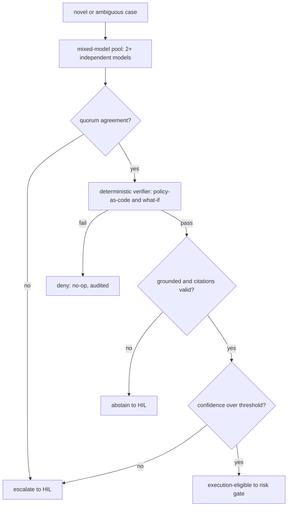
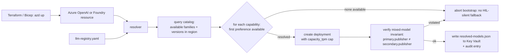
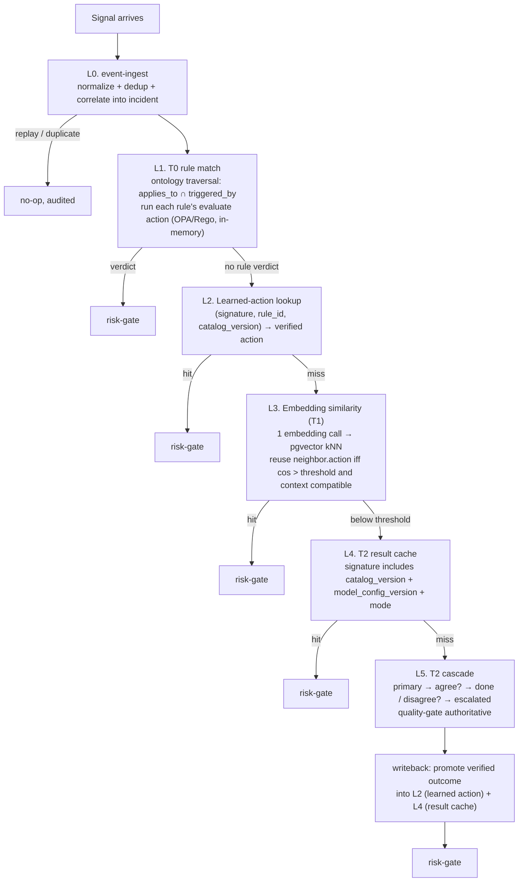
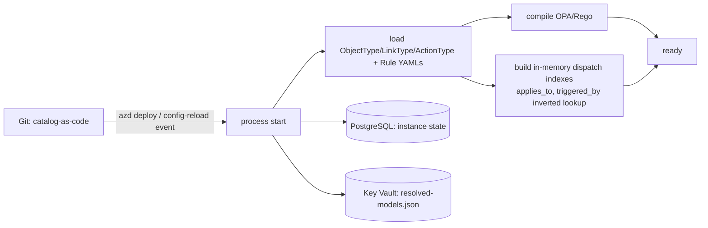

# LLM 전략(LLM Strategy)

이 설계는 LLM을 **덜 사용** , 더 사용 아님. 모델은 **T2** fallback이며 T0와 T1이 케이스를
해결하지 못했을 때만 도달; 결정론적 검증이 승인하기 전까지 그 출력은 실행에 절대 신뢰되지 않음.
실행 자격은 그 검증이 부여, **절대 모델이 아님**. 이 문서는
[architecture.instructions.md](../../../.github/instructions/architecture.instructions.md) 의
티어와 quality-gate 규칙과
[security-and-identity-ko.md](security-and-identity-ko.md) 의 위협 모델을 확장.

> 아래 모델 이름은 **채택 시점에 확인** 할 권장. 가용성, 가격, preview 상태는 변경됨; 구체
> 모델은 시나리오 세트에서 측정된 cost/quality로 선택, 가정 아님. 이 문서로 특정 모델이 고정되지
> 않음.

## 모델 티어

커버리지 수치는 **측정된 베이스라인에 대해 검증할 목표**
([goals-and-metrics-ko.md](goals-and-metrics-ko.md)) 이지 보장이 아님. 이들은 하나의 이벤트
스트림을 분할하므로 T0+T1+T2는 ~100%; T0 (~70-80%) 는
[architecture.instructions.md](../../../.github/instructions/architecture.instructions.md) 에
문서화.

| 티어 | 역할 | 모델 클래스 | 커버리지 목표 | 비용 프로파일 |
|------|------|-------------|-------------|-------------|
| **T0** | 결정론 엔진 | **모델 없음** | ~70-80% | 토큰 0 |
| **T1** | 유사도 + 경량 판단 | **임베딩 모델** + **소형/저렴 LLM** | ~15-20% | 매우 낮음 |
| **T2** | 신규/모호 케이스에 대한 추론 | **프론티어 LLM (2+ 독립)** | ~5-10% | 최고; mixed-model 교차 검사 필수 |

### 티어 경계

- 결정론 판정을 산출하는 규칙 없고 케이스가 신규는 아닐 때 **T0 → T1**.
- T1이 **abstain** 할 때만 **T1 → T2**: 정확한 규칙 매칭 없음, 이전 해결된 인시던트에 대한
  임베딩 유사도가 설정 스코어 임계 아래, 적용 가능한 학습된 액션 없음.
- 유사도 임계와 abstain 조건은 **설정** , 하드코딩 아님.

## T1 - 경량 티어

- **임베딩**: 인시던트를 벡터화하고 과거 패턴에 매칭할 작은 임베딩 모델. 비용 효율 hosted 임베딩
  모델 선호, 또는 데이터 잔류지나 비용이 요구할 때 로컬 sentence-transformer
  ([Data Privacy](#data-privacy-and-residency) 참조). 벡터를 상태 옆에 저장(예: pgvector).
- **소형 판단 모델**: 루틴 케이스 분류와 학습된 액션 선택을 위한 소형/저렴 지시 모델. 프롬프트
  짧고 grounded 유지; 입력은 untrusted 취급
  ([Prompt-Injection Defense](#prompt-injection-defense) 참조).
- 목표: 프론티어 왕복 없이 이벤트의 ~15-20% 흡수.

## T2 - 추론 티어 (Quality Gate 필수)

T2는 신규 또는 모호 케이스만 처리(~5-10%). 그 출력은 실행 전 quality gate 통과해야 함.
모델은 **후보를 생성** ; 결정론 verifier가 자격을 결정.

- **Mixed-model 교차 검사**: 같은 판단에 대해 **2개 이상 독립 모델** 실행. 독립은 진짜 별개
  프로바이더/가중치 - 같은 base 모델을 서비스하는 두 엔드포인트는 **세지 않음** , correlated
  에러가 검사 무력화.
  - **합의 predicate**: 합의는 자유 텍스트가 아니라 **정규화 구조화 액션** (target 리소스, 작업,
    파라미터) 에 대해. Canonical 액션 객체를 문자열 아이덴티티가 아니라 semantic 등가로 비교.
  - **N 모델과 quorum**: N ≥ 3 인 경우 설정된 quorum(예: majority) 요구; quorum 없음 → escalate.
    2-of-2 tie(불일치) 는 HIL로 escalate, 절대 auto-resolve 아님.
  - **비용 컨트롤**: **cascade** 선호 - 더 저렴한 reasoner 먼저 실행하고 self-consistency나
    grounding 신호가 약할 때만 두 번째 호출 - 그래서 전체 N-모델 fan-out은 진짜 어려운 케이스에만
    지출.
  - **provenance (재현성)**: 결정은 **각 모델의 투표**
    (`QualityDecision.model_votes`: `model_id`, 제안 action type, agreed)를 - 단순 동의
    카운트가 아니라 - 기록해, T2 판정을 append-only audit 에서 재구성할 수 있게 한다(로그가
    약속하는 replay 속성).
- **Verifier**: 어떤 모델과도 독립적인 **결정론** 검사가 후보 액션을 policy-as-code와 what-if/
  dry-run에 대해 재검증 후 execution-eligible. Verifier - 모델 텍스트 아님 - 가 권위.
- **Grounding (RAG)**: 판단을 정당화하는 규칙/정책/문서 인용 강제, **각 인용 항목이 규칙 카탈로그
  에 존재하고 실제로 주장을 지지하는지 검증**(fabricated 인용 방어). Ungrounded 시 **abstain**.
- **임계 게이팅**: 스키마, 정책, what-if, 보안-스캔 검사가 모두 통과해야 하고 계산된 **신뢰도**
  가 임계 통과해야 함. 신뢰도는 verifier와 교차-검사 신호(합의, grounding 유효성, 역사적 성공)
  에서 파생 - **절대 모델의 self-reported 신뢰도가 아님** , 신뢰할 수 없음. 임계 아래는 HIL로
  라우팅.

### 결과 시맨틱

- **eligible** - 모든 게이트 통과; 리스크 게이트로.
- **abstain** - grounded, 지지된 답 없음; 자율 액션 없음, HIL로 라우팅.
- **disagree/escalate** - 모델이 quorum 실패; HIL로 라우팅.
- **deny** - verifier 또는 정책이 후보 거부; no-op, 감사됨.

네 개 모두 타입된, 감사된 결과; **eligible** 만 실행으로 진행 가능.



## 프롬프트 인젝션 방어

이벤트 페이로드와 도구 출력은 **untrusted** 이며 직접 또는 간접 프롬프트 인젝션 운반 가능
([security-and-identity-ko.md](security-and-identity-ko.md)).

- 모든 페이로드와 도구-출력 텍스트를 **지시가 아니라 데이터** 로 취급; 모델은 거기 임베드된 지시를
  따르면 안 됨. 프롬프트에서 untrusted span을 delimit하고 격리.
- **간접 인젝션**: 도구/RAG에서 반환된 출력이 모델에 재공급 - 같은 격리 적용, retrieved 텍스트가
  액션 계약을 변경하지 못하게.
- **Verifier와 정책 재검사가 권위** ; 오직 "sound"만 승인되고 결정론 검사를 실패하는 후보는 거부.
- 어떤 모델 호출 **전에** 시크릿과 식별자 redact - 인젝션이 생성 출력으로 exfiltrate 못하도록.

## 데이터 프라이버시와 잔류지

- **최소화와 redact**: 모델 호출 전 프롬프트에서 시크릿, 연결 문자열, 어떤 고객/테넌트/구독
  식별자도 제거; 필요한 최소 페이로드 전송.
- **잔류지 라우팅**: 민감 이벤트를 설정으로 로컬/in-region 모델(예: 로컬 임베딩) 로 라우팅;
  제한된 데이터를 외부 엔드포인트로 보내지 않음.
- **No-train / retention**: 제출된 프롬프트에 대한 **no-training** 보장과 최소 retention 있는
  엔드포인트 선호; capability별 선택된 자세를 config에 기록.

## Provider 추상화

- 모든 모델 호출은 `shared/` 의 **provider-neutral 클라이언트** 를 통해 감 - 모델이 `core/tiers`
  를 만지지 않고 스왑 가능.
- 모델을 하드코딩 이름이 아니라 capability로 설정: `t1.embedding`, `t1.judge`,
  `t2.reasoner.primary`, `t2.reasoner.secondary`, `t2.rca`.
- **클라이언트 계약**: 요청 timeout, 구조화/JSON-schema 출력, 토큰 회계, 재현 가능 설정
  (지원되는 곳에서 temperature 0 + 고정 seed) 강제 - 그래서 교차 검사와 리플레이가 비교 가능.
- **버전된 매핑**: capability→구체-모델 매핑은 버전됨; 결정에 사용된 정확한 모델 ID와 config
  버전은 리플레이를 위해 감사 로그에 기록.
- Azure OpenAI, 다른 Azure Foundry 모델, 또는 서드파티 엔드포인트로 순전히 config로 라우팅,
  코어를 CSP-중립 유지.

## 모델 프로비저닝과 라이프사이클

모델 가용성, 버전, 폐기는 지속 shift. 모델 id 하드코딩은 rot 보장. 아래 프로비저닝 모델은
capability→구체-모델 매핑을 **부트스트랩에서 자동, 업데이트 시 리뷰** 로 유지, 다른 어떤 변경
처럼 모델 변경이 shadow-before-enforce 원칙을 통해 흐르도록.

### Capability 선호 레지스트리

상류가 *capability* 와 **capability당 선호 리스트** 정의; 포크가 자체 리전, 컴플라이언스 자세,
비용 목표에 매칭되도록 선호 오버라이드. 레지스트리는 다른 거버넌스 아티팩트처럼 리뷰되는
catalog-as-code(경로 `rule-catalog/llm-registry.yaml`).

```yaml
# rule-catalog/llm-registry.yaml (상류 기본; 포크는 오버라이드 가능)
models:
  t1.embedding:
    preferences:
      - { publisher: OpenAI, family: text-embedding-3-small }
      - { publisher: OpenAI, family: text-embedding-3-large }
    sku: Standard
    capacity_tpm: 100_000
  t1.judge:                       # 소형/저렴 기본 (mini 티어)
    preferences:
      - { publisher: OpenAI, family: gpt-4o-mini }
    capacity_tpm: 40_000
  t2.reasoner.primary:            # 첫 프론티어 reasoner
    preferences:
      - { publisher: OpenAI, family: gpt-4o }
      - { publisher: OpenAI, family: gpt-4-turbo }
    capacity_tpm: 20_000
  t2.reasoner.secondary:          # mixed-model peer - 별개 publisher여야 함
    preferences:
      - { publisher: Anthropic, family: claude-opus-4 }
      - { publisher: MistralAI, family: mistral-large-2 }
    capacity_tpm: 10_000
  t2.reasoner.escalated:          # Opus-급 천장, on-demand 전용
    preferences:
      - { publisher: OpenAI, family: o1 }
      - { publisher: Anthropic, family: claude-opus-4 }
    invocation: on_disagreement                # 모든 T2 호출에 아님
    capacity_tpm: 5_000
```

레지스트리가 강제하는 규칙(MUST, config 로드에서):

- **버전이 아니라 family.** 선호는 모델 *family* 를 pin(예: `gpt-4o-mini`); 부트스트랩 resolver
  가 프로비저닝 시점에 최신 안정 버전 선택하고 resolved 매핑에 기록. 레지스트리에 절대 dated
  버전 pin 안 함 - 폐기를 숨김.
- **`capacity_tpm` 은 비용 천장.** Overflow는 HIL로 강등(Cost Controls에 따라); 포크의 측정된
  최소 아래 용량 프로비저닝은 config-load 에러.
- **Escalated capability는 invocation별 opt-in** (`invocation: on_disagreement`); 모든 T2
  요청에 호출되지 않고 절대 quality gate를 우회하지 않음.
- **RCA reasoner는 invocation별 opt-in** (`invocation: on_novel_case`, capability
  `t2.rca`); 결정론적 tier가 해결하지 못한 novel incident에만 발화하며, 제공된 evidence에
  grounded 되지 않으면 그 출력은 거부됨 (observability-and-detection.md section 4 참조).

### 부트스트랩 Provisioner

`azd up` (또는 등가) 에서 resolver가 레지스트리를 읽고, 대상 리전의 Azure OpenAI / Foundry
카탈로그를 쿼리하고, **capability당 하나의 deployment** 프로비저닝. Resolved `{capability →
deployment}` 매핑이 Key Vault에 기록되고 감사됨.

배포자가 `Cognitive Services Contributor` 를 갖지 않을 때, 선호 family가 리전에 없을 때,
`capacity_tpm` 쿼터가 부족할 때, mixed-model 불변식을 만족할 수 없을 때의 **배포자-권한 게이트
전체 표** 는
[dev-and-deploy-parity-ko.md § 배포자-스코프 LLM 프로비저닝](../deployment/dev-and-deploy-parity-ko.md#배포자-스코프-llm-프로비저닝)
에서 저술; 이 섹션은 happy-path shape만 보여줌.



**부트스트랩 불변식 (MUST, fail-fast)**

- 모든 capability는 최소 하나의 선호로부터 프로비저닝. Zero-match는 부트스트랩 abort - 배포자는
  리전 확장하거나 레지스트리 업데이트해야 함.
- `t2.reasoner.primary.publisher` 와 `t2.reasoner.secondary.publisher` 는 달라야 함
  (아래 Mixed-Model Family Strategies). Same-publisher 쌍은 부트스트랩 abort.
- Resolved 매핑은 capability당 `{deployment, family, version, publisher}` 를 기록하여 감사
  로그가 어떤 케이스를 결정한 정확한 모델을 이름 지을 수 있음.

### 프로비저닝 완결성 게이트

resolver는 프로비저닝 불가능한 capability를 `hil-only`로 강등시키고 계속한다 -
하나의 누락된 family 때문에 전체 부트스트랩을 막지 않으므로 **부분 배포가
조용하다**: `resolved-models.json`이 T1 쌍 + `t2.reasoner.primary`만 담고 있는데
레지스트리는 secondary reasoner, critic, RCA reasoner, escalation ceiling까지
선언할 수 있다. 그러면 composition root는 조용히 forced-disagree cross-check로
fallback 하고 모든 T2 케이스가 HIL로 라우팅되며, reasoning tier가 사실상 꺼졌다는
신호가 배포 시점에 없다.

[`assess_provisioning`](../../../src/fdai/rule_catalog/schema/provisioning_assessment.py)
이 그 gap을 닫는다. 권위 `llm-registry.yaml`(의도)과 `resolved-models.json`(실제)
을 비교해 결정론적 `ProvisioningReport`를 반환한다:

- 선언된 각 capability를 `resolved` / `capacity-reduced` / `hil-only` / `missing`
  으로 분류하고 `core` / `quorum` / `optional`로 태깅하며, 부재 시 런타임 영향을 명시;
- `quorum_ok`는 mixed-model T2 cross-check가 형성 가능한지(두 reasoner 가용 + 다른
  publisher) 보고 - `hil-only` 모드에서는 기대하지 않음;
- `ProvisioningSeverity`가 `ok`(전부 resolved), `degraded`(optional capability만
  누락 - debate / RCA / escalation / rubric off는 허용), `critical`(core capability
  누락 또는 quorum 미형성 - T2가 사실상 off)로 롤업.

배포 파이프라인은 severity로 게이팅하고 리포트를 감사 로그에 기록(`critical` 시 A2
운영 알림)하므로, 반쪽만 프로비저닝된 reasoning tier가 런타임 HIL storm으로 숨지
않고 `azd up` 시점에 보인다.

### 런타임 해석

코어 코드는 capability 계약에만 의존. `resolved-models.json` 은 시작 시 Key Vault에서 로드;
stale 참조(deployment 삭제 또는 404) 는 다른 capability가 아니라 **HIL로 fail-close**.

```python
# core/tiers/t2-reasoning/reasoner.py (illustrative)
primary   = client.for_capability("t2.reasoner.primary")
secondary = client.for_capability("t2.reasoner.secondary")
cand_a = primary.chat(...)
cand_b = secondary.chat(...)
if not agree(cand_a, cand_b):
    escalated = client.for_capability("t2.reasoner.escalated")   # cost-capped
    return arbitrate(cand_a, cand_b, escalated.chat(...))
return quorum_result(cand_a, cand_b)
```

- `core/` 에 모델 id가 나타나지 않음.
- 누락 deployment는 outage로 취급: 요청은 HIL로 라우팅되고 운영 알림 emit(A2, [channels-and-notifications-ko.md](../interfaces/channels-and-notifications-ko.md#3-categories-a1a4)
  에 따라). 다른 capability로의 조용한 스위치는 금지.

### Escalation Ladder 정책

위의 `if not agree(...): escalated = ...` 스텝은 하드코딩된 분기가 아니라
**정책 결정**이다. [`core/quality_gate/escalation_ladder.py`](../../../src/fdai/core/quality_gate/escalation_ladder.py)
(`decide_escalation`)에 순수·결정론 함수로 구현되며, 형제
[`debate_router`](../../../src/fdai/core/quality_gate/debate_router.py)를 그대로
미러링한다: frozen `EscalationLadderConfig` + "더 강한 모델로 올라갈까,
멈추고 HIL로 라우팅할까?"에 답하는 stateless 함수. 정책을 먼저 단독으로 -
라이브 배선 전에 테스트·감사 가능하게 - 출하하는 것은 debate-router
delta-2a -> delta-2b 순서를 따른다. `QualityGate`는 `EscalationLadderConfig`가
배선되면 결정을 **shadow**(`QualityDecision.escalation_route` /
`escalation_reason`, 그리고 읽은 `self_consistency` stability,
`quality_decision_audit_fields`로 표면화)로 기록한다 - 측정만 하고 행동은 안 함;
escalated 모델을 실제 호출하는 것은 다음 enforce 스텝. `on_self_consistency_below`
트리거는 composition root의 self-consistency cascade가 candidate에 얹은
`action_stability` 신호를 읽는다 - gate는 모델을 직접 샘플링하지 않는다(샘플러의
"cascade 트리거는 composition 관심사" 계약).

ladder rung(`EscalationTier`)은 레지스트리 capability와 일대일:
`PRIMARY` -> `SECONDARY` -> `ESCALATED`. `decide_escalation`은 `ESCALATE`
(다음 더 강한 reasoner를 tiebreaker로 소비) 또는 `STOP`(호출자가 미해결 케이스를
HIL로 라우팅)을 반환하며, 다음 하드닝 불변식을 지킨다:

- **ladder는 실행 자격을 절대 부여하지 않는다.** *더 강한 모델을 쓸지*만
  결정한다. escalated 모델의 제안도 untrusted 이며 같은 quality gate(verifier +
  grounding + quorum)로 재진입한다; disagreement는 ladder를 오른다고 auto-resolve
  되지 않으며 - 결정론 verifier가 유일한 권위로 남는다.
- **Fail-closed.** `escalated_available=False`(`t2.reasoner.escalated`를 resolve
  하지 않은 fork)는 `STOP`을 반환하며, precedence에서 deny-list보다 위.
- **Cost-bounded.** 한 번의 호출은 최대 한 rung만 오르고 `ESCALATED` 천장을
  넘지 않는다; `enabled=False`는 cost spike용 killswitch.
- **Triggers.** `cross_check_disagreement`(주 트리거, 레지스트리의
  `invocation: on_disagreement` 반영) + 선택적 `on_self_consistency_below`
  임계값(self-consistency 샘플러가 흔들리는 proposer를 보고하면 nominal agreement
  에서도 escalate). ActionType별 `never`/`always` 리스트로 튜닝하며 deny가 allow
  우선.

### Narrator Latency Routing (T1 전용)

콘솔 chat 백엔드(`fdai.delivery.read_api.chat.LatencyRoutedChatBackend`)는
`t1.judge` mini 스택의 N개 deployment 를 감싸서 매 turn 마다 rolling p50 지연이
가장 낮은 후보를 pick. 리졸버가 `resolved-models.json` 의 `narrator_candidates`
배열을 2개 이상 emit할 때 자동 활성화; 1개 이하이면 plain `AzureAdChatBackend`
로 fallback ([dev-and-deploy-parity-ko.md](../deployment/dev-and-deploy-parity-ko.md) 의
"Auto-populate narrator" 참조).

라우터는 **T1 narrator 트래픽 전용** 이며, 별도 설계 리뷰 없이 T2 capability
로 확장 금지. T1/T2 경계를 지키는 두 하드 제약:

- **Mixed-model invariant** ([architecture.instructions.md § Quality Gate](../../../.github/instructions/architecture.instructions.md#llm-quality-gate-required-for-t2)):
  `t2.reasoner.primary.publisher != t2.reasoner.secondary.publisher`. 지연
  라우터는 개별 호출 속도를 최적화하므로, 항상 서로 *다른* family 두 개를
  병렬로 돌려야 한다는 요구와 충돌. "가장 빠른 T2" 정책은 마지막 라운드에서
  이긴 family로 cross-check 를 조용히 collapse 시켜 quality gate 를 통째로 무력화.
- **Judge/critic 결정성**: composer 는 [composition.py](../../../src/fdai/composition/__init__.py)
  에서 `t1.judge`, `t2.critic`, debate orchestrator 를 특정 deployment 이름에
  바인딩. config 레벨 opt-in 없이 *judge* deployment 를 런타임 중에 바꾸는
  건 라우팅 wrapper 안에 숨기고 싶지 않은 동작 변경.

포크가 지연-라우팅된 *judge* 를 원한다면, 그건 거버넌스 레벨 변경:
새 capability(예: `t1.judge.fast-pool`)를 quality gate 와 함께 선언하고
composer 로 라우팅, 스왑을 감사. narrator 라우터를 통해 쓰레딩하지 말 것.

### Reconciler Job

주간 Container Apps Job(코어와 같은 environment; 별도 컴퓨트 없음) 이 세 신호를 감시하고
**draft PR을 통해 변경 제안** - 절대 라이브 레지스트리 변형이나 deployment auto-swap 아님.

| 신호 | 트리거 | Reconciler 액션 |
|------|--------|----------------|
| 새 family 가용 | 카탈로그가 `preferences` 에 더 높이 나열된 family (또는 포크가 pin하려는 새 family) 제공 | 선호 순서 올리는 draft PR; A2 알림 |
| 폐기 공지 ≤ 60일 | Azure 폐기 피드가 in-use deployment와 매칭 | 여전히 지원되는 family로 재정렬하는 draft PR; A2 알림 + 미머지 시 `governance_pr_aging_weekly` 다이제스트 hit |
| 용량 / 품질 drift | 측정된 429 비율, 지연, 또는 hallucination-비율 회귀(Quality Measurement) | 선호 재정렬 제안하는 이슈(PR 아님); A2 알림 |

Reconciler가 준수하는 규칙(MUST):

- **절대 프로덕션 매핑 auto-swap 안 함.** 하드 폐기라도 draft PR 오픈. 폐기 날짜가 병합된 대체
  없이 지나면, 그 capability의 티어는 저렴 family로 조용히 다운그레이드가 아니라 **HIL로 강등**.
- **모델에도 Shadow before enforce.** 병합된 레지스트리 변경이 resolver를 shadow에서 재실행: 새
  deployment가 병렬로 프로비저닝되고, quality-measurement 리플레이가 고정 시나리오 세트에서
  스코어링, 클린 리플레이만이 `resolved-models.json` 컷오버 승격.
- `rule-catalog/llm-registry.yaml` 의 **PR 리뷰어** 는 Owner-티어 - 모델 스왑은 high-blast-radius
  거버넌스 변경.

### Mixed-Model Family 전략

Quality gate는 두 독립 모델 family 필요. 포크가 실제로 얻는 쌍은 부트스트랩 시점 선택:

| 모드 | Secondary 위치 | 언제 선택 |
|------|--------------|-----------|
| `azure-foundry` (기본) | Azure AI Foundry 모델 카탈로그를 통해 서비스되는 Anthropic / Mistral / Cohere 모델 | 리전과 컴플라이언스가 비-OpenAI Foundry 모델 허용; 단일 청구 표면 |
| `external` | 직접 서드파티 엔드포인트를 통한 secondary(Anthropic API 등) | 필요 family가 리전의 Foundry에서 이용 불가 |
| `hil-only` | Secondary 프로비저닝 안 됨; 모든 T2 케이스가 HIL로 라우팅 | 포크가 두 번째 family를 얻을 수 없음(일시); 명시적 opt-in |

선택된 모드는 config 값 (`llm.mixed_model_mode`); 부트스트랩 resolver가 이를 읽고 그에 따라
불변식 강제. 나중에 모드 스위치는 런타임 토글이 아니라 거버넌스 PR.

### 포크 vs 상류 분리

| 항목 | 상류 (이 리포) | 포크 |
|------|--------------|------|
| Capability 이름(`t1.judge`, `t2.reasoner.primary`, ...) | ✓ | - |
| `llm-registry.yaml` 기본 선호(mini → Opus 티어) | ✓ | 리전 / 컴플라이언스 / 비용 오버라이드 |
| 부트스트랩 resolver 스크립트 + IaC 훅 | ✓ | 구독 / 리전 / 명명 |
| Reconciler Job (스케줄, 폐기-피드 파서, draft-PR opener) | ✓ | cron 타임존, 알림 채널 |
| `resolved-models.json` 스키마 + Key Vault 경로 | ✓ | 실제 값(포크 테넌트만) |
| Mixed-model family 불변식 | ✓ | `azure-foundry` / `external` / `hil-only` 선택 |
| Azure OpenAI / Foundry 리소스 IaC | ✓ (Bicep 템플릿) | 구독 / 리전 / SKU 티어 |

## Rule-to-Decision Lookup 파이프라인

[모델 티어](#모델-티어) 의 티어 백분율은 의도적인 **계층 lookup 파이프라인** 의 *결과* : 들어오는
이벤트가 저렴-비싼 레이어를 traverse하고, 프론티어 LLM(L5) 은 모든 저렴 레이어가 abstain할 때만
도달. 파이프라인은 타입된 **온톨로지** 에 빌드: 규칙, 리소스, 신호, 액션이 온톨로지 엔티티,
매칭은 텍스트-유사도 추측이 아니라 결정론 그래프 traversal.

온톨로지 프레이밍은 이전 AGI 온톨로지 설계(cardinality-aware link 있는 타입 객체, `required_
interfaces` 와 `submission_criteria` 통해 액션에 통합된 함수) 로부터 object-type / link-type
/ action-type 분리를 차용, CSP 리소스와 규칙에 적용. 이것이 모든 규칙에 결정론 dispatch 경로와
모든 재사용에 canonical, hashable 서명을 부여.

### 온톨로지 기반

모든 런타임 개념은 네 **ObjectType** 중 하나. 구체 인스턴스는 `shared/contracts/` 와
`rule-catalog/schema/` 에 존재.

| ObjectType | 의미 | 백업 |
|------------|------|------|
| `Resource` | 거버넌스 아래의 대상(Azure 리소스; CSP-중립 스키마, provider 어댑터가 채움) | `shared/providers/` |
| `Rule` | 의도 있는 결정론 컨트롤(`applies_to`, `evaluates`, `remediates`) | `rule-catalog/` |
| `Signal` | 타입된 관찰(Activity Log 라인, drift diff, 비용 이상, canary 결과) - `event-ingest` 에 진입하는 기본형 | `shared/contracts/event` |
| `Finding` | 시점의 리소스에 대한 규칙 매칭, 컨텍스트와 심각도 포함 | 런타임에 파생; 감사 저장소에 지속 |

관계는 cardinality 메타데이터 있는 **타입된 LinkType** - 그래서 traversal은 스캔이 아니라
O(인덱스 lookup). 각 선언은 `is_transitive`, `is_causal`, `temporal_order` 플래그도 함께
운반하므로 traversal 엔진이 재귀 확장이 안전한 시점과 Finding-체인 쿼리가 시간을 존중해야
하는 시점을 알 수 있음.

| LinkType | Cardinality | Transitive | 의미 |
|----------|-------------|:---------:|------|
| `applies_to` | Rule → ResourceType (M:M) | - | 규칙이 매칭할 수 있는 리소스 타입 |
| `triggered_by` | Rule → SignalType (M:M) | - | 규칙 평가를 유발하는 신호 |
| `evaluates` | Rule → Property (M:M) | - | 규칙이 읽는 리소스 속성 |
| `remediates` | Rule → ActionType (M:1) | - | 매칭 시 규칙이 제안하는 온톨로지 액션 |
| `resource_of` | Signal → Resource (M:1) | - | 신호가 관한 리소스 |
| `overrides` | Override → Rule (M:1) | - | override가 이 규칙 대상([rule-governance-ko.md](../rules-and-detection/rule-governance-ko.md#override) 참조) |
| `causes` / `prevents` | Rule → Outcome (M:M, causal) | - | T2가 추론할 수 있는 causal 메타데이터(드묾) |
| `precedes` / `follows` | Finding → Finding (M:M, temporal) | - | 하나의 인시던트에 대한 관련 finding 상관관계 |
| `contains` | Resource → Resource (M:1, 자식→부모) | ✓ | 소유/스코프 포함: subscription→resource-group→resource, VNet→subnet, cluster→node-pool. Recursive CTE 로 전체 체인 walk. [Inventory 어댑터](csp-neutrality-ko.md#5-인벤토리-계약--리소스-그래프) 가 채움. |
| `attached_to` | Resource → Resource (M:1) | - | 수명 결합 attachment: NIC→VM, disk→VM, private-endpoint→target. 부모 삭제 시 자식이 깨짐. |
| `depends_on` | Resource → Resource (M:M) | - | 정상 동작에 필요한 논리적 참조: ContainerApp→Key-Vault / ACR / Postgres, managed-identity→app. 끊긴 엣지는 target 이 아니라 dependent 를 degrade. |
| `peered_with` *(Phase 3+)* | Resource ↔ Resource (M:M, symmetric) | - | 네트워크로 도달 가능한 대칭 피어: VNet peering, cross-region replica. |
| `routes_to` *(Phase 3+)* | Resource → Resource (M:1) | - | 트래픽 경로 또는 참조: UDR next-hop, private-DNS zone link. |

Traversal은 방향적이고 캐시됨; 타입 `R` 의 `Resource` 에 대한 타입 `T` 의 `Signal` 은 두 인덱스
교집합을 통해 `triggered_by ∋ T` 및 `applies_to ∋ R` 인 정확한 규칙 세트로 해결 - 텍스트 검색
없음, 모델 호출 없음.

Resource→Resource 링크(`contains`, `attached_to`, `depends_on`, 이후 `peered_with` /
`routes_to`) 는 risk-gate 가 [risk-classification-ko.md](../decisioning/risk-classification-ko.md) 의 3-값
enum 대신 *실제* blast radius 를 계산할 수 있게 하고, T2 가 대상 리소스 주변 **depth-2 이웃
서브그래프** 를 프롬프트로 받을 수 있게 하는 것 - 벌거벗은 리소스 id 가 아니라 근거 있고
인용 가능한 컨텍스트. Authoritative source 는
[inventory 계약](csp-neutrality-ko.md#5-인벤토리-계약--리소스-그래프); `core/` 는 절대 클라우드
SDK 로 조회하지 않음. 새 링크 종류는 어댑터가 emit 하기 전에
`shared/contracts/ontology/link-type.json` 에 먼저 추가해야 함 - 미인식 `ResourceType` 과
동일하게, 미인식 링크는 자동 등록이 아니라 이슈 오픈 (self-extending ontology,
[포크 확장](#포크-확장-self-extending-온톨로지) 참조).

### 온톨로지 아티팩트로서의 규칙

[rule-catalog-collection-ko.md](../rules-and-detection/rule-catalog-collection-ko.md) 의 규칙 스키마는 파이프라인이
dispatch하는 온톨로지 필드로 확장. 기존 필드는 변경 없음; 온톨로지 필드는 추가적이며 로드 시
CI로 검증.

```yaml
# rule-catalog/rules/example.yaml (illustrative fragment; full schema in rule-catalog-collection.md)
id: object-storage.public-access.deny
version: 1.2.0
source: authored
severity: high
category: security
resource_type: object-storage
check_logic: <opa-package-ref>            # 결정론 평가기
remediation: <action-ref>                 # 온톨로지 ActionType 인스턴스 가리킴

# ── ontology fields (new; CI-validated) ──
applies_to:    [object-storage]
triggered_by:  [property.public_access.changed, config.public_access.enabled]
evaluates:     [object-storage.public_access]
remediates:    remediate.disable-public-access
required_interfaces: [Evaluable, Remediable]   # submission_criteria enforced at load
submission_criteria:
  - property_exists: object-storage.public_access
  - link_exists: resource_of                    # Signal은 Resource를 참조해야 함
provenance: { ... }
```

`required_interfaces` 와 `submission_criteria` 는 참조된 온톨로지 설계의 같은
Functions-plus-Interfaces 패턴 따름: 규칙은 인터페이스 계약이 런타임 객체에서 충족될 때만
dispatchable, 스키마 레지스트리에 대해 `applies_to` / `triggered_by` 가 해결될 수 없는 규칙을
CI가 거부.

### 파이프라인 스테이지와 ActionType (구분되는 개념)

이 시스템에서 "액션" 이라 불리는 두 가지는 **혼동 금지**:

- **PipelineStage** - 계층적 조회에서 결정이 이뤄진 위치. **감사 어휘** 이지 스키마 아티팩트가
  아님. 모든 audit-log 엔트리는 `pipeline_stage` 필드를 기록해서 결정 경로가 end-to-end 로
  재구성 가능. `remediate` 제외 모든 스테이지는 executor 관점에서 read-only (CSP mutation
  없음).
- **ActionType** - rollback 계약 있는 **CSP-중립 mutation 카테고리**. `shared/contracts/ontology/action-type.json`
  에 선언; 인스턴스(예: `remediate.disable-public-access`) 는 카탈로그에 존재하며 규칙의
  `remediates` 필드에서 참조됨. 이게 스키마 아티팩트.

`remediate` 만이 둘을 커플링: PipelineStage(executor 스텝) 이면서 그 출력이 Resource에
적용되는 ActionType **인스턴스**. `escalate` / `abstain` / `deny` 는 ActionType을 절대
발동하지 않는 종단 스테이지.

**PipelineStage 어휘** (`audit_log.pipeline_stage` 에 기록):

| PipelineStage | 레이어 | 비용 | 전제조건 | 종단? |
|---------------|--------|------|---------|:---:|
| `L1_evaluate` | L1 (T0) | 순수 함수, 인메모리 OPA/Rego | 규칙의 `applies_to` 가 Resource와 매칭; `check_logic` 컴파일 | - |
| `L1_simulate` (what-if) | L1 (T0) | 선언적 상태에 대한 순수 함수 | 리소스 상태 스냅샷 이용 가능 | - |
| `L2_reuse` | L2 | O(1) 인덱스 SELECT | 학습된-액션 저장소의 `(signature, rule_id, catalog_version)` hit | - |
| `L3_similarity` | L3 (T1) | 임베딩 1 + pgvector kNN | 이웃의 컨텍스트 호환성 검사 통과 | - |
| `L4_cache_hit` | L4 | O(1) 키 lookup | TTL과 카탈로그/모델 버전 내 서명 매칭 | - |
| `L5_reason` | L5 (T2) | 프론티어 LLM (primary + secondary; 불일치 시 escalated) | quality-gate가 권위 | - |
| `remediate` | risk-gate ⇒ executor ⇒ delivery | ActionType 인스턴스를 Resource에 적용 | policy-as-code verifier 통과; 모든 ActionType 전제조건 성립 | - |
| `escalate` | risk-gate ⇒ ChatOps | HIL 요청 | 어떤 저렴 레이어도 케이스 해결 못함 | ✓ |
| `abstain` | 어떤 레이어 | 감사된 no-op | grounding 없음 또는 verifier abstain | ✓ |
| `deny` | 어떤 레이어 | 감사된 no-op | risk-classification이 액션 차단 | ✓ |

`L5_reason` 만 LLM 호출. 다른 모든 스테이지는 결정론이며 마이크로초-밀리초에 실행.

### ActionType 계약

**ActionType** ([스키마](../../../src/fdai/shared/contracts/ontology/action-type.json)) 는
하나의 CSP-중립 mutation 카테고리와 그 카테고리의 모든 인스턴스에 대한 안전 불변식을 선언.
`preconditions` / `stop_conditions` / `blast_radius` / `description` 을 제외한 모든 필드는
필수.

- `name` - 안정 id (예: `remediate.disable-public-access`).
- `operation` - 아래 enum의 CSP-중립 verb.
- `interfaces` - executor 가 지켜야 하는 런타임 계약; risk-gate 는 이 집합으로 feature 벡터
  구성.
- `rollback_contract` - 인스턴스를 되돌리는 방법. **`none` 은 유효 값 아님**; 모든 ActionType 은
  best-effort 라도 undo 경로를 선언해야 함. 정말로 되돌릴 수 없는 mutation 은
  `irreversible: true` (아래) 를 설정하고 risk-classification 이 HIL+quorum 으로 라우팅 -
  rollback 을 침묵시키는 방식이 아님.
- `irreversible` - 액션 이전 상태가 완전히 복원 불가능할 때만 true (예: soft-delete 된 리소스의
  `purge`). Rollback_contract 은 여전히 필수이며 best-effort 복구를 기술.
- `default_mode` - 새 upstream ActionType 은 반드시 `shadow` 로 기본; trivial no-op
  카테고리 (`observe`, 감사된 이전 액션에 바인딩된 `revert`) 만 `enforce` 로 출시 가능.
- `promotion_gate` - 어사인먼트가 shadow-mode ActionType 을 enforce 로 승격시키기 전에 고정
  시나리오 세트에서 통과해야 할 측정 기준 (`min_shadow_days`, `min_samples`, `min_accuracy`,
  `max_policy_escapes`). Rule assignment 는 이 값을 tighten 만 가능, loosen 불가.
- `preconditions[]` - 액션이 risk-gate 에 도달하기 **전에** T0 verifier 가 결정론적으로 평가하는
  검사. 실패하는 전제조건은 abstain, 부분 적용 절대 금지.
- `stop_conditions[]` - 적용 **도중 또는 이후에** executor 가 결정론적으로 평가하는 조건. 참
  값이 하나라도 나오면 자동 halt + `rollback_contract` 로 rollback 트리거.
- `blast_radius` - risk-gate 가 이 ActionType 인스턴스의 blast-radius 분류 차원을 계산하는
  방법. `static_enum` 은 고정 bucket; `graph_derived` 는 Resource → Resource 링크 (기본:
  `contains` + 역방향 `depends_on`, depth 2) 를 walk 하여 영향받는 Resource 수를 count. 인스턴스가
  `max_affected_resources` 초과 시 abstain + escalate. 실제 traversal 구현은 risk-gate 와
  함께 P2 에 랜딩; P1 은 선언만 기록.

#### Operation Verb

`operation` enum 은 CSP-중립. 각 verb 는 고정 의미를 가지므로 규칙 저자와 provider 어댑터가
의도를 합의.

| Verb | 의미 | 기본 rollback |
|------|-----|---------------|
| `create` | 새 Resource 프로비저닝 | `pr_revert` (같은 PR에서 destroy) |
| `update` | in-place 속성 변경 (non-destructive) | `pr_revert` (diff 에 이전 속성값) |
| `delete` | CSP 수준 Resource 제거 | `snapshot_restore` (삭제 전 스냅샷) |
| `disable` | 삭제 없이 끄기 | `state_forward_only` via `enable` |
| `enable` | `disable` 의 역 | `state_forward_only` via `disable` |
| `tag` | 메타데이터 전용 mutation | `pr_revert` |
| `drop` | DB-DDL 제거 (schema / object) | `pitr` |
| `purge` | soft-delete 후 hard-delete; `irreversible: true` | best-effort `snapshot_restore` |
| `scale` | count / SKU 조정 | 이전 spec 으로 `pr_revert` |
| `restart` | in-place 프로세스/파드 bounce | 필요 없음 (transient); 노드 넘나들면 `scripted` |
| `failover` | 관리형 failover 트리거; `RequiresMaintenanceWindow` | `scripted` (failback) |
| `rotate` | 시크릿 / 인증서 로테이션 | `snapshot_restore` (이전 버전 유지) |
| `revert` | 이전 액션 인스턴스의 명시적 rollback | revert PR 자체에 `pr_revert` |
| `attach` | Resource → Resource 링크 생성 (PE→target, MI→App, disk→VM) | `state_forward_only` via `detach` |
| `detach` | 그런 링크 제거 | `state_forward_only` via `attach` |
| `quarantine` | 삭제 없는 네트워크/정책 격리 | `state_forward_only` (격리 정책 해제) |

#### Interface

ActionType 의 `interfaces` 집합은 executor 가 지켜야 하는 런타임 계약을 명명. 인터페이스 누락은
"뭐든 허용" 이 아님 - risk-gate 는 인터페이스 집합이 그 `operation` 의 안전 불변식 요건을
커버하지 못하는 ActionType 을 자동 실행하지 않음.

| Interface | 의미 |
|-----------|-----|
| `ControlPlane` | CSP 메타데이터/설정만 건드림 (사용자 데이터 절대 안 건드림). Auto 후보의 baseline. |
| `DataPlaneMutating` | 사용자 데이터 건드림. **blast radius 무관하게 기본 HIL**. |
| `IdempotentByKey` | 동일 idempotency 키로 재시도 안전; executor 의 dedup 이 이 키 사용. |
| `RateLimited` | 버킷 상한(per-resource, per-tier, global) 준수 필수; 오버플로우는 HIL 로 degrade. |
| `RequiresInventoryFresh` | 대상 Resource 의 인벤토리 레코드가 `freshness_ttl` 초과 stale 이면 실행 금지. 유령 리소스 액션 방지 - 인벤토리 계약 ([csp-neutrality-ko.md § 5](csp-neutrality-ko.md#5-인벤토리-계약--리소스-그래프)) 이 freshness 커서 공급. |
| `GraphTraversalRequired` | blast-radius 계산이 Resource → Resource 링크 (`contains` / `attached_to` / `depends_on`) 트래버설에 의존. 그래프 없으면 ActionType abstain. |
| `CrossResource` | 여러 Resource 를 mutation; executor 가 deadlock-free 결정론적 순서로 N 개 per-resource 락 획득. |
| `AsymmetricRollback` | rollback path 가 정확한 역이 아님 (예: PITR 이 Δ-data 유실). auto → HIL demotion 강제; 다른 차원 무관하게 auto 선택 안 됨. |
| `RequiresMaintenanceWindow` | 승인된 window 안에서만 실행 (P3 chaos / DR). Window 스케줄러 없으면 abstain, 그냥 실행 금지. |

### 계층 Lookup 파이프라인



**예상 hit 분포** (설계 목표, [goals-and-metrics-ko.md](goals-and-metrics-ko.md) 에 따라 측정
대상):

| 레이어 | Hit당 비용 | 들어오는 이벤트의 설계 비율 |
|--------|-----------|--------------------------|
| L0 dedup / correlate | µs | N 이벤트 → 1 인시던트로 접힘(압축, 커버리지 수치 아님) |
| L1 T0 | µs, 인메모리 | ~70-80% |
| L2 learned-action | ms, 인덱스 SELECT | L5 결과가 아래로 distill되면서 시간에 걸쳐 성장 |
| L3 embedding similarity | 임베딩 1 + kNN | T1 ~15-20% 밴드의 나머지 |
| L4 T2 cache | O(1) 키 | 미해결이지만 최근 케이스의 반복 흡수 |
| L5 T2 cascade | 프론티어 LLM | **~5-10%만** - 실제 토큰 지출 |

두 구조적 결과:

- **LLM 사용은 시간에 걸쳐 감소** , 증가 아님. 모든 L5 검증된 결과가 L2에 writeback, 그래서 지난
  주 전체 T2 cascade가 든 반복 케이스는 이번 주 해시 lookup. 이것이 "LLM을 덜 쓴다" 원칙 뒤의
  구체 메커니즘.
- **규칙 변경이 올바른 행을 자동으로 무효화** (아래 참조). 수동 캐시 bust 없음; stale 재사용은
  승격이나 강등에서 살아남지 않음.

### 서명 구성

L2와 L4를 키하는 서명은 온톨로지-타입된 필드에 대한 canonical 해시 - 기록과 재사용이 문자열-
유사가 아니라 semantics-aware.

```text
signature = sha256(
  Signal.type,
  canonical(Signal.params),                # sorted, redacted, typed
  Resource.type,
  canonical(Resource.props),               # only props referenced by evaluates
  Rule.id, Rule.version,
  Catalog.version,
  Model.config.version,                    # L4 only; L2 omits (model-independent reuse)
  Mode                                     # shadow | enforce
)
```

- **Redaction이 해시 전 실행** - 그래서 시크릿이 절대 서명에 진입 못함.
- **`evaluates` 에 명명된 속성만** 참여, 그래서 관련 없는 리소스 churn이 재사용을 무효화하지 않음.
- **카탈로그 / 모델 버전 bump** 와 **shadow ↔ enforce 전이** 는 새 서명 강제, 별도 cache-flush
  스텝 없이 [Cost Controls](#비용-컨트롤cost-controls) 의 무효화 규칙 적용 보장.

### 재사용 감사 (모든 레이어, hit 포함)

자율성은 결정 - 재사용으로 생산된 것 포함 - 이 완전히 귀속 가능함을 요구. 모든 레이어가 감사
엔트리 씀:

- `layer` (L1..L5)
- 발동한 `rule_id` 와 `rule_version`
- `signature` 와 매칭 방법(정확 hit / cos 유사도 + 스코어 / 캐시 age)
- `reused_from`: 결과가 재사용된 audit_id로의 back-reference (L2/L4)
- `mode` (shadow / enforce) 와 결과 risk-gate 결정

Resolvable `reused_from` 없는 재사용은 결함 - 감사 체인은 원래 그것을 검증한 L5 결과로 어떤
결정에서든 walkable하고 유효한 규칙/모델 버전으로 forward해야 함.

### 포크 확장 (self-extending 온톨로지)

온톨로지는 **코어에서 도메인-비종속** 이며 **포크별 확장 가능** , 참조된 온톨로지 설계의
self-extending 원칙 미러링. 포크는 `shared/providers/` 를 통해 `ObjectType` 과 그 속성/link
계약을 등록해 새 리소스 타입 추가; 상류는 절대 그것을 수락하기 위해 `core/` 편집 안 함.

- 새 `Resource` 하위타입은 provider 인터페이스를 통해 등록하고 파이프라인을 자동 상속 -
  `evaluate`, `reuse`, `similarity` 가 `core/` 의 코드 변경 없이 그들 위에서 작동.
- 새 `LinkType` (예: 포크-특이 causal 관계) 은 자체 cardinality, transitivity, 추론 메타데이터
  선언; 미사용 link는 inert 유지.
- 새 `ActionType` (예: 포크-특이 딜리버리 어댑터) 은 자체 `required_interfaces` 와
  `submission_criteria` 선언; 미등록 액션을 참조하는 규칙은 런타임이 아니라 카탈로그 로드에서
  실패.
- Autoprovisioning: Signal에서 관찰된 인식되지 않은 ResourceType은 이슈 오픈(절대 auto-register
  아님), 그래서 온톨로지는 drift가 아니라 리뷰로 확장.

### 온톨로지 저장 레이아웃

온톨로지는 **새 datastore 추가 안 함**. 모든 아티팩트가 최소 인벤토리가 이미 프로비저닝한 세
기존 표면([deploy-and-onboard-ko.md](../deployment/deploy-and-onboard-ko.md#azure-resource-inventory-minimum-set))
중 하나에 랜딩: **Git** (catalog-as-code), **PostgreSQL + pgvector**, **Key Vault**.

| 아티팩트 | 성격 | 저장 | 경로 / 테이블 |
|---------|------|------|-------------|
| `ObjectType` / `LinkType` / `ActionType` 정의 | 정적, 버전됨, 리뷰됨 | **Git** | `shared/contracts/ontology/*.json`, `rule-catalog/schema/*.json` |
| 온톨로지 dispatch 필드 있는 `Rule` 인스턴스 | 정적, 버전됨 | **Git** | `rule-catalog/rules/*.yaml` |
| Assignment / Exemption / Override | 정적, 버전됨 | **Git** | `rule-catalog/{assignments,exemptions,overrides}/` |
| 컴파일된 dispatch 인덱스 (`applies_to`, `triggered_by`) | 부트에서 파생 | **In-memory** | `trust-router`, `t0-deterministic` 사이드카 |
| `Resource` 인스턴스(관찰된 인벤토리) | 런타임에 발견 | **PostgreSQL** | `ontology_resource` |
| `Signal` 인스턴스(원시 이벤트) | 일시 | in-flight는 **Event Hubs Kafka 토픽**; 상관관계 윈도우 상태만 지속 | 큐 + `signal_correlation` |
| `Finding` 인스턴스(규칙 매칭) | 감사, 지속 | **PostgreSQL** | `ontology_finding` + `audit_log` |
| `Link` 인스턴스(Signal→Resource, Finding→Finding, Resource→Resource `contains` / `attached_to` / `depends_on`, ...) | 런타임 + 감사 | **PostgreSQL** | `ontology_link` |
| 학습된 액션 (L2) | 지속, 카탈로그-버전 범위 | **PostgreSQL** | `learned_action` |
| 임베딩 (L3) | 지속, HNSW-인덱스 | **PostgreSQL + pgvector** | `ontology_embedding` |
| T2 결과 캐시 (L4) | TTL-bounded | **PostgreSQL** | `t2_cache` (partition by `catalog_version`) |
| 감사 체인 | append-only, hash-chained | **PostgreSQL** | `audit_log` |
| `resolved-models.json` | 런타임 config | **Key Vault** | ([Model Provisioning and Lifecycle](#모델-프로비저닝과-라이프사이클) 참조) |

**단일-저장소 기본 (MUST)**

PostgreSQL Flexible + pgvector는 하나의 저장소, 하나의 백업 경로, 하나의 운영 표면. 전용 그래프
데이터베이스(Neo4j / AGE) 는 **프로비저닝 안 됨** - 우리가 필요한 런타임 traversal
(`Signal → Rule` via `triggered_by ∩ applies_to`) 은 B-tree + GIN 인덱스로 커버되는 두 인덱스
교집합. 측정이 같은 시나리오 세트에서 multi-hop causal 쿼리가 관계형 지연 예산 초과함을 보일 때만
Phase 4에서 재평가.

**스키마 스케치** (illustrative - 컬럼 이름은 안정; 정확한 타입은 인벤토리 PR에서 튠):

```sql
CREATE TABLE ontology_object_type (
  type_id            text PRIMARY KEY,
  schema_version     text NOT NULL,
  schema             jsonb NOT NULL
);

CREATE TABLE ontology_link_type (
  link_type_id       text PRIMARY KEY,
  source_type        text NOT NULL,
  target_type        text NOT NULL,
  cardinality        text NOT NULL,
  is_transitive      boolean DEFAULT false,
  is_causal          boolean DEFAULT false,
  temporal_order     boolean DEFAULT false
);

CREATE TABLE ontology_resource (
  resource_id        text PRIMARY KEY,
  type               text NOT NULL REFERENCES ontology_object_type(type_id),
  props              jsonb NOT NULL,        -- redacted before write
  first_seen         timestamptz NOT NULL,
  last_seen          timestamptz NOT NULL
);
CREATE INDEX ix_resource_type       ON ontology_resource(type);
CREATE INDEX ix_resource_props_gin  ON ontology_resource USING gin(props jsonb_path_ops);

CREATE TABLE ontology_finding (
  finding_id         text PRIMARY KEY,
  rule_id            text NOT NULL,
  rule_version       text NOT NULL,
  resource_id        text NOT NULL REFERENCES ontology_resource(resource_id),
  signal_id          text NOT NULL,
  verdict            text NOT NULL,
  severity           text NOT NULL,
  context            jsonb NOT NULL,
  audit_id           text NOT NULL,
  created_at         timestamptz NOT NULL
);
CREATE INDEX ix_finding_rule_resource ON ontology_finding(rule_id, resource_id);

CREATE TABLE ontology_link (
  from_id            text NOT NULL,
  from_type          text NOT NULL,
  link_type          text NOT NULL REFERENCES ontology_link_type(link_type_id),
  to_id              text NOT NULL,
  to_type            text NOT NULL,
  link_props         jsonb DEFAULT '{}',
  created_at         timestamptz NOT NULL,
  PRIMARY KEY (from_id, link_type, to_id)
);
CREATE INDEX ix_link_out ON ontology_link(from_type, from_id, link_type);
CREATE INDEX ix_link_in  ON ontology_link(to_type, to_id, link_type);

CREATE TABLE learned_action (             -- L2
  signature          text PRIMARY KEY,
  rule_id            text NOT NULL,
  rule_version       text NOT NULL,
  catalog_version    text NOT NULL,       -- partition key candidate
  action             jsonb NOT NULL,
  reused_from        text NOT NULL,       -- back-reference to origin audit_id
  created_at         timestamptz NOT NULL
);
CREATE INDEX ix_learned_by_rule ON learned_action(rule_id, catalog_version);

CREATE TABLE ontology_embedding (         -- L3
  embedding_id       text PRIMARY KEY,
  kind               text NOT NULL,
  ref_id             text NOT NULL,
  vec                vector(1536) NOT NULL
);
CREATE INDEX ix_emb_hnsw ON ontology_embedding USING hnsw (vec vector_cosine_ops);

CREATE TABLE t2_cache (                   -- L4
  signature          text PRIMARY KEY,
  catalog_version    text NOT NULL,
  model_config_ver   text NOT NULL,
  mode               text NOT NULL,       -- 'shadow' | 'enforce'
  outcome            jsonb NOT NULL,
  expires_at         timestamptz NOT NULL
);
CREATE INDEX ix_t2_cache_expiry ON t2_cache(expires_at);
```

스키마 노트:

- `resource.props` 는 **redacted** 저장; 원시 페이로드는
  [security-and-identity-ko.md § Data Protection](security-and-identity-ko.md#데이터-보호) 과
  같은 아이덴티티와 프라이버시 규칙 하 `audit_log` 에 포인터로 존재.
- `learned_action` 과 `t2_cache` 는 **`catalog_version` 으로 partition** - 그래서 규칙 승격이
  버전을 bump하고 stale partition이 하나의 작업으로 드롭됨 - per-row cache-flush 명령 불필요.
- 모든 primary key는 **결정론 해시** (`MD5(name)[:12]` 스타일 또는 서명용 SHA256), 그래서
  리플레이와 크로스-서비스 참조가 같은 id 재현.

### 부트와 리로드



- **정적 아티팩트 진실 원본은 Git; 인스턴스 상태 진실 원본은 PostgreSQL.** 두 레이어는 절대
  겹치지 않음.
- 카탈로그 PR 머지 → `catalog_version` bump → dispatch 인덱스 재빌드 → 새 버전이 모든 후속
  서명에 이동. **오래된 L2 / L4 엔트리는 자동으로 도달 불가** ; 명시적 무효화 명령 없음.

## 비용 컨트롤(Cost Controls)

- **정규화된 이벤트 서명 + 규칙 카탈로그 버전 + 모델-config 버전 + shadow/enforce 모드** 를
  포함하는 서명으로 T1/T2 결과 **캐시**. 이것이 캐시를 변경에 걸쳐 정확하게 함: 카탈로그나
  모델-config bump가 stale 엔트리 무효화.
- **무효화**: TTL 적용, 규칙-카탈로그 승격 시 무효화; 신선한 평가가 HIL로 보낼 케이스에 **절대**
  `auto` 결과를 서비스하지 않음, shadow-mode 결과를 enforce-mode 결정 충족에 절대 재사용하지
  않음.
- **예산 가드**: 티어별 토큰 예산과 rate limit; overflow는 HIL로 강등, 게이트 없는 auto-action
  이 되지 않음.
- **Provider 실패 처리**: timeout, rate-limit, outage 시 **fail closed** - bounded 백오프 재시도,
  secondary provider로 fallback, 그다음 circuit breaker가 HIL로 강등. 절대 무한 재시도 안 함,
  검증되지 않은 후보를 auto-execute 안 함.
- **이벤트-기반**: 모델은 T1/T2에 도달하는 잔여 이벤트에만 호출됨.

## T1 개선(Distillation)

부하를 아래-티어로 계속 shift하려면 ("LLM을 덜 쓴다" 레버), T1은 시간에 걸쳐 강화 가능 - 평가할
옵션, 커밋 아님:

- **학습된-액션 재사용**: 검증된 T2 결과를 T1이 매칭할 수 있는 학습된 액션으로 승격.
- **Distillation / fine-tuning**: 수용된, 검증된 T2 판단을 소형 T1 모델로 distill하여 커버리지
  올림.
- **제약**: 훈련 데이터와 fine-tuned 아티팩트는 **고객-비종속** 이어야 하고 상류에 절대 커밋되지
  않고 하류 포크에 유지
  ([generic-scope.instructions.md](../../../.github/instructions/generic-scope.instructions.md)).
  Distilled 모델은 게이트에 대해 아무것도 변경하지 않음: 그 출력도 여전히 verifier 통과.

## 품질 측정(Quality Measurement)

- **평가 harness**: 예상 판정이 있는 버전된 golden 시나리오 세트; 모델은 승격 전 리플레이로
  오프라인 스코어링, per-model, per-tier scorecard 생산.
- **Hallucination 비율**: 생성된 후보 중 인용이 grounding-validity 검사 실패하거나 verifier가
  액션 거부한 것의 비율로 측정, 샘플링되고 주기적 human-labeled - 모델의 self-report 아님.
- 모델별, 티어별 정확도와 hallucination 비율 추적; **회귀는 승격을 자동 블록** (shadow→enforce가
  shadow에 유지) [security-and-identity-ko.md](security-and-identity-ko.md) 에 따라.
- Mixed-model 불일치 비율은 모니터되는 신호; 상승하는 비율은 drift 또는 나쁜 모델 플래그. 이들은
  [goals-and-metrics-ko.md](goals-and-metrics-ko.md) 의 KPI에 공급.

## Open Decisions

각각 시나리오 세트에서 **측정된 cost/quality** 로 결정, 가정 아님.

- [ ] 포크-측 레지스트리 오버라이드: 특정 포크가 리전과 컴플라이언스 자세에 대해
      `rule-catalog/llm-registry.yaml` 에 어떤 선호를 pin하는가.
- [ ] 기본 **mixed-model family 전략** (`azure-foundry` vs `external` vs `hil-only`) - 상류는
      셋 다 제공; 각 포크가 부트스트랩에서 하나 선택.
- [ ] Reconciler 주기와 Azure OpenAI / Foundry의 구체 폐기-피드 소스(주간이 기본 권장).
- [ ] 임베딩 모델: hosted vs 로컬(데이터 잔류지, 비용).
- [ ] Mixed-model의 Quorum 크기 / N과 불일치-escalation 정책.
- [ ] 버티컬별 신뢰-임계 값(Resilience, Change Safety, Cost Governance).
- [ ] 이벤트 클래스별 redaction ruleset과 잔류지 라우팅.
- [ ] 캐시 TTL과 카탈로그-버전 무효화 트리거.
- [ ] T2 결과를 T1으로 distill할지, 그리고 포크-측 훈련 파이프라인.
