# 온톨로지 구조 모델

이 문서는 FDAI가 정확한 리소스 형식, 분류 집계, 기능, 방향이 있는 관계, 형식화된 경로,
범위가 제한된 그래프 표현을 나타내는 방법을 정의합니다. 분류 체계가 실행 권한이나 프로바이더
사실의 두 번째 출처가 되지 않으면서 운영자와 에이전트에 유용하도록 유지합니다.

> **권한 경계:** 분류 체계, 인터페이스, 링크 역할, 쿼리 경로는 의미만 정의합니다. 외부 상태를
> 관찰하거나, 작업을 승인하거나, 실행기를 선택하거나, 자율성을 높일 수 없습니다.
>
> **호환성 경계:** 기존 `Resource`, `ResourceType`, LinkType 아이덴티티, 저장된 링크 방향,
> 과거 온톨로지 release는 계속 유효합니다. 새 구조 표면은 추가 방식으로 도입하며 읽기 전용
> 기능으로 시작합니다.
>
> 모델 기능 선택은 카탈로그 계열을 발행기로 한정할 수 있습니다. 이 쌍은 배포 메타데이터이며
> 온톨로지 신원이 아니고 모델 호출 또는 실행 권한을 부여할 수 없습니다. Provider kind와 API
> style도 같은 경계의 endpoint 메타데이터로 유지합니다.

## 설계 요약

이 모델은 정확한 아이덴티티, 집계, 동작, 언어, 토폴로지 힌트, 쿼리 실행, 표현을 분리합니다.
각 관심사는 하나의 표준 표현과 범위가 제한된 소비자 계약을 가집니다.

## 구조 개념

| 개념 | 책임 | 하지 않는 일 |
|------|------|--------------|
| `ResourceType` | `compute.vm` 같은 정확한 클라우드 프로바이더 중립 리소스 하위 형식입니다. | 아이덴티티나 범주에서 동작을 상속하지 않습니다. |
| `ResourceClass` | `NetworkEndpoint` 또는 `DataService` 같은 검토된 분류 집계입니다. | 작업 적격성을 부여하거나 기능을 모델링하지 않습니다. |
| `InterfaceType` | 여러 ObjectType에 공통인 속성, 링크, 작업 계약입니다. | 이 release에서는 `Resource.type` 값을 분류하지 않습니다. |
| `ResourceTypeQueryGroup` | 정확한 ResourceType 집합 하나에 대한 검토된 영어 및 한국어 별칭입니다. | 온톨로지 아이덴티티나 전이 가능한 클래스가 아닙니다. |
| `typical_parents` | 예상 인스턴스 포함 관계에 대한 작성 힌트입니다. | 하위 형식 상속으로 해석하지 않습니다. |

### ResourceType 분류

완전한 인벤토리 세대와 매핑 다이제스트가 지원하는 경우 관찰된 모든 `Resource`는 구체적인
`ResourceType` 하나를 가리키는 검토된 `resource_classified_as` 관계를 유지합니다. 매핑되지
않았거나 아직 적재되지 않은 형식은 명시적인 커버리지 공백으로 남습니다. 이름, 아이덴티티
접두사, 임베딩, 프로바이더 범주 또는 쿼리 별칭으로 분류를 만들지 않습니다.

### ResourceClass 분류 체계

`ResourceClass`에는 검토된 커버리지 축 하나와 작고 도메인 중심적인 집계 표면이 있습니다.
커버리지 축은 `class.resource`에서 시작하고 7개의 넓은 클래스를 통해 제공되는 모든 중립
ResourceType에 도달합니다. Azure 프로바이더 원시 형식 3,405개를 의미 온톨로지에 복사하지
않습니다. 추가 클래스는 명시된 역량 질문이 하나의 운영 개념 아래에서 두 개 이상의 구체적인
ResourceType을 선택해야 할 때만 추가합니다.

분류 체계는 방향이 있는 두 LinkType을 사용합니다.

| LinkType | 방향 | 의미 |
|----------|------|------|
| `resource_type_member_of_class` | 구체적인 `ResourceType` -> `ResourceClass` | 정확한 형식이 검토된 클래스에 속합니다. |
| `resource_class_specializes` | 더 좁은 `ResourceClass` -> 더 넓은 `ResourceClass` | 더 좁은 클래스가 실제 분류 특수화입니다. |

멤버 자격은 다대다입니다. 한 클래스 안의 중복 멤버 자격은 거부하지만 여러 클래스에 속하는
멤버 자격은 조합을 표현합니다. 특수화 그래프는 순환이 없고 최대 깊이가 8이며 의도적으로 얕게
유지합니다. 관련 없는 두 기능을 결합하기 위해서만 만든 조합 클래스는 수락하지 않습니다.
제공되는 루트 클로저를 전체 중립 ResourceType 레지스트리와 대조하므로 새 의미 형식이 커버리지
축 밖에 남을 수 없습니다.

첫 release는 하나의 분류 표면을 유지합니다. 범용 개념 체계 엔진은 추가하지 않습니다.
`Operable`, `Observable` 같은 기능은 계속 InterfaceType 관심사입니다. ResourceType 수준의
Interface 바인딩은 InterfaceType이 ActionType 대상이 될 수 있으므로 별도 안전 설계가 필요합니다.

## 관계 모델

### 직접 링크

직접 링크는 안정적인 아이덴티티가 `(from_id, link_type, to_id)`인 이항 의미 사실 하나를
나타냅니다. 관계가 독립적인 도메인 아이덴티티나 수명 주기를 갖지 않을 때 적합합니다.

직접 링크 속성은 빈 매핑 또는 표준 근거 묶음으로 제한합니다. 관찰 시각, 매핑 아이덴티티,
검증 증적, 완전성, 충돌, 근거 참조는 링크를 지원하는 근거를 설명합니다. 관계의 도메인 속성이
아닙니다.

예시는 다음과 같습니다.

- 부모에서 자식으로 향하는 포함 관계에는 `contains`를 사용합니다.
- 연결된 리소스와 기준점에는 `attached_to`를 사용합니다.
- 독립적인 계약 데이터가 없는 존재 기반 선행 조건에는 `depends_on`을 사용합니다.
- 검증된 방향이 있는 전달 참조 하나에는 `routes_to`를 사용합니다.
- caller Resource에서 target Resource로 향하는 검증된 telemetry 호출 하나에는 `runtime_calls`를 사용합니다.
- `peered_with`는 독립적으로 지원되는 방향이 있는 레코드 두 개로 나타냅니다.
- 정확하고 검토된 분류에는 `resource_classified_as`를 사용합니다.

### 관계 객체

관계 자체가 실제 엔터티인 경우에만 도메인별 객체로 모델링합니다. 다음 조건 중 하나 이상을
충족하는 것이 좋습니다.

- 두 엔드포인트와 독립적인 권위 있는 아이덴티티가 있습니다.
- 어느 엔드포인트도 교체하지 않고 생성, 수정 또는 종료할 수 있습니다.
- 같은 엔드포인트를 연결하는 여러 인스턴스가 동시에 존재할 수 있습니다.
- 역할, 할당량, 우선순위, 상태 또는 유효 구간 같은 도메인 속성이 있습니다.
- 정책 또는 ActionType이 관계 자체를 대상으로 삼습니다.

프로바이더 검증 메타데이터만으로는 객체를 만들 이유가 되지 않습니다. FDAI는 범용
`Relationship` ObjectType을 만들거나 모든 직접 링크에 UUID 아이덴티티를 추가하는 대신,
관찰된 역할 할당 Resource 같은 기존 도메인 객체를 재사용합니다.

### 프로바이더에서 관찰한 토폴로지

프로바이더 토폴로지는 검토된 mapping과 하나의 완전한 인벤토리 세대를 통해서만 그래프에
들어갑니다. Azure 중첩 리소스는 명시적으로 선언된 immediate provider parent 또는 최상위
provider root를 사용합니다. 범위가 제한된 ARM source는 Azure Resource Graph가 일반 리소스로
노출하지 않는 AKS AgentPool 자식을 수집합니다. 같은 source는 VM Scale Set VM과 network
interface child를 수집하고 기존 `compute.vm` 및 `network.interface` type으로 변환하며 정확한
VMSS-to-VM 및 NIC-to-VM/subnet mapping을 보존합니다. Kubernetes API 인벤토리는 같은 single
writer가 리소스와 독립적으로 검증된 링크를 원자적으로 승격하기 전에 UID에 근거한 클러스터,
네임스페이스, 노드, 워크로드, Ingress, IngressClass, Endpoints, EndpointSlice, 소유권, selector,
백엔드 및 scheduling 근거를 추가합니다. Kubernetes Node는 `spec.providerID`가 관찰된 VM
인스턴스의 정확한 프로바이더 참조로 해석될 때만 하나의 VMSS VM을 향하는
`kubernetes_backed_by` 링크를 얻습니다. 이름과 식별자 접두사는 이 아이덴티티 연결을
대체하지 않습니다.

이 생산자들은 이름만으로 토폴로지를 추론하지 않습니다. Kubernetes source는 하나의 정확한
클러스터 Resource 아이덴티티에 결속하고 네임스페이스와 클러스터 범위 검사를 유지합니다.
API endpoint, CA 묶음 또는 마운트된 service-account token이 구성되지 않으면 명시적인 사용
불가 상태를 기록합니다. 카탈로그 선언은 계속 의미만 정의하며 관찰 또는 실행 권한을 부여하지
않습니다.

## LinkType 의미

저장 방향은 계속 `from_type -> to_type`입니다. 호환 가능한 LinkType 수정에서 다음과 같은
검토된 의미 필드를 추가할 수 있습니다.

| 필드 | 목적 |
|------|------|
| `forward_role` | 저장 방향으로 탐색할 때 사람과 에이전트가 읽을 수 있는 역할입니다. |
| `reverse_role` | 저장 방향의 반대로 탐색할 때 사람과 에이전트가 읽을 수 있는 역할입니다. |
| `semantic_traits` | 포함, 의존성, 연결, 접속, 트래픽, 분류, 권한 부여 또는 근거 같은 하나 이상의 조합 가능한 의미입니다. |

역할 이름은 LinkType 하나의 범위에서만 유효하며 다른 저장 링크를 암시하지 않습니다. 특성은
도메인 의미를 표현하며 색상, 레이아웃 레인 또는 그래프 좌표를 표현하지 않습니다. 기존 인과,
시간, 전이, 카디널리티, 엔드포인트 계약은 계속 독립적입니다.

Provider 관계 mapping은 검토된 cardinality도 보존합니다. 후보 materialization은 versioned
proposal generation에 들어가기 전에 카탈로그 cardinality, LinkType, endpoint orientation,
source property path 및 source schema identity와 일치해야 합니다. 카탈로그 값이 생략된 경우에는
검토된 LinkType default만 사용합니다.

첫 구현은 `contains`, `attached_to`, `depends_on`, `routes_to`, `runtime_calls`, `peered_with`,
`resource_classified_as`, `resource_type_member_of_class`, `resource_class_specializes`에 이 필드를
적용합니다. 다른 LinkType은 역량에 기반한 감사에서 승격할 때까지 정확한 기존 선언을 통해 계속
읽을 수 있습니다.

## 쿼리 대수

쿼리 계약은 열린 그래프 확장과 순서가 있는 의미 경로를 분리합니다.

검증된 조회 실행은 표현을 위해 범위가 제한된 노드 수명 주기 관측을 노출할 수 있습니다. 각 관측은
프로바이더 명령이나 실행 권한 없이 검증된 노드 종류, 의존성 위치, 상태 및 근거 참조를 보존합니다.
관측 전달이 누락되거나 지연되거나 실패해도 조회 결과는 바뀌지 않으며 최종 실행 증적이 권위를
유지합니다.

리소스 상태 조회는 카탈로그에 선언된 상태 개념과 정확하고 범위가 제한된 리소스 집합만 받습니다.
구체적인 상태 개념은 일반 관측 상태 표시자보다 우선합니다. 비어 있거나 불완전한 결과는 행 개수와
출처 제한을 보존하며, 검증된 조회 범위 밖에 일치하는 리소스가 없다고 증명하지 않습니다.

### 탐색형 관계 탐색

탐색형 관계 탐색은 허용되는 LinkType 집합, 방향 하나, 최대 깊이, 객체 상한, 관계 상한을
받습니다. 전이 계약에 따라 각 깊이에서 허용된 모든 LinkType을 따라갈 수 있습니다. 결과는
정확한 잘림 이유를 보고하며 경로 순서를 주장하지 않습니다.

### 순서가 있는 형식화된 경로

순서가 있는 형식화된 경로에는 하나 이상의 단계가 있습니다. 각 단계는 다음을 선언합니다.

- 정확한 LinkType 이름
- `outgoing` 또는 `incoming` 탐색 방향
- 예상 엔드포인트 ObjectType
- 전이 가능하다고 선언된 LinkType에만 허용되는 범위가 제한된 반복

검증기는 저장소 I/O 전에 전체 엔드포인트 체인을 검사합니다. 런타임은 현재의 범위가 제한된
프런티어를 기준으로 한 번에 한 단계씩 실행하고 도달한 엔드포인트 형식을 검증합니다. LinkType
이름 튜플을 순서가 있는 경로이자 순서가 없는 탐색 집합으로 동시에 해석하지 않습니다.

기존 v1 관계 탐색은 호환성을 유지하고 LinkType 하나를 지원합니다. 여러 LinkType으로 구성된
순서 경로는 추가되는 형식화된 경로 계약과 새 exact 함수 또는 쿼리 노드 아이덴티티를 사용합니다.

### 분류 체계 클로저

쿼리 컴파일러는 `ResourceClass` 하나를 범위가 제한된 결정적 구체 ResourceType id 집합으로
해석합니다. 클로저 증적은 다음을 고정합니다.

- 온톨로지 release 다이제스트
- 요청된 ResourceClass id
- 순서가 지정된 클래스와 ResourceType id
- 클로저 다이제스트와 잘림 상태

결과 Resource 쿼리는 정확한 `Resource.type` 값을 사용합니다. 런타임은 자연어, 아이덴티티
접두사 또는 프로바이더 필드에서 클래스를 확장하지 않습니다.

## 완전성과 표현

그래프 소비자는 네 가지 독립적인 제한 계열을 보존합니다.

| 계열 | 예시 |
|------|------|
| 출처 커버리지 | 참조된 엔드포인트가 완전한 프로바이더 세대에서 관찰되지 않았습니다. |
| 쿼리 잘림 | 깊이, 객체, 관계 또는 결과 상한에 도달했습니다. |
| 접근 제어에 따른 가림 | principal이 엔드포인트, 속성 또는 근거 필드를 읽을 수 없습니다. |
| 표현 생략 | Console 집중 보기가 범위가 제한된 응답 항목을 의도적으로 숨깁니다. |

Operator 변환 결과는 출처 세대, 온톨로지 release, 쿼리 상한, 관계 커버리지, 정확한 제한 코드를
보존합니다. Console은 의미 특성으로 포함, 의존성, 접속, 권한 부여, 분류, 근거 보기를 만들 수
있습니다. 또한 `범위가 제한된 모든 관계` 검사 표면을 제공하고 자체적으로 생략한 노드와 관계
수를 이유별로 보고합니다. 범위가 제한된 multi-hop 응답을 1단계라고 설명하지 않습니다. 선택한
VM에서 Console은 응답에 저장된 edge와 검토된 mapping evidence가 모두 있을 때만 순서가 있는
network path를 요약할 수 있습니다. 관계 커버리지가 불완전하거나 필요한 backend association이
모델링되지 않았으면 누락된 path를 unknown으로 유지합니다. 브라우저 레이아웃은 완전성이나
권한을 바꾸지 않습니다.

인스턴스 그래프 범례는 기본적으로 `contains`, `attached_to`, `depends_on`을 표시합니다. 운영자는
범례를 펼쳐 범위가 제한된 응답의 모든 관계 유형을 확인할 수 있습니다. 이 표현 방식은 링크를
제거하거나 관계 개수를 바꾸거나 Inspector의 범위를 줄이지 않습니다.

기본 instance presentation은 선택, graph, relationship inspection 및 conversational screen
context에서 `authorization.role-assignment` Resource를 생략합니다. IAM projection은 underlying
evidence를 유지합니다. Instance directory는 이 생략을 상한보다 먼저 적용하므로, 제한된 페이지는
운영자가 선택할 수 있는 Resource만 셉니다. Resource Group은 범위가 제한된 scope overview로 선택할
수 있습니다.
Non-scope root에서 graph는 해당 root를 직접 소유한 Resource Group 하나만 표시하고 indirect peer
또는 branch node에만 속한 Resource Group을 추가하지 않습니다. Scope membership은 traffic 또는
dependency를 입증하지 않습니다.

Directory 상한은 표현상의 제한이며 완전성 주장이 아닙니다. 활성 세대가 상한보다 많은 Resource를
담고 있으면, 표면은 그 상한을 별도 안내로 알리고 검색어를 좁히도록 안내합니다. 검색은 이미 제한된
페이지가 아니라 권위 있는 directory를 대상으로 실행되므로, 상한을 벗어난 Resource도 계속 찾을 수
있습니다. 기록된 식별자가 담을 수 없는 검색어는 없는 Resource처럼 보이는 빈 결과를 돌려주는 대신
찾을 수 없음으로 거부하며, 어떤 검색어도 directory에 도달하기 전에 번역하거나 바꾸지 않습니다.
유효한 검색에서 일치하는 Resource가 없으면 결속할 객체 identity가 없으므로 contextual selection
capability를 발급하지 않고 완전한 빈 page를 반환합니다.

Resource 유형 아이콘은 표현일 뿐입니다. 객체 identity, 유형 권한 또는 evidence를 담지
않습니다. 매핑되지 않은 유형은 비슷해 보이는 아이콘 대신 명시적인 일반 아이콘으로 해석되고,
두 유형이 공유하는 아이콘은 두 유형을 묶을 뿐 같은 객체라고 주장하지 않습니다.

그 반대도 성립합니다. 계층형 graph는 모든 관계의 방향을 유지하려고 Resource 하나를 여러 번
그릴 수 있으므로, 반복된 각 node는 그 Resource 하나가 몇 번 그려졌는지 밝혀 서로 다른 객체처럼
읽히지 않게 합니다. Cluster root에서는 각 namespace가 담고 있는 것을 선언된 workload 우선으로
제한해 표본을 추가합니다. Namespace를 leaf로 그리면 관측한 적 없는 빈 namespace를 주장하기
때문입니다. 선택한 Resource를 대신해 운영 scope가 관리하는 Resource는 관리 대상으로 표시하여,
선택을 소유한 scope와 나란히 놓인 동등한 scope처럼 읽히지 않게 합니다.

레이아웃은 고정된 상자가 아니라 주어진 viewport를 사용하며 열을 추가하기 전에 행을 먼저
채우므로, 폭은 행 배치가 아니라 hop 깊이가 결정합니다. 확대·축소는 첫 렌더링 배율에서 멈춥니다.
더 작은 배율은 node만 작게 만들 뿐 관계를 더하지 않기 때문입니다. 레이아웃 상한은 완전성 상한을
겸하지 않습니다. Root가 scope를 얼마나 요약할지는 독립된 판단으로 남습니다.

포함 관계는 Resource의 아래쪽에서, 연결 관계는 측면에서 나가며, 포함된 Resource는 열 안에서
소유자의 순서를 따릅니다. Resource가 연결된 대상은 위에, 포함한 대상은 아래에 그리고 두 묶음
사이에는 눈에 보이는 간격을 둡니다. 계층형 레이아웃은 그 순서를 선택한 Resource에 대해서만
보장할 수 있으므로, 더 깊은 계층에서 자기 자식보다 아래에 그려진 소유자는 배치가 보여 주지
못하는 계층을 주장하지 않고 측면 접점을 유지합니다. 선이 사용하는 접점과 Resource가 놓인 행은
읽기를 돕는 장치일 뿐입니다. 둘 중 어느 것도 관계를 만들거나 없애거나 방향을 바꾸거나 evidence를
다시 부여하지 않습니다.

계층형 레이아웃은 여기서 한계에 이릅니다. Root 하나를 자식보다 위에 둘 수는 있지만, 여러 단계
깊이의 계층은 들여쓴 목록으로 무너지지 않고서는 보여 줄 수 없습니다. 그래서 포함 관계는 선이
아니라 중첩으로 그립니다. 다른 상자 안에 그린 상자는 방향을 잘못 가리킬 수 없기 때문입니다.
모델은 상자 크기를 아래에서 위로 계산하고, 각 열에 자기 폭을 주며, 한도가 제외한 자식 수를
소유자별로 밝힙니다. 따라서 자식을 감춘 상자가 완전한 소유자로 읽히지 않습니다. 소유자는 자신의
카드를 상자 안에 그대로 유지하므로, 중첩은 선을 없앨 뿐 해당 Resource의 상태나 evidence를
없애지 않습니다. 열 개수는 폭보다 높이를 선택합니다. 폭은 방향 띄와 주변 Resource가 이미
다투는 축이기 때문입니다. 중첩은 흡수한 포함 관계의 선을 모두 없애며, 실측한 클러스터에서는
385개 관계 중 190개가 그렇게 사라집니다. 상자 안의 순서는 계층형 레이아웃과 같은 선언 워크로드
우선 순위를 따르므로, 한도는 선언된 Resource보다 파생된 Resource를 먼저 제외합니다. 이어서
한도는 어떤 종류든 두 번째를 담기 전에 모든 종류의 첫 번째를 담습니다. 순위를 매겨 잘라내면
가장 수가 많은 종류가 한도를 통째로 차지하기 때문입니다. Deployment 7개 뒤에 DaemonSet 14개를
가진 namespace는 Deployment만 보고하게 되고, 다른 것은 아무것도 없는 것처럼 읽힙니다. 무엇이
제외되었는지 세어 알리는 것으로는 구성을 잘못 말한 표본을 되돌릴 수 없습니다. 중첩은
읽기를 위한 배치일 뿐입니다. evidence가 보고하지 않은 포함 관계를 주장하지 않고, 레이아웃이
제외한 Resource를 더하지 않으며, 소유 `contains` 관계가 없는 Resource를 그림을 정돈하려고
상자 안에 넣지 않습니다.

하나의 사실은 하나의 표현만 가집니다. 상자가 위치로 Resource의 거리를 말해 준 다음에는 그
카드를 흐리게도 표시하지 않습니다. 같은 사실을 두 번 표현하면 의미는 늘지 않은 채 가독성만
잃으며, 그 비용은 중첩이 드러내려던 바로 그 Resource가 가장 크게 치릅니다. 거리에 따른 강조는
위치가 아무것도 말해 주지 않는 곳, 즉 모든 상자 밖에서만 유지합니다.

관리 범위는 선택한 Resource일 때만 상자가 됩니다. 중첩은 선택한 Resource에서 시작해 그것이
담은 것을 따라가므로, 그것을 담고 있을 뿐인 범위는 평범한 관계로 남습니다. 온톨로지는 이미
둘을 구분합니다. `azure.resource-group-contains-resource`는
`kubernetes.namespace-contains-resource`나 `azure.vnet-contains-subnet`과 다른 mapping이며,
실측한 구독에서 포함 관계 190개 중 46개를 차지합니다. 범위 소속은 Resource가 무엇 안에서
도는지가 아니라 어디서 청구되고 관리되는지를 말하며, 선택한 Resource를 감싸는 상자는 이 화면의
주체를 자기 맥락의 입주자로 만들어 버립니다. 범위를 선택하면 관계가 뒤바뀝니다. 그때의 질문은
그 범위가 무엇을 담고 있는가이고, 소속이 곧 답입니다.

상태의 부재는 관측되지 않았다가 아니라 보고되지 않았다고 알립니다. 대부분의 Kubernetes
ResourceClass는 상태를 투영하지 않은 채 인벤토리에 들어오므로, 그 부재를 관측이라고 부르면
실행된 적 없는 검사를 주장하고 클러스터에 상태가 없는 것처럼 읽히게 됩니다. Kubernetes 워크로드의
Azure 위치처럼 ResourceClass가 애초에 가지지 않는 기록 필드도 마찬가지입니다. 부재를 알리는 일은
어떤 부재인지를 정확히 말할 때만 진실합니다.

관계를 배치할 수 없을 때의 복구는 그것을 거부한 규칙을 만족시켜야 합니다. 어떤 관계는 레벨 사이에
그려지고, 스케일 셋 인터페이스와 그것이 보조하는 가상 머신처럼 어떤 관계는 같은 레벨에
그려집니다. 빠진 occurrence를 항상 한 레벨 오른쪽에 더하던 복구는 같은 레벨 규칙을 결코
만족시킬 수 없었고, 그래프는 틀린 방향을 그리는 대신 그리기를 거부했습니다.

상자가 담고 있는 관계도 그림이 보여 주는 관계입니다. 선만 세면 중첩이 선을 없앱는 순간
그래프가 실제로 제시하는 것보다 적은 범위를 보고하게 되며, 이는 과대 보고와 마찬가지로
운영자가 보고 있는 evidence를 잘못 말하는 일입니다.

## 이행 및 출시

1. 보이는 쿼리 경로를 바꾸지 않고 구조 선언, 로더, 검증기를 추가합니다.
2. 읽기 전용 exact-release 함수 뒤에 순서가 있는 형식화된 경로 실행과 분류 체계 클로저를
   추가합니다.
3. 기존 1단계 탐색, 영향 범위, 네트워크 경로, 분류 결과를 shadow 비교합니다.
4. 호환 가능한 선언 수정을 통해 LinkType 역할과 특성을 추가합니다. replay를 위해 모든 이전
   release를 보존합니다.
5. 추가 방식의 Operator 및 Console 계약을 통해 제한 계열과 의미 보기를 노출합니다.
6. 집중 역량, replay, 이중 언어, 권한 없음 검사를 통과한 뒤에만 승격합니다.

방향, 엔드포인트, 카디널리티 또는 저장된 아이덴티티 수정에는 계속 LinkType 주 버전 또는 명시적
그래프 이행이 필요합니다. 어떤 출시도 과거 컨텍스트 스냅샷을 다시 쓰지 않습니다.

## 구현 상태

### 구현 범위

| 영역 | 상태 | 근거 | 참고 |
|------|------|------|------|
| 구조 설계와 호환성 | implemented | 이 문서 쌍, `design-routes.json`, 로드맵 인덱스, 코드 맵, 집중 문서 검사 | 추가 모델은 기존 Resource, ResourceType, 직접 링크 아이덴티티, 저장 방향, 과거 선언을 보존합니다. |
| ResourceClass 카탈로그와 변환 결과 | implemented | `resource_class.py`, `resource-classes.yaml`, ResourceClass/ObjectType 및 멤버 자격/특수화 선언, 카탈로그 변환 결과, 클로저 증적, 집중 카탈로그 검사 | 검토된 클래스 11개가 직접 멤버 자격 80개와 범위가 제한된 특수화 링크 11개를 통해 중립 ResourceType 80개를 모두 변환합니다. 클로저는 명시적 id만 사용하고 권한을 부여하지 않습니다. |
| 순서가 있는 형식화된 경로 쿼리 | implemented | `TypedPathDefinition`, `QueryNodeKind.TYPED_PATH`, 결정적 검증기, 보안 적용 handler, composition binding, 집중 쿼리 검사 | 기존 v1 탐색은 LinkType 하나만 받습니다. 형식화된 경로는 방향이 고정된 단계 1-8개를 실행하고 불완전한 중간 근거에서 보류합니다. |
| 링크 역할과 의미 특성 | implemented | 공유 LinkType 계약 및 스키마, 쿼리 매니페스트, 검토된 런타임 선언 7개와 분류 선언 2개, 카탈로그 테스트 | 선택적인 빈 필드는 기존 provenance를 보존합니다. 검토된 필드는 역방향 edge나 표현 레이아웃을 만들지 않습니다. |
| 수명 주기 없는 선언과 권한 전달 객체 | implemented | `object-type-lifecycle-classification.yaml`, `CapacityGraduationRecommendation`, `EvidenceConflict`, `ProspectiveLineage`, 엄격한 카탈로그 및 일치 검사 | 수명 주기가 없는 모든 ObjectType에는 검토 가능한 분류가 하나씩 있습니다. 추가된 전달 객체 3개는 고정된 에이전트 소유권을 보존하고 실행 권한을 부여하지 않습니다. |
| 완전성과 표현 분리 | implemented | 권위 있는 온톨로지 그래프 materializer, 통합 테스트, Console 디코더, LinkType 검사기, 그래프 우선 인스턴스 작업 영역, 이중 언어 제품 카탈로그, 타입 검사, 프로덕션 빌드 | 선언 그래프는 독립적인 제한 계열 4개를 전달하고 범위 내 모든 LinkType의 역할과 특성을 노출합니다. 인스턴스 작업 영역은 그래프 권한을 바꾸지 않고 선택, 범례, Inspector 상태를 표현 계층에 유지합니다. |
| 거버넌스 아티팩트 분리 | implemented | `rule_catalog/schema/governance_catalog.py`; `rule_catalog/schema/retirement.py`; `delivery/catalog_exemption.py`; 집중 거버넌스 로더 및 registry 테스트 | 배정, exemption 및 rule retirement은 검증된 catalog-as-code 입력입니다. 병합된 retirement은 active rule index에서 projection되며 쿼리, 승인 또는 실행 권한을 부여하지 않습니다. |
| 거버넌스 만료 액션 연결 | implemented | `rule_catalog/schema/exemption_lifecycle.py`; `rule-catalog/action-types/governance.reapply-rule-assignment.yaml`; 집중 수명 주기 및 ActionType 카탈로그 검사 | 정확한 배정 연결과 예외 개정은 등록된 ActionType 하나를 위한 런타임 근거입니다. 새 LinkType을 만들거나 관계를 추론하거나 변경 권한을 부여하지 않습니다. |
| 프로바이더 관찰 토폴로지 생산 | implemented | `azure-arg-v1.yaml`, `arm_inventory.py`, `kubernetes_api_inventory.py`, `kubernetes_inventory.py`, 집중 Azure, Kubernetes, 인벤토리 승격, 카탈로그, Ruff 및 strict mypy 검사 | 검토된 매핑 94개가 Azure 포함 및 트래픽 구성, UID 기반 Kubernetes 런타임 토폴로지, 정확한 Node 프로바이더 아이덴티티, Ingress 백엔드 Service 및 EndpointSlice 노출을 포함합니다. 구성되지 않은 Kubernetes 출처는 명시적인 `unavailable` 세대 근거로 보존됩니다. 실제 운영 Kubernetes 근거는 별도 검증 작업으로 남습니다. |
| 적대적 하드닝 | implemented | 아래의 누적 42회 기록에는 이번 출처, 아이덴티티 연결, 분류 체계, 프로젝션, 호환성 및 표현 관점 14개가 포함됩니다. | 검증된 모든 Critical, High 및 Medium 발견 사항을 해결했습니다. 운영 출처 사용 불가와 검증되지 않은 외부 인바운드는 코드 주장이 아닌 명시적인 근거 공백으로 남습니다. |

### 구현 이력

| 날짜 | 상태 | 변경 | 근거 | 남은 작업 |
|------|------|------|------|-----------|
| 2026-08-31 | implemented | 온톨로지 관계나 권한 출처를 추가하지 않고 예외 만료를 정확한 배정 하나와 등록된 ActionType 하나에 연결했습니다. 연결 근거가 없거나 충돌하면 제안을 보류합니다. | `current change`; 예외 수명 주기 스키마, ActionType 선언, 집중 수명 주기 및 카탈로그 검사. | 범위가 제한된 구조 작업은 남아 있지 않으며 배포 근거는 별도로 유지합니다. |
| 2026-08-28 | implemented | 대화 화면 컨텍스트에서 제외해야 하는 `authorization.role-assignment`가 정확한 화면 선택 신원에 포함되던 문제를 닫았습니다. `ontologyInstanceContextIdentity`는 기존 표시 리소스 가드로 숨겨진 역할 배정을 제거한 뒤 `resourceIds`를 구성하므로 숨겨진 역할 배정만 있는 디렉터리가 비어 있지 않은 선택처럼 보이지 않습니다. | `current change`; `console/src/routes/ontology-instances.model.test.ts` 30개 및 Console typecheck 통과. | 이 표시 범위에 남은 제한된 구현 작업은 없습니다. |
| 2026-08-28 | implemented | 권위 있는 Operator 선택 발급자에도 같은 제외 규칙을 적용했습니다. 서버가 선택 가능한 리소스 유형만으로 다이제스트와 토큰을 계산하므로 토큰 해석이 Console에서 제외한 역할 배정 ID를 복원하지 않습니다. | `current change`; 집중 Operator 인스턴스 projection 검사 8개, Ruff 및 strict mypy 통과. | 인증된 화면 간 근거를 보존합니다. 실제 서비스는 조회하지 않았습니다. |
| 2026-08-28 | implemented | `rule-catalog/retirements/*.yaml`만 바뀐 변경이 CI 검토 게이트를 우회하지 않도록 `RULE_RETIREMENT` 거버넌스 변경 클래스를 추가했습니다. 룰 retirement는 quorum-2, 피싱 방지 인증 및 Owner 수준 검토를 요구하며 조회, 승인 또는 실행 권한을 부여하지 않습니다. | `current change`; `rule_catalog/schema/governance_review_authority.py`; `scripts/governance/check-governance-review-authority.py`; 집중 권한 및 CI 게이트 검사 113개 통과. | 룰 retirement 레코드로부터 온톨로지 조회 또는 액션 권한이 생기지 않습니다. |
| 2026-08-27 | implemented | 완전한 빈 instance directory를 유효한 읽기 결과로 유지했습니다. 빈 capability 발급을 시도해 HTTP 400을 반환하지 않고 contextual selection identity를 생략합니다. | `current change`, 집중 Operator instance-projection 검사(`7 passed`), Ruff 및 strict mypy | 인증된 Console 빈 검색 근거는 별도로 보존합니다. 런타임 근거를 생성하지 않았습니다. |
| 2026-08-26 | implemented | 정확한 Node `providerID`와 VMSS VM 아이덴티티 연결, Ingress 및 EndpointSlice 런타임 분류 체계, 명시적인 Kubernetes 출처 가용성, 런타임을 구분하는 Operator 및 Console LinkType 프로젝션, 근거만 사용하는 AKS 첫 화면 커버리지 대역을 추가했습니다. | `current change`, 집중 카탈로그 및 인벤토리 통합 검사 111개, 집중 Operator 검사 30개, 집중 Console 검사 60개가 통과했습니다. 권위 있는 로컬 새로 고침은 Resource 897개와 인벤토리 링크 1,640개를 보존했습니다. Snapshot과 ontology 아이덴티티 집합이 정확히 일치했고 dangling, duplicate, multiple-parent, endpoint-type 및 generation 불일치는 모두 0이었습니다. 선택한 중지된 AKS 분기는 managed Resource Group 1개, 직접 AgentPool 1개, VMSS Resource 4개를 보존했습니다. 정확한 VMSS VM 또는 VMSS NIC child edge는 0개였습니다. Kubernetes 런타임은 명시적으로 `unavailable`이었으므로 Node, Pod, Service, Endpoint 및 연결 개수도 0으로 유지됐습니다. | 런타임 검증을 주장하기 전에 하나의 완전하고 정확한 클러스터 Kubernetes API 세대를 보존합니다. 외부 gateway 또는 load balancer와 Kubernetes 아이덴티티 사이의 관계는 권위 있는 출처가 두 엔드포인트를 입증할 때까지 알 수 없음으로 유지합니다. |
| 2026-08-25 | implemented | VMSS VM 및 NIC child의 bounded ARM collection과 role assignment를 숨기고 선택한 root의 immediate Resource Group context만 유지하는 기본 presentation 규칙을 추가했습니다. | 집중 Python 검사 43개와 Console 검사 59개, Ruff, strict mypy, typecheck 및 build가 통과했습니다. Local refresh는 Resource 901개와 ontology link 2,550개를 정확한 generation agreement 및 structural invariant violation 0으로 승격했습니다. 인증된 VNet 및 AKS view는 VNet direct owner group 하나를 유지하고 VMSS, VM, NIC hierarchy node를 표시했습니다. | 범위가 제한된 구현 작업은 남아 있지 않습니다. 배포 근거는 별도입니다. |
| 2026-08-25 | implemented | 범위가 제한된 multi-hop 인스턴스 표현이 저장된 edge 방향을 보존하고 evidence-backed VM network path만 요약하며, 불완전하거나 모델링되지 않은 커버리지에서는 누락된 ingress 또는 egress를 unknown으로 유지하도록 요구했습니다. | `current change`, 활성 세대 PostgreSQL 감사, 집중 Console 검사 56개, typecheck, production build, entry bundle 검사 통과, overflow 0과 44 px 모바일 path control을 유지한 인증된 1440 x 900, 993 x 641, 390 x 844 Browser 검사 | 범위가 제한된 구현 작업은 남아 있지 않습니다. 통제된 runtime 보존은 별도입니다. |
| 2026-08-23 | not-started | Palantir 온톨로지 설계 지침과 기존 FDAI 계약을 검토한 뒤 구조 모델을 채택했습니다. 이 설계는 경계가 새로 정해진 설계이므로 이전 구현 이력을 재구성하지 않았습니다. | `current change`; 이 문서 쌍과 집중 문서 검사입니다. | 제공 순서를 구현하고 최소 10회의 적대적 하드닝을 완료합니다. |
| 2026-08-23 | implemented | 작업 권한이나 과거 링크 방향을 바꾸지 않고 명시적 ResourceClass 분류 체계, 순서가 있는 형식화된 경로, LinkType 탐색 역할 및 의미 특성, exact 매니페스트 변환 결과, 제한을 보존하는 선언 표현을 추가했습니다. | `current change`; 집중 카탈로그, 쿼리, 계약, materializer, Console 검사, Ruff, strict mypy, Console 타입 검사 및 프로덕션 빌드입니다. | 최소 10회의 적대적 비평 및 하드닝을 완료하고 검증된 Low 초과 발견 사항을 모두 해결한 뒤 최종 집중 및 diff 검증 묶음을 실행합니다. |
| 2026-08-23 | implemented | 적대적 하드닝을 15회 완료했습니다. 형식화된 경로 composition, 범위가 제한된 반복, 분류 근거 무결성, 분류 체계 아이덴티티와 상한, exact-release 호환성, Console 디코딩, 출시 호환성, production 분류 체계 클로저 통합 결함을 해결했습니다. | `current change`; 집중 Python 테스트 308개와 집중 Console 테스트 29개가 통과했고, 변경된 Python 파일 29개의 Ruff, 변경된 source 파일 19개의 strict mypy, Console 타입 검사 및 프로덕션 빌드가 통과했습니다. | 문서 쌍, 로드맵, 번역, 문장 부호, 설계 경로, 최종 diff 검사를 실행합니다. |
| 2026-08-23 | implemented | 검증된 Low 초과 발견 사항 없이 범위가 제한된 구현 및 문서 gate 묶음을 완료했습니다. | `current change`; 변경된 한국어 문서 3개의 번역 품질 및 readable-Hangul 검사, 변경 문서 6개의 문장 부호 검사, 파생 출처, 로드맵 추적, 문서 크기, 설계 경로, 664개 파일 링크 검사가 통과했습니다. | 이 문서의 범위가 제한된 작업에는 남은 항목이 없습니다. |
| 2026-08-23 | implemented | 불변 거버넌스 배정과 exemption이 온톨로지 구조 그래프 외부의 catalog-as-code 입력으로 유지됨을 기록했습니다. | `current change`; 거버넌스 카탈로그, exemption registry 및 집중 시작 검사입니다. | 이 경계로 인한 온톨로지 변환 또는 권한 작업은 없습니다. |
| 2026-08-24 | implemented | caller에서 target으로 향하는 역할과 connectivity 및 traffic 특성을 가진 비전이 `runtime_calls` Resource-to-Resource 선언을 추가했습니다. 선언만으로는 edge나 권한을 만들지 않습니다. | `current change`; `runtime_calls.yaml`, 집중 LinkType, provenance, catalog, exact-release 검사입니다. | 지속형 운영 그래프 owner를 통해 독립적으로 검증된 endpoint observation만 binding합니다. |
| 2026-08-27 | implemented | 검증된 rule-retirement artifact loader와 runtime projection을 추가해 병합된 `retired` 레코드만 active rule index에서 제외되도록 했습니다. | `current change`; `rule_catalog/schema/retirement.py`, `governance_catalog.py`, `runtime/control_loop.py` 및 governance-catalog 집중 검사 통과. | Retirement 레코드에서 ontology query 또는 action authority가 이어지지 않습니다. |
| 2026-08-27 | implemented | Retired rule projection을 quality-gate grounding 및 HIL parked-action map에도 전달해 retired rule을 재개하거나 downstream에서 평가할 수 없게 했습니다. | `current change`; runtime dispatch 및 governance-catalog 집중 검사 통과. | Retirement 레코드에서 ontology query 또는 action authority가 이어지지 않습니다. |
| 2026-08-27 | implemented | 동일한 retirement projection을 frozen measurement replay가 index와 rule map을 만들기 전에 적용해 runtime과 learning 경로가 같은 active-rule view를 유지하도록 했습니다. | `current change`; scenario-replay 및 governance-catalog 집중 검사 통과. | Retirement 레코드에서 ontology query 또는 action authority가 이어지지 않습니다. |
| 2026-08-24 | implemented | 인증된 타입 지정 runtime-call 관찰을 인벤토리 single writer를 통해 연결하고 PostgreSQL 역할 근거는 Resource 관계가 아닌 별도의 principal-safe 변환 결과로 유지했습니다. | `current change`; `runtime_call_telemetry.py`, `runtime_call_inventory.py`, `postgres_role_evidence.py`, 집중 producer, 변환 결과, 인벤토리, principal 가림 검사입니다. | 권위 있는 source가 정확한 endpoint Resource id를 제공한 뒤에만 인증된 런타임 근거를 보존합니다. |
| 2026-08-24 | implemented | 온톨로지 쿼리 또는 변경 권한을 바꾸지 않고 그래프 우선 인스턴스 작업 영역, 간결한 컨트롤, 선택된 리소스와 범례 오버레이, Inspector 소유 접기 동작을 복원했습니다. | `current change`; 집중 Console 경로 테스트, 타입 검사, 프로덕션 빌드입니다. | 이 표현 범위에는 남은 구조 모델 작업이 없습니다. |
| 2026-08-24 | implemented | 중복된 선택 리소스 요약을 제거하고, 관계 범례를 포커스를 받을 수 있는 가로 표면으로 고정하며, 접힌 Inspector 복원 영역을 유지하고, Inspector가 닫혔을 때 전체 화면 도구 위치를 조정해 그래프 우선 인스턴스 컨트롤을 정렬했습니다. | `c5cd7919ab32518d91c71075642f93d554c6fe2c`; 집중 인스턴스 보기 회귀 검사입니다. | 쿼리, 그래프 권한 또는 변경 동작은 바뀌지 않았습니다. |
| 2026-08-24 | implemented | 정확한 스키마 관계와 현재 인스턴스 관계의 경계를 복원했습니다. 하나 또는 두 개의 표준 ObjectType 이름은 시간 범위가 없는 스키마 읽기로 유지하고, 현재 운영 객체 관계에는 계속 엔드포인트 ObjectSet이 필요합니다. 링크 가림 증적은 변환된 링크에서 실제로 제거된 속성만 집계하고 타입이 지정된 관찰 메타데이터를 보존합니다. | `current change`; 의미 계획, 쿼리 게이트웨이, 집중 관계 검사가 통과했고 통합 수정 테스트 629개와 Ruff 및 strict mypy가 통과했습니다. | 실제 운영 근거는 별도로 보존합니다. 이 수정은 변경 또는 실행 권한을 부여하지 않습니다. |
| 2026-08-24 | implemented | 검토된 Azure 중첩 리소스 containment와 범위가 제한된 UID 기반 Kubernetes API enrichment source를 추가했습니다. 런타임 리소스와 독립적으로 검증된 링크는 기존 single writer를 통해 하나의 완전한 세대에 들어가며, Kubernetes binding이 없으면 명시적으로 사용 불가 상태를 유지합니다. | `current change`; 프로바이더 카탈로그, Azure ARG와 ARM, Kubernetes source와 변환 결과, 인벤토리 승격 및 조립 검사 260개 통과, Ruff 통과, source 파일 10개의 strict mypy 통과 | 이 영역을 `validated`로 변경하기 전에 실제 운영 exact-cluster Kubernetes 증적과 배포된 CA 및 token mount 근거를 보존합니다. |
| 2026-08-24 | implemented | 원시 프로바이더 형식을 가져오지 않고 완전한 중립 ResourceClass 커버리지 축 하나를 추가했습니다. 루트는 제공되는 ResourceType 77개 전체를 닫고, 카탈로그 소유 인스턴스는 모든 멤버 자격과 특수화를 보존하며, 같은 클래스의 중복 멤버 자격은 닫힌 방식으로 실패하고 특수화 깊이는 8로 제한됩니다. | `current change`; 제공된 ResourceClass 클로저, 로더 하드닝, 카탈로그 인스턴스 변환 검사입니다. | 역량에 기반한 조합 멤버 자격만 추가합니다. 실제 프로바이더 및 Kubernetes 근거는 별도 검증 관심사로 유지합니다. |

### 하드닝 기록

| 회차 | 검토 관점 | 결과 | 집중 근거 |
|------|-----------|------|-----------|
| 1 | 형식화된 경로 계약, 검증기, handler, 저장소 의미 | 검증된 Low 초과 발견 사항이 없었습니다. 범위를 벗어난 network-path 관찰은 제외했습니다. | 집중 형식화된 경로 검토와 기준선 쿼리 검사입니다. |
| 2 | 분류 체계 아이덴티티와 클로저 | `class.` namespace를 예약해 Medium 전역 object id 충돌을 해결했습니다. | ResourceClass 검사 7개가 통과했습니다. |
| 3 | LinkType 스키마와 과거 provenance | 추가 필드 생략을 LinkType 선언에만 제한해 Medium hash 정규화 결함을 해결했습니다. | LinkType 및 provenance 검사 5개가 serializer 경고 없이 통과했습니다. |
| 4 | 직접 링크 근거 경계 | 직접 링크에서 임의 도메인 속성을 허용하던 Medium 우회를 해결했습니다. | 프로바이더 및 인벤토리 검사 50개가 통과했습니다. |
| 5 | planner, 검증기, executor composition | 실행 가능한 `TYPED_PATH`가 planner 검증기 capability 집합에 없던 High 결함을 해결했습니다. | end-to-end 의미 런타임 형식화된 경로 검사가 통과했습니다. |
| 6 | 접근, 완전성, 표현 디코딩 | edge 역할과 특성을 필드별로 디코딩해 Medium Console 신뢰 경계 결함을 해결했습니다. | Console 디코더 테스트 9개와 타입 검사가 통과했습니다. |
| 7 | exact-release와 persistence 호환성 | 검증된 Low 초과 발견 사항이 없었습니다. 과거 선언 fixture와 저장된 row를 계속 읽을 수 있었습니다. | exact-release, migration, persistence 검사 47개가 통과했습니다. |
| 8 | 원자적 카탈로그 교체와 재시작 replay | 오래된 ResourceClass를 제거할 때 멤버 자격 링크도 제거하는 Low 회귀 검사를 추가했습니다. | 카탈로그 변환 결과 검사 3개가 통과했습니다. |
| 9 | 분류 체계 서비스 거부 상한 | registry 전체 멤버 자격과 특수화 예산으로 Medium 무제한 전체 edge 결함을 해결했습니다. | ResourceClass 상한 검사 6개가 통과했습니다. |
| 10 | 문서와 전이 의미의 동등성 | 전이 가능하고 자체 조합 가능한 LinkType에만 범위가 제한된 `max_hops` 반복을 추가해 Medium 과장 주장을 해결했습니다. | 쿼리 계약, 검증기, 런타임 검사 37개가 통과했습니다. |
| 11 | 분류 권한과 근거 위조 | 정확한 네 필드 분류 묶음, 표준 다이제스트, 비어 있지 않은 id, `verified is True`를 요구해 Medium 결함을 해결했습니다. | 프로바이더, 인벤토리, 런타임 검사 62개가 통과했습니다. |
| 12 | 추가 방식 출시 호환성 | 추가 그래프 및 edge 필드가 모두 생략된 기존 payload만 허용해 Medium Console 회귀를 해결했습니다. | 디코더 테스트 10개와 타입 검사가 통과했습니다. |
| 13 | 범위가 제한된 전이 런타임 클로저 | 반복 형식화된 단계가 첫 hop 프런티어만 반환하던 Medium 결함을 해결했습니다. | 쿼리 실행 및 검증 검사 35개가 통과했습니다. |
| 14 | production 분류 체계 클로저 composition | registry digest가 있고 권한을 부여하지 않는 `query.resource_class_closure`를 principal 매니페스트에 바인딩해 Medium 통합 공백을 해결했습니다. | composition 및 카탈로그 검사 42개와 직접 및 end-to-end 클로저 검사 8개가 통과했습니다. |
| 15 | 최종 계약 종료 | 표준 카탈로그 검증에서 Medium ResourceType id 길이 불일치를 해결했습니다. 검증된 High 또는 Medium 발견 사항이 남지 않았습니다. | ResourceClass 및 아이덴티티 상한 검사 8개와 최종 종합 및 정적 검사가 통과했습니다. |
| 16 | 중립 분류 체계 완전성 | 제공된 ResourceType 77개 중 68개가 모든 ResourceClass 밖에 있던 Medium 공백을 해결했습니다. | 제공된 루트 클로저 회귀 검사가 정확한 레지스트리를 포함합니다. |
| 17 | 카탈로그 소유 인스턴스 동등성 | 오래된 고정 개수를 registry에서 계산한 ResourceClass, 멤버 자격, 특수화 단언으로 교체했습니다. | 원자적 카탈로그 변환 검사가 확장된 인스턴스 그래프를 포함합니다. |
| 18 | 같은 클래스 중복 무결성 | 한 클래스 안에서 반복된 ResourceType을 거부해 Medium 다이제스트와 그래프 사이의 모호성을 해결했습니다. | 중복 멤버 로더 회귀 검사가 통과합니다. |
| 19 | 클래스 간 조합 | LinkType이 의도적으로 다대다이므로 제안된 유일성 제한을 오탐으로 기각했습니다. | 긍정 조합 멤버 자격 회귀 검사가 두 클로저를 보존합니다. |
| 20 | 특수화 DAG | 검증된 Low 초과 발견 사항이 없었습니다. 기존 순환 및 알 수 없는 parent 거부가 올바르게 유지됐습니다. | 집중 ResourceClass 구조 검사입니다. |
| 21 | 특수화 깊이 | 문서화된 최대 깊이 8을 적용해 Medium 설계 차이를 해결했습니다. | 깊이 9 음성 테스트 자료가 닫힌 방식으로 실패합니다. |
| 22 | 분류 링크 방향과 카디널리티 | 검증된 Low 초과 발견 사항이 없었습니다. 멤버 자격은 ResourceType -> ResourceClass, 특수화는 더 좁은 클래스 -> 더 넓은 클래스를 유지합니다. | 선언 및 변환 방향 검토입니다. |
| 23 | 원자적 교체와 오래된 상태 정리 | 검증된 Low 초과 발견 사항이 없었습니다. 클래스를 제거하면 소유한 멤버 자격 링크도 제거됩니다. | 기존 교체 회귀 검사입니다. |
| 24 | release 및 digest 아이덴티티 | 검증된 Low 초과 발견 사항이 없었습니다. 클로저 증적이 registry, 클로저, 온톨로지 release digest를 보존합니다. | 기존 exact-release 클로저 검사입니다. |
| 25 | 인벤토리 인스턴스 분류 | 오탐을 기각했습니다. 매핑되지 않은 형식은 커버리지를 낮추며 `unseeded_resource_type`만 나머지 완전 세대의 진행을 허용합니다. | 인벤토리 변환 계약 검토입니다. |
| 26 | 원시 프로바이더와 의미 경계 | 검증된 Low 초과 발견 사항이 없었습니다. 3,405개 형식의 프로바이더 원장은 77개 형식의 중립 분류 체계와 분리됩니다. | 프로바이더 카탈로그 및 구조 모델 검토입니다. |
| 27 | OpenAPI 후보 방향 | 재사용된 작업 스키마가 속성 소유권이나 의미 방향을 증명하지 않으므로 모델링된 엔드포인트 쌍의 자동 mapping을 기각했습니다. | 검토 증적은 자동 승격을 끈 `review_required` 상태를 유지합니다. |
| 28 | 상한과 결정적 정렬 | 중복, 전체 링크, 깊이, 순환, 정렬된 클로저 검사 뒤 검증된 Low 초과 발견 사항이 없었습니다. | 집중 ResourceClass 및 카탈로그 변환 검사입니다. |
| 29 | 활성 출처 상태 집계 | 로컬 권위 있는 새로 고침이 Kubernetes 출처 상태를 저장하지 않던 High 누락을 해결했습니다. | 새 세대는 `derived_source_states`에 `kubernetes_source_unconfigured`를 기록합니다. |
| 30 | Azure/Kubernetes 불변 아이덴티티 연결 | 정확한 Node `spec.providerID`와 관찰된 VMSS VM `provider_ref`가 일치해야 하도록 요구해 Critical 모델링 공백을 해결했습니다. | 집중 수집 및 관계 테스트가 통과합니다. |
| 31 | 이름 및 식별자 접두사 대체 | 비슷한 Node와 VM 이름이 연결 링크를 만들지 않음을 입증해 High 위험을 해결했습니다. | 음성 프로바이더 아이덴티티 테스트 자료는 missing-target drop만 반환합니다. |
| 32 | 권위가 다른 엔드포인트 범위 | Kubernetes `cluster_ref`가 없는 Azure VM 대상을 같은 클러스터 필터가 잘못 제외하던 High 공백을 해결했습니다. | 프로바이더 아이덴티티 일치는 정확한 프로바이더 참조를 통해서만 출처 경계를 넘습니다. |
| 33 | EndpointSlice 커버리지 | UID 기반 EndpointSlice Resource와 표준 Service label 매핑으로 Medium 분류 체계 및 수집기 공백을 해결했습니다. | 집중 API, 관계, ResourceType 및 카탈로그 검사가 통과합니다. |
| 34 | Ingress 백엔드 커버리지 | 범위가 제한된 Ingress 및 IngressClass 수집과 정확한 같은 네임스페이스 백엔드 Service 매핑으로 Medium 출처 공백을 해결했습니다. | 다중 백엔드 및 class attachment 테스트 자료가 Azure 이름 추론 없이 통과합니다. |
| 35 | Operator 탐색 vocabulary | 기본 instance traversal이 저장된 Kubernetes 관계를 제외하던 High 누락을 해결했습니다. | 확장된 선언 LinkType 집합으로 operations family 집중 검사 30개가 통과합니다. |
| 36 | Console 관계 신뢰 경계 | 유효한 Kubernetes link를 알 수 없는 vocabulary로 거부하던 High decoder 공백을 해결했습니다. | 집중 Console model 검사가 정확한 검증 bridge 근거를 허용합니다. |
| 37 | 런타임과 트래픽 표현 | `routes_to`를 의존성으로, 런타임 관계를 일반 접근으로 표시하던 Medium 의미 결함을 해결했습니다. | 그래프 모델 테스트가 저장 방향을 다시 쓰지 않고 트래픽 및 런타임 레인을 분리함을 입증합니다. |
| 38 | 첫 화면의 잘못된 부재 표현 | 저장된 링크와 출처 상태에서만 관측됨, 알 수 없음, 사용 불가 단계를 계산해 Medium 표현 공백을 해결했습니다. | 집중 모델 및 보기 검사가 통과하며 브라우저가 링크 또는 Resource를 만들지 않습니다. |
| 39 | Service selector 네임스페이스 격리 | Label selector 대상에 네임스페이스 호환성을 적용해 High cross-namespace 선택 결함을 해결했습니다. | Cross-namespace Pod 테스트 자료는 같은 네임스페이스에서 선택된 Pod만 보존합니다. |
| 40 | 모호하거나 일부만 있는 엔드포인트 닫힘 | 중복된 정확한 프로바이더 아이덴티티를 거부하고 구성된 Service 중 하나라도 누락되면 모든 Ingress 백엔드 route를 보류해 High 모호성과 Medium 부분 경로 결함을 해결했습니다. | 집중 conflicting-identity 및 partial-backend 테스트 자료가 형식화된 drop reason과 함께 통과합니다. |
| 41 | 순차 출처 상태 호환성 | Kubernetes 출처 레코드를 필수가 아닌 추가 필드로 취급해 High N-1 디코더 회귀를 해결했습니다. | 현재 응답은 명시적인 `unavailable` 상태를 노출하고 이전 응답도 디코딩되며 런타임 단계는 알 수 없음으로 유지합니다. |
| 42 | EndpointSlice 레이블 경계 | 너무 긴 표준 Service 레이블을 관계 프로젝션 전에 거부해 Medium 출처 검증 공백을 해결했습니다. | 잘못된 EndpointSlice 테스트 자료는 수집 단계에서 닫힌 방식으로 실패합니다. |

### 남은 작업

- [x] 이중 언어 owner 문서를 설계 라우팅과 아키텍처 인덱스에 추가한 뒤 로드맵, 번역,
  문장 부호, 링크 검사를 통과합니다.
- [x] ResourceClass 선언, 카탈로그 변환 결과, 순환 없는 특수화, 증적에 고정된 클로저를
  구현하고 성공, 알 수 없음, 순환, 상한 fixture를 통과합니다.
- [x] 추가 방식의 순서가 있는 형식화된 경로를 구현하고 outgoing, incoming, 혼합 방향,
  잘못된 엔드포인트, 전이, 순환, 잘린 경우에 대해 검증기와 런타임의 동등성을 입증합니다.
- [x] 저장 방향, 엔드포인트 아이덴티티 또는 과거 release 해석을 바꾸지 않고 초기 LinkType에
  검토된 역할과 의미 특성을 추가합니다.
- [x] Producer를 binding하거나 과거 link를 재해석하지 않고 검토된 `runtime_calls` 선언을
  추가합니다.
- [x] 또 다른 snapshot writer를 만들거나 endpoint 아이덴티티를 추론하지 않고 검토된 Azure
  parent 및 root containment와 UID 기반 Kubernetes 런타임 enrichment를 추가합니다.
- [x] 권위 있는 선언 그래프와 Console LinkType 검사기에서 출처, 쿼리, 접근 제어, 표현 제한을
  분리하고 범위 내 전체 LinkType 디렉터리를 포함합니다.
- [x] 독립적인 비평 및 하드닝을 최소 10회 완료하고 검증된 Low 초과 발견 사항을 남기지
  않습니다.
- [x] 위에 인용한 집중 구현, 정적, Console, 번역, 로드맵, 문장 부호, 설계 경로, 문서 크기,
  링크 및 diff 검사로 이 문서의 범위가 제한된 작업을 완료합니다.
- [ ] [Issue #278](https://github.com/dotnetpower/fdai/issues/278)을 위해 독립적으로 검증된
  Node-to-VMSS-VM bridge와 Service, Pod, Endpoints, EndpointSlice 경로를 포함하는 완전한
  정확한 클러스터 Kubernetes 세대 하나를 보존합니다. 구성되지 않았거나 도달할 수 없는
  출처는 `unavailable`로 유지하며 런타임 부재를 입증하지 않습니다.

## 관련 문서

| 알아볼 내용 | 읽을 문서 |
|-------------|-----------|
| 선언 종류, 방향, 상태, 컨텍스트 | [운영 온톨로지 메타모델](operating-ontology-metamodel-ko.md) |
| 도메인 객체, 관계, 아이덴티티, 시간 | [FDAI 운영 온톨로지](operating-ontology-ko.md) |
| Interface, ObjectSet, 함수, exact release | [온톨로지 안전 인프라](operating-ontology-platform-ko.md) |
| 연속 그래프 최신성과 완전성 | [연속 운영 인스턴스 그래프](continuous-operational-instance-graph-ko.md) |
| 검증된 쿼리 커버리지와 전환 | [온톨로지 쿼리 커버리지 구현 계획](../interfaces/ontology-query-coverage-implementation-plan-ko.md) |
