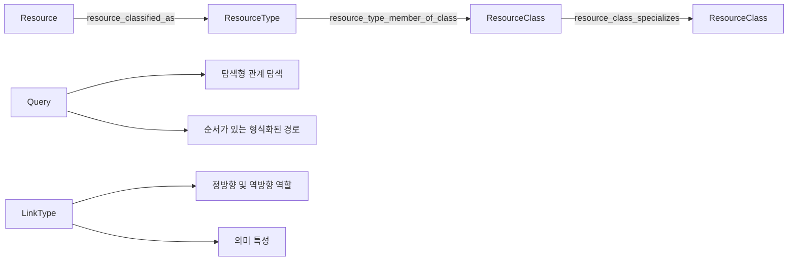

# 온톨로지 구조 모델

이 문서는 FDAI가 정확한 리소스 형식, 분류 집계, 기능, 방향이 있는 관계, 형식화된 경로,
범위가 제한된 그래프 표현을 나타내는 방법을 정의합니다. 분류 체계가 실행 권한이나 프로바이더
사실의 두 번째 출처가 되지 않으면서 운영자와 에이전트에 유용하도록 유지합니다.

> **권한 경계:** 분류 체계, 인터페이스, 링크 역할, 쿼리 경로는 의미만 정의합니다. 외부 상태를
> 관찰하거나, 작업을 승인하거나, 실행기를 선택하거나, 자율성을 높일 수 없습니다.
>
> **호환성 경계:** 기존 `Resource`, `ResourceType`, LinkType 아이덴티티, 저장된 링크 방향,
> 과거 온톨로지 release는 계속 유효합니다. 새 구조 표면은 추가 방식으로 도입하며 읽기 전용
> 기능으로 시작합니다.

## 설계 요약

이 모델은 정확한 아이덴티티, 집계, 동작, 언어, 토폴로지 힌트, 쿼리 실행, 표현을 분리합니다.
각 관심사는 하나의 표준 표현과 범위가 제한된 소비자 계약을 가집니다.

## 구조 개념

| 개념 | 책임 | 하지 않는 일 |
|------|------|--------------|
| `ResourceType` | `compute.vm` 같은 정확한 클라우드 프로바이더 중립 리소스 하위 형식입니다. | 아이덴티티나 범주에서 동작을 상속하지 않습니다. |
| `ResourceClass` | `NetworkEndpoint` 또는 `DataService` 같은 검토된 분류 집계입니다. | 작업 적격성을 부여하거나 기능을 모델링하지 않습니다. |
| `InterfaceType` | 여러 ObjectType에 공통인 속성, 링크, 작업 계약입니다. | 이 release에서는 `Resource.type` 값을 분류하지 않습니다. |
| `ResourceTypeQueryGroup` | 정확한 ResourceType 집합 하나에 대한 검토된 영어 및 한국어 별칭입니다. | 온톨로지 아이덴티티나 전이 가능한 클래스가 아닙니다. |
| `typical_parents` | 예상 인스턴스 포함 관계에 대한 작성 힌트입니다. | 하위 형식 상속으로 해석하지 않습니다. |

### ResourceType 분류

완전한 인벤토리 세대와 매핑 다이제스트가 지원하는 경우 관찰된 모든 `Resource`는 구체적인
`ResourceType` 하나를 가리키는 검토된 `resource_classified_as` 관계를 유지합니다. 매핑되지
않았거나 아직 적재되지 않은 형식은 명시적인 커버리지 공백으로 남습니다. 이름, 아이덴티티
접두사, 임베딩, 프로바이더 범주 또는 쿼리 별칭으로 분류를 만들지 않습니다.

### ResourceClass 분류 체계

`ResourceClass`는 작고 도메인 중심적인 집계 표면입니다. 명시된 역량 질문이 하나의 운영 개념
아래에서 두 개 이상의 구체적인 ResourceType을 선택해야 할 때만 클래스를 추가합니다.

분류 체계는 방향이 있는 두 LinkType을 사용합니다.

| LinkType | 방향 | 의미 |
|----------|------|------|
| `resource_type_member_of_class` | 구체적인 `ResourceType` -> `ResourceClass` | 정확한 형식이 검토된 클래스에 속합니다. |
| `resource_class_specializes` | 더 좁은 `ResourceClass` -> 더 넓은 `ResourceClass` | 더 좁은 클래스가 실제 분류 특수화입니다. |

멤버 자격은 다대다입니다. 특수화 그래프는 순환이 없고, 범위가 제한되며, 의도적으로 얕게
유지합니다. 다중 멤버 자격으로 조합을 표현합니다. 관련 없는 두 기능을 결합하기 위해서만 만든
조합 클래스는 수락하지 않습니다.

첫 release는 하나의 분류 표면을 유지합니다. 범용 개념 체계 엔진은 추가하지 않습니다.
`Operable`, `Observable` 같은 기능은 계속 InterfaceType 관심사입니다. ResourceType 수준의
Interface 바인딩은 InterfaceType이 ActionType 대상이 될 수 있으므로 별도 안전 설계가 필요합니다.

## 관계 모델

### 직접 링크

직접 링크는 안정적인 아이덴티티가 `(from_id, link_type, to_id)`인 이항 의미 사실 하나를
나타냅니다. 관계가 독립적인 도메인 아이덴티티나 수명 주기를 갖지 않을 때 적합합니다.

직접 링크 속성은 빈 매핑 또는 표준 근거 묶음으로 제한합니다. 관찰 시각, 매핑 아이덴티티,
검증 증적, 완전성, 충돌, 근거 참조는 링크를 지원하는 근거를 설명합니다. 관계의 도메인 속성이
아닙니다.

예시는 다음과 같습니다.

- 부모에서 자식으로 향하는 포함 관계에는 `contains`를 사용합니다.
- 연결된 리소스와 기준점에는 `attached_to`를 사용합니다.
- 독립적인 계약 데이터가 없는 존재 기반 선행 조건에는 `depends_on`을 사용합니다.
- 검증된 방향이 있는 전달 참조 하나에는 `routes_to`를 사용합니다.
- caller Resource에서 target Resource로 향하는 검증된 telemetry 호출 하나에는 `runtime_calls`를 사용합니다.
- `peered_with`는 독립적으로 지원되는 방향이 있는 레코드 두 개로 나타냅니다.
- 정확하고 검토된 분류에는 `resource_classified_as`를 사용합니다.

### 관계 객체

관계 자체가 실제 엔터티인 경우에만 도메인별 객체로 모델링합니다. 다음 조건 중 하나 이상을
충족하는 것이 좋습니다.

- 두 엔드포인트와 독립적인 권위 있는 아이덴티티가 있습니다.
- 어느 엔드포인트도 교체하지 않고 생성, 수정 또는 종료할 수 있습니다.
- 같은 엔드포인트를 연결하는 여러 인스턴스가 동시에 존재할 수 있습니다.
- 역할, 할당량, 우선순위, 상태 또는 유효 구간 같은 도메인 속성이 있습니다.
- 정책 또는 ActionType이 관계 자체를 대상으로 삼습니다.

프로바이더 검증 메타데이터만으로는 객체를 만들 이유가 되지 않습니다. FDAI는 범용
`Relationship` ObjectType을 만들거나 모든 직접 링크에 UUID 아이덴티티를 추가하는 대신,
관찰된 역할 할당 Resource 같은 기존 도메인 객체를 재사용합니다.

## LinkType 의미

저장 방향은 계속 `from_type -> to_type`입니다. 호환 가능한 LinkType 수정에서 다음과 같은
검토된 의미 필드를 추가할 수 있습니다.

| 필드 | 목적 |
|------|------|
| `forward_role` | 저장 방향으로 탐색할 때 사람과 에이전트가 읽을 수 있는 역할입니다. |
| `reverse_role` | 저장 방향의 반대로 탐색할 때 사람과 에이전트가 읽을 수 있는 역할입니다. |
| `semantic_traits` | 포함, 의존성, 연결, 접속, 트래픽, 분류, 권한 부여 또는 근거 같은 하나 이상의 조합 가능한 의미입니다. |

역할 이름은 LinkType 하나의 범위에서만 유효하며 다른 저장 링크를 암시하지 않습니다. 특성은
도메인 의미를 표현하며 색상, 레이아웃 레인 또는 그래프 좌표를 표현하지 않습니다. 기존 인과,
시간, 전이, 카디널리티, 엔드포인트 계약은 계속 독립적입니다.

첫 구현은 `contains`, `attached_to`, `depends_on`, `routes_to`, `runtime_calls`, `peered_with`,
`resource_classified_as`, `resource_type_member_of_class`, `resource_class_specializes`에 이 필드를
적용합니다. 다른 LinkType은 역량에 기반한 감사에서 승격할 때까지 정확한 기존 선언을 통해 계속
읽을 수 있습니다.

## 쿼리 대수

쿼리 계약은 열린 그래프 확장과 순서가 있는 의미 경로를 분리합니다.

### 탐색형 관계 탐색

탐색형 관계 탐색은 허용되는 LinkType 집합, 방향 하나, 최대 깊이, 객체 상한, 관계 상한을
받습니다. 전이 계약에 따라 각 깊이에서 허용된 모든 LinkType을 따라갈 수 있습니다. 결과는
정확한 잘림 이유를 보고하며 경로 순서를 주장하지 않습니다.

### 순서가 있는 형식화된 경로

순서가 있는 형식화된 경로에는 하나 이상의 단계가 있습니다. 각 단계는 다음을 선언합니다.

- 정확한 LinkType 이름
- `outgoing` 또는 `incoming` 탐색 방향
- 예상 엔드포인트 ObjectType
- 전이 가능하다고 선언된 LinkType에만 허용되는 범위가 제한된 반복

검증기는 저장소 I/O 전에 전체 엔드포인트 체인을 검사합니다. 런타임은 현재의 범위가 제한된
프런티어를 기준으로 한 번에 한 단계씩 실행하고 도달한 엔드포인트 형식을 검증합니다. LinkType
이름 튜플을 순서가 있는 경로이자 순서가 없는 탐색 집합으로 동시에 해석하지 않습니다.

기존 v1 관계 탐색은 호환성을 유지하고 LinkType 하나를 지원합니다. 여러 LinkType으로 구성된
순서 경로는 추가되는 형식화된 경로 계약과 새 exact 함수 또는 쿼리 노드 아이덴티티를 사용합니다.

### 분류 체계 클로저

쿼리 컴파일러는 `ResourceClass` 하나를 범위가 제한된 결정적 구체 ResourceType id 집합으로
해석합니다. 클로저 증적은 다음을 고정합니다.

- 온톨로지 release 다이제스트
- 요청된 ResourceClass id
- 순서가 지정된 클래스와 ResourceType id
- 클로저 다이제스트와 잘림 상태

결과 Resource 쿼리는 정확한 `Resource.type` 값을 사용합니다. 런타임은 자연어, 아이덴티티
접두사 또는 프로바이더 필드에서 클래스를 확장하지 않습니다.

## 완전성과 표현

그래프 소비자는 네 가지 독립적인 제한 계열을 보존합니다.

| 계열 | 예시 |
|------|------|
| 출처 커버리지 | 참조된 엔드포인트가 완전한 프로바이더 세대에서 관찰되지 않았습니다. |
| 쿼리 잘림 | 깊이, 객체, 관계 또는 결과 상한에 도달했습니다. |
| 접근 제어에 따른 가림 | principal이 엔드포인트, 속성 또는 근거 필드를 읽을 수 없습니다. |
| 표현 생략 | Console 집중 보기가 범위가 제한된 응답 항목을 의도적으로 숨깁니다. |

Operator 변환 결과는 출처 세대, 온톨로지 release, 쿼리 상한, 관계 커버리지, 정확한 제한 코드를
보존합니다. Console은 의미 특성으로 포함, 의존성, 접속, 권한 부여, 분류, 근거 보기를 만들 수
있습니다. 또한 `범위가 제한된 모든 관계` 검사 표면을 제공하고 자체적으로 생략한 노드와 관계
수를 이유별로 보고합니다. 브라우저 레이아웃은 완전성이나 권한을 바꾸지 않습니다.

## 이행 및 출시

1. 보이는 쿼리 경로를 바꾸지 않고 구조 선언, 로더, 검증기를 추가합니다.
2. 읽기 전용 exact-release 함수 뒤에 순서가 있는 형식화된 경로 실행과 분류 체계 클로저를
   추가합니다.
3. 기존 1단계 탐색, 영향 범위, 네트워크 경로, 분류 결과를 shadow 비교합니다.
4. 호환 가능한 선언 수정을 통해 LinkType 역할과 특성을 추가합니다. replay를 위해 모든 이전
   release를 보존합니다.
5. 추가 방식의 Operator 및 Console 계약을 통해 제한 계열과 의미 보기를 노출합니다.
6. 집중 역량, replay, 이중 언어, 권한 없음 검사를 통과한 뒤에만 승격합니다.

방향, 엔드포인트, 카디널리티 또는 저장된 아이덴티티 수정에는 계속 LinkType 주 버전 또는 명시적
그래프 이행이 필요합니다. 어떤 출시도 과거 컨텍스트 스냅샷을 다시 쓰지 않습니다.

## 구현 상태

### 구현 범위

| 영역 | 상태 | 근거 | 참고 |
|------|------|------|------|
| 구조 설계와 호환성 | implemented | 이 문서 쌍, `design-routes.json`, 로드맵 인덱스, 코드 맵, 집중 문서 검사 | 추가 모델은 기존 Resource, ResourceType, 직접 링크 아이덴티티, 저장 방향, 과거 선언을 보존합니다. |
| ResourceClass 카탈로그와 변환 결과 | implemented | `resource_class.py`, `resource-classes.yaml`, ResourceClass/ObjectType 및 멤버 자격/특수화 선언, 카탈로그 변환 결과, 클로저 증적, 집중 카탈로그 검사 | 검토된 클래스 3개가 멤버 자격 9개와 순환 없는 특수화 1개로 변환됩니다. 클로저는 명시적 id만 사용하고 권한을 부여하지 않습니다. |
| 순서가 있는 형식화된 경로 쿼리 | implemented | `TypedPathDefinition`, `QueryNodeKind.TYPED_PATH`, 결정적 검증기, 보안 적용 handler, composition binding, 집중 쿼리 검사 | 기존 v1 탐색은 LinkType 하나만 받습니다. 형식화된 경로는 방향이 고정된 단계 1-8개를 실행하고 불완전한 중간 근거에서 보류합니다. |
| 링크 역할과 의미 특성 | implemented | 공유 LinkType 계약 및 스키마, 쿼리 매니페스트, 검토된 런타임 선언 7개와 분류 선언 2개, 카탈로그 테스트 | 선택적인 빈 필드는 기존 provenance를 보존합니다. 검토된 필드는 역방향 edge나 표현 레이아웃을 만들지 않습니다. |
| 완전성과 표현 분리 | implemented | 권위 있는 온톨로지 그래프 materializer, 통합 테스트, Console 디코더, LinkType 검사기, 그래프 우선 인스턴스 작업 영역, 이중 언어 제품 카탈로그, 타입 검사, 프로덕션 빌드 | 선언 그래프는 독립적인 제한 계열 4개를 전달하고 범위 내 모든 LinkType의 역할과 특성을 노출합니다. 인스턴스 작업 영역은 그래프 권한을 바꾸지 않고 선택, 범례, Inspector 상태를 표현 계층에 유지합니다. |
| 거버넌스 아티팩트 분리 | implemented | `rule_catalog/schema/governance_catalog.py`; `delivery/catalog_exemption.py`; 집중 거버넌스 로더 및 registry 테스트 | 배정과 exemption은 검증된 catalog-as-code 입력입니다. 온톨로지 사실로 변환되지 않으며 쿼리, 승인 또는 실행 권한을 부여하지 않습니다. |
| 적대적 하드닝 | implemented | 아래의 15회 하드닝 기록, 집중 Python 테스트 308개, 집중 Console 테스트 29개, 변경된 Python 파일 29개의 Ruff, 변경된 source 파일 19개의 strict mypy, Console 타입 검사 및 프로덕션 빌드 | 검증된 모든 High 또는 Medium 발견 사항을 해결했습니다. Low 관찰만 남았습니다. |

### 구현 이력

| 날짜 | 상태 | 변경 | 근거 | 남은 작업 |
|------|------|------|------|-----------|
| 2026-08-23 | not-started | Palantir 온톨로지 설계 지침과 기존 FDAI 계약을 검토한 뒤 구조 모델을 채택했습니다. 이 설계는 경계가 새로 정해진 설계이므로 이전 구현 이력을 재구성하지 않았습니다. | `current change`; 이 문서 쌍과 집중 문서 검사입니다. | 제공 순서를 구현하고 최소 10회의 적대적 하드닝을 완료합니다. |
| 2026-08-23 | implemented | 작업 권한이나 과거 링크 방향을 바꾸지 않고 명시적 ResourceClass 분류 체계, 순서가 있는 형식화된 경로, LinkType 탐색 역할 및 의미 특성, exact 매니페스트 변환 결과, 제한을 보존하는 선언 표현을 추가했습니다. | `current change`; 집중 카탈로그, 쿼리, 계약, materializer, Console 검사, Ruff, strict mypy, Console 타입 검사 및 프로덕션 빌드입니다. | 최소 10회의 적대적 비평 및 하드닝을 완료하고 검증된 Low 초과 발견 사항을 모두 해결한 뒤 최종 집중 및 diff 검증 묶음을 실행합니다. |
| 2026-08-23 | implemented | 적대적 하드닝을 15회 완료했습니다. 형식화된 경로 composition, 범위가 제한된 반복, 분류 근거 무결성, 분류 체계 아이덴티티와 상한, exact-release 호환성, Console 디코딩, 출시 호환성, production 분류 체계 클로저 통합 결함을 해결했습니다. | `current change`; 집중 Python 테스트 308개와 집중 Console 테스트 29개가 통과했고, 변경된 Python 파일 29개의 Ruff, 변경된 source 파일 19개의 strict mypy, Console 타입 검사 및 프로덕션 빌드가 통과했습니다. | 문서 쌍, 로드맵, 번역, 문장 부호, 설계 경로, 최종 diff 검사를 실행합니다. |
| 2026-08-23 | implemented | 검증된 Low 초과 발견 사항 없이 범위가 제한된 구현 및 문서 gate 묶음을 완료했습니다. | `current change`; 변경된 한국어 문서 3개의 번역 품질 및 readable-Hangul 검사, 변경 문서 6개의 문장 부호 검사, 파생 출처, 로드맵 추적, 문서 크기, 설계 경로, 664개 파일 링크 검사가 통과했습니다. | 이 문서의 범위가 제한된 작업에는 남은 항목이 없습니다. |
| 2026-08-23 | implemented | 불변 거버넌스 배정과 exemption이 온톨로지 구조 그래프 외부의 catalog-as-code 입력으로 유지됨을 기록했습니다. | `current change`; 거버넌스 카탈로그, exemption registry 및 집중 시작 검사입니다. | 이 경계로 인한 온톨로지 변환 또는 권한 작업은 없습니다. |
| 2026-08-24 | implemented | caller에서 target으로 향하는 역할과 connectivity 및 traffic 특성을 가진 비전이 `runtime_calls` Resource-to-Resource 선언을 추가했습니다. 선언만으로는 edge나 권한을 만들지 않습니다. | `current change`; `runtime_calls.yaml`, 집중 LinkType, provenance, catalog, exact-release 검사입니다. | 지속형 운영 그래프 owner를 통해 독립적으로 검증된 endpoint observation만 binding합니다. |
| 2026-08-24 | implemented | 인증된 타입 지정 runtime-call 관찰을 인벤토리 single writer를 통해 연결하고 PostgreSQL 역할 근거는 Resource 관계가 아닌 별도의 principal-safe 변환 결과로 유지했습니다. | `current change`; `runtime_call_telemetry.py`, `runtime_call_inventory.py`, `postgres_role_evidence.py`, 집중 producer, 변환 결과, 인벤토리, principal 가림 검사입니다. | 권위 있는 source가 정확한 endpoint Resource id를 제공한 뒤에만 인증된 런타임 근거를 보존합니다. |
| 2026-08-24 | implemented | 온톨로지 쿼리 또는 변경 권한을 바꾸지 않고 그래프 우선 인스턴스 작업 영역, 간결한 컨트롤, 선택된 리소스와 범례 오버레이, Inspector 소유 접기 동작을 복원했습니다. | `current change`; 집중 Console 경로 테스트, 타입 검사, 프로덕션 빌드입니다. | 이 표현 범위에는 남은 구조 모델 작업이 없습니다. |
| 2026-08-24 | implemented | 정확한 스키마 관계와 현재 인스턴스 관계의 경계를 복원했습니다. 하나 또는 두 개의 표준 ObjectType 이름은 시간 범위가 없는 스키마 읽기로 유지하고, 현재 운영 객체 관계에는 계속 엔드포인트 ObjectSet이 필요합니다. 링크 가림 증적은 변환된 링크에서 실제로 제거된 속성만 집계하고 타입이 지정된 관찰 메타데이터를 보존합니다. | `current change`; 의미 계획, 쿼리 게이트웨이, 집중 관계 검사가 통과했고 통합 수정 테스트 629개와 Ruff 및 strict mypy가 통과했습니다. | 실제 운영 근거는 별도로 보존합니다. 이 수정은 변경 또는 실행 권한을 부여하지 않습니다. |

### 하드닝 기록

| 회차 | 검토 관점 | 결과 | 집중 근거 |
|------|-----------|------|-----------|
| 1 | 형식화된 경로 계약, 검증기, handler, 저장소 의미 | 검증된 Low 초과 발견 사항이 없었습니다. 범위를 벗어난 network-path 관찰은 제외했습니다. | 집중 형식화된 경로 검토와 기준선 쿼리 검사입니다. |
| 2 | 분류 체계 아이덴티티와 클로저 | `class.` namespace를 예약해 Medium 전역 object id 충돌을 해결했습니다. | ResourceClass 검사 7개가 통과했습니다. |
| 3 | LinkType 스키마와 과거 provenance | 추가 필드 생략을 LinkType 선언에만 제한해 Medium hash 정규화 결함을 해결했습니다. | LinkType 및 provenance 검사 5개가 serializer 경고 없이 통과했습니다. |
| 4 | 직접 링크 근거 경계 | 직접 링크에서 임의 도메인 속성을 허용하던 Medium 우회를 해결했습니다. | 프로바이더 및 인벤토리 검사 50개가 통과했습니다. |
| 5 | planner, 검증기, executor composition | 실행 가능한 `TYPED_PATH`가 planner 검증기 capability 집합에 없던 High 결함을 해결했습니다. | end-to-end 의미 런타임 형식화된 경로 검사가 통과했습니다. |
| 6 | 접근, 완전성, 표현 디코딩 | edge 역할과 특성을 필드별로 디코딩해 Medium Console 신뢰 경계 결함을 해결했습니다. | Console 디코더 테스트 9개와 타입 검사가 통과했습니다. |
| 7 | exact-release와 persistence 호환성 | 검증된 Low 초과 발견 사항이 없었습니다. 과거 선언 fixture와 저장된 row를 계속 읽을 수 있었습니다. | exact-release, migration, persistence 검사 47개가 통과했습니다. |
| 8 | 원자적 카탈로그 교체와 재시작 replay | 오래된 ResourceClass를 제거할 때 멤버 자격 링크도 제거하는 Low 회귀 검사를 추가했습니다. | 카탈로그 변환 결과 검사 3개가 통과했습니다. |
| 9 | 분류 체계 서비스 거부 상한 | registry 전체 멤버 자격과 특수화 예산으로 Medium 무제한 전체 edge 결함을 해결했습니다. | ResourceClass 상한 검사 6개가 통과했습니다. |
| 10 | 문서와 전이 의미의 동등성 | 전이 가능하고 자체 조합 가능한 LinkType에만 범위가 제한된 `max_hops` 반복을 추가해 Medium 과장 주장을 해결했습니다. | 쿼리 계약, 검증기, 런타임 검사 37개가 통과했습니다. |
| 11 | 분류 권한과 근거 위조 | 정확한 네 필드 분류 묶음, 표준 다이제스트, 비어 있지 않은 id, `verified is True`를 요구해 Medium 결함을 해결했습니다. | 프로바이더, 인벤토리, 런타임 검사 62개가 통과했습니다. |
| 12 | 추가 방식 출시 호환성 | 추가 그래프 및 edge 필드가 모두 생략된 기존 payload만 허용해 Medium Console 회귀를 해결했습니다. | 디코더 테스트 10개와 타입 검사가 통과했습니다. |
| 13 | 범위가 제한된 전이 런타임 클로저 | 반복 형식화된 단계가 첫 hop 프런티어만 반환하던 Medium 결함을 해결했습니다. | 쿼리 실행 및 검증 검사 35개가 통과했습니다. |
| 14 | production 분류 체계 클로저 composition | registry digest가 있고 권한을 부여하지 않는 `query.resource_class_closure`를 principal 매니페스트에 바인딩해 Medium 통합 공백을 해결했습니다. | composition 및 카탈로그 검사 42개와 직접 및 end-to-end 클로저 검사 8개가 통과했습니다. |
| 15 | 최종 계약 종료 | 표준 카탈로그 검증에서 Medium ResourceType id 길이 불일치를 해결했습니다. 검증된 High 또는 Medium 발견 사항이 남지 않았습니다. | ResourceClass 및 아이덴티티 상한 검사 8개와 최종 종합 및 정적 검사가 통과했습니다. |

### 남은 작업

- [x] 이중 언어 owner 문서를 설계 라우팅과 아키텍처 인덱스에 추가한 뒤 로드맵, 번역,
  문장 부호, 링크 검사를 통과합니다.
- [x] ResourceClass 선언, 카탈로그 변환 결과, 순환 없는 특수화, 증적에 고정된 클로저를
  구현하고 성공, 알 수 없음, 순환, 상한 fixture를 통과합니다.
- [x] 추가 방식의 순서가 있는 형식화된 경로를 구현하고 outgoing, incoming, 혼합 방향,
  잘못된 엔드포인트, 전이, 순환, 잘린 경우에 대해 검증기와 런타임의 동등성을 입증합니다.
- [x] 저장 방향, 엔드포인트 아이덴티티 또는 과거 release 해석을 바꾸지 않고 초기 LinkType에
  검토된 역할과 의미 특성을 추가합니다.
- [x] Producer를 binding하거나 과거 link를 재해석하지 않고 검토된 `runtime_calls` 선언을
  추가합니다.
- [x] 권위 있는 선언 그래프와 Console LinkType 검사기에서 출처, 쿼리, 접근 제어, 표현 제한을
  분리하고 범위 내 전체 LinkType 디렉터리를 포함합니다.
- [x] 독립적인 비평 및 하드닝을 최소 10회 완료하고 검증된 Low 초과 발견 사항을 남기지
  않습니다.
- [x] 위에 인용한 집중 구현, 정적, Console, 번역, 로드맵, 문장 부호, 설계 경로, 문서 크기,
  링크 및 diff 검사로 이 문서의 범위가 제한된 작업을 완료합니다.

## 관련 문서

| 알아볼 내용 | 읽을 문서 |
|-------------|-----------|
| 선언 종류, 방향, 상태, 컨텍스트 | [운영 온톨로지 메타모델](operating-ontology-metamodel-ko.md) |
| 도메인 객체, 관계, 아이덴티티, 시간 | [FDAI 운영 온톨로지](operating-ontology-ko.md) |
| Interface, ObjectSet, 함수, exact release | [온톨로지 안전 인프라](operating-ontology-platform-ko.md) |
| 연속 그래프 최신성과 완전성 | [연속 운영 인스턴스 그래프](continuous-operational-instance-graph-ko.md) |
| 검증된 쿼리 커버리지와 전환 | [온톨로지 쿼리 커버리지 구현 계획](../interfaces/ontology-query-coverage-implementation-plan-ko.md) |
