# Ontology Structural Model

This document defines how FDAI represents exact resource types, taxonomic aggregation,
capabilities, directional relationships, typed paths, and bounded graph presentation. It keeps
classification useful to operators and agents without turning taxonomy into execution authority
or a second source of provider truth.

> **Authority boundary:** Taxonomy, interfaces, link roles, and query paths define meaning only.
> They cannot observe external state, approve an action, select an executor, or raise autonomy.
>
> **Compatibility boundary:** Existing `Resource`, `ResourceType`, LinkType identities, stored link
> directions, and historical ontology releases remain valid. New structural surfaces are additive
> and start as read-only capabilities.

## Design at a glance

The model separates exact identity, aggregation, behavior, language, topology hints, query
execution, and presentation. Each concern has one canonical representation and one bounded
consumer contract.

## Structural concepts

| Concept | Responsibility | Does not do |
|---------|----------------|-------------|
| `ResourceType` | Exact cloud-provider-neutral resource subtype, such as `compute.vm`. | It does not inherit behavior from its identifier or category. |
| `ResourceClass` | Reviewed taxonomic aggregation, such as `NetworkEndpoint` or `DataService`. | It does not grant action eligibility or model capabilities. |
| `InterfaceType` | Shared property, link, and action contract across ObjectTypes. | It does not classify `Resource.type` values in this release. |
| `ResourceTypeQueryGroup` | Reviewed English and Korean aliases for one exact set of ResourceTypes. | It is not ontology identity or a transitive class. |
| `typical_parents` | Authoring hint for expected instance containment. | It is never interpreted as subtype inheritance. |

### ResourceType classification

Every observed `Resource` keeps exactly one reviewed `resource_classified_as` relationship to a
concrete `ResourceType` when the complete inventory generation and mapping digest support it.
Unmapped or unseeded types remain explicit coverage gaps. A name, identifier prefix, embedding,
provider category, or query alias never creates classification.

### ResourceClass taxonomy

`ResourceClass` has one reviewed coverage spine plus small, domain-driven aggregation surfaces.
The coverage spine starts at `class.resource` and reaches every shipped neutral ResourceType
through seven broad classes. It does not copy the 3,405 raw Azure provider types into the semantic
ontology. Additional classes are added only when a named competency question needs to select at
least two concrete ResourceTypes under one operational concept.

The taxonomy uses two directed LinkTypes:

| LinkType | Direction | Meaning |
|----------|-----------|---------|
| `resource_type_member_of_class` | concrete `ResourceType` -> `ResourceClass` | The exact type belongs to the reviewed class. |
| `resource_class_specializes` | narrower `ResourceClass` -> broader `ResourceClass` | The narrower class is a true taxonomic specialization. |

Membership is many-to-many. Duplicate membership inside one class is rejected, while membership
across classes represents composition. The specialization graph is acyclic, has a maximum depth of
eight, and remains intentionally shallow. Combination classes created only to join two unrelated
capabilities are not accepted. The shipped root closure is checked against the complete neutral
ResourceType registry so a new semantic type cannot remain outside the coverage spine.

The first release keeps one taxonomic surface. It does not add a generic concept-scheme engine.
Capabilities such as `Operable` and `Observable` remain InterfaceType concerns. ResourceType-level
Interface bindings require a separate safety design because InterfaceType can be an ActionType
target.

## Relationship model

### Direct links

A direct link represents one binary semantic fact whose stable identity is
`(from_id, link_type, to_id)`. It is appropriate when the relationship has no independent domain
identity or lifecycle.

Direct link properties are limited to an empty mapping or the standardized evidence envelope.
Observation time, mapping identity, verification receipts, completeness, conflicts, and evidence
references describe support for the link. They are not domain attributes of the relationship.

Examples include:

- `contains` for parent-to-child containment;
- `attached_to` for an attached resource and its anchor;
- `depends_on` for an existential prerequisite without independent contract data;
- `routes_to` for one verified directed forwarding reference;
- `runtime_calls` for one verified telemetry invocation from caller Resource to target Resource;
- `peered_with` as two independently supported directed records;
- `resource_classified_as` for exact reviewed classification.

### Relationship objects

A relationship is modeled as a domain-specific object only when the relationship is itself a
real entity. At least one of these conditions should apply:

- it has an authoritative identity independent from both endpoints;
- it can be created, revised, or closed without replacing either endpoint;
- multiple concurrent instances can connect the same endpoints;
- it has domain attributes such as role, allocation, priority, status, or effective interval;
- policy or an ActionType targets the relationship itself.

Provider verification metadata alone does not justify an object. FDAI reuses existing domain
objects such as observed role-assignment Resources instead of creating a generic `Relationship`
ObjectType or adding UUID identity to every direct link.

### Provider-observed topology

Provider topology enters the graph only through reviewed mappings and one complete inventory
generation. Azure nested resources use an explicitly declared immediate provider parent or
top-level provider root. The bounded ARM source collects AKS AgentPool children that Azure Resource
Graph does not expose as ordinary resources. The same source collects VM Scale Set VM and network
interface children, projects them through the existing `compute.vm` and `network.interface` types,
and retains exact VMSS-to-VM and NIC-to-VM/subnet mappings. Kubernetes API inventory adds
UID-grounded cluster, namespace, node, workload, Ingress, IngressClass, Endpoints, EndpointSlice,
ownership, selector, backend, and scheduling evidence before the same single writer promotes
resources and independently verified links atomically. A Kubernetes Node gains a
`kubernetes_backed_by` link to one VMSS VM only when `spec.providerID` resolves to the exact
provider reference of an observed VM instance. Names and identifier prefixes never substitute for
that identity bridge.

These producers do not infer topology from names alone. The Kubernetes source binds one exact
cluster Resource identity, keeps namespace and cluster scope checks, and records explicit
unavailability when the API endpoint, CA bundle, or mounted service-account token is not configured.
Catalog declarations remain meaning only and never grant observation or execution authority.

## LinkType semantics

Stored direction remains `from_type -> to_type`. A compatible LinkType revision can add these
reviewed semantic fields:

| Field | Purpose |
|-------|---------|
| `forward_role` | Human and agent-readable role when traversing stored direction. |
| `reverse_role` | Human and agent-readable role when traversing against stored direction. |
| `semantic_traits` | One or more composable meanings such as containment, dependency, attachment, connectivity, traffic, classification, authorization, or evidence. |

Role names are scoped to one LinkType and do not imply another stored edge. Traits express domain
meaning, not colors, layout lanes, or graph coordinates. Existing causal, temporal, transitive,
cardinality, and endpoint contracts remain independent.

The first implementation applies the fields to `contains`, `attached_to`, `depends_on`,
`routes_to`, `runtime_calls`, `peered_with`, `resource_classified_as`, `resource_type_member_of_class`, and
`resource_class_specializes`. Other LinkTypes remain readable through their exact legacy
declarations until a competency-driven audit promotes them.

## Query algebra

The query contract separates open graph expansion from an ordered semantic path.

Verified query execution may expose bounded node lifecycle observations for presentation. Each
observation preserves the verified node kind, dependency position, status, and evidence references
without provider commands or execution authority. Missing, delayed, or failed observation delivery
does not change the query result; the terminal execution receipt remains authoritative.

### Exploratory traversal

An exploratory traversal accepts an allowed LinkType set, one direction, maximum depth, object
limit, and edge limit. Every allowed LinkType may be followed at each depth, subject to its
transitivity contract. The result reports exact truncation reasons and never claims path order.

### Ordered typed path

An ordered typed path contains one or more steps. Each step declares:

- exact LinkType name;
- `outgoing` or `incoming` traversal direction;
- expected endpoint ObjectType;
- bounded repetition only for a LinkType declared transitive.

The verifier checks the complete endpoint chain before store I/O. Runtime executes one step at a
time against the current bounded frontier and validates the reached endpoint types. A tuple of
LinkType names is never interpreted as both an ordered path and an unordered traversal set.

Existing v1 relationship traversal remains compatible and supports one LinkType. Multi-LinkType
ordered paths use the additive typed-path contract and a new exact function or query-node identity.

### Taxonomy closure

The query compiler resolves one `ResourceClass` to a bounded, deterministic set of concrete
ResourceType ids. The closure receipt pins:

- ontology release digest;
- requested ResourceClass id;
- ordered class and ResourceType ids;
- closure digest and truncation state.

The resulting Resource query uses exact `Resource.type` values. Runtime never expands a class from
natural-language terms, identifier prefixes, or provider fields.

## Completeness and presentation

Graph consumers preserve four independent limitation families:

| Family | Example |
|--------|---------|
| Source coverage | A referenced endpoint was not observed in the complete provider generation. |
| Query truncation | A depth, object, edge, or result bound was reached. |
| Access redaction | The principal cannot read an endpoint, property, or evidence field. |
| Presentation omission | The Console focus view intentionally hides bounded response items. |

Operator projections preserve source generation, ontology release, query bounds, relationship
coverage, and exact limitation codes. The Console may build containment, dependency, connectivity,
authorization, classification, and evidence views from semantic traits. It also provides an
`All bounded relationships` inspection surface and reports its own omitted node and edge counts by
reason. A bounded multi-hop response is never described as one hop. For a selected VM, the Console
may summarize only ordered network paths whose stored edges and reviewed mapping evidence are
present in the response. A missing path remains unknown when relationship coverage is incomplete
or the required backend association is not modeled. Browser layout never changes completeness or
authority.

The instance graph legend shows `contains`, `attached_to`, and `depends_on` by default. Operators
can expand the legend to inspect every relationship type in the bounded response. This presentation
choice does not remove links, change relationship counts, or narrow the Inspector.

The default instance presentation omits `authorization.role-assignment` Resources from selection,
the graph, relationship inspection, and conversational screen context. IAM projections retain the
underlying evidence. The instance directory applies this omission before it applies its bound, so
the bounded page counts only Resources an operator can select. A Resource Group remains selectable
as a bounded scope overview. For any
non-scope root, the graph shows only that root's immediate owning Resource Group and does not add
Resource Groups that belong only to indirect peers or branch nodes. Scope membership never proves
traffic or dependency.

The directory bound is a presentation limit, never a completeness claim. When the active generation
holds more Resources than the bound, the surface states the bound as its own notice and directs the
operator to narrow the search. Search runs against the authoritative directory rather than the
already-bounded page, so a Resource beyond the bound stays reachable. A query the recorded
identifiers cannot contain is refused as unmatchable instead of returning an empty result that would
read as an absent Resource, and no query is translated or rewritten before it reaches the directory.

A Resource type icon is presentation only. It never carries object identity, type authority, or
evidence. An unmapped type resolves to an explicit generic glyph instead of a lookalike, and a
glyph shared by two types groups them without asserting that they are the same object.

The converse also holds. A layered graph may draw one Resource more than once to keep every
relationship directed, so each repeated node states how many times that single Resource is drawn
rather than reading as separate objects. For a cluster root, the graph adds a bounded,
declared-workload-first sample of what each namespace holds, because a namespace drawn as a leaf
asserts an empty namespace it never observed. The Resource an operating scope manages on the
selected Resource's behalf is labeled as managed, so it does not read as a peer scope alongside the
scope that owns the selection.

Layout consumes the viewport it has rather than a fixed box, and fills rows before it adds a
column, so hop depth rather than row packing decides the width. Zoom stops at the scale of the
first render because a smaller scale only shrinks nodes and never adds a relationship. A layout
bound never doubles as a completeness bound: how much of a scope a root summarizes stays an
independent decision.

Containment leaves a Resource from its underside while attachment leaves from its side, and a
contained Resource follows its owner's order within a column. What a Resource is attached to is
drawn above it and what it contains is drawn below it, with a visible break between the two groups.
A layered layout can only guarantee that order for the selected Resource, so an owner that a deeper
level draws below its own child keeps the side port instead of claiming a hierarchy the placement
does not show. The port a line uses and the row a Resource occupies are reading aids only. Neither
creates, removes, reorients, or re-evidences a relationship.

A layered layout reaches its limit there: it can order one root above its children but cannot show a
hierarchy several levels deep without degenerating into an indented outline. Containment is
therefore drawn as nesting rather than as an edge, because a box drawn inside another box cannot
point the wrong way. The model computes box sizes bottom-up, gives each column its own width, and
reports per-owner how many children a bound left out, so a box that hides children never reads as a
complete owner. An owner keeps its own card inside its box, so nesting removes a line without
removing that Resource's status or evidence. Column count favours height over width, because width
is the axis the direction bands and the surrounding Resources already compete for. Nesting removes
the line for every containment relationship it absorbs; a measured cluster resolves 190 of 385
relationships that way. Ordering inside a box follows the same declared-workload-first rank the
layered layout uses, so a bound removes derived Resources before declared ones. A bound then takes
one Resource of every kind before a second of any, because ranking and truncating lets the most
numerous kind consume the whole bound: a namespace holding fourteen DaemonSets behind seven
Deployments would report only Deployments and read as though it holds nothing else. A count of what
was left out cannot repair a sample that misstates composition. Nesting is a reading
arrangement only. It never asserts containment the evidence did not report, never adds a Resource
the layout left out, and never places a Resource with no owning `contains` relationship inside a box
to make the drawing tidy.

One fact earns one encoding. Once a box states a Resource's distance by position, the drawing does
not also fade it, because a second encoding of the same fact costs legibility without adding meaning
and lands hardest on the Resources nesting exists to reveal. Emphasis by distance is kept where
position says nothing, which is outside every box.

A management scope becomes a box only when it is the selected Resource. Nesting begins at the
selected Resource and follows what it contains, so a scope that merely holds it stays an ordinary
relationship. The ontology already separates the two: `azure.resource-group-contains-resource` is a
distinct mapping from `kubernetes.namespace-contains-resource` and `azure.vnet-contains-subnet`, and
it accounts for 46 of 190 containment relationships in a measured subscription. Scope membership
states where a Resource is billed and administered rather than what it runs inside, and a box that
enclosed the selected Resource would make the subject of the view an occupant of its own context.
Selecting the scope reverses that: the question is then what the scope holds, and its membership is
the answer.

An absent state is reported as unreported rather than as unobserved. Most Kubernetes ResourceClasses
are inventoried without a projected state, so naming that absence an observation would assert a
check that never ran and imply the state is missing in the cluster. The same holds for a record
field a ResourceClass never carries, such as an Azure location on a Kubernetes workload. Reporting
absence is only truthful when it names the right absence.

When a relationship cannot be placed, the recovery has to satisfy the rule that rejected it. Some
relationships are drawn between levels and some, such as a scale set interface and the virtual
machine it serves, are drawn on the same level. A recovery that always added the missing occurrence
one level to the right could never satisfy the same-level rule, and the graph refused to draw rather
than draw a false direction.

A relationship a box carries is still a relationship the drawing shows. Counting only the lines made
the graph report less coverage than it presents once nesting removed them, which understates the
evidence an operator is looking at just as surely as overstating it would.

## Migration and rollout

1. Add the structural declarations, loaders, and validators without changing the visible query
   path.
2. Add ordered typed-path execution and taxonomy closure behind read-only exact-release functions.
3. Shadow-compare existing one-hop traversal, impact, network, and classification results.
4. Add LinkType roles and traits through compatible declaration revisions. Preserve every prior
   release for replay.
5. Expose limitation families and semantic views through additive Operator and Console contracts.
6. Promote only after focused competency, replay, bilingual, and no-authority checks pass.

A direction, endpoint, cardinality, or persisted-identity correction still requires a LinkType
major version or explicit graph migration. No rollout rewrites historical context snapshots.

## Implementation status

### Implementation scope

| Area | State | Evidence | Notes |
|------|-------|----------|-------|
| Structural design and compatibility | implemented | This paired owner document, `design-routes.json`, roadmap index, code map, and focused documentation gates | The additive model preserves existing Resource, ResourceType, direct-link identity, stored direction, and historical declarations. |
| ResourceClass catalog and projection | implemented | `resource_class.py`, `resource-classes.yaml`, ResourceClass/ObjectType and membership/specialization declarations, catalog projection, closure receipt, and focused catalog checks | Eleven reviewed classes project all 80 neutral ResourceTypes through 80 direct memberships and 11 bounded specialization links. Closure uses only explicit ids and grants no authority. |
| Ordered typed-path query | implemented | `TypedPathDefinition`, `QueryNodeKind.TYPED_PATH`, deterministic verifier, secured handler, composition binding, and focused query checks | Existing v1 traversal now accepts one LinkType. Typed paths execute 1-8 exact directed steps and hold on incomplete intermediate evidence. |
| Link roles and semantic traits | implemented | Shared LinkType contract and schema, query manifest, seven reviewed runtime declarations plus two taxonomy declarations, and catalog tests | Optional empty fields preserve legacy provenance. Reviewed fields do not create inverse edges or presentation layout. |
| Completeness and presentation separation | implemented | Authoritative ontology graph materializer, integration tests, Console decoder, LinkType inspector, graph-first instance workspace, bilingual product catalog, typecheck, and production build | The declaration graph carries four independent limitation families and exposes every bounded LinkType with roles and traits. The instance workspace keeps selection, legend, and Inspector state in the presentation layer without changing graph authority. |
| Governance artifact separation | implemented | `rule_catalog/schema/governance_catalog.py`; `rule_catalog/schema/retirement.py`; `delivery/catalog_exemption.py`; focused governance loader and registry tests | Assignments, exemptions, and rule retirements are validated catalog-as-code inputs. Merged retirements are projected out of the active rule index; none grant query, approval, or execution authority. |
| Provider-observed topology production | implemented | `azure-arg-v1.yaml`; `arm_inventory.py`; `kubernetes_api_inventory.py`; `kubernetes_inventory.py`; focused Azure, Kubernetes, inventory promotion, catalog, Ruff, and strict mypy checks | Ninety-four reviewed mappings cover Azure containment and traffic configuration plus UID-grounded Kubernetes runtime topology, exact Node provider identity, Ingress backend Services, and EndpointSlice exposure. An unconfigured Kubernetes source is retained as explicit unavailable generation evidence. Live Kubernetes evidence remains separate validation work. |
| Adversarial hardening | implemented | Forty-two cumulative rounds below, including 14 current source, identity-bridge, taxonomy, projection, compatibility, and presentation lenses; focused Python, Operator, Console, and PostgreSQL checks | Every verified Critical, High, and Medium finding was resolved. Operational source unavailability and unverified external ingress remain explicit evidence gaps rather than code claims. |

### Implementation history

| Date | State | Change | Evidence | Remaining |
|------|-------|--------|----------|-----------|
| 2026-08-26 | implemented | Added exact Node `providerID` to VMSS VM identity bridging, Ingress and EndpointSlice runtime taxonomy, explicit Kubernetes source availability, runtime-aware Operator and Console LinkType projection, and an evidence-only AKS first-viewport coverage band. | `current change`; focused catalog and inventory integration passed 111 cases, focused Operator checks passed 30 cases, focused Console checks passed 60 cases, and an authoritative local refresh retained 897 Resources plus 1,640 inventory links. Snapshot and ontology identity sets agreed exactly; dangling, duplicate, multiple-parent, endpoint-type, and generation mismatches were all zero. The selected stopped AKS branch retained one managed Resource Group, one direct AgentPool, and four VMSS Resources. It retained zero exact VMSS VM or VMSS NIC child edges. Kubernetes runtime remained explicitly unavailable, so Node, Pod, Service, Endpoint, and bridge counts also remained zero. | Retain one complete exact-cluster Kubernetes API generation before claiming runtime validation. External gateway or load-balancer to Kubernetes identity remains unknown until an authoritative source proves both endpoints. |
| 2026-08-25 | implemented | Added bounded ARM collection for VMSS VM and NIC children plus default presentation rules that hide role assignments and retain only the selected root's immediate Resource Group context. | Focused Python checks passed 43 cases and Console checks passed 59 cases; Ruff, strict mypy, typecheck, and build passed. A local refresh promoted 901 Resources and 2,550 ontology links with exact generation agreement and zero structural invariant violations. Authenticated VNet and AKS views retained one immediate VNet owner group and displayed VMSS, VM, and NIC hierarchy nodes. | No bounded implementation work remains. Deployed evidence remains separate. |
| 2026-08-25 | implemented | Required bounded multi-hop instance presentation to preserve stored edge direction, summarize only evidence-backed VM network paths, and keep absent ingress or egress unknown under incomplete or unmodeled coverage. | `current change`; active-generation PostgreSQL audit; focused Console checks passed 56 cases; typecheck, production build, and entry bundle check passed; authenticated 1440 x 900, 993 x 641, and 390 x 844 Browser checks retained zero overflow and 44 px mobile path controls. | No bounded implementation work remains. Governed runtime retention remains separate. |
| 2026-08-23 | not-started | Adopted the structural model after reviewing Palantir ontology design guidance and the existing FDAI contracts. Earlier implementation provenance was not reconstructed because this is a new bounded design. | `current change`; this paired owner document and focused documentation gates. | Implement the delivery sequence and complete at least ten adversarial hardening rounds. |
| 2026-08-23 | implemented | Added explicit ResourceClass taxonomy, ordered typed paths, LinkType traversal roles and semantic traits, exact manifest projection, and limitation-preserving declaration presentation without changing action authority or historical link direction. | `current change`; focused catalog, query, contract, materializer, and Console checks; Ruff and strict mypy; Console typecheck and production build. | Complete at least ten adversarial critique and hardening rounds, resolve every verified finding above Low, then run the final focused and diff validation stack. |
| 2026-08-23 | implemented | Completed fifteen adversarial hardening rounds. Closed typed-path composition, bounded repetition, classification-evidence integrity, taxonomy identity and bounds, exact-release compatibility, Console decoding, rollout compatibility, and production taxonomy-closure integration defects. | `current change`; 308 focused Python tests passed, 29 focused Console tests passed, Ruff passed over 29 changed Python files, strict mypy passed over 19 changed source files, and Console typecheck and production build passed. | Run the paired documentation, roadmap, translation, punctuation, design-route, and final diff gates. |
| 2026-08-23 | implemented | Completed the bounded implementation and documentation gate stack with no verified finding above Low severity. | `current change`; translation quality and readable-Hangul checks passed for 3 changed Korean docs, punctuation passed for 6 changed docs, and derived-source, roadmap tracking, document-size, design-route, and 664-file link checks passed. | No remaining work for this document's bounded scope. |
| 2026-08-23 | implemented | Recorded that immutable governance assignments and exemptions remain catalog-as-code inputs outside the ontology structural graph. | `current change`; governance catalog, exemption registry, and focused startup checks. | No ontology projection or authority work follows from this boundary. |
| 2026-08-24 | implemented | Added the non-transitive `runtime_calls` Resource-to-Resource declaration with caller-to-target roles and connectivity and traffic traits. The declaration alone creates no edge or authority. | `current change`; `runtime_calls.yaml`; focused LinkType, provenance, catalog, and exact-release checks. | Bind only independently verified endpoint observations through the continuous operational graph owner. |
| 2026-08-27 | implemented | Added the validated rule-retirement artifact loader and runtime projection so only merged `retired` records leave the active rule index. | `current change`; `rule_catalog/schema/retirement.py`, `governance_catalog.py`, `runtime/control_loop.py`, and focused governance-catalog checks passed. | No ontology query or action authority follows from a retirement record. |
| 2026-08-27 | implemented | Propagated the retired-rule projection to quality-gate grounding and HIL parked-action maps so a retired rule cannot be resumed or evaluated downstream. | `current change`; runtime dispatch and governance-catalog focused checks passed. | No ontology query or action authority follows from a retirement record. |
| 2026-08-27 | implemented | Applied the same retirement projection before frozen measurement replay builds its index and rule map, preserving one active-rule view across runtime and learning paths. | `current change`; focused scenario-replay and governance-catalog checks passed. | No ontology query or action authority follows from a retirement record. |
| 2026-08-24 | implemented | Bound authenticated typed runtime-call observations through the inventory single writer and kept PostgreSQL role evidence as a separate principal-safe projection rather than a Resource relationship. | `current change`; `runtime_call_telemetry.py`, `runtime_call_inventory.py`, `postgres_role_evidence.py`; focused producer, projection, inventory, and principal-redaction checks. | Retain authenticated runtime evidence only after an authoritative source supplies exact endpoint Resource ids. |
| 2026-08-24 | implemented | Restored the graph-first instance workspace, compact controls, selected-resource and legend overlays, and Inspector-owned collapse behavior without changing ontology query or mutation authority. | `current change`; focused Console route tests, typecheck, and production build. | No remaining structural-model work for this presentation slice. |
| 2026-08-24 | implemented | Aligned the graph-first instance controls by removing the duplicate selected-resource summary, docking the relationship legend as a focusable horizontal surface, preserving the collapsed Inspector restore hit area, and offsetting the fullscreen tool when the Inspector is closed. | `c5cd7919ab32518d91c71075642f93d554c6fe2c`; focused instance-view regression checks. | No query, graph-authority, or mutation behavior changed. |
| 2026-08-24 | implemented | Restored the exact schema and current-instance relationship boundary. One or two canonical ObjectType names remain an atemporal schema read, while current operating-object relationships still require endpoint ObjectSets. Link redaction receipts now count only properties actually removed from the projected link and preserve typed observation metadata. | `current change`; semantic planning, query gateway, and focused relationship checks passed; the combined repair suite passed 629 cases; Ruff and strict mypy passed. | Retain live operational evidence separately. This correction grants no mutation or execution authority. |
| 2026-08-24 | implemented | Added reviewed Azure nested-resource containment and a bounded UID-grounded Kubernetes API enrichment source. Runtime resources and independently verified links enter one complete generation through the existing single writer, while missing Kubernetes bindings remain explicitly unavailable. | `current change`; provider catalog, Azure ARG and ARM, Kubernetes source and projection, inventory promotion, and composition checks passed 260 cases; Ruff passed; strict mypy passed for 10 source files. | Retain a live exact-cluster Kubernetes receipt and deployed CA and token mount evidence before changing this area to `validated`. |
| 2026-08-24 | implemented | Added one complete neutral ResourceClass coverage spine without importing raw provider types. The root closes over all 77 shipped ResourceTypes, catalog-owned instances preserve every membership and specialization, duplicate same-class membership fails closed, and specialization depth is limited to eight. | `current change`; shipped ResourceClass closure, loader-hardening, and catalog instance-projection checks. | Add only competency-driven compositional memberships. Live provider and Kubernetes evidence remains a separate validation concern. |

### Hardening record

| Round | Review lens | Result | Focused evidence |
|-------|-------------|--------|------------------|
| 1 | Typed-path contracts, verifier, handler, and store semantics | No verified finding above Low. Unrelated network-path observations were excluded from this scope. | Focused typed-path review and baseline query checks. |
| 2 | Taxonomy identity and closure | Resolved a Medium global object-id collision by reserving the `class.` namespace. | 7 ResourceClass checks passed. |
| 3 | LinkType schema and historical provenance | Resolved a Medium hash-normalization defect by limiting omission of additive fields to LinkType declarations. | 5 LinkType and provenance checks passed without serializer warnings. |
| 4 | Direct-link evidence boundary | Resolved a Medium bypass that accepted arbitrary domain properties on direct links. | 50 provider and inventory checks passed. |
| 5 | Planner, verifier, and executor composition | Resolved a High defect where `TYPED_PATH` was executable but absent from the planner verifier capability set. | End-to-end semantic runtime typed-path checks passed. |
| 6 | Access, completeness, and presentation decoding | Resolved a Medium Console trust-boundary defect by decoding edge roles and traits field by field. | 9 Console decoder tests and typecheck passed. |
| 7 | Exact-release and persistence compatibility | No verified finding above Low; historical declaration fixtures and persisted rows remained readable. | 47 exact-release, migration, and persistence checks passed. |
| 8 | Atomic catalog replacement and restart replay | Added a Low regression check proving removal of a stale ResourceClass also removes its membership links. | 3 catalog projection checks passed. |
| 9 | Taxonomy denial-of-service bounds | Resolved a Medium unbounded total-edge defect with registry-wide membership and specialization budgets. | 6 ResourceClass bound checks passed. |
| 10 | Documentation and transitive semantics parity | Resolved a Medium overclaim by adding bounded `max_hops` repetition only for transitive self-composable LinkTypes. | 37 query contract, verifier, and runtime checks passed. |
| 11 | Classification authority and evidence forgery | Resolved a Medium defect by requiring the exact four-field classification envelope, canonical digest, non-empty ids, and `verified is True`. | 62 provider, inventory, and runtime checks passed. |
| 12 | Additive rollout compatibility | Resolved a Medium Console regression by accepting only complete legacy omission of additive graph and edge fields. | 10 decoder tests and typecheck passed. |
| 13 | Bounded transitive runtime closure | Resolved a Medium defect where repeated typed steps returned only the first-hop frontier. | 35 query execution and verification checks passed. |
| 14 | Production taxonomy-closure composition | Resolved a Medium integration gap by adding registry-digested, no-authority `query.resource_class_closure` and binding it into the principal manifest. | 42 composition and catalog checks plus 8 direct and end-to-end closure checks passed. |
| 15 | Final contract closure | Resolved a Medium ResourceType id-length mismatch at canonical catalog validation. No verified High or Medium finding remained. | 8 ResourceClass and identity-bound checks passed; final aggregate and static checks passed. |
| 16 | Neutral taxonomy completeness | Resolved a Medium gap where 68 of 77 shipped ResourceTypes were outside every ResourceClass. | The shipped root-closure regression covers the exact registry. |
| 17 | Catalog-owned instance parity | Replaced stale fixed counts with registry-derived ResourceClass, membership, and specialization assertions. | The atomic catalog projection check covers the expanded instance graph. |
| 18 | Same-class duplicate integrity | Resolved a Medium digest-to-graph ambiguity by rejecting a repeated ResourceType inside one class. | The duplicate-member loader regression passes. |
| 19 | Cross-class composition | Rejected the proposed uniqueness restriction as a false positive because the LinkType is intentionally many-to-many. | A positive compositional-membership regression preserves both closures. |
| 20 | Specialization DAG | No verified finding above Low. Existing cycle and unknown-parent rejection remained correct. | Focused ResourceClass structural checks. |
| 21 | Specialization depth | Resolved a Medium design drift by enforcing the documented maximum depth of eight. | The depth-nine negative fixture fails closed. |
| 22 | Taxonomy link direction and cardinality | No verified finding above Low. Membership stays ResourceType -> ResourceClass and specialization stays narrower -> broader. | Declaration and projection direction review. |
| 23 | Atomic replacement and stale cleanup | No verified finding above Low. Removing a class also removes its owned membership links. | Existing replacement regression. |
| 24 | Release and digest identity | No verified finding above Low. Closure receipts retain registry, closure, and ontology release digests. | Existing exact-release closure checks. |
| 25 | Inventory instance classification | Rejected a false positive. Unmapped types lower coverage, and only `unseeded_resource_type` permits the rest of a complete generation to proceed. | Inventory projection contract review. |
| 26 | Raw provider and semantic boundary | No verified finding above Low. The 3,405-type provider ledger stays separate from the 77-type neutral taxonomy. | Provider catalog and structural-model review. |
| 27 | OpenAPI candidate direction | Rejected automatic mapping of modeled endpoint pairs because reused operation schemas don't prove property ownership or semantic direction. | The review receipt remains `review_required` with automatic promotion disabled. |
| 28 | Bounds and deterministic ordering | No verified finding above Low after duplicate, total-edge, depth, cycle, and sorted-closure checks. | Focused ResourceClass and catalog projection checks. |
| 29 | Active source-state accounting | Resolved a High omission where local authoritative refresh stored no Kubernetes source state. | The refreshed generation records `kubernetes_source_unconfigured` in `derived_source_states`. |
| 30 | Azure/Kubernetes immutable identity bridge | Resolved a Critical modeling gap by requiring exact Node `spec.providerID` to observed VMSS VM `provider_ref` equality. | Focused collection and relationship tests pass. |
| 31 | Name and identifier-prefix substitution | Resolved a High risk by proving similar Node and VM names never create a bridge edge. | The negative provider-identity fixture returns only a missing-target drop. |
| 32 | Cross-authority endpoint scope | Resolved a High gap where same-cluster filtering incorrectly excluded Azure VM targets that do not carry Kubernetes `cluster_ref`. | Provider-identity matching crosses the source boundary only through exact provider references. |
| 33 | EndpointSlice coverage | Resolved a Medium taxonomy and collector gap with UID-grounded EndpointSlice Resources and standard Service-label mapping. | Focused API, relationship, ResourceType, and catalog checks pass. |
| 34 | Ingress backend coverage | Resolved a Medium source gap with bounded Ingress and IngressClass collection plus exact same-namespace backend Service mappings. | Multi-backend and class attachment fixtures pass without Azure name inference. |
| 35 | Operator traversal vocabulary | Resolved a High omission where default instance traversal excluded stored Kubernetes relationships. | The operations family passes 30 focused checks with the expanded declared LinkType set. |
| 36 | Console relationship trust boundary | Resolved a High decoder gap where valid Kubernetes links would be rejected as unknown vocabulary. | Focused Console model checks accept exact verified bridge evidence. |
| 37 | Runtime versus traffic presentation | Resolved a Medium semantic defect where `routes_to` rendered as dependency and runtime relations rendered as generic access. | Graph model tests prove separate traffic and runtime lanes without rewriting stored direction. |
| 38 | First-viewport false absence | Resolved a Medium presentation gap by deriving Observed, Unknown, and Unavailable steps only from stored links and source states. | Focused model and view checks pass; no browser-created edge or Resource is introduced. |
| 39 | Service selector namespace isolation | Resolved a High cross-namespace selection defect by applying namespace compatibility to label-selector targets. | The cross-namespace Pod fixture retains only the same-namespace selected Pod. |
| 40 | Ambiguous and partial endpoint closure | Resolved High ambiguity and Medium partial-path defects by rejecting duplicate exact provider identities and withholding all Ingress backend routes when any configured Service is missing. | Focused conflicting-identity and partial-backend fixtures pass with typed drop reasons. |
| 41 | Rolling source-state compatibility | Resolved a High N-1 decoder regression by treating the Kubernetes source record as additive rather than mandatory. | Current payloads expose explicit unavailable state, while legacy payloads decode and keep runtime steps Unknown. |
| 42 | EndpointSlice label boundary | Resolved a Medium source-validation gap by rejecting an overlong standard Service label before relationship projection. | The malformed EndpointSlice fixture fails closed at collection. |

### Remaining work

- [x] Add the bilingual owner document to design routing and architecture indexes, then pass roadmap,
  translation, punctuation, and link checks.
- [x] Implement ResourceClass declarations, catalog projection, acyclic specialization, and
  receipt-bound closure with positive, unknown, cycle, and bound fixtures.
- [x] Implement additive ordered typed paths and prove verifier/runtime parity for outgoing,
  incoming, mixed-direction, invalid-endpoint, transitive, cyclic, and truncated cases.
- [x] Add reviewed roles and semantic traits to the initial LinkTypes without changing stored
  direction, endpoint identity, or historical release interpretation.
- [x] Add the reviewed `runtime_calls` declaration without binding a producer or reinterpreting
  historical links.
- [x] Add reviewed Azure parent and root containment plus UID-grounded Kubernetes runtime
  enrichment without creating another snapshot writer or inferring endpoint identities.
- [x] Separate source, query, access, and presentation limitations in the authoritative declaration
  graph and Console LinkType inspector, including the complete bounded LinkType directory.
- [x] Complete at least ten independent critique and hardening rounds and leave no verified finding
  above Low severity.
- [x] Complete this document's bounded scope with the focused implementation, static, Console,
  translation, roadmap, punctuation, design-route, document-size, link, and diff gates cited above.
- [ ] Retain one complete exact-cluster Kubernetes generation for
  [Issue #278](https://github.com/dotnetpower/fdai/issues/278), including an independently verified
  Node-to-VMSS-VM bridge and Service, Pod, Endpoints, and EndpointSlice paths. An unconfigured or
  unreachable source remains unavailable and never proves runtime absence.

## Related docs

| To learn about | Read |
|----------------|------|
| Declaration kinds, direction, state, and context | [Operating Ontology Metamodel](operating-ontology-metamodel.md) |
| Domain objects, relationships, identity, and time | [FDAI Operating Ontology](operating-ontology.md) |
| Interfaces, ObjectSets, functions, and exact releases | [Ontology Safety Infrastructure](operating-ontology-platform.md) |
| Continuous graph freshness and completeness | [Continuous Operational Instance Graph](continuous-operational-instance-graph.md) |
| Verified query coverage and cutover | [Ontology Query Coverage Implementation Plan](../interfaces/ontology-query-coverage-implementation-plan.md) |
