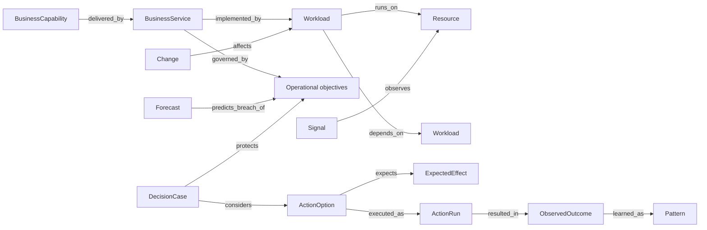

# FDAI 운영 온톨로지

이 문서는 FDAI의 15개 에이전트가 사용하는 typed operational truth infrastructure를 정의합니다.
Active control plane은 에이전트이며, 온톨로지는 target identity, dependency, objective, evidence,
허용 action, expected effect의 해석이 서로 달라지지 않도록 제한합니다. Upstream은 안정적인
cloud-operations 개념을 소유하고 deployment는 observed instance와 intent를 제공합니다.

> **Positioning:** FDAI는 agent-driven이며 ontology-driven이 아닙니다. Graph는 해석을 제한하고
> agent work를 replay 가능하게 하지만 sensing, judgment, approval, execution, recovery, learning을
> 수행하지 않습니다. 다만 graph는 필수 read path입니다. 운영 질문은 ad hoc provider query가 아니라
> ontology를 통해 object identity, relationship, evidence를 resolve하므로, 답이 의존하는 evidence는
> typed·bounded·citable 상태로 유지되고 관측하지 못한 범위까지 밝힐 수 있습니다.

> **권한 경계:** 온톨로지 graph는 공유 semantic read model이며 mutable system of record 또는
> execution surface가 아닙니다. Event, 승인된 configuration, telemetry source, append-only audit
> ledger, catalog-as-code는 각자 소유한 사실의 authority로 유지됩니다.
>
> **안전 경계:** Ontology context는 autonomy를 유지하거나 낮출 수만 있습니다. 누락되거나
> 오래되거나 충돌하거나 입증되지 않은 context는 unknown으로 남고 bounded evidence recovery,
> 더 작은 safe plan, no-op 또는 review를 유발합니다. 실행 권한을 제공하지 않습니다.
>
> **구현 상태(2026-08-08):** O1-O4는 semantic declaration, immutable context, Forseti ceiling
> wiring, decision-case selection, response closure, Muninn/Norns learning intake를 구현합니다.
> `OperatingModelProvider`는 bounded deployment instance를 project하고 context snapshot은 typed
> evidence path, revision, effective time, provenance, complete freshness receipt를 보존합니다.
> M3는 observed, derived, desired, execution lane에 immutable `StateFactMetadata`를 추가합니다.
> 선택적인 inventory link observation metadata는 ontology projection과 operational-context
> materialization을 거쳐 보존되고 snapshot identity에 반영됩니다. Evidence가 stale, incomplete,
> conflicting, synthetic, future-cutoff 또는 unverified이면 snapshot ceiling을 낮춥니다.
> Verified link는 독립적인 verifier, 신뢰된 verification method 및 immutable verification
> receipt를 요구합니다. 필수 source freshness, 신뢰된 UTC clock identity, recorded time 및
> skew 범위의 future check도 context safety와 replay identity에 반영됩니다.
> Wave 2는 secured ontology path, authoritative state fact, catalog reference 및 governed document
> excerpt를 분리된 authority lane으로 유지하는 unwired content-addressed
> `OperationalEvidenceBundle` foundation을 제공합니다. Admission에는 ontology release, catalog 및
> document revision, authenticated source, purpose, scope, redaction summary, typed temporal scope를
> 고정하는 content-addressed source receipt가 필요합니다. Deterministic claim 및 citation
> validation, exact typed-claim contradiction detection, final-body byte 및 item budget은 hold
> evidence를 출력하고 bundle의 autonomy ceiling을 유지하거나 낮출 수만 있습니다. 아직 runtime
> 또는 composition path가 이 bundle을 소비하지 않으므로 production autonomy path의 일부가 아니며
> action authority가 없습니다.
> 변경관리는 `Change`에 planned-change evidence를 추가하고, reviewed `ChangeWindow`와 target 및
> decision에서 impact, process, outcome, recovery까지 이어지는 typed link를 제공합니다. 이러한
> declaration은 semantic evidence일 뿐 승인 또는 실행 권한을 제공하지 않습니다. Huginn은 같은
> normalized Change를 causal Event와 owner topic에 포함합니다. Forseti는 bounded
> `ChangeAssessment`를 계산해 Verdict와 DecisionCase evidence에 보존하고, stale, incomplete,
> failed 또는 review-required assessment에는 사람 검토를 요구합니다. 현재 runtime에는
> graph-freshness authority가 없으므로 planned change는 이 gate를 auto-clear할 수 없습니다.
> Wave 2는 새 declaration kind를 추가하지 않고 검토된 shared Property semantics를 추가합니다.
> Catalog loader는 canonical meaning, value type, optional unit, enum 또는 range,
> normalization, authority, freshness 및 equivalent provider path를 검증합니다. Catalog
> projection은 검토된 entry에만 이러한 field를 노출하고 정확한 semantic-registry version과
> content digest를 포함합니다. Runtime projection은 file을 다시 읽지 않고 catalog load에서
> 검증된 registry를 재사용합니다. Legacy property는 계속 유효하지만 normalized equivalence를
> 주장할 수 없습니다.
> M5는 catalog에 선언된 `routes_to` 및 `peered_with` Resource link를 inventory projection에
> 추가하고 read-only deterministic `query.network_path_segments` function foundation을 제공합니다.
> Function은 injected verifier가 contextual invocation 및 composition 소유의 opaque trust context에
> 대해 role, purpose, exact release 및 projected-result digest를 인증한 뒤에만 bounded 및
> purpose-bound query result를 사용합니다. Production issuer가 없으므로 foundation은 unwired 상태로
> 유지되고 self-minted receipt는 차단됩니다. Evaluation time은 trusted receipt cutoff와 정확히
> 같으며, future effective, evidence 또는 recorded time과 unbounded freshness는 unverified로
> 남습니다. Stored edge direction을 보존하고 symmetric peering segment 하나에 방향별로 구분된
> observation 및 verification receipt lineage를 가진 directed record 두 개를 요구합니다. 누락된
> endpoint, incomplete query 또는 없는 path는 traffic이 흐르지 않는다는 결론이 아니라 unknown으로
> 유지됩니다. Inventory projection은 observed resource와 endpoint type이 충돌하면 차단합니다.
> Function은 source-derived artifact digest를 사용하고 exact-release invocation receipt를 emit하며
> provider I/O 또는 execution authority가 없습니다.

## 카탈로그 semantic projection

규칙 카탈로그는 이제 작성된 Rego를 1급 `PolicyArtifact`로 모델링합니다. 제공되는 모든 Rule은
구체적인 `SignalType`과 canonical `Property` 참조를 사용하고, `implemented_by_policy`는 Rule을
deterministic 정책에 연결합니다. `scripts/catalog/sync-rule-semantics.py`는 OPA로 Rego를 구문
분석하고 package metadata를 검증하며 정책의 속성 읽기와 Rule metadata 사이의 drift를 차단합니다.

검토된 하나의 구성 baseline SignalType이 일치하지 않는 원시 이벤트 형식을 처리합니다. 따라서
wildcard 온톨로지 링크 없이 deterministic T0 범위를 보존합니다. 이러한 카탈로그 선언은 의미만
설명하며 현재 provider 상태를 주장하거나 실행 권한을 부여하지 않습니다.

Catalog-owned `Property` ObjectType은 rule property reference를 위한 meta object로 유지됩니다.
`rule-catalog/vocabulary/property-semantics.yaml`은 선택된 Property instance에 검토된 semantics를
data로 추가합니다. 각 entry는 canonical `semantic_id`, `PropertyType`, optional canonical unit,
enum 또는 numeric range, normalization rule identifier, authority와 freshness policy 및 equivalent
provider path를 선언합니다. Provider-specific path는 이 vocabulary에 data로 남으며 core code의
provider branch가 되지 않습니다.

Loader는 충돌을 확인하기 전에 unit과 provider identity path를 normalize하고 enum value를
normalize, deduplicate 및 order합니다. String case folding 후에는 NFC normalization을 적용합니다.
Decimal value는 context-independent canonicalization을 사용하고 input, coefficient, exponent 및
output size를 제한합니다. Range check는 rendering 전에 exact parsed value를 비교합니다. YAML
numeric range bound는 작성된 scalar lexeme에서 Pydantic validation 전에 `Decimal`로 parse되고,
content digest에서는 canonical decimal string으로 serialize되며 binary floating point를 거치지
않습니다. 수학적으로 integral인 finite JSON number는 유효한 integer bound입니다. Datetime은
앞뒤 whitespace를 거부하고 RFC 3339 `T` separator, 명시적 timezone, 지원 datetime range 안의 UTC
conversion 및 최대 6자리 fractional digit를 요구합니다. Boolean은 integer 또는 number로 허용되지
않습니다. Bounded canonical JSON 지원 전까지 object 및 array Property semantics는 차단됩니다.

모든 registry는 version과 provenance envelope를 요구하며, SHA-256은 provenance envelope 자체를
제외한 canonical content를 포함합니다. 모든 semantic은 authenticated source identity를 요구하고
freshness에는 finite positive upper bound가 있습니다. Catalog projection은 검토된 각 Property에
검증된 registry version과 digest를 고정합니다. Registry file이 없으면 catalog loading과 runtime
projection이 하나의 stable legacy empty registry를 사용합니다. 검토된 metadata가 없는 Property는
legacy projection field를 유지하고 `normalized_equivalence`를 생략합니다. Caller는 이 registry를
통해 해당 Property의 equivalence를 추론하거나 값을 normalize할 수 없습니다.

### 진단 지식 projection

SREGym absorption ledger는 검토된 진단 mechanism 61개를 `DiagnosticMechanism`으로
projection합니다. 독립된 validation axis 7개는 content-addressed `BenchmarkValidation` receipt
427개를 생성합니다. 각 receipt는 source revision, 결과, validation kind, 사용 가능한 evidence
summary 및 canonical digest를 보존합니다. Catalog refresh는 이전 validation history를 덮어쓰지
않고 새 receipt를 추가하며, rejected mechanism은 명시적인 negative knowledge로 유지됩니다.

Live Kubernetes evaluation은 control-loop judgment 전에 `DiagnosticEvidence`와 hold-only
`DiagnosticFinding` object를 projection합니다. 각 finding은 exact `derive` function release,
Heimdall caller, canonical input/output digest 및 content-addressed invocation identity에
연결됩니다. Current topology는 선택된 kubeconfig API server와 certificate authority에서 파생한
cluster-scoped resource identity를 사용합니다. Complete observation은 current relationship을
교체하고, incomplete observation은 resource object를 삭제하지 않으면서 지원되지 않는
relationship을 철회하며, unavailable inventory는 기존 projection을 유지합니다. 이러한 object는
action, approval, promotion 또는 execution authority를 부여하지 않습니다.

### Pod telemetry 역량 foundation

M5는 Kubernetes Pod, Service, Endpoints instance에 `Resource`를 재사용하고 bounded metric sample에
`Observation`을 재사용합니다. 물리 `observation_targets_resource` LinkType은
`Observation -> Resource`를 기록합니다. 기존 `kubernetes_selects` 및
`kubernetes_exposes_endpoints` link가 Pod, Service, Endpoints topology를 구성합니다.
`TelemetryChain` ObjectType은 추가하지 않습니다.

Read-only evaluator는 purpose 범위가 지정된 secured ObjectSet result 하나와 각 relationship 및
sample의 immutable `StateFactMetadata`를 사용합니다. 각 필수 segment를 evidence reference 및 정확한
completeness fraction과 함께 `verified`, `unverified`, `stale`, `missing`으로 보고합니다. Secured graph
receipt가 complete coverage를 입증할 때만 누락 relation을 `missing`으로 보고합니다. Truncated graph,
cycle, ambiguous path, synthetic sample, partial state, conflict, stale sample, wrong-cluster identity는
unverified 또는 missing으로 유지됩니다. Result는 항상 `claimed_health: false`와
`execution_authority: false`를 기록합니다.

이 slice는 platform foundation일 뿐입니다. Runtime FunctionType을 등록하거나 Kubernetes 또는
provider adapter를 호출하지 않으며, Finding 또는 Forecast object를 join하지 않고 composition이나
authority-bearing decision path를 변경하지 않습니다.

## 한눈에 보는 설계

운영 온톨로지는 현재 resource 중심 graph가 하나의 deterministic path로 답하지 못하는 네 가지
질문을 연결합니다. 무엇을 운영하는지, 좋은 상태가 무엇인지, 지금 무엇이 일어나거나 앞으로
일어날 수 있는지, intervention이 의도한 효과를 냈는지를 연결합니다. Reliability, architecture
review, predictive cost governance, operational learning이 같은 언어를 사용합니다.

## 도메인 관점

FDAI는 domain-agnostic하지 않습니다. 안정적인 domain model을 가진 cloud operations control
plane입니다. 경계는 다음과 같습니다.

| 경계 | Upstream 관점 |
|------|---------------|
| Cloud operations 의미 | Deployment 간에 특화되고 안정적으로 유지합니다. |
| Cloud provider | Neutral contract를 유지하고 Azure를 구현 provider로 사용합니다. |
| Customer organization | Generic type과 link만 포함하고 customer instance나 value를 포함하지 않습니다. |
| Business semantics | 안정적인 개념은 upstream에 두고 deployment별 mapping과 value는 downstream에 둡니다. |
| Autonomy | Graph 외부의 policy, risk, approval, execution, audit contract가 통제합니다. |

이 구분은 두 가지 실패를 방지합니다. Provider-specific model은 모든 운영 개념을 Azure resource
property로 만듭니다. 완전히 domain-agnostic한 model은 service, reliability, cost, architecture
의미를 에이전트가 안정적으로 공유할 수 없는 untyped property bag으로 밀어냅니다.

## 의미 계층

### 운영 범위

다음 object는 무엇을 운영하고 왜 중요한지 설명합니다.

| ObjectType | 목적 |
|------------|------|
| `BusinessCapability` | 하나 이상의 service가 제공하는 generic business outcome입니다. |
| `BusinessService` | Ownership, criticality, objective, impact에 사용하는 안정적인 service identity입니다. |
| `Workload` | Service를 구현하는 deployable 또는 operable unit입니다. |
| `Resource` | 기존 ontology에서 유지하는 관측된 cloud resource입니다. |
| `Environment` | Production 또는 non-production과 같은 governed lifecycle scope입니다. |

초기 SRE deployment에서는 `BusinessCapability`를 선택적으로 사용할 수 있습니다.
`BusinessService`, `Workload`, resource mapping은 최소 operational spine을 구성합니다. Mapping되지
않은 resource는 `unknown_service`로 계속 표시하며 synthetic service에 자동 할당하지 않습니다.

### 운영 의도

다음 object는 FDAI가 보존해야 하는 조건을 정의합니다.

| ObjectType | 목적 |
|------------|------|
| `ServiceObjective` | SLI와 window가 있는 availability, latency, correctness, freshness target입니다. |
| `RecoveryObjective` | Service 또는 workload의 RTO 및 RPO target입니다. |
| `CostObjective` | Currency와 period가 있는 budget, run-rate, unit-cost, variance target입니다. |
| `ArchitectureConstraint` | ARB와 change assurance가 사용하는 reviewed architecture condition입니다. |
| `Ownership` | 책임 운영 owner와 escalation reference입니다. |
| `ChangeWindow` | Bounded scope에 적용하는 reviewed maintenance, freeze, quiet, emergency interval입니다. |

Objective는 free-form metric label이 아닙니다. Kind, unit, target 또는 range, measurement source,
scope, owner, effective interval, evidence freshness policy를 기록합니다.

### 운영 현실

기존 `Signal`, `Finding`, `Incident` object를 유지합니다. 공유 model은 finding의 열린 `context`
bag에만 정보를 두는 대신 명시적인 time 및 prediction 개념을 추가합니다.

| ObjectType | 목적 |
|------------|------|
| `Observation` | Event-time cutoff의 정규화된 측정 value와 evidence reference입니다. |
| `Change` | Intent, desired-state evidence, affected scope, provenance가 있는 planned, proposed, active, drift-observed, completed change입니다. |
| `Forecast` | Horizon, interval, confidence, feature cutoff가 있는 versioned projection입니다. |
| `Experiment` | 관측 episode에 intervention을 줄 수 있는 범위 제한 chaos 또는 validation activity입니다. |

### 결정과 학습

다음 object는 model prose를 authority로 취급하지 않고 전체 intervention trace를 query할 수 있게
합니다.

| ObjectType | 목적 |
|------------|------|
| `DecisionCase` | Objective, constraint, evidence, no-action baseline이 있는 immutable decision context입니다. |
| `ActionOption` | Hold 또는 no-op option을 포함하는 하나의 검토 response입니다. |
| `ExpectedEffect` | Predicted metric range, observation window, uncertainty, predictor version입니다. |
| `ActionRun` | 기존 execution identity와 terminal receipt입니다. |
| `ObservedOutcome` | 관측된 effect, rollback, SLO recovery, recurrence, scoring status입니다. |
| `Pattern` | Balanced case cohort가 뒷받침하는 reviewed generic mechanism입니다. |

`DecisionCase`는 RiskGate decision 또는 audit record를 대체하지 않습니다. Forseti, Odin, Var,
Saga, replay consumer가 같은 사실을 참조하게 하는 immutable semantic input입니다.

## 관계 계약

초기 relationship set은 작고 query-driven하게 유지하는 것이 좋습니다.

| LinkType | Endpoint | 의미 |
|----------|----------|------|
| `delivered_by` | BusinessCapability -> BusinessService | Capability를 제공하는 service입니다. |
| `implemented_by` | BusinessService -> Workload | Service를 구현하는 workload입니다. |
| `runs_on` | Workload -> Resource | Resource ownership을 바꾸지 않는 runtime placement입니다. |
| `depends_on` | Workload/Resource -> Workload/Resource | 올바른 운영에 필요한 dependency입니다. |
| `contains` | Resource -> Resource | 포함 parent에서 포함된 child로 향하며 traversal은 stored ownership을 뒤집지 않습니다. |
| `attached_to` | Resource -> Resource | Attached resource에서 anchor로 향하며 query는 storage를 다시 쓰지 않고 inverse를 traverse할 수 있습니다. |
| `routes_to` | Resource -> Resource | 관측된 forwarding 또는 next-hop의 directed reference이며 absence는 reachability를 입증하지 않습니다. |
| `peered_with` | Resource -> Resource | Independently supported directed record 두 개로 표현하는 symmetric peer입니다. |
| `governed_by` | Service/Workload -> Objective/Constraint | Target에 적용하는 intent입니다. |
| `owned_by` | Service/Workload/Objective -> Ownership | 책임 운영 owner입니다. |
| `observes` | Observation/Signal -> Service/Workload/Resource | 측정 evidence의 target입니다. |
| `observation_targets_resource` | Observation -> Resource | Bounded telemetry verification에 사용하는 물리 measured-evidence target입니다. |
| `affects` | Change/Incident/Experiment -> Service/Workload/Resource | Episode가 영향을 주는 scope입니다. |
| `predicts_breach_of` | Forecast -> Objective | 선언된 horizon 안에서 위험한 objective입니다. |
| `considers` | DecisionCase -> ActionOption | 함께 평가한 bounded alternative입니다. |
| `protects` | DecisionCase/ActionOption -> Objective | Decision이 보존하려는 objective입니다. |
| `expects` | ActionOption -> ExpectedEffect | 실행 전 predicted effect입니다. |
| `executed_as` | ActionOption -> ActionRun | 선택된 option의 governed execution입니다. |
| `resulted_in` | ActionRun -> ObservedOutcome | Independent effect closure입니다. |
| `learned_as` | ObservedOutcome -> Pattern | Reviewed learning projection이며 direct promotion이 아닙니다. |
| `change_targets_resource` | Change -> Resource | Change가 직접 대상으로 하는 managed resource입니다. |
| `case_evaluates_change` | DecisionCase -> Change | Change revision을 평가하는 immutable decision context입니다. |
| `change_instantiates_process` | Change -> Process | Multi-step change를 기록하는 durable Workflow journal입니다. |
| `change_bounded_by_envelope` | Change -> ImpactEnvelope | 실행 권한을 제공하지 않는 approved impact upper bound입니다. |
| `change_scheduled_in_window` | Change -> ChangeWindow | 적용되는 maintenance, freeze, quiet, emergency window입니다. |
| `change_conflicts_with_change` | Change -> Change | Target, objective 또는 effective time이 겹치는 conflict입니다. |
| `change_resulted_in_outcome` | Change -> ObservedOutcome | 독립적인 post-change effect closure입니다. |
| `change_recovered_by_plan` | Change -> RecoveryPlan | 준비하거나 적용한 version-pinned recovery path입니다. |

Cardinality, causal direction, temporal ordering, allowed endpoint combination은 각 LinkType
declaration에 둡니다. 필수 competency question을 지원하지 못하는 relation은 visualization만을
위해 추가하지 않는 것이 좋습니다.

현재 LinkType schema는 declaration마다 source 및 target type을 하나씩 사용합니다. 따라서 union
관계는 `workload_runs_on`, `workload_depends_on`, `service_has_service_objective`,
`service_has_recovery_objective`, `service_has_cost_objective`,
`service_has_architecture_constraint`, `service_owned_by`, `workload_owned_by`,
`objective_owned_by`와 같은 명시적인 물리 이름으로 compile합니다. Endpoint validation은
deterministic하게 유지됩니다.

## Identity와 시간

운영 의미는 시간에 따라 변합니다. Decision-critical object는 사실이 유효하거나 관측된 시간과
FDAI가 기록한 시간을 모두 포함합니다.

- **Stable identity:** Service 및 workload id는 resource replacement와 deployment를 지나도 유지됩니다.
- **Effective time:** Objective, ownership, budget, constraint는 `effective_from`과 선택적인
  `effective_to`를 포함합니다.
- **Event time:** Observation, change, forecast, incident, outcome은 source time과 evidence cutoff를 포함합니다.
- **Recorded time:** 모든 projection은 FDAI가 수락한 시간과 source revision을 기록합니다.
- **Immutable decision context:** 늦게 도착한 사실은 과거 decision이 사용한 context를 다시 쓰지
  않습니다. Decision context는 content-addressed이며 자신의 cutoff에 pin되므로, 이후 observation은
  기록된 context를 수정하지 않고 새 context를 만듭니다.
- **Current-state instance store:** Instance graph는 subgraph별 단일 writer 아래에서 현재 observed
  state를 보관합니다. Bitemporal store가 아닙니다. Update는 이전 property 값을 대체하고, 사라진
  object는 소유 projection이 삭제합니다. 과거 instance 값은 instance graph가 아니라 그것을 만든
  authoritative source generation에 남습니다.
- **Freshness:** 모든 decision context는 source별 freshness를 기록합니다. 하나의 fresh source가
  오래된 objective, topology edge, cost observation을 숨길 수 없습니다.

Decision-relevant state fact는 authority가 분리된 `observed`, `derived`, `desired`, `execution`의 네
lane에서 하나의 immutable metadata shape을 사용합니다. Metadata는 authority class, source identity와
revision, effective time과 recorded time, evidence cutoff, freshness ceiling, completeness,
synthetic status, conflict, immutable evidence reference를 pin합니다. Lane-authority validation은
provider observation이 derived fact로 decode되거나 그 반대가 되는 것을 방지합니다. Inventory
link도 같은 state-fact envelope와 independent verification identity를 포함할 수 있습니다. Metadata가
새 verified link는 신뢰된 verification method와 immutable receipt도 포함하며 verifier identity는
observation source와 달라야 합니다. Metadata가 없는 legacy link는 additive adoption 기간에도
valid하고 verification을 주장하지 않습니다. 해당 metadata가 없다는 사실은 query profile이 verified
link를 명시적으로 요구할 때만 authority를 낮춥니다.

Replay는 instance graph의 임의 과거 상태가 아니라 pin된 catalog release와 보존된 decision context를
resolve합니다. Context identity 재계산은 동등성을 증명하며, 원본 내용을 복원하려면 그 context가
보존되어 있어야 합니다. Current-state query는 freshness check를 통과한 최신 valid revision을
사용합니다.

## 사실의 권위 원천

Ontology는 독립적인 authority를 하나의 mutable graph로 합치지 않습니다.

실행 권한 부여는 capability, requirement, policy assignment, execution profile, provider
mapping, observation, grant 및 decision object를 semantic graph에 추가합니다. 이러한 object는
decision을 설명하고 replay할 수 있게 하지만 graph 자체는 접근 권한을 부여하지 않습니다. Scoped
policy, deployment identity binding, provider evidence 및 risk gate는 독립 authority로 유지됩니다.
[실행 권한 부여 온톨로지](../decisioning/execution-authorization-ontology-ko.md)를 참조하세요.

| 사실 | Authority | Ontology 역할 |
|------|-----------|---------------|
| Type, link, action, rule definition | Git catalog-as-code | Versioned schema와 meaning입니다. |
| Service 및 workload mapping | Deployment service catalog 또는 approved manifest | Provenance가 있는 runtime projection입니다. |
| Resource topology | Injected `Inventory` provider | Fresh resource 및 dependency projection입니다. |
| Objective, budget, constraint, ownership | Approved system과 fork configuration | Effective-time intent projection입니다. |
| Telemetry 및 cost observation | Configured evidence provider | Source ref가 있는 event-time observation입니다. |
| Decision, approval, action, rollback | Append-only audit와 Process journal | Immutable semantic link입니다. |
| Case 및 pattern | Case history와 reviewed catalog | Learning projection과 governed reuse입니다. |

각 ObjectType은 하나의 owning agent, 하나의 authority class, freshness policy, retention, allowed
purpose를 선언합니다. 충돌하는 source는 명시적인 conflict 또는 `unknown` state를 만들고 autonomy를
낮춥니다.

## 에이전트 소유권

Ontology는 중앙 coordinator를 추가하지 않고 고정된 pantheon을 더 유능하게 만듭니다.

| Agent | 소유 semantic write |
|-------|---------------------|
| Huginn | Normalized observation과 discovered topology change event입니다. |
| Heimdall | Finding, forecast, independent effect observation입니다. |
| Njord | Cost observation, cost forecast, cost objective status입니다. |
| Freyr | Demand, capacity forecast, sizing option입니다. |
| Loki | Experiment와 resilience evidence입니다. |
| Forseti | Decision case와 governed decision입니다. |
| Odin | Cross-objective arbitration decision과 score breakdown입니다. |
| Var | Independent approval record입니다. |
| Thor | Action run과 attempt입니다. |
| Vidar | Rollback 및 recovery outcome입니다. |
| Saga | Audit evidence와 immutable correlation link입니다. |
| Muninn | Time-consistent context snapshot과 case revision입니다. |
| Norns | Pattern과 inert candidate입니다. |
| Mimir | Reviewed ontology, rule, action catalog lifecycle입니다. |
| Bragi | Decision write가 없으며 cited projection을 localized explanation으로만 표현합니다. |

에이전트는 typed event로 협업합니다. 다른 에이전트의 object를 mutate하거나 직접 호출하거나 mutable
workflow state를 공유하지 않습니다.

## 운영 context와 결정

Muninn은 각 decision cutoff에 immutable `OperationalContextSnapshot`을 materialize합니다. 새로운
authority가 아니라 projection contract입니다. 최소한 다음을 포함합니다.

- Target service, workload, resource, environment, dependency neighborhood;
- active service, recovery, cost, architecture objective;
- ownership 및 escalation reference;
- active change, experiment, incident, maintenance window;
- current observation과 bounded forecast;
- source freshness, provenance, unresolved conflict, catalog version.

Snapshot은 데이터 표면을 넓히지 않으면서 replay lineage를 보존합니다. 도달 가능한 각 context
object에 대해 object id, type, revision, effective interval, allowlist에 포함된 provenance ref,
target resource에서 시작하는 하나의 결정론적 최단 typed path를 기록합니다. 각 source의
observation time과 허용된 maximum age도 유지합니다. Snapshot identity는 이러한 revision, path,
effective interval, provenance ref, freshness receipt, stale-source 결과, conflict를 포함하므로
topology, revision, validity, provenance 또는 freshness가 바뀌면 이전 identity를 재사용할 수
없습니다. Raw object property는 권위 있는 provider에 남으며 snapshot에 복사하지 않습니다.
Snapshot time은 canonical UTC로 normalize합니다. Identity에는 신뢰된 recorded time, trusted clock
identity, query가 verified link를 요구했는지도 포함합니다. Historical replay는 새 wall clock을
sampling하지 않고 보존된 recorded time을 제공합니다.

Typed link observation metadata는 raw link property를 버리는 규칙의 예외입니다. Materializer는 각
evidence link에서 canonical verification envelope만 보존하고 link와 path identity에 해당 envelope를
포함합니다. Stale, incomplete, conflicting, synthetic, after-cutoff 또는 unverified link는 명시적인
context conflict를 추가하고 snapshot ceiling을 `SHADOW_ONLY`로 낮출 수만 있습니다. Healthy
metadata는 ceiling을 높이지 않으며, metadata가 없으면 verification을 주장하지 않고 legacy decoding을
유지합니다. 다만 query profile이 verified link를 요구하면 authority를 낮춥니다. 도달 가능한 object가
freshness policy를 선언하면 일치하는 source-freshness receipt가 필요하며, receipt가 없으면 ceiling을
`SHADOW_ONLY`로 낮춥니다. Decision cutoff 또는 evidence timestamp가 신뢰된 recorded time과 설정된
clock-skew allowance의 합을 넘는 경우에도 ceiling을 낮춥니다.

Materialization은 `effective_from <= cutoff`이고 `effective_to`가 없거나
`cutoff < effective_to`인 object만 포함합니다. 이 half-open interval 밖의 object는 replay를 위한
typed temporal exclusion으로 보존하지만 현재 decision fact로 사용하지 않습니다.
`context_temporal_exclusion`은 autonomy ceiling을 `SHADOW_ONLY`로 낮추므로 만료되거나 미래의
mapping이 자동 실행 권한을 유지할 수 없습니다. Provenance allowlist는 `source_ref`,
`measurement_source_ref`, `expression_ref`로 제한합니다.

범위가 제한된 traversal이 node limit에 도달하면 근거가 불완전한 상태입니다. Materialization은
`context_graph_truncated`를 conflict로 기록하고 autonomy ceiling을 `SHADOW_ONLY`로 낮춥니다. 일부
graph만으로 자동 실행 권한을 유지하지 않습니다.

`OperationalEvidenceBundle` foundation은 authority를 하나로 flatten하지 않고 graph 및 document
evidence를 결합할 수 있습니다. Runtime composition, Forseti decision-case construction 또는
production prompt path에는 연결되어 있지 않습니다. Production autonomy는 기존 operational-context
snapshot과 일반 policy, risk, approval, execution, audit gate를 계속 사용합니다. 네 개의 immutable
lane은 verified source receipt를 독립적으로 보존합니다.

- **Ontology evidence:** Operational graph에서 가져온 secured typed fact와 closed, acyclic
  deterministic path입니다. Secured ObjectSet snapshot receipt가 권장 입력이며, 모든 nested link의
  verification, freshness, completeness, conflict 및 synthetic 상태를 검사합니다.
- **State evidence:** 원래의 observed, derived, desired 또는 execution `StateFactMetadata`입니다.
- **Catalog evidence:** Reviewed catalog-as-code의 exact rule 또는 catalog reference입니다.
- **Document evidence:** Instruction authority 없이 untrusted data로 저장되는 governed excerpt입니다.

Admission 전에 각 lane item은 evidence ref와 exact lane content를 포함하되 digest cycle을 피하기 위해
source envelope를 제외한 canonical payload를 가집니다. Verified source receipt는 이 payload digest,
lane 및 source가 제공한 canonical membership 또는 inclusion evidence를 결합합니다. Admission은
digest를 다시 계산하며 같은 receipt 아래에서 excerpt, graph path 또는 state fact가 바뀌면
거부합니다. Injected receipt validator는 receipt, lane, item digest, canonical payload 및 lane별
membership evidence를 받으므로 receipt reference만 확인하지 않고 source inclusion proof를 검증할 수
있습니다. State evidence에서는 freshness ceiling, completeness, synthetic status 및 conflict가
`StateFactMetadata`와 정확히 일치해야 하며, bundle은 hold를 도출할 때 이 metadata field를 직접
평가합니다.

각 exact claim은 canonical JSON, subject, predicate, typed effective/evidence/recorded scope 및
evidence ref, item digest, source revision을 포함하는 citation binding을 저장합니다. Citation
manifest는 포함된 evidence에서만 파생되므로 누락, fabricated 또는 revision mismatch citation은
명시적인 missing path와 hold를 생성합니다. Duplicate claim은 거부합니다. Contradiction detection은
subject, predicate, effective interval 및 evidence cutoff가 같은 claim을 비교하고 canonical typed
value가 다를 때만 conflict를 보고합니다. Recorded time은 각 immutable claim identity에 남지만
contradiction group을 분리하지 않으며 supersession을 암시하지 않습니다. Foundation에는 암시적인
latest-wins rule이 없습니다. 향후 supersession policy에는 명시적으로 reviewed된 claim relationship이
필요합니다. Detector는 prose에서 semantic disagreement를 추론하지 않습니다. Candidate 및
diagnostic count와 field length에는 bound가 있고 nested sequence는 immutable tuple로 copy됩니다.
`max_bytes`는 manifest, omission, conflict 및 hold data를 포함한 최종 canonical body에 적용됩니다.
Stale, incomplete, conflicting, synthetic, after-cutoff, trusted recorded time 이후, uncited 또는
truncated evidence는 결과를 `SHADOW_ONLY`로 낮춥니다. Healthy evidence는 caller의 input ceiling을
높이지 않습니다. Document prompt rendering은 excerpt를 escaped, delimited JSON data block에만
배치합니다. 이러한 test는 safe foundation을 입증하지만 production wiring은 입증하지 않습니다.
Bundle은 read-only evidence이며 approval 또는 action authority를 부여하지 않습니다.

Forseti는 snapshot에서 `DecisionCase`를 만듭니다. 각 case는 no-action baseline, bounded option,
expected effect, protected objective, violated constraint, uncertainty, evidence reference를 포함합니다.
Odin은 eligible option이 objective 사이에서 충돌할 때만 중재합니다. 사람 승인이 필요하면 Var가 같은
case를 받고, Saga는 replay를 위해 digest를 기록합니다.

Production startup은 provider boundary를 통해 `FDAI_OPERATING_MODEL_PATH`를 읽고, 전체 object/link
snapshot을 검증한 뒤 provider-owned subgraph를 atomically replace합니다. `applying` manifest는 stale
deletion과 crash recovery를 위해 이전 및 현재 owned identity의 union을 보존합니다. Replacement가
성공하면 `projected` manifest는 current ownership으로 compact되므로 historical revision이 configured
model bound를 초과하지 않습니다. Startup은 다른 snapshot을 stage하기 전에 중단된 `applying` union을
정리하므로 반복 crash가 revision 사이의 ownership을 누적하지 않습니다. 선택적
`FDAI_OPERATING_MODEL_MAX_BYTES` ceiling의 기본값은 16 MiB입니다. `GET /ontology/graph`는 projection
status, source revision, aggregate count만 노출하며 deployment instance property는 반환하지 않습니다.

Promoted inventory projection은 graph projection 전에 모든 resource 및 link record를 검증합니다.
Malformed identity, property 또는 observation timestamp는 attempt를 실패시키며, 충돌하는 duplicate
link는 complete absence로 해석하지 않고 reject합니다. Promoted observation accumulation이
incomplete이면 runtime은 기존 graph와 ownership manifest를 유지하고 새 attempt를 `unavailable`로
기록합니다. Complete projection만 owned resource subgraph를 교체할 수 있습니다.

Cost 및 capacity specialist의 event-time은 advice와 함께 전달됩니다. Forseti는 하나의
time-consistent snapshot을 materialize하고 공유 case를 만들어 arbitration request에 포함합니다.
Odin이 resolve한 선택은 Forseti verdict로 돌아오고, Thor의 durable `ActionRun`과 Var의 HIL ticket은
bounded baseline, option effect, constraint, evidence를 보존합니다. Thor는 verdict action이 selected
option과 정확히 일치하는지 확인합니다. Case evidence가 없거나 malformed 또는 mismatched이면 승인이나
실행 authority를 만들지 않고 deny합니다.

## 지속 운영 루프

"살아있는 에이전트"는 effect를 닫는 event-driven 및 time-driven control loop를 의미합니다. LLM이
계속 실행되거나 암묵적 authority를 얻는다는 뜻이 아닙니다.

### Reliability loop

`Observation -> Finding/Forecast -> DecisionCase -> ActionRun -> ObservedOutcome -> objective`

이 loop는 개별 resource utilization이 아니라 service objective와 error-budget risk를 우선합니다.

### Architecture review loop

`Change -> graph diff -> ChangeWindow/Constraint/Objective evaluation -> DecisionCase -> ImpactEnvelope -> approval -> Process/ActionRun -> ObservedOutcome/RecoveryPlan`

Assurance Twin은 proposed graph를 read-only branch로 simulation합니다. Review는 change를 approve,
condition, reject, hold할 수 있지만 `ActionType`을 활성화하거나 execution check를 우회할 수 없습니다.
`Workflow`와 durable `Process`는 multi-step work를 기록합니다. 각 mutation step은 여전히 typed
ActionType, risk, approval, Thor execution, Heimdall verification, Vidar recovery 경계에 다시 진입합니다.

### Predictive cost loop

`Cost observation -> CostObjective/Forecast -> options -> reliability guard -> outcome settlement`

Cost optimization은 선택한 option이 service 및 recovery objective를 보존할 때만 유효합니다. Estimated
savings는 observed outcome이 settlement window를 닫기 전까지 prediction으로 유지됩니다.

### Outcome learning 루프

Huginn은 bounded `case_history.operational_case.v1` event를 정규화합니다. Muninn은 O1
case-history materializer를 요구하고 strict input을 seal한 뒤 failure fingerprint별 immutable case를
최대 100개 durable하게 보존하여 `operational_case_fingerprint_cohort` context를 publish합니다.
Norns는 하나의 failure fingerprint와 ActionType, 최소 하나의 verified reusable success, 최소 하나의
failure, refusal, no-op, rollback 또는 recurrence control을 요구한 뒤 기존 consensus 및 rate limit
경로로 inert candidate를 emit합니다. 모든 candidate는 case id, revision, manifest digest, resource
type, fingerprint, outcome별 count, digest evidence를 인용합니다. Raw
`measurement.action_outcome.v1`은 mechanism evidence가 부족한 telemetry로 유지되며 promotable
cohort에 들어갈 수 없습니다.

## 확장 모델

Ontology는 통제된 네 계층으로 성장합니다.

1. **Operating kernel:** 모든 deployment가 공유하는 upstream ObjectType 및 LinkType입니다.
2. **Vertical pack:** Upstream reliability, architecture review, cost-governance profile입니다.
3. **Fork extension:** Kernel을 따르는 reviewed industry 또는 organization-specific type, link,
   objective, adapter입니다.
4. **Deployment instance:** Upstream source control 외부에 유지하는 customer service mapping,
   objective, budget, owner, resource, evidence입니다.

Extension은 meaning을 추가할 수 있지만 kernel identity를 다시 정의하거나 cardinality를 약화하거나
owning agent를 교체하거나 autonomy를 높일 수 없습니다. Unknown observed type은 self-register하지 않고
governed proposal을 엽니다. Breaking schema change는 semantic versioning, migration fixture,
deprecation window, replay test를 사용합니다.

## 역량 질문

Ontology 품질은 object 수가 아니라 deterministic question으로 측정합니다. Version 1은 evidence와
명시적인 unknown을 사용하여 다음 질문에 답하는 것이 좋습니다.

1. 이 resource change가 어떤 business service와 objective에 영향을 줄 수 있습니까?
2. 설정된 horizon 안에 어떤 service가 objective를 위반할 수 있으며 그 이유는 무엇입니까?
3. 어떤 active change 또는 experiment가 현재 service degradation을 설명할 수 있습니까?
4. Cost envelope 안에서 reliability 및 recovery objective를 보존하는 response option은 무엇입니까?
5. FDAI가 아무 action도 취하지 않으면 어떻게 됩니까?
6. Odin이 한 objective를 선호한 이유와 alternative와의 차이는 얼마입니까?
7. 선택한 action이 guard metric regression 없이 expected effect를 냈습니까?
8. 현재 topology, objective, policy version에서 이전 case를 계속 재사용할 수 있습니까?
9. 두 resource를 연결하는 evidence-backed network segment는 무엇이며 어느 segment가 stale,
   unverified, missing, cyclic 또는 query bound 밖에 있습니까?
10. 누락 sample에서 health를 추론하지 않으면서 Pod의 Service, Endpoints 및 Observation evidence
  경로가 complete하고 current한지 확인할 수 있습니까?

각 질문은 positive, negative, stale, conflicting, unknown case를 가진 versioned query fixture가 됩니다.
새 type 또는 link는 실패하는 fixture로 필요성을 입증한 후 regression으로 유지합니다.

## 제공 계획

| Wave | Deliverable | 종료 기준 |
|------|-------------|-----------|
| O0 - Constitution | 이 authority, competency fixture, identity/time rule, ownership matrix입니다. | Schema work 전에 term, authority, unknown handling, extension boundary 검토가 합의됩니다. |
| O1 - Semantic spine | 구현됨: catalog declaration과 deterministic query fixture입니다. | Catalog-owned runtime writer 없이 loader, provenance, cardinality, versioning, query test가 통과합니다. |
| O2 - Context projection | 구현됨: immutable `OperationalContextSnapshot`, materializer, runtime store 공유, Forseti ceiling입니다. | Fresh context는 authority를 유지하고 stale, conflicting, unmapped context는 auto를 사람 승인으로 낮춥니다. |
| O3 - Reliability loop | Core 구현됨: objective-aware decision case, option selection, `ResponseOutcome` closure입니다. | Frozen test가 service -> objective -> option -> action -> effect를 하나의 correlation으로 통과합니다. |
| O4 - ARB 및 cost loop | Core 구현됨: architecture-constraint exclusion, typed change lifecycle declaration, protected-objective cost tradeoff입니다. | Change 및 cost option은 protected reliability objective를 희생하거나 graph에서 authority를 얻을 수 없습니다. |
| O5 - Governed learning | Operational-learning O2까지 구현됨: strict Huginn case event, Muninn fingerprint cohort, balanced inert Norns candidate입니다. Mimir catalog behavior는 변경하지 않았습니다. | Success-only 및 raw-response cohort를 보류하고 candidate가 immutable revision을 인용하며 outcome은 live catalog declaration을 직접 수정하지 않습니다. |

O0 이후 첫 code slice는 semantic-spine declaration, link constraint, query fixture만 추가하는 것이
좋습니다. Runtime writer, decision 변경, execution behavior는 이후 별도로 검증하는 slice에 둡니다.

## 검증 매트릭스

| 항목 | 필요한 증명 |
|------|-------------|
| 의미 | Decision-critical field가 typed되거나 typed objective를 참조하며 open bag이 authority가 아닙니다. |
| Provenance | 모든 instance가 source, revision, effective/event time, recorded time, freshness를 명시합니다. |
| Unknown safety | 누락 mapping, stale topology, conflicting objective가 autonomy를 낮추고 계속 표시됩니다. |
| Ownership | 각 object에 하나의 owning agent가 있고 cross-agent collaboration이 typed event를 사용합니다. |
| Replay | Historical decision이 같은 snapshot, version, option, score breakdown을 resolve합니다. |
| Effect closure | 실행된 option이 scored 또는 명시적으로 unscorable한 outcome에 도달합니다. |
| Extension safety | Fork addition이 kernel semantics를 다시 정의하거나 execution authority를 높일 수 없습니다. |
| Customer isolation | Upstream fixture는 synthetic value를 사용하고 deployment instance를 포함하지 않습니다. |
| Network evidence | 모든 segment가 stored direction과 evidence state를 보존하며 unilateral peering, missing endpoint, cycle, traversal limit가 reachability claim으로 바뀌지 않습니다. |
| Pod telemetry | Complete, missing-selector, stale, synthetic, wrong-cluster, bounded-cycle 및 missing-observation fixture가 segment status를 보존하고 health를 주장하지 않습니다. |

## 관련 문서

| 알아볼 내용 | 읽을 문서 |
|-------------|-----------|
| Declaration kind, operational lens, state 및 context boundary | [운영 온톨로지 메타모델](operating-ontology-metamodel-ko.md) |
| 현재 resource, rule, signal, finding foundation | [LLM strategy](llm-strategy-ko.md#ontology-foundation) |
| Runtime ontology storage | [Rule lookup ontology storage](rule-lookup-ontology-storage-ko.md) |
| Action safety contract | [Action ontology](../decisioning/action-ontology-ko.md) |
| Agent role 및 arbitration | [Agent pantheon](../agents/agent-pantheon-ko.md) |
| Forecast 및 response outcome closure | [Observability and detection](../rules-and-detection/observability-and-detection-ko.md) |
| Operational case reuse | [Operational learning ontology](../rules-and-detection/operational-learning-ontology-ko.md) |
| Read-only graph simulation | [Assurance Twin](../operations/assurance-twin-ko.md) |
