# FDAI 운영 온톨로지

이 문서는 FDAI의 15개 에이전트가 사용하는 타입이 지정된 operational truth infrastructure를 정의합니다. 활성 컨트롤 플레인은 에이전트이며, 온톨로지는 대상 신원, 의존성, 목표, 근거, 허용 액션, 예상 효과의 해석이 서로 달라지지 않도록 제한합니다. 업스트림은 안정적인 cloud-operations 개념을 소유하고 배포는 관찰된 인스턴스와 의도를 제공합니다.

> **Positioning:** FDAI는 agent-driven이며 ontology-driven이 아닙니다. Graph는 해석을 제한하고 에이전트 작업을 재생 가능하게 하지만 sensing, judgment, 승인, 실행, 복구, learning을 수행하지 않습니다. 다만 그래프는 필수 읽기 경로입니다. 운영 질문은 ad hoc 프로바이더 조회가 아니라 온톨로지를 통해 객체 신원, 관계, 근거를 해석하므로, 답이 의존하는 근거는 타입이 지정된·범위가 제한된·citable 상태로 유지되고 관측하지 못한 범위까지 밝힐 수 있습니다.

> **권한 경계:** 온톨로지 그래프는 공유 의미 읽기 모델이며 변경 가능한 system of 기록 또는 실행 표면이 아닙니다. Event, 승인된 구성, 텔레메트리 출처, 추가 전용 감사 원장, catalog-as-code는 각자 소유한 사실의 권한으로 유지됩니다.
>
> 변환 결과 갱신은 언제나 권위 있는 재관측을 뒤따릅니다. 의도했거나 발송한 효과를 되쓰는 write-back이 아닙니다. 실행기 결과는 `execution_ledger` 권한을 지닌 `execution` lane 사실이며,
> `shared/providers/state_evidence.py`의 lane 행렬이 이를 `observed`, `derived`, `desired` lane에서 거부합니다. 따라서 "FDAI가 바꿨으니 그래프가 바뀌었다고 말한다"는 경로는 표현 자체가 불가능합니다.
>
> **안전 경계:** 온톨로지 맥락은 자율성을 유지하거나 낮출 수만 있습니다. 정확한 그래프 원본 세대와 완전성은 계획된 변경 평가까지 연결되며, 누락되거나 오래되거나 불완전하거나 충돌하거나 입증되지 않은 맥락은 범위가 제한된 복구, 더 작은 안전 계획, 변경 없음 또는 검토를 유도하고 실행 권한을 제공하지 않습니다.
>
## 카탈로그 의미 변환 결과

규칙 카탈로그는 이제 작성된 Rego를 1급 `PolicyArtifact`로 모델링합니다. 제공되는 모든 Rule은
구체적인 `SignalType`과 정본 `Property` 참조를 사용하고, `implemented_by_policy`는 Rule을
결정론적 정책에 연결합니다. `scripts/catalog/sync-rule-semantics.py`는 OPA로 Rego를 구문
분석하고 패키지 메타데이터를 검증하며 정책의 속성 읽기와 Rule 메타데이터 사이의 표류를 차단합니다.
의미 매니페스트와 T0 평가기는 이제 정확한 deny 판정 경로와 정규화된 AST 의미 다이제스트를
공유합니다. 결정된 allow 또는 deny 평가는 OPA 버전, 소스 다이제스트, 정본 입력 다이제스트,
결과 다이제스트를 포함하며 정책 검색만으로는 계속 판정을 주장할 수 없습니다.

검토된 하나의 구성 기준선 SignalType이 일치하지 않는 원시 이벤트 형식을 처리합니다. 따라서
와일드카드 온톨로지 링크 없이 결정론적 T0 범위를 보존합니다. 이러한 카탈로그 선언은 의미만
설명하며 현재 프로바이더 상태를 주장하거나 실행 권한을 부여하지 않습니다.

카탈로그는 고정된 CAF 및 WAF 지침을 위한 `Framework`와 `FrameworkControl`도 선언합니다.
`framework_contains_control`은 계층을 보존하고, `framework_control_maps_objective`는 검토된
`ControlObjective` 의미 매핑만 기록합니다. 시작 과정은 이 정의와 매핑된 목표를 카탈로그 소유
읽기 그래프에 투영합니다. 프레임워크 레코드는 자문 데이터이며 승인, 위험 판정, 정책 판정 또는
실행 입력이 될 수 없습니다. 프레임워크 링크는 `AccessGrant`, `AuthorizationRequirement` 또는
`ActionType`으로 연결될 수 없습니다.

동일한 비권한 투영에는 고정된 WARA/APRL lifecycle 전체도 포함됩니다. 자문 영향도, 출처
리소스 종류, 활성 또는 비활성 상태, 제품 그룹 검증 여부, 자동화 가용성, 태그, 쿼리
다이제스트를 가진 `FrameworkControl` 레코드 456개를 제공합니다. 외부 쿼리 본문은 투영하거나
실행하지 않습니다. WARA 하위 그래프는 검색 후보를 좁힐 수 있지만 리소스가 권고를 통과하거나
실패했다고 주장할 수 없습니다.

Catalog-owned `Property` ObjectType은 룰 속성 참조를 위한 meta 객체로 유지됩니다.
`rule-catalog/vocabulary/property-semantics.yaml`은 제공되는 룰이 평가하는 모든 Property 인스턴스에
검토된 정본 `semantic_id`, 값 종류, 선택적 단위, enum 또는 범위, 정규화 룰, 권한과 최신성 정책,
equivalent 프로바이더 경로, 그리고 그 근거를 데이터로 추가합니다. 프로바이더 경로는 코어 코드를
분기시키지 않으며 `scripts/quality/architecture/check-property-semantic-coverage.py`가 아래
커버리지를 측정합니다.

<!-- property-semantic-coverage:begin -->
측정된 검토 커버리지: 룰이 평가하는 Property 참조 62개 중 **62개**(100.0%)이며 검토된 의미는 45개입니다. 이 수치는 손으로 관리하지 않고 커버리지
게이트가 계산합니다. 룰이 평가하는 모든 Property 참조가 검토된 의미와 범위가 제한된 정본 정규화를 가지며, 새 참조는 레지스트리나 floor를 갱신하지 않으면
gate를 통과하지 못합니다.
<!-- property-semantic-coverage:end -->

로더는 충돌을 확인하기 전에 단위와 프로바이더 신원 경로를 normalize하고 enum 값을 normalize, deduplicate 및 순서하며 문자열 사례 접기 뒤에 NFC 정규화를 적용합니다. Decimal 값은
context-independent canonicalization을 사용하고 입력, coefficient, exponent 및 출력 크기를 제한하며 범위 검사는 렌더링 전에 exact parsed 값을 비교합니다. YAML numeric 범위 한계는
작성된 lexeme에서 Pydantic 검증 전에 `Decimal`로 parse되고 다이제스트에서는 정본 decimal 문자열로 serialize되며 binary floating 지점을 거치지 않고, integral한 finite JSON
number는 유효한 정수 한계입니다. Datetime은 RFC 3339 `T` 구분자, 명시적 표준 시간대, 범위 안의 UTC conversion, 최대 6자리 fractional digit를 요구하고 앞뒤 whitespace를 거부합니다.
Boolean은 정수 또는 number가 아닙니다. 객체와 array 값은 범위가 제한된 정본 JSON을 사용합니다. 객체 키는 정렬하고 array 순서는 보존하며 잘못된 root, finite하지 않은 숫자, 과도한 nesting, 지원하지 않는 값
및 64 KiB를 넘는 정본 출력은 fail closed 합니다.

모든 레지스트리는 버전과 출처 이력 묶음을 요구하며 SHA-256은 묶음 자체를 제외한 정본 내용을
포함하고, 모든 의미는 인증된 출처 신원을 요구하며 최신성에는 finite 긍정 upper 한계가 있습니다.
카탈로그 변환 결과는 검토된 각 Property에 검증된 레지스트리 버전과 다이제스트를 고정하고, 런타임
변환 결과는 카탈로그 로딩에서 검증된 레지스트리를 재사용합니다. 레지스트리 파일이 없으면 하나의
고정된 이전 방식 빈 레지스트리를 사용하며, 검토된 메타데이터가 없는 Property는 이전 방식 필드를
유지하고 `normalized_equivalence`를 생략하며 여기서 normalize될 수 없습니다.

### 구성 표류 vocabulary

카탈로그는 프로바이더 중립적인 데이터 형태로 `ConfigurationBaseline`,
`ConfigurationDriftEvidence`, `ConfigurationDriftCheck`, `ConfigurationDriftFinding`을
선언합니다. 이 객체들은 검토된 desired 구성, 범위가 제한된 current-state 근거,
비교 결과 한 건, 리소스 또는 필드 차이를 분리합니다. Terraform 계획 출력은 가능한
`source_kind` 중 하나입니다. Azure Policy, GitOps 매니페스트, Kubernetes desired 상태도 코어에
프로바이더 가지를 추가하지 않고 같은 의미 기록을 생성할 수 있습니다.

링크는 기준선에서 검사, 검사에서 근거, 검사에서 발견 사항, 발견 사항에서 리소스로 이어지는 방향을 보존합니다. `CausalHypothesis`는 표류 발견 사항을 설명하려고 시도할 수 있지만, 이 링크는 운영자, 배포 또는 프로바이더가 원인임을
입증하지 않습니다. Raw 계획과 값은 통제된 근거 저장소에 유지합니다. 온톨로지 기록은 범위가 제한된 요약과 다이제스트만 보존하고 민감정보 제거 메타데이터 및 명시적인 `execution_authority`를 요구합니다. 이 선언은
vocabulary 데이터일 뿐입니다. 카탈로그 변경은 런타임 projector, scheduled detector, 교정 제안, 승인 또는 실행 경로를 추가하지 않습니다.

### 진단 지식 변환 결과

SREGym absorption 원장은 검토된 진단 방식 61개를 `DiagnosticMechanism`으로
변환 결과합니다. 독립된 검증 축 7개는 내용 기반 주소를 가진 `BenchmarkValidation` 증적
427개를 생성합니다. 각 증적은 출처 개정 번호, 결과, 검증 종류, 사용 가능한 근거
요약 및 정본 다이제스트를 보존합니다. 카탈로그 새로 고침은 이전 검증 이력을 덮어쓰지
않고 새 증적을 추가하며, rejected 방식은 명시적인 부정 knowledge로 유지됩니다.

실제 운영 Kubernetes evaluation은 control-loop judgment 전에 `DiagnosticEvidence`와 hold-only `DiagnosticFinding` 객체를 변환 결과합니다. 각 발견 사항은 exact
`derive` 함수 release, Heimdall 호출자, 정본 입력/출력 다이제스트 및 내용 기반 주소를 가진 호출 신원에 연결됩니다. 현재 토폴로지는 선택된 kubeconfig API 서버와 certificate 권한에서 파생한
cluster-scoped 리소스 신원을 사용합니다. 완전한 관측은 현재 관계를 교체하고, 불완전한 관측은 리소스 객체를 삭제하지 않으면서 지원되지 않는 관계를 철회하며, 사용 불가 인벤토리는 기존 변환 결과를 유지합니다. 이러한 객체는 액션, 승인,
승격 또는 실행 권한을 부여하지 않습니다.

### Pod 텔레메트리 역량 런타임

M5는 Kubernetes Pod, 서비스, Endpoints 인스턴스에 `Resource`를 재사용하고 범위가 제한된 메트릭 샘플에
`Observation`을 재사용합니다. 물리 `observation_targets_resource` LinkType은
`Observation -> Resource`를 기록합니다. 기존 `kubernetes_selects` 및
`kubernetes_exposes_endpoints` 링크가 Pod, 서비스, Endpoints 토폴로지를 구성합니다.
`TelemetryChain` ObjectType은 추가하지 않습니다.

읽기 전용 평가기는 용도 범위가 지정된 secured ObjectSet 결과 하나와 각 관계 및
샘플의 변경할 수 없는 `StateFactMetadata`를 사용합니다. 각 필수 구간을 근거 참조 및 정확한
완전성 fraction과 함께 `verified`, `unverified`, `stale`, `missing`으로 보고합니다. Secured 그래프
증적이 완전한 커버리지를 입증할 때만 누락 관계를 `missing`으로 보고합니다. 잘린 그래프,
cycle, 모호한 경로, synthetic 샘플, 부분 상태, 충돌, stale 샘플, wrong-cluster 신원은
검증되지 않은 또는 누락된으로 유지됩니다. 결과는 항상 `claimed_health: false`와
`execution_authority: false`를 기록합니다.

Source-derived FunctionType은 exact 런타임 release에 포함되고 semantic 함수 핸들러에 등록됩니다.
Composition이 발급한 secured 조회 결과와 해당 그래프에 보존된 타입이 지정된 메타데이터만
사용합니다. Kubernetes 또는 프로바이더 어댑터를 호출하거나 발견 사항 또는 예측 객체를
결합하지 않으며 authority-bearing 결정 경로에 입력하지 않습니다.

## 한눈에 보는 설계

운영 온톨로지는 현재 리소스 중심 그래프가 하나의 결정론적 경로로 답하지 못하는 네 가지
질문을 연결합니다. 무엇을 운영하는지, 좋은 상태가 무엇인지, 지금 무엇이 일어나거나 앞으로
일어날 수 있는지, intervention이 의도한 효과를 냈는지를 연결합니다. Reliability, 아키텍처
검토, predictive 비용 거버넌스, operational learning이 같은 언어를 사용합니다.

## 도메인 관점

FDAI는 domain-agnostic하지 않습니다. 안정적인 도메인 모델을 가진 cloud operations 컨트롤
평면입니다. 경계는 다음과 같습니다.

| 경계 | 업스트림 관점 |
|------|---------------|
| Cloud operations 의미 | 배포 간에 특화되고 안정적으로 유지합니다. |
| Cloud 프로바이더 | Neutral 계약을 유지하고 Azure를 구현 프로바이더로 사용합니다. |
| Customer organization | 범용 타입과 링크만 포함하고 customer 인스턴스나 값을 포함하지 않습니다. |
| Business 의미 규칙 | 안정적인 개념은 업스트림에 두고 배포별 대응과 값은 다운스트림에 둡니다. |
| 자율성 | Graph 외부의 정책, risk, 승인, 실행, 감사 계약이 통제합니다. |

이 구분은 두 가지 실패를 방지합니다. Provider-specific 모델은 모든 운영 개념을 Azure 리소스
속성으로 만듭니다. 완전히 domain-agnostic한 모델은 서비스, reliability, 비용, 아키텍처
의미를 에이전트가 안정적으로 공유할 수 없는 untyped 속성 bag으로 밀어냅니다.

## 의미 계층

### 운영 범위

다음 객체는 무엇을 운영하고 왜 중요한지 설명합니다.

| ObjectType | 목적 |
|------------|------|
| `BusinessCapability` | 하나 이상의 서비스가 제공하는 범용 business 결과입니다. |
| `BusinessService` | 소유권, criticality, 목표, 영향에 사용하는 안정적인 서비스 신원입니다. |
| `Workload` | 서비스를 구현하는 deployable 또는 operable 단위입니다. |
| `Resource` | 기존 온톨로지에서 유지하는 관측된 cloud 리소스입니다. |
| `Environment` | 운영 또는 non-production과 같은 통제된 수명 주기 범위입니다. |

초기 SRE 배포에서는 `BusinessCapability`를 선택적으로 사용할 수 있습니다.
`BusinessService`, `Workload`, 리소스 대응은 최소 operational spine을 구성합니다. 대응되지
않은 리소스는 `unknown_service`로 계속 표시하며 synthetic 서비스에 자동 할당하지 않습니다. 이
표시자는 [`project_operating_scope`](../../../services/core-control-plane/src/fdai/core/operational_context/operating_scope.py)가 구현하며 어떤 권한도 부여하지 않습니다.
프로바이더 native 타입 coverage는 별도 축입니다. 검토된 중립 mapping이 없는 행은 native 타입을
비활성 근거로 유지한 채 `unclassified-resource`로 보존됩니다. 검토된 workload와 service mapping이
해당 리소스에 도달하기 전까지는 계속 `unknown_service`를 받습니다.

### 운영 의도

다음 객체는 FDAI가 보존해야 하는 조건을 정의합니다.

| ObjectType | 목적 |
|------------|------|
| `ServiceObjective` | SLI와 구간이 있는 가용성, 지연 시간, 정확성, 최신성 대상입니다. |
| `RecoveryObjective` | 서비스 또는 워크로드의 RTO 및 RPO 대상입니다. |
| `CostObjective` | 통화와 기간이 있는 예산, run-rate, unit-cost, variance 대상입니다. |
| `ArchitectureConstraint` | ARB와 변경 assurance가 사용하는 검토된 아키텍처 조건입니다. |
| `Ownership` | 책임 운영 소유자와 에스컬레이션 참조입니다. |
| `ChangeWindow` | 범위가 제한된 범위에 적용하는 검토된 maintenance, freeze, quiet, emergency 간격입니다. |

목표는 free-form 메트릭 라벨이 아닙니다. 종류, 단위, 대상 또는 범위, 측정 출처,
범위, 소유자, effective 간격, 근거 최신성 정책을 기록합니다.

### 운영 현실

기존 `Signal`, `Finding`, `Incident` 객체를 유지합니다. 공유 모델은 발견 사항의 열린 `context`
bag에만 정보를 두는 대신 명시적인 시간 및 prediction 개념을 추가합니다.

| ObjectType | 목적 |
|------------|------|
| `Observation` | Event-time 기준 시점의 정규화된 측정 값과 근거 참조입니다. |
| `Change` | 의도, desired-state 근거, affected 범위, 출처 이력이 있는 planned, proposed, 활성, drift-observed, completed 변경입니다. |
| `Forecast` | Horizon, 간격, 확신도, feature 기준 시점이 있는 versioned 변환 결과입니다. |
| `Experiment` | 관측 에피소드에 intervention을 줄 수 있는 범위 제한 chaos 또는 검증 활동입니다. |

### 결정과 학습

다음 객체는 모델 산문을 권한으로 취급하지 않고 전체 intervention 추적을 조회할 수 있게 합니다.

| ObjectType | 목적 |
|------------|------|
| `DecisionCase` | 목표, 제약, 근거, no-action 기준선이 있는 변경할 수 없는 결정 맥락입니다. |
| `ActionOption` | 보류 또는 no-op 옵션을 포함하는 하나의 검토 응답입니다. |
| `ExpectedEffect` | Predicted 메트릭 범위, 관측 구간, uncertainty, predictor 버전입니다. |
| `ActionRun` | 기존 실행 신원과 최종 증적입니다. |
| `ObservedOutcome` | 관측된 효과, 롤백, SLO 복구, recurrence, 채점 상태입니다. |
| `Pattern` | Balanced sealed-case 집단에서 compile된 inert 범용 방식이며, 별도 관측을 검토해 일반화한 것이 아니라 [하나의 층위](../rules-and-detection/operational-learning-ontology-ko.md#pattern은-두-층위가-아니라-하나입니다)입니다. `Pattern`과 `Forecast`를 모두 선언한 이유는 각각 고정 판테온 소유자와 생산 방식을 이미 갖추었기 때문입니다. [두 타입을 선언한 이유](../rules-and-detection/operational-learning-ontology-ko.md#forecast와-pattern을-선언한-이유)를 참고하세요. |

`DecisionCase`는 RiskGate 결정 또는 감사 기록을 대체하지 않습니다. Forseti, Odin, Var,
Saga, 재생 소비자가 같은 사실을 참조하게 하는 변경할 수 없는 의미 입력입니다.

## 관계 계약

초기 관계 집합은 작고 query-driven하게 유지하는 것이 좋습니다.

| LinkType | 엔드포인트 | 의미 |
|----------|----------|------|
| `delivered_by` | BusinessCapability -> BusinessService | 기능을 제공하는 서비스입니다. |
| `implemented_by` | BusinessService -> 워크로드 | 서비스를 구현하는 워크로드입니다. |
| `runs_on` | 워크로드 -> Resource | Resource 소유권을 바꾸지 않는 런타임 placement입니다. |
| `depends_on` | 워크로드/Resource -> 워크로드/Resource | 올바른 운영에 필요한 의존성입니다. |
| `resource_classified_as` | Resource -> ResourceType | 관찰된 리소스에서 검토된 형식 하나로 향하는 검증된 의미 분류입니다. |
| `contains` | Resource -> Resource | 포함 상위에서 포함된 하위로 향하며 탐색은 stored 소유권을 뒤집지 않습니다. |
| `attached_to` | Resource -> Resource | 연결된 리소스에서 기준점으로 향하며 조회는 저장소를 다시 쓰지 않고 inverse를 traverse할 수 있습니다. |
| `routes_to` | Resource -> Resource | 관측된 forwarding 또는 next-hop의 directed 참조이며 absence는 도달 가능성을 입증하지 않습니다. |
| `peered_with` | Resource -> Resource | Independently supported directed 기록 두 개로 표현하는 symmetric peer입니다. |
| `governed_by` | 서비스/워크로드 -> 목표/제약 | 대상에 적용하는 의도입니다. |
| `owned_by` | 서비스/워크로드/목표 -> 소유권 | 책임 운영 소유자입니다. |
| `observes` | 관측/신호 -> 서비스/워크로드/Resource | 측정 근거의 대상입니다. |
| `observation_targets_resource` | 관측 -> Resource | 범위가 제한된 텔레메트리 검증에 사용하는 물리 measured-evidence 대상입니다. |
| `affects` | 변경/인시던트/실험 -> 서비스/워크로드/Resource | 에피소드가 영향을 주는 범위입니다. |
| `considers` | DecisionCase -> ActionOption | 함께 평가한 범위가 제한된 대안입니다. |
| `protects` | DecisionCase/ActionOption -> 목표 | 결정이 보존하려는 목표입니다. |
| `expects` | ActionOption -> ExpectedEffect | 실행 전 predicted 효과입니다. |
| `executed_as` | ActionOption -> ActionRun | 선택된 옵션의 통제된 실행입니다. |
| `resulted_in` | ActionRun -> ObservedOutcome | 독립적인 효과 종결입니다. |
| `change_targets_resource` | 변경 -> Resource | 변경이 직접 대상으로 하는 managed 리소스입니다. |
| `case_evaluates_change` | DecisionCase -> 변경 | 변경 개정 번호를 평가하는 변경할 수 없는 결정 맥락입니다. |
| `change_instantiates_process` | 변경 -> 프로세스 | Multi-step 변경을 기록하는 영속 작업 흐름 저널입니다. |
| `change_bounded_by_envelope` | 변경 -> ImpactEnvelope | 실행 권한을 제공하지 않는 approved 영향 upper 한계입니다. |
| `change_scheduled_in_window` | 변경 -> ChangeWindow | 적용되는 maintenance, freeze, quiet, emergency 구간입니다. |
| `change_conflicts_with_change` | 변경 -> 변경 | 대상, 목표 또는 effective 시간이 겹치는 충돌입니다. |
| `change_resulted_in_outcome` | 변경 -> ObservedOutcome | 독립적인 post-change 효과 종결입니다. |
| `change_recovered_by_plan` | 변경 -> RecoveryPlan | 준비하거나 적용한 version-pinned 복구 경로입니다. |

Cardinality, causal direction, temporal 정렬, allowed 엔드포인트 combination은 각 LinkType
선언에 둡니다. 필수 competency 질문을 지원하지 못하는 관계는 visualization만을
위해 추가하지 않는 것이 좋습니다.

현재 LinkType 스키마는 선언마다 출처 및 대상 타입을 하나씩 사용합니다. 따라서 개념적 union
행인 `depends_on`, `governed_by`, `owned_by`, `observes`, `affects`, `protects`는
`workload_runs_on`, `workload_depends_on`, `service_has_service_objective`,
`service_has_recovery_objective`, `service_has_cost_objective`,
`service_has_architecture_constraint`, `service_owned_by`, `workload_owned_by`,
`objective_owned_by`와 같은 명시적인 물리 이름으로 compile합니다. 표의 나머지 행은 모두
`rule-catalog/vocabulary/link-types/` 아래에 선언된 LinkType입니다. 엔드포인트 검증은
결정론적하게 유지됩니다.

`predicts_breach_of`와 `learned_as`는 의도적으로 빠져 있습니다. 두 엔드포인트 ObjectType은 이제 모두
제공되지만 어느 쌍도 생산할 수 없으므로,
[보류된 관계](../rules-and-detection/operational-learning-ontology-ko.md#보류된-관계)에 각 차단 사유와
복원 조건을 기록합니다.

## 신원과 시간

운영 의미는 시간에 따라 변합니다. Decision-critical 객체는 사실이 유효하거나 관측된 시간과
FDAI가 기록한 시간을 모두 포함합니다.

- **고정된 신원:** 서비스 및 워크로드 id는 리소스 replacement와 배포를 지나도 유지됩니다.
- **Effective 시간:** 목표, 소유권, 예산, 제약은 `effective_from`과 선택적인
  `effective_to`를 포함합니다.
- **Event 시간:** 관측, 변경, 예측, 인시던트, 결과는 출처 시간과 근거 기준 시점을 포함합니다.
- **기록된 시간:** 모든 변환 결과는 FDAI가 수락한 시간과 출처 개정 번호를 기록합니다.
- **변경할 수 없는 결정 맥락:** 늦게 도착한 사실은 과거 결정이 사용한 맥락을 다시 쓰지
  않습니다. 결정 맥락은 내용 기반 주소를 가진이며 자신의 기준 시점에 pin되므로, 이후 관측은
  기록된 맥락을 수정하지 않고 새 맥락을 만듭니다.
- **Current-state 인스턴스 저장소:** 인스턴스 그래프는 subgraph별 단일 쓰기 담당 아래에서 현재 관찰된
  상태를 보관합니다. Bitemporal 저장소가 아닙니다. 갱신은 이전 속성 값을 대체하고, 사라진
  객체는 소유 변환 결과가 삭제합니다. 과거 인스턴스 값은 인스턴스 그래프가 아니라 그것을 만든
  권위 있는 출처 세대에 남습니다.
- **최신성:** 모든 결정 맥락은 출처별 최신성을 기록합니다. 하나의 fresh 출처가
  오래된 목표, 토폴로지 간선, 비용 관측을 숨길 수 없습니다.

Decision-relevant 상태 사실은 권한이 분리된 `observed`, `derived`, `desired`, `execution`의 네 레인에서 하나의 변경할 수 없는 메타데이터 형태를 사용합니다. 메타데이터는 권한 등급, 출처 신원과 개정
번호, effective 시간과 기록된 시간, 근거 기준 시점, 최신성 상한, 완전성, synthetic 상태, 충돌, 변경할 수 없는 근거 참조를 pin합니다. Lane-authority 검증은 프로바이더 관측이 derived 사실로
decode되거나 그 반대가 되는 것을 방지합니다. 인벤토리 링크도 같은 state-fact 묶음과 독립적인 검증 신원을 포함할 수 있습니다. 메타데이터가 새 검증된 링크는 신뢰된 검증 메서드와 변경할 수 없는 증적도 포함하며 검증기 신원은 관측
출처와 달라야 합니다. 메타데이터가 없는 이전 방식 링크는 가산 도입 기간에도 valid하고 검증을 주장하지 않습니다. 해당 메타데이터가 없다는 사실은 조회 프로파일이 검증된 링크를 명시적으로 요구할 때만 권한을 낮춥니다.

재생은 인스턴스 그래프의 임의 과거 상태가 아니라 pin된 카탈로그 release와 보존된 결정 맥락을
해석합니다. 맥락 신원 재계산은 동등성을 증명하며, 원본 내용을 복원하려면 그 맥락이 보존되어 있어야
합니다. Current-state 조회는 최신성 검사를 통과한 최신 valid 개정 번호를 사용합니다.

## 사실의 권위 원천

온톨로지는 독립적인 권한을 하나의 변경 가능한 그래프로 합치지 않습니다.

실행 권한 부여는 기능, 요구사항, 정책 배정, 실행 프로파일, 프로바이더
대응, 관측, 권한 부여 및 결정 객체를 의미 그래프에 추가합니다. 이러한 객체는
결정을 설명하고 재생할 수 있게 하지만 그래프 자체는 접근 권한을 부여하지 않습니다. Scoped
정책, 배포 신원 연결, 프로바이더 근거 및 risk 게이트는 독립 권한으로 유지됩니다.
[실행 권한 부여 온톨로지](../decisioning/execution-authorization-ontology-ko.md)를 참조하세요.

| 사실 | 권한 | 온톨로지 역할 |
|------|-----------|---------------|
| 타입, 링크, 액션, 룰 정의 | Git catalog-as-code | Versioned 스키마와 meaning입니다. |
| 서비스 및 워크로드 대응 | 배포 서비스 카탈로그 또는 approved 매니페스트 | 출처 이력이 있는 런타임 변환 결과입니다. |
| Resource 토폴로지 | Injected `Inventory` 프로바이더 | Fresh 리소스 및 의존성 변환 결과입니다. |
| 목표, 예산, 제약, 소유권 | Approved system과 포크 구성 | Effective-time 의도 변환 결과입니다. |
| 텔레메트리 및 비용 관측 | 구성된 근거 프로바이더 | 출처 참조가 있는 event-time 관측입니다. |
| 결정, 승인, 액션, 롤백 | 추가 전용 감사와 프로세스 저널 | 변경할 수 없는 의미 링크입니다. |
| 사례 및 pattern | 사례 이력과 검토된 카탈로그 | Learning 변환 결과와 통제된 reuse입니다. |

ObjectType 선언은 선택적인 `lifecycle` 블록을 가질 수 있습니다. 이 블록이 있으면 정확히 하나의
owning 에이전트, 하나 이상의 생성 기준, 선택적인 중복 제거 전략, 선택적인 종료 기준, 하나 이상의
권한 참조를 선언합니다. 선언 스키마에는 권한 등급, 최신성 정책, 보존 기간, allowed 용도 목록이
없으므로, 이 네 가지를 ObjectType에서 기대해서는 안 됩니다. 이들은 실제로 강제되는 층위에서
따로 선언됩니다.

| 관심사 | 선언 위치 | 범위 |
|--------|-----------|------|
| Owning 에이전트, 생성, 종료, 권한 참조 | ObjectType의 `ObjectLifecycle` | 타입 단위이며 선택적입니다. |
| 권한 등급, 최신성 상한, 완전성, 충돌 | 사실의 `StateFactMetadata` | 결정에 관련된 사실 단위입니다. |
| 접근 범위와 allowed 용도 | `PropertyDecl`의 `access_scope`와 `purpose_binding` | 속성 단위입니다. |
| 보존 | 권한을 가진 원본 시스템 | 온톨로지에서 선언하지 않습니다. |

충돌하는 출처는 명시적인 충돌 또는 `unknown` 상태를 만들고 자율성을 낮춥니다.
### 충돌 판정 범위

충돌 판정 범위는 충돌 소비 범위보다 의도적으로 좁습니다. 둘 중 하나에 의존하기 전에 두 절반을
따로 읽으세요.

**현재 판정하는 범위.** 프로덕션 경로에서 판정되는 쌍은 두 개입니다.

첫 번째는 같은 소스 안의 쌍입니다. 승격된 하나의 인벤토리
세대 안에서 같은 중립 리소스 신원을 관측한 둘 이상의 권위 있는 관측입니다.
`core/ontology_platform/observation_adjudication.py`의 `adjudicate_observations`가 그 신원에
대한 모든 관측 내용을 비교하고, `build_inventory_ontology_projection`이 그 판정을 변환된
`Resource` 상태 사실에 실어 보냅니다. 규칙은 결정적이며 값에 좌우되지 않습니다.

- 내용은 같고 행 단위 관측 시각만 다른 관측은 하나의 사실을 두 번 보고한 것이며 충돌이 아닙니다.
  가장 이른 관측 시각을 유지하므로 반복 관측이 최신성을 부풀리지 않습니다.
- 내용이 다르면 어떤 차이든 속성 키로 이름 붙인 명시적 충돌입니다. 값을 평균내지 않고, 가장
  최근 관측이 이기지 않으며, 어떤 출처에도 더 큰 가중치를 주지 않습니다.
- 경합 중인 속성은 변환 결과에서 제외되므로 어떤 소비자도 경합 중인 값을 읽을 수 없습니다.
  상태 사실의 `completeness`는 `0`으로 기록되고, `status` 자체가 경합 중이면 `state`를 아예
  기록하지 않습니다.
- 관측된 타입이 다른 경우는 값 충돌이 아니라 신원 모순입니다. 링크 종단 타입 판정이 여기에
  의존하므로 `InventoryProjectionConflictError`로 fail-closed 처리합니다.
- 경합 중인 신원은 verified 관계의 기준점이 될 수 없습니다. `verify_inventory_relationships`는
  종단이나 프로바이더 소유자가 경합 중인 관계를 버립니다.
- 충돌은 상태 사실을 타고만 전달되고, 상태 사실에는 관측 시각이 필요합니다. 관측이 시각을
  전혀 보고하지 않는 경합 중인 리소스도 `InventoryProjectionConflictError`로 실패 시 차단됩니다.
  그대로 변환하면 경합이 없는 것처럼 읽히는 리소스를 발행하게 되기 때문입니다.

두 번째 쌍은 읽기 경로에서 판정됩니다. 해석된 리소스 하나에 대한 실시간 프로바이더 읽기와
인벤토리로 변환된 그래프 상태입니다. `ResourceStateShadowHook`은 이미 같은 대상에 대해 두 권위를
모두 실행하고 있고, `core/read_investigation/resource_state_shadow_evidence.py`의
`cross_source_state_fact`가 그 둘을 `deterministic_function` 권한을 가진 `derived` 사실 하나로
판정합니다.

- 대상의 상태나 신원이 어긋나면 교차 출처 충돌입니다. 어느 쪽도 이기지 않으며, 경합 중인 값은
  답변에서 단정하지 않습니다.
- 관측 시각 차이는 충돌이 아닙니다. 서로 독립된 두 권위는 서로 다른 순간에 관측하므로, 이를
  모순으로 취급하면 모든 답변이 강등되어 신호 자체가 무의미해집니다.
- 어느 한쪽이 사용 불가, stale, truncated 또는 malformed이면 판정된 사실이 아예 없습니다.
  "비교하지 않음"이 "일치함"으로 읽히면 안 되므로, 빈 충돌 목록이 아니라 부재로 남깁니다.
- 충돌은 shadow 영수증에 보존되고 그 내용 다이제스트에 포함되므로 결정이 재생됩니다.
- 이 판정은 처분을 낮추기만 합니다. 충돌이 있으면 hook은 상태 단정을 보류하고 종료 운영 활동을
  degraded/최신성 unknown으로 표시합니다. 권위 있는 값을 바꾸지 않으며, shadow 경로에는 여전히
  승인·변경·실행 권한이 없습니다.

서로 독립된 프로바이더 관측을 비교하는 `adjudicate_independent_observations` 경로는 각 주장에
서로 다른 인증된 프로바이더 참조를 요구합니다. 경합 중인 속성을 제외하고 어느 쪽도 승자로
선택하지 않습니다. 기존 변환 상태와 텔레메트리 shadow 경로도 같은 무권한 규칙을 적용하고
파생 사실과 증적에 충돌을 기록합니다.

`EvidenceConflict`는 충돌을 읽기 답변 밖으로 전달합니다. 리소스 범위의 content-addressed
객체이며 변경할 수 없는 `active`와 `resolved` revision을 사용합니다. 각 revision은 서로 다른 두
출처 신원, 주장 및 출처 revision, 기준 시점, 근거 참조, canonical Property semantic 참조,
정확한 충돌 필드, 가장 이른 최신성 만료 시점을 보존합니다. 만료만으로는 충돌을 해소하지 않습니다.
두 주장 다이제스트가 일치하는 새로운 exact-slot revision만 활성 revision을 `resolved`로
대체할 수 있습니다.

읽기 shadow 비교는 Huginn ingress를 통해 exact-generation 후보를 발행합니다. Heimdall이 이를
검증하고 유일한 `object.evidence-conflict` 발행자가 됩니다. Muninn은 모든 revision을 추가하고
비교 후 설정 방식으로 대상-generation 현재 slot 하나를 전진시킵니다. 정상 dispatch 직전과 사람
승인 후에 실행 경로는 이 현재 변환 결과를 다시 읽습니다. 활성 또는 만료됐지만 해소되지 않은
충돌의 canonical semantic 참조가 ActionType의 `required_evidence_semantic_refs`와 교차할 때만
해당 ActionType을 낮춥니다. 조회 실패도 실행기 I/O를 차단합니다. 다른 대상이나 관련 없는
semantic은 적용 대상이 아니며 기존 판정을 높이거나 낮추지 않습니다.

**비어 있는 충돌 목록을 읽는 법.** 비어 있는 `StateFactMetadata.conflicts`는 비교한 관측들이
일치했다는 뜻일 뿐입니다. 그 사실이 독립적으로 교차 확인되었다는 증거가 아니며, 충돌이 없다는
증거도 결코 아닙니다. 판정된 충돌이 없다는 사실만으로 자율성 상한이 올라가는 일은 없습니다.
## 에이전트 소유권

온톨로지는 중앙 조정기를 추가하지 않고 고정된 pantheon을 더 유능하게 만듭니다. 소유권은 서로 다른
질문에 답하는 두 개의 독립된 레지스트리에 선언됩니다. 한쪽을 다른 쪽으로 착각해 읽는 것이 존재하지
않는 소유권 공백을 보고하게 되는 흔한 원인입니다.

| 레지스트리 | 답하는 질문 | 진실의 원천 | 강제 지점 |
|-----------|------------|------------|----------|
| 이벤트 버스 단일 작성자 | 어떤 에이전트가 `object.<type>`을 publish할 수 있는가? | `PANTHEON_SPECS`의 각 `AgentSpec`에 있는 `owns` | `PantheonRegistry.assert_can_publish`와 `test_topics.py`의 파생 토픽 검사입니다. |
| 온톨로지 의미 쓰기 | 어떤 에이전트가 그래프에서 ObjectType 인스턴스를 생성하고 종료할 수 있는가? | `rule-catalog/vocabulary/object-types/`의 `lifecycle.owner` | 카탈로그 로딩과 `test_object_type_catalog.py`의 문서 파리티 검사입니다. |

객체 타입은 한쪽 레지스트리에만, 양쪽 모두에, 또는 어느 쪽에도 없을 수 있습니다. `Verdict`는
ObjectType 선언이 없는 버스 계약이고, `DecisionCase`는 버스 토픽이 없는 그래프 객체이며,
`ActionRun`과 `Issue`는 양쪽 모두에 있습니다. 따라서 `AgentSpec.owns`는 그래프 전용 타입을
나열할 수 없습니다. `publishes`가 `owns`에서 파생되고, 파생된 모든 토픽은 이미
`OWNED_OBJECT_TOPICS`에 있어야 하기 때문입니다.

이벤트 버스 소유권은 [Agent pantheon](../agents/agent-pantheon-ko.md) 4절에 정리되어 있으며 여기서
중복하지 않습니다. 아래 표는 온톨로지 의미 쓰기 레지스트리이며, 해석이 아니라 검사가 가능하도록
정확한 타입 이름으로 나열합니다.

| 에이전트 | `lifecycle.owner` 로 소유하는 ObjectType |
|-------|---------------------------------------------|
| Odin | 선언 없음 |
| Thor | `ActionRun` |
| Forseti | `ActionOption`, `CausalHypothesis`, `DecisionCase`, `ExpectedEffect`, `ImpactEnvelope`, `ProspectiveLineage` |
| Huginn | `Change`, `Observation` |
| Heimdall | `EvidenceConflict`, `Forecast`, `Incident`, `ObservedOutcome` |
| Vidar | `RecoveryPlan` |
| Var | 선언 없음 |
| Bragi | 선언 없음 |
| Saga | `Issue` |
| Mimir | `ArchitectureConstraint`, `ChangeWindow` |
| Muninn | `BusinessCapability`, `BusinessService`, `Environment`, `Ownership`, `RecoveryObjective`, `ServiceObjective`, `Workload` |
| Norns | `Pattern` |
| Njord | `Budget`, `CostAnomaly`, `CostObjective`, `CostObservation` |
| Freyr | `CapacityForecast`, `CapacityGraduationRecommendation`, `SizingRecommendation` |
| Loki | `Experiment` |

이 표에서 특히 중요하고 틀리기 쉬운 결론이 세 가지 있습니다.

- **효과 종결은 행동한 에이전트가 소유하지 않습니다.** `ObservedOutcome`은 Thor나 Vidar가 아니라
  Heimdall의 것입니다. Thor는 실행 영수증을, Vidar는 복구 계획을 소유하지만, 개입이 실제로
  효과가 있었는지를 기록하는 객체는 어느 쪽도 쓸 수 없습니다. `ObservedOutcome`을 행동한
  에이전트로 옮기면 주체가 자기 액션을 스스로 채점하게 되므로 defect입니다.
- **검토된 의도는 판단자가 저작하지 않고 변환해 옵니다.** Muninn이 운영 spine과 서비스 및 복구
  목표를, Mimir가 아키텍처 제약과 변경 창을, Njord가 비용 목표를 소유합니다. Forseti는 그것들로
  구성한 결정 맥락을 소유할 뿐, 자신이 판단 기준으로 삼는 목표를 소유하지 않습니다.
- **온톨로지, 액션, 룰 정의는 런타임 쓰기가 아닙니다.** Mimir는 카탈로그 항목의 승격과 철회를
  관리하며, 정의 자체는 Git의 catalog-as-code로 남습니다.

`lifecycle` 블록이 없는 ObjectType에는 선언된 온톨로지 소유자가 없지만 기존 권한의 쓰기를 막지는
않습니다. Catalog-as-code는 `ActionType`, `Rule`, `SignalType`, `ResourceType`, `Property`,
`PolicyArtifact`를 담당하고, 프로바이더 또는 서비스 변환 결과는 `Resource`, `Signal`, `Finding`,
`Process`를 담당하며, 이벤트 버스 레지스트리는 버스로 전달되는 객체를 담당합니다. 아키텍처 검토는
가산 `Approval` 및 `Decision` `1.1.0` 선언으로 승인자, receipt, exact case, context, evidence,
graph, catalog, condition, authority, audit 및 유효 구간을 보존합니다. 이 필드는 온톨로지 소유자를
추가하지 않고 항상 `execution_authority=false`를 전달합니다. 빈칸을 채우기 위한 `lifecycle`
추가는 지원되지 않습니다.

기계 판독 가능한 `rule-catalog/vocabulary/object-type-lifecycle-classification.yaml`
레지스트리가 lifecycle 없는 타입의 진실의 원천입니다. 카탈로그 적재는 해당 ObjectType이 정확히
한 분류에 들어가도록 강제하고, 분류된 타입에 lifecycle 소유자가 생기면 거부합니다. 아래 표는 이
레지스트리를 독자가 읽을 수 있게 표현한 것입니다. 이는 새 온톨로지 작성자가 아니라 기존
권한이며, 그래프에 표현된다는 이유만으로 에이전트 단일 작성자가 필요한 타입은 없습니다.

| 분류 | lifecycle 없는 ObjectType |
|------|---------------------------|
| Catalog-as-code 또는 검토된 catalog projection | `ActionType`, `AuthorizationCapability`, `AuthorizationPolicyAssignment`, `AuthorizationRequirement`, `ControlObjective`, `Framework`, `FrameworkControl`, `PolicyArtifact`, `Property`, `ProviderPermissionSet`, `ResourceClass`, `ResourceType`, `Rule`, `RuleObjectiveBinding`, `SignalType`, `WorkflowDefinition` |
| Event-bus registry 및 타입 지정 event contract | `Agent`, `Approval`, `Conversation`, `HandoffEscalation`, `PostTurnReview`, `RuleCandidate`, `SecurityEvent`, `Signal`, `Turn` |
| Provider, service 또는 principal 범위 projection/store | `AccessGrant`, `AccessGrantRequest`, `AuthorizationDecision`, `AuthorizationObservation`, `BenchmarkValidation`, `BriefingRun`, `BriefingSubscription`, `ChangeSummary`, `ConfigurationBaseline`, `ConfigurationDriftCheck`, `ConfigurationDriftEvidence`, `ConfigurationDriftFinding`, `ConversationPolicy`, `Decision`, `DiagnosticEvidence`, `DiagnosticFinding`, `DiagnosticMechanism`, `EquivalenceValidationReceipt`, `EvidenceArtifact`, `ExecutionProfile`, `Finding`, `Principal`, `Process`, `PythonTask`, `Resource`, `ReviewCase`, `ReviewCheck`, `UserMemoryFact`, `UserPreference`, `VmTaskRun`, `WorkflowBinding` |
| 에이전트 단일 작성자 필요 | 없음 |

에이전트는 타입이 지정된 이벤트로 협업합니다. 다른 에이전트의 객체를 mutate하거나 직접 호출하거나 변경 가능한
작업 흐름 상태를 공유하지 않습니다.

## 운영 맥락과 결정

Forseti가 각 결정 기준 시점에 변경할 수 없는 `OperationalContextSnapshot`을 materialize합니다. 새로운
권한이 아니라 변환 결과 계약입니다. 최소한 다음을 포함합니다.

- 대상 서비스, 워크로드, 리소스, 환경, 의존성 neighborhood;
- 활성 서비스, 복구, 비용, 아키텍처 목표;
- 소유권 및 에스컬레이션 참조;
- 활성 변경, 실험, 인시던트, maintenance 구간;
- 현재 관측과 범위가 제한된 예측;
- 출처 최신성, 출처 이력, 해결되지 않은 충돌, 카탈로그 버전.

스냅샷은 데이터 표면을 넓히지 않으면서 재생 계보를 보존합니다. 도달 가능한 각 맥락 객체에 대해 객체 id, 타입, 개정 번호, effective 간격, 허용 목록에 포함된 출처 이력 참조, 대상 리소스에서 시작하는 하나의 결정론적 최단 타입이
지정된 경로를 기록합니다. 각 출처의 관측 시간과 허용된 최대 age도 유지합니다. 스냅샷 신원은 이러한 개정 번호, 경로, effective 간격, 출처 이력 참조, 최신성 증적, stale-source 결과, 충돌을 포함하므로 토폴로지, 개정
번호, validity, 출처 이력 또는 최신성이 바뀌면 이전 신원을 재사용할 수 없습니다. Raw 객체 속성은 권위 있는 프로바이더에 남으며 스냅샷에 복사하지 않습니다. 스냅샷 시간은 정본 UTC로 normalize합니다. 신원에는 신뢰된 기록된
시간, trusted 시계 신원, 조회가 검증된 링크를 요구했는지도 포함합니다. Historical 재생은 새 wall 시계를 sampling하지 않고 보존된 기록된 시간을 제공합니다.

보안이 적용된 Console 변환 결과는 스냅샷이 명명한 모든 서비스, 워크로드, 목표, 제약,
담당 체계 및 의존성 신원이 증적에 결속된 ObjectSet에 존재하는지 확인합니다. 확인 후에만
범위가 제한된 신원 목록과 종류별 커버리지 수량을 제공합니다. 맥락 신원이 누락되면 부분적인
담당 체계 또는 의존성 화면을 완전한 것으로 표시하지 않고 변환 결과를 차단합니다.

타입이 지정된 링크 관측 메타데이터는 raw 링크 속성을 버리는 규칙의 예외입니다. Materializer는 각 근거 링크에서 정본 검증 묶음만 보존하고 링크와 경로 신원에 해당 묶음을 포함합니다. Stale, 불완전한, conflicting,
synthetic, after-cutoff 또는 검증되지 않은 링크는 명시적인 맥락 충돌을 추가하고 스냅샷 상한을 `SHADOW_ONLY`로 낮출 수만 있습니다. Healthy 메타데이터는 상한을 높이지 않으며, 메타데이터가 없으면 검증을 주장하지
않고 이전 방식 디코딩을 유지합니다. 다만 조회 프로파일이 검증된 링크를 요구하면 권한을 낮춥니다. 도달 가능한 객체가 최신성 정책을 선언하면 일치하는 source-freshness 증적이 필요하며, 증적이 없으면 상한을 `SHADOW_ONLY`로
낮춥니다. 결정 기준 시점 또는 근거 시각이 신뢰된 기록된 시간과 설정된 clock-skew allowance의 합을 넘는 경우에도 상한을 낮춥니다.

구체화는 `effective_from <= cutoff`이고 `effective_to`가 없거나
`cutoff < effective_to`인 객체만 포함합니다. 이 half-open 간격 밖의 객체는 재생을 위한
타입이 지정된 temporal exclusion으로 보존하지만 현재 결정 사실로 사용하지 않습니다.
`context_temporal_exclusion`은 자율성 상한을 `SHADOW_ONLY`로 낮추므로 만료되거나 미래의
대응이 자동 실행 권한을 유지할 수 없습니다. 출처 이력 허용 목록은 `source_ref`,
`measurement_source_ref`, `expression_ref`로 제한합니다.

범위가 제한된 탐색이 노드 한도에 도달하면 근거가 불완전한 상태입니다. 구체화는
`context_graph_truncated`를 충돌로 기록하고 자율성 상한을 `SHADOW_ONLY`로 낮춥니다. 일부
그래프만으로 자동 실행 권한을 유지하지 않습니다.

`OperationalEvidenceBundle` 기반은 권한을 합치지 않고 그래프 및 문서 근거를 결합합니다.
선택적 출처와 인증된 principal Context 제공자는 하나의 쌍으로 바인딩됩니다. Core는 답변된
리소스 범위 턴을 승인한 뒤 Operator 변환 결과에 번들과 Context를 전달합니다. 신원, 최신성,
그래프, 모순, 인용, 승인 결과 또는 예산 문제가 있으면 응답을 보류하고 쌍이 없으면 기존 응답을
유지합니다. 번들은 Forseti 밖에 있고 운영 권한을 바꾸지 않습니다.

- **온톨로지 근거:** Operational 그래프에서 가져온 secured 타입이 지정된 사실과 closed, acyclic
  결정론적 경로입니다. Secured ObjectSet 스냅샷 증적이 권장 입력이며, 모든 중첩된 링크의
  검증, 최신성, 완전성, 충돌 및 synthetic 상태를 검사합니다.
- **상태 근거:** 원래의 관찰된, derived, desired 또는 실행 `StateFactMetadata`입니다.
- **카탈로그 근거:** 검토된 catalog-as-code의 exact 룰 또는 카탈로그 참조입니다.
- **문서 근거:** Instruction 권한 없이 신뢰할 수 없는 데이터로 저장되는 통제된 excerpt입니다.

Admission 전에 각 레인 항목은 근거 참조와 exact 레인 내용을 포함하되 다이제스트 cycle을 피하기 위해
출처 묶음을 제외한 정본 페이로드를 가집니다. 검증된 출처 증적은 이 페이로드 다이제스트,
레인 및 출처가 제공한 정본 구성원 또는 inclusion 근거를 결합합니다. Admission은
다이제스트를 다시 계산하며 같은 증적 아래에서 excerpt, 그래프 경로 또는 상태 사실이 바뀌면
거부합니다. Injected 증적 검증기는 증적, 레인, 항목 다이제스트, 정본 페이로드 및 레인별
구성원 근거를 받으므로 증적 참조만 확인하지 않고 출처 inclusion 증명을 검증할 수
있습니다. 상태 근거에서는 최신성 상한, 완전성, synthetic 상태 및 충돌이 `StateFactMetadata`와 정확히 일치해야 합니다. 의사 결정에 연결된 상태 항목은 정확한 상태 항목을 포함하는 근거 다이제스트와 묶음의 범위, 목적 및 출처 리비전이 일치하는 현재 유효한 공유 승인 결과도 보존합니다. 번들은 보류를 도출할 때 이 필드를 직접 평가합니다.

각 exact 점유는 정본 JSON, 대상, 조건식, 타입이 지정된 effective/근거/기록된 범위 및 근거 참조, 항목 다이제스트, 출처 개정 번호를 포함하는 인용 연결을 저장합니다. 인용 매니페스트는 포함된 근거에서만 파생되므로 누락,
fabricated 또는 개정 번호 mismatch 인용은 명시적인 누락된 경로와 보류를 생성합니다. 중복 점유는 거부합니다. Contradiction detection은 대상, 조건식, effective 간격 및 근거 기준 시점이 같은 점유를
비교하고 정본 타입이 지정된 값이 다를 때만 충돌을 보고합니다. 기록된 시간은 각 변경할 수 없는 점유 신원에 남지만 contradiction 그룹을 분리하지 않으며 supersession을 암시하지 않습니다. 기반에는 암시적인 latest-wins
룰이 없습니다. 향후 supersession 정책에는 명시적으로 검토된된 점유 관계가 필요합니다. Detector는 산문에서 의미 disagreement를 추론하지 않습니다. 후보 및 진단 개수와 필드 length에는 한계가 있고 중첩된 순서는 변경할
수 없는 튜플로 copy됩니다. `max_bytes`는 매니페스트, omission, 충돌 및 보류 데이터를 포함한 최종 정본 본문에 적용됩니다. Stale, 불완전한, conflicting, synthetic, after-cutoff, trusted
기록된 시간 이후, uncited 또는 잘린 근거는 결과를 `SHADOW_ONLY`로 낮춥니다. Healthy 근거는 호출자의 입력 상한을 높이지 않습니다. 문서 프롬프트 렌더링은 excerpt를 escaped, delimited JSON 데이터
블록에만 배치합니다. 이러한 테스트는 safe 기반을 입증하지만 운영 배선은 입증하지 않습니다. 번들은 읽기 전용 근거이며 승인 또는 액션 권한을 부여하지 않습니다.

Forseti는 스냅샷에서 `DecisionCase`를 만듭니다. 각 사례는 no-action 기준선, 범위가 제한된 옵션,
예상 효과, protected 목표, violated 제약, uncertainty, 근거 참조를 포함합니다.
Odin은 조건을 충족한 옵션이 목표 사이에서 충돌할 때만 중재합니다. 사람 승인이 필요하면 Var가 같은
사례를 받고, Saga는 재생을 위해 다이제스트를 기록합니다.

Forseti는 prospective lineage의 유일한 소유자입니다. Specialist 후보는 typed canonical
argument를 전달하고 이 binding은 DecisionCase identity에 포함됩니다. Odin이 winner를 해석하면
Forseti가 해당 옵션과 exact `KineticActionProposal`을 확정한 뒤 Verdict 전에 content-addressed
`ProspectiveLineage` 하나를 발행합니다. Muninn은 envelope, DecisionCase, 선택된 ActionOption,
완전한 ExpectedEffect 집합을 materialize하고 Saga는 같은 subgraph digest를 봉인합니다. 현재
proposal은 두 증적이 일치하기 전까지 실행기 I/O에 도달할 수 없습니다. Reconciliation은 observed
multi-effect closure의 유일한 권한이며 예상 효과마다 독립적으로 관측된 결과 하나를 추가합니다.
이전 control-loop one-effect sink와 불완전 텔레메트리 주장은 폐기했습니다.

운영 시작은 프로바이더 경계를 통해 `FDAI_OPERATING_MODEL_PATH`를 읽고, 전체 객체/링크
스냅샷을 검증한 뒤 provider-owned subgraph를 atomically replace합니다. `applying` 매니페스트는 stale
deletion과 비정상 종료 복구를 위해 이전 및 현재 owned 신원의 union을 보존합니다. Replacement가
성공하면 `projected` 매니페스트는 현재 소유권으로 간결한되므로 historical 개정 번호가 구성된
모델 한계를 초과하지 않습니다. 시작은 다른 스냅샷을 단계하기 전에 중단된 `applying` union을
정리하므로 반복 비정상 종료가 개정 번호 사이의 소유권을 누적하지 않습니다. 선택적
`FDAI_OPERATING_MODEL_MAX_BYTES` 상한의 기본값은 16 MiB입니다. `GET /ontology/graph`는 변환 결과
상태, 출처 개정 번호, 집계 개수만 노출하며 배포 인스턴스 속성은 반환하지 않습니다.

Promoted 인벤토리 변환 결과는 그래프 변환 결과 전에 모든 리소스 및 링크 기록을 검증합니다.
Malformed 신원, 속성 또는 관측 시각은 시도를 실패시킵니다. 인증된 하나의 프로바이더 행에서
반복된 byte-identical 참조는 세대 검증 전에 하나의 후보로 합치며, 충돌하거나 관측 간에
중복된 링크는 완전한 absence로 해석하지 않고 거부합니다. Promoted 관측 accumulation이
불완전한이면 런타임은 기존 그래프와 소유권 매니페스트를 유지하고 새 시도를 `unavailable`로
기록합니다. 완전한 변환 결과만 owned 리소스 subgraph를 교체할 수 있습니다.

비용 및 용량 전문가의 event-time은 advice와 함께 전달됩니다. Forseti는 하나의
time-consistent 스냅샷을 materialize하고 공유 사례를 만들어 중재 요청에 포함합니다.
Odin이 해석한 선택은 Forseti 판정으로 돌아오고, Thor의 영속 `ActionRun`과 Var의 HIL 티켓은
범위가 제한된 기준선, 옵션 효과, 제약, 근거를 보존합니다. Thor는 판정 액션이 선택된
옵션과 정확히 일치하는지 확인합니다. 사례 근거가 없거나 malformed 또는 mismatched이면 승인이나
실행 권한을 만들지 않고 거부합니다.

## 지속 운영 루프

"살아있는 에이전트"는 효과를 닫는 event-driven 및 time-driven 컨트롤 루프를 의미합니다. LLM이
계속 실행되거나 암묵적 권한을 얻는다는 뜻이 아닙니다.

### Reliability 루프

`Observation -> Finding/Forecast -> DecisionCase -> ActionRun -> ObservedOutcome -> objective`

이 루프는 개별 리소스 사용률이 아니라 서비스 목표와 error-budget risk를 우선합니다.

### 아키텍처 검토 루프

`Change -> graph diff -> ChangeWindow/Constraint/Objective evaluation -> DecisionCase -> ImpactEnvelope -> approval -> Process/ActionRun -> ObservedOutcome/RecoveryPlan`

Assurance Twin은 proposed 그래프를 읽기 전용 가지로 시뮬레이션합니다. 검토는 변경을 approve,
조건, 거부, 보류할 수 있지만 `ActionType`을 활성화하거나 실행 검사를 우회할 수 없습니다.
`Workflow`와 영속 `Process`는 multi-step 작업을 기록합니다. 각 변경 단계는 여전히 타입이 지정된
ActionType, risk, 승인, Thor 실행, Heimdall 검증, Vidar 복구 경계에 다시 진입합니다.

### Predictive 비용 루프

`Cost observation -> CostObjective/Forecast -> options -> reliability guard -> outcome settlement`

비용 optimization은 선택한 옵션이 서비스 및 복구 목표를 보존할 때만 유효합니다. Estimated
절감은 관찰된 결과가 settlement 구간을 닫기 전까지 prediction으로 유지됩니다.

### 결과 learning 루프

Huginn은 범위가 제한된 `case_history.operational_case.v1` 이벤트를 정규화합니다. Muninn은 O1 case-history materializer를 요구하고 strict 입력을 봉인한 뒤 실패 지문별 변경할 수 없는
사례를 최대 100개 영속하게 보존하여 `operational_case_fingerprint_cohort` 맥락을 publish합니다. Norns는 하나의 실패 지문과 ActionType, 최소 하나의 검증된 reusable 성공, 최소 하나의 실패,
거절, no-op, 롤백 또는 recurrence 컨트롤을 요구한 뒤 기존 합의 및 비율 한도 경로로 inert 후보를 발행합니다. 모든 후보는 사례 id, 개정 번호, 매니페스트 다이제스트, 리소스 타입, 지문, 결과별 개수, 다이제스트 근거를
인용합니다. Raw `measurement.action_outcome.v1`은 방식 근거가 부족한 텔레메트리로 유지되며 promotable 집단에 들어갈 수 없습니다.

## 확장 모델

온톨로지는 통제된 네 계층으로 성장합니다.

1. **Operating kernel:** 모든 배포가 공유하는 업스트림 ObjectType 및 LinkType입니다.
2. **버티컬 묶음:** 업스트림 reliability, 아키텍처 검토, cost-governance 프로파일입니다.
3. **포크 확장:** Kernel을 따르는 검토된 industry 또는 organization-specific 타입, 링크,
   목표, 어댑터입니다.
4. **배포 인스턴스:** 업스트림 출처 컨트롤 외부에 유지하는 customer 서비스 대응,
   목표, 예산, 소유자, 리소스, 근거입니다.

확장은 meaning을 추가할 수 있지만 kernel 신원을 다시 정의하거나 cardinality를 약화하거나
owning 에이전트를 교체하거나 자율성을 높일 수 없습니다. 알 수 없음 관찰된 타입은 self-register하지 않고
통제된 제안을 엽니다. Breaking 스키마 변경은 의미 versioning, 이행 고정본,
deprecation 구간, 재생 테스트를 사용합니다.

## 역량 질문

온톨로지 품질은 객체 수가 아니라 결정론적 질문으로 측정합니다. 버전 1은 근거와
명시적인 알 수 없음을 사용하여 다음 질문에 답하는 것이 좋습니다.

1. 이 리소스 변경이 어떤 business 서비스와 목표에 영향을 줄 수 있습니까?
2. 설정된 horizon 안에 어떤 서비스가 목표를 위반할 수 있으며 그 이유는 무엇입니까?
3. 어떤 활성 변경 또는 실험이 현재 서비스 성능 저하를 설명할 수 있습니까?
4. 비용 묶음 안에서 reliability 및 복구 목표를 보존하는 응답 옵션은 무엇입니까?
5. FDAI가 아무 액션도 취하지 않으면 어떻게 됩니까?
6. Odin이 한 목표를 선호한 이유와 대안와의 차이는 얼마입니까?
7. 선택한 액션이 가드 메트릭 회귀 없이 예상 효과를 냈습니까?
8. 현재 토폴로지, 목표, 정책 버전에서 이전 사례를 계속 재사용할 수 있습니까?
9. 두 리소스를 연결하는 evidence-backed 네트워크 구간은 무엇이며 어느 구간이 stale,
   검증되지 않은, 누락된, cyclic 또는 조회 한계 밖에 있습니까?
10. 누락 샘플에서 상태를 추론하지 않으면서 Pod의 서비스, Endpoints 및 관측 근거
  경로가 완료하고 현재한지 확인할 수 있습니까?

각 질문은 긍정, 부정, stale, conflicting, 알 수 없음 사례를 가진 versioned 조회 고정본이 됩니다.
새 타입 또는 링크는 실패하는 고정본으로 필요성을 입증한 후 회귀로 유지합니다.

## 제공 계획

| Wave | Deliverable | 종료 기준 |
|------|-------------|-----------|
| O0 - Constitution | 이 권한, competency 고정본, 신원/시간 룰, 소유권 매트릭스입니다. | 스키마 작업 전에 용어, 권한, 알 수 없음 처리, 확장 경계 검토가 합의됩니다. |
| O1 - 의미 spine | 구현됨: 카탈로그 선언과 결정론적 조회 고정본입니다. | Catalog-owned 런타임 쓰기 담당 없이 로더, 출처 이력, cardinality, versioning, 조회 테스트가 통과합니다. |
| O2 - 맥락 변환 결과 | 구현됨: 변경할 수 없는 `OperationalContextSnapshot`, materializer, 런타임 저장소 공유, Forseti 상한입니다. Decision-evidence 제공자가 바인딩되었지만 필수가 아닌 경우 상한은 `SHADOW_ONLY`(bypass closure)이며, 제공자가 없는 경우 그래프 기반 상한(충돌/staleness)이 권한입니다. | Fresh 맥락은 권한을 유지하고 stale, conflicting, unmapped 맥락은 auto를 사람 승인으로 낮춥니다. |
| O3 - Reliability 루프 | Core 구현됨: objective-aware 결정 사례, 옵션 선택, `ResponseOutcome` 종결입니다. | 고정된 테스트가 서비스 -> 목표 -> 옵션 -> 액션 -> 효과를 하나의 상관관계로 통과합니다. |
| O4 - ARB 및 비용 루프 | Core 구현됨: architecture-constraint exclusion, 타입이 지정된 변경 수명 주기 선언, protected-objective 비용 tradeoff입니다. | 변경 및 비용 옵션은 protected reliability 목표를 희생하거나 그래프에서 권한을 얻을 수 없습니다. |
| O5 - 통제된 learning | Operational-learning O2까지 구현됨: strict Huginn 사례 이벤트, Muninn 지문 집단, balanced inert Norns 후보입니다. Mimir 카탈로그 행동은 변경하지 않았습니다. | Success-only 및 raw-response 집단을 보류하고 후보가 변경할 수 없는 개정 번호를 인용하며 결과는 실제 운영 카탈로그 선언을 직접 수정하지 않습니다. |

O0 이후 첫 코드 구획은 semantic-spine 선언, 링크 제약, 조회 고정본만 추가하는 것이
좋습니다. 런타임 쓰기 담당, 결정 변경, 실행 행동은 이후 별도로 검증하는 구획에 둡니다.

## 검증 매트릭스

| 항목 | 필요한 증명 |
|------|-------------|
| 의미 | Decision-critical 필드가 타입이 지정된되거나 타입이 지정된 목표를 참조하며 열림 bag이 권한이 아닙니다. |
| 출처 이력 | 모든 인스턴스가 출처, 개정 번호, effective/이벤트 시간, 기록된 시간, 최신성을 명시합니다. |
| 알 수 없음 안전성 | 누락 대응, stale 토폴로지, conflicting 목표가 자율성을 낮추고 계속 표시됩니다. |
| 소유권 | 각 객체에 하나의 owning 에이전트가 있고 cross-agent collaboration이 타입이 지정된 이벤트를 사용합니다. |
| 재생 | Historical 결정이 같은 스냅샷, 버전, 옵션, 점수 breakdown을 해석합니다. |
| 효과 종결 | 실행된 옵션이 scored 또는 명시적으로 unscorable한 결과에 도달합니다. |
| 확장 안전성 | 포크 addition이 kernel 의미 규칙을 다시 정의하거나 실행 권한을 높일 수 없습니다. |
| Customer 격리 | 업스트림 고정본은 synthetic 값을 사용하고 배포 인스턴스를 포함하지 않습니다. |
| 네트워크 근거 | 모든 구간이 stored direction과 근거 상태를 보존하며 unilateral 피어링, 누락된 엔드포인트, cycle, 탐색 한도가 도달 가능성 점유로 바뀌지 않습니다. |
| Pod 텔레메트리 | 완전한, missing-selector, stale, synthetic, wrong-cluster, bounded-cycle 및 missing-observation 고정본이 구간 상태를 보존하고 상태를 주장하지 않습니다. |

## 관련 문서

| 알아볼 내용 | 읽을 문서 |
|-------------|-----------|
| 구현 상태 및 남은 작업 | [구현 원장](../../roadmap-implementation/architecture/operating-ontology.md) |
| 선언 종류, operational 관점, 상태 및 맥락 경계 | [운영 온톨로지 메타모델](operating-ontology-metamodel-ko.md) |
| 현재 리소스, 룰, 신호, 발견 사항 기반 | [LLM strategy](llm-strategy-ko.md#ontology-foundation) |
| 런타임 온톨로지 저장소 | [Rule 조회 온톨로지 저장소](rule-lookup-ontology-storage-ko.md) |
| 액션 안전성 계약 | [액션 온톨로지](../decisioning/action-ontology-ko.md) |
| 에이전트 역할 및 중재 | [에이전트 pantheon](../agents/agent-pantheon-ko.md) |
| 예측 및 응답 결과 종결 | [Observability and detection](../rules-and-detection/observability-and-detection-ko.md) |
| Operational 사례 reuse | [Operational learning 온톨로지](../rules-and-detection/operational-learning-ontology-ko.md) |
| 읽기 전용 그래프 시뮬레이션 | [Assurance Twin](../operations/assurance-twin-ko.md) |
