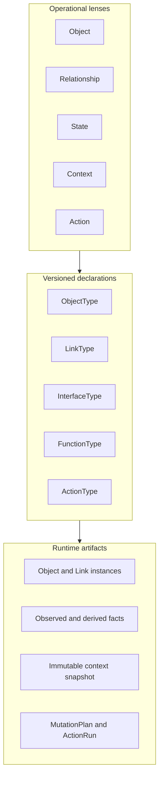
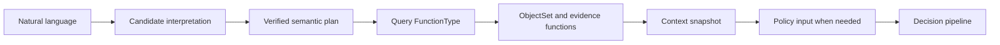

# FDAI 운영 온톨로지 메타모델

이 문서는 FDAI가 운영 의미, versioned declaration 및 runtime evidence를 구분하는 방식을 정의합니다.
Object, Relationship, State, Context, Action이라는 직관적 관점을 모든 관점마다 새로운 ontology
declaration kind를 만드는 방식 없이 견고하게 만듭니다.

> **결정:** Object, Relationship, State, Context, Action은 다섯 가지 운영 관점입니다. Canonical
> release declaration kind는 Object, Link, Interface, Function, Action으로 유지합니다. State와
> Context는 현재 release schema에서 declaration kind가 아니라 runtime semantic artifact와 versioned
> query pattern입니다.
>
> **권한 경계:** State 또는 context artifact는 autonomy를 유지하거나 낮출 수만 있습니다. External
> truth를 주장하거나 action을 승인하거나 shared mutable coordination state가 될 수 없습니다.
>
> **구현 상태(2026-08-08):** Object, Link, Action, Function 및 공급된 Interface declaration은
> canonical release에 포함될 수 있습니다. `OntologyInterfaceType`은 shared contract이며,
> interface를 공급하지 않으면 `build_ontology_release`는 이전 digest를 유지합니다. Production
> catalog와 composition root는 아직 Interface declaration을 공급하지 않으므로 M1은 완료되지
> 않았습니다. State와 context behavior는 typed ObjectType, `OperationalStateTrajectory`,
> `OperationalContextSnapshot`으로 구현되어 있습니다. Link declaration과 record는 이미
> `from -> to` direction을 저장하지만 catalog와 provider projection은 아래에서 정의하는 direction
> alignment audit을 아직 완료하지 않았습니다.

## 한눈에 보는 설계

두 그룹은 서로 다른 질문에 답합니다. Operational lens는 operator에게 domain을 설명합니다.
Declaration kind는 exact content-addressed contract를 정의합니다. Runtime artifact는 해당 contract
아래 value, evidence, decision을 전달합니다.

## 다섯 가지 운영 관점

| 관점 | 질문 | FDAI 표현 |
|------|------|-----------|
| Object | 무엇이 존재합니까? | `OntologyObjectType` 및 `OntologyObjectRecord`입니다. |
| Relationship | Object가 어떻게 연결됩니까? | `OntologyLinkType` 및 `OntologyLinkRecord`입니다. |
| State | 무엇이 관측, 파생, 의도 또는 실행되었습니까? | 명시적 authority가 있는 typed object, observation, trajectory, journal입니다. |
| Context | 이 질문 또는 결정에 어떤 bounded evidence를 사용했습니까? | Versioned query profile 및 immutable context snapshot입니다. |
| Action | 어떤 safeguard에서 어떤 변경을 제안할 수 있습니까? | `OntologyActionType`, `MutationPlan`, `ActionRun`입니다. |

State와 Context는 operational model에서 first-class이지만 새로운 `STATE` 및 `CONTEXT`
`OntologyDeclarationKind`가 필요하다는 뜻은 아닙니다. Declaration kind는 독립 compatibility, exact
reference, catalog lifecycle, generated consumer surface가 필요하고 기존 kind로 표현할 수 없을 때만
정당화됩니다.

## Canonical declaration plane

| Kind | Contract | 현재 상태 |
|------|----------|-----------|
| `OBJECT` | Entity shape, key, property, lifecycle, provenance입니다. | Canonical release에서 활성 상태입니다. |
| `LINK` | Endpoint, cardinality, causal/temporal semantic입니다. | Canonical release에서 활성 상태입니다. |
| `ACTION` | Target, safety envelope, planning, execution, postcondition입니다. | Canonical release에서 활성 상태입니다. |
| `FUNCTION` | Bounded query, derive, validate 또는 plan operation입니다. | Canonical release에서 활성 상태입니다. |
| `INTERFACE` | 여러 ObjectType의 shared semantic capability입니다. | Shared contract와 release-builder support가 있으며 catalog/composition integration이 남았습니다. |

`InterfaceType`은 State 또는 Context에 다른 schema를 추가하기 전에 release에 들어가는 것이 좋습니다.
이를 통해 concrete ObjectType identity를 보존하면서 `Operable`, `Observable`, `Ownable`,
`Recoverable` 등의 polymorphic query를 사용할 수 있습니다.

## Relationship direction 계약

LinkType은 구조적으로 directed 관계입니다. `from_type -> to_type`은 declaration direction이고,
`from_id -> to_id`는 이에 대응하는 runtime instance direction입니다. 별도의 generic `direction`
field를 추가하면 endpoint와 중복되거나 모순될 수 있으므로 현재 metamodel에는 추가하지 않습니다.
다만 `Resource -> Resource`와 같은 same-type link는 endpoint type만으로 source와 target의 의미를
설명할 수 없으므로 semantic role을 명시해야 합니다.

| 차원 | 계약 |
|------|------|
| Stored endpoint direction | 모든 link를 `from`에서 `to` 방향으로 읽습니다. Cardinality도 이 순서로 해석합니다. |
| Semantic direction | LinkType name, description 및 reviewed mapping이 source/target role을 정의합니다. Role을 뒤집는 변경은 breaking semantic change입니다. |
| Traversal direction | Query는 `outgoing`, `incoming`, `both` 중 하나를 선택합니다. Traversal은 저장된 link를 다시 쓰지 않습니다. |
| Causal direction | `is_causal`이 true이면 source는 candidate cause이고 target은 candidate effect입니다. 이 flag 자체가 causality를 입증하지는 않습니다. |
| Temporal ordering | `temporal_order`는 matching target을 `order_by_property`로 정렬합니다. Link를 뒤집거나 causality를 주장하지 않습니다. |
| Symmetry 및 inverse | 하나의 directed record는 reverse를 의미하지 않습니다. Explicit symmetric-link contract가 release되기 전에는 bidirectionality에 verified record 두 개가 필요합니다. |

초기 Resource relationship role은 다음과 같습니다.

| LinkType | Canonical direction | 운영 해석 |
|----------|---------------------|-----------|
| `contains` | containing parent -> contained child | Resource group은 VM을 포함하고 VNet은 subnet을 포함합니다. Parent-to-child traversal로 impact descendant를 찾습니다. |
| `attached_to` | attached resource -> attachment anchor | NIC 또는 disk는 VM에 연결되고 private endpoint는 target에 연결됩니다. |
| `depends_on` | dependent -> prerequisite | VM은 참조하는 user-assigned identity에 의존하고 workload는 필요한 data service에 의존합니다. |

Provider field ownership은 semantic direction을 결정하지 않습니다. 예를 들어 VM payload가 NIC
resource id를 포함해도 reviewed `attached_to` link는 NIC -> VM입니다. 따라서 provider mapping은
source property path, allowed target provider type, semantic LinkType, endpoint orientation, source
schema digest 및 evidence method를 기록합니다. Complete inventory generation에서 두 endpoint
identity를 모두 관측하기 전까지는 candidate 상태로 유지합니다. Endpoint 누락, orientation ambiguity
또는 incomplete coverage가 있으면 link를 만들지 않고 completeness를 낮춥니다.

Inverse traversal은 일반적으로 query concern입니다. FDAI는 inverse가 distinct domain meaning,
provenance 또는 cardinality를 가질 때만 별도 이름의 inverse LinkType을 추가합니다. Peering과 같은
symmetric relationship은 현재 schema에서 independently supported directed record 두 개를 사용합니다.
향후 `is_symmetric` 또는 `inverse_link_type` field를 추가하려면 compatibility design이 필요하며 기존
record를 retroactive하게 재해석할 수 없습니다.

## Direction 보강 계획

| 단계 | 변경 | 종료 기준 |
|------|------|-----------|
| D0 | 이 direction contract와 VM adversarial example을 게시합니다. | Endpoint, semantic, traversal, causal, temporal, inverse 및 symmetric direction을 구분할 수 있습니다. |
| D1 | 모든 shipped LinkType과 producer를 canonical role/cardinality에 맞춰 audit합니다. | `contains`, `attached_to`, `depends_on` declaration, Azure/Kubernetes projection, ownership rule 및 test가 하나의 orientation에 동의합니다. |
| D2 | Explicit endpoint orientation과 source-schema provenance가 있는 reviewed provider relationship mapping을 추가합니다. | Provider reference ownership이 ontology direction을 암묵적으로 선택할 수 없습니다. |
| D3 | Complete, missing-endpoint, reversed-input, duplicate 및 partial-coverage fixture를 추가합니다. | Verified link만 active graph에 들어가며 ambiguous/incomplete path는 absent 상태로 보고됩니다. |
| D4 | Migration 전에 기존 graph generation과 aligned graph generation을 shadow comparison합니다. | Directional query 및 blast-radius 차이가 측정, 검토, replay 가능하며 rollback pointer를 갖습니다. |

Persist된 link 해석을 바꾸는 direction 또는 cardinality 수정에는 새 LinkType major version이나 explicit
graph migration이 필요합니다. Historical context snapshot을 제자리에서 수정하지 않습니다.

## State 모델

FDAI는 하나의 mutable `state` bag을 저장하지 않고 authority에 따라 state를 구분합니다.

| State lane | 예 | Authority 및 표현 |
|------------|----|-------------------|
| Observed | Provider power state, provisioning result, metric sample입니다. | Authoritative provider/telemetry receipt 이후 owned projection 또는 `Observation`입니다. |
| Derived operational | Healthy, degraded, resource pressure, forecast risk입니다. | Versioned derive function과 immutable evidence/uncertainty입니다. |
| Desired | SLO, RTO, budget, reviewed configuration입니다. | Approved policy, configuration 또는 effective-time objective입니다. |
| Execution | Planned, dispatched, verified, rolled back입니다. | Process journal, `ActionRun`, outcome, audit ledger입니다. |

모든 decision-relevant state fact는 다음 field를 기록하거나 resolve합니다.

- authority class 및 authenticated source identity
- source revision 및 provenance digest
- effective time, event time, recorded time, evidence cutoff
- freshness policy, completeness, synthetic status
- derived value의 algorithm 또는 function version
- immutable evidence reference 및 conflict status

High-frequency telemetry는 sample마다 Resource object를 다시 쓰지 않습니다. Authoritative evidence
source에 유지합니다. Owning projection이 위 field를 보존할 수 있을 때만 bounded observation 또는
derived assessment가 graph에 들어갑니다. Late evidence는 새 artifact를 만들며 historical decision이
사용한 context를 다시 쓰지 않습니다.

## Context 모델

Context에는 서로 다른 두 형태가 있습니다.

1. **Query profile:** Query FunctionType, ObjectSet definition, required link path, historical
   evidence function, freshness rule, completeness policy, resource ceiling을 선택하는 reviewed/versioned
   read pattern입니다.
2. **Context snapshot:** Cutoff에서 profile을 한 번 immutable/content-addressed materialization한
   결과입니다. Exact object/link revision, state fact, evidence path, source watermark, temporal
   exclusion, conflict, truncation reason, autonomy ceiling을 포함합니다.

Query profile은 catalog-as-code와 `query` FunctionType으로 표현합니다. Mutable Context object가 아니며
`CONTEXT` declaration kind가 필요하지 않습니다. 기존 `OperationalContextSnapshot`은 첫 context
snapshot 구현이며 교체하지 않고 확장하는 것이 좋습니다.

Agent는 context snapshot을 편집하지 않습니다. 새로운 evidence가 필요하면 accountable materializer에
새 snapshot을 요청합니다. Context는 input/replay artifact이며 authority-bearing collaboration channel이
아닙니다.

## Operational intent 흐름

Lexical matching, embedding, model은 candidate만 만듭니다. Candidate는
`VerifiedSemanticPlan`이 되기 전에 exact ontology release, semantic catalog, argument 및 reviewed
evidence를 resolve해야 합니다. Verified plan도 execution authority가 없습니다.

Current-state graph read와 historical evidence는 서로 다른 operation입니다. `ObjectSetDefinition`은
current graph를 선택합니다. Metric, log, activity, audit, retained trajectory는 동일 query plan의 bounded
function입니다. `as_of` 값이 current instance store를 bitemporal database로 바꾸지 않습니다.

모든 read에 OPA/Rego가 필요한 것은 아닙니다. OPA/Rego는 필요한 경우 bounded typed input을 대상으로
access, policy, action eligibility를 평가합니다. Ontology를 검색하거나 provider API를 호출하지 않습니다.

## Ownership

| Artifact | Accountable owner |
|----------|-------------------|
| Provider observation 및 topology ingress | Huginn이며 authoritative inventory projection은 mechanical writer입니다. |
| Runtime observation, finding, forecast, independent outcome evidence | Heimdall입니다. |
| Cost 및 capacity state fact | Owned advisory object에 대해 Njord 및 Freyr입니다. |
| Chaos experiment state | Loki입니다. |
| Immutable operational context snapshot | Muninn입니다. |
| Decision case 및 verdict | Forseti입니다. |
| Cross-objective arbitration | Odin입니다. |
| Human approval record | Var입니다. |
| Action run 및 attempt | Thor입니다. |
| Recovery 및 rollback outcome | Vidar입니다. |
| Audit record | Saga입니다. |
| Catalog lifecycle 및 promoted semantic surface | Mimir입니다. |
| Natural-language rendering 및 candidate translation | Bragi이며 decision/execution write는 없습니다. |

Infrastructure projector는 owner의 typed output을 persist할 수 있지만 hidden agent가 되지 않습니다. 각
projection은 one writer, revision fence, replacement가 가능한 경우 owned-identity manifest, complete
audit/outbox path를 유지합니다.

## 차단하는 설계

- Observed, desired, derived, execution value를 섞는 generic mutable `State` object
- Agent가 공유하는 mutable `Context` cache
- Autonomy를 직접 높이거나 permission을 부여하는 state value
- Command 또는 graph-write receipt에서 provider-observed state를 갱신하는 동작
- Bound/freshness receipt 없이 high-frequency telemetry를 instance graph에 복사하는 동작
- Question example을 deployment object instance로 저장하는 동작. Reviewed semantic language catalog에
  속하며 verification 전에는 candidate-only입니다.
- Competency fixture가 ObjectType, InterfaceType, query FunctionType으로 필요한 compatibility contract를
  표현할 수 없음을 입증하기 전에 `STATE` 또는 `CONTEXT` declaration kind를 추가하는 동작

## Additive 제공 순서

| Wave | 변경 | 종료 기준 |
|------|------|-----------|
| M0 | 이 metamodel 결정, direction contract 및 adversarial fixture입니다. | Declaration, runtime, direction, authority, time, ownership layer가 명확합니다. |
| M1 | Semantic InterfaceType을 `OntologyRelease`에 포함합니다. | Interface digest, exact ref, compatibility, empty-input backward-compatibility test가 통과합니다. |
| M2 | Plan/invocation lineage를 포함해 bounded ObjectSet을 materialize하는 query FunctionType을 추가합니다. | Purpose, release, truncation, evidence receipt가 end-to-end로 보존됩니다. |
| M3 | 기존 ObjectType 및 function output으로 state-fact field와 link observation metadata를 표준화합니다. | Observed/derived fact가 혼동되지 않고 stale/conflicting fact가 autonomy를 낮춥니다. |
| M4 | `read_investigation` intent 하나를 shadow verified query profile로 옮깁니다. | 기존 결과와 ontology-native 결과가 일치하거나 차이가 명시적으로 남습니다. |
| M5 | D1-D4 이후 competency-driven network 및 telemetry relationship coverage를 추가합니다. | VM connectivity 및 Pod telemetry chain이 올바른 방향의 verified/unverified segment를 보고합니다. |

`StateType` 또는 `ContextType`은 M3/M4에서 ObjectType, InterfaceType, FunctionType, exact release ref,
immutable snapshot으로 표현할 수 없는 compatibility requirement가 발생한 뒤에만 future
declaration-kind proposal이 됩니다.

## 검증 체크리스트

- Interpretation에 영향을 주는 모든 declaration이 release digest에 포함됩니까?
- 모든 state fact가 authority, provenance, time, freshness, completeness를 식별합니까?
- 모든 LinkType이 cardinality와 일치하는 하나의 source-to-target semantic reading을 정의합니까?
- Link를 다시 쓰지 않고 incoming, outgoing, inverse 및 symmetric traversal을 구분할 수 있습니까?
- Runtime이 external observation, derived interpretation, desired intent, execution progress를 구분합니까?
- 모든 context가 immutable, bounded, replayable하며 하나의 materializer가 소유합니까?
- 누락되거나 truncated된 path가 autonomy를 유지하거나 낮출 수만 있습니까?
- 모든 semantic candidate가 exact evidence verification 전까지 non-authoritative 상태입니까?
- 모든 action이 judgment, risk, approval, execution, recovery, audit에 다시 진입합니까?
- 모든 provider-observed effect가 independent authoritative observation으로만 종료됩니까?

## 관련 문서

| 알아볼 내용 | 문서 |
|-------------|------|
| Domain object, relationship, time, ownership | [FDAI 운영 온톨로지](operating-ontology-ko.md) |
| ObjectSet, function, action, writeback boundary | [온톨로지 안전 인프라](operating-ontology-platform-ko.md) |
| Constitutional authority | [FDAI 헌법](fdai-constitution-ko.md) |
| Natural-language 및 model boundary | [LLM 전략](llm-strategy-ko.md) |
| Action safeguard | [Action 온톨로지](../decisioning/action-ontology-ko.md) |
