# FDAI 운영 온톨로지 메타모델

이 문서는 FDAI가 운영 의미, versioned 선언 및 런타임 근거를 구분하는 방식을 정의합니다.
객체, 관계, 상태, 맥락, 액션이라는 직관적 관점을 모든 관점마다 새로운 온톨로지
선언 종류를 만드는 방식 없이 견고하게 만듭니다.

> **결정:** 객체, 관계, 상태, 맥락, 액션은 다섯 가지 운영 관점입니다. 정본
> release 선언 종류는 객체, 링크, Interface, 함수, 액션으로 유지합니다. 상태와
> 맥락은 현재 release 스키마에서 선언 종류가 아니라 런타임 의미 산출물과 versioned
> 조회 pattern입니다.
>
> **권한 경계:** 상태 또는 맥락 산출물은 자율성을 유지하거나 낮출 수만 있습니다. 외부
> truth를 주장하거나 액션을 승인하거나 shared 변경 가능한 coordination 상태가 될 수 없습니다.

## 한눈에 보는 설계

두 그룹은 서로 다른 질문에 답합니다. Operational 관점은 운영자에게 도메인을 설명합니다.
선언 종류는 exact 내용 기반 주소를 가진 계약을 정의합니다. 런타임 산출물은 해당 계약
아래 값, 근거, 결정을 전달합니다.

## 다섯 가지 운영 관점

| 관점 | 질문 | FDAI 표현 |
|------|------|-----------|
| 객체 | 무엇이 존재합니까? | `OntologyObjectType` 및 `OntologyObjectRecord`입니다. |
| 관계 | 객체가 어떻게 연결됩니까? | `OntologyLinkType` 및 `OntologyLinkRecord`입니다. |
| 상태 | 무엇이 관측, 파생, 의도 또는 실행되었습니까? | 명시적 권한이 있는 타입이 지정된 객체, 관측, trajectory, 저널입니다. |
| 맥락 | 이 질문 또는 결정에 어떤 범위가 제한된 근거를 사용했습니까? | Versioned 조회 프로파일 및 변경할 수 없는 맥락 스냅샷입니다. |
| 액션 | 어떤 safeguard에서 어떤 변경을 제안할 수 있습니까? | `OntologyActionType`, `MutationPlan`, `KineticSafetyReceipt`, `ActionRun`입니다. |

상태와 맥락은 operational 모델에서 일급이지만 새로운 `STATE` 및 `CONTEXT`
`OntologyDeclarationKind`가 필요하다는 뜻은 아닙니다. 선언 종류는 독립 호환성, exact
참조, 카탈로그 수명 주기, 생성된 소비자 표면이 필요하고 기존 종류로 표현할 수 없을 때만
정당화됩니다.

## 정본 선언 평면

| 종류 | 계약 | 현재 상태 |
|------|----------|-----------|
| `OBJECT` | 개체 형태, 키, 속성, 수명 주기, 출처 이력입니다. | 정본 release에서 활성 상태입니다. |
| `LINK` | 엔드포인트, cardinality, causal/temporal 의미입니다. | 정본 release에서 활성 상태입니다. |
| `ACTION` | 대상, 안전성 묶음, 계획 수립, 실행, postcondition입니다. | 정본 release에서 활성 상태입니다. |
| `FUNCTION` | 범위가 제한된 조회, derive, validate 또는 계획 연산입니다. | 정본 release에서 활성 상태입니다. |
| `INTERFACE` | 여러 ObjectType의 shared 의미 기능입니다. | Shared 계약과 release-builder support가 있으며 카탈로그/조립 통합이 남았습니다. |

`InterfaceType`은 상태 또는 맥락에 다른 스키마를 추가하기 전에 release에 들어가는 것이 좋습니다.
이를 통해 구체적인 ObjectType 신원을 보존하면서 `Operable`, `Observable`, `Ownable`,
`Recoverable` 등의 polymorphic 조회를 사용할 수 있습니다.

## 관계 direction 계약

LinkType은 구조적으로 directed 관계입니다. `from_type -> to_type`은 선언 direction이고,
`from_id -> to_id`는 이에 대응하는 런타임 인스턴스 direction입니다. 별도의 범용 `direction`
필드를 추가하면 엔드포인트와 중복되거나 모순될 수 있으므로 현재 metamodel에는 추가하지 않습니다.
다만 `Resource -> Resource`와 같은 same-type 링크는 엔드포인트 타입만으로 출처와 대상의 의미를
설명할 수 없으므로 의미 역할을 명시해야 합니다.

| 차원 | 계약 |
|------|------|
| Stored 엔드포인트 direction | 모든 링크를 `from`에서 `to` 방향으로 읽습니다. Cardinality도 이 순서로 해석합니다. |
| 의미 direction | LinkType 이름, description 및 검토된 대응이 출처/대상 역할을 정의합니다. 역할을 뒤집는 변경은 breaking 의미 변경입니다. |
| 탐색 direction | 조회는 `outgoing`, `incoming`, `both` 중 하나를 선택합니다. 탐색은 저장된 링크를 다시 쓰지 않습니다. |
| Causal direction | `is_causal`이 true이면 출처는 후보 원인이고 대상은 후보 효과입니다. 이 플래그 자체가 causality를 입증하지는 않습니다. |
| Temporal 정렬 | `temporal_order`는 matching 대상을 `order_by_property`로 정렬합니다. 링크를 뒤집거나 causality를 주장하지 않습니다. |
| Symmetry 및 inverse | 하나의 directed 기록은 reverse를 의미하지 않습니다. 명시적 symmetric-link 계약이 release되기 전에는 bidirectionality에 검증된 기록 두 개가 필요합니다. |

초기 Resource 관계 역할은 다음과 같습니다.

| LinkType | 정본 direction | 운영 해석 |
|----------|---------------------|-----------|
| `contains` | containing 상위 -> contained 하위 | Resource 그룹은 VM을 포함하고 VNet은 서브넷을 포함합니다. Parent-to-child 탐색으로 영향 descendant를 찾습니다. |
| `attached_to` | 연결된 리소스 -> 첨부 기준점 | NIC 또는 disk는 VM에 연결되고 비공개 엔드포인트는 대상에 연결됩니다. |
| `depends_on` | dependent -> 선행 조건 | VM은 참조하는 user-assigned 신원에 의존하고 워크로드는 필요한 데이터 서비스에 의존합니다. |
| `resource_classified_as` | 관찰된 Resource -> 검토된 ResourceType | 분류는 검토된 레지스트리 항목을 따르며 이름 또는 임베딩에서 형식을 추론하지 않습니다. |

프로바이더 필드 소유권은 의미 direction을 결정하지 않습니다. 예를 들어 VM 페이로드가 NIC
리소스 id를 포함해도 검토된 `attached_to` 링크는 NIC -> VM입니다. 따라서 프로바이더 대응은
출처 속성 경로, allowed 대상 프로바이더 타입, 의미 LinkType, 엔드포인트 orientation, 출처
스키마 다이제스트 및 근거 메서드를 기록합니다. 완전한 인벤토리 세대에서 두 엔드포인트
신원을 모두 관측하기 전까지는 후보 상태로 유지합니다. 엔드포인트 누락, orientation 모호함
또는 불완전한 커버리지가 있으면 링크를 만들지 않고 완전성을 낮춥니다.

검토된 `id.providerParent` 경로는 일반 ARM 계층 추론보다 범위가 좁습니다. 명시적 mapping을
가진 선언된 중첩 프로바이더 타입에만 적용합니다. 현재 mapping은 SQL 데이터베이스,
Communication email domain, DNS resolver inbound endpoint, AKS AgentPool 및 상위 계정 아래의
Azure AI 모델 배포를 포함합니다. 검토된 `id.providerRoot` 경로는 File Share를 최상위 storage
account로 별도로 해석합니다. 최상위
리소스와 잘못된 프로바이더 경로는 provider parent 또는 provider root 후보를 만들지 않습니다.
이 exact mapping과 wildcard 포함 관계 mapping이 같은 하위를 점유하면 exact mapping이 wildcard
후보를 shadow합니다. 이 규칙은 `contains` one-to-many cardinality를 보존하고 저장된 간선을
`Resource.parent_id`와 정렬합니다. 서로 다른 하위 id를 가진 포함 관계 mapping은 계속 함께 적용됩니다.

검토된 참조 형식은 이제 프로바이더 id, exact identity, 해석된 이름, 해석된 UID, Kubernetes
레이블 selector를 구분합니다. Kubernetes 변환기는 한 클러스터와 네임스페이스 안에서 정확한
클러스터 및 네임스페이스 containment, AgentPool에서 Node로의 containment, Pod scheduling,
controller ownership, Service selector 및 같은 이름의 Endpoints를 대응시킵니다. 범위가 제한된
Kubernetes API 인벤토리 source는 변경할 수 없는 UID를 제공하고 원자적 승격 전에 하나의 완전한
프로바이더 세대를 보강합니다. 모든 링크는 활성 그래프에 들어가기 전에 계속 독립적인 완전 세대
검증을 거쳐야 합니다.

Inverse 탐색은 일반적으로 조회 관심사입니다. FDAI는 inverse가 서로 다른 도메인 meaning,
출처 이력 또는 cardinality를 가질 때만 별도 이름의 inverse LinkType을 추가합니다. 피어링과 같은
symmetric 관계는 현재 스키마에서 independently supported directed 기록 두 개를 사용합니다.
향후 `is_symmetric` 또는 `inverse_link_type` 필드를 추가하려면 호환성 design이 필요하며 기존
기록을 retroactive하게 재해석할 수 없습니다.

## Direction 보강 계획

| 단계 | 변경 | 종료 기준 |
|------|------|-----------|
| D0 | 이 direction 계약과 VM adversarial 예시를 게시합니다. | 엔드포인트, 의미, 탐색, causal, temporal, inverse 및 symmetric direction을 구분할 수 있습니다. |
| D1 | 모든 shipped LinkType과 생산자를 정본 역할/cardinality에 맞춰 감사합니다. | `contains`, `attached_to`, `depends_on` 선언, Azure/Kubernetes 변환 결과, 소유권 룰 및 테스트가 하나의 orientation에 동의합니다. |
| D2 | 명시적 엔드포인트 orientation과 source-schema 출처 이력이 있는 검토된 프로바이더 관계 대응을 추가합니다. | 프로바이더 참조 소유권이 온톨로지 direction을 암묵적으로 선택할 수 없습니다. |
| D3 | 완전한, missing-endpoint, reversed-input, 중복, preview 및 partial-coverage 고정본을 추가합니다. | 검증된 링크만 활성 그래프에 들어가며 모호한/불완전한 경로는 absent 상태로 보고됩니다. |
| D4 | 이행 전에 기존 그래프 세대와 aligned 그래프 세대를 shadow 비교합니다. | Directional 조회 및 blast-radius 차이가 측정, 검토, 재생 가능하며 롤백 포인터를 갖습니다. 서로 다른 검토자와 비어 있지 않은 회귀 증적은 catalog PR 제안만 만들 수 있으며 이행 권한은 부여하지 않습니다. |

저장된 링크 해석을 바꾸는 direction 또는 cardinality 수정에는 새 LinkType major 버전이나 명시적
그래프 이행이 필요합니다. Historical 맥락 스냅샷을 제자리에서 수정하지 않습니다.

승격 평가는 비교 증적, 두 세대 다이제스트, 회귀 증적, 서로 다른 요청자와 검토자 신원, 검토
시각 및 재구성 포인터를 결속합니다. 승인은 catalog pull request 제안을 허용한다는 뜻입니다.
비교를 이행 준비 완료로 바꾸거나 그래프를 변경하거나 이행을 실행하거나 과거 스냅샷을 다시
쓰지 않습니다.

증분 후보 재구축은 변경된 타입 또는 타입 버전에서 관계로 연결된 전이 참조까지만 확장합니다.
관련 없는 후보 구성 요소는 재사용할 수 있습니다. 검토된 승격 원장은 제안 이력을 추가하기 전에
변경할 수 없는 두 그래프 세대, 완전한 D4 비교 및 서로 다른 모든 검토 평가를 보존합니다. 중복
검토 전달은 멱등적이며 이력과 활성 제안 포인터에는 그래프 또는 이행 권한을 담을 수 없습니다.

## 상태 모델

FDAI는 하나의 변경 가능한 `state` bag을 저장하지 않고 권한에 따라 상태를 구분합니다.

| 상태 레인 | 예 | 권한 및 표현 |
|------------|----|-------------------|
| 관찰된 | 프로바이더 power 상태, 프로비저닝 결과, 메트릭 샘플입니다. | 권위 있는 프로바이더/텔레메트리 증적 이후 owned 변환 결과 또는 `Observation`입니다. |
| Derived operational | Healthy, degraded, 리소스 pressure, 예측 risk입니다. | Versioned derive 함수와 변경할 수 없는 근거/uncertainty입니다. |
| Desired | SLO, RTO, 예산, 검토된 구성입니다. | Approved 정책, 구성 또는 effective-time 목표입니다. |
| 실행 | Planned, dispatched, 검증된, rolled back입니다. | 프로세스 저널, pre-dispatch `KineticSafetyReceipt`, `ActionRun`, 결과, 감사 원장입니다. |

Kinetic safety receipt는 새 선언 종류가 아니라 내용 기반 주소를 가진 실행 상태 산출물입니다.
기존 exact V2 `MutationPlan`을 하나의 Action에 연결하고 raw Action argument는 제외합니다. 실행 후
consumer는 저장된 plan을 resolve할 수 있지만 legacy Action을 reconstruct하거나 upgrade할 수
없습니다. 이 증적은 판단, 승인, 실행, observation 또는 promotion 권한을 부여하지 않습니다.

모든 decision-relevant 상태 사실은 다음 필드를 기록하거나 해석합니다.

- 권한 등급 및 인증된 출처 신원
- 출처 개정 번호 및 출처 이력 다이제스트
- effective 시간, 이벤트 시간, 기록된 시간, 근거 기준 시점
- 최신성 정책, 완전성, synthetic 상태
- derived 값의 algorithm 또는 함수 버전
- 변경할 수 없는 근거 참조 및 충돌 상태

High-frequency 텔레메트리는 샘플마다 Resource 객체를 다시 쓰지 않습니다. 권위 있는 근거
출처에 유지합니다. Owning 변환 결과가 위 필드를 보존할 수 있을 때만 범위가 제한된 관측 또는
derived 평가가 그래프에 들어갑니다. Late 근거는 새 산출물을 만들며 historical 결정이
사용한 맥락을 다시 쓰지 않습니다.

## 맥락 모델

맥락에는 서로 다른 두 형태가 있습니다.

1. **조회 프로파일:** 조회 FunctionType, ObjectSet 정의, 필수 링크 경로, historical
 근거 함수, 최신성 룰, 완전성 정책, 리소스 상한을 선택하는 검토된/versioned
 읽기 pattern입니다.
2. **맥락 스냅샷:** 기준 시점에서 프로파일을 한 번 변경할 수 없는/내용 기반 주소를 가진 구체화한
 결과입니다. Exact 객체/링크 개정 번호, 상태 사실, 근거 경로, 출처 watermark, temporal
 exclusion, 충돌, 잘림 사유, 자율성 상한을 포함합니다.

조회 프로파일은 catalog-as-code와 `query` FunctionType으로 표현합니다. 변경 가능한 맥락 객체가 아니며
`CONTEXT` 선언 종류가 필요하지 않습니다. 기존 `OperationalContextSnapshot`은 첫 맥락
스냅샷 구현이며 교체하지 않고 확장하는 것이 좋습니다.

에이전트는 맥락 스냅샷을 편집하지 않습니다. 새로운 근거가 필요하면 accountable materializer에
새 스냅샷을 요청합니다. 맥락은 입력/재생 산출물이며 authority-bearing collaboration 채널이
아닙니다.

## Operational 의도 흐름

Lexical matching, 임베딩, 모델은 후보만 만듭니다. 후보는
`VerifiedSemanticPlan`이 되기 전에 exact 온톨로지 release, 의미 카탈로그, 인자 및 검토된
근거를 해석해야 합니다. 검증된 계획도 실행 권한이 없습니다.

Current-state 그래프 읽기와 historical 근거는 서로 다른 연산입니다. `ObjectSetDefinition`은
현재 그래프를 선택합니다. 메트릭, 로그, 활동, 감사, retained trajectory는 동일 조회 계획의 범위가 제한된
함수입니다. `as_of` 값이 현재 인스턴스 저장소를 bitemporal 데이터베이스로 바꾸지 않습니다. 저장소
계약이 권위 있는 관측 기준 시점 또는 watermark를 제공하기 전까지 secured 게이트웨이는 최대
5초로 구성한 skew 안의 trusted 현재 evaluation 기준 시점만 허용합니다. 그 밖의 과거 또는 미래 값은
historical 완전성 점유로 취급하지 않고 명시적으로 지원하지 않는으로 차단합니다.

모든 읽기에 OPA/Rego가 필요한 것은 아닙니다. OPA/Rego는 필요한 경우 범위가 제한된 타입이 지정된 입력을 대상으로
접근, 정책, 액션 충족 여부를 평가합니다. 온톨로지를 검색하거나 프로바이더 API를 호출하지 않습니다.

## 소유권

| 산출물 | Accountable 소유자 |
|----------|-------------------|
| 프로바이더 관측 및 토폴로지 유입 | Huginn이며 권위 있는 인벤토리 변환 결과는 mechanical 쓰기 담당입니다. |
| 런타임 관측, 발견 사항, 예측, 독립적인 결과 근거 | Heimdall입니다. |
| 비용 및 용량 상태 사실 | Owned 참고용 객체에 대해 Njord 및 Freyr입니다. |
| Chaos 실험 상태 | Loki입니다. |
| 변경할 수 없는 operational 맥락 스냅샷 | Forseti입니다. 자신의 결정 기준 시점에 `OperationalContextMaterializer`로 스냅샷 하나를 materialize합니다. |
| 결정 사례 및 판정 | Forseti입니다. |
| Cross-objective 중재 | Odin입니다. |
| Human 승인 기록 | Var입니다. |
| 액션 실행 및 시도 | Thor입니다. |
| 복구 및 롤백 결과 | Vidar입니다. |
| 감사 기록 | Saga입니다. |
| 카탈로그 수명 주기 및 promoted 의미 표면 | Mimir입니다. |
| Natural-language 렌더링 및 후보 translation | Bragi이며 결정/실행 쓰기는 없습니다. |

Infrastructure projector는 소유자의 타입이 지정된 출력을 저장할 수 있지만 hidden 에이전트가 되지 않습니다. 각
변환 결과는 one 쓰기 담당, 개정 번호 fence, replacement가 가능한 경우 owned-identity 매니페스트, 완전한
감사/발신함 경로를 유지합니다.

## 차단하는 설계

- 관찰된, desired, derived, 실행 값을 섞는 범용 변경 가능한 `State` 객체
- 에이전트가 공유하는 변경 가능한 `Context` 캐시
- 자율성을 직접 높이거나 권한을 부여하는 상태 값
- Command 또는 graph-write 증적에서 provider-observed 상태를 갱신하는 동작
- 한계/최신성 증적 없이 high-frequency 텔레메트리를 인스턴스 그래프에 복사하는 동작
- 질문 예시를 배포 객체 인스턴스로 저장하는 동작. 검토된 의미 언어 카탈로그에
 속하며 검증 전에는 후보 전용입니다.
- Competency 고정본이 ObjectType, InterfaceType, 조회 FunctionType으로 필요한 호환성 계약을
 표현할 수 없음을 입증하기 전에 `STATE` 또는 `CONTEXT` 선언 종류를 추가하는 동작

## 가산 제공 순서

| Wave | 변경 | 종료 기준 |
|------|------|-----------|
| M0 | 이 metamodel 결정, direction 계약 및 adversarial 고정본입니다. | 선언, 런타임, direction, 권한, 시간, 소유권 계층이 명확합니다. |
| M1 | 의미 InterfaceType을 `OntologyRelease`에 포함합니다. | Interface 다이제스트, exact 참조, 호환성, empty-input backward-compatibility 테스트가 통과합니다. |
| M2 | 계획/호출 계보를 포함해 범위가 제한된 ObjectSet을 materialize하는 조회 FunctionType을 추가합니다. | 용도, release, 잘림, 근거 증적이 종단 간으로 보존됩니다. |
| M3 | 기존 ObjectType 및 함수 출력으로 state-fact 필드와 링크 관측 메타데이터를 표준화합니다. | 관찰된/derived 사실이 혼동되지 않고 stale/conflicting 사실이 자율성을 낮춥니다. |
| M4 | `read_investigation` 의도 하나를 shadow 검증된 조회 프로파일로 옮깁니다. | 기존 결과와 ontology-native 결과가 일치하거나 차이가 명시적으로 남습니다. |
| M5 | D1-D4 이후 competency-driven 네트워크 및 텔레메트리 관계 커버리지를 추가합니다. | VM connectivity 및 Pod 텔레메트리 체인이 올바른 방향의 검증된/검증되지 않은 구간을 보고합니다. |

`StateType` 또는 `ContextType`은 M3/M4에서 ObjectType, InterfaceType, FunctionType, exact release 참조,
변경할 수 없는 스냅샷으로 표현할 수 없는 호환성 요구사항이 발생한 뒤에만 future
declaration-kind 제안이 됩니다.

## 구현 상태

### 구현 범위

| 영역 | 상태 | 근거 | 참고 |
|------|------|------|------|
| 정본 선언 release | implemented | [`ontology_catalog.py`](../../../services/core-control-plane/src/fdai/rule_catalog/schema/ontology_catalog.py), [`release.py`](../../../services/core-control-plane/src/fdai/shared/ontology/release.py), [`test_ontology_catalog.py`](../../../services/core-control-plane/tests/rule_catalog/test_ontology_catalog.py) | 객체, 링크, 액션, Interface, 함수 선언이 exact release에 기여합니다. |
| 범위가 제한된 ObjectSet 실행 및 계보 | implemented | [`semantic_query.py`](../../../services/core-control-plane/src/fdai/core/ontology_platform/semantic_query.py), [`test_interfaces_and_object_sets.py`](../../../services/core-control-plane/tests/core/ontology_platform/test_interfaces_and_object_sets.py), [`test_semantic_query.py`](../../../services/core-control-plane/tests/core/ontology_platform/test_semantic_query.py) | 보안 조회 경로는 권한을 부여하지 않으면서 release, 계획, 호출, 잘림, 근거 참조를 보존합니다. |
| 스키마 관계 대화 조회 | validated | [`relationship_queries.py`](../../../services/core-control-plane/src/fdai/core/ontology_platform/relationship_queries.py), [`wire_semantic_query.py`](../../../services/core-control-plane/src/fdai/composition/wire_semantic_query.py), [`semantic_turn_processor.py`](../../../services/core-control-plane/src/fdai_core_service/semantic_turn_processor.py), focused 영어/한국어 조립, prompt, processor 및 stale-release 검사(`6 passed`), 인증된 Browser 호출 `ontology-function:logic-invocation:e584c59db128d045eeea01aa68f878984dfce93da7f6189fb6f624dc26dded4c` | `query.ontology_relationships`는 exact ObjectType/LinkType 선언을 읽고 direction, cardinality, description을 보존하며 영어 또는 한국어로 렌더링하고 `execution_authority=false`를 고정합니다. 표준 Browser Entra 경로에서 사용할 수 없음 처리 결과 없이 release에 결속된 검증 근거를 반환했습니다. |
| Principal 매니페스트 대화 조회 | implemented | [`manifest_queries.py`](../../../services/core-control-plane/src/fdai/core/ontology_platform/manifest_queries.py), [`wire_semantic_query.py`](../../../services/core-control-plane/src/fdai/composition/wire_semantic_query.py), focused 매니페스트 및 조립 검사(`42 passed`) | `query.manifest`는 exact 읽기 가능 선언 identity를 범위 제한 table과 호출 증적으로 projection합니다. 선언 kind, 프로바이더 읽기, 변경, 승인 또는 실행 권한을 추가하지 않습니다. |
| 프로바이더 상태 및 관계 근거 계약 | implemented | [`state_evidence.py`](../../../services/core-control-plane/src/fdai/shared/providers/state_evidence.py), [`test_state_evidence.py`](../../../services/core-control-plane/tests/providers/test_state_evidence.py) | 타입이 지정된 메타데이터는 관측된 상태와 링크 근거를 파생 해석과 구분합니다. |
| Kinetic 실행 상태 산출물 | implemented | [`reconciliation_artifacts.py`](../../../services/core-control-plane/src/fdai/delivery/reconciliation_artifacts.py), 집중 adversarial 테스트(`15 passed`) | 범위가 제한된 immutable delivery 증적이 raw Action argument를 저장하거나 권한을 부여하지 않고 기존 exact V2 plan 하나를 연결합니다. Pre-dispatch writer와 independent observation source는 열린 작업입니다. |
| 예상 계보와 근거 충돌 개정 | implemented | `ProspectiveLineage.yaml`, `EvidenceConflict.yaml`, Forseti, Heimdall, Muninn 및 Saga 집중 검사 | 내용 주소 방식의 예상 레코드는 실행 전에 확정됩니다. 충돌 개정은 권한을 유지하거나 낮출 수만 있는 변경 불가, 상위 개정 기반, 정확한 대상 레코드입니다. |
| 전역 프로바이더 스키마 집계 | implemented | [`provider-schema-catalog`](../../../provider-schema-catalog/index.json), [`의미 검토 증적`](../../../provider-schema-catalog/azure/reviews/0cf18200498c344e53078193d9c8eaf2568c4c134f5f92088be7b529c3223b85.json.gz), `provider_schema.py`, `provider_relationship_schema.py`, `provider_schema_relationship_review.py`, `provider_schema_state_ledger.py`, [`ProviderSchemaDriftProjector`](../../../services/core-control-plane/src/fdai/shared/providers/provider_schema.py), 집중 parser, ledger, review, watcher, agent, catalog 및 infrastructure 검사 | 고정된 Azure Bicep corpus는 고유한 타입 3,405개와 모든 타입의 명시적 disposition을 보존합니다. 고정된 Azure REST corpus는 exact 4,707개와 unresolved 2,189개를 포함한 ARM ID reference 6,896개를 별도로 보존합니다. Exact reference는 content-addressed review receipt에서 endpoint pair 908개를 생성합니다. 양쪽 endpoint type이 modeled인 pair는 46개, source만 modeled인 pair는 56개, target만 modeled인 pair는 213개, 어느 쪽도 modeled가 아닌 pair는 593개이며, 기존에 검토된 mapping ID 8개가 이 pair와 겹칩니다. 보존된 의미 검토 package는 `review_required`를 유지하고 automatic promotion을 false로 고정하며 어떤 권한도 부여하지 않습니다. Pair 확장, durable file 수, file별 byte 및 generation byte에는 상한이 있습니다. Hydration은 완전히 검증된 staged generation만 게시하며 manifest 게시는 revision CAS와 atomic audit entry를 사용합니다. Composition root는 strict delivery projector를 provider Protocol로 주입합니다. Heimdall은 delivery import를 사용하지 않으며 projector가 없으면 hold합니다. Modeled 타입 62개는 검토된 의미 subset으로 유지됩니다. Daily Job은 strict material package를 Heimdall의 기존 shadow `object.drift` ownership으로 전달합니다. Review receipt는 LinkType이나 orientation을 추론하지 않으며 어떤 record도 ontology 또는 실행 권한을 부여하지 않습니다. |
| Versioned 관계 후보 materialization | implemented | `provider_schema_relationship_generation.py`, `provider_schema_relationship_ledger.py`, `provider_schema_relationship_review.py`, `provider_relationship_mapping.py`, `provider_schema_watcher.py`, 집중 세대, 고정본, D4 및 원장 테스트 | Exact provider-schema 및 REST 근거 다이제스트, 다시 계산한 검토 다이제스트, catalog cardinality를 포함한 모든 의미 mapping 필드, provider type@version 신원, mapping revision, projection manifest, 명시적 direction/cardinality/link metadata, 변경 타입과 전이 참조 무효화, 범위가 제한된 후보, 롤백, 재현 및 watcher 증적 권한을 내용 기반 주소로 만듭니다. 완전하게 관측된 엔드포인트는 정본 `contains`, `attached_to`, `depends_on`을 입증하며 누락되거나 부분적인 엔드포인트는 생성하지 않습니다. 검토된 승격 원장은 변경할 수 없는 두 맥락, 비교 및 추가 전용 검토 이력을 보존합니다. 활성 포인터와 이력은 그래프 또는 이행 권한으로 변조할 수 없습니다. |
| 관계 direction 및 분류 보강 | in-progress | 이 문서의 direction 계약 및 `resource_classified_as` 설계, [`kubernetes_relationships.py`](../../../services/core-control-plane/src/fdai/delivery/kubernetes_relationships.py), [`kubernetes_api_inventory.py`](../../../services/core-control-plane/src/fdai/delivery/kubernetes_api_inventory.py), [`direction_shadow`](../../../services/core-control-plane/src/fdai/core/ontology_platform/direction_shadow), focused 테스트, 보존된 증적 `sha256:ad64c267b6f0c6ac5a1a037067f926aa5613f1fe5a84702877eb607e368736f6` | D1과 D3은 검토된 Azure 및 Kubernetes producer로 구현되었습니다. 실제 D4 비교는 재생 가능하며 `review_required`로 보존되었습니다. 과거 release가 결속되지 않았고 정렬 후 세대가 불완전하며 링크가 검증되지 않았으므로 이행 근거가 아닙니다. |
| 네트워크 및 Pod 텔레메트리 competency | in-progress | [`operational_functions.py`](../../../services/core-control-plane/src/fdai/core/ontology_platform/operational_functions.py), [`kubernetes_api_inventory.py`](../../../services/core-control-plane/src/fdai/delivery/kubernetes_api_inventory.py), [`kubernetes_inventory.py`](../../../services/core-control-plane/src/fdai/delivery/kubernetes_inventory.py), 집중 인벤토리 및 Pod 텔레메트리 검사 | 운영 인벤토리 조립은 exact endpoint, public CA, cluster 및 workload-identity binding이 구성되면 UID에 근거한 Kubernetes 런타임 기록을 수집합니다. Inventory identity에는 AKS RBAC Reader만 부여되며 request 시점에 수명이 짧은 audience token을 취득합니다. Static Kubernetes token은 Terraform, environment 구성 또는 ledger에 들어가지 않습니다. 보존된 실제 운영 Kubernetes 증적은 아직 없습니다. |
| 운영 메타모델 보증 | in-progress | 위의 focused 소스 및 테스트 근거 | 이 문서가 운영 검증을 주장하려면 인증된 cross-service 및 운영 증적이 더 필요합니다. |

### 구현 이력

| 날짜 | 상태 | 변경 | 근거 | 남은 작업 |
|------|------|------|------|-----------|
| 2026-08-31 | implemented | 로컬 D2-D4 관계 수명 주기를 완료했습니다. 전체 인프라 고정본은 순서와 무관하고, 완전하게 관측된 엔드포인트는 정본 `contains`, `attached_to`, `depends_on`을 입증하며, 증분 무효화는 전이 참조만 따릅니다. 검토된 승격 이력은 변경할 수 없는 이전 및 정렬 후 맥락과 정확한 비교를 보존합니다. 모든 제안, 그래프, 실행 및 이행 권한은 false로 유지됩니다. | `current change`; 프로바이더 관계 세대 및 원장, direction 세대 직렬화, 인프라 및 preview 고정본, D4 비교기 및 승격 테스트, 집중 스키마, 변환 결과 및 재현 검사. | 완전한 release-bound 실제 세대 D4 검토와 별도로 통제되는 프로바이더 스키마 및 Saga 런타임 증적을 보존합니다. 외부 근거는 주장하지 않습니다. |
| 2026-08-13 | in-progress | 구현 원장을 도입하고 집계된 production-ready 설명을 범위가 제한된 상태로 교체했습니다. 이전 출처 이력은 재구성하지 않았습니다. | `current change`; 구현 범위 표에 나열된 소스 및 focused 검사 | 아래 direction/분류 감사, M5 competency, 운영 보증 항목을 완료해야 합니다. |
| 2026-08-13 | in-progress | 검토된 Kubernetes Service 선택기 및 Endpoints 매핑과 함께 missing, duplicate, reversed-order, partial 입력에서 안전하게 링크를 만들지 않는 범위 제한 후보 변환기를 추가했습니다. | `current change`; `test_kubernetes_relationships.py` 6개 통과, focused 프로바이더 카탈로그 테스트 1개 통과 | D1 생산자 감사를 완료하고 D4 비교/롤백 근거를 보존하며 production 인벤토리 조립을 통해 변환기를 연결해야 합니다. |
| 2026-08-13 | in-progress | 중복 비교기를 만들지 않고 기존 D4 구현을 원장에 반영했습니다. 내용 기반 주소를 가진 증적은 direction 조회와 영향 범위를 측정하고 exact 재생을 지원하며 권한이 없는 재구축 포인터를 포함합니다. | 커밋 `18be5ab02`; focused `pytest -q services/core-control-plane/tests/core/ontology_platform/direction_shadow`에서 6개 테스트를 통과했습니다. | 보존된 기존/정렬 후 production 세대를 비교하고 차이를 검토한 뒤 이행 전에 결과 증적을 보존해야 합니다. |
| 2026-08-13 | in-progress | 17개 shipped 프로바이더 관계 매핑 모두에 exact D1 카탈로그 감사를 추가하여 하나의 의미 direction 또는 참조 형식 회귀도 조용히 로드되지 않게 했습니다. | `current change`; focused `test_shipped_relationship_mappings_match_canonical_endpoint_roles`에서 1개 테스트를 통과했습니다. | 남은 런타임 생산자와 관계 소유권 규칙을 같은 정본 역할에 맞춰 감사해야 합니다. |
| 2026-08-13 | implemented | Resource LinkType 선언, 검토된 매핑, Azure/Kubernetes 생산자, 완전 세대 검증, delta 소유권에 걸친 범위 제한 D1 감사를 완료했습니다. | `current change`; exact 선언 감사 1개와 통합 생산자/소유권 감사 13개 테스트를 통과했습니다. | 이행 전에 실제 기존/정렬 후 production 세대의 검토된 D4 증적을 보존해야 합니다. |
| 2026-08-13 | in-progress | Release에 고정된 Resource/Observation Interface를 통해 발급된 Pod 텔레메트리 함수를 호출하는 production 조립 M5 검사를 추가했습니다. 완전한 근거는 검증된 구간 네 개를 반환하고 synthetic 샘플은 상태 또는 실행 권한 없이 검증되지 않은 상태로 남습니다. | `current change`; focused `test_wire_pod_telemetry.py`에서 2개 테스트를 통과했습니다. | Kubernetes 변환기를 보존된 production 인벤토리에 연결하고 같은 온톨로지 release의 인증된 live-assurance 근거를 보존해야 합니다. |
| 2026-08-14 | implemented | 새로 생성되는 모든 인벤토리 온톨로지 변환 결과, 영속 매니페스트, 상태를 인벤토리 작업이 사용한 exact 카탈로그 release에 결속했습니다. 잘못되거나 누락된 release 다이제스트는 변환 전에 차단됩니다. 과거 매니페스트에는 재구성한 release를 할당하지 않습니다. | `current change`; focused `test_inventory_ontology.py`에서 9개 테스트를 통과했습니다. | 중앙 검증 뒤 인벤토리를 새로 고친 다음 새 세대에서 release에 결속된 D4/M5 근거를 보존해야 합니다. 과거 비교는 검토 필요 상태로 유지합니다. |
| 2026-08-14 | in-progress | 보존된 그래프 세대가 결속되지 않은 release를 명시적으로 유지하도록 하고 deployment-local StateStore에 재생 결과가 동일한 D4 비교를 보존했습니다. 증적은 추가 링크 607개, 제거 링크 0개, 역방향 링크 0개를 보고하며 이행 또는 그래프 권한을 부여하지 않습니다. | `current change`; focused direction-shadow 모음에서 8개 테스트를 통과했습니다. StateStore 증적 `sha256:ad64c267b6f0c6ac5a1a037067f926aa5613f1fe5a84702877eb607e368736f6`은 `legacy_release_unbound`, `aligned_generation_incomplete`, `aligned_link_evidence_unverified` 사유와 함께 `review_required`입니다. | 측정된 차이를 검토하고 이행 전에 검증된 링크 메타데이터가 있는 완전한 정렬 후 세대를 보존해야 합니다. |
| 2026-08-14 | implemented | 검토된 Kubernetes 관계 변환기를 공통 promoted-inventory 관찰 경로에 연결하고 scheduled/local 인벤토리 조립에서 shipped mapping 카탈로그를 주입했습니다. | `current change`; focused 인벤토리 observer 테스트 1개와 caller wiring 테스트 2개를 통과했습니다. | 권한 있는 Kubernetes 인벤토리 출처를 추가하고 exact-release Pod 텔레메트리 근거를 보존해야 합니다. 현재 Azure 인벤토리는 Kubernetes workload 객체를 공급하지 않습니다. |
| 2026-08-24 | implemented | 범위가 제한된 Kubernetes API 인벤토리 source를 추가하고 Azure 세대의 pre-promotion enrichment로 조립했습니다. 정확한 cluster, namespace, UID ownership, scheduling, selector 및 Endpoints 근거가 이제 리소스와 독립적으로 검증된 링크를 원자적으로 stage하며, 구성되지 않은 binding은 명시적인 사용 불가 상태로 남습니다. | `current change`; 집중 Azure, Kubernetes, 인벤토리, 카탈로그 및 조립 검사 260개 통과, Ruff 통과, source 파일 10개의 strict mypy 통과 | 런타임 보증을 `validated`로 변경하기 전에 실제 운영 exact-release Kubernetes 및 Pod 텔레메트리 증적을 보존합니다. |
| 2026-08-24 | implemented | 별도의 전역 provider-schema 근거 카탈로그와 policy-aware watcher를 추가했습니다. 고정된 Azure Bicep revision은 고유한 타입 3,405개를 materialize하고 사용하지 않는 타입과 preview-only 타입을 모두 보존하며 62개를 modeled로 분류합니다. Breaking drift는 accepted baseline을 전진시키지 않고 비활성 review package로 유지합니다. | `current change`; shipped snapshot `sha256:7a54ebeccbafc0aabc5ec7ed01580d6688f9b745c1aab26c3344497fafe047f2`, 집중 provider-schema 동작, Ruff 및 strict mypy 검사 | 주기적인 통제된 검토를 주장하기 전에 `azure-rest-api-specs` 관계 reference 추출, 예약 Job binding 및 Heimdall의 기존 `Drift` ownership을 통한 material drift routing을 추가합니다. |
| 2026-08-24 | implemented | `azure-rest-api-specs`를 고정하고 exact ARM ID target과 unresolved 공식 shape를 분리했으며 reference 6,896개의 artifact를 Bicep snapshot digest에 결속했습니다. PostgreSQL hydrate/persist, daily read-only Container Apps Job, production Pantheon bridge를 통한 실제 Heimdall publication을 추가했습니다. 수명이 짧은 workload-identity credential을 사용하는 tokenless AKS inventory 인증도 추가했습니다. | `current change`; relationship evidence `sha256:ec37e62f5f15b31ced04b731ab4857f0d8724fcd205bd5a1b3d9972736961a11`, 집중 provider, agent, durable-ledger, inventory, Terraform validation 및 infrastructure 검사 | 운영 검증을 주장하기 전에 Saga audit이 있는 deployed watcher receipt 하나와 release-bound live Kubernetes topology receipt 하나를 보존합니다. |
| 2026-08-24 | implemented | Exact OpenAPI ARM ID reference 전체를 의미 direction을 할당하지 않고 결정론적 endpoint-pair coverage와 기존 reviewed-mapping overlap으로 분류했습니다. Content-addressed receipt는 pair 908개를 모두 `review_required`로 유지하고 automatic promotion을 false로 고정합니다. | `current change`; relationship review `sha256:f8e8029888b45137902ee4900b644704b60a673fc4c623cfdb968cdcfa70c802`, 집중 review 및 shipped-artifact replay 검사 | 의미 mapping을 추가하거나 변경하기 전에 선택한 pair의 property 의미, LinkType, orientation, endpoint 관측 및 regression 근거를 독립적으로 검토합니다. |
| 2026-08-24 | implemented | Exact endpoint-pair 확장과 durable ledger generation 크기를 제한하고, hydration이 검증된 staged generation을 atomic하게 게시하도록 보강했으며, manifest 교체를 revision CAS와 audit entry로 fencing했습니다. Heimdall shadow drift에서 Forseti 사람 검토와 Saga audit까지 이어지는 exact provider-schema chain 회귀도 추가했습니다. | `current change`; 집중 relationship-review, durable-ledger 및 provider-schema agent-chain 검사 | 운영 검증을 주장하기 전에 protected deployed revision에서 같은 chain을 보존하고 durable generation 및 audit reference를 기록합니다. |
| 2026-08-14 | implemented | Legacy Action schema를 바꾸지 않고 exact pre-dispatch V2 plan을 위한 범위가 제한된 delivery-owned kinetic 실행 상태 증적과 immutable artifact adapter를 추가했습니다. | `current change`, 집중 adversarial 테스트 15개 통과, strict mypy 및 작업 범위 Ruff 통과 | 일반 production reconciliation을 활성화하기 전에 dispatch 전 writer와 verified independent observation source를 연결합니다. |
| 2026-08-14 | implemented | ObjectType 관계 질문을 위해 exact-release `query.ontology_relationships` FunctionType, production 의미 연결, schema-constrained planner 지침, 결정론적 localized 답변 변환을 추가했습니다. | `current change`, focused 영어/한국어 조립, prompt, localized processor, stale-release 검사 6개 통과 | 런타임 검증을 주장하기 전에 로컬 스택을 재시작하고 원래 관계 질문의 인증된 Browser 증적 하나를 보존합니다. |
| 2026-08-14 | validated | 인증된 표준 Browser Entra Console에서 원래의 한국어 `PythonTask` 및 `VmTaskRun` 관계 질문을 실행했습니다. 검증된 조회는 `VmTaskRun -> PythonTask`, `executes_task`, `many_to_one`, 변경할 수 없는 산출물 설명, exact-release 근거, `execution_authority=false`를 반환했습니다. | 커밋 `5202a10ba`; Browser 호출 `ontology-function:logic-invocation:e584c59db128d045eeea01aa68f878984dfce93da7f6189fb6f624dc26dded4c`; 온톨로지 release `sha256:9e95d5618570d7a69fbdf5bea33b24f2c242ddaa0a4bae123b41608858ec788c`; 실행 증적 `sha256:f0af7b596fd10bf172c405cfd790e013678398e038aeb6acb60117264fd9b031` | 스키마 관계 대화 조회의 남은 작업은 없습니다. 더 넓은 운영 메타모델 보증은 아래의 열린 작업으로 유지합니다. |
| 2026-08-15 | implemented | 새 선언 kind 또는 권한 경로를 추가하지 않고 스키마 인벤토리 질문을 위한 exact-release principal 매니페스트 FunctionType을 추가했습니다. | `current change`, focused 매니페스트, 핸들러, 조립, 관계, 의미 조립 및 prompt 검사 42개와 작업 범위 Ruff 및 strict mypy 통과 | 더 넓은 운영 보증을 변경하기 전에 clean 이중 언어 14-cell 및 seed 기반 100-case Browser 근거를 보존합니다. |
| 2026-08-26 | implemented | Private endpoint 연결 대상에 `Microsoft.ContainerService/managedClusters`를 추가하고 agent pool subnet mapping을 추가한 뒤 제공된 의미 검토 receipt를 재생성했습니다. 검토된 mapping 겹침은 pair 7개에서 8개로 바뀌지만 모든 coverage 수, `review_required` 및 automatic promotion은 그대로 유지됩니다. | `current change`, relationship review `sha256:241764e6a330bec539922652fcf7ff018bba27cba790f54d0464827a0e0b6c2b`, catalog, mapping, review 재생성 및 실제 AKS promotion 포커스 검사 | Private cluster의 control plane endpoint와 agent pool subnet은 Azure에서 관측되었지만 연결되지 않았으므로 부재가 경로 없음을 입증하지 않았습니다. |
| 2026-08-27 | implemented | Exact schema 및 evidence release 검사, 명시적 direction/cardinality/link metadata, 변경 subset 무효화, append-only proposal rollback/replay 및 exact-release direction-shadow 비교를 포함하는 versioned provider relationship candidate materialization을 추가했습니다. 기존 bounded Kubernetes API inventory는 authoritative topology source로 충분하며 lifecycle observation은 별도 Event source로 유지하여 중복하지 않습니다. | `current change`; `provider_schema_relationship_generation.py`; 집중 generation 및 direction-shadow 검사(`22 passed`); Ruff, formatter 및 strict mypy 통과 | Complete release-bound 실제 generation 근거와 governed human review를 확보해야 합니다. Live 또는 remote generation은 만들지 않았습니다. |
| 2026-08-27 | implemented | Independent review 후 provider 관계 materialization을 보강하여 catalog cardinality를 포함한 모든 reviewed semantic field, review digest 및 candidate endpoint를 다시 검증하고 type@version 신원과 exact-release replay mode를 보존했으며, 고유 staging 파일을 사용한 ledger record/rollback 직렬화를 추가했습니다. | `current change`; generation, review, ledger, mapping 및 direction-shadow 모듈, 집중 adversarial 검사(`43 passed`), Ruff, formatter 및 strict mypy | Complete release-bound 실제 generation 근거와 governed human review를 확보해야 합니다. Live 또는 remote generation은 만들지 않았습니다. |
| 2026-08-27 | implemented | 남은 review gap을 닫았습니다. Unresolved 및 source-less ARM reference는 candidate generation을 incomplete로 만들고, provider type version은 globally sorted union을 사용하며, rebuild, graph, execution 및 migration authority literal을 runtime에서 강제합니다. | `current change`; generation, direction-shadow model, promotion assessment 및 집중 adversarial 검사(`38 passed`), Ruff, formatter 및 strict mypy | Complete release-bound 실제 generation 근거와 governed human review를 확보해야 합니다. Live 또는 remote generation은 만들지 않았습니다. |
| 2026-08-27 | implemented | Watcher receipt authority gap을 닫았습니다. `ProviderSchemaRefreshReceipt.grants_authority`를 runtime에서 `Literal[False]`로 강제하고 serialization도 항상 false를 출력합니다. | `current change`; `provider_schema_watcher.py`; `test_provider_schema_watcher.py`(`11 passed`); Ruff, formatter, strict mypy 및 pre-commit hooks 통과 | Deployed watcher 및 Saga 근거를 확보해야 합니다. Live 또는 remote validation은 수행하지 않았습니다. |

### 남은 작업

- [x] 실제 인벤토리 세대의 재생 가능한 D4 비교와 재구축 포인터를 `review_required`로 보존했습니다. 증적 `sha256:ad64c267b6f0c6ac5a1a037067f926aa5613f1fe5a84702877eb607e368736f6`은 결속되지 않은 과거 release를 유지하며 이행 권한을 부여하지 않습니다.
- [ ] 보존된 D4 차이를 검토하고 이행 결정을 내리기 전에 검증된 링크 메타데이터가 있는 완전하고 release에 결속된 정렬 후 세대에서 새 증적을 보존합니다.
- [x] 검토된 Kubernetes 관계 변환기를 production/local 인벤토리 조립에 연결하고 공급된 Service, Pod, Endpoints 기록이 독립적으로 검증된 링크를 생성하는지 확인했습니다.
- [x] 권한 있는 범위 제한 Kubernetes API 인벤토리 source를 추가하고 기존 single-writer 승격 경로를 통해 binding합니다.
- [ ] VM 연결 및 Pod 텔레메트리 competency 검사를 exact release의 보존된 실제 운영 인벤토리 근거에 실행합니다.
- [x] 고정된 전역 Azure schema baseline 하나에 모든 타입을 보존하고 raw provider coverage를 active 의미 declaration과 분리합니다.
- [x] 고정된 `azure-rest-api-specs` revision에서 exact 및 unresolved ARM ID 관계 candidate를 추출하고 artifact를 exact provider-schema digest에 binding합니다.
- [x] LinkType이나 orientation을 추론하지 않고 exact ARM ID reference 전체를 content-addressed no-authority endpoint-pair review receipt로 분류합니다.
- [ ] 선택한 exact endpoint pair를 ontology 또는 Rule catalog에 추가하기 전에 독립적으로 검토합니다. Raw 및 classified provider evidence는 비활성 상태로 유지합니다.
- [x] 명시적 direction, cardinality, link metadata, exact release digest 및 projection-manifest identity가 있을 때만 후보를 materialize하고, 변경된 provider type/version subset을 무효화하며 proposal-only rollback/replay 근거를 보존합니다.
- [x] Provider-schema watcher를 durable scheduled Job에 binding하고 material drift를 Heimdall의 기존 `object.drift` ownership으로 route합니다.
- [ ] 하나의 exact application revision에서 deployed provider-schema run과 Saga audit receipt를 보존합니다.
- [ ] 운영 메타모델 보증을 `validated`로 변경하기 전에 exact 온톨로지 release를 바인딩하는 인증된 cross-service 및 live-assurance 증적을 보존합니다.
- [x] 원래 ObjectType 관계 질문이 exact LinkType direction, cardinality, description, release-bound 근거, `execution_authority=false`를 반환함을 보여 주는 인증된 Browser 호출 `ontology-function:logic-invocation:e584c59db128d045eeea01aa68f878984dfce93da7f6189fb6f624dc26dded4c`를 보존했습니다.
- [ ] Provider dispatch 전에 kinetic receipt writer를 연결하고 legacy Action의 plan을 reconstruct하지
    않으면서 independent-observation evidence를 보존합니다.

## 검증 체크리스트

- Interpretation에 영향을 주는 모든 선언이 release 다이제스트에 포함됩니까?
- 모든 상태 사실이 권한, 출처 이력, 시간, 최신성, 완전성을 식별합니까?
- 모든 LinkType이 cardinality와 일치하는 하나의 source-to-target 의미 reading을 정의합니까?
- 링크를 다시 쓰지 않고 들어오는, 나가는, inverse 및 symmetric 탐색을 구분할 수 있습니까?
- 런타임이 외부 관측, derived interpretation, desired 의도, 실행 진행 상황을 구분합니까?
- 모든 맥락이 변경할 수 없는, 범위가 제한된, replayable하며 하나의 materializer가 소유합니까?
- 누락되거나 잘린된 경로가 자율성을 유지하거나 낮출 수만 있습니까?
- 모든 의미 후보가 exact 근거 검증 전까지 non-authoritative 상태입니까?
- 모든 액션이 judgment, risk, 승인, 실행, 복구, 감사에 다시 진입합니까?
- 모든 provider-observed 효과가 독립적인 권위 있는 관측으로만 종료됩니까?

## 관련 문서

| 알아볼 내용 | 문서 |
|-------------|------|
| 도메인 객체, 관계, 시간, 소유권 | [FDAI 운영 온톨로지](operating-ontology-ko.md) |
| ObjectSet, 함수, 액션, writeback 경계 | [온톨로지 안전 인프라](operating-ontology-platform-ko.md) |
| Constitutional 권한 | [FDAI 헌법](fdai-constitution-ko.md) |
| Natural-language 및 모델 경계 | [LLM 전략](llm-strategy-ko.md) |
| 액션 safeguard | [액션 온톨로지](../decisioning/action-ontology-ko.md) |
