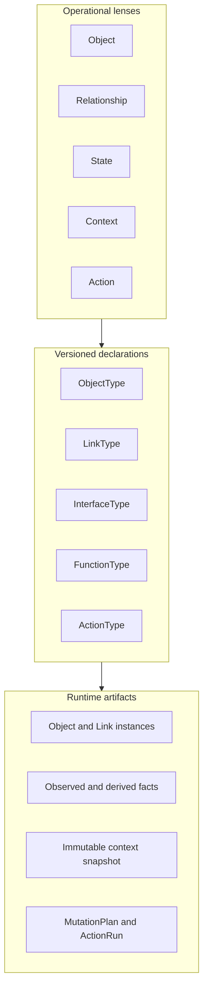
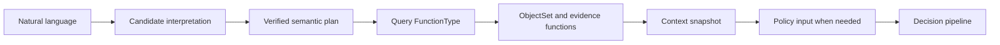

# FDAI 운영 온톨로지 메타모델

이 문서는 FDAI가 운영 의미, versioned 선언 및 런타임 근거를 구분하는 방식을 정의합니다.
객체, 관계, 상태, 맥락, 액션이라는 직관적 관점을 모든 관점마다 새로운 온톨로지
선언 종류를 만드는 방식 없이 견고하게 만듭니다.

> **결정:** 객체, 관계, 상태, 맥락, 액션은 다섯 가지 운영 관점입니다. 정본
> release 선언 종류는 객체, 링크, Interface, 함수, 액션으로 유지합니다. 상태와
> 맥락은 현재 release 스키마에서 선언 종류가 아니라 런타임 의미 산출물과 versioned
> 조회 pattern입니다.
>
> **권한 경계:** 상태 또는 맥락 산출물은 자율성을 유지하거나 낮출 수만 있습니다. 외부
> truth를 주장하거나 액션을 승인하거나 shared 변경 가능한 coordination 상태가 될 수 없습니다.

## 한눈에 보는 설계

두 그룹은 서로 다른 질문에 답합니다. Operational 관점은 운영자에게 도메인을 설명합니다.
선언 종류는 exact 내용 기반 주소를 가진 계약을 정의합니다. 런타임 산출물은 해당 계약
아래 값, 근거, 결정을 전달합니다.

## 다섯 가지 운영 관점

| 관점 | 질문 | FDAI 표현 |
|------|------|-----------|
| 객체 | 무엇이 존재합니까? | `OntologyObjectType` 및 `OntologyObjectRecord`입니다. |
| 관계 | 객체가 어떻게 연결됩니까? | `OntologyLinkType` 및 `OntologyLinkRecord`입니다. |
| 상태 | 무엇이 관측, 파생, 의도 또는 실행되었습니까? | 명시적 권한이 있는 타입이 지정된 객체, 관측, trajectory, 저널입니다. |
| 맥락 | 이 질문 또는 결정에 어떤 범위가 제한된 근거를 사용했습니까? | Versioned 조회 프로파일 및 변경할 수 없는 맥락 스냅샷입니다. |
| 액션 | 어떤 safeguard에서 어떤 변경을 제안할 수 있습니까? | `OntologyActionType`, `MutationPlan`, `ActionRun`입니다. |

상태와 맥락은 operational 모델에서 일급이지만 새로운 `STATE` 및 `CONTEXT`
`OntologyDeclarationKind`가 필요하다는 뜻은 아닙니다. 선언 종류는 독립 호환성, exact
참조, 카탈로그 수명 주기, 생성된 소비자 표면이 필요하고 기존 종류로 표현할 수 없을 때만
정당화됩니다.

## 정본 선언 평면

| 종류 | 계약 | 현재 상태 |
|------|----------|-----------|
| `OBJECT` | 개체 형태, 키, 속성, 수명 주기, 출처 이력입니다. | 정본 release에서 활성 상태입니다. |
| `LINK` | 엔드포인트, cardinality, causal/temporal 의미입니다. | 정본 release에서 활성 상태입니다. |
| `ACTION` | 대상, 안전성 묶음, 계획 수립, 실행, postcondition입니다. | 정본 release에서 활성 상태입니다. |
| `FUNCTION` | 범위가 제한된 조회, derive, validate 또는 계획 연산입니다. | 정본 release에서 활성 상태입니다. |
| `INTERFACE` | 여러 ObjectType의 shared 의미 기능입니다. | Shared 계약과 release-builder support가 있으며 카탈로그/조립 통합이 남았습니다. |

`InterfaceType`은 상태 또는 맥락에 다른 스키마를 추가하기 전에 release에 들어가는 것이 좋습니다.
이를 통해 구체적인 ObjectType 신원을 보존하면서 `Operable`, `Observable`, `Ownable`,
`Recoverable` 등의 polymorphic 조회를 사용할 수 있습니다.

## 관계 direction 계약

LinkType은 구조적으로 directed 관계입니다. `from_type -> to_type`은 선언 direction이고,
`from_id -> to_id`는 이에 대응하는 런타임 인스턴스 direction입니다. 별도의 범용 `direction`
필드를 추가하면 엔드포인트와 중복되거나 모순될 수 있으므로 현재 metamodel에는 추가하지 않습니다.
다만 `Resource -> Resource`와 같은 same-type 링크는 엔드포인트 타입만으로 출처와 대상의 의미를
설명할 수 없으므로 의미 역할을 명시해야 합니다.

| 차원 | 계약 |
|------|------|
| Stored 엔드포인트 direction | 모든 링크를 `from`에서 `to` 방향으로 읽습니다. Cardinality도 이 순서로 해석합니다. |
| 의미 direction | LinkType 이름, description 및 검토된 대응이 출처/대상 역할을 정의합니다. 역할을 뒤집는 변경은 breaking 의미 변경입니다. |
| 탐색 direction | 조회는 `outgoing`, `incoming`, `both` 중 하나를 선택합니다. 탐색은 저장된 링크를 다시 쓰지 않습니다. |
| Causal direction | `is_causal`이 true이면 출처는 후보 원인이고 대상은 후보 효과입니다. 이 플래그 자체가 causality를 입증하지는 않습니다. |
| Temporal 정렬 | `temporal_order`는 matching 대상을 `order_by_property`로 정렬합니다. 링크를 뒤집거나 causality를 주장하지 않습니다. |
| Symmetry 및 inverse | 하나의 directed 기록은 reverse를 의미하지 않습니다. 명시적 symmetric-link 계약이 release되기 전에는 bidirectionality에 검증된 기록 두 개가 필요합니다. |

초기 Resource 관계 역할은 다음과 같습니다.

| LinkType | 정본 direction | 운영 해석 |
|----------|---------------------|-----------|
| `contains` | containing 상위 -> contained 하위 | Resource 그룹은 VM을 포함하고 VNet은 서브넷을 포함합니다. Parent-to-child 탐색으로 영향 descendant를 찾습니다. |
| `attached_to` | 연결된 리소스 -> 첨부 기준점 | NIC 또는 disk는 VM에 연결되고 비공개 엔드포인트는 대상에 연결됩니다. |
| `depends_on` | dependent -> 선행 조건 | VM은 참조하는 user-assigned 신원에 의존하고 워크로드는 필요한 데이터 서비스에 의존합니다. |
| `resource_classified_as` | 관찰된 Resource -> 검토된 ResourceType | 분류는 검토된 레지스트리 항목을 따르며 이름 또는 임베딩에서 형식을 추론하지 않습니다. |

프로바이더 필드 소유권은 의미 direction을 결정하지 않습니다. 예를 들어 VM 페이로드가 NIC
리소스 id를 포함해도 검토된 `attached_to` 링크는 NIC -> VM입니다. 따라서 프로바이더 대응은
출처 속성 경로, allowed 대상 프로바이더 타입, 의미 LinkType, 엔드포인트 orientation, 출처
스키마 다이제스트 및 근거 메서드를 기록합니다. 완전한 인벤토리 세대에서 두 엔드포인트
신원을 모두 관측하기 전까지는 후보 상태로 유지합니다. 엔드포인트 누락, orientation 모호함
또는 불완전한 커버리지가 있으면 링크를 만들지 않고 완전성을 낮춥니다.

Inverse 탐색은 일반적으로 조회 관심사입니다. FDAI는 inverse가 서로 다른 도메인 meaning,
출처 이력 또는 cardinality를 가질 때만 별도 이름의 inverse LinkType을 추가합니다. 피어링과 같은
symmetric 관계는 현재 스키마에서 independently supported directed 기록 두 개를 사용합니다.
향후 `is_symmetric` 또는 `inverse_link_type` 필드를 추가하려면 호환성 design이 필요하며 기존
기록을 retroactive하게 재해석할 수 없습니다.

## Direction 보강 계획

| 단계 | 변경 | 종료 기준 |
|------|------|-----------|
| D0 | 이 direction 계약과 VM adversarial 예시를 게시합니다. | 엔드포인트, 의미, 탐색, causal, temporal, inverse 및 symmetric direction을 구분할 수 있습니다. |
| D1 | 모든 shipped LinkType과 생산자를 정본 역할/cardinality에 맞춰 감사합니다. | `contains`, `attached_to`, `depends_on` 선언, Azure/Kubernetes 변환 결과, 소유권 룰 및 테스트가 하나의 orientation에 동의합니다. |
| D2 | 명시적 엔드포인트 orientation과 source-schema 출처 이력이 있는 검토된 프로바이더 관계 대응을 추가합니다. | 프로바이더 참조 소유권이 온톨로지 direction을 암묵적으로 선택할 수 없습니다. |
| D3 | 완전한, missing-endpoint, reversed-input, 중복 및 partial-coverage 고정본을 추가합니다. | 검증된 링크만 활성 그래프에 들어가며 모호한/불완전한 경로는 absent 상태로 보고됩니다. |
| D4 | 이행 전에 기존 그래프 세대와 aligned 그래프 세대를 shadow 비교합니다. | Directional 조회 및 blast-radius 차이가 측정, 검토, 재생 가능하며 롤백 포인터를 갖습니다. |

저장된 링크 해석을 바꾸는 direction 또는 cardinality 수정에는 새 LinkType major 버전이나 명시적
그래프 이행이 필요합니다. Historical 맥락 스냅샷을 제자리에서 수정하지 않습니다.

## 상태 모델

FDAI는 하나의 변경 가능한 `state` bag을 저장하지 않고 권한에 따라 상태를 구분합니다.

| 상태 레인 | 예 | 권한 및 표현 |
|------------|----|-------------------|
| 관찰된 | 프로바이더 power 상태, 프로비저닝 결과, 메트릭 샘플입니다. | 권위 있는 프로바이더/텔레메트리 증적 이후 owned 변환 결과 또는 `Observation`입니다. |
| Derived operational | Healthy, degraded, 리소스 pressure, 예측 risk입니다. | Versioned derive 함수와 변경할 수 없는 근거/uncertainty입니다. |
| Desired | SLO, RTO, 예산, 검토된 구성입니다. | Approved 정책, 구성 또는 effective-time 목표입니다. |
| 실행 | Planned, dispatched, 검증된, rolled back입니다. | 프로세스 저널, `ActionRun`, 결과, 감사 원장입니다. |

모든 decision-relevant 상태 사실은 다음 필드를 기록하거나 해석합니다.

- 권한 등급 및 인증된 출처 신원
- 출처 개정 번호 및 출처 이력 다이제스트
- effective 시간, 이벤트 시간, 기록된 시간, 근거 기준 시점
- 최신성 정책, 완전성, synthetic 상태
- derived 값의 algorithm 또는 함수 버전
- 변경할 수 없는 근거 참조 및 충돌 상태

High-frequency 텔레메트리는 샘플마다 Resource 객체를 다시 쓰지 않습니다. 권위 있는 근거
출처에 유지합니다. Owning 변환 결과가 위 필드를 보존할 수 있을 때만 범위가 제한된 관측 또는
derived 평가가 그래프에 들어갑니다. Late 근거는 새 산출물을 만들며 historical 결정이
사용한 맥락을 다시 쓰지 않습니다.

## 맥락 모델

맥락에는 서로 다른 두 형태가 있습니다.

1. **조회 프로파일:** 조회 FunctionType, ObjectSet 정의, 필수 링크 경로, historical
 근거 함수, 최신성 룰, 완전성 정책, 리소스 상한을 선택하는 검토된/versioned
 읽기 pattern입니다.
2. **맥락 스냅샷:** 기준 시점에서 프로파일을 한 번 변경할 수 없는/내용 기반 주소를 가진 구체화한
 결과입니다. Exact 객체/링크 개정 번호, 상태 사실, 근거 경로, 출처 watermark, temporal
 exclusion, 충돌, 잘림 사유, 자율성 상한을 포함합니다.

조회 프로파일은 catalog-as-code와 `query` FunctionType으로 표현합니다. 변경 가능한 맥락 객체가 아니며
`CONTEXT` 선언 종류가 필요하지 않습니다. 기존 `OperationalContextSnapshot`은 첫 맥락
스냅샷 구현이며 교체하지 않고 확장하는 것이 좋습니다.

에이전트는 맥락 스냅샷을 편집하지 않습니다. 새로운 근거가 필요하면 accountable materializer에
새 스냅샷을 요청합니다. 맥락은 입력/재생 산출물이며 authority-bearing collaboration 채널이
아닙니다.

## Operational 의도 흐름

Lexical matching, 임베딩, 모델은 후보만 만듭니다. 후보는
`VerifiedSemanticPlan`이 되기 전에 exact 온톨로지 release, 의미 카탈로그, 인자 및 검토된
근거를 해석해야 합니다. 검증된 계획도 실행 권한이 없습니다.

Current-state 그래프 읽기와 historical 근거는 서로 다른 연산입니다. `ObjectSetDefinition`은
현재 그래프를 선택합니다. 메트릭, 로그, 활동, 감사, retained trajectory는 동일 조회 계획의 범위가 제한된
함수입니다. `as_of` 값이 현재 인스턴스 저장소를 bitemporal 데이터베이스로 바꾸지 않습니다. 저장소
계약이 권위 있는 관측 기준 시점 또는 watermark를 제공하기 전까지 secured 게이트웨이는 최대
5초로 구성한 skew 안의 trusted 현재 evaluation 기준 시점만 허용합니다. 그 밖의 과거 또는 미래 값은
historical 완전성 점유로 취급하지 않고 명시적으로 지원하지 않는으로 차단합니다.

모든 읽기에 OPA/Rego가 필요한 것은 아닙니다. OPA/Rego는 필요한 경우 범위가 제한된 타입이 지정된 입력을 대상으로
접근, 정책, 액션 충족 여부를 평가합니다. 온톨로지를 검색하거나 프로바이더 API를 호출하지 않습니다.

## 소유권

| 산출물 | Accountable 소유자 |
|----------|-------------------|
| 프로바이더 관측 및 토폴로지 유입 | Huginn이며 권위 있는 인벤토리 변환 결과는 mechanical 쓰기 담당입니다. |
| 런타임 관측, 발견 사항, 예측, 독립적인 결과 근거 | Heimdall입니다. |
| 비용 및 용량 상태 사실 | Owned 참고용 객체에 대해 Njord 및 Freyr입니다. |
| Chaos 실험 상태 | Loki입니다. |
| 변경할 수 없는 operational 맥락 스냅샷 | Muninn입니다. |
| 결정 사례 및 판정 | Forseti입니다. |
| Cross-objective 중재 | Odin입니다. |
| Human 승인 기록 | Var입니다. |
| 액션 실행 및 시도 | Thor입니다. |
| 복구 및 롤백 결과 | Vidar입니다. |
| 감사 기록 | Saga입니다. |
| 카탈로그 수명 주기 및 promoted 의미 표면 | Mimir입니다. |
| Natural-language 렌더링 및 후보 translation | Bragi이며 결정/실행 쓰기는 없습니다. |

Infrastructure projector는 소유자의 타입이 지정된 출력을 저장할 수 있지만 hidden 에이전트가 되지 않습니다. 각
변환 결과는 one 쓰기 담당, 개정 번호 fence, replacement가 가능한 경우 owned-identity 매니페스트, 완전한
감사/발신함 경로를 유지합니다.

## 차단하는 설계

- 관찰된, desired, derived, 실행 값을 섞는 범용 변경 가능한 `State` 객체
- 에이전트가 공유하는 변경 가능한 `Context` 캐시
- 자율성을 직접 높이거나 권한을 부여하는 상태 값
- Command 또는 graph-write 증적에서 provider-observed 상태를 갱신하는 동작
- 한계/최신성 증적 없이 high-frequency 텔레메트리를 인스턴스 그래프에 복사하는 동작
- 질문 예시를 배포 객체 인스턴스로 저장하는 동작. 검토된 의미 언어 카탈로그에
 속하며 검증 전에는 후보 전용입니다.
- Competency 고정본이 ObjectType, InterfaceType, 조회 FunctionType으로 필요한 호환성 계약을
 표현할 수 없음을 입증하기 전에 `STATE` 또는 `CONTEXT` 선언 종류를 추가하는 동작

## 가산 제공 순서

| Wave | 변경 | 종료 기준 |
|------|------|-----------|
| M0 | 이 metamodel 결정, direction 계약 및 adversarial 고정본입니다. | 선언, 런타임, direction, 권한, 시간, 소유권 계층이 명확합니다. |
| M1 | 의미 InterfaceType을 `OntologyRelease`에 포함합니다. | Interface 다이제스트, exact 참조, 호환성, empty-input backward-compatibility 테스트가 통과합니다. |
| M2 | 계획/호출 계보를 포함해 범위가 제한된 ObjectSet을 materialize하는 조회 FunctionType을 추가합니다. | 용도, release, 잘림, 근거 증적이 종단 간으로 보존됩니다. |
| M3 | 기존 ObjectType 및 함수 출력으로 state-fact 필드와 링크 관측 메타데이터를 표준화합니다. | 관찰된/derived 사실이 혼동되지 않고 stale/conflicting 사실이 자율성을 낮춥니다. |
| M4 | `read_investigation` 의도 하나를 shadow 검증된 조회 프로파일로 옮깁니다. | 기존 결과와 ontology-native 결과가 일치하거나 차이가 명시적으로 남습니다. |
| M5 | D1-D4 이후 competency-driven 네트워크 및 텔레메트리 관계 커버리지를 추가합니다. | VM connectivity 및 Pod 텔레메트리 체인이 올바른 방향의 검증된/검증되지 않은 구간을 보고합니다. |

`StateType` 또는 `ContextType`은 M3/M4에서 ObjectType, InterfaceType, FunctionType, exact release 참조,
변경할 수 없는 스냅샷으로 표현할 수 없는 호환성 요구사항이 발생한 뒤에만 future
declaration-kind 제안이 됩니다.

## 구현 상태

### 구현 범위

| 영역 | 상태 | 근거 | 참고 |
|------|------|------|------|
| 정본 선언 release | implemented | [`ontology_catalog.py`](../../../services/core-control-plane/src/fdai/rule_catalog/schema/ontology_catalog.py), [`release.py`](../../../services/core-control-plane/src/fdai/shared/ontology/release.py), [`test_ontology_catalog.py`](../../../services/core-control-plane/tests/rule_catalog/test_ontology_catalog.py) | 객체, 링크, 액션, Interface, 함수 선언이 exact release에 기여합니다. |
| 범위가 제한된 ObjectSet 실행 및 계보 | implemented | [`semantic_query.py`](../../../services/core-control-plane/src/fdai/core/ontology_platform/semantic_query.py), [`test_interfaces_and_object_sets.py`](../../../services/core-control-plane/tests/core/ontology_platform/test_interfaces_and_object_sets.py), [`test_semantic_query.py`](../../../services/core-control-plane/tests/core/ontology_platform/test_semantic_query.py) | 보안 조회 경로는 권한을 부여하지 않으면서 release, 계획, 호출, 잘림, 근거 참조를 보존합니다. |
| 프로바이더 상태 및 관계 근거 계약 | implemented | [`state_evidence.py`](../../../services/core-control-plane/src/fdai/shared/providers/state_evidence.py), [`test_state_evidence.py`](../../../services/core-control-plane/tests/providers/test_state_evidence.py) | 타입이 지정된 메타데이터는 관측된 상태와 링크 근거를 파생 해석과 구분합니다. |
| 관계 direction 및 분류 보강 | in-progress | 이 문서의 direction 계약 및 `resource_classified_as` 설계와 범위가 제한된 프로바이더/카탈로그 검사 | 저장소 근거는 아직 D1-D4 감사, 검토된 모든 Azure/Kubernetes 매핑, 모든 adversarial 고정본 또는 재생 가능한 운영 그래프 이행을 하나의 완료된 경로로 입증하지 않습니다. |
| 네트워크 및 Pod 텔레메트리 competency | in-progress | [`operational_functions.py`](../../../services/core-control-plane/src/fdai/core/ontology_platform/operational_functions.py)와 이 문서의 M5 종료 기준 | 함수 구현은 존재하지만 문서화된 종단 간 운영 competency 및 보존된 live-assurance 증적은 완료되지 않았습니다. |
| 운영 메타모델 보증 | in-progress | 위의 focused 소스 및 테스트 근거 | 이 문서가 운영 검증을 주장하려면 인증된 cross-service 및 운영 증적이 더 필요합니다. |

### 구현 이력

| 날짜 | 상태 | 변경 | 근거 | 남은 작업 |
|------|------|------|------|-----------|
| 2026-08-13 | in-progress | 구현 원장을 도입하고 집계된 production-ready 설명을 범위가 제한된 상태로 교체했습니다. 이전 출처 이력은 재구성하지 않았습니다. | `current change`; 구현 범위 표에 나열된 소스 및 focused 검사 | 아래 direction/분류 감사, M5 competency, 운영 보증 항목을 완료해야 합니다. |

### 남은 작업

- [ ] 검토된 Azure/Kubernetes 엔드포인트 매핑과 complete, missing-endpoint, reversed-input, duplicate, partial-coverage 고정본으로 D1-D4를 완료하고 재생 가능한 그래프 비교 및 롤백 증적을 보존합니다.
- [ ] 운영 조립을 통해 검증된 구간과 검증되지 않은 구간을 구분하는 focused VM 연결 및 Pod 텔레메트리 competency 검사로 M5를 입증합니다.
- [ ] 운영 메타모델 보증을 `validated`로 변경하기 전에 exact 온톨로지 release를 바인딩하는 인증된 cross-service 및 live-assurance 증적을 보존합니다.

## 검증 체크리스트

- Interpretation에 영향을 주는 모든 선언이 release 다이제스트에 포함됩니까?
- 모든 상태 사실이 권한, 출처 이력, 시간, 최신성, 완전성을 식별합니까?
- 모든 LinkType이 cardinality와 일치하는 하나의 source-to-target 의미 reading을 정의합니까?
- 링크를 다시 쓰지 않고 들어오는, 나가는, inverse 및 symmetric 탐색을 구분할 수 있습니까?
- 런타임이 외부 관측, derived interpretation, desired 의도, 실행 진행 상황을 구분합니까?
- 모든 맥락이 변경할 수 없는, 범위가 제한된, replayable하며 하나의 materializer가 소유합니까?
- 누락되거나 잘린된 경로가 자율성을 유지하거나 낮출 수만 있습니까?
- 모든 의미 후보가 exact 근거 검증 전까지 non-authoritative 상태입니까?
- 모든 액션이 judgment, risk, 승인, 실행, 복구, 감사에 다시 진입합니까?
- 모든 provider-observed 효과가 독립적인 권위 있는 관측으로만 종료됩니까?

## 관련 문서

| 알아볼 내용 | 문서 |
|-------------|------|
| 도메인 객체, 관계, 시간, 소유권 | [FDAI 운영 온톨로지](operating-ontology-ko.md) |
| ObjectSet, 함수, 액션, writeback 경계 | [온톨로지 안전 인프라](operating-ontology-platform-ko.md) |
| Constitutional 권한 | [FDAI 헌법](fdai-constitution-ko.md) |
| Natural-language 및 모델 경계 | [LLM 전략](llm-strategy-ko.md) |
| 액션 safeguard | [액션 온톨로지](../decisioning/action-ontology-ko.md) |
