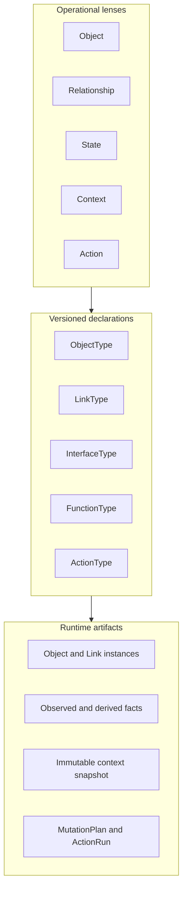
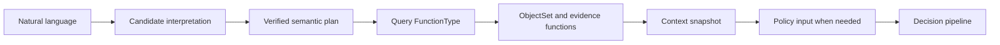

# FDAI Operating Ontology Metamodel

This document defines how FDAI separates operational meaning from versioned declarations and
runtime evidence. It hardens the intuitive Object, Relationship, State, Context, and Action view
without turning every view into a new ontology declaration kind.

> **Decision:** Object, Relationship, State, Context, and Action are the five operational lenses.
> The canonical release declaration kinds remain Object, Link, Interface, Function, and Action.
> State and Context are runtime semantic artifacts and versioned query patterns, not declaration
> kinds in the current release schema.
>
> **Authority boundary:** A state or context artifact can preserve or lower autonomy. It cannot
> assert external truth, approve an action, or become shared mutable coordination state.
>
> **Implementation status (2026-08-08):** Object, Link, Action, Function, and supplied Interface
> declarations can enter canonical releases. `OntologyInterfaceType` is a shared contract, and
> `build_ontology_release` preserves the prior digest when no interfaces are supplied. The
> production catalog and composition roots do not yet supply Interface declarations, so M1 remains
> incomplete. State and context behavior exists through typed ObjectTypes,
> `OperationalStateTrajectory`, and `OperationalContextSnapshot`.

## Design at a glance

The two groups answer different questions. Operational lenses explain the domain to an operator.
Declaration kinds define exact, content-addressed contracts. Runtime artifacts carry values,
evidence, and decisions under those contracts.

## Five operational lenses

| Lens | Question | FDAI representation |
|------|----------|---------------------|
| Object | What exists? | `OntologyObjectType` and `OntologyObjectRecord`. |
| Relationship | How are objects connected? | `OntologyLinkType` and `OntologyLinkRecord`. |
| State | What was observed, derived, desired, or executed? | Typed objects, observations, trajectories, and journals with explicit authority. |
| Context | Which bounded evidence was used for this question or decision? | A versioned query profile and immutable context snapshot. |
| Action | What change may be proposed under which safeguards? | `OntologyActionType`, `MutationPlan`, and `ActionRun`. |

State and Context are first-class in the operational model, but that does not require new
`STATE` and `CONTEXT` values in `OntologyDeclarationKind`. A declaration kind is justified only
when it needs independent compatibility, exact references, catalog lifecycle, and generated
consumer surfaces that cannot be expressed by the existing kinds.

## Canonical declaration plane

| Kind | Contract | Current status |
|------|----------|----------------|
| `OBJECT` | Entity shape, key, properties, lifecycle, provenance. | Active in canonical releases. |
| `LINK` | Endpoints, cardinality, causal and temporal semantics. | Active in canonical releases. |
| `ACTION` | Target, safety envelope, planning, execution, and postconditions. | Active in canonical releases. |
| `FUNCTION` | Bounded query, derive, validate, or plan operation. | Active in canonical releases. |
| `INTERFACE` | Shared semantic capability across ObjectTypes. | Shared contract and release-builder support exist; catalog and composition integration remain. |

`InterfaceType` should enter the release before State or Context receives another schema. This
unblocks `Operable`, `Observable`, `Ownable`, `Recoverable`, and similar polymorphic queries while
preserving concrete ObjectType identity.

## State model

FDAI separates state by authority rather than storing one mutable `state` bag.

| State lane | Examples | Authority and representation |
|------------|----------|------------------------------|
| Observed | Provider power state, provisioning result, metric sample. | Authoritative provider or telemetry receipt, then owned projection or `Observation`. |
| Derived operational | Healthy, degraded, resource pressure, forecast risk. | Versioned derive function plus immutable evidence and uncertainty. |
| Desired | SLO, RTO, budget, reviewed configuration. | Approved policy, configuration, or effective-time objective. |
| Execution | Planned, dispatched, verified, rolled back. | Process journal, `ActionRun`, outcome, and audit ledger. |

Every decision-relevant state fact records or resolves these fields:

- authority class and authenticated source identity;
- source revision and provenance digest;
- effective time, event time, recorded time, and evidence cutoff;
- freshness policy, completeness, and synthetic status;
- algorithm or function version for a derived value;
- immutable evidence references and conflict status.

High-frequency telemetry does not rewrite a Resource object for every sample. It remains in its
authoritative evidence source. A bounded observation or derived assessment enters the graph only
when an owning projection can preserve the fields above. Late evidence creates a new artifact and
never rewrites the context used by a historical decision.

## Context model

Context has two separate forms:

1. **Query profile:** A reviewed, versioned read pattern that selects a query FunctionType,
   ObjectSet definitions, required link paths, historical evidence functions, freshness rules,
   completeness policy, and resource ceilings.
2. **Context snapshot:** One immutable, content-addressed materialization of that profile at a
   cutoff. It contains exact object and link revisions, state facts, evidence paths, source
   watermarks, temporal exclusions, conflicts, truncation reasons, and an autonomy ceiling.

A query profile is represented by catalog-as-code plus a `query` FunctionType. It is not a mutable
Context object and does not need a `CONTEXT` declaration kind. The existing
`OperationalContextSnapshot` is the first context-snapshot implementation and should be extended,
not replaced.

An agent never edits a context snapshot. When newer evidence is required, it requests a new
snapshot from the accountable materializer. Context is an input and replay artifact, never an
authority-bearing collaboration channel.

## Operational intent flow

Lexical matching, embeddings, and models produce candidates only. A candidate must resolve the
exact ontology release, semantic catalog, arguments, and reviewed evidence before it becomes a
`VerifiedSemanticPlan`. The verified plan still has no execution authority.

Current-state graph reads and historical evidence are different operations. `ObjectSetDefinition`
selects the current graph. Metrics, logs, activity, audit, and retained trajectories are bounded
functions in the same query plan. An `as_of` value does not turn the current instance store into a
bitemporal database.

OPA/Rego is not mandatory for every read. It evaluates access, policy, and action eligibility over
a bounded typed input when those decisions are required. It does not search the ontology or call a
provider API.

## Ownership

| Artifact | Accountable owner |
|----------|-------------------|
| Provider observation and topology ingress | Huginn, with the authoritative inventory projection as mechanical writer. |
| Runtime observations, findings, forecasts, and independent outcome evidence | Heimdall. |
| Cost and capacity state facts | Njord and Freyr for their owned advisory objects. |
| Chaos experiment state | Loki. |
| Immutable operational context snapshots | Muninn. |
| Decision cases and verdicts | Forseti. |
| Cross-objective arbitration | Odin. |
| Human approval records | Var. |
| Action runs and attempts | Thor. |
| Recovery and rollback outcomes | Vidar. |
| Audit records | Saga. |
| Catalog lifecycle and promoted semantic surfaces | Mimir. |
| Natural-language rendering and candidate translation | Bragi, with no decision or execution write. |

Infrastructure projectors may persist an owner's typed output, but they do not become hidden
agents. Each projection keeps one writer, revision fencing, owned-identity manifests where
replacement is possible, and a complete audit or outbox path.

## Rejected designs

- A generic mutable `State` object that mixes observed, desired, derived, and execution values.
- A mutable `Context` cache shared by agents.
- A state value that directly raises autonomy or grants permission.
- Provider-observed state updated from a command or graph-write receipt.
- High-frequency telemetry copied into the instance graph without bounds and freshness receipts.
- Question examples stored as deployment object instances. They belong to a reviewed semantic
  language catalog and remain candidate-only until verified.
- Adding `STATE` or `CONTEXT` declaration kinds before a competency fixture proves that ObjectType,
  InterfaceType, and query FunctionType cannot express the required compatibility contract.

## Additive delivery sequence

| Wave | Change | Exit criteria |
|------|--------|---------------|
| M0 | This metamodel decision and adversarial fixtures. | Declaration, runtime, authority, time, and ownership layers are unambiguous. |
| M1 | Include semantic InterfaceTypes in `OntologyRelease`. | Interface digest, exact ref, compatibility, and empty-input backward-compatibility tests pass. |
| M2 | Add a query FunctionType that materializes bounded ObjectSets with plan and invocation lineage. | Purpose, release, truncation, and evidence receipts survive end to end. |
| M3 | Standardize state-fact fields and link observation metadata using existing ObjectTypes and function outputs. | Observed and derived facts cannot be confused; stale or conflicting facts lower autonomy. |
| M4 | Move one `read_investigation` intent through a verified query profile in shadow. | Existing and ontology-native results agree or differences remain explicit. |
| M5 | Add competency-driven network and telemetry relationship coverage. | VM connectivity and Pod telemetry chains report verified and unverified segments. |

`StateType` or `ContextType` becomes a future declaration-kind proposal only after M3 or M4
produces a compatibility requirement that cannot be represented by ObjectType, InterfaceType,
FunctionType, exact release refs, and immutable snapshots.

## Verification checklist

- Does every declaration that affects interpretation contribute to the release digest?
- Does every state fact identify authority, provenance, time, freshness, and completeness?
- Can the runtime distinguish external observation, derived interpretation, desired intent, and
  execution progress?
- Is every context immutable, bounded, replayable, and owned by one materializer?
- Can a missing or truncated path only preserve or lower autonomy?
- Does every semantic candidate remain non-authoritative until exact evidence verification?
- Does every action still re-enter judgment, risk, approval, execution, recovery, and audit?
- Can every provider-observed effect close only through independent authoritative observation?

## Related docs

| To learn about | Read |
|----------------|------|
| Domain objects, relationships, time, and ownership | [FDAI Operating Ontology](operating-ontology.md) |
| ObjectSet, functions, actions, and writeback boundaries | [Ontology Safety Infrastructure](operating-ontology-platform.md) |
| Constitutional authority | [FDAI Constitution](fdai-constitution.md) |
| Natural-language and model boundaries | [LLM Strategy](llm-strategy.md) |
| Action safeguards | [Action Ontology](../decisioning/action-ontology.md) |
