# FDAI Operating Ontology Metamodel

This document defines how FDAI separates operational meaning from versioned declarations and
runtime evidence. It hardens the intuitive Object, Relationship, State, Context, and Action view
without turning every view into a new ontology declaration kind.

> **Decision:** Object, Relationship, State, Context, and Action are the five operational lenses.
> The canonical release declaration kinds remain Object, Link, Interface, Function, and Action.
> State and Context are runtime semantic artifacts and versioned query patterns, not declaration
> kinds in the current release schema.
>
> **Authority boundary:** A state or context artifact can preserve or lower autonomy. It cannot
> assert external truth, approve an action, or become shared mutable coordination state.

## Design at a glance

The two groups answer different questions. Operational lenses explain the domain to an operator.
Declaration kinds define exact, content-addressed contracts. Runtime artifacts carry values,
evidence, and decisions under those contracts.

## Five operational lenses

| Lens | Question | FDAI representation |
|------|----------|---------------------|
| Object | What exists? | `OntologyObjectType` and `OntologyObjectRecord`. |
| Relationship | How are objects connected? | `OntologyLinkType` and `OntologyLinkRecord`. |
| State | What was observed, derived, desired, or executed? | Typed objects, observations, trajectories, and journals with explicit authority. |
| Context | Which bounded evidence was used for this question or decision? | A versioned query profile and immutable context snapshot. |
| Action | What change may be proposed under which safeguards? | `OntologyActionType`, `MutationPlan`, `KineticSafetyReceipt`, and `ActionRun`. |

State and Context are first-class in the operational model, but that does not require new
`STATE` and `CONTEXT` values in `OntologyDeclarationKind`. A declaration kind is justified only
when it needs independent compatibility, exact references, catalog lifecycle, and generated
consumer surfaces that cannot be expressed by the existing kinds.

## Canonical declaration plane

| Kind | Contract | Current status |
|------|----------|----------------|
| `OBJECT` | Entity shape, key, properties, lifecycle, provenance. | Active in canonical releases. |
| `LINK` | Endpoints, cardinality, causal and temporal semantics. | Active in canonical releases. |
| `ACTION` | Target, safety envelope, planning, execution, and postconditions. | Active in canonical releases. |
| `FUNCTION` | Bounded query, derive, validate, or plan operation. | Active in canonical releases. |
| `INTERFACE` | Shared semantic capability across ObjectTypes. | Shared contract and release-builder support exist; catalog and composition integration remain. |

`InterfaceType` should enter the release before State or Context receives another schema. This
unblocks `Operable`, `Observable`, `Ownable`, `Recoverable`, and similar polymorphic queries while
preserving concrete ObjectType identity.

## Relationship direction contract

A LinkType is directed by construction. `from_type -> to_type` is the declaration direction, and
`from_id -> to_id` is the matching runtime-instance direction. A separate generic `direction`
field would duplicate these endpoints and could contradict them, so the current metamodel does not
add one. Direction still needs explicit semantic roles because same-type links such as
`Resource -> Resource` cannot explain source and target meaning from their endpoint types alone.

| Dimension | Contract |
|-----------|----------|
| Stored endpoint direction | Read every link from `from` to `to`. Cardinality is interpreted in that order. |
| Semantic direction | The LinkType name, description, and reviewed mapping define source and target roles. Reversing those roles is a breaking semantic change. |
| Traversal direction | A query chooses `outgoing`, `incoming`, or `both`; traversal never rewrites the stored link. |
| Causal direction | When `is_causal` is true, the source is the candidate cause and the target is the candidate effect. The flag does not prove causality. |
| Temporal ordering | `temporal_order` sorts matching targets by `order_by_property`; it does not reverse the link or assert causality. |
| Symmetry and inverse | One directed record never implies its reverse. Bidirectionality requires two verified records until an explicit symmetric-link contract is released. |

The initial Resource relationship roles are:

| LinkType | Canonical direction | Operational reading |
|----------|---------------------|---------------------|
| `contains` | containing parent -> contained child | A resource group contains a VM; a VNet contains a subnet. Parent-to-child traversal finds impact descendants. |
| `attached_to` | attached resource -> attachment anchor | A NIC or disk is attached to a VM; a private endpoint is attached to its target. |
| `depends_on` | dependent -> prerequisite | A VM depends on a referenced user-assigned identity; a workload depends on a required data service. |
| `resource_classified_as` | observed Resource -> reviewed ResourceType | Classification follows a reviewed registry entry and never infers type from a name or embedding. |

Provider field ownership does not decide semantic direction. For example, a VM payload may contain
a NIC resource id, while the reviewed `attached_to` link is still NIC -> VM. A provider mapping
therefore records the source property path, allowed target provider types, semantic LinkType,
endpoint orientation, source schema digest, and evidence method. It remains a candidate until a
complete inventory generation observes both endpoint identities. Missing endpoints, an ambiguous
orientation, or incomplete coverage produces no link and lowers completeness.

The reviewed `id.providerParent` path is narrower than generic ARM hierarchy inference. It applies
only to declared nested provider types with an explicit mapping. Current mappings cover SQL
databases, Communication email domains, DNS resolver inbound endpoints, and AKS AgentPools. The
reviewed `id.providerRoot` path separately resolves a File Share to its top-level storage account.
Top-level resources and malformed provider paths produce no provider-parent or provider-root
candidate.
If this exact mapping and a wildcard containment mapping claim the same child, the exact mapping
shadows the wildcard candidate. This preserves `contains` one-to-many cardinality and aligns the
stored edge with `Resource.parent_id`; containment mappings for different child ids still compose.

Reviewed reference formats now distinguish provider ids, exact identities, resolved names,
resolved UIDs, and Kubernetes label selectors. The Kubernetes projector maps exact cluster and
namespace containment, AgentPool-to-Node containment, Pod scheduling, controller ownership,
Service selectors, and same-name Endpoints within one cluster and namespace. A bounded
Kubernetes API inventory source supplies immutable UIDs and enriches one complete provider
generation before atomic promotion. Every link still requires independent complete-generation
verification before it can enter the active graph.

An inverse traversal is normally a query concern. FDAI adds a separately named inverse LinkType
only when the inverse has distinct domain meaning, provenance, or cardinality. A symmetric
relationship such as peering uses two independently supported directed records in the current
schema. A future `is_symmetric` or `inverse_link_type` field requires a compatibility design and
cannot retroactively reinterpret existing records.

## Direction hardening plan

| Step | Change | Exit criteria |
|------|--------|---------------|
| D0 | Publish this direction contract and VM adversarial examples. | Endpoint, semantic, traversal, causal, temporal, inverse, and symmetric direction are distinguishable. |
| D1 | Audit every shipped LinkType and producer against canonical roles and cardinality. | `contains`, `attached_to`, and `depends_on` declarations, Azure/Kubernetes projections, ownership rules, and tests agree on one orientation. |
| D2 | Add reviewed provider relationship mappings with explicit endpoint orientation and source-schema provenance. | Provider reference ownership cannot silently choose ontology direction. |
| D3 | Add complete, missing-endpoint, reversed-input, duplicate, and partial-coverage fixtures. | Only verified links enter the active graph; ambiguous or incomplete paths remain absent and reported. |
| D4 | Shadow-compare old and aligned graph generations before migration. | Directional query and blast-radius differences are measured, reviewed, replayable, and covered by a rollback pointer. A distinct reviewer and non-empty regression receipts can produce only a catalog PR proposal, never migration authority. |

A direction or cardinality correction that changes the interpretation of persisted links requires a
new LinkType major version or an explicit graph migration. It never edits historical context
snapshots in place.

The promotion assessment binds the comparison receipt, both generation digests, regression
receipts, distinct requester and reviewer identities, review time, and rebuild pointer. Approval
means that a catalog pull request can be proposed. It does not mark the comparison migration-ready,
mutate the graph, execute a migration, or rewrite a historical snapshot.

## State model

FDAI separates state by authority rather than storing one mutable `state` bag.

| State lane | Examples | Authority and representation |
|------------|----------|------------------------------|
| Observed | Provider power state, provisioning result, metric sample. | Authoritative provider or telemetry receipt, then owned projection or `Observation`. |
| Derived operational | Healthy, degraded, resource pressure, forecast risk. | Versioned derive function plus immutable evidence and uncertainty. |
| Desired | SLO, RTO, budget, reviewed configuration. | Approved policy, configuration, or effective-time objective. |
| Execution | Planned, dispatched, verified, rolled back. | Process journal, pre-dispatch `KineticSafetyReceipt`, `ActionRun`, outcome, and audit ledger. |

The kinetic safety receipt is a content-addressed execution-state artifact, not a new declaration
kind. It binds an existing exact V2 `MutationPlan` to one Action and omits raw Action arguments.
Post-execution consumers can resolve the stored plan but cannot reconstruct or upgrade a legacy
Action. The receipt grants no judgment, approval, execution, observation, or promotion authority.

Every decision-relevant state fact records or resolves these fields:

- authority class and authenticated source identity;
- source revision and provenance digest;
- effective time, event time, recorded time, and evidence cutoff;
- freshness policy, completeness, and synthetic status;
- algorithm or function version for a derived value;
- immutable evidence references and conflict status.

High-frequency telemetry does not rewrite a Resource object for every sample. It remains in its
authoritative evidence source. A bounded observation or derived assessment enters the graph only
when an owning projection can preserve the fields above. Late evidence creates a new artifact and
never rewrites the context used by a historical decision.

## Context model

Context has two separate forms:

1. **Query profile:** A reviewed, versioned read pattern that selects a query FunctionType,
   ObjectSet definitions, required link paths, historical evidence functions, freshness rules,
   completeness policy, and resource ceilings.
2. **Context snapshot:** One immutable, content-addressed materialization of that profile at a
   cutoff. It contains exact object and link revisions, state facts, evidence paths, source
   watermarks, temporal exclusions, conflicts, truncation reasons, and an autonomy ceiling.

A query profile is represented by catalog-as-code plus a `query` FunctionType. It is not a mutable
Context object and does not need a `CONTEXT` declaration kind. The existing
`OperationalContextSnapshot` is the first context-snapshot implementation and should be extended,
not replaced.

An agent never edits a context snapshot. When newer evidence is required, it requests a new
snapshot from the accountable materializer. Context is an input and replay artifact, never an
authority-bearing collaboration channel.

## Operational intent flow

Lexical matching, embeddings, and models produce candidates only. A candidate must resolve the
exact ontology release, semantic catalog, arguments, and reviewed evidence before it becomes a
`VerifiedSemanticPlan`. The verified plan still has no execution authority.

Current-state graph reads and historical evidence are different operations. `ObjectSetDefinition`
selects the current graph. Metrics, logs, activity, audit, and retained trajectories are bounded
functions in the same query plan. An `as_of` value does not turn the current instance store into a
bitemporal database. Until a store contract exposes an authoritative observation cutoff or
watermark, the secured gateway accepts only the trusted current evaluation cutoff within a
configured skew of at most five seconds. Other past or future values are explicitly unsupported,
never historical-completeness claims.

OPA/Rego is not mandatory for every read. It evaluates access, policy, and action eligibility over
a bounded typed input when those decisions are required. It does not search the ontology or call a
provider API.

## Ownership

| Artifact | Accountable owner |
|----------|-------------------|
| Provider observation and topology ingress | Huginn, with the authoritative inventory projection as mechanical writer. |
| Runtime observations, findings, forecasts, and independent outcome evidence | Heimdall. |
| Cost and capacity state facts | Njord and Freyr for their owned advisory objects. |
| Chaos experiment state | Loki. |
| Immutable operational context snapshots | Forseti, which materializes one snapshot at its own decision cutoff through `OperationalContextMaterializer`. |
| Decision cases and verdicts | Forseti. |
| Cross-objective arbitration | Odin. |
| Human approval records | Var. |
| Action runs and attempts | Thor. |
| Recovery and rollback outcomes | Vidar. |
| Audit records | Saga. |
| Catalog lifecycle and promoted semantic surfaces | Mimir. |
| Natural-language rendering and candidate translation | Bragi, with no decision or execution write. |

Infrastructure projectors may persist an owner's typed output, but they do not become hidden
agents. Each projection keeps one writer, revision fencing, owned-identity manifests where
replacement is possible, and a complete audit or outbox path.

## Rejected designs

- A generic mutable `State` object that mixes observed, desired, derived, and execution values.
- A mutable `Context` cache shared by agents.
- A state value that directly raises autonomy or grants permission.
- Provider-observed state updated from a command or graph-write receipt.
- High-frequency telemetry copied into the instance graph without bounds and freshness receipts.
- Question examples stored as deployment object instances. They belong to a reviewed semantic
  language catalog and remain candidate-only until verified.
- Adding `STATE` or `CONTEXT` declaration kinds before a competency fixture proves that ObjectType,
  InterfaceType, and query FunctionType cannot express the required compatibility contract.

## Additive delivery sequence

| Wave | Change | Exit criteria |
|------|--------|---------------|
| M0 | This metamodel decision, direction contract, and adversarial fixtures. | Declaration, runtime, direction, authority, time, and ownership layers are unambiguous. |
| M1 | Include semantic InterfaceTypes in `OntologyRelease`. | Interface digest, exact ref, compatibility, and empty-input backward-compatibility tests pass. |
| M2 | Add a query FunctionType that materializes bounded ObjectSets with plan and invocation lineage. | Purpose, release, truncation, and evidence receipts survive end to end. |
| M3 | Standardize state-fact fields and link observation metadata using existing ObjectTypes and function outputs. | Observed and derived facts cannot be confused; stale or conflicting facts lower autonomy. |
| M4 | Move one `read_investigation` intent through a verified query profile in shadow. | Existing and ontology-native results agree or differences remain explicit. |
| M5 | Add competency-driven network and telemetry relationship coverage after D1-D4. | VM connectivity and Pod telemetry chains report correctly oriented verified and unverified segments. |

`StateType` or `ContextType` becomes a future declaration-kind proposal only after M3 or M4
produces a compatibility requirement that cannot be represented by ObjectType, InterfaceType,
FunctionType, exact release refs, and immutable snapshots.

## Implementation status

### Implementation scope

| Area | State | Evidence | Notes |
|------|-------|----------|-------|
| Canonical declaration release | implemented | [`ontology_catalog.py`](../../../services/core-control-plane/src/fdai/rule_catalog/schema/ontology_catalog.py), [`release.py`](../../../services/core-control-plane/src/fdai/shared/ontology/release.py), and [`test_ontology_catalog.py`](../../../services/core-control-plane/tests/rule_catalog/test_ontology_catalog.py) | Object, Link, Action, Interface, and Function declarations contribute to an exact release. |
| Bounded ObjectSet execution and lineage | implemented | [`semantic_query.py`](../../../services/core-control-plane/src/fdai/core/ontology_platform/semantic_query.py), [`test_interfaces_and_object_sets.py`](../../../services/core-control-plane/tests/core/ontology_platform/test_interfaces_and_object_sets.py), and [`test_semantic_query.py`](../../../services/core-control-plane/tests/core/ontology_platform/test_semantic_query.py) | The secured query path preserves release, plan, invocation, truncation, and evidence references without granting authority. |
| Schema relationship conversation query | validated | [`relationship_queries.py`](../../../services/core-control-plane/src/fdai/core/ontology_platform/relationship_queries.py), [`wire_semantic_query.py`](../../../services/core-control-plane/src/fdai/composition/wire_semantic_query.py), [`semantic_turn_processor.py`](../../../services/core-control-plane/src/fdai_core_service/semantic_turn_processor.py), focused English/Korean composition, prompt, processor, and stale-release checks (`6 passed`), and authenticated Browser invocation `ontology-function:logic-invocation:e584c59db128d045eeea01aa68f878984dfce93da7f6189fb6f624dc26dded4c` | `query.ontology_relationships` reads exact ObjectType and LinkType declarations, preserves direction, cardinality, and description, renders English or Korean, and fixes `execution_authority=false`. The standard Browser Entra path returned verified release-bound evidence without an unavailable disposition. |
| Principal manifest conversation query | implemented | [`manifest_queries.py`](../../../services/core-control-plane/src/fdai/core/ontology_platform/manifest_queries.py), [`wire_semantic_query.py`](../../../services/core-control-plane/src/fdai/composition/wire_semantic_query.py), and focused manifest and composition checks (`42 passed`) | `query.manifest` projects exact readable declaration identity through a bounded table and invocation receipt. It adds no declaration kind, provider read, mutation, approval, or execution authority. |
| Provider state and relationship evidence contracts | implemented | [`state_evidence.py`](../../../services/core-control-plane/src/fdai/shared/providers/state_evidence.py) and [`test_state_evidence.py`](../../../services/core-control-plane/tests/providers/test_state_evidence.py) | Typed metadata distinguishes observed state and link evidence from derived interpretation. |
| Kinetic execution-state artifact | implemented | [`reconciliation_artifacts.py`](../../../services/core-control-plane/src/fdai/delivery/reconciliation_artifacts.py) and focused adversarial tests (`15 passed`) | A bounded immutable delivery receipt binds one existing exact V2 plan without storing raw Action arguments or granting authority. The pre-dispatch writer and independent observation source remain open. |
| Global provider schema accounting | implemented | [`provider-schema-catalog`](../../../provider-schema-catalog/index.json); [`semantic review receipt`](../../../provider-schema-catalog/azure/reviews/0cf18200498c344e53078193d9c8eaf2568c4c134f5f92088be7b529c3223b85.json.gz); `provider_schema.py`; `provider_relationship_schema.py`; `provider_schema_relationship_review.py`; `provider_schema_state_ledger.py`; [`ProviderSchemaDriftProjector`](../../../services/core-control-plane/src/fdai/shared/providers/provider_schema.py); focused parser, ledger, review, watcher, agent, catalog, and infrastructure checks | The pinned Azure Bicep corpus retains 3,405 unique types and explicit dispositions for all of them. A pinned Azure REST corpus separately retains 6,896 ARM ID references, including 4,707 exact and 2,189 unresolved references. The exact references produce 908 endpoint pairs in a content-addressed review receipt: 46 have both endpoint types modeled, 56 source only, 213 target only, and 593 neither. Eight existing reviewed mapping IDs overlap those pairs. The retained semantic review package preserves `review_required`, fixes automatic promotion to false, and grants no authority. Pair expansion, durable file count, per-file bytes, and generation bytes are bounded. Hydration publishes only a fully verified staged generation, and manifest publication uses revision CAS with an atomic audit entry. The composition root injects the strict delivery projector through a provider Protocol; Heimdall has no delivery import and holds when the projector is unavailable. The 62 modeled types remain a reviewed semantic subset. The daily Job sends strict material packages through Heimdall's existing shadow `object.drift` ownership. The review receipt does not infer LinkType or orientation, and no record grants ontology or execution authority. |
| Versioned relationship candidate materialization | implemented | `provider_schema_relationship_generation.py`; `provider_schema_relationship_ledger.py`; `provider_schema_relationship_review.py`; `provider_relationship_mapping.py`; `test_provider_schema_relationship_generation.py`; `direction_shadow` exact-release comparator | Exact provider-schema and REST evidence digests, recomputed review digest, every semantic mapping field including catalog cardinality, provider type@version identity, mapping revision, projection manifest, explicit direction/cardinality/link metadata, changed-type invalidation, bounded candidates, rollback, and replay are content addressed. The active pointer validates its generation digest and cannot be tampered into graph or migration authority. Partial, stale, duplicate, or mixed-release inputs remain inert; ledger writes serialize through a lock and unique staging files; promotion is proposal-only with graph and migration authority fixed false. |
| Relationship direction and classification hardening | in-progress | The direction contract and `resource_classified_as` design in this document; [`kubernetes_relationships.py`](../../../services/core-control-plane/src/fdai/delivery/kubernetes_relationships.py), [`kubernetes_api_inventory.py`](../../../services/core-control-plane/src/fdai/delivery/kubernetes_api_inventory.py), [`direction_shadow`](../../../services/core-control-plane/src/fdai/core/ontology_platform/direction_shadow), focused tests, and retained receipt `sha256:ad64c267b6f0c6ac5a1a037067f926aa5613f1fe5a84702877eb607e368736f6`. | D1 and D3 are implemented with reviewed Azure and Kubernetes producers. A real D4 comparison is replayable and retained as `review_required`; the historical release is unbound and the aligned generation is incomplete with unverified links, so it isn't migration evidence. |
| Network and Pod telemetry competency | in-progress | [`operational_functions.py`](../../../services/core-control-plane/src/fdai/core/ontology_platform/operational_functions.py), [`kubernetes_api_inventory.py`](../../../services/core-control-plane/src/fdai/delivery/kubernetes_api_inventory.py), [`kubernetes_inventory.py`](../../../services/core-control-plane/src/fdai/delivery/kubernetes_inventory.py), focused inventory and Pod telemetry checks. | Production inventory composition collects UID-grounded Kubernetes runtime records when exact endpoint, public CA, cluster, and workload-identity bindings are configured. The inventory identity receives only AKS RBAC Reader and acquires a short-lived audience token at request time. No static Kubernetes token enters Terraform, environment configuration, or the ledger. No retained live Kubernetes receipt exists yet. |
| Production metamodel assurance | in-progress | Focused source and test evidence above. | Authenticated cross-service and operational receipts are still required before this document can claim production validation. |

### Implementation history

| Date | State | Change | Evidence | Remaining |
|------|-------|--------|----------|-----------|
| 2026-08-13 | in-progress | Adopted the implementation ledger and replaced the aggregate production-ready narrative with bounded states; earlier provenance was not reconstructed. | `current change`; the source and focused checks listed in the scope table. | Complete the direction and classification audit, M5 competency, and production assurance items below. |
| 2026-08-13 | in-progress | Added reviewed Kubernetes Service selector and Endpoints mappings plus a bounded candidate projector that fails closed on missing, duplicate, reversed-order, and partial input. | `current change`; `test_kubernetes_relationships.py` reports 6 passed and the focused provider catalog test reports 1 passed. | Complete the D1 producer audit, retain D4 comparison and rollback evidence, and bind the projector through production inventory composition. |
| 2026-08-13 | in-progress | Reconciled the existing D4 implementation instead of creating a duplicate comparator. The content-addressed receipt already measures directional queries and blast radius, supports exact replay, and carries a no-authority rebuild pointer. | Commit `18be5ab02`; focused `pytest -q services/core-control-plane/tests/core/ontology_platform/direction_shadow` reports 6 passed. | Run the comparator over retained legacy and aligned production generations, review the differences, and preserve the resulting receipt before migration. |
| 2026-08-13 | in-progress | Added an exact D1 catalog audit for all 17 shipped provider relationship mappings so a single semantic direction or reference-format regression cannot load silently. | `current change`; focused `test_shipped_relationship_mappings_match_canonical_endpoint_roles` reports 1 passed. | Audit the remaining runtime producers and relationship ownership rules against the same canonical roles. |
| 2026-08-13 | implemented | Completed the bounded D1 audit across Resource LinkType declarations, reviewed mappings, Azure and Kubernetes producers, complete-generation verification, and delta ownership. | `current change`; the exact declaration audit reports 1 passed and the combined producer/ownership audit reports 13 passed. | Retain a reviewed D4 receipt from real legacy and aligned production generations before migration. |
| 2026-08-13 | in-progress | Added production-composition M5 checks that invoke the issued Pod telemetry function over a release-pinned Resource and Observation Interface. Complete evidence returns four verified segments, while a synthetic sample remains unverified with no health or execution authority. | `current change`; focused `test_wire_pod_telemetry.py` reports 2 passed. | Bind the Kubernetes projector to retained production inventory and preserve authenticated live-assurance evidence on the same ontology release. |
| 2026-08-14 | implemented | Bound every newly built inventory ontology projection result, durable manifest, and status to the exact catalog release used by the inventory job. Invalid or absent release digests fail before projection. Historical manifests are not assigned a reconstructed release. | `current change`; focused `test_inventory_ontology.py` reports 9 passed. | Refresh inventory after central validation, then retain release-bound D4 and M5 evidence from new generations; historical comparison remains review-required. |
| 2026-08-14 | in-progress | Allowed retained graph generations to preserve an explicitly unbound release and captured a replay-identical D4 comparison in the deployment-local StateStore. The receipt reports 607 added, 0 removed, and 0 reversed links and grants no migration or graph authority. | `current change`; focused direction-shadow suite reports 8 passed; StateStore receipt `sha256:ad64c267b6f0c6ac5a1a037067f926aa5613f1fe5a84702877eb607e368736f6` has `review_required` with `legacy_release_unbound`, `aligned_generation_incomplete`, and `aligned_link_evidence_unverified`. | Review the measured differences and capture a complete aligned generation with verified link metadata before migration. |
| 2026-08-14 | implemented | Bound the reviewed Kubernetes relationship projector through the common promoted-inventory observation path and injected the shipped mapping catalog from scheduled and local inventory composition. | `current change`; the focused inventory observer test reports 1 passed and the two caller-wiring checks report 2 passed. | Add an authoritative Kubernetes inventory source and retain exact-release Pod telemetry evidence; current Azure inventory doesn't supply Kubernetes workload objects. |
| 2026-08-24 | implemented | Added the bounded Kubernetes API inventory source and composed it as pre-promotion enrichment over the Azure generation. Exact cluster, namespace, UID ownership, scheduling, selector, and Endpoints evidence now stages resources and independently verified links atomically; unconfigured bindings stay explicitly unavailable. | `current change`; focused Azure, Kubernetes, inventory, catalog, and composition checks passed 260 cases; Ruff passed; strict mypy passed for 10 source files. | Retain live exact-release Kubernetes and Pod telemetry receipts before changing runtime assurance to `validated`. |
| 2026-08-24 | implemented | Added a separate global provider-schema evidence catalog and policy-aware watcher. The pinned Azure Bicep revision materializes 3,405 unique types, preserves all unused and preview-only types, classifies 62 as modeled, and keeps breaking drift as an inert review package without advancing the accepted baseline. | `current change`; shipped snapshot `sha256:7a54ebeccbafc0aabc5ec7ed01580d6688f9b745c1aab26c3344497fafe047f2`; focused provider-schema behavior, Ruff, and strict mypy checks. | Add `azure-rest-api-specs` relationship-reference extraction, bind the scheduled Job, and route material drift through Heimdall's existing `Drift` ownership before claiming periodic governed review. |
| 2026-08-24 | implemented | Pinned `azure-rest-api-specs`, separated exact ARM ID targets from unresolved official shapes, and bound the 6,896-reference artifact to the Bicep snapshot digest. Added PostgreSQL hydrate/persist, a daily read-only Container Apps Job, and actual Heimdall publication through the production Pantheon bridge. Added tokenless AKS inventory authentication with short-lived workload-identity credentials. | `current change`; relationship evidence `sha256:ec37e62f5f15b31ced04b731ab4857f0d8724fcd205bd5a1b3d9972736961a11`; focused provider, agent, durable-ledger, inventory, Terraform validation, and infrastructure checks. | Retain one deployed watcher receipt with Saga audit and one live release-bound Kubernetes topology receipt before claiming operational validation. |
| 2026-08-24 | implemented | Classified every exact OpenAPI ARM ID reference into deterministic endpoint-pair coverage and existing reviewed-mapping overlap without assigning semantic direction. The content-addressed receipt keeps all 908 pairs at `review_required` and fixes automatic promotion to false. | `current change`; relationship review `sha256:f8e8029888b45137902ee4900b644704b60a673fc4c623cfdb968cdcfa70c802`; focused review and shipped-artifact replay checks. | Independently review any selected pair's property semantics, LinkType, orientation, endpoint observations, and regression evidence before adding or changing a semantic mapping. |
| 2026-08-24 | implemented | Bounded exact endpoint-pair expansion and durable ledger generation size, made hydration publish a verified staged generation atomically, and fenced manifest replacement with revision CAS plus an audit entry. Added an exact provider-schema chain regression from Heimdall shadow drift through Forseti human review to Saga audit. | `current change`; focused relationship-review, durable-ledger, and provider-schema agent-chain checks. | Retain the same chain from a protected deployed revision and preserve its durable generation and audit references before claiming operational validation. |
| 2026-08-14 | implemented | Added a bounded delivery-owned kinetic execution-state receipt and immutable artifact adapter for exact pre-dispatch V2 plans without changing the legacy Action schema. | `current change`; focused adversarial tests passed 15 cases; strict mypy and task-scoped Ruff passed. | Bind the writer before dispatch and add a verified independent observation source before enabling ordinary production reconciliation. |
| 2026-08-14 | implemented | Added the exact-release `query.ontology_relationships` FunctionType, production semantic binding, schema-constrained planner guidance, and deterministic localized answer projection for ObjectType relationship questions. | `current change`; focused English/Korean composition, prompt, localized processor, and stale-release checks passed 6 cases. | Restart the local stack and retain one authenticated Browser receipt for the original relationship question before claiming runtime validation. |
| 2026-08-14 | validated | Asked the original Korean `PythonTask` and `VmTaskRun` relationship question through the authenticated standard Browser Entra Console. The verified query returned `VmTaskRun -> PythonTask`, `executes_task`, `many_to_one`, the immutable-artifact description, exact-release evidence, and `execution_authority=false`. | Commit `5202a10ba`; Browser invocation `ontology-function:logic-invocation:e584c59db128d045eeea01aa68f878984dfce93da7f6189fb6f624dc26dded4c`; ontology release `sha256:9e95d5618570d7a69fbdf5bea33b24f2c242ddaa0a4bae123b41608858ec788c`; execution receipt `sha256:f0af7b596fd10bf172c405cfd790e013678398e038aeb6acb60117264fd9b031`. | No residual work remains for the schema relationship conversation query. Wider production metamodel assurance remains open below. |
| 2026-08-15 | implemented | Added an exact-release principal manifest FunctionType for schema inventory questions without adding a declaration kind or authority path. | `current change`; focused manifest, handler, composition, relationship, semantic composition, and prompt checks passed 42 cases; task-scoped Ruff and strict mypy passed. | Retain clean bilingual 14-cell and seeded 100-case Browser evidence before changing wider production assurance. |
| 2026-08-26 | implemented | Added `Microsoft.ContainerService/managedClusters` as a private endpoint connection target and an agent-pool subnet mapping, then replayed the shipped semantic review receipt. Reviewed-mapping overlap moves from seven to eight pairs while every coverage count, `review_required`, and automatic promotion stay fixed. | `current change`; relationship review `sha256:241764e6a330bec539922652fcf7ff018bba27cba790f54d0464827a0e0b6c2b`; focused catalog, mapping, review-replay, and live AKS promotion checks. | The private cluster control-plane endpoint and the agent-pool subnet were both observed in Azure but unlinked, so absence never proved a missing path. |
| 2026-08-27 | implemented | Added versioned provider relationship candidate materialization with exact schema and evidence release checks, explicit direction/cardinality/link metadata, changed-subset invalidation, append-only proposal rollback/replay, and exact-release direction-shadow comparison. The existing bounded Kubernetes API inventory is sufficient as the authoritative topology source; lifecycle observations remain a separate Event source and are not duplicated. | `current change`; `provider_schema_relationship_generation.py`; focused generation and direction-shadow tests (`22 passed`); Ruff, formatter, and strict mypy passed. | Capture complete release-bound real-generation evidence and governed human review; no live or remote generation was fabricated. |
| 2026-08-27 | implemented | Hardened versioned relationship materialization after independent review: every semantic field is checked against the reviewed mapping, review digests and candidate endpoints are revalidated, type@version identities survive invalidation, exact-release replay mode is persisted, and the ledger serializes record/rollback with unique staging files. | `current change`; `provider_schema_relationship_generation.py`; `provider_schema_relationship_review.py`; `provider_schema_relationship_ledger.py`; `provider_relationship_mapping.py`; `direction_shadow`; focused adversarial tests (`43 passed`); Ruff, formatter, and strict mypy passed. | Capture complete release-bound real-generation evidence and governed human review; no live or remote generation was fabricated. |
| 2026-08-27 | implemented | Closed the remaining review gaps: unresolved and source-less ARM references now make candidate generations incomplete, provider type versions use a globally sorted union, and rebuild, graph, execution, and migration authority literals are enforced at runtime. | `current change`; generation, direction-shadow models, promotion assessment, and focused adversarial tests (`38 passed`); Ruff, formatter, and strict mypy passed. | Capture complete release-bound real-generation evidence and governed human review; no live or remote generation was fabricated. |

### Remaining work

- [x] Retain a replayable D4 comparison and rebuild pointer from real inventory generations as `review_required`; receipt `sha256:ad64c267b6f0c6ac5a1a037067f926aa5613f1fe5a84702877eb607e368736f6` preserves the unbound historical release and grants no migration authority.
- [ ] Review the retained D4 differences and capture a new receipt from a complete release-bound aligned generation with verified link metadata before any migration decision.
- [x] Bind the reviewed Kubernetes relationship projector through production and local inventory composition and verify that supplied Service, Pod, and Endpoints records produce independently verified links.
- [x] Add an authoritative bounded Kubernetes API inventory source and bind it through the existing single-writer promotion path.
- [ ] Run the VM connectivity and Pod telemetry competency checks against retained live inventory evidence on the exact release.
- [x] Retain every type in one pinned global Azure schema baseline and keep raw provider coverage separate from active semantic declarations.
- [x] Extract exact and unresolved ARM ID relationship candidates from a pinned `azure-rest-api-specs` revision and bind the artifact to the exact provider-schema digest.
- [x] Classify all exact ARM ID references into a content-addressed, no-authority endpoint-pair review receipt without inferring LinkType or orientation.
- [ ] Independently review any selected exact endpoint pair before adding it to the ontology or Rule catalog; the raw and classified provider evidence remains inert.
- [x] Materialize selected candidates only with explicit direction, cardinality, link metadata, exact release digests, and projection-manifest identity; invalidate changed provider type/version subsets and retain proposal-only rollback/replay evidence.
- [x] Bind the provider-schema watcher to a durable scheduled Job and route material drift through Heimdall's existing `object.drift` ownership.
- [ ] Retain a deployed provider-schema run and Saga audit receipt on one exact application revision.
- [ ] Retain authenticated cross-service and live-assurance receipts that bind the exact ontology release before changing production metamodel assurance to `validated`.
- [x] Retained authenticated Browser invocation `ontology-function:logic-invocation:e584c59db128d045eeea01aa68f878984dfce93da7f6189fb6f624dc26dded4c`, which shows that the original ObjectType relationship question returns the exact LinkType direction, cardinality, description, release-bound evidence, and `execution_authority=false`.
- [ ] Bind the kinetic receipt writer before provider dispatch and retain independent-observation
    evidence without reconstructing a plan for legacy Actions.

## Verification checklist

- Does every declaration that affects interpretation contribute to the release digest?
- Does every state fact identify authority, provenance, time, freshness, and completeness?
- Does every LinkType define one source-to-target semantic reading consistent with its cardinality?
- Can incoming, outgoing, inverse, and symmetric traversal be distinguished without rewriting links?
- Can the runtime distinguish external observation, derived interpretation, desired intent, and
  execution progress?
- Is every context immutable, bounded, replayable, and owned by one materializer?
- Can a missing or truncated path only preserve or lower autonomy?
- Does every semantic candidate remain non-authoritative until exact evidence verification?
- Does every action still re-enter judgment, risk, approval, execution, recovery, and audit?
- Can every provider-observed effect close only through independent authoritative observation?

## Related docs

| To learn about | Read |
|----------------|------|
| Domain objects, relationships, time, and ownership | [FDAI Operating Ontology](operating-ontology.md) |
| ObjectSet, functions, actions, and writeback boundaries | [Ontology Safety Infrastructure](operating-ontology-platform.md) |
| Constitutional authority | [FDAI Constitution](fdai-constitution.md) |
| Natural-language and model boundaries | [LLM Strategy](llm-strategy.md) |
| Action safeguards | [Action Ontology](../decisioning/action-ontology.md) |
