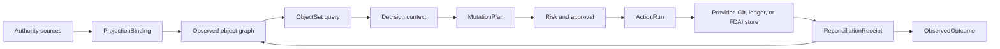

# FDAI 온톨로지 안전 인프라

이 문서는 운영 온톨로지를 FDAI 에이전트를 위한 typed infrastructure layer로 확장합니다. Object
polymorphism, bounded object set, semantic action effect, typed function, authority-aware writeback,
exact schema pinning, generated SDK surface를 추가합니다. 모든 runtime transition은 여전히
에이전트가 소유하며 이 primitive는 input, plan, effect verification을 제한합니다.

> **권한 경계:** 관측된 provider state는 projection으로 유지됩니다. Action은 provider, Git,
> ledger 또는 FDAI-owned state change를 요청할 수 있지만 ontology graph를 편집하여 외부 사실을
> 참으로 만들 수 없습니다.
>
> **안전 경계:** Function은 plan, query, derive 또는 validate만 수행합니다. Thor만 승인된
> `MutationPlan`을 실행하며 모든 외부 effect는 독립 reconciliation으로 종료합니다.
>
> **구현 상태(2026-08-01):** Canonical release, ActionBuilder output, in-memory ontology write에
> K0 contract identity를 구현했습니다. K1 semantic interface compilation과 bounded ObjectSet
> query도 구현했습니다. K2-K5 core primitive는 mutation plan, stale revision check, typed
> function, projection binding, reconciliation, scoped SDK generation, read-only manifest를
> 포함합니다. PostgreSQL object/link write는 exact type version과 release digest를 보존하며,
> production ActionBuilder composition은 전체 loaded release를 사용합니다. 기존 Reader-gated
> `GET /ontology/graph` projection은 release digest, proposal-only write surface,
> `mutation_authority: false`를 노출하며 mutation route를 추가하지 않습니다.
> Pre-migration row는 original release digest를 정직하게 복원할 수 없으므로 명시적으로 unpinned
> 상태를 유지합니다. 다음 successful write는 완전히 다시 검증한 current-state revision을 새로
> 만들고 그 새 revision을 해당 시점의 active release로 pin합니다.
>
> **하드닝 상태(2026-08-01):** Release identity, persistence, interface compatibility, ObjectSet
> closure, mutation safety, function authority, projection, reconciliation, generated SDK syntax,
> manifest disclosure를 대상으로 10회 adversarial round를 수행했습니다. 검증된 Medium 이상 core
> finding을 수정했습니다. PostgreSQL 및 runtime integration finding도 수정했으며 residual finding은
> Low입니다. Round 12에서는 legacy read에 current release를 소급 할당하는 동작을 제거했습니다.
> Round 13에서는 successful update가 새로 검증한 current-state revision을 생성하고 pin하는 것을
> 확인했습니다.

## 한눈에 보는 설계

Infrastructure는 semantic declaration, authority-specific state, agent-owned kinetic execution을
분리합니다. Graph write, function result, generated SDK call 또는 `MutationPlan`은 accountable agent가
judgment, authorization, execution, independent effect verification을 완료할 때까지 proposal 또는
context로 유지됩니다.



## 정확한 type identity

모든 declaration은 하나의 immutable `OntologyRelease`에 속합니다. Runtime record는 자신을
해석한 정확한 declaration을 고정합니다.

```yaml
type_ref:
  name: Resource
  version: 2.1.0
  catalog_digest: sha256:<digest>
```

`Action`, `ActionRun`, ontology object, ontology link, audit record, generated plan은 exact reference를
보존합니다. Compatibility check는 `compatible`, `migration_required`, `incompatible` 중 하나를
반환합니다. 기존 record를 재해석하는 방식으로 release가 declaration을 in-place 교체할 수 없습니다.

## Semantic interface와 object set

`OntologyInterfaceType`은 기존 `ActionInterface` safety flag와 구별됩니다. Semantic interface는
property, required link, supported action, inherited interface를 선언합니다. Object type은 여러
interface를 구현할 수 있습니다. 초기 kernel interface는 `Operable`, `Ownable`, `Observable`,
`ObjectiveBound`, `Recoverable`, `CostBearing`입니다.

`ObjectSetDefinition`은 concrete type 또는 semantic interface로 object를 선택합니다. Typed property
predicate, named-link traversal, deterministic ordering, `as_of` cutoff, freshness, purpose, hard
result limit를 지원합니다. Free-form Cypher, SPARQL, SQL 또는 model text를 받지 않습니다. 모든
materialization은 release digest, cutoff, source watermark, truncation reason, redaction summary를
기록합니다.

## Semantic action과 mutation plan

`ActionType`은 기존 stop condition, rollback, impact scope, execution path, promotion gate, autonomy
ceiling을 유지합니다. Version 2는 다음 semantic field를 추가합니다.

- **Target:** Exact ObjectType 또는 InterfaceType reference와 one-or-set cardinality입니다.
- **Parameter:** Validation 및 redaction metadata가 있는 primitive, enum, struct, object-reference
  또는 object-set input입니다.
- **Read set:** Action plan 및 verification에 필요한 object set과 property입니다.
- **Submission criteria:** Deterministic criterion 또는 `validate` function reference입니다.
- **Planner:** Declarative effect rule 또는 하나의 signed `plan` function입니다.
- **Effect:** 예상 internal write, catalog pull request, provider command, notification 또는
  schedule입니다.
- **Postcondition:** Action outcome을 종료하는 independent observation입니다.
- **Transaction policy:** Internal atomicity 또는 external saga semantic, lock scope, maximum
  affected object count입니다.

Planning은 immutable `MutationPlan`을 만듭니다. Exact target revision, computed write set, command,
impact evidence, rollback 또는 compensation step, expected effect, digest를 포함합니다. Approval과
execution은 digest와 current revision을 다시 검증합니다. Stale plan은 planning 또는 사람 검토로
돌아가며 넓어진 scope로 실행되지 않습니다.

## Typed ontology function

`OntologyFunctionType`은 네 종류 중 하나입니다.

| 종류 | Output | Authority |
|------|--------|-----------|
| `query` | `ObjectSetDefinition` 또는 bounded data | Read only입니다. |
| `derive` | Typed scalar 또는 struct | Read only입니다. |
| `validate` | Evidence가 있는 typed criterion result | Eligibility를 낮출 수만 있습니다. |
| `plan` | Immutable `MutationPlan` | Proposal only입니다. |

Function은 exact input/output schema, read set, determinism class, artifact digest, publisher,
resource ceiling, network policy를 선언합니다. Executor identity를 받지 않으며 provider mutation을
직접 호출하지 않습니다.

## Authority-aware writeback과 projection

각 ObjectType은 하나의 authority class와 write policy를 선언합니다.

| Authority class | 예 | Write policy |
|-----------------|----|--------------|
| `catalog_owned` | Rule, ActionType, policy | Reviewed Git pull request입니다. |
| `fdai_owned` | Workflow draft, approval | Atomic state transaction과 outbox입니다. |
| `provider_observed` | Cloud resource, topology | Provider command 후 independent observation입니다. |
| `ledger_owned` | DecisionCase, ActionRun | Append only입니다. |
| `derived` | Forecast, pattern projection | Owning-agent projection입니다. |

`provider_observed` object에서는 성공한 API receipt가 state update가 아닙니다. Reconciliation은
intended effect를 fresh evidence와 비교하고 `matched`, `mismatched`, `timed_out`, `unscorable` 중
하나인 `ReconciliationReceipt`을 emit합니다. Authoritative projection만 observed state를 갱신합니다.

`ProjectionBinding`은 source-to-ontology mapping을 review 가능하게 만듭니다. Source identity, type
target, identity/property mapping, watermark behavior, freshness, deletion semantics, conflict policy,
batch limit를 선언합니다. Source는 다른 authority를 조용히 overwrite할 수 없습니다.

## Query, security, SDK surface

Security는 object, property, link, object set, action discovery, action submission, function invocation
경계에 적용됩니다. Visible link를 통해 숨겨진 endpoint가 노출되지 않습니다.

Ontology release는 scoped Python/TypeScript SDK와 OpenAPI metadata를 생성할 수 있습니다. Generator는
승인된 type과 capability만 포함합니다. Write method는 typed action proposal을 submit하며 executor를
호출하지 않습니다.

## 제공 순서

| Wave | Deliverable | 종료 기준 |
|------|-------------|-----------|
| K0 | Exact `OntologyTypeRef` 및 `OntologyRelease` pinning입니다. | Action, graph, audit, replay test가 exact version과 digest를 보존합니다. |
| K1 | Interface와 bounded object set입니다. | Concrete expansion, ACL, cutoff, truncation, query fixture가 통과합니다. |
| K2 | Semantic ActionType v2 및 `MutationPlan`입니다. | Plan digest, stale revision, impact, rollback, shadow no-mutation test가 통과합니다. |
| K3 | Typed function과 authority-aware reconciliation입니다. | Function이 mutate할 수 없고 모든 external effect가 typed closure에 도달합니다. |
| K4 | Projection binding과 schema migration입니다. | Snapshot/delta parity, watermark recovery, conflict, migration fixture가 통과합니다. |
| K5 | Generated SDK와 ontology application surface입니다. | Python/TypeScript compile test와 proposal-only write test가 통과합니다. |

새 field는 decoding에서 optional로 시작하지만 새로 만든 runtime record에는 필수입니다. Retained audit
및 instance fixture가 exact release에서 replay된 뒤에만 legacy decoding을 제거합니다.

## 검증 매트릭스

| 항목 | 필요한 증명 |
|------|-------------|
| Replay | Historical record가 같은 declaration과 plan digest를 resolve합니다. |
| Authority | Graph write가 permission을 부여하거나 external state를 주장할 수 없습니다. |
| Query safety | 모든 object set은 bounded, purpose checked, truncation 명시 상태입니다. |
| Action safety | Stop, rollback, impact, dry-run, lock, idempotency, audit가 필수로 유지됩니다. |
| Function safety | Query 및 planning code에 executor identity 또는 direct mutation path가 없습니다. |
| Reconciliation | Provider acceptance와 observed convergence가 별도 state로 유지됩니다. |

## 관련 문서

| 알아볼 내용 | 문서 |
|-------------|------|
| 기존 semantic 및 authority model | [FDAI 운영 온톨로지](operating-ontology-ko.md) |
| 기존 ActionType safety contract | [Action 온톨로지](../decisioning/action-ontology-ko.md) |
| Runtime execution authority | [실행 모델](../decisioning/execution-model-ko.md) |
| Repository 및 dependency boundary | [프로젝트 구조](project-structure-ko.md) |
