# FDAI 온톨로지 안전 인프라

이 문서는 운영 온톨로지를 FDAI 에이전트를 위한 타입이 지정된 infrastructure 계층으로 확장합니다. 객체
polymorphism, 범위가 제한된 객체 집합, 의미 액션 효과, 타입이 지정된 함수, authority-aware writeback,
exact 스키마 pinning, 생성된 SDK 표면을 추가합니다. 모든 런타임 전이는 여전히
에이전트가 소유하며 이 기본 요소는 입력, 계획, 효과 검증을 제한합니다.

> **권한 경계:** 관측된 프로바이더 상태는 변환 결과로 유지됩니다. 액션은 프로바이더, Git,
> 원장 또는 FDAI-owned 상태 변경을 요청할 수 있지만 온톨로지 그래프를 편집하여 외부 사실을
> 참으로 만들 수 없습니다.
>
> **안전 경계:** 함수는 계획, 조회, derive 또는 validate만 수행합니다. Thor만 승인된
> `MutationPlan`을 실행하며 모든 외부 효과는 독립 조정으로 종료합니다.
>
> **구현 상태(2026-08-08):** 정본 release, ActionBuilder 출력, in-memory 온톨로지 쓰기에
> K0 계약 신원을 구현했습니다. K1 의미 인터페이스 compilation과 범위가 제한된 ObjectSet
> 조회도 구현했습니다. K2-K5 코어 기본 요소는 변경 계획, stale 개정 번호 검사, 타입이 지정된
> 함수, 변환 결과 연결, 조정, scoped SDK 세대, 읽기 전용 매니페스트를
> 포함합니다. PostgreSQL 객체/링크 쓰기는 exact 타입 버전과 release 다이제스트를 보존하며,
> 운영 ActionBuilder 조립은 전체 loaded release를 사용합니다.
> PostgreSQL은 각 exact 객체/링크 release 매니페스트도 `ontology_release`에 저장합니다.
> 시작 시 활성 매니페스트를 저장하고 이전 행을 디코딩하기 전에 등록된 모든 매니페스트를
> 로드합니다. 누락된 release, 매니페스트/다이제스트 불일치 및 선언/버전 불일치는 안전하게
> 차단됩니다. 기존 Reader-gated
> `GET /ontology/graph` 변환 결과는 release 다이제스트, proposal-only 쓰기 표면,
> `mutation_authority: false`를 노출하며 변경 경로를 추가하지 않습니다.
> Pre-migration 행은 original release 다이제스트를 정직하게 복원할 수 없으므로 명시적으로 unpinned
> 상태를 유지합니다. 다음 successful 쓰기는 완전히 다시 검증한 current-state 개정 번호를 새로
> 만들고 그 새 개정 번호를 해당 시점의 활성 release로 pin합니다.
> 의미 Interface 선언은 이제 shared 계약을 사용하며 정본 런타임 release에
> 포함됩니다. 운영 카탈로그 로딩은 `Identifiable`, `Ownable`, `Operable`, `Observable`,
> `Recoverable`, `ObjectiveBound`, `CostBearing`의 출처 이력, 상속, LinkType 및 ActionType
> 참조와 보수적인 explicit ObjectType 연결을 검증합니다. 조립은 polymorphic 카탈로그를
> exact release로 compile합니다.
> Bitemporal 토폴로지 기반은 provider-generation 신원, 이벤트/기록 시간, 완전한 스냅샷,
> delta 및 tombstone을 보존합니다. Pure `graph_at`/`topology_diff` 함수는 late 근거가 도착해도
> pinned `known_at` 재생을 보존하며 불완전한 이력은 absence를 입증할 수 없습니다. 타입이 지정된 조회
> 핸들러와 검증기 스키마는 프로바이더 텍스트 없이 이 함수를 노출합니다. Core-owned 이행은
> 삽입/읽기 전용 런타임 권한 부여를 가진 추가 전용 이력 표를 만듭니다. PostgreSQL 읽기 담당/쓰기 담당
> 조립과 inventory-promotion 발행은 남아 있습니다.
> 메트릭 의미는 문구 별칭 없이 exact 검토된 개념 id를 프로바이더 메트릭, 단위 및 집계로
> 해석합니다. Equal-duration 구간은 관찰된 zero와 누락된 데이터를 구분합니다. 범위가 제한된 causal 결합은
> 완전한 메트릭/토폴로지 근거를 요구하고 leakage-safe temporal analyzer를 재사용하며 falsifier와
> competing explanation을 보존하고 실행 권한을 부여하지 않습니다. 운영 프로바이더
> 연결과 카탈로그 항목은 남아 있습니다.
> 정본 release는 이제 타입이 지정된 함수 선언을 포함합니다. 함수 레지스트리는 호출자
> 에이전트, 역할, 용도를 검사하고, 선언된 stochastic 함수를 위해 replay-stable 시드를 파생하며,
> 정확한 release에 고정된 내용 기반 주소를 가진 호출 증적을 발행합니다.
> M5는 결정론적 `query.network_path_segments`, `query.pod_telemetry_path` FunctionType과
> `routes_to` 및 reciprocal `peered_with` 선언을 추가합니다. 범위가 제한된 composition-owned
> 발급자는 secured ObjectSet 결과를 기록하고 함수 핸들러는 호출 전에 exact dependency
> 다이제스트를 해석합니다. Contextual 콜백은 호출자 역할, singleton 용도, 온톨로지 release 및
> projected 결과 다이제스트를 `FunctionInvocationContext`에 연결하며, 발급되지 않았거나
> self-minted인 증적은 차단됩니다. Evaluation 시간은 증적의 trusted
> 관측 기준 시점과 정확히 같아야 합니다. 링크의 effective, 근거 및 기록된 시간은 이
> 기준 시점을 넘을 수 없고 최신성은 시각 연산 전에 1년으로 제한됩니다. Reciprocal
> 피어링에는 방향별로 구분된 관측 및 검증 증적 계보가 필요하며 두 방향에
> 같은 계보를 재사용하면 구간은 검증되지 않은으로 남습니다. 인벤토리 변환 결과는 링크
> 엔드포인트 타입이 관찰된 `ResourceRecord.type`과 충돌하면 차단합니다. 불완전한 그래프는
> `query_incomplete`를 반환하고 관련 네트워크 링크만 구간 한계를 소비합니다. FunctionType
> 산출물 다이제스트는 모듈 출처에서 파생되므로 행동 변경은 새 선언 신원을
> 만듭니다. 함수에는 네트워크, 자격 증명, 프로바이더, 변경 또는 실행 경로가 없습니다.
> 조정에는 in-memory 참조 원장과 함께 영속
> `StateStoreReconciliationLedger`가 구현되어 있습니다. 모든 시도를 하나의 조정
> 집계에 저장하고 atomic 생성 또는 개정 번호 compare-and-set을 사용하여 최종 결과와
> proposal-only 발신함 권고를 함께 커밋합니다. Strict 재생 검증은 malformed
> 또는 inconsistent 영속 상태를 차단합니다. Focused 테스트는 재시작 재생, 동시
> 전달, 충돌 detection, unscorable 시도에서 최종로의 전이를 검증합니다.
> 각 조정은 최대 8개 시도를 저장하며 마지막 자리는 최종 종결을 위해
> 예약합니다. 16 MiB 정본 집계 상한은 상태 또는 감사 쓰기 전에 oversized 영속
> 상태를 차단합니다. 운영 조립은 worker를 연결하고 독립적인 최종 reconciliation 뒤에만
> 변경 불가능한 다중 효과 계보를 구체화합니다.
> K6-K8은 변경할 수 없는 operational 상태 trajectory, 의존성 범위 효과 propagation,
> time-bounded 불변식, 독립 관측 trajectory 결과를 포함하는 graph-wide Dynamic 근거를
> 목표로 합니다. 기존 액션/메트릭 Dynamic 시뮬레이션은 구현되어 있으며 graph-wide propagation과
> failure-attribution 배선은 종료 기준을 통과할 때까지 전달 작업으로 남습니다.
>
> **하드닝 상태(2026-08-01):** release 신원, 영속성, 인터페이스 호환성, ObjectSet
> 종결, 변경 안전성, 함수 권한, 변환 결과, 조정, 생성된 SDK 구문,
> 매니페스트 공개를 대상으로 10회 adversarial 라운드를 수행했습니다. 검증된 Medium 이상 코어
> 발견 사항을 수정했습니다. PostgreSQL 및 런타임 통합 발견 사항도 수정했으며 잔여 발견 사항은
> Low입니다. 라운드 12에서는 이전 방식 읽기에 현재 release를 소급 할당하는 동작을 제거했습니다.
> 라운드 13에서는 successful 갱신이 새로 검증한 current-state 개정 번호를 생성하고 pin하는 것을
> 확인했습니다.

## 선언 워크벤치 제품 경계

워크벤치는 객체 중심 검사로 정확한 선언을 속성, 방향이 있는 관계, 액션, 종속 항목, 근거 상태,
영향 범위 및 release 호환성과 연결합니다. `/ontology` 레지스트리 검색과 카탈로그 토폴로지는
넓은 탐색 화면으로 유지합니다. 시각적 스키마 편집, 임의 release 업로드, 원시 인스턴스 table,
개인화 및 kernel icon metadata는 제외합니다. 변경은 catalog-as-code pull request로 유지하며
Console은 redaction, 호환성, 완전성 또는 권한을 계산하지 않습니다.

## 운영 역량 게이트

워크벤치는 다음과 같은 범위가 제한된 운영 질문에 정직하게 답할 때 완료됩니다.

| 역량 | 운영자 질문 | 필요한 변환 근거 |
|------|-------------|------------------|
| C1 - 신원 및 접근 | 이 선언의 정확한 신원은 무엇이며 이 principal은 무엇을 볼 수 있습니까? | Release 다이제스트, 선언 버전과 출처 이력, 역할/용도 필터링 및 redaction 사유입니다. |
| C2 - 관계 | 이 유형은 다른 유형과 어떻게 연결됩니까? | 기록된 incoming, outgoing 또는 self 방향, cardinality, causal/temporal 플래그 및 출처 이력입니다. |
| C3 - 종속 항목 | 어떤 카탈로그 선언이 이 유형에 의존합니까? | 결정론적 토폴로지 참조, 결과 상한 및 명시적 잘림 상태입니다. |
| C4 - 영향 범위 | 이 정확한 대상에서 어떤 활성 Resource에 도달할 수 있습니까? | 활성 스냅샷 세대와 기준 시점, 저장 방향, 깊이/간선 상한, 완전성 및 간선 검증 상태입니다. |
| C5 - 근거 상태 | 런타임 근거가 사용 가능하고 최신이며 완전합니까? 충돌하거나 합성된 상태입니까? | 정제된 원본 별칭, 세대, 기준 시점, 최신성, 충돌, 제외 사유 및 사용 불가 시 nullable count입니다. |
| C6 - 거버넌스 적용 액션 | 어떤 액션이 이 선언에 의미적으로 연결되어 있습니까? | 정확한 ObjectType 또는 InterfaceType 대상 근거와 전체 ActionType 안전성 계약이며 execute control은 없습니다. |
| C7 - 변경 안전성 | 보존된 두 release 사이에서 무엇이 바뀌었습니까? | 정확한 release 다이제스트, 선언 참조 추가/변경/제거, 호환성 판정, 이행 필요 여부 및 결정론적 diff 다이제스트입니다. |

## 구현 상태

### 구현 범위

| 영역 | 상태 | 근거 | 참고 |
|------|------|------|------|
| K0 exact release 신원 및 영속성 | implemented | [`release.py`](../../../services/core-control-plane/src/fdai/shared/ontology/release.py), [`postgres_ontology.py`](../../../services/core-control-plane/src/fdai/delivery/persistence/postgres_ontology.py), [`inventory_ontology.py`](../../../services/core-control-plane/src/fdai/runtime/inventory_ontology.py), [`20260813_0081_ontology_release_registry.py`](../../../alembic/versions/20260813_0081_ontology_release_registry.py), [`20260817_0085_historical_ontology_release.py`](../../../alembic/versions/20260817_0085_historical_ontology_release.py), focused 영속성/런타임 테스트 | Exact 신원, release에 고정된 쓰기, 재시작에 안전한 매니페스트 로딩, release에 결속된 인벤토리 변환 근거, 정확한 과거 객체/링크 release backfill이 존재합니다. 등록되지 않은 release는 계속 안전하게 차단됩니다. 이행 전 행과 과거 인벤토리 매니페스트는 정직하게 고정하지 않은 상태로 유지합니다. 운영 Live 근거는 아직 남아 있습니다. |
| 인벤토리 상태 사실 최신성과 분류 동등성 | implemented | `inventory_projection.py`, `inventory_ontology.py`, 예약 및 로컬 인벤토리 조립, 집중 변환 및 연결 검사 | 관측 상태 사실은 더 짧은 고정 유효 기간 대신 구성된 정상 조정 보장 시간을 선언합니다. 예약 및 로컬 변환기는 모두 검토된 ResourceType mapping digest를 받습니다. Exact revision 런타임 근거는 아직 남아 있습니다. |
| Exact-release 선언 워크벤치 변환 결과 | implemented | `delivery/ontology_{declaration,dependents,evidence_health,release_diff}_projection.py`; 로컬 권한 카탈로그 materializer; Operator operations family; focused 변환 및 route 검사 | ObjectType, LinkType, ActionType 상세는 정확한 release 신원을 보존합니다. 종속 항목은 카탈로그 토폴로지만 사용하고, 근거 상태는 0을 만들어 내지 않으며, 보존 release 비교는 변경 권한 없이 선언 참조 수준을 유지합니다. InterfaceType 및 FunctionType 전용 보기는 측정된 P2 진입 조건에 따라 deferred 상태입니다. |
| K1-K5 범위가 제한된 의미 조회 및 함수 인프라 | in-progress | [`semantic_planning_frame.py`](../../../services/core-control-plane/src/fdai/core/conversation/semantic_planning_frame.py), [`operational_functions.py`](../../../services/core-control-plane/src/fdai/core/ontology_platform/operational_functions.py), [`incident_queries.py`](../../../services/core-control-plane/src/fdai/core/ontology_platform/incident_queries.py), [`kubernetes_api_inventory.py`](../../../services/core-control-plane/src/fdai/delivery/kubernetes_api_inventory.py), [`kubernetes_inventory.py`](../../../services/core-control-plane/src/fdai/delivery/kubernetes_inventory.py), [`test_inventory_sync.py`](../../../services/core-control-plane/tests/delivery/test_inventory_sync.py), [`test_wire_pod_telemetry.py`](../../../services/core-control-plane/tests/composition/test_wire_pod_telemetry.py) | Core 기본 요소, 범위가 제한된 인시던트 근거, UID에 근거한 Kubernetes API 수집, 원자적 런타임 enrichment 및 발급된 Pod 조립 검사가 존재합니다. 인시던트 조회는 근거가 있는 기록에서만 근본 원인을 노출할 수 있습니다. Kubernetes 링크는 독립적으로 검증되며 실행 권한을 부여하지 않습니다. 인증된 인시던트 및 Kubernetes 실제 운영 근거는 아직 남아 있습니다. |
| 정확한 대상 상태 근거 FunctionType | validated | `semantic_health_planning.py`, `resource_health_assessment_queries.py`, `query_source_handlers.py`, 운영 의미 조립, 집중 검사 및 인증된 Console 증적 | 소스에서 파생한 결정론적 FunctionType은 정확한 현재 상태, 범위가 제한된 활동, 검토된 메트릭 구간을 결합합니다. 파생 상태는 근거 충분성, 수명 주기, 확인되지 않은 준비 상태 및 애플리케이션 상태, 안정성, 리소스 압력, 최신성, 공백만 보고할 수 있습니다. 외부 사실을 단정하거나 불완전한 근거를 숨기거나 실행 권한을 부여할 수 없습니다. 재시작 후 같은 질문 실행은 노드 7개를 모두 완료하고 사용할 수 없는 모든 소스를 공백으로 보존했습니다. |
| 정확한 대상 오류/활동 상관 FunctionType | validated | `semantic_error_activity_planning.py`, `resource_error_activity_correlation_queries.py`, 운영 의미 조립, 집중 검사 및 인증된 Console 증적 | 소스에서 파생한 결정론적 FunctionType은 이어지는 동일 길이의 요청 오류 구간 두 개와 정확한 대상의 Activity Log 근거를 결합합니다. 파생 상태는 증가, 감소, 변화 없음, 사용 불가를 구분하고 검증된 활동 0건도 사용할 수 없는 활동과 구분합니다. 같은 구간의 동시 관측은 인과관계가 되지 않으며 불완전한 근거는 상관관계를 확인되지 않은 상태로 유지하고 모든 행은 `execution_authority=false`를 고정합니다. |
| 정확한 대상 메트릭 시계열 FunctionType | validated | `resource_metric_queries.py`, `semantic_resource_metric_planning.py`, `wire_semantic_query.py`, 집중 검사, 인증된 표준 포트 Console 증적 | `query.resource_metric_series`는 보안이 적용된 정확한 Resource 하나, 검토된 메트릭 개념 하나, 범위가 제한된 구간 하나를 받았습니다. Source 표본 1085개에서 정렬된 양 끝점 및 구간별 최솟값/최댓값 관찰값 20/20개를 완전한 근거와 `display_truncated=false`로 반환했습니다. FunctionType은 네트워크나 자격 증명을 사용하지 않고 `execution_authority=false`를 고정했으며 검증된 기존 집계 FunctionType과 분리된 상태를 유지했습니다. |
| Dependency-wave 조사 query node | 구현됨 | `query_source_handlers.py`, `query_metric_handlers.py`, `query_verification.py`, 집중 조사 query-node 테스트 | 정확한 secured ObjectSet 결과가 endpoint를 검사하는 multi-hop traversal 하나의 root를 제공할 수 있습니다. 동일 길이 metric comparison은 누락 근거와 0을 구분하고, 조사 evidence join은 요청한 증상 방향을 관측하지 않으면 가설을 지지할 수 없습니다. 모호하거나 불완전한 root는 provider 또는 graph I/O 전에 중단됩니다. |
| Exact-release principal 매니페스트 함수 | implemented | [`manifest_queries.py`](../../../services/core-control-plane/src/fdai/core/ontology_platform/manifest_queries.py), [`query_source_handlers.py`](../../../services/core-control-plane/src/fdai/core/ontology_platform/query_source_handlers.py), focused 매니페스트 및 조립 검사(`42 passed`) | `query.manifest`는 role, purpose 및 요청한 kind별로 읽을 수 있는 범위 제한 선언 요약을 나열합니다. 바인딩되지 않은 선언은 완전성을 낮추고 호출 증적은 exact-release 근거로 유지되며 모든 행은 `execution_authority=false`를 고정합니다. |
| 지속형 질문 공간 기능 연결 | implemented | [지속형 질문 공간](../interfaces/continuous-question-space-ko.md), `declaration_queries.py`, `release_diff_queries.py`, `evidence_health_queries.py`, `inventory_impact_queries.py`, 집중 기능 및 조립 검사 | 소스에서 파생한 FunctionType 네 개가 정확한 release에 들어갑니다. 정확히 보존된 공급자 또는 서버 소유 대상이 있는 처리기만 플래너에 보이며, 사용할 수 없는 함수는 타입이 지정된 집계로 남고 어떤 권한도 부여하지 않습니다. |
| 카탈로그 변환 결과와 exact-generation Rule 검색 | implemented | [`catalog_queries.py`](../../../services/core-control-plane/src/fdai/core/ontology_platform/catalog_queries.py), [`test_catalog_queries.py`](../../../services/core-control-plane/tests/core/ontology_platform/test_catalog_queries.py), 커밋 `e4d9483a5` | `catalog.search_rules`는 exact 세대 증적과 함께 범위가 제한된 순위 후보를 반환하며 판단 또는 액션 권한을 부여하지 않습니다. 시작 변환 결과는 아직 control-objective 인스턴스를 구체화하지 않습니다. |
| 과거 토폴로지, 메트릭 의미 규칙 및 조정 | in-progress | [`topology_history.py`](../../../services/core-control-plane/src/fdai/core/ontology_platform/topology_history.py), [`metric_semantics.py`](../../../services/core-control-plane/src/fdai/core/ontology_platform/metric_semantics.py), [`reconciliation_state_store.py`](../../../services/core-control-plane/src/fdai/core/ontology_platform/reconciliation_state_store.py) | 계약과 순수 또는 영속 기반은 존재하지만 운영 조립과 발행자는 아직 완성되지 않았습니다. |
| 기능 Interface와 scoped SDK 산출물 | implemented | `interface-types/`, `interface-implementations/`, `sdk_codegen.py`, `ontology_sdk_artifact.py`, 집중 catalog, ObjectSet, SDK 및 artifact 검사 | 기능 Interface 6개는 exact 보수적 연결을 사용합니다. SDK 산출물은 내용 기반 주소를 가지며 scope metadata를 명시하고 proposal-only 쓰기를 유지하며 breaking 제거에는 migration reference가 필요합니다. |
| Evidence-bound scenario branch | implemented | `scenario_branch.py`, `evidence_read.py`, 집중 evidence 및 scenario 검사 | Copy-on-write overlay는 exact base와 evidence-bundle digest 하나에 대해 memory에서 검증됩니다. 결과는 production write, mutation, execution authority를 false로 고정하고 이 API 밖의 통제된 promotion을 요구합니다. |
| K6-K8 그래프 전체 Dynamic 근거 | in-progress | [Dynamic 모델 성숙도](#dynamic-모델-성숙도) | 액션 및 메트릭 시뮬레이션은 존재하지만 그래프 전파, trajectory 종결 및 실패 귀속은 남아 있습니다. |

### 구현 이력

| 날짜 | 상태 | 변경 | 근거 | 남은 작업 |
|------|------|------|------|-----------|
| 2026-08-22 | validated | 남은 비인과 T1 frame 변형을 정규화한 뒤 인증된 의미 경로로 source-derived 정확한 대상 메트릭 시계열 FunctionType을 검증했습니다. | `current change`, 집계/시계열 격리 집중 검사 4개와 Ruff 및 strict mypy 통과, 인증된 Console이 노드 2/2개와 근거 검사 8/8개를 완료하고 반환/전체 행 20/20개와 `sampling_strategy=min_max_envelope_v1`, `source_sample_count=1085`, `display_truncated=false`를 보존 | 이 정확한 대상 FunctionType 검증 밖의 더 넓은 운영 메트릭 프로바이더 보증은 열린 상태입니다. |
| 2026-08-22 | implemented | Source-derived 정확한 대상 메트릭 시계열 FunctionType을 추가하고 기존 메트릭 레지스트리 및 프로바이더와 원자적으로 binding했습니다. 범위가 제한된 표는 표현 입력일 뿐이며 source 구간 또는 대상 신원이 불완전하면 프로바이더 사실을 주장할 수 없습니다. | `current change`, 집중 메트릭, 의미 계획, 조립, prompt, 표현 검사 43개 통과 | 표준 로컬 서비스를 재시작한 뒤 인증된 Console 근거를 보존합니다. 더 넓은 운영 메트릭 프로바이더 근거는 열린 상태입니다. |
| 2026-08-21 | validated | 범위가 제한된 운영 비교가 일반 근거 사용 불가 상태에서 멈추지 않고 기존 Azure 메트릭 및 Activity Log 프로바이더에 도달하도록 정확한 대상 오류/활동 상관 조회 프로필과 FunctionType을 추가했습니다. 5-node plan은 서버가 소유하며 모델 plan은 다른 output으로 대체할 수 없고 reducer는 동시 관측을 원인으로 승격하지 않습니다. | `current change`, 집중 테스트 218개, 정적 gate stack, 인증된 같은 질문 Console 증적이 5.8초에 노드 5/5, 근거 검사 11/11, source 6개, `execution_authority=false`로 완료 | Container Apps에 대한 권한 있는 `request.errors` 프로바이더 경로를 추가합니다. 현재 direct Metrics catalog는 `http.server.request.error.count`를 매핑하지 않으므로 런타임은 검증된 Activity Log 0건을 보존하면서 메트릭을 사용할 수 없다고 보고합니다. |
| 2026-08-21 | validated | 요청한 상태 판정 대신 broad ObjectSet 답변이 대체된 뒤 정확한 대상 상태 근거 FunctionType과 서버 소유 조회 프로필을 추가했습니다. Reducer는 관측된 수명 주기를 별도로 보존하고 자체 근거가 없으면 준비 상태와 애플리케이션 상태를 확인되지 않음으로 표시하며 요청 0건과 CPU 표본을 정상 판정이 아니라 범위가 제한된 사실로 취급합니다. | `current change`, 집중 함수 스키마, dataclass 의존성 정규화, 7-node plan 검증, fail-closed 축약, 표현 검사, 인증된 같은 질문 Console 증적이 6.7초에 노드 7/7과 근거 검사 13/13 완료 | 프로세스 재시작, 런타임 로그, 메모리, 의존성, 성공한 작업 소스는 authoritative reader가 결속될 때까지 명시적인 공백으로 유지합니다. |
| 2026-08-20 | implemented | 관측 상태 최신성을 구성된 정상 인벤토리 주기에 연결하고 로컬 authoritative 새로 고침에 ResourceType mapping digest를 복원했습니다. 느리지만 진행 중인 스캔은 근거를 주장하지 않는 샤드 heartbeat를 내보내며, 최종 fence만 완전성을 주장합니다. | [이슈 #139](https://github.com/dotnetpower/fdai/issues/139); 현재 변환, 런타임, 어댑터, 로컬 새로 고침 및 집중 회귀 검사입니다. | 프로바이더 변경 뒤 현재 최신성 메타데이터와 분류 링크를 보여 주는 exact revision 실제 운영 변환 결과 하나를 보존합니다. |
| 2026-08-20 | 구현됨 | 닫힌 query algebra에 dependency-bound relationship traversal, 검토된 metric comparison, 안정적인 branch hold, 증상 변화에 결속된 causal join을 추가했습니다. 운영 조립은 secured ObjectSet gateway, 검토된 metric registry, topology history, 기존 bounded executor를 재사용합니다. | `current change`, 집중 조사 gate 97개, Ruff, formatting, strict mypy 통과 | 이 행을 `validated`로 변경하기 전에 authoritative service topology 및 metric provider를 사용한 인증 근거를 보존합니다. |
| 2026-08-19 | implemented | 읽기 전용 질문 공간 FunctionType 계약 네 개를 추가하고 정확한 조립이 생길 때까지 공급자 또는 앵커가 필요한 처리기를 플래너에서 사용할 수 없게 유지했습니다. | [Issue #233](https://github.com/dotnetpower/fdai/issues/233), [지속형 질문 공간](../interfaces/continuous-question-space-ko.md), 집중 온톨로지 플랫폼 및 조립 검사 | 기능의 unavailable 상태를 bound로 바꾸기 전에 정확한 소스 라이브 근거를 보존합니다. |
| 2026-08-19 | implemented | 검토된 mapping 밖의 프로바이더 native 행을 위해 카탈로그 소유 `unclassified-resource` 대상과 exact 신원 완전성 증적을 추가했습니다. 분류는 계속 검토된 Resource-ResourceType 간선이며, 지원되지 않는 native 타입 텍스트는 비활성 근거로 남아 의미 또는 실행 권한을 부여하지 않습니다. | [이슈 #217](https://github.com/dotnetpower/fdai/issues/217). 프로바이더, Azure, 온톨로지, 카탈로그 및 조회 도메인 focused 검사 259개와 Ruff 및 strict mypy가 통과했습니다. | 인벤토리를 새로 고치고 release에 연결된 매니페스트와 parity 근거를 보존합니다. |
| 2026-08-19 | implemented | 역할과 목적에 따라 필터링한 선언 상세, 토폴로지 기반 종속 항목, 정제된 ObjectType 근거 상태, 선언 참조 release 호환성을 서로 다른 권한 없는 변환 결과로 추가했습니다. 로컬 인증 Console은 원시 프로바이더 payload나 resource id를 노출하지 않고 사용할 수 없는 `Decision` 근거와 사용할 수 있는 `Resource` 집계 근거를 모두 렌더링했습니다. | [이슈 #223](https://github.com/dotnetpower/fdai/issues/223); `current change`; focused Core delivery, materializer, Operator 및 Console 검사와 Console production build가 통과했습니다. | 관리되는 Browser 산출물과 principal 범위 Context 증적을 보존합니다. P2 진입 조건을 측정하기 전에는 InterfaceType 또는 FunctionType 전용 보기를 추가하지 않습니다. |
| 2026-08-19 | implemented | 온톨로지 enhancement plan의 제품 경계, C1-C7 역량 게이트, 전달 의존성 및 중단 조건을 기존 platform, wire contract 및 code map owner에 통합했습니다. | [이슈 #223](https://github.com/dotnetpower/fdai/issues/223), `current change`, 문서 pair, route contract 및 roadmap tracking gate입니다. | 관리되는 Browser 보존과 principal 범위 Context receipt는 별도 검증 근거로 유지합니다. |
| 2026-08-13 | in-progress | 이전 provenance를 재구성하지 않고 구현 원장을 도입했습니다. | 범위 표에 나열된 현재 소스와 테스트입니다. | 아래의 관찰 가능한 종료 조건을 완료합니다. |
| 2026-08-13 | implemented | 범위가 제한된 순위와 내용 기반 주소를 가진 증적을 제공하는 exact-generation 읽기 전용 `catalog.search_rules` 후보 검색을 추가했습니다. | 커밋 `e4d9483a5`; 집중 `test_catalog_queries.py`에서 2개 테스트를 통과했습니다. | 평가 또는 실행 권한을 부여하지 않으면서 objective-aware 검색을 조립하고 검증합니다. |
| 2026-08-13 | implemented | 중앙 graph 검증에서 누락을 발견한 뒤 세 objective vocabulary 타입을 `Identifiable` 구현으로 등록했습니다. | 집중 `test_shipped_ontology_catalog_loads_as_one_graph`에서 1개 테스트를 통과했습니다. | 새 object type을 추가할 때마다 interface 구현 범위를 동기화합니다. |
| 2026-08-24 | implemented | Competency 기반 기능 Interface 6개, 결정론적 scoped SDK publication, evidence-bound copy-on-write scenario 및 최종 reconciliation 계보를 추가했습니다. | `current change`, 집중 interface, SDK, evidence, scenario, reconciliation 및 runtime 검사, 10개 이상 adversarial hardening lens 결과 Medium 이상 미해결 발견 없음 | 배포 근거는 별도로 보존하며 이 batch는 direct graph merge 또는 executor 표면을 추가하지 않습니다. |
| 2026-08-24 | implemented | 현재 runtime에 동일한 adversarial lens 12개를 반복 적용하고 Medium 무결성 공백 3개를 수정했습니다. 효과별 metric이 없으면 lineage를 score하지 않고, projection-before-claim 중단은 그래프를 다시 쓰지 않고 replay하며, fresh Resource 하나가 다른 반환 Resource의 누락된 최신성 metadata를 숨길 수 없습니다. | `current change`; 집중 lineage(`2 passed`), continuous worker(`8 passed`), graph refresh(`5 passed`) 검사. | 최종 Python 3.12, Ruff, strict typecheck, SDK compile, 문서, 번역, audit, diff, diagnostics gate를 실행합니다. |
| 2026-08-24 | implemented | 최종 로컬 온톨로지 gate stack을 완료하고 13개 adversarial lens를 반복 적용해 미해결 Critical, High 또는 Medium 발견이 없음을 확인했습니다. | `current change`; Python 3.12 집중 온톨로지 검사(`260 passed`, `FDAI_DATABASE_URL` 미설정으로만 `23 skipped`), Operator 검사(`87 passed`), Console model 검사(`17 passed`), TypeScript SDK compile, Ruff(`29 files`), strict mypy(`15 source files`), 번역, design-impact, machine audit, 범위가 지정된 roadmap, diff, editor diagnostics 0건. | 외부 telemetry, 인증된 Browser, PostgreSQL 통합, 배포, Azure 인증은 별도 근거로 보존합니다. 저장소 전체 roadmap checker는 관련 없는 추적되지 않은 FinOps owner ledger 때문에만 차단됩니다. |
| 2026-08-24 | implemented | 보존한 타입 지정 관찰 메타데이터가 제거된 것으로 보고되지 않도록 ObjectSet 링크 가림 집계를 수정했습니다. 이제 증적은 정확한 원본 속성과 변환 결과 속성의 차이로 링크 집계값을 계산합니다. | `current change`; `query_gateway.py`, 집중 쿼리 게이트웨이 검사, 온톨로지, 카탈로그, facade, 서비스 계약 검사 111개와 Ruff 및 strict mypy가 통과했습니다. | 인증된 런타임 및 프로바이더 근거는 별도 검증 작업으로 유지합니다. 수정된 증적은 계속 읽기 전용 근거입니다. |
| 2026-08-13 | implemented | 영속 exact-release 매니페스트 registry를 추가하고 PostgreSQL 행 디코딩 전에 등록된 release를 로드하도록 했습니다. | 현재 변경; 집중 `test_postgres_ontology_catalog.py`에서 2개 테스트, `test_ontology_release_registry_migration.py`에서 1개 테스트를 통과했습니다. | 이행과 Core 재시작 뒤 인증된 Live 근거를 기록합니다. |
| 2026-08-13 | in-progress | 검토된 Kubernetes Service 관계 매핑과 독립 세대 검증을 위한 후보 링크를 만드는 범위 제한 변환기를 추가했습니다. | `current change`; focused `test_kubernetes_relationships.py`에서 6개 테스트, 프로바이더 매핑 계약에서 6개 테스트를 통과했습니다. | 변환기를 production 인벤토리 출처에 연결하고 exact-release 조립 근거를 보존해야 합니다. |
| 2026-08-13 | in-progress | Resource와 Observation 근거를 포함하는 release 고정 Interface를 사용하여 production 의미 조회 조립을 통해 발급된 Pod 텔레메트리 함수를 입증했습니다. | `current change`; focused `test_wire_pod_telemetry.py`에서 verified 및 synthetic-unverified 경로 2개 테스트를 통과했습니다. | 보존된 production 인벤토리에서 같은 조립을 실행하고 인증된 보증 증적을 보존해야 합니다. |
| 2026-08-14 | implemented | 인벤토리 온톨로지 변환기가 결과, 영속 매니페스트, 가용성 상태에 하나의 exact release 다이제스트를 보존하도록 요구했습니다. 인벤토리 작업은 이제 토폴로지 이력 발행과 같은 카탈로그 다이제스트를 공유합니다. | `current change`; focused `test_inventory_ontology.py`에서 9개 테스트를 통과했습니다. | Production 인벤토리를 새로 고치고 release에 결속된 변환 근거를 보존해야 합니다. 과거의 결속되지 않은 매니페스트는 변경하지 않습니다. |
| 2026-08-14 | in-progress | 과거 release가 알려지지 않은 상태를 명시적으로 유지하고 이행 권한을 부여하지 않은 채 `review_required`로 처리하도록 direction-shadow 비교를 확장했습니다. | `current change`; focused direction-shadow 모음에서 8개 테스트를 통과했습니다. 보존된 증적 `sha256:ad64c267b6f0c6ac5a1a037067f926aa5613f1fe5a84702877eb607e368736f6`은 동일하게 재생됩니다. | 측정된 차이를 검토하고 이행 전에 완전하고 검증된 정렬 후 세대 근거를 보존해야 합니다. |
| 2026-08-14 | implemented | 검토된 Kubernetes 관계 변환기를 promoted inventory 관찰에 조립하고 scheduled/local 인벤토리 작업 모두에 shipped mapping 카탈로그를 주입했습니다. | `current change`; focused 인벤토리 조립과 caller 검사에서 3개 테스트를 통과했습니다. | 권한 있는 Kubernetes 인벤토리 출처를 연결하고 완전 세대 Pod 근거를 보존해야 합니다. |
| 2026-08-24 | implemented | 자격 증명을 URL에 포함하지 않고 TLS로 검증하는 Kubernetes API source를 순차 pre-promotion enrichment로 binding했습니다. 이 source는 하나의 정확한 cluster identity, 변경할 수 없는 UID ownership, namespace 범위, scheduling 및 범위가 제한된 pagination을 유지하며 single writer는 추가 리소스와 검증된 링크를 원자적으로 stage합니다. | `current change`; 집중 Azure, Kubernetes, 인벤토리, 카탈로그 및 조립 검사 260개 통과, Ruff 통과, source 파일 10개의 strict mypy 통과 | 이 경로를 `validated`로 변경하기 전에 완전한 실제 운영 Kubernetes 세대와 exact-release Pod 텔레메트리 증적을 보존합니다. |
| 2026-08-14 | implemented | Exact-release 인시던트 ObjectSet 및 감사 근거 조회와 결정론적 답변 projection을 추가했습니다. 원인 필드가 있는 결과를 거부하고 근거 공백과 후보 전용 액션 초안 다음 단계만 노출합니다. | 커밋 `285341732`, `43fa6ab13` 및 `current change`, focused 인시던트/조립 검사 62개와 processor 스위트 34개 통과, 작업 범위 Ruff 및 strict mypy 통과 | 로컬 스택을 재시작하고 visible 인시던트 대화의 인증된 Console 근거를 보존합니다. |
| 2026-08-14 | 진행 중 | 인시던트 FunctionType 신원 계약을 수정해 canonical `incident_id`와 감사 `correlation_id`가 검증된 계획 실행 및 근거 변환 전체에서 서로 다르게 유지되도록 했습니다. | `current change`, end-to-end distinct-identity 회귀를 포함한 focused 인시던트 및 조립 검사 63개 통과 | 기능 상태를 변경하기 전에 로컬 스택을 재시작하고 화면에 표시된 인증된 인시던트 대화를 검증합니다. |
| 2026-08-14 | 진행 중 | 의미 prompt v2를 FunctionType 신원 계약에 맞춰 바인딩된 인시던트 계획이 canonical 신원과 감사 상관관계 신원을 혼합하지 않고 모두 전달하도록 했습니다. | `current change`, focused prompt registry 계약 5개 사례 통과 | 기능 상태를 변경하기 전에 로컬 스택을 재시작하고 화면에 표시된 인증된 인시던트 대화를 검증합니다. |
| 2026-08-14 | implemented | 인증된 Browser 근거에서 모델이 인시던트 답변 필드를 계속 unresolved로 처리하고 plan prompt가 function node를 누락한 사실을 확인한 뒤 semantic frame/plan prompt를 v2로 versioning했습니다. v2 prompt는 exact bound Incident 함수를 선택하고 no-cause limitation을 보존하며 검토된 function-node envelope만 허용합니다. | `current change`, focused prompt registry 검사 5개 통과 | Core를 prompt v2로 재시작하고 인증된 인시던트 대화를 다시 실행합니다. |
| 2026-08-14 | implemented | 다음 인증된 Browser 실행에서 구분된 감사 correlation identity가 plan envelope에 누락된 사실을 확인한 뒤 semantic frame/plan prompt를 v3로 versioning했습니다. v3 prompt는 canonical `incident_id`와 감사 `correlation_id`를 분리해 보존하며 v2의 no-cause 및 후보 전용 권한 제한을 유지합니다. | `current change`, focused distinct-identity processor 및 prompt 검사 7개 통과 | Core를 prompt v3로 재시작하고 인증된 인시던트 대화를 다시 실행합니다. |
| 2026-08-14 | implemented | prompt v3에 대한 인증된 Browser 재실행을 완료했습니다. 화면에 표시된 답변은 Incident와 감사 correlation identity를 분리해 보존하고, causal analysis를 사용할 수 없다고 보고하며, 제한된 evidence gap과 실행 권한이 없는 후보 `action_draft`만 반환했습니다. | 로컬 Console `/agent-activity` 02:28:52 KST, evidence reference 1건에 대한 verification 완료, Core에서 plan rejection 없이 semantic planning 5단계 기록 | A1-A3를 shadow mode로 유지하고 캡처한 turn을 로컬 근거로 사용합니다. causal analysis는 별도 후속 작업으로 남습니다. |
| 2026-08-14 | in-progress | 현재 prompt 및 assurance 변경이 보존된 v3 runtime claim을 대체해 incident semantic evidence path를 다시 열었습니다. | `current change`, focused prompt, Console assurance 및 ontology-query 검사 | Validation을 복원하기 전에 인증된 incident path를 다시 실행하고 새 governed artifact를 보존합니다. |
| 2026-08-15 | implemented | 의미 frame prompt를 v4로 versioning하고 타입이 지정된 명확화 requirement를 추가했습니다. Principal 범위와 용도는 trusted server-bound 입력이므로 둘 중 하나를 요청하는 T1 제안은 범위가 제한된 T2 frame 재시도 한 번 전에 결정론적으로 거부됩니다. 정당하게 누락된 사용자 맥락은 T2 호출 없이 T1 명확화로 유지됩니다. | `current change`, focused tier-routing, planner, prompt 및 Azure adapter 검사 31개 통과, 작업 범위 Ruff 및 strict mypy 통과 | 중앙 검증 뒤 Core를 재시작하고 대체 인증 보증 근거를 보존합니다. |
| 2026-08-15 | implemented | 의미 frame prompt를 v5로, plan prompt를 v4로 versioning했습니다. Frame은 visible/current 객체를 principal-scoped collection으로 취급하고 instance operation에서 schema relationship 함수가 과도하게 선택되지 않도록 하며 명시적 comparison baseline을 보존합니다. Plan은 collection, filter, aggregate, topology, metric 및 causal operation을 닫힌 검증 node grammar에 연결하고 현재 cutoff에 server-bound evaluation time을 사용합니다. | `current change`, focused prompt registry 및 Azure adapter 검사 10개 통과 | 중앙 검증 뒤 Core를 재시작하고 strict 이중 언어 답변 coverage probe를 다시 실행합니다. 지원되지 않는 exact identity는 명확화 또는 보류로 유지합니다. |
| 2026-08-15 | implemented | `query.manifest`를 결정론적 exact-release FunctionType으로 추가하고 스키마 인벤토리 답변에 일반 함수 증적과 `QueryTable` projection을 재사용했습니다. | `current change`, focused 매니페스트, 핸들러, 조립, 관계, 의미 조립 및 prompt 검사 42개와 작업 범위 Ruff 및 strict mypy 통과 | 운영 보증을 변경하기 전에 clean 이중 언어 14-cell 및 seed 기반 100-case Browser 근거를 보존합니다. |
| 2026-08-15 | implemented | 유효하지 않은 T1 후보가 I/O 전에 plan 단계만 다시 시도할 수 있도록 직접 ObjectSet 집계 필드 거부를 결정론적 plan 검증으로 옮겼습니다. | `current change`, focused 검증기 및 tier 라우팅 검사 16개와 작업 범위 Ruff 및 strict mypy 통과 | Clean 14-cell 및 seed 기반 100-case Browser gate 전에 보류된 한국어 집계 cell을 다시 실행합니다. |
| 2026-08-15 | implemented | 집계 필드 검증을 Project, Order 및 집합 연산 출력까지 확장하고 flat 점 표기 projection 필드를 downstream table 핸들러에서 읽을 수 있게 유지했습니다. | `current change`, focused 검증기, 핸들러 및 tier 라우팅 검사 24개와 작업 범위 Ruff 및 strict mypy 통과 | Clean 14-cell 및 seed 기반 100-case Browser gate 전에 보류된 한국어 집계 cell을 다시 실행합니다. |
| 2026-08-15 | implemented | 검증된 plan이 선택한 역량을 `plan_verify` 단계 기록에 남기고, 로컬 평문 로그 컨텍스트 허용 목록에 `stage`, `plan_nodes`, `failure_type`을 추가했습니다. 이전에는 로컬 실행 기록만으로 한 turn이 어떤 함수를 계획했는지 판별할 수 없었습니다. | `current change`, focused 계획기 검사 14개와 로컬 서비스 로그 실행기 검사 11개 통과, 작업 범위 Ruff 및 strict mypy 통과 | 이 필드로 인시던트에 바인딩된 turn이 실제로 어떤 역량을 계획하는지 확인합니다. |
| 2026-08-15 | implemented | 검증된 조회 출력 자체를 일반 표현 산출물에 투영했습니다. 산출물은 출력 노드 개수만이 아니라 노드별 결과와 경계가 있는 행 테이블을 담으며, 온톨로지 필드 이름은 Console 열 키로 유효하지 않으므로 셀은 경계가 있는 출력 가능 텍스트와 위치 기반 열 키로 렌더링합니다. | `current change`, focused Operator 의미 bridge 검사 48개 통과, 작업 범위 Ruff 및 strict mypy 통과 | 인증된 로컬 Console에서 렌더링 결과를 확인합니다. |
| 2026-08-15 | implemented | 인시던트에 묶인 turn이 해당 인시던트의 감사 근거를 읽지 않았을 때 fail closed 하도록 했습니다. 로컬 `plan_nodes` 근거에서 인시던트 바인딩 turn이 `query.manifest`를 계획한 사례가 확인되었고, 그 답변은 일반 응답이지만 해당 인시던트에 대한 답변처럼 읽혔습니다. 이제 `incident_evidence_not_planned` 또는 `incident_evidence_mismatched_binding`으로 보류합니다. | `current change`, 바인딩됐으나 계획되지 않은 보류, 교차 인시던트 보류, 바인딩 없는 응답 대조군을 포함한 focused 처리기 검사 46개 통과, 작업 범위 Ruff 및 strict mypy 통과 | 바인딩된 인시던트 goal을 결정론적으로 시드해 계획기가 선택하거나 식별자를 복사하지 않아도 되게 합니다. |
| 2026-08-15 | implemented | 앞 행의 보류를 교차 인시던트 사례로만 좁혔습니다. Console은 인시던트 대화의 모든 turn에 바인딩을 실어 보내며 여기에는 인시던트와 무관한 질문도 포함되므로, `incident_evidence_not_planned`가 정당한 무관 질문까지 보류했습니다. 바인딩된 인시던트가 아닌 다른 인시던트의 근거를 읽는 경우는 계속 보류합니다. | `current change`, 바인딩된 turn이 인시던트 근거 없이도 응답하고 교차 인시던트 읽기는 보류함을 단언하는 focused 처리기 검사 46개 통과, 작업 범위 Ruff 및 strict mypy 통과 | "바인딩된 인시던트를 항상 읽는다"는 보장은 결정론적 goal 시드가 있어야 성립하며, 그 뒤에야 인시던트 읽기 부재를 결함으로 취급할 수 있습니다. |
| 2026-08-15 | implemented | 인시던트 답변이 빈 상관관계를 성공적인 읽기처럼 보고하지 않게 하고, 원문 gap 키가 운영자 문장에 노출되지 않게 했습니다. 상관 기록이 없으면 없다고 말하고, 프로파일이 없으면 상태를 `unknown`으로 보고하는 대신 없다고 밝히며, 매핑되지 않은 gap 키는 사람이 읽을 수 있게 바꿉니다. Markdown이 밑줄을 강조로 해석하기 때문입니다. | `current change`, 빈 상관관계 답변을 포함한 focused 처리기 검사 47개와 Operator bridge 검사 48개 통과, 작업 범위 Ruff 및 strict mypy 통과 | 함수가 이미 반환하는 상관 근거 타임라인을 렌더링합니다. |
| 2026-08-17 | implemented | 인시던트 타임라인이 전달된 일부가 아니라 전체 기록 수를 밝히도록 했습니다. `correlated_evidence`는 상위에서 20건으로 잘리고 `verified_records`가 실제 총계를 가지므로, 34건짜리 인시던트가 개요에는 `감사 기록 34`를, 같은 카드의 타임라인에는 `최근 10/20건`을 표시해 바로 앞 블록에서 세었던 근거를 스스로 야불려 보고했습니다. 이제 타임라인 제목은 검증된 총계를 기준으로 합니다. | `current change`, Operator 검사 353개 통과 1개 건너뜀, Core 인시던트 및 처리기 검사 400개 통과 1개 건너뜀, 기준을 되돌리자 기대값 `latest 10 of 34` 대신 `latest 10 of 20`이 재현된 뒤 소스 복원함, 작업 범위 Ruff 및 strict mypy 통과 | 인증된 로컬 콘솔에서 렌더링된 타임라인을 확인합니다. |
| 2026-08-17 | validated | 인증된 로컬 Console에서 인시던트 답변이 프로필, 행위자와 감사 참조를 포함한 기록된 활동 표, 명시된 한계, 읽기 전용 다음 단계를 렌더링하여 단순 검증 출력 개수를 대체함을 확인했습니다. 관측된 인시던트가 6건을 보유하고 블록이 6건을 모두 표시했기 때문에 타임라인 제목에는 절단 접미사가 없었고, 따라서 이번 라이브 세션은 절단되지 않은 경로만 검증했습니다. | `current change`; 커밋 `61e826092`의 로컬 Core와 Operator를 대상으로 한 `/incidents`의 인증된 Browser Entra 세션; 카드는 `Audit records 6`, 활동 6행, 한계 3건, 읽기 전용 단계 2건을 보고했습니다. | 로컬 인시던트가 20건을 넘으면 절단된 타임라인을 관측합니다. 그때까지 절단된 제목은 mutation 검증된 focused 테스트로 보증됩니다. |
| 2026-08-17 | implemented | 인증된 인시던트 표현 게이트가 기록된 활동 타임라인을 인식하도록 했습니다. 이 게이트는 타임라인이 생기기 전에 제공되던 블록 3개를 그대로 고정하고 있어서, 제품이 더 이상 만들지 않는 표현을 단언했고 타임라인을 제거해야만 통과했을 것입니다. 이제 동일한 종료 응답이 담고 있는 상관 근거에서 기대 블록을 도출합니다. | `current change`; `console/tests/live-e2e/semantic-answer-presentation.spec.ts`; 오늘 관측한 라이브 Console 답변은 `overview`, `records`, `limitations`, `findings`를 렌더링합니다. Console typecheck가 통과했습니다. | 인증된 외부 스택에서 게이트를 실행해 수정된 기대치를 새 증적으로 전환합니다. |
| 2026-08-17 | implemented | 한국어 인시던트 표현을 단위 수준에서 고정했습니다. 영어는 이미 네 블록 순서를 고정하고 있었지만 한국어 순서와 제목은 외부 스택 없이 건너뛰는 인증된 게이트에만 의존해서, 한국어에서만 발생하는 회귀가 관측되지 않은 채 배포될 수 있었습니다. | `current change`; `test_incident_presentation_keeps_the_same_blocks_in_korean`; Operator `362 passed, 1 skipped`; 지역화된 타임라인 제목을 교체하면 한국어 테스트만 실패합니다. | 이중 언어 인시던트 표현 커버리지에 남은 작업은 없습니다. |
| 2026-08-17 | implemented | 인시던트 의미 조회의 원인 비노출 설계 경계를 기록된 RCA 경계로 교체했습니다. 이제 T0는 기준선이나 임계값을 지어내지 않고 범위가 제한된 발견 사항 심각도 영향 행을 기록합니다. 조회는 일치하는 인용이 포함된 기록된 grounded 가설에서만 근본 원인 평가를 반환하고, 기록된 영향 및 인용 행을 전달하며, 세 항목을 이중 언어 답변과 Console 산출물에 렌더링합니다. 근거가 없거나 불완전하면 명시적인 제한 사항으로 유지하고 읽기 경로는 `execution_authority=false`를 지킵니다. | `current change`; focused Core 조회 3개, 의미 처리기 61개, Operator 표현 64개, Console 파서 9개, T0 생산자 1개 테스트 통과, Ruff, strict mypy 및 Console typecheck 통과 | 기록된 RCA 결과와 정직한 사용 불가 결과 모두에 대해 인증된 Browser 근거를 보존합니다. |
| 2026-08-17 | implemented | 닫힌 알림 최종 실패 `route_unresolved`, `trust_mismatch`, `escalated_to_hil`의 결정론적 RCA 변환을 추가했습니다. 변환 결과는 정확한 `notification.route` 감사 행을 인용하고 감사 이력을 추가하거나 다시 쓰지 않은 채 경로 결과 영향 행 하나를 파생합니다. 성공한 전달과 알 수 없는 결과는 원인이 되지 않습니다. | `current change`; focused 인시던트, 의미 처리기 및 Operator 표현 검사 133개 통과, Ruff 및 strict mypy 통과 | Core를 재시작하고 기존 route-unresolved 인시던트의 인증된 Browser 근거를 보존합니다. |
| 2026-08-17 | implemented | 이전 PostgreSQL 행이 이미 고정한 정확한 과거 객체/링크 release를 backfill했습니다. 이행은 내용이 검증된 이전 레지스트리 매니페스트와 과거 선언 참조 2개만 사용해 release를 도출하고, 삽입 전에 재구성된 다이제스트를 검증합니다. 누락되거나 변조되었거나 관련 없는 release는 현재 release로 재해석하지 않고 계속 시작을 차단합니다. | `current change`; [`20260817_0085_historical_ontology_release.py`](../../../alembic/versions/20260817_0085_historical_ontology_release.py), `service-migrations/**`; focused 레지스트리, 이행 체인, 서비스 인벤토리 테스트 각각 2개, 179개, 46개 통과; 작업 범위 Ruff 및 format 검사 통과 | 이행을 적용하고 Core를 재시작한 뒤, K0 상태를 `validated`로 변경하기 전에 인증된 정상 시작 근거를 보존합니다. |
| 2026-08-17 | implemented | Bitemporal `topology_at` cutoff 순서 불변식을 deterministic query plan 검증으로 이동했습니다. Event cutoff가 knowledge cutoff보다 늦은 후보는 범위가 제한된 plan 단계만 다시 시도할 수 있으며 PostgreSQL history reader나 실행 handler에 도달하지 못합니다. 유효하지만 비어 있거나 불완전한 보존 history는 계속 `complete=false`로 구체화됩니다. | `current change`, focused query verifier 및 의미 tier 라우팅 검사 41개 통과, 작업 범위 Ruff 및 strict mypy 통과 | 보증 상태를 변경하기 전에 완전한 authoritative 근거가 있는 엄격한 이중 언어 temporal-comparison 답변을 보존합니다. |
| 2026-08-18 | 구현됨 | 운영자에게 노출되는 답변에서 질의 엔진 어휘를 제거했습니다. 제목, disposition 요약, 보류된 transport 대체 메시지는 온톨로지 질의를 지칭하는 대신 결과가 무엇인지를 알리며, 개요는 각 출력을 plan node id가 아니라 담고 있는 내용으로 표시하고, 선언 다이제스트와 권한 플래그는 행에 다른 필드가 없는 경우를 제외하고 기술 상세에만 남습니다. | `current change`, `semantic_turn_processor.py`, `semantic_turn_presentation.py`, `semantic_turn_runtime.py`, `test_semantic_turn_bridge.py`, `test_semantic_turn_roundtrip.py`, operator-service 394건과 processor 62건 통과, 작업 범위 Ruff, format 및 strict mypy 통과 | 근거 영수증과 정확한 행은 내부 식별자를 그대로 유지하며 감사자는 그곳에서 확인합니다. |
| 2026-08-18 | 철회됨 | `Resource.status`와 `Resource.location` 선언을 구현했다가 철회했습니다. 선언을 고치면 온톨로지 릴리스 다이제스트가 이동하고, 그것이 승격된 surface의 `manifest_digest`를 움직이며, 다시 저장된 held-out 검색 영수증이 발급된 대상인 `validation_subject_digest`까지 움직입니다. manifest 다이제스트 재계산은 결정론적이지만 영수증 재발급은 그렇지 않습니다. 영수증의 cohort 지표는 새 generation에 대한 평가 실행에서 나오기 때문입니다. | 철회된 리비전의 전체 수트: `test_discovery_catalog_search.py`와 `test_rule_generation_documents.py`에서 `validation receipt subject mismatch`로 5건 실패. 부모 커밋에서는 동일 수트 1490건이 통과했습니다. | 선언 변경은 카탈로그를 고친 뒤가 아니라 고치기 전에 surface 재검증 실행을 계획하는 설계 패스가 필요합니다. |

### 남은 작업

- [x] 읽기 전용 Operator 및 Console 워크벤치에서 exact-release 선언 상세, 토폴로지 기반 종속
  항목, 정직한 근거 상태 가용성, 선언 참조 release 비교를 제공합니다.
  [이슈 #223](https://github.com/dotnetpower/fdai/issues/223)의 focused 검사가 통과했습니다.
- [ ] 워크벤치 상태를 `implemented`에서 `validated`로 높이기 전에 관리되는 Browser 산출물과
  인증된 principal 범위 Context 증적 하나를 보존합니다.
- [ ] 검토된 control-objective 및 binding vocabulary를 범위가 제한된 시작 변환 결과에
  구체화하고 집중 테스트에서 exact release 신원과 권한 필드가 없음을 입증합니다.
- [ ] PostgreSQL 과거 토폴로지, 운영 메트릭 프로바이더 및 inventory-promotion 발행을
  연결하고 집중 통합 점검의 재생 및 완전성 증적을 보존합니다.
- [ ] Release 결속 변경 뒤 인벤토리를 새로 고치고 새 변환 매니페스트와 상태를 exact-release
  근거로 보존합니다. 과거 매니페스트에 release를 소급 할당하지 않습니다.
- [x] 검토된 Kubernetes 관계 변환기를 production/local 인벤토리 조립에 연결하고 Kubernetes
  기록이 공급될 때 독립적으로 검증된 링크가 생성되는지 확인했습니다.
- [x] 범위가 제한된 권한 있는 Kubernetes API 인벤토리 source를 추가하고 기존 single-writer
  승격 경로를 통해 binding합니다.
- [ ] Pod 텔레메트리 조립을 위한 완전한 실제 운영 세대 변환 증적을 보존합니다.
- [ ] 조정기를 조립하고 proposal-only 발신함 권고를 이벤트 버스로 발행하며 재시작,
  중복 전달 및 최종 종결 근거를 남깁니다.
- [ ] 하나의 고정된 release에서 결정론적 그래프 전파, 시간 범위 trajectory 불변식,
  독립 결과 종결 및 실패 귀속 테스트가 모두 통과한 뒤에만 K6-K8을 종료합니다.

## Catalog-owned 인스턴스 변환 결과

Core 런타임 시작은 이제 Rule, PolicyArtifact, ResourceType, SignalType, Property 및
ActionType 인스턴스를 하나의 catalog-owned subgraph에 변환 결과합니다. Pure 빌더는 누락된
정책 의미 규칙과 ID 충돌을 차단합니다. Projector는 이전의 범위가 제한된 subgraph를 읽고
원자적으로 교체하며, 동일한 재생은 no-op이므로 시작이 거짓 그래프 개정 번호를 만들지 않습니다.

정본 release는 `ControlObjective`, `RuleObjectiveBinding`,
`EquivalenceValidationReceipt`와 `objective_bound_by`, `binding_targets_rule`,
`binding_validated_by` 관계도 선언합니다. 카탈로그 로더는 binding을 수락하기 전에 exact
objective, Rule, 정책 구현 및 필수 근거 signature를 검증합니다. 이러한 선언과 candidate
기록은 release vocabulary일 뿐입니다. 현재 시작 projector는 이를 런타임 subgraph에
구체화하지 않으며, 의미 조회, binding 또는 receipt는 정책, 승격, 승인 또는 실행 권한을
부여하지 않습니다. 결정론적 동등성 실행과 검토된 receipt 발급은 별도 전달 작업으로 남습니다.

이 변환 결과는 카탈로그 관계를 조회 가능하게 만들지만 권위를 변경하지 않습니다. Git
catalog-as-code가 계속 권위 원천이고 인스턴스 그래프는 읽기 모델로 유지됩니다. 선택적 로컬
프로파일에서 OPA 또는 온톨로지 저장소를 사용할 수 없으면 synthetic 상태로 대체하지 않고 변환 결과를
사용 불가로 유지합니다. 배포 프로파일은 T0 평가를 위해 계속 OPA를 요구합니다.

독립적으로 예약되는 인벤토리 프로세스는 분류 링크를 만들기 전에 매핑된 각 ResourceType 대상을
현재 인스턴스 그래프에서 확인합니다. 카탈로그를 순차적으로 시작하는 동안 대상이 없으면 안정적인
비차단 드롭 `unseeded_resource_type`이 되며, 완전한 세대의 권위 있는 Resource 객체와 다른 검증된
링크는 소유 subgraph를 계속 교체합니다. 엔드포인트가 있지만 타입이 잘못됐거나 다른 인스턴스 검증
오류가 있으면 계속 해당 세대를 실패 처리합니다.

검토된 `unclassified-resource` 대상은 프로바이더별 타입 mapping의 유일한 예외입니다. 이 대상은
카탈로그가 소유하고 프로바이더 mapping이나 query terms를 포함하지 않으며, 완전한 프로바이더 신원
집합이 최종 fence coverage 증적과 일치한 뒤에만 분류 간선을 받습니다. 런타임 검색은 새
ResourceType 선언을 만들지 않습니다.

Shared property-semantics 레지스트리는 정본 속성마다 meaning, 단위, 값 종류, 한계에 대한
내용 기반 주소를 가진 신원 하나를 제공합니다. 카탈로그 변환 결과는 모든 참조를 레지스트리에 대해
검증하고 float 강제 변환 없이 finite numeric 값을 보존하므로 서비스와 재생이 같은 속성을
조용히 다르게 해석할 수 없습니다.

## Pod 텔레메트리 경로 런타임

`evaluate_pod_telemetry_path`는 `SecuredObjectSetQueryResult`와 state-evidence 대상에서
`StateFactMetadata`로 이어지는 변경할 수 없는 대응을 사용하는 pure A0 읽기입니다. 검토된 물리 링크인
`kubernetes_selects`, `kubernetes_exposes_endpoints`, `observation_targets_resource`만 따라갑니다.
탐색은 secured ObjectSet 게이트웨이에서 이미 범위가 제한된 및 용도 checked 상태이며 평가기는
프로바이더, Kubernetes, 네트워크, 레지스트리 또는 저장소 I/O를 수행하지 않습니다.

결과는 Pod 선택된 by 서비스, 서비스 exposing Endpoints, 관측 targeting the Pod,
관측 샘플의 순서가 고정된 네 구간을 포함합니다. 구간 상태 사실이 supplied 기준 시점에서
완료하고 현재하며 non-synthetic 및 conflict-free일 때만 근거를 검증된으로 판단합니다.
Pod, 선택된 서비스, exposed Endpoints는 모두 예상 클러스터 범위의 신원을 가져야 합니다.
Cross-cluster 서비스 또는 Endpoints 기록이 있으면 관계 근거가 현재하고 완전한해도
해당 구간은 검증되지 않은이 됩니다.
불완전한 그래프 증적은 absence를 입증할 수 없으므로 해결되지 않은 구간은 `missing`이 아니라
`unverified`로 유지됩니다. 재생을 위해 exact secured 그래프 증적 다이제스트와 보존된 모든 근거
참조를 반환합니다.

전달 계층에는 이제 검토된 Service 레이블 선택기 및 같은 이름의 Endpoints 관계를 위한 순수 후보
변환기가 포함됩니다. Partial 입력, 누락된 대상 또는 중복 후보가 있으면 활성 그래프 링크를 만들지
않습니다. 별도의 완전 세대 검증기가 변경할 수 없는 관측 메타데이터를 첨부한 뒤에만 인벤토리
변환 결과가 두 관계를 노출할 수 있습니다. Production Kubernetes 인벤토리 연결과 보존된 조립
증적은 아직 남아 있습니다.

Focused production 조립 검사는 Resource와 Observation 근거를 포함하는 exact-release Interface를
사용한 다음 secured 의존성 다이제스트를 통해 발급된 Pod 함수를 호출합니다. 완전한 근거가 검증된
구간 네 개를 반환하고 synthetic 샘플은 `claimed_health: false` 및 `execution_authority: false`인
검증되지 않은 상태로 남는 것을 입증합니다.

Source-derived FunctionType은 exact 런타임 release의 일부이며 운영 semantic 함수 레지스트리에
등록됩니다. Wrapper는 composition이 발급한 secured 조회 결과만 받고 해당 그래프에서 타입이
지정된 관계 및 샘플 상태 근거를 파생합니다. Health 값을 derive하거나 발견 사항 또는 예측 객체를
만들지 않으며 액션 권한을 부여하거나 기존 Kubernetes 전달 모듈을 변경하지 않습니다.

## 한눈에 보는 설계

Infrastructure는 의미 선언, authority-specific 상태, agent-owned kinetic 실행을
분리합니다. Graph 쓰기, 함수 결과, 생성된 SDK 호출 또는 `MutationPlan`은 accountable 에이전트가
judgment, 권한 확인, 실행, 독립적인 효과 검증을 완료할 때까지 제안 또는
맥락으로 유지됩니다.



## 정확한 타입 신원

모든 선언은 하나의 변경할 수 없는 `OntologyRelease`에 속합니다. 런타임 기록은 자신을
해석한 정확한 선언을 고정합니다.

```yaml
type_ref:
  name: Resource
  version: 2.1.0
  catalog_digest: sha256:<digest>
```

`Action`, `ActionRun`, 온톨로지 객체, 온톨로지 링크, 감사 기록, 생성된 계획은 exact 참조를
보존합니다. 호환성 검사는 `compatible`, `migration_required`, `incompatible` 중 하나를
반환합니다. 기존 기록을 재해석하는 방식으로 release가 선언을 in-place 교체할 수 없습니다.

서비스 간 의미 기록은 선언 집합을 복사하지 않고 계약 `schema_version`과 exact
release `digest`를 담는 간결한 묶음인 `OntologyReleaseRef`를 사용합니다. 이전 방식 발견과
explanation 기록은 이행 동안 이 묶음을 생략할 수 있습니다. Decision-critical
`evaluate` 및 `action_draft` 소비자는 이를 요구하며, 제공된 값이 일치하지 않으면 semantic-index
또는 프로바이더 I/O 전에 차단됩니다.

## 증명을 포함한 의미 interpretation

Lexical matching, 임베딩 및 모델은 `SemanticInterpretationCandidate`를 만들 수 있습니다.
후보는 대상 타입, 온톨로지 release, 의미 카탈로그, 정규화된 인자, 입력, 해결되지 않은
용어, 출처 및 내용 다이제스트를 고정하지만 권한은 항상 `candidate_only`입니다.

모든 용어가 해석되고, 대상이 exact 활성 release와 일치하고, 연산 등급이 타입이 지정된 함수
또는 ActionType과 일치하며, exact 카탈로그 기록, promoted 언어 표면 또는 operator-confirmation
턴을 인용할 때만 후보가 `VerifiedSemanticPlan`이 됩니다. 검증된 계획도
`execution_authority: false`를 유지합니다. 조회, derive 및 validate 계획은 타입이 지정된 함수만 대상할
수 있습니다. 액션 interpretation은 ActionType에 바인딩된 초안만 만들 수 있으며, 일반 judgment,
승인, 실행, 복구 및 감사 경로로 다시 진입합니다.

후보 및 계획 인자는 변경 가능한 중첩된 컨테이너 대신 정본 JSON으로 저장됩니다.
검증은 계획을 만들기 전에 후보 무결성을 다시 계산합니다. Exact-catalog 검증은
카탈로그 다이제스트를 직접 고정하고 조립이 제공한 활성 의미 카탈로그와 일치하는지 확인합니다.
Promoted 표면과 운영자 확인은 변경할 수 없는 승격 또는 conversation-turn 참조를
확인하는 injected 근거 검증기가 필요합니다.

Operator API는 `inventory.select_resources`를 읽기 전용 온톨로지 조회 함수로 선언합니다.
운영 의미 후보와 `/ontology/graph` 매니페스트는 같은 release 다이제스트 및 함수
참조를 사용합니다. 다른 release의 후보는 프로바이더 I/O 전에 차단됩니다.

## 의미 인터페이스와 객체 집합

`OntologyInterfaceType`은 기존 `ActionInterface` 안전성 플래그와 구별됩니다. 의미 인터페이스는
속성, 필수 링크, supported 액션, inherited 인터페이스를 선언합니다. 객체 타입은 여러
인터페이스를 구현할 수 있습니다. 초기 kernel 인터페이스는 `Operable`, `Ownable`, `Observable`,
`ObjectiveBound`, `Recoverable`, `CostBearing`입니다.

`ObjectSetDefinition`은 구체적인 타입 또는 의미 인터페이스로 객체를 선택합니다. 타입이 지정된 속성
조건식, named-link 탐색, 결정론적 정렬, `as_of` 기준 시점, 최신성, 용도, hard
결과 한도를 지원합니다. Free-form Cypher, SPARQL, SQL 또는 모델 텍스트를 받지 않습니다. 모든
구체화는 release 다이제스트, 기준 시점, 출처 watermark, 잘림 사유, 민감정보 제거 요약을
기록합니다.

현재 instance-store 계약에는 historical 관측 API가 없습니다. 따라서 secured 게이트웨이는
trusted evaluation 기준 시점과 최대 5초로 명시적으로 구성한 skew 안의 `as_of`만 허용합니다. 이 범위를
벗어난 과거 또는 미래 기준 시점은 지원하지 않는으로 차단하고, historical 완전성을 주장하지 않은 채
`current_state_only`, 기준 시점 및 허용된 skew를 기록합니다. 각 secured 증적은 exact 온톨로지
release, 호출자 역할, singleton 용도, 정본 projected-result 다이제스트, 완전성/잘림
상태 및 내용이 없는 민감정보 제거 요약을 결합합니다. 반환된 그래프 속성은 재귀적으로 변경할 수 없으며
의미 조회 경계는 사용 전에 result-receipt 연결을 다시 검증합니다.

LinkType 선언은 아직 속성 ACL을 정의하지 않습니다. 따라서 secured 변환 결과는 모든 링크
속성을 제거하고 제거된 필드 수를 증적에 기록합니다. 타입이 지정된 엔드포인트와 exact 타입 참조만
보존합니다. 민감정보가 제거된 객체 별칭은 전체 출처 신원 집합 밖에서 할당하며 projector는 그래프를
반환하기 전에 객체 신원의 uniqueness와 visible 엔드포인트 종결을 검증합니다.

Property 조건식은 `equals`, `not_equals`, `in`, `exists`, `absent`, `at_least`, `at_most`,
`contains`를 지원합니다. Single-value 운영자는 `equals`를 사용하고, `in`은 비어 있지 않은
`values` 튜플을 사용하며, single-value operand는 null일 수 없고, presence 운영자는 operand를
받지 않습니다. 저장소에는 인덱스 pushdown을 위해 `equals` 조건식만 전달합니다. Direct 조회와
탐색은 모두 범위가 제한된 후보 그래프에 모든 조건식을 다시 적용하고 필터된 엔드포인트가 있는
링크를 제거합니다. 조건식 operand는 finite number, 최대 32 중첩 수준, 최대 64 KiB encoded
데이터를 갖는 정본 JSON입니다.
하나의 정의는 최대 32 조건식을 받고, 하나의 `in` 조건식은 최대 1000 값을 받으며,
하나의 탐색은 최대 1000 루트와 64 named 링크 타입을 받습니다. 탐색 없는 루트 id와 named
링크 타입 없는 탐색은 저장소 I/O 전에 차단됩니다.

구체화는 `result_limit`, `candidate_limit`, `traversal_limit`을 구분합니다.
`candidate_limit`은 기억 filtering이 처음 1000개 저장소 후보만 확인했다는 뜻이므로 비어 있거나
짧은 결과를 완전한 absence 점유로 사용할 수 없습니다. `traversal_limit`은 그래프 expansion이
객체 상한에 도달했다는 뜻입니다. In-memory 및 PostgreSQL 저장소는 reached 객체뿐 아니라 initial
루트에도 요청한 객체 한도를 동일하게 적용합니다.

## 의미 액션과 변경 계획

`ActionType`은 기존 stop 조건, 롤백, 영향 범위, 실행 경로, 승격 게이트, 자율성
상한을 유지합니다. 버전 2는 다음 의미 필드를 추가합니다.

- **대상:** Exact ObjectType 또는 InterfaceType 참조와 one-or-set cardinality입니다.
- **매개변수:** 검증 및 민감정보 제거 메타데이터가 있는 기본 요소, enum, struct, object-reference
  또는 object-set 입력입니다.
- **읽기 집합:** 액션 계획 및 검증에 필요한 객체 집합과 속성입니다.
- **제출 criteria:** 결정론적 criterion 또는 `validate` 함수 참조입니다.
- **플래너:** Declarative 효과 룰 또는 하나의 signed `plan` 함수입니다.
- **효과:** 예상 내부 쓰기, 카탈로그 pull 요청, 프로바이더 명령, 알림 또는
  예약입니다.
- **Postcondition:** 액션 결과를 종료하는 독립적인 관측입니다.
- **트랜잭션 정책:** 내부 atomicity 또는 외부 saga 의미, 잠금 범위, 최대
  affected 객체 개수입니다.

계획 수립은 변경할 수 없는 `MutationPlan`을 만듭니다. Exact 대상 개정 번호, computed 쓰기 집합, 명령,
영향 근거, 롤백 또는 보상 단계, 예상 효과, 다이제스트를 포함합니다. Semantic plan은
signed planner FunctionType identity를 `planner_ref`에 보존하고, 해당 lineage가 있으면 upstream에서
선택된 operational plan을 `operational_plan_ref`에 별도로 결속합니다. Approval과
실행은 다이제스트와 현재 개정 번호를 다시 검증합니다. Stale 계획은 계획 수립 또는 사람 검토로
돌아가며 넓어진 범위로 실행되지 않습니다.

## 타입이 지정된 온톨로지 함수

`OntologyFunctionType`은 네 종류 중 하나입니다.

| 종류 | 출력 | 권한 |
|------|--------|-----------|
| `query` | `ObjectSetDefinition` 또는 범위가 제한된 데이터 | 읽기 전용입니다. |
| `derive` | 타입이 지정된 scalar 또는 struct | 읽기 전용입니다. |
| `validate` | 근거가 있는 타입이 지정된 criterion 결과 | 충족 여부를 낮출 수만 있습니다. |
| `plan` | 변경할 수 없는 `MutationPlan` | 제안 only입니다. |

함수는 exact 입력/출력 스키마, 읽기 집합, 결정성 등급, 산출물 다이제스트, 발행기,
리소스 상한, 네트워크 정책을 선언합니다. 실행기 신원을 받지 않으며 프로바이더 변경을
직접 호출하지 않습니다.

레지스트리는 명시적 어댑터를 통해 기존 one-argument 콜백을 유지합니다. 인증된 읽기
맥락이 필요한 함수는 별도로 등록하고 exact authorized 역할과 attenuated 용도를 담은 변경할 수 없는
`FunctionInvocationContext`를 받습니다. 인자는 입력 다이제스트를 위해 canonicalize되고 콜백
실행 전에 deep copy되므로 중첩된 콜백 변경이 caller-owned 입력 또는 호출 근거를
바꿀 수 없습니다.

조회 계획 핸들러는 증적 계약을 확장하지 않고 안전하게 실패합니다. 안정적인 `TypeError`,
`ValueError` 또는 `RuntimeError`는 실패한 `capability_failed` 증적을 생성하며, 이에 의존하는
노드는 건너뛴 상태로 남습니다. 런타임은 허용 목록에 있는 `node_kind`와 `failure_type` 필드만
포함한 `ontology_query_node_failed`를 기록합니다. 이러한 안정적 실패에는 예외 본문, 인자,
노드 식별자, 프로바이더 페이로드 또는 운영자 데이터를 기록하지 않습니다.

진단 런타임은 Kubernetes 집약기 22개를 exact-release `derive` 함수로 등록합니다.
실제 운영 프로바이더는 `diagnostic-evaluation` 용도에서 Heimdall로 레지스트리를 호출하고 각 호출
증적과 함께 정본 함수 인자를 보존합니다. Observer는 활성 release, 호출자,
호출 신원, 입력 다이제스트 및 출력 다이제스트가 모두 일치할 때만 발견 사항을 수락합니다. 이러한
증적은 읽기 전용 출처 이력이며 진단 함수를 액션으로 바꾸지 않습니다.

네트워크 competency 런타임은 `query.network_path_segments`를 exact-release 결정론적
`query` 함수로 선언합니다. 입력은 purpose-bound `SecuredObjectSetQueryResult` 하나와 명시적인
출처, 대상, evaluation 시간, 깊이 및 구간 상한입니다. 인벤토리 프로바이더를 호출하지
않습니다. 등록에는 trusted `NetworkQueryReceiptVerifier`와 조립이 소유한 opaque 검증
맥락이 필요합니다. Contextual 콜백은 증적 역할, singleton 용도, exact release 및 결과
다이제스트가 `FunctionInvocationContext`와 일치하는지 확인한 후 검증기에 같은 튜플의 인증을
요청합니다. 운영 ObjectSet 핸들러가 범위가 제한된 증적을 발급하고 함수 핸들러가 exact
dependency 다이제스트를 해석하므로 self-minted 증적은 사용할 수 없습니다. `evaluated_at`을
생략하면 발급된 증적 관측 기준 시점을 사용하고, 명시한 값은 그 시점과 정확히 같아야 합니다.
링크 effective, 근거 및
기록된 시간은 이 기준 시점과 같거나 이전이어야 하며 1년을 넘는 최신성 상한 또는 초과분이
발생하는 시각 연산은 검증되지 않은으로 남습니다. `attached_to`는 stored direction을 유지하면서
조회에서 inverse로 traverse할 수 있고, `contains`와 `routes_to`는 stored direction을 따르며,
`peered_with`는 서로 다른 관측 및 검증 증적 계보를 가진 directed 기록 두 개를
요구합니다. 모든 구간이 fresh 독립적인 검증을 가진 완전한 경로만
`reachability_verified: true`를 보고합니다. 그 밖의 결과는 `false`가 아니라 `null`을 사용합니다.
불완전한 그래프는 `query_incomplete`를 반환하며 관련 없는 그래프 링크는 네트워크 구간 한도를
소비하지 않습니다.

## Authority-aware writeback과 변환 결과

각 ObjectType은 하나의 권한 등급과 쓰기 정책을 선언합니다.

| 권한 등급 | 예 | 쓰기 정책 |
|-----------------|----|--------------|
| `catalog_owned` | Rule, ActionType, 정책 | 검토된 Git pull 요청입니다. |
| `fdai_owned` | 작업 흐름 초안, 승인 | Atomic 상태 트랜잭션과 발신함입니다. |
| `provider_observed` | Cloud 리소스, 토폴로지 | 프로바이더 명령 후 독립적인 관측입니다. |
| `ledger_owned` | DecisionCase, ActionRun | 덧붙이기 only입니다. |
| `derived` | 예측, pattern 변환 결과 | Owning-agent 변환 결과입니다. |

`provider_observed` 객체에서는 성공한 API 증적이 상태 갱신이 아닙니다. 조정은
intended 효과를 fresh 근거와 비교하고 `matched`, `mismatched`, `timed_out`, `unscorable` 중
하나인 `ReconciliationReceipt`을 발행합니다. 권위 있는 변환 결과만 관찰된 상태를 갱신합니다.

조정 조정기는 시도를 닫기 전에 exact release, ActionType, 변경할 수 없는 계획,
인증된 관찰기 맥락, independently 관찰된 기록을 바인딩합니다. 최종 결과와
proposal-only next-step 이벤트는 atomic하게 커밋되며 증적과 발신함 항목 모두 provider-observed
상태를 갱신하거나 실행 권한을 부여하지 않습니다.

권한은 신뢰할 수 없는 관측 묶음과 별도로 공급되는 trusted
`AuthenticatedObservationContext`에서만 가져옵니다. 맥락은 서로 다른 관찰기, 실행기,
출처 자격 증명 계보를 signed, 내용 기반 주소를 가진 검증 증적에 연결합니다. 묶음의
권한 점유는 권한을 부여하지 않습니다. 모든 권고는 proposal-only이며
`grants_authority: false`를 포함합니다.

| 증적 상태 | 최종 | Proposal-only next 단계 | 영속성 |
|----------------|----------|-------------------------|-------------|
| `matched` | 예 | `close_matched` | 최종 결과와 발신함 권고를 원자적으로 커밋합니다. |
| `mismatched` | 예 | `request_vidar_recovery` | 최종 결과와 발신함 권고를 원자적으로 커밋합니다. |
| `timed_out` | 예 | `request_vidar_recovery` | 최종 결과와 발신함 권고를 원자적으로 커밋합니다. |
| `unscorable` | 아니요 | `hold_unscorable` | 관측 시도만 기록하며 이후 인증된 관측이 같은 최종 신원을 재시도할 수 있습니다. |

관찰된 인벤토리 관계는 변경할 수 없는 state-fact 및 검증 메타데이터를 운반할 수
있습니다. 변환 결과는 이를 권한으로 취급하지 않고 묶음을 보존하며 불완전한 관측의
관계 점유를 억제합니다. Stale, synthetic, conflicting, 검증되지 않은 근거는 다운스트림
자율성을 낮출 수만 있습니다.

`ProjectionBinding`은 source-to-ontology 대응을 검토 가능하게 만듭니다. 출처 신원, 타입
대상, 신원/속성 대응, watermark 행동, 최신성, deletion 의미 규칙, 충돌 정책,
배치 한도를 선언합니다. 출처는 다른 권한을 조용히 overwrite할 수 없습니다.

## Dynamic 상태와 그래프 효과

Platform은 서로 권한을 부여하면 안 되는 세 계층을 분리합니다.

| 계층 | 질문 | 출력 권한 |
|-------|------|------------------|
| **의미** | 무엇이 존재하고 어떤 의미이며 어떤 관계가 유효합니까? | 타입, 단위, 신원, cardinality, 호환성만 제공합니다. |
| **Kinetic** | 어떤 등록 연산이 어떤 안전성 계약에서 exact 대상을 변경할 수 있습니까? | Proposal-only `MutationPlan`이며 judgment, 승인, 실행은 외부 경계에 남습니다. |
| **Dynamic** | Intervention 또는 외부 이벤트에서 상태가 시간에 따라 어떻게 변할 수 있고 prediction이 reality와 얼마나 일치했습니까? | 읽기 전용 prediction, 불변식, propagation, fidelity 근거만 제공합니다. |

`OperationalStateTrajectory`는 기존 통제된 대화 및 실행 `TrajectoryEnvelope`와
구별됩니다. 온톨로지 release, 기준선 그래프 개정 번호, 인벤토리 세대, event-time 기준 시점,
horizon, affected 객체 개정 번호, predicted 또는 관찰된 상태 구획, intervention 참조,
출처 watermark, 완전성, 잘림 및 replay-stable 다이제스트를 고정합니다. Raw cloud 페이로드를
저장하지 않고 정규화된 값과 opaque 근거 참조만 저장합니다. Predicted trajectory는
프로바이더 truth를 주장할 수 없으며 관찰된 trajectory에는 권위 있는 프로바이더 또는 텔레메트리
증적이 필요합니다.

`GraphEffectModel`은 현재 action-and-metric 효과 모델을 대체하지 않고 확장합니다. 출처 객체
또는 인터페이스, ActionType 또는 external-event 트리거, 범위가 제한된 LinkType 경로 하나, 대상 객체 또는
인터페이스와 메트릭, propagation lag, 응답 함수, uncertainty, 맥락 조건, 근거 grade,
learning 기준 시점, 활성 또는 challenger 상태를 선언합니다. Simulator는 결정론적 토폴로지
효과를 먼저 적용한 뒤 검증된 활성 모델을 적용합니다. Challenger 출력은 divergence 근거로만
보고하며 가지 순위 또는 선택에 사용하지 않습니다.

`DynamicInvariant`는 SLO, RTO, RPO, 용량 하한, 비용 묶음, data-integrity 조건식 또는
affected-set 상한처럼 완전한 trajectory 전체에서 유지되어야 하는 machine-evaluable 한계를
기술합니다. Predicted violation은 중재 전에 가지를 제거합니다. 실행 중 관찰된 violation은
forward 전달을 중지하고 기존 타입이 지정된 복구 경로에 다시 진입하며 simulator가 실행 중 계획을
변경하도록 허용하지 않습니다.

`TrajectoryOutcome`은 객체, 메트릭, 시간 구간별 predicted 상태 구획과 independently 관찰된
상태 구획을 비교합니다. 최종 상태는 `matched`, `mismatched`, `intervention_censored`,
`incomplete`, `unscorable`입니다. 완료하고 post-cutoff이며 독립적으로 관측된 결과만
challenger 모델을 갱신합니다. 활성 모델은 별도의 검토된 승격이 exact 근거 증적을
적용할 때까지 변경할 수 없는 상태를 유지합니다.

대화 또는 internal-processing 실패는 결정론적 귀속 단계가 exact 검증
사유, 경로, 근거 매니페스트, 온톨로지 release, 그래프 개정 번호, 최신성, 완전성을 보존한
뒤에만 off-path adequacy 검토를 열 수 있습니다. 맥락, 프로바이더, 라우팅, 렌더링, 정책,
의미, kinetic, Dynamic 실패는 서로 구별됩니다. 재현된 의미, 변환 결과, 룰 또는 Dynamic
공백만 inert 온톨로지 또는 model-review 후보를 생성합니다.

## 조회, security, SDK 표면

Security는 객체, 속성, 링크, 객체 집합, 액션 발견, 액션 제출, 함수 호출
경계에 적용됩니다. Visible 링크를 통해 숨겨진 엔드포인트가 노출되지 않습니다.

온톨로지 release는 scoped Python/TypeScript SDK와 OpenAPI 메타데이터를 생성할 수 있습니다. Generator는
승인된 타입과 기능만 포함합니다. 쓰기 메서드는 타입이 지정된 액션 제안을 제출하며 실행기를
호출하지 않습니다. Publication adapter는 명시적인 scope, purpose, role ceiling, release 및 artifact
digest를 가진 변경 불가능한 내용 기반 주소 산출물을 기록합니다. 기존 byte는 정확히 replay되어야
하며 선언 제거에는 explicit migration reference가 필요합니다.

## 제공 순서

| 구획 | 전달 항목 | 종료 기준 |
|------|-----------|-----------|
| P0-A | Exact 선언 상세 변환 결과입니다. | ObjectType, LinkType, ActionType 응답이 하나의 release, 결정론적 개정 번호, 완전성, redaction 및 `mutation_authority=false`를 보존합니다. |
| P0-B | ObjectType 워크벤치와 clean 상세 경로입니다. | 직접 탐색, 새로 고침 및 keyboard 경로가 동작하고 `Decision` 속성, lifecycle 부재, 출처 이력 및 관계가 1440 x 900, 993 x 641, 390 x 844에서 page horizontal overflow 없이 렌더링됩니다. |
| P0-C | 거버넌스 적용 액션 탐색입니다. | 관련 액션에는 정확한 의미 대상 근거가 필요하며 연결되지 않은 기존 액션은 완전성을 낮추고 이름이나 설명으로 추론하지 않습니다. |
| P1-A | 결정론적 종속 항목과 근거 상태입니다. | 종속 항목은 카탈로그 토폴로지에서만 가져오며 사용할 수 없는 런타임 근거는 측정된 0 대신 nullable count를 제공합니다. |
| P1-B | 활성 인벤토리 영향 범위입니다. | 탐색은 범위가 제한되고 스냅샷에 고정되며 저장 방향을 따르고 해당하면 검증되지 않은 상태를 표시하며 실행 또는 변경 권한을 부여하지 않습니다. |
| P1-C | 보존 release 비교입니다. | 추가, 변경, 제거가 결정론적이며 누락된 과거 field schema는 검토가 필요하고 restore 또는 migration 권한을 부여하지 않습니다. |
| P2 | InterfaceType 및 FunctionType 전용 상세입니다. | 의미 있는 활성 선언 두 개 이상과 authoritative usage source가 있어야 진입하며, 그렇지 않으면 레지스트리 신원과 토폴로지 node로 충분합니다. |

P1 완료 전에 P0-A부터 P0-C까지 함께 통과합니다. 새 kernel 필드, 유사도 연결, 원시 provider
payload, 변경/executor 자격 증명 또는 browser 계산 권한/호환성이 필요한 구획은 설계를
수정합니다. Runtime Context는 별도의 receipt-bound 변환 결과로 유지합니다.

| Wave | Deliverable | 종료 기준 |
|------|-------------|-----------|
| K0 | Exact `OntologyTypeRef` 및 `OntologyRelease` pinning입니다. | 액션, 그래프, 감사, 재생 테스트가 exact 버전과 다이제스트를 보존합니다. |
| K1 | Interface와 범위가 제한된 객체 집합입니다. | 구체적인 expansion, ACL, 기준 시점, 잘림, 조회 고정본이 통과합니다. |
| K2 | 의미 ActionType v2 및 `MutationPlan`입니다. | 계획 다이제스트, stale 개정 번호, 영향, 롤백, shadow no-mutation 테스트가 통과합니다. |
| K3 | 타입이 지정된 함수와 authority-aware 조정입니다. | 함수가 mutate할 수 없고 모든 외부 효과가 타입이 지정된 종결에 도달합니다. |
| K4 | 변환 결과 연결과 스키마 이행입니다. | 스냅샷/delta 동등성, watermark 복구, 충돌, 이행 고정본이 통과합니다. |
| K5 | 생성된 SDK와 온톨로지 애플리케이션 표면입니다. | Python/TypeScript compile 테스트와 proposal-only 쓰기 테스트가 통과합니다. |
| K6 | Operational 상태 trajectory와 결정론적 그래프 propagation입니다. | 동일 release, 그래프, 기준 시점, 모델, intervention은 하나의 다이제스트를 만들며 stale, 잘린, cyclic 또는 unmodeled 경로는 검토를 요구합니다. |
| K7 | Dynamic 불변식과 trajectory 결과 종결입니다. | 불변식 위반 가지는 중재에 도달하지 않고 프로바이더 acceptance는 결과를 종료할 수 없으며 불완전한 관측은 unscorable로 유지됩니다. |
| K8 | 실패 귀속과 통제된 Dynamic learning입니다. | Exact 검증 사유가 intake에서 보존되고 non-ontology 실패는 온톨로지 제안을 만들지 않으며 challenger만 학습하고 검토 없이 권한을 높이지 않습니다. |

새 필드는 디코딩에서 선택적으로 시작하지만 새로 만든 런타임 기록에는 필수입니다. Retained 감사
및 인스턴스 고정본이 exact release에서 재생된 뒤에만 이전 방식 디코딩을 제거합니다.

## 검증 매트릭스

| 항목 | 필요한 증명 |
|------|-------------|
| 재생 | Historical 기록이 같은 선언과 계획 다이제스트를 해석합니다. |
| 권한 | Graph 쓰기가 권한을 부여하거나 외부 상태를 주장할 수 없습니다. |
| 조회 안전성 | 모든 객체 집합은 범위가 제한된, 용도 checked, 잘림 명시 상태입니다. |
| 액션 안전성 | Stop, 롤백, 영향, 예행 실행, 잠금, 멱등성, 감사가 필수로 유지됩니다. |
| 함수 안전성 | 조회 및 계획 수립 코드에 실행기 신원 또는 direct 변경 경로가 없습니다. |
| 네트워크 경로 안전성 | Directed 저장소, reciprocal 피어링, 구간별 근거, cycle detection, 깊이/구간 상한이 증적에 연결되며 absence는 unreachable 점유로 바뀌지 않습니다. |
| 조정 | 프로바이더 acceptance와 관찰된 convergence가 별도 상태로 유지됩니다. |
| Dynamic 재생 | 동일한 범위가 제한된 입력이 동일한 predicted trajectory와 불변식 판정을 만듭니다. |
| Dynamic 권한 | Prediction, 모델 agreement 또는 모델 승격 근거가 액션을 승인하거나 실행할 수 없습니다. |
| Dynamic 종결 | 완전한 독립적인 관측만 trajectory fidelity를 점수하거나 challenger를 갱신합니다. |
| Pod 텔레메트리 | 용도 범위가 지정된 secured 그래프와 상태 근거가 프로바이더 I/O 또는 상태 inference 없이 결정론적 `verified`, `unverified`, `stale`, `missing` 구간을 만듭니다. |

## 관련 문서

| 알아볼 내용 | 문서 |
|-------------|------|
| 선언 종류 및 런타임 상태/맥락 경계 | [운영 온톨로지 메타모델](operating-ontology-metamodel-ko.md) |
| 기존 의미 및 권한 모델 | [FDAI 운영 온톨로지](operating-ontology-ko.md) |
| 기존 ActionType 안전성 계약 | [액션 온톨로지](../decisioning/action-ontology-ko.md) |
| 런타임 실행 권한 | [실행 모델](../decisioning/execution-model-ko.md) |
| 저장소 및 의존성 경계 | [프로젝트 구조](project-structure-ko.md) |
