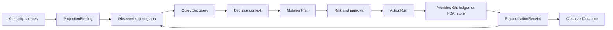

# FDAI 온톨로지 안전 인프라

이 문서는 운영 온톨로지를 FDAI 에이전트를 위한 타입이 지정된 infrastructure 계층으로 확장합니다. 객체
polymorphism, 범위가 제한된 객체 집합, 의미 액션 효과, 타입이 지정된 함수, authority-aware writeback,
exact 스키마 pinning, 생성된 SDK 표면을 추가합니다. 모든 런타임 전이는 여전히
에이전트가 소유하며 이 기본 요소는 입력, 계획, 효과 검증을 제한합니다.

> **권한 경계:** 관측된 프로바이더 상태는 변환 결과로 유지됩니다. 액션은 프로바이더, Git,
> 원장 또는 FDAI-owned 상태 변경을 요청할 수 있지만 온톨로지 그래프를 편집하여 외부 사실을
> 참으로 만들 수 없습니다.
>
> **안전 경계:** 함수는 계획, 조회, derive 또는 validate만 수행합니다. Thor만 승인된
> `MutationPlan`을 실행하며 모든 외부 효과는 독립 조정으로 종료합니다.
>
> **구현 상태(2026-08-08):** 정본 release, ActionBuilder 출력, in-memory 온톨로지 쓰기에
> K0 계약 신원을 구현했습니다. K1 의미 인터페이스 compilation과 범위가 제한된 ObjectSet
> 조회도 구현했습니다. K2-K5 코어 기본 요소는 변경 계획, stale 개정 번호 검사, 타입이 지정된
> 함수, 변환 결과 연결, 조정, scoped SDK 세대, 읽기 전용 매니페스트를
> 포함합니다. PostgreSQL 객체/링크 쓰기는 exact 타입 버전과 release 다이제스트를 보존하며,
> 운영 ActionBuilder 조립은 전체 loaded release를 사용합니다. 기존 Reader-gated
> `GET /ontology/graph` 변환 결과는 release 다이제스트, proposal-only 쓰기 표면,
> `mutation_authority: false`를 노출하며 변경 경로를 추가하지 않습니다.
> Pre-migration 행은 original release 다이제스트를 정직하게 복원할 수 없으므로 명시적으로 unpinned
> 상태를 유지합니다. 다음 successful 쓰기는 완전히 다시 검증한 current-state 개정 번호를 새로
> 만들고 그 새 개정 번호를 해당 시점의 활성 release로 pin합니다.
> 의미 Interface 선언은 이제 shared 계약을 사용하며 정본 런타임 release에
> 포함됩니다. 운영 카탈로그 로딩은 검토된 `Identifiable` 선언, 출처 이력 및 모든
> 현재 ObjectType의 명시적 연결을 검증합니다. 조립은 polymorphic 카탈로그를 compile합니다.
> 운영 ObjectSet 조회 연결과 추가 기능 Interface는 전달 작업으로 남아 있습니다.
> Bitemporal 토폴로지 foundation은 provider-generation 신원, 이벤트/기록 시간, 완전한 스냅샷,
> delta 및 tombstone을 보존합니다. Pure `graph_at`/`topology_diff` 함수는 late 근거가 도착해도
> pinned `known_at` 재생을 보존하며 불완전한 이력은 absence를 입증할 수 없습니다. 타입이 지정된 조회
> 핸들러와 검증기 스키마는 프로바이더 텍스트 없이 이 함수를 노출합니다. Core-owned 이행은
> 삽입/읽기 전용 런타임 권한 부여를 가진 추가 전용 이력 표를 만듭니다. PostgreSQL 읽기 담당/쓰기 담당
> 조립과 inventory-promotion 발행은 남아 있습니다.
> 메트릭 의미는 문구 별칭 없이 exact 검토된 개념 id를 프로바이더 메트릭, 단위 및 집계로
> 해석합니다. Equal-duration 구간은 관찰된 zero와 누락된 데이터를 구분합니다. 범위가 제한된 causal 결합은
> 완전한 메트릭/토폴로지 근거를 요구하고 leakage-safe temporal analyzer를 재사용하며 falsifier와
> competing explanation을 보존하고 실행 권한을 부여하지 않습니다. 운영 프로바이더
> 연결과 카탈로그 항목은 남아 있습니다.
> 정본 release는 이제 타입이 지정된 함수 선언을 포함합니다. 함수 레지스트리는 호출자
> 에이전트, 역할, 용도를 검사하고, 선언된 stochastic 함수를 위해 replay-stable 시드를 파생하며,
> 정확한 release에 고정된 내용 기반 주소를 가진 호출 증적을 발행합니다.
> M5는 결정론적 `query.network_path_segments` FunctionType과 `routes_to` 및 reciprocal
> `peered_with` 선언을 unwired foundation으로 추가합니다. 범위가 제한된 secured 조회 결과는
> injected trusted 증적 검증기와 opaque 검증 맥락을 통해서만 사용합니다.
> Contextual 콜백은 호출자 역할, singleton 용도, 온톨로지 release 및 projected 결과
> 다이제스트를 `FunctionInvocationContext`에 연결합니다. 운영 발급자가 없으므로 함수는
> unwired 상태로 유지되고 self-minted 증적은 차단됩니다. Evaluation 시간은 증적의 trusted
> 관측 기준 시점과 정확히 같아야 합니다. 링크의 effective, 근거 및 기록된 시간은 이
> 기준 시점을 넘을 수 없고 최신성은 시각 연산 전에 1년으로 제한됩니다. Reciprocal
> 피어링에는 방향별로 구분된 관측 및 검증 증적 계보가 필요하며 두 방향에
> 같은 계보를 재사용하면 구간은 검증되지 않은으로 남습니다. 인벤토리 변환 결과는 링크
> 엔드포인트 타입이 관찰된 `ResourceRecord.type`과 충돌하면 차단합니다. 불완전한 그래프는
> `query_incomplete`를 반환하고 관련 네트워크 링크만 구간 한계를 소비합니다. FunctionType
> 산출물 다이제스트는 모듈 출처에서 파생되므로 행동 변경은 새 선언 신원을
> 만듭니다. 함수에는 네트워크, 자격 증명, 프로바이더, 변경 또는 실행 경로가 없습니다.
> 조정에는 in-memory 참조 원장과 함께 영속
> `StateStoreReconciliationLedger`가 구현되어 있습니다. 모든 시도를 하나의 조정
> 집계에 저장하고 atomic 생성 또는 개정 번호 compare-and-set을 사용하여 최종 결과와
> proposal-only 발신함 권고를 함께 커밋합니다. Strict 재생 검증은 malformed
> 또는 inconsistent 영속 상태를 차단합니다. Focused 테스트는 재시작 재생, 동시
> 전달, 충돌 detection, unscorable 시도에서 최종로의 전이를 검증합니다.
> 각 조정은 최대 8개 시도를 저장하며 마지막 자리는 최종 종결을 위해
> 예약합니다. 16 MiB 정본 집계 상한은 상태 또는 감사 쓰기 전에 oversized 영속
> 상태를 차단합니다. 운영 조립은 아직 조정기를 연결하거나 이벤트 버스를 통해
> 발신함 권고를 publish하지 않습니다.
> K6-K8은 변경할 수 없는 operational 상태 trajectory, 의존성 범위 효과 propagation,
> time-bounded invariant, 독립 관측 trajectory 결과를 포함하는 graph-wide Dynamic 근거를
> 목표로 합니다. 기존 액션/메트릭 Dynamic 시뮬레이션은 구현되어 있으며 graph-wide propagation과
> failure-attribution wiring은 종료 기준을 통과할 때까지 전달 작업으로 남습니다.
>
> **하드닝 상태(2026-08-01):** release 신원, 영속성, 인터페이스 호환성, ObjectSet
> 종결, 변경 안전성, 함수 권한, 변환 결과, 조정, 생성된 SDK 구문,
> 매니페스트 공개를 대상으로 10회 adversarial 라운드를 수행했습니다. 검증된 Medium 이상 코어
> 발견 사항을 수정했습니다. PostgreSQL 및 런타임 통합 발견 사항도 수정했으며 잔여 발견 사항은
> Low입니다. 라운드 12에서는 이전 방식 읽기에 현재 release를 소급 할당하는 동작을 제거했습니다.
> 라운드 13에서는 successful 갱신이 새로 검증한 current-state 개정 번호를 생성하고 pin하는 것을
> 확인했습니다.

## Catalog-owned instance 변환 결과

Core 런타임 시작은 이제 Rule, PolicyArtifact, ResourceType, SignalType, Property 및
ActionType instance를 하나의 catalog-owned subgraph에 변환 결과합니다. Pure 빌더는 누락된
정책 의미 규칙과 ID 충돌을 차단합니다. Projector는 이전의 범위가 제한된 subgraph를 읽고
원자적으로 교체하며, 동일한 재생은 no-op이므로 시작이 거짓 그래프 개정 번호를 만들지 않습니다.

이 변환 결과는 카탈로그 관계를 조회 가능하게 만들지만 권위를 변경하지 않습니다. Git
catalog-as-code가 계속 권위 원천이고 instance 그래프는 읽기 모델로 유지됩니다. 선택적 로컬
프로파일에서 OPA 또는 온톨로지 저장소를 사용할 수 없으면 synthetic 상태로 대체하지 않고 변환 결과를
사용 불가로 유지합니다. 배포 프로파일은 T0 평가를 위해 계속 OPA를 요구합니다.

Shared property-semantics 레지스트리는 정본 속성마다 meaning, 단위, 값 종류, 한계에 대한
내용 기반 주소를 가진 신원 하나를 제공합니다. 카탈로그 변환 결과는 모든 참조를 레지스트리에 대해
검증하고 float 강제 변환 없이 finite numeric 값을 보존하므로 서비스와 재생이 같은 속성을
조용히 다르게 해석할 수 없습니다.

## Pod telemetry 경로 foundation

`evaluate_pod_telemetry_path`는 `SecuredObjectSetQueryResult`와 state-evidence 대상에서
`StateFactMetadata`로 이어지는 변경할 수 없는 대응을 사용하는 pure A0 읽기입니다. 검토된 물리 링크인
`kubernetes_selects`, `kubernetes_exposes_endpoints`, `observation_targets_resource`만 따라갑니다.
탐색은 secured ObjectSet 게이트웨이에서 이미 범위가 제한된 및 용도 checked 상태이며 evaluator는
프로바이더, Kubernetes, 네트워크, 레지스트리 또는 저장소 I/O를 수행하지 않습니다.

결과는 Pod 선택된 by 서비스, 서비스 exposing Endpoints, 관측 targeting the Pod,
관측 샘플의 순서가 고정된 네 구간을 포함합니다. 구간 상태 사실이 supplied 기준 시점에서
완전한하고 현재하며 non-synthetic 및 conflict-free일 때만 근거를 검증된으로 판단합니다.
Pod, 선택된 서비스, exposed Endpoints는 모두 예상 클러스터 범위의 신원을 가져야 합니다.
Cross-cluster 서비스 또는 Endpoints 기록이 있으면 관계 근거가 현재하고 완전한해도
해당 구간은 검증되지 않은이 됩니다.
불완전한 그래프 증적은 absence를 입증할 수 없으므로 해결되지 않은 구간은 `missing`이 아니라
`unverified`로 유지됩니다. 재생을 위해 exact secured 그래프 증적 다이제스트와 보존된 모든 근거
참조를 반환합니다.

이 foundation은 조립을 통해 내보내기되거나 온톨로지 함수 레지스트리에 등록되지 않습니다.
Health 값을 derive하거나 발견 사항 또는 예측 객체를 만들지 않으며 액션 권한을 부여하거나
기존 Kubernetes 전달 모듈을 변경하지 않습니다.

## 한눈에 보는 설계

Infrastructure는 의미 선언, authority-specific 상태, agent-owned kinetic 실행을
분리합니다. Graph 쓰기, 함수 결과, 생성된 SDK 호출 또는 `MutationPlan`은 accountable 에이전트가
judgment, 권한 확인, 실행, 독립적인 효과 검증을 완료할 때까지 제안 또는
맥락으로 유지됩니다.



## 정확한 타입 신원

모든 선언은 하나의 변경할 수 없는 `OntologyRelease`에 속합니다. 런타임 기록은 자신을
해석한 정확한 선언을 고정합니다.

```yaml
type_ref:
 name: Resource
 version: 2.1.0
 catalog_digest: sha256:<digest>
```

`Action`, `ActionRun`, 온톨로지 객체, 온톨로지 링크, 감사 기록, 생성된 계획은 exact 참조를
보존합니다. 호환성 검사는 `compatible`, `migration_required`, `incompatible` 중 하나를
반환합니다. 기존 기록을 재해석하는 방식으로 release가 선언을 in-place 교체할 수 없습니다.

서비스 간 의미 기록은 선언 집합을 복사하지 않고 계약 `schema_version`과 exact
release `digest`를 담는 간결한 묶음인 `OntologyReleaseRef`를 사용합니다. 이전 방식 발견과
explanation 기록은 이행 동안 이 묶음을 생략할 수 있습니다. Decision-critical
`evaluate` 및 `action_draft` 소비자는 이를 요구하며, 제공된 값이 일치하지 않으면 semantic-index
또는 프로바이더 I/O 전에 차단됩니다.

## 증명을 포함한 의미 interpretation

Lexical matching, 임베딩 및 모델은 `SemanticInterpretationCandidate`를 만들 수 있습니다.
후보는 대상 타입, 온톨로지 release, 의미 카탈로그, 정규화된 인자, 입력, 해결되지 않은
용어, 출처 및 내용 다이제스트를 고정하지만 권한은 항상 `candidate_only`입니다.

모든 용어가 해석되고, 대상이 exact 활성 release와 일치하고, 연산 등급이 타입이 지정된 함수
또는 ActionType과 일치하며, exact 카탈로그 기록, promoted 언어 표면 또는 operator-confirmation
턴을 인용할 때만 후보가 `VerifiedSemanticPlan`이 됩니다. 검증된 계획도
`execution_authority: false`를 유지합니다. 조회, derive 및 validate 계획은 타입이 지정된 함수만 대상할
수 있습니다. 액션 interpretation은 ActionType에 바인딩된 초안만 만들 수 있으며, 일반 judgment,
승인, 실행, 복구 및 감사 경로로 다시 진입합니다.

후보 및 계획 인자는 변경 가능한 중첩된 컨테이너 대신 정본 JSON으로 저장됩니다.
검증은 계획을 만들기 전에 후보 무결성을 다시 계산합니다. Exact-catalog 검증은
카탈로그 다이제스트를 직접 고정하고 조립이 제공한 활성 의미 카탈로그와 일치하는지 확인합니다.
Promoted 표면과 운영자 확인은 변경할 수 없는 승격 또는 conversation-turn 참조를
확인하는 injected 근거 검증기가 필요합니다.

Operator API는 `inventory.select_resources`를 읽기 전용 온톨로지 조회 함수로 선언합니다.
운영 의미 후보와 `/ontology/graph` 매니페스트는 같은 release 다이제스트 및 함수
참조를 사용합니다. 다른 release의 후보는 프로바이더 I/O 전에 차단됩니다.

## 의미 인터페이스와 객체 집합

`OntologyInterfaceType`은 기존 `ActionInterface` 안전성 플래그와 구별됩니다. 의미 인터페이스는
속성, 필수 링크, supported 액션, inherited 인터페이스를 선언합니다. 객체 타입은 여러
인터페이스를 구현할 수 있습니다. 초기 kernel 인터페이스는 `Operable`, `Ownable`, `Observable`,
`ObjectiveBound`, `Recoverable`, `CostBearing`입니다.

`ObjectSetDefinition`은 구체적인 타입 또는 의미 인터페이스로 객체를 선택합니다. 타입이 지정된 속성
조건식, named-link 탐색, 결정론적 정렬, `as_of` 기준 시점, 최신성, 용도, hard
결과 한도를 지원합니다. Free-form Cypher, SPARQL, SQL 또는 모델 텍스트를 받지 않습니다. 모든
구체화는 release 다이제스트, 기준 시점, 출처 watermark, 잘림 사유, 민감정보 제거 요약을
기록합니다.

현재 instance-store 계약에는 historical 관측 API가 없습니다. 따라서 secured 게이트웨이는
trusted evaluation 기준 시점과 최대 5초로 명시적으로 구성한 skew 안의 `as_of`만 허용합니다. 이 범위를
벗어난 과거 또는 미래 기준 시점은 지원하지 않는으로 차단하고, historical 완전성을 주장하지 않은 채
`current_state_only`, 기준 시점 및 허용된 skew를 기록합니다. 각 secured 증적은 exact 온톨로지
release, 호출자 역할, singleton 용도, 정본 projected-result 다이제스트, 완전성/잘림
상태 및 내용이 없는 민감정보 제거 요약을 결합합니다. 반환된 그래프 속성은 재귀적으로 변경할 수 없는하며
의미 조회 경계는 사용 전에 result-receipt 연결을 다시 검증합니다.

LinkType 선언은 아직 속성 ACL을 정의하지 않습니다. 따라서 secured 변환 결과는 모든 링크
속성을 제거하고 제거된 필드 수를 증적에 기록합니다. 타입이 지정된 엔드포인트와 exact 타입 참조만
보존합니다. 민감정보가 제거된 객체 별칭은 전체 출처 신원 집합 밖에서 할당하며 projector는 그래프를
반환하기 전에 객체 신원의 uniqueness와 visible 엔드포인트 종결을 검증합니다.

Property 조건식은 `equals`, `not_equals`, `in`, `exists`, `absent`, `at_least`, `at_most`,
`contains`를 지원합니다. Single-value 운영자는 `equals`를 사용하고, `in`은 비어 있지 않은
`values` tuple을 사용하며, single-value operand는 null일 수 없고, presence 운영자는 operand를
받지 않습니다. 저장소에는 인덱스 pushdown을 위해 `equals` 조건식만 전달합니다. Direct 조회와
탐색은 모두 범위가 제한된 후보 그래프에 모든 조건식을 다시 적용하고 필터된 엔드포인트가 있는
링크를 제거합니다. 조건식 operand는 finite number, 최대 32 중첩 수준, 최대 64 KiB encoded
데이터를 갖는 정본 JSON입니다.
하나의 정의는 최대 32 조건식을 받고, 하나의 `in` 조건식은 최대 1000 값을 받으며,
하나의 탐색은 최대 1000 루트와 64 named 링크 타입을 받습니다. 탐색 없는 루트 id와 named
링크 타입 없는 탐색은 저장소 I/O 전에 차단됩니다.

구체화는 `result_limit`, `candidate_limit`, `traversal_limit`을 구분합니다.
`candidate_limit`은 기억 filtering이 처음 1000개 저장소 후보만 확인했다는 뜻이므로 비어 있거나
짧은 결과를 완전한 absence 점유로 사용할 수 없습니다. `traversal_limit`은 그래프 expansion이
객체 상한에 도달했다는 뜻입니다. In-memory 및 PostgreSQL 저장소는 reached 객체뿐 아니라 initial
루트에도 요청한 객체 한도를 동일하게 적용합니다.

## 의미 액션과 변경 계획

`ActionType`은 기존 stop 조건, 롤백, 영향 범위, 실행 경로, 승격 게이트, 자율성
상한을 유지합니다. 버전 2는 다음 의미 필드를 추가합니다.

- **대상:** Exact ObjectType 또는 InterfaceType 참조와 one-or-set cardinality입니다.
- **매개변수:** 검증 및 민감정보 제거 메타데이터가 있는 기본 요소, enum, struct, object-reference
 또는 object-set 입력입니다.
- **읽기 집합:** 액션 계획 및 검증에 필요한 객체 집합과 속성입니다.
- **제출 criteria:** 결정론적 criterion 또는 `validate` 함수 참조입니다.
- **플래너:** Declarative 효과 룰 또는 하나의 signed `plan` 함수입니다.
- **효과:** 예상 내부 쓰기, 카탈로그 pull 요청, 프로바이더 명령, 알림 또는
 예약입니다.
- **Postcondition:** 액션 결과를 종료하는 독립적인 관측입니다.
- **트랜잭션 정책:** 내부 atomicity 또는 외부 saga 의미, lock 범위, 최대
 affected 객체 개수입니다.

계획 수립은 변경할 수 없는 `MutationPlan`을 만듭니다. Exact 대상 개정 번호, computed 쓰기 집합, 명령,
영향 근거, 롤백 또는 compensation 단계, 예상 효과, 다이제스트를 포함합니다. Approval과
실행은 다이제스트와 현재 개정 번호를 다시 검증합니다. Stale 계획은 계획 수립 또는 사람 검토로
돌아가며 넓어진 범위로 실행되지 않습니다.

## 타입이 지정된 온톨로지 함수

`OntologyFunctionType`은 네 종류 중 하나입니다.

| 종류 | 출력 | 권한 |
|------|--------|-----------|
| `query` | `ObjectSetDefinition` 또는 범위가 제한된 데이터 | 읽기 전용입니다. |
| `derive` | 타입이 지정된 scalar 또는 struct | 읽기 전용입니다. |
| `validate` | 근거가 있는 타입이 지정된 criterion 결과 | 충족 여부를 낮출 수만 있습니다. |
| `plan` | 변경할 수 없는 `MutationPlan` | 제안 only입니다. |

함수는 exact 입력/출력 스키마, 읽기 집합, 결정성 등급, 산출물 다이제스트, 발행기,
리소스 상한, 네트워크 정책을 선언합니다. 실행기 신원을 받지 않으며 프로바이더 변경을
직접 호출하지 않습니다.

레지스트리는 명시적 어댑터를 통해 기존 one-argument 콜백을 유지합니다. 인증된 읽기
맥락이 필요한 함수는 별도로 등록하고 exact authorized 역할과 attenuated 용도를 담은 변경할 수 없는
`FunctionInvocationContext`를 받습니다. 인자는 입력 다이제스트를 위해 canonicalize되고 콜백
실행 전에 deep copy되므로 중첩된 콜백 변경이 caller-owned 입력 또는 호출 근거를
바꿀 수 없습니다.

진단 런타임은 Kubernetes 집약기 22개를 exact-release `derive` 함수로 등록합니다.
실제 운영 프로바이더는 `diagnostic-evaluation` 용도에서 Heimdall로 레지스트리를 호출하고 각 호출
증적과 함께 정본 함수 인자를 보존합니다. Observer는 활성 release, 호출자,
호출 신원, 입력 다이제스트 및 출력 다이제스트가 모두 일치할 때만 발견 사항을 수락합니다. 이러한
증적은 읽기 전용 출처 이력이며 진단 함수를 액션으로 바꾸지 않습니다.

네트워크 competency foundation은 `query.network_path_segments`를 exact-release 결정론적
`query` 함수로 선언합니다. 입력은 purpose-bound `SecuredObjectSetQueryResult` 하나와 명시적인
출처, 대상, evaluation 시간, 깊이 및 구간 상한입니다. 인벤토리 프로바이더를 호출하지
않습니다. 등록에는 trusted `NetworkQueryReceiptVerifier`와 조립이 소유한 opaque 검증
맥락이 필요합니다. Contextual 콜백은 증적 역할, singleton 용도, exact release 및 결과
다이제스트가 `FunctionInvocationContext`와 일치하는지 확인한 후 검증기에 같은 tuple의 인증을
요청합니다. 운영 증적 발급자가 없으므로 이 foundation은 unwired 상태로 유지됩니다.
`evaluated_at`은 증적 관측 기준 시점과 정확히 같아야 합니다. 링크 effective, 근거 및
기록된 시간은 이 기준 시점과 같거나 이전이어야 하며 1년을 넘는 최신성 상한 또는 초과분이
발생하는 시각 연산은 검증되지 않은으로 남습니다. `attached_to`는 stored direction을 유지하면서
조회에서 inverse로 traverse할 수 있고, `contains`와 `routes_to`는 stored direction을 따르며,
`peered_with`는 서로 다른 관측 및 검증 증적 계보를 가진 directed 기록 두 개를
요구합니다. 모든 구간이 fresh 독립적인 검증을 가진 완전한 경로만
`reachability_verified: true`를 보고합니다. 그 밖의 결과는 `false`가 아니라 `null`을 사용합니다.
불완전한 그래프는 `query_incomplete`를 반환하며 관련 없는 그래프 링크는 네트워크 구간 한도를
소비하지 않습니다.

## Authority-aware writeback과 변환 결과

각 ObjectType은 하나의 권한 등급과 쓰기 정책을 선언합니다.

| 권한 등급 | 예 | 쓰기 정책 |
|-----------------|----|--------------|
| `catalog_owned` | Rule, ActionType, 정책 | 검토된 Git pull 요청입니다. |
| `fdai_owned` | 작업 흐름 초안, 승인 | Atomic 상태 트랜잭션과 발신함입니다. |
| `provider_observed` | Cloud 리소스, 토폴로지 | 프로바이더 명령 후 독립적인 관측입니다. |
| `ledger_owned` | DecisionCase, ActionRun | 덧붙이기 only입니다. |
| `derived` | 예측, pattern 변환 결과 | Owning-agent 변환 결과입니다. |

`provider_observed` 객체에서는 성공한 API 증적이 상태 갱신이 아닙니다. 조정은
intended 효과를 fresh 근거와 비교하고 `matched`, `mismatched`, `timed_out`, `unscorable` 중
하나인 `ReconciliationReceipt`을 발행합니다. 권위 있는 변환 결과만 관찰된 상태를 갱신합니다.

조정 조정기는 시도를 닫기 전에 exact release, ActionType, 변경할 수 없는 계획,
인증된 관찰기 맥락, independently 관찰된 기록을 바인딩합니다. 최종 결과와
proposal-only next-step 이벤트는 atomic하게 커밋되며 증적과 발신함 항목 모두 provider-observed
상태를 갱신하거나 실행 권한을 부여하지 않습니다.

권한은 신뢰할 수 없는 관측 묶음과 별도로 공급되는 trusted
`AuthenticatedObservationContext`에서만 가져옵니다. 맥락은 서로 다른 관찰기, 실행기,
출처 자격 증명 계보를 signed, 내용 기반 주소를 가진 검증 증적에 연결합니다. 묶음의
권한 점유는 권한을 부여하지 않습니다. 모든 권고는 proposal-only이며
`grants_authority: false`를 포함합니다.

| 증적 상태 | 최종 | Proposal-only next 단계 | 영속성 |
|----------------|----------|-------------------------|-------------|
| `matched` | 예 | `close_matched` | 최종 결과와 발신함 권고를 원자적으로 커밋합니다. |
| `mismatched` | 예 | `request_vidar_recovery` | 최종 결과와 발신함 권고를 원자적으로 커밋합니다. |
| `timed_out` | 예 | `request_vidar_recovery` | 최종 결과와 발신함 권고를 원자적으로 커밋합니다. |
| `unscorable` | 아니요 | `hold_unscorable` | 관측 시도만 기록하며 이후 인증된 관측이 같은 최종 신원을 재시도할 수 있습니다. |

관찰된 인벤토리 관계는 변경할 수 없는 state-fact 및 검증 메타데이터를 운반할 수
있습니다. 변환 결과는 이를 권한으로 취급하지 않고 묶음을 보존하며 불완전한 관측의
관계 점유를 억제합니다. Stale, synthetic, conflicting, 검증되지 않은 근거는 downstream
자율성을 낮출 수만 있습니다.

`ProjectionBinding`은 source-to-ontology 대응을 검토 가능하게 만듭니다. 출처 신원, 타입
대상, 신원/속성 대응, watermark 행동, 최신성, deletion 의미 규칙, 충돌 정책,
배치 한도를 선언합니다. 출처는 다른 권한을 조용히 overwrite할 수 없습니다.

## Dynamic 상태와 그래프 효과

Platform은 서로 권한을 부여하면 안 되는 세 계층을 분리합니다.

| 계층 | 질문 | 출력 권한 |
|-------|------|------------------|
| **의미** | 무엇이 존재하고 어떤 의미이며 어떤 관계가 유효합니까? | 타입, 단위, 신원, cardinality, 호환성만 제공합니다. |
| **Kinetic** | 어떤 등록 연산이 어떤 안전성 계약에서 exact 대상을 변경할 수 있습니까? | Proposal-only `MutationPlan`이며 judgment, 승인, 실행은 외부 경계에 남습니다. |
| **Dynamic** | Intervention 또는 외부 이벤트에서 상태가 시간에 따라 어떻게 변할 수 있고 prediction이 reality와 얼마나 일치했습니까? | 읽기 전용 prediction, invariant, propagation, fidelity 근거만 제공합니다. |

`OperationalStateTrajectory`는 기존 통제된 대화 및 실행 `TrajectoryEnvelope`와
구별됩니다. 온톨로지 release, 기준선 그래프 개정 번호, 인벤토리 세대, event-time 기준 시점,
horizon, affected 객체 개정 번호, predicted 또는 관찰된 상태 구획, intervention 참조,
출처 watermark, 완전성, 잘림 및 replay-stable 다이제스트를 고정합니다. Raw cloud 페이로드를
저장하지 않고 정규화된 값과 opaque 근거 참조만 저장합니다. Predicted trajectory는
프로바이더 truth를 주장할 수 없으며 관찰된 trajectory에는 권위 있는 프로바이더 또는 telemetry
증적이 필요합니다.

`GraphEffectModel`은 현재 action-and-metric 효과 모델을 대체하지 않고 확장합니다. 출처 객체
또는 인터페이스, ActionType 또는 external-event 트리거, 범위가 제한된 LinkType 경로 하나, 대상 객체 또는
인터페이스와 메트릭, propagation lag, 응답 함수, uncertainty, 맥락 조건, 근거 grade,
learning 기준 시점, 활성 또는 challenger 상태를 선언합니다. Simulator는 결정론적 토폴로지
효과를 먼저 적용한 뒤 검증된 활성 모델을 적용합니다. Challenger 출력은 divergence 근거로만
보고하며 가지 순위 또는 선택에 사용하지 않습니다.

`DynamicInvariant`는 SLO, RTO, RPO, 용량 하한, 비용 묶음, data-integrity 조건식 또는
affected-set 상한처럼 완전한 trajectory 전체에서 유지되어야 하는 machine-evaluable 한계를
기술합니다. Predicted violation은 arbitration 전에 가지를 제거합니다. 실행 중 관찰된 violation은
forward 전달을 중지하고 기존 타입이 지정된 복구 경로에 다시 진입하며 simulator가 실행 중 계획을
변경하도록 허용하지 않습니다.

`TrajectoryOutcome`은 객체, 메트릭, 시간 구간별 predicted 상태 구획과 independently 관찰된
상태 구획을 비교합니다. 최종 상태는 `matched`, `mismatched`, `intervention_censored`,
`incomplete`, `unscorable`입니다. 완전한하고 post-cutoff이며 독립적으로 관측된 결과만
challenger 모델을 갱신합니다. 활성 모델은 별도의 검토된 승격이 exact 근거 증적을
적용할 때까지 변경할 수 없는 상태를 유지합니다.

대화 또는 internal-processing 실패는 결정론적 귀속 단계가 exact 검증
사유, 경로, 근거 매니페스트, 온톨로지 release, 그래프 개정 번호, 최신성, 완전성을 보존한
뒤에만 off-path adequacy 검토를 열 수 있습니다. 맥락, 프로바이더, 라우팅, 렌더링, 정책,
의미, kinetic, Dynamic 실패는 서로 구별됩니다. 재현된 의미, 변환 결과, 룰 또는 Dynamic
공백만 inert 온톨로지 또는 model-review 후보를 생성합니다.

## 조회, security, SDK 표면

Security는 객체, 속성, 링크, 객체 집합, 액션 발견, 액션 제출, 함수 호출
경계에 적용됩니다. Visible 링크를 통해 숨겨진 엔드포인트가 노출되지 않습니다.

온톨로지 release는 scoped Python/TypeScript SDK와 OpenAPI 메타데이터를 생성할 수 있습니다. Generator는
승인된 타입과 기능만 포함합니다. 쓰기 메서드는 타입이 지정된 액션 제안을 제출하며 실행기를
호출하지 않습니다.

## 제공 순서

| Wave | Deliverable | 종료 기준 |
|------|-------------|-----------|
| K0 | Exact `OntologyTypeRef` 및 `OntologyRelease` pinning입니다. | 액션, 그래프, 감사, 재생 테스트가 exact 버전과 다이제스트를 보존합니다. |
| K1 | Interface와 범위가 제한된 객체 집합입니다. | 구체적인 expansion, ACL, 기준 시점, 잘림, 조회 고정본이 통과합니다. |
| K2 | 의미 ActionType v2 및 `MutationPlan`입니다. | 계획 다이제스트, stale 개정 번호, 영향, 롤백, 그림자 no-mutation 테스트가 통과합니다. |
| K3 | 타입이 지정된 함수와 authority-aware 조정입니다. | 함수가 mutate할 수 없고 모든 외부 효과가 타입이 지정된 종결에 도달합니다. |
| K4 | 변환 결과 연결과 스키마 이행입니다. | 스냅샷/delta 동등성, watermark 복구, 충돌, 이행 고정본이 통과합니다. |
| K5 | 생성된 SDK와 온톨로지 애플리케이션 표면입니다. | Python/TypeScript compile 테스트와 proposal-only 쓰기 테스트가 통과합니다. |
| K6 | Operational 상태 trajectory와 결정론적 그래프 propagation입니다. | 동일 release, 그래프, 기준 시점, 모델, intervention은 하나의 다이제스트를 만들며 stale, 잘린, cyclic 또는 unmodeled 경로는 검토를 요구합니다. |
| K7 | Dynamic invariant와 trajectory 결과 종결입니다. | Invariant 위반 가지는 arbitration에 도달하지 않고 프로바이더 acceptance는 결과를 종료할 수 없으며 불완전한 관측은 unscorable로 유지됩니다. |
| K8 | 실패 귀속과 통제된 Dynamic learning입니다. | Exact 검증 사유가 intake에서 보존되고 non-ontology 실패는 온톨로지 제안을 만들지 않으며 challenger만 학습하고 검토 없이 권한을 높이지 않습니다. |

새 필드는 디코딩에서 선택적으로 시작하지만 새로 만든 런타임 기록에는 필수입니다. Retained 감사
및 instance 고정본이 exact release에서 재생된 뒤에만 이전 방식 디코딩을 제거합니다.

## 검증 매트릭스

| 항목 | 필요한 증명 |
|------|-------------|
| 재생 | Historical 기록이 같은 선언과 계획 다이제스트를 해석합니다. |
| 권한 | Graph 쓰기가 권한을 부여하거나 외부 상태를 주장할 수 없습니다. |
| 조회 안전성 | 모든 객체 집합은 범위가 제한된, 용도 checked, 잘림 명시 상태입니다. |
| 액션 안전성 | Stop, 롤백, 영향, 예행 실행, lock, 멱등성, 감사가 필수로 유지됩니다. |
| 함수 안전성 | 조회 및 계획 수립 코드에 실행기 신원 또는 direct 변경 경로가 없습니다. |
| 네트워크 경로 안전성 | Directed 저장소, reciprocal 피어링, 구간별 근거, cycle detection, 깊이/구간 상한이 증적에 연결되며 absence는 unreachable 점유로 바뀌지 않습니다. |
| 조정 | 프로바이더 acceptance와 관찰된 convergence가 별도 상태로 유지됩니다. |
| Dynamic 재생 | 동일한 범위가 제한된 입력이 동일한 predicted trajectory와 invariant 판정을 만듭니다. |
| Dynamic 권한 | Prediction, 모델 agreement 또는 모델 승격 근거가 액션을 승인하거나 실행할 수 없습니다. |
| Dynamic 종결 | 완전한 독립적인 관측만 trajectory fidelity를 점수하거나 challenger를 갱신합니다. |
| Pod telemetry | 용도 범위가 지정된 secured 그래프와 상태 근거가 프로바이더 I/O 또는 상태 inference 없이 결정론적 `verified`, `unverified`, `stale`, `missing` 구간을 만듭니다. |

## 관련 문서

| 알아볼 내용 | 문서 |
|-------------|------|
| 선언 종류 및 런타임 상태/맥락 경계 | [운영 온톨로지 메타모델](operating-ontology-metamodel-ko.md) |
| 기존 의미 및 권한 모델 | [FDAI 운영 온톨로지](operating-ontology-ko.md) |
| 기존 ActionType 안전성 계약 | [액션 온톨로지](../decisioning/action-ontology-ko.md) |
| 런타임 실행 권한 | [실행 모델](../decisioning/execution-model-ko.md) |
| 저장소 및 의존성 경계 | [프로젝트 구조](project-structure-ko.md) |
