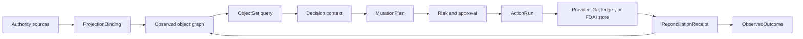

# FDAI Ontology Safety Infrastructure

This document extends the operating ontology into a typed infrastructure layer for FDAI's agents.
It adds object polymorphism, bounded object sets, semantic action effects, typed functions,
authority-aware writeback, exact schema pinning, and generated SDK surfaces. Agents still own every
runtime transition; these primitives constrain their inputs, plans, and effect verification.

> **Authority boundary:** Observed provider state remains a projection. An action can request a
> provider, Git, ledger, or FDAI-owned state change, but it cannot make an external fact true by
> editing the ontology graph.
>
> **Safety boundary:** Functions plan, query, derive, or validate. Only Thor executes an approved
> `MutationPlan`, and every external effect closes through independent reconciliation.
>
> **Implementation status (2026-08-08):** K0 contract identity is implemented for canonical
> releases, ActionBuilder output, and in-memory ontology writes. K1 semantic interface compilation
> and bounded ObjectSet queries are implemented. K2-K5 core primitives now cover mutation plans,
> stale revision checks, typed functions, projection bindings, reconciliation, scoped SDK
> generation, and a read-only manifest. PostgreSQL object/link writes persist exact type versions
> and release digests, and production ActionBuilder composition uses the full loaded release.
> PostgreSQL also stores each exact object/link release manifest in `ontology_release`. Startup
> persists the active manifest and loads every registered manifest before decoding prior rows.
> Missing releases, manifest/digest mismatches, and declaration/version mismatches fail closed.
> The existing Reader-gated `GET /ontology/graph` projection exposes the release digest,
> proposal-only write surface, and `mutation_authority: false`; it adds no mutation route.
> Pre-migration rows remain explicitly unpinned because their original release digest cannot be
> reconstructed honestly. The next successful write creates a new, fully revalidated current-state
> revision and pins that new revision to the then-active release.
> Semantic Interface declarations now use the shared contract and contribute to the canonical
> runtime release. Production catalog loading validates the reviewed `Identifiable` declaration,
> its provenance, and explicit bindings for every current ObjectType. Composition compiles the
> polymorphic catalog. Production ObjectSet handlers issue bounded secured receipts, and exact
> Function handlers resolve only those issued dependency digests. Additional capability Interfaces
> remain delivery work.
> Bitemporal topology foundations retain provider-generation identity, event and record time,
> complete snapshots, deltas, and tombstones. Pure `graph_at` and `topology_diff` functions preserve
> pinned `known_at` replay when late evidence arrives, and incomplete history cannot prove absence.
> Typed query handlers and verifier schemas expose these functions without provider text. A
> Core-owned migration creates append-only history tables with insert/read-only runtime grants.
> PostgreSQL reader/writer composition and inventory-promotion publishing remain.
> Metric semantics resolve exact reviewed concept ids to provider metrics, units, and aggregations
> without phrase aliases. Equal-duration windows distinguish observed zero from missing data.
> Bounded causal joins require complete metric and topology evidence, reuse the leakage-safe
> temporal analyzer, retain falsifiers and competing explanations, and grant no execution authority.
> Production provider bindings and catalog entries remain.
> Canonical releases now include typed function declarations. The function registry checks the
> caller agent, role, and purpose, derives replay-stable seeds for declared stochastic functions,
> and emits content-addressed invocation receipts pinned to the exact release.
> M5 adds the deterministic `query.network_path_segments` and `query.pod_telemetry_path`
> FunctionTypes plus the `routes_to` and reciprocal `peered_with` declarations. A bounded
> composition-owned issuer records secured ObjectSet results, and Function handlers resolve the
> exact dependency digest before invocation. The contextual callbacks bind caller role, singleton
> purpose, ontology release, and projected result digest to `FunctionInvocationContext`; an
> unissued or self-minted receipt is rejected. Evaluation time equals the receipt's
> trusted observation cutoff. Link effective, evidence, and recorded times cannot exceed that
> cutoff, and freshness is capped at one year before timestamp arithmetic. Reciprocal peering needs
> distinct direction-bound observation and verification receipt lineage; reusing one lineage for
> both directions leaves the segment unverified. Inventory projection also rejects link endpoint
> types that conflict with the observed `ResourceRecord.type`. Incomplete graphs return
> `query_incomplete`, and only relevant network links consume the segment bound. The FunctionType
> artifact digest is derived from module source, so behavior changes produce a new declaration
> identity. The function has no network, credential, provider, mutation, or execution path.
> Reconciliation now has a durable `StateStoreReconciliationLedger` in addition to the in-memory
> reference ledger. It stores every attempt under one reconciliation aggregate and uses atomic
> create or revision compare-and-set to commit a terminal outcome and its proposal-only outbox
> recommendation together. Strict replay validation rejects malformed or inconsistent durable
> state, and focused tests cover restart replay, concurrent delivery, conflict detection, and an
> unscorable-attempt-to-terminal transition. Each reconciliation stores at most eight attempts and
> reserves the final slot for terminal closure. A 16 MiB canonical aggregate ceiling rejects
> oversized durable state before a state or audit write. Production composition does not yet wire
> the coordinator or publish its outbox recommendation through the event bus.
> K6-K8 target graph-wide Dynamic evidence: immutable operational state trajectories,
> dependency-scoped effect propagation, time-bounded invariants, and independently observed
> trajectory outcomes. Existing action/metric Dynamic simulation remains implemented; graph-wide
> propagation and failure-attribution wiring remain delivery work until their exit criteria pass.
>
> **Hardening status (2026-08-01):** Ten adversarial rounds covered release identity, persistence,
> interface compatibility, ObjectSet closure, mutation safety, function authority, projection,
> reconciliation, generated SDK syntax, and manifest disclosure. Verified Medium-or-higher core
> findings are fixed. PostgreSQL and runtime integration findings are also fixed; residual findings
> are Low. Round 12 rejected retroactive release assignment for legacy reads. Round 13 confirmed
> that a successful update creates and pins a newly validated current-state revision.

## Implementation status

### Implementation scope

| Area | State | Evidence | Notes |
|------|-------|----------|-------|
| K0 exact release identity and persistence | implemented | [`release.py`](../../../services/core-control-plane/src/fdai/shared/ontology/release.py), [`postgres_ontology.py`](../../../services/core-control-plane/src/fdai/delivery/persistence/postgres_ontology.py), [`inventory_ontology.py`](../../../services/core-control-plane/src/fdai/runtime/inventory_ontology.py), [`20260813_0081_ontology_release_registry.py`](../../../alembic/versions/20260813_0081_ontology_release_registry.py), and focused persistence/runtime tests. | Exact identity, pinned writes, restart-safe manifest loading, and release-bound inventory projection evidence exist. Pre-migration rows and historical inventory manifests remain honestly unpinned. Operational Live evidence is pending. |
| K1-K5 bounded semantic query and function infrastructure | in-progress | [`operational_functions.py`](../../../services/core-control-plane/src/fdai/core/ontology_platform/operational_functions.py), [`incident_queries.py`](../../../services/core-control-plane/src/fdai/core/ontology_platform/incident_queries.py), [`kubernetes_relationships.py`](../../../services/core-control-plane/src/fdai/delivery/kubernetes_relationships.py), [`inventory_sync.py`](../../../services/core-control-plane/src/fdai/delivery/inventory_sync.py), [`test_inventory_sync.py`](../../../services/core-control-plane/tests/delivery/test_inventory_sync.py), and [`test_wire_pod_telemetry.py`](../../../services/core-control-plane/tests/composition/test_wire_pod_telemetry.py) | Core primitives, bounded incident audit evidence with separate canonical incident and audit correlation identities, production inventory composition for supplied Kubernetes records, and issued Pod composition checks exist. Authenticated incident and Kubernetes live evidence remain open. |
| Catalog projection and exact-generation Rule retrieval | implemented | [`catalog_queries.py`](../../../services/core-control-plane/src/fdai/core/ontology_platform/catalog_queries.py), [`test_catalog_queries.py`](../../../services/core-control-plane/tests/core/ontology_platform/test_catalog_queries.py), commit `e4d9483a5` | `catalog.search_rules` returns bounded ranked candidates with an exact-generation receipt and grants no judgment or action authority. Control-objective instances are not yet materialized by startup projection. |
| Historical topology, metric semantics, and reconciliation | in-progress | [`topology_history.py`](../../../services/core-control-plane/src/fdai/core/ontology_platform/topology_history.py), [`metric_semantics.py`](../../../services/core-control-plane/src/fdai/core/ontology_platform/metric_semantics.py), [`reconciliation_state_store.py`](../../../services/core-control-plane/src/fdai/core/ontology_platform/reconciliation_state_store.py) | Contracts and pure or durable foundations exist; production composition and publishers remain incomplete. |
| K6-K8 graph-wide Dynamic evidence | in-progress | [Dynamic model maturity](#dynamic-model-maturity) | Action and metric simulation exists; graph propagation, trajectory closure, and failure attribution remain open. |

### Implementation history

| Date | State | Change | Evidence | Remaining |
|------|-------|--------|----------|-----------|
| 2026-08-13 | in-progress | Adopted the implementation ledger without reconstructing earlier provenance. | Current source and tests listed in the scope table. | Complete the observable exit conditions below. |
| 2026-08-13 | implemented | Added exact-generation, read-only `catalog.search_rules` candidate retrieval with bounded ranking and content-addressed receipts. | Commit `e4d9483a5`; focused `test_catalog_queries.py` reports 2 passed. | Compose objective-aware retrieval and validate it without granting evaluation or execution authority. |
| 2026-08-13 | implemented | Registered the three objective vocabulary types as `Identifiable` implementations after centralized graph validation exposed the omission. | Focused `test_shipped_ontology_catalog_loads_as_one_graph` reports 1 passed. | Keep interface implementation coverage synchronized with every new object type. |
| 2026-08-13 | implemented | Added a durable exact-release manifest registry and loaded registered releases before PostgreSQL row decoding. | Current change; focused `test_postgres_ontology_catalog.py` reports 2 passed and `test_ontology_release_registry_migration.py` reports 1 passed. | Record authenticated Live evidence after migration and Core restart. |
| 2026-08-13 | in-progress | Added reviewed Kubernetes Service relationship mappings and a bounded projector that emits candidate links for independent generation verification. | `current change`; focused `test_kubernetes_relationships.py` reports 6 passed and the provider mapping contract reports 6 passed. | Bind the projector to a production inventory source and retain exact-release composition evidence. |
| 2026-08-13 | in-progress | Proved the issued Pod telemetry function through production semantic-query composition with a release-pinned Interface spanning Resource and Observation evidence. | `current change`; focused `test_wire_pod_telemetry.py` reports 2 passed for verified and synthetic-unverified paths. | Execute the same composition over retained production inventory and preserve authenticated assurance receipts. |
| 2026-08-14 | implemented | Required the inventory ontology projector to retain one exact release digest across its result, durable manifest, and availability status. The inventory job now shares the same catalog digest with topology-history publishing. | `current change`; focused `test_inventory_ontology.py` reports 9 passed. | Refresh production inventory and preserve the resulting release-bound projection evidence. Historical unbound manifests remain unmodified. |
| 2026-08-14 | in-progress | Extended direction-shadow comparison to preserve an explicitly unknown historical release and force `review_required` without granting migration authority. | `current change`; focused direction-shadow suite reports 8 passed; retained receipt `sha256:ad64c267b6f0c6ac5a1a037067f926aa5613f1fe5a84702877eb607e368736f6` replays identically. | Review the measured differences and capture complete verified aligned-generation evidence before migration. |
| 2026-08-14 | implemented | Composed the reviewed Kubernetes relationship projector into promoted inventory observations and injected the shipped mapping catalog in both scheduled and local inventory jobs. | `current change`; focused inventory composition and caller checks report 3 passed. | Bind an authoritative Kubernetes inventory source and retain complete-generation Pod evidence. |
| 2026-08-14 | implemented | Added exact-release Incident ObjectSet and audit-evidence querying plus deterministic answer projection that rejects cause-bearing results and exposes only evidence gaps and a candidate-only action draft next step. | Commits `285341732` and `43fa6ab13` plus `current change`; focused Incident and composition checks passed 62 cases, and the processor suite passed 34 cases; task-scoped Ruff and strict mypy passed. | Restart the local stack and retain authenticated Console evidence for the visible incident conversation. |
| 2026-08-14 | in-progress | Corrected the incident FunctionType identity contract so canonical `incident_id` and audit `correlation_id` remain distinct through verified plan execution and evidence projection. | `current change`; focused Incident and composition checks passed 63 cases with an end-to-end distinct-identity regression. | Restart the local stack and verify the visible authenticated incident conversation before changing the capability state. |
| 2026-08-14 | in-progress | Aligned semantic prompt v2 with the FunctionType identity contract so a bound incident plan carries both canonical and audit correlation identities without conflation. | `current change`; the focused prompt registry contract passed 5 cases. | Restart the local stack and verify the visible authenticated incident conversation before changing the capability state. |
| 2026-08-14 | implemented | Versioned the semantic frame and plan prompts to v2 after authenticated Browser evidence showed the model still treated incident answer fields as unresolved and the plan prompt omitted function nodes. The v2 prompts select the exact bound Incident function, preserve no-cause limitations, and permit only the reviewed function-node envelope. | `current change`; focused prompt registry checks passed 5 cases. | Restart Core with prompt v2 and rerun the authenticated incident conversation. |
| 2026-08-14 | implemented | Versioned the semantic frame and plan prompts to v3 after the next authenticated Browser run exposed a plan envelope missing the distinct audit correlation identity. The v3 prompts preserve canonical `incident_id` and audit `correlation_id` separately while retaining the v2 no-cause and candidate-only authority limits. | `current change`; focused distinct-identity processor and prompt checks passed 7 cases. | Restart Core with prompt v3 and rerun the authenticated incident conversation. |
| 2026-08-14 | implemented | Completed the authenticated Browser rerun against prompt v3. The visible answer preserved distinct Incident and audit correlation identities, reported causal analysis as unavailable, exposed bounded evidence gaps, and returned only a candidate `action_draft` with no execution authority. | Local Console `/agent-activity` at 02:28:52 KST; verification completed against one evidence reference; Core recorded all five semantic planning stages with no plan rejection. | Retain A1-A3 in shadow mode and use the captured turn as local evidence; causal analysis remains separate future work. |

### Remaining work

- [ ] Materialize the reviewed control-objective and binding vocabulary in the bounded startup
  projection, then prove exact release identity and zero authority fields in focused tests.
- [ ] Bind PostgreSQL historical topology, production metric providers, and inventory-promotion
  publishing, then retain replay and completeness receipts from the focused integration checks.
- [ ] Refresh inventory after the release-binding change and retain the new projection manifest and
  status as exact-release evidence; don't assign releases retroactively to historical manifests.
- [x] Bind the reviewed Kubernetes relationship projector through production and local inventory
  composition and verify independently checked links when Kubernetes records are supplied.
- [ ] Add an authoritative Kubernetes inventory source and retain complete-generation projection
  receipts for Pod telemetry composition.
- [ ] Compose the reconciliation coordinator and publish its proposal-only outbox recommendation
  through the event bus with restart, duplicate-delivery, and terminal-closure evidence.
- [ ] Exit K6-K8 only after deterministic graph propagation, time-bounded trajectory invariants,
  independent outcome closure, and failure-attribution tests all pass on one pinned release.

## Catalog-owned instance projection

Core runtime startup now projects Rule, PolicyArtifact, ResourceType, SignalType, Property, and
ActionType instances into one catalog-owned subgraph. The pure builder rejects missing policy
semantics and identity collisions. The projector reads the prior bounded subgraph and replaces it
atomically; an identical replay is a no-op so startup doesn't manufacture graph revisions.

The canonical release also declares `ControlObjective`, `RuleObjectiveBinding`, and
`EquivalenceValidationReceipt`, with `objective_bound_by`, `binding_targets_rule`, and
`binding_validated_by` relationships. Catalog loaders verify exact objective, Rule, policy
implementation, and required-evidence signatures before accepting a binding. These declarations
and candidate records are release vocabulary only: the current startup projector does not
materialize them into the runtime subgraph, and no semantic query, binding, or receipt grants
policy, promotion, approval, or execution authority. Deterministic equivalence execution and
reviewed receipt issuance remain separate delivery work.

This projection makes catalog relationships queryable but doesn't change their authority. Git
catalog-as-code remains authoritative, and the instance graph remains a read model. If OPA or the
ontology store is unavailable in an optional local profile, projection remains unavailable rather
than substituting synthetic state. Deployed profiles continue to require OPA for T0 evaluation.

The shared property-semantics registry gives every canonical property one content-addressed
identity for meaning, unit, value kind, and bounds. Catalog projection validates each reference
against that registry and preserves finite numeric values without float coercion, so services and
replays cannot silently reinterpret the same property.

## Pod telemetry path runtime

`evaluate_pod_telemetry_path` is a pure A0 read over a `SecuredObjectSetQueryResult` and an immutable
mapping of state-evidence subjects to `StateFactMetadata`. It follows only the reviewed physical
links `kubernetes_selects`, `kubernetes_exposes_endpoints`, and
`observation_targets_resource`. Traversal is already bounded and purpose checked by the secured
ObjectSet gateway; the evaluator performs no provider, Kubernetes, network, registry, or store I/O.

The result contains four ordered segments: Pod selected by Service, Service exposing Endpoints,
Observation targeting the Pod, and the Observation sample. Segment evidence is verified only when
its state fact is complete, current at the supplied cutoff, non-synthetic, and conflict free.
The Pod, selected Service, and exposed Endpoints must all carry identities in the expected cluster
scope; a cross-cluster Service or Endpoints record makes the affected segment unverified even when
its relationship evidence is otherwise current and complete.
Incomplete graph receipts cannot prove absence, so unresolved segments remain `unverified` rather
than becoming `missing`. The exact secured graph receipt digest and all retained evidence refs are
returned for replay.

The delivery layer now includes a pure candidate projector for reviewed Service label-selector and
same-name Endpoints relationships. It emits no active graph link on partial input, missing targets,
or duplicate candidates. A separate complete-generation verifier must attach immutable observation
metadata before inventory projection can expose either relationship. Production Kubernetes
inventory binding and retained composition receipts remain open.

Focused production-composition checks use an exact-release Interface that spans Resource and
Observation evidence, then invoke the issued Pod function through its secured dependency digest.
They prove that complete evidence returns four verified segments and that a synthetic sample stays
unverified with `claimed_health: false` and `execution_authority: false`.

The source-derived FunctionType is part of the exact runtime release and is registered in the
production semantic function registry. Its wrapper accepts only a composition-issued secured
query result and derives typed relationship and sample state evidence from that graph. It does not
derive a health value, produce Finding or Forecast objects, grant action authority, or alter any
existing Kubernetes delivery module.

## Design at a glance

The infrastructure separates semantic declarations, authority-specific state, and agent-owned
kinetic execution. A graph write, function result, generated SDK call, or `MutationPlan` remains
proposal or context until the accountable agents complete judgment, authorization, execution, and
independent effect verification.



## Exact type identity

Every declaration belongs to one immutable `OntologyRelease`. Runtime records pin the exact
declaration that interpreted them:

```yaml
type_ref:
  name: Resource
  version: 2.1.0
  catalog_digest: sha256:<digest>
```

`Action`, `ActionRun`, ontology objects, ontology links, audit records, and generated plans retain
an exact reference. Compatibility checking returns `compatible`, `migration_required`, or
`incompatible`. A release cannot replace a declaration in place when existing records would be
reinterpreted.

Cross-service semantic records use `OntologyReleaseRef`, a compact envelope containing the
contract `schema_version` and exact release `digest` without copying the declaration set. Legacy
discovery and explanation records may omit the envelope while they migrate. Decision-critical
`evaluate` and `action_draft` consumers require it, and any supplied mismatch is rejected before
semantic-index or provider I/O.

## Proof-carrying semantic interpretation

Lexical matching, embeddings, and models can produce a `SemanticInterpretationCandidate`. The
candidate pins its target type, ontology release, semantic catalog, normalized arguments, input,
unresolved terms, source, and content digest, but it always has `candidate_only` authority.

A candidate becomes a `VerifiedSemanticPlan` only when every term is resolved, its target matches
the exact active release, its operation class matches a typed function or ActionType, and it cites
an exact catalog record, promoted language surface, or operator-confirmation turn. The verified
plan remains `execution_authority: false`. Query, derive, and validate plans can target only typed
functions; an action interpretation can create only an ActionType-bound draft that re-enters the
normal judgment, approval, execution, recovery, and audit path.

Candidate and plan arguments are stored as canonical JSON rather than mutable nested containers.
Verification recomputes candidate integrity before producing a plan. Exact-catalog verification
pins the catalog digest directly and requires it to match the active semantic catalog supplied by
composition. Promoted surfaces and operator confirmations require an injected evidence validator
for the immutable promotion or conversation-turn reference.

The Operator API declares `inventory.select_resources` as a read-only ontology query function.
Production semantic candidates and the `/ontology/graph` manifest use the same release digest and
function reference. A candidate from another release is rejected before provider I/O.

## Semantic interfaces and object sets

`OntologyInterfaceType` is distinct from the existing `ActionInterface` safety flags. A semantic
interface declares properties, required links, supported actions, and inherited interfaces.
Object types can implement multiple interfaces. Initial kernel interfaces are `Operable`,
`Ownable`, `Observable`, `ObjectiveBound`, `Recoverable`, and `CostBearing`.

An `ObjectSetDefinition` selects objects by concrete type or semantic interface. It supports typed
property predicates, named-link traversal, deterministic ordering, an `as_of` cutoff, freshness,
purpose, and a hard result limit. It does not accept free-form Cypher, SPARQL, SQL, or model text.
Every materialization records the release digest, cutoff, source watermarks, truncation reason,
and redaction summary.

The current instance-store contract has no historical observation API. The secured gateway
therefore accepts `as_of` only at the trusted evaluation cutoff, with an explicitly configured
skew of at most five seconds. It rejects past or future cutoffs outside that envelope as
unsupported and records `current_state_only`, the cutoff, and the accepted skew without claiming
historical completeness. Each secured receipt binds the exact ontology release, caller role,
singleton purpose, canonical projected-result digest, completeness and truncation state, and a
content-free redaction summary. Returned graph properties are recursively immutable, and the
semantic query boundary revalidates the result-receipt binding before use.

LinkType declarations do not yet define property ACLs. Secured projections consequently strip all
link properties and count the removed fields in the receipt. They preserve only the typed
endpoints and exact type reference. Redacted object aliases are allocated outside the complete
source identity set, and the projector validates unique object identities and visible-endpoint
closure before returning the graph.

Property predicates support `equals`, `not_equals`, `in`, `exists`, `absent`, `at_least`,
`at_most`, and `contains`. Single-value operators use `equals`, `in` uses a non-empty `values`
tuple, single-value operands cannot be null, and presence operators accept no operand. The store
receives only `equals` predicates for indexed pushdown. Both direct queries and traversals apply
every predicate again to the bounded candidate graph and remove links whose endpoints were
filtered out. Predicate operands are canonical JSON with finite numbers, at most 32 nesting
levels, and at most 64 KiB of encoded data.
One definition accepts at most 32 predicates, one `in` predicate accepts at most 1000 values, and
one traversal accepts at most 1000 roots and 64 named link types. Root ids without a traversal and
traversals without a named link type are rejected before store I/O.

Materialization distinguishes `result_limit`, `candidate_limit`, and `traversal_limit`. A
`candidate_limit` means memory filtering saw only the first 1000 store candidates, so an empty or
short result is incomplete evidence rather than a complete absence claim. A `traversal_limit`
means graph expansion reached its object ceiling. The in-memory and PostgreSQL stores both apply
the requested object limit to initial roots as well as reached objects.

## Semantic actions and mutation plans

`ActionType` retains its stop conditions, rollback, impact scope, execution path, promotion gate,
and autonomy ceilings. Version 2 adds these semantic fields:

- **Target:** An exact ObjectType or InterfaceType reference plus one-or-set cardinality.
- **Parameters:** Primitive, enum, struct, object-reference, or object-set inputs with validation
  and redaction metadata.
- **Read set:** Object sets and properties required to plan and verify the action.
- **Submission criteria:** Deterministic criterion or `validate` function references.
- **Planner:** Declarative effect rules or one signed `plan` function.
- **Effects:** Expected internal writes, catalog pull requests, provider commands, notifications,
  or schedules.
- **Postconditions:** Independent observations that close the action outcome.
- **Transaction policy:** Internal atomicity or external saga semantics, lock scope, and maximum
  affected object count.

Planning produces an immutable `MutationPlan`. It contains exact target revisions, the computed
write set, commands, impact evidence, rollback or compensation steps, expected effects, and a
digest. Approval and execution revalidate the digest and current revisions. A stale plan returns
to planning or human review and never executes with widened scope.

## Typed ontology functions

An `OntologyFunctionType` has one of four kinds:

| Kind | Output | Authority |
|------|--------|-----------|
| `query` | `ObjectSetDefinition` or bounded data | Read only. |
| `derive` | Typed scalar or struct | Read only. |
| `validate` | Typed criterion result with evidence | Can lower eligibility only. |
| `plan` | Immutable `MutationPlan` | Proposal only. |

Functions declare exact input and output schemas, read sets, determinism class, artifact digest,
publisher, resource ceilings, and network policy. A function never receives executor identity and
never invokes a provider mutation directly.

The registry keeps existing one-argument callbacks through an explicit adapter. A function that
needs authenticated read context registers separately and receives an immutable
`FunctionInvocationContext` with the exact authorized role and attenuated purpose. Arguments are
canonicalized for the input digest and deep-copied before callback execution, so nested callback
mutation cannot alter caller-owned input or invocation evidence.

Query-plan handlers fail closed without expanding the receipt contract. A stable `TypeError`,
`ValueError`, or `RuntimeError` produces a failed `capability_failed` receipt, and dependent nodes
remain skipped. The runtime emits `ontology_query_node_failed` with only the allowlisted
`node_kind` and `failure_type` fields. It doesn't record the exception text, arguments, node
identifier, provider payload, or operator data for these stable failures.

The diagnostic runtime registers 22 Kubernetes reducers as exact-release `derive` functions. Live
providers invoke the registry as Heimdall under the `diagnostic-evaluation` purpose and preserve
the canonical function arguments with each invocation receipt. The observer accepts a finding only
when the active release, caller, invocation identity, input digest, and output digest all match.
These receipts are read-only provenance; they do not turn a diagnostic function into an action.

The network competency runtime declares `query.network_path_segments` as an exact-release
deterministic `query` function. Its input is one purpose-bound `SecuredObjectSetQueryResult` plus
explicit source, target, evaluation time, depth, and segment ceilings. It never calls an inventory
provider. Registration requires a trusted `NetworkQueryReceiptVerifier` and an opaque
composition-owned verification context. The contextual callback checks that the receipt role,
singleton purpose, exact release, and result digest match `FunctionInvocationContext`, then asks the
verifier to authenticate the same tuple. Production ObjectSet handlers issue bounded receipts and
Function handlers resolve the exact dependency digest; self-minted receipts remain unavailable.
An omitted `evaluated_at` uses the issued receipt observation cutoff, while an explicit value must
equal it exactly. Link
effective, evidence, and recorded times stay at or before that cutoff, and freshness ceilings above
one year or overflowing timestamp arithmetic remain unverified. `attached_to` may be traversed
inversely for a query while retaining its stored direction, `contains` and `routes_to` follow stored
direction, and `peered_with` requires both directed records with distinct observation and
verification receipt lineage. Only a complete path whose every segment has fresh independent
verification reports `reachability_verified: true`; every other result uses `null`, never `false`.
An incomplete graph returns `query_incomplete`, and unrelated graph links don't consume the
network-segment limit.

## Authority-aware writeback and projection

Each ObjectType declares one authority class and write policy:

| Authority class | Examples | Write policy |
|-----------------|----------|--------------|
| `catalog_owned` | Rule, ActionType, policy | Reviewed Git pull request. |
| `fdai_owned` | Workflow draft, approval | Atomic state transaction plus outbox. |
| `provider_observed` | Cloud resource, topology | Provider command followed by independent observation. |
| `ledger_owned` | DecisionCase, ActionRun | Append only. |
| `derived` | Forecast, pattern projection | Owning-agent projection. |

For `provider_observed` objects, a successful API receipt is not a state update. Reconciliation
compares the intended effect with fresh evidence and emits a `ReconciliationReceipt` with
`matched`, `mismatched`, `timed_out`, or `unscorable`. Only the authoritative projection updates
observed state.

The reconciliation coordinator binds the exact release, ActionType, immutable plan, authenticated
observer context, and independently observed records before closing an attempt. A terminal outcome
and its proposal-only next-step event commit atomically; neither the receipt nor its outbox entry
updates provider-observed state or grants execution authority.

Authority comes from a trusted `AuthenticatedObservationContext` supplied separately from the
untrusted observation envelope. The context binds distinct observer, executor, and source
credential lineages to a signed, content-addressed verification receipt. Envelope authority claims
never grant authority. Every recommendation is proposal-only and carries `grants_authority: false`.

| Receipt status | Terminal | Proposal-only next step | Persistence |
|----------------|----------|-------------------------|-------------|
| `matched` | Yes | `close_matched` | Atomically commit terminal outcome and outbox recommendation. |
| `mismatched` | Yes | `request_vidar_recovery` | Atomically commit terminal outcome and outbox recommendation. |
| `timed_out` | Yes | `request_vidar_recovery` | Atomically commit terminal outcome and outbox recommendation. |
| `unscorable` | No | `hold_unscorable` | Record only the observation attempt; a later authenticated observation may retry the terminal identity. |

Observed inventory relationships may carry immutable state-fact and verification metadata. The
projection preserves that envelope without treating it as permission, suppresses relationship
claims for incomplete observations, and lets stale, synthetic, conflicting, or unverified evidence
lower downstream autonomy.

`ProjectionBinding` makes source-to-ontology mapping reviewable. It declares source identity,
type targets, identity and property mappings, watermark behavior, freshness, deletion semantics,
conflict policy, and batch limits. A source cannot silently overwrite another authority.

## Dynamic state and graph effects

The platform separates three layers that must not grant authority to one another:

| Layer | Question | Output authority |
|-------|----------|------------------|
| **Semantic** | What exists, what does it mean, and which relationships are valid? | Type, unit, identity, cardinality, and compatibility only. |
| **Kinetic** | What registered operation may change an exact target under which safety contract? | Proposal-only `MutationPlan`; judgment, approval, and execution remain external. |
| **Dynamic** | How may state evolve over time under an intervention or external event, and how well did that prediction match reality? | Read-only prediction, invariant, propagation, and fidelity evidence only. |

`OperationalStateTrajectory` is distinct from the existing governed conversation and execution
`TrajectoryEnvelope`. It pins an ontology release, baseline graph revision, inventory generation,
event-time cutoff, horizon, affected object revisions, predicted or observed state slices,
intervention references, source watermarks, completeness, truncation, and one replay-stable digest.
It stores normalized values and opaque evidence references, never raw cloud payloads. A predicted
trajectory cannot assert provider truth; an observed trajectory requires authoritative provider
or telemetry receipts.

`GraphEffectModel` extends the current action-and-metric effect model without replacing it. It
declares a source object or interface, an ActionType or external-event trigger, one bounded LinkType
path, a target object or interface and metric, propagation lag, response function, uncertainty,
context conditions, evidence grade, learning cutoff, and active or challenger status. The simulator
applies deterministic topology effects first, then verified active models. Challenger output is
reported only as divergence evidence and never ranks or selects a branch.

`DynamicInvariant` describes a machine-evaluable bound that must hold over the complete trajectory,
such as an SLO, RTO, RPO, capacity floor, cost envelope, data-integrity predicate, or affected-set
ceiling. A predicted violation removes the branch before arbitration. An observed violation during
execution stops forward dispatch and re-enters the existing typed recovery path; it does not let a
simulator alter a running plan.

`TrajectoryOutcome` compares predicted and independently observed state slices by object, metric,
and time window. Its terminal status is `matched`, `mismatched`, `intervention_censored`,
`incomplete`, or `unscorable`. Only complete, post-cutoff, independently observed outcomes update a
challenger model. Active models remain immutable until a separate reviewed promotion applies an
exact evidence receipt.

Conversation or internal-processing failures may open an off-path adequacy review only after a
deterministic attribution step preserves the exact verification reason, route, evidence manifest,
ontology release, graph revision, freshness, and completeness. Context, provider, routing,
rendering, policy, semantic, kinetic, and Dynamic failures remain distinct. Only reproduced
semantic, projection, rule, or Dynamic gaps create inert ontology or model-review candidates.

## Query, security, and SDK surfaces

Security applies at object, property, link, object-set, action-discovery, action-submission, and
function invocation boundaries. A visible link cannot reveal an otherwise hidden endpoint.

An ontology release can generate scoped Python and TypeScript SDKs plus OpenAPI metadata. The
generator includes only approved types and capabilities. Write methods submit typed action
proposals; they never call an executor.

## Delivery sequence

| Wave | Deliverable | Exit criteria |
|------|-------------|---------------|
| K0 | Exact `OntologyTypeRef` and `OntologyRelease` pinning. | Action, graph, audit, and replay tests preserve exact versions and digests. |
| K1 | Interfaces and bounded object sets. | Concrete expansion, ACL, cutoff, truncation, and query fixtures pass. |
| K2 | Semantic ActionType v2 and `MutationPlan`. | Plan digest, stale revision, impact, rollback, and shadow no-mutation tests pass. |
| K3 | Typed functions and authority-aware reconciliation. | Functions cannot mutate; every external effect reaches one typed closure. |
| K4 | Projection bindings and schema migrations. | Snapshot/delta parity, watermark recovery, conflict, and migration fixtures pass. |
| K5 | Generated SDKs and ontology application surfaces. | Python/TypeScript compile tests and proposal-only write tests pass. |
| K6 | Operational state trajectories and deterministic graph propagation. | Identical release, graph, cutoff, models, and interventions produce one digest; stale, truncated, cyclic, or unmodeled paths require review. |
| K7 | Dynamic invariants and trajectory outcome closure. | No invariant-violating branch reaches arbitration; provider acceptance cannot close an outcome; incomplete observations remain unscorable. |
| K8 | Failure attribution and governed Dynamic learning. | Exact verification reasons survive intake; non-ontology failures create no ontology proposal; only challengers learn and no learned artifact raises authority without review. |

New fields begin optional for decoding but are required for newly built runtime records. Legacy
decoding is removed only after retained audit and instance fixtures replay under exact releases.

## Verification matrix

| Concern | Required proof |
|---------|----------------|
| Replay | A historical record resolves the same declaration and plan digest. |
| Authority | A graph write cannot grant permission or assert external state. |
| Query safety | Every object set is bounded, purpose checked, and explicit about truncation. |
| Action safety | Stop, rollback, impact, dry-run, lock, idempotency, and audit remain mandatory. |
| Function safety | Query and planning code has no executor identity or direct mutation path. |
| Network path safety | Directed storage, reciprocal peering, per-segment evidence, cycle detection, and depth/segment ceilings are receipt-bound; absence never becomes an unreachable claim. |
| Reconciliation | Provider acceptance and observed convergence remain distinct states. |
| Dynamic replay | The same bounded inputs produce the same predicted trajectory and invariant verdict. |
| Dynamic authority | Prediction, model agreement, or model promotion evidence cannot approve or execute an action. |
| Dynamic closure | Only complete independent observations score trajectory fidelity or update a challenger. |
| Pod telemetry | A purpose-scoped secured graph plus state evidence yields deterministic verified, unverified, stale, and missing segments without provider I/O or health inference. |

## Related docs

| To learn about | Read |
|----------------|------|
| Declaration kinds and runtime State/Context boundaries | [Operating Ontology Metamodel](operating-ontology-metamodel.md) |
| Existing semantic and authority model | [FDAI Operating Ontology](operating-ontology.md) |
| Existing ActionType safety contract | [Action Ontology](../decisioning/action-ontology.md) |
| Runtime execution authority | [Execution Model](../decisioning/execution-model.md) |
| Repository and dependency boundaries | [Project Structure](project-structure.md) |
