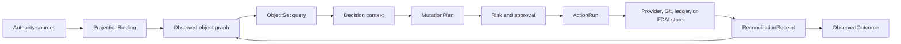

# FDAI Ontology Safety Infrastructure

This document extends the operating ontology into a typed infrastructure layer for FDAI's agents.
It adds object polymorphism, bounded object sets, semantic action effects, typed functions,
authority-aware writeback, exact schema pinning, and generated SDK surfaces. Agents still own every
runtime transition; these primitives constrain their inputs, plans, and effect verification.

> **Authority boundary:** Observed provider state remains a projection. An action can request a
> provider, Git, ledger, or FDAI-owned state change, but it cannot make an external fact true by
> editing the ontology graph.
>
> **Safety boundary:** Functions plan, query, derive, or validate. Only Thor executes an approved
> `MutationPlan`, and every external effect closes through independent reconciliation.
>
> **Implementation status (2026-08-01):** K0 contract identity is implemented for canonical
> releases, ActionBuilder output, and in-memory ontology writes. K1 semantic interface compilation
> and bounded ObjectSet queries are implemented. K2-K5 core primitives now cover mutation plans,
> stale revision checks, typed functions, projection bindings, reconciliation, scoped SDK
> generation, and a read-only manifest. PostgreSQL object/link writes persist exact type versions
> and release digests, and production ActionBuilder composition uses the full loaded release.
> The existing Reader-gated `GET /ontology/graph` projection exposes the release digest,
> proposal-only write surface, and `mutation_authority: false`; it adds no mutation route.
> Pre-migration rows remain explicitly unpinned because their original release digest cannot be
> reconstructed honestly. The next successful write creates a new, fully revalidated current-state
> revision and pins that new revision to the then-active release.
> Canonical releases now include typed function declarations. The function registry checks the
> caller agent, role, and purpose, derives replay-stable seeds for declared stochastic functions,
> and emits content-addressed invocation receipts pinned to the exact release.
>
> **Hardening status (2026-08-01):** Ten adversarial rounds covered release identity, persistence,
> interface compatibility, ObjectSet closure, mutation safety, function authority, projection,
> reconciliation, generated SDK syntax, and manifest disclosure. Verified Medium-or-higher core
> findings are fixed. PostgreSQL and runtime integration findings are also fixed; residual findings
> are Low. Round 12 rejected retroactive release assignment for legacy reads. Round 13 confirmed
> that a successful update creates and pins a newly validated current-state revision.

## Design at a glance

The infrastructure separates semantic declarations, authority-specific state, and agent-owned
kinetic execution. A graph write, function result, generated SDK call, or `MutationPlan` remains
proposal or context until the accountable agents complete judgment, authorization, execution, and
independent effect verification.



## Exact type identity

Every declaration belongs to one immutable `OntologyRelease`. Runtime records pin the exact
declaration that interpreted them:

```yaml
type_ref:
  name: Resource
  version: 2.1.0
  catalog_digest: sha256:<digest>
```

`Action`, `ActionRun`, ontology objects, ontology links, audit records, and generated plans retain
an exact reference. Compatibility checking returns `compatible`, `migration_required`, or
`incompatible`. A release cannot replace a declaration in place when existing records would be
reinterpreted.

## Semantic interfaces and object sets

`OntologyInterfaceType` is distinct from the existing `ActionInterface` safety flags. A semantic
interface declares properties, required links, supported actions, and inherited interfaces.
Object types can implement multiple interfaces. Initial kernel interfaces are `Operable`,
`Ownable`, `Observable`, `ObjectiveBound`, `Recoverable`, and `CostBearing`.

An `ObjectSetDefinition` selects objects by concrete type or semantic interface. It supports typed
property predicates, named-link traversal, deterministic ordering, an `as_of` cutoff, freshness,
purpose, and a hard result limit. It does not accept free-form Cypher, SPARQL, SQL, or model text.
Every materialization records the release digest, cutoff, source watermarks, truncation reason,
and redaction summary.

## Semantic actions and mutation plans

`ActionType` retains its stop conditions, rollback, impact scope, execution path, promotion gate,
and autonomy ceilings. Version 2 adds these semantic fields:

- **Target:** An exact ObjectType or InterfaceType reference plus one-or-set cardinality.
- **Parameters:** Primitive, enum, struct, object-reference, or object-set inputs with validation
  and redaction metadata.
- **Read set:** Object sets and properties required to plan and verify the action.
- **Submission criteria:** Deterministic criterion or `validate` function references.
- **Planner:** Declarative effect rules or one signed `plan` function.
- **Effects:** Expected internal writes, catalog pull requests, provider commands, notifications,
  or schedules.
- **Postconditions:** Independent observations that close the action outcome.
- **Transaction policy:** Internal atomicity or external saga semantics, lock scope, and maximum
  affected object count.

Planning produces an immutable `MutationPlan`. It contains exact target revisions, the computed
write set, commands, impact evidence, rollback or compensation steps, expected effects, and a
digest. Approval and execution revalidate the digest and current revisions. A stale plan returns
to planning or human review and never executes with widened scope.

## Typed ontology functions

An `OntologyFunctionType` has one of four kinds:

| Kind | Output | Authority |
|------|--------|-----------|
| `query` | `ObjectSetDefinition` or bounded data | Read only. |
| `derive` | Typed scalar or struct | Read only. |
| `validate` | Typed criterion result with evidence | Can lower eligibility only. |
| `plan` | Immutable `MutationPlan` | Proposal only. |

Functions declare exact input and output schemas, read sets, determinism class, artifact digest,
publisher, resource ceilings, and network policy. A function never receives executor identity and
never invokes a provider mutation directly.

## Authority-aware writeback and projection

Each ObjectType declares one authority class and write policy:

| Authority class | Examples | Write policy |
|-----------------|----------|--------------|
| `catalog_owned` | Rule, ActionType, policy | Reviewed Git pull request. |
| `fdai_owned` | Workflow draft, approval | Atomic state transaction plus outbox. |
| `provider_observed` | Cloud resource, topology | Provider command followed by independent observation. |
| `ledger_owned` | DecisionCase, ActionRun | Append only. |
| `derived` | Forecast, pattern projection | Owning-agent projection. |

For `provider_observed` objects, a successful API receipt is not a state update. Reconciliation
compares the intended effect with fresh evidence and emits a `ReconciliationReceipt` with
`matched`, `mismatched`, `timed_out`, or `unscorable`. Only the authoritative projection updates
observed state.

`ProjectionBinding` makes source-to-ontology mapping reviewable. It declares source identity,
type targets, identity and property mappings, watermark behavior, freshness, deletion semantics,
conflict policy, and batch limits. A source cannot silently overwrite another authority.

## Query, security, and SDK surfaces

Security applies at object, property, link, object-set, action-discovery, action-submission, and
function invocation boundaries. A visible link cannot reveal an otherwise hidden endpoint.

An ontology release can generate scoped Python and TypeScript SDKs plus OpenAPI metadata. The
generator includes only approved types and capabilities. Write methods submit typed action
proposals; they never call an executor.

## Delivery sequence

| Wave | Deliverable | Exit criteria |
|------|-------------|---------------|
| K0 | Exact `OntologyTypeRef` and `OntologyRelease` pinning. | Action, graph, audit, and replay tests preserve exact versions and digests. |
| K1 | Interfaces and bounded object sets. | Concrete expansion, ACL, cutoff, truncation, and query fixtures pass. |
| K2 | Semantic ActionType v2 and `MutationPlan`. | Plan digest, stale revision, impact, rollback, and shadow no-mutation tests pass. |
| K3 | Typed functions and authority-aware reconciliation. | Functions cannot mutate; every external effect reaches one typed closure. |
| K4 | Projection bindings and schema migrations. | Snapshot/delta parity, watermark recovery, conflict, and migration fixtures pass. |
| K5 | Generated SDKs and ontology application surfaces. | Python/TypeScript compile tests and proposal-only write tests pass. |

New fields begin optional for decoding but are required for newly built runtime records. Legacy
decoding is removed only after retained audit and instance fixtures replay under exact releases.

## Verification matrix

| Concern | Required proof |
|---------|----------------|
| Replay | A historical record resolves the same declaration and plan digest. |
| Authority | A graph write cannot grant permission or assert external state. |
| Query safety | Every object set is bounded, purpose checked, and explicit about truncation. |
| Action safety | Stop, rollback, impact, dry-run, lock, idempotency, and audit remain mandatory. |
| Function safety | Query and planning code has no executor identity or direct mutation path. |
| Reconciliation | Provider acceptance and observed convergence remain distinct states. |

## Related docs

| To learn about | Read |
|----------------|------|
| Existing semantic and authority model | [FDAI Operating Ontology](operating-ontology.md) |
| Existing ActionType safety contract | [Action Ontology](../decisioning/action-ontology.md) |
| Runtime execution authority | [Execution Model](../decisioning/execution-model.md) |
| Repository and dependency boundaries | [Project Structure](project-structure.md) |
