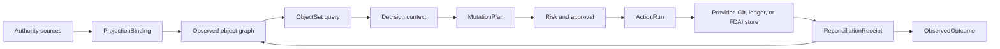

# FDAI Ontology Safety Infrastructure

This document extends the operating ontology into a typed infrastructure layer for FDAI's agents.
It adds object polymorphism, bounded object sets, semantic action effects, typed functions,
authority-aware writeback, exact schema pinning, and generated SDK surfaces. Agents still own every
runtime transition; these primitives constrain their inputs, plans, and effect verification.

> **Authority boundary:** Observed provider state remains a projection. An action can request a
> provider, Git, ledger, or FDAI-owned state change, but it cannot make an external fact true by
> editing the ontology graph.
>
> **Safety boundary:** Functions plan, query, derive, or validate. Only Thor executes an approved
> `MutationPlan`, and every external effect closes through independent reconciliation.
>
> **Implementation status (2026-08-01):** K0 contract identity is implemented for canonical
> releases, ActionBuilder output, and in-memory ontology writes. K1 semantic interface compilation
> and bounded ObjectSet queries are implemented. K2-K5 core primitives now cover mutation plans,
> stale revision checks, typed functions, projection bindings, reconciliation, scoped SDK
> generation, and a read-only manifest. PostgreSQL object/link writes persist exact type versions
> and release digests, and production ActionBuilder composition uses the full loaded release.
> The existing Reader-gated `GET /ontology/graph` projection exposes the release digest,
> proposal-only write surface, and `mutation_authority: false`; it adds no mutation route.
> Pre-migration rows remain explicitly unpinned because their original release digest cannot be
> reconstructed honestly. The next successful write creates a new, fully revalidated current-state
> revision and pins that new revision to the then-active release.
> Semantic Interface declarations now use the shared contract and can contribute to a canonical
> release digest. Production catalog loading and composition still provide no Interface
> declarations, so polymorphic ObjectSet queries remain an unwired platform capability.
> Canonical releases now include typed function declarations. The function registry checks the
> caller agent, role, and purpose, derives replay-stable seeds for declared stochastic functions,
> and emits content-addressed invocation receipts pinned to the exact release.
> K6-K8 target graph-wide Dynamic evidence: immutable operational state trajectories,
> dependency-scoped effect propagation, time-bounded invariants, and independently observed
> trajectory outcomes. Existing action/metric Dynamic simulation remains implemented; graph-wide
> propagation and failure-attribution wiring remain delivery work until their exit criteria pass.
>
> **Hardening status (2026-08-01):** Ten adversarial rounds covered release identity, persistence,
> interface compatibility, ObjectSet closure, mutation safety, function authority, projection,
> reconciliation, generated SDK syntax, and manifest disclosure. Verified Medium-or-higher core
> findings are fixed. PostgreSQL and runtime integration findings are also fixed; residual findings
> are Low. Round 12 rejected retroactive release assignment for legacy reads. Round 13 confirmed
> that a successful update creates and pins a newly validated current-state revision.

## Catalog-owned instance projection

Core runtime startup now projects Rule, PolicyArtifact, ResourceType, SignalType, Property, and
ActionType instances into one catalog-owned subgraph. The pure builder rejects missing policy
semantics and identity collisions. The projector reads the prior bounded subgraph and replaces it
atomically; an identical replay is a no-op so startup doesn't manufacture graph revisions.

This projection makes catalog relationships queryable but doesn't change their authority. Git
catalog-as-code remains authoritative, and the instance graph remains a read model. If OPA or the
ontology store is unavailable in an optional local profile, projection remains unavailable rather
than substituting synthetic state. Deployed profiles continue to require OPA for T0 evaluation.

## Design at a glance

The infrastructure separates semantic declarations, authority-specific state, and agent-owned
kinetic execution. A graph write, function result, generated SDK call, or `MutationPlan` remains
proposal or context until the accountable agents complete judgment, authorization, execution, and
independent effect verification.



## Exact type identity

Every declaration belongs to one immutable `OntologyRelease`. Runtime records pin the exact
declaration that interpreted them:

```yaml
type_ref:
  name: Resource
  version: 2.1.0
  catalog_digest: sha256:<digest>
```

`Action`, `ActionRun`, ontology objects, ontology links, audit records, and generated plans retain
an exact reference. Compatibility checking returns `compatible`, `migration_required`, or
`incompatible`. A release cannot replace a declaration in place when existing records would be
reinterpreted.

Cross-service semantic records use `OntologyReleaseRef`, a compact envelope containing the
contract `schema_version` and exact release `digest` without copying the declaration set. Legacy
discovery and explanation records may omit the envelope while they migrate. Decision-critical
`evaluate` and `action_draft` consumers require it, and any supplied mismatch is rejected before
semantic-index or provider I/O.

## Proof-carrying semantic interpretation

Lexical matching, embeddings, and models can produce a `SemanticInterpretationCandidate`. The
candidate pins its target type, ontology release, semantic catalog, normalized arguments, input,
unresolved terms, source, and content digest, but it always has `candidate_only` authority.

A candidate becomes a `VerifiedSemanticPlan` only when every term is resolved, its target matches
the exact active release, its operation class matches a typed function or ActionType, and it cites
an exact catalog record, promoted language surface, or operator-confirmation turn. The verified
plan remains `execution_authority: false`. Query, derive, and validate plans can target only typed
functions; an action interpretation can create only an ActionType-bound draft that re-enters the
normal judgment, approval, execution, recovery, and audit path.

Candidate and plan arguments are stored as canonical JSON rather than mutable nested containers.
Verification recomputes candidate integrity before producing a plan. Exact-catalog verification
pins the catalog digest directly and requires it to match the active semantic catalog supplied by
composition. Promoted surfaces and operator confirmations require an injected evidence validator
for the immutable promotion or conversation-turn reference.

The Operator API declares `inventory.select_resources` as a read-only ontology query function.
Production semantic candidates and the `/ontology/graph` manifest use the same release digest and
function reference. A candidate from another release is rejected before provider I/O.

## Semantic interfaces and object sets

`OntologyInterfaceType` is distinct from the existing `ActionInterface` safety flags. A semantic
interface declares properties, required links, supported actions, and inherited interfaces.
Object types can implement multiple interfaces. Initial kernel interfaces are `Operable`,
`Ownable`, `Observable`, `ObjectiveBound`, `Recoverable`, and `CostBearing`.

An `ObjectSetDefinition` selects objects by concrete type or semantic interface. It supports typed
property predicates, named-link traversal, deterministic ordering, an `as_of` cutoff, freshness,
purpose, and a hard result limit. It does not accept free-form Cypher, SPARQL, SQL, or model text.
Every materialization records the release digest, cutoff, source watermarks, truncation reason,
and redaction summary.

Property predicates support `equals`, `not_equals`, `in`, `exists`, `absent`, `at_least`,
`at_most`, and `contains`. Single-value operators use `equals`, `in` uses a non-empty `values`
tuple, single-value operands cannot be null, and presence operators accept no operand. The store
receives only `equals` predicates for indexed pushdown. Both direct queries and traversals apply
every predicate again to the bounded candidate graph and remove links whose endpoints were
filtered out. Predicate operands are canonical JSON with finite numbers, at most 32 nesting
levels, and at most 64 KiB of encoded data.
One definition accepts at most 32 predicates, one `in` predicate accepts at most 1000 values, and
one traversal accepts at most 1000 roots and 64 named link types. Root ids without a traversal and
traversals without a named link type are rejected before store I/O.

Materialization distinguishes `result_limit`, `candidate_limit`, and `traversal_limit`. A
`candidate_limit` means memory filtering saw only the first 1000 store candidates, so an empty or
short result is incomplete evidence rather than a complete absence claim. A `traversal_limit`
means graph expansion reached its object ceiling. The in-memory and PostgreSQL stores both apply
the requested object limit to initial roots as well as reached objects.

## Semantic actions and mutation plans

`ActionType` retains its stop conditions, rollback, impact scope, execution path, promotion gate,
and autonomy ceilings. Version 2 adds these semantic fields:

- **Target:** An exact ObjectType or InterfaceType reference plus one-or-set cardinality.
- **Parameters:** Primitive, enum, struct, object-reference, or object-set inputs with validation
  and redaction metadata.
- **Read set:** Object sets and properties required to plan and verify the action.
- **Submission criteria:** Deterministic criterion or `validate` function references.
- **Planner:** Declarative effect rules or one signed `plan` function.
- **Effects:** Expected internal writes, catalog pull requests, provider commands, notifications,
  or schedules.
- **Postconditions:** Independent observations that close the action outcome.
- **Transaction policy:** Internal atomicity or external saga semantics, lock scope, and maximum
  affected object count.

Planning produces an immutable `MutationPlan`. It contains exact target revisions, the computed
write set, commands, impact evidence, rollback or compensation steps, expected effects, and a
digest. Approval and execution revalidate the digest and current revisions. A stale plan returns
to planning or human review and never executes with widened scope.

## Typed ontology functions

An `OntologyFunctionType` has one of four kinds:

| Kind | Output | Authority |
|------|--------|-----------|
| `query` | `ObjectSetDefinition` or bounded data | Read only. |
| `derive` | Typed scalar or struct | Read only. |
| `validate` | Typed criterion result with evidence | Can lower eligibility only. |
| `plan` | Immutable `MutationPlan` | Proposal only. |

Functions declare exact input and output schemas, read sets, determinism class, artifact digest,
publisher, resource ceilings, and network policy. A function never receives executor identity and
never invokes a provider mutation directly.

The diagnostic runtime registers 22 Kubernetes reducers as exact-release `derive` functions. Live
providers invoke the registry as Heimdall under the `diagnostic-evaluation` purpose and preserve
the canonical function arguments with each invocation receipt. The observer accepts a finding only
when the active release, caller, invocation identity, input digest, and output digest all match.
These receipts are read-only provenance; they do not turn a diagnostic function into an action.

## Authority-aware writeback and projection

Each ObjectType declares one authority class and write policy:

| Authority class | Examples | Write policy |
|-----------------|----------|--------------|
| `catalog_owned` | Rule, ActionType, policy | Reviewed Git pull request. |
| `fdai_owned` | Workflow draft, approval | Atomic state transaction plus outbox. |
| `provider_observed` | Cloud resource, topology | Provider command followed by independent observation. |
| `ledger_owned` | DecisionCase, ActionRun | Append only. |
| `derived` | Forecast, pattern projection | Owning-agent projection. |

For `provider_observed` objects, a successful API receipt is not a state update. Reconciliation
compares the intended effect with fresh evidence and emits a `ReconciliationReceipt` with
`matched`, `mismatched`, `timed_out`, or `unscorable`. Only the authoritative projection updates
observed state.

`ProjectionBinding` makes source-to-ontology mapping reviewable. It declares source identity,
type targets, identity and property mappings, watermark behavior, freshness, deletion semantics,
conflict policy, and batch limits. A source cannot silently overwrite another authority.

## Dynamic state and graph effects

The platform separates three layers that must not grant authority to one another:

| Layer | Question | Output authority |
|-------|----------|------------------|
| **Semantic** | What exists, what does it mean, and which relationships are valid? | Type, unit, identity, cardinality, and compatibility only. |
| **Kinetic** | What registered operation may change an exact target under which safety contract? | Proposal-only `MutationPlan`; judgment, approval, and execution remain external. |
| **Dynamic** | How may state evolve over time under an intervention or external event, and how well did that prediction match reality? | Read-only prediction, invariant, propagation, and fidelity evidence only. |

`OperationalStateTrajectory` is distinct from the existing governed conversation and execution
`TrajectoryEnvelope`. It pins an ontology release, baseline graph revision, inventory generation,
event-time cutoff, horizon, affected object revisions, predicted or observed state slices,
intervention references, source watermarks, completeness, truncation, and one replay-stable digest.
It stores normalized values and opaque evidence references, never raw cloud payloads. A predicted
trajectory cannot assert provider truth; an observed trajectory requires authoritative provider
or telemetry receipts.

`GraphEffectModel` extends the current action-and-metric effect model without replacing it. It
declares a source object or interface, an ActionType or external-event trigger, one bounded LinkType
path, a target object or interface and metric, propagation lag, response function, uncertainty,
context conditions, evidence grade, learning cutoff, and active or challenger status. The simulator
applies deterministic topology effects first, then verified active models. Challenger output is
reported only as divergence evidence and never ranks or selects a branch.

`DynamicInvariant` describes a machine-evaluable bound that must hold over the complete trajectory,
such as an SLO, RTO, RPO, capacity floor, cost envelope, data-integrity predicate, or affected-set
ceiling. A predicted violation removes the branch before arbitration. An observed violation during
execution stops forward dispatch and re-enters the existing typed recovery path; it does not let a
simulator alter a running plan.

`TrajectoryOutcome` compares predicted and independently observed state slices by object, metric,
and time window. Its terminal status is `matched`, `mismatched`, `intervention_censored`,
`incomplete`, or `unscorable`. Only complete, post-cutoff, independently observed outcomes update a
challenger model. Active models remain immutable until a separate reviewed promotion applies an
exact evidence receipt.

Conversation or internal-processing failures may open an off-path adequacy review only after a
deterministic attribution step preserves the exact verification reason, route, evidence manifest,
ontology release, graph revision, freshness, and completeness. Context, provider, routing,
rendering, policy, semantic, kinetic, and Dynamic failures remain distinct. Only reproduced
semantic, projection, rule, or Dynamic gaps create inert ontology or model-review candidates.

## Query, security, and SDK surfaces

Security applies at object, property, link, object-set, action-discovery, action-submission, and
function invocation boundaries. A visible link cannot reveal an otherwise hidden endpoint.

An ontology release can generate scoped Python and TypeScript SDKs plus OpenAPI metadata. The
generator includes only approved types and capabilities. Write methods submit typed action
proposals; they never call an executor.

## Delivery sequence

| Wave | Deliverable | Exit criteria |
|------|-------------|---------------|
| K0 | Exact `OntologyTypeRef` and `OntologyRelease` pinning. | Action, graph, audit, and replay tests preserve exact versions and digests. |
| K1 | Interfaces and bounded object sets. | Concrete expansion, ACL, cutoff, truncation, and query fixtures pass. |
| K2 | Semantic ActionType v2 and `MutationPlan`. | Plan digest, stale revision, impact, rollback, and shadow no-mutation tests pass. |
| K3 | Typed functions and authority-aware reconciliation. | Functions cannot mutate; every external effect reaches one typed closure. |
| K4 | Projection bindings and schema migrations. | Snapshot/delta parity, watermark recovery, conflict, and migration fixtures pass. |
| K5 | Generated SDKs and ontology application surfaces. | Python/TypeScript compile tests and proposal-only write tests pass. |
| K6 | Operational state trajectories and deterministic graph propagation. | Identical release, graph, cutoff, models, and interventions produce one digest; stale, truncated, cyclic, or unmodeled paths require review. |
| K7 | Dynamic invariants and trajectory outcome closure. | No invariant-violating branch reaches arbitration; provider acceptance cannot close an outcome; incomplete observations remain unscorable. |
| K8 | Failure attribution and governed Dynamic learning. | Exact verification reasons survive intake; non-ontology failures create no ontology proposal; only challengers learn and no learned artifact raises authority without review. |

New fields begin optional for decoding but are required for newly built runtime records. Legacy
decoding is removed only after retained audit and instance fixtures replay under exact releases.

## Verification matrix

| Concern | Required proof |
|---------|----------------|
| Replay | A historical record resolves the same declaration and plan digest. |
| Authority | A graph write cannot grant permission or assert external state. |
| Query safety | Every object set is bounded, purpose checked, and explicit about truncation. |
| Action safety | Stop, rollback, impact, dry-run, lock, idempotency, and audit remain mandatory. |
| Function safety | Query and planning code has no executor identity or direct mutation path. |
| Reconciliation | Provider acceptance and observed convergence remain distinct states. |
| Dynamic replay | The same bounded inputs produce the same predicted trajectory and invariant verdict. |
| Dynamic authority | Prediction, model agreement, or model promotion evidence cannot approve or execute an action. |
| Dynamic closure | Only complete independent observations score trajectory fidelity or update a challenger. |

## Related docs

| To learn about | Read |
|----------------|------|
| Declaration kinds and runtime State/Context boundaries | [Operating Ontology Metamodel](operating-ontology-metamodel.md) |
| Existing semantic and authority model | [FDAI Operating Ontology](operating-ontology.md) |
| Existing ActionType safety contract | [Action Ontology](../decisioning/action-ontology.md) |
| Runtime execution authority | [Execution Model](../decisioning/execution-model.md) |
| Repository and dependency boundaries | [Project Structure](project-structure.md) |
