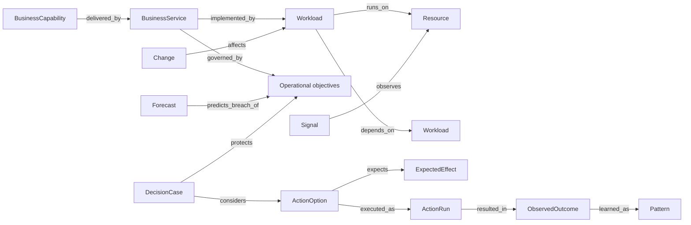

# FDAI Operating Ontology

This document defines the shared operating meaning used by FDAI's 15 agents. FDAI is specialized
for cloud operations while remaining cloud-provider-neutral and customer-agnostic: the upstream
owns stable operational concepts, and each deployment supplies its service map, objectives,
budgets, evidence, and resource instances.

> **Authority boundary:** The ontology graph is a shared semantic read model, not a mutable system
> of record and not an execution surface. Events, approved configuration, telemetry sources, the
> append-only audit ledger, and catalog-as-code remain authoritative for their own facts.
>
> **Safety boundary:** Ontology context can only preserve or lower autonomy. Missing, stale,
> conflicting, or unproven context holds a decision for review. It never supplies permission to
> execute.
>
> **Implementation status (2026-07-31):** O1 semantic-spine declarations and competency queries,
> O2 immutable context materialization and Forseti ceiling wiring, O3/O4 shared decision-case
> selection and response closure, and O5 balanced cohort intake through Norns and Mimir are
> implemented. A bounded JSON `OperatingModelProvider` can project deployment instances at startup;
> its revision and aggregate counts are available through the Reader-gated ontology projection.

## Design at a glance

The operating ontology connects four questions that the current resource-centered graph cannot
answer as one deterministic path: what the organization operates, what good means, what is
happening now or may happen next, and whether an intervention produced the intended effect. It is
the common language for reliability, architecture review, predictive cost governance, and
operational learning.

## Domain stance

FDAI is not domain-agnostic. It is a cloud-operations control plane with a stable domain model.
The boundaries are:

| Boundary | Upstream position |
|----------|-------------------|
| Cloud operations meaning | Specialized and stable across deployments. |
| Cloud provider | Neutral contracts, with Azure as the implemented provider. |
| Customer organization | Generic types and links only; no customer instances or values. |
| Business semantics | Stable concepts upstream, deployment-specific mappings and values downstream. |
| Autonomy | Governed by policy, risk, approval, execution, and audit contracts outside the graph. |

This distinction prevents two failure modes. A provider-specific model would make every operating
concept an Azure resource property. A fully domain-agnostic model would push service, reliability,
cost, and architecture meaning into untyped property bags that agents cannot share reliably.

## Semantic layers

### Operating scope

These objects answer what is operated and why it matters.

| ObjectType | Purpose |
|------------|---------|
| `BusinessCapability` | A generic business outcome delivered by one or more services. |
| `BusinessService` | Stable identity used for ownership, criticality, objectives, and impact. |
| `Workload` | A deployable or operable unit that implements a service. |
| `Resource` | An observed cloud resource, retained from the existing ontology. |
| `Environment` | A governed lifecycle scope such as production or non-production. |

`BusinessCapability` is optional for an initial SRE deployment. `BusinessService`, `Workload`, and
their resource mappings form the minimum operational spine. An unmapped resource remains visible
as `unknown_service`; it is never silently assigned to a synthetic service.

### Operating intent

These objects define the conditions FDAI should preserve.

| ObjectType | Purpose |
|------------|---------|
| `ServiceObjective` | Availability, latency, correctness, or freshness target with an SLI and window. |
| `RecoveryObjective` | RTO and RPO target for a service or workload. |
| `CostObjective` | Budget, run-rate, unit-cost, or variance target with currency and period. |
| `ArchitectureConstraint` | Reviewed architecture condition used by ARB and change assurance. |
| `Ownership` | Accountable operating owner and escalation reference. |

An objective is not a free-form metric label. It records its kind, unit, target or range,
measurement source, scope, owner, effective interval, and evidence freshness policy.

### Operating reality

Existing `Signal`, `Finding`, and `Incident` objects remain. The shared model adds explicit time
and prediction concepts instead of placing them only in a finding's open `context` bag.

| ObjectType | Purpose |
|------------|---------|
| `Observation` | A normalized measured value and evidence reference at an event-time cutoff. |
| `Change` | A proposed, in-progress, or completed change with affected scope and provenance. |
| `Forecast` | A versioned projection with horizon, interval, confidence, and feature cutoff. |
| `Experiment` | A bounded chaos or validation activity that may intervene in an observed episode. |

### Decision and learning

These objects make the complete intervention trace queryable without treating model prose as
authority.

| ObjectType | Purpose |
|------------|---------|
| `DecisionCase` | Immutable context with objectives, constraints, evidence, and no-action baseline. |
| `ActionOption` | One considered response, including a hold or no-op option. |
| `ExpectedEffect` | Predicted metric range, observation window, uncertainty, and predictor version. |
| `ActionRun` | The existing execution identity and terminal receipt. |
| `ObservedOutcome` | Observed effect, rollback, SLO recovery, recurrence, and scoring status. |
| `Pattern` | A reviewed generic mechanism supported by a balanced case cohort. |

`DecisionCase` does not replace the RiskGate decision or the audit record. It is the immutable
semantic input that lets Forseti, Odin, Var, Saga, and replay consumers refer to the same facts.

## Relationship contract

The initial relationship set should stay small and query-driven.

| LinkType | Endpoints | Meaning |
|----------|-----------|---------|
| `delivered_by` | BusinessCapability -> BusinessService | Services that deliver a capability. |
| `implemented_by` | BusinessService -> Workload | Workloads that implement a service. |
| `runs_on` | Workload -> Resource | Runtime placement without changing resource ownership. |
| `depends_on` | Workload/Resource -> Workload/Resource | Dependency required for correct operation. |
| `governed_by` | Service/Workload -> Objective/Constraint | Intent that applies to the target. |
| `owned_by` | Service/Workload/Objective -> Ownership | Accountable operating owner. |
| `observes` | Observation/Signal -> Service/Workload/Resource | Target of measured evidence. |
| `affects` | Change/Incident/Experiment -> Service/Workload/Resource | Scope influenced by an episode. |
| `predicts_breach_of` | Forecast -> Objective | Objective at risk within the declared horizon. |
| `considers` | DecisionCase -> ActionOption | Bounded alternatives evaluated together. |
| `protects` | DecisionCase/ActionOption -> Objective | Objective the decision seeks to preserve. |
| `expects` | ActionOption -> ExpectedEffect | Predicted effect before execution. |
| `executed_as` | ActionOption -> ActionRun | Governed execution of the selected option. |
| `resulted_in` | ActionRun -> ObservedOutcome | Independent effect closure. |
| `learned_as` | ObservedOutcome -> Pattern | Reviewed learning projection, never direct promotion. |

Cardinality, causal direction, temporal ordering, and allowed endpoint combinations belong in each
LinkType declaration. A relation that cannot support a required competency question should not be
added for visualization alone.

The current LinkType schema has one source and one target type per declaration. Conceptual union
links therefore compile to explicit physical names such as `workload_runs_on`,
`workload_depends_on`, `service_has_service_objective`, `service_has_recovery_objective`,
`service_has_cost_objective`, `service_has_architecture_constraint`, `service_owned_by`,
`workload_owned_by`, and `objective_owned_by`. This keeps endpoint validation deterministic.

## Identity and time

Operational meaning changes over time. Decision-critical objects therefore carry both when a fact
was true or observed and when FDAI recorded it.

- **Stable identity:** Service and workload ids survive resource replacement and deployment.
- **Effective time:** Objectives, ownership, budgets, and constraints carry `effective_from` and
  optional `effective_to`.
- **Event time:** Observations, changes, forecasts, incidents, and outcomes carry source time and
  an evidence cutoff.
- **Recorded time:** Every projection records when FDAI accepted it and the source revision.
- **Append-only revision:** A late fact creates a new revision or link interval. It does not
  rewrite the context used by a historical decision.
- **Freshness:** Every decision context records freshness per source. One fresh source cannot hide
  a stale objective, topology edge, or cost observation.

Replay resolves the graph as of the original decision cutoff and catalog versions. Current-state
queries use the latest valid revisions that pass freshness checks.

## Sources of truth

The ontology does not collapse independent authorities into one mutable graph.

| Fact | Authority | Ontology role |
|------|-----------|---------------|
| Type, link, action, and rule definitions | Git catalog-as-code | Versioned schema and meaning. |
| Service and workload mapping | Deployment service catalog or approved manifest | Runtime projection with provenance. |
| Resource topology | Injected `Inventory` provider | Fresh resource and dependency projection. |
| Objectives, budgets, constraints, ownership | Approved systems and fork configuration | Effective-time intent projection. |
| Telemetry and cost observations | Configured evidence providers | Event-time observations with source refs. |
| Decisions, approvals, actions, rollback | Append-only audit and Process journal | Immutable semantic links. |
| Cases and patterns | Case history plus reviewed catalogs | Learning projection and governed reuse. |

Each ObjectType declares one owning agent, one authority class, a freshness policy, retention, and
allowed purposes. Conflicting sources produce an explicit conflict or `unknown` state and lower
autonomy.

## Agent ownership

The ontology makes the fixed pantheon more capable without adding a central coordinator.

| Agent | Owned semantic write |
|-------|----------------------|
| Huginn | Normalized observations and discovered topology change events. |
| Heimdall | Findings, forecasts, and independent effect observations. |
| Njord | Cost observations, cost forecasts, and cost objective status. |
| Freyr | Demand, capacity forecasts, and sizing options. |
| Loki | Experiments and resilience evidence. |
| Forseti | Decision cases and governed decisions. |
| Odin | Cross-objective arbitration decisions and score breakdowns. |
| Var | Independent approval records. |
| Thor | Action runs and attempts. |
| Vidar | Rollback and recovery outcomes. |
| Saga | Audit evidence and immutable correlation links. |
| Muninn | Time-consistent context snapshots and case revisions. |
| Norns | Patterns and inert candidates. |
| Mimir | Reviewed ontology, rule, and action catalog lifecycle. |
| Bragi | No decision write; localized explanation over cited projections only. |

Agents collaborate through typed events. No agent mutates another agent's object, calls another
agent directly, or shares mutable workflow state.

## Operational context and decisions

Muninn materializes an immutable `OperationalContextSnapshot` for each decision cutoff. It is a
projection contract, not a new authority. At minimum it includes:

- target service, workload, resource, environment, and dependency neighborhood;
- active service, recovery, cost, and architecture objectives;
- ownership and escalation references;
- active changes, experiments, incidents, and maintenance windows;
- current observations and bounded forecasts;
- source freshness, provenance, unresolved conflicts, and catalog versions.

Forseti creates a `DecisionCase` from that snapshot. Each case contains the no-action baseline,
bounded options, expected effects, protected objectives, violated constraints, uncertainty, and
evidence references. Odin arbitrates only when eligible options conflict across objectives. Var
receives the same case when human approval is required, and Saga records its digest for replay.

Production startup reads `FDAI_OPERATING_MODEL_PATH` through the provider boundary, validates the
complete object/link snapshot, and atomically replaces the provider-owned subgraph. A monotonic
`applying` manifest retains the union of prior and current owned identities for stale deletion and
crash recovery. After replacement succeeds, the `projected` manifest compacts to current ownership
so historical revisions cannot exceed the configured model bounds. Startup cleans an interrupted
`applying` union before it stages another snapshot, preventing repeated crashes from accumulating
ownership across revisions. The optional
`FDAI_OPERATING_MODEL_MAX_BYTES` ceiling defaults to 16 MiB. `GET /ontology/graph` exposes only the
projection status, source revision, and aggregate counts, never deployment instance properties.

Cost and capacity specialist event-time travels with their advice. Forseti materializes one
time-consistent snapshot, builds the shared case, and includes it in the arbitration request. Odin's
resolved choice returns through Forseti as a verdict, and Thor's durable `ActionRun` plus Var's HIL
ticket preserve the bounded baseline, option effects, constraints, and evidence. Thor requires the
verdict action to match the selected option exactly. Missing, malformed, or mismatched case evidence
is denied rather than creating approval or execution authority.

## Continuous operating loops

"Living agents" means event-driven and time-driven control loops that close effects. It does not
mean an LLM runs continuously or gains implicit authority.

### Reliability loop

`Observation -> Finding/Forecast -> DecisionCase -> ActionRun -> ObservedOutcome -> objective`

The loop prioritizes service-objective and error-budget risk, not isolated resource utilization.

### Architecture review loop

`Change -> graph diff -> ArchitectureConstraint/Objective evaluation -> DecisionCase -> approval`

The Assurance Twin simulates the proposed graph as a read-only branch. A review can approve,
condition, reject, or hold the change, but it cannot enable an `ActionType` or bypass execution
checks.

### Predictive cost loop

`Cost observation -> CostObjective/Forecast -> options -> reliability guard -> outcome settlement`

Cost optimization is valid only when the selected option preserves service and recovery
objectives. Estimated savings remain predictions until an observed outcome closes the settlement
window.

### Outcome learning loop

The optional effect observer writes a strict `ResponseOutcome`. After both effect and outcome audit
records persist, composition republishes that contract through ordinary ingress. Audit failure
suppresses the relay, so unaudited outcomes cannot become learning evidence. Huginn owns
normalization; Muninn durably groups at most 100
cases per ActionType and publishes a `ContextIndex` cohort; Norns requires balanced positive and
negative evidence before emitting an inert candidate; Mimir applies the ordinary guard. Only a
verified enforce outcome is reusable positive evidence. Mismatch is negative evidence, while
unscorable and shadow-success outcomes are held outside the cohort.

## Extension model

The ontology grows in four controlled layers:

1. **Operating kernel:** Upstream ObjectTypes and LinkTypes shared by all deployments.
2. **Vertical packs:** Upstream reliability, architecture review, and cost-governance profiles.
3. **Fork extensions:** Reviewed industry or organization-specific types, links, objectives, and
   adapters that conform to the kernel.
4. **Deployment instances:** Customer service mappings, objectives, budgets, owners, resources,
   and evidence that remain outside upstream source control.

Extensions can add meaning but cannot redefine kernel identities, weaken cardinality, replace an
owning agent, or raise autonomy. Unknown observed types open a governed proposal instead of
self-registering. Breaking schema changes use semantic versioning, migration fixtures, a
deprecation window, and replay tests.

## Competency questions

Ontology quality is measured by deterministic questions, not by object count. Version 1 should
answer these questions with evidence and explicit unknowns:

1. Which business services and objectives can this resource change affect?
2. Which services may breach an objective within the configured horizon, and why?
3. Which active change or experiment can explain the current service degradation?
4. Which response options preserve reliability and recovery objectives within the cost envelope?
5. What happens if FDAI takes no action?
6. Why did Odin prefer one objective, and how close was the alternative?
7. Did the selected action produce its expected effect without guard-metric regression?
8. Is the prior case reusable under the current topology, objectives, and policy versions?

Each question becomes a versioned query fixture with positive, negative, stale, conflicting, and
unknown cases. A new type or link is justified by a failing fixture, then retained by regression.

## Delivery plan

| Wave | Deliverable | Exit criteria |
|------|-------------|---------------|
| O0 - Constitution | This authority, competency fixtures, identity/time rules, and ownership matrix. | Terms, authorities, unknown handling, and extension boundaries are agreed before schema work. |
| O1 - Semantic spine | Implemented: catalog declarations and deterministic query fixtures. | Loader, provenance, cardinality, versioning, and query tests pass with no catalog-owned runtime writer. |
| O2 - Context projection | Implemented: immutable `OperationalContextSnapshot`, materializer, runtime store sharing, and Forseti ceiling. | Fresh context preserves authority; stale, conflicting, and unmapped context lowers auto to human approval. |
| O3 - Reliability loop | Implemented core: objective-aware decision case, option selection, and `ResponseOutcome` closure. | Frozen tests traverse service -> objective -> option -> action -> effect with one correlation. |
| O4 - ARB and cost loops | Implemented core: architecture-constraint exclusion and protected-objective cost tradeoff. | Cost options cannot trade away protected reliability objectives. |
| O5 - Governed learning | Implemented: balanced pattern compiler and Muninn -> Norns -> Mimir intake. | Success-only cohorts are held and no outcome edits a live catalog declaration directly. |

The first code slice after O0 should add only the semantic-spine declarations, link constraints,
and query fixtures. Runtime writers, decision changes, and execution behavior belong to later,
separately validated slices.

## Verification matrix

| Concern | Required proof |
|---------|----------------|
| Meaning | Decision-critical fields are typed or reference a typed objective; open bags are not authority. |
| Provenance | Every instance names source, revision, effective/event time, recorded time, and freshness. |
| Unknown safety | Missing mapping, stale topology, or conflicting objective lowers autonomy and stays visible. |
| Ownership | Each object has one owning agent; all cross-agent collaboration uses typed events. |
| Replay | Historical decisions resolve the same snapshot, versions, options, and score breakdown. |
| Effect closure | Every executed option reaches a scored or explicitly unscorable outcome. |
| Extension safety | Fork additions cannot redefine kernel semantics or raise execution authority. |
| Customer isolation | Upstream fixtures use synthetic values and contain no deployment instances. |

## Related docs

| To learn about | Read |
|----------------|------|
| Current resource, rule, signal, and finding foundation | [LLM strategy](llm-strategy.md#ontology-foundation) |
| Runtime ontology storage | [Rule lookup ontology storage](rule-lookup-ontology-storage.md) |
| Action safety contract | [Action ontology](../decisioning/action-ontology.md) |
| Agent roles and arbitration | [Agent pantheon](../agents/agent-pantheon.md) |
| Forecast and response outcome closure | [Observability and detection](../rules-and-detection/observability-and-detection.md) |
| Operational case reuse | [Operational learning ontology](../rules-and-detection/operational-learning-ontology.md) |
| Read-only graph simulation | [Assurance Twin](../operations/assurance-twin.md) |
