# FDAI Operating Ontology

This document defines the typed operational truth infrastructure used by FDAI's 15 agents. Agents remain the active control plane; the ontology prevents them from disagreeing about target identity, dependencies, objectives, evidence, allowed actions, and expected effects. Upstream owns stable cloud-operations concepts, while each deployment supplies its observed instances and intent.

> **Positioning:** FDAI is agent-driven, not ontology-driven. The graph constrains interpretation and makes agent work replayable; it never senses, judges, approves, executes, recovers, or learns. It is nonetheless the required read path. An operational question resolves object identity, relationships, and evidence through the ontology instead of an ad hoc provider query, so the evidence an answer depends on stays typed, bounded, citable, and complete enough to name what it did not observe.

> **Authority boundary:** The ontology graph is a shared semantic read model, not a mutable system of record and not an execution surface. Events, approved configuration, telemetry sources, the append-only audit ledger, and catalog-as-code remain authoritative for their own facts.
>
> A projection refresh always follows an authoritative re-observation. It is never a write-back of an intended or dispatched effect: an executor result is an `execution` lane fact carrying
> `execution_ledger` authority, and the lane matrix in `shared/providers/state_evidence.py` rejects it in the `observed`, `derived`, and `desired` lanes. "FDAI changed it, so the graph says it
> changed" is therefore not an expressible path.
>
> **Safety boundary:** Ontology context can only preserve or lower autonomy. Missing, stale, conflicting, or unproven context remains explicitly unknown and triggers bounded evidence
> recovery, a smaller safe plan, no-op, or review. It never supplies permission to execute.
>
> **Implementation status (2026-08-08):** O1-O4 implement semantic declarations, immutable context, Forseti ceiling wiring, decision-case selection, response closure, and Muninn/Norns learning
> intake. `OperatingModelProvider` projects bounded deployment instances, while the optional
> EventBus provider continuously applies complete monotonic snapshots from a durable cursor. Both
> paths share a distributed lock, and bootstrap cannot project after that cursor has advanced;
> context snapshots retain typed evidence paths, revisions, effective time, provenance, and
> complete freshness receipts.
> M3 adds immutable `StateFactMetadata` for observed, derived, desired, and execution lanes.
> Optional inventory link observation metadata survives ontology projection and operational-context
> materialization, contributes to snapshot identity, and lowers the snapshot ceiling when evidence
> is stale, incomplete, conflicting, synthetic, future-cutoff, or unverified.
> Verified links require an independent verifier, a trusted verification method, and an immutable
> verification receipt. Required source freshness, trusted UTC clock identity, recorded time, and
> skew-bounded future checks also contribute to context safety and replay identity.
> Wave 2 provides a content-addressed `OperationalEvidenceBundle` runtime read path that keeps
> secured ontology paths, authoritative state facts, catalog references, and governed document
> excerpts in separate authority lanes. Admission requires content-addressed source receipts that
> pin the ontology release, catalog and document revisions, authenticated source, purpose, scope,
> redaction summary, and typed temporal scope. Deterministic claim and citation validation, exact
> typed-claim contradiction detection, and final-body byte and item budgets emit hold evidence and
> can only preserve or lower the bundle's autonomy ceiling. The optional source is dependency
> injected into the semantic runtime, and every returned bundle is fixed to `SHADOW_ONLY` with no
> mutation or execution authority.
> Change management adds planned-change evidence to `Change`, a reviewed `ChangeWindow`, and typed
> links from target and decision through impact, process, outcome, and recovery. These declarations
> are semantic evidence only and grant no approval or execution authority. Huginn now carries the
> same normalized Change on its causal Event and owner topic. Forseti computes a bounded
> `ChangeAssessment`, preserves it on Verdict and DecisionCase evidence, and requires human review
> for stale, incomplete, failed, or review-required assessment. The runtime currently supplies no
> graph-freshness authority, so planned changes cannot auto-clear this gate.
> M5 adds the catalog-declared `routes_to` and `peered_with` Resource links to inventory projection
> and read-only deterministic network and Pod telemetry functions. A composition-owned bounded
> issuer records secured ObjectSet results, and exact Function handlers resolve only the issued
> dependency digest. The verifier authenticates role, purpose, exact release, and projected-result
> digest against the contextual invocation and opaque trust context. Unissued and self-minted
> receipts are rejected. Evaluation time equals
> the trusted receipt cutoff; future effective, evidence, or recorded times and unbounded freshness
> stay unverified. It preserves stored edge direction and requires two directed peering records with
> distinct direction-bound observation and verification receipt lineage. Missing endpoints,
> incomplete queries, or absent paths remain unknown, never a claim that traffic cannot flow.
> Inventory projection rejects endpoint-type conflicts against observed resources. The function
> uses a source-derived artifact digest, emits exact-release invocation receipts, and has no
> provider I/O or execution authority.
> Current Azure projection now emits directed `routes_to` only when the provider supplies an exact
> ARM resource next-hop id. IP addresses, prefixes, DNS names, and route absence never become
> Resource identities or reachability claims. Both snapshot and real-time inventory projections
> persist the reviewed peering and routing link vocabulary.
> The inventory ontology projector now supports the catalog-declared `resource_classified_as`
> relationship from each observed Resource to one reviewed ResourceType. Classification pins the
> complete inventory generation and a replay-stable digest of the ResourceType registry entry.
> An unmapped type makes classification coverage incomplete and activates no replacement graph.
> A reviewed mapping whose ResourceType instance is not yet seeded records
> `unseeded_resource_type`, omits only that classification edge, and still writes the rest of a
> complete inventory generation. Other relationship and endpoint validation failures remain
> blocking.
> The production inventory job injects the already loaded registry digest map, so promoted complete
> generations persist this relationship in live projections.
> Provider topology enters only through reviewed explicit ARM structure and the bounded Kubernetes
> API source. [Ontology Structural Model](ontology-structural-model.md#provider-observed-topology)
> owns SQL, Communication, DNS resolver, AKS AgentPool, File Share, and UID-grounded Kubernetes
> containment. Exact mappings shadow resource-group fallback only for the same child; the single
> writer promotes verified endpoints and links. Missing bindings stay unavailable and create no topology.
> Repeated authoritative observations of one resource identity inside a generation are now
> adjudicated deterministically instead of failing the whole projection. Agreement collapses to one
> object and keeps the earliest observation time; disagreement stays an explicit state-fact conflict
> that withholds the contested value and demotes every existing consumer. Cross-authority
> adjudication between independent sources is not implemented.

## Implementation status

### Implementation scope

| Area | State | Evidence | Notes |
|------|-------|----------|-------|
| O1 semantic spine and catalog integrity | implemented | [`test_ontology_catalog.py`](../../../services/core-control-plane/tests/rule_catalog/test_ontology_catalog.py), [`test_ontology_provenance.py`](../../../services/core-control-plane/tests/rule_catalog/test_ontology_provenance.py) | The integrated catalog validates the operating semantic spine, provenance, references, and cardinality. |
| O2 bounded context and current-state projection | in-progress | [`ontology_instance.py`](../../../services/core-control-plane/src/fdai/shared/providers/ontology_instance.py), [`console_projection.py`](../../../services/core-control-plane/src/fdai/core/operational_context/console_projection.py), focused instance and Context projection tests | Typed current-state objects and links exist. A secured receipt can now produce bounded no-authority Context metadata only when purpose, release, cutoff, and graph coverage match. Principal-scoped transport and authenticated runtime evidence remain open. |
| Operational state decision-evidence admission | implemented | [`evidence_bundle.py`](../../../services/core-control-plane/src/fdai/core/operational_context/evidence_bundle.py), [`materializer.py`](../../../services/core-control-plane/src/fdai/core/operational_context/materializer.py), and focused bundle/materializer tests | Each decision-bound state item and the runtime operational-context snapshot retain the shared receipt and verification-bundle admission. Exact state, graph, scope, purpose, source, and time bindings lower to `SHADOW_ONLY` with an explicit hold when admission is missing, mismatched, or expired. Production runtime requires this admission and has no default-positive provider. |
| O3-O5 decision, outcome, and governed-learning loops | in-progress | [Delivery plan](#delivery-plan), [`test_ontology_alignment.py`](../../../services/core-control-plane/tests/agents/test_ontology_alignment.py) | Core slices exist, but effect closure and governed learning are not complete across every production path. |
| Decision-and-learning writers | in-progress | [`hypothesis_lineage.py`](../../../services/core-control-plane/src/fdai/core/operational_planning/hypothesis_lineage.py), [`_execution.py`](../../../services/core-control-plane/src/fdai/core/control_loop/_execution.py), and focused lineage and independent-outcome checks | `OperationalOutcomeLineageProducer` closes one single-effect episode only when Forseti-owned prospective records already exist. The actual ControlLoop call site supplies the runtime `Action`, exact ActionType version, captured executor start and end, terminal status and receipt, and a scorable `ResponseOutcome` produced after `IndependentEffectObserver`. Missing prospective records write nothing, and the producer records `telemetry_complete=false` because the response contract carries no completeness receipt. No composition root binds the source, sink, or projector. The remaining prospective fields, multi-effect independent outcomes, and explicit telemetry completeness still need named authoritative producers before composition. |
| Terminal decision lineage writer | implemented | [`operational_lineage.py`](../../../services/core-control-plane/src/fdai/delivery/operational_lineage.py), [`hypothesis_lineage.py`](../../../services/core-control-plane/src/fdai/core/operational_planning/hypothesis_lineage.py), focused lineage and reconciliation tests | Terminal independently observed reconciliation resolves exact durable plan, proposal, safety receipt, observation, and context identities before appending `DecisionCase -> ActionOption -> ExpectedEffect -> ActionRun -> ObservedOutcome`. An outcome is scorable only when the independent target observation contains that expected effect's exact metric. Raw action arguments are not projected. Pattern learning remains separate. |
| Multi-effect operational lineage contract | implemented | [`hypothesis_lineage.py`](../../../services/core-control-plane/src/fdai/core/operational_planning/hypothesis_lineage.py), [`ActionOption.yaml`](../../../rule-catalog/vocabulary/object-types/ActionOption.yaml), focused lineage and competency checks | New lineage writes preserve the ordered complete expected-effect set and require one independent outcome per effect. Singular-only stored records read as one effect, while dual-field ambiguity fails closed. |
| Wave 2 evidence, change, Property, and topology foundations | in-progress | [Implementation status narrative](#fdai-operating-ontology), [Operating Ontology Platform](operating-ontology-platform.md), [`check-property-semantic-coverage.py`](../../../scripts/quality/architecture/check-property-semantic-coverage.py) | Every rule-evaluated Property has reviewed semantics, exact-target current-state reads can perform one bounded graph refresh, and evidence bundles have an optional runtime read composition. Planned-change assessment and broader platform delivery remain open. |
| Console semantic-band declaration completeness | implemented | [`Forecast.yaml`](../../../rule-catalog/vocabulary/object-types/Forecast.yaml), [`Pattern.yaml`](../../../rule-catalog/vocabulary/object-types/Pattern.yaml), [`test_ontology_console_projection.py`](../../../services/core-control-plane/tests/delivery/test_ontology_console_projection.py) | Every object type named by a Console band is declared by the shipped release, so no band member is dropped silently. Both declarations are semantics only and add no instance path. |
| Operating-scope `unknown_service` coverage | validated | [`operating_scope.py`](../../../services/core-control-plane/src/fdai/core/operational_context/operating_scope.py), [`postgres_inventory_snapshot.py`](../../../services/core-control-plane/src/fdai/delivery/persistence/postgres_inventory_snapshot.py), and focused consumer checks (`4 passed`) | The authenticated inventory graph projection annotates every bounded response Resource with one reviewed service or `unknown_service`, returns aggregate completeness, and degrades on unmapped or truncated scope. |
| Provider-native unclassified identities | validated | [`inventory.py`](../../../services/core-control-plane/src/fdai/shared/providers/inventory.py), [`arg_query.py`](../../../services/core-control-plane/src/fdai/delivery/azure/arg_query.py), focused checks (`259 passed`), and [Issue #217](https://github.com/dotnetpower/fdai/issues/217) | A reviewed reserved ResourceType keeps unsupported provider identities visible without inventing type-specific semantics. The promoted local snapshot and ontology retain exact provider identity coverage with no realtime overlay residual. |
| Operating-intent runtime instances | in-progress | Catalog declarations for the six intent types, [`ontology_console_projection.py`](../../../services/core-control-plane/src/fdai/delivery/ontology_console_projection.py) | `ServiceObjective`, `RecoveryObjective`, `CostObjective`, `ArchitectureConstraint`, `Ownership`, and `ChangeWindow` are declared and banded, and `OperatingModelProjector` can persist deployment-supplied instances. No projection derives them and no focused test pins intent instances end to end. |

### Implementation history
| Date | State | Change | Evidence | Remaining |
|------|-------|--------|----------|-----------|
| 2026-08-29 | implemented | Migrated the primary operational-context snapshot used by decision cases and operational planning. Runtime composition requires decision evidence; the materializer binds the pre-admission snapshot digest, target/cutoff scope, catalog and clock revision, and admission into the final replay identity. Missing or rejected admission records a conflict and fixes the autonomy ceiling at `SHADOW_ONLY`. | `current change`; context snapshot model, materializer, runtime pantheon composition, and focused context, agent, and bootstrap tests; Ruff and strict mypy. | Bind the production admission provider and retain a governed context snapshot bundle. |
| 2026-08-29 | implemented | Migrated the operational-context state evidence boundary to the shared decision-evidence admission. Bundle identity retains the admission, while the decision digest excludes it to avoid a circular commitment. Missing, mismatched, or expired admissions become bounded evidence issues and force a `decision_evidence_unverified` hold with `SHADOW_ONLY` autonomy. | `current change`; operational evidence models, identity, builder, shared admission mapping, and focused bundle/materializer tests; Ruff and strict mypy. | Bind an authoritative state admission producer and migrate direct state consumers that bypass the operational evidence bundle. |
| 2026-08-26 | implemented | Extended provider-observed Kubernetes meaning with UID-grounded Ingress, IngressClass, and EndpointSlice Resources plus an exact Node `providerID` to VMSS VM identity bridge. Service selectors remain namespace-scoped, incomplete Ingress backend sets emit no partial route, and names or identifier prefixes never create the bridge. | `current change`; focused Kubernetes, provider-mapping, ResourceType, ResourceClass, inventory-promotion, and catalog checks passed 111 cases. | Retain one complete exact-cluster Kubernetes generation before claiming runtime validation. |
| 2026-08-19 | validated | Promoted and measured the identity-complete provider graph after the service-owned inventory entry point gained composition parity. The provider fence reports 533 native objects: 476 reviewed mappings and 57 reserved unclassified identities across 68 provider types, with `provider_identity_complete=true`. Snapshot and ontology each retain 573 Resources, their identity sets have zero difference, and the realtime overlay contains zero Resources and zero links. | [Issue #217](https://github.com/dotnetpower/fdai/issues/217); coverage schema `1.1.0`; final local observation reports fresh inventory with 1,215 aggregate graph records. | Deployment-reviewed service mappings may reduce `unknown_service`; no provider identity, projection parity, or realtime-overlay residual remains. |
| 2026-08-19 | validated | Bound `project_operating_scope` to the PostgreSQL-backed authenticated inventory graph response. Two bounded reverse link reads resolve only service paths ending at response Resources; every Resource carries `service_ref`, and incomplete input or unmapped scope becomes an explicit coverage gap instead of a healthy absence claim. | [Issue #217](https://github.com/dotnetpower/fdai/issues/217); 4 focused consumer tests and strict mypy pass; a read-only loopback measurement returned 213/213 response Resources annotated, `input_complete=true`, `complete=false`, and `operating_scope_unmapped`. | Supply reviewed BusinessService and Workload mappings to reduce the measured `unknown_service` set; no consumer wiring remains. |
| 2026-08-19 | implemented | Added the reviewed `unclassified-resource` ResourceType and exact provider-identity reconciliation. An undeclared native type is no longer absent from a complete generation, but it gains no query terms, type-specific Rule, or action eligibility. | [Issue #217](https://github.com/dotnetpower/fdai/issues/217); focused inventory, ontology, catalog, and semantic value-domain checks pass within the 259-case slice; Ruff and strict mypy pass. | Promote a fresh generation, then bind operating-scope coverage to one read-only operator consumer. |
| 2026-08-13 | in-progress | Adopted the implementation ledger without reconstructing earlier provenance. | Current source, tests, and delivery plan listed in the scope table. | Complete the observable exit conditions below. |
| 2026-08-14 | implemented | Added a bounded Context presentation projector that rejects mismatched secured receipts and omits raw object properties. | `current change`; `test_console_projection.py` passed 5 focused cases. | Bind the projector only through a principal-scoped evidence response and retain authenticated Console evidence. |
| 2026-08-15 | implemented | Removed the undeclared `predicts_breach_of` and `learned_as` rows from the relationship contract, recorded their blocking ObjectTypes, and pinned the table against the shipped LinkType catalog and stored link direction. | `current change`; `test_ontology_catalog.py` and `test_ontology_instance.py` focused cases. | Restore either relationship only together with its endpoint ObjectType and the competency question it answers. |
| 2026-08-15 | implemented | Judged `Pattern` and `PatternObservation` to be one layer from the compiler and publish path, corrected the review claim, marked both undeclared object types in place, and recorded that the decision-and-learning lineage projector has no production caller. | `current change`; `test_ontology_catalog.py` document-consistency cases. | Construct `OperationalHypothesisLineageProjector` from a composition root so a governed episode writes and can replay `considers`, `expects`, `executed_as`, and `resulted_in`; then either publish `PatternObservation` from Norns with a live consumer or retire it, its topic, and its `PANTHEON_SPECS` and pantheon-document rows in one change. |
| 2026-08-15 | implemented | Corrected the agent-ownership section to name the two independent ownership registries, replaced the prose ownership claims with the exact `lifecycle.owner` type list, and replaced the unsupported "authority class, freshness policy, retention, allowed purposes" claim with the fields the schema actually declares. | `current change`; `test_object_type_catalog.py::test_documented_semantic_write_owners_match_the_catalog`. | Decide per ObjectType whether an absent `lifecycle` block should gain a declared owner; do not add one to fill the field. |
| 2026-08-15 | implemented | Added deterministic adjudication of repeated authoritative observations of one resource identity, so `StateFactMetadata.conflicts` has a production producer instead of only test fixtures. Benign repetition no longer fails the whole generation. | `current change`; `test_observation_adjudication.py` 15 focused cases and `test_inventory_projection.py` conflict-demotion cases passed; 354 focused ontology, inventory, and runtime cases passed. | Adjudicate genuinely independent authorities against each other; inventory projection versus live discovery is the next pair. |
| 2026-08-15 | implemented | Adjudicated the first genuinely independent pair: the live provider read against the inventory-projected graph state. A state or identity disagreement becomes a `derived` cross-source conflict that is retained in the receipt digest and makes the hook abstain from asserting a state and degrade its activity; an observation-time difference alone is explicitly not a conflict. | `current change`; `test_resource_state_shadow.py` 6 added adjudication cases and `test_wire_read_investigation.py::test_cross_source_state_conflict_lowers_the_answer_and_activity` with a non-vacuous agreeing control. | Adjudicate two independent providers, and projected state against telemetry. |
| 2026-08-15 | implemented | Added a measured Property semantic coverage gate, disclosed the coverage and its consequence in both language pairs, corrected the `public_access` value type against the shipped Rego comparison, and added six evidence-grounded semantics. | `current change`; `check-property-semantic-coverage.py` reports 14/62 reviewed references; `test_property_semantic.py`, `test_ontology_catalog.py`, `test_catalog_projection.py`, and `test_property_semantic_coverage.py` focused cases. | Collection-valued references stay uncovered until bounded canonical JSON Property semantics exist. |
| 2026-08-16 | implemented | Restored the 2026-08-15 `Pattern` and `PatternObservation` row to the text it was recorded with, moved it back ahead of the rows a later merge interleaved before it, and records the work that had overwritten it here instead, because the implementation history is append-only. That work adopted the shipped `Forecast` and `Pattern` declarations, unified the owned learning object on `Pattern` across spec, topic, and tables, added the `unknown_service` scope-coverage marker, and recorded that both deferred relationships are blocked because neither endpoint pair is producible. | `current change`; `rule-catalog/vocabulary/object-types/{Forecast,Pattern}.yaml`, `operating_scope.py`, `test_ontology_catalog.py` document-consistency cases, `test_shipped_catalog_accepts_and_traverses_one_lineage`, and `test_shipped_catalog_rejects_a_lineage_missing_a_required_property`; a reversed `resulted_in` direction now fails, which the previous fake-store test could not detect; the focused catalog, context, projection, alignment, instance, explorer, and release suites passed. | Supply the missing `DecisionCase`, `ActionOption`, `ExpectedEffect`, and `ActionRun` properties from real producers, then construct `OperationalHypothesisLineageProjector` from a composition root; supply a producer for either deferred relationship before restoring it; publish `Pattern` from Norns with a live consumer or retire its topic; bind scope coverage to one consumer and pin operating-intent instances. |
| 2026-08-18 | implemented | Made the lane and authority separation exhaustively executable. Every lane and authority pair is now asserted, an `execution_ledger` fact is rejected in the `observed`, `derived`, and `desired` lanes, and a lane with no matrix row fails closed with the documented rejection instead of a latent `KeyError`. | `current change`; `test_state_evidence.py` 39 focused cases passed. | Bind the same separation at every projection write site so a future writer cannot persist a state fact without constructing `StateFactMetadata`. |
| 2026-08-24 | implemented | Reconciled the ActionOption effect property with the one-to-many `expects` and `resulted_in` links. New lineage writes require all expected-effect ids in deterministic order and one independent outcome per effect. Singular-only stored records read as one effect, dual-field ambiguity fails closed, and cross-type object-id collisions are rejected before storage. | `current change`; `hypothesis_lineage.py`; `ActionOption.yaml`; focused lineage and competency checks passed 15 cases. | Supply the remaining real producer properties and construct the projector only after the complete episode is available. |
| 2026-08-24 | in-progress | Added the first real decision-lineage producer segment. A one-effect closure joins only an exact runtime Action and independently observed scorable ResponseOutcome to pre-existing prospective records, appends the complete episode, and replays idempotently. The ControlLoop captures execution timestamps at the executor boundary and invokes an optional sink only after the outcome audit succeeds. | `current change`; `hypothesis_lineage.py`; `core/control_loop/{orchestrator,_execution}.py`; focused lineage checks passed 14 cases and MSCP shadow call-site checks passed 15 cases. | Produce the Forseti prospective records, multi-effect outcome set, and telemetry completeness evidence, then bind composition only when one complete runtime episode exists. |
| 2026-08-24 | implemented | Connected independently observed terminal reconciliation to immutable multi-effect lineage, added the bounded evidence-bundle read service, one-shot graph-first refresh, continuous ordered operating-model snapshots, full rule-evaluated Property semantics, scoped SDK artifacts, and evidence-bound copy-on-write scenarios. | `current change`; focused lineage, graph refresh, Property, interface, runtime, SDK, evidence, and scenario checks; hardening rounds left no verified unresolved finding above Low. | Retain deployed evidence separately and keep planned-change assessment and governed scenario promotion in their existing authority paths. |
| 2026-08-24 | implemented | Fenced continuous operating-model projection across replicas with the deployment resource lock and reused that fence during startup. A replica now skips its static bootstrap snapshot after the durable continuous cursor has advanced. | `current change`; overlapping-worker and stale-replica bootstrap regression checks (`5 passed`), runtime operating-model checks, and Ruff. | Retain broker lag and lock-pressure measurements as deployment evidence. |
| 2026-08-24 | implemented | Bound every continuous source revision to a durable canonical snapshot digest. Nonconsecutive revision reuse with different content is rejected, while exact replay after an interrupted post-projection cursor write closes the cursor without projecting the graph again. | `current change`; continuous operating-model replay and failure-injection checks (`7 passed`) and Ruff. | Bound revision-claim retention only after a deployment-specific replay horizon is defined. |
| 2026-08-24 | implemented | Extended interrupted-update recovery across the projection-to-revision-claim boundary. The projected manifest now pins the canonical snapshot digest, so an exact retry after claim persistence fails closes the claim and cursor without replacing the graph or incrementing object revisions. | `current change`; `runtime/{operating_model,continuous_operating_model}.py`; projection-before-claim failure injection and the complete focused worker file (`8 passed`). | Retain cross-replica lock-pressure and process-kill measurements as deployment evidence. |
| 2026-08-24 | implemented | Corrected multi-effect lineage scoring so a terminal plan-level reconciliation cannot make an effect scorable when the independent target observation omits that effect's metric. The lineage remains complete but records the effect as explicitly unscorable. | `current change`; `delivery/operational_lineage.py`; focused lineage checks (`2 passed`). | Retain a production episode with one independently observed value per expected effect before using the lineage for governed learning evidence. |

### Remaining work

- [ ] Supply and verify graph-freshness authority for planned-change assessment before allowing any
  automated clearance, including stale, incomplete, and conflicting negative cases.
- [ ] Complete production bindings and replay evidence for the remaining context, outcome-closure, and governed-learning paths on one pinned ontology release.
- [ ] Produce `OperationalProspectiveLineage` from Forseti-owned uncertainty, option, precondition, effect-direction, and predictor-version values; extend independent closure to the complete multi-effect set with an authoritative telemetry-completeness receipt; then bind the source and projector only after one complete runtime episode exists.
- [ ] Bind receipt-verified Context metadata through an existing principal-scoped evidence response; prove wrong-principal, wrong-purpose, wrong-release, stale, and truncated cases remain unavailable.
- [ ] Keep the operating ontology and platform ledgers synchronized as topology, temporal,
  reconciliation, and graph-wide Dynamic delivery reaches its focused exit conditions.
- [x] Bind `project_operating_scope` to the authenticated read-only inventory graph response so
  `unknown_service` reaches an operator surface; focused consumer checks pass 4 cases.
- [ ] Supply a producer for the `Forecast` and `Pattern` endpoint pairs before restoring
  `predicts_breach_of` and `learned_as`. Both ObjectTypes now ship, so the blocker is that no
  runtime path writes either endpoint, not that the catalog would reject the declaration.
- [ ] Project the six operating-intent types from a deployment-supplied source and pin them with a
  focused test that fails when an intent type produces no instance.
- [ ] Review the shipped ObjectTypes that carry no `lifecycle` block and record, per type, whether an
  agent single-writer is required or whether catalog-as-code, a projection, or the event-bus
  registry is the correct authority ([#130](https://github.com/dotnetpower/fdai/issues/130)).
- [ ] Adjudicate two independent cloud providers against each other, and projected state against
  telemetry. Today only repeated observations inside one generation and the live-read against
  inventory-projection pair are decided.
- [ ] Decide whether an adjudicated cross-source conflict should also reach an autonomy ceiling
  outside the read path, and which writer may carry it without breaking single-writer ownership of
  the projected subgraph.

## Catalog semantic projection

The rule catalog now models authored Rego as a first-class `PolicyArtifact`. Every shipped Rule
uses concrete `SignalType` and canonical `Property` references, and `implemented_by_policy` links
the Rule to its deterministic policy. `scripts/catalog/sync-rule-semantics.py` parses Rego through
OPA, verifies package metadata, and blocks drift between policy property reads and Rule metadata.
The semantic manifest and T0 evaluator now share the exact deny decision path and normalized AST
semantic digest. Each determined allow or deny evaluation carries the OPA version, source digest,
canonical input digest, and result digest; policy retrieval alone remains candidate-only.

One reviewed configuration baseline SignalType handles unmatched raw event types. This preserves
deterministic T0 coverage without retaining wildcard ontology links. These catalog declarations
describe meaning only. They don't assert current provider state or grant execution authority.

The catalog-owned `Property` ObjectType remains the meta object for rule property references.
`rule-catalog/vocabulary/property-semantics.yaml` adds reviewed semantics to every Property instance
evaluated by a shipped rule: canonical `semantic_id`, value type, optional unit, enum
or range, normalization rule, authority and freshness policy, equivalent provider paths, and the
shipped evidence behind them. Provider paths never branch core code, and
`scripts/quality/architecture/check-property-semantic-coverage.py` measures the coverage below.

<!-- property-semantic-coverage:begin -->
Measured reviewed coverage: **62 of 62** rule-evaluated Property references (100.0%) across 44
reviewed semantics, computed by the gate rather than by hand. Every rule-evaluated Property
reference has reviewed meaning and bounded canonical normalization; a new reference cannot pass
the gate without updating the registry and floor.
<!-- property-semantic-coverage:end -->

The loader normalizes units and provider identity paths before rejecting collisions, normalizes,
deduplicates, and orders enum values, and applies case folding before NFC normalization. Decimal
values use context-independent canonicalization with bounded input, coefficient, exponent, and
output sizes, and range checks compare the exact parsed value before rendering. YAML numeric bounds
are parsed from their authored lexemes into `Decimal` before Pydantic validation, serialized as
canonical decimal strings for digests, and never pass through binary floating point; a finite JSON
number with an integral value is a valid integer bound. Datetimes require RFC 3339 `T` separation,
an explicit timezone, in-range UTC conversion, at most six fractional digits, and no surrounding
whitespace. Booleans are never integers or numbers. Object and array values use bounded canonical
JSON: object keys are sorted, array order is preserved, and invalid roots, non-finite numbers,
excessive nesting, unsupported values, and canonical output over 64 KiB fail closed.

Every registry requires a version and provenance envelope whose SHA-256 covers canonical content
excluding the envelope itself, every semantic requires authenticated source identity, and freshness
has a finite positive upper bound. Catalog projection pins the verified registry version and digest
on each reviewed Property; runtime projection reuses the registry validated during catalog loading.
A missing registry file produces one stable legacy empty registry, and a Property without reviewed
metadata keeps its legacy fields, omits `normalized_equivalence`, and cannot be normalized here.

### Configuration drift vocabulary

The catalog declares `ConfigurationBaseline`, `ConfigurationDriftEvidence`,
`ConfigurationDriftCheck`, and `ConfigurationDriftFinding` as provider-neutral data shapes.
Together they separate reviewed desired configuration, bounded current-state evidence, one
comparison result, and its resource or field differences. Terraform plan output is one possible
`source_kind`; Azure Policy, GitOps manifests, and Kubernetes desired state can produce the same
semantic records without adding provider branches to core.

The links preserve baseline-to-check, check-to-evidence, check-to-finding, and finding-to-resource
direction. A `CausalHypothesis` may attempt to explain a drift finding, but the link never proves
that an operator, deployment, or provider caused it. Raw plans and values remain in governed
evidence storage. Ontology records retain bounded summaries and digests, require redaction
metadata, and set `execution_authority` explicitly. These declarations are vocabulary data only:
no runtime projector, scheduled detector, remediation proposal, approval, or execution path is
added by the catalog change.

### Diagnostic knowledge projection

The SREGym absorption ledger projects 61 reviewed diagnostic mechanisms into
`DiagnosticMechanism`. Seven independent validation axes create 427 content-addressed
`BenchmarkValidation` receipts. Each receipt keeps its source revisions, result, validation kind,
available evidence summary, and canonical digest. Catalog refreshes append new receipts instead of
rewriting prior validation history, and rejected mechanisms remain explicit negative knowledge.

Live Kubernetes evaluation projects `DiagnosticEvidence` and hold-only `DiagnosticFinding`
objects before control-loop judgment. Every finding is bound to an exact `derive` function release,
Heimdall caller, canonical input and output digests, and content-addressed invocation identity.
Current topology uses cluster-scoped resource identities derived from the selected kubeconfig API
server and certificate authority. Complete observations replace current relationships, incomplete
observations withdraw unsupported relationships without deleting resource objects, and unavailable
inventory leaves the prior projection untouched. None of these objects grants action, approval,
promotion, or execution authority.

### Pod telemetry competency runtime

M5 reuses `Resource` for Kubernetes Pod, Service, and Endpoints instances and reuses `Observation`
for bounded metric samples. The physical `observation_targets_resource` LinkType records
`Observation -> Resource`; existing `kubernetes_selects` and `kubernetes_exposes_endpoints` links
cover the Pod, Service, and Endpoints topology. No `TelemetryChain` ObjectType is introduced.

The read-only evaluator consumes one purpose-scoped secured ObjectSet result plus immutable
`StateFactMetadata` for every relationship and sample. It reports each required segment as
`verified`, `unverified`, `stale`, or `missing`, along with evidence references and an exact
completeness fraction. A missing relation is reported as `missing` only when the secured graph
receipt proves complete coverage. Truncated graphs, cycles, ambiguous paths, synthetic samples,
partial state, conflicts, stale samples, and wrong-cluster identities remain unverified or missing.
The result always records `claimed_health: false` and `execution_authority: false`.

The source-derived FunctionType is included in the exact runtime release and registered in the
semantic Function handler. It consumes only a composition-issued secured query result and typed
metadata retained in that graph. It does not call a Kubernetes or provider adapter, join Finding
or Forecast objects, or feed an authority-bearing decision path.

## Design at a glance

The operating ontology connects four questions that the current resource-centered graph cannot
answer as one deterministic path: what the organization operates, what good means, what is
happening now or may happen next, and whether an intervention produced the intended effect. It is
the common language for reliability, architecture review, predictive cost governance, and
operational learning.

## Domain stance

FDAI is not domain-agnostic. It is a cloud-operations control plane with a stable domain model.
The boundaries are:

| Boundary | Upstream position |
|----------|-------------------|
| Cloud operations meaning | Specialized and stable across deployments. |
| Cloud provider | Neutral contracts, with Azure as the implemented provider. |
| Customer organization | Generic types and links only; no customer instances or values. |
| Business semantics | Stable concepts upstream, deployment-specific mappings and values downstream. |
| Autonomy | Governed by policy, risk, approval, execution, and audit contracts outside the graph. |

This distinction prevents two failure modes. A provider-specific model would make every operating
concept an Azure resource property. A fully domain-agnostic model would push service, reliability,
cost, and architecture meaning into untyped property bags that agents cannot share reliably.

## Semantic layers

### Operating scope

These objects answer what is operated and why it matters.

| ObjectType | Purpose |
|------------|---------|
| `BusinessCapability` | A generic business outcome delivered by one or more services. |
| `BusinessService` | Stable identity used for ownership, criticality, objectives, and impact. |
| `Workload` | A deployable or operable unit that implements a service. |
| `Resource` | An observed cloud resource, retained from the existing ontology. |
| `Environment` | A governed lifecycle scope such as production or non-production. |

`BusinessCapability` is optional for an initial SRE deployment. `BusinessService`, `Workload`, and
their resource mappings form the minimum operational spine. An unmapped resource remains visible
as `unknown_service`; it is never silently assigned to a synthetic service. The marker is
implemented by [`project_operating_scope`](../../../services/core-control-plane/src/fdai/core/operational_context/operating_scope.py), which grants no authority.
Provider-native type coverage is a separate axis. A row with no reviewed neutral mapping is retained
as `unclassified-resource`, with its native type kept as inert evidence. It still receives
`unknown_service` until a reviewed workload and service mapping reaches it.

### Operating intent

These objects define the conditions FDAI should preserve.

| ObjectType | Purpose |
|------------|---------|
| `ServiceObjective` | Availability, latency, correctness, or freshness target with an SLI and window. |
| `RecoveryObjective` | RTO and RPO target for a service or workload. |
| `CostObjective` | Budget, run-rate, unit-cost, or variance target with currency and period. |
| `ArchitectureConstraint` | Reviewed architecture condition used by ARB and change assurance. |
| `Ownership` | Accountable operating owner and escalation reference. |
| `ChangeWindow` | Reviewed maintenance, freeze, quiet, or emergency interval for a bounded scope. |

An objective is not a free-form metric label. It records its kind, unit, target or range,
measurement source, scope, owner, effective interval, and evidence freshness policy.

### Operating reality

Existing `Signal`, `Finding`, and `Incident` objects remain. The shared model adds explicit time
and prediction concepts instead of placing them only in a finding's open `context` bag.

| ObjectType | Purpose |
|------------|---------|
| `Observation` | A normalized measured value and evidence reference at an event-time cutoff. |
| `Change` | A planned, proposed, active, drift-observed, or completed change with intent, desired-state evidence, affected scope, and provenance. |
| `Forecast` | A versioned projection with horizon, interval, confidence, and feature cutoff. |
| `Experiment` | A bounded chaos or validation activity that may intervene in an observed episode. |

### Decision and learning

These objects make the complete intervention trace queryable without treating model prose as
authority.

| ObjectType | Purpose |
|------------|---------|
| `DecisionCase` | Immutable context with objectives, constraints, evidence, and no-action baseline. |
| `ActionOption` | One considered response, including a hold or no-op option. |
| `ExpectedEffect` | Predicted metric range, observation window, uncertainty, and predictor version. |
| `ActionRun` | The existing execution identity and terminal receipt. |
| `ObservedOutcome` | Observed effect, rollback, SLO recovery, recurrence, and scoring status. |
| `Pattern` | An inert generic mechanism compiled from a balanced sealed-case cohort, and [one layer](../rules-and-detection/operational-learning-ontology.md#pattern-is-one-layer-not-two) rather than a reviewed generalization of a separate observation. `Pattern` and `Forecast` are both declared because each already has a fixed-pantheon owner and a producing mechanism; see [why both ship](../rules-and-detection/operational-learning-ontology.md#why-forecast-and-pattern-are-declared). |

`DecisionCase` does not replace the RiskGate decision or the audit record. It is the immutable
semantic input that lets Forseti, Odin, Var, Saga, and replay consumers refer to the same facts.

## Relationship contract

The initial relationship set should stay small and query-driven.

| LinkType | Endpoints | Meaning |
|----------|-----------|---------|
| `delivered_by` | BusinessCapability -> BusinessService | Services that deliver a capability. |
| `implemented_by` | BusinessService -> Workload | Workloads that implement a service. |
| `runs_on` | Workload -> Resource | Runtime placement without changing resource ownership. |
| `depends_on` | Workload/Resource -> Workload/Resource | Dependency required for correct operation. |
| `resource_classified_as` | Resource -> ResourceType | Verified semantic classification from an observed resource to one reviewed type. |
| `contains` | Resource -> Resource | Containing parent to contained child; traversal never reverses stored ownership. |
| `attached_to` | Resource -> Resource | Attached resource to its anchor; a query may traverse the inverse without rewriting storage. |
| `routes_to` | Resource -> Resource | Directed observed forwarding or next-hop reference; absence proves nothing about reachability. |
| `peered_with` | Resource -> Resource | Symmetric peer represented by two independently supported directed records. |
| `governed_by` | Service/Workload -> Objective/Constraint | Intent that applies to the target. |
| `owned_by` | Service/Workload/Objective -> Ownership | Accountable operating owner. |
| `observes` | Observation/Signal -> Service/Workload/Resource | Target of measured evidence. |
| `observation_targets_resource` | Observation -> Resource | Physical measured-evidence target used by bounded telemetry verification. |
| `affects` | Change/Incident/Experiment -> Service/Workload/Resource | Scope influenced by an episode. |
| `considers` | DecisionCase -> ActionOption | Bounded alternatives evaluated together. |
| `protects` | DecisionCase/ActionOption -> Objective | Objective the decision seeks to preserve. |
| `expects` | ActionOption -> ExpectedEffect | Predicted effect before execution. |
| `executed_as` | ActionOption -> ActionRun | Governed execution of the selected option. |
| `resulted_in` | ActionRun -> ObservedOutcome | Independent effect closure. |
| `change_targets_resource` | Change -> Resource | Direct managed-resource target of the change. |
| `case_evaluates_change` | DecisionCase -> Change | Immutable decision context that evaluates the change revision. |
| `change_instantiates_process` | Change -> Process | Durable Workflow journal for a multi-step change. |
| `change_bounded_by_envelope` | Change -> ImpactEnvelope | Approved impact upper bound, without execution authority. |
| `change_scheduled_in_window` | Change -> ChangeWindow | Effective maintenance, freeze, quiet, or emergency window. |
| `change_conflicts_with_change` | Change -> Change | Overlapping target, objective, or effective-time conflict. |
| `change_resulted_in_outcome` | Change -> ObservedOutcome | Independent post-change effect closure. |
| `change_recovered_by_plan` | Change -> RecoveryPlan | Prepared or applied version-pinned recovery path. |

Cardinality, causal direction, temporal ordering, and allowed endpoint combinations belong in each
LinkType declaration. A relation that cannot support a required competency question should not be
added for visualization alone.

The current LinkType schema has one source and one target type per declaration. The conceptual
union rows `depends_on`, `governed_by`, `owned_by`, `observes`, `affects`, and `protects`
therefore compile to explicit physical names such as `workload_runs_on`, `workload_depends_on`,
`service_has_service_objective`, `service_has_recovery_objective`, `service_has_cost_objective`,
`service_has_architecture_constraint`, `service_owned_by`, `workload_owned_by`, and
`objective_owned_by`. Every other row in the table is a declared LinkType under
`rule-catalog/vocabulary/link-types/`. This keeps endpoint validation deterministic.

`predicts_breach_of` and `learned_as` are deliberately absent. Both endpoint ObjectTypes now ship,
but neither pair is producible, so the learning ontology records each blocker and the condition for
its return in [deferred relationships](../rules-and-detection/operational-learning-ontology.md#deferred-relationships).

## Identity and time

Operational meaning changes over time. Decision-critical objects therefore carry both when a fact
was true or observed and when FDAI recorded it.

- **Stable identity:** Service and workload ids survive resource replacement and deployment.
- **Effective time:** Objectives, ownership, budgets, and constraints carry `effective_from` and
  optional `effective_to`.
- **Event time:** Observations, changes, forecasts, incidents, and outcomes carry source time and
  an evidence cutoff.
- **Recorded time:** Every projection records when FDAI accepted it and the source revision.
- **Immutable decision context:** A late fact never rewrites the context a historical decision
  used. The decision context is content-addressed and pinned at its cutoff, so a later observation
  produces a new context instead of editing the recorded one.
- **Current-state instance store:** The instance graph holds current observed state under one
  writer per subgraph. It is not a bitemporal store: an update replaces the prior property values
  and a disappeared object is deleted by its owning projection. Historical instance values live in
  the authoritative source generation that produced them, not in the instance graph.
- **Freshness:** Every decision context records freshness per source. One fresh source cannot hide
  a stale objective, topology edge, or cost observation.

Decision-relevant state facts use one immutable metadata shape across four authority-separated
lanes: `observed`, `derived`, `desired`, and `execution`. The metadata pins authority class, source
identity and revision, effective and recorded time, evidence cutoff, freshness ceiling,
completeness, synthetic status, conflicts, and immutable evidence references. Lane-authority
validation prevents a provider observation from being decoded as a derived fact or the reverse.
Inventory links can carry the same state-fact envelope plus independent verification identity.
New verified links also carry a trusted verification method and immutable receipt, and the verifier
identity must differ from the observation source. Legacy links without metadata remain valid during
additive adoption and never claim verification. Their absence lowers authority only for a query
profile that explicitly requires verified links.

Replay resolves the pinned catalog release and the retained decision context, not an arbitrary past
state of the instance graph. Recomputing a context identity proves equivalence; reconstructing the
original content requires that context to have been retained. Current-state queries use the latest
valid revisions that pass freshness checks.

## Sources of truth

The ontology does not collapse independent authorities into one mutable graph.

Execution authorization adds capability, requirement, policy-assignment, execution-profile,
provider-mapping, observation, grant, and decision objects to the semantic graph. These objects
make the decision explainable and replayable, but the graph never grants access. Scoped policy,
deployment identity bindings, provider evidence, and the risk gate remain independent authorities.
See [Execution Authorization Ontology](../decisioning/execution-authorization-ontology.md).

| Fact | Authority | Ontology role |
|------|-----------|---------------|
| Type, link, action, and rule definitions | Git catalog-as-code | Versioned schema and meaning. |
| Service and workload mapping | Deployment service catalog or approved manifest | Runtime projection with provenance. |
| Resource topology | Injected `Inventory` provider | Fresh resource and dependency projection. |
| Objectives, budgets, constraints, ownership | Approved systems and fork configuration | Effective-time intent projection. |
| Telemetry and cost observations | Configured evidence providers | Event-time observations with source refs. |
| Decisions, approvals, actions, rollback | Append-only audit and Process journal | Immutable semantic links. |
| Cases and patterns | Case history plus reviewed catalogs | Learning projection and governed reuse. |

An ObjectType declaration MAY carry an optional `lifecycle` block. When present it declares exactly
one owning agent, at least one creation criterion, an optional deduplication strategy, optional
closure criteria, and at least one authority reference. The declaration schema carries no authority
class, no freshness policy, no retention period, and no allowed-purpose list, so a reader MUST NOT
expect those four from an ObjectType. They are declared elsewhere, at the level where they are
actually enforced:

| Concern | Where it is declared | Scope |
|---------|----------------------|-------|
| Owning agent, creation, closure, authority refs | `ObjectLifecycle` on the ObjectType | Per type, optional. |
| Authority class, freshness ceiling, completeness, conflicts | `StateFactMetadata` on the fact | Per decision-relevant fact. |
| Access scope and allowed purposes | `access_scope` and `purpose_binding` on `PropertyDecl` | Per property. |
| Retention | The authoritative source system | Not declared in the ontology. |

Conflicting sources produce an explicit conflict or `unknown` state and lower autonomy.

### Conflict adjudication scope

Conflict adjudication is deliberately narrower than conflict consumption. Read the two halves
separately before relying on either.

**Adjudicated today.** Two pairs are decided in production paths.

The first is intra-source: two authoritative observations of the same neutral resource identity
inside one promoted inventory generation. `adjudicate_observations` in
`core/ontology_platform/observation_adjudication.py` compares the reported content of every
observation of that identity, and `build_inventory_ontology_projection` carries the verdict on the
projected `Resource` state fact. The rules are deterministic and value-blind:

- Observations that agree on content but differ only in the per-row observation clock read are one
  fact reported twice, not a conflict. The earliest observation time is kept, so repetition never
  inflates freshness.
- Any content disagreement is an explicit conflict named by property key. The value is never
  averaged, the most recent observation never wins, and no source is weighted above another.
- A contested property is withheld from the projection, so no consumer can read a contested value.
  The state fact records `completeness` as `0`, and `state` is omitted when `status` itself is
  contested.
- A disagreement on the observed type is an identity contradiction, not a value conflict. It fails
  closed with `InventoryProjectionConflictError` because link endpoint typing depends on it.
- A conflict travels only on the state fact, and a state fact needs an observation time. A contested
  resource whose observations report none also fails closed with `InventoryProjectionConflictError`,
  because projecting it would publish a resource that reads as uncontested.
- A contested identity cannot anchor a verified relationship. `verify_inventory_relationships`
  drops relationships whose endpoint or provider owner is contested.

The second pair is decided in the read path: the live provider read versus the inventory-projected
graph state for one resolved resource. `ResourceStateShadowHook` already runs both authorities for
the same target, and `cross_source_state_fact` in
`core/read_investigation/resource_state_shadow_evidence.py` adjudicates them into one `derived`
fact with `deterministic_function` authority:

- A disagreement about the target's state or identity is a cross-source conflict. Neither side
  wins it, and the contested value is not asserted in the answer.
- A difference in observation time is not a conflict. Two independent authorities observe at
  different instants, so treating that as a contradiction would degrade every answer and destroy
  the signal.
- When either side is unavailable, stale, truncated, or malformed, there is no adjudicated fact at
  all. The result is absent rather than an empty conflict tuple, because "not compared" must never
  read as "agreed".
- The conflict is retained on the shadow receipt and is part of its content digest, so the decision
  replays.
- The verdict can only lower the disposition. A conflict makes the hook abstain from asserting a
  state and marks the terminal operational activity degraded with unknown freshness. It never
  changes the authoritative value, and the shadow path still has no approval, mutation, or
  execution authority.

**Not adjudicated yet.** No production path compares two independent providers, and no path
adjudicates projected state against telemetry.

**Reading an empty conflict tuple.** An empty `StateFactMetadata.conflicts` means only that the
observations that were compared agreed. It is not proof that the fact was independently
corroborated, and it is never evidence that no conflict exists. Absence of an adjudicated conflict
never raises an autonomy ceiling.

## Agent ownership

The ontology makes the fixed pantheon more capable without adding a central coordinator. Ownership
is declared in two independent registries that answer different questions. Reading one as if it
were the other is the usual source of a false ownership gap.

| Registry | Question it answers | Source of truth | Enforcement |
|----------|---------------------|-----------------|-------------|
| Event-bus single-writer | Which agent MAY publish `object.<type>`? | `owns` on each `AgentSpec` in `PANTHEON_SPECS` | `PantheonRegistry.assert_can_publish`, plus the derived-topic check in `test_topics.py`. |
| Ontology semantic write | Which agent MAY create or close instances of an ObjectType in the graph? | `lifecycle.owner` in `rule-catalog/vocabulary/object-types/` | Catalog loading, and the doc-parity check in `test_object_type_catalog.py`. |

An object type may appear in one registry, both, or neither. `Verdict` is a bus contract with no
ObjectType declaration. `DecisionCase` is a graph object with no bus topic. `ActionRun` and `Issue`
are in both. `AgentSpec.owns` therefore cannot list a graph-only type: `publishes` is derived from
`owns`, and every derived topic must already exist in `OWNED_OBJECT_TOPICS`.

Event-bus ownership is tabulated in [Agent pantheon](../agents/agent-pantheon.md) section 4 and is
not duplicated here. The table below is the ontology semantic-write registry, listed by exact type
name so it can be checked rather than interpreted.

| Agent | ObjectTypes owned through `lifecycle.owner` |
|-------|---------------------------------------------|
| Odin | none declared |
| Thor | `ActionRun` |
| Forseti | `ActionOption`, `CausalHypothesis`, `DecisionCase`, `ExpectedEffect`, `ImpactEnvelope` |
| Huginn | `Change`, `Observation` |
| Heimdall | `Forecast`, `Incident`, `ObservedOutcome` |
| Vidar | `RecoveryPlan` |
| Var | none declared |
| Bragi | none declared |
| Saga | `Issue` |
| Mimir | `ArchitectureConstraint`, `ChangeWindow` |
| Muninn | `BusinessCapability`, `BusinessService`, `Environment`, `Ownership`, `RecoveryObjective`, `ServiceObjective`, `Workload` |
| Norns | `Pattern` |
| Njord | `Budget`, `CostAnomaly`, `CostObjective`, `CostObservation` |
| Freyr | `CapacityForecast`, `SizingRecommendation` |
| Loki | `Experiment` |

Three consequences of that table are load-bearing and easy to get wrong.

- **Effect closure is not owned by the agent that acted.** `ObservedOutcome` is Heimdall's, not
  Thor's and not Vidar's. Thor owns the execution receipt and Vidar owns the recovery plan, but
  neither may write the record that says whether the intervention worked. Moving `ObservedOutcome`
  to an acting agent would let a principal score its own action and is a defect.
- **Reviewed intent is projected, not authored by the judge.** Muninn owns the operating spine and
  the service and recovery objectives, Mimir owns architecture constraints and change windows, and
  Njord owns the cost objective. Forseti owns the decision context built from them, never the
  objectives it is judged against.
- **Ontology, action, and rule definitions are not runtime writes.** Mimir stewards promotion and
  revocation of catalog entries; the definitions themselves remain catalog-as-code in Git.

An ObjectType with no `lifecycle` block has no declared ontology owner, but that does not prevent
the authority that already applies from writing it. Catalog-as-code governs `ActionType`, `Rule`,
`SignalType`, `ResourceType`, `Property`, and `PolicyArtifact`; provider or service projections
govern `Resource`, `Signal`, `Finding`, and `Process`; and the event-bus registry governs bus-carried
objects. Architecture review uses additive `Approval` and `Decision` `1.1.0` declarations to retain
the approver, receipt, exact case, context, evidence, graph, catalog, conditions, authority, audit,
and effective interval. These fields add no ontology owner and always carry
`execution_authority=false`; adding `lifecycle` merely to fill the field is not supported.

Agents collaborate through typed events. No agent mutates another agent's object, calls another
agent directly, or shares mutable workflow state.

## Operational context and decisions

Forseti materializes an immutable `OperationalContextSnapshot` for each decision cutoff. It is a
projection contract, not a new authority. At minimum it includes:

- target service, workload, resource, environment, and dependency neighborhood;
- active service, recovery, cost, and architecture objectives;
- ownership and escalation references;
- active changes, experiments, incidents, and maintenance windows;
- current observations and bounded forecasts;
- source freshness, provenance, unresolved conflicts, and catalog versions.

The snapshot keeps replay lineage without widening the data surface. For every reachable context
object, it records the object id, type, revision, effective interval, allowlisted provenance refs,
and one deterministic shortest typed path from the target resource. It also retains each source's
observation time and accepted maximum age. The snapshot identity covers those revisions, paths,
effective intervals, provenance refs, freshness receipts, stale-source results, and conflicts, so a
topology, revision, validity, provenance, or freshness change cannot reuse the prior identity. Raw
object properties remain in their authoritative provider and are not copied into the snapshot.
Snapshot time is normalized to canonical UTC. The identity also covers trusted recorded time,
trusted clock identity, and whether the query required verified links. Historical replay supplies
the retained recorded time instead of sampling a new wall clock.

Typed link observation metadata is the exception to dropping raw link properties: the materializer
retains only its canonical verification envelope on each evidence link and includes that envelope
in both link and path identity. A stale, incomplete, conflicting, synthetic, after-cutoff, or
unverified link adds an explicit context conflict and can only lower the snapshot ceiling to
`SHADOW_ONLY`. Healthy metadata does not raise a ceiling, and absent metadata preserves legacy
decoding without claiming verification unless the query profile requires verified links. A
reachable object that declares a freshness policy requires a matching source-freshness receipt;
missing receipts lower the ceiling to `SHADOW_ONLY`. A decision cutoff or evidence timestamp beyond
trusted recorded time plus the configured clock-skew allowance also lowers the ceiling.

Materialization includes an object only when `effective_from <= cutoff` and either
`effective_to` is absent or `cutoff < effective_to`. Objects outside that half-open interval are
retained as typed temporal exclusions for replay, but not used as current decision facts.
`context_temporal_exclusion` lowers the autonomy ceiling to `SHADOW_ONLY` so an expired or future
mapping cannot preserve automatic execution authority. The provenance allowlist is limited to
`source_ref`, `measurement_source_ref`, and `expression_ref`.

A bounded traversal that reaches its node limit is incomplete evidence. Materialization records
`context_graph_truncated` as a conflict and lowers the autonomy ceiling to `SHADOW_ONLY`; a partial
graph never preserves automatic execution authority.

An `OperationalEvidenceBundle` foundation can combine graph and document evidence without
flattening their authority. It is not wired into runtime composition, Forseti decision-case
construction, or the production prompt path. Production autonomy continues to use the existing
operational-context snapshot and ordinary policy, risk, approval, execution, and audit gates. Its
four immutable lanes retain verified source receipts independently:

- **Ontology evidence:** Secured typed facts and closed, acyclic deterministic paths from the
  operational graph. The preferred input is a secured ObjectSet snapshot receipt; every nested
  link is checked for verification, freshness, completeness, conflicts, and synthetic status.
- **State evidence:** The original observed, derived, desired, or execution `StateFactMetadata`.
- **Catalog evidence:** Exact rule or catalog references from reviewed catalog-as-code.
- **Document evidence:** Governed excerpts stored as untrusted data with no instruction authority.

Before admission, each lane item has a canonical payload that includes its evidence ref and exact
lane content but excludes the source envelope to avoid a digest cycle. The verified source receipt
binds that payload digest, the lane, and canonical source-supplied membership or inclusion
evidence. Admission recomputes the digest and rejects an excerpt, graph path, or state fact changed
under the same receipt. An injected receipt validator receives the receipt, lane, item digest,
canonical payload, and lane-specific membership evidence so it can verify the source's inclusion
proof rather than only the receipt reference. For state evidence, freshness ceiling, completeness, synthetic status, and conflicts must exactly match `StateFactMetadata`. A decision-bound state item also retains a current shared admission whose evidence digest covers the exact state item and whose scope, purpose, and source revision match the bundle. The bundle evaluates those fields directly when deriving holds.

Every exact claim stores canonical JSON, a subject, predicate, typed effective/evidence/recorded
scope, and citation bindings containing the evidence ref, item digest, and source revision. The
citation manifest is derived only from included evidence, so an omitted, fabricated, or
revision-mismatched citation produces an explicit missing path and hold. Duplicate claims are
rejected. Contradiction detection compares claims with the same subject, predicate, effective
interval, and evidence cutoff, and reports a conflict only when their canonical typed values
differ. Recorded time remains in each immutable claim identity but doesn't split a contradiction
group, and it never implies supersession. The foundation has no implicit latest-wins rule; a future
supersession policy would require an explicit reviewed claim relationship. The detector doesn't
infer semantic disagreement from prose. Candidate and diagnostic counts and field lengths are
bounded, nested sequences are copied to immutable tuples, and `max_bytes` applies to the final
canonical body including its manifest, omissions, conflicts, and hold data. Stale, incomplete,
conflicting, synthetic, after-cutoff, after-trusted-recorded-time, uncited, or truncated evidence
lowers the result to `SHADOW_ONLY`; healthy evidence never raises the caller's input ceiling.
Document prompt rendering places excerpts only in an escaped, delimited JSON data block. These
tests establish a safe foundation but don't prove production wiring. The bundle remains read-only
evidence and never grants approval or action authority.

Forseti creates a `DecisionCase` from that snapshot. Each case contains the no-action baseline,
bounded options, expected effects, protected objectives, violated constraints, uncertainty, and
evidence references. Odin arbitrates only when eligible options conflict across objectives. Var
receives the same case when human approval is required, and Saga records its digest for replay.

Production startup reads `FDAI_OPERATING_MODEL_PATH` through the provider boundary, validates the
complete object/link snapshot, and atomically replaces the provider-owned subgraph. A monotonic
`applying` manifest retains the union of prior and current owned identities for stale deletion and
crash recovery. After replacement succeeds, the `projected` manifest compacts to current ownership
so historical revisions cannot exceed the configured model bounds. Startup cleans an interrupted
`applying` union before it stages another snapshot, preventing repeated crashes from accumulating
ownership across revisions. The optional
`FDAI_OPERATING_MODEL_MAX_BYTES` ceiling defaults to 16 MiB. `GET /ontology/graph` exposes only the
projection status, source revision, and aggregate counts, never deployment instance properties.

The promoted inventory projection validates every resource and link record before graph projection.
Malformed identities, properties, or observation timestamps fail the attempt. Byte-identical
references repeated within one authenticated provider row are coalesced into one candidate before
generation verification; conflicting or cross-observation duplicate links are rejected instead of
being interpreted as complete absence. If promoted observation accumulation is incomplete, the
runtime preserves the prior graph and ownership manifest and records the new attempt as
`unavailable`; only a complete projection can replace the owned resource subgraph.

Cost and capacity specialist event-time travels with their advice. Forseti materializes one
time-consistent snapshot, builds the shared case, and includes it in the arbitration request. Odin's
resolved choice returns through Forseti as a verdict, and Thor's durable `ActionRun` plus Var's HIL
ticket preserve the bounded baseline, option effects, constraints, and evidence. Thor requires the
verdict action to match the selected option exactly. Missing, malformed, or mismatched case evidence
is denied rather than creating approval or execution authority.

## Continuous operating loops

"Living agents" means event-driven and time-driven control loops that close effects. It does not
mean an LLM runs continuously or gains implicit authority.

### Reliability loop

`Observation -> Finding/Forecast -> DecisionCase -> ActionRun -> ObservedOutcome -> objective`

The loop prioritizes service-objective and error-budget risk, not isolated resource utilization.

### Architecture review loop

`Change -> graph diff -> ChangeWindow/Constraint/Objective evaluation -> DecisionCase -> ImpactEnvelope -> approval -> Process/ActionRun -> ObservedOutcome/RecoveryPlan`

The Assurance Twin simulates the proposed graph as a read-only branch. A review can approve,
condition, reject, or hold the change, but it cannot enable an `ActionType` or bypass execution
checks. A `Workflow` and its durable `Process` journal multi-step work; every mutation step still
re-enters the typed ActionType, risk, approval, Thor execution, Heimdall verification, and Vidar
recovery boundaries.

### Predictive cost loop

`Cost observation -> CostObjective/Forecast -> options -> reliability guard -> outcome settlement`

Cost optimization is valid only when the selected option preserves service and recovery
objectives. Estimated savings remain predictions until an observed outcome closes the settlement
window.

### Outcome learning loop

Huginn normalizes the bounded `case_history.operational_case.v1` event. Muninn requires the O1
case-history materializer, seals the strict input, and durably retains at most 100 immutable cases
per failure fingerprint before publishing `operational_case_fingerprint_cohort` context. Norns
requires one failure fingerprint and ActionType, at least one verified reusable success, and at
least one failure, refusal, no-op, rollback, or recurrence control before it emits an inert
candidate through its existing consensus and rate limits. Every candidate cites case id, revision,
manifest digest, resource type, fingerprint, per-outcome counts, and digest evidence. A raw
`measurement.action_outcome.v1` remains telemetry with insufficient mechanism evidence and cannot
enter a promotable cohort.

## Extension model

The ontology grows in four controlled layers:

1. **Operating kernel:** Upstream ObjectTypes and LinkTypes shared by all deployments.
2. **Vertical packs:** Upstream reliability, architecture review, and cost-governance profiles.
3. **Fork extensions:** Reviewed industry or organization-specific types, links, objectives, and
   adapters that conform to the kernel.
4. **Deployment instances:** Customer service mappings, objectives, budgets, owners, resources,
   and evidence that remain outside upstream source control.

Extensions can add meaning but cannot redefine kernel identities, weaken cardinality, replace an
owning agent, or raise autonomy. Unknown observed types open a governed proposal instead of
self-registering. Breaking schema changes use semantic versioning, migration fixtures, a
deprecation window, and replay tests.

## Competency questions

Ontology quality is measured by deterministic questions, not by object count. Version 1 should
answer these questions with evidence and explicit unknowns:

1. Which business services and objectives can this resource change affect?
2. Which services may breach an objective within the configured horizon, and why?
3. Which active change or experiment can explain the current service degradation?
4. Which response options preserve reliability and recovery objectives within the cost envelope?
5. What happens if FDAI takes no action?
6. Why did Odin prefer one objective, and how close was the alternative?
7. Did the selected action produce its expected effect without guard-metric regression?
8. Is the prior case reusable under the current topology, objectives, and policy versions?
9. Which evidence-backed network segments connect two resources, and which segment is stale,
   unverified, missing, cyclic, or outside the query bound?
10. Is a Pod's telemetry path complete and current across its Service, Endpoints, and Observation
  evidence without inferring health from a missing sample?

Each question becomes a versioned query fixture with positive, negative, stale, conflicting, and
unknown cases. A new type or link is justified by a failing fixture, then retained by regression.

## Delivery plan

| Wave | Deliverable | Exit criteria |
|------|-------------|---------------|
| O0 - Constitution | This authority, competency fixtures, identity/time rules, and ownership matrix. | Terms, authorities, unknown handling, and extension boundaries are agreed before schema work. |
| O1 - Semantic spine | Implemented: catalog declarations and deterministic query fixtures. | Loader, provenance, cardinality, versioning, and query tests pass with no catalog-owned runtime writer. |
| O2 - Context projection | Implemented: immutable `OperationalContextSnapshot`, materializer, runtime store sharing, and Forseti ceiling. | Fresh context preserves authority; stale, conflicting, and unmapped context lowers auto to human approval. |
| O3 - Reliability loop | Implemented core: objective-aware decision case, option selection, and `ResponseOutcome` closure. | Frozen tests traverse service -> objective -> option -> action -> effect with one correlation. |
| O4 - ARB and cost loops | Implemented core: architecture-constraint exclusion, typed change lifecycle declarations, and protected-objective cost tradeoff. | Change and cost options cannot trade away protected reliability objectives or derive authority from the graph. |
| O5 - Governed learning | Implemented through operational-learning O2: strict Huginn case events, Muninn fingerprint cohorts, and balanced inert Norns candidates. Mimir catalog behavior is unchanged. | Success-only and raw-response cohorts are held; candidates cite immutable revisions; no outcome edits a live catalog declaration directly. |

The first code slice after O0 should add only the semantic-spine declarations, link constraints,
and query fixtures. Runtime writers, decision changes, and execution behavior belong to later,
separately validated slices.

## Verification matrix

| Concern | Required proof |
|---------|----------------|
| Meaning | Decision-critical fields are typed or reference a typed objective; open bags are not authority. |
| Provenance | Every instance names source, revision, effective/event time, recorded time, and freshness. |
| Unknown safety | Missing mapping, stale topology, or conflicting objective lowers autonomy and stays visible. |
| Ownership | Each object has one owning agent; all cross-agent collaboration uses typed events. |
| Replay | Historical decisions resolve the same snapshot, versions, options, and score breakdown. |
| Effect closure | Every executed option reaches a scored or explicitly unscorable outcome. |
| Extension safety | Fork additions cannot redefine kernel semantics or raise execution authority. |
| Customer isolation | Upstream fixtures use synthetic values and contain no deployment instances. |
| Network evidence | Every segment preserves stored direction and evidence state; unilateral peering, missing endpoints, cycles, and traversal limits never become reachability claims. |
| Pod telemetry | Complete, missing-selector, stale, synthetic, wrong-cluster, bounded-cycle, and missing-observation fixtures preserve segment status and never claim health. |

## Related docs

| To learn about | Read |
|----------------|------|
| Declaration kinds, operational lenses, state, and context boundaries | [Operating Ontology Metamodel](operating-ontology-metamodel.md) |
| Current resource, rule, signal, and finding foundation | [LLM strategy](llm-strategy.md#ontology-foundation) |
| Runtime ontology storage | [Rule lookup ontology storage](rule-lookup-ontology-storage.md) |
| Action safety contract | [Action ontology](../decisioning/action-ontology.md) |
| Agent roles and arbitration | [Agent pantheon](../agents/agent-pantheon.md) |
| Forecast and response outcome closure | [Observability and detection](../rules-and-detection/observability-and-detection.md) |
| Operational case reuse | [Operational learning ontology](../rules-and-detection/operational-learning-ontology.md) |
| Read-only graph simulation | [Assurance Twin](../operations/assurance-twin.md) |
