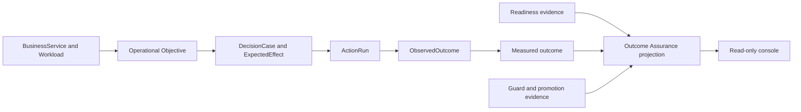

# Outcome Assurance

Outcome Assurance는 FDAI를 자율 클라우드 운영 범위 밖으로 넓히지 않으면서 준비도,
성과 정렬, 통제된 확장이라는 전환 프레임을 적용합니다. Resilience, Change Safety,
Cost Governance의 기존 운영 목표, 액션, 결과, 준비도 보고서, guard evidence를 하나의
읽기 전용 projection으로 구성합니다.

> **범위:** 이 설계는 FDAI 컨트롤 플레인 준비도와 측정된 클라우드 운영 성과를
> 다룹니다. 인력 관리, 교육, CRM, 전사 포트폴리오 관리, 공급업체 평가 또는 범용
> transformation platform은 추가하지 않습니다.

> **계약 위치:** `OutcomeAssuranceProjection`은 read model이며 새로운 ontology object나
> 결정 권한이 아닙니다. 기존 source가 계속 authority이며, 누락된 evidence는 unavailable로
> 유지됩니다.

Graph effect model promotion도 동일한 independent outcome discipline을 사용합니다. Immutable receipt는
frozen 및 live-shadow cohort, causal grade, error, rollback, recurrence, policy, invariant, cutoff 및
applicability evidence를 고정합니다. Lifecycle writer는 CAS 전에 model-derived sample 및 error field를
다시 bind합니다. Owner approval은 model active pointer만 선택할 수 있으며 ActionType을 promote하거나
execution을 authorize하거나 incomplete outcome을 relabel할 수 없습니다.

## 한눈에 보는 설계

FDAI는 서비스가 보호해야 할 목표, 검토한 액션, 실제 실행, 관측된 결과를 이미
기록합니다. Outcome Assurance는 이 사실을 세 가지 운영자 질문으로 연결합니다.

1. **운영 준비도:** FDAI가 이 scope를 관찰, 결정, 복구, 감사, 측정할 준비가 되었습니까?
2. **목표 정렬:** 각 FDAI workflow와 action은 어떤 운영 목표를 보호했고, 측정된 효과는
   그 목표를 개선했습니까?
3. **통제 보증:** 결과가 정책, 승인, 롤백, 승격 guardrail 안에 머물렀습니까?



## 범위 경계

이 프레임은 FDAI의 도메인 경계를 유지하면서 고객이 이해할 수 있는 언어를 사용합니다.

| 외부 프레임 | FDAI에서의 의미 | Evidence 예시 |
|-------------|------------------|---------------|
| AI readiness | 통제된 자율 클라우드 운영을 위한 준비도 | onboarding, telemetry, detection, rollback, audit, ownership, promotion gate |
| High-impact outcomes | FDAI workflow가 보호하는 운영 목표 | SLO, RTO/RPO, change safety, unit cost, human touchpoint |
| Governed, secure, scalable | 기존 컨트롤 플레인 안전 및 확장 계약 | policy escape, 승인 분리, impact scope, cell health, replay |

네 가지 성과 lens는 외부 시스템에 대한 권한을 주장하지 않으면서 프레임을 구체화합니다.

| Lens | FDAI 소유 해석 | 주요 측정값 |
|------|----------------|-------------|
| Operators | 운영 toil과 대기 감소 | 이벤트 100개당 human touchpoint, 승인 대기, 수동 rollback 수 |
| Service users | 서비스 영향 감소 | MTTR, SLO burn, 설정된 source가 있을 때 customer-impact duration |
| Operating process | 더 빠르고 안전한 운영 흐름 | change lead time, auto-resolution, change failure rate |
| Governed learning | 검증된 운영 지식 재사용 | candidate-to-promotion conversion, recurrence, pattern reuse |

콘솔은 이 label을 설명에만 사용합니다. FDAI는 클라우드 telemetry에서 직원 생산성,
고객 만족도, 매출 또는 혁신 가치를 추론하지 않습니다.

## 재사용하는 도메인 모델

`TransformationInitiative`, employee, customer 또는 enterprise portfolio object를 추가하지
않습니다. Projection은 기존 operating ontology를 따릅니다.

```text
BusinessCapability
  -> BusinessService / Workload
  -> ServiceObjective / RecoveryObjective / CostObjective / ArchitectureConstraint
  -> DecisionCase -> ActionOption -> ExpectedEffect
  -> ActionRun -> ObservedOutcome
```

Workflow와 ActionType identifier가 automation attribution을 제공합니다. Audit와 measurement
record가 실행 및 효과 evidence를 제공합니다. 배포별 service, workload, objective, ownership
mapping은 downstream configuration에 남습니다.

## Projection 계약

`OutcomeAssuranceProjection`은 하나의 scope, measurement window, 선택적 vertical에 대해
생성됩니다. Authority를 복사하지 않고 reference와 aggregate만 포함합니다.

| Field group | 필수 내용 | Source of truth |
|-------------|-----------|-----------------|
| `scope` | scope ref, service/workload ref, vertical | operating ontology projection |
| `window` | 시작, 종료, scenario-set version | measurement run |
| `readiness` | facet state, evidence ref, freshness | onboarding, startup, operational, detection, promotion readiness |
| `alignment` | objective ref, workflow와 ActionType attribution, coverage | DecisionCase, audit, ontology link |
| `outcomes` | current, baseline, target, unit, sample size, confidence interval | measurement pipeline |
| `guards` | threshold, observed value, pass state, evidence ref | guard 및 promotion evaluation |
| `provenance` | source name, as-of time, synthetic flag | contributing projection |

### Evidence 상태

Projection은 하나의 maturity score 대신 제한된 상태 집합을 사용합니다.

| Axis | 상태 | 규칙 |
|------|------|------|
| Readiness facet | `unknown`, `blocked`, `observed`, `ready` | `ready`는 최신 evidence와 모든 필수 gate 통과가 필요합니다 |
| Objective attribution | `unattributed`, `partial`, `attributed` | finalized-event attribution coverage를 기준으로 합니다 |
| Outcome evidence | `not_connected`, `insufficient_sample`, `measured`, `regressed` | measurement-first evaluation을 따릅니다 |
| Control assurance | `unknown`, `blocked`, `attention`, `healthy` | policy escape가 하나라도 있으면 `blocked`입니다 |

전체 response는 네 axis를 별도로 보고합니다. Blocker를 숨길 수 있는 평균 score를 만들지
않습니다. Stale evidence는 해당 facet을 `unknown`으로 바꾸며, 이전 `ready` 상태를 이어받지
않습니다.

### 목표 attribution

성과 주장에 포함되는 모든 finalized action은 다음 chain을 resolve하는 것이 좋습니다.

```text
event_id -> decision_case_id -> protected_objective_ref
         -> action_type_id -> action_run_id -> observed_outcome_ref
         -> measurement observation
```

해결되지 않은 link는 unattributed event로 denominator에 남습니다. Projection은
`attributed_events`, `unattributed_events`, `coverage`를 보고하며 ActionType name이나 UI
category로 objective를 추정하지 않습니다.

## 준비도 facet

Outcome Assurance는 또 하나의 gate를 만들지 않고 기존 readiness owner를 조합합니다.

| Facet | 통과 evidence | Blocking 예시 |
|-------|---------------|---------------|
| Platform | 필수 resource와 role binding 관측 | state store, event bus, executor identity 누락 |
| Evidence | telemetry와 inventory source 연결 및 freshness 충족 | stale objective, unavailable telemetry, incomplete inventory |
| Detection | 필수 detection dimension ready | SLO 또는 detector evidence 누락, stale snapshot |
| Action safety | stop, rollback, impact scope, dry run, lock, idempotency, audit lifecycle | safeguard 또는 hard dependency 누락 |
| Operational handoff | 적용 가능한 readiness report가 clear | blocking policy, reliability, ownership, RBAC finding |
| Measurement | baseline과 treatment가 동일한 scenario set 사용 | synthetic source, missing baseline, insufficient sample |
| Promotion | ActionType별 gate 통과 | policy escape, guard regression, observation evidence gap |

Readiness는 scope별이며 시간 제한이 있습니다. Workload가 Change Safety에는 ready여도 Cost
Governance는 unavailable일 수 있습니다. 새 ActionType이 관찰 모드에 남아 있어도 전체
platform을 blocked로 표시하지 않습니다.

## 에이전트 소유권

고정된 15-agent pantheon은 현재 권한을 유지합니다. Projection service는 기계적인 reader이며
agent-owned object topic을 publish하지 않습니다.

| Agent | Outcome Assurance 책임 |
|-------|--------------------------|
| Huginn | 기존 topic을 통해 normalized event와 topology observation을 공급합니다 |
| Heimdall | 독립적인 operational effect와 detection readiness를 close합니다 |
| Njord | cost observation과 cost objective status를 공급합니다 |
| Forseti | decision context에 protected objective와 expected effect를 기록합니다 |
| Odin | Resilience, Change Safety, Cost Governance objective 사이 conflict를 중재합니다 |
| Thor와 Vidar | action과 rollback receipt를 공급합니다 |
| Var | 독립적인 human approval evidence를 공급합니다 |
| Saga | immutable audit와 replay reference를 공급합니다 |
| Muninn | time-consistent context와 case revision을 공급합니다 |
| Norns와 Mimir | candidate, pattern, promotion lifecycle evidence를 공급합니다 |
| Bragi | operator locale로 인용된 projection field를 설명하며 status를 변경하지 않습니다 |

## Operator API와 콘솔

Operator API는 선택적이고 인증된 read panel로 `GET /kpi/outcome-assurance`를 추가합니다. 주입된
projection source를 직접 query하며, 다른 HTTP panel route를 호출하거나 delivery layer에서
누락된 fact를 만들지 않습니다.

권장 query parameter는 `scope_ref`, `vertical`, `window`입니다. Response는 위 projection
group과 좁은 evidence link를 제공합니다. Interactive local과 deployed environment는 동일한
truth contract를 따릅니다. 연결되지 않은 measurement source는 demo value 대신
`not_connected`를 반환합니다.

콘솔은 현재 information architecture를 재사용합니다.

- **Overview:** Operational readiness, Objective alignment, Control assurance의 세 linked summary를 제공합니다.
- **Operating outcomes:** Objective별 baseline, treatment, attribution coverage, evidence record를 제공합니다.
- **Control assurance:** Readiness facet, failed guard, promotion status, approval evidence를 제공합니다.
- **Verticals:** 동일한 projection을 Resilience, Change Safety, Cost Governance로 filter합니다.

새 top-level transformation workspace는 추가하지 않습니다. 모든 value는 가장 좁은
readiness, objective, audit, incident, action, promotion route로 연결합니다. 누락된 값도
clickable 상태를 유지하고 어떤 source가 없는지 설명합니다.

## 측정 및 결정 규칙

성과 주장은 기존 measurement-first 계약을 따릅니다.

- Baseline과 treatment는 동일한 frozen scenario set과 window를 사용합니다.
- 각 metric은 unit, sample size, confidence interval, source time을 보고합니다.
- Retry와 corrected row는 이벤트별 최신 authoritative observation을 사용합니다.
- Success metric은 실패한 guard를 상쇄할 수 없습니다.
- Policy-violation escape는 정확히 0을 유지합니다.
- Synthetic example은 test와 mock에서만 허용되며 measured status를 만들 수 없습니다.

Odin은 arbitration을 위해 objective score input을 비교할 수 있지만 read projection은
business value를 rank하거나 결정을 변경하지 않습니다. Objective priority와 target value는
configuration이 설정합니다.

## 제공 순서

### OA0 - Projection 계약

- Typed read model, 제한된 evidence state, decoder test를 정의합니다.
- Authority object를 추가하지 않고 ontology ref와 measurement record를 재사용합니다.
- Unattributed event를 denominator에 고정합니다.

### OA1 - Authoritative source

- 실제 measurement, readiness, guard, attribution provider를 연결합니다.
- 해당 outcome path에서 synthetic interactive default를 제거합니다.
- Projection test로 freshness와 correction 동작을 검증합니다.

### OA2 - 읽기 전용 경험

- 인증된 read panel과 console summary를 추가합니다.
- Unavailable state를 포함한 objective 및 evidence drill-down을 추가합니다.
- 영문/한글 label과 local/deployed parity를 검증합니다.

### OA3 - Change Safety pilot

- Mapping된 service 또는 workload 하나와 frozen scenario set을 선택합니다.
- Change lead time과 human touchpoint를 baseline 대비 측정합니다.
- Change failure rate와 rollback rate가 baseline 이하이고 policy escape가 0이어야 합니다.

### OA4 - Vertical 확장

- MTTR과 recovery evidence가 독립적으로 close된 후 Resilience를 추가합니다.
- Realized savings와 unit-cost attribution이 authoritative한 후 Cost Governance를 추가합니다.
- Objective evidence가 불완전하면 cross-vertical arbitration을 human approval에 둡니다.

## 수락 기준

첫 production slice는 다음 조건을 만족하면 완료됩니다.

- 표시되는 모든 claim이 non-synthetic이며 authoritative evidence로 연결됩니다.
- Finalized pilot event의 95% 이상이 objective로 resolve되고 나머지도 표시됩니다.
- Readiness facet은 stale, missing, conflicting evidence에서 fail closed합니다.
- Baseline과 treatment가 scenario-set version을 공유하고 confidence interval을 보고합니다.
- Change failure rate와 rollback rate가 baseline을 초과하지 않습니다.
- Policy-violation escape가 0입니다.
- Console에 mutation path가 추가되지 않고 Bragi가 projected state를 변경할 수 없습니다.
- Replay가 동일 cutoff와 catalog version에 대해 동일 projection을 재구성합니다.

## 비목표

- 직원 skill, training 또는 workforce maturity 관리.
- CRM, NPS, revenue, product adoption 또는 customer-success analytics.
- 전사 AI initiative funding 또는 portfolio 관리.
- FDAI control 밖의 범용 compliance-framework 또는 vendor-risk 관리.
- 새 pantheon agent, role transfer 또는 두 번째 decision pipeline.
- Composite readiness 또는 transformation score.

## 관련 문서

| 알아볼 내용 | 읽을 문서 |
|-------------|-----------|
| KPI authority와 baseline 규칙 | [goals-and-metrics-ko.md](goals-and-metrics-ko.md) |
| 기존 objective와 outcome model | [operating-ontology-ko.md](operating-ontology-ko.md) |
| Action safety와 promotion 계약 | [action-ontology-ko.md](../decisioning/action-ontology-ko.md) |
| Dev-to-ops readiness evidence | [operational-readiness-ko.md](../operations/operational-readiness-ko.md) |
| Read-only console 경계 | [operator-console-ko.md](../interfaces/operator-console-ko.md) |
